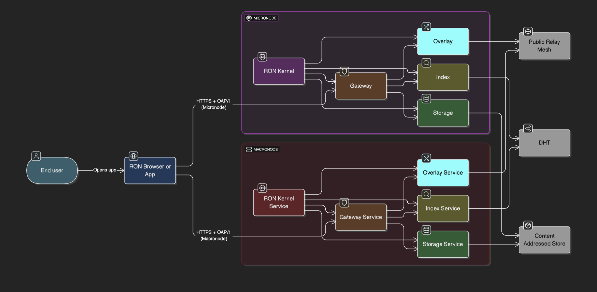
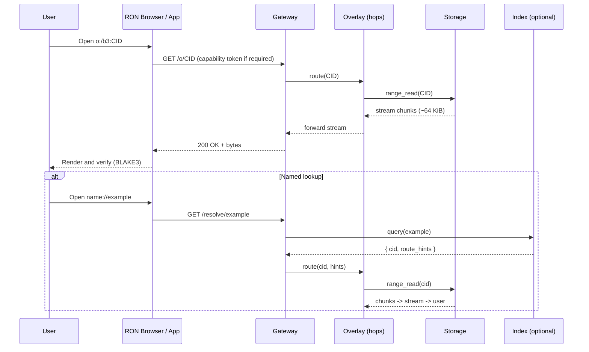

# RustyOnions
> A Decentralized Quantum Substrate 
> Active build phase; expect frequent changes. This is a highly ambitious, experimental Web3 runtime.  
> **Status (Oct 29, 2025):** Doing an IDB speed run build. We will build the core, test it, then refine it. I will fix the docs later, for up to date docs check the NOTES.md in each crate as we build. 

**The ron-kernel, ron-bus, ron-proto, ron-metrics, oap, ron-transport, ryker, ron-naming, svc-storage, svc-dht, svc-overlay, svc-index, ron-policy, omnigate, svc-gateway, ron-kms, svc-passport, and ron-auth crates have been built so far**
**svc-registry is next**

## RON-CORE (BETA) crate status & plan

Built (18/24):
- ron-kernel, ron-bus, ron-proto, ron-metrics, oap, ron-transport, ryker, svc-overlay, svc-dht, ron-naming, svc-storage, svc-index, ron-policy, omnigate, svc-gateway, ron-kms, svc-passport, ron-auth ✅ 

Remaining (6), execution order:
1) svc-dht ✅ 
2) ron-naming ✅
3) svc-storage ✅
4) svc-index ✅
5) ron-policy ✅
6) omnigate ✅
7) svc-gateway ✅ 
8) ron-kms ✅
9) ron-auth ✅
10) svc-passport ✅
11) ron-audit
12) svc-registry (in progress)
13) svc-edge
14) ron-app-sdk
15) micronode (partial build)
16) macronode

Rationale:
- Deliver end-to-end content flow early (DHT→Naming→Storage→Index→Gateway).
- Insert policy before ingress to keep default-deny from the start.
- Layer in identity & auth once read/write paths exist.
- Land audit/registry/edge for ops/perf polish; SDK last for DX.

Scope confirmation:
- Value-plane and deferred crates are OUT for RON-CORE: ron-ledger, ron-accounting, svc-wallet, svc-rewarder, svc-ads, svc-sandbox, svc-mod, svc-interop, svc-mailbox (not required).

Next immediate action:
- Finish **svc-registry**


Test the refactored ron-kernel! 

```bash
chmod +x crates/ron-kernel/scripts/ron_kernel_smoke.sh
crates/ron-kernel/scripts/ron_kernel_smoke.sh
```


RustyOnions is an experimental peer-to-peer platform built in Rust, designed to power a **decentralized, private, and fair internet**. It leverages a microkernel architecture and a two-plane design (public and private) to deliver scalable, privacy-first services with automatic micro-payments for creators, moderators, and operators. The project is in **active development** with a focus on robust TCP overlays, Tor integration, and scalable content distribution.

---

## 🌟 Microkernel Architecture

RustyOnions employs a lightweight microkernel (`ron-kernel`) that supervises isolated services, ensuring fault tolerance and modularity. Each service operates as an independent process, communicating via a process-local IPC bus (`ron-bus`) or a TCP+TLS overlay for distributed setups. The kernel remains minimal, handling supervision, configuration, metrics, and health checks without embedding application logic.

### Core Principles
- **Isolation:** Services (e.g., index, overlay, storage, mailbox) run as separate processes for security and reliability.
- **Bus-First IPC:** Local communication uses `ron-bus` (UDS + MessagePack); distributed services use TCP+TLS overlays.
- **Fault Tolerance:** The kernel monitors services, restarting them on failure and gating traffic via `/healthz` and `/readyz` endpoints.
- **Minimal Kernel:** The kernel focuses on supervision and metrics, leaving business logic to services.

# Visual: how RustyOnions runs (personas → nodes → services)

## Flowchart (Micronode vs Macronode):



## Sequence (GET by CID + optional name resolve):



 
Quick read:

* **Micronode** = one binary (gateway+overlay+index+storage) for devs/self-hosters.
* **Macronode** = the same roles as **separate services** for operators.
* Every service embeds the **microkernel** (health/readyz, bus, metrics), so ops behavior is identical across profiles.


---

## 🚀 Quick Start

### Prerequisites
- Rust (stable toolchain)
- macOS or Linux
- Optional: Tor for private-plane messaging, Docker/Podman for containerized deployments

### Build
```bash
cargo build --workspace
```

### Run Kernel + Services (Local Development)
```bash
RON_SVC_INDEX_BIN=target/debug/svc-index \
RON_SVC_OVERLAY_BIN=target/debug/svc-overlay \
RON_SVC_STORAGE_BIN=target/debug/svc-storage \
cargo run -p ron-kernel
```

### Run Gateway (Public Plane)
```bash
export RON_INDEX_SOCK=/tmp/ron/svc-index.sock
export RON_OVERLAY_SOCK=/tmp/ron/svc-overlay.sock
export RON_STORAGE_SOCK=/tmp/ron/svc-storage.sock
cargo run -p gateway -- --bind 127.0.0.1:54087 --enforce-payments true
```

### Run Public Micro-Node (Systemd)
```bash
sudo cp deploy/systemd/ron-public.service /etc/systemd/system/
sudo cp deploy/configs/config.public.toml /etc/ron/
sudo systemctl daemon-reload
sudo systemctl enable --now ron-public
```

Check health:
```bash
curl -sS http://localhost:9096/healthz
curl -sS http://localhost:9096/readyz
```

### Pin Content & Earn Rewards (MVP)
```bash
ronctl enroll --payout <ADDRESS>
ronctl pin tiles:world-zoom0-14-2025Q3
ronctl rewards receipt --epoch now --sign --submit
```

---

## 🔑 How It Works

RustyOnions splits operations into two planes:
- **Public Plane:** Handles content-addressed data (e.g., maps, media) with BLAKE3 verification and micro-payment routing.
- **Private Plane:** Provides end-to-end encrypted messaging over Tor (client/onion-only) for metadata protection.

### Key Features
- **Manifest.toml Attribution:** Every content address includes a `Manifest.toml` file with metadata and payout addresses, enabling automatic micro-payments to creators, moderators, and operators.
- **Content Addressing:** Assets (e.g., images, videos, posts) are hashed with BLAKE3 to create unique identifiers like `<hash>.image` or `<hash>.post`.
- **Token Economy:**
  - **Earn Tokens:** Contribute bandwidth, publish content, provide compute services (`.ai`, `.gpu`), or moderate content (`.mod`).
  - **Spend Tokens:** Access services (e.g., `.map`, `.traffic`), visit `.web3` sites, or consume media, with payments split among stakeholders.
- **Privacy-First Ads:** Tag-based, privacy-preserving ads with no cookies or tracking. Advertisers cannot target/exclude specific sites, ensuring free speech. A two-token model (ROX/ROC) funds the network.

### Example Manifest.toml
```toml
[meta]
tld = "music"
hash = "deadbeef1234567890abcd"
created = "2025-08-25T12:34:56Z"

[payload]
file = "track.av1"
BLAKE3: = "abcd1234..."
size = 8234567

[options]
chunks = true
resolutions = ["480p", "720p", "1080p"]
license = "CC-BY-4.0"
```

---

## 🦀 Addressing Scheme

RustyOnions uses a unique **crab-based URI format**:
```
🦀://<hash>.<tld>
```
- `<hash>`: A cryptographic hash (BLAKE3) identifying the content.
- `<tld>`: A functional namespace (e.g., `.music`, `.passport`, `.web3`).

### Examples
- `🦀://a1b2c3d4e5f6g7h8i9j0.passport`: Identity/session manifest
- `🦀://deadbeefcafebabef00d1234.music`: Music or video stream
- `🦀://feedfeedfeedfeedfeed1234.blog`: Blog entry
- `🦀://1234567890abcdef12345678.news`: News article

**Alternatively:** **crab://**<hash>.<tld>

Every address resolves to a `Manifest.toml` for metadata and attribution.

---

## 🌐 Special-Purpose TLDs

RustyOnions organizes services and content into purpose-specific TLDs:
- **Data & Mapping:** `.map`, `.traffic`
- **Web & Identity:** `.web3`, `.passport`
- **Compute Services:** `.ai`, `.gpu`, `.cpu`
- **Media:** `.image`, `.video`, `.music`, `.musicvideo`
- **Creator Economy:** `.creator`, `.mod`, `.journalist`, `.blogger`
- **Information:** `.news`, `.blog`, `.article`, `.post`, `.comment`
- **Music Ecosystem:** `.radio`, `.playlist`
- **Transparency:** `.alg` (algorithm transparency)

---

## 🔒 Privacy & Messaging

### Privacy Modes
- **TorStrict (Default):** End-to-end encrypted messaging over Tor (client/onion-only) for strong metadata protection. RustyOnions never runs Tor relays or exits.
- **RON-PM (Future):** Optional two-relay oblivious path with sealed-sender tokens, hiding sender IP from recipients without full Tor anonymity.

### Tor Policy
- Configured as `ClientOnly 1`, `ORPort 0`, `ExitPolicy reject *:*`.
- Optional onion services expose only your mailbox, not a relay.
- Firewalls and defaults prevent relay/dir port exposure.

See `docs/tor_policy.md` and `docs/private_messaging.md` for details.

---

## 📈 Scaling

- **Single Host:** Multiple storage processes, sharded pinsets, periodic BLAKE3 scrubs.
- **Small Cluster (2–10 Nodes):** L4 TCP load balancer to stateless gateways and storage pools, replicating signed bundles.
- **Future:** DHT provider discovery, consistent hashing, sharding, and optional erasure coding.

See `docs/scaling.md` and `deploy/alerts/rustyonions.yaml` for Prometheus alerts and SLOs.

---

## 🧪 Current Status (Sep 3, 2025)

- **Public Plane:** Stable TCP+TLS overlay with GET streaming, quotas, and Prometheus metrics (`/metrics`, `/healthz`, `/readyz`).
- **Private Plane:** Tor client/onion-only integration with mailbox MVP.
- **Testing:** `test_tcp.sh` validates local overlays; `test_tor.sh` confirms Tor bootstrap.
- **Roadmap:** DHT discovery, sharding, RON-PM relays, challenge-based rewards.

---

## 🧪 Test Scripts

### Local TCP Overlay
```bash
chmod +x testing/test_tcp.sh
./testing/test_tcp.sh
```

### Tor Bootstrap Smoke Test
```bash
chmod +x testing/test_tor.sh
./testing/test_tor.sh
# Optional: KEEP_TOR=1, AUTO_PORTS=1, TOR_BRIDGES=...
```

---

## 🦀 Node Usage (Work in Progress)

Run overlay (public plane):
```bash
RUST_LOG=info cargo run -p node -- serve --transport tcp
```

Run Tor client (private plane):
```bash
RUST_LOG=info cargo run -p node -- serve --transport tor
```

---

## 💰 Rewards System (MVP)

Earn rewards by pinning content or serving traffic:
```bash
ronctl enroll --payout <ADDRESS>
ronctl pin tiles:world-zoom0-14-2025Q3
ronctl rewards receipt --epoch now --sign --submit
```

Future: Randomized chunk challenges, Merkle proofs, and ROX/ROC settlement.

See `docs/rewards.md`.

---

## 🔮 Future Features: Mesh Micronodes & Open-Source Dev Royalty

Ultra-lightweight nodes for local mesh networks, offline handoffs, and disaster recovery. Micronodes will maintain the same manifest and attribution model with minimal resource usage (research phase).

Exploring a 5% royalty stub system to automatically route fair, transparent token payouts to open-source developers whose work powers deployed applications.

---

## 🤝 Contributing

We welcome bug reports, pull requests, and testing feedback. Key areas:
- Public-plane robustness
- Metrics standardization
- Tor client/onion runbooks
- RON-PM prototype development

---

## ⚖️ Legal & Safety Guidelines

- **No illegal content**
- **No pornography, gore, or nudity**
- **Tor usage is client/onion-only; no relays or exits**
- **Bandwidth sharing applies only to RustyOnions traffic**
- **Privacy ≠ impunity**

---

## 📜 License

MIT — see `LICENSE`.

---

## 🙌 Credits

Created by **Stevan White** with assistance from **OpenAI’s ChatGPT** and **xAI’s Grok**. Code and scripts are tailored to RustyOnions’ vision.
.