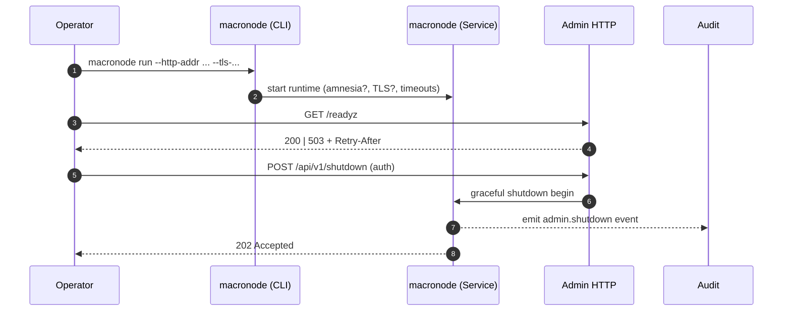

# 📖 API.md — Macronode

---

title: API Surface & SemVer Reference (macronode)
status: draft
msrv: 1.80.0
last-updated: 2025-09-22
audience: contributors, auditors, API consumers
crate-type: service (bin)
alignment:

* 12\_PILLARS.MD (Observability, Governance, Security, Reliability)
* SIX\_CONCERNS.MD (RES, PERF, GOV emphasis)
* MICROKERNEL\_BLUEPRINT.MD (axum 0.7; /metrics|/healthz|/readyz invariants)
* HARDENING\_BLUEPRINT.MD (TLS via rustls; least-privilege; amnesia)
* SCALING\_BLUEPRINT.MD (SLOs; backpressure; shedding)
* FULL\_PROJECT\_BLUEPRINT.MD (SemVer discipline; CI gates; no drift)

---

## 0. Purpose

Macronode is a **service crate (binary)**. This doc is the **spec** for its externally consumable interfaces:

* **Rust library surface**: intentionally **none** (service ≠ SDK).
* **CLI surface**: operator-facing controls.
* **HTTP admin/observability surface**: `/version`, `/healthz`, `/readyz`, `/metrics`, plus optional admin endpoints.
* **SemVer rules & CI gates**: exact expectations for change safety.

---

## 1. Rust Public API Surface

Service crates do **not** expose a stable Rust API. Any public items are accidental.

**CI guard**

```bash
cargo public-api --simplified --deny-changes
```

**Expected output**

```text
# (no public items)
```

If symbols appear, make them non-public or document/stabilize them here + CHANGELOG.

---

## 2. CLI (Operator Surface)

**Binary**: `macronode`

### 2.1 Commands

* `macronode run`

  * Starts the service.
  * Flags:

    * `--config <PATH>` (env `RON_CONFIG`): config file (TOML/JSON). Secrets redacted on print.
    * `--http-addr <ADDR>` (env `RON_HTTP_ADDR`, default `127.0.0.1:8080`): admin bind.
    * `--metrics-addr <ADDR>` (env `RON_METRICS_ADDR`, optional): separate metrics bind; defaults to `--http-addr` if unset.
    * `--log-level <LEVEL>` (env `RON_LOG`, default `info`): `error|warn|info|debug|trace`.
    * `--amnesia` (env `RON_AMNESIA=1`): RAM-first, minimal persistence; may disable state-leaky endpoints.
    * `--no-tls`: disable TLS on admin port (dev only).
    * `--tls-cert <PATH> --tls-key <PATH>`: rustls materials for TLS.
    * `--graceful-timeout <SECS>` (default `20`): shutdown grace.
* `macronode version`: prints semver, git SHA, build ts, rustc, msrv, api versions.
* `macronode check`: validates config and environment (ports, perms, time, entropy).
* `macronode config print`: prints effective config after env/CLI overlays (secrets redacted).
* `macronode config validate <PATH>`: validate config without starting.
* `macronode doctor`: runs diagnostics (fs/dns/time drift/ports).

### 2.2 Flags quick reference

| Flag                 | Env Var            | Default              | Description                      |
| -------------------- | ------------------ | -------------------- | -------------------------------- |
| `--config`           | `RON_CONFIG`       | *none*               | Path to config (TOML/JSON).      |
| `--http-addr`        | `RON_HTTP_ADDR`    | `127.0.0.1:8080`     | Admin HTTP bind.                 |
| `--metrics-addr`     | `RON_METRICS_ADDR` | *inherits http-addr* | Separate Prometheus bind if set. |
| `--log-level`        | `RON_LOG`          | `info`               | Log verbosity.                   |
| `--amnesia`          | `RON_AMNESIA`      | `off`                | Enable amnesia mode.             |
| `--no-tls`           | *n/a*              | `false`              | Disable TLS (dev only).          |
| `--tls-cert`         | *n/a*              | *none*               | TLS certificate path.            |
| `--tls-key`          | *n/a*              | *none*               | TLS private key path.            |
| `--graceful-timeout` | *n/a*              | `20`                 | Shutdown grace in seconds.       |

> **CLI SemVer:** adding new flags/subcommands = **minor**; removing/renaming or changing defaults/exit-codes = **major**.

---

## 3. HTTP Admin/Observability API

**Addr**: `--http-addr` (default `127.0.0.1:8080`)
**Proto**: HTTP/1.1 + HTTP/2; prefer TLS (rustls).
**Auth**: default loopback only; **mTLS or bearer** required for non-loopback.
**CORS**: **disabled** (no browser exposure).
**Media**: `application/json; charset=utf-8`, Prometheus text for `/metrics`.

### 3.1 Canon Endpoints (required)

* `GET /version` → **200 OK**

  ```json
  {
    "service": "macronode",
    "version": "X.Y.Z",
    "git_sha": "abcdef1234",
    "build_ts": "2025-09-22T01:23:45Z",
    "rustc": "1.80.0",
    "msrv": "1.80.0",
    "api": { "http": "v1" }
  }
  ```

* `GET /healthz` (liveness) → **200 OK**

  ```json
  { "ok": true, "checks": { "event_loop": "ok", "clock": "ok" } }
  ```

* `GET /readyz` (readiness)

  * **200 OK**

    ```json
    { "ready": true, "deps": { "config": "loaded", "network": "ok", "storage": "ok" } }
    ```
  * **503 Service Unavailable** with **`Retry-After: <seconds>`** when not ready.

* `GET /metrics` (Prometheus text) → **200 OK**

### 3.2 Optional Admin Endpoints (feature-gated, auth-required)

* `GET /api/v1/status` → snapshot (uptime, build, resources, features, warnings)
* `POST /api/v1/reload` → **202 Accepted** (config reload)
* `POST /api/v1/shutdown` → **202 Accepted** (graceful stop)

**Audit invariant:** Mutating admin endpoints **MUST** emit `ron-audit` events:

```json
{
  "type": "admin.shutdown",
  "actor": "cli|token-subject",
  "reason": "maintenance window",
  "request_id": "abcd-1234",
  "instance": "macronode@host",
  "ts": "2025-09-22T01:23:45Z"
}
```

### 3.3 Errors (RFC 7807)

All 4xx/5xx use `application/problem+json`.

### 3.4 Timeouts & Backpressure

* **Server defaults**: read `10s`, write `10s`, idle `60s` (configurable; see CONFIG.md).
* **Backpressure**: when queue-depth or CPU pressure crosses thresholds, shed with:

  * **`429 Too Many Requests`** + `Retry-After` for rate limits.
  * **`503 Service Unavailable`** + `Retry-After` for dependency/readiness failures.
* **SLO hints**: see §7.

---

## 4. Metrics Contract (baseline & stability)

**Baseline series** (names are stable once released):

* `admin_http_requests_total{method,endpoint,code}` (counter)
* `admin_http_request_duration_seconds{method,endpoint}` (histogram)
* `process_uptime_seconds` (gauge)
* `service_restarts_total` (counter)
* `ready_state` (gauge: 0/1)
* `build_info{version,git_sha,rustc}` (gauge=1)

**Deprecation policy**

* Mark deprecated metrics in release notes.
* Keep **two minor versions**; emit both old/new in parallel.
* Remove only on next **major** or after deprecation window with clear migration notes.

---

## 5. SemVer Discipline

We track **two** public surfaces:

1. **CLI**

   * **Minor**: add flags/subcommands; add optional fields in machine-readable outputs.
   * **Major**: remove/rename flags; change default behaviors; change exit codes.

2. **HTTP (/api/v1)**

   * **Minor**: add endpoints/fields; add optional query params; add metrics.
   * **Major**: remove/rename endpoints or fields; change types/auth; change status semantics; rename metrics.

**Breaking changes** require:

* macronode **major** bump, and
* a new HTTP namespace (e.g., `/api/v2/...`) for HTTP changes.

---

## 6. Security & Hardening (API-adjacent)

* Default bind is **loopback**; non-loopback requires **mTLS** or **Bearer** with RBAC.
* TLS via rustls; reject weak ciphers; document cert/key paths.
* **No secrets** in `/status` or `/metrics`; redact config.
* Echo/propagate **`X-Request-Id`** for traceability.
* **Amnesia mode**: may **disable** or restrict state-revealing endpoints.
* **Forbidden**: exposing admin endpoints through public CORS; Node.js runtime dependencies on the admin plane.

---

## 7. SLOs (targets & budgets)

These SLOs guide design and CI perf gates. Breaches consume error budget.

| Endpoint         | Availability (30-day) | p90 Latency | p99 Latency | Notes                   |
| ---------------- | --------------------: | ----------: | ----------: | ----------------------- |
| `/healthz`       |                99.99% |       ≤ 5ms |      ≤ 20ms | in-process checks only  |
| `/readyz`        |                99.95% |      ≤ 10ms |      ≤ 50ms | dependency probes ok    |
| `/version`       |                99.99% |       ≤ 5ms |      ≤ 20ms | static                  |
| `/metrics`       |                99.95% |     ≤ 100ms |     ≤ 250ms | scrape window awareness |
| `/api/v1/status` |                 99.9% |      ≤ 50ms |     ≤ 200ms | optional                |

Backpressure must maintain **p99** within bounds by shedding (`429/503 + Retry-After`).

---

## 8. Tooling

* `cargo public-api --simplified --deny-changes` (prevent Rust API leaks)
* `cargo doc` (internal docs)
* **OpenAPI** at `/docs/openapi/macronode.v1.yaml` (lint with `spectral`)
* **Snapshots** at `/docs/api-history/macronode/`:

  * `cli-vX.Y.Z.txt` (CLI help)
  * `http-vX.Y.Z.json` (endpoint/field list)
  * `metrics-vX.Y.Z.txt` (metric names)

---

## 9. CI & Gates

* Post PR comment with diffs:

  * `cargo public-api` result
  * `macronode --help` diff
  * OpenAPI diff (if present)
  * metrics name diff (deny unexpected removals/renames)
* Fail PR on **breaking** CLI/HTTP/metrics changes without:

  * SemVer bump,
  * path version bump (HTTP),
  * CHANGELOG migration notes.
* **Perf gate** (admin paths):

  * Warm run; load test `/healthz`, `/readyz`, `/metrics`
  * Ensure SLO thresholds (p90/p99) are met with a small CI load (e.g., 1–5 RPS for 60s).
* Smoke tests: `/version|/healthz|/readyz|/metrics` status + type.

---

## 10. OpenAPI (v1) — Minimal Stub

```yaml
openapi: 3.0.3
info:
  title: Macronode Admin API
  version: v1
paths:
  /version:
    get:
      summary: Service version
      responses:
        '200':
          description: ok
          content:
            application/json:
              schema:
                type: object
                properties:
                  service: { type: string }
                  version: { type: string }
                  git_sha: { type: string }
                  build_ts: { type: string, format: date-time }
                  rustc: { type: string }
                  msrv: { type: string }
                  api:
                    type: object
                    properties:
                      http: { type: string }
  /healthz:
    get:
      summary: Liveness
      responses: { '200': { description: ok } }
  /readyz:
    get:
      summary: Readiness
      responses:
        '200': { description: ready }
        '503':
          description: not ready
          headers:
            Retry-After:
              schema: { type: integer, format: int32, minimum: 1 }
  /metrics:
    get:
      summary: Prometheus metrics
      responses:
        '200':
          description: ok
          content:
            text/plain: {}
  /api/v1/status:
    get:
      summary: Node status
      responses: { '200': { description: ok } }
  /api/v1/reload:
    post:
      summary: Reload config
      responses: { '202': { description: accepted } }
  /api/v1/shutdown:
    post:
      summary: Graceful shutdown
      responses: { '202': { description: accepted } }
```

---

## 11. Examples

### CLI

```
macronode version
macronode check
macronode config print
macronode run --http-addr 127.0.0.1:8080 --log-level info --no-tls
```

### HTTP

```
curl -s http://127.0.0.1:8080/version | jq .
curl -s -o /dev/null -w "%{http_code}\n" http://127.0.0.1:8080/healthz
curl -i http://127.0.0.1:8080/readyz     # may return 503 + Retry-After
curl -s http://127.0.0.1:8080/metrics | head -n 20
```

---

## 12. Sequence (Mermaid)



---

## 13. Acceptance Checklist (DoD)

* [ ] `cargo public-api` shows **no** public Rust surface (or documented rationale).
* [ ] CLI help captured → `/docs/api-history/macronode/cli-vX.Y.Z.txt`.
* [ ] HTTP snapshot captured → `/docs/api-history/macronode/http-vX.Y.Z.json`.
* [ ] Metrics snapshot captured → `/docs/api-history/macronode/metrics-vX.Y.Z.txt`.
* [ ] OpenAPI present → `/docs/openapi/macronode.v1.yaml` and lints clean.
* [ ] CHANGELOG updated for any surface changes.
* [ ] RUNBOOK & CONFIG updated (ports, auth, TLS, timeouts, amnesia).
* [ ] CI perf gate passes SLOs for admin endpoints.

---

## 14. History (Notable API Shifts)

* **v1.0.0** — Canon baseline: `/version`, `/healthz`, `/readyz`, `/metrics`. CLI: `run|version|check|config|doctor`. Optional `/api/v1/{status,reload,shutdown}` behind admin auth.
* *Add future entries here with dates, PRs, and migration notes.*

---

