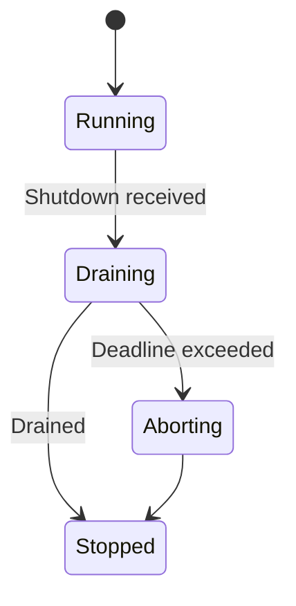
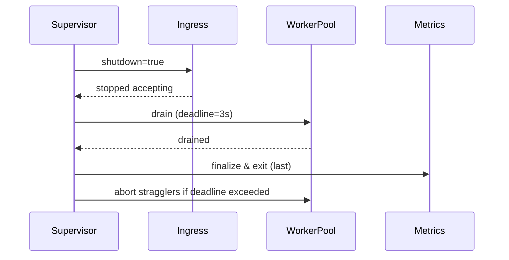

````markdown
---
title: Concurrency Model — macronode
crate: macronode
owner: Stevan White
last-reviewed: 2025-09-23
status: draft
template_version: 1.2
msrv: 1.80.0
tokio: "1.x (pinned at workspace root)"
loom: "0.7+ (dev-only)"
lite_mode: "N/A (service crate with background tasks)"
---

# Concurrency Model — macronode

This document makes the concurrency rules **explicit**: tasks, channels, locks, shutdown, timeouts,
and validation (property/loom/TLA+). It complements `docs/SECURITY.md`, `docs/CONFIG.md`,
and the crate’s `README.md`, `IDB.md`, and the **Concurrency & Aliasing Blueprint** and **Hardening Blueprint**.

> **Golden rule:** never hold a lock across `.await` in supervisory or hot paths.

---

## 0) Lite Mode (for tiny lib crates)

N/A — macronode is a supervising **service** crate with multiple background tasks.

---

## 1) Invariants (MUST)

- [x] **No lock across `.await`**. If unavoidable, split the critical section (derive values under guard, drop, then `.await`).
- [x] **Single writer** per mutable resource; readers use snapshots or short read guards.
- [x] **Bounded channels** only (mpsc/broadcast) with explicit overflow policy.
- [x] **Explicit timeouts** on all I/O and RPCs; fail-fast with typed errors.
- [x] **Cooperative cancellation**: every `.await` is cancel-safe or guarded by `select!`.
- [x] **Graceful shutdown**: observe `KernelEvent::Shutdown`/watch signal; drain within deadline; abort stragglers.
- [x] **No blocking syscalls** on the async runtime; use `spawn_blocking` for CPU-heavy or blocking ops (fs, crypto).
- [x] **No task leaks**: track `JoinHandle` joins; detach only with rationale (e.g., best-effort telemetry).
- [x] **Backpressure over buffering**: drop/reject with metrics; never grow unbounded queues.
- [x] **Framing**: strict length-delimited framing on transport; handle split reads; cap allocations.
- [x] **Amnesia friendly**: caches are bounded/ephemeral; shutdown clears in-RAM state.
- [x] **Bytes discipline**: use `bytes::Bytes`/`BytesMut` for payloads; avoid unnecessary copies.

**Async Drop**
- [x] Do **not** block in `Drop`. For teardown, expose an **async `close()`/`shutdown()`** API and call it before the value is dropped. `Drop` should only release cheap, non-blocking resources.

---

## 2) Runtime Topology

**Runtime:** Tokio multi-threaded (default threads = `num_cpus`).  
**Supervision:** The macronode supervisor owns the control plane and spawns long-lived tasks. Panic restarts use jittered backoff with caps.

**Primary tasks (long-lived):**
- **Supervisor** — owns shutdown watch, spawns/monitors services, aggregates `JoinHandle` results, escalates on repeated crash loops.
- **ConfigWatcher** — observes config changes (paths/env); diffs, emits `KernelEvent::ConfigUpdated`.
- **MetricsServer** — HTTP endpoints `/metrics`, `/healthz`, `/readyz`; serves Prometheus scrape; exits **last**.
- **TransportIngress** — listener accepting connections; frames → bounded work queue.
- **OverlayHttp** — axum HTTP API; maps requests to worker pool; per-request deadlines; concurrency limits.
- **WorkerPool (N)** — processes framed messages/requests; owns per-connection state; CPU-heavy → `spawn_blocking`.
- **HealthReporter** — periodically reports `KernelEvent::Health { service, ok }`; updates readiness.

**Crash policy:** Exponential backoff with jitter (**100–500ms → cap 5s**) per task; on **>5** restarts in **60s**, mark service `Degraded`, surface in `/readyz`.

```mermaid
flowchart TB
  subgraph Runtime
    SUP[Supervisor] -->|spawn| IN[TransportIngress]
    SUP -->|spawn| OH[OverlayHttp]
    SUP -->|spawn| MET[MetricsServer]
    SUP -->|spawn| CFG[ConfigWatcher]
    SUP -->|spawn| HR[HealthReporter]
    IN -->|mpsc:work(512)| WP[WorkerPool]
    OH -->|mpsc:work(512)| WP
    SUP -->|watch:Shutdown| IN
    SUP -->|watch:Shutdown| OH
    SUP -->|watch:Shutdown| WP
    SUP -->|watch:Shutdown| MET
    SUP -->|watch:Shutdown| CFG
  end
  WP -->|results/metrics| MET
  style SUP fill:#0ea5e9,stroke:#0c4a6e,color:#fff
````

**Accessibility text:** Supervisor spawns TransportIngress, OverlayHttp, MetricsServer, ConfigWatcher, HealthReporter, and a WorkerPool. Ingress & Overlay feed a bounded mpsc work queue into the WorkerPool. All tasks subscribe to a shutdown watch.

---

## 3) Channels & Backpressure

**Inventory (all bounded):**

| Name          | Kind        | Capacity | Producers → Consumers | Backpressure Policy           | Drop Semantics                                     |
| ------------- | ----------- | -------: | --------------------- | ----------------------------- | -------------------------------------------------- |
| `bus`         | broadcast   |     1024 | 1 → N                 | lag counter + drop oldest     | inc `bus_lagged_total`; warn with service label    |
| `work`        | mpsc        |      512 | N → M                 | `try_send` → `Busy`           | return 429/`Busy`; inc `busy_rejections_total`     |
| `shutdown`    | watch<bool> |        1 | 1 → N                 | last-write-wins               | N/A                                                |
| `cfg_updates` | mpsc        |       64 | 1 → 1                 | `try_send` or coalesce        | coalesce to newest; count `config_coalesced_total` |
| `telemetry`   | mpsc        |      512 | N → 1                 | best-effort; shed on overflow | drop-oldest; inc `queue_dropped_total{telemetry}`  |

**Guidelines**

* Prefer `try_send` + explicit error over buffering.
* Expose `queue_depth{queue}` gauges; count `queue_dropped_total{queue}`.
* Broadcast receivers must handle `Lagged(n)` by reconciling with a **snapshot pull** (see §11 pattern).

---

## 4) Locks & Shared State

**Allowed**

* Short-lived `Mutex`/`RwLock` for metadata (no `.await` under guard).
* Read-mostly snapshots via `Arc<StateSnapshot>` (rebuild on change; atomic swap).
* Per-connection state **owned by its task**; cross-task via channels.

**Forbidden**

* Holding locks across `.await`.
* Nested locks without documented hierarchy.
* Long-held global locks (favor sharding or message passing).

**Hierarchy**

1. `state_meta` (light config/runtime toggles)
2. `routing_table` / `session_index` (sharded if hot)
3. `counters` (atomics preferred)

---

## 5) Timeouts, Retries, Deadlines

* **I/O defaults:** `read=5s`, `write=5s`, `idle=60s` (configurable).
* **HTTP (Overlay):** per-request **total deadline** (e.g., `2s`); soft timeout for handler body; hard timeout at middleware; per-endpoint concurrency limits.
* **Retries:** idempotent ops only; jittered backoff **50–100ms → cap 2s**; **max 3 tries**; always respect caller deadline.
* **Circuit breaker (optional):** open on rolling error-rate; half-open probes after cool-down.

```mermaid
sequenceDiagram
  autonumber
  participant Caller
  participant M as macronode
  Caller->>M: Request (deadline=2s)
  M-->>Caller: 202 Accepted or Result
  Note over M: On backpressure → Busy<br/>On timeout → typed error
```

---

## 6) Cancellation & Shutdown

* **Signal Sources:** `KernelEvent::Shutdown` on the bus, plus a local `watch<bool>` (true = shutting down).
* **Propagation:** All long-lived tasks run `tokio::select!` on `shutdown.changed()` alongside their main work.
* **Draining:** Stop intake (close listeners / stop accepting HTTP); flush in-flight within `drain_deadline` (default **3s**, max **5s**).
* **Abort:** Tasks exceeding deadline are aborted (`handle.abort()`); increment `tasks_aborted_total{kind}`; log with service name.
* **Order:**

  1. Supervisor flips `shutdown=true`.
  2. Ingress stops accepting; Overlay returns `503 Busy` for new work.
  3. WorkerPool drains queues.
  4. MetricsServer remains up until last to expose shutdown health.
  5. Supervisor aborts stragglers after deadline.



---

## 7) I/O & Framing

* **TransportIngress:** length-prefix framing; **max\_frame\_bytes = 1 MiB** (configurable). Validate length before allocation; handle partial reads; call `.shutdown().await` on streams.
* **OverlayHttp:** HTTP/1.1 & HTTP/2 via axum; request body limit (default **4 MiB**); per-IP accept rate limits; per-route concurrency limits.
* **Decompression guard:** max expansion ratio **≤ 10:1** (reject on exceed).
* **TLS:** rustls-based acceptor (if enabled) — handshake timeout **2s**.

---

## 8) Error Taxonomy (Concurrency-Relevant)

| Error         | When                               | Retry?    | Metric                            | Notes                           |
| ------------- | ---------------------------------- | --------- | --------------------------------- | ------------------------------- |
| `Busy`        | queue full                         | maybe     | `busy_rejections_total{endpoint}` | caller-visible; backoff advised |
| `Timeout`     | deadline exceeded                  | sometimes | `io_timeouts_total{op}`           | attach `op` & deadline          |
| `Canceled`    | shutdown/cancel                    | no        | `tasks_canceled_total{kind}`      | cooperative exit                |
| `Lagging`     | broadcast overflow                 | no        | `bus_lagged_total{service}`       | slow consumer                   |
| `BrokenPipe`  | peer closed during write           | maybe     | `io_errors_total{op="write"}`     | treat as normal churn           |
| `Degraded`    | restart threshold exceeded         | no        | `service_restarts_total{service}` | reflected in `/readyz`          |
| `OpenCircuit` | circuit breaker opened on endpoint | maybe     | `circuit_open_total{endpoint}`    | fail-fast until half-open       |

---

## 9) Metrics (Concurrency Health)

* `queue_depth{queue}` gauge (sampled)
* `queue_dropped_total{queue}` counter
* `tasks_spawned_total{kind}` / `tasks_aborted_total{kind}` / `tasks_completed_total{kind}`
* `io_timeouts_total{op}` (`read`,`write`,`connect`,`handshake`)
* `backoff_retries_total{op}`
* `busy_rejections_total{endpoint}`
* `service_restarts_total{service}`
* `request_latency_seconds{endpoint,method}` (histogram)
* `readyz_state{service}` (0/1/2 = unready/degraded/ready)
* `ready_dependency_unmet{dep}` (gauge)
* `semaphore_inflight{facet}` (gauge)
* `facet_busy_total{facet}` / `facet_deadline_timeouts_total{facet}` (counters)

---

## 10) Validation Strategy

**Unit / Property**

* Backpressure behavior (drop vs reject) is deterministic under load.
* Deadlines honored within tolerance; handlers return timeout deterministically.
* Lock discipline: optional runtime asserts to detect `.await` while holding a lock (debug builds).

**Loom**

* Model producer → bounded queue → consumer with shutdown.
* Assert: no deadlocks, no missed shutdown wakeups, no double-drop.

**Fuzz**

* Frame/decoder fuzz (malformed, boundary sizes, truncated frames).

**Chaos**

* Periodically kill/restart workers under load; `/readyz` reflects Degraded → Ready transitions; drains respect deadlines.

**TLA+ (targeted)**

* Specify readiness DAG & shutdown drain ordering; prove safety (no stuck state) & liveness (eventual drain).

**Miri / TSan**

* Run unit/property tests under Miri; critical paths under ThreadSanitizer.

---

## 11) Code Patterns (Copy-Paste)

**Spawn + cooperative shutdown**

```rust
let (shutdown_tx, mut shutdown_rx) = tokio::sync::watch::channel(false);

let worker = tokio::spawn({
  let mut rx = work_rx;
  async move {
    loop {
      tokio::select! {
        _ = shutdown_rx.changed() => break,
        maybe_job = rx.recv() => {
          let Some(job) = maybe_job else { break };
          if let Err(e) = handle_job(job).await {
            tracing::warn!(error=%e, "job failed");
          }
        }
      }
    }
  }
});

// initiate shutdown
let _ = shutdown_tx.send(true);
let _ = worker.await;
```

**Bounded mpsc with `try_send`**

```rust
match work_tx.try_send(job) {
  Ok(()) => {}
  Err(tokio::sync::mpsc::error::TrySendError::Full(_)) => {
    metrics::busy_rejections_total().inc();
    return Err(Error::Busy);
  }
  Err(e) => return Err(Error::from(e)),
}
```

**Timeout with deadline**

```rust
let res = tokio::time::timeout(cfg.read_timeout, read_frame(&mut stream)).await;
```

**Async Drop pattern**

```rust
pub struct Client { inner: Option<Conn> }

impl Client {
  pub async fn close(&mut self) -> anyhow::Result<()> {
    if let Some(mut conn) = self.inner.take() {
      conn.shutdown().await?;
    }
    Ok(())
  }
}

impl Drop for Client {
  fn drop(&mut self) {
    if self.inner.is_some() {
      tracing::debug!("Client dropped without close(); resources will be reclaimed");
    }
  }
}
```

**No lock across `.await`**

```rust
let value = {
  let g = state.lock();
  g.derive_value()
}; // guard dropped
do_async(value).await;
```

**Broadcast bus (lag-aware subscriber + snapshot reconcile)**

```rust
let mut rx = bus.subscribe();
loop {
  tokio::select! {
    _ = shutdown_rx.changed() => break,
    msg = rx.recv() => match msg {
      Ok(ev) => handle_event(ev).await,
      Err(tokio::sync::broadcast::error::RecvError::Lagged(n)) => {
        metrics::bus_lagged_total().inc_by(n as u64);
        tracing::warn!(lagged=n, "bus receiver lagged; reconciling snapshot");
        if let Err(e) = reconcile_from_snapshot().await {
          tracing::warn!(error=%e, "snapshot reconcile failed after lag");
        }
      }
      Err(tokio::sync::broadcast::error::RecvError::Closed) => break,
    }
  }
}
```

**Facet semaphore (bounded fanout)**

```rust
// Non-blocking acquire to enforce backpressure:
if let Ok(_permit) = facet_sem.try_acquire_many(units) {
    // proceed quickly
} else {
    metrics::facet_busy_total("search").inc();
    return Err(Error::Busy);
}
```

---

## 12) Configuration Hooks (Quick Reference)

* `max_conns`, `read_timeout`, `write_timeout`, `idle_timeout`
* Channel capacities: `work`, `telemetry`, `bus`
* `drain_deadline` (shutdown grace)
* Retry/backoff window (initial, cap, max\_tries)
* HTTP: per-endpoint deadlines, body size/concurrency limits
* I/O: `max_frame_bytes`, decompression ratio cap, handshake timeout
* Facets: semaphore sizes per facet (Feed/Graph/Search/Index/Mailbox)

See `docs/CONFIG.md` for authoritative schema.

---

## 13) Known Trade-offs / Nonstrict Areas

* **Drop-oldest vs reject-new:** For telemetry, drop-oldest is acceptable (best-effort). For `work`, prefer **reject-new (Busy)** to preserve tail latency and bounded memory.
* **Broadcast lag:** Slow consumers may miss intermediate `Health` events; they must reconcile periodically (pull current snapshot) rather than assume perfect continuity.
* **Spawn vs inline:** Very small, CPU-light handlers run inline to avoid context-switch overhead; heavier tasks use `spawn_blocking`.
* **Facet fanout:** Feed/Search can explode work; bounded semaphores intentionally cap throughput to protect latency SLOs.

---

## 14) Mermaid Diagrams (REQUIRED)

### 14.1 Task & Queue Topology

```mermaid
flowchart LR
  IN[Ingress Listener] -->|mpsc:work(512)| W1[Worker A]
  IN -->|mpsc:work(512)| W2[Worker B]
  OH[Overlay HTTP] -->|mpsc:work(512)| W1
  OH -->|mpsc:work(512)| W2
  subgraph Control
    SHUT[Shutdown watch] --> IN
    SHUT --> OH
    SHUT --> W1
    SHUT --> W2
  end
```

**Text:** Ingress and HTTP feed two workers via a bounded mpsc(512); a Shutdown watch notifies all components.

### 14.2 Shutdown Sequence



---

## 15) CI & Lints (Enforcement)

**Clippy lints**

* `-D clippy::await_holding_lock`
* `-D clippy::needless_collect`
* `-D clippy::useless_async`
* `-D warnings`

**GitHub Actions sketch**

```yaml
name: concurrency-guardrails
on: [push, pull_request]
jobs:
  clippy:
    runs-on: ubuntu-latest
    steps:
      - uses: actions/checkout@v4
      - uses: dtolnay/rust-toolchain@stable
      - run: cargo clippy -p macronode -- -D warnings -W clippy::await_holding_lock

  loom:
    if: github.event_name == 'pull_request'
    runs-on: ubuntu-latest
    steps:
      - uses: actions/checkout@v4
      - uses: dtolnay/rust-toolchain@stable
      - run: RUSTFLAGS="--cfg loom" cargo test -p macronode --tests -- --ignored

  fuzz:
    runs-on: ubuntu-latest
    steps:
      - uses: actions/checkout@v4
      - uses: dtolnay/rust-toolchain@stable
      - run: cargo install cargo-fuzz
      - run: cargo fuzz build -p macronode

  miri:
    runs-on: ubuntu-latest
    steps:
      - uses: actions/checkout@v4
      - uses: dtolnay/rust-toolchain@nightly
      - run: cargo +nightly miri test -p macronode

  tsan:
    runs-on: ubuntu-latest
    steps:
      - uses: actions/checkout@v4
      - uses: dtolnay/rust-toolchain@nightly
      - env:
          RUSTFLAGS: "-Zsanitizer=thread"
      - run: cargo +nightly test -Zsanitizer=thread -p macronode

  coverage:
    runs-on: ubuntu-latest
    steps:
      - uses: actions/checkout@v4
      - uses: taiki-e/install-action@cargo-llvm-cov
      - run: cargo llvm-cov --workspace --lcov --output-path lcov.info
```

---

## 16) Schema Generation (Optional, Nice-to-Have)

Automate **Channels/Locks tables** from code to avoid rot:

* Annotate channels/locks with macros or attributes, e.g.:

  ```rust
  #[doc_channel(name="work", kind="mpsc", cap=512, policy="try_send")]
  let (tx, rx) = tokio::sync::mpsc::channel(512);
  ```
* A small **proc-macro** or a **build script** (`build.rs`) can emit `docs/_generated/concurrency.mdfrag` which you include via md-include.
* Alternatively, keep a `concurrency_registry.rs` and unit-test that the doc table matches registry entries (golden test).

---

## 17) Review & Maintenance

* **Review cadence:** every 90 days or on any change to tasks/channels/locks.
* Keep `owner`, `msrv`, `last-reviewed` current.
* **PR checklist:** if you modify concurrency, update this file + Loom/property tests.

---

## 18) Acceptance Gates (CI-enforced)

**Shutdown SLO**

* [ ] p95 graceful drain ≤ **3s**; p99 ≤ **5s** under steady load (chaos test `chaos_drain_smoketest`).

**Deadlines**

* [ ] p99 request total deadline respected within ±100ms across all HTTP endpoints.

**Backpressure**

* [ ] Under 2× sustained load, system returns `Busy` within **50ms** (no unbounded queuing).
* [ ] `queue_dropped_total{telemetry}` may increase; `queue_dropped_total{work}` MUST remain **0**.

**Loom coverage**

* [ ] Critical interleavings (producer/consumer/shutdown/broadcast lag) — **≥ 90%** branch coverage on loom cfg.

**Chaos**

* [ ] Kill/restart 10% of workers every 250ms for 10s while serving RPS N: `/readyz` transitions `Ready→Degraded→Ready` with 5xx ≤ **0.1%**.

**Miri / TSan**

* [ ] Miri passes on unit/property tests.
* [ ] ThreadSanitizer clean for `transport`, `overlay`, `supervisor`.

**Amnesia Mode**

* [ ] With `AMNESIA=1`, no persistent writes observed (fs spy), and all caches `zeroize` on shutdown (heap scan asserts zeroed buffers).

**PQ Hooks (if enabled)**

* [ ] Handshake deadline ≤ **2s**; no key material crosses task boundaries except via zeroizing types.

---

## 19) Facet-Aware Concurrency (macronode composition)

Macronode composes facets with distinct concurrency risk profiles. Guard each facet with bounded semaphores, explicit queues, and per-facet SLOs:

| Facet   | Hotspot             | Control                   | Default Cap | Notes                               |
| ------- | ------------------- | ------------------------- | ----------- | ----------------------------------- |
| Feed    | fan-out explosions  | `Semaphore(feed_fanout)`  | 4×CPU       | shed oldest fanouts beyond deadline |
| Graph   | neighbor expansion  | `Semaphore(graph_expand)` | 2×CPU       | degree pre-check to avoid N²        |
| Search  | query spikes        | `Semaphore(search_qps)`   | 4×CPU       | per-tenant token bucket             |
| Index   | write amplification | `Semaphore(index_ingest)` | CPU         | coalesce updates (mpsc 256)         |
| Mailbox | bursty fan-in/out   | `Semaphore(mailbox_ops)`  | 4×CPU       | cap per-tenant work queue           |

**Metrics**

* `semaphore_inflight{facet}` gauge
* `facet_busy_total{facet}` counter
* `facet_deadline_timeouts_total{facet}` counter

---

## 20) Amnesia & Post-Quantum (PQ) Invariants

* [ ] **Amnesia**: When `amnesia=ON`, background tasks MUST avoid disk I/O; all caches and key material implement `zeroize`.
* [ ] **Key lifetimes**: Limit in-memory key exposure; use `Arc<Secret>` with zeroize on final drop; forbid cloning into long-lived tasks.
* [ ] **Handshake deadlines**: PQ handshakes (if enabled) timeout at **2s**; partial handshakes are dropped with metrics.
* [ ] **No cross-task key aliasing**: pass opaque handles (capabilities) over channels, not raw key bytes.

**Tests**

* Amnesia fs-spy asserts 0 writes.
* Heap scanner confirms zeroized regions after shutdown.

---

## 21) Runtime Matrix (determinism & parity)

* **Multi-thread default** (prod): auto threads = CPU.
* **Single-thread track** (tests/micronode-parity): `--features single_thread_rt` runs long-lived tasks on current-thread runtime.

**CI**

* Run full test suite on both flavors.
* Compare latency histograms to ensure no starvation/regression.
