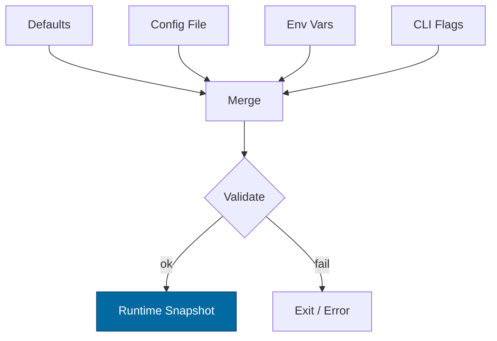

````markdown
---
title: Configuration — macronode
crate: macronode
owner: Stevan White
last-reviewed: 2025-09-23
status: draft
template_version: 1.1
---

# Configuration — macronode

This document defines **all configuration** for `macronode`, including sources,
precedence, schema (types/defaults), validation, feature flags, live-reload behavior,
and security implications. It complements `README.md`, `docs/SECURITY.md`, and the Pillar/Concern blueprints.

> **Profile note:**  
> `macronode` is a **composing host** for the canonical services (gateway, omnigate, index, storage, mailbox, overlay, DHT, etc.). It wires and supervises services **by configuration only**—no service logic lives here.

---

## 1) Sources & Precedence (Authoritative)

Configuration may come from multiple sources. **Precedence (highest wins):**

1. **Process flags** (CLI)  
2. **Environment variables**  
3. **Config file** (e.g., `Config.toml` beside the binary)  
4. **Built-in defaults** (hard-coded)

> When reloading dynamically, the effective config is recomputed under the same precedence.

**Supported file formats:** TOML (preferred), JSON (optional).  
**Path resolution order for `--config` (if relative):** `./`, `$CWD`, crate dir.

---

## 2) Quickstart Examples

### 2.1 Minimal profile start (gateway+omnigate+index+storage+mailbox)
```bash
RUST_LOG=info
MACRO_BIND_ADDR=0.0.0.0:9080
MACRO_METRICS_ADDR=127.0.0.1:9600
MACRO_SERVICES=svc-gateway,omnigate,svc-index,svc-storage,svc-mailbox,svc-overlay,svc-dht
cargo run -p macronode
````

### 2.2 Config file (TOML) — production-ish sketch

```toml
# Config.toml (macronode)
bind_addr     = "0.0.0.0:9080"
metrics_addr  = "127.0.0.1:9600"
max_conns     = 2048
read_timeout  = "5s"
write_timeout = "5s"
idle_timeout  = "60s"

[log]
format = "json"
level  = "info"

[limits]
max_body_bytes       = "1MiB"
decompress_ratio_cap = 10

[tls]
enabled   = false
# cert_path = "/etc/ron/cert.pem"
# key_path  = "/etc/ron/key.pem"

[security]
amnesia = false
pq_mode = "off"          # "off" | "hybrid"

# Which services macronode should supervise
[services]
enable = [
  "svc-gateway",
  "omnigate",
  "svc-index",
  "svc-storage",
  "svc-mailbox",
  "svc-overlay",
  "svc-dht",
  # "svc-edge",
  # "svc-registry",
  # "svc-sandbox", "svc-mod",
  # "svc-wallet", "svc-ledger", "svc-accounting", "svc-rewarder"
]

# Optional per-service config path overrides (if not embedded defaults)
[services.config_paths]
svc-gateway  = "/etc/ron/gateway.toml"
omnigate     = "/etc/ron/omnigate.toml"
svc-index    = "/etc/ron/index.toml"
svc-storage  = "/etc/ron/storage.toml"
svc-mailbox  = "/etc/ron/mailbox.toml"
svc-overlay  = "/etc/ron/overlay.toml"
svc-dht      = "/etc/ron/dht.toml"

# Facet-aware concurrency knobs (bounded semaphores, CPU-aware)
[facets.feed]
rank_permits       = "4xCPU"   # effective floor 2
fanout_permits     = "2xCPU"   # effective floor 2

[facets.graph]
neighbors_permits  = "2xCPU"
mutations_permits  = "1xCPU"

[facets.search]
query_permits      = "3xCPU"
ingest_permits     = "1xCPU"

[facets.media]
transcode_permits  = "1xCPU"
byte_range_chunk   = "64KiB"   # storage path chunk size

# Optional Unix Domain Socket control endpoint (admin-only)
[uds]
path       = ""
allow_uids = []

# Optional macaroon path for operator capabilities
[auth]
macaroon_path = ""

# ECON hooks (optional for deployments using rewards/ledger)
[economics]
accounting_flush_ms = 2000
rewarder_enabled    = false
```

### 2.3 CLI flags (override file/env)

```bash
cargo run -p macronode -- \
  --bind 0.0.0.0:9080 \
  --metrics 127.0.0.1:9600 \
  --services svc-gateway,omnigate,svc-index,svc-storage,svc-mailbox,svc-overlay,svc-dht \
  --max-conns 4096 \
  --log-format json --log-level info
```

---

## 3) Schema (Typed, With Defaults)

> **Prefix convention:** All env vars begin with `MACRO_` (e.g., `MACRO_BIND_ADDR`).
> **Durations** accept `s`, `ms`, `m`, `h`. **Sizes** accept `B`, `KB`, `MB`, `MiB`, `KiB`.

| Key / Env Var                                                | Type                 |       Default | Description                                  | Security Notes                            |
| ------------------------------------------------------------ | -------------------- | ------------: | -------------------------------------------- | ----------------------------------------- |
| `bind_addr` / `MACRO_BIND_ADDR`                              | socket               | `127.0.0.1:0` | Admin/ingress bind for macronode control     | Public binds require threat review        |
| `metrics_addr` / `MACRO_METRICS_ADDR`                        | socket               | `127.0.0.1:0` | Prometheus endpoint bind                     | Prefer localhost in prod; gateway scrapes |
| `max_conns` / `MACRO_MAX_CONNS`                              | u32                  |        `1024` | Max concurrent connections (admin plane)     | Prevents FD exhaustion                    |
| `read_timeout` / `MACRO_READ_TIMEOUT`                        | duration             |          `5s` | Per-request read timeout (admin plane)       | DoS mitigation                            |
| `write_timeout` / `MACRO_WRITE_TIMEOUT`                      | duration             |          `5s` | Per-request write timeout (admin plane)      | DoS mitigation                            |
| `idle_timeout` / `MACRO_IDLE_TIMEOUT`                        | duration             |         `60s` | Keep-alive idle shutdown                     | Resource hygiene                          |
| `limits.max_body_bytes` / `MACRO_MAX_BODY_BYTES`             | size                 |        `1MiB` | Request payload cap                          | Decompression bomb guard                  |
| `limits.decompress_ratio_cap` / `MACRO_DECOMPRESS_RATIO_CAP` | u32                  |          `10` | Max allowed decompression ratio              | Zip bomb guard                            |
| `tls.enabled` / `MACRO_TLS_ENABLED`                          | bool                 |       `false` | Enable TLS on admin/ingress                  | Use tokio-rustls only                     |
| `tls.cert_path` / `MACRO_TLS_CERT_PATH`                      | path                 |          `""` | PEM cert path                                | Secrets on disk; perms 0600               |
| `tls.key_path` / `MACRO_TLS_KEY_PATH`                        | path                 |          `""` | PEM key path                                 | Zeroize in memory                         |
| `uds.path` / `MACRO_UDS_PATH`                                | path                 |          `""` | Optional Unix Domain Socket path (admin)     | Dir 0700, sock 0600; SO\_PEERCRED allow   |
| `uds.allow_uids` / `MACRO_UDS_ALLOW_UIDS`                    | list<u32>            |          `[]` | PEERCRED allowlist                           | Strict production control                 |
| `auth.macaroon_path` / `MACRO_MACAROON_PATH`                 | path                 |          `""` | Capability token file for operator endpoints | Do not log contents                       |
| `security.amnesia` / `MACRO_AMNESIA`                         | bool                 |       `false` | RAM-only secrets mode                        | No persistent keys                        |
| `security.pq_mode` / `MACRO_PQ_MODE`                         | enum(`off`,`hybrid`) |         `off` | PQ readiness toggle (e.g., X25519+Kyber)     | Interop compatibility risk                |
| `log.format` / `MACRO_LOG_FORMAT`                            | enum(`json`,`text`)  |        `json` | Structured logs                              | JSON required in prod                     |
| `log.level` / `MACRO_LOG_LEVEL`                              | enum                 |        `info` | `trace`..`error`                             | Avoid `trace` in prod                     |
| `services.enable` / `MACRO_SERVICES`                         | list<string>         |          `[]` | Which services to bring up                   | Canon crates only                         |
| `services.config_paths.*` / `MACRO_CFG_PATH_<UPPER_SERVICE>` | path                 |          `""` | Per-service config file path                 | Secrets may appear in service configs     |
| `facets.*_permits` / `MACRO_FACET_*`                         | permit-spec          |       `NxCPU` | CPU-scaled semaphore caps (see §2.2)         | Controls fanout/cost hotspots             |
| `facets.media.byte_range_chunk` / `MACRO_MEDIA_CHUNK`        | size                 |       `64KiB` | Storage path chunk size                      | Perf/backpressure                         |
| `economics.accounting_flush_ms` / `MACRO_ACC_FLUSH_MS`       | u32 (ms)             |        `2000` | Flush cadence for transient counters         | ECON integrity                            |
| `economics.rewarder_enabled` / `MACRO_REWARDER`              | bool                 |       `false` | Enable rewarder service wiring               | Requires policy & ledger                  |

> **Deprecated env aliases (warn & map):**
> `MACRO_MAX_BODY` → `limits.max_body_bytes` (kept ≥1 minor); `MACRO_TLS` → `tls.enabled`.

---

## 4) Validation Rules (Fail-Closed)

On startup or reload, apply the following **strict validation**:

* `bind_addr` parses to valid socket; ports <1024 require privileges.
* If `tls.enabled=true`, `cert_path` and `key_path` exist and are readable; key not world-readable.
* `max_conns` > 0, `limits.max_body_bytes` ≥ 1 KiB.
* `decompress_ratio_cap` ≥ 1 and ≤ 100; **reject sizes > 1 EiB**.
* `services.enable` contains only canonical service crate names (`svc-*`, `omnigate`)—reject unknowns.
* If a service is enabled and a `config_paths.<svc>` is set: file must exist and be readable.
* If `uds.path` set: parent dir exists, dir mode `0700`, socket `0600`.
* If `auth.macaroon_path` set: file exists and non-empty.
* If `security.pq_mode="hybrid"`: require compatible transport/proto features or gate via build flag.

**On violation:** log structured error, **exit non-zero** (services) or **return error** (libs).

---

## 5) Dynamic Reload (If Supported)

* **How to trigger:**

  * SIGHUP (preferred) **or** a bus event `ConfigUpdated { version: <u64> }`.
* **Reload semantics:**

  * Non-disruptive for timeouts/limits/log levels/facet permits.
  * **Disruptive** for `bind_addr`, `tls.*`, `uds.*`, `services.enable` (requires socket rebind and service restart).
* **Atomicity:**

  * Compute a new config snapshot; swap as `Arc<Config>` (`ArcSwap` or `RwLock<Arc<_>>`) without holding locks across `.await`.
* **Audit:**

  * Emit `KernelEvent::ConfigUpdated { version }` + redacted diff in logs (no secrets).

---

## 6) CLI Flags (Canonical)

> Flags are optional; env + file are preferred for production.

```
--config <path>                # Load Config.toml (merged at low precedence)
--bind <ip:port>               # Override bind_addr
--metrics <ip:port>            # Override metrics_addr
--services <csv>               # e.g., svc-gateway,omnigate,svc-index,svc-storage,svc-mailbox,svc-overlay,svc-dht
--cfg-path-<svc> <path>        # e.g., --cfg-path-svc-gateway /etc/ron/gateway.toml
--max-conns <num>
--read-timeout <dur>
--write-timeout <dur>
--idle-timeout <dur>
--tls                          # Shorthand for tls.enabled=true
--tls-cert <path>
--tls-key <path>
--uds <path>
--log-format <json|text>
--log-level <trace|debug|info|warn|error>
```

---

## 7) Feature Flags (Cargo)

| Feature |        Default | Effect                                                    |
| ------- | -------------: | --------------------------------------------------------- |
| `tls`   |            off | Enables tokio-rustls path and TLS config keys             |
| `pq`    |            off | Enables PQ hybrid mode config (`security.pq_mode=hybrid`) |
| `cli`   | on (bins only) | Enable CLI parsing for flags above                        |

> Keep cross-crate consistency; document if a feature changes schema.

---

## 8) Security Implications

* **Public binds** (`0.0.0.0`) require hard caps (timeouts, body size, RPS).
* **TLS**: only `tokio_rustls::rustls::ServerConfig`; never `rustls::ServerConfig` directly.
* **Macaroons**: do not log tokens; rotate ≤ 30 days.
* **Amnesia mode**: disables secret persistence; incompatible with disk-backed key stores.
* **UDS**: verify `SO_PEERCRED`; enforce `allow_uids`.

See `docs/SECURITY.md` for full threat model.

---

## 9) Compatibility & Migration

* **Backwards compatibility:** add new keys with safe defaults.
* **Renames:** keep old env var alias for ≥1 minor; warn when used.
* **Breaking changes:** require **major version** and `docs/CHANGELOG.md` migration steps.
* **Deprecation table (maintained):**

| Old Key/Env           | New Key                      | Removal Target | Notes                        |
| --------------------- | ---------------------------- | -------------: | ---------------------------- |
| `MACRO_MAX_BODY`      | `limits.max_body_bytes`      |         vA+1.0 | Warn & map for ≥1 minor      |
| `MACRO_TLS`           | `tls.enabled`                |         vA+1.0 | Boolean coercion             |
| `feed.fanout_permits` | `facets.feed.fanout_permits` |         vA+1.0 | Namespacing under `facets.*` |

---

## 10) Reference Implementation (Rust)

> Minimal example for `Config` with env + file + CLI (serde + figment or custom).
> **Note:** Keep comments; this snippet is intended to be copy-pasted into `src/config.rs`.

```rust
use std::{net::SocketAddr, time::Duration, path::PathBuf, collections::BTreeMap, sync::Arc};
use serde::{Deserialize, Serialize};

#[derive(Debug, Clone, Serialize, Deserialize, Default)]
pub struct TlsCfg {
    pub enabled: bool,
    pub cert_path: Option<PathBuf>,
    pub key_path: Option<PathBuf>,
}

#[derive(Debug, Clone, Serialize, Deserialize)]
pub struct Limits {
    #[serde(default = "default_body_bytes")]
    pub max_body_bytes: u64, // bytes
    #[serde(default = "default_decompress_ratio")]
    pub decompress_ratio_cap: u32,
}
fn default_body_bytes() -> u64 { 1 * 1024 * 1024 }
fn default_decompress_ratio() -> u32 { 10 }

#[derive(Debug, Clone, Serialize, Deserialize, Default)]
pub struct LogCfg {
    #[serde(default = "default_log_format")]
    pub format: String, // "json" | "text"
    #[serde(default = "default_log_level")]
    pub level: String,  // "info" by default
}
fn default_log_format() -> String { "json".into() }
fn default_log_level() -> String { "info".into() }

#[derive(Debug, Clone, Serialize, Deserialize, Default)]
pub struct Security {
    #[serde(default)]
    pub amnesia: bool,
    #[serde(default = "default_pq_mode")]
    pub pq_mode: String, // "off" | "hybrid"
}
fn default_pq_mode() -> String { "off".into() }

#[derive(Debug, Clone, Serialize, Deserialize, Default)]
pub struct Uds {
    pub path: Option<PathBuf>,
    #[serde(default)]
    pub allow_uids: Vec<u32>,
}

#[derive(Debug, Clone, Serialize, Deserialize, Default)]
pub struct FacetPermits {
    #[serde(default = "default_cpu_spec")]
    pub rank_permits: String,         // "NxCPU"
    #[serde(default = "default_cpu_spec")]
    pub fanout_permits: String,
    #[serde(default = "default_cpu_spec")]
    pub neighbors_permits: String,
    #[serde(default = "default_cpu_spec")]
    pub mutations_permits: String,
    #[serde(default = "default_cpu_spec")]
    pub query_permits: String,
    #[serde(default = "default_cpu_spec")]
    pub ingest_permits: String,
    #[serde(default = "default_64k")]
    pub byte_range_chunk: String,     // "64KiB"
}
fn default_cpu_spec() -> String { "2xCPU".into() }
fn default_64k() -> String { "64KiB".into() }

#[derive(Debug, Clone, Serialize, Deserialize, Default)]
pub struct Economics {
    #[serde(default = "default_flush_ms")]
    pub accounting_flush_ms: u32,
    #[serde(default)]
    pub rewarder_enabled: bool,
}
fn default_flush_ms() -> u32 { 2000 }

#[derive(Debug, Clone, Serialize, Deserialize, Default)]
pub struct Services {
    #[serde(default)]
    pub enable: Vec<String>, // canonical service names
    #[serde(default)]
    pub config_paths: BTreeMap<String, PathBuf>,
}

#[derive(Debug, Clone, Serialize, Deserialize)]
pub struct Config {
    #[serde(default)]
    pub bind_addr: Option<SocketAddr>,     // None = 127.0.0.1:0
    #[serde(default)]
    pub metrics_addr: Option<SocketAddr>,  // None = 127.0.0.1:0
    #[serde(default = "default_max_conns")]
    pub max_conns: u32,
    #[serde(with = "humantime_serde", default = "default_5s")]
    pub read_timeout: Duration,
    #[serde(with = "humantime_serde", default = "default_5s")]
    pub write_timeout: Duration,
    #[serde(with = "humantime_serde", default = "default_60s")]
    pub idle_timeout: Duration,

    #[serde(default)]
    pub log: LogCfg,
    #[serde(default)]
    pub tls: TlsCfg,
    #[serde(default)]
    pub limits: Limits,
    #[serde(default)]
    pub uds: Uds,
    #[serde(default)]
    pub security: Security,
    #[serde(default)]
    pub services: Services,
    #[serde(default)]
    pub facets: FacetPermits,
    #[serde(default)]
    pub economics: Economics,
}

fn default_5s() -> Duration { Duration::from_secs(5) }
fn default_60s() -> Duration { Duration::from_secs(60) }
fn default_max_conns() -> u32 { 1024 }

impl Config {
    pub fn validate(&self) -> anyhow::Result<()> {
        use anyhow::Context;
        if self.max_conns == 0 { anyhow::bail!("max_conns must be > 0"); }
        if self.limits.max_body_bytes < 1024 { anyhow::bail!("limits.max_body_bytes too small"); }
        if self.limits.decompress_ratio_cap == 0 || self.limits.decompress_ratio_cap > 100 {
            anyhow::bail!("decompress_ratio_cap must be in [1,100]");
        }
        if let Some(addr) = self.bind_addr {
            if addr.port() < 1024 {
                tracing::warn!("bind_addr uses privileged port: {}", addr.port());
            }
        }
        if self.tls.enabled {
            match (&self.tls.cert_path, &self.tls.key_path) {
                (Some(c), Some(k)) => {
                    if !c.exists() || !k.exists() {
                        anyhow::bail!("TLS enabled but cert/key missing");
                    }
                }
                _ => anyhow::bail!("TLS enabled but cert/key not provided"),
            }
        }
        if let Some(path) = &self.uds.path {
            let md = std::fs::metadata(path).with_context(|| format!("uds.path {}", path.display()))?;
            if !md.is_file() {
                tracing::warn!("uds.path exists but is not a socket file yet (will be created at bind)");
            }
        }
        // Canonical service list check (keep in sync with crate canon)
        const CANON: &[&str] = &[
            "svc-gateway","omnigate","svc-index","svc-storage","svc-mailbox",
            "svc-overlay","svc-dht","svc-edge","svc-registry","svc-sandbox",
            "svc-mod","svc-wallet","ron-ledger","ron-accounting","svc-rewarder"
        ];
        for s in &self.services.enable {
            if !CANON.contains(&s.as_str()) {
                anyhow::bail!("unknown service '{}'", s);
            }
            if let Some(p) = self.services.config_paths.get(s) {
                if !p.exists() { anyhow::bail!("config path for {} not found: {}", s, p.display()); }
            }
        }
        // Size sanity (reject absurd)
        if self.limits.max_body_bytes > (1u64 << 60) { // ~1 EiB
            anyhow::bail!("limits.max_body_bytes too large");
        }
        Ok(())
    }

    /// Convert "NxCPU" to an absolute permit count (min floor).
    pub fn permits_from_spec(spec: &str, cpus: usize, floor: usize) -> usize {
        let s = spec.trim().to_lowercase();
        if let Some(stripped) = s.strip_suffix("xcpu") {
            let n: usize = stripped.parse().unwrap_or(1);
            return std::cmp::max(floor, n.saturating_mul(cpus));
        }
        s.parse().ok().filter(|v: &usize| *v > 0).unwrap_or(std::cmp::max(2, cpus))
    }
}
```

---

## 11) Test Matrix

| Scenario                                 | Expected Outcome                                            |
| ---------------------------------------- | ----------------------------------------------------------- |
| Missing `Config.toml`                    | Start with defaults; warn                                   |
| Invalid `bind_addr`                      | Fail fast with explicit error                               |
| TLS enabled but no keys                  | Fail fast                                                   |
| Body over `max_body_bytes`               | `413 Payload Too Large` (service)                           |
| Ratio > `decompress_ratio_cap`           | `400 Bad Request` + metric                                  |
| SIGHUP received                          | Non-disruptive reload for safe keys; disruptive ones rebind |
| Unknown service in `services.enable`     | Fail fast with explicit error                               |
| `amnesia=true` on micronode-equivalent   | No disk persistence in supervised services (matrix test)    |
| `pq_mode=hybrid` without compatible peer | Gated by features or reject with clear error                |

---

## 12) Mermaid — Config Resolution Flow



---

## 13) Operational Notes

* Keep **prod config under version control** (private repo or secret store).
* For containers, prefer **env vars** over baked files; mount secrets read-only.
* Document **default ports** and **firewall expectations** near `bind_addr`.
* Use **facet permits** to cap fanout/ranking/search pressure at the profile layer.
* Include this file in PR reviews when config changes are introduced.

---

## 14) CI Gates (Automation & Proof)

Add a light but **teethy** CI job to validate example configs and env/CLI precedence.

```yaml
name: config-guardrails
on: [push, pull_request]
jobs:
  validate-config:
    runs-on: ubuntu-latest
    steps:
      - uses: actions/checkout@v4
      - uses: dtolnay/rust-toolchain@stable
      - uses: Swatinem/rust-cache@v2
      - name: Build macronode
        run: cargo build -p macronode --features tls,pq
      - name: Sample config validation
        run: |
          cat > Config.sample.toml <<'TOML'
          bind_addr = "127.0.0.1:9080"
          metrics_addr = "127.0.0.1:9600"
          [limits]
          max_body_bytes = "1MiB"
          decompress_ratio_cap = 10
          [services]
          enable = ["svc-gateway","omnigate","svc-index","svc-storage","svc-mailbox","svc-overlay","svc-dht"]
          TOML
          cargo run -p macronode -- --config Config.sample.toml --services svc-gateway,omnigate
      - name: Schema grep (drift guard)
        run: |
          rg -n "svc-arti-transport" . && exit 1 || true
          rg -n "DHT" crates/svc-overlay && exit 1 || true
```

This keeps the config surface **drift-proof**, aligned with the canon and hardening defaults.

```

