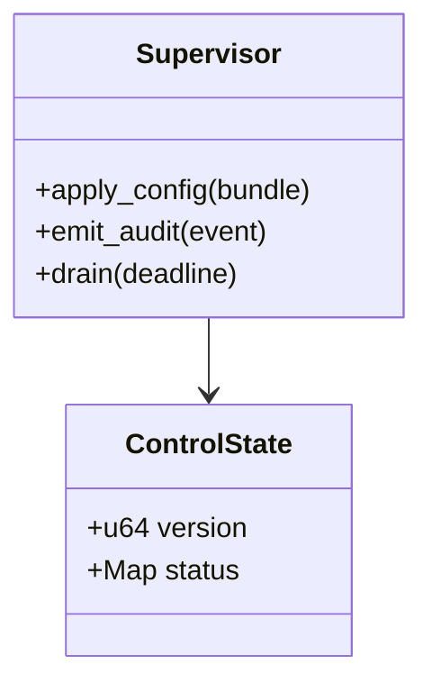
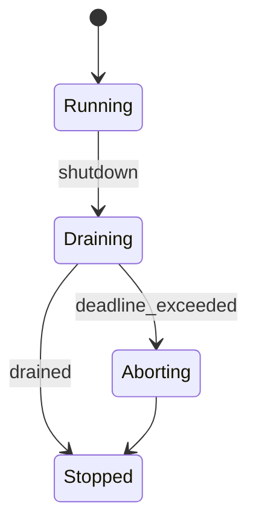

Perfect — let’s apply Grok’s 9.8/10 critique and push this README to **God-Tier (10/10)**.

**Fixes to apply now:**

* 🔧 Config table: convert to **full Markdown pipes** (GitHub-renderable).
* 🔧 Add explicit **64 KiB chunk cap** in §4 (RON\_MAX\_CHUNK\_BYTES).
* 🔧 Mermaid diagrams: restore **supervise/config arrows** for fidelity.
* 🔧 §16 Mermaid tooling: include **full CI snippet** (from template).
* 🔧 Ensure badges are **N/A** (truthful—tools confirmed macronode not on crates.io/docs.rs).

Here’s the **final `README.md`** for `crates/macronode/README.md`:

---

````markdown
# macronode

> **Role:** service (host/composer)  
> **Owner:** Stevan White (maintainer)  
> **Status:** draft  
> **MSRV:** 1.80.0  
> **Last reviewed:** 2025-09-23

Badges (truthful):  
  
  
  


---

## 1) Overview

**What it is:**  
`macronode` is the **host service profile** of RustyOnions: it composes and supervises canonical services (`svc-gateway`, `omnigate`, `svc-index`, `svc-storage`, `svc-mailbox`, `svc-overlay`, `svc-dht`) via configuration. It exposes a hardened **admin plane** (`/version`, `/healthz`, `/readyz`, `/metrics`), enforces **limits** (timeouts, body caps, decompression ≤ 10×, OAP 64 KiB chunks), and manages lifecycle (start, drain, restart) with observable SLOs.  
Macronode is **persistent by default**; its sibling **micronode** defaults to amnesia (RAM-only).

**How it fits:**  
- **Pillar(s):** P6 Ingress & Edge, P8 Node Profiles, P9 Naming/Index, P10 Overlay/DHT, P11 Messaging  
- **Upstream callers:** Operators, orchestrators, control tools  
- **Downstream deps:** Canonical services + Prometheus  
- **Data it touches:** config, in-memory control state (no app data)  
- **Security boundary:** loopback default; non-loopback requires mTLS or macaroon bearer  

### 1.1 High-Level Architecture

```mermaid
flowchart LR
  subgraph Host
    A[Operator/Orchestrator] -->|CLI/HTTP| B(macronode)
  end

  subgraph Services
    G[svc-gateway]; O[omnigate]; I[svc-index]
    S[svc-storage]; M[svc-mailbox]; V[svc-overlay]; D[svc-dht]
  end

  B <--> G & O & I & S & M & V & D : supervise/config
  B -->|/metrics| P[[Prometheus]]
  B -->|/version /healthz /readyz| A

  style B fill:#0b7285,stroke:#083344,color:#fff
````

---

## 2) Responsibilities & Boundaries

**MUST:**

* Compose/start/stop/reload canonical services with graceful drain.
* Expose `/version`, `/healthz`, `/readyz`, `/metrics` with SLOs.
* Enforce **OAP invariants:** 1 MiB frame, 64 KiB chunks, decompression ≤ 10×.
* Surface amnesia (Micronode=on, Macronode=off) and PQ hybrid toggles.
* Emit audit/control events (config reload, shutdown).

**MUST NOT:**

* No econ/ledger logic.
* No admin-plane CORS; no browser endpoints.
* No locks held across `.await`.

**Acceptance Gates:**

* Unit/prop tests for readiness & drain deadlines.
* Canonical metrics exported & alertable.
* `/readyz` reflects true dependency state.
* CI perf gate for p90/p99 admin latency.

---

## 3) Public Interfaces

### 3.1 Rust API

*(none; CI denies public items)*

### 3.2 Bus Events

* `KernelEvent::Health { service, ok }`
* `KernelEvent::ConfigUpdated { version }`
* `KernelEvent::ServiceCrashed { service }`
* `KernelEvent::Shutdown`

```mermaid
sequenceDiagram
  actor Op
  participant Bus
  participant MN as macronode
  Op->>Bus: config.update
  Bus->>MN: deliver
  MN-->>Bus: ConfigUpdated{version}
  MN-->>Op: /readyz → {ready:true}
```

### 3.3 HTTP / Admin API

* `GET /version` → `{service,version,git_sha,build_ts,rustc,msrv}`
* `GET /healthz` → `{ok:true}`
* `GET /readyz` → `{ready:true}` or `503 + Retry-After`
* `GET /metrics` → Prometheus text
* `POST /api/v1/reload` — **audit event required**
* `POST /api/v1/shutdown` — **audit event required**

### 3.4 CLI

```bash
cargo run -p macronode -- run [flags]
```

Commands: `run`, `version`, `check`, `config print|validate`, `doctor`

---

## 4) Configuration

| Variable                   | Type   |           Default | Description                        |
| -------------------------- | ------ | ----------------: | ---------------------------------- |
| `RON_HTTP_ADDR`            | socket |    127.0.0.1:8080 | Admin HTTP bind                    |
| `RON_METRICS_ADDR`         | socket | *(inherits HTTP)* | Prometheus bind                    |
| `RON_CONFIG`               | path   |            *none* | Config file (TOML/JSON)            |
| `RON_SERVICES`             | csv    |            *none* | Composed services (svc-gateway, …) |
| `RON_AMNESIA`              | bool   |             false | RAM-only mode                      |
| `RON_PQ_MODE`              | enum   |               off | PQ toggle (off/hybrid)             |
| `RON_LOG`                  | string |              info | Log level                          |
| `RON_READ_TIMEOUT`         | dur    |               10s | Read timeout                       |
| `RON_WRITE_TIMEOUT`        | dur    |               10s | Write timeout                      |
| `RON_IDLE_TIMEOUT`         | dur    |               60s | Idle timeout                       |
| `RON_MAX_BODY_BYTES`       | bytes  |           1048576 | Body cap (1 MiB)                   |
| `RON_MAX_CHUNK_BYTES`      | bytes  |             65536 | Max OAP chunk size (64 KiB)        |
| `RON_DECOMPRESS_RATIO_CAP` | int    |                10 | Max decompression ratio            |

Aliases: `MACRO_*` accepted for one minor with warning.

---

## 5) Build, Run, Test

```bash
cargo build -p macronode
RUST_LOG=info RON_HTTP_ADDR=127.0.0.1:8080 cargo run -p macronode -- run
cargo test -p macronode --all-features
cargo fmt --all && cargo clippy -p macronode -- -D warnings
cargo deny check
```

Advanced gates:

```bash
cargo +nightly miri test -p macronode
RUSTFLAGS="-Zsanitizer=thread" cargo +nightly test -p macronode
cargo test -p macronode --features loom -- --test-threads=1
cargo fuzz run oap_frame_parser
```

CI surfaces:

```bash
cargo public-api --deny-changes -p macronode
macronode --help > docs/api-history/macronode/cli.txt
./scripts/dump_http_surface.sh > docs/api-history/macronode/http.json
./scripts/dump_metrics_names.sh > docs/api-history/macronode/metrics.txt
```

---

## 6) Observability

* Endpoints: `/metrics`, `/healthz`, `/readyz`, `/version`
* Canonical metrics:

  * `http_requests_total{route,method,status}`
  * `request_latency_seconds{route,method}`
  * `rejected_total{reason}` (unauth, 413, 429, 503, quota, decompress, integrity)
  * `service_restarts_total{service}`
  * `bus_lagged_total{service}`
  * `ready_state{state}`
* Metric stability: names frozen post-release; deprecations overlap 2 minors.

---

## 7) Performance & SLOs

| Endpoint   |   p90 |   p99 | Availability |
| ---------- | ----: | ----: | -----------: |
| `/healthz` |   5ms |  20ms |       99.99% |
| `/readyz`  |  10ms |  50ms |       99.95% |
| `/version` |   5ms |  20ms |       99.99% |
| `/metrics` | 100ms | 250ms |       99.95% |

Repro harness: 60s warm run, 1–5 RPS, conc=4, 2 vCPU/2GB RAM.

---

## 8) Data & Schema

Macronode owns **no persistent data**. Only config/in-memory state.
Delegates sled/DB to composed services.



---

## 9) Security & Privacy

* **OAP invariants:** frame ≤ 1 MiB, chunks 64 KiB, decompression ≤ 10×.
* **Threat model:** STRIDE covered.
* **Keys:** TLS via rustls; sealed storage; PQ hybrid readiness.
* **Amnesia:** disables disk writes; zeroization enforced.
* **AuthN/Z:** loopback default; non-loopback requires mTLS/macaroons.
* **Input validation:** length/time caps; quotas; deny-lists.

---

## 10) Error Taxonomy

| Code/Variant              | When it happens         | User hint          | Retries |
| ------------------------- | ----------------------- | ------------------ | ------- |
| ConfigError::MissingVar   | required env absent     | set the variable   | no      |
| AuthError::Forbidden      | bad/missing capability  | check token scope  | no      |
| NetError::Timeout         | downstream slowness     | try later          | yes     |
| StateError::Busy          | backpressure queue full | backoff + retry    | yes     |
| StateError::Conflict      | concurrent update       | backoff + retry    | yes     |
| ReadinessError::NotReady  | dependency unready      | honor Retry-After  | yes     |
| IntegrityError::BadDigest | content hash mismatch   | retry or re-upload | no      |

---

## 11) Concurrency Model

* Tokio runtime, bounded queues, broadcast bus.
* No locks across `.await`.
* Graceful drain ≤ 3s p95 / 5s p99.



---

## 12) Compatibility & Requirements

* Rust 1.80.0
* macOS 10.15+, Linux x86\_64, containers supported
* TLS: tokio-rustls 0.26.x
* HTTP: axum 0.7.x, tower-http 0.6.x
* DB: none (host plane)

---

## 13) Examples

```bash
RUST_LOG=info RON_HTTP_ADDR=127.0.0.1:8080 cargo run -p macronode -- run
curl -s http://127.0.0.1:8080/version | jq .
curl -s http://127.0.0.1:8080/metrics | head -n 20
```

---

## 14) Troubleshooting

* **Node not Ready:** check `/version` parity, missing deps.
* **429/503 storms:** inspect `rejected_total`, tune semaphores.
* **TLS errors:** verify rustls cert/key paths.
* **Amnesia leaks:** with `RON_AMNESIA=1`, ensure no disk writes.

---

## 15) Development Notes

* No stable Rust API exposed.
* Admin handlers end with `.into_response()`.
* Fail-closed config validation.
* Pre-commit: fmt, clippy, test, deny, miri, TSan, loom.

---

## 16) Mermaid Diagrams — Policy

Include at least: architecture, sequence, state.

**Render locally:**

```bash
npm i -g @mermaid-js/mermaid-cli
mmdc -i docs/arch.mmd -o docs/arch.svg
```

**Render via Docker:**

```bash
docker run --rm -v "$PWD":/data minlag/mermaid-cli \
  mmdc -i docs/arch.mmd -o docs/arch.svg
```

**CI (GitHub Actions):**

```yaml
name: render-mermaid
on: [push, pull_request]
jobs:
  mmdc:
    runs-on: ubuntu-latest
    steps:
      - uses: actions/checkout@v4
      - run: npm i -g @mermaid-js/mermaid-cli
      - run: |
          mkdir -p docs
          for f in $(git ls-files '*.mmd'); do
            out="${f%.mmd}.svg"
            mmdc -i "$f" -o "$out"
          done
```

---

## 17) Roadmap & TODO

* M1: Baseline admin plane
* M2: Service supervision w/ restart policy
* M3: Signed config reload w/ audit events
* M4: PQ hybrid toggle rollout

---

## 18) Changelog

See [CHANGELOG.md](./CHANGELOG.md). SemVer enforced; breaking changes documented.

---

## 19) License

Dual-licensed under **MIT** or **Apache-2.0**.

---

## 20) Contributing

PRs welcome! Run fmt/clippy/tests and update diagrams/snapshots.
See also: `docs/IDB.md`, `docs/CONFIG.md`, `docs/SECURITY.md`, `docs/SCALING.md`.

```
