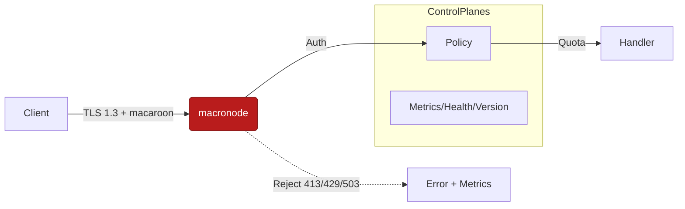

````markdown
---
title: Security Notes — macronode
crate: macronode
owner: Stevan White
last-reviewed: 2025-09-22
status: draft
---

# Security Documentation — macronode

This document defines the **threat model**, **security boundaries**, and **hardening requirements** specific to `macronode`.
It complements the repo-wide [Hardening Blueprint](../../docs/Hardening_Blueprint.md) and [Interop Blueprint](../../docs/Interop_Blueprint.md).

**Canon (non-negotiable for macronode):**
- **OAP/1 framed I/O**: `max_frame = 1 MiB`; **storage streaming chunk = 64 KiB** (distinct knobs).
- **Content addressing**: **BLAKE3-256** (`b3:<hex>`); verify digest **before serve**.
- **Overlay/DHT split**: overlay contains **no DHT** logic (DHT is `svc-dht`).
- **Transport**: unified **ron-transport**; Tor via `arti` feature flag.
- **TLS**: **tokio_rustls::rustls::ServerConfig** only; **TLS 1.3**; cipher allow-list (see §3).
- **Amnesia mode**: RAM-only caches; secrets zeroized; **no disk residue** after shutdown.
- **PQ/ZK seams**: pluggable at auth/policy edges; verifier keys/params **KMS-pinned**; **no witness persistence**.

---

## 1) Threat Model (STRIDE)

| Category                   | Threats                                                                  | Relevant in `macronode`? | Mitigation                                                                                                         |
| -------------------------- | ------------------------------------------------------------------------ | ------------------------ | ------------------------------------------------------------------------------------------------------------------ |
| **S**poofing               | Unauthenticated peers, forged capabilities                                | **Y**                    | TLS 1.3 (rustls), mTLS/JWT/macaroons, short TTL, audience scoping, `/version` parity                              |
| **T**ampering              | Mutated frames, integrity/config/policy tamper, ZK parameter drift        | **Y**                    | OAP/1 framed I/O; **BLAKE3 verify-before-serve**; **signed & versioned** config/policy; KMS-pinned param hashes   |
| **R**epudiation            | Missing/unverifiable audit                                                | **Y**                    | Structured JSON logs; **append-only, hash-chained** audit; Merkle checkpoints; transparency root continuity checks |
| **I**nformation Disclosure | Secrets/PII leakage; ZK witness leakage                                   | **Y**                    | Redaction; amnesia mode; zeroization; minimized PII; **never log tokens/witnesses**                               |
| **D**enial of Service      | Floods, slow-loris, compression bombs, quota storms                       | **Y**                    | 5s timeouts; 512 inflight cap; ~500 RPS cap/instance (tune); OAP 1 MiB; decompress ≤10× + absolute cap; breakers  |
| **E**levation of Privilege | Policy bypass, capability abuse                                           | **Y**                    | **Auth → Policy → Quota → Handler** wall; deny-by-default; DTO `deny_unknown_fields`; refusal taxonomy (413/429/503) |

---

## 2) Security Boundaries

* **Inbound (public):** gateway/omnigate routes; overlay sessions via `ron-transport`; `/metrics`, `/healthz`, `/readyz`, `/version` (scrape/read-only).
* **Inbound (control):** co-located policy/auth/audit/naming.
* **Outbound:** registry, storage/index/mailbox, audit sink, KMS, (optional) ledger/wallet/rewarder.
* **Trust Zone:** multi-tenant; public-facing edges; **control planes (auth/policy/metrics/health/version) are last to shed**.
* **Assumptions:**
  * Kernel supervision, bus, metrics, config invariants hold.
  * Required deps declared/enforced by `/readyz`; entropy ≥ **128 bits** before readiness.
  * Policy deny-by-default; quotas enforced at ingress.

---

## 3) Key & Credential Handling

* **Types of keys:** TLS certs/keys, macaroon secrets, verifier keys (ZK), parameter bundles, KMS credentials.
* **Storage:**
  * Keys/certs/VK/params via **ron-kms**; sealed at rest if applicable; **BLAKE3-256** hash pinned in config.
  * In-memory only in **amnesia mode**.
* **Rotation policy:** rotate ≤ **30 days**; revocation honored; OCSP stapling where supported.
* **Zeroization:** Wrap secrets in `zeroize::Zeroizing`; zeroize on shutdown.

**TLS Policy**
- **Impl:** `tokio_rustls::rustls::ServerConfig` only (CI lints forbid `rustls::ServerConfig` direct use).
- **Protocol:** **TLS 1.3 only**.
- **Cipher allow-list:** `TLS_AES_128_GCM_SHA256`, `TLS_AES_256_GCM_SHA384`, `TLS_CHACHA20_POLY1305_SHA256`.
- **KEX:** X25519 (preferred), P-256 allowed.

**PQ readiness**
- Hybrid KEM flags (e.g., Kyber) may pass through; posture surfaced in `/version` + readiness details.

**Never log** token bodies or ZK witnesses.

---

## 4) Hardening Checklist (from Blueprint)

* [ ] **OAP/1** frame cap **1 MiB**; oversize → **413**; framed I/O only; no unbounded buffering.
* [ ] **Streaming chunk** ~**64 KiB** for storage I/O (distinct from frame cap).
* [ ] **Decompression** ≤ **10×** *and* absolute output cap (svc default **32 MiB**); refusal + metric + audit reason on breach.
* [ ] **Timeouts**: HTTP default **5s**; strict read/write/idle at transport.
* [ ] **Concurrency**: cap **512** inflight; **RPS** cap ~**500/s/instance** (tune per svc).
* [ ] **Circuit breakers** to downstreams; **shed order** = facets (Graph/Feed/Search/Media) → non-critical → **never** control planes.
* [ ] **Deny-by-default**: all public routes traverse **Auth → Policy → Quota → Handler**.
* [ ] **DTO hygiene**: `#[serde(deny_unknown_fields)]`; versioned OAP DTOs; unknowns rejected.
* [ ] **BLAKE3 verify-before-serve** on content paths (mismatch → 502 + `integrity_fail_total`).
* [ ] **UDS** (if used): dir `0700`, socket `0600`, **SO_PEERCRED** allow-list.
* [ ] **Amnesia mode**: RAM-only caches; fs writes disabled; secrets zeroized; **no residual files** post-shutdown.
* [ ] **ZK seam** (if enabled): VK/params via KMS; param hash pinned; domain separation; batch verify; **no witness persistence**.
* [ ] `/version` required: semver, git_sha, features `{zk, arti, amnesia}`; readiness checks entropy + version parity.

---

## 5) Observability for Security

* **Metrics:**
  * `request_latency_seconds{service,route,method}` (Histogram) — **buckets (ms)**: `[5,10,25,50,100,250,500,1000,2500,5000]`
  * `http_requests_total{service,route,code}` (Counter)
  * `rejected_total{reason}` (Counter: `unauth`,`413`,`429`,`503`,`quota`,`decompress`,`integrity`)
  * `service_restarts_total{service}` (Counter)
  * `bus_lagged_total{service}` (Counter)
  * `integrity_fail_total{object}` (Counter)
  * `ready_state{state="true"|"false"}` (Gauge)
  * `tls_handshake_failures_total` (Counter)
  * `zk_verify_success_total` / `zk_verify_fail_total` (if ZK enabled)
* **Logs:** JSON; include `trace_id`, `tenant`, `capability_id`, `service`, `route`, `reason`, `latency_ms`; **no PII**, **no tokens/witnesses**.
* **Health gates:** `/readyz` fail-closed if any **required** dependency is down or policy outage occurs; **degrade before NotReady** (shed facets first).

---

## 6) Dependencies & Supply Chain

* **External crates (security-sensitive):**
  * `tokio-rustls` (TLS 1.3), `serde` (strict schema; `deny_unknown_fields`), `blake3`, `axum` (0.7), `tower`, `tower-http`
* **Pinned versions:** workspace-root `Cargo.toml`.
* **Supply chain controls:** `cargo-deny` in CI; advisories/license policies enforced.
* **SBOM:** generated at release; stored in `/docs/sbom/`.

---

## 7) Formal & Destructive Validation

* **Property tests:** reject malformed OAP frames; DTO unknown fields.
* **Fuzzing:** OAP/1 frame parser; policy parser/evaluator.
* **Loom tests:** no lock-across-`.await` in supervision/hot paths.
* **Chaos tests:** kill/restart under load; median restart `< 1s`; `/readyz` flips correctly.
* **Soak:** **24h** continuous; zero FD leaks; memory variance < **10%**; p99 latency within envelope.
* **TLA+ (or Alloy) specs (critical invariants):**
  * **Readiness DAG:** prove no request admission when any required dep is down; prove “degrade before NotReady” under backpressure.
  * **Econ conservation** (if econ enabled): no sequence increases supply without mint capability.
* **Red-Team Drills (quarterly, auditable):**
  1) Oversize OAP frame (2 MiB) → **413**; no heap spike.
  2) Decompression bomb → refusal + `rejected_total{reason="decompress"}`.
  3) Quota storm → **429** with `Retry-After`; facets shed; budgets intact.
  4) Policy outage → fail secure (deny); `/readyz` false; clean recovery.
  5) ZK bad proof (if enabled) → reject; `zk_verify_fail_total` increments; no witness logs.
  6) UDS perms → dir `0700`, socket `0600`, enforce **SO_PEERCRED**.
  7) Ledger replay (if econ) → doublespend blocked; audit chain intact.
  8) Facet drills: **Media** range p95 ≤ **100ms**; **Feed** fanout p95 ≤ **2s** @ 10k followers; **Search** p95 ≤ **150ms** (graceful degrade).

---

## 8) Security Contacts

* **Maintainer:** Stevan White
* 
* **Disclosure policy:** See repo root `SECURITY.md`.

---

## 9) Migration & Upgrades

* **Breaking changes to auth/keys/policy:** require a **major** version bump in `CHANGELOG.md`; include migration & rollback plan.
* **Deployments:** blue/green or rolling; version-skew tolerant; verify `/version` parity (git_sha, features) pre/post rollout.

---

## 10) Mermaid — Security Flow Diagram (REQUIRED)



---

## 11) Anti-Scope (Forbidden Practices)

To prevent drift and DX confusion, the following are **explicitly forbidden** in `macronode`:

* ❌ Global mutable state (`static mut`, `lazy_static!` without OnceCell/OnceLock).
* ❌ SHA2/MD5 addressing or hashing (only **BLAKE3-256** allowed).
* ❌ Direct use of `rustls::ServerConfig` (must use `tokio_rustls::rustls::ServerConfig`).
* ❌ Service logic (overlay/DHT/ledger/storage) — `macronode` is **composition only**.
* ❌ Logging tokens, credentials, or ZK witnesses.
* ❌ Unbounded queues or iterators held across `.await`.

---

## 12) Implementation Snippets (DX Ready)

### Zeroization

```rust
use zeroize::Zeroizing;

fn handle_secret(bytes: Vec<u8>) {
    let secret = Zeroizing::new(bytes);
    // use secret
} // secret wiped on drop
```

### BLAKE3 Verify-Before-Serve

```rust
use blake3;
use axum::{response::IntoResponse, http::StatusCode};

fn verify_and_serve(bytes: &[u8], expected: &str) -> impl IntoResponse {
    let got = blake3::hash(bytes);
    if got.to_hex().as_str() != expected {
        return (StatusCode::BAD_GATEWAY, "integrity_fail").into_response();
    }
    (StatusCode::OK, bytes.to_vec()).into_response()
}
```

### DTO Hygiene

```rust
use serde::Deserialize;

#[derive(Deserialize)]
#[serde(deny_unknown_fields)]
struct PolicyDTO {
    id: String,
    limit: u32,
}
```

---

## 13) CI & Enforcement (SEC/RES Bite)

* **Concern labels:** PRs touching `macronode` must declare `concern:SEC` and `concern:RES`.
* **CI gates:**  
  - `cargo-deny` (supply chain, licenses, advisories).  
  - Clippy lints: deny `await_holding_lock`, `unwrap_used`, `expect_used`.  
  - Greps: forbid `static mut`, `lazy_static!`, SHA2.  
  - Feature matrix: build with/without `arti`; amnesia mode ON/OFF.  
  - Red-team smoke jobs: oversize OAP → 413, decompression bomb refusal, quota storm → 429.  
* **Acceptance:** CI red if any gate fails; `/readyz` gating enforced in sim tests.

---

````
