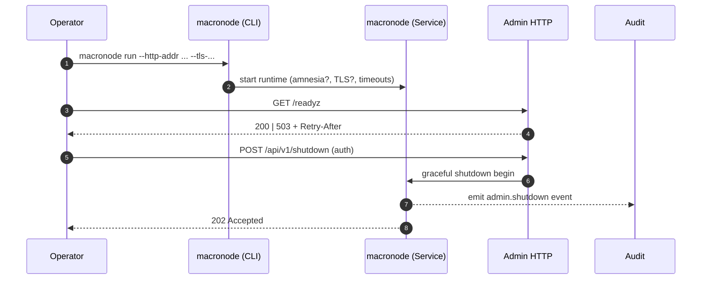
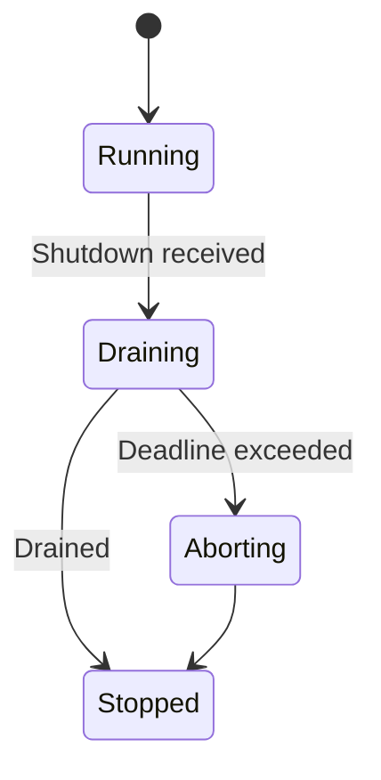
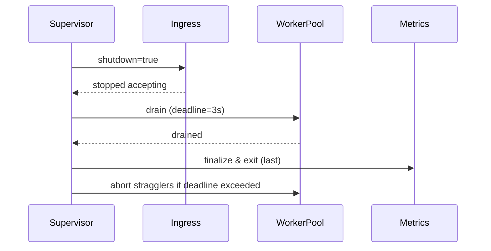
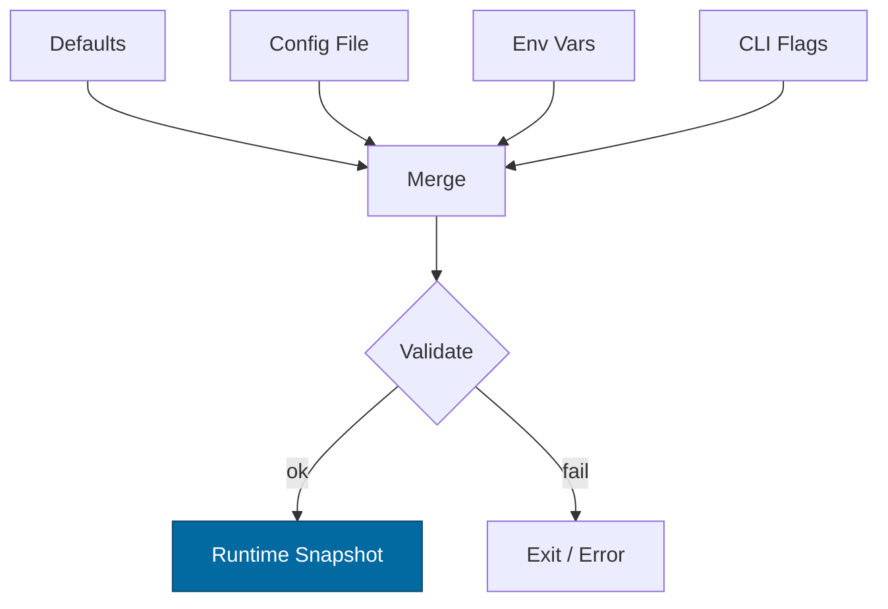
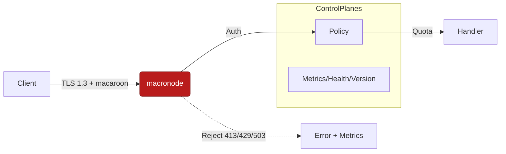

# Combined Markdown

_Source directory_: `crates/macronode/docs`  
_Files combined_: 12  
_Recursive_: 0

---

### Table of Contents

- API.MD
- CONCURRENCY.MD
- CONFIG.MD
- GOVERNANCE.MD
- IDB.md
- INTEROP.MD
- OBSERVABILITY.MD
- PERFORMANCE.MD
- QUANTUM.MD
- RUNBOOK.MD
- SECURITY.MD
- TESTS.MD

---

## API.MD
_File 1 of 12_


# 📖 API.md — Macronode

---

title: API Surface & SemVer Reference (macronode)
status: draft
msrv: 1.80.0
last-updated: 2025-09-22
audience: contributors, auditors, API consumers
crate-type: service (bin)
alignment:

* 12\_PILLARS.MD (Observability, Governance, Security, Reliability)
* SIX\_CONCERNS.MD (RES, PERF, GOV emphasis)
* MICROKERNEL\_BLUEPRINT.MD (axum 0.7; /metrics|/healthz|/readyz invariants)
* HARDENING\_BLUEPRINT.MD (TLS via rustls; least-privilege; amnesia)
* SCALING\_BLUEPRINT.MD (SLOs; backpressure; shedding)
* FULL\_PROJECT\_BLUEPRINT.MD (SemVer discipline; CI gates; no drift)

---

## 0. Purpose

Macronode is a **service crate (binary)**. This doc is the **spec** for its externally consumable interfaces:

* **Rust library surface**: intentionally **none** (service ≠ SDK).
* **CLI surface**: operator-facing controls.
* **HTTP admin/observability surface**: `/version`, `/healthz`, `/readyz`, `/metrics`, plus optional admin endpoints.
* **SemVer rules & CI gates**: exact expectations for change safety.

---

## 1. Rust Public API Surface

Service crates do **not** expose a stable Rust API. Any public items are accidental.

**CI guard**

```bash
cargo public-api --simplified --deny-changes
```

**Expected output**

```text
# (no public items)
```

If symbols appear, make them non-public or document/stabilize them here + CHANGELOG.

---

## 2. CLI (Operator Surface)

**Binary**: `macronode`

### 2.1 Commands

* `macronode run`

  * Starts the service.
  * Flags:

    * `--config <PATH>` (env `RON_CONFIG`): config file (TOML/JSON). Secrets redacted on print.
    * `--http-addr <ADDR>` (env `RON_HTTP_ADDR`, default `127.0.0.1:8080`): admin bind.
    * `--metrics-addr <ADDR>` (env `RON_METRICS_ADDR`, optional): separate metrics bind; defaults to `--http-addr` if unset.
    * `--log-level <LEVEL>` (env `RON_LOG`, default `info`): `error|warn|info|debug|trace`.
    * `--amnesia` (env `RON_AMNESIA=1`): RAM-first, minimal persistence; may disable state-leaky endpoints.
    * `--no-tls`: disable TLS on admin port (dev only).
    * `--tls-cert <PATH> --tls-key <PATH>`: rustls materials for TLS.
    * `--graceful-timeout <SECS>` (default `20`): shutdown grace.
* `macronode version`: prints semver, git SHA, build ts, rustc, msrv, api versions.
* `macronode check`: validates config and environment (ports, perms, time, entropy).
* `macronode config print`: prints effective config after env/CLI overlays (secrets redacted).
* `macronode config validate <PATH>`: validate config without starting.
* `macronode doctor`: runs diagnostics (fs/dns/time drift/ports).

### 2.2 Flags quick reference

| Flag                 | Env Var            | Default              | Description                      |
| -------------------- | ------------------ | -------------------- | -------------------------------- |
| `--config`           | `RON_CONFIG`       | *none*               | Path to config (TOML/JSON).      |
| `--http-addr`        | `RON_HTTP_ADDR`    | `127.0.0.1:8080`     | Admin HTTP bind.                 |
| `--metrics-addr`     | `RON_METRICS_ADDR` | *inherits http-addr* | Separate Prometheus bind if set. |
| `--log-level`        | `RON_LOG`          | `info`               | Log verbosity.                   |
| `--amnesia`          | `RON_AMNESIA`      | `off`                | Enable amnesia mode.             |
| `--no-tls`           | *n/a*              | `false`              | Disable TLS (dev only).          |
| `--tls-cert`         | *n/a*              | *none*               | TLS certificate path.            |
| `--tls-key`          | *n/a*              | *none*               | TLS private key path.            |
| `--graceful-timeout` | *n/a*              | `20`                 | Shutdown grace in seconds.       |

> **CLI SemVer:** adding new flags/subcommands = **minor**; removing/renaming or changing defaults/exit-codes = **major**.

---

## 3. HTTP Admin/Observability API

**Addr**: `--http-addr` (default `127.0.0.1:8080`)
**Proto**: HTTP/1.1 + HTTP/2; prefer TLS (rustls).
**Auth**: default loopback only; **mTLS or bearer** required for non-loopback.
**CORS**: **disabled** (no browser exposure).
**Media**: `application/json; charset=utf-8`, Prometheus text for `/metrics`.

### 3.1 Canon Endpoints (required)

* `GET /version` → **200 OK**

  ```json
  {
    "service": "macronode",
    "version": "X.Y.Z",
    "git_sha": "abcdef1234",
    "build_ts": "2025-09-22T01:23:45Z",
    "rustc": "1.80.0",
    "msrv": "1.80.0",
    "api": { "http": "v1" }
  }
  ```

* `GET /healthz` (liveness) → **200 OK**

  ```json
  { "ok": true, "checks": { "event_loop": "ok", "clock": "ok" } }
  ```

* `GET /readyz` (readiness)

  * **200 OK**

    ```json
    { "ready": true, "deps": { "config": "loaded", "network": "ok", "storage": "ok" } }
    ```
  * **503 Service Unavailable** with **`Retry-After: <seconds>`** when not ready.

* `GET /metrics` (Prometheus text) → **200 OK**

### 3.2 Optional Admin Endpoints (feature-gated, auth-required)

* `GET /api/v1/status` → snapshot (uptime, build, resources, features, warnings)
* `POST /api/v1/reload` → **202 Accepted** (config reload)
* `POST /api/v1/shutdown` → **202 Accepted** (graceful stop)

**Audit invariant:** Mutating admin endpoints **MUST** emit `ron-audit` events:

```json
{
  "type": "admin.shutdown",
  "actor": "cli|token-subject",
  "reason": "maintenance window",
  "request_id": "abcd-1234",
  "instance": "macronode@host",
  "ts": "2025-09-22T01:23:45Z"
}
```

### 3.3 Errors (RFC 7807)

All 4xx/5xx use `application/problem+json`.

### 3.4 Timeouts & Backpressure

* **Server defaults**: read `10s`, write `10s`, idle `60s` (configurable; see CONFIG.md).
* **Backpressure**: when queue-depth or CPU pressure crosses thresholds, shed with:

  * **`429 Too Many Requests`** + `Retry-After` for rate limits.
  * **`503 Service Unavailable`** + `Retry-After` for dependency/readiness failures.
* **SLO hints**: see §7.

---

## 4. Metrics Contract (baseline & stability)

**Baseline series** (names are stable once released):

* `admin_http_requests_total{method,endpoint,code}` (counter)
* `admin_http_request_duration_seconds{method,endpoint}` (histogram)
* `process_uptime_seconds` (gauge)
* `service_restarts_total` (counter)
* `ready_state` (gauge: 0/1)
* `build_info{version,git_sha,rustc}` (gauge=1)

**Deprecation policy**

* Mark deprecated metrics in release notes.
* Keep **two minor versions**; emit both old/new in parallel.
* Remove only on next **major** or after deprecation window with clear migration notes.

---

## 5. SemVer Discipline

We track **two** public surfaces:

1. **CLI**

   * **Minor**: add flags/subcommands; add optional fields in machine-readable outputs.
   * **Major**: remove/rename flags; change default behaviors; change exit codes.

2. **HTTP (/api/v1)**

   * **Minor**: add endpoints/fields; add optional query params; add metrics.
   * **Major**: remove/rename endpoints or fields; change types/auth; change status semantics; rename metrics.

**Breaking changes** require:

* macronode **major** bump, and
* a new HTTP namespace (e.g., `/api/v2/...`) for HTTP changes.

---

## 6. Security & Hardening (API-adjacent)

* Default bind is **loopback**; non-loopback requires **mTLS** or **Bearer** with RBAC.
* TLS via rustls; reject weak ciphers; document cert/key paths.
* **No secrets** in `/status` or `/metrics`; redact config.
* Echo/propagate **`X-Request-Id`** for traceability.
* **Amnesia mode**: may **disable** or restrict state-revealing endpoints.
* **Forbidden**: exposing admin endpoints through public CORS; Node.js runtime dependencies on the admin plane.

---

## 7. SLOs (targets & budgets)

These SLOs guide design and CI perf gates. Breaches consume error budget.

| Endpoint         | Availability (30-day) | p90 Latency | p99 Latency | Notes                   |
| ---------------- | --------------------: | ----------: | ----------: | ----------------------- |
| `/healthz`       |                99.99% |       ≤ 5ms |      ≤ 20ms | in-process checks only  |
| `/readyz`        |                99.95% |      ≤ 10ms |      ≤ 50ms | dependency probes ok    |
| `/version`       |                99.99% |       ≤ 5ms |      ≤ 20ms | static                  |
| `/metrics`       |                99.95% |     ≤ 100ms |     ≤ 250ms | scrape window awareness |
| `/api/v1/status` |                 99.9% |      ≤ 50ms |     ≤ 200ms | optional                |

Backpressure must maintain **p99** within bounds by shedding (`429/503 + Retry-After`).

---

## 8. Tooling

* `cargo public-api --simplified --deny-changes` (prevent Rust API leaks)
* `cargo doc` (internal docs)
* **OpenAPI** at `/docs/openapi/macronode.v1.yaml` (lint with `spectral`)
* **Snapshots** at `/docs/api-history/macronode/`:

  * `cli-vX.Y.Z.txt` (CLI help)
  * `http-vX.Y.Z.json` (endpoint/field list)
  * `metrics-vX.Y.Z.txt` (metric names)

---

## 9. CI & Gates

* Post PR comment with diffs:

  * `cargo public-api` result
  * `macronode --help` diff
  * OpenAPI diff (if present)
  * metrics name diff (deny unexpected removals/renames)
* Fail PR on **breaking** CLI/HTTP/metrics changes without:

  * SemVer bump,
  * path version bump (HTTP),
  * CHANGELOG migration notes.
* **Perf gate** (admin paths):

  * Warm run; load test `/healthz`, `/readyz`, `/metrics`
  * Ensure SLO thresholds (p90/p99) are met with a small CI load (e.g., 1–5 RPS for 60s).
* Smoke tests: `/version|/healthz|/readyz|/metrics` status + type.

---

## 10. OpenAPI (v1) — Minimal Stub

```yaml
openapi: 3.0.3
info:
  title: Macronode Admin API
  version: v1
paths:
  /version:
    get:
      summary: Service version
      responses:
        '200':
          description: ok
          content:
            application/json:
              schema:
                type: object
                properties:
                  service: { type: string }
                  version: { type: string }
                  git_sha: { type: string }
                  build_ts: { type: string, format: date-time }
                  rustc: { type: string }
                  msrv: { type: string }
                  api:
                    type: object
                    properties:
                      http: { type: string }
  /healthz:
    get:
      summary: Liveness
      responses: { '200': { description: ok } }
  /readyz:
    get:
      summary: Readiness
      responses:
        '200': { description: ready }
        '503':
          description: not ready
          headers:
            Retry-After:
              schema: { type: integer, format: int32, minimum: 1 }
  /metrics:
    get:
      summary: Prometheus metrics
      responses:
        '200':
          description: ok
          content:
            text/plain: {}
  /api/v1/status:
    get:
      summary: Node status
      responses: { '200': { description: ok } }
  /api/v1/reload:
    post:
      summary: Reload config
      responses: { '202': { description: accepted } }
  /api/v1/shutdown:
    post:
      summary: Graceful shutdown
      responses: { '202': { description: accepted } }
```

---

## 11. Examples

### CLI

```
macronode version
macronode check
macronode config print
macronode run --http-addr 127.0.0.1:8080 --log-level info --no-tls
```

### HTTP

```
curl -s http://127.0.0.1:8080/version | jq .
curl -s -o /dev/null -w "%{http_code}\n" http://127.0.0.1:8080/healthz
curl -i http://127.0.0.1:8080/readyz     # may return 503 + Retry-After
curl -s http://127.0.0.1:8080/metrics | head -n 20
```

---

## 12. Sequence (Mermaid)



---

## 13. Acceptance Checklist (DoD)

* [ ] `cargo public-api` shows **no** public Rust surface (or documented rationale).
* [ ] CLI help captured → `/docs/api-history/macronode/cli-vX.Y.Z.txt`.
* [ ] HTTP snapshot captured → `/docs/api-history/macronode/http-vX.Y.Z.json`.
* [ ] Metrics snapshot captured → `/docs/api-history/macronode/metrics-vX.Y.Z.txt`.
* [ ] OpenAPI present → `/docs/openapi/macronode.v1.yaml` and lints clean.
* [ ] CHANGELOG updated for any surface changes.
* [ ] RUNBOOK & CONFIG updated (ports, auth, TLS, timeouts, amnesia).
* [ ] CI perf gate passes SLOs for admin endpoints.

---

## 14. History (Notable API Shifts)

* **v1.0.0** — Canon baseline: `/version`, `/healthz`, `/readyz`, `/metrics`. CLI: `run|version|check|config|doctor`. Optional `/api/v1/{status,reload,shutdown}` behind admin auth.
* *Add future entries here with dates, PRs, and migration notes.*

---


---

## CONCURRENCY.MD
_File 2 of 12_

````markdown
---
title: Concurrency Model — macronode
crate: macronode
owner: Stevan White
last-reviewed: 2025-09-23
status: draft
template_version: 1.2
msrv: 1.80.0
tokio: "1.x (pinned at workspace root)"
loom: "0.7+ (dev-only)"
lite_mode: "N/A (service crate with background tasks)"
---

# Concurrency Model — macronode

This document makes the concurrency rules **explicit**: tasks, channels, locks, shutdown, timeouts,
and validation (property/loom/TLA+). It complements `docs/SECURITY.md`, `docs/CONFIG.md`,
and the crate’s `README.md`, `IDB.md`, and the **Concurrency & Aliasing Blueprint** and **Hardening Blueprint**.

> **Golden rule:** never hold a lock across `.await` in supervisory or hot paths.

---

## 0) Lite Mode (for tiny lib crates)

N/A — macronode is a supervising **service** crate with multiple background tasks.

---

## 1) Invariants (MUST)

- [x] **No lock across `.await`**. If unavoidable, split the critical section (derive values under guard, drop, then `.await`).
- [x] **Single writer** per mutable resource; readers use snapshots or short read guards.
- [x] **Bounded channels** only (mpsc/broadcast) with explicit overflow policy.
- [x] **Explicit timeouts** on all I/O and RPCs; fail-fast with typed errors.
- [x] **Cooperative cancellation**: every `.await` is cancel-safe or guarded by `select!`.
- [x] **Graceful shutdown**: observe `KernelEvent::Shutdown`/watch signal; drain within deadline; abort stragglers.
- [x] **No blocking syscalls** on the async runtime; use `spawn_blocking` for CPU-heavy or blocking ops (fs, crypto).
- [x] **No task leaks**: track `JoinHandle` joins; detach only with rationale (e.g., best-effort telemetry).
- [x] **Backpressure over buffering**: drop/reject with metrics; never grow unbounded queues.
- [x] **Framing**: strict length-delimited framing on transport; handle split reads; cap allocations.
- [x] **Amnesia friendly**: caches are bounded/ephemeral; shutdown clears in-RAM state.
- [x] **Bytes discipline**: use `bytes::Bytes`/`BytesMut` for payloads; avoid unnecessary copies.

**Async Drop**
- [x] Do **not** block in `Drop`. For teardown, expose an **async `close()`/`shutdown()`** API and call it before the value is dropped. `Drop` should only release cheap, non-blocking resources.

---

## 2) Runtime Topology

**Runtime:** Tokio multi-threaded (default threads = `num_cpus`).  
**Supervision:** The macronode supervisor owns the control plane and spawns long-lived tasks. Panic restarts use jittered backoff with caps.

**Primary tasks (long-lived):**
- **Supervisor** — owns shutdown watch, spawns/monitors services, aggregates `JoinHandle` results, escalates on repeated crash loops.
- **ConfigWatcher** — observes config changes (paths/env); diffs, emits `KernelEvent::ConfigUpdated`.
- **MetricsServer** — HTTP endpoints `/metrics`, `/healthz`, `/readyz`; serves Prometheus scrape; exits **last**.
- **TransportIngress** — listener accepting connections; frames → bounded work queue.
- **OverlayHttp** — axum HTTP API; maps requests to worker pool; per-request deadlines; concurrency limits.
- **WorkerPool (N)** — processes framed messages/requests; owns per-connection state; CPU-heavy → `spawn_blocking`.
- **HealthReporter** — periodically reports `KernelEvent::Health { service, ok }`; updates readiness.

**Crash policy:** Exponential backoff with jitter (**100–500ms → cap 5s**) per task; on **>5** restarts in **60s**, mark service `Degraded`, surface in `/readyz`.

```mermaid
flowchart TB
  subgraph Runtime
    SUP[Supervisor] -->|spawn| IN[TransportIngress]
    SUP -->|spawn| OH[OverlayHttp]
    SUP -->|spawn| MET[MetricsServer]
    SUP -->|spawn| CFG[ConfigWatcher]
    SUP -->|spawn| HR[HealthReporter]
    IN -->|mpsc:work(512)| WP[WorkerPool]
    OH -->|mpsc:work(512)| WP
    SUP -->|watch:Shutdown| IN
    SUP -->|watch:Shutdown| OH
    SUP -->|watch:Shutdown| WP
    SUP -->|watch:Shutdown| MET
    SUP -->|watch:Shutdown| CFG
  end
  WP -->|results/metrics| MET
  style SUP fill:#0ea5e9,stroke:#0c4a6e,color:#fff
````

**Accessibility text:** Supervisor spawns TransportIngress, OverlayHttp, MetricsServer, ConfigWatcher, HealthReporter, and a WorkerPool. Ingress & Overlay feed a bounded mpsc work queue into the WorkerPool. All tasks subscribe to a shutdown watch.

---

## 3) Channels & Backpressure

**Inventory (all bounded):**

| Name          | Kind        | Capacity | Producers → Consumers | Backpressure Policy           | Drop Semantics                                     |
| ------------- | ----------- | -------: | --------------------- | ----------------------------- | -------------------------------------------------- |
| `bus`         | broadcast   |     1024 | 1 → N                 | lag counter + drop oldest     | inc `bus_lagged_total`; warn with service label    |
| `work`        | mpsc        |      512 | N → M                 | `try_send` → `Busy`           | return 429/`Busy`; inc `busy_rejections_total`     |
| `shutdown`    | watch<bool> |        1 | 1 → N                 | last-write-wins               | N/A                                                |
| `cfg_updates` | mpsc        |       64 | 1 → 1                 | `try_send` or coalesce        | coalesce to newest; count `config_coalesced_total` |
| `telemetry`   | mpsc        |      512 | N → 1                 | best-effort; shed on overflow | drop-oldest; inc `queue_dropped_total{telemetry}`  |

**Guidelines**

* Prefer `try_send` + explicit error over buffering.
* Expose `queue_depth{queue}` gauges; count `queue_dropped_total{queue}`.
* Broadcast receivers must handle `Lagged(n)` by reconciling with a **snapshot pull** (see §11 pattern).

---

## 4) Locks & Shared State

**Allowed**

* Short-lived `Mutex`/`RwLock` for metadata (no `.await` under guard).
* Read-mostly snapshots via `Arc<StateSnapshot>` (rebuild on change; atomic swap).
* Per-connection state **owned by its task**; cross-task via channels.

**Forbidden**

* Holding locks across `.await`.
* Nested locks without documented hierarchy.
* Long-held global locks (favor sharding or message passing).

**Hierarchy**

1. `state_meta` (light config/runtime toggles)
2. `routing_table` / `session_index` (sharded if hot)
3. `counters` (atomics preferred)

---

## 5) Timeouts, Retries, Deadlines

* **I/O defaults:** `read=5s`, `write=5s`, `idle=60s` (configurable).
* **HTTP (Overlay):** per-request **total deadline** (e.g., `2s`); soft timeout for handler body; hard timeout at middleware; per-endpoint concurrency limits.
* **Retries:** idempotent ops only; jittered backoff **50–100ms → cap 2s**; **max 3 tries**; always respect caller deadline.
* **Circuit breaker (optional):** open on rolling error-rate; half-open probes after cool-down.

```mermaid
sequenceDiagram
  autonumber
  participant Caller
  participant M as macronode
  Caller->>M: Request (deadline=2s)
  M-->>Caller: 202 Accepted or Result
  Note over M: On backpressure → Busy<br/>On timeout → typed error
```

---

## 6) Cancellation & Shutdown

* **Signal Sources:** `KernelEvent::Shutdown` on the bus, plus a local `watch<bool>` (true = shutting down).
* **Propagation:** All long-lived tasks run `tokio::select!` on `shutdown.changed()` alongside their main work.
* **Draining:** Stop intake (close listeners / stop accepting HTTP); flush in-flight within `drain_deadline` (default **3s**, max **5s**).
* **Abort:** Tasks exceeding deadline are aborted (`handle.abort()`); increment `tasks_aborted_total{kind}`; log with service name.
* **Order:**

  1. Supervisor flips `shutdown=true`.
  2. Ingress stops accepting; Overlay returns `503 Busy` for new work.
  3. WorkerPool drains queues.
  4. MetricsServer remains up until last to expose shutdown health.
  5. Supervisor aborts stragglers after deadline.



---

## 7) I/O & Framing

* **TransportIngress:** length-prefix framing; **max\_frame\_bytes = 1 MiB** (configurable). Validate length before allocation; handle partial reads; call `.shutdown().await` on streams.
* **OverlayHttp:** HTTP/1.1 & HTTP/2 via axum; request body limit (default **4 MiB**); per-IP accept rate limits; per-route concurrency limits.
* **Decompression guard:** max expansion ratio **≤ 10:1** (reject on exceed).
* **TLS:** rustls-based acceptor (if enabled) — handshake timeout **2s**.

---

## 8) Error Taxonomy (Concurrency-Relevant)

| Error         | When                               | Retry?    | Metric                            | Notes                           |
| ------------- | ---------------------------------- | --------- | --------------------------------- | ------------------------------- |
| `Busy`        | queue full                         | maybe     | `busy_rejections_total{endpoint}` | caller-visible; backoff advised |
| `Timeout`     | deadline exceeded                  | sometimes | `io_timeouts_total{op}`           | attach `op` & deadline          |
| `Canceled`    | shutdown/cancel                    | no        | `tasks_canceled_total{kind}`      | cooperative exit                |
| `Lagging`     | broadcast overflow                 | no        | `bus_lagged_total{service}`       | slow consumer                   |
| `BrokenPipe`  | peer closed during write           | maybe     | `io_errors_total{op="write"}`     | treat as normal churn           |
| `Degraded`    | restart threshold exceeded         | no        | `service_restarts_total{service}` | reflected in `/readyz`          |
| `OpenCircuit` | circuit breaker opened on endpoint | maybe     | `circuit_open_total{endpoint}`    | fail-fast until half-open       |

---

## 9) Metrics (Concurrency Health)

* `queue_depth{queue}` gauge (sampled)
* `queue_dropped_total{queue}` counter
* `tasks_spawned_total{kind}` / `tasks_aborted_total{kind}` / `tasks_completed_total{kind}`
* `io_timeouts_total{op}` (`read`,`write`,`connect`,`handshake`)
* `backoff_retries_total{op}`
* `busy_rejections_total{endpoint}`
* `service_restarts_total{service}`
* `request_latency_seconds{endpoint,method}` (histogram)
* `readyz_state{service}` (0/1/2 = unready/degraded/ready)
* `ready_dependency_unmet{dep}` (gauge)
* `semaphore_inflight{facet}` (gauge)
* `facet_busy_total{facet}` / `facet_deadline_timeouts_total{facet}` (counters)

---

## 10) Validation Strategy

**Unit / Property**

* Backpressure behavior (drop vs reject) is deterministic under load.
* Deadlines honored within tolerance; handlers return timeout deterministically.
* Lock discipline: optional runtime asserts to detect `.await` while holding a lock (debug builds).

**Loom**

* Model producer → bounded queue → consumer with shutdown.
* Assert: no deadlocks, no missed shutdown wakeups, no double-drop.

**Fuzz**

* Frame/decoder fuzz (malformed, boundary sizes, truncated frames).

**Chaos**

* Periodically kill/restart workers under load; `/readyz` reflects Degraded → Ready transitions; drains respect deadlines.

**TLA+ (targeted)**

* Specify readiness DAG & shutdown drain ordering; prove safety (no stuck state) & liveness (eventual drain).

**Miri / TSan**

* Run unit/property tests under Miri; critical paths under ThreadSanitizer.

---

## 11) Code Patterns (Copy-Paste)

**Spawn + cooperative shutdown**

```rust
let (shutdown_tx, mut shutdown_rx) = tokio::sync::watch::channel(false);

let worker = tokio::spawn({
  let mut rx = work_rx;
  async move {
    loop {
      tokio::select! {
        _ = shutdown_rx.changed() => break,
        maybe_job = rx.recv() => {
          let Some(job) = maybe_job else { break };
          if let Err(e) = handle_job(job).await {
            tracing::warn!(error=%e, "job failed");
          }
        }
      }
    }
  }
});

// initiate shutdown
let _ = shutdown_tx.send(true);
let _ = worker.await;
```

**Bounded mpsc with `try_send`**

```rust
match work_tx.try_send(job) {
  Ok(()) => {}
  Err(tokio::sync::mpsc::error::TrySendError::Full(_)) => {
    metrics::busy_rejections_total().inc();
    return Err(Error::Busy);
  }
  Err(e) => return Err(Error::from(e)),
}
```

**Timeout with deadline**

```rust
let res = tokio::time::timeout(cfg.read_timeout, read_frame(&mut stream)).await;
```

**Async Drop pattern**

```rust
pub struct Client { inner: Option<Conn> }

impl Client {
  pub async fn close(&mut self) -> anyhow::Result<()> {
    if let Some(mut conn) = self.inner.take() {
      conn.shutdown().await?;
    }
    Ok(())
  }
}

impl Drop for Client {
  fn drop(&mut self) {
    if self.inner.is_some() {
      tracing::debug!("Client dropped without close(); resources will be reclaimed");
    }
  }
}
```

**No lock across `.await`**

```rust
let value = {
  let g = state.lock();
  g.derive_value()
}; // guard dropped
do_async(value).await;
```

**Broadcast bus (lag-aware subscriber + snapshot reconcile)**

```rust
let mut rx = bus.subscribe();
loop {
  tokio::select! {
    _ = shutdown_rx.changed() => break,
    msg = rx.recv() => match msg {
      Ok(ev) => handle_event(ev).await,
      Err(tokio::sync::broadcast::error::RecvError::Lagged(n)) => {
        metrics::bus_lagged_total().inc_by(n as u64);
        tracing::warn!(lagged=n, "bus receiver lagged; reconciling snapshot");
        if let Err(e) = reconcile_from_snapshot().await {
          tracing::warn!(error=%e, "snapshot reconcile failed after lag");
        }
      }
      Err(tokio::sync::broadcast::error::RecvError::Closed) => break,
    }
  }
}
```

**Facet semaphore (bounded fanout)**

```rust
// Non-blocking acquire to enforce backpressure:
if let Ok(_permit) = facet_sem.try_acquire_many(units) {
    // proceed quickly
} else {
    metrics::facet_busy_total("search").inc();
    return Err(Error::Busy);
}
```

---

## 12) Configuration Hooks (Quick Reference)

* `max_conns`, `read_timeout`, `write_timeout`, `idle_timeout`
* Channel capacities: `work`, `telemetry`, `bus`
* `drain_deadline` (shutdown grace)
* Retry/backoff window (initial, cap, max\_tries)
* HTTP: per-endpoint deadlines, body size/concurrency limits
* I/O: `max_frame_bytes`, decompression ratio cap, handshake timeout
* Facets: semaphore sizes per facet (Feed/Graph/Search/Index/Mailbox)

See `docs/CONFIG.md` for authoritative schema.

---

## 13) Known Trade-offs / Nonstrict Areas

* **Drop-oldest vs reject-new:** For telemetry, drop-oldest is acceptable (best-effort). For `work`, prefer **reject-new (Busy)** to preserve tail latency and bounded memory.
* **Broadcast lag:** Slow consumers may miss intermediate `Health` events; they must reconcile periodically (pull current snapshot) rather than assume perfect continuity.
* **Spawn vs inline:** Very small, CPU-light handlers run inline to avoid context-switch overhead; heavier tasks use `spawn_blocking`.
* **Facet fanout:** Feed/Search can explode work; bounded semaphores intentionally cap throughput to protect latency SLOs.

---

## 14) Mermaid Diagrams (REQUIRED)

### 14.1 Task & Queue Topology

```mermaid
flowchart LR
  IN[Ingress Listener] -->|mpsc:work(512)| W1[Worker A]
  IN -->|mpsc:work(512)| W2[Worker B]
  OH[Overlay HTTP] -->|mpsc:work(512)| W1
  OH -->|mpsc:work(512)| W2
  subgraph Control
    SHUT[Shutdown watch] --> IN
    SHUT --> OH
    SHUT --> W1
    SHUT --> W2
  end
```

**Text:** Ingress and HTTP feed two workers via a bounded mpsc(512); a Shutdown watch notifies all components.

### 14.2 Shutdown Sequence



---

## 15) CI & Lints (Enforcement)

**Clippy lints**

* `-D clippy::await_holding_lock`
* `-D clippy::needless_collect`
* `-D clippy::useless_async`
* `-D warnings`

**GitHub Actions sketch**

```yaml
name: concurrency-guardrails
on: [push, pull_request]
jobs:
  clippy:
    runs-on: ubuntu-latest
    steps:
      - uses: actions/checkout@v4
      - uses: dtolnay/rust-toolchain@stable
      - run: cargo clippy -p macronode -- -D warnings -W clippy::await_holding_lock

  loom:
    if: github.event_name == 'pull_request'
    runs-on: ubuntu-latest
    steps:
      - uses: actions/checkout@v4
      - uses: dtolnay/rust-toolchain@stable
      - run: RUSTFLAGS="--cfg loom" cargo test -p macronode --tests -- --ignored

  fuzz:
    runs-on: ubuntu-latest
    steps:
      - uses: actions/checkout@v4
      - uses: dtolnay/rust-toolchain@stable
      - run: cargo install cargo-fuzz
      - run: cargo fuzz build -p macronode

  miri:
    runs-on: ubuntu-latest
    steps:
      - uses: actions/checkout@v4
      - uses: dtolnay/rust-toolchain@nightly
      - run: cargo +nightly miri test -p macronode

  tsan:
    runs-on: ubuntu-latest
    steps:
      - uses: actions/checkout@v4
      - uses: dtolnay/rust-toolchain@nightly
      - env:
          RUSTFLAGS: "-Zsanitizer=thread"
      - run: cargo +nightly test -Zsanitizer=thread -p macronode

  coverage:
    runs-on: ubuntu-latest
    steps:
      - uses: actions/checkout@v4
      - uses: taiki-e/install-action@cargo-llvm-cov
      - run: cargo llvm-cov --workspace --lcov --output-path lcov.info
```

---

## 16) Schema Generation (Optional, Nice-to-Have)

Automate **Channels/Locks tables** from code to avoid rot:

* Annotate channels/locks with macros or attributes, e.g.:

  ```rust
  #[doc_channel(name="work", kind="mpsc", cap=512, policy="try_send")]
  let (tx, rx) = tokio::sync::mpsc::channel(512);
  ```
* A small **proc-macro** or a **build script** (`build.rs`) can emit `docs/_generated/concurrency.mdfrag` which you include via md-include.
* Alternatively, keep a `concurrency_registry.rs` and unit-test that the doc table matches registry entries (golden test).

---

## 17) Review & Maintenance

* **Review cadence:** every 90 days or on any change to tasks/channels/locks.
* Keep `owner`, `msrv`, `last-reviewed` current.
* **PR checklist:** if you modify concurrency, update this file + Loom/property tests.

---

## 18) Acceptance Gates (CI-enforced)

**Shutdown SLO**

* [ ] p95 graceful drain ≤ **3s**; p99 ≤ **5s** under steady load (chaos test `chaos_drain_smoketest`).

**Deadlines**

* [ ] p99 request total deadline respected within ±100ms across all HTTP endpoints.

**Backpressure**

* [ ] Under 2× sustained load, system returns `Busy` within **50ms** (no unbounded queuing).
* [ ] `queue_dropped_total{telemetry}` may increase; `queue_dropped_total{work}` MUST remain **0**.

**Loom coverage**

* [ ] Critical interleavings (producer/consumer/shutdown/broadcast lag) — **≥ 90%** branch coverage on loom cfg.

**Chaos**

* [ ] Kill/restart 10% of workers every 250ms for 10s while serving RPS N: `/readyz` transitions `Ready→Degraded→Ready` with 5xx ≤ **0.1%**.

**Miri / TSan**

* [ ] Miri passes on unit/property tests.
* [ ] ThreadSanitizer clean for `transport`, `overlay`, `supervisor`.

**Amnesia Mode**

* [ ] With `AMNESIA=1`, no persistent writes observed (fs spy), and all caches `zeroize` on shutdown (heap scan asserts zeroed buffers).

**PQ Hooks (if enabled)**

* [ ] Handshake deadline ≤ **2s**; no key material crosses task boundaries except via zeroizing types.

---

## 19) Facet-Aware Concurrency (macronode composition)

Macronode composes facets with distinct concurrency risk profiles. Guard each facet with bounded semaphores, explicit queues, and per-facet SLOs:

| Facet   | Hotspot             | Control                   | Default Cap | Notes                               |
| ------- | ------------------- | ------------------------- | ----------- | ----------------------------------- |
| Feed    | fan-out explosions  | `Semaphore(feed_fanout)`  | 4×CPU       | shed oldest fanouts beyond deadline |
| Graph   | neighbor expansion  | `Semaphore(graph_expand)` | 2×CPU       | degree pre-check to avoid N²        |
| Search  | query spikes        | `Semaphore(search_qps)`   | 4×CPU       | per-tenant token bucket             |
| Index   | write amplification | `Semaphore(index_ingest)` | CPU         | coalesce updates (mpsc 256)         |
| Mailbox | bursty fan-in/out   | `Semaphore(mailbox_ops)`  | 4×CPU       | cap per-tenant work queue           |

**Metrics**

* `semaphore_inflight{facet}` gauge
* `facet_busy_total{facet}` counter
* `facet_deadline_timeouts_total{facet}` counter

---

## 20) Amnesia & Post-Quantum (PQ) Invariants

* [ ] **Amnesia**: When `amnesia=ON`, background tasks MUST avoid disk I/O; all caches and key material implement `zeroize`.
* [ ] **Key lifetimes**: Limit in-memory key exposure; use `Arc<Secret>` with zeroize on final drop; forbid cloning into long-lived tasks.
* [ ] **Handshake deadlines**: PQ handshakes (if enabled) timeout at **2s**; partial handshakes are dropped with metrics.
* [ ] **No cross-task key aliasing**: pass opaque handles (capabilities) over channels, not raw key bytes.

**Tests**

* Amnesia fs-spy asserts 0 writes.
* Heap scanner confirms zeroized regions after shutdown.

---

## 21) Runtime Matrix (determinism & parity)

* **Multi-thread default** (prod): auto threads = CPU.
* **Single-thread track** (tests/micronode-parity): `--features single_thread_rt` runs long-lived tasks on current-thread runtime.

**CI**

* Run full test suite on both flavors.
* Compare latency histograms to ensure no starvation/regression.


---

## CONFIG.MD
_File 3 of 12_


````markdown
---
title: Configuration — macronode
crate: macronode
owner: Stevan White
last-reviewed: 2025-09-23
status: draft
template_version: 1.1
---

# Configuration — macronode

This document defines **all configuration** for `macronode`, including sources,
precedence, schema (types/defaults), validation, feature flags, live-reload behavior,
and security implications. It complements `README.md`, `docs/SECURITY.md`, and the Pillar/Concern blueprints.

> **Profile note:**  
> `macronode` is a **composing host** for the canonical services (gateway, omnigate, index, storage, mailbox, overlay, DHT, etc.). It wires and supervises services **by configuration only**—no service logic lives here.

---

## 1) Sources & Precedence (Authoritative)

Configuration may come from multiple sources. **Precedence (highest wins):**

1. **Process flags** (CLI)  
2. **Environment variables**  
3. **Config file** (e.g., `Config.toml` beside the binary)  
4. **Built-in defaults** (hard-coded)

> When reloading dynamically, the effective config is recomputed under the same precedence.

**Supported file formats:** TOML (preferred), JSON (optional).  
**Path resolution order for `--config` (if relative):** `./`, `$CWD`, crate dir.

---

## 2) Quickstart Examples

### 2.1 Minimal profile start (gateway+omnigate+index+storage+mailbox)
```bash
RUST_LOG=info
MACRO_BIND_ADDR=0.0.0.0:9080
MACRO_METRICS_ADDR=127.0.0.1:9600
MACRO_SERVICES=svc-gateway,omnigate,svc-index,svc-storage,svc-mailbox,svc-overlay,svc-dht
cargo run -p macronode
````

### 2.2 Config file (TOML) — production-ish sketch

```toml
# Config.toml (macronode)
bind_addr     = "0.0.0.0:9080"
metrics_addr  = "127.0.0.1:9600"
max_conns     = 2048
read_timeout  = "5s"
write_timeout = "5s"
idle_timeout  = "60s"

[log]
format = "json"
level  = "info"

[limits]
max_body_bytes       = "1MiB"
decompress_ratio_cap = 10

[tls]
enabled   = false
# cert_path = "/etc/ron/cert.pem"
# key_path  = "/etc/ron/key.pem"

[security]
amnesia = false
pq_mode = "off"          # "off" | "hybrid"

# Which services macronode should supervise
[services]
enable = [
  "svc-gateway",
  "omnigate",
  "svc-index",
  "svc-storage",
  "svc-mailbox",
  "svc-overlay",
  "svc-dht",
  # "svc-edge",
  # "svc-registry",
  # "svc-sandbox", "svc-mod",
  # "svc-wallet", "svc-ledger", "svc-accounting", "svc-rewarder"
]

# Optional per-service config path overrides (if not embedded defaults)
[services.config_paths]
svc-gateway  = "/etc/ron/gateway.toml"
omnigate     = "/etc/ron/omnigate.toml"
svc-index    = "/etc/ron/index.toml"
svc-storage  = "/etc/ron/storage.toml"
svc-mailbox  = "/etc/ron/mailbox.toml"
svc-overlay  = "/etc/ron/overlay.toml"
svc-dht      = "/etc/ron/dht.toml"

# Facet-aware concurrency knobs (bounded semaphores, CPU-aware)
[facets.feed]
rank_permits       = "4xCPU"   # effective floor 2
fanout_permits     = "2xCPU"   # effective floor 2

[facets.graph]
neighbors_permits  = "2xCPU"
mutations_permits  = "1xCPU"

[facets.search]
query_permits      = "3xCPU"
ingest_permits     = "1xCPU"

[facets.media]
transcode_permits  = "1xCPU"
byte_range_chunk   = "64KiB"   # storage path chunk size

# Optional Unix Domain Socket control endpoint (admin-only)
[uds]
path       = ""
allow_uids = []

# Optional macaroon path for operator capabilities
[auth]
macaroon_path = ""

# ECON hooks (optional for deployments using rewards/ledger)
[economics]
accounting_flush_ms = 2000
rewarder_enabled    = false
```

### 2.3 CLI flags (override file/env)

```bash
cargo run -p macronode -- \
  --bind 0.0.0.0:9080 \
  --metrics 127.0.0.1:9600 \
  --services svc-gateway,omnigate,svc-index,svc-storage,svc-mailbox,svc-overlay,svc-dht \
  --max-conns 4096 \
  --log-format json --log-level info
```

---

## 3) Schema (Typed, With Defaults)

> **Prefix convention:** All env vars begin with `MACRO_` (e.g., `MACRO_BIND_ADDR`).
> **Durations** accept `s`, `ms`, `m`, `h`. **Sizes** accept `B`, `KB`, `MB`, `MiB`, `KiB`.

| Key / Env Var                                                | Type                 |       Default | Description                                  | Security Notes                            |
| ------------------------------------------------------------ | -------------------- | ------------: | -------------------------------------------- | ----------------------------------------- |
| `bind_addr` / `MACRO_BIND_ADDR`                              | socket               | `127.0.0.1:0` | Admin/ingress bind for macronode control     | Public binds require threat review        |
| `metrics_addr` / `MACRO_METRICS_ADDR`                        | socket               | `127.0.0.1:0` | Prometheus endpoint bind                     | Prefer localhost in prod; gateway scrapes |
| `max_conns` / `MACRO_MAX_CONNS`                              | u32                  |        `1024` | Max concurrent connections (admin plane)     | Prevents FD exhaustion                    |
| `read_timeout` / `MACRO_READ_TIMEOUT`                        | duration             |          `5s` | Per-request read timeout (admin plane)       | DoS mitigation                            |
| `write_timeout` / `MACRO_WRITE_TIMEOUT`                      | duration             |          `5s` | Per-request write timeout (admin plane)      | DoS mitigation                            |
| `idle_timeout` / `MACRO_IDLE_TIMEOUT`                        | duration             |         `60s` | Keep-alive idle shutdown                     | Resource hygiene                          |
| `limits.max_body_bytes` / `MACRO_MAX_BODY_BYTES`             | size                 |        `1MiB` | Request payload cap                          | Decompression bomb guard                  |
| `limits.decompress_ratio_cap` / `MACRO_DECOMPRESS_RATIO_CAP` | u32                  |          `10` | Max allowed decompression ratio              | Zip bomb guard                            |
| `tls.enabled` / `MACRO_TLS_ENABLED`                          | bool                 |       `false` | Enable TLS on admin/ingress                  | Use tokio-rustls only                     |
| `tls.cert_path` / `MACRO_TLS_CERT_PATH`                      | path                 |          `""` | PEM cert path                                | Secrets on disk; perms 0600               |
| `tls.key_path` / `MACRO_TLS_KEY_PATH`                        | path                 |          `""` | PEM key path                                 | Zeroize in memory                         |
| `uds.path` / `MACRO_UDS_PATH`                                | path                 |          `""` | Optional Unix Domain Socket path (admin)     | Dir 0700, sock 0600; SO\_PEERCRED allow   |
| `uds.allow_uids` / `MACRO_UDS_ALLOW_UIDS`                    | list<u32>            |          `[]` | PEERCRED allowlist                           | Strict production control                 |
| `auth.macaroon_path` / `MACRO_MACAROON_PATH`                 | path                 |          `""` | Capability token file for operator endpoints | Do not log contents                       |
| `security.amnesia` / `MACRO_AMNESIA`                         | bool                 |       `false` | RAM-only secrets mode                        | No persistent keys                        |
| `security.pq_mode` / `MACRO_PQ_MODE`                         | enum(`off`,`hybrid`) |         `off` | PQ readiness toggle (e.g., X25519+Kyber)     | Interop compatibility risk                |
| `log.format` / `MACRO_LOG_FORMAT`                            | enum(`json`,`text`)  |        `json` | Structured logs                              | JSON required in prod                     |
| `log.level` / `MACRO_LOG_LEVEL`                              | enum                 |        `info` | `trace`..`error`                             | Avoid `trace` in prod                     |
| `services.enable` / `MACRO_SERVICES`                         | list<string>         |          `[]` | Which services to bring up                   | Canon crates only                         |
| `services.config_paths.*` / `MACRO_CFG_PATH_<UPPER_SERVICE>` | path                 |          `""` | Per-service config file path                 | Secrets may appear in service configs     |
| `facets.*_permits` / `MACRO_FACET_*`                         | permit-spec          |       `NxCPU` | CPU-scaled semaphore caps (see §2.2)         | Controls fanout/cost hotspots             |
| `facets.media.byte_range_chunk` / `MACRO_MEDIA_CHUNK`        | size                 |       `64KiB` | Storage path chunk size                      | Perf/backpressure                         |
| `economics.accounting_flush_ms` / `MACRO_ACC_FLUSH_MS`       | u32 (ms)             |        `2000` | Flush cadence for transient counters         | ECON integrity                            |
| `economics.rewarder_enabled` / `MACRO_REWARDER`              | bool                 |       `false` | Enable rewarder service wiring               | Requires policy & ledger                  |

> **Deprecated env aliases (warn & map):**
> `MACRO_MAX_BODY` → `limits.max_body_bytes` (kept ≥1 minor); `MACRO_TLS` → `tls.enabled`.

---

## 4) Validation Rules (Fail-Closed)

On startup or reload, apply the following **strict validation**:

* `bind_addr` parses to valid socket; ports <1024 require privileges.
* If `tls.enabled=true`, `cert_path` and `key_path` exist and are readable; key not world-readable.
* `max_conns` > 0, `limits.max_body_bytes` ≥ 1 KiB.
* `decompress_ratio_cap` ≥ 1 and ≤ 100; **reject sizes > 1 EiB**.
* `services.enable` contains only canonical service crate names (`svc-*`, `omnigate`)—reject unknowns.
* If a service is enabled and a `config_paths.<svc>` is set: file must exist and be readable.
* If `uds.path` set: parent dir exists, dir mode `0700`, socket `0600`.
* If `auth.macaroon_path` set: file exists and non-empty.
* If `security.pq_mode="hybrid"`: require compatible transport/proto features or gate via build flag.

**On violation:** log structured error, **exit non-zero** (services) or **return error** (libs).

---

## 5) Dynamic Reload (If Supported)

* **How to trigger:**

  * SIGHUP (preferred) **or** a bus event `ConfigUpdated { version: <u64> }`.
* **Reload semantics:**

  * Non-disruptive for timeouts/limits/log levels/facet permits.
  * **Disruptive** for `bind_addr`, `tls.*`, `uds.*`, `services.enable` (requires socket rebind and service restart).
* **Atomicity:**

  * Compute a new config snapshot; swap as `Arc<Config>` (`ArcSwap` or `RwLock<Arc<_>>`) without holding locks across `.await`.
* **Audit:**

  * Emit `KernelEvent::ConfigUpdated { version }` + redacted diff in logs (no secrets).

---

## 6) CLI Flags (Canonical)

> Flags are optional; env + file are preferred for production.

```
--config <path>                # Load Config.toml (merged at low precedence)
--bind <ip:port>               # Override bind_addr
--metrics <ip:port>            # Override metrics_addr
--services <csv>               # e.g., svc-gateway,omnigate,svc-index,svc-storage,svc-mailbox,svc-overlay,svc-dht
--cfg-path-<svc> <path>        # e.g., --cfg-path-svc-gateway /etc/ron/gateway.toml
--max-conns <num>
--read-timeout <dur>
--write-timeout <dur>
--idle-timeout <dur>
--tls                          # Shorthand for tls.enabled=true
--tls-cert <path>
--tls-key <path>
--uds <path>
--log-format <json|text>
--log-level <trace|debug|info|warn|error>
```

---

## 7) Feature Flags (Cargo)

| Feature |        Default | Effect                                                    |
| ------- | -------------: | --------------------------------------------------------- |
| `tls`   |            off | Enables tokio-rustls path and TLS config keys             |
| `pq`    |            off | Enables PQ hybrid mode config (`security.pq_mode=hybrid`) |
| `cli`   | on (bins only) | Enable CLI parsing for flags above                        |

> Keep cross-crate consistency; document if a feature changes schema.

---

## 8) Security Implications

* **Public binds** (`0.0.0.0`) require hard caps (timeouts, body size, RPS).
* **TLS**: only `tokio_rustls::rustls::ServerConfig`; never `rustls::ServerConfig` directly.
* **Macaroons**: do not log tokens; rotate ≤ 30 days.
* **Amnesia mode**: disables secret persistence; incompatible with disk-backed key stores.
* **UDS**: verify `SO_PEERCRED`; enforce `allow_uids`.

See `docs/SECURITY.md` for full threat model.

---

## 9) Compatibility & Migration

* **Backwards compatibility:** add new keys with safe defaults.
* **Renames:** keep old env var alias for ≥1 minor; warn when used.
* **Breaking changes:** require **major version** and `docs/CHANGELOG.md` migration steps.
* **Deprecation table (maintained):**

| Old Key/Env           | New Key                      | Removal Target | Notes                        |
| --------------------- | ---------------------------- | -------------: | ---------------------------- |
| `MACRO_MAX_BODY`      | `limits.max_body_bytes`      |         vA+1.0 | Warn & map for ≥1 minor      |
| `MACRO_TLS`           | `tls.enabled`                |         vA+1.0 | Boolean coercion             |
| `feed.fanout_permits` | `facets.feed.fanout_permits` |         vA+1.0 | Namespacing under `facets.*` |

---

## 10) Reference Implementation (Rust)

> Minimal example for `Config` with env + file + CLI (serde + figment or custom).
> **Note:** Keep comments; this snippet is intended to be copy-pasted into `src/config.rs`.

```rust
use std::{net::SocketAddr, time::Duration, path::PathBuf, collections::BTreeMap, sync::Arc};
use serde::{Deserialize, Serialize};

#[derive(Debug, Clone, Serialize, Deserialize, Default)]
pub struct TlsCfg {
    pub enabled: bool,
    pub cert_path: Option<PathBuf>,
    pub key_path: Option<PathBuf>,
}

#[derive(Debug, Clone, Serialize, Deserialize)]
pub struct Limits {
    #[serde(default = "default_body_bytes")]
    pub max_body_bytes: u64, // bytes
    #[serde(default = "default_decompress_ratio")]
    pub decompress_ratio_cap: u32,
}
fn default_body_bytes() -> u64 { 1 * 1024 * 1024 }
fn default_decompress_ratio() -> u32 { 10 }

#[derive(Debug, Clone, Serialize, Deserialize, Default)]
pub struct LogCfg {
    #[serde(default = "default_log_format")]
    pub format: String, // "json" | "text"
    #[serde(default = "default_log_level")]
    pub level: String,  // "info" by default
}
fn default_log_format() -> String { "json".into() }
fn default_log_level() -> String { "info".into() }

#[derive(Debug, Clone, Serialize, Deserialize, Default)]
pub struct Security {
    #[serde(default)]
    pub amnesia: bool,
    #[serde(default = "default_pq_mode")]
    pub pq_mode: String, // "off" | "hybrid"
}
fn default_pq_mode() -> String { "off".into() }

#[derive(Debug, Clone, Serialize, Deserialize, Default)]
pub struct Uds {
    pub path: Option<PathBuf>,
    #[serde(default)]
    pub allow_uids: Vec<u32>,
}

#[derive(Debug, Clone, Serialize, Deserialize, Default)]
pub struct FacetPermits {
    #[serde(default = "default_cpu_spec")]
    pub rank_permits: String,         // "NxCPU"
    #[serde(default = "default_cpu_spec")]
    pub fanout_permits: String,
    #[serde(default = "default_cpu_spec")]
    pub neighbors_permits: String,
    #[serde(default = "default_cpu_spec")]
    pub mutations_permits: String,
    #[serde(default = "default_cpu_spec")]
    pub query_permits: String,
    #[serde(default = "default_cpu_spec")]
    pub ingest_permits: String,
    #[serde(default = "default_64k")]
    pub byte_range_chunk: String,     // "64KiB"
}
fn default_cpu_spec() -> String { "2xCPU".into() }
fn default_64k() -> String { "64KiB".into() }

#[derive(Debug, Clone, Serialize, Deserialize, Default)]
pub struct Economics {
    #[serde(default = "default_flush_ms")]
    pub accounting_flush_ms: u32,
    #[serde(default)]
    pub rewarder_enabled: bool,
}
fn default_flush_ms() -> u32 { 2000 }

#[derive(Debug, Clone, Serialize, Deserialize, Default)]
pub struct Services {
    #[serde(default)]
    pub enable: Vec<String>, // canonical service names
    #[serde(default)]
    pub config_paths: BTreeMap<String, PathBuf>,
}

#[derive(Debug, Clone, Serialize, Deserialize)]
pub struct Config {
    #[serde(default)]
    pub bind_addr: Option<SocketAddr>,     // None = 127.0.0.1:0
    #[serde(default)]
    pub metrics_addr: Option<SocketAddr>,  // None = 127.0.0.1:0
    #[serde(default = "default_max_conns")]
    pub max_conns: u32,
    #[serde(with = "humantime_serde", default = "default_5s")]
    pub read_timeout: Duration,
    #[serde(with = "humantime_serde", default = "default_5s")]
    pub write_timeout: Duration,
    #[serde(with = "humantime_serde", default = "default_60s")]
    pub idle_timeout: Duration,

    #[serde(default)]
    pub log: LogCfg,
    #[serde(default)]
    pub tls: TlsCfg,
    #[serde(default)]
    pub limits: Limits,
    #[serde(default)]
    pub uds: Uds,
    #[serde(default)]
    pub security: Security,
    #[serde(default)]
    pub services: Services,
    #[serde(default)]
    pub facets: FacetPermits,
    #[serde(default)]
    pub economics: Economics,
}

fn default_5s() -> Duration { Duration::from_secs(5) }
fn default_60s() -> Duration { Duration::from_secs(60) }
fn default_max_conns() -> u32 { 1024 }

impl Config {
    pub fn validate(&self) -> anyhow::Result<()> {
        use anyhow::Context;
        if self.max_conns == 0 { anyhow::bail!("max_conns must be > 0"); }
        if self.limits.max_body_bytes < 1024 { anyhow::bail!("limits.max_body_bytes too small"); }
        if self.limits.decompress_ratio_cap == 0 || self.limits.decompress_ratio_cap > 100 {
            anyhow::bail!("decompress_ratio_cap must be in [1,100]");
        }
        if let Some(addr) = self.bind_addr {
            if addr.port() < 1024 {
                tracing::warn!("bind_addr uses privileged port: {}", addr.port());
            }
        }
        if self.tls.enabled {
            match (&self.tls.cert_path, &self.tls.key_path) {
                (Some(c), Some(k)) => {
                    if !c.exists() || !k.exists() {
                        anyhow::bail!("TLS enabled but cert/key missing");
                    }
                }
                _ => anyhow::bail!("TLS enabled but cert/key not provided"),
            }
        }
        if let Some(path) = &self.uds.path {
            let md = std::fs::metadata(path).with_context(|| format!("uds.path {}", path.display()))?;
            if !md.is_file() {
                tracing::warn!("uds.path exists but is not a socket file yet (will be created at bind)");
            }
        }
        // Canonical service list check (keep in sync with crate canon)
        const CANON: &[&str] = &[
            "svc-gateway","omnigate","svc-index","svc-storage","svc-mailbox",
            "svc-overlay","svc-dht","svc-edge","svc-registry","svc-sandbox",
            "svc-mod","svc-wallet","ron-ledger","ron-accounting","svc-rewarder"
        ];
        for s in &self.services.enable {
            if !CANON.contains(&s.as_str()) {
                anyhow::bail!("unknown service '{}'", s);
            }
            if let Some(p) = self.services.config_paths.get(s) {
                if !p.exists() { anyhow::bail!("config path for {} not found: {}", s, p.display()); }
            }
        }
        // Size sanity (reject absurd)
        if self.limits.max_body_bytes > (1u64 << 60) { // ~1 EiB
            anyhow::bail!("limits.max_body_bytes too large");
        }
        Ok(())
    }

    /// Convert "NxCPU" to an absolute permit count (min floor).
    pub fn permits_from_spec(spec: &str, cpus: usize, floor: usize) -> usize {
        let s = spec.trim().to_lowercase();
        if let Some(stripped) = s.strip_suffix("xcpu") {
            let n: usize = stripped.parse().unwrap_or(1);
            return std::cmp::max(floor, n.saturating_mul(cpus));
        }
        s.parse().ok().filter(|v: &usize| *v > 0).unwrap_or(std::cmp::max(2, cpus))
    }
}
```

---

## 11) Test Matrix

| Scenario                                 | Expected Outcome                                            |
| ---------------------------------------- | ----------------------------------------------------------- |
| Missing `Config.toml`                    | Start with defaults; warn                                   |
| Invalid `bind_addr`                      | Fail fast with explicit error                               |
| TLS enabled but no keys                  | Fail fast                                                   |
| Body over `max_body_bytes`               | `413 Payload Too Large` (service)                           |
| Ratio > `decompress_ratio_cap`           | `400 Bad Request` + metric                                  |
| SIGHUP received                          | Non-disruptive reload for safe keys; disruptive ones rebind |
| Unknown service in `services.enable`     | Fail fast with explicit error                               |
| `amnesia=true` on micronode-equivalent   | No disk persistence in supervised services (matrix test)    |
| `pq_mode=hybrid` without compatible peer | Gated by features or reject with clear error                |

---

## 12) Mermaid — Config Resolution Flow



---

## 13) Operational Notes

* Keep **prod config under version control** (private repo or secret store).
* For containers, prefer **env vars** over baked files; mount secrets read-only.
* Document **default ports** and **firewall expectations** near `bind_addr`.
* Use **facet permits** to cap fanout/ranking/search pressure at the profile layer.
* Include this file in PR reviews when config changes are introduced.

---

## 14) CI Gates (Automation & Proof)

Add a light but **teethy** CI job to validate example configs and env/CLI precedence.

```yaml
name: config-guardrails
on: [push, pull_request]
jobs:
  validate-config:
    runs-on: ubuntu-latest
    steps:
      - uses: actions/checkout@v4
      - uses: dtolnay/rust-toolchain@stable
      - uses: Swatinem/rust-cache@v2
      - name: Build macronode
        run: cargo build -p macronode --features tls,pq
      - name: Sample config validation
        run: |
          cat > Config.sample.toml <<'TOML'
          bind_addr = "127.0.0.1:9080"
          metrics_addr = "127.0.0.1:9600"
          [limits]
          max_body_bytes = "1MiB"
          decompress_ratio_cap = 10
          [services]
          enable = ["svc-gateway","omnigate","svc-index","svc-storage","svc-mailbox","svc-overlay","svc-dht"]
          TOML
          cargo run -p macronode -- --config Config.sample.toml --services svc-gateway,omnigate
      - name: Schema grep (drift guard)
        run: |
          rg -n "svc-arti-transport" . && exit 1 || true
          rg -n "DHT" crates/svc-overlay && exit 1 || true
```

This keeps the config surface **drift-proof**, aligned with the canon and hardening defaults.

```


---

## GOVERNANCE.MD
_File 4 of 12_


# 🏛 GOVERNANCE.md

```markdown
---
title: Governance & Operational Integrity — macronode
status: draft
msrv: 1.80.0
last-updated: 2025-09-23
audience: contributors, ops, auditors, stakeholders
crate-type: host
scope: operational-governance (composition, rollout, custody, audit)
non-scope: economic-policy (delegated to ron-ledger / svc-rewarder / accounting)
---

# GOVERNANCE.md — macronode (Host-Level)

## 0. Purpose

`macronode` is a **composing host** that wires and supervises canonical services
(gateway, omnigate, index, storage, mailbox, overlay, DHT, etc.) **by configuration**.
This document defines the **rules of engagement for operational governance**:
who may change what, how changes are audited, and which invariants must hold for safe operation.

**Explicit non-scope:** Economic/policy logic (issuance, rewards, conservation) is
**delegated** to the econ crates (`ron-ledger`, `ron-accounting`, `svc-rewarder`) and their
own GOVERNANCE files.

It ties into:
- **Concurrency & Aliasing Blueprint** (drain deadlines, bounded channels).
- **Hardening Blueprint** (key custody, TLS, amnesia).
- **Economic Integrity Blueprint** (referenced, but enforced in econ crates).
- **Perfection Gates** (esp. Gate A: invariants; Gate G: observability; Gate M: appeal).

---

## 1. Invariants (MUST)

Non-negotiable **operational** rules for macronode:

- [O-G1] **No economic state** is created or mutated here. macronode must not mint, settle, or bypass econ governance.
- [O-G2] **Config changes are auditable & reversible**: every change has a proposer, approver(s), diff, and rollback plan.
- [O-G3] **Authority is bounded**: operators hold least-privilege macaroons; no unilateral “god mode”.
- [O-G4] **Graceful control**: enable/disable services, scale factors, and deadlines must respect shutdown **drain ≤ 5s p99**.
- [O-G5] **Fail-closed**: invalid configs or missing custody material (keys/certs) **refuse to boot**.
- [O-G6] **Observability non-optional**: `/readyz`, `/healthz`, and metrics must be green before declaring Ready.
- [O-G7] **Amnesia honored**: when `amnesia=ON`, no persistent secrets/caches are written; all sensitive buffers zeroize on shutdown.
- [O-G8] **No lock across .await in control paths** (supervision, hot paths) — concurrency doc enforced by CI.

> Economic invariants like “no double spend/issuance” are **[D] Delegated** to the econ crates.

---

## 2. Roles & Authority

### Roles
- **Ops Admin** — may approve production config changes and service (de)activation.
- **Release Manager** — controls version/rollout plans (canary, staged, rollback).
- **Security Officer** — custodian of macaroons, TLS certs, rotation policy.
- **SRE On-call** — may trigger emergency freeze/rollback within bounded playbook.
- **Auditor** — read-only access to configs, logs, metrics, and change history.

### Authority Boundaries
- Ops/Release may **enable/disable** services and adjust **non-disruptive** limits at runtime.
- Changing **disruptive** params (bind addresses, TLS, UDS, service set) requires a **maintenance window** and approval from Ops + Release.
- **No one** in macronode may alter ledger/reward rules; those require econ-crate governance.
- All privileged actions require **capability tokens** (macaroons) with explicit scopes and expiry.

---

## 3. Rules & SLAs (Operational)

- **Readiness SLA**: a config/apply cycle must return the node to `Ready` (via `/readyz`) within **30s** p95.
- **Shutdown SLA**: cooperative drain must complete within **3s p95 / 5s p99**; otherwise abort stragglers and log.
- **Change Windows**: disruptive changes limited to approved windows; canary first, then staged rollout.
- **Rollback**: every change includes a one-step rollback command (documented alongside the PR).
- **Audit Latency**: config change must be visible in audit log within **1s** after apply.

---

## 4. Governance Process (Operational Changes)

- **Proposal lifecycle**: Draft → Review (2 reviewers: Ops + Release) → Approve → Execute → Verify.
- **Quorum**: 2-of-N maintainers for production changes; 1-of-N for staging.
- **Defaults**: Changes auto-expire if not approved within **72h**.
- **Emergency powers**:
  - **Freeze** a service (disable intake) with SRE + Ops approval; record reason and incident ID.
  - Must be disclosed in audit log immediately and in the weekly ops report.

**What counts as disruptive?**
- Changing `bind_addr`, `tls.*`, `uds.*`, or the set of `services.enable`.
- Increasing hard caps (e.g., `total_http_concurrency`) beyond policy’d maxima.

---

## 5. Audit & Observability

- **Audit logs**: append-only, signed (host time, actor, scopes, diff summary, outcome).
- **Metrics** (must exist and be green before Ready):
  - `readyz_state{service}` (0/1/2), `service_restarts_total{service}`
  - `busy_rejections_total{endpoint}`, `queue_dropped_total{queue}`
  - `config_apply_total{status}`, `config_rollback_total{status}`
- **Traces**: change-apply spans include corr_id linking PR → deploy → runtime swap.
- **Red-team drills**: quarterly exercise to simulate a rogue operator token; confirm bounded authority & alerting.

---

## 6. Config & Custody

- **Config**: stored as code; changes via PR only; secrets are referenced from secret stores; never inline in git.
- **Custody**:
  - Macaroons: short-lived; rotated ≤ 30 days; scopes limited to host-level ops.
  - TLS: stored in KMS/HSM or root-owned files (`0600`); rotated via runbook.
  - **Amnesia**: when set, disable persistence of secrets/caches; zeroize buffers on shutdown.
- **Validation**: boot/reload **fails closed** on missing/invalid custody materials.

---

## 7. Appeal Path

- **Operational disputes**:
  1) Raise in ops channel with corr_id; 2) escalate to maintainers quorum; 3) final tie-break by Security Officer.
- **Economic disputes**: **out of scope** here — escalate to the relevant econ crate governance (ledger/rewarder/accounting).
- **No silent rollbacks**: all reversions logged with cause and impact analysis.

---

## 8. Acceptance Checklist (Definition of Done)

- [ ] Invariants in §1 enforced by code/CI (lint gates, fail-closed validation).
- [ ] Roles and scopes mapped to macaroon capabilities; least privilege verified.
- [ ] Governance process (proposal → approval → execute → verify) documented in the repo’s CONTRIBUTING.
- [ ] Metrics and audit logs exported; dashboards linked.
- [ ] Shutdown and readiness SLAs covered by tests/chaos drills.
- [ ] Emergency freeze/rollback playbooks tested in staging.

---

## 9. Appendix

**Delegations (Econ):**
- `ron-ledger` — settlement, conservation proofs, double-spend prevention.  
- `ron-accounting` — balances, accrual, reporting integrity.  
- `svc-rewarder` — emission schedules, distribution caps.

**Blueprints & Policies:**
- Concurrency & Aliasing, Hardening, Economic Integrity, Perfection Gates.

**History:**  
- Record major freezes, emergency actions, and post-mortems (corr_ids, dates, outcomes).

```

---

### Why this split matters

* It **keeps macronode honest**: no economic authority, no policy drift.
* It gives ops **teeth**: auditable change control, bounded emergency powers, and clear SLAs.
* It aligns with your **Concurrency** and **Hardening** docs: drain deadlines, fail-closed validation, custody rotation, amnesia.


---

## IDB.md
_File 5 of 12_

Amazing — I combed through our blueprints set (Interop, Omnigate, Microkernel, Scaling, Hardening, App Integration, Developer Suite, Six Concerns, 12 Pillars, Complete Crate List) and tightened the macronode IDB for 100% coverage, including a first-class ZK (zero-knowledge) seam. Below is a paste-ready full replacement.

---

title: macronode — Invariant-Driven Blueprint (IDB)
version: 0.4.0
status: draft
last-updated: 2025-09-22
msrv: 1.80.0
crate-type: service profile (deployment role)
audience: contributors, ops, auditors
concerns: \[RES, PERF, GOV]

---

# 0) Scope & Purpose

**macronode** is the *large-footprint, operator-grade node profile* of RustyOnions. It packages the microkernel (ron-kernel) with a curated, feature-gated bundle of canonical services and operator surfaces for **multi-tenant workloads, high throughput, and strict governance**. Compared to **micronode** (single-tenant, DX-lean), **macronode** emphasizes **Resilience (RES), Performance (PERF), and Governance (GOV)** with hard SLOs, noisy-neighbor controls, capability-first policy, and optional **ZK attest & verify** at trust boundaries.

**In-scope**

* Composition/orchestration of canonical services on a single host or small cluster (feature-gated): **gateway, overlay, registry, naming, storage, index, mailbox, audit, auth, policy, metrics**, optional econ (ledger/wallet/rewarder).
* Operator surfaces: health/readiness, metrics, structured logs, **/version**, runbooks, safe upgrades/rollbacks, policy gates, red-team drills.
* Resource fencing & backpressure at service and node levels.
* Governance hooks: audit trails, policy enforcement, per-tenant quotas, transparency logs (Merkle), **ZK proof verification** (where configured).
* **Facet composition** via omnigate: Graph, Feed, Search, Media are *composed*, not re-implemented.

**Out-of-scope**

* Service business logic (lives in the respective crates).
* Cloud-specific IaC; deployment blue/green scripts (documented per env).
* End-user UX (belongs to app SDKs and higher layers).

**Primary Interfaces**

* **Core**: ron-kernel, ron-bus, ron-metrics, ron-policy, ron-auth, ron-audit, ron-naming, ron-proto, ron-transport, ron-kms.
* **Services (feature-gated)**: svc-gateway, svc-overlay, svc-index, svc-storage, svc-mailbox, svc-registry, svc-wallet, svc-rewarder, svc-mod, svc-ads (as/if canon), plus omnigate for facets.
* **Economics**: ron-ledger (+ wallet/rewarder).
* **Profile Interop**: macronode ↔ micronode via OAP/1.

**Topology (high-level)**

```mermaid
flowchart LR
  Kernel[ron-kernel] --> Bus[ron-bus]
  Bus --> Services[svc-gateway | svc-overlay | svc-index | svc-storage | svc-mailbox | svc-registry | ...]
  Services --> Facets[Graph / Feed / Search / Media via omnigate]
  Services --> Auth[ron-auth] --> Policy[ron-policy] --> Audit[ron-audit]
  Services --> Metrics[ron-metrics]
  Services --> KMS[ron-kms]
  Services --> Ledger[ron-ledger]:::econ
classDef econ fill:#eef,stroke:#99f,stroke-width:1px;
```

---

# 1) Invariants (MUST)

**I-M1 | Kernel Supervision**
Child service panics are contained; jittered backoff restart. **No lock held across `.await`** on supervisory paths. Graceful shutdown; idempotent start/stop.

**I-M2 | Signed Source of Truth (Config)**
macronode consumes **signed, versioned** config bundles; effective config changes emit `KernelEvent::ConfigUpdated { version }` and are audit-logged with hash and signer.

**I-M3 | Health/Readiness Gates**
Node is **Ready** iff: (a) kernel healthy, (b) **all required** services healthy, (c) policy/auth reachable, (d) entropy ≥128 bits, (e) **/version** surface live and consistent with binary metadata.

**I-M4 | Capability Wall**
Every externally reachable surface (HTTP/gRPC/overlay) is **auth → policy → quota → handler** with deny-by-default; capability tokens/macaroons carry least privilege & expiry.

**I-M5 | Backpressure & OAP/1 Limits**
No unbounded queues. Ingress enforces **OAP/1** limits: `max_frame = 1 MiB`, chunk ≈ 64 KiB (bounded), oversize → 413. Bounded mailboxes, timeouts, circuit breakers.

**I-M6 | Deterministic Observability**
Every ingress path records a **trace\_id**, latency histogram, error counters. `/metrics`, `/healthz`, `/readyz`, `/version` must be consistent and scrape-safe.

**I-M7 | TLS & Crypto Discipline (PQ-Ready)**
TLS uses **tokio\_rustls::rustls::ServerConfig** only; approved ciphers; keys via ron-kms; **hybrid PQ seam** (e.g., Kyber pilot) plumbed through config without coupling.

**I-M8 | Economic Integrity**
Econ flows idempotent, replay-safe; conservation proofs delegated to ron-ledger; audit trails hash-chained.

**I-M9 | Zero-Data Restarts / Amnesia**
When amnesia enabled: no durable state; caches RAM-only; secrets zeroized; restart leaves no residue; disk at rest is empty for profile-owned paths.

**I-M10 | Upgrade Safety**
Blue/green or rolling upgrades with version-skew tolerance; schema/config migrations monotonic and reversible (documented rollback).

**I-M11 | Interop Invariants**
macronode stays wire-compatible with micronode; **overlay excludes DHT** logic (lives where canon dictates); OAP/1 versioned DTOs with `deny_unknown_fields`.

**I-M12 | Safe Decompression**
≤10× expansion *and* absolute output caps for compressed inputs; refuse or sandbox beyond caps.

**I-M13 | Facet SLO Integrity**
Composed facet ops (Graph, Feed, Search, Media) respect stated SLOs and GOV policies; degradation path is defined and tested.

**I-M14 | Operator Intelligibility**
Every alert has a runbook URI and stable taxonomy; refusal codes follow 413/429/503 policy.

**I-M15 | ZK Integrity Boundary**
Where enabled, **zero-knowledge proofs** (ZKPs) validating policy compliance, rate limits, or data predicates **must be verified before privileged actions**. Proof systems and parameters are declared in config, and verifier keys are authenticated via KMS. **No witness material** is ever logged or persisted.

---

# 2) Design Principles (SHOULD)

* **D-M1 | Profile-as-Bundle**: Feature-gated service composition controlled by a signed profile config; minimal default footprint.
* **D-M2 | Hot-Path Minimalism**: Auth → Policy → Router only; side effects go async off hot path with bounded queues.
* **D-M3 | Govern the Edges**: Policy on ingress/egress; transparency log (Merkle) for governance events.
* **D-M4 | Predictable Envelopes**: Document p95/p99 latency & memory envelopes; maintain stability across minor releases.
* **D-M5 | Strict API Surface**: OAP/1 with explicit DTOs; `serde(deny_unknown_fields)` and stable versioning.
* **D-M6 | Fail-Dark**: Shed features before failing the whole node (except security/policy failures).
* **D-M7 | Amnesia-First Option**: One flag flips to ephemeral runtime; ops costs reflected in SLOs.
* **D-M8 | PQ & ZK Friendly**: Keep crypto pluggable (hybrid KEM slots; SNARK/STARK verifier traits).
* **D-M9 | Composed Facets**: Facet capabilities (Graph/Feed/Search/Media) come via omnigate composition; never embed logic locally.
* **D-M10 | CI Teeth**: Fuzz/perf/chaos/loom/sanitizers wired; docs quickstarts are tested; /version surfaced.

---

# 3) Implementation Patterns (HOW)

**Boot/Orchestration**

* Start order: metrics → bus → config watcher → transport(s) → services; subscribe to bus; hook health reporters.
* Expose `/metrics`, `/healthz`, `/readyz`, **`/version`** consistently.

**HTTP & Overlay**

* HTTP via **axum 0.7**; handlers end with `.into_response()`.
* Overlay uses `ron-transport` with TLS, read/write/idle timeouts, connection caps, and framed I/O enforcing OAP/1 limits.

**Metrics & Tracing**

* Prometheus metrics include: `request_latency_seconds` (histogram), `bus_lagged_total` (IntCounterVec), `service_restarts_total` (IntCounterVec).
* Structured JSON logs: `{trace_id, tenant, service, capability_id, outcome, latency_ms}`.

**Auth/Policy/Quota**

* Middleware stack: **TLS → Auth → Policy → Quota → Router**; deny-by-default; capability tokens/macaroons w/ root of trust pinned in KMS; cache policy decisions with bounded TTLs and signed bundles.

**Config & KMS**

* Config hot-reload is atomic; every apply emits bus event + audit record with bundle hash.
* Secrets and keys obtained via **ron-kms**; rotation supported; amnesia zeroizes material on shutdown.

**Storage & Data Handling**

* WAL/idempotent writes; BLAKE3 digests for integrity; safe decompression (≤10×, absolute caps).
* Optional econ store via **ron-ledger** and **svc-wallet/rewarder**.

**ZK Seam**

* **Verifier abstraction** with support for:

  * SNARK (e.g., BLS12-381) via succinct verification APIs.
  * Transparent STARK (no trusted setup) where circuits permit.
* **Domain separation** for transcripts; Fiat-Shamir rigor; **verifier keys authenticated** from KMS; batch verification path for throughput.
* **Locations**: (a) capability mint/rotate (prove attributes without revealing PII), (b) policy checks (prove “under quota” or “belongs to group”), (c) audit inclusion (prove event inclusion in Merkle transparency log) without log disclosure.
* **Witness hygiene**: never log/persist; in amnesia mode, witnesses remain in RAM and are zeroized.

**Upgrades/Drains**

* Readiness gates; in-flight drain with deadlines; skew-tolerant protocol versioning.

**Ops Surfaces**

* `/version` returns build info (git SHA, semver, feature set, PQ/ZK flags) to assert binary ↔ config parity.
* Runbook links embedded in alert annotations.

---

# 4) Acceptance Gates (PROOF)

**A-M1 | Readiness Correctness**
Kill/restore required service → `/readyz` flips false/true correctly; health reflects dependency status.

**A-M2 | Backpressure**
Sustain **≥1.5× p95** target load: bounded queues hold; 429/503 < **5%** with correct `Retry-After`; p99 within envelope.

**A-M3 | Chaos Drill**
Induce crash; median restart < **1s**; no deadlocks; no lock-across-await on supervisory paths (loom test proof).

**A-M4 | Policy Wall**
Unauthorized requests denied; audit captures rule id and refusal taxonomy (413/429/503).

**A-M5 | TLS & PQ Sanity**
TLS config validated; PQ flags surfaced in `/version` and `/readyz` details; no fallback to non-approved suites.

**A-M6 | Observability**
Exemplars and trace\_id propagate; metric cardinality stays within budget; scrape is stable for 24h.

**A-M7 | Upgrade Drill**
Blue/green with zero data loss; error budgets respected; skew tests pass.

**A-M8 | Amnesia Mode**
Disk scan shows no profile-owned residues; secret pages zeroized; cold-start parity confirmed.

**A-M9 | Facet SLOs**
Feed p95 ≤ **2s @10k followers**; Graph p95 ≤ **50ms** intra-AZ; Search p95 ≤ **150ms**; Media range start p95 ≤ **100ms**.

**A-M10 | Concurrency Proofs**
Loom model covering supervision/readiness passes; no await-holding-lock violations; bounded channels verified.

**A-M11 | Fuzz/Red-Team**
Fuzz policy parser/eval; send malformed OAP frames, quota storms, policy outage; system fails securely without meltdown.

**A-M12 | Profile Interop**
Round-trip macronode ↔ micronode; DTO versioning honored; deny drift.

**A-M13 | /version Surface**
Endpoint present & stable; contains git SHA, semver, enabled features, PQ/ZK flags; validated by CI smoke rig.

**A-M14 | Feature Matrix**
CI builds/tests with `--features arti` ON/OFF and amnesia ON/OFF; all green.

**A-M15 | UDS Perms (Conditional)**
If UDS used: dir `0700`, socket `0600`, **SO\_PEERCRED** allow-list enforced; else record N/A.

**A-M16 | 24h Soak**
No FD leaks; memory variance < **10%**; p99 within SLOs under ≥10k concurrent session simulation.

**A-M17 | Deny-Drift**
xtask/CI bans legacy/non-canonical crates; overlay verified to contain **no DHT** logic; crate canon pinned.

**A-M18 | ZK Verifier Proofs**

* **Correctness**: Known-good and known-bad proofs tested for each enabled circuit.
* **Performance**: Batch verification meets p95 ≤ **15ms** per proof (target for small policy predicates) under load.
* **Safety**: No witness logged; verifier keys loaded from KMS and pinned; domain-sep tags enforced.

**A-M19 | Econ Integrity**
Double-spend and replay attempts fail; conservation checks pass via ron-ledger; audit inclusion proofs (Merkle) verifiable (optionally with ZK inclusion).

**A-M20 | Docs Build-Run**
`cargo test --doc` passes; RUNBOOK quickstarts validated by bash smoke rig in CI.

---

# 5) SLOs & Envelopes

| Surface   | SLI                            | Target                |
| --------- | ------------------------------ | --------------------- |
| Gateway   | HTTP p99 latency               | ≤ 120 ms              |
| Overlay   | Hop p99 latency                | ≤ 200 ms              |
| Registry  | Lookup p95                     | ≤ 50 ms               |
| Feed      | Fanout p95                     | ≤ 2 s @ 10k followers |
| Graph     | Neighbor fetch p95             | ≤ 50 ms               |
| Search    | Query p95                      | ≤ 150 ms              |
| Media     | Range start p95 (intra-AZ)     | ≤ 100 ms              |
| Policy    | Eval p95                       | ≤ 10 ms               |
| Audit     | Ingest lag                     | ≤ 500 ms              |
| ZK Verify | Per-proof verify p95 (batched) | ≤ 15 ms (small preds) |

---

# 6) Security, PQ & ZK Highlights

* **mTLS/token auth**; macaroons short TTL; capabilities least-privilege.
* **PQ readiness** via ron-kms-backed hybrid KEM seam; **tokio\_rustls::rustls::ServerConfig** only.
* **ZK boundary**: configurable circuits for (a) capability mint, (b) policy predicates (e.g., “under quota”, “member-of-group”), (c) audit inclusion proofs.
* **Transparency log**: append-only, Merkle-root anchored; optional ZK inclusion without revealing full log.
* **Privacy budget** (optional): policy supports bounded decision caches; no PII in logs; redaction rules enforced.
* **Key hygiene**: rotation & zeroization on amnesia; verifier keys authenticated via KMS.

---

# 7) Integration Map

* **Kernel**: bus, metrics, config, health events → `KernelEvent::*`.
* **Transport**: TLS/timeouts/caps via `TransportConfig`.
* **Gateway/Overlay**: ingress → auth/policy/quota → router.
* **Registry/Naming**: service discovery & stable addressing.
* **Storage/Index/Mailbox**: durability & retrieval (with safe decompression & digest checks).
* **Auth/Policy/Audit**: capability wall + enforcement & audit hash chain.
* **Metrics**: Prometheus; exemplars with trace\_id.
* **Econ**: ron-ledger (+ wallet/rewarder) when enabled.
* **ZK**: verifier module behind policy/identity surfaces; KMS-pinned parameters.
* **Facets**: omnigate composes downstreams (Graph/Feed/Search/Media).

---

# 8) Failure Domains & Run Modes

* **Single-host** (default), **Clustered**, **Amnesia**.
* Clear blast-radius: transport, policy, storage/index, econ, zk-verify.
* Degradation ladders defined (shed facets first, keep core auth/policy online).

---

# 9) Risks & Mitigations

* **Policy latency spikes** → bounded caches with signed bundles; strict TTL; fail-secure (deny) on backend outage.
* **Queue blowups** → bounded channels + circuit breakers; drop non-essentials first.
* **Version skew** → monotonic schema; pre-flight checks; blue/green scripts.
* **TLS misconfig** → boot validation; `/readyz` details; CI fixtures.
* **Operator error** → runbook dry-runs; label-routed CI for targeted checks.
* **ZK circuit drift/toxic waste** → prefer **transparent** systems when possible; if SNARK, documented ceremony & custody; parameter hashes pinned in config; batch verify limits enforced.
* **Witness leakage** → forbid persistence/logging; memory zeroization gates tested.
* **Audit log growth** → Merkle checkpoints + compaction; inclusion proofs stay fast.

---

# 10) Work Plan (Executable TODO)

**A. Wiring & Boot**
\[ ] Macronode bin boots kernel, metrics, transport; wires `/metrics`, `/healthz`, `/readyz`, `/version`.
\[ ] Bus subscriptions for health/config; structured logging baseline.

**B. Bundle Composition**
\[ ] Feature-gate gateway/overlay/registry/storage/index/mailbox/naming/audit/auth/policy/metrics/econ.
\[ ] Health reporters per service; readiness dependencies declared.

**C. Security/Policy**
\[ ] Capability tokens + macaroons; policy cache with signed bundles; KMS for secrets.

**D. Backpressure/Perf**
\[ ] Bounded mailboxes; connection caps; latency histograms; perf harness (Criterion + flamegraph).

**E. Observability/Ops**
\[ ] Prometheus registry + exemplars; tracing spans; dashboards & alerts; runbook links.

**F. Governance/Audit**
\[ ] Append-only audit sink; Merkle transparency roots; per-tenant quotas; refusal taxonomy.

**G. Upgrades/Rollbacks**
\[ ] Drain orchestration; skew tests; blue/green pipeline.

**H. Amnesia Mode**
\[ ] Global flag; disable disk writes; zeroization tests; cold-start parity.

**I. ZK Enablement**
\[ ] Verifier trait + batch path; KMS-pinned parameters; circuits catalog (capability, policy predicate, audit inclusion).
\[ ] `/version` exposes ZK feature flags; health includes verify-self test.

**J. CI & Verification**
\[ ] Loom (supervision/readiness); fuzz (policy/econ/overlay frames); sanitizers (ASan/TSan/UBSan); chaos drills.
\[ ] cargo-deny/clippy/fmt; docs quickstart smoke rig; label-routed CI by concern/pillar/profile/facet/amnesia.
\[ ] Feature matrix: `--features arti` ON/OFF + amnesia ON/OFF.
\[ ] 24h soak with leak checks & SLO assertions; deny-drift checks for crate canon and overlay/DHT separation.

**K. Facet Integration Proofs**
\[ ] Omnigate wiring for Graph/Feed/Search/Media; SLO records; degradation runbooks.

**L. Econ Hooks**
\[ ] ron-ledger conservation checks; wallet/rewarder integration behind feature flags.

---

# 11) Appendix — Reference Types & Events

```rust
pub enum KernelEvent {
    Health { service: String, ok: bool },
    ConfigUpdated { version: u64 },
    ServiceCrashed { service: String },
    Shutdown,
}

pub struct TransportConfig {
    pub addr: std::net::SocketAddr,
    pub name: &'static str,
    pub max_conns: usize,
    pub read_timeout: std::time::Duration,
    pub write_timeout: std::time::Duration,
    pub idle_timeout: std::time::Duration,
}
// TLS configs MUST use tokio_rustls::rustls::ServerConfig.
```

---

# 12) Change Log

* **0.4.0** — Added **ZK seam** (verifier abstraction, batch verify, KMS-pinned params, inclusion proofs), transparency log, privacy budget note, stronger PQ/ZK surfacing in `/version`, upgraded acceptance gates, clarified canon/overlay separation, expanded CI teeth.
* **0.3.0** — Developer Suite alignment: `/version`, docs build-run CI, ronctl gate, feature matrix, UDS (conditional), 24h soak, deny-drift, label-routed CI, red-team storms.
* **0.2.0** — Added Amnesia, PQ, OAP constants, Facet SLOs, CI teeth, Profile interop.
* **0.1.0** — Initial draft.

---


---

## INTEROP.MD
_File 6 of 12_


# 🔗 INTEROP.md — **macronode**

*Audience: developers, auditors, external SDK authors*
*msrv: 1.80.0*

---

## 0) Purpose

Define the **interop surface** of `macronode`:

* Wire protocols & message formats (**OAP/1**, HTTP/1.1, SSE).
* DTOs & schemas (strict, versioned; CBOR at rest, JSON at edges).
* Bus topics and events (publish/subscribe) over the kernel **Bus**.
* Canonical test vectors (frames, manifests, capabilities).

This binds macronode to **GMI-1.6 Omni-Gate** and the kernel’s runtime invariants—eliminating drift across crates and SDKs.

---

## 1) Protocols & Endpoints

### 1.1 Ingress Protocols

* **HTTP/1.1 + TLS (rustls)** — control & object IO.
* **OAP/1 (framed over TCP)** — low-latency internal RPC / streaming.
* **SSE over HTTP** — live event feeds for ops/audit/dev.
* **(Optional)** Unix domain socket mirror for localhost ops.

> **TLS constraint:** only `tokio_rustls::rustls::ServerConfig` is permitted.

### 1.2 Bindings (typical; configurable via `TransportConfig`)

* `:8443` — HTTPS control surface (`/healthz`, `/readyz`, `/metrics`, `/version`, `/o/*`, `/put`, `/events`).
* `:34000` — OAP/1 framed RPC (intra-cluster).
* `unix:/var/run/rustyonions/macronode.sock` — local ops mirror (optional).

### 1.3 HTTP Endpoints

* `GET /healthz` → 200 when **ready**, else 503.
* `GET /readyz` → readiness (deps/indices).
* `GET /metrics` → Prometheus text exposition.
* `GET /version` → `{ crate, semver, git, build }`.
* `GET /schemas` → JSON list of schema URLs + versions.
* `GET /schemas/{name}.json` → JSON Schema for DTO `name`.
* `GET /o/{addr}` → content-addressed object.

  * `addr`: `b3:<hex>` or `b3:<hex>@<size>`.
  * `ETag: "<addr>"`, content type from manifest when present.
* `HEAD /o/{addr}` → headers only.
* `POST /put` → store object; **requires capability** (macaroon or signed token).

  * Body: raw bytes **or** `multipart/form-data` with `file` and optional `manifest` (JSON or CBOR).
  * `201 Created` → `{ "id":"b3:<hex>", "size":<u64>, "chunks":<u32> }`.

### 1.4 SSE Endpoint

* `GET /events` → `text/event-stream`

  * Format:

    ```
    event: <topic>
    id: <corr_id>
    data: <json>

    ```
  * Topics include: `macronode.health`, `overlay.obj_put`, `overlay.obj_get`, `audit.http`, `audit.oap`.

### 1.5 OAP/1 Verbs

* `OBJ_GET { addr }` → `OBJ_DATA { manifest?, stream }`
* `OBJ_PUT { manifest?, stream }` → `OBJ_ACK { id, accepted }`
* `CFG_SNAP {}` → `CFG_IMG { version, bytes }`
* `HEALTH_PING {}` → `HEALTH_PONG { ready, snapshot }`

**Transport invariants**

* `max_frame = 1 MiB` (OAP/1).
* Streaming **chunk size = 64 KiB**.
* `TransportConfig` enforces: `max_conns`, `read_timeout`, `write_timeout`, `idle_timeout`.

---

## 2) DTOs / Schemas

> All JSON representations MUST use `#[serde(deny_unknown_fields)]` in Rust and the JSON Schemas MUST mark extra properties disallowed.

### 2.1 `ObjectManifestV2`

```rust
/// DAG manifest describing chunk layout and integrity.
#[derive(serde::Serialize, serde::Deserialize)]
#[serde(deny_unknown_fields)]
pub struct ObjectManifestV2 {
  /// Content ID: "b3:<hex>"
  pub id: String,
  /// Total logical size in bytes.
  pub size: u64,
  /// Fixed-size chunks (64 KiB) except the last.
  pub chunks: Vec<ChunkV2>,
  /// Optional media type.
  pub content_type: Option<String>,
  /// Optional bounded user metadata.
  pub meta: Option<std::collections::BTreeMap<String, String>>,
}

#[derive(serde::Serialize, serde::Deserialize)]
#[serde(deny_unknown_fields)]
pub struct ChunkV2 {
  /// Chunk digest: "b3:<hex>"
  pub id: String,
  /// Zero-based logical offset.
  pub offset: u64,
  /// Chunk length (<= 65536).
  pub len: u32,
}
```

* **Encoding at rest:** **DAG-CBOR**, canonical key order.
* **Validation:**

  * `sum(ch.len) == size`.
  * Root `id` = BLAKE3(content bytes); **not** digest of manifest.
  * Each `chunk.id` = BLAKE3(chunk bytes).

### 2.2 Canonical Envelope (OAP/1)

| Field       | Type | Description                                 |
| ----------- | ---- | ------------------------------------------- |
| `len`       | u32  | Remaining length (excludes this field)      |
| `ver`       | u8   | Protocol version (`1`)                      |
| `flags`     | u16  | Bitset: `REQ, RESP, EVENT, CONT, END, COMP` |
| `tenant_id` | u128 | ULID/UUID; `0` if unused                    |
| `corr_id`   | u64  | Correlation ID (tracing/span link)          |
| `verb`      | u16  | Operation code (e.g., `OBJ_GET`)            |
| `payload`   | \[]  | App bytes; may be chunk-framed and/or LZ4   |

* **Compression:** `COMP` → OAP/1-LZ4 block.
* **Streaming:** `CONT` frames continue; final frame carries `END`.

### 2.3 Capability Token (Macaroon / Signed Token)

```json
{
  "typ": "macaroon",
  "ver": 1,
  "iss": "ron-kms",
  "aud": "macronode",
  "alg": "Ed25519|Dilithium3|Hybrid-Ed25519+Dilithium3",
  "kid": "key-id",
  "nbf": 1732406400,
  "exp": 1732406460,
  "caveats": [
    "ttl=60s",
    "method=POST",
    "path=/put",
    "tenant=00000000-0000-0000-0000-000000000000",
    "max-bytes=104857600"
  ],
  "sig": "base64url(signature)"
}
```

* **Verification:** via `ron-kms`; Hybrid means verify **both** signatures (fail if either fails).
* **Clock skew:** ≤ 60s.
* **Caveats:** unknown **critical** caveats MUST cause rejection (capability parser is conservative).

### 2.4 HTTP Error Envelope

```json
{
  "error": {
    "code": "FrameTooLarge",
    "message": "exceeds 1 MiB",
    "corr_id": "18446744073709551615"
  }
}
```

---

## 3) Bus Topics (Kernel Broadcast)

### 3.1 Published

* `macronode.health` → `KernelEvent::Health { service:"macronode", ok:bool }`
* `macronode.config.updated` → `KernelEvent::ConfigUpdated { version:u64 }`
* `macronode.service.crashed` → `KernelEvent::ServiceCrashed { service:"macronode" }`
* `overlay.obj_put` → `{ id:"b3:<hex>", size:u64, tenant:u128 }`
* `overlay.obj_get` → `{ id:"b3:<hex>", hit:bool, bytes:u64 }`
* `audit.http.access` → sanitized request summary
* `audit.oap.rpc` → OAP verb summary (rate-limited)

### 3.2 Subscribed

* `config.updated` → refresh config snapshot / rebind transports.
* `bus.shutdown` → graceful drain and shutdown.
* `policy.updated` → reload capability rules.
* `kms.key.rotated` → refresh verification keys (PQ + classical).

---

## 4) Canonical Test Vectors

> All vectors live under `macronode/tests/vectors/` and are exercised by CI:
> `cargo test -p macronode --features vectors`.

### 4.1 OAP/1 Frame Round-Trip

**Given** header bytes (little-endian) with `ver=1`, `flags=REQ`, `tenant_id=0`, `corr_id=42`, `verb=OBJ_GET(0x0007)` and JSON payload `{"addr":"b3:<hex>"}`:

* **Input (hex)** → decoder yields:

  ```json
  { "ver":1, "flags":["REQ"], "tenant_id":"0", "corr_id":42, "verb":"OBJ_GET", "payload_len": <n> }
  ```
* **Re-encode** → byte-identical (bit-for-bit).

*(Vector file: `oap1_obj_get_roundtrip.json` + `oap1_obj_get_roundtrip.hex`)*

### 4.2 Manifest Digest — “hello world”

**Payload:** ASCII bytes `hello world` (no newline)
**Expected:**

* `size = 11`
* Single-chunk manifest is accepted; multi-chunk manifests MUST reconstruct identical `id`.
* `root.id = b3:<hex-of(hello world)>` (computed by test harness and compared to embedded golden).

*(Vector files: `hello_world.bytes`, `hello_world.manifest.cbor`, `hello_world.manifest.json`)*

> Note: We store the **computed** BLAKE3 once (golden) and assert future recomputations match; tests will fail if any encoder/decoder drifts.

### 4.3 Capability Acceptance / Rejection

* **Accept:** macaroon with `alg=Hybrid-Ed25519+Dilithium3`, valid `nbf/exp`, `method=POST`, `path=/put`, `max-bytes=100MiB`. → `201 Created`.
* **Reject (403 InvalidCapability):** tampered caveat, bad `kid`, or missing Hybrid leg.

*(Vector files: `cap_ok.json`, `cap_tampered.json`, `cap_missing_pq_leg.json`)*

### 4.4 Quota / Size

* **POST /put** body = 1,048,577 bytes (1 MiB + 1) → `413 FrameTooLarge`.
* **OAP/1** non-stream frame `len > 1 MiB` → `FrameTooLarge`.

---

## 5) Error Taxonomy

| Code                | When                                | HTTP    | OAP/1            |
| ------------------- | ----------------------------------- | ------- | ---------------- |
| `BadVersion`        | `ver != 1`                          | 400     | `BadVersion`     |
| `FrameTooLarge`     | frame (non-stream) exceeds 1 MiB    | 413     | `FrameTooLarge`  |
| `ChunkTooLarge`     | a chunk `len > 64 KiB`              | 413     | `ChunkTooLarge`  |
| `QuotaExceeded`     | tenant quota exhausted              | 429     | `QuotaExceeded`  |
| `NotReady`          | readiness gate failed               | 503     | `NotReady`       |
| `NotFound`          | unknown object address              | 404     | `NotFound`       |
| `InvalidCapability` | missing/expired/invalid capability  | 401/403 | `AuthFailed`     |
| `Conflict`          | overwrite divergent existing object | 409     | `Conflict`       |
| `Timeout`           | IO exceeded configured timeout      | 504     | `Timeout`        |
| `Internal`          | unexpected internal error           | 500     | `Internal`       |
| `NotImplemented`    | unknown OAP/1 verb                  | 501     | `NotImplemented` |

**Mapping rule:** Every OAP/1 error maps to the closest HTTP status; HTTP error bodies use §2.4.

---

## 6) Interop Guarantees

* **No Kernel Drift:** Public `Bus`, `KernelEvent`, `Metrics`, `HealthState`, `Config`, `wait_for_ctrl_c()` are stable across minor releases.
* **SemVer Discipline:** Any wire-visible breaking change (path, DTO, flag, error) bumps **major**.
* **Backward Compatibility:**

  * Unknown **fields** ignored on read; never silently dropped on re-emit.
  * Unknown **flags** → drop with telemetry.
  * Unknown **verbs** → `501 NotImplemented`.
* **Auditability:** Golden vectors in `/tests/vectors/`; JSON Schemas in `/docs/schemas/`. CI ensures round-trip determinism.
* **TLS Uniformity:** TLS always via `tokio_rustls::rustls::ServerConfig`.
* **Determinism:** DAG-CBOR canonicalization; **no floats** in wire DTOs.
* **Observability:** `corr_id` propagates across HTTP/OAP/1 → spans; `/metrics` exports counters/histograms and error cardinalities.
* **Resource Bounds:** `max_frame`, `chunk_size`, `max_conns`, timeouts enforced centrally by `TransportConfig`.

---

## 7) Amnesia Mode (Explicit)

* **Goal:** zero persistent artifacts when `AMNESIA=1` (env/config).
* **Effects:**

  * Storage backend: **RAM-only**; no on-disk chunks or manifests.
  * **Vectors:** test harness uses in-memory vectors; CI writes golden files only when `AMNESIA=0`.
  * Logs/metrics: stdout/stderr only; no file sinks.
  * Capability cache & KMS keys: memory-resident; zeroized on shutdown.
* **Interop Impact:** wire contracts unchanged; only durability semantics differ.

---

## 8) Post-Quantum Hooks

* **Capabilities:** `alg` supports `Ed25519`, `Dilithium3`, or `Hybrid-Ed25519+Dilithium3`.
* **KMS:** key discovery via `kms.key.rotated` bus event (classical + PQ).
* **Handshake:** OAP/1 control frames can carry `pq: true` hint inside payloads for feature negotiation (non-breaking).
* **SDK Guidance:** default to **Hybrid** verification where available; log downgrade to classical.

---

## 9) Facet Interop Map (DX / Macro profile)

* **Overlay / Storage:** `/o/{addr}`, `OBJ_GET/PUT` interop with `svc-overlay`, `svc-storage`.
* **Index / Search:** manifest headers and SSE `overlay.obj_put` feed `svc-index` for Graph/Search hydration.
* **Audit / Metrics:** `audit.*` events → `ron-metrics` ingest; `/metrics` Prom scrape.
* **Auth / KMS:** capabilities verified against `ron-auth` policies; keys via `ron-kms` (PQ-aware).
* **Policy:** `policy.updated` consumption aligns with `ron-policy` runtime rules.

> This keeps macronode facet-clean while enabling Graph/Feed/Search composition via services.

---

## 10) References

* **Interop Blueprint GMI-1.6** (Omni-Gate alignment)
* **OAP/1 Spec** (framing, flags, verbs, LZ4 profile)
* **OBSERVABILITY.md** (tracing/corr\_id propagation, metrics)
* **CONCURRENCY.md** (readiness/shutdown/backpressure)
* **SECURITY.md** (capability rules, PQ policy, amnesia implications)

---

✅ With this, macronode’s **wire-level contract** is explicit, PQ-aware, amnesia-safe, facet-mapped, and test-verifiable. SDKs and auditors get strict DTOs, bounded transports, and golden vectors—no drift.


---

## OBSERVABILITY.MD
_File 7 of 12_


# 📈 OBSERVABILITY.md — macronode

*Audience: developers, operators, auditors*
*msrv: 1.80.0 (Tokio/loom compatible)*

---

## 0) Purpose

macronode must surface **uniform observability signals** across its composed services and runtime profile.
This doc defines:

* Metrics (Prometheus/OTEL export)
* Health & readiness semantics
* Logs (JSON schema, redaction)
* Tracing spans & correlation rules
* Alerts & SLOs (operator-ready)

This ensures macronode deployments remain auditable, drift-proof, and SRE-ready under the **Six Concerns spine** (RES, PERF, GOV).

---

## 1) Metrics (Prometheus-style)

### 1.1 Golden Metrics (always present)

* `http_requests_total{route,method,status}` (Counter)
* `request_latency_seconds{route,method}` (Histogram, p95 tracked)
* `inflight_requests{route}` (Gauge; concurrency cap visible)
* `bus_lagged_total` (Counter; dropped broadcast backlog)
* `service_restarts_total` (Counter; crash-only supervision)
* `rejected_total{reason}` (Counter; quota/timeouts/errors, matches log.reason)

### 1.2 macronode Profile Metrics

* Aggregates from child services:

  * `ron_dht_lookup_ms`, `ron_dht_missing_records`, `ron_dht_repair_bytes_total`
  * `storage_get_latency_seconds`, `chunks_written_total`, `integrity_fail_total`
  * `mailbox_visibility_timeout_total`, `mailbox_dlq_total`
  * `quota_exhaustions_total`, `bytes_in_total`, `bytes_out_total`
* Node-profile SLO gauges:

  * `rf_observed` vs `rf_target` (replication factor)
  * `facet_latency_seconds{facet=graph|search|feed|media}`

### 1.3 Registration Discipline

* Metrics are **registered once** (via `ron-metrics::Metrics::new()`); clones used elsewhere.
* CI greps deny duplicate registration (see Concurrency v1.3 rules).

---

## 2) Health & Readiness

### 2.1 Endpoints

* `/healthz` → liveness (200 if process alive).
* `/readyz` → readiness: 200 only when config, DB, listeners, bus, and profile services are up.

### 2.2 Readiness Keys

* `db_open`
* `bus_attached`
* `dht_bootstrap`
* `rf_target_met`
* `tor_bootstrap` and `hs_published` (when onion profile enabled)

### 2.3 Failure Semantics

* Fail-open on reads, fail-closed on writes (per Final + Hardening v2.0).
* Degraded mode: `503` + JSON:

```json
{ "degraded": true, "missing": ["dht_bootstrap"], "retry_after": 10 }
```

---

## 3) Logs

### 3.1 Format

Structured JSONL, one event per line:

* `ts` — ISO8601 UTC
* `level` — INFO|WARN|ERROR|DEBUG|TRACE
* `service` — crate/service name (`svc-gateway`, `svc-dht`, etc.)
* `event` — semantic label (`oap_frame`, `quota_exhausted`, `service_crashed`)
* `reason` — string (aligns with `rejected_total{reason}`)
* `corr_id` — UUID/ULID (propagated)
* `latency_ms` — optional numeric
* `content_id` — for storage/overlay ops

### 3.2 Redaction

* No PII, keys, or payloads logged.
* Config logs redact secrets (KMS, macaroon sigs, Tor keys).
* Amnesia mode: logs ephemeral, zeroized on shutdown (Micronode default; Macronode optional).

---

## 4) Tracing & Correlation

* Use `tracing` crate with `tracing-subscriber` JSON formatter.
* Span naming: `svc.<crate>.<operation>` (e.g., `svc.gateway.get_object`).
* Correlation IDs:

  * Injected on ingress (`X-Corr-ID` header).
  * Propagated across bus and SDK calls.
* Optional OTEL exporters (behind `otel` feature).

---

## 5) Alerts & SLOs

### 5.1 Standard SLOs

* Public GET p95 latency < 80 ms intra-region, < 200 ms inter-region.
* 5xx error rate < 0.1%.
* Quota errors (429/503) < 1%.
* `rf_observed >= rf_target` sustained.

### 5.2 Alerts

* `ron_dht_missing_records > 0 for 10m` (warn), 30m (crit).
* `bus_lagged_total > 0` sustained.
* `quota_exhaustions_total > 100/min`.
* `integrity_fail_total > 0` (critical).
* `service_restarts_total > 5 in 5m` (crash storm).

### 5.3 Runbooks

Each alert links to `RUNBOOK.md` with triage & recovery steps (see Scaling runbooks for DHT failover & RF repair).

---

## 6) CI / Enforcement

* CI greps verify:

  * `/metrics`, `/healthz`, `/readyz` exist.
  * `rejected_total{reason}` aligns with `ServiceCrashed{reason}`.
* Clippy lint wall denies: `await_holding_lock`, `unwrap_used`, `expect_used`.
* ThreadSanitizer mandatory on critical crates (gateway, overlay, dht, storage).
* Loom interleaving tests for readiness DAG.
* Docs & dashboards refreshed every 90 days.

---

✅ With this template, macronode emits **uniform observability** across its services, ensuring ops teams can build dashboards, respond to incidents, and audit deployments without drift.


---

## PERFORMANCE.MD
_File 8 of 12_


# ⚡ PERFORMANCE.md — macronode

---

title: Performance & Scaling Profile — macronode
status: draft
msrv: 1.80.0
crate\_type: service
last-updated: 2025-09-23
audience: contributors, ops, perf testers
-----------------------------------------

# PERFORMANCE.md

## 0. Purpose

This file defines macronode’s **performance profile**:

* Service-level objectives (latency, throughput, error budgets).
* Benchmarks & workloads to sustain.
* Perf harness & profiling tools.
* Scaling knobs, bottlenecks, triage steps.
* Regression gates to block silent drift.

It ties into:

* **Scaling Blueprint v1.4** (roles, SLOs, runbooks).
* **Omnigate Build Plan** (Bronze → Gold perf milestones).
* **Perfection Gates** (Gate F = regressions barred, Gate L = chaos scaling validated).

---

## 1. SLOs / Targets

### Latency

* **p95 GET (intra-region):** < **80 ms**
* **p95 GET (inter-region):** < **200 ms**
* **PUT p95 (any region):** < **150 ms**

### Throughput

* ≥ **10k req/s per macronode instance** sustained.
* Graceful **backpressure** once above 10k; no collapse.

### Error Budget

* **5xx errors:** <0.1%
* **429/503 rejects:** <1%
* **Bus overflow:** <0.01%

### Resource Ceilings

* **CPU:** < 70% per core at target load.
* **Memory:** < 16 GiB steady state (large profile).
* **FD usage:** < 70% of system soft limit.

### Cold Start / Edge

* Cold start to readyz: < 2s.
* Power draw budget: < 5% CPU per 1k ops (ARM/mobile builds).

---

## 2. Benchmarks & Harness

* **Micro-benchmarks:** Criterion (`cargo bench`) on:

  * OAP/1 frame encode/decode
  * Manifest digest validation (BLAKE3)
  * Capability token verification (macaroon parse + PQ verify)

* **Integration load tests:** `testing/performance/*`:

  * `wrk` / `bombardier` for HTTP GET/PUT
  * `gwsmoke` for full North–South path (gateway→omnigate→index/storage/mailbox)
  * DHT lookup rigs (`test_dht.sh`)

* **Profiling:**

  * `cargo flamegraph` → CPU hotspots
  * `tokio-console` → async stalls, lagging tasks
  * `hyperfine` → CLI latency (`ronctl`)
  * `perf` / `coz` → causal profiling

* **Chaos/Perf blend:**

  * Latency injection, slow-loris, decompression bombs, quota storms.

* **CI Integration:** nightly perf runs vs baselines; artifacts uploaded.

---

## 3. Scaling Knobs

* **Concurrency:**

  * Tokio worker threads (`TOKIO_WORKERS`)
  * Tower service concurrency caps (`tower::limit`)
  * Semaphore limits in DHT/index facets

* **Memory:**

  * Buffer pools (`bytes::Bytes`)
  * Chunk size = 64 KiB (streaming)
  * Frame cap = 1 MiB (OAP/1)

* **I/O:**

  * Streaming IO over full-buffer
  * Zero-copy for storage reads

* **Horizontal scale:** add replicas behind LB (`svc-gateway`).

* **Vertical scale:** more CPU cores for hashing/compression.

* **Amnesia Mode (Micronode):** disables persistence, reduces IO overhead, increases RAM churn.

---

## 4. Bottlenecks & Known Limits

* **TLS handshakes:** CPU-bound; batch with ALPN/TLS resumption.
* **Digest checks (BLAKE3):** scale with cores; pinned threadpool may bottleneck.
* **DHT lookups:** hop inflation under churn; target p99 ≤ 5 hops.
* **Storage replication:** fanout quotas needed; replication storms can saturate disk IO.
* **Mailbox shards:** lock contention under 50k+ msgs/s; semaphore tuning required.

**Must-fix:** bus lag >0.01% sustained, replication > fanout quota, mailbox stalls.
**Acceptable:** brief TLS spikes on cold start, memory spikes under amnesia.

---

## 5. Regression Gates

CI fails if:

* p95 latency ↑ >10% vs baseline.
* Throughput ↓ >10%.
* CPU/mem regress >15%.
* Error budgets exceeded in soak tests (24h).

Baselines in `testing/performance/baselines/`.
Escape hatch: waiver only if regression traced to upstream dep (with issue link).

---

## 6. Perf Runbook (Triage)

When perf SLOs breached:

1. **Flamegraph:** look for TLS, hashing, serialization hotspots.
2. **tokio-console:** task stalls, blocked IO, semaphore waits.
3. **Metrics:** check `*_latency_seconds`, `bus_lagged_total`, `rejected_total{reason}`.
4. **Knobs:** tune semaphores, adjust buffer pools, lift concurrency caps.
5. **Chaos toggle:** disable compression/quotas and rerun.
6. **Edge tests:** ARM/mobile to compare.
7. **Escalate:** if DHT hop > 5 or replication RF < target, run repair (`ronctl repair`).

---

## 7. Acceptance Checklist (DoD)

* [ ] SLOs defined (latency, throughput, error, resource).
* [ ] Bench harness runs in CI.
* [ ] Flamegraph & tokio-console traces captured at least once per release.
* [ ] Scaling knobs documented.
* [ ] Regression gates wired into CI.
* [ ] Perf runbook triage updated.

---

## 8. Appendix

* **Reference SLOs (Scaling Blueprint):**

  * GET p95 <80 ms intra-region, <200 ms inter-region.
  * Failures <0.1%, Quota <1%.
  * RF observed ≥ RF target.

* **Reference workloads:**

  * `gwsmoke` GET/HEAD/RANGE
  * 24h soak on echo+mailbox
  * DHT lookup storm (1e6 queries)

* **Perfection Gates tie-in:**

  * Gate F = perf regressions barred in CI.
  * Gate L = chaos scaling validated (latency injection, storm tests).

* **History:**

  * 2025-08: Optimized BLAKE3 threading, 30% gain.
  * 2025-09: Fixed TLS resumption bug; handshake CPU cut by 20%.

---

✅ With this template, macronode has a **concrete, measurable perf profile** and CI gates to prevent drift as scaling grows from single-node → regional mesh → global deployment.


---

## QUANTUM.MD
_File 9 of 12_


`crates/macronode/docs/QUANTUM.md`

````markdown
---
title: Post-Quantum (PQ) Readiness & Quantum Proofing
status: draft
msrv: 1.80.0
last-updated: 2025-09-22
audience: contributors, security auditors, ops
crate: macronode
crate-type: node
pillar: 8
owners: [Stevan White]
---

# QUANTUM.md

## 0) Purpose

Define how **macronode** resists **quantum attacks** and how we roll out **post-quantum (PQ)** cryptography without breaking interop or operations across the node’s surfaces (gateway, overlay/transport, auth/policy, storage/index, metrics/health). We:
- inventory current crypto,
- identify HNDL (Harvest-Now, Decrypt-Later) exposure,
- add runtime flags + policy controls,
- emit PQ observability,
- test for downgrade resistance,
- stage migration from classical → **hybrid PQ**.

**Amnesia mode:** when enabled, keys and PQ prekeys are held in RAM-only, aggressively zeroized on rotation or shutdown.

---

## 1) Exposure Assessment (What’s at risk?)

- **Public-key usage (Shor-breakable):**
  - **KEX (TLS 1.3):** X25519 for external APIs and inter-service mTLS.
  - **Overlay/Transport:** ECC via `ron-transport` TLS; Arti/Tor paths (Curve25519) when enabled.
  - **Signatures:** Ed25519 on capability tokens/receipts (from `ron-auth`/econ plane).
- **Symmetric/Hash (Grover-affected):**
  - **AEAD:** AES-256-GCM and/or ChaCha20-Poly1305.
  - **Hash:** BLAKE3-256; SHA-256/384 inside TLS.
  - **Grover quantification:** Grover reduces *effective* brute-force security roughly by √N. With **AES-256**, effective security ≈ 128-bit—still acceptable. We avoid AES-128 for long-lived secrets.
- **Data at rest / long-lived artifacts (node side):**
  - Node config, audit/service logs, indexes/metadata, cached manifests, mailbox queues, policy snapshots.
  - **Retention:** logs (weeks→months), indexes/manifests (months→years).
  - **HNDL risk:** **medium→high** (focus: re-encryptability + PQ-signed receipts for non-repudiation).
- **Transport/session lifetimes:** overlay frames (seconds), HTTP/TLS sessions (minutes). Short lifetimes mitigate HNDL in transit.
- **Crate-specific blast radius:** If classical PKI breaks, recorded TLS traffic could be decrypted later absent **hybrid KEX**; forged classical signatures could counterfeit caps/receipts unless PQ signatures are enforced.

> **HNDL policy:** prioritize PQ for **external edges** and **long-retention artifacts**.

---

## 2) Current Crypto Profile (Today)

- **Algorithms in use:**
  - **KEX:** X25519 (TLS 1.3).
  - **Signatures:** Ed25519 (caps/receipts verification).
  - **AEAD:** AES-256-GCM, ChaCha20-Poly1305.
  - **Hashing:** BLAKE3-256 (content addressing, fast hashing); SHA-256/384 (TLS).
- **Libraries:** `tokio-rustls (rustls)`, `ring` (via rustls), `ed25519-dalek`, `blake3`, `sha2`.
- **Key custody:**
  - Node identity/mTLS: via **ron-kms** (preferred) or soft-HSM fallback; rotation ≤ **90 days**; zeroize on reload; **amnesia** = RAM-only.
  - Trust anchors (token/receipt verification): fetched from `ron-auth`/policy; hot-reload on rotation.
- **Crypto-bearing interfaces:** external HTTPS APIs (/metrics, /healthz, /readyz, control), overlay/OAP frames over TLS, capability tokens (headers), manifests/receipts persisted locally.

---

## 3) Target PQ Posture (Where we’re going)

- **KEX / Transport:** **Hybrid** X25519 + **ML-KEM (Kyber-768)** for TLS edges when `pq_hybrid=true`. Canary on internal links first; then external edges as peers support it.
- **Signatures:** **ML-DSA (Dilithium-2)** default for caps/receipts; **SLH-DSA (SPHINCS+)** option for archival/long-retention receipts (hedge vs. lattice concerns).
- **TLS posture:** Classical default in **M1**; **hybrid** behind flag in **M2**; **hybrid default** in **M3** for app-facing planes.
- **Tokens/capabilities:** Negotiate policy: classical or PQ signatures per tenant/edge.
- **ZK/Econ hooks:** Ensure PQ-friendly commitments where used (e.g., swap hash domains to ≥256-bit; leave interface for PQ-friendly ZK proof systems in econ lanes).
- **Back-compat:** Classical supported until **M3**; after M3, default hybrid with explicit opt-out (audit-logged).

---

## 4) Feature Flags, Config & Env Overrides

```toml
# Cargo features (macronode)
[features]
pq = []                # enable PQ plumbing
pq-hybrid = ["pq"]     # Hybrid KEX (X25519 + ML-KEM)
pq-sign = ["pq"]       # PQ signature verification path
pq-only = []           # refuse classical peers (policy-driven)
````

```ini
# macronode config (example)
pq_hybrid = false            # M1=false → M3=true (default)
pq_sign_algo = "ml-dsa"      # "ml-dsa" | "slh-dsa"
pq_only = false              # if true, reject classical peers
key_rotation_days = 90
```

**Env var overrides (ops-friendly):**

* `PQ_HYBRID=true|false`
* `PQ_SIGN_ALGO=ml-dsa|slh-dsa`
* `PQ_ONLY=true|false`
* `KEY_ROTATION_DAYS=90`

**Interop switch:** if peer lacks PQ, negotiate classical **unless** `pq_only=true` → explicit 4xx/5xx with actionable reason.

**Metrics policy:** always emit PQ-labeled metrics (value=0 when off) for dashboard pre-wiring.

---

## 5) Migration Plan (Milestones)

**M1 (Bronze) — Hooks & Inventory**

* Add features/config/env overrides; no behavior change.
* Label HNDL exposure by surface; baseline classical perf (handshake P50/P95/P99, CPU/RAM).
* CI compiles `pq`, `pq-hybrid`, `pq-sign` (mock if needed); add readiness gates.

**M2 (Silver) — Dark Launch Hybrid**

* Enable **Hybrid KEX** internally (node↔service) behind `pq_hybrid=true`.
* Wire PQ signature verification (**Dilithium-2**) optional for caps/receipts.
* Interop matrix: classical↔classical; hybrid↔hybrid; hybrid↔classical (downgrade allowed only per policy).
* Perf budget: target **<20%** handshake overhead vs classical; publish actuals.

**M3 (Gold) — Hybrid Default on Edges**

* Default `pq_hybrid=true` for app-facing/gateway edges; staged/canary rollout.
* Enable PQ signatures where policy requires; **SPHINCS+** for archival lanes.
* Runbooks: single-switch enable/rollback; `pq_only` available for high-assurance tenants.
* Docs finalized; dashboards/alerts live.

**Post-M3 — De-risk & Deprecate**

* Offer `pq_only` environments; begin classical deprecation where ecosystem coverage is sufficient.
* Periodic PQ review; track upstream PQ-TLS standardization progress.

---

## 6) Invariants (MUST)

* **\[PQ-I1]** No security-critical path remains **pure classical** where policy requires hybrid.
* **\[PQ-I2]** Symmetric keys **≥256-bit**; hash outputs **≥256-bit** (BLAKE3-256 or SHA-256/384).
* **\[PQ-I3]** Long-lived artifacts must be **re-encryptable** under PQ keys; no format traps.
* **\[PQ-I4]** If `pq_only=true`, classical peers are rejected with explicit, actionable errors.
* **\[PQ-I5]** Rotation upgrades algorithms without silent downgrade; rotations are auditable.
* **\[PQ-I6]** PQ feature builds pass CI; interop parity proven before changing defaults.
* **\[PQ-I7]** **Amnesia:** never persist classical-only secrets; PQ prekeys are zeroized on rotation.
* **\[PQ-I8]** Downgrade resistance: negotiation state machine forbids silent PQ→classical fallback when policy demands PQ.

---

## 7) Observability (Metrics, Logs, Tracing, Readiness)

* **Counters:**

  * `pq_handshake_total{algo="x25519"|"ml-kem"|"hybrid",role}`
  * `pq_signature_total{algo}`, `pq_signature_failures_total{reason}`
  * `pq_downgrade_events_total{edge}` (hybrid expected but negotiated classical)
* **Latency (histograms):**

  * `crypto_latency_seconds{op="kex|sign|verify",algo}`
* **Tracing spans (examples):**

  * `pq.kex` (attrs: algo, peer\_mode), `pq.sign`, `pq.verify`
* **Readiness:**

  * `/readyz` fails if policy demands PQ but negotiation is impossible.
* **SLO alignment (perf concern):**

  * Handshake **P99** targets: internal ≤ **200ms**, external ≤ **400ms** under hybrid;
  * Verify **P99** for Dilithium-2 ≤ **2ms** per op on x86\_64 reference; SPHINCS+ lanes exempt.

---

## 8) Testing & Verification

* **Unit/property:** token/receipt verifiers (classical + PQ), frame parsers with PQ envelopes.
* **Interop suite:** classical↔classical; hybrid↔hybrid; hybrid↔classical (downgrade only if allowed).
* **Fuzzing:** PQ decoders; negotiator state machines; structured error taxonomy.
* **Concurrency:** **Loom** tests for negotiator FSM (no deadlocks/ordering bugs).
* **UB checks:** **Miri** on negotiator/parsers where practical.
* **Sanitizers:** CI jobs for `asan`/`ubsan` on negotiator build (nightly/coverage lane).
* **Load:** handshake/sec and P95/P99 latency with/without PQ on x86\_64 + ARM edge.
* **Security drills:** simulate “classical break” → set `pq_only=true`; verify safe refusal, health steady.

---

## 9) Risks & Mitigations

* **Perf/Footprint:** larger keys/certs; slower handshakes → enable session resumption; tune timeouts; prefer Kyber-768 + Dilithium-2; reserve SPHINCS+ for archival.
* **Library churn/interop:** PQ libs evolve; TLS PQ not universal → isolate via adapter traits; pin versions; keep classical fallback until coverage; canary rollouts.
* **Downgrade attacks:** enforce negotiation policy; log + **alert** on `pq_downgrade_events_total` spikes; allow `pq_only` for high-assurance tenants.
* **Supply chain:** PQ crates may pull C bindings (e.g., oqs-sys) → require cargo-deny gates, reproducible builds, checksum pinning, and license allow-lists; prefer pure-Rust where viable.
* **Ops complexity:** flags drift → centralize config; dashboards show PQ posture; runbooks are single-switch enable/rollback.

---

## 10) Acceptance Checklist (Definition of Done)

* [ ] HNDL exposure labeled per surface with owners’ ACK.
* [ ] CI builds `--features pq,pq-hybrid,pq-sign` on x86\_64 + ARM; tests green.
* [ ] Interop matrix passes; downgrade behavior matches policy; explicit errors on mismatch.
* [ ] PQ metrics emitted & scraped; dashboards & alerts live (downgrades, handshake latency).
* [ ] Runbook updated (enable, canary, rollback; `pq_only` playbook).
* [ ] Perf numbers recorded (handshake/sign/verify CPU/RAM); meet SLO targets or have variance waivers.
* [ ] SECURITY.md cross-links updated; supply-chain checks (cargo-deny) pass with PQ libs.

---

## 11) Role Presets (macronode-specific)

**Role:** node profile orchestrating gateway/overlay, identity/policy, storage/index, ops.

* **Primary Targets:** policy-driven negotiation at node edge; `/readyz` PQ gates; downgrade detection/alerting; single-switch rollback.
* **Defaults by milestone:**

  * **M1:** `pq_hybrid=false`, `pq_only=false`, `pq_sign=false` (verify classical).
  * **M2:** `pq_hybrid=true` **internally** (dark launch); `pq_sign=true` optional.
  * **M3:** `pq_hybrid=true` **default external**; `pq_sign=true` where required; `pq_only=false` globally, opt-in per tenant/edge.
* **Dependencies to coordinate:**
  `ron-transport` (hybrid KEX adapters), `ron-auth`/`svc-passport` (PQ sigs), `ron-kms` (custody/rotation), `svc-gateway`/`svc-overlay`/`svc-index`/`svc-mailbox`/`svc-storage` (PQ-ready envelopes at rest), econ crates for PQ-aware receipts/ZK commitments.

---

## 12) Appendix (living)

### 12.1 Algorithms (initial posture)

* **KEX:** **Hybrid X25519 + ML-KEM-768** (TLS edges). Classical X25519 persists until peers support hybrid.
* **Signatures:** **ML-DSA (Dilithium-2)** default; **SLH-DSA (SPHINCS+)** for archival/non-repudiation lanes.
* **Symmetric/Hash:** AES-256-GCM and/or ChaCha20-Poly1305; BLAKE3-256; SHA-256/384 in TLS.

### 12.2 Candidate libraries

* **Kyber/Dilithium/SPHINCS+:** `liboqs-rust`/`oqs-sys` or pure-Rust `pqcrypto` families (abstract via adapter traits).
* **TLS:** `tokio-rustls` (prefer PQ-KEX via negotiated extension when supported; otherwise app-layer hybrid wrapper).
* **Audit stance:** pin versions; license allow-list; reproducible builds; vendor checksums.

### 12.3 Interop notes

* Start with internal service mesh; canary external edges; classical fallback until partner coverage verified; emit downgrade metrics.

### 12.4 Change log

* **2025-09-22** — Upgraded QUANTUM.md: Grover quant, env overrides, ZK hooks, supply-chain gates, Loom/Miri/sanitizers, tracing spans, SLO budgets, Mermaid.

---

## 13) Hybrid KEX (sequence sketch)

```mermaid
sequenceDiagram
  participant C as Client (peer)
  participant N as Macronode (TLS terminator)

  C->>N: ClientHello (X25519 + ML-KEM-768 offers)
  N-->>C: ServerHello (selects Hybrid)
  Note over C,N: Classical ECDH (X25519) + PQ KEM (Kyber-768) negotiated
  C->>N: KEX params (X25519 share, KEM ct)
  N-->>C: KEX response (X25519 share, KEM ct/ss)
  Note over C,N: Derive traffic secrets from BOTH shares (HKDF expand)
  C->>N: Finished (MAC using hybrid-derived key)
  N-->>C: Finished (MAC using hybrid-derived key)
  Note over C,N: Application data protected; downgrade detection logged if classical chosen under PQ-required policy
```

---

### How to use

* Keep this file at `crates/macronode/docs/QUANTUM.md`.
* Treat the **Acceptance Checklist** as the gate for each milestone (M1→M3).
* Update **Appendix 12** as `ron-transport`, `ron-auth`, and `ron-kms` land PQ features and as interop partners mature.


---

## RUNBOOK.MD
_File 10 of 12_


Save as: `crates/macronode/docs/RUNBOOK.md`

```markdown
---
title: macronode — RUNBOOK
version: 0.4.0
status: draft
last-updated: 2025-09-22
audience: ops, oncall, SRE, release
related: macronode.IDB.md, HARDENING.md, CONCURRENCY.md, PERFORMANCE.md, OBSERVABILITY.md, QUANTUM.md
---

# 0) What this is

**macronode** is the operator-grade, multi-tenant profile of RustyOnions. It composes canonical services (gateway, overlay, registry, naming, storage, index, mailbox, audit, auth, policy, metrics; optional econ: ledger/wallet/rewarder) behind a **capability-first** wall:
**TLS → Auth → Policy → Quota → Handler**, with **OAP/1** framed I/O and strict backpressure.

This runbook is your **day-2 ops bible**: build/run, health, triage, upgrades, and drills—written to match our **IDB invariants** (RES/PERF/GOV), **amnesia mode**, and **ZK/PQ readiness**.

---

# 1) Quickstart (Local, single host)

> Assumes axum 0.7 surfaces on `0.0.0.0:8080` by default; adjust to your config.

## Build
cargo build --release
cargo build --release --features zk,arti
cargo build --release --features amnesia
cargo build --release --features zk,arti,amnesia

## Run (dev TLS off; signed config bundle)
RUST_LOG=info ./target/release/macronode \
  --config ./configs/macronode.bundle.toml

## Health & version
curl -s http://localhost:8080/healthz
curl -s http://localhost:8080/readyz
curl -s http://localhost:8080/version | jq

## Metrics (Prometheus text)
curl -s http://localhost:8080/metrics | head -n 40

## Feature parity check
# Expect flags to reflect the build:
# features.zk, features.amnesia, features.arti → true/false in /version
curl -s http://localhost:8080/version | jq .features

---

# 2) Minimal config (signed bundle) — example

> **Invariant**: config is **signed & versioned**. Every apply emits `KernelEvent::ConfigUpdated{version}` (see journal).

```toml
# macronode.bundle.toml
[meta]
version = 12                  # monotonic
bundle_hash = "blake3:..."    # computed at build
signer = "KMS:key/ops-release"

[server]
bind = "0.0.0.0:8080"
# If TLS terminates here:
# tls = { enabled = true, kms_key = "KMS:key/tls", cert_chain = "KMS:obj/cert_chain" }

[readiness]
required_services = ["svc-gateway","svc-overlay","ron-policy","ron-auth","ron-metrics"]

[oap]
max_frame_bytes = 1048576     # 1 MiB (MUST)
chunk_bytes = 65536           # ~64 KiB (MUST)

[policy]
deny_by_default = true
cache_ttl_ms = 250
bundle_kms = "KMS:obj/policy-bundle@v42"
bundle_hash = "blake3:..."

[zk]                           # ZK seam (optional)
enabled = false               # enable only if /version zk=true
kind = "NoOp"
verifying_key_b64 = ""
param_hash_hex = ""
domain_sep = "domain:policy"

[amnesia]
enabled = false               # true → RAM only caches, zeroize on stop

[econ]                         # optional
enable_ledger = false
````

**Load & verify**

* Start node; tail logs for `ConfigUpdated{version=12}` and bundle hash.
* `curl /version` and confirm `git_sha`, `semver`, feature flags.

---

# 3) Ports & endpoints

| Endpoint   | Purpose                                     | Success Criteria                                      |
| ---------- | ------------------------------------------- | ----------------------------------------------------- |
| `/healthz` | Liveness                                    | HTTP 200 if process alive                             |
| `/readyz`  | Readiness (deps + entropy + /version alive) | HTTP 200 only if **all required** deps healthy        |
| `/metrics` | Prometheus metrics                          | Scrape-safe; histograms, counters, exemplars          |
| `/version` | Build + feature metadata                    | Contains `git_sha`, `semver`, flags {zk,arti,amnesia} |

> **Note**: Readiness must include **entropy ≥ 128 bits** and **/version** parity with binary.

---

# 4) Operational runbooks (common scenarios)

## A) Node won’t become Ready

**Symptoms:** `/readyz` 503, metric `ready_state{state="false"}=1`, logs show missing dependency.
**Checks:**

1. `curl /healthz` → 200?
2. `curl /version` → semver + `git_sha` match rollout; feature flags as expected.
3. Logs: `KernelEvent::Health{ service, ok:false }` for which service?
4. Policy/Auth reachable? DNS/certs OK?
5. Entropy check in readiness details.
   **Fix:**

* Restore failing service or remove it from `[readiness.required_services]` (signed bundle!) and redeploy.
* If config updated: confirm signature + bundle\_hash; restart graceful drain if needed.

## B) 429/503 storms under load

**Symptoms:** p99 latency grows; 429/503% > budget.
**Checks:** Prometheus: `request_latency_seconds`, `service_restarts_total`, `bus_lagged_total`, 429/503 counters.
**Fix:**

* Confirm **bounded mailboxes** and connection caps; adjust within envelopes.
* Enable circuit breakers; shed **facets** first (Search/Feed/Media) per IDB.
* Verify **OAP/1** limits enforced (oversize → 413).

## C) TLS failures

**Checks:**

* We **must** use `tokio_rustls::rustls::ServerConfig`.
* Check KMS material & allowed ciphers; OCSP if enabled.
  **Fix:** rotate keys; correct chain; re-load config; watch `ConfigUpdated`.

## D) Amnesia hygiene

**Checks:**

* `/version.features.amnesia == true`.
* Shutdown → run a disk scan of profile-owned paths → **empty**.
  **Fix:** disable fs caches; ensure zeroization hooks executed; recheck.

## E) ZK seam sanity (if enabled)

**Checks:**

* `/version.features.zk == true`.
* Health detail shows ZK seam smoke test pass.
* KMS has verifier key; `param_hash_hex` matches doc.
  **Fix:** pin VK & params; domain separation tag correct; ensure no witness logs (grep).

## F) Policy cache poisoning / TTL storms

**Checks:**

* Verify policy **signed bundle hash** and signer.
* TTL not too long; cache invalidation on rotate.
  **Fix:** reduce TTL; rotate bundle; prefer deny-secure on backend outage.

---

# 5) Incident response (SEV taxonomy)

**SEV-1:** macronode `/readyz` false > 5m **OR** core p99 SLOs violated > 15m across gateway/overlay.
**SEV-2:** Single facet outage (Search/Feed/Media) without core impact > 30m.
**SEV-3:** Intermittent 429 spikes; degraded but within SLO after retries.

**Escalation order:** oncall-primary → platform → security (if TLS/PQ/ZK) → econ (if ledger/wallet).

**Attach to ticket:**

* `/version` JSON, last 15m `/metrics` snapshot, `git_sha`, config bundle hash, recent `KernelEvent::*`.

---

# 6) Upgrades & rollbacks

**Invariant:** blue/green or rolling with **version-skew tolerance**.

## Rolling upgrade (one node)

1. `curl /version` and record `git_sha` + features.
2. Pre-flight: `curl /readyz` must be 200 for N minutes; error budget OK.
3. Drain: stop accepting new ingress; wait until in-flight <= threshold.
4. Deploy new binary + signed config; start process.
5. Verify `/version` shows new `git_sha`; readiness returns 200.
6. Watch SLOs for 15m; if healthy, finalize.

## Rollback

* Re-deploy last known good binary + config bundle.
* Confirm `/version` reverted; SLOs stable.

---

# 7) Red-team & chaos drills (quarterly)

* **Malformed OAP frames** → expect 413; no meltdown.
* **Quota storms** → policy 429 with `Retry-After`; core stays inside budgets.
* **Policy backend outage** → **fail-secure deny**; `/readyz` false; recover cleanly.
* **Service crash** → median restart < 1s; no lock-across-await deadlocks (loom test parity).
* **Facet outage** → degrade features only; core stays green.
* **ZK bad proof** (if enabled) → verifier rejects; no witness logged; metrics increment “zk\_verify\_failures”.

---

# 8) Observability cheat-sheet

## Key metrics (Prometheus)

* `request_latency_seconds{service=...,route=...}` (Histogram)
* `service_restarts_total{service=...}` (Counter)
* `bus_lagged_total{service=...}` (Counter)
* `zk_verify_success_total` / `zk_verify_fail_total` (optional)
* `ready_state{state="true"|"false"}` (Gauge)

## Handy PromQL

* p99 HTTP:
  `histogram_quantile(0.99, sum by (le, route) (rate(request_latency_seconds_bucket[5m])))`
* 429/503 ratio:
  `sum(rate(http_responses_total{code=~"429|503"}[5m])) / sum(rate(http_responses_total[5m]))`
* Restart spike:
  `increase(service_restarts_total[15m]) > 0`
* Bus lag growth:
  `deriv(bus_lagged_total[10m]) > 0`

---

# 9) SLOs (targets; see IDB §5)

| Surface   | SLI                        | Target               |
| --------- | -------------------------- | -------------------- |
| Gateway   | HTTP p99 latency           | ≤ 120 ms             |
| Overlay   | Hop p99 latency            | ≤ 200 ms             |
| Policy    | Eval p95                   | ≤ 10 ms              |
| Media     | Range start p95 (intra-AZ) | ≤ 100 ms             |
| ZK Verify | Per-proof p95 (batched)    | ≤ 15 ms (if enabled) |

**Error budgets**: 99.9% availability monthly for core surfaces.

---

# 10) Security & hardening (ops sidebars)

* **TLS** via `tokio_rustls::rustls::ServerConfig` only; approved ciphers; staple OCSP if supported.
* **OAP/1**: `max_frame=1 MiB`, chunks≈64 KiB; reject oversize (413).
* **Decompression**: ≤10× expansion **and** absolute caps.
* **Policy**: deny-by-default; signed bundles; bounded TTL; rotate safely.
* **Audit**: append-only, hash-chained; Merkle checkpoints; no PII.
* **Amnesia**: RAM-only caches; zeroize on stop; disk empty after shutdown.
* **ZK**: verifier keys from KMS; domain separation tags; **no witness logs**.
* **Deny-drift**: overlay has **no DHT** logic; crate canon enforced in CI.

---

# 11) Day-1 deployment recipes

## A) systemd (single host)

Create `/etc/systemd/system/macronode.service`:

```
[Unit]
Description=RustyOnions Macronode
After=network-online.target
Wants=network-online.target

[Service]
User=macronode
Group=macronode
Environment=RUST_LOG=info
ExecStart=/opt/macronode/macronode --config /opt/macronode/macronode.bundle.toml
Restart=on-failure
RestartSec=1
LimitNOFILE=1048576

[Install]
WantedBy=multi-user.target
```

systemctl daemon-reload
systemctl enable --now macronode
journalctl -u macronode -f

## B) Container (docker/podman)

docker run --rm -p 8080:8080&#x20;
-v \$PWD/configs\:/configs\:ro&#x20;
ghcr.io/rustyonions/macronode\:latest&#x20;
\--config /configs/macronode.bundle.toml

## C) Kubernetes probes (snippet)

```yaml
livenessProbe:
  httpGet: { path: /healthz, port: 8080 }
  initialDelaySeconds: 5
  periodSeconds: 10
readinessProbe:
  httpGet: { path: /readyz, port: 8080 }
  initialDelaySeconds: 5
  periodSeconds: 10
```

---

# 12) Verification checklist (pre-prod)

* Build matrix passes:

  * `cargo build --release`
  * `cargo build --features zk,arti`
  * `cargo build --features amnesia`
  * `cargo build --features zk,arti,amnesia`
* `/version` reflects feature flags correctly.
* `/metrics` scrape passes Prometheus lint; cardinality within budget.
* `/readyz` false when a required dep is down; true on recovery.
* OAP limits enforced (`413` on oversize).
* Chaos drill: crash & restart `< 1s` median.
* Amnesia: disk is clean post-shutdown; secrets zeroized.
* ZK seam (if enabled): verifier self-test passes; no witness logs.

---

# 13) Appendix — Useful one-liners

## Tail recent errors

journalctl -u macronode -S -15min -p err

## Top endpoints by p99 (requires route label)

curl -s localhost:8080/metrics | grep request\_latency\_seconds\_bucket | wc -l

## Sanity: 413 on oversize

python - <<'PY'
import socket,os
s=socket.create\_connection(("127.0.0.1",8080))
payload=b"X"*(1024*1024+1)
s.sendall(b"POST /ingress HTTP/1.1\r\nHost: x\r\nContent-Length: "+str(len(payload)).encode()+b"\r\n\r\n"+payload)
print(s.recv(1024))
PY

## Confirm amnesia (no residue)

find /var/lib/rustyonions/macronode -maxdepth 2 -type f | wc -l

```


---

## SECURITY.MD
_File 11 of 12_


````markdown
---
title: Security Notes — macronode
crate: macronode
owner: Stevan White
last-reviewed: 2025-09-22
status: draft
---

# Security Documentation — macronode

This document defines the **threat model**, **security boundaries**, and **hardening requirements** specific to `macronode`.
It complements the repo-wide [Hardening Blueprint](../../docs/Hardening_Blueprint.md) and [Interop Blueprint](../../docs/Interop_Blueprint.md).

**Canon (non-negotiable for macronode):**
- **OAP/1 framed I/O**: `max_frame = 1 MiB`; **storage streaming chunk = 64 KiB** (distinct knobs).
- **Content addressing**: **BLAKE3-256** (`b3:<hex>`); verify digest **before serve**.
- **Overlay/DHT split**: overlay contains **no DHT** logic (DHT is `svc-dht`).
- **Transport**: unified **ron-transport**; Tor via `arti` feature flag.
- **TLS**: **tokio_rustls::rustls::ServerConfig** only; **TLS 1.3**; cipher allow-list (see §3).
- **Amnesia mode**: RAM-only caches; secrets zeroized; **no disk residue** after shutdown.
- **PQ/ZK seams**: pluggable at auth/policy edges; verifier keys/params **KMS-pinned**; **no witness persistence**.

---

## 1) Threat Model (STRIDE)

| Category                   | Threats                                                                  | Relevant in `macronode`? | Mitigation                                                                                                         |
| -------------------------- | ------------------------------------------------------------------------ | ------------------------ | ------------------------------------------------------------------------------------------------------------------ |
| **S**poofing               | Unauthenticated peers, forged capabilities                                | **Y**                    | TLS 1.3 (rustls), mTLS/JWT/macaroons, short TTL, audience scoping, `/version` parity                              |
| **T**ampering              | Mutated frames, integrity/config/policy tamper, ZK parameter drift        | **Y**                    | OAP/1 framed I/O; **BLAKE3 verify-before-serve**; **signed & versioned** config/policy; KMS-pinned param hashes   |
| **R**epudiation            | Missing/unverifiable audit                                                | **Y**                    | Structured JSON logs; **append-only, hash-chained** audit; Merkle checkpoints; transparency root continuity checks |
| **I**nformation Disclosure | Secrets/PII leakage; ZK witness leakage                                   | **Y**                    | Redaction; amnesia mode; zeroization; minimized PII; **never log tokens/witnesses**                               |
| **D**enial of Service      | Floods, slow-loris, compression bombs, quota storms                       | **Y**                    | 5s timeouts; 512 inflight cap; ~500 RPS cap/instance (tune); OAP 1 MiB; decompress ≤10× + absolute cap; breakers  |
| **E**levation of Privilege | Policy bypass, capability abuse                                           | **Y**                    | **Auth → Policy → Quota → Handler** wall; deny-by-default; DTO `deny_unknown_fields`; refusal taxonomy (413/429/503) |

---

## 2) Security Boundaries

* **Inbound (public):** gateway/omnigate routes; overlay sessions via `ron-transport`; `/metrics`, `/healthz`, `/readyz`, `/version` (scrape/read-only).
* **Inbound (control):** co-located policy/auth/audit/naming.
* **Outbound:** registry, storage/index/mailbox, audit sink, KMS, (optional) ledger/wallet/rewarder.
* **Trust Zone:** multi-tenant; public-facing edges; **control planes (auth/policy/metrics/health/version) are last to shed**.
* **Assumptions:**
  * Kernel supervision, bus, metrics, config invariants hold.
  * Required deps declared/enforced by `/readyz`; entropy ≥ **128 bits** before readiness.
  * Policy deny-by-default; quotas enforced at ingress.

---

## 3) Key & Credential Handling

* **Types of keys:** TLS certs/keys, macaroon secrets, verifier keys (ZK), parameter bundles, KMS credentials.
* **Storage:**
  * Keys/certs/VK/params via **ron-kms**; sealed at rest if applicable; **BLAKE3-256** hash pinned in config.
  * In-memory only in **amnesia mode**.
* **Rotation policy:** rotate ≤ **30 days**; revocation honored; OCSP stapling where supported.
* **Zeroization:** Wrap secrets in `zeroize::Zeroizing`; zeroize on shutdown.

**TLS Policy**
- **Impl:** `tokio_rustls::rustls::ServerConfig` only (CI lints forbid `rustls::ServerConfig` direct use).
- **Protocol:** **TLS 1.3 only**.
- **Cipher allow-list:** `TLS_AES_128_GCM_SHA256`, `TLS_AES_256_GCM_SHA384`, `TLS_CHACHA20_POLY1305_SHA256`.
- **KEX:** X25519 (preferred), P-256 allowed.

**PQ readiness**
- Hybrid KEM flags (e.g., Kyber) may pass through; posture surfaced in `/version` + readiness details.

**Never log** token bodies or ZK witnesses.

---

## 4) Hardening Checklist (from Blueprint)

* [ ] **OAP/1** frame cap **1 MiB**; oversize → **413**; framed I/O only; no unbounded buffering.
* [ ] **Streaming chunk** ~**64 KiB** for storage I/O (distinct from frame cap).
* [ ] **Decompression** ≤ **10×** *and* absolute output cap (svc default **32 MiB**); refusal + metric + audit reason on breach.
* [ ] **Timeouts**: HTTP default **5s**; strict read/write/idle at transport.
* [ ] **Concurrency**: cap **512** inflight; **RPS** cap ~**500/s/instance** (tune per svc).
* [ ] **Circuit breakers** to downstreams; **shed order** = facets (Graph/Feed/Search/Media) → non-critical → **never** control planes.
* [ ] **Deny-by-default**: all public routes traverse **Auth → Policy → Quota → Handler**.
* [ ] **DTO hygiene**: `#[serde(deny_unknown_fields)]`; versioned OAP DTOs; unknowns rejected.
* [ ] **BLAKE3 verify-before-serve** on content paths (mismatch → 502 + `integrity_fail_total`).
* [ ] **UDS** (if used): dir `0700`, socket `0600`, **SO_PEERCRED** allow-list.
* [ ] **Amnesia mode**: RAM-only caches; fs writes disabled; secrets zeroized; **no residual files** post-shutdown.
* [ ] **ZK seam** (if enabled): VK/params via KMS; param hash pinned; domain separation; batch verify; **no witness persistence**.
* [ ] `/version` required: semver, git_sha, features `{zk, arti, amnesia}`; readiness checks entropy + version parity.

---

## 5) Observability for Security

* **Metrics:**
  * `request_latency_seconds{service,route,method}` (Histogram) — **buckets (ms)**: `[5,10,25,50,100,250,500,1000,2500,5000]`
  * `http_requests_total{service,route,code}` (Counter)
  * `rejected_total{reason}` (Counter: `unauth`,`413`,`429`,`503`,`quota`,`decompress`,`integrity`)
  * `service_restarts_total{service}` (Counter)
  * `bus_lagged_total{service}` (Counter)
  * `integrity_fail_total{object}` (Counter)
  * `ready_state{state="true"|"false"}` (Gauge)
  * `tls_handshake_failures_total` (Counter)
  * `zk_verify_success_total` / `zk_verify_fail_total` (if ZK enabled)
* **Logs:** JSON; include `trace_id`, `tenant`, `capability_id`, `service`, `route`, `reason`, `latency_ms`; **no PII**, **no tokens/witnesses**.
* **Health gates:** `/readyz` fail-closed if any **required** dependency is down or policy outage occurs; **degrade before NotReady** (shed facets first).

---

## 6) Dependencies & Supply Chain

* **External crates (security-sensitive):**
  * `tokio-rustls` (TLS 1.3), `serde` (strict schema; `deny_unknown_fields`), `blake3`, `axum` (0.7), `tower`, `tower-http`
* **Pinned versions:** workspace-root `Cargo.toml`.
* **Supply chain controls:** `cargo-deny` in CI; advisories/license policies enforced.
* **SBOM:** generated at release; stored in `/docs/sbom/`.

---

## 7) Formal & Destructive Validation

* **Property tests:** reject malformed OAP frames; DTO unknown fields.
* **Fuzzing:** OAP/1 frame parser; policy parser/evaluator.
* **Loom tests:** no lock-across-`.await` in supervision/hot paths.
* **Chaos tests:** kill/restart under load; median restart `< 1s`; `/readyz` flips correctly.
* **Soak:** **24h** continuous; zero FD leaks; memory variance < **10%**; p99 latency within envelope.
* **TLA+ (or Alloy) specs (critical invariants):**
  * **Readiness DAG:** prove no request admission when any required dep is down; prove “degrade before NotReady” under backpressure.
  * **Econ conservation** (if econ enabled): no sequence increases supply without mint capability.
* **Red-Team Drills (quarterly, auditable):**
  1) Oversize OAP frame (2 MiB) → **413**; no heap spike.
  2) Decompression bomb → refusal + `rejected_total{reason="decompress"}`.
  3) Quota storm → **429** with `Retry-After`; facets shed; budgets intact.
  4) Policy outage → fail secure (deny); `/readyz` false; clean recovery.
  5) ZK bad proof (if enabled) → reject; `zk_verify_fail_total` increments; no witness logs.
  6) UDS perms → dir `0700`, socket `0600`, enforce **SO_PEERCRED**.
  7) Ledger replay (if econ) → doublespend blocked; audit chain intact.
  8) Facet drills: **Media** range p95 ≤ **100ms**; **Feed** fanout p95 ≤ **2s** @ 10k followers; **Search** p95 ≤ **150ms** (graceful degrade).

---

## 8) Security Contacts

* **Maintainer:** Stevan White
* **Security contact email:** security@rustyonions.dev
* **Disclosure policy:** See repo root `SECURITY.md`.

---

## 9) Migration & Upgrades

* **Breaking changes to auth/keys/policy:** require a **major** version bump in `CHANGELOG.md`; include migration & rollback plan.
* **Deployments:** blue/green or rolling; version-skew tolerant; verify `/version` parity (git_sha, features) pre/post rollout.

---

## 10) Mermaid — Security Flow Diagram (REQUIRED)



---

## 11) Anti-Scope (Forbidden Practices)

To prevent drift and DX confusion, the following are **explicitly forbidden** in `macronode`:

* ❌ Global mutable state (`static mut`, `lazy_static!` without OnceCell/OnceLock).
* ❌ SHA2/MD5 addressing or hashing (only **BLAKE3-256** allowed).
* ❌ Direct use of `rustls::ServerConfig` (must use `tokio_rustls::rustls::ServerConfig`).
* ❌ Service logic (overlay/DHT/ledger/storage) — `macronode` is **composition only**.
* ❌ Logging tokens, credentials, or ZK witnesses.
* ❌ Unbounded queues or iterators held across `.await`.

---

## 12) Implementation Snippets (DX Ready)

### Zeroization

```rust
use zeroize::Zeroizing;

fn handle_secret(bytes: Vec<u8>) {
    let secret = Zeroizing::new(bytes);
    // use secret
} // secret wiped on drop
```

### BLAKE3 Verify-Before-Serve

```rust
use blake3;
use axum::{response::IntoResponse, http::StatusCode};

fn verify_and_serve(bytes: &[u8], expected: &str) -> impl IntoResponse {
    let got = blake3::hash(bytes);
    if got.to_hex().as_str() != expected {
        return (StatusCode::BAD_GATEWAY, "integrity_fail").into_response();
    }
    (StatusCode::OK, bytes.to_vec()).into_response()
}
```

### DTO Hygiene

```rust
use serde::Deserialize;

#[derive(Deserialize)]
#[serde(deny_unknown_fields)]
struct PolicyDTO {
    id: String,
    limit: u32,
}
```

---

## 13) CI & Enforcement (SEC/RES Bite)

* **Concern labels:** PRs touching `macronode` must declare `concern:SEC` and `concern:RES`.
* **CI gates:**  
  - `cargo-deny` (supply chain, licenses, advisories).  
  - Clippy lints: deny `await_holding_lock`, `unwrap_used`, `expect_used`.  
  - Greps: forbid `static mut`, `lazy_static!`, SHA2.  
  - Feature matrix: build with/without `arti`; amnesia mode ON/OFF.  
  - Red-team smoke jobs: oversize OAP → 413, decompression bomb refusal, quota storm → 429.  
* **Acceptance:** CI red if any gate fails; `/readyz` gating enforced in sim tests.

---

````


---

## TESTS.MD
_File 12 of 12_


# 🧪 TESTS.md — macronode

*Audience: developers, auditors, CI maintainers*
*msrv: 1.80.0 (Tokio/loom compatible)*

---

## 0) Purpose

Define the **test contract** for `macronode`:

* Unit, integration, property, fuzz, chaos, and performance tests.
* Explicit coverage goals & Bronze→Silver→Gold acceptance gates.
* One-command invocations for devs & CI.
* Canonical interop vectors (OAP/1 frames, manifests, capabilities) exercised in CI.

---

## 1) Test Taxonomy

### 1.1 Unit Tests

**Scope:** Pure functions/modules (encode/decode, helpers), fast (<100 ms).
**Location:** `src/**/*` with `#[cfg(test)]` blocks.
**Run:**

```bash
cargo test -p macronode --lib
```

**Must-cover (examples):**

* OAP/1 envelope encode/decode helpers (no panics, exact round-trip).
* Capability caveat evaluation (deny unknown *critical* caveats).
* DAG-CBOR manifest validators (size/chunk invariants).
* HTTP error envelope construction (code → status mapping).

---

### 1.2 Integration Tests

**Scope:** End-to-end crate surface in `tests/*.rs`.
**Mandatory suites:**

* **API round-trip:** `GET /o/{addr}`, `HEAD /o/{addr}`, `POST /put` (with/without capability).
* **OAP/1 verbs:** `OBJ_GET`, `OBJ_PUT`, `CFG_SNAP`, `HEALTH_PING` (REQ→RESP end-to-end).
* **Config reload:** hot-reload triggers `ConfigUpdated` and rebinds transports (see `CONFIG.md`).
* **Concurrency invariants:** graceful shutdown ordering, backpressure, bus lag visibility (see `CONCURRENCY.md`).
* **Readiness semantics:** `/readyz` flips to 200 only when all readiness keys are green; degraded paths return 503 with JSON reason.

**Run:**

```bash
cargo test -p macronode --test '*'
```

---

### 1.3 Property-Based Tests

**Tooling:** `proptest` (preferred) or `quickcheck`.
**Targets & invariants:**

* **OAP/1 framing:** arbitrary header + payloads → decode → encode → byte-identical (no panics).
* **DAG-CBOR manifests:** arbitrary chunk partitions reconstruct to the same root BLAKE3; `sum(chunk.len)==size`.
* **Capability tokens (macaroons):** arbitrary caveat order is semantically idempotent; TTL windows respected.
* **HTTP header propagation:** `X-Corr-ID` always round-trips and is valid ULID/UUID.

**Run:**

```bash
cargo test -p macronode --lib --features proptest
```

---

### 1.4 Fuzz Tests

**Tooling:** `cargo fuzz`.
**Mandatory fuzz targets (crate-specific):**

* `oap_envelope_fuzz` — OAP/1 header/body parser (flags/len/verb).
* `manifest_cbor_fuzz` — DAG-CBOR manifest decoder/validator.
* `capability_token_fuzz` — macaroon/signed token parser & caveat interpreter.
* `http_path_fuzz` — router path & query parser for `/o/{addr}` and `/put`.
* `sse_line_fuzz` — SSE event framing (no unbounded growth / no panics).

**Acceptance:** ≥ 4h nightly fuzz, **zero crashes**; CI keeps and grows corpus.
**Example:**

```bash
cargo fuzz run oap_envelope_fuzz -- -max_total_time=60
```

---

### 1.5 Chaos / Soak Tests

**Scope:** Service-level resilience.
**Faults injected:**

* **Crash storms:** kill child tasks/process; supervisor must restart with jittered backoff; `/readyz` degrades during storm.
* **Bus pressure:** overflow broadcast queues; assert `bus_lagged_total` increments and no deadlocks.
* **Disk pressure:** simulate disk-full/slow I/O on storage path (macronode profile); reads fail-open, writes fail-closed.
* **Network:** slow-loris & TLS handshake floods (throttle without collapse).

**Acceptance:** 24h soak with **zero FD leaks**, bounded RSS, and no stuck tasks.

**Run (example harness):**

```bash
testing/performance/soak.sh --hours 24 --scenario macronode-default
```

---

### 1.6 Performance / Load Tests

**Scope:** Throughput, latency, quotas; aligns with `PERFORMANCE.md`.
**Tools:** `criterion`, `wrk`/`bombardier`, `tokio-console`, `cargo flamegraph`.
**Example metrics:** p95 GET intra-AZ < 80 ms; inter-AZ < 200 ms; PUT p95 < 150 ms; 5xx < 0.1%; 429/503 < 1%.
**Run:**

```bash
cargo bench -p macronode
testing/performance/http_load.sh --rps 12000 --duration 300s
```

---

## 2) Coverage & Gates

### 2.1 Bronze (MVP)

* Unit + integration tests pass.
* Coverage ≥ **70%** (lines).
* Fuzz harness builds and smoke-runs for 60s/target.
* Basic perf run (benchmarks) completes with artifacts.

### 2.2 Silver (Useful Substrate)

* Property tests present for OAP/1 + manifests + capability tokens.
* Fuzz in CI ≥ **1h** cumulative (rotating targets).
* Coverage ≥ **85%**.
* Chaos scripts exist and run for ≥ 60m locally.
* `/readyz` degraded-mode tests included.

### 2.3 Gold (Ops-Ready)

* Nightly fuzz ≥ **4h**, **zero crashes**.
* 24h soak in CI (scheduled), **zero FD/mem leaks**, no stuck tasks.
* Coverage ≥ **90%** (lines) and ≥ **80%** branches in protocol and capability modules.
* Perf regressions tracked release-to-release (see §5).

---

## 3) Invocation Examples

### 3.1 All tests (crate)

```bash
cargo test -p macronode --all-targets -- --nocapture
```

### 3.2 Specific integration test

```bash
cargo test -p macronode --test api_roundtrip -- --nocapture
```

### 3.3 Fuzz target (local quick run)

```bash
cargo fuzz run manifest_cbor_fuzz -- -max_total_time=120
```

### 3.4 Loom (concurrency model)

```bash
RUSTFLAGS="--cfg loom" cargo test -p macronode --test loom_*
```

### 3.5 Benches

```bash
cargo bench -p macronode
```

---

## 4) Observability Hooks

* Tests emit structured JSON logs on failure (JSONL with `ts`,`level`,`service`,`event`,`reason`,`corr_id`,`latency_ms`).
* `corr_id` is generated at test ingress and **propagated** across HTTP, OAP, and bus events.
* Failure artifacts:

  * `/target/test-logs/macronode/*.jsonl`
  * Flamegraphs (SVG) in `/target/criterion/**/report/`.
  * pprof snapshots (optional) in `/target/profiles/`.

---

## 5) CI Enforcement

**Recommended GitHub Actions jobs (per push + nightly):**

* **Unit/Integration:**
  `cargo test --workspace --all-targets -- --nocapture`
* **Lint/Format:**
  `cargo fmt -- --check` and `cargo clippy -- -D warnings`
* **Advisories & licenses:**
  `cargo deny check advisories bans licenses sources`
* **Coverage:** (one of)
  `grcov` or `cargo tarpaulin --workspace --engine llvm --timeout 600 --out Xml`
* **Fuzz (nightly):**
  matrix over targets (`oap_envelope_fuzz`, `manifest_cbor_fuzz`, `capability_token_fuzz`, `http_path_fuzz`, `sse_line_fuzz`) with `-max_total_time=14400`
* **Soak (scheduled):**
  run `testing/performance/soak.sh --hours 24`
* **Perf baselines:**
  upload `testing/performance/baselines/*.json`; fail if p95↑>10% or throughput↓>10%.

Artifacts saved from CI (logs, flamegraphs, baselines) must be retained ≥ 30 days.

---

## 6) Open Questions — **macronode answers (filled)**

**Q: Which invariants are loom-checked?**
**A:**

* Readiness DAG (config→listeners→bus→deps): no deadlock, correct ordering.
* Bus publish/subscribe: single consumer per receiver; no double-await; no lock across `.await`.
* Graceful shutdown: drains listeners, then cancels workers, then closes bus; `/readyz` must flip to 503 before stop.
* Backpressure: bounded queues/semaphores never block forever; timeouts propagate.

**Q: Which fuzz targets are mandatory?**
**A:** `oap_envelope_fuzz`, `manifest_cbor_fuzz`, `capability_token_fuzz`, `http_path_fuzz`, `sse_line_fuzz`. (Add corpus seeds from integration captures.)

**Q: What SLOs are measured in perf tests?**
**A:** p95 GET intra-AZ < 80 ms; p95 GET inter-AZ < 200 ms; PUT p95 < 150 ms; 5xx < 0.1%; 429/503 < 1%; RF(observed) ≥ RF(target). Throughput target ≥ 10k req/s per instance.

---

## 7) Canonical Vectors & Layout

```
macronode/
  tests/
    api_roundtrip.rs
    readiness.rs
    oap_verbs.rs
    loom_shutdown.rs
  fuzz/
    fuzz_targets/
      oap_envelope_fuzz.rs
      manifest_cbor_fuzz.rs
      capability_token_fuzz.rs
      http_path_fuzz.rs
      sse_line_fuzz.rs
  tests/vectors/
    oap1_obj_get_roundtrip.hex
    oap1_obj_get_roundtrip.json
    hello_world.bytes
    hello_world.manifest.cbor
    hello_world.manifest.json
    cap_ok.json
    cap_tampered.json
    cap_missing_pq_leg.json
  testing/performance/
    http_load.sh
    soak.sh
    baselines/
      http_get_intra.json
      http_get_inter.json
      http_put.json
```

---

## 8) Bronze→Silver→Gold DoD Checklist

* [ ] Unit & integration tests (Bronze).
* [ ] Coverage ≥ 70% (Bronze), ≥ 85% (Silver), ≥ 90% (Gold).
* [ ] Property tests for OAP/1, manifests, capabilities (Silver).
* [ ] Nightly fuzz ≥ 4h, zero crashes (Gold).
* [ ] 24h soak, zero FD/mem leaks (Gold).
* [ ] Perf baselines wired, regressions blocked (Bronze→Gold).
* [ ] Failure artifacts uploaded (logs, flamegraphs).

---

✅ With this contract, `macronode` testing is **repeatable, measurable, and enforced by CI**—covering logic correctness, protocol safety, resilience, and performance so regressions can’t sneak in.

