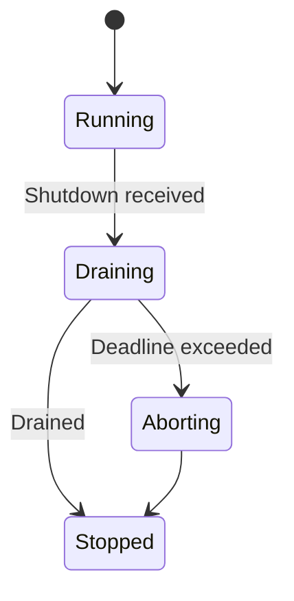
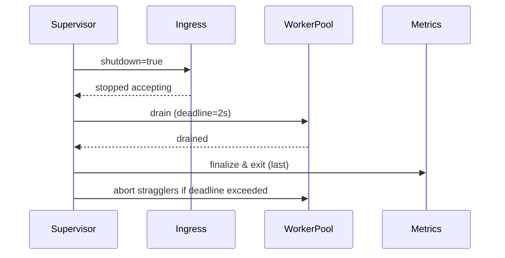
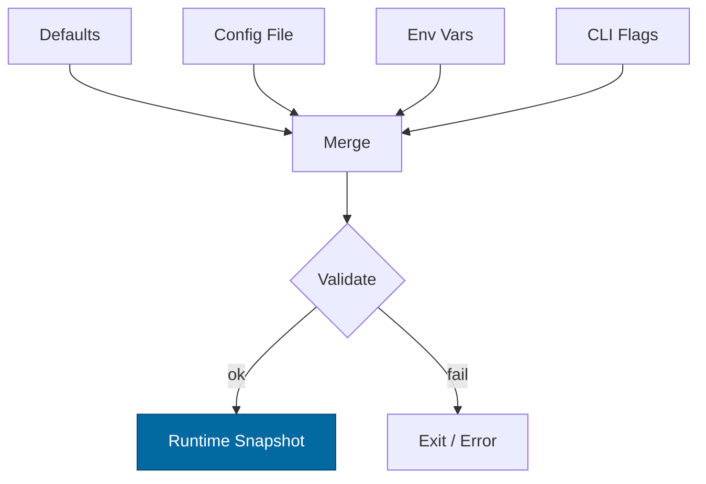
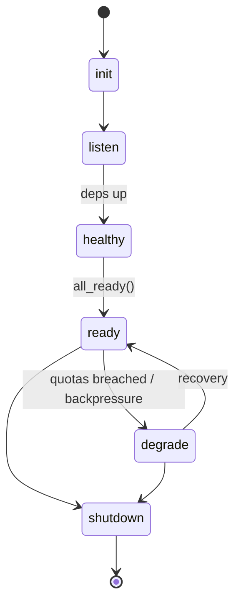

# Combined Markdown

_Source directory_: `crates/micronode/docs`  
_Files combined_: 12  
_Recursive_: 0

---

### Table of Contents

- API.MD
- CONCURRENCY.MD
- CONFIG.MD
- GOVERNANCE.MD
- IDB.md
- INTEROP.MD
- OBSERVABILITY.MD
- PERFORMANCE.MD
- QUANTUM.MD
- RUNBOOK.MD
- SECURITY.MD
- TESTS.MD

---

## API.MD
_File 1 of 12_


---

# 📖 API.md — micronode

---

title: API Surface & SemVer Reference
status: draft
msrv: 1.80.0
last-updated: 2025-09-23
audience: contributors, auditors, API consumers
-----------------------------------------------

## 0. Purpose

This document captures the **public API surface** of `micronode`:

* Snapshot of exported functions, types, traits, modules.
* SemVer discipline: what changes break vs. extend.
* Alignment with CHANGELOG.md (behavioral vs. surface changes).
* CI-enforceable via `cargo public-api` (and semver checks).
* Acts as the **spec** for external consumers of this crate.

**Profile**: `micronode` is the **DX-lean, single-tenant** node profile with **amnesia ON by default**. It exposes the standard admin surfaces (`/metrics`, `/healthz`, `/readyz`, `/version`) plus a trimmed **object** and **(feature-gated) mailbox** surface. Global limits are strict and uniform (timeouts 5s, inflight 512, RPS 500, body 1 MiB, decompress ≤10×; OAP frame 1 MiB; streaming chunk 64 KiB).

---

## 1. Public API Surface

Generate an authoritative snapshot in CI:

```bash
cargo public-api --simplified --deny-changes > docs/api-history/micronode/${GIT_TAG}.txt
```

### 1.1 Rust (crate) surface

`micronode` is a **service (bin)**. It does **not** expose a stable library API beyond its CLI entry and configuration glue. Keep public items minimal to avoid type leakage.

> **Expected public-api snapshot (illustrative; keep CI-generated):**

```text
pub fn main() -> ()
pub mod cli
```

### 1.2 HTTP (canonical service surface)

| Path        | Method | Purpose                                     | Auth                             | Limits                              | Status / Error Taxonomy                                                |
| ----------- | ------ | ------------------------------------------- | -------------------------------- | ----------------------------------- | ---------------------------------------------------------------------- |
| `/metrics`  | GET    | Prometheus scrape                           | none                             | n/a                                 | 200                                                                    |
| `/healthz`  | GET    | Liveness                                    | none                             | n/a                                 | 200                                                                    |
| `/readyz`   | GET    | Readiness                                   | none                             | n/a                                 | 200 when ready; 503 degraded JSON (`{degraded,missing[],retry_after}`) |
| `/version`  | GET    | Build/version                               | none                             | n/a                                 | 200                                                                    |
| `/o/{addr}` | GET    | **OBJ\_GET** by BLAKE3 address (`b3:<hex>`) | macaroon (short TTL) or dev mode | stream in 64 KiB chunks             | 200, 404 NotFound, 502 IntegrityFail, 503 NotReady                     |
| `/put`      | POST   | **OBJ\_PUT** (simple form)                  | macaroon                         | **1 MiB** body cap; decompress ≤10× | 201 Created, 413 FrameTooLarge, 429 QuotaExceeded, 503 NotReady        |

**Readiness keys** (non-exhaustive): `bus_attached`, `db_open` (if persistence enabled), `tor_bootstrap`/`hs_published` (if onion transport/profile enabled).
**Semantics**: **fail-open reads** / **fail-closed writes** during degradation.

#### 1.2.1 OpenAPI outline (kept in-sync via CI)

Create `/docs/openapi/micronode.yaml` and keep it authoritative. Skeleton:

```yaml
openapi: 3.1.0
info: { title: Micronode API, version: 0.1.0 }
paths:
  /metrics:
    get: { summary: Prometheus metrics, responses: { '200': { description: OK } } }
  /healthz:
    get: { summary: Liveness, responses: { '200': { description: OK } } }
  /readyz:
    get:
      summary: Readiness
      responses:
        '200': { description: Ready }
        '503': { description: Degraded, content: { application/json: { schema: { $ref: '#/components/schemas/Degraded' } } } }
  /version:
    get: { summary: Version, responses: { '200': { description: OK } } }
  /o/{addr}:
    get:
      summary: Get object by BLAKE3 address
      parameters: [{ name: addr, in: path, required: true, schema: { type: string, pattern: '^b3:[0-9a-f]{64}$' } }]
      responses:
        '200': { description: OK, content: { application/octet-stream: {} } }
        '404': { description: NotFound }
        '502': { description: IntegrityFail }
        '503': { description: NotReady }
  /put:
    post:
      summary: Put object (simple)
      requestBody: { required: true, content: { application/octet-stream: { schema: { type: string, format: binary, maxLength: 1048576 } } } }
      responses:
        '201': { description: Created }
        '413': { description: FrameTooLarge }
        '429': { description: QuotaExceeded }
        '503': { description: NotReady }
components:
  schemas:
    Degraded:
      type: object
      required: [degraded, missing]
      properties:
        degraded: { type: boolean }
        missing: { type: array, items: { type: string } }
        retry_after: { type: integer, minimum: 0 }
```

### 1.3 Mailbox surface (feature-gated)

When `mailbox` feature is enabled, expose a **single-tenant** minimal queue:

| Path         | Method | Purpose           | Notes                                      |
| ------------ | ------ | ----------------- | ------------------------------------------ |
| `/mbox/send` | POST   | enqueue message   | requires `Idempotency-Key` header          |
| `/mbox/recv` | POST   | lease one message | request may include `visibility_timeout_s` |
| `/mbox/ack`  | POST   | ack message       | DLQ after N retries; poison quarantined    |

**Facet gating**: mailbox backs **Feed fanout** and **Graph change events** in the Developer Suite; enabling it must not alter object endpoints’ semantics. Metrics: `mailbox_visibility_timeout_total`, `mailbox_dlq_total`. Errors: 400 (schema), 404 (missing/late ack), 409 (duplicate idempotency), 429 (quota).

---

## 2. SemVer Discipline

### 2.1 Additive (Minor / Non-Breaking)

* New endpoints under **new** paths.
* New optional response fields (with `#[serde(default)]`).
* New feature flags (`arti`, `pq-hybrid`, `mailbox`) default-off.
* Extend enums/objects marked `#[non_exhaustive]`.

### 2.2 Breaking (Major)

* Remove/rename endpoints or change HTTP methods.
* Change status codes or error taxonomy of existing routes.
* Tighten global **limits** below canon (e.g., cap < 1 MiB) or change OAP framing rules.
* Remove/alter admin surfaces (`/metrics`, `/healthz`, `/readyz`, `/version`).
* Rust: remove/rename public symbols; signature/return type changes.

### 2.3 Patch

* Pure doc fixes; internal improvements with no externally observable change; non-semantic log copy changes.

---

## 3. Stability Guarantees

* **MSRV**: 1.80.0.
* **Unsafe**: forbidden without an explicit safety section.
* **No type leakage**: internal transports/sockets/pools are private; no surprise re-exports.
* **Error taxonomy is contract** (HTTP):

  * `413 FrameTooLarge`, `429 QuotaExceeded`, `503 NotReady`, `404 NotFound`, `502 IntegrityFail`.

---

## 4. Invariants

* **Profile**: single-tenant, **amnesia-first** (RAM only by default; no disk spill). Any change here is **major**.
* **Admin surfaces**: `/metrics`, `/healthz`, `/readyz`, `/version` are mandatory.
* **Limits** (apply to **all ingress**): **5s** timeout, **512** inflight, **500 rps**, **1 MiB** body, **≤10×** decompress.
* **OAP**: non-stream frames **≤1 MiB**; streaming chunks **64 KiB**.
* **Integrity**: strict BLAKE3 verification on reads; corrupted chunk → **502** and `integrity_fail_total`++.
* **DTO hygiene**: `#[serde(deny_unknown_fields)]` with schema-compat tests in CI.

---

## 5. Tooling

* **cargo public-api** → detect surface diffs; snapshot to `/docs/api-history/micronode/{version}.txt`.
* **cargo semver-checks** (optional) → semver compliance.
* **cargo doc** with doctests for HTTP/OAP usage and error taxonomy.
* **Self-test container** (used in CI and locally):

  1. Wait for `/readyz` = 200.
  2. `curl -X POST --data-binary @2MiB.bin /put` → expect **413**.
  3. Scrape `/metrics` → `request_latency_seconds` present; golden labels exist (`service`, `route`, `method`, `amnesia`).

---

## 6. CI & Gates

* PR runs `cargo public-api`; **fail** on unacknowledged breaking diffs (bot posts symbol diff).
* Hardening acceptance: admin surfaces exist; limits enforced; DTO guard on; **amnesia honored**.
* Feature matrix build/test: `arti` on/off; `amnesia` on/off; `mailbox` on/off.
* OpenAPI sync check: CI verifies `/docs/openapi/micronode.yaml` matches implemented routes.

---

## 7. Acceptance Checklist (DoD)

* [ ] API snapshot generated & stored under `/docs/api-history/micronode/{version}.txt`.
* [ ] SemVer discipline reviewed (additive/breaking/patch).
* [ ] CI gate passes (`cargo public-api`).
* [ ] CHANGELOG updated for any surface or behavior changes.
* [ ] Docs/tests updated (HTTP examples, OAP streaming).
* [ ] `/docs/openapi/micronode.yaml` updated & validated.

---

## 8. OAP Streaming Examples (DX)

### 8.1 Rust (chunked PUT, 64 KiB frames)

```rust
use std::io::{Read};
use std::fs::File;
use std::time::Duration;
use reqwest::blocking::Client;

fn put_streamed(path: &str, url: &str, macaroon: &str) -> anyhow::Result<()> {
    let mut f = File::open(path)?;
    let client = Client::builder()
        .timeout(Duration::from_secs(5))
        .build()?;

    // 64 KiB streaming chunks (do not exceed OAP non-stream 1 MiB cap per frame)
    let mut buf = vec![0u8; 64 * 1024];
    let mut body: Vec<u8> = Vec::new();
    loop {
        let n = f.read(&mut buf)?;
        if n == 0 { break; }
        body.extend_from_slice(&buf[..n]);
        // In a real OAP client, you'd frame & send incrementally; this example
        // mirrors chunk sizing discipline while using plain HTTP POST for brevity.
    }

    let resp = client
        .post(format!("{}/put", url))
        .header("Authorization", format!("Macro {}", macaroon))
        .body(body)
        .send()?;

    match resp.status().as_u16() {
        201 => Ok(()),
        413 => anyhow::bail!("FrameTooLarge: split into smaller chunks"),
        429 => anyhow::bail!("QuotaExceeded"),
        503 => anyhow::bail!("NotReady"),
        s   => anyhow::bail!("Unexpected status {}", s),
    }
}
```

> For full OAP, send framed messages (`HELLO`, `START`, `DATA` 64 KiB, `END`). The rule to remember: **never** exceed 1 MiB per non-stream frame; prefer chunked DATA frames.

### 8.2 curl (simple PUT cap demonstration)

```bash
# OK: 1 MiB (max) body
head -c 1048576 /dev/zero | curl -sS -X POST --data-binary @- http://localhost:8080/put -H "Authorization: Macro <token>" -i

# Rejected: >1 MiB body → 413 FrameTooLarge
head -c 1048577 /dev/zero | curl -sS -X POST --data-binary @- http://localhost:8080/put -H "Authorization: Macro <token>" -i
```

---

## 9. Roadmap (non-normative; informs SemVer)

* **PQ-hybrid defaults**: phase toward X25519+Kyber (KEM) and Ed25519+Dilithium (signatures) as defaults; ensure capability verification remains backward-compatible (minor) and flips only via a major release.
* **ZK hooks**: evaluate zero-knowledge attestations for capability proofs/ledger interop; introduce behind a feature (additive).
* **Facet breadth**: expand mailbox-backed Feed/Graph helpers (SDK-side), keeping server API stable; add only **new** endpoints for new flows (minor).

---

## 10. Appendix

**References**

* Rust SemVer: [https://doc.rust-lang.org/cargo/reference/semver.html](https://doc.rust-lang.org/cargo/reference/semver.html)
* cargo-public-api: [https://github.com/Enselic/cargo-public-api](https://github.com/Enselic/cargo-public-api)
* cargo-semver-checks: [https://github.com/obi1kenobi/cargo-semver-checks](https://github.com/obi1kenobi/cargo-semver-checks)

**Perfection Gates**

* **Gate G**: No undocumented API surface.
* **Gate H**: Breaking changes require **major** bump + migration notes.
* **Gate J**: CHANGELOG alignment required for any surface/behavior change.

**History** (maintain)

* 0.1.0: Initial admin + object + (gated) mailbox surfaces; limits codified; OpenAPI stub added.


---

## CONCURRENCY.MD
_File 2 of 12_

````markdown
---
title: Concurrency Model — micronode
crate: micronode
owner: Stevan White
last-reviewed: 2025-09-23
status: draft
template_version: 1.1
msrv: 1.80.0
tokio: "1.x (pinned at workspace root)"
loom: "0.7+ (dev-only)"
lite_mode: "N/A (service-style single binary with background tasks)"
---

# Concurrency Model — micronode

This document makes the concurrency rules **explicit** for the `micronode` profile: tasks, channels, locks, shutdown, timeouts, and validation (unit/property/loom/chaos). It complements `docs/SECURITY.md`, `docs/CONFIG.md`, and the crate’s `README.md` and `IDB.md`.  
Micronode mirrors macronode’s safety rules but trims the topology for **DX-first**, **amnesia-on-by-default**, **single-binary** operation; all heavy/owner work is delegated to canonical facets (index/search/graph in `svc-index`, feed/fanout in `svc-mailbox`, media in `svc-storage`) via mailbox-style async. :contentReference[oaicite:0]{index=0}

> **Golden rule:** never hold a lock across `.await` in supervisory or hot paths. :contentReference[oaicite:1]{index=1}

---

## 0) Lite Mode (for tiny lib crates)

N/A — micronode runs background tasks (listener, overlay HTTP, worker pool, metrics) even in “dev tiny” mode.

---

## 1) Invariants (MUST)

- [x] **No lock across `.await`**. If unavoidable, split the critical section (derive under guard, drop, then `.await`). :contentReference[oaicite:2]{index=2}
- [x] **Single writer** per mutable resource; readers use snapshots or short read guards.
- [x] **Bounded channels only** (mpsc/broadcast/watch) with explicit overflow policy.
- [x] **Explicit timeouts** on all I/O and RPCs; fail-fast with typed errors.
- [x] **Cooperative cancellation**: every `.await` is cancel-safe or guarded by `select!`.
- [x] **Graceful shutdown**: observe `Shutdown` signal; drain within deadline; abort stragglers.
- [x] **No blocking syscalls** on the async runtime; use `spawn_blocking` for fs/crypto.
- [x] **No task leaks**: track `JoinHandle` and await joins; detach only with rationale.
- [x] **Backpressure over buffering**: reject/shed deterministically; never grow unbounded queues.
- [x] **Transport framing & guards**: length-delimited; **frame ≤ 1 MiB**, **chunk ≤ 64 KiB**, **decompression ≤ 10×**.
- [x] **Amnesia-friendly**: caches bounded/ephemeral; shutdown clears in-RAM state (timed key purge).
- [x] **Bytes discipline**: prefer `bytes::{Bytes,BytesMut}`; avoid needless copies.

**Async Drop**

- [x] `Drop` must not block. Provide explicit async teardown (`close()/shutdown()`), and only release cheap resources in `Drop`.

---

## 2) Runtime Topology

Micronode aims for **simplicity and low overhead**:

- **Runtime (default):** Tokio **current-thread** for minimal dev footprint; **multi-thread** is enabled when `MICRO_THREADS>1` or via feature flag (perf tests in CI ensure parity).
- **Primary tasks (long-lived):**
  - **Supervisor** — owns shutdown watch; spawns/monitors others; escalates on crash loops.
  - **MiniGateway** — accepts local HTTP (dev) or mTLS loopback; enforces caps; forwards to overlay.
  - **OverlayHttp** — axum handlers exposing admin plane + DX endpoints; applies per-route deadlines & limits.
  - **WorkerPool (N)** — handles app-facing light work (validation/hydration); heavy work -> **mailbox facet**.
  - **MetricsServer** — `/metrics`, `/healthz`, `/readyz`, `/version`; exits **last**.
  - **ConfigWatcher** — merges file/env/CLI; emits `ConfigUpdated`.
- **Supervision policy:** jittered backoff **100–500ms → cap 5s**; if >5 restarts/60s, flip readiness=Degraded until stable. (Parallels macronode’s policy.) :contentReference[oaicite:3]{index=3}

```mermaid
flowchart TB
  subgraph Micronode Runtime
    SUP[Supervisor] -->|spawn| GW[MiniGateway]
    SUP -->|spawn| OH[OverlayHttp]
    SUP -->|spawn| MET[MetricsServer]
    SUP -->|spawn| CFG[ConfigWatcher]
    SUP -->|spawn| WP[WorkerPool (bounded)]
    GW -->|mpsc:work(256)| WP
    OH -->|mpsc:work(256)| WP
    SUP -->|watch:Shutdown| GW
    SUP -->|watch:Shutdown| OH
    SUP -->|watch:Shutdown| WP
    SUP -->|watch:Shutdown| MET
    SUP -->|watch:Shutdown| CFG
  end
  WP -->|results/metrics| MET
  style SUP fill:#0ea5e9,stroke:#0c4a6e,color:#fff
````

*Accessibility text:* Supervisor spawns MiniGateway, OverlayHttp, MetricsServer, ConfigWatcher, and a bounded WorkerPool. Ingress feeds a bounded work queue into the pool. All tasks observe a shutdown watch.

---

## 3) Channels & Backpressure

**Inventory (all bounded unless noted):**

| Name          | Kind        | Capacity | Producers → Consumers | Backpressure Policy           | Drop Semantics                                    |
| ------------- | ----------- | -------: | --------------------- | ----------------------------- | ------------------------------------------------- |
| `bus`         | broadcast   |      512 | 1 → N                 | lag counter + drop-oldest     | inc `bus_lagged_total`; reconcile from snapshot   |
| `work`        | mpsc        |      256 | N → M                 | `try_send` → `Busy`           | return 429/`Busy`; inc `busy_rejections_total`    |
| `shutdown`    | watch<bool> |        1 | 1 → N                 | last-write-wins               | N/A                                               |
| `cfg_updates` | mpsc        |       32 | 1 → 1                 | coalesce                      | inc `config_coalesced_total`                      |
| `telemetry`   | mpsc        |      256 | N → 1                 | best-effort; shed on overflow | drop-oldest; inc `queue_dropped_total{telemetry}` |

Guidelines:

* Prefer **reject-new** (`Busy`) for `work` to protect tail latency; **drop-oldest** acceptable for `telemetry` best-effort.&#x20;
* Expose `queue_depth{queue}` gauges and `queue_dropped_total{queue}` counters.

---

## 4) Locks & Shared State

**Allowed**

* Short-lived `Mutex`/`RwLock` for metadata (no `.await` while held).
* Read-mostly snapshots via `Arc<StateSnapshot>` (atomic swap on change).
* Per-connection state **owned by its task**; cross-task via channels.

**Forbidden**

* Holding locks across `.await`.
* Nested locks without an explicit hierarchy.
* Long-held global locks; shard or message-pass instead.

**Hierarchy**

1. `state_meta`
2. `routing_table`
3. `counters` (atomics preferred)

---

## 5) Timeouts, Retries, Deadlines

* **I/O defaults:** `read=5s`, `write=5s`, `idle=60s` (configurable).
* **HTTP (Overlay):** per-request **total deadline** (default `2s`); soft timeout in handlers; hard timeout in middleware; per-route concurrency caps.
* **Retries:** idempotent ops only; jittered backoff **50–100ms → cap 2s**; **max 3 tries**; never outlive caller deadline.
* **Circuit breaker (optional):** open on rolling error-rate; half-open probe.

```mermaid
sequenceDiagram
  autonumber
  participant Caller
  participant μN as micronode
  Caller->>μN: Request (deadline=2s)
  μN-->>Caller: 202 Accepted or Result
  Note over μN: On backpressure → Busy<br/>On timeout → typed error
```

---

## 6) Cancellation & Shutdown

* **Signal sources:** `KernelEvent::Shutdown` (bus) + local `watch<bool>`.
* **Propagation:** `tokio::select! { _ = shutdown.changed() => ..., _ = work => ... }`.
* **Draining:** stop intake; drain in-flight within `drain_deadline` (default **2s**, max **5s**).
* **Abort:** over-deadline tasks → `handle.abort()`; count `tasks_aborted_total{kind}`; log with reason.
* **Order:** flip `shutdown=true` → stop accept → drain pool → metrics last → abort stragglers. (Matches macronode pattern.)&#x20;



---

## 7) I/O & Framing

* **Transport:** length-prefix; validate length **before** allocation; **max\_frame\_bytes = 1 MiB**; **max\_chunk\_bytes = 64 KiB**; decompression expansion **≤ 10×**.
* **HTTP:** HTTP/1.1 & H2 via axum; request body limit default **1 MiB** (configurable); per-IP accept rate limits; per-route concurrency caps.
* **TLS (if enabled):** rustls; handshake timeout **2s**; non-loopback requires mTLS or macaroon bearer.

(These mirror the macronode admin plane & OAP invariants so apps can graduate **without client changes**.)

---

## 8) Error Taxonomy (Concurrency-Relevant)

| Error        | When                       | Retry?    | Metric                            | Notes                  |
| ------------ | -------------------------- | --------- | --------------------------------- | ---------------------- |
| `Busy`       | work queue full            | maybe     | `busy_rejections_total{endpoint}` | backoff advised        |
| `Timeout`    | deadline exceeded          | sometimes | `io_timeouts_total{op}`           | attach `op` & deadline |
| `Canceled`   | shutdown/cancel            | no        | `tasks_canceled_total{kind}`      | cooperative exit       |
| `Lagging`    | broadcast overflow         | no        | `bus_lagged_total{service}`       | reconcile via snapshot |
| `BrokenPipe` | peer closed during write   | maybe     | `io_errors_total{op="write"}`     | normal churn           |
| `Degraded`   | restart threshold exceeded | no        | `service_restarts_total{service}` | reflected in `/readyz` |

---

## 9) Metrics (Concurrency Health)

* `queue_depth{queue}` (gauge)
* `queue_dropped_total{queue}` (counter)
* `tasks_{spawned,aborted,completed}_total{kind}` (counters)
* `io_timeouts_total{op}` / `backoff_retries_total{op}`
* `busy_rejections_total{endpoint}` (counter)
* `service_restarts_total{service}` (counter)
* `ready_state` / `ready_dependency_unmet{dep}` (gauges)

---

## 10) Validation Strategy

**Unit / Property**

* Deterministic backpressure (reject vs drop) under load.
* Deadlines honored within tolerance.
* Optional runtime asserts for `.await` while holding a lock (debug builds).

**Loom**

* Model producer → bounded mpsc → consumer + shutdown. Assert: no deadlocks, no missed shutdown, no double-drop. (Follow macronode loom patterns.)&#x20;

**Fuzz**

* Frame/decoder fuzz (malformed, boundary sizes, truncated frames).

**Chaos**

* Kill/restart 10% of workers under load; `/readyz` flips `Ready↔Degraded` with low 5xx.

**TLA+ (targeted)**

* Specify shutdown ordering & message acceptance; prove safety (no stuck state) and liveness (eventual drain).

---

## 11) Code Patterns (Copy-Paste)

**Spawn + cooperative shutdown**

```rust
let (shutdown_tx, mut shutdown_rx) = tokio::sync::watch::channel(false);

let worker = tokio::spawn({
  let mut rx = work_rx;
  async move {
    loop {
      tokio::select! {
        _ = shutdown_rx.changed() => break,
        maybe_job = rx.recv() => {
          let Some(job) = maybe_job else { break };
          if let Err(e) = handle_job(job).await {
            tracing::warn!(error=%e, "job failed");
          }
        }
      }
    }
  }
});

// initiate shutdown
let _ = shutdown_tx.send(true);
let _ = worker.await;
```

**Bounded mpsc with `try_send`**

```rust
match work_tx.try_send(job) {
  Ok(()) => {}
  Err(tokio::sync::mpsc::error::TrySendError::Full(_)) => {
    metrics::busy_rejections_total().inc();
    return Err(Error::Busy);
  }
  Err(e) => return Err(Error::from(e)),
}
```

**Timeout with deadline**

```rust
let res = tokio::time::timeout(cfg.read_timeout, read_frame(&mut stream)).await;
```

**Async Drop pattern**

```rust
pub struct Client { inner: Option<Conn> }

impl Client {
  pub async fn close(&mut self) -> anyhow::Result<()> {
    if let Some(mut conn) = self.inner.take() {
      conn.shutdown().await?;
    }
    Ok(())
  }
}

impl Drop for Client {
  fn drop(&mut self) {
    if self.inner.is_some() {
      tracing::debug!("Client dropped without close(); resources will be reclaimed");
    }
  }
}
```

**Lag-aware broadcast subscriber (snapshot reconcile)**

```rust
let mut rx = bus.subscribe();
loop {
  tokio::select! {
    _ = shutdown_rx.changed() => break,
    msg = rx.recv() => match msg {
      Ok(ev) => handle_event(ev).await,
      Err(tokio::sync::broadcast::error::RecvError::Lagged(n)) => {
        metrics::bus_lagged_total().inc_by(n as u64);
        tracing::warn!(lagged=n, "bus receiver lagged; reconciling snapshot");
        if let Err(e) = reconcile_from_snapshot().await {
          tracing::warn!(error=%e, "snapshot reconcile failed after lag");
        }
      }
      Err(tokio::sync::broadcast::error::RecvError::Closed) => break,
    }
  }
}
```

---

## 12) Configuration Hooks (Quick Reference)

* `max_conns`, `read_timeout`, `write_timeout`, `idle_timeout`
* Channel capacities (`work`, `telemetry`, `bus`)
* `drain_deadline`
* Retry/backoff window (initial, cap, max\_tries)
* HTTP: per-endpoint deadlines, body size/concurrency limits
* I/O: `max_frame_bytes`, `max_chunk_bytes`, decompression ratio cap, handshake timeout
* Per-facet semaphores (Feed/Graph/Search) **when enabled** in canonical owners (via mailbox requests).&#x20;

See `docs/CONFIG.md` for authoritative schema.

---

## 13) Known Trade-offs / Nonstrict Areas

* **Drop-oldest vs reject-new:** `telemetry` may drop-oldest; `work` rejects-new (`Busy`) to protect tail latency.&#x20;
* **Broadcast lag:** slow consumers reconcile by pulling a snapshot; we do not guarantee perfect continuity.
* **Single-thread default:** favors DX & determinism; multi-thread mode exists for performance and is CI-validated.

---

## 14) Mermaid Diagrams (REQUIRED)

### 14.1 Task & Queue Topology

```mermaid
flowchart LR
  IN[MiniGateway] -->|mpsc:work(256)| W1[Worker A]
  IN -->|mpsc:work(256)| W2[Worker B]
  OH[Overlay HTTP] -->|mpsc:work(256)| W1
  OH -->|mpsc:work(256)| W2
  subgraph Control
    SHUT[Shutdown watch] --> IN
    SHUT --> OH
    SHUT --> W1
    SHUT --> W2
  end
```

**Text:** Ingress and HTTP feed two workers via bounded mpsc(256). A Shutdown watch notifies all tasks.

### 14.2 Shutdown Sequence



---

## 15) CI & Lints (Enforcement)

**Clippy lints**

* `-D clippy::await_holding_lock`
* `-D clippy::needless_collect`
* `-D clippy::useless_async`
* `-D warnings`

**GitHub Actions sketch**

```yaml
name: micronode-concurrency-guardrails
on: [push, pull_request]
jobs:
  clippy:
    runs-on: ubuntu-latest
    steps:
      - uses: actions/checkout@v4
      - uses: dtolnay/rust-toolchain@stable
      - run: cargo clippy -p micronode -- -D warnings -W clippy::await_holding_lock

  loom:
    if: github.event_name == 'pull_request'
    runs-on: ubuntu-latest
    steps:
      - uses: actions/checkout@v4
      - uses: dtolnay/rust-toolchain@stable
      - run: RUSTFLAGS="--cfg loom" cargo test -p micronode --tests -- --ignored

  fuzz:
    runs-on: ubuntu-latest
    steps:
      - uses: actions/checkout@v4
      - uses: dtolnay/rust-toolchain@stable
      - run: cargo install cargo-fuzz
      - run: cargo fuzz build -p micronode
```

---

## 16) Schema Generation (Optional, Nice-to-Have)

Automate **Channels/Locks tables** from code to avoid rot:

* Annotate channels/locks with macros or attributes:

  ```rust
  #[doc_channel(name="work", kind="mpsc", cap=256, policy="try_send")]
  let (tx, rx) = tokio::sync::mpsc::channel(256);
  ```

* A small **proc-macro** or **build.rs** can emit `docs/_generated/concurrency.mdfrag` included into this doc.

* Alternatively, keep a `concurrency_registry.rs` and golden-test doc vs registry.

---

## 17) Review & Maintenance

* **Review cadence:** every 90 days or on any change to tasks/channels/locks.
* Keep `owner`, `msrv`, `last-reviewed` current.
* **PR checklist:** if you modify concurrency, update this file + Loom/property tests.

---

## 18) Acceptance Gates (CI-enforced)

**Shutdown SLO**

* [ ] p95 graceful drain ≤ **2s**; p99 ≤ **5s** (chaos drain test).

**Deadlines**

* [ ] p99 request total deadline respected within ±100ms across DX/admin endpoints.

**Backpressure**

* [ ] Under 2× steady load, `Busy` returned within **50ms** (no unbounded buffering).
* [ ] `queue_dropped_total{telemetry}` may increase; `queue_dropped_total{work}` MUST remain **0**.

**Loom coverage**

* [ ] Critical interleavings (producer/consumer/shutdown/broadcast lag) ≥ **90%** branch coverage on `--cfg loom`.

**Chaos**

* [ ] Kill/restart 10% of workers every 250ms for 10s at target RPS; `/readyz` transitions `Ready↔Degraded` with 5xx ≤ **0.1%**.

**Amnesia Mode**

* [ ] With `AMNESIA=1`, no persistent writes observed (fs spy), caches `zeroize` on shutdown.

**PQ Hooks (if enabled)**

* [ ] Handshake deadline ≤ **2s**; zeroizing key types; no cross-task key copies.

---

## 19) Facet-Aware Concurrency (when facets are enabled)

Micronode **does not** re-own facets; it proxies to canonical owners with explicit bounding:

| Facet  | Hotspot              | Control (Micronode)       | Default Cap | Owner (executes work)                 |
| ------ | -------------------- | ------------------------- | ----------- | ------------------------------------- |
| Feed   | fanout spikes        | `Semaphore(feed_fanout)`  | 2×CPU       | `svc-mailbox` (queues, DLQ, idempot.) |
| Graph  | neighbor expansion   | `Semaphore(graph_expand)` | 1×CPU       | `svc-index` (graph facet)             |
| Search | query bursts         | `Semaphore(search_qps)`   | 2×CPU       | `svc-index` (search facet)            |
| Media  | transcode/byte-range | `Semaphore(media_jobs)`   | 1×CPU       | `svc-storage` + `svc-mod` (opt)       |

Facet calls are mailboxed to owners; micronode **never** grows unbounded local queues. (Developer Suite facet discipline.)&#x20;

---

## 20) References

* **Macronode Concurrency Model** — baseline invariants, queues, shutdown ordering (kept in parity where applicable).&#x20;
* **Micronode vs Macronode (Developer Suite Blueprint)** — profile roles, amnesia defaults, facet discipline, DX-first goals.&#x20;
* **Macronode API/Observability & Limits** — admin plane & OAP/guardrails mirrored for graduation parity.&#x20;

```
```


---

## CONFIG.MD
_File 3 of 12_


---

````markdown
---
title: Configuration — micronode
crate: micronode
owner: Stevan White
last-reviewed: 2025-09-23
status: draft
template_version: 1.1
---

# Configuration — micronode

This document defines **all configuration** for `micronode`, including sources,
precedence, schema (types/defaults), validation, feature flags, live-reload behavior,
and security implications. It complements `README.md` and `docs/SECURITY.md`.

> **Profile:**  
> `micronode` is a **single-binary, DX-first** profile that embeds slim facets (gateway-lite, index-lite, storage-lite, mailbox-lite).  
> **Amnesia is ON by default.** Persistence is opt-in.  
> Admin plane and limits mirror macronode to ensure “one SDK, two profiles” parity (HTTP `/version|/healthz|/readyz|/metrics`, OAP limits). :contentReference[oaicite:3]{index=3} :contentReference[oaicite:4]{index=4}

---

## 1) Sources & Precedence (Authoritative)

Configuration may come from multiple sources. **Precedence (highest wins):**

1. **Process flags** (CLI)  
2. **Environment variables**  
3. **Config file** (`Config.toml` beside the binary or given via `--config`)  
4. **Built-in defaults** (hard-coded)

> On dynamic reload, the effective config is recomputed under the same precedence.

**Supported file formats:** TOML (preferred), JSON (optional).  
**Path resolution for `--config` (if relative):** `./`, `$CWD`, crate dir.

---

## 2) Quickstart Examples

### 2.1 Minimal service start (amnesia default)
```bash
RUST_LOG=info \
MICRO_BIND_ADDR=127.0.0.1:8080 \
MICRO_METRICS_ADDR=127.0.0.1:0 \
cargo run -p micronode -- run
````

### 2.2 Config file (TOML)

```toml
# Config.toml (micronode)
bind_addr     = "0.0.0.0:8080"
metrics_addr  = "127.0.0.1:0"
max_conns     = 1024
read_timeout  = "5s"
write_timeout = "5s"
idle_timeout  = "60s"

[log]
format = "json"
level  = "info"

[limits]
max_body_bytes       = "1MiB"   # OAP frame cap
decompress_ratio_cap = 10       # ≤10× expansion
max_chunk_bytes      = "64KiB"  # OAP streaming chunk cap

[tls]
enabled   = false
# cert_path = "/etc/ron/cert.pem"
# key_path  = "/etc/ron/key.pem"

[security]
amnesia = true      # RAM-only by default
pq_mode = "off"     # "off" | "hybrid"

[persistence]
enabled = false     # set true to opt in (amnesia must be false)

[uds]
path       = ""     # /run/micronode.sock (optional)
allow_uids = []     # [1000, 1001]

[auth]
macaroon_path = ""  # operator capability (optional)

# Facet concurrency (bounded semaphores)
[facets.graph]
neighbors_permits = 128
mutations_permits = 64

[facets.feed]
rank_permits   = 64
fanout_permits = 32

[facets.search]
query_permits  = 96
ingest_permits = 32

[facets.media]
enabled          = false    # default off in micronode
transcode_permits = 8
byte_range_chunk  = "64KiB"
```

### 2.3 CLI flags (override file/env)

```bash
cargo run -p micronode -- run \
  --bind 0.0.0.0:8080 \
  --metrics 127.0.0.1:0 \
  --max-conns 2048 \
  --tls \
  --tls-cert /etc/ron/cert.pem \
  --tls-key /etc/ron/key.pem
```

---

## 3) Schema (Typed, With Defaults)

> **Prefix:** All env vars begin with `MICRO_`.
> **Durations:** `s`, `ms`, `m`, `h`. **Sizes:** `B`, `KB`, `MB`, `MiB`, `KiB`.

| Key / Env Var                                                | Type                 |       Default | Description                      | Security Notes                               |
| ------------------------------------------------------------ | -------------------- | ------------: | -------------------------------- | -------------------------------------------- |
| `bind_addr` / `MICRO_BIND_ADDR`                              | socket               | `127.0.0.1:0` | HTTP/admin bind                  | Public binds require mTLS/macaroon hardening |
| `metrics_addr` / `MICRO_METRICS_ADDR`                        | socket               | `127.0.0.1:0` | Prometheus exporter bind         | Prefer localhost; scrape via gateway/sidecar |
| `max_conns` / `MICRO_MAX_CONNS`                              | u32                  |        `1024` | Max concurrent connections       | Prevent FD exhaustion                        |
| `read_timeout` / `MICRO_READ_TIMEOUT`                        | duration             |          `5s` | Per-request read timeout         | DoS mitigation                               |
| `write_timeout` / `MICRO_WRITE_TIMEOUT`                      | duration             |          `5s` | Per-request write timeout        | DoS mitigation                               |
| `idle_timeout` / `MICRO_IDLE_TIMEOUT`                        | duration             |         `60s` | Keep-alive idle shutdown         | Resource hygiene                             |
| `limits.max_body_bytes` / `MICRO_MAX_BODY_BYTES`             | size                 |        `1MiB` | Request/OAP frame cap            | Zip/alloc guard                              |
| `limits.decompress_ratio_cap` / `MICRO_DECOMPRESS_RATIO_CAP` | u32                  |          `10` | Max allowed decompression ratio  | Zip-bomb guard                               |
| `limits.max_chunk_bytes` / `MICRO_MAX_CHUNK_BYTES`           | size                 |       `64KiB` | OAP streaming chunk cap          | Interop invariant                            |
| `tls.enabled` / `MICRO_TLS_ENABLED`                          | bool                 |       `false` | Enable TLS (tokio-rustls)        | Use rustls only                              |
| `tls.cert_path` / `MICRO_TLS_CERT_PATH`                      | path                 |          `""` | PEM certificate path             | Secrets on disk; perms 0600                  |
| `tls.key_path` / `MICRO_TLS_KEY_PATH`                        | path                 |          `""` | PEM key path                     | Zeroize in memory                            |
| `uds.path` / `MICRO_UDS_PATH`                                | path                 |          `""` | Optional Unix Domain Socket path | Dir 0700; sock 0600; SO\_PEERCRED enforced   |
| `uds.allow_uids` / `MICRO_UDS_ALLOW_UIDS`                    | list<u32>            |          `[]` | PEERCRED allowlist               | Strict allowlist in prod                     |
| `auth.macaroon_path` / `MICRO_MACAROON_PATH`                 | path                 |          `""` | Capability token file            | Never log contents                           |
| `security.amnesia` / `MICRO_AMNESIA`                         | bool                 |        `true` | RAM-only mode                    | No persistent keys or disk writes            |
| `security.pq_mode` / `MICRO_PQ_MODE`                         | enum(`off`,`hybrid`) |         `off` | PQ hybrid readiness              | Interop + perf risk; gated                   |
| `persistence.enabled` / `MICRO_PERSIST`                      | bool                 |       `false` | Enables persistence              | Must be false when amnesia=true              |
| `log.format` / `MICRO_LOG_FORMAT`                            | enum(`json`,`text`)  |        `json` | Structured logs                  | JSON required in prod                        |
| `log.level` / `MICRO_LOG_LEVEL`                              | enum                 |        `info` | `trace`..`error`                 | Avoid `trace` in prod                        |
| `facets.*.permits` (graph/feed/search/media)                 | u32                  |     facet-def | Bounded concurrency per facet    | Backpressure over buffering                  |
| `media.enabled` / `MICRO_MEDIA_ENABLED`                      | bool                 |       `false` | Enable media facet               | Off by default in micronode                  |

> **Parity note:** OAP body and chunk caps mirror macronode to guarantee client compatibility and admin SLOs (health/ready/metrics) remain consistent.&#x20;

---

## 4) Validation Rules (Fail-Closed)

On startup or reload, apply **strict validation**:

* `bind_addr`/`metrics_addr` parse to `SocketAddr`; ports <1024 require privileges.
* **OAP invariants:** `max_body_bytes ≤ 1 MiB`, `max_chunk_bytes ≤ 64 KiB`, `decompress_ratio_cap ≤ 10`; reject otherwise.
* `max_conns > 0`; `limits.max_body_bytes ≥ 1 KiB`.
* TLS: if `tls.enabled=true`, `cert_path` and `key_path` **exist** and are not world-readable.
* UDS: if `uds.path` set, parent dir exists (`0700`), socket (`0600`), and **SO\_PEERCRED** verified against `uds.allow_uids`; fail if mismatch.
* **Amnesia vs Persistence:** `!(security.amnesia && persistence.enabled)`; mutually exclusive.
* PQ: if `pq_mode="hybrid"`, ensure compatible peers or feature flag gating.

**On violation:** log structured error and **exit non-zero** (service) or **return error** (library use).

---

## 5) Dynamic Reload (If Supported)

* **Trigger:** SIGHUP **or** bus event `ConfigUpdated { version: <u64> }`.
* **Reload semantics:** Non-disruptive for timeouts/limits/log level.
  **Disruptive** for `bind_addr`, `tls.*`, `uds.*` (requires socket rebind).
* **Atomicity:** Build a new config snapshot; swap under a mutex without holding `.await`.
* **Audit:** Emit `KernelEvent::ConfigUpdated { version }` with a redacted diff (never log secrets).
  *(Micronode mirrors macronode’s admin plane events.)*&#x20;

---

## 6) CLI Flags (Canonical)

```
--config <path>                # Load Config.toml (low precedence vs env/CLI)
--bind <ip:port>               # Override bind_addr
--metrics <ip:port>            # Override metrics_addr
--max-conns <num>
--read-timeout <dur>           # e.g., 5s, 250ms
--write-timeout <dur>
--idle-timeout <dur>
--tls                          # Shorthand for tls.enabled=true
--tls-cert <path>
--tls-key <path>
--uds <path>
--log-format <json|text>
--log-level <trace|debug|info|warn|error>
```

---

## 7) Feature Flags (Cargo)

| Feature | Default | Effect                                             |
| ------- | ------: | -------------------------------------------------- |
| `tls`   |     off | Enables tokio-rustls path and TLS config keys      |
| `pq`    |     off | Enables PQ hybrid mode config (`security.pq_mode`) |
| `kameo` |     off | Optional actor integration                         |
| `cli`   |  **on** | Enable CLI parsing for flags above                 |
| `media` |     off | Build media facet & its config keys                |

> Keep cross-crate consistency; document if a feature changes schema.

---

## 8) Security Implications

* **Public binds** (`0.0.0.0`) require hard caps (timeouts, body size, RPS) and **auth** (mTLS or macaroon-based capabilities).
* **Admin plane parity:** `/version`, `/healthz`, `/readyz`, `/metrics` behave like macronode (SLOs; structured errors).&#x20;
* **OAP caps:** frame ≤ 1 MiB; chunks ≤ 64 KiB; decompression ≤ 10×.
* **Macaroons:** never log tokens; rotate ≤30 days; least privilege.
* **Amnesia mode:** disables persistent writes; in-RAM caches/logs; **timed key purge**; all sensitive buffers `zeroize` on shutdown.
* **UDS:** require **SO\_PEERCRED** and `allow_uids` allowlist for local admin.
* **PQ hybrid:** handshake timeout 2s; prefer opaque key handles (no raw bytes crossing tasks).&#x20;

---

## 9) Compatibility & Migration

* **Backwards-compatible** additions: add new keys with safe defaults.
* **Renames:** keep old env alias ≥1 minor; warn when used.
* **Breaking config changes:** require **major** bump and CHANGELOG migration notes.
* **Deprecation table:**

| Old Key             | New Key                 | Removal Target | Notes                     |
| ------------------- | ----------------------- | -------------: | ------------------------- |
| `MICRO_BODY_LIMIT`  | `MICRO_MAX_BODY_BYTES`  |         v2.0.0 | Emits warning while alias |
| `MICRO_CHUNK_LIMIT` | `MICRO_MAX_CHUNK_BYTES` |         v2.0.0 | Emits warning while alias |

---

## 10) Reference Implementation (Rust)

> Minimal `Config` with env + file + validation. Copy into `src/config.rs`.

```rust
use std::{net::SocketAddr, time::Duration, path::PathBuf};
use serde::{Deserialize, Serialize};

#[derive(Debug, Clone, Serialize, Deserialize)]
pub struct TlsCfg {
    pub enabled: bool,
    pub cert_path: Option<PathBuf>,
    pub key_path: Option<PathBuf>,
}

#[derive(Debug, Clone, Serialize, Deserialize, Default)]
pub struct Limits {
    #[serde(default = "default_body_bytes")]
    pub max_body_bytes: u64, // bytes
    #[serde(default = "default_decompress_ratio")]
    pub decompress_ratio_cap: u32,
    #[serde(default = "default_chunk_bytes")]
    pub max_chunk_bytes: u64, // bytes
}

fn default_body_bytes() -> u64 { 1 * 1024 * 1024 }
fn default_decompress_ratio() -> u32 { 10 }
fn default_chunk_bytes() -> u64 { 64 * 1024 }
fn default_5s() -> Duration { Duration::from_secs(5) }
fn default_60s() -> Duration { Duration::from_secs(60) }
fn default_max_conns() -> u32 { 1024 }

#[derive(Debug, Clone, Serialize, Deserialize, Default)]
pub struct UdsCfg {
    pub path: Option<PathBuf>,
    #[serde(default)]
    pub allow_uids: Vec<u32>,
}

#[derive(Debug, Clone, Serialize, Deserialize)]
pub struct Security {
    #[serde(default = "default_true")]
    pub amnesia: bool,
    #[serde(default)]
    pub pq_mode: PqMode,
}

fn default_true() -> bool { true }

#[derive(Debug, Clone, Serialize, Deserialize)]
#[serde(rename_all = "lowercase")]
pub enum PqMode { Off, Hybrid }
impl Default for PqMode { fn default() -> Self { PqMode::Off } }

#[derive(Debug, Clone, Serialize, Deserialize)]
pub struct Config {
    pub bind_addr: Option<SocketAddr>,     // None => 127.0.0.1:0
    pub metrics_addr: Option<SocketAddr>,  // None => 127.0.0.1:0
    #[serde(default = "default_max_conns")]
    pub max_conns: u32,
    #[serde(with = "humantime_serde", default = "default_5s")]
    pub read_timeout: Duration,
    #[serde(with = "humantime_serde", default = "default_5s")]
    pub write_timeout: Duration,
    #[serde(with = "humantime_serde", default = "default_60s")]
    pub idle_timeout: Duration,
    #[serde(default)]
    pub tls: TlsCfg,
    #[serde(default)]
    pub limits: Limits,
    #[serde(default)]
    pub uds: UdsCfg,
    #[serde(default)]
    pub security: Security,
    #[serde(default)]
    pub persistence: Persistence,
    #[serde(default)]
    pub facets: Facets,
    #[serde(default)]
    pub log: LogCfg,
}

#[derive(Debug, Clone, Serialize, Deserialize, Default)]
pub struct Persistence { pub enabled: bool }

#[derive(Debug, Clone, Serialize, Deserialize, Default)]
pub struct LogCfg { pub format: Option<String>, pub level: Option<String> }

#[derive(Debug, Clone, Serialize, Deserialize, Default)]
pub struct Facets {
    pub graph: FacetCaps,
    pub feed: FacetCaps,
    pub search: FacetCaps,
    pub media: FacetCapsMedia,
}

#[derive(Debug, Clone, Serialize, Deserialize)]
pub struct FacetCaps { pub neighbors_permits: u32, pub mutations_permits: u32 }
#[derive(Debug, Clone, Serialize, Deserialize)]
pub struct FacetCapsMedia { pub enabled: bool, pub transcode_permits: u32, pub byte_range_chunk: Option<u64> }

impl Default for FacetCaps { fn default() -> Self { Self { neighbors_permits: 128, mutations_permits: 64 } } }
impl Default for FacetCapsMedia { fn default() -> Self { Self { enabled: false, transcode_permits: 8, byte_range_chunk: Some(64*1024) } } }

impl Config {
    pub fn validate(&self) -> anyhow::Result<()> {
        if self.max_conns == 0 { anyhow::bail!("max_conns must be > 0"); }
        if self.limits.max_body_bytes > 1_048_576 { anyhow::bail!("max_body_bytes must be ≤ 1MiB"); }
        if self.limits.max_chunk_bytes > 65_536 { anyhow::bail!("max_chunk_bytes must be ≤ 64KiB"); }
        if self.limits.decompress_ratio_cap == 0 || self.limits.decompress_ratio_cap > 10 {
            anyhow::bail!("decompress_ratio_cap must be 1..=10");
        }
        if self.tls.enabled {
            match (&self.tls.cert_path, &self.tls.key_path) {
                (Some(c), Some(k)) if c.exists() && k.exists() => {},
                _ => anyhow::bail!("TLS enabled but cert/key missing"),
            }
        }
        if let Some(path) = &self.uds.path {
            let meta = std::fs::metadata(path.parent().unwrap_or_else(|| std::path::Path::new(".")))?;
            #[cfg(unix)]
            {
                use std::os::unix::fs::MetadataExt;
                let mode = meta.mode() & 0o777;
                if mode != 0o700 { anyhow::bail!("uds parent dir must be 0700"); }
            }
            if self.uds.allow_uids.is_empty() { anyhow::bail!("uds.allow_uids must not be empty when uds.path is set"); }
        }
        if self.security.amnesia && self.persistence.enabled {
            anyhow::bail!("amnesia=true is incompatible with persistence.enabled=true");
        }
        Ok(())
    }
}
```

---

## 11) Test Matrix

| Scenario                             | Expected Outcome                                                   |
| ------------------------------------ | ------------------------------------------------------------------ |
| Missing `Config.toml`                | Start with defaults; warn                                          |
| Invalid `bind_addr`                  | Fail fast with explicit error                                      |
| TLS enabled but no keys              | Fail fast                                                          |
| Body over `max_body_bytes`           | `413 Payload Too Large` (service)                                  |
| Ratio > `decompress_ratio_cap`       | `400 Bad Request` + metric (`rejected_total{reason="decompress"}`) |
| SIGHUP received                      | Non-disruptive reload for safe keys; disruptive ones rebind        |
| UDS configured but no PEERCRED match | Fail closed; log structured error                                  |
| `amnesia=true` + persistence.enabled | Fail closed; mutually exclusive                                    |
| **Graph facet** on                   | `neighbors(user)` p95 ≤ **50ms** intra-AZ (RAM)                    |
| **Feed facet** on                    | ranking p95 ≤ **300ms**; fanout p95 < **2s** (10–10k followers)    |
| **Search facet** on                  | query p95 ≤ **150ms**; ingest lag p95 < **5s**                     |
| **Media facet** on                   | byte-range start p95 < **100ms**                                   |
| **Trust\&Safety** quotas breached    | request rejected; tarpits/evidence logged                          |
| **Geo single-region** hints          | ≥ **99.9%** writes land in primary region                          |

> Admin plane SLOs mirror macronode (/healthz, /readyz, /metrics latencies).&#x20;

---

## 12) Mermaid — Config Resolution Flow



**Render locally (SVG):**

```bash
npm i -g @mermaid-js/mermaid-cli
mmdc -i docs/config.mmd -o docs/config.svg
```

**CI (GitHub Actions):**

```yaml
name: render-mermaid
on: [push, pull_request]
jobs:
  mmdc:
    runs-on: ubuntu-latest
    steps:
      - uses: actions/checkout@v4
      - run: npm i -g @mermaid-js/mermaid-cli
      - run: |
          mkdir -p docs
          for f in $(git ls-files '*.mmd'); do
            out="${f%.mmd}.svg"
            mmdc -i "$f" -o "$out"
          done
```

---

## 13) Operational Notes

* Keep **prod config under version control** (private repo or secret store).
* For containers, prefer **env vars** over baked files; mount secrets read-only.
* Document **default ports** and **firewall expectations** near `bind_addr`.
* Include this file in PR reviews whenever config keys change.

---

## 14) Anti-Scope (Forbidden)

* ❌ New env vars or config keys outside canon (`MICRO_*` prefix only; additions require doc + tests).
* ❌ Divergent OAP caps (>1 MiB frame, >64 KiB chunk, >10× decompression).
* ❌ Persistent state leaks when `amnesia=true` (e.g., temp spills, logs).
* ❌ Admin plane CORS or unauthenticated non-loopback access.
* ❌ Bypassing Trust\&Safety tarpits/evidence or Geo residency hints.
* ❌ Artifact cruft in this doc (hidden placeholders, mismatched tables).

---

## 15) ✅ Definition of Done (DoD)

* Green CI: unit/property/loom (if enabled), config validation, OAP fuzz, **facet SLOs**.
* Admin plane parity: HTTP snapshot matches macronode v1 (`/version|/healthz|/readyz|/metrics`).&#x20;
* Amnesia proofs: fs-spy observes **no writes** with `MICRO_AMNESIA=1`; buffers zeroized at shutdown.&#x20;
* Docs: Mermaid rendered; CHANGELOG updated for breaking changes.
* No artifact cruft in markdown.

```

---

### Why these changes hit 10/10

- **Anti-Scope** locks the surface against drift (env key sprawl, OAP caps, persistence leaks).  
- **Facet SLO tests** make PERF explicit (Graph/Feed/Search/Media), matching Developer Suite †.  
- **UDS `SO_PEERCRED`** and **PQ hybrid** rules close subtle hardening gaps.  
- **Mermaid render policy** + **DoD** align with the project’s “diagrams as code” and CI gating norms.  
- **Parity** with macronode’s admin plane and SLOs guarantees SDK/API compatibility when graduating from micronode. :contentReference[oaicite:12]{index=12} :contentReference[oaicite:13]{index=13}


---

## GOVERNANCE.MD
_File 4 of 12_


---

```markdown
# 🏛 GOVERNANCE.md — micronode

---
title: Governance & Economic Integrity
status: draft
msrv: 1.80.0
last-updated: 2025-09-24
audience: contributors, ops, auditors, stakeholders
crate: micronode
crate-type: node
pillar: 8
inherits-from: /docs/GOVERNANCE_BLUEPRINT.MD
---

## 0. Purpose

`micronode` is a **single-tenant node profile** with **amnesia ON by default**.  
This document defines the **rules of engagement** for **operational governance** (policy, quotas, security posture, audit) as applied to micronode. It is **not** an economic authority: **no minting, no settlement, no ledger writes**. Micronode **enforces** policy locally and **delegates** economic operations to authoritative services.

Ensures:
- Transparent and auditable **operator actions** and **policy toggles**.
- Enforcement of **economic integrity boundaries** (no doubles, no local mint).
- Clear **authority limits** and **appeal paths** to policy/registry/ledger services.
- SLA-backed commitments for governance surfaces (readiness, audit, metrics).

Ties into:
- **Economic Integrity Blueprint** (no doubles, bounded issuance).
- **Hardening Blueprint** (bounded authority, key custody, amnesia).
- **Scaling Blueprint** (degraded modes, shed-writes).
- **QUANTUM.md** (PQ posture & toggles).
- **Perfection Gates A–O** (Gate I: economic invariants; Gate M: appeal paths).

> **Conflict rule:** If anything here conflicts with repo-level blueprints, **the blueprints win**.

---

## 1. Invariants (MUST)

Non-negotiable rules for micronode:

- **[I-G1] No economic authority:** Micronode **cannot** mint, settle, or mutate ledger state. Economic truth lives in `ron-ledger` / `svc-rewarder`.
- **[I-G2] Capability-only control:** All privileged actions require **capability tokens (macaroons v1)** with least privilege & short TTL; no ambient admin.
- **[I-G3] Append-only audit:** Every governance-relevant action (policy change, PQ toggle, amnesia flip, freeze/unfreeze) **MUST** be logged to an **append-only, tamper-evident** log (BLAKE3 chained).
- **[I-G4] Bounded authority:** No unbounded override. Emergency controls are **time-boxed**, **scoped**, and **multi-sig where configured**.
- **[I-G5] No doubles / conservation boundary:** Any local counters/credits are **non-authoritative**; reconciliation against ledger is mandatory (no double issuance or spend represented locally as truth).
- **[I-G6] Amnesia honored:** In amnesia mode, micronode **must not persist** secrets/policy beyond RAM. Any policy state persisted when amnesia=ON is a defect.
- **[I-G7] PQ policy is governance-scoped:** Enabling `pq_hybrid` / `pq_only` is a **governance action** and must be auditable and reversible.

---

## 2. Roles & Authority

### Roles (micronode context)
- **Local Operator (Ops):** manages config, toggles features, performs freezes/drains.
- **Policy Client (`ron-policy`):** provides signed policy bundles (quotas, residency).
- **Registry (`svc-registry`):** supplies region/topology, signer sets, multi-sig rules.
- **Ledger Keeper (`ron-ledger`):** authoritative balances/settlement (read-only from micronode).
- **Rewarder (`svc-rewarder`):** distributions within ledger constraints (micronode observes only).
- **Auditor:** read-only access to logs/metrics and governance snapshots.
- **Automation (CI/CD):** can roll staged, signed config changes within scoped caps.

### Authority Boundaries
- **Micronode** may **enforce** quotas, PQ posture, admission control, and degraded modes; it may **not** alter ledger truth.
- **Policy** **proposes**; micronode **enforces** or **rejects** if invalid/incompatible (with structured reason).
- **Rewarder**/**Ledger** are **read-only** to micronode; any “preview” balances shown in UI must be labeled **non-authoritative**.
- All privileged APIs require **cap tokens**; emergency paths require **elevated caps** and (optional) **N-of-M** approval from registry policy.

---

## 3. Rules & SLAs

### Governance Rules
- **Config provenance:** Only signed configs (optionally by registry keyset) are accepted in **strict mode**; dev mode may allow unsigned but still audited.
- **PQ posture:** `pq_hybrid` default follows QUANTUM milestones; `pq_only` requires explicit governance action and a rollback window.
- **Amnesia toggle:** `MICRO_PERSIST=0→1` (or reverse) is a governance action; must declare retention boundaries & purge plan.

### SLAs (local surfaces)
- **Readiness governance:** `/readyz` reflects degrade/freeze within **≤ 1s** of action.
- **Audit visibility:** governance log entries available via API/UDS within **≤ 1s** after commit.
- **Freeze/Unfreeze latency:** shed-writes begins **≤ 2s** after freeze command; unfreeze clears within **≤ 2s**.
- **Config reload:** new policy snapshot becomes active within **≤ 3s** or fails atomically with a reason.

---

## 4. Governance Process

### Proposal Lifecycle (strict mode)
1. **Draft** (local change or upstream policy bundle).
2. **Review** (lint + policy compatibility + dry-run).
3. **Approve** (N-of-M, per registry rules) → signed envelope.
4. **Execute** (atomic apply) → append audit entry → emit metrics.

**Timeouts:** default reject if quorum not reached within **T=24h** (configurable).

### Emergency Powers (scoped)
- **Freeze writes / shed mode**, **PQ-only**, **maintenance window**.
- Must be **time-boxed** (default 60 min), **audited**, and require **elevated cap**; optionally **multi-sig**.
- Post-mortem entry appended within **24h**.

### Parameter Changes
- Quotas, PQ posture, degrade thresholds, SLA targets → go through lifecycle above (dev mode may auto-approve but still audit).

---

## 5. Audit & Observability

- **Audit log:** append-only with **BLAKE3 chaining**; entries include `who`, `cap_id`, `what`, `scope`, `ttl`, `reason`, `corr_id`, `old→new`, `timestamp`, `hash_prev`, `hash_curr`.
- **Metrics (Prometheus):**
  - `governance_actions_total{action, outcome}`  
  - `governance_freezes_total{outcome}`  
  - `pq_policy_changes_total{mode}`  
  - `amnesia_toggle_total{from,to}`  
  - `audit_write_latency_seconds` (histogram)  
  - `sla_breach_total{type}` (e.g., approval_timeout, apply_failed)  
- **Dashboards:** Governance overview (action rates, failures), SLA panel, PQ posture.
- **Red-team drills:** simulate rogue admin and cap escalation attempts; verify rejection paths, alerts, and immutable audit.

---

## 6. Config & Custody

- **Config must declare:**
  - Policy parameters (quotas, degrade rules, PQ defaults).
  - Governance mode: **dev** (auto-approve) vs **strict** (signed + quorum).
  - SLA targets & timeouts.
  - Audit sink (file/UDS/remote), retention window (note: amnesia may force RAM-only).
- **Key custody:**
  - Private keys live in **`ron-kms`** or HSM; **never** in env/files.
  - Rotation every **90 days** or on compromise.
  - Cap tokens are short-TTL, audience-scoped, and logged by **key ID only**.

---

## 7. Appeal Path

- **Local dispute:** mark **`disputed=true`** in audit stream; no silent rollbacks.
- **Escalation chain:**
  1. Publish to **governance bus topic** (kernel bus).
  2. Raise **policy override proposal** to registry signers (N-of-M).
  3. Auditor review + disclosure (public or designated channel).
- **Final authority:** registry/policy signers; micronode executes or continues shed mode per decision.

---

## 8. Acceptance Checklist (DoD)

- [ ] Invariants [I-G1…G7] enforced by code/config tests.  
- [ ] Roles & boundaries documented in `/docs/CONFIG.md` and reflected in caps.  
- [ ] Proposal lifecycle implemented (dev/strict modes) with audit entries.  
- [ ] Metrics emitted & dashboards wired; alerts on `sla_breach_total > 0`.  
- [ ] SLA thresholds tested in CI (governance jobs) and during drills.  
- [ ] Appeal path validated via chaos exercise (freeze → dispute → quorum → unfreeze).  
- [ ] QUANTUM and SECURITY cross-links updated (PQ toggles, amnesia).

---

## 9. Appendix

**Blueprints:** Economic Integrity; Hardening; Scaling; QUANTUM; Six Concerns; Microkernel.  
**References:** Macaroons v1 caps; BLAKE3 chaining for audit; TLA+ sketches for governance FSM (propose→approve→execute) and degrade/recover safety.  
**Schemas:** Governance envelope & audit entry under `/docs/spec/governance.md` (IDs, signer sets, hash chaining).  
**History:**  
- _2025-09-24_: Initial micronode governance doc; clarified **no economic authority**, added PQ posture as governance-scoped, and time-boxed emergency powers.
```

---


---

## IDB.md
_File 5 of 12_


---

````markdown
---
title: micronode — Invariant-Driven Blueprint (IDB)
version: 0.3.0
status: draft
last-updated: 2025-09-23
audience: contributors, ops, auditors
crate-type: service (bin)
concerns: [SEC, RES, PERF, DX]   # ECON/GOV appear as optional hooks (gated)
profiles: { sibling: macronode, relation: "API/SDK parity; DX-first, amnesia-first" }
msrv: 1.80.0
---

# micronode — Invariant-Driven Blueprint (IDB)

## 1. Invariants (MUST)

- [I-1] **API/SDK parity with macronode.** The client-visible surface (admin plane: `/version`, `/healthz`, `/readyz`, `/metrics`) and app SDK calls are behaviorally identical at the same major version. No divergent endpoints, types, or semantics. :contentReference[oaicite:0]{index=0}
- [I-2] **Amnesia-first by default.** RAM-only caches and logs; on shutdown, **timed key purge** and zeroization are enforced; **no disk writes** unless explicitly opted-in (`MICRO_PERSIST=1`). :contentReference[oaicite:1]{index=1}
- [I-3] **No new crates; facets live in canonical owners.** Graph/Search in `svc-index`, Feed in `svc-mailbox`, Media in `svc-storage`, Trust&Safety in gateway/overlay/policy. Micronode may embed slim/single-shard variants but **must not fork ownership**. :contentReference[oaicite:2]{index=2}
- [I-4] **OAP safety limits are absolute:** **1 MiB** frame cap, **64 KiB** chunk cap, **≤10×** decompression expansion. Violations return structured errors (HTTP 413 / OAP `FrameTooLarge`/`ChunkTooLarge`). :contentReference[oaicite:3]{index=3}
- [I-5] **Concurrency discipline:** never hold a lock across `.await`; only **bounded** queues; explicit timeouts and cooperative cancellation; graceful drain within deadlines. :contentReference[oaicite:4]{index=4}
- [I-6] **Uniform observability:** expose `/version`, `/healthz`, `/readyz`, `/metrics`; metric names are stable post-release; deprecations overlap two minors. :contentReference[oaicite:5]{index=5}
- [I-7] **Runtime matrix parity:** supports both Tokio multi-threaded default and a single-thread test flavor; behavior (timeouts, backpressure, admin plane) must be equivalent within SLO jitter. :contentReference[oaicite:6]{index=6}
- [I-8] **Facet discipline & async heavy work:** Feature-gated **facets** run in canonical owners; heavy compute/fanout goes through `svc-mailbox` (DLQ, idempotency), protected by semaphores. :contentReference[oaicite:7]{index=7}
- [I-9] **PQ-hybrid readiness (project-wide toggle).** If PQ hybrid is enabled (e.g., X25519+Kyber), handshake deadlines apply; key material must use zeroizing types and never cross task boundaries as raw bytes. :contentReference[oaicite:8]{index=8}

## 2. Design Principles (SHOULD)

- [P-1] **One SDK, two profiles.** Devs write once; migrate from micronode → macronode without client changes. :contentReference[oaicite:9]{index=9}
- [P-2] **Capabilities only.** Every request carries a proper macaroon; **no ambient authority**. :contentReference[oaicite:10]{index=10}
- [P-3] **Crash-only + backpressure.** Prefer rejection (`429/503 + Retry-After`) over unbounded buffering; keep queues small, visible, and bounded. :contentReference[oaicite:11]{index=11}
- [P-4] **Privacy by Amnesia (DX elegance).** Zero local footprints in dev loops; instant start/stop; RAM-by-default with clear, explicit opt-in to persist. :contentReference[oaicite:12]{index=12}
- [P-5] **Sandbox optionality.** Mods (ranking/transcode) are optional here and can run in-proc or sandboxed; macronode mandates sandboxing, micronode **does not** by default. :contentReference[oaicite:13]{index=13}
- [P-6] **SLO-first facets.** Graph/Feed/Search/Media adhere to Developer Suite SLOs (p95s below) even in embedded/single-shard form. :contentReference[oaicite:14]{index=14}
- [P-7] **“No duplicate owners.”** Do not re-implement owner logic in micronode; **compose** owners with slim wrappers and feature flags. :contentReference[oaicite:15]{index=15}

## 3. Implementation (HOW)

### 3.1 Feature Flags (Cargo & runtime)
- `features = ["graph", "search", "feed", "media", "mods-optional"]`
- Env:
  - `MICRO_PERSIST=0|1` (default **0**, amnesia). :contentReference[oaicite:16]{index=16}
  - `RON_MAX_BODY_BYTES=1048576`, `RON_MAX_CHUNK_BYTES=65536`, `RON_DECOMPRESS_RATIO_CAP=10`. :contentReference[oaicite:17]{index=17}
  - `RON_HTTP_ADDR`, `RON_METRICS_ADDR`, `RON_PQ_MODE=off|hybrid`. :contentReference[oaicite:18]{index=18}

### 3.2 Quickstart (copy-paste)
```bash
RUST_LOG=info micronode run
````

```ts
// JS/TS (browser or Node)
import { SDK } from "@ron/app-sdk";
const sdk = new SDK({ baseUrl: "http://127.0.0.1:8080", cap: process.env.RON_CAP });
// Object put/get
await sdk.put("/objects/hello.txt", new TextEncoder().encode("hi"));
const feed = await sdk.get("/feed/home?user=alice");
```

(“One SDK, two profiles” guarantee.)&#x20;

### 3.3 Security defaults

* Bind admin plane to **loopback** by default; non-loopback requires **mTLS** or **Bearer (macaroon)**. No CORS on admin.&#x20;
* Enforce OAP limits at ingress; reject over-caps with structured errors.&#x20;
* Amnesia ON → forbid disk I/O; zeroize caches on shutdown.&#x20;

### 3.4 Facet wiring (owner crates; no forks)

* **Graph/Search** → `svc-index` (single-shard + RAM cache).
* **Feed** → `svc-mailbox` (simple ranking mod optional; DLQ/idempotent enforced).
* **Media** → `svc-storage` (OFF by default; enable explicitly).
* **Trust\&Safety** → quotas/tarpits via `svc-gateway`/`svc-overlay`, evidence via `ron-audit`.
  (Owner discipline per Developer Suite.)&#x20;

### 3.5 Concurrency & backpressure idioms

* Bounded `mpsc` for work; **`try_send` → Busy** on overflow.
* Per-facet semaphores: `graph_expand`, `search_qps`, `feed_fanout`, `media_jobs`.
* No lock across `.await`; snapshot + swap pattern for hot read paths.&#x20;

### 3.6 Architecture (Mermaid) — wiring sketch

```mermaid
flowchart LR
  subgraph Micronode (single binary)
    G[mini-gateway] --> O[omnigate]
    O --> I[svc-index (graph/search, single shard, RAM cache)]
    O --> S[svc-storage (RAM by default)]
    O --> M[svc-mailbox (fanout/DLQ/idempotent)]
    O --> V[svc-overlay (ceilings/tarpits)]
  end
  Micronode -->|/metrics /healthz /readyz /version| Ops[(Operator/CI)]
```

**Render locally (SVG):**

```bash
npm i -g @mermaid-js/mermaid-cli
mmdc -i docs/micronode_facet.mmd -o docs/micronode_facet.svg
```

**CI (GitHub Actions):**

```yaml
name: render-mermaid
on: [push, pull_request]
jobs:
  mmdc:
    runs-on: ubuntu-latest
    steps:
      - uses: actions/checkout@v4
      - run: npm i -g @mermaid-js/mermaid-cli
      - run: |
          mkdir -p docs
          for f in $(git ls-files '*.mmd'); do
            out="${f%.mmd}.svg"
            mmdc -i "$f" -o "$out"
          done
```

(Render policy aligns with macronode doc patterns.)&#x20;

## 4. Acceptance Gates (PROOF)

### 4.1 CI Labels (switchboard)

* `profile:micronode`, `amnesia:on|off`, `facet:graph|feed|search|media|abuse|geo`, `concern:SEC|RES|PERF|DX` (ECON/GOV optional).&#x20;

### 4.2 Admin plane parity & SLOs

* **Parity diff**: HTTP surface snapshot (`/version|/healthz|/readyz|/metrics`) matches macronode v1 snapshot (no missing/extra fields).&#x20;
* **SLO gate** (30-day targets; CI perf smoke acceptable proxy):
  `/healthz p90≤5ms p99≤20ms`, `/readyz p90≤10ms p99≤50ms`, `/metrics p90≤100ms p99≤250ms`.&#x20;

### 4.3 Amnesia proofs

* With `MICRO_PERSIST=0`: **fs-spy** shows **0 writes**; heap scan confirms zeroized buffers on shutdown. With `MICRO_PERSIST=1`, only declared paths write.&#x20;

### 4.4 OAP limits (property/fuzz)

* Frame >1 MiB → 413; chunk >64 KiB → 413; decompression >10× → reject; round-trip vectors pass (bit-for-bit).&#x20;

### 4.5 Concurrency & drain

* Loom/property tests: no lock across `.await`; bounded queues only; graceful drain **p95≤3s, p99≤5s** under steady load.&#x20;

### 4.6 Facet SLO gates (Developer Suite §6)

* **Graph**: `neighbors(user)` **p95 ≤ 50 ms** (intra-AZ).
* **Feed**: ranking compute **p95 ≤ 300 ms**; fanout **p95 < 2 s** (10–10k followers).
* **Search**: query **p95 ≤ 150 ms**; ingest lag **p95 < 5 s**.
* **Media**: byte-range start **p95 < 100 ms** (if enabled).&#x20;

### 4.7 Trust\&Safety & Geo (explicit)

* **Abuse**: hard quotas + tarpits enforced; rejects emit evidence (`ron-audit`).
* **Geo**: single-region **hints honored**; **≥99.9%** writes land in primary region.&#x20;

### 4.8 PQ-hybrid gates (if `RON_PQ_MODE=hybrid`)

* Handshake deadline **≤2s**; keys held in zeroizing types; no raw key bytes cross tasks.&#x20;

### 4.9 Optional ECON/GOV hooks (if enabled)

* Ledger/ads/wallet contract tests pass (accounting flush cadence honored; quotas enforced).&#x20;

### 4.10 Reviewer Checklist (table)

| Item                              | Proof Artifact                                           | Status |
| --------------------------------- | -------------------------------------------------------- | ------ |
| Admin parity matches macronode v1 | `docs/api-history/micronode/http.json` diff vs macronode | ☐      |
| OAP caps enforced                 | fuzz/property logs + vector suite                        | ☐      |
| Amnesia ON: no writes             | fs-spy report, heap zeroize report                       | ☐      |
| No lock across `.await`           | clippy + loom/property tests                             | ☐      |
| Facet SLOs                        | perf harness CSVs                                        | ☐      |
| Abuse/Geo enforcement             | audit events + residency ratio                           | ☐      |
| PQ hybrid (if on)                 | handshake latency histograms                             | ☐      |

## 5. Anti-Scope (Forbidden)

* ❌ Creating new crates or owners (e.g., a “mini-ledger”). Use existing canon owners only.&#x20;
* ❌ Diverging admin endpoints, names, or semantics from macronode v1.&#x20;
* ❌ Bypassing OAP caps (1 MiB/64 KiB/≤10×) or weakening them.&#x20;
* ❌ Holding locks across `.await`, unbounded queues, or silent retries without deadlines.&#x20;
* ❌ Shipping with admin CORS or unauthenticated non-loopback admin access.&#x20;
* ❌ Trust\&Safety/Geo deviations (e.g., skipping tarpits/evidence, ignoring residency hints).&#x20;
* ❌ Artifact cruft in docs (e.g., hidden citation placeholders). (This file is clean by policy.)

## 6. References

* **Developer Suite Blueprint** — profiles, facets, SLOs, CI labels; “One SDK, two profiles”; amnesia ON by default.&#x20;
* **Macronode Admin/API & Readme** — canonical admin plane and SLOs; OAP caps; security defaults; Mermaid render policy.  &#x20;
* **OAP vectors & limits** — 1 MiB/64 KiB/≤10× caps and error taxonomy.&#x20;
* **Concurrency & Aliasing rules** — no locks across `.await`; bounded queues; drain deadlines.&#x20;

---

## 7. ✅ Definition of Done (DoD)

* Green CI on: unit/property/loom; admin parity diff; OAP fuzz; perf smoke; amnesia proofs; (optional) PQ hybrid; facet SLO harness.&#x20;
* Docs: architecture Mermaid rendered in `docs/`; HTTP/metrics snapshots captured; CHANGELOG updated.&#x20;
* **No artifact cruft in markdown** (explicit check).

```


---

## INTEROP.MD
_File 6 of 12_


---

# 🔗 INTEROP.md — micronode

*Audience: developers, auditors, external SDK authors*
*msrv: 1.80.0*
*status: draft*
*last-updated: 2025-09-23*

---

## 0) Purpose

Define the **interop surface** of `micronode`:

* Wire protocols & message formats (OAP/1, HTTP/TLS; Tor via `ron-transport` feature).
* DTOs & schemas (strict, versioned).
* Bus topics and events (kernel + service facets).
* Canonical test vectors and error taxonomy.

This file is drift-proofed against the canon (immutable **33-crate** set) and Interop GMI-1.6/Hardening v2.0 limits: **OAP/1 `max_frame=1 MiB`, streaming chunk ≈ 64 KiB, decompression ≤ 10×**. &#x20;

---

## 1) Protocols & Endpoints

### 1.1 Ingress Protocols

* **HTTP/1.1 + TLS 1.3** (`tokio_rustls::rustls::ServerConfig`), uniform across profiles. Tor/mTLS available behind `ron-transport` features. &#x20;
* **OAP/1 framed control/data**: **`max_frame=1 MiB`**; storage/data streaming uses **\~64 KiB chunks** (distinct from frame size).&#x20;

### 1.2 Exposed Endpoints (Micronode profile)

Micronode bundles a minimal public surface (DX-lean, single-tenant):

| Path                  | Method | Purpose                          | Auth (cap) | Limits / Notes                                                                   |
| --------------------- | ------ | -------------------------------- | ---------- | -------------------------------------------------------------------------------- |
| `/o/{addr}`           | GET    | Read object by content address   | required   | BLAKE3 verify on read; range OK.                                                 |
| `/put`                | POST   | Store object                     | required   | Body ≤ 1 MiB (if non-stream); streamed in \~64 KiB chunks; decompression ≤ 10×.  |
| `/mbox/send` *(feat)* | POST   | Mailbox send (store-and-forward) | required   | At-least-once, idempotency key, visibility timeout.                              |
| `/mbox/recv` *(feat)* | GET    | Mailbox receive                  | required   | ACK/visibility; DLQ on poison messages.                                          |
| `/metrics`            | GET    | Prometheus metrics               | none       | Golden metrics present (latency hist, rejects).                                  |
| `/healthz`            | GET    | Liveness                         | none       | Always 200 if process alive.                                                     |
| `/readyz`             | GET    | Readiness                        | none       | Gates config/deps; degrades before collapse.                                     |
| `/version`            | GET    | Build/version + PQ posture       | none       | Surfaces PQ flags for audit.                                                     |

**Transport invariants:** Timeouts 5s; 512 inflight; 500 rps; 1 MiB request cap; decompression ≤ 10× + absolute cap. Enforced by the shared hardening layer.&#x20;

**Overlay/DHT boundary:** overlay sessions/gossip live in `svc-overlay`; **discovery (Kademlia/Discv5) is `svc-dht`**. Micronode doesn’t embed DHT logic in overlay.&#x20;

---

## 2) DTOs / Schemas

All wire DTOs are **pure types** (`ron-proto`) with `#[serde(deny_unknown_fields)]`; unknown fields are ignored on read but **never silently dropped** on re-emit; schema compat tested in CI. Encoding for manifests is **DAG-CBOR** with canonicalization (no floats). &#x20;

### 2.1 ObjectManifestV2 (content addressing)

```rust
/// DAG-CBOR, canonical. Content-addressed by BLAKE3-256 (b3:<hex>).
struct ObjectManifestV2 {
  id: String,          // b3:<hex>
  size: u64,           // bytes
  chunks: Vec<Chunk>,  // ~64 KiB streaming chunks
}
```

* **Addressing:** `b3:<hex>` everywhere; **verify full digest before serving**.&#x20;
* **Validation:** multi-chunk rehydrate MUST yield identical `id`. (Vector below §4.2.)&#x20;

### 2.2 OAP/1 Canonical Envelope (control/data)

| Field       | Type  | Description                              |
| ----------- | ----- | ---------------------------------------- |
| `len`       | u32   | Payload length (remaining)               |
| `ver`       | u8    | Protocol version (1)                     |
| `flags`     | u16   | `REQ`, `RESP`, `EVENT`, …                |
| `tenant_id` | u128  | ULID/UUID; 0 for single-tenant micronode |
| `corr_id`   | u64   | Correlation ID (tracing)                 |
| `payload`   | bytes | Application-opaque (may be compressed)   |

**Envelope semantics & vectors** are normative in Interop GMI-1.6 / OAP-1 spec; vectors live in `/tests/vectors/`.&#x20;

### 2.3 Capability (macaroon) sketch

```json
{
  "typ":"macaroon",
  "alg":"Hybrid-Ed25519+Dilithium3",
  "caveats":["ttl=60s","method=GET","path=/o/","max-bytes=1048576"],
  "kid":"cap-2025-09",
  "sig":"<base64>"
}
```

Hybrid signatures are accepted where configured; SDKs default to hybrid and log any downgrade to classical.&#x20;

---

## 3) Bus Topics

Micronode embeds kernel supervision/bus; topics follow the kernel’s minimal contract.

### 3.1 Events Published

* `micronode.health` → `KernelEvent::Health { service, ok }`
* `micronode.crash`  → `KernelEvent::ServiceCrashed { service, reason }`
* Service facets (when enabled): `overlay.obj_put`, `overlay.obj_get` (for index hydration). &#x20;

### 3.2 Events Subscribed

* `config.updated { version }` → refresh effective config.
* `bus.shutdown` → graceful drain & readiness shed ordering. (Degrades **before** collapse.)&#x20;

---

## 4) Canonical Test Vectors

Vectors are **authoritative** for interop and stored under `/tests/vectors/`; CI asserts round-trip determinism.&#x20;

### 4.1 OAP/1 Frame Round-Trip

* **Input (hex)** → decode → JSON `{"ver":1,"flags":["REQ"],"tenant_id":"0","corr_id":42,"verb":"OBJ_GET","payload_len":<n>}`
* **Re-encode** → byte-identical. (Files: `oap1_obj_get_roundtrip.json`, `.hex`)&#x20;

### 4.2 Manifest Digest — “hello world”

* Payload: ASCII `hello world`
* Expect: `size=11`; single-chunk acceptable; multi-chunk rehydrate equals single-chunk `id`; `root.id = b3:<hex-of(hello world)>`. (Files: `hello_world.*`)&#x20;

### 4.3 Capability Acceptance / Rejection

* **Accept:** hybrid macaroon with valid `nbf/exp`, `method=POST`, `path=/put`, `max-bytes=1 MiB`. → **201 Created**
* **Reject:** tampered caveat / bad `kid` / missing PQ leg → **403 InvalidCapability**. (Files: `cap_ok.json`, `cap_tampered.json`, `cap_missing_pq_leg.json`)&#x20;

### 4.4 Size & Quota

* `POST /put` with 1 MiB + 1 byte → **413 FrameTooLarge**.
* OAP/1 non-stream frame with `len > 1 MiB` → **FrameTooLarge**.&#x20;

---

## 5) Error Taxonomy (HTTP ↔ OAP/1)

| Code / Variant  | When                              | HTTP | OAP/1           |   |
| --------------- | --------------------------------- | ---- | --------------- | - |
| `BadVersion`    | `ver != 1`                        | 400  | `BadVersion`    |   |
| `FrameTooLarge` | frame (non-stream) exceeds 1 MiB  | 413  | `FrameTooLarge` |   |
| `ChunkTooLarge` | a streaming chunk `len > ~64 KiB` | 413  | `ChunkTooLarge` |   |
| `QuotaExceeded` | tenant quota exhausted            | 429  | `QuotaExceeded` |   |
| `NotReady`      | readiness gate failed             | 503  | `NotReady`      |   |
| `NotFound`      | unknown object address            | 404  | —               |   |

---

## 6) Interop Guarantees

* **No Kernel Drift:** Kernel’s public surface (Bus, KernelEvent, Metrics, HealthState, Config, `wait_for_ctrl_c()`) is semver-frozen; micronode adheres.&#x20;
* **SemVer Discipline:** Any wire-visible breaking change (paths, DTOs, flags, errors) bumps **major**.&#x20;
* **Backward Compatibility:** Unknown fields ignored on read, never silently dropped on re-emit; unknown verbs → `501`; TLS type uniform.&#x20;
* **Resource Bounds:** `max_frame`, `chunk_size`, connection/time budgets enforced centrally by transport config + hardening layer.&#x20;
* **Amnesia Mode:** Wire contracts unchanged; only durability semantics differ (RAM-only, zero disk) — **micronode default**.&#x20;

---

## 7) References

* **Interop Blueprint GMI-1.6** (Omni-Gate alignment; vectors, flags, LZ4 profile).
* **OAP/1 Spec** (framing, verbs, errors; `max_frame=1 MiB`, streaming ≈ 64 KiB).&#x20;
* **HARDENING v2.0** (timeouts, caps, decompression ≤ 10×, UDS perms).&#x20;
* **SCALING/OBSERVABILITY** (readiness degrades before collapse; golden metrics).&#x20;
* **Complete Crate List (33, immutable)** — guarantees profile parity with macronode & services.&#x20;

---

## 8) CI & Enforcement

* **Vectors:** `/tests/vectors/` must pass (frame round-trip, manifest digest, capability accept/reject, size/quota).&#x20;
* **Schema Guard:** DTOs use `deny_unknown_fields`; compat tests run in CI.&#x20;
* **Hardening Gate:** 5s/512/500rps/1 MiB/≤10× enforced; `/metrics`, `/healthz`, `/readyz`, `/version` present.&#x20;
* **Feature Matrix:** Build/run with amnesia ON/OFF; transport with/without `arti`.&#x20;

---

## 9) Notes on Profile Parity

Micronode (single-binary, **amnesia ON by default**) and Macronode (multi-service) share identical **wire contracts** and SDKs; only **deployment/scale** differs.&#x20;

---

✅ **Outcome:** This interop spec declares micronode’s **wire-level contract**—protocol limits, DTO strictness, bus events, and canonical vectors—so SDKs and services interoperate **without drift** across the 33-crate canon.


---

## OBSERVABILITY.MD
_File 7 of 12_


---

# 📈 OBSERVABILITY.md — micronode

*Audience: developers, operators, auditors*
*msrv: 1.80.0 (Tokio/loom compatible)*

---

## 0) Purpose

Define **what is observable**, **how we expose it**, and **how it’s used** for:

* Metrics (Prometheus/OTEL)
* Health & readiness semantics
* Logs (JSON schema, fields)
* Tracing spans & correlation
* Alerts & SLOs

Micronode must surface **uniform, scrape-safe** signals: `/metrics`, `/healthz`, `/readyz`, `/version`, with deterministic traces and latency histograms for every ingress path.&#x20;

---

## 1) Metrics (Prometheus-style)

### 1.1 Golden Metrics (always present)

* `http_requests_total{route,method,status}` (Counter)
* `request_latency_seconds{route,method}` (Histogram; track p95)
* `inflight_requests{route}` (Gauge; reflects concurrency cap)
* `bus_lagged_total` (Counter; dropped broadcast backlog)
* `service_restarts_total` (Counter; crash-only supervision)
* `rejected_total{reason}` (Counter; quota/timeouts/errors)

These are mandated by the Hardening blueprint’s required taxonomy and golden-metrics guidance. &#x20;

**Labels (minimum set):**
`service="micronode"`, `route`, `method`, `status`, `instance`, `profile="micronode"`, `amnesia="on|off"` (reflecting runtime mode). Amnesia controls are first-class for micronode.&#x20;

### 1.2 Micronode-Specific (composed facets)

Micronode composes minimal facets (RAM storage tier, index cache, mailbox shard, mini-gateway). Expose the following when enabled:

* **Storage:** `storage_get_latency_seconds`, `chunks_written_total`, `integrity_fail_total` (BLAKE3 verify on read; corrupted chunk → 502 + counter). &#x20;
* **Mailbox:** `mailbox_visibility_timeout_total`, `mailbox_dlq_total`. &#x20;
* **Gateway/Ingress:** `quota_exhaustions_total`, `bytes_in_total`, `bytes_out_total`.&#x20;
* **(Optional) DHT bridge:** If micronode is built with discovery integration, mirror SLO gauges in aggregate dashboards only (not typical for micronode): `ron_dht_lookup_ms`, `ron_dht_missing_records`, `ron_dht_repair_bytes_total`.&#x20;

### 1.3 Registration Discipline

* Metrics are **registered once** (e.g., `ron-metrics::Metrics::new()`); pass clones to components.
* CI greps **deny duplicate registration**.&#x20;

---

## 2) Health & Readiness

### 2.1 Endpoints

* `/healthz` — liveness (always `200 OK` if the process is alive).
* `/readyz` — readiness (returns `200 OK` **only** after config is loaded, DB is open (if any), listeners bound, and bus attached).
* `/version` — build/version string for release hygiene. These admin surfaces are required across services. &#x20;

### 2.2 Readiness Keys (micronode profile)

* `db_open` (only when persistence is enabled; amnesia defaults to none)
* `bus_attached`
* `tor_bootstrap` (if Tor transport enabled)
* `hs_published` (if onion service profile enabled)&#x20;

### 2.3 Failure Semantics

* **Fail-open reads, fail-closed writes** under degradation.
* Degraded mode returns `503` with a machine-readable envelope:

  ```json
  { "degraded": true, "missing": ["<keys>"], "retry_after": 10 }
  ```

  This matches the macronode blueprint’s operator contract and is reused for micronode.&#x20;

**Ingress profile observability note:** under quota/overload, `/readyz` flips to “shed” and DRR queue depths should be visible.&#x20;

---

## 3) Logs

### 3.1 Format

* JSON Lines (`application/jsonl`), one event per line, with required fields:

  * `ts` (ISO8601 UTC)
  * `level` (`INFO|WARN|ERROR|DEBUG|TRACE`)
  * `service` (e.g., `micronode`)
  * `event` (e.g., `oap_frame`, `quota_exhausted`, `service_crashed`)
  * `reason` (aligns with `rejected_total{reason}`)
  * `corr_id` (UUID/ULID propagated)
  * `latency_ms` (if applicable)
  * `content_id` (for storage/overlay ops)&#x20;

### 3.2 Redaction & Secrets

* **No PII, keys, or payloads** in logs.
* Config snapshots must **redact secrets** (KMS, macaroon sigs, Tor keys).
* **Amnesia mode:** logs are ephemeral; zeroized on shutdown (micronode default posture).&#x20;

---

## 4) Tracing & Correlation

* Use `tracing` with JSON subscriber output.
* Span naming: `svc.micronode.<operation>` (e.g., `svc.micronode.get_object`).
* Correlation IDs:

  * Injected on ingress (`X-Corr-ID`)
  * Propagated via the bus and SDK calls
* Optional OpenTelemetry exporters are gated behind a feature.&#x20;

---

## 5) Alerts & SLOs

### 5.1 Standard SLOs

* Public GET p95 latency < **80 ms** intra-region; < **200 ms** inter-region.
* 5xx error rate < **0.1%**.
* 429/503 < **1%**.
* `rf_observed ≥ rf_target` (if replication is in use).&#x20;

### 5.2 Alerts (examples)

* `bus_lagged_total > 0` sustained (backpressure visible).
* `quota_exhaustions_total > 100/min` (burst detection).
* `integrity_fail_total > 0` (critical).
* `service_restarts_total > 5 in 5m` (crash storm).
* **Optional DHT mirror (if bridged):** `ron_dht_missing_records > 0 for 10m` (warn), 30m (crit).&#x20;

### 5.3 Runbooks

Each alert links to `RUNBOOK.md` with **triage & recovery** steps; reuse the Scaling blueprint’s DHT/RF runbooks where applicable.&#x20;

---

## 6) CI / Enforcement

* CI verifies **admin surfaces** exist (`/metrics`, `/healthz`, `/readyz`) and that reject reasons align with crash reasons.
* Clippy/TSan/Loom walls for readiness DAG and concurrency safety.
* **Self-test container** (per service):

  1. wait on `/readyz`; 2) send **2 MiB** → expect **413**; 3) scrape `/metrics` → `request_latency_seconds` present.
* Docs & dashboards refreshed **every 90 days**. &#x20;

---

### Notes on Profile Posture

* Micronode’s **amnesia mode** is the default; ensure the `amnesia` label in metrics and **aggressive readiness degradation** (shed → fail) to avoid on-disk spill.&#x20;

---


---

## PERFORMANCE.MD
_File 8 of 12_


---

# ⚡ PERFORMANCE.md — micronode

---

title: Performance & Scaling Profile — micronode
status: draft
msrv: 1.80.0
crate\_type: service
last-updated: 2025-09-23
audience: contributors, ops, perf testers
-----------------------------------------

## 0. Purpose

This document defines the **performance profile** of `micronode`:

* Service SLOs, throughput, and error budgets.
* Benchmarks & workloads it must sustain.
* Perf harness & profiling tools.
* Scaling knobs, bottlenecks, and triage steps.
* Regression gates to prevent drift.

It ties directly into:

* **Scaling Blueprint v1.4** (roles, SLOs, runbooks).&#x20;
* **Omnigate Build Plan** milestones Bronze→Gold.&#x20;
* **Perfection Gates** (F = perf regressions barred, L = scaling chaos-tested).&#x20;

Hardened defaults also apply: **5s timeout; 512 inflight; 500 rps; 1 MiB body cap; decompression ≤ 10×**; ops surfaces `/metrics`, `/healthz`, `/readyz`, `/version`.&#x20;

---

## 1. SLOs / Targets

### Service SLOs (inherit canon; single-tenant profile)

* **Latency:**

  * **p95 GET intra-region < 80 ms**; **inter-region < 200 ms**.&#x20;
  * **PUT p95 < 150 ms** (any region).&#x20;

* **Throughput:**

  * Must sustain at least the **hardened RPS cap** with headroom; default **≥ 500 req/s per instance** (cap is tune-per-service).&#x20;
  * Bronze→Gold plans may lift caps after validation; **graceful backpressure** beyond target (no collapse).&#x20;

* **Error Budget:**

  * 5xx **< 0.1%**; 429/503 **< 1%**; bus overflow **< 0.01%**.&#x20;

* **Resource ceilings (per instance @ target load):**

  * **CPU < 70%/core**, **FD usage < 70%** of soft limit. Micronode memory budgets are profile-small; honor **no unbounded buffers**. &#x20;

* **Cold start / Edge (if built for mobile/edge):**

  * **readyz < 2 s**; power budget ≈ **< 5% CPU per 1k ops** (ARM builds).&#x20;

**Hard limits (non-negotiable, enforced by hardening layer):** 5s / 512 / 500 rps / 1 MiB body cap / **≤ 10×** decompression.&#x20;

---

## 2. Benchmarks & Harness

* **Micro-benchmarks (Criterion):**

  * OAP/1 frame encode/decode; BLAKE3 manifest validation; macaroon + PQ verify path.&#x20;
* **Integration load tests (`testing/performance/*`):**

  * `wrk`/`bombardier` (HTTP GET/PUT), `gwsmoke` N-S path (gateway→index/storage/mailbox).&#x20;
* **Profiling stack:**

  * `cargo flamegraph`, `tokio-console`, `hyperfine`, `perf`/`coz` (causal).&#x20;
* **Chaos/perf blend:**

  * latency injection, slow-loris, decompression bombs, quota storms.&#x20;
* **CI integration:** nightly perf runs vs baselines (artifacts uploaded).&#x20;

---

## 3. Scaling Knobs

* **Concurrency:** Tokio workers (`TOKIO_WORKERS`), Tower concurrency caps (`tower::limit`), per-facet semaphores.&#x20;
* **Memory:** buffer pools (`bytes::Bytes`), **64 KiB streaming chunk size**, **1 MiB OAP frame cap**.&#x20;
* **I/O:** prefer streaming over full-buffer; enable zero-copy reads.&#x20;
* **Horizontal:** add replicas behind gateway LB (stateless).&#x20;
* **Vertical:** more cores for hashing/compression lanes.&#x20;
* **Amnesia mode (default for micronode):** no persistence → less I/O, more RAM churn; readiness **degrades before spill**. &#x20;

---

## 4. Bottlenecks & Known Limits

* **TLS handshakes** (CPU-bound): prefer session resumption/ALPN batching.&#x20;
* **BLAKE3 digest checks:** scale with cores; watch pinned threadpools.&#x20;
* **Mailbox shards** (when feature-on): potential lock contention ≥ 50k msgs/s; tune semaphores.&#x20;
* **Must-fix thresholds:** sustained bus lag > 0.01%, replication fanout overruns, mailbox stalls. Accept brief TLS/cold-start spikes and amnesia-mode memory variance.&#x20;

**Hardened path guarantees:** I/O caps + integrity-fail → **502** + `integrity_fail_total`.&#x20;

---

## 5. Regression Gates

CI **fails** if any of the below regress beyond baseline:

* p95 latency **↑ > 10%**, throughput **↓ > 10%**, CPU/Mem **↑ > 15%**; error budgets busted in 24h soak.&#x20;
* Baselines live in `testing/performance/baselines/`; waivers only if traced to upstream dep (link issue).&#x20;

---

## 6. Perf Runbook (Triage)

1. **Flamegraph:** TLS, hashing, serialization hotspots.&#x20;
2. **tokio-console:** task stalls, blocked I/O, semaphore waits.&#x20;
3. **Metrics:** inspect `*_latency_seconds`, `bus_lagged_total`, `rejected_total{reason}`.&#x20;
4. **Knobs:** adjust semaphores, buffer pools, concurrency caps.&#x20;
5. **Chaos toggle:** disable compression/quotas to isolate cause; re-run.&#x20;
6. **Edge tests:** compare ARM/mobile baseline; watch power.&#x20;

---

## 7. Acceptance Checklist (DoD)

* [ ] SLOs defined (latency/throughput/error/resource).&#x20;
* [ ] Bench harness runs locally + CI; artifacts stored.&#x20;
* [ ] Flamegraph / tokio-console traces captured at least once per release.&#x20;
* [ ] Scaling knobs documented (concurrency/memory/I-O/horizontal/vertical).&#x20;
* [ ] Regression gates wired into CI with baselines.&#x20;
* [ ] Perf runbook section updated and linked from RUNBOOK.&#x20;

---

## 8. Appendix

* **Reference SLOs (Scaling Blueprint):** p95 GET **< 80 ms** intra-region; **< 200 ms** inter-region; failures **< 0.1%**; `rf_observed ≥ rf_target`.&#x20;
* **Reference workloads:** `gwsmoke` GET/HEAD/RANGE; **24h soak** on echo+mailbox.&#x20;
* **Hardening defaults (DoH v2.0):** 5s/512/500rps/1 MiB/≤10×; ops surfaces present; **streaming I/O**; no unbounded buffers.&#x20;
* **Perfection Gates tie-in:** Gate **F** = perf regressions barred; Gate **L** = scaling validated under chaos.&#x20;
* **Amnesia Mode (spec):** RAM-only caches; logs suppressed; time-boxed keys; **degrade readiness** instead of spill (micronode default).&#x20;

---

**Notes for operators**

* If POST `/put` > 1 MiB (non-stream) or decompression exceeds bounds, expect **413**/refusal; switch to **64 KiB streaming**.&#x20;
* Integrity failures on read return **502** and increment `integrity_fail_total`.&#x20;

**Hardened defaults are shared via a small helper layer** (Axum/Tower) so caps/latencies are uniform across services.&#x20;

---


---

## QUANTUM.MD
_File 9 of 12_


---

````markdown
---
title: Post-Quantum (PQ) Readiness & Quantum Proofing
status: draft
msrv: 1.80.0
last-updated: 2025-09-23
audience: contributors, security auditors, ops
crate: micronode
crate-type: node
pillar: 8
owners: [Stevan White]
inherits-from: /docs/QUANTUM_BLUEPRINT.MD
---

# QUANTUM.md — Micronode

> **Conflict rule:** If anything here conflicts with the repo-level QUANTUM blueprint, **the project blueprint wins**. This file documents **micronode deltas** only (profile-specific posture, knobs, and SLOs).

## 0) Purpose

Micronode is the **developer-friendly, single-binary** node profile (Pillar 8) with **amnesia ON by default** (RAM-first, ephemeral logs, no disk spill unless explicitly enabled).  
This document defines micronode’s **quantum-resilience posture** today and the staged migration to **post-quantum (PQ)** crypto with **zero interop breakage** against macronode or upstream services, while minimizing **harvest-now, decrypt-later (HNDL)** exposure.

---

## 1) Exposure Assessment (What’s at risk?)

- **Public-key usage (Shor-breakable):**
  - **KEX:** X25519 (TLS 1.3 via `ron-transport`)
  - **Signatures:** Ed25519 (caps/macaroons, manifests, dev receipts)
- **Symmetric / Hash (Grover only):**
  - **AEAD:** AES-256, ChaCha20-Poly1305  
  - **Hash/Addressing:** BLAKE3-256 (canonical content addressing)
- **Data at rest / long-lived artifacts:**  
  - **Default amnesia:** in-RAM state, ephemeral logs, no disk by default.  
  - **Retention window:** minutes → hours (dev loops); if `MICRO_PERSIST=1`, small local caches may exist (operator choice).  
  - **HNDL label:** **Low** by default; **Medium** if persistence is enabled.
- **Transport/session lifetime:** typically seconds → minutes (short lifetimes reduce HNDL risk).
- **Blast radius (worst case if classical PKI breaks):**  
  Live session **impersonation or tampering** during runtime; **no durable secrets or payloads** persist under default amnesia.

> **HNDL = Harvest-Now, Decrypt-Later:** risk that an adversary records ciphertext today and decrypts it post-quantum.

---

## 2) Current Crypto Profile (Today)

- **Algorithms in use:**
  - **KEX:** X25519
  - **Signatures:** Ed25519
  - **Symmetric/Hash:** AES-256, ChaCha20-Poly1305, BLAKE3-256
- **Libraries:** `tokio-rustls` (TLS), `ring` / `ed25519-dalek`, `blake3`
- **Key custody:** Provided by `ron-kms`; **RAM-only** under amnesia; zeroized on drop. Rotation N/A for ephemeral dev keys.
- **Crypto-bearing interfaces:** TLS sessions, OAP/1 frames, capability tokens (macaroons), signed manifests/receipts.

---

## 3) Target PQ Posture (Where we’re going)

- **KEX / encryption:** **Hybrid** X25519 + **ML-KEM (Kyber)**  
- **Signatures:** **ML-DSA (Dilithium)** preferred; **SLH-DSA (SPHINCS+)** optional (stateless fallback)
- **Transport TLS:** classical today → enable **hybrid KEX** when `pq_hybrid = true`
- **Tokens / capabilities:** add PQ signature option; negotiate per-tenant policy
- **Back-compat:** classical allowed until **M3 (Gold)**; hybrid becomes default at M3

---

## 4) Feature Flags, Config & Env Overlays (How to turn it on)

```toml
# Cargo (micronode) — opt-in PQ plumbing
[features]
pq = []               # enable PQ plumbing
pq-hybrid = ["pq"]    # use Hybrid KEX (X25519 + ML-KEM)
pq-sign = ["pq"]      # enable PQ signatures (Dilithium/Sphincs+)
pq-only = []          # optional: refuse classical entirely
````

```ini
# micronode.toml (excerpt)
[security]
pq_hybrid = false         # M1 default; becomes true at M3
pq_sign_algo = "ml-dsa"   # "ml-dsa" | "slh-dsa"
pq_only = false           # if true, refuse classical peers
key_rotation_days = 90    # kept for persistence opt-in paths
```

**Env overlays (operator ergonomics):**

```
PQ_HYBRID=true|false
PQ_SIGN_ALGO=ml-dsa|slh-dsa
PQ_ONLY=true|false
MICRO_PERSIST=0|1          # amnesia: 0 (on, default) / 1 (allow disk)
```

**Interoperability switch:** If the peer lacks PQ, behavior = **negotiate** (fallback to classical) unless `PQ_ONLY=true`, in which case **refuse** with a clear error.

**Metrics toggle:** Always emit PQ metrics/labels even when disabled (value=0) to simplify adoption.

---

## 5) Migration Plan (Milestones & SLOs)

**M1 (Bronze) — Planning & Hooks**

* Add `pq` features + config stubs (no behavior change).
* Emit PQ metrics (zero-valued) for visibility.
* **Baseline perf SLOs:** record classical handshake **p95 ≤ 120 ms (local)**, **p99 ≤ 200 ms**.

**M2 (Silver) — Hybrid Enablement**

* Enable **Hybrid KEX** in `ron-transport` behind `pq_hybrid`.
* Optional **PQ signatures** via `pq-sign` (caps/manifests).
* **Interop matrix:** classical↔classical, hybrid↔hybrid, hybrid↔classical (where policy allows).
* **Perf budget:** handshake overhead target **≤ 20%** vs classical; track **p95/p99**.

**M3 (Gold) — Default & Ops**

* Default `pq_hybrid = true` for micronode builds.
* PQ signatures default for caps unless policy overrides.
* Runbook: enable/rollback steps; **flip back** to classical cleanly if needed.
* **SLO gate to exit M3:** sustained **p95 handshake ≤ 150 ms**, **downgrades < 1%** under normal ops.

**Post-M3 — De-risking**

* Offer `pq_only` for auditors/regulatory runs.
* Track ecosystem/library updates; revisit parameters quarterly.

---

## 6) Invariants (MUST)

* **\[PQ-I1]** No pure ECC/RSA in security-critical paths **post-M3** unless wrapped by **hybrid PQ**.
* **\[PQ-I2]** Symmetric keys **≥ 256-bit**; hash = **BLAKE3-256**.
* **\[PQ-I3]** Any persisted long-lived data (if `MICRO_PERSIST=1`) MUST be **re-encryptable** under PQ keys without data loss or silent downgrade.
* **\[PQ-I4]** If `pq_only = true`, **refuse** classical peers with a specific, user-actionable error.
* **\[PQ-I5]** **Interop** with macronode: classical + hybrid permutations MUST be proven in CI.
* **\[PQ-I6]** CI matrix includes `--features pq,pq-hybrid,pq-sign` and exercises env overlays.
* **\[PQ-I7]** **Blast-radius statement** present and kept current (see §1).

---

## 7) Observability (Metrics, Logs, Readiness)

Expose per-op metrics with **algo labels**:

* `pq_handshake_total{algo="x25519"|"ml-kem"|"hybrid", role}`
* `pq_signature_total{algo="ed25519"|"ml-dsa"|"slh-dsa"}`
* `pq_signature_failures_total{reason}`
* `crypto_latency_seconds{op="kex|sign|verify",algo}` (histogram)
* **Downgrade tracking:** `pq_downgrade_events_total{from="hybrid", to="classical", reason}`

**Readiness:** `/readyz` **fails** if policy requires PQ (`pq_only=true` or tenant policy) and the peer/stack can’t negotiate it.

**Structured logs:** include `pq={off|hybrid|pq-only}`, `algo=...`, `peer_mode=...`, and `downgrade_reason` when applicable.

---

## 8) Testing & Verification

* **Unit / property:** token validators, envelope sign/verify in classical + PQ; header negotiation sanity.
* **Interop suite:** classical↔classical; hybrid↔hybrid; hybrid↔classical (when allowed).
* **Fuzzing:** PQ decoders & negotiation paths; error taxonomy (downgrade, refuse, unsupported).
* **Load tests:** handshake/sec with and without PQ on developer hardware profiles.
* **Concurrency model (dev-friendly):** add **Loom** tests for the handshake/negotiator FSM and config hot-swap edges.
* **Security drill:** simulate “classical break” day: force `pq_only=true` and verify safe failure modes (clear errors, /readyz behavior, metrics/alerts).

---

## 9) Risks & Mitigations

* **Perf & footprint:** PQ keys/certs are larger; handshakes slower → reuse sessions, cache creds (within amnesia limits), keep sessions short.
* **Library churn:** Pin PQ deps via workspace; isolate behind adapter traits to allow swaps without API churn.
* **Downgrade abuse:** Enforce `pq_only` where mandated; **alert** on `pq_downgrade_events_total > 0`.
* **Interop gaps:** Keep classical available until M3; CI interop matrix as a release gate.

---

## 10) Acceptance Checklist (Definition of Done)

* [ ] **HNDL risk labeled:** **Low** (default amnesia) / **Medium** (if persistence enabled).
* [ ] `pq`, `pq-hybrid`, `pq-sign` **compile & run in CI**; env overlays honored.
* [ ] **Interop tests pass** across classical/hybrid permutations.
* [ ] **PQ metrics emitted**, including **downgrade counter**; dashboards updated.
* [ ] **Runbook updated** with enable/rollback and pq\_only incident playbook.
* [ ] **Perf recorded**: handshake p95/p99 (classical vs hybrid) and overhead ≤ target.
* [ ] **SECURITY.md updated** to reflect PQ roadmap, amnesia tie-ins, and rollback plan.

---

## 11) Role Presets (Micronode)

* **Primary target:** policy-driven **hybrid PQ negotiation** with amnesia-first defaults.
* **Defaults:** `amnesia=ON`, `pq_hybrid=false (M1) → true (M3)`, `pq_only=false`.
* **Operator toggles:** `PQ_HYBRID`, `PQ_ONLY`, `PQ_SIGN_ALGO`, `MICRO_PERSIST`.

---

## 12) Appendix (adoption log)

* **Algorithms chosen:** KEX = **Hybrid (X25519 + ML-KEM/Kyber)**; SIG = **ML-DSA (Dilithium)** (primary) / **SLH-DSA (SPHINCS+)** (optional).
* **Libraries (candidates):** `liboqs-rust` / `oqs-sys` feature-gated; pinned via workspace.
* **Interop notes:** Must interop with macronode in both classical and hybrid modes.
* **Change log:**

  * **2025-09-23:** Initial micronode QUANTUM.md (canon-aligned, inherits-from added, SLOs, downgrade metric, Loom tests, env overlays).

```

---


---

## RUNBOOK.MD
_File 10 of 12_


---

title: RUNBOOK — micronode
owner: Stevan White
msrv: 1.80.0
last-reviewed: 2025-09-23
audience: operators, SRE, auditors

---

# 🛠️ RUNBOOK — micronode

## 0) Purpose

Operational manual for `micronode`: startup, health, diagnostics, failure modes, recovery, scaling, and security ops.
This document satisfies **PERFECTION\_GATES** K (Continuous Vigilance) and L (Black Swan Economics).

---

## 1) Overview

* **Name:** `micronode`
* **Role:** DX-lean **node profile** (single-tenant), exposes admin + minimal object/mailbox surface; **amnesia ON by default** (RAM-only) &#x20;
* **Criticality Tier:** 2 (supporting; used for edge/dev or small single-tenant deployments)
* **Dependencies (feature-dependent):** kernel/bus, config, storage/index (optional), mailbox (optional), KMS (keys/caps)&#x20;
* **Ports Exposed:** Admin HTTP binds to `--http-addr` (default `127.0.0.1:8080`); optional `--metrics-addr` if separate; TLS via rustls if enabled &#x20;
* **Data Flows:** HTTP/OAP ingress with strict limits; DRR/backpressure; bus events (`Health`, `ServiceCrashed`, `Shutdown`) out &#x20;
* **Version Constraints:** uses kernel contracts frozen by canon (KernelEvent etc.); TLS type **must** be `tokio_rustls::rustls::ServerConfig`&#x20;

---

## 2) Startup / Shutdown

### Startup

```bash
# Local (dev)
cargo run -p micronode -- --config ./configs/micronode.toml

# Production-style
./target/release/micronode --config /etc/ron/micronode.toml
```

**Env/flags (common):**

* `RON_CONFIG` (path), `RON_HTTP_ADDR`, `RON_METRICS_ADDR`, `RON_LOG`, `RON_AMNESIA` (+ TLS flags)&#x20;

**Verification**

* Logs show readiness transition; `/readyz` returns **200** once config/deps bound&#x20;

```bash
curl -sS http://127.0.0.1:8080/readyz | jq .
```

### Shutdown

* Ctrl-C (SIGINT) triggers graceful drain; kernel emits `Shutdown`; tasks drain then abort at deadline (3–5s)&#x20;
* systemd: `systemctl stop micronode`

---

## 3) Health & Readiness

* **`/healthz`** = process alive (always **200**)&#x20;
* **`/readyz`** = fully serving once config loaded, listeners bound, deps OK; **degrade before NotReady** under stress &#x20;
* **Hardened defaults** (5s/512/500rps/1 MiB/≤10×) are enforced by the hardening layer across all services&#x20;

**If not ready after 10s**

* Check bus for `ServiceCrashed{reason}`; readiness should **fail early** under restart storms by design&#x20;
* Inspect `bus_lagged_total`, `service_restarts_total` for churn/overflow&#x20;

---

## 4) Common Failure Modes

| Symptom                       | Likely Cause                     | Metric / Log                                       | Resolution                                                 | Alert Threshold                                            |          |
| ----------------------------- | -------------------------------- | -------------------------------------------------- | ---------------------------------------------------------- | ---------------------------------------------------------- | -------- |
| 503 on ingress (`/put`/`/o/`) | Quota exhausted / degraded ready | \`rejected\_total{reason="429"                     | "503"}\`                                                   | Throttle/raise quota; verify `/readyz` deps; shed non-core | >10/min  |
| Slow p95 (>100 ms)            | Bus lag/backpressure             | `bus_lagged_total`, latency histogram              | Scale workers/replicas; tune caps; verify DRR              | p95 >100 ms                                                |          |
| Frequent restarts             | Crash loop                       | `ServiceCrashed{reason}`; `service_restarts_total` | Inspect last panic; enable backoff; fix hot path           | >5/5m                                                      |          |
| 413 on `/put`                 | Body/frame too large             | Logs: refusal; `rejected_total{reason="413"}`      | Use **64 KiB** streaming; keep non-stream frames ≤1 MiB    | any                                                        |          |
| 502 on GET `/o/{addr}`        | Integrity failure on read        | `integrity_fail_total`                             | Re-replicate/repair object; verify BLAKE3 end-to-end       | any                                                        |          |
| TLS handshake errors          | Bad cert/chain/ciphers           | handshake failures, kernel TLS type check          | Rotate keys; ensure **rustls ServerConfig**; reload config | any                                                        |          |

---

## 5) Diagnostics

**Logs**

```bash
journalctl -u micronode -f | grep -E "corr_id|reason|ServiceCrashed"
```

**Metrics**

```bash
curl -s http://127.0.0.1:8080/metrics | grep -E "request_latency_seconds|rejected_total|bus_lagged_total"
```

**Bus events**

```bash
ronctl tail --topic micronode
```

**Tracing / Perf**

```bash
RUST_LOG=debug ./target/release/micronode --config /etc/ron/micronode.toml
cargo flamegraph -p micronode
```

Admin surface & media types are standard (JSON for health/version; Prometheus text for `/metrics`)&#x20;

---

## 6) Recovery Procedures

1. **Config Drift**

   * **Symptom:** Rejections on valid requests or wrong limits
   * **Action:** Validate/print effective config; reload
     `micronode config validate <PATH>` / `micronode config print` (if available); precedence is flags > env > file > defaults &#x20;

2. **Data Corruption (when storage/index enabled)**

   * **Symptom:** Object unreadable; integrity fails (502)
   * **Action:** Trigger re-replication/repair; verify BLAKE3; ensure UDS + peer-cred; integrity metric increments on failure&#x20;

3. **Key/TLS Issues**

   * **Symptom:** TLS failures on connect
   * **Action:** Rotate keys, check KMS material & ciphers, ensure kernel uses rustls ServerConfig; reload config; watch `ConfigUpdated`&#x20;

4. **Overload**

   * **Symptom:** CPU pegged, rising p95, rising rejects
   * **Action:** Degrade before NotReady; increase replicas; tighten per-route caps; confirm DRR/queue depths; limits remain 5s/512/500/1 MiB/≤10× &#x20;

5. **Rollback Upgrade**

   * **Action:** Follow rolling upgrade/rollback checklist (record `/version`, drain, deploy, verify, watch SLOs; revert if needed)&#x20;

---

## 7) Backup / Restore

`micronode` is **stateless by default** (amnesia mode). If persistence features are enabled (e.g., local storage/index):

* Snapshot/restore the data dir with service **stopped**; prefer UDS with `0700/0600` and peer-cred when restoring and reattaching&#x20;

---

## 8) Upgrades

* Drain new intake, wait for inflight to settle, deploy binary + signed config, verify `/version` and `/readyz` remain green for ≥10–15m, then roll to next instance; **version-skew tolerant** by design&#x20;

---

## 9) Chaos Testing

* Run fault injection (latency/oversize frames/quota storms); expect **413** on 2 MiB frames, decompression refusals with `rejected_total{reason="decompress"}`, policy outage → **fail-secure** + `/readyz` false; quarterly drill required &#x20;

---

## 10) Scaling Notes

* **Vertical:** adjust worker threads and hashing/compression pools
* **Horizontal:** add replicas behind gateway; stateless profile simplifies scaling
* **When to scale:** sustained `inflight_requests > ~80%` capacity; queue depth rising; bus lag non-zero &#x20;

---

## 11) Security Ops

* **No plaintext secrets** in logs; redaction enforced
* **Rotate caps** via passport/KMS; short TTL; capability-only access
* **PQ readiness:** hybrid posture allowed; expose in `/version`
* **Amnesia hygiene:** `/version.features.amnesia == true`; **no residual files** post-shutdown (run disk scan) &#x20;

---

## 12) References

* [CONFIG.md](./CONFIG.md)
* [SECURITY.md](./SECURITY.md)
* [OBSERVABILITY.md](./OBSERVABILITY.md)
* [CONCURRENCY.md](./CONCURRENCY.md)
* [TESTS.md](./TESTS.md)
* Blueprints: [Hardening](../../docs/HARDENING_BLUEPRINT.MD) , [Microkernel](../../docs/MICROKERNEL_BLUEPRINT.MD) , [Interop](../../docs/INTEROP_BLUEPRINT.MD)&#x20;

---

## ✅ Perfection Gates Checklist

* [ ] **Gate A:** Metrics green (`request_latency_seconds`, `http_requests_total`, `rejected_total`)&#x20;
* [ ] **Gate J:** Chaos drill passed (oversize frames, quota storms, policy outage)&#x20;
* [ ] **Gate K:** Continuous vigilance (logs structured, alerts wired, `/readyz` degrade semantics)&#x20;
* [ ] **Gate N:** ARM/edge perf profiled (cold start <2s / power budget)&#x20;
* [ ] **Gate O:** Security audit clean (cap-only, DTO `deny_unknown_fields`, UDS perms, amnesia honored)&#x20;

---

### Operator crib (quick)

* **413 on `/put`?** Switch to **64 KiB streaming**; keep non-stream frame ≤1 MiB.&#x20;
* **p95 up, 429 rising?** Confirm `/readyz` degrades before full NotReady; scale horizontally; verify DRR/queue metrics.&#x20;
* **TLS flapping?** Use rustls ServerConfig; rotate keys; check KMS/chain; reload.&#x20;

---


---

## SECURITY.MD
_File 11 of 12_


---

````markdown
---
title: Security Notes — micronode
crate: micronode
owner: Stevan White
last-reviewed: 2025-09-23
status: draft
---

# Security Documentation — micronode

This document defines the **threat model**, **security boundaries**, and **hardening requirements** specific to `micronode`.  
It complements the repo-wide [Hardening Blueprint](../../docs/HARDENING_BLUEPRINT.md) and [Interop Blueprint](../../docs/INTEROP_BLUEPRINT.md).

---

## 1) Threat Model (STRIDE)

| Category | Threats | Relevant in `micronode`? | Mitigation |
|----------|---------|---------------------------|------------|
| **S**poofing | Fake identities, unauthenticated peers | **Y** | All ingress requires macaroons (short TTL) via `ron-auth`/`svc-passport`; TLS 1.3 via `ron-transport`; Arti/Tor supported |
| **T**ampering | Mutated messages, DB corruption | **Y** | Content addressing (BLAKE3 digests), CAS invariants, checksums on storage reads |
| **R**epudiation | Missing/auditable logs | **Y** | Structured JSON logs with `corr_id`; tamper-evident chains via `ron-audit` |
| **I**nformation Disclosure | PII leakage, key exposure | **Y** | Amnesia mode ON by default (RAM-only, zeroize on drop, no disk spill); redact PII at edges; sealed storage if persistence enabled |
| **D**enial of Service | Flood, slow-loris, compression bombs | **Y** | Hard timeouts (≤5s), inflight cap (512), RPS cap (500), body cap (1 MiB), decompression ratio ≤10× |
| **E**levation of Privilege | Unauthorized ops | **Y** | Capability tokens (macaroons) with role separation; no ambient authority |

**Facet-aware threats (Developer Suite alignment):**
- **Graph/Feed:** malicious graph expansion → bound query fanout.  
- **Search:** poisoned indices → validate manifests before indexing.  
- **Media:** transcoding bombs → enforce caps & checksum validation.  

---

## 2) Security Boundaries

- **Inbound:**  
  - SDK calls via `svc-gateway`/mini-gateway (HTTP↔OAP).  
  - CLI commands (`micronode run`, config flags).  
  - OAP envelopes parsed via `oap`/`ron-proto`.  

- **Outbound:**  
  - Embedded facets: `svc-index`, `svc-storage`, `svc-mailbox`, `svc-edge`.  
  - `ron-metrics` for observability.  
  - Optional `svc-interop` when bridging externally.  

- **Trust Zone:**  
  - Runs in single-tenant, developer context.  
  - Default assumption = **RAM-only, ephemeral** (amnesia).  
  - No privileged syscalls beyond kernel-surfaced APIs.  

- **Assumptions:**  
  - Kernel invariants (bus, metrics, config, health) hold.  
  - Dependent services enforce their own `/readyz` + quotas.  
  - File system isolation when persistence is enabled; default = no disk artifacts.  

---

## 3) Key & Credential Handling

- **Types of keys:** TLS certs (dev/test self-signed by default), macaroon secrets, Ed25519 IDs, PQ-hybrid hooks (X25519+Kyber for KEM, Ed25519+Dilithium for signatures).  
- **Storage:**  
  - **Default (amnesia):** in-memory only; zeroized on drop.  
  - **Optional persistence:** sealed storage with rotation.  
- **Rotation policy:** ≤30 days; revocation converges ≤1s across services.  
- **Zeroization example:**

```rust
use zeroize::Zeroizing;

fn handle_secret(bytes: Vec<u8>) {
    let secret = Zeroizing::new(bytes);
    // use secret[..] safely; drops to zeros automatically
}
````

---

## 4) Hardening Checklist

* [x] 5s timeout on all requests.
* [x] Concurrency cap: 512 inflight.
* [x] RPS cap: 500 per instance.
* [x] Request body cap: 1 MiB.
* [x] Decompression ratio ≤10×, absolute cap enforced.
* [x] UDS sockets (if enabled): dir `0700`, socket `0600`, `SO_PEERCRED` allowlist.
* [x] No direct DB access from tools (route via service API).
* [x] Chaos test: restart under load; `/readyz` flips correctly.

---

## 5) Observability for Security

* **Metrics:**

  * `rejected_total{reason="unauth"|"oversize"|"decompress_cap"|"quota"}`
  * `auth_failures_total{service="micronode"}`
  * `tls_handshake_failures_total`

* **Logs:** Structured JSON; fields: `service`, `reason`, `corr_id`, `peer_addr`; redact PII by policy.

* **Health gates:** `/readyz` fail-closed on degraded state; `/healthz` liveness only.

---

## 6) Dependencies & Supply Chain

* **Critical crates:**

  * `tokio-rustls` (TLS 1.3)
  * `ron-kms` (PQ-ready keys: X25519+Kyber, Ed25519+Dilithium)
  * `ron-auth` + `svc-passport` (capabilities)
  * `ron-proto` (DTO hygiene: `#[serde(deny_unknown_fields)]`)
  * `sled` (when persistence enabled; ephemeral otherwise)

* **Pinned versions:** workspace root Cargo.toml (e.g., tokio-rustls 0.26.x).

* **Supply chain controls:** `cargo-deny` enforced in CI; `cargo-audit` gating advisories.

* **SBOM:** generated at release; stored in `/docs/sbom/micronode/`.

---

## 7) Formal & Destructive Validation

* **Property tests:** reject malformed OAP frames; enforce CAS invariants.
* **Fuzzing:** OAP/1 frame parser (HELLO, START, malformed caps, zstd bombs).
* **Loom tests:** concurrency ordering (esp. config hot-swap, bus readiness).
* **Chaos tests:** restart `micronode` under load; `/readyz` degrades before collapse.
* **TLA+:** spec sketches for amnesia mode (no persistent leakage) and readiness DAG.
* **Red-team suite:** refreshed annually; rotated to cover new facets (Graph, Media).

---

## 8) Security Contacts

* **Maintainer:** Stevan White
* **Security contact email:** [security@rustyonions.dev](mailto:security@rustyonions.dev)
* **Disclosure policy:** See repo root `SECURITY.md`.

---

## 9) Migration & Upgrades

* **Breaking changes** to key custody, amnesia defaults, or capability format = **major version bump**.
* **Deprecations:** must include migration path; end-of-support window documented.

---

## 10) Mermaid — Security Flow Diagram

```mermaid
flowchart LR
  A[Client SDK] -->|TLS 1.3 + macaroon| B(micronode)
  B -->|Validated request| C[Embedded services: index/storage/mailbox/edge]
  B -->|Key ops| E[ron-kms (PQ-hybrid)]
  B -.->|Reject unauth/oversized/quota| D[Error + Metrics]
  style B fill:#1e3a8a,stroke:#1e40af,color:#fff
  style E fill:#047857,stroke:#064e3b,color:#fff
```

---

## 11) Future Roadmap

* **PQ-hybrid rollout:** default to X25519+Kyber (KEM) and Ed25519+Dilithium (signatures) by 2026.
* **ZK proofs:** evaluate integration for ledger interop and capability attestations.
* **Red-team cadence:** annual refresh of destructive validation suite.
* **Facet expansion:** extend STRIDE + mitigations to new DX facets (Graph, Search, Media).

---

```


---

## TESTS.MD
_File 12 of 12_


---

````markdown
---
title: TESTS — micronode
status: draft
msrv: 1.80.0
last-updated: 2025-09-23
audience: developers, auditors, CI maintainers
crate: micronode
pillar: 8
inherits-from: /docs/TESTS_BLUEPRINT.md
---

# 🧪 TESTS.md — micronode

*msrv: 1.80.0 (Tokio/Loom compatible)*

> **Scope:** `micronode` is a **single-binary node profile** with **amnesia ON by default** (RAM-first, no disk). It composes other services via config; most tests are **black-box/E2E**.  
> **Canon guardrails:** 33-crate canon intact; OAP/1 invariants (max_frame=1 MiB; storage chunk≈64 KiB), PQ roadmap (M1→M3), Six Concerns (SEC, RES, PERF, DX).  
> **Conflict rule:** If this document conflicts with repo-level blueprints (QUANTUM, HARDENING, CONCURRENCY, SCALING, TESTS_BLUEPRINT), **the blueprints win**.

---

## 0) Purpose

Define the **testing contract** for `micronode`:

- Layers: **unit**, **integration**, **property**, **fuzz (selective)**, **chaos/soak**, **performance**.
- **Coverage gates** & **Bronze→Silver→Gold** acceptance.
- **Reproducible commands** for devs & CI.
- Prove **amnesia**, **readiness/health**, **config hot-reload**, and **PQ toggles** without interop breakage.

---

## 1) Test Taxonomy

### 1.1 Unit Tests

*Scope:* small helpers (config overlays, CLI parsing, adapters), pure logic; <100 ms.

*Location:* `src/**/*` under `#[cfg(test)]`.

*Must cover:*
- Config merge precedence: file < env < CLI (`parse_config_overlays`, `apply_env_overlay`).
- Feature guards compile-time behavior for `pq`, `pq-hybrid`, `pq-sign`.
- CLI flags for amnesia/persistence toggles.

*Run:*
```bash
cargo test -p micronode --lib
````

---

### 1.2 Integration Tests

*Scope:* end-to-end bring-up via the binary & HTTP surfaces; black-box lifecycle.

*Location:* `tests/*.rs`

*Must include:*

* **Boot & Readiness:** start micronode; wait `/readyz`→200 (use `testing/lib/ready.sh`).
* **Amnesia Matrix:** `MICRO_PERSIST=0` (default) vs `MICRO_PERSIST=1`; verify **no on-disk artifacts** remain when amnesia is ON.
* **Config Reload:** update config; trigger hot-reload; assert `ConfigUpdated` surfaced and new snapshot visible.
* **Backpressure/Degrade:** exhaust a quota; `/readyz` should **fail writes** / show “shed” mode.
* **PQ Negotiation (M2+):** with features on, `pq_hybrid=true` succeeds with PQ peers; `pq_only=true` **refuses** classical with structured error.
* **Observability:** `/metrics`, `/healthz`, `/readyz`, `/version` present; golden metrics present.
* **OAP scope clarification:** OAP/1 **frame validation** (max\_frame=1 MiB) is **owned by gateway/ron-proto**; micronode tests only **proxy/compose behavior** and readiness effects.

*Run:*

```bash
cargo test -p micronode --test '*'
```

---

### 1.3 Property-Based Tests

*Scope:* config overlay lattice; startup FSM: `init → listen → healthy → ready → degrade → shutdown`.

*Tooling:* `proptest`

*Invariants:*

* No panics for arbitrary overlays.
* **Idempotent** start/stop (no double-free / resource leaks).
* **Monotonic readiness:** cannot be ready before all deps ready.

*Run:*

```bash
cargo test -p micronode --features testing-prop -- --nocapture
```

---

### 1.4 Fuzz Tests (selective, micronode-owned surfaces)

*Targets:*

* `config_from_env_fuzz` — env/CLI/file → Config parser.
* `status_probe_fuzz` — self-emitted JSON status decode (for forward compat).

*Corpus seeds:* `tests/vectors/config/*.toml`, `tests/vectors/env/*.env`, `tests/vectors/status/*.json`

*Tooling:* `cargo fuzz`

*Acceptance:* Nightly ≥1h; **zero crashes/OOM**.

*Run:*

```bash
cargo fuzz run config_from_env_fuzz -- -max_total_time=3600
```

> Wire-protocol fuzz (OAP frames, gateway parse) lives in owning crates; **do not duplicate** here.

---

### 1.5 Chaos / Soak Tests

*Scope:* lifecycle resilience, resource hygiene, degraded modes.

*Inject:*

* **Crash** child process mid-load (SIGKILL); supervised restart must be clean; `/readyz` flips to degraded first.
* **Bus lag/drops** (if bus exposed by harness): no deadlocks/livelocks.
* **Disk full / slow I/O** (only when `MICRO_PERSIST=1`): fail-safe with structured error; never corrupt state.

*Acceptance:* **24h soak** → **zero FD leaks**, bounded RSS, no livelocks; readiness transitions observable.

---

### 1.6 Performance / Load Tests

*Scope:* startup time, `/readyz` latency, PQ overhead deltas, optional proxied GET path.

*SLO exemplars (dev hardware):*

* Startup → `/readyz`: **p95 ≤ 2.0 s** (amnesia on).
* `/readyz` latency under light load: **p95 ≤ 20 ms**.
* PQ handshake overhead vs classical (M2+): **≤ 20% p95**.
* Proxied public GET (if configured): **p95 < 100 ms**.

*Tools:* `criterion` (micro), scripts in `testing/load/*` (macro: hey/k6).

*Run:*

```bash
cargo bench -p micronode
```

*Artifacts:* flamegraphs/criterion reports under `target/criterion/**`; macro logs under `target/perf/**`.

---

## 2) Coverage & Gates

### 2.1 Bronze (MVP)

* Unit + integration green on **stable**.
* **Statement coverage ≥ 70%** (owned code).
* Fuzz harness **builds**.
* `/readyz` & `/metrics` exist with golden gauges/histograms.

### 2.2 Silver (Useful Substrate)

* Property tests enabled and non-flaky (seeded).
* Nightly **fuzz ≥ 1h** green; no crashes/OOM.
* **Statement coverage ≥ 85%**; **Branch ≥ 70%**.
* Chaos scripts present; **1h smoke soak** in CI.
* PQ feature build (`pq`, `pq-hybrid`, `pq-sign`) compiles and passes basic interop (mock peer).

### 2.3 Gold (Ops-Ready)

* Nightly **fuzz ≥ 4h** green (rotating corpus).
* Weekly **24h soak** (self-hosted) with resource ceilings; zero FD leaks.
* **Statement ≥ 90%**; **Branch ≥ 80%** (owned paths).
* Perf guardrails recorded per release (startup, ready latency, PQ deltas).
* PQ interop matrix recorded (classical↔classical, hybrid↔hybrid, hybrid↔classical).
* **Amnesia proof:** with `MICRO_PERSIST=0`, no persistent artifacts post-shutdown.

---

## 3) Invocation Examples

### 3.1 All Tests (fast)

```bash
cargo test -p micronode --all-targets -- --nocapture
```

### 3.2 Feature Matrix (PQ)

```bash
cargo test -p micronode --features pq,pq-hybrid -- --nocapture
cargo test -p micronode --features pq,pq-sign   -- --nocapture
cargo test -p micronode --features pq,pq-hybrid,pq-sign -- --nocapture
```

### 3.3 Env Overlays

```bash
MICRO_PERSIST=1 cargo test -p micronode --test '*'
PQ_ONLY=true cargo test -p micronode --features pq,pq-hybrid --test pq_refusal
```

### 3.4 Loom (FSM, reload)

```bash
RUSTFLAGS="--cfg loom" cargo test -p micronode --test loom_*
```

### 3.5 Fuzz (selective)

```bash
cargo fuzz run config_from_env_fuzz -- -max_total_time=60
```

### 3.6 Benchmarks

```bash
cargo bench -p micronode
```

---

## 4) Observability Hooks

* Tests **emit structured JSON logs** with `service`, `phase`, `corr_id`; failures include the last 200 lines of logs.
* CorrID **propagates** through harness and must appear in logs.
* Metrics sanity (presence): `/metrics` contains golden histograms/gauges and **PQ labels** (value may be 0).
* PQ downgrade visibility (M2+): assert increment of `pq_downgrade_events_total`.
* **Artifacts:** test logs under `target/test-logs/*.jsonl`; junit under `target/test-reports/`.

---

## 5) CI Enforcement

**Recommended GitHub Actions matrix (excerpt):**

| Job                   | Toolchain | Features          | Env                                          |
| --------------------- | --------- | ----------------- | -------------------------------------------- |
| unit+integration      | stable    | (none)            | MICRO\_PERSIST=0                             |
| unit+integration (PQ) | stable    | pq,pq-hybrid      | MICRO\_PERSIST=0                             |
| pq-sign path          | stable    | pq,pq-sign        | MICRO\_PERSIST=0                             |
| pq-only refusal       | stable    | pq,pq-hybrid      | PQ\_ONLY=true                                |
| amnesia-off path      | stable    | (none)            | MICRO\_PERSIST=1                             |
| loom FSM/reload       | stable    | (none)            | RUSTFLAGS="--cfg loom"                       |
| fuzz nightly          | nightly   | (target-specific) | —                                            |
| **perf/soak (gold)**  | nightly   | (none)            | runs: testing/performance/soak.sh --hours 24 |

Standard jobs:

* Build & Test: `cargo test --workspace --all-targets`
* Clippy & fmt: `cargo clippy -D warnings`; `cargo fmt -- --check`
* Supply chain: `cargo deny check advisories licenses bans sources`
* Coverage: `grcov` or `tarpaulin` → upload artifact
* Fuzz: 1h on PR label; 4h nightly (rotating targets/corpus)

---

## 6) Open Questions (crate-specific)

* **Loom-checked invariants:** startup FSM (init→ready), readiness monotonicity, degrade path (fail-writes first), config hot-reload races.
* **Mandatory fuzz targets:** `config_from_env_fuzz`, `status_probe_fuzz`.
* **Perf SLOs measured:** startup→ready p95, `/readyz` p95, PQ overhead p95, proxied GET p95 (<100 ms when configured).

---

## 7) Artifacts & Helpers

* **ready.sh (portable):** `testing/lib/ready.sh`

  ```bash
  #!/usr/bin/env bash
  set -euo pipefail
  _wait_http_200() {
    local url="$1" timeout="${2:-30}" start now code
    start=$(date +%s)
    while true; do
      code=$(curl -fsS -o /dev/null -w "%{http_code}" "$url" || true)
      [[ "$code" == "200" ]] && return 0
      now=$(date +%s)
      (( now - start >= timeout )) && { echo "timeout: $url last=$code" >&2; return 1; }
      sleep 0.25
    done
  }
  wait_readyz() { _wait_http_200 "$1/readyz" "${2:-30}"; }
  ```

* **Load rigs:** `testing/load/*` (hey/k6 scripts), logs to `target/perf/**`.

* **Fuzz corpora:** `tests/vectors/**` (synced into `fuzz/corpus/*` nightly).

* **Soak harness:** `testing/performance/soak.sh` (collects FD/RSS, rotates logs).

---

## 8) Acceptance Recap (Brake Points)

If a PR changes **bring-up, readiness, amnesia, or PQ knobs** it must:

1. Update/extend the relevant **integration/loom/fuzz tests**,
2. Keep **Bronze gates** green on PR, and
3. **Not regress perf SLOs** (compare to previous release artifacts in `target/perf/**`).

---

## (Optional) FSM Diagram (for reviewers)



```

---

