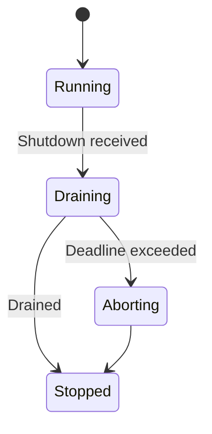
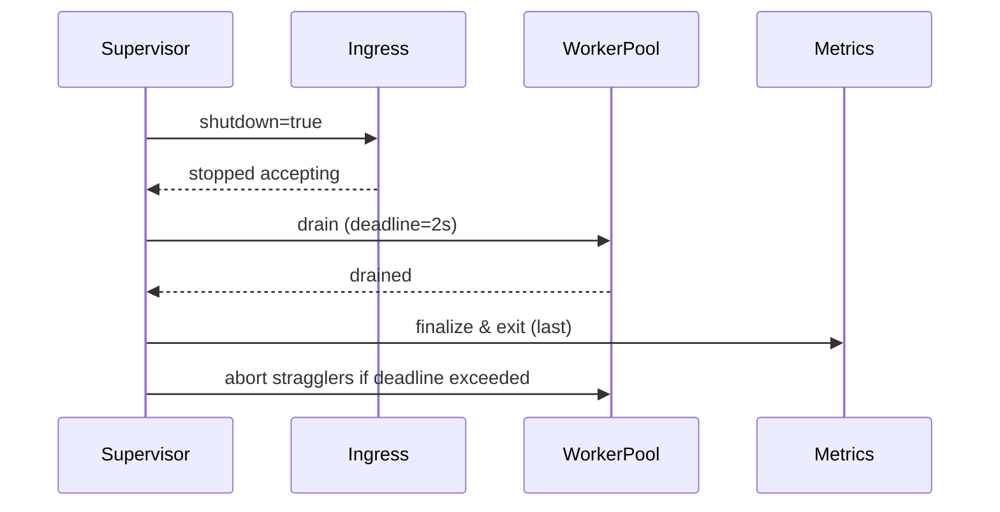

````markdown
---
title: Concurrency Model — micronode
crate: micronode
owner: Stevan White
last-reviewed: 2025-09-23
status: draft
template_version: 1.1
msrv: 1.80.0
tokio: "1.x (pinned at workspace root)"
loom: "0.7+ (dev-only)"
lite_mode: "N/A (service-style single binary with background tasks)"
---

# Concurrency Model — micronode

This document makes the concurrency rules **explicit** for the `micronode` profile: tasks, channels, locks, shutdown, timeouts, and validation (unit/property/loom/chaos). It complements `docs/SECURITY.md`, `docs/CONFIG.md`, and the crate’s `README.md` and `IDB.md`.  
Micronode mirrors macronode’s safety rules but trims the topology for **DX-first**, **amnesia-on-by-default**, **single-binary** operation; all heavy/owner work is delegated to canonical facets (index/search/graph in `svc-index`, feed/fanout in `svc-mailbox`, media in `svc-storage`) via mailbox-style async. :contentReference[oaicite:0]{index=0}

> **Golden rule:** never hold a lock across `.await` in supervisory or hot paths. :contentReference[oaicite:1]{index=1}

---

## 0) Lite Mode (for tiny lib crates)

N/A — micronode runs background tasks (listener, overlay HTTP, worker pool, metrics) even in “dev tiny” mode.

---

## 1) Invariants (MUST)

- [x] **No lock across `.await`**. If unavoidable, split the critical section (derive under guard, drop, then `.await`). :contentReference[oaicite:2]{index=2}
- [x] **Single writer** per mutable resource; readers use snapshots or short read guards.
- [x] **Bounded channels only** (mpsc/broadcast/watch) with explicit overflow policy.
- [x] **Explicit timeouts** on all I/O and RPCs; fail-fast with typed errors.
- [x] **Cooperative cancellation**: every `.await` is cancel-safe or guarded by `select!`.
- [x] **Graceful shutdown**: observe `Shutdown` signal; drain within deadline; abort stragglers.
- [x] **No blocking syscalls** on the async runtime; use `spawn_blocking` for fs/crypto.
- [x] **No task leaks**: track `JoinHandle` and await joins; detach only with rationale.
- [x] **Backpressure over buffering**: reject/shed deterministically; never grow unbounded queues.
- [x] **Transport framing & guards**: length-delimited; **frame ≤ 1 MiB**, **chunk ≤ 64 KiB**, **decompression ≤ 10×**.
- [x] **Amnesia-friendly**: caches bounded/ephemeral; shutdown clears in-RAM state (timed key purge).
- [x] **Bytes discipline**: prefer `bytes::{Bytes,BytesMut}`; avoid needless copies.

**Async Drop**

- [x] `Drop` must not block. Provide explicit async teardown (`close()/shutdown()`), and only release cheap resources in `Drop`.

---

## 2) Runtime Topology

Micronode aims for **simplicity and low overhead**:

- **Runtime (default):** Tokio **current-thread** for minimal dev footprint; **multi-thread** is enabled when `MICRO_THREADS>1` or via feature flag (perf tests in CI ensure parity).
- **Primary tasks (long-lived):**
  - **Supervisor** — owns shutdown watch; spawns/monitors others; escalates on crash loops.
  - **MiniGateway** — accepts local HTTP (dev) or mTLS loopback; enforces caps; forwards to overlay.
  - **OverlayHttp** — axum handlers exposing admin plane + DX endpoints; applies per-route deadlines & limits.
  - **WorkerPool (N)** — handles app-facing light work (validation/hydration); heavy work -> **mailbox facet**.
  - **MetricsServer** — `/metrics`, `/healthz`, `/readyz`, `/version`; exits **last**.
  - **ConfigWatcher** — merges file/env/CLI; emits `ConfigUpdated`.
- **Supervision policy:** jittered backoff **100–500ms → cap 5s**; if >5 restarts/60s, flip readiness=Degraded until stable. (Parallels macronode’s policy.) :contentReference[oaicite:3]{index=3}

```mermaid
flowchart TB
  subgraph Micronode Runtime
    SUP[Supervisor] -->|spawn| GW[MiniGateway]
    SUP -->|spawn| OH[OverlayHttp]
    SUP -->|spawn| MET[MetricsServer]
    SUP -->|spawn| CFG[ConfigWatcher]
    SUP -->|spawn| WP[WorkerPool (bounded)]
    GW -->|mpsc:work(256)| WP
    OH -->|mpsc:work(256)| WP
    SUP -->|watch:Shutdown| GW
    SUP -->|watch:Shutdown| OH
    SUP -->|watch:Shutdown| WP
    SUP -->|watch:Shutdown| MET
    SUP -->|watch:Shutdown| CFG
  end
  WP -->|results/metrics| MET
  style SUP fill:#0ea5e9,stroke:#0c4a6e,color:#fff
````

*Accessibility text:* Supervisor spawns MiniGateway, OverlayHttp, MetricsServer, ConfigWatcher, and a bounded WorkerPool. Ingress feeds a bounded work queue into the pool. All tasks observe a shutdown watch.

---

## 3) Channels & Backpressure

**Inventory (all bounded unless noted):**

| Name          | Kind        | Capacity | Producers → Consumers | Backpressure Policy           | Drop Semantics                                    |
| ------------- | ----------- | -------: | --------------------- | ----------------------------- | ------------------------------------------------- |
| `bus`         | broadcast   |      512 | 1 → N                 | lag counter + drop-oldest     | inc `bus_lagged_total`; reconcile from snapshot   |
| `work`        | mpsc        |      256 | N → M                 | `try_send` → `Busy`           | return 429/`Busy`; inc `busy_rejections_total`    |
| `shutdown`    | watch<bool> |        1 | 1 → N                 | last-write-wins               | N/A                                               |
| `cfg_updates` | mpsc        |       32 | 1 → 1                 | coalesce                      | inc `config_coalesced_total`                      |
| `telemetry`   | mpsc        |      256 | N → 1                 | best-effort; shed on overflow | drop-oldest; inc `queue_dropped_total{telemetry}` |

Guidelines:

* Prefer **reject-new** (`Busy`) for `work` to protect tail latency; **drop-oldest** acceptable for `telemetry` best-effort.&#x20;
* Expose `queue_depth{queue}` gauges and `queue_dropped_total{queue}` counters.

---

## 4) Locks & Shared State

**Allowed**

* Short-lived `Mutex`/`RwLock` for metadata (no `.await` while held).
* Read-mostly snapshots via `Arc<StateSnapshot>` (atomic swap on change).
* Per-connection state **owned by its task**; cross-task via channels.

**Forbidden**

* Holding locks across `.await`.
* Nested locks without an explicit hierarchy.
* Long-held global locks; shard or message-pass instead.

**Hierarchy**

1. `state_meta`
2. `routing_table`
3. `counters` (atomics preferred)

---

## 5) Timeouts, Retries, Deadlines

* **I/O defaults:** `read=5s`, `write=5s`, `idle=60s` (configurable).
* **HTTP (Overlay):** per-request **total deadline** (default `2s`); soft timeout in handlers; hard timeout in middleware; per-route concurrency caps.
* **Retries:** idempotent ops only; jittered backoff **50–100ms → cap 2s**; **max 3 tries**; never outlive caller deadline.
* **Circuit breaker (optional):** open on rolling error-rate; half-open probe.

```mermaid
sequenceDiagram
  autonumber
  participant Caller
  participant μN as micronode
  Caller->>μN: Request (deadline=2s)
  μN-->>Caller: 202 Accepted or Result
  Note over μN: On backpressure → Busy<br/>On timeout → typed error
```

---

## 6) Cancellation & Shutdown

* **Signal sources:** `KernelEvent::Shutdown` (bus) + local `watch<bool>`.
* **Propagation:** `tokio::select! { _ = shutdown.changed() => ..., _ = work => ... }`.
* **Draining:** stop intake; drain in-flight within `drain_deadline` (default **2s**, max **5s**).
* **Abort:** over-deadline tasks → `handle.abort()`; count `tasks_aborted_total{kind}`; log with reason.
* **Order:** flip `shutdown=true` → stop accept → drain pool → metrics last → abort stragglers. (Matches macronode pattern.)&#x20;



---

## 7) I/O & Framing

* **Transport:** length-prefix; validate length **before** allocation; **max\_frame\_bytes = 1 MiB**; **max\_chunk\_bytes = 64 KiB**; decompression expansion **≤ 10×**.
* **HTTP:** HTTP/1.1 & H2 via axum; request body limit default **1 MiB** (configurable); per-IP accept rate limits; per-route concurrency caps.
* **TLS (if enabled):** rustls; handshake timeout **2s**; non-loopback requires mTLS or macaroon bearer.

(These mirror the macronode admin plane & OAP invariants so apps can graduate **without client changes**.)

---

## 8) Error Taxonomy (Concurrency-Relevant)

| Error        | When                       | Retry?    | Metric                            | Notes                  |
| ------------ | -------------------------- | --------- | --------------------------------- | ---------------------- |
| `Busy`       | work queue full            | maybe     | `busy_rejections_total{endpoint}` | backoff advised        |
| `Timeout`    | deadline exceeded          | sometimes | `io_timeouts_total{op}`           | attach `op` & deadline |
| `Canceled`   | shutdown/cancel            | no        | `tasks_canceled_total{kind}`      | cooperative exit       |
| `Lagging`    | broadcast overflow         | no        | `bus_lagged_total{service}`       | reconcile via snapshot |
| `BrokenPipe` | peer closed during write   | maybe     | `io_errors_total{op="write"}`     | normal churn           |
| `Degraded`   | restart threshold exceeded | no        | `service_restarts_total{service}` | reflected in `/readyz` |

---

## 9) Metrics (Concurrency Health)

* `queue_depth{queue}` (gauge)
* `queue_dropped_total{queue}` (counter)
* `tasks_{spawned,aborted,completed}_total{kind}` (counters)
* `io_timeouts_total{op}` / `backoff_retries_total{op}`
* `busy_rejections_total{endpoint}` (counter)
* `service_restarts_total{service}` (counter)
* `ready_state` / `ready_dependency_unmet{dep}` (gauges)

---

## 10) Validation Strategy

**Unit / Property**

* Deterministic backpressure (reject vs drop) under load.
* Deadlines honored within tolerance.
* Optional runtime asserts for `.await` while holding a lock (debug builds).

**Loom**

* Model producer → bounded mpsc → consumer + shutdown. Assert: no deadlocks, no missed shutdown, no double-drop. (Follow macronode loom patterns.)&#x20;

**Fuzz**

* Frame/decoder fuzz (malformed, boundary sizes, truncated frames).

**Chaos**

* Kill/restart 10% of workers under load; `/readyz` flips `Ready↔Degraded` with low 5xx.

**TLA+ (targeted)**

* Specify shutdown ordering & message acceptance; prove safety (no stuck state) and liveness (eventual drain).

---

## 11) Code Patterns (Copy-Paste)

**Spawn + cooperative shutdown**

```rust
let (shutdown_tx, mut shutdown_rx) = tokio::sync::watch::channel(false);

let worker = tokio::spawn({
  let mut rx = work_rx;
  async move {
    loop {
      tokio::select! {
        _ = shutdown_rx.changed() => break,
        maybe_job = rx.recv() => {
          let Some(job) = maybe_job else { break };
          if let Err(e) = handle_job(job).await {
            tracing::warn!(error=%e, "job failed");
          }
        }
      }
    }
  }
});

// initiate shutdown
let _ = shutdown_tx.send(true);
let _ = worker.await;
```

**Bounded mpsc with `try_send`**

```rust
match work_tx.try_send(job) {
  Ok(()) => {}
  Err(tokio::sync::mpsc::error::TrySendError::Full(_)) => {
    metrics::busy_rejections_total().inc();
    return Err(Error::Busy);
  }
  Err(e) => return Err(Error::from(e)),
}
```

**Timeout with deadline**

```rust
let res = tokio::time::timeout(cfg.read_timeout, read_frame(&mut stream)).await;
```

**Async Drop pattern**

```rust
pub struct Client { inner: Option<Conn> }

impl Client {
  pub async fn close(&mut self) -> anyhow::Result<()> {
    if let Some(mut conn) = self.inner.take() {
      conn.shutdown().await?;
    }
    Ok(())
  }
}

impl Drop for Client {
  fn drop(&mut self) {
    if self.inner.is_some() {
      tracing::debug!("Client dropped without close(); resources will be reclaimed");
    }
  }
}
```

**Lag-aware broadcast subscriber (snapshot reconcile)**

```rust
let mut rx = bus.subscribe();
loop {
  tokio::select! {
    _ = shutdown_rx.changed() => break,
    msg = rx.recv() => match msg {
      Ok(ev) => handle_event(ev).await,
      Err(tokio::sync::broadcast::error::RecvError::Lagged(n)) => {
        metrics::bus_lagged_total().inc_by(n as u64);
        tracing::warn!(lagged=n, "bus receiver lagged; reconciling snapshot");
        if let Err(e) = reconcile_from_snapshot().await {
          tracing::warn!(error=%e, "snapshot reconcile failed after lag");
        }
      }
      Err(tokio::sync::broadcast::error::RecvError::Closed) => break,
    }
  }
}
```

---

## 12) Configuration Hooks (Quick Reference)

* `max_conns`, `read_timeout`, `write_timeout`, `idle_timeout`
* Channel capacities (`work`, `telemetry`, `bus`)
* `drain_deadline`
* Retry/backoff window (initial, cap, max\_tries)
* HTTP: per-endpoint deadlines, body size/concurrency limits
* I/O: `max_frame_bytes`, `max_chunk_bytes`, decompression ratio cap, handshake timeout
* Per-facet semaphores (Feed/Graph/Search) **when enabled** in canonical owners (via mailbox requests).&#x20;

See `docs/CONFIG.md` for authoritative schema.

---

## 13) Known Trade-offs / Nonstrict Areas

* **Drop-oldest vs reject-new:** `telemetry` may drop-oldest; `work` rejects-new (`Busy`) to protect tail latency.&#x20;
* **Broadcast lag:** slow consumers reconcile by pulling a snapshot; we do not guarantee perfect continuity.
* **Single-thread default:** favors DX & determinism; multi-thread mode exists for performance and is CI-validated.

---

## 14) Mermaid Diagrams (REQUIRED)

### 14.1 Task & Queue Topology

```mermaid
flowchart LR
  IN[MiniGateway] -->|mpsc:work(256)| W1[Worker A]
  IN -->|mpsc:work(256)| W2[Worker B]
  OH[Overlay HTTP] -->|mpsc:work(256)| W1
  OH -->|mpsc:work(256)| W2
  subgraph Control
    SHUT[Shutdown watch] --> IN
    SHUT --> OH
    SHUT --> W1
    SHUT --> W2
  end
```

**Text:** Ingress and HTTP feed two workers via bounded mpsc(256). A Shutdown watch notifies all tasks.

### 14.2 Shutdown Sequence



---

## 15) CI & Lints (Enforcement)

**Clippy lints**

* `-D clippy::await_holding_lock`
* `-D clippy::needless_collect`
* `-D clippy::useless_async`
* `-D warnings`

**GitHub Actions sketch**

```yaml
name: micronode-concurrency-guardrails
on: [push, pull_request]
jobs:
  clippy:
    runs-on: ubuntu-latest
    steps:
      - uses: actions/checkout@v4
      - uses: dtolnay/rust-toolchain@stable
      - run: cargo clippy -p micronode -- -D warnings -W clippy::await_holding_lock

  loom:
    if: github.event_name == 'pull_request'
    runs-on: ubuntu-latest
    steps:
      - uses: actions/checkout@v4
      - uses: dtolnay/rust-toolchain@stable
      - run: RUSTFLAGS="--cfg loom" cargo test -p micronode --tests -- --ignored

  fuzz:
    runs-on: ubuntu-latest
    steps:
      - uses: actions/checkout@v4
      - uses: dtolnay/rust-toolchain@stable
      - run: cargo install cargo-fuzz
      - run: cargo fuzz build -p micronode
```

---

## 16) Schema Generation (Optional, Nice-to-Have)

Automate **Channels/Locks tables** from code to avoid rot:

* Annotate channels/locks with macros or attributes:

  ```rust
  #[doc_channel(name="work", kind="mpsc", cap=256, policy="try_send")]
  let (tx, rx) = tokio::sync::mpsc::channel(256);
  ```

* A small **proc-macro** or **build.rs** can emit `docs/_generated/concurrency.mdfrag` included into this doc.

* Alternatively, keep a `concurrency_registry.rs` and golden-test doc vs registry.

---

## 17) Review & Maintenance

* **Review cadence:** every 90 days or on any change to tasks/channels/locks.
* Keep `owner`, `msrv`, `last-reviewed` current.
* **PR checklist:** if you modify concurrency, update this file + Loom/property tests.

---

## 18) Acceptance Gates (CI-enforced)

**Shutdown SLO**

* [ ] p95 graceful drain ≤ **2s**; p99 ≤ **5s** (chaos drain test).

**Deadlines**

* [ ] p99 request total deadline respected within ±100ms across DX/admin endpoints.

**Backpressure**

* [ ] Under 2× steady load, `Busy` returned within **50ms** (no unbounded buffering).
* [ ] `queue_dropped_total{telemetry}` may increase; `queue_dropped_total{work}` MUST remain **0**.

**Loom coverage**

* [ ] Critical interleavings (producer/consumer/shutdown/broadcast lag) ≥ **90%** branch coverage on `--cfg loom`.

**Chaos**

* [ ] Kill/restart 10% of workers every 250ms for 10s at target RPS; `/readyz` transitions `Ready↔Degraded` with 5xx ≤ **0.1%**.

**Amnesia Mode**

* [ ] With `AMNESIA=1`, no persistent writes observed (fs spy), caches `zeroize` on shutdown.

**PQ Hooks (if enabled)**

* [ ] Handshake deadline ≤ **2s**; zeroizing key types; no cross-task key copies.

---

## 19) Facet-Aware Concurrency (when facets are enabled)

Micronode **does not** re-own facets; it proxies to canonical owners with explicit bounding:

| Facet  | Hotspot              | Control (Micronode)       | Default Cap | Owner (executes work)                 |
| ------ | -------------------- | ------------------------- | ----------- | ------------------------------------- |
| Feed   | fanout spikes        | `Semaphore(feed_fanout)`  | 2×CPU       | `svc-mailbox` (queues, DLQ, idempot.) |
| Graph  | neighbor expansion   | `Semaphore(graph_expand)` | 1×CPU       | `svc-index` (graph facet)             |
| Search | query bursts         | `Semaphore(search_qps)`   | 2×CPU       | `svc-index` (search facet)            |
| Media  | transcode/byte-range | `Semaphore(media_jobs)`   | 1×CPU       | `svc-storage` + `svc-mod` (opt)       |

Facet calls are mailboxed to owners; micronode **never** grows unbounded local queues. (Developer Suite facet discipline.)&#x20;

---

## 20) References

* **Macronode Concurrency Model** — baseline invariants, queues, shutdown ordering (kept in parity where applicable).&#x20;
* **Micronode vs Macronode (Developer Suite Blueprint)** — profile roles, amnesia defaults, facet discipline, DX-first goals.&#x20;
* **Macronode API/Observability & Limits** — admin plane & OAP/guardrails mirrored for graduation parity.&#x20;

```
```
