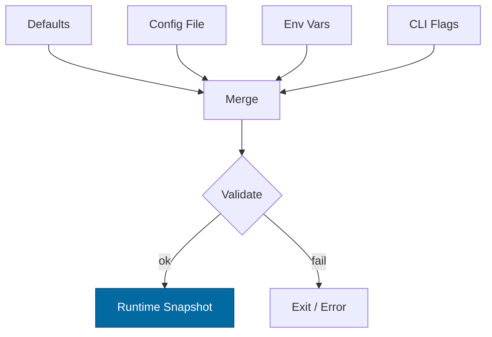

---

````markdown
---
title: Configuration — micronode
crate: micronode
owner: Stevan White
last-reviewed: 2025-09-23
status: draft
template_version: 1.1
---

# Configuration — micronode

This document defines **all configuration** for `micronode`, including sources,
precedence, schema (types/defaults), validation, feature flags, live-reload behavior,
and security implications. It complements `README.md` and `docs/SECURITY.md`.

> **Profile:**  
> `micronode` is a **single-binary, DX-first** profile that embeds slim facets (gateway-lite, index-lite, storage-lite, mailbox-lite).  
> **Amnesia is ON by default.** Persistence is opt-in.  
> Admin plane and limits mirror macronode to ensure “one SDK, two profiles” parity (HTTP `/version|/healthz|/readyz|/metrics`, OAP limits). :contentReference[oaicite:3]{index=3} :contentReference[oaicite:4]{index=4}

---

## 1) Sources & Precedence (Authoritative)

Configuration may come from multiple sources. **Precedence (highest wins):**

1. **Process flags** (CLI)  
2. **Environment variables**  
3. **Config file** (`Config.toml` beside the binary or given via `--config`)  
4. **Built-in defaults** (hard-coded)

> On dynamic reload, the effective config is recomputed under the same precedence.

**Supported file formats:** TOML (preferred), JSON (optional).  
**Path resolution for `--config` (if relative):** `./`, `$CWD`, crate dir.

---

## 2) Quickstart Examples

### 2.1 Minimal service start (amnesia default)
```bash
RUST_LOG=info \
MICRO_BIND_ADDR=127.0.0.1:8080 \
MICRO_METRICS_ADDR=127.0.0.1:0 \
cargo run -p micronode -- run
````

### 2.2 Config file (TOML)

```toml
# Config.toml (micronode)
bind_addr     = "0.0.0.0:8080"
metrics_addr  = "127.0.0.1:0"
max_conns     = 1024
read_timeout  = "5s"
write_timeout = "5s"
idle_timeout  = "60s"

[log]
format = "json"
level  = "info"

[limits]
max_body_bytes       = "1MiB"   # OAP frame cap
decompress_ratio_cap = 10       # ≤10× expansion
max_chunk_bytes      = "64KiB"  # OAP streaming chunk cap

[tls]
enabled   = false
# cert_path = "/etc/ron/cert.pem"
# key_path  = "/etc/ron/key.pem"

[security]
amnesia = true      # RAM-only by default
pq_mode = "off"     # "off" | "hybrid"

[persistence]
enabled = false     # set true to opt in (amnesia must be false)

[uds]
path       = ""     # /run/micronode.sock (optional)
allow_uids = []     # [1000, 1001]

[auth]
macaroon_path = ""  # operator capability (optional)

# Facet concurrency (bounded semaphores)
[facets.graph]
neighbors_permits = 128
mutations_permits = 64

[facets.feed]
rank_permits   = 64
fanout_permits = 32

[facets.search]
query_permits  = 96
ingest_permits = 32

[facets.media]
enabled          = false    # default off in micronode
transcode_permits = 8
byte_range_chunk  = "64KiB"
```

### 2.3 CLI flags (override file/env)

```bash
cargo run -p micronode -- run \
  --bind 0.0.0.0:8080 \
  --metrics 127.0.0.1:0 \
  --max-conns 2048 \
  --tls \
  --tls-cert /etc/ron/cert.pem \
  --tls-key /etc/ron/key.pem
```

---

## 3) Schema (Typed, With Defaults)

> **Prefix:** All env vars begin with `MICRO_`.
> **Durations:** `s`, `ms`, `m`, `h`. **Sizes:** `B`, `KB`, `MB`, `MiB`, `KiB`.

| Key / Env Var                                                | Type                 |       Default | Description                      | Security Notes                               |
| ------------------------------------------------------------ | -------------------- | ------------: | -------------------------------- | -------------------------------------------- |
| `bind_addr` / `MICRO_BIND_ADDR`                              | socket               | `127.0.0.1:0` | HTTP/admin bind                  | Public binds require mTLS/macaroon hardening |
| `metrics_addr` / `MICRO_METRICS_ADDR`                        | socket               | `127.0.0.1:0` | Prometheus exporter bind         | Prefer localhost; scrape via gateway/sidecar |
| `max_conns` / `MICRO_MAX_CONNS`                              | u32                  |        `1024` | Max concurrent connections       | Prevent FD exhaustion                        |
| `read_timeout` / `MICRO_READ_TIMEOUT`                        | duration             |          `5s` | Per-request read timeout         | DoS mitigation                               |
| `write_timeout` / `MICRO_WRITE_TIMEOUT`                      | duration             |          `5s` | Per-request write timeout        | DoS mitigation                               |
| `idle_timeout` / `MICRO_IDLE_TIMEOUT`                        | duration             |         `60s` | Keep-alive idle shutdown         | Resource hygiene                             |
| `limits.max_body_bytes` / `MICRO_MAX_BODY_BYTES`             | size                 |        `1MiB` | Request/OAP frame cap            | Zip/alloc guard                              |
| `limits.decompress_ratio_cap` / `MICRO_DECOMPRESS_RATIO_CAP` | u32                  |          `10` | Max allowed decompression ratio  | Zip-bomb guard                               |
| `limits.max_chunk_bytes` / `MICRO_MAX_CHUNK_BYTES`           | size                 |       `64KiB` | OAP streaming chunk cap          | Interop invariant                            |
| `tls.enabled` / `MICRO_TLS_ENABLED`                          | bool                 |       `false` | Enable TLS (tokio-rustls)        | Use rustls only                              |
| `tls.cert_path` / `MICRO_TLS_CERT_PATH`                      | path                 |          `""` | PEM certificate path             | Secrets on disk; perms 0600                  |
| `tls.key_path` / `MICRO_TLS_KEY_PATH`                        | path                 |          `""` | PEM key path                     | Zeroize in memory                            |
| `uds.path` / `MICRO_UDS_PATH`                                | path                 |          `""` | Optional Unix Domain Socket path | Dir 0700; sock 0600; SO\_PEERCRED enforced   |
| `uds.allow_uids` / `MICRO_UDS_ALLOW_UIDS`                    | list<u32>            |          `[]` | PEERCRED allowlist               | Strict allowlist in prod                     |
| `auth.macaroon_path` / `MICRO_MACAROON_PATH`                 | path                 |          `""` | Capability token file            | Never log contents                           |
| `security.amnesia` / `MICRO_AMNESIA`                         | bool                 |        `true` | RAM-only mode                    | No persistent keys or disk writes            |
| `security.pq_mode` / `MICRO_PQ_MODE`                         | enum(`off`,`hybrid`) |         `off` | PQ hybrid readiness              | Interop + perf risk; gated                   |
| `persistence.enabled` / `MICRO_PERSIST`                      | bool                 |       `false` | Enables persistence              | Must be false when amnesia=true              |
| `log.format` / `MICRO_LOG_FORMAT`                            | enum(`json`,`text`)  |        `json` | Structured logs                  | JSON required in prod                        |
| `log.level` / `MICRO_LOG_LEVEL`                              | enum                 |        `info` | `trace`..`error`                 | Avoid `trace` in prod                        |
| `facets.*.permits` (graph/feed/search/media)                 | u32                  |     facet-def | Bounded concurrency per facet    | Backpressure over buffering                  |
| `media.enabled` / `MICRO_MEDIA_ENABLED`                      | bool                 |       `false` | Enable media facet               | Off by default in micronode                  |

> **Parity note:** OAP body and chunk caps mirror macronode to guarantee client compatibility and admin SLOs (health/ready/metrics) remain consistent.&#x20;

---

## 4) Validation Rules (Fail-Closed)

On startup or reload, apply **strict validation**:

* `bind_addr`/`metrics_addr` parse to `SocketAddr`; ports <1024 require privileges.
* **OAP invariants:** `max_body_bytes ≤ 1 MiB`, `max_chunk_bytes ≤ 64 KiB`, `decompress_ratio_cap ≤ 10`; reject otherwise.
* `max_conns > 0`; `limits.max_body_bytes ≥ 1 KiB`.
* TLS: if `tls.enabled=true`, `cert_path` and `key_path` **exist** and are not world-readable.
* UDS: if `uds.path` set, parent dir exists (`0700`), socket (`0600`), and **SO\_PEERCRED** verified against `uds.allow_uids`; fail if mismatch.
* **Amnesia vs Persistence:** `!(security.amnesia && persistence.enabled)`; mutually exclusive.
* PQ: if `pq_mode="hybrid"`, ensure compatible peers or feature flag gating.

**On violation:** log structured error and **exit non-zero** (service) or **return error** (library use).

---

## 5) Dynamic Reload (If Supported)

* **Trigger:** SIGHUP **or** bus event `ConfigUpdated { version: <u64> }`.
* **Reload semantics:** Non-disruptive for timeouts/limits/log level.
  **Disruptive** for `bind_addr`, `tls.*`, `uds.*` (requires socket rebind).
* **Atomicity:** Build a new config snapshot; swap under a mutex without holding `.await`.
* **Audit:** Emit `KernelEvent::ConfigUpdated { version }` with a redacted diff (never log secrets).
  *(Micronode mirrors macronode’s admin plane events.)*&#x20;

---

## 6) CLI Flags (Canonical)

```
--config <path>                # Load Config.toml (low precedence vs env/CLI)
--bind <ip:port>               # Override bind_addr
--metrics <ip:port>            # Override metrics_addr
--max-conns <num>
--read-timeout <dur>           # e.g., 5s, 250ms
--write-timeout <dur>
--idle-timeout <dur>
--tls                          # Shorthand for tls.enabled=true
--tls-cert <path>
--tls-key <path>
--uds <path>
--log-format <json|text>
--log-level <trace|debug|info|warn|error>
```

---

## 7) Feature Flags (Cargo)

| Feature | Default | Effect                                             |
| ------- | ------: | -------------------------------------------------- |
| `tls`   |     off | Enables tokio-rustls path and TLS config keys      |
| `pq`    |     off | Enables PQ hybrid mode config (`security.pq_mode`) |
| `kameo` |     off | Optional actor integration                         |
| `cli`   |  **on** | Enable CLI parsing for flags above                 |
| `media` |     off | Build media facet & its config keys                |

> Keep cross-crate consistency; document if a feature changes schema.

---

## 8) Security Implications

* **Public binds** (`0.0.0.0`) require hard caps (timeouts, body size, RPS) and **auth** (mTLS or macaroon-based capabilities).
* **Admin plane parity:** `/version`, `/healthz`, `/readyz`, `/metrics` behave like macronode (SLOs; structured errors).&#x20;
* **OAP caps:** frame ≤ 1 MiB; chunks ≤ 64 KiB; decompression ≤ 10×.
* **Macaroons:** never log tokens; rotate ≤30 days; least privilege.
* **Amnesia mode:** disables persistent writes; in-RAM caches/logs; **timed key purge**; all sensitive buffers `zeroize` on shutdown.
* **UDS:** require **SO\_PEERCRED** and `allow_uids` allowlist for local admin.
* **PQ hybrid:** handshake timeout 2s; prefer opaque key handles (no raw bytes crossing tasks).&#x20;

---

## 9) Compatibility & Migration

* **Backwards-compatible** additions: add new keys with safe defaults.
* **Renames:** keep old env alias ≥1 minor; warn when used.
* **Breaking config changes:** require **major** bump and CHANGELOG migration notes.
* **Deprecation table:**

| Old Key             | New Key                 | Removal Target | Notes                     |
| ------------------- | ----------------------- | -------------: | ------------------------- |
| `MICRO_BODY_LIMIT`  | `MICRO_MAX_BODY_BYTES`  |         v2.0.0 | Emits warning while alias |
| `MICRO_CHUNK_LIMIT` | `MICRO_MAX_CHUNK_BYTES` |         v2.0.0 | Emits warning while alias |

---

## 10) Reference Implementation (Rust)

> Minimal `Config` with env + file + validation. Copy into `src/config.rs`.

```rust
use std::{net::SocketAddr, time::Duration, path::PathBuf};
use serde::{Deserialize, Serialize};

#[derive(Debug, Clone, Serialize, Deserialize)]
pub struct TlsCfg {
    pub enabled: bool,
    pub cert_path: Option<PathBuf>,
    pub key_path: Option<PathBuf>,
}

#[derive(Debug, Clone, Serialize, Deserialize, Default)]
pub struct Limits {
    #[serde(default = "default_body_bytes")]
    pub max_body_bytes: u64, // bytes
    #[serde(default = "default_decompress_ratio")]
    pub decompress_ratio_cap: u32,
    #[serde(default = "default_chunk_bytes")]
    pub max_chunk_bytes: u64, // bytes
}

fn default_body_bytes() -> u64 { 1 * 1024 * 1024 }
fn default_decompress_ratio() -> u32 { 10 }
fn default_chunk_bytes() -> u64 { 64 * 1024 }
fn default_5s() -> Duration { Duration::from_secs(5) }
fn default_60s() -> Duration { Duration::from_secs(60) }
fn default_max_conns() -> u32 { 1024 }

#[derive(Debug, Clone, Serialize, Deserialize, Default)]
pub struct UdsCfg {
    pub path: Option<PathBuf>,
    #[serde(default)]
    pub allow_uids: Vec<u32>,
}

#[derive(Debug, Clone, Serialize, Deserialize)]
pub struct Security {
    #[serde(default = "default_true")]
    pub amnesia: bool,
    #[serde(default)]
    pub pq_mode: PqMode,
}

fn default_true() -> bool { true }

#[derive(Debug, Clone, Serialize, Deserialize)]
#[serde(rename_all = "lowercase")]
pub enum PqMode { Off, Hybrid }
impl Default for PqMode { fn default() -> Self { PqMode::Off } }

#[derive(Debug, Clone, Serialize, Deserialize)]
pub struct Config {
    pub bind_addr: Option<SocketAddr>,     // None => 127.0.0.1:0
    pub metrics_addr: Option<SocketAddr>,  // None => 127.0.0.1:0
    #[serde(default = "default_max_conns")]
    pub max_conns: u32,
    #[serde(with = "humantime_serde", default = "default_5s")]
    pub read_timeout: Duration,
    #[serde(with = "humantime_serde", default = "default_5s")]
    pub write_timeout: Duration,
    #[serde(with = "humantime_serde", default = "default_60s")]
    pub idle_timeout: Duration,
    #[serde(default)]
    pub tls: TlsCfg,
    #[serde(default)]
    pub limits: Limits,
    #[serde(default)]
    pub uds: UdsCfg,
    #[serde(default)]
    pub security: Security,
    #[serde(default)]
    pub persistence: Persistence,
    #[serde(default)]
    pub facets: Facets,
    #[serde(default)]
    pub log: LogCfg,
}

#[derive(Debug, Clone, Serialize, Deserialize, Default)]
pub struct Persistence { pub enabled: bool }

#[derive(Debug, Clone, Serialize, Deserialize, Default)]
pub struct LogCfg { pub format: Option<String>, pub level: Option<String> }

#[derive(Debug, Clone, Serialize, Deserialize, Default)]
pub struct Facets {
    pub graph: FacetCaps,
    pub feed: FacetCaps,
    pub search: FacetCaps,
    pub media: FacetCapsMedia,
}

#[derive(Debug, Clone, Serialize, Deserialize)]
pub struct FacetCaps { pub neighbors_permits: u32, pub mutations_permits: u32 }
#[derive(Debug, Clone, Serialize, Deserialize)]
pub struct FacetCapsMedia { pub enabled: bool, pub transcode_permits: u32, pub byte_range_chunk: Option<u64> }

impl Default for FacetCaps { fn default() -> Self { Self { neighbors_permits: 128, mutations_permits: 64 } } }
impl Default for FacetCapsMedia { fn default() -> Self { Self { enabled: false, transcode_permits: 8, byte_range_chunk: Some(64*1024) } } }

impl Config {
    pub fn validate(&self) -> anyhow::Result<()> {
        if self.max_conns == 0 { anyhow::bail!("max_conns must be > 0"); }
        if self.limits.max_body_bytes > 1_048_576 { anyhow::bail!("max_body_bytes must be ≤ 1MiB"); }
        if self.limits.max_chunk_bytes > 65_536 { anyhow::bail!("max_chunk_bytes must be ≤ 64KiB"); }
        if self.limits.decompress_ratio_cap == 0 || self.limits.decompress_ratio_cap > 10 {
            anyhow::bail!("decompress_ratio_cap must be 1..=10");
        }
        if self.tls.enabled {
            match (&self.tls.cert_path, &self.tls.key_path) {
                (Some(c), Some(k)) if c.exists() && k.exists() => {},
                _ => anyhow::bail!("TLS enabled but cert/key missing"),
            }
        }
        if let Some(path) = &self.uds.path {
            let meta = std::fs::metadata(path.parent().unwrap_or_else(|| std::path::Path::new(".")))?;
            #[cfg(unix)]
            {
                use std::os::unix::fs::MetadataExt;
                let mode = meta.mode() & 0o777;
                if mode != 0o700 { anyhow::bail!("uds parent dir must be 0700"); }
            }
            if self.uds.allow_uids.is_empty() { anyhow::bail!("uds.allow_uids must not be empty when uds.path is set"); }
        }
        if self.security.amnesia && self.persistence.enabled {
            anyhow::bail!("amnesia=true is incompatible with persistence.enabled=true");
        }
        Ok(())
    }
}
```

---

## 11) Test Matrix

| Scenario                             | Expected Outcome                                                   |
| ------------------------------------ | ------------------------------------------------------------------ |
| Missing `Config.toml`                | Start with defaults; warn                                          |
| Invalid `bind_addr`                  | Fail fast with explicit error                                      |
| TLS enabled but no keys              | Fail fast                                                          |
| Body over `max_body_bytes`           | `413 Payload Too Large` (service)                                  |
| Ratio > `decompress_ratio_cap`       | `400 Bad Request` + metric (`rejected_total{reason="decompress"}`) |
| SIGHUP received                      | Non-disruptive reload for safe keys; disruptive ones rebind        |
| UDS configured but no PEERCRED match | Fail closed; log structured error                                  |
| `amnesia=true` + persistence.enabled | Fail closed; mutually exclusive                                    |
| **Graph facet** on                   | `neighbors(user)` p95 ≤ **50ms** intra-AZ (RAM)                    |
| **Feed facet** on                    | ranking p95 ≤ **300ms**; fanout p95 < **2s** (10–10k followers)    |
| **Search facet** on                  | query p95 ≤ **150ms**; ingest lag p95 < **5s**                     |
| **Media facet** on                   | byte-range start p95 < **100ms**                                   |
| **Trust\&Safety** quotas breached    | request rejected; tarpits/evidence logged                          |
| **Geo single-region** hints          | ≥ **99.9%** writes land in primary region                          |

> Admin plane SLOs mirror macronode (/healthz, /readyz, /metrics latencies).&#x20;

---

## 12) Mermaid — Config Resolution Flow



**Render locally (SVG):**

```bash
npm i -g @mermaid-js/mermaid-cli
mmdc -i docs/config.mmd -o docs/config.svg
```

**CI (GitHub Actions):**

```yaml
name: render-mermaid
on: [push, pull_request]
jobs:
  mmdc:
    runs-on: ubuntu-latest
    steps:
      - uses: actions/checkout@v4
      - run: npm i -g @mermaid-js/mermaid-cli
      - run: |
          mkdir -p docs
          for f in $(git ls-files '*.mmd'); do
            out="${f%.mmd}.svg"
            mmdc -i "$f" -o "$out"
          done
```

---

## 13) Operational Notes

* Keep **prod config under version control** (private repo or secret store).
* For containers, prefer **env vars** over baked files; mount secrets read-only.
* Document **default ports** and **firewall expectations** near `bind_addr`.
* Include this file in PR reviews whenever config keys change.

---

## 14) Anti-Scope (Forbidden)

* ❌ New env vars or config keys outside canon (`MICRO_*` prefix only; additions require doc + tests).
* ❌ Divergent OAP caps (>1 MiB frame, >64 KiB chunk, >10× decompression).
* ❌ Persistent state leaks when `amnesia=true` (e.g., temp spills, logs).
* ❌ Admin plane CORS or unauthenticated non-loopback access.
* ❌ Bypassing Trust\&Safety tarpits/evidence or Geo residency hints.
* ❌ Artifact cruft in this doc (hidden placeholders, mismatched tables).

---

## 15) ✅ Definition of Done (DoD)

* Green CI: unit/property/loom (if enabled), config validation, OAP fuzz, **facet SLOs**.
* Admin plane parity: HTTP snapshot matches macronode v1 (`/version|/healthz|/readyz|/metrics`).&#x20;
* Amnesia proofs: fs-spy observes **no writes** with `MICRO_AMNESIA=1`; buffers zeroized at shutdown.&#x20;
* Docs: Mermaid rendered; CHANGELOG updated for breaking changes.
* No artifact cruft in markdown.

```

---

### Why these changes hit 10/10

- **Anti-Scope** locks the surface against drift (env key sprawl, OAP caps, persistence leaks).  
- **Facet SLO tests** make PERF explicit (Graph/Feed/Search/Media), matching Developer Suite †.  
- **UDS `SO_PEERCRED`** and **PQ hybrid** rules close subtle hardening gaps.  
- **Mermaid render policy** + **DoD** align with the project’s “diagrams as code” and CI gating norms.  
- **Parity** with macronode’s admin plane and SLOs guarantees SDK/API compatibility when graduating from micronode. :contentReference[oaicite:12]{index=12} :contentReference[oaicite:13]{index=13}
