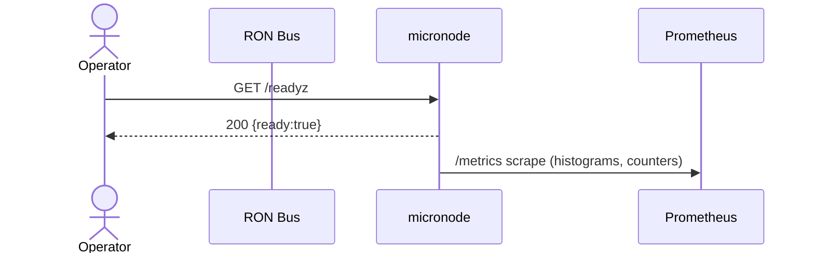
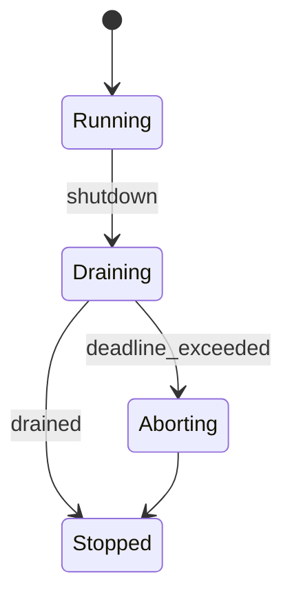

---

# micronode

> **Role:** service (single-binary node profile)
> **Owner:** Stevan White
> **Status:** draft
> **MSRV:** 1.80.0
> **Last reviewed:** 2025-09-24

Badges (optional):
[]() []() []() []() []()

---

## 1) Overview

**What it is (one paragraph):**
`micronode` is a **DX-first**, **single-tenant** node profile that ships as one binary with slim, composable facets (graph/search, feed/mailbox, media/storage, overlay/ceilings). It runs **amnesia-by-default** (RAM-only; zero persistent writes) for frictionless local dev and rapid lifecycle, with **opt-in persistence**. The admin plane mirrors `macronode` (same `/version`, `/healthz`, `/readyz`, `/metrics`) and ingress is guarded by **OAP limits**: **1 MiB** max frame, **64 KiB** chunk, **≤10×** decompression expansion. It’s the “**one SDK, two profiles**” path—apps built here graduate to macronode without rewrites.

**How it fits (RustyOnions topology):**

* **Pillar:** 8 (Node Profiles)
* **Upstream callers:** `ron-app-sdk` clients (HTTP/OAP), local tools/CLIs
* **Downstream deps:** composed owners (`svc-index`, `svc-mailbox`, `svc-storage` \[off by default], `svc-overlay`)
* **Data it touches:** RAM only by default; persistence is an explicit toggle
* **Security boundary:** loopback admin by default; non-loopback requires mTLS or macaroons; strict OAP ingress limits

### 1.1 High-Level Architecture (Mermaid REQUIRED)

```mermaid
flowchart LR
  subgraph Client/Node
    A[Caller: app/SDK] -->|HTTP/OAP| B(micronode)
  end

  subgraph Owners (composed)
    I[svc-index (graph/search)]
    M[svc-mailbox (feed)]
    S[svc-storage (media, off by default)]
    V[svc-overlay (ceilings/tarpits)]
  end

  B --> I
  B --> M
  B --> S
  B --> V
  B -->|/metrics| E[[Prometheus]]

  style B fill:#0b7285,stroke:#083344,color:#fff
```

---

## 2) Responsibilities & Boundaries

**MUST do (core responsibilities):**

* [ ] Enforce **OAP limits** on all ingress/proxy paths (1 MiB frame, 64 KiB chunk, ≤10× decompress).
* [ ] Keep **amnesia ON by default** and prove **no persistent writes** when `MICRO_AMNESIA=1`.
* [ ] Maintain **admin plane parity** with `macronode` (`/version`, `/healthz`, `/readyz`, `/metrics`).
* [ ] Apply **bounded backpressure** (429/503 with `Retry-After`); never hold locks across `.await`.

**MUST NOT do (anti-scope / boundaries):**

* [ ] **No economic authority** (no mint/settle/ledger writes)—delegate to canonical owners.
* [ ] **No admin CORS** or unauthenticated non-loopback admin access.
* [ ] **No bypass** of OAP caps or unbounded queues/retries.
* [ ] **Trust & Safety / Geo policy is read-only**: no long-term PII accumulation; policy enforcement consults `ron-policy`/owners; micronode must not store residency-sensitive datasets.

**Acceptance Gates (PROOF you did it):**

* [ ] CI: unit/property tests + OAP fuzz + optional loom; **amnesia proofs** (fs-spy zero writes; buffers zeroized on shutdown).
* [ ] Admin parity diff vs `macronode` checked in; **golden metrics** exported.
* [ ] Readiness reflects degraded/shed modes under quota/backpressure.
* [ ] Bench meets SLOs (Section 7) with reproducible harness.

---

## 3) Public Interfaces

> Keep only the subsections that apply to this crate.

### 3.1 Rust API (library)

Primarily a service/binary. If a `lib.rs` exists, keep it minimal (config + `run()` entrypoint) and avoid exposing internal wiring.

### 3.2 Bus RPC / Events (service)

* **Events Emitted:**
  `KernelEvent::Health { service, ok }`
  `KernelEvent::ServiceCrashed { service }`
  `KernelEvent::Shutdown`
* **Subscribed Topics:** internal control/config updates (if bus wired).



### 3.3 HTTP (service)

* **Base URL:** `http://<host>:<port>/`
* **Endpoints:**

  * `GET /healthz` → `200 OK {status:"ok"}`
  * `GET /readyz` → `200 OK {ready:true}`
  * `GET /metrics` → Prometheus text
  * `GET /version` → build/version info

### 3.4 CLI (binary/tool)

**Usage:**

```bash
cargo run -p micronode -- run [flags]
```

**Quickstart:**

```bash
RUST_LOG=info \
MICRO_BIND_ADDR=127.0.0.1:8080 \
MICRO_METRICS_ADDR=127.0.0.1:0 \
cargo run -p micronode -- run
```

---

## 4) Configuration

> Prefer environment variables first. Provide sane defaults. **All env vars prefix: `MICRO_`**.

| Variable                     | Type      | Default       | Description                                  |
| ---------------------------- | --------- | ------------- | -------------------------------------------- |
| `MICRO_BIND_ADDR`            | socket    | `127.0.0.1:0` | Admin HTTP bind                              |
| `MICRO_METRICS_ADDR`         | socket    | `127.0.0.1:0` | Prometheus exporter bind                     |
| `MICRO_MAX_BODY_BYTES`       | size      | `1MiB`        | OAP/HTTP frame cap                           |
| `MICRO_MAX_CHUNK_BYTES`      | size      | `64KiB`       | OAP streaming chunk cap                      |
| `MICRO_DECOMPRESS_RATIO_CAP` | u32       | `10`          | Max decompression expansion                  |
| `MICRO_READ_TIMEOUT`         | duration  | `5s`          | Per-request read timeout                     |
| `MICRO_WRITE_TIMEOUT`        | duration  | `5s`          | Per-request write timeout                    |
| `MICRO_IDLE_TIMEOUT`         | duration  | `60s`         | Keep-alive idle shutdown                     |
| `MICRO_TLS_ENABLED`          | bool      | `false`       | TLS via tokio-rustls                         |
| `MICRO_TLS_CERT_PATH`        | path      | `""`          | PEM cert path                                |
| `MICRO_TLS_KEY_PATH`         | path      | `""`          | PEM key path                                 |
| `MICRO_AMNESIA`              | bool      | `true`        | RAM-only mode                                |
| `MICRO_PQ_MODE`              | enum      | `off`         | `off` \| `hybrid`                            |
| `MICRO_UDS_PATH`             | path      | `""`          | Optional Unix Domain Socket                  |
| `MICRO_UDS_ALLOW_UIDS`       | list<u32> | `[]`          | SO\_PEERCRED allowlist                       |
| `MICRO_MACAROON_PATH`        | path      | `""`          | Capability token (macaroon) file             |
| `persistence.enabled`\*      | bool      | `false`       | Config-file only; requires `MICRO_AMNESIA=0` |

\* If using a file-based config overlay.

**Flags (if any):**

```bash
--bind 0.0.0.0:8080
--metrics 127.0.0.1:0
--max-conns 2048
--tls --tls-cert /etc/ron/cert.pem --tls-key /etc/ron/key.pem
--config ./Config.toml
```

**Feature flags (Cargo):**

* `graph`, `search`, `feed`, `media`, `mods-optional` (compose owners; **media off by default**)
* Transport/Tor via `ron-transport`’s `arti` feature.

---

## 5) Build, Run, Test

**Build**

```bash
cargo build -p micronode
```

**Run (service/binary)**

```bash
RUST_LOG=info MICRO_BIND_ADDR=127.0.0.1:8080 MICRO_METRICS_ADDR=127.0.0.1:0 cargo run -p micronode -- run
```

**Tests (unit/prop/docs)**

```bash
cargo test -p micronode --all-features
cargo test -p micronode --doc
```

**Lint & format**

```bash
cargo fmt --all
cargo clippy -p micronode -- -D warnings
```

**Security & deps**

```bash
cargo deny check
```

**Bench (if provided)**

```bash
cargo bench -p micronode
```

---

## 6) Observability

**Endpoints (service):**

* `/metrics` — Prometheus exposition
* `/healthz` — liveness (fast)
* `/readyz` — readiness (checks critical deps)
* `/version` — build/version info

**Canonical Metrics (align with RustyOnions):**

* `http_requests_total{route,method,status,service="micronode"}`
* `request_latency_seconds{route,method}` (histogram; track p95/p99)
* `inflight_requests{route}` (gauge)
* `bus_lagged_total{service}`
* `service_restarts_total{service}`
* `rejected_total{reason}` (e.g., `oap_cap`, `backpressure`, `unauth`)
* `pq_downgrade_events_total{reason}`  ← **added**
* `integrity_failure_total{stage}` (e.g., `blake3_mismatch`, `decompress_cap`)  ← **added**

**Tracing**

* Targets: `micronode=info,axum=warn,tower_http=warn`
* Span fields: `request_id`, `peer_addr`, `route`, `status`, `amnesia`

---

## 7) Performance & SLOs

| Metric                        |          Target | Notes                  |
| ----------------------------- | --------------: | ---------------------- |
| Startup → `/readyz` (amnesia) |  p95 ≤ **2.0s** | dev HW exemplar        |
| `/readyz` latency (light)     |  p95 ≤ **20ms** | admin plane            |
| PQ handshake overhead         |   ≤ **20% p95** | `MICRO_PQ_MODE=hybrid` |
| Proxied public GET (opt)      | p95 < **100ms** | if configured          |

**Facet SLOs (if features enabled):**

| Facet         | Endpoint / Operation        | Target (p95) | Notes                       |
| ------------- | --------------------------- | -----------: | --------------------------- |
| Graph/Search  | `GET /graph?q=...`          |   ≤ **50ms** | intra-AZ                    |
| Feed/Mailbox  | `POST /feed/fanout`         |     ≤ **2s** | small-fanout; queue bounded |
| Media/Storage | `GET /media/:id` (hot path) |   ≤ **80ms** | from memory/cache           |
| Overlay/Ceil. | admission decision          |    ≤ **5ms** | pure in-process decision    |

> Document *how to reproduce*: dataset, flags, machine profile, and load rig.

---

## 8) Data & Schema (if applicable)

**Profile storage behavior**

* **Amnesia ON** (default) → RAM-only; persistent writes are denied; zeroize on shutdown.
* **Persistence ON** (opt-in) → requires `MICRO_AMNESIA=false`; mutual exclusion enforced.

---

## 9) Security & Privacy

* **Threat model (STRIDE summary)**

  * Spoofing: admin endpoints locked to loopback; non-loopback requires mTLS/macaroons.
  * Tampering: size/ratio caps; content-address integrity checks.
  * Repudiation: structured audit logs (no secrets).
  * Information Disclosure: no secret logging; PII minimized; amnesia default.
  * DoS: backpressure with bounded queues; OAP caps.
  * Elevation of Privilege: capability-based auth; principle of least privilege.
* **Key handling:** TLS via **tokio\_rustls** types; never use `rustls::ServerConfig` directly.
* **PII:** none by default; treat content opaque; retention is RAM unless persistence explicitly enabled.
* **AuthN/Z:** macaroons/mTLS; short TTL; route-scoped caps.
* **Supply chain:** workspace-pinned deps; `cargo deny` clean.

---

## 10) Error Taxonomy

| Code/Variant                    | When it happens                          | User hint                           | Retries        |
| ------------------------------- | ---------------------------------------- | ----------------------------------- | -------------- |
| `ConfigError::Missing`          | required `MICRO_*` env absent            | set required env                    | no             |
| `ConfigError::Conflict`         | amnesia + persistence both enabled       | choose one mode                     | no             |
| `NetError::Timeout`             | downstream slowness                      | try later                           | yes (jittered) |
| `Busy`                          | bounded work queue full                  | back off + `Retry-After`            | yes            |
| `IntegrityFail::ContentAddress` | BLAKE3 mismatch / truncated body         | re-upload with correct content      | no             |
| `IntegrityFail::DecompressCap`  | decompression exceeded ratio cap         | verify input; reduce compression    | no             |
| `NotReady`                      | readiness failed (degraded/missing deps) | check `/readyz` payload for details | yes            |

> Services may surface `502 IntegrityFail` on proxy boundaries to signal integrity failures; internal paths should map to precise variants and metrics (`integrity_failure_total{stage}`).

---

## 11) Concurrency Model

* **Runtime:** tokio (1.x), cooperative tasks.
* **I/O:** length-prefix; validate length **before** allocation; max frame **1 MiB**; chunk **64 KiB**; **≤10×** decompress.
* **Channels:** bounded `mpsc` for work; `try_send` → `Busy` (metrics + 429/503). Broadcast for signals.
* **Rules:** **never hold a lock across `.await`** in supervisory/hot paths; avoid synchronous poison on shared state.



---

## 12) Compatibility & Requirements

* **Rust:** MSRV 1.80.0
* **OS:** macOS 10.15+, Linux x86\_64; containers supported
* **TLS:** `tokio_rustls` 0.26.x
* **HTTP:** `axum` 0.7.x, `tower-http` 0.6.x
* **DB:** none (RAM by default; persistence optional)

---

## 13) Examples

**Service quickstart**

```bash
RUST_LOG=info MICRO_BIND_ADDR=127.0.0.1:8080 MICRO_METRICS_ADDR=127.0.0.1:0 cargo run -p micronode -- run
```

**SDK snippets (polyglot)**

*TypeScript / JS*

```ts
import { SDK } from "@ron/app-sdk";
const sdk = new SDK({ baseUrl: "http://127.0.0.1:8080", cap: process.env.RON_CAP });
await sdk.put("/objects/hello.txt", new TextEncoder().encode("hi"));
const feed = await sdk.get("/feed/home?user=alice");
```

*Rust*

```rust
use ron_app_sdk::Client;

fn main() -> anyhow::Result<()> {
    let c = Client::connect("http://127.0.0.1:8080")?;
    c.put("/objects/hello.txt", b"hi")?;
    let _feed = c.get("/feed/home?user=alice")?;
    Ok(())
}
```

*Python*

```python
from ron_app_sdk import Client
c = Client("http://127.0.0.1:8080", cap=os.environ["RON_CAP"])
c.put("/objects/hello.txt", b"hi")
feed = c.get("/feed/home?user=alice")
```

---

## 14) Troubleshooting

* **Port in use:** change `--bind` or `MICRO_BIND_ADDR`.
* **TLS errors:** ensure tokio-rustls config matches certs; avoid `rustls::ServerConfig` directly.
* **Amnesia vs Persistence:** `MICRO_AMNESIA=true` and `persistence.enabled=true` are **mutually exclusive**.
* **High latency:** check CPU throttling, excessive logs, lack of `--release`.
* **Backpressure:** inspect `rejected_total{reason="backpressure"}` and queue gauges.

---

## 15) Development Notes

**Project conventions (RustyOnions):**

* Axum handlers end with `.into_response()`.
* Re-export kernel surface as needed (`Bus`, `KernelEvent`, `Metrics`, `HealthState`, `Config`, `wait_for_ctrl_c()`), following project norms.
* TLS types must be `tokio_rustls::rustls::ServerConfig`.

**Pre-commit quickcheck**

```bash
cargo fmt --all
cargo clippy -- -D warnings
cargo test -p micronode --all-targets
cargo deny check
```

---

## 16) Mermaid Diagrams — Policy & Tooling (REQUIRED)

Every README must include at least:

1. One **architecture** (flowchart) diagram
2. One **sequence** diagram for a common path
3. One **state** diagram if the crate has lifecycle/actors

Render locally (SVG):

```bash
npm i -g @mermaid-js/mermaid-cli
mmdc -i docs/arch.mmd -o docs/arch.svg
```

CI (GitHub Actions snippet):

```yaml
name: render-mermaid
on: [push, pull_request]
jobs:
  mmdc:
    runs-on: ubuntu-latest
    steps:
      - uses: actions/checkout@v4
      - run: npm i -g @mermaid-js/mermaid-cli
      - run: |
          mkdir -p docs
          for f in $(git ls-files '*.mmd'); do
            out="${f%.mmd}.svg"
            mmdc -i "$f" -o "$out"
```

---

## 17) Roadmap & TODO

* [ ] **M1** — Admin parity + OAP gates + amnesia proofs (CI green).
* [ ] **M2** — PQ hybrid negotiation path behind feature flags; **add `pq_downgrade_events_total` alerts**.
* [ ] **M3** — Facet SLO harness (Graph/Feed/Search/Media) and 24h soak tests; zero-leak acceptance.

---

## 18) Changelog

See [CHANGELOG.md](./CHANGELOG.md). Follow SemVer; document breaking changes with migration notes.

---

## 19) License

Dual-licensed under **MIT** or **Apache-2.0**. See `LICENSE-MIT` and `LICENSE-APACHE`.

---

## 20) Contributing

PRs welcome! Please run fmt/clippy/tests and include:

* Updated diagrams (if topology changed)
* Docs & examples
* Bench impact (if perf-sensitive)

> Also see: `docs/IDB.md` (Invariant-Driven Blueprint) for this crate. SLOs, anti-scope, and acceptance gates are enforced in CI.

---

