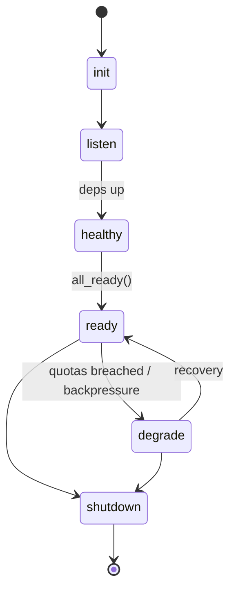

---

````markdown
---
title: TESTS — micronode
status: draft
msrv: 1.80.0
last-updated: 2025-09-23
audience: developers, auditors, CI maintainers
crate: micronode
pillar: 8
inherits-from: /docs/TESTS_BLUEPRINT.md
---

# 🧪 TESTS.md — micronode

*msrv: 1.80.0 (Tokio/Loom compatible)*

> **Scope:** `micronode` is a **single-binary node profile** with **amnesia ON by default** (RAM-first, no disk). It composes other services via config; most tests are **black-box/E2E**.  
> **Canon guardrails:** 33-crate canon intact; OAP/1 invariants (max_frame=1 MiB; storage chunk≈64 KiB), PQ roadmap (M1→M3), Six Concerns (SEC, RES, PERF, DX).  
> **Conflict rule:** If this document conflicts with repo-level blueprints (QUANTUM, HARDENING, CONCURRENCY, SCALING, TESTS_BLUEPRINT), **the blueprints win**.

---

## 0) Purpose

Define the **testing contract** for `micronode`:

- Layers: **unit**, **integration**, **property**, **fuzz (selective)**, **chaos/soak**, **performance**.
- **Coverage gates** & **Bronze→Silver→Gold** acceptance.
- **Reproducible commands** for devs & CI.
- Prove **amnesia**, **readiness/health**, **config hot-reload**, and **PQ toggles** without interop breakage.

---

## 1) Test Taxonomy

### 1.1 Unit Tests

*Scope:* small helpers (config overlays, CLI parsing, adapters), pure logic; <100 ms.

*Location:* `src/**/*` under `#[cfg(test)]`.

*Must cover:*
- Config merge precedence: file < env < CLI (`parse_config_overlays`, `apply_env_overlay`).
- Feature guards compile-time behavior for `pq`, `pq-hybrid`, `pq-sign`.
- CLI flags for amnesia/persistence toggles.

*Run:*
```bash
cargo test -p micronode --lib
````

---

### 1.2 Integration Tests

*Scope:* end-to-end bring-up via the binary & HTTP surfaces; black-box lifecycle.

*Location:* `tests/*.rs`

*Must include:*

* **Boot & Readiness:** start micronode; wait `/readyz`→200 (use `testing/lib/ready.sh`).
* **Amnesia Matrix:** `MICRO_PERSIST=0` (default) vs `MICRO_PERSIST=1`; verify **no on-disk artifacts** remain when amnesia is ON.
* **Config Reload:** update config; trigger hot-reload; assert `ConfigUpdated` surfaced and new snapshot visible.
* **Backpressure/Degrade:** exhaust a quota; `/readyz` should **fail writes** / show “shed” mode.
* **PQ Negotiation (M2+):** with features on, `pq_hybrid=true` succeeds with PQ peers; `pq_only=true` **refuses** classical with structured error.
* **Observability:** `/metrics`, `/healthz`, `/readyz`, `/version` present; golden metrics present.
* **OAP scope clarification:** OAP/1 **frame validation** (max\_frame=1 MiB) is **owned by gateway/ron-proto**; micronode tests only **proxy/compose behavior** and readiness effects.

*Run:*

```bash
cargo test -p micronode --test '*'
```

---

### 1.3 Property-Based Tests

*Scope:* config overlay lattice; startup FSM: `init → listen → healthy → ready → degrade → shutdown`.

*Tooling:* `proptest`

*Invariants:*

* No panics for arbitrary overlays.
* **Idempotent** start/stop (no double-free / resource leaks).
* **Monotonic readiness:** cannot be ready before all deps ready.

*Run:*

```bash
cargo test -p micronode --features testing-prop -- --nocapture
```

---

### 1.4 Fuzz Tests (selective, micronode-owned surfaces)

*Targets:*

* `config_from_env_fuzz` — env/CLI/file → Config parser.
* `status_probe_fuzz` — self-emitted JSON status decode (for forward compat).

*Corpus seeds:* `tests/vectors/config/*.toml`, `tests/vectors/env/*.env`, `tests/vectors/status/*.json`

*Tooling:* `cargo fuzz`

*Acceptance:* Nightly ≥1h; **zero crashes/OOM**.

*Run:*

```bash
cargo fuzz run config_from_env_fuzz -- -max_total_time=3600
```

> Wire-protocol fuzz (OAP frames, gateway parse) lives in owning crates; **do not duplicate** here.

---

### 1.5 Chaos / Soak Tests

*Scope:* lifecycle resilience, resource hygiene, degraded modes.

*Inject:*

* **Crash** child process mid-load (SIGKILL); supervised restart must be clean; `/readyz` flips to degraded first.
* **Bus lag/drops** (if bus exposed by harness): no deadlocks/livelocks.
* **Disk full / slow I/O** (only when `MICRO_PERSIST=1`): fail-safe with structured error; never corrupt state.

*Acceptance:* **24h soak** → **zero FD leaks**, bounded RSS, no livelocks; readiness transitions observable.

---

### 1.6 Performance / Load Tests

*Scope:* startup time, `/readyz` latency, PQ overhead deltas, optional proxied GET path.

*SLO exemplars (dev hardware):*

* Startup → `/readyz`: **p95 ≤ 2.0 s** (amnesia on).
* `/readyz` latency under light load: **p95 ≤ 20 ms**.
* PQ handshake overhead vs classical (M2+): **≤ 20% p95**.
* Proxied public GET (if configured): **p95 < 100 ms**.

*Tools:* `criterion` (micro), scripts in `testing/load/*` (macro: hey/k6).

*Run:*

```bash
cargo bench -p micronode
```

*Artifacts:* flamegraphs/criterion reports under `target/criterion/**`; macro logs under `target/perf/**`.

---

## 2) Coverage & Gates

### 2.1 Bronze (MVP)

* Unit + integration green on **stable**.
* **Statement coverage ≥ 70%** (owned code).
* Fuzz harness **builds**.
* `/readyz` & `/metrics` exist with golden gauges/histograms.

### 2.2 Silver (Useful Substrate)

* Property tests enabled and non-flaky (seeded).
* Nightly **fuzz ≥ 1h** green; no crashes/OOM.
* **Statement coverage ≥ 85%**; **Branch ≥ 70%**.
* Chaos scripts present; **1h smoke soak** in CI.
* PQ feature build (`pq`, `pq-hybrid`, `pq-sign`) compiles and passes basic interop (mock peer).

### 2.3 Gold (Ops-Ready)

* Nightly **fuzz ≥ 4h** green (rotating corpus).
* Weekly **24h soak** (self-hosted) with resource ceilings; zero FD leaks.
* **Statement ≥ 90%**; **Branch ≥ 80%** (owned paths).
* Perf guardrails recorded per release (startup, ready latency, PQ deltas).
* PQ interop matrix recorded (classical↔classical, hybrid↔hybrid, hybrid↔classical).
* **Amnesia proof:** with `MICRO_PERSIST=0`, no persistent artifacts post-shutdown.

---

## 3) Invocation Examples

### 3.1 All Tests (fast)

```bash
cargo test -p micronode --all-targets -- --nocapture
```

### 3.2 Feature Matrix (PQ)

```bash
cargo test -p micronode --features pq,pq-hybrid -- --nocapture
cargo test -p micronode --features pq,pq-sign   -- --nocapture
cargo test -p micronode --features pq,pq-hybrid,pq-sign -- --nocapture
```

### 3.3 Env Overlays

```bash
MICRO_PERSIST=1 cargo test -p micronode --test '*'
PQ_ONLY=true cargo test -p micronode --features pq,pq-hybrid --test pq_refusal
```

### 3.4 Loom (FSM, reload)

```bash
RUSTFLAGS="--cfg loom" cargo test -p micronode --test loom_*
```

### 3.5 Fuzz (selective)

```bash
cargo fuzz run config_from_env_fuzz -- -max_total_time=60
```

### 3.6 Benchmarks

```bash
cargo bench -p micronode
```

---

## 4) Observability Hooks

* Tests **emit structured JSON logs** with `service`, `phase`, `corr_id`; failures include the last 200 lines of logs.
* CorrID **propagates** through harness and must appear in logs.
* Metrics sanity (presence): `/metrics` contains golden histograms/gauges and **PQ labels** (value may be 0).
* PQ downgrade visibility (M2+): assert increment of `pq_downgrade_events_total`.
* **Artifacts:** test logs under `target/test-logs/*.jsonl`; junit under `target/test-reports/`.

---

## 5) CI Enforcement

**Recommended GitHub Actions matrix (excerpt):**

| Job                   | Toolchain | Features          | Env                                          |
| --------------------- | --------- | ----------------- | -------------------------------------------- |
| unit+integration      | stable    | (none)            | MICRO\_PERSIST=0                             |
| unit+integration (PQ) | stable    | pq,pq-hybrid      | MICRO\_PERSIST=0                             |
| pq-sign path          | stable    | pq,pq-sign        | MICRO\_PERSIST=0                             |
| pq-only refusal       | stable    | pq,pq-hybrid      | PQ\_ONLY=true                                |
| amnesia-off path      | stable    | (none)            | MICRO\_PERSIST=1                             |
| loom FSM/reload       | stable    | (none)            | RUSTFLAGS="--cfg loom"                       |
| fuzz nightly          | nightly   | (target-specific) | —                                            |
| **perf/soak (gold)**  | nightly   | (none)            | runs: testing/performance/soak.sh --hours 24 |

Standard jobs:

* Build & Test: `cargo test --workspace --all-targets`
* Clippy & fmt: `cargo clippy -D warnings`; `cargo fmt -- --check`
* Supply chain: `cargo deny check advisories licenses bans sources`
* Coverage: `grcov` or `tarpaulin` → upload artifact
* Fuzz: 1h on PR label; 4h nightly (rotating targets/corpus)

---

## 6) Open Questions (crate-specific)

* **Loom-checked invariants:** startup FSM (init→ready), readiness monotonicity, degrade path (fail-writes first), config hot-reload races.
* **Mandatory fuzz targets:** `config_from_env_fuzz`, `status_probe_fuzz`.
* **Perf SLOs measured:** startup→ready p95, `/readyz` p95, PQ overhead p95, proxied GET p95 (<100 ms when configured).

---

## 7) Artifacts & Helpers

* **ready.sh (portable):** `testing/lib/ready.sh`

  ```bash
  #!/usr/bin/env bash
  set -euo pipefail
  _wait_http_200() {
    local url="$1" timeout="${2:-30}" start now code
    start=$(date +%s)
    while true; do
      code=$(curl -fsS -o /dev/null -w "%{http_code}" "$url" || true)
      [[ "$code" == "200" ]] && return 0
      now=$(date +%s)
      (( now - start >= timeout )) && { echo "timeout: $url last=$code" >&2; return 1; }
      sleep 0.25
    done
  }
  wait_readyz() { _wait_http_200 "$1/readyz" "${2:-30}"; }
  ```

* **Load rigs:** `testing/load/*` (hey/k6 scripts), logs to `target/perf/**`.

* **Fuzz corpora:** `tests/vectors/**` (synced into `fuzz/corpus/*` nightly).

* **Soak harness:** `testing/performance/soak.sh` (collects FD/RSS, rotates logs).

---

## 8) Acceptance Recap (Brake Points)

If a PR changes **bring-up, readiness, amnesia, or PQ knobs** it must:

1. Update/extend the relevant **integration/loom/fuzz tests**,
2. Keep **Bronze gates** green on PR, and
3. **Not regress perf SLOs** (compare to previous release artifacts in `target/perf/**`).

---

## (Optional) FSM Diagram (for reviewers)



```

---
