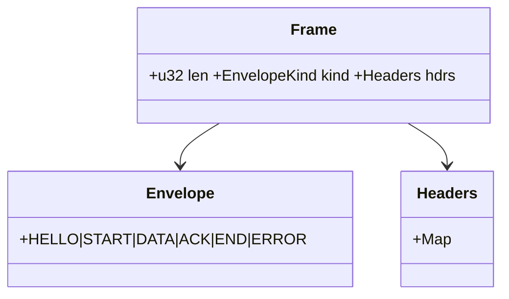
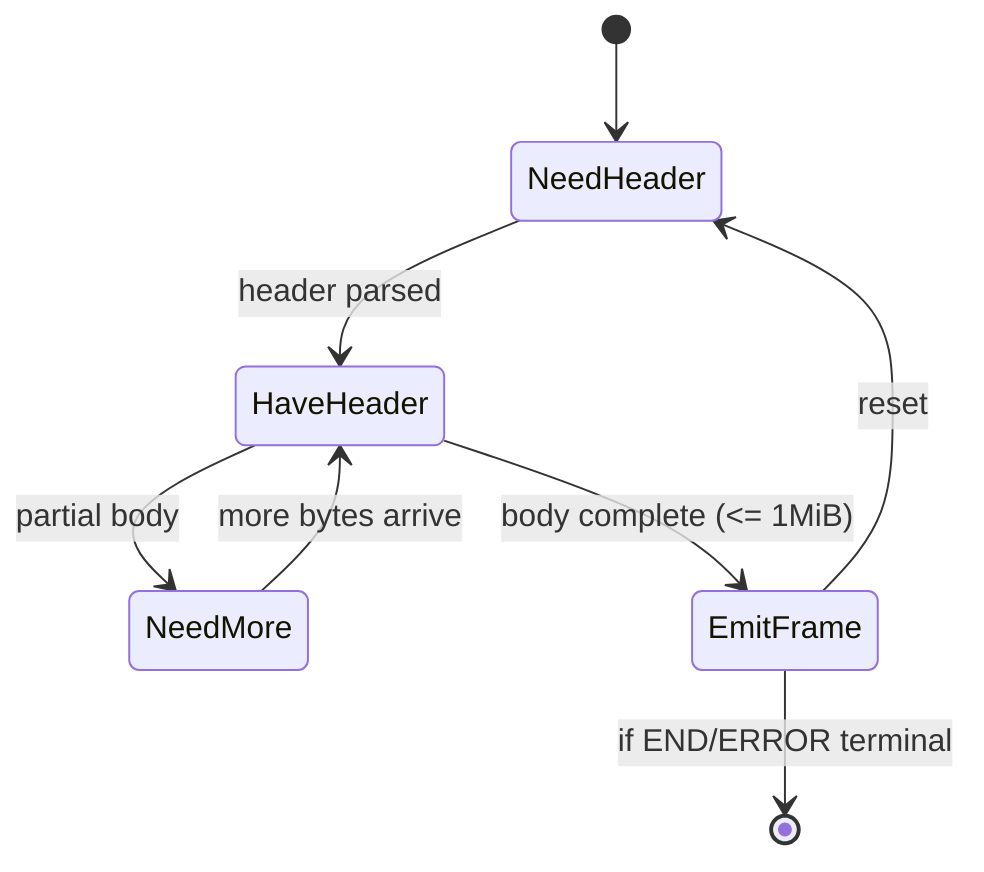

---

# oap

> **Role:** library (OAP/1 framing + validation)
> **Owner:** Stevan White
> **Status:** draft
> **MSRV:** 1.80.0
> **Last reviewed:** 2025-10-06

Badges (optional):
[]() []() []() []()

---

## 1) Overview

**What it is:**
`oap` is a **pure protocol library** for OAP/1 framed messaging. It parses/writes envelopes (`HELLO | START | DATA | ACK | END | ERROR`), enforces the **1 MiB frame cap**, and validates headers. It has **no sockets/TLS/auth/DTOs**—those are host concerns. The crate exposes small, cancel-safe parser/writer primitives plus a metrics trait that hosts implement.

**How it fits (RustyOnions topology):**

* **Pillars:** P7 (App BFF & SDK), P10 (Overlay/Transport/Discovery)
* **Upstream callers:** `svc-gateway`, `svc-overlay`, SDKs (Rust/TS/Python)
* **Downstream deps:** `ron-transport` (TLS/Tor), `ron-proto` (DTOs)
* **Data it touches:** in-memory frames & headers only; **no persistence** (amnesia-friendly)
* **Security boundary:** protocol grammar + limits; **no key custody**, **no PII**
* **Spec source:** `docs/specs/oap-1.md` (normative)

### 1.1 High-Level Architecture

```mermaid
flowchart LR
  subgraph Host Service (e.g., svc-gateway / svc-overlay)
    A[Transport (ron-transport)\nTLS/Tor, timeouts] -->|bytes| B(oap::Parser/Writer)
    B -->|Envelope / Reject| C[Host logic\n(ron-proto DTOs, policy)]
  end
  B -->|metrics hooks| D[[Prometheus via host]]
  style B fill:#0b7285,stroke:#083344,color:#fff
```

---

## 2) Responsibilities & Boundaries

**MUST do (core responsibilities):**

* [ ] Parse/encode OAP/1 envelopes; enforce **`MAX_FRAME_BYTES = 1_048_576`**.
* [ ] Validate headers (`strict_headers=true` by default).
* [ ] Require `DATA.obj = "b3:<hex>"` when bytes represent a content-addressed object.
* [ ] Expose metrics hooks (frames, rejects, bytes, inflight, ack window, encode/decode timers).

**MUST NOT do (anti-scope / boundaries):**

* [ ] No sockets/TLS/auth; no DTO schemas.
* [ ] No hashing of payloads (verification happens where bytes are materialized).
* [ ] No DHT/overlay/kernel/bus logic.

**Acceptance Gates (PROOF you did it):**

* [ ] Invariants tests: envelope set; 1 MiB cap; required `obj` header rule.
* [ ] Canonical polyglot vectors (Rust/TS/Python) pass **byte-identical**.
* [ ] Metrics trait exercised—**every reject** hits `oap_rejects_total{reason=...}` (low-cardinality reasons).
* [ ] PQ smoke: `HELLO{pq_hybrid=true}` round-trips (opaque flag; no semantic changes).
* [ ] **Amnesia proof:** no FS/DB ops from this crate under any test (grep + deny-lists).

---

## 3) Public Interfaces

### 3.1 Rust API (library)

Key modules/types:

* `envelope::{EnvelopeKind, Envelope}` — OAP/1 message grammar
* `frame::{Frame, FrameHeader, MAX_FRAME_BYTES}` — framed container + hard cap
* `parser::{Parser, ParserConfig, Progress}` — decode + strictness knobs
* `writer::{Writer, WriterConfig}` — encode + credit window
* `metrics::OapMetricsExt` — host-implemented observability
* `error::{OapError, OapConfigError, Result}` — normative errors

Minimal embed:

```rust
use oap::{parser::ParserConfig, writer::WriterConfig};

let pcfg = ParserConfig::default();
let wcfg = WriterConfig::default();
// Host wires Parser/Writer to its transport (ron-transport) and DTO layer (ron-proto).
```

### 3.2 Bus RPC / Events

N/A (library). Hosts may publish sampled events like `gateway.oap.reject{reason}`.

### 3.3 HTTP / gRPC

N/A (library). Hosts expose `/metrics`, `/healthz`, `/readyz`.

### 3.4 CLI

N/A.

---

## 4) Configuration

**Source of truth:** `oap` does not read env/flags/files; the **host** builds configs. OAP constants (like the 1 MiB cap) are **not configurable**.

| Field                           | Type | Default | Description                                      |
| ------------------------------- | ---- | ------- | ------------------------------------------------ |
| `strict_headers`                | bool | true    | Reject unknown/duplicate headers.                |
| `enforce_obj_header_on_objects` | bool | true    | Require `obj:"b3:<hex>"` when bytes are objects. |
| `ack_window_frames`             | u32  | 32      | Windowed credit; validated `1..=1024`.           |
| `allow_pq_hello_flags`          | bool | true    | Accept opaque PQ flags in `HELLO`.               |

**Cargo features:** keep minimal; no default heavy deps.

---

## 5) Build, Run, Test

**Build**

```bash
cargo build -p oap
```

**Tests (unit/prop/docs)**

```bash
cargo test -p oap --all-features
cargo test -p oap --doc
```

**Hardening (fuzz/miri/loom)**

```bash
# Fuzz parser for 60s
cargo fuzz run parser_fuzz -- -max_total_time=60

# UB check (miri) for core paths
cargo +nightly miri test -p oap -- all

# (If applicable) loom model tests
RUSTFLAGS="--cfg loom" cargo test -p oap --tests -- --ignored
```

**Lint & format**

```bash
cargo fmt --all
cargo clippy -p oap -- -D warnings
```

**Security & deps**

```bash
cargo deny check
```

**Public API gate**

```bash
cargo public-api --diff-git-checks
```

**Bench (if provided)**

```bash
cargo bench -p oap
```

---

## 6) Observability

**Library hooks (implement in host):**

* Frames/bytes: `inc_frame(kind)`, `add_frame_bytes(n)`, `set_inflight(v)`
* Flow control: `set_ack_window(v)`
* Errors: `inc_reject(reason)`
* Timers: encode/decode histograms

**Canonical metrics (host export):**

* `oap_frames_total{kind}`
* `oap_bytes_total{direction}`
* `oap_rejects_total{reason}` — **reasons are low-cardinality**:

  * `frame_oversize` | `unknown_envelope` | `header_malformed` | `credit_violation` | `truncated` | `obj_required_missing` | `bad_hello`

**Tracing**

* Targets: `oap=info` (library), `axum=warn,tower_http=warn` (host)
* Span fields (host): `request_id`, `peer_addr`, `route`, `status`

---

## 7) Performance & SLOs

| Metric                | Target (lib path)    | Notes                                                |
| --------------------- | -------------------- | ---------------------------------------------------- |
| Parser decode latency | low tens of µs (p95) | Zero-copy friendly where practical (`bytes::Bytes`). |
| Writer encode latency | low tens of µs (p95) | Host I/O chunk ≈ **64 KiB** (I/O hint).              |
| Start-to-ready (host) | < 1s (cold)          | Host concern; lib adds negligible overhead.          |

**How to reproduce:** run Criterion benches in `testing/performance`; vary `ack_window_frames`, object vs non-object DATA, and host I/O chunk hints.

---

## 8) Data & Schema

No DB/files. OAP moves framed bytes + headers; **content addressing** appears via `DATA.obj = "b3:<hex>"` when applicable. Verification belongs where bytes are stored/served.



---

## 9) Security & Privacy

* **Layering:** transport/TLS via `ron-transport`; auth/caps via `ron-auth`/`svc-passport`; DTOs in `ron-proto`.
* **PQ readiness:** `HELLO.pq_hybrid` is an **opaque capability flag**; parsing/semantics unchanged.
* **Amnesia:** identical behavior with amnesia ON/OFF; this crate performs no persistence.
* **Unsafe:** no `unsafe` in public paths.
* **PII:** none; payloads opaque to this crate.

---

## 10) Error Taxonomy

| Variant              | When it happens                    | Mapped reject reason   |
| -------------------- | ---------------------------------- | ---------------------- |
| `FrameOversize`      | Frame exceeds 1 MiB cap            | `frame_oversize`       |
| `UnknownEnvelope`    | Tag not in OAP/1 set               | `unknown_envelope`     |
| `HeaderMalformed`    | Missing/duplicate/ill-typed header | `header_malformed`     |
| `CreditViolation`    | ACK/window misuse                  | `credit_violation`     |
| `Truncated`          | Body length mismatch               | `truncated`            |
| `ObjRequiredMissing` | Missing `obj` when required        | `obj_required_missing` |
| `BadHello`           | Version/flags invalid              | `bad_hello`            |
| `Io(std::io::Error)` | Host transport surfaced            | (host-defined)         |

---

## 11) Concurrency Model

`oap` is **pure library code** with cancel-safe APIs; hosts handle async I/O and **must not hold locks across `.await`** on hot paths.



---

## 12) Compatibility & Requirements

* **Rust:** MSRV 1.80.0
* **OS:** agnostic (host runs on macOS/Linux)
* **TLS/HTTP:** N/A in lib (host typically uses `tokio-rustls 0.26.x`, `axum 0.7.x`)
* **DB:** none

---

## 13) Examples

**Sequence (happy path):**

```mermaid
sequenceDiagram
  participant C as Client
  participant S as Host Service
  C->>S: HELLO{version,max_frame,pq?}
  S-->>C: HELLO{version,max_frame,pq?}
  C->>S: START{stream}
  loop windowed transfer
    C->>S: DATA{obj?,seq,len}+<len bytes>
    S-->>C: ACK{up_to}
  end
  C->>S: END{seq,status}
  S-->>C: ACK{up_to} (final)
  note over C,S: Any violation → ERROR{code,reason}; host increments oap_rejects_total
```

**Rust (embed)**

```rust
use oap::{parser::Parser, parser::ParserConfig, writer::Writer, writer::WriterConfig};

let mut p = Parser::new(ParserConfig::default());
let mut w = Writer::new(WriterConfig::default());
// Wire to your transport read/write loops; on rejects, bump metrics and abort the stream.
```

**TypeScript (polyglot parity sketch)**

```ts
// Pseudocode illustrating vector parity check
import { parseOapFrame, writeOapFrame, MAX_FRAME_BYTES } from "@rustyonions/oap-ts";

const hello = writeOapFrame({ kind: "HELLO", version: 1, pq_hybrid: true });
const parsed = parseOapFrame(hello);
console.assert(parsed.kind === "HELLO");
console.assert(hello.byteLength <= MAX_FRAME_BYTES);
```

**Python (polyglot parity sketch)**

```python
from oap_py import parse_oap_frame, write_oap_frame, MAX_FRAME_BYTES

hello = write_oap_frame(kind="HELLO", version=1, pq_hybrid=True)
parsed = parse_oap_frame(hello)
assert parsed["kind"] == "HELLO"
assert len(hello) <= MAX_FRAME_BYTES
```

---

## 14) Troubleshooting

* **“Frame oversize” rejects:** ensure callers respect the **1 MiB** cap.
* **Strict header failures:** correct headers or relax **only in interop labs**, not prod.
* **Missing `obj` in DATA:** attach `obj:"b3:<hex>"` when bytes are content-addressed.
* **HELLO PQ flags rejected:** allow via host-built config (`allow_pq_hello_flags=true`).

---

## 15) Development Notes

* Keep OAP **neutral & tiny**; push transport/TLS/DTOs into the host.
* Maintain **public API snapshots** (`cargo public-api`) and SemVer discipline in CI.
* Tests: fuzz/property for header/body parsing; polyglot vectors under `/tests/vectors/oap1/`.
* Prefer `bytes::Bytes` for zero-copy friendliness where applicable.

---

## 16) Mermaid Diagrams — Policy & Tooling

Keep `.mmd` sources under `docs/` and render SVGs in CI.

```bash
npm i -g @mermaid-js/mermaid-cli
mmdc -i docs/arch.mmd -o docs/arch.svg
```

(Or use the Docker snippet if you avoid local Node.)

---

## 17) Roadmap & TODO

* [ ] Expand error-path vectors (duplicate headers, credit abuse, truncated frames).
* [ ] Add PQ-flagged vectors to parity matrix (Rust/TS/Python).
* [ ] Criterion benches: decode/encode micro-SLOs and window sizes.
* [ ] Optional: FFI surface planning for SDKs.

---

## 18) Changelog

See `CHANGELOG.md`. **SemVer:** changing the envelope set or 1 MiB cap is **major**.

---

## 19) License

Dual-licensed under **MIT** or **Apache-2.0**.

---

## 20) Contributing

PRs welcome! Please include updated vectors/diagrams and note any public-API diffs in CI output (`cargo public-api`). Run fmt/clippy/tests/deny and at least a 60s fuzz pass.

---

