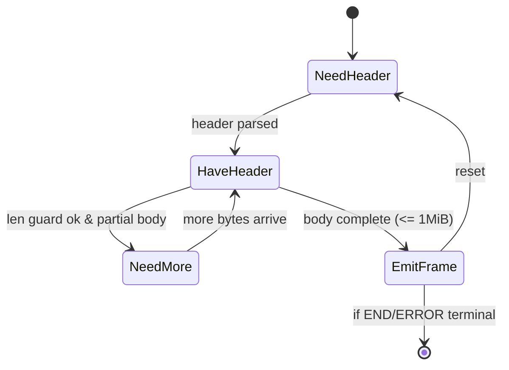

---

title: Concurrency Model — oap
crate: oap
owner: Stevan White
last-reviewed: 2025-10-06
status: draft
template_version: 1.1
msrv: 1.80.0
tokio: "1.x (pinned at workspace root)"
loom: "0.7+ (dev-only)"
lite_mode: "For small library crates: fill §§1,3,4,5,10,11 and mark others N/A"
-------------------------------------------------------------------------------

# Concurrency Model — `oap`

This document makes the concurrency rules **explicit** for the `oap` crate: tasks, channels, locks, shutdown, timeouts, and validation (property/loom/TLA+). It complements `docs/SECURITY.md`, `docs/CONFIG.md`, the crate’s `README.md`, and the OAP/1 IDB.

> **Golden rule:** never hold a lock across `.await` in supervisory or hot paths.

---

## 0) Lite Mode (for tiny lib crates)

`oap` is a **pure library** (protocol grammar + enc/dec) with **no background tasks** and **no sockets**.
Per template guidance, we fully specify **§1, §3, §4, §5, §10, §11** and mark runtime/service-oriented sections **N/A**.

---

## 1) Invariants (MUST)

* **[I-1] No runtime ownership:** `oap` owns **no Tokio runtime** and **spawns no tasks**. All async I/O, sockets, and task orchestration are **host** responsibilities.
* **[I-2] Zero blocking in hot paths:** Parsing/encoding are CPU-bounded and **non-blocking**; no syscalls, no filesystem, no sleep/jitter in `oap`.
* **[I-3] Lock discipline:** Any internal mutability (e.g., small parser state) is **thread-confined** or uses **short-lived** guards; **no lock is ever held across `.await`**.
* **[I-4] Boundedness by construction:** Public APIs expose **pull-based** decoding (caller provides bounded buffers/frames). `oap` never grows unbounded queues/buffers.
* **[I-5] Cancel-safety:** All async functions are **cancel-safe**: on cancel, internal state remains valid and memory-safe (no double-advances of cursors).
* **[I-6] Deterministic framing:** Lengths are validated **before** allocation/copy; split reads are supported; oversize frames (>= 1 MiB) **fail early** with typed errors.
* **[I-7] Reentrancy & Send/Sync:** Stateless encoders/decoders are `Send` where appropriate; types that are not thread-safe are **explicitly** not `Sync` and documented.
* **[I-8] Backpressure neutrality:** `oap` does **not** implement credit timers or sleeping. ACK window semantics are purely **algebraic**; timing/backpressure is enforced by hosts.

---

## 2) Runtime Topology

**N/A (library-only).** Any “listener/worker” topology, supervision, or backoff lives in embedding services (e.g., `svc-gateway`, `svc-overlay`).

---

## 3) Channels & Backpressure

**N/A inside `oap`.** The crate does **not** create channels.

**Guidance for hosts using `oap`:**

* Use **bounded** `mpsc` for frame work queues; prefer `try_send` and return `Busy` rather than buffering.
* For event taps, prefer **bounded** `broadcast` with lag counters; never rely on unbounded broadcasts.
* Surface **queue depth** and **drop counters** as metrics at the host layer.

---

## 4) Locks & Shared State

**Allowed within `oap`:**

* **Thread-local parser state** (e.g., cursor, partial-header scratch) with **no locks**.
* **Short-lived** `&mut self` borrows to advance state machines; no cross-async borrow.

**Forbidden:**

* Holding any `Mutex`/`RwLock` guard across `.await` (library APIs avoid this by design).
* Nested locks or global singletons.

**Pattern:**

* Prefer **immutable** structs with explicit “builder” or “cursor” types that mutate local state and return new positions/slices.
* If a `Mutex` is required for shared counters in tests, acquire → compute → **drop guard** → then `.await`.

---

## 5) Timeouts, Retries, Deadlines

**N/A inside `oap`.** The crate performs **no timing** and **no retries**.

**Host guidance (normative for embeddings):**

* Apply **explicit timeouts** on read/write at transport layer (`ron-transport`).
* Keep **ACK window** bounded; reject on overflow rather than waiting in `oap`.
* Retries only for **idempotent** ops and **outside** of `oap`.

---

## 6) Cancellation & Shutdown

**N/A inside `oap`.** No tasks to drain. All `oap` functions must be cancel-safe; callers can drop `Future`s without leaving the parser in an invalid state.

---

## 7) I/O & Framing

**Applicable (library contracts):**

* **Split reads:** decoders accept partial buffers and return “need more” without copying when possible.
* **Pre-validate lengths:** refuse frames whose declared length exceeds **1 MiB** (protocol cap) **before** allocation/advance.
* **Order and idempotence:** `ACK{up_to}` handling is pure math; no timers or sleeps. `END/ERROR` terminate the logical stream deterministically.
* **No hashing in `oap`:** integrity checks (BLAKE3) occur at materialization boundaries (storage/overlay), not inside the framer.

---

## 8) Error Taxonomy (Concurrency-Relevant)

| Error                | When                                        | Retry? | Concurrency Note                      |
| -------------------- | ------------------------------------------- | ------ | ------------------------------------- |
| `FrameOversize`      | Declared length ≥ 1 MiB                     | no     | Fail-fast; caller may drop connection |
| `UnknownEnvelope`    | Tag not in {HELLO,START,DATA,END,ACK,ERROR} | no     | Protocol error; caller should reject  |
| `HeaderMalformed`    | Missing/dupe/invalid header                 | no     | Do not attempt partial recovery       |
| `CreditViolation`    | ACK advances beyond last seq                | no     | Host should log+reject, not wait      |
| `Truncated`          | Buffer ends mid-frame                       | maybe  | Caller may feed more bytes            |
| `ObjRequiredMissing` | DATA bytes represent object w/o `obj`       | no     | Caller must enforce before use        |

---

## 9) Metrics (Concurrency Health)

**N/A within `oap`** (no metrics endpoints).
**Host should emit:**

* `oap_frames_total{kind}`
* `oap_rejects_total{reason}`
* `oap_read_frame_seconds` / `oap_write_frame_seconds` (histograms)
* Queue/backpressure metrics at transport/ingress

---

## 10) Validation Strategy

**Unit / Property**

* **Framer algebra:** associativity/identity for `ACK{up_to}` windows; `END/ERROR` terminal behavior is absorbing.
* **Split-read property:** feeding bytes in **N slices** equals feeding the same bytes once (no state drift).
* **Length bound:** any path that would allocate uses an upfront guard `len <= 1 MiB`.

**Loom (dev-only)**

* Model **single-producer/single-consumer** access to a shared decode cursor behind a `Mutex` **used only in tests**; assert no deadlocks and no guard held across async boundaries.
* Model **atomic** seq/ack math where host accesses are concurrent; ensure monotonicity properties.

**Fuzz**

* Header/value corpus: duplicate headers, bad UTF-8, enormous lengths, overlapping sequences, `ACK` replays.
* Frame corpus: truncated, zero-length DATA, maximal valid (exactly 1 MiB), off-by-one edges.

**Chaos (host-level)**

* Inject truncated frames under sustained load; assert **rejects** rather than stalls.
* Randomly interleave `ACK` and `DATA`; verify algebraic invariants hold.

**(Optional) TLA+ sketch**

* States: `{Hello, Started, Streaming(seq), Ended}`.
* Safety: never accept DATA before START; never accept DATA after END; no `ack_up_to` < last ack.
* Liveness: if bytes arrive and are valid, the parser advances; no livelock without host queues.

---

## 11) Code Patterns (Copy-Paste)

**A. Split-read, zero-copy-ish decode (no locks, cancel-safe)**

```rust
/// Feed a chunk; either we decoded a complete frame or we need more bytes.
/// No locks; cancel-safe; no allocation beyond bounded scratch.
pub fn feed<'a>(st: &mut ParserState, mut buf: &'a [u8]) -> Result<Progress<'a>, OapError> {
    // 1) Need header?
    if !st.have_header {
        if buf.len() < HEADER_MIN {
            return Ok(Progress::NeedMore);
        }
        let (hdr, rest) = parse_header(buf)?;
        st.set_header(hdr)?;
        buf = rest;
    }

    // 2) Enforce frame cap before any copy/alloc
    let need = st.body_len();
    if need as usize > MAX_FRAME_BYTES { // 1_048_576
        return Err(OapError::FrameOversize);
    }

    // 3) Enough body?
    if buf.len() < need {
        return Ok(Progress::NeedMore);
    }

    // 4) Produce a zero-copy slice for DATA (caller decides copy or stream)
    let (body, rest) = buf.split_at(need);
    let frame = st.finish_with_body(body)?;
    st.reset_for_next();
    Ok(Progress::Frame { frame, rest })
}
```

**B. “No lock across `.await`” handoff (host-side pattern using `oap`)**

```rust
// Acquire state, compute next action, drop guard, then await I/O.
let action = {
    let s = state.lock();           // short critical section
    s.plan_next_action()            // pure computation
};                                  // guard dropped here
match action {
    Action::ReadFrame => {
        let bytes = transport.read_chunk().await?; // host I/O
        parser.feed(&bytes)?;                      // pure compute
    }
    Action::WriteAck { up_to } => transport.write_ack(up_to).await?,
}
```

**C. Cancel-safe select (host-side)**

```rust
tokio::select! {
    biased;

    _ = shutdown.changed() => { /* stop intake; drain host queues */ }
    res = transport.read_next() => {
        let buf = res?;
        match parser.feed(&buf)? {
            Progress::NeedMore => {}
            Progress::Frame { frame, rest } => handle_frame(frame, rest)?,
        }
    }
}
```

---

## 12) Configuration Hooks (Quick Reference)

**Inside `oap`:**

* `strict_headers` (bool) — fail unknown/dup headers.
* `enforce_obj_header_on_objects` (bool).
* `ack_window_frames` (u32) — algebraic, not time-based.

**In host (not `oap`):**

* Transport timeouts, channel capacities, drain deadlines, retry budgets.

See `docs/CONFIG.md` for exact schema and defaults.

---

## 13) Known Trade-offs / Nonstrict Areas

* **Zero-copy vs simplicity:** We favor passing slices out of the parser for DATA to avoid copies; hosts may choose to copy into pool buffers for lifetime simplicity.
* **Strict header mode:** In interop labs you may disable strictness; this widens surface area—**never** disable in production.
* **Seq rollover policy:** Default is `error` to preserve monotonicity; `wrap` is available for special transports but risks ambiguity.

---

## 14) Mermaid Diagrams

**14.1 Parser State Machine (library-level, no tasks)**



**Text:** Parser alternates between `NeedHeader` and `HaveHeader`. It emits a frame only when complete and under the 1 MiB cap; otherwise it requests more bytes. END/ERROR are terminal for the logical stream.

---

## 15) CI & Lints (Enforcement)

* Enable `-D warnings` and `-W clippy::await_holding_lock` (should be moot, but guards regressions).
* Add **fuzz** jobs for header/body parsing and envelope tags.
* Run **loom** tests behind `--cfg loom` for concurrency sketches used in tests.
* Property tests for **split-read equivalence** and **length-bound enforcement**.

---

## 16) Schema Generation (Optional)

Not applicable—no channels/locks to inventory within `oap`.
(Hosts may auto-generate their own concurrency docs for queues they build around `oap`.)

---

## 17) Review & Maintenance

* Re-review on any change to: header grammar, length validation, or `ack_window_frames` semantics.
* Keep `owner`, `msrv`, `last-reviewed` current.
* PRs touching parser/encoder must update: **tests (unit/property/fuzz)** and this document’s **§1, §7, §10, §11** as needed.

---
