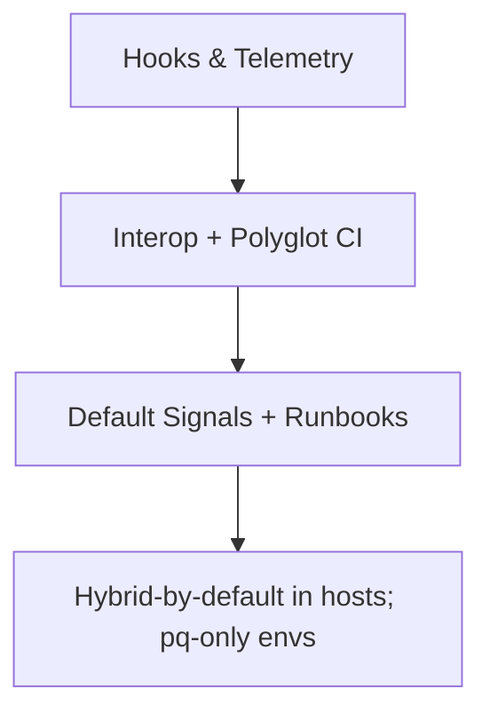

---

title: Post-Quantum (PQ) Readiness & Quantum Proofing
status: draft
msrv: 1.80.0
last-updated: 2025-10-06
audience: contributors, security auditors, ops
crate: oap
crate-type: lib
pillar: 9 (Interop / Protocol)
owners: [Stevan White]

# QUANTUM.md — `oap`

## 0) Purpose

Describe how `oap` (OAP/1 framer/validator) stays **crypto-agnostic yet PQ-ready**. `oap` does not perform key exchange or signatures; it must:

* **Carry** PQ posture signaled by peers (HELLO posture bits).
* **Surface** posture to hosts (metrics/labels/errors) without changing the OAP state machine.
* **Refuse** malformed posture deterministically (typed errors).
* **Remain amnesia-safe** (no persistence of posture).
* Provide interop-friendly toggles, tests, and a rollout plan that won’t break classical peers.

---

## 1) Exposure Assessment (What’s at risk?)

* **Public-key usage (Shor-breakable):** none in `oap`. Happens in transports (`ron-transport`, `svc-gateway`) and auth/identity crates. `oap` only **observes** posture in `HELLO`.
* **Symmetric/Hash (Grover):** none in `oap`; payload is zero-copy slice/`Bytes`.
* **Data at rest:** none (stateless).
  **HNDL risk:** indirect only (wire capture is a host concern).
* **Session lifetime:** host-defined (typically short → lower HNDL).
* **Worst-case blast radius:** a classical-only peer negotiates non-PQ; `oap` **must expose** posture so host policy can degrade/deny. `oap` itself leaks no secrets.

---

## 2) Current Crypto Profile (Today)

* **In `oap`:** no KEX, no signatures, no AEAD, no hashes.
* **Context (hosts):** TLS 1.3 with X25519; Ed25519 for caps; AES-GCM or ChaCha20-Poly1305; BLAKE3-256 hashing elsewhere.
* **Custody:** keys in KMS/HSM at host layers; **none** in `oap`.
* **Crypto-carrying interfaces:** `HELLO` posture bits (opaque to `oap` logic except structural parsing).

---

## 3) Target PQ Posture (Where we’re going)

* **KEX (host):** Hybrid (X25519+ML-KEM). `oap` just parses/labels posture.
* **Signatures (host):** ML-DSA/SLH-DSA options for tokens/receipts.
* **HELLO posture bitfield (v1):** `mode` (off|hybrid|pq-only), `kex` (none|x25519|ml-kem|hybrid), `sig` (none|ed25519|ml-dsa|slh-dsa). Unknown values map to `unknown` label; no state change.
* **Back-compat:** default **observe** posture; hosts may **enforce** by policy when ready (hybrid → pq-only).

---

## 4) Feature Flags & Config (How to turn it on)

```toml
# Cargo features (no crypto deps added by oap)
[features]
pq = []                # HELLO posture parsing
pq-telemetry = ["pq"]  # add {pq_mode} labels on oap_* metrics
```

```ini
# Host-consumed config surfaced by oap
[oap_pq]
accept_hello_flags      = true   # parse posture when present
require_flag_presence   = false  # if true, HELLO must carry posture
policy                  = "observe"   # "observe" | "enforce" (host enforces)
allowed_posture         = "any"       # "any" | "hybrid" | "pq-only"
amnesia_clear_on_parse  = true   # zeroize temporary posture buffers immediately
```

**Behavior:** In `enforce + pq-only`, `oap` returns a **typed error** (`BadHelloPqPolicy`) and sets labels; host turns that into a refusal/close.

---

## 5) Migration Plan (Milestones)

* **M1 (Bronze) — Hooks & Telemetry**

  * Implement HELLO posture parsing + `{pq_mode}` labels.
  * Default `policy=observe`. No behavior change for peers.
  * Baseline perf: posture parsing must be 0% overhead.

* **M2 (Silver) — Interop & Polyglot**

  * Conformance matrix: classical↔classical, hybrid↔hybrid, hybrid↔classical (observe).
  * **SDK parity (polyglot):** Rust/Go/TS SDKs parse posture and expose it; CI green on all.
  * Add `BadHelloPqPolicy` mapping for enforce flows; PromQL dashboards.

* **M3 (Gold) — Defaults & Runbooks**

  * Enable `pq` and `pq-telemetry` by default; keep `observe` by default.
  * Ship runbook steps to flip to `enforce` (and rollback).
  * Expand vectors with posture cases.

* **Post-M3 — De-risk & Deprecate**

  * Gradually set transports to hybrid by default; offer `pq-only` envs for partners ready for it.

**Mermaid (high level):**



---

## 6) Invariants (MUST)

* **[PQ-I1] No crypto in `oap`** (no KEX/sign/AEAD/hash).
* **[PQ-I2] Posture parsing is side-effect-free;** OAP/1 state machine unchanged.
* **[PQ-I3] Deterministic rejects** for malformed posture; no panics.
* **[PQ-I4] In `enforce + pq-only`,** return `BadHelloPqPolicy`; host must refuse classical.
* **[PQ-I5] Metrics label bounds:** `{pq_mode}` ∈ {off,hybrid,pq-only,unknown}; no unbounded labels.
* **[PQ-I6] Conformance + fuzz include posture cases; classical parity remains green.**
* **[PQ-I7] Amnesia-safe:** no persistence of posture; zeroize temporary posture buffers immediately; no disk writes.

---

## 7) Observability (Metrics, Logs, Readiness)

* **Metrics (feature-gated):**

  * `oap_frames_total{kind,pq_mode}`
  * `oap_rejects_total{reason,pq_mode}`
  * `oap_read_frame_seconds_bucket{pq_mode}`
* **Example PromQL:**

  * Posture adoption:

    ```
    sum by(pq_mode)(rate(oap_frames_total[5m]))
    ```
  * Enforce mismatches:

    ```
    increase(oap_rejects_total{reason="BadHelloPqPolicy"}[15m]) > 0
    ```
* **Readiness:** host should brown-out listener/tenant if policy requires PQ and posture mismatches.
* **Logs:** structured; include `pq_mode` and `pq_source="hello"`. Never log raw bitmasks or DATA.

---

## 8) Testing & Verification

* **Unit/Property:** posture parser (valid/invalid/unknown); round-trip encode/decode; `BadHelloPqPolicy` mapping; idempotent `NeedMore` under partial HELLO.
* **Fuzz:** `hello_pq_fuzz` mixes random posture with truncated/oversize headers; assert no panics; canonical rejects.
* **Interop:** classical↔classical; hybrid↔hybrid; hybrid↔classical under `observe` (allow) and `enforce` (reject).
* **Perf:** verify p95 decode unchanged with posture parsing turned on (budget 0%).
* **Amnesia drill:** RAM-only run; confirm zero persistence, stable RSS, zeroize counters increment.

---

## 9) Risks & Mitigations

* **Perf regression:** keep parsing O(1), allocation-free; benchmark label overhead.
* **Ecosystem lag:** default to `observe`; alert on mismatch counts; staged `enforce`.
* **Policy downgrade:** explicit typed errors + dashboards; optional `pq_only` envs.
* **Polyglot misparse:** SDK CI conformance gates; shared vectors; appeal path via GOVERNANCE.

---

## 10) Acceptance Checklist (DoD)

* [ ] `pq`/`pq-telemetry` compile; posture parsing enabled (observe).
* [ ] HELLO posture spec versioned; canonical vectors added.
* [ ] Property + fuzz suites merged; zero panics.
* [ ] Interop matrix (Rust/Go/TS) green; `BadHelloPqPolicy` plumbed.
* [ ] Metrics with `{pq_mode}` live; alerts for policy mismatches wired.
* [ ] Runbook updated (enable/enforce/rollback).
* [ ] Perf parity (p95 decode unchanged).
* [ ] **Amnesia parity** validated (no persistence; zeroize counters present).

---

## 11) Role Presets (oap + neighbors)

* **oap (this crate):** parse/label posture; never enforce crypto; deterministic rejects; vectors + metrics labels; amnesia-safe.
* **Transports (gateway/overlay):** negotiate Hybrid KEX; enforce `pq-only`; session lifetimes; readiness brown-out; rollback path.
* **Auth/KMS:** PQ signatures + custody/rotation; include posture in token/meta when applicable.
* **SDKs (polyglot):** parse posture; surface to apps; respect host policy errors.
* **Auditor:** verify invariants, amnesia behavior, and conformance dashboards each release.

---

## 12) Appendix

* **HELLO Posture v1 (sketch)**

  * `mode`: 0=off, 1=hybrid, 2=pq-only, 255=unknown
  * `kex`: 0=none, 1=x25519, 2=ml-kem, 3=hybrid
  * `sig`: 0=none, 1=ed25519, 2=ml-dsa, 3=slh-dsa, 255=unknown
    **Rule:** unknowns → `unknown` label; do **not** fail unless `require_flag_presence=true` **and** policy is `enforce`.
* **Change Log**

  * 2025-10-06: Added posture parser/labels (observe), amnesia invariant, polyglot CI gate.

---

