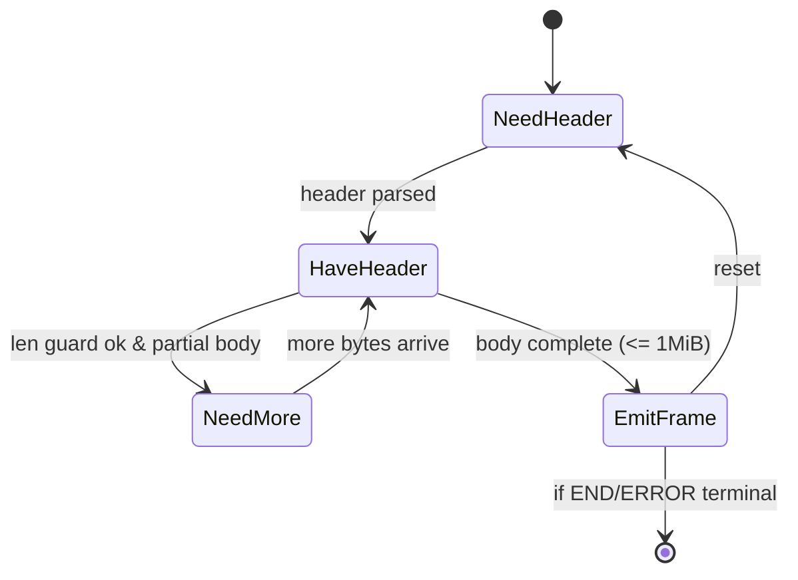
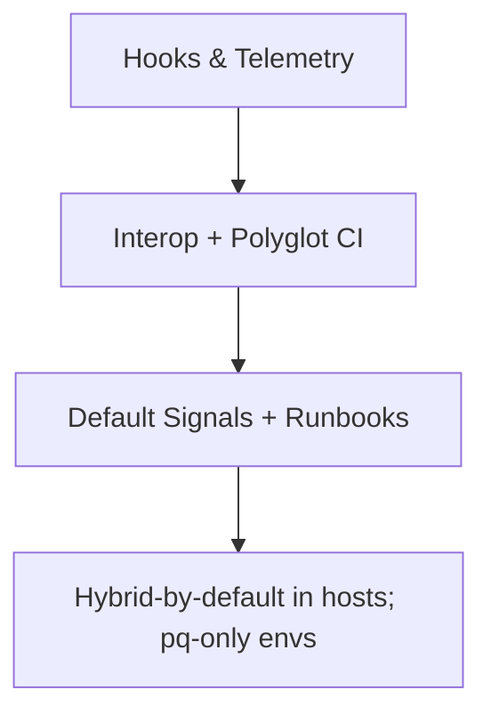

# Combined Markdown

_Source directory_: `crates/oap/docs`  
_Files combined_: 12  
_Recursive_: 0

---

### Table of Contents

- API.MD
- CONCURRENCY.MD
- CONFIG.MD
- GOVERNANCE.MD
- IDB.md
- INTEROP.MD
- OBSERVABILITY.MD
- PERFORMANCE.MD
- QUANTUM.MD
- RUNBOOK.MD
- SECURITY.MD
- TESTS.MD

---

## API.MD
_File 1 of 12_

---

title: API Surface & SemVer Reference — oap
status: draft
msrv: 1.80.0
last-updated: 2025-10-06
audience: contributors, auditors, API consumers
-----------------------------------------------

# API.md — `oap`

## 0. Purpose

This document captures the **public API surface** of the `oap` crate:

* Snapshot of exported functions, types, traits, modules.
* SemVer discipline: what changes break vs. extend.
* Alignment with `CHANGELOG.md` (behavioral vs. surface changes).
* CI-enforceable via `cargo public-api` (or similar).
* Acts as the **spec** for external consumers embedding the OAP/1 framer.

`oap` is a **pure protocol library** (no sockets/TLS/auth). Its public API focuses on:

* Envelope/Frame types
* Parser/Writer (encode/decode) primitives
* Config & error taxonomy
* Optional metrics trait hooks

---

## 1. Public API Surface

**How we generated this snapshot**

```bash
cargo public-api --simplified --deny-changes -p oap
```

> Note: Items marked `#[non_exhaustive]` are intentionally open for additive evolution.

### 1.1 Current Surface (snapshot)

```text
# Crate root re-exports
pub mod envelope
pub mod frame
pub mod parser
pub mod writer
pub mod error
pub mod metrics
pub mod consts
pub mod seq
pub mod prelude

# Prelude (for convenience imports)
pub mod prelude {
    pub use crate::envelope::{EnvelopeKind, Envelope};
    pub use crate::frame::{Frame, FrameHeader, MAX_FRAME_BYTES};
    pub use crate::parser::{Parser, ParserConfig, Progress};
    pub use crate::writer::{Writer, WriterConfig};
    pub use crate::error::{OapError, OapConfigError, Result};
    pub use crate::seq::{Seq, SeqRolloverPolicy};
    pub use crate::consts::VERSION;
    pub use crate::metrics::OapMetricsExt;
}

# Envelope module
pub mod envelope {
    #[non_exhaustive]
    pub enum EnvelopeKind { HELLO, START, DATA, ACK, END, ERROR }

    #[non_exhaustive]
    pub enum Envelope {
        Hello { version: u32, max_frame: u64, pq_hybrid: bool },
        Start { stream: String },
        Data  { obj: Option<String>, seq: u64, len: u32 }, // body is carried in Frame
        Ack   { up_to: u64 },
        End   { seq: u64, status: u16 },
        Error { code: u16, reason: String },
    }
}

# Frame module
pub mod frame {
    pub const MAX_FRAME_BYTES: usize; // = 1_048_576 (1 MiB)
    pub struct FrameHeader {
        pub kind: crate::envelope::EnvelopeKind,
        pub len: u32,
    }
    pub struct Frame<'a> {
        pub header: FrameHeader,
        pub body: &'a [u8], // zero-copy slice into caller buffer
    }
    pub fn encode_frame<B: AsRef<[u8]>>(env: &crate::envelope::Envelope, body: B) -> crate::error::Result<Vec<u8>>;
    pub fn decode_frame<'a>(st: &mut crate::parser::ParserState, buf: &'a [u8]) -> crate::parser::Progress<'a>;
}

# Parser module
pub mod parser {
    pub struct ParserConfig {
        pub strict_headers: bool,
        pub enforce_obj_header_on_objects: bool,
        pub ack_window_frames: u32,
        pub allow_pq_hello_flags: bool,
        pub seq_rollover_policy: crate::seq::SeqRolloverPolicy,
    }
    pub struct ParserState { /* opaque */ }
    pub struct Parser { /* opaque */ }

    #[non_exhaustive]
    pub enum Progress<'a> {
        NeedMore,
        Frame { frame: crate::frame::Frame<'a>, rest: &'a [u8] },
    }

    impl Parser {
        pub fn new(cfg: ParserConfig) -> crate::error::Result<Self>;
        pub fn with_metrics(cfg: ParserConfig, metrics: impl crate::metrics::OapMetricsExt) -> crate::error::Result<Self>;
        pub fn state(&self) -> &ParserState;
        pub fn feed<'a>(&mut self, buf: &'a [u8]) -> crate::error::Result<Progress<'a>>;
        pub fn reset(&mut self);
    }
}

# Writer module
pub mod writer {
    pub struct WriterConfig { /* reserved for future */ }
    pub struct Writer { /* opaque */ }

    impl Writer {
        pub fn new(cfg: WriterConfig) -> Self;
        pub fn encode<B: AsRef<[u8]>>(&self, env: &crate::envelope::Envelope, body: B) -> crate::error::Result<Vec<u8>>;
    }
}

# Error module
pub mod error {
    #[non_exhaustive]
    pub enum OapError {
        FrameOversize,
        UnknownEnvelope,
        HeaderMalformed,
        CreditViolation,
        Truncated,
        ObjRequiredMissing,
        BadHello,
        Io(std::io::Error),
        // future non-breaking expansions allowed
    }
    pub type Result<T> = core::result::Result<T, OapError>;

    #[non_exhaustive]
    pub enum OapConfigError {
        InvalidAckWindow(u32),
    }
}

# Metrics module (lib-facing trait; host provides impl)
pub mod metrics {
    pub trait OapMetricsExt: Clone + Send + Sync + 'static {
        fn inc_frame(&self, kind: &'static str);
        fn inc_reject(&self, reason: &'static str);
        fn add_frame_bytes(&self, n: u64);
        fn set_inflight(&self, v: i64);
        fn set_ack_window(&self, v: i64);
        fn time_decode<F, R>(&self, f: F) -> R where F: FnOnce() -> R;
        fn time_encode<F, R>(&self, f: F) -> R where F: FnOnce() -> R;
    }
}

# Seq / credit algebra
pub mod seq {
    pub struct Seq(pub u64);
    #[non_exhaustive]
    pub enum SeqRolloverPolicy { Error, Wrap }
}

# Consts
pub mod consts {
    pub const VERSION: u32; // OAP/1 protocol version (semantic integer)
}
```

> **Services:** N/A — `oap` exposes **no** CLI/HTTP/gRPC endpoints.

---

## 2. SemVer Discipline

### Additive (Minor / Non-Breaking)

* Adding new helper functions, methods, modules **without** changing existing signatures.
* Adding new `OapError` variants **only** because it is `#[non_exhaustive]`.
* Adding new fields to `Envelope` variants **only** if the enum remains `#[non_exhaustive]` and defaulting behavior is specified.
* Providing new impls (e.g., `From<std::io::Error> for OapError`) that don’t conflict.

### Breaking (Major)

* Renaming or removing any exported type, function, trait, or module.
* Changing function/impl signatures (parameter/return types) or generics.
* Making previously `#[non_exhaustive]` enums **exhaustive**.
* Changing protocol **invariants** surfaced in API (e.g., changing `MAX_FRAME_BYTES` for OAP/1).

### Patch-Level

* Doc-only fixes/comments.
* Internal perf/memory improvements that keep signatures and behavior equivalent.
* Extending fuzz/property test matrices with no user-facing changes.

---

## 3. Stability Guarantees

* **MSRV:** `1.80.0`.
* **No `unsafe`** in public-facing code paths (any justified `unsafe` gated and documented).
* Parser/Writer APIs are **cancel-safe**; partial inputs never corrupt internal state.
* No leaking of non-portable internal types (e.g., no `tokio::net::TcpStream`) in public signatures.

---

## 4. Invariants (API-aligned)

* `frame::MAX_FRAME_BYTES == 1_048_576` (**1 MiB**) for all of OAP/1.
  This value is **not** a configuration knob and any change is **major**.
* Envelope set locked to OAP/1 grammar; enums are `#[non_exhaustive]` to allow **forward-compatible flags** (e.g., PQ markers in `HELLO`) without breaking.
* `error::OapError` and `error::OapConfigError` are `#[non_exhaustive]` to allow additive hardening outcomes.

---

## 5. Tooling

* **cargo public-api** — detects and prints public surface diffs.
* **cargo semver-checks** — validates SemVer compatibility against previous release.
* **cargo doc** — rendered API docs; examples must compile (`doc(test)`).
* **Snapshots** stored in: `/docs/api-history/oap/<version>.txt`.

---

## 6. CI & Gates

* PR pipeline runs:

  * `cargo public-api --simplified -p oap` (fail on unexpected diffs).
  * `cargo semver-checks check-release -p oap` (advisory gate; fail on breaking).
  * `cargo doc -p oap -Zrustdoc-map` (docs must build cleanly).
* Bot posts a comment with added/removed symbols; PR must include a matching `CHANGELOG.md` entry for any surface change.

**Sample GitHub Actions step**

```yaml
- name: Public API diff
  run: cargo install cargo-public-api && cargo public-api --simplified -p oap
```

---

## 7. Acceptance Checklist (DoD)

* [ ] Current API snapshot generated & saved under `/docs/api-history/oap/`.
* [ ] `cargo public-api` gate green (or intentional diff acknowledged).
* [ ] `cargo semver-checks` reviewed (no unintentional breakage).
* [ ] `CHANGELOG.md` updated for any surface or behavior change.
* [ ] All public items documented (`#![deny(missing_docs)]` satisfied).
* [ ] Fuzz/property tests updated if envelope/codec behavior extended.

---

## 8. Appendix

### References

* Rust SemVer: [https://doc.rust-lang.org/cargo/reference/semver.html](https://doc.rust-lang.org/cargo/reference/semver.html)
* cargo-public-api: [https://github.com/Enselic/cargo-public-api](https://github.com/Enselic/cargo-public-api)
* cargo-semver-checks: [https://github.com/obi1kenobi/cargo-semver-checks](https://github.com/obi1kenobi/cargo-semver-checks)

### Perfection Gates tie-in

* **Gate G:** No undocumented API surface.
* **Gate H:** Breaking changes require **major** bump.
* **Gate J:** CHANGELOG alignment enforced with CI evidence.

### History (notable shifts)

* `1.0.0`: Initial OAP/1 surface — `Parser`, `Writer`, `Envelope`, `Frame`, `OapError`, `ParserConfig`, `WriterConfig`, metrics trait.
* (append future entries here…)

---

✅ With this API.md, `oap`’s external contract is **explicit, testable, and CI-enforced**, keeping the framer stable while allowing careful additive evolution.


---

## CONCURRENCY.MD
_File 2 of 12_

---

title: Concurrency Model — oap
crate: oap
owner: Stevan White
last-reviewed: 2025-10-06
status: draft
template_version: 1.1
msrv: 1.80.0
tokio: "1.x (pinned at workspace root)"
loom: "0.7+ (dev-only)"
lite_mode: "For small library crates: fill §§1,3,4,5,10,11 and mark others N/A"
-------------------------------------------------------------------------------

# Concurrency Model — `oap`

This document makes the concurrency rules **explicit** for the `oap` crate: tasks, channels, locks, shutdown, timeouts, and validation (property/loom/TLA+). It complements `docs/SECURITY.md`, `docs/CONFIG.md`, the crate’s `README.md`, and the OAP/1 IDB.

> **Golden rule:** never hold a lock across `.await` in supervisory or hot paths.

---

## 0) Lite Mode (for tiny lib crates)

`oap` is a **pure library** (protocol grammar + enc/dec) with **no background tasks** and **no sockets**.
Per template guidance, we fully specify **§1, §3, §4, §5, §10, §11** and mark runtime/service-oriented sections **N/A**.

---

## 1) Invariants (MUST)

* **[I-1] No runtime ownership:** `oap` owns **no Tokio runtime** and **spawns no tasks**. All async I/O, sockets, and task orchestration are **host** responsibilities.
* **[I-2] Zero blocking in hot paths:** Parsing/encoding are CPU-bounded and **non-blocking**; no syscalls, no filesystem, no sleep/jitter in `oap`.
* **[I-3] Lock discipline:** Any internal mutability (e.g., small parser state) is **thread-confined** or uses **short-lived** guards; **no lock is ever held across `.await`**.
* **[I-4] Boundedness by construction:** Public APIs expose **pull-based** decoding (caller provides bounded buffers/frames). `oap` never grows unbounded queues/buffers.
* **[I-5] Cancel-safety:** All async functions are **cancel-safe**: on cancel, internal state remains valid and memory-safe (no double-advances of cursors).
* **[I-6] Deterministic framing:** Lengths are validated **before** allocation/copy; split reads are supported; oversize frames (>= 1 MiB) **fail early** with typed errors.
* **[I-7] Reentrancy & Send/Sync:** Stateless encoders/decoders are `Send` where appropriate; types that are not thread-safe are **explicitly** not `Sync` and documented.
* **[I-8] Backpressure neutrality:** `oap` does **not** implement credit timers or sleeping. ACK window semantics are purely **algebraic**; timing/backpressure is enforced by hosts.

---

## 2) Runtime Topology

**N/A (library-only).** Any “listener/worker” topology, supervision, or backoff lives in embedding services (e.g., `svc-gateway`, `svc-overlay`).

---

## 3) Channels & Backpressure

**N/A inside `oap`.** The crate does **not** create channels.

**Guidance for hosts using `oap`:**

* Use **bounded** `mpsc` for frame work queues; prefer `try_send` and return `Busy` rather than buffering.
* For event taps, prefer **bounded** `broadcast` with lag counters; never rely on unbounded broadcasts.
* Surface **queue depth** and **drop counters** as metrics at the host layer.

---

## 4) Locks & Shared State

**Allowed within `oap`:**

* **Thread-local parser state** (e.g., cursor, partial-header scratch) with **no locks**.
* **Short-lived** `&mut self` borrows to advance state machines; no cross-async borrow.

**Forbidden:**

* Holding any `Mutex`/`RwLock` guard across `.await` (library APIs avoid this by design).
* Nested locks or global singletons.

**Pattern:**

* Prefer **immutable** structs with explicit “builder” or “cursor” types that mutate local state and return new positions/slices.
* If a `Mutex` is required for shared counters in tests, acquire → compute → **drop guard** → then `.await`.

---

## 5) Timeouts, Retries, Deadlines

**N/A inside `oap`.** The crate performs **no timing** and **no retries**.

**Host guidance (normative for embeddings):**

* Apply **explicit timeouts** on read/write at transport layer (`ron-transport`).
* Keep **ACK window** bounded; reject on overflow rather than waiting in `oap`.
* Retries only for **idempotent** ops and **outside** of `oap`.

---

## 6) Cancellation & Shutdown

**N/A inside `oap`.** No tasks to drain. All `oap` functions must be cancel-safe; callers can drop `Future`s without leaving the parser in an invalid state.

---

## 7) I/O & Framing

**Applicable (library contracts):**

* **Split reads:** decoders accept partial buffers and return “need more” without copying when possible.
* **Pre-validate lengths:** refuse frames whose declared length exceeds **1 MiB** (protocol cap) **before** allocation/advance.
* **Order and idempotence:** `ACK{up_to}` handling is pure math; no timers or sleeps. `END/ERROR` terminate the logical stream deterministically.
* **No hashing in `oap`:** integrity checks (BLAKE3) occur at materialization boundaries (storage/overlay), not inside the framer.

---

## 8) Error Taxonomy (Concurrency-Relevant)

| Error                | When                                        | Retry? | Concurrency Note                      |
| -------------------- | ------------------------------------------- | ------ | ------------------------------------- |
| `FrameOversize`      | Declared length ≥ 1 MiB                     | no     | Fail-fast; caller may drop connection |
| `UnknownEnvelope`    | Tag not in {HELLO,START,DATA,END,ACK,ERROR} | no     | Protocol error; caller should reject  |
| `HeaderMalformed`    | Missing/dupe/invalid header                 | no     | Do not attempt partial recovery       |
| `CreditViolation`    | ACK advances beyond last seq                | no     | Host should log+reject, not wait      |
| `Truncated`          | Buffer ends mid-frame                       | maybe  | Caller may feed more bytes            |
| `ObjRequiredMissing` | DATA bytes represent object w/o `obj`       | no     | Caller must enforce before use        |

---

## 9) Metrics (Concurrency Health)

**N/A within `oap`** (no metrics endpoints).
**Host should emit:**

* `oap_frames_total{kind}`
* `oap_rejects_total{reason}`
* `oap_read_frame_seconds` / `oap_write_frame_seconds` (histograms)
* Queue/backpressure metrics at transport/ingress

---

## 10) Validation Strategy

**Unit / Property**

* **Framer algebra:** associativity/identity for `ACK{up_to}` windows; `END/ERROR` terminal behavior is absorbing.
* **Split-read property:** feeding bytes in **N slices** equals feeding the same bytes once (no state drift).
* **Length bound:** any path that would allocate uses an upfront guard `len <= 1 MiB`.

**Loom (dev-only)**

* Model **single-producer/single-consumer** access to a shared decode cursor behind a `Mutex` **used only in tests**; assert no deadlocks and no guard held across async boundaries.
* Model **atomic** seq/ack math where host accesses are concurrent; ensure monotonicity properties.

**Fuzz**

* Header/value corpus: duplicate headers, bad UTF-8, enormous lengths, overlapping sequences, `ACK` replays.
* Frame corpus: truncated, zero-length DATA, maximal valid (exactly 1 MiB), off-by-one edges.

**Chaos (host-level)**

* Inject truncated frames under sustained load; assert **rejects** rather than stalls.
* Randomly interleave `ACK` and `DATA`; verify algebraic invariants hold.

**(Optional) TLA+ sketch**

* States: `{Hello, Started, Streaming(seq), Ended}`.
* Safety: never accept DATA before START; never accept DATA after END; no `ack_up_to` < last ack.
* Liveness: if bytes arrive and are valid, the parser advances; no livelock without host queues.

---

## 11) Code Patterns (Copy-Paste)

**A. Split-read, zero-copy-ish decode (no locks, cancel-safe)**

```rust
/// Feed a chunk; either we decoded a complete frame or we need more bytes.
/// No locks; cancel-safe; no allocation beyond bounded scratch.
pub fn feed<'a>(st: &mut ParserState, mut buf: &'a [u8]) -> Result<Progress<'a>, OapError> {
    // 1) Need header?
    if !st.have_header {
        if buf.len() < HEADER_MIN {
            return Ok(Progress::NeedMore);
        }
        let (hdr, rest) = parse_header(buf)?;
        st.set_header(hdr)?;
        buf = rest;
    }

    // 2) Enforce frame cap before any copy/alloc
    let need = st.body_len();
    if need as usize > MAX_FRAME_BYTES { // 1_048_576
        return Err(OapError::FrameOversize);
    }

    // 3) Enough body?
    if buf.len() < need {
        return Ok(Progress::NeedMore);
    }

    // 4) Produce a zero-copy slice for DATA (caller decides copy or stream)
    let (body, rest) = buf.split_at(need);
    let frame = st.finish_with_body(body)?;
    st.reset_for_next();
    Ok(Progress::Frame { frame, rest })
}
```

**B. “No lock across `.await`” handoff (host-side pattern using `oap`)**

```rust
// Acquire state, compute next action, drop guard, then await I/O.
let action = {
    let s = state.lock();           // short critical section
    s.plan_next_action()            // pure computation
};                                  // guard dropped here
match action {
    Action::ReadFrame => {
        let bytes = transport.read_chunk().await?; // host I/O
        parser.feed(&bytes)?;                      // pure compute
    }
    Action::WriteAck { up_to } => transport.write_ack(up_to).await?,
}
```

**C. Cancel-safe select (host-side)**

```rust
tokio::select! {
    biased;

    _ = shutdown.changed() => { /* stop intake; drain host queues */ }
    res = transport.read_next() => {
        let buf = res?;
        match parser.feed(&buf)? {
            Progress::NeedMore => {}
            Progress::Frame { frame, rest } => handle_frame(frame, rest)?,
        }
    }
}
```

---

## 12) Configuration Hooks (Quick Reference)

**Inside `oap`:**

* `strict_headers` (bool) — fail unknown/dup headers.
* `enforce_obj_header_on_objects` (bool).
* `ack_window_frames` (u32) — algebraic, not time-based.

**In host (not `oap`):**

* Transport timeouts, channel capacities, drain deadlines, retry budgets.

See `docs/CONFIG.md` for exact schema and defaults.

---

## 13) Known Trade-offs / Nonstrict Areas

* **Zero-copy vs simplicity:** We favor passing slices out of the parser for DATA to avoid copies; hosts may choose to copy into pool buffers for lifetime simplicity.
* **Strict header mode:** In interop labs you may disable strictness; this widens surface area—**never** disable in production.
* **Seq rollover policy:** Default is `error` to preserve monotonicity; `wrap` is available for special transports but risks ambiguity.

---

## 14) Mermaid Diagrams

**14.1 Parser State Machine (library-level, no tasks)**



**Text:** Parser alternates between `NeedHeader` and `HaveHeader`. It emits a frame only when complete and under the 1 MiB cap; otherwise it requests more bytes. END/ERROR are terminal for the logical stream.

---

## 15) CI & Lints (Enforcement)

* Enable `-D warnings` and `-W clippy::await_holding_lock` (should be moot, but guards regressions).
* Add **fuzz** jobs for header/body parsing and envelope tags.
* Run **loom** tests behind `--cfg loom` for concurrency sketches used in tests.
* Property tests for **split-read equivalence** and **length-bound enforcement**.

---

## 16) Schema Generation (Optional)

Not applicable—no channels/locks to inventory within `oap`.
(Hosts may auto-generate their own concurrency docs for queues they build around `oap`.)

---

## 17) Review & Maintenance

* Re-review on any change to: header grammar, length validation, or `ack_window_frames` semantics.
* Keep `owner`, `msrv`, `last-reviewed` current.
* PRs touching parser/encoder must update: **tests (unit/property/fuzz)** and this document’s **§1, §7, §10, §11** as needed.

---


---

## CONFIG.MD
_File 3 of 12_

---

title: Configuration — oap
crate: oap
owner: Stevan White
last-reviewed: 2025-10-06
status: draft
template_version: 1.0
---------------------

# Configuration — `oap`

This document defines **all configuration** for the `oap` crate, including sources,
precedence, schema (types/defaults), validation, feature flags, live-reload behavior,
and security implications. It complements `README.md`, `docs/SECURITY.md`, and the OAP/1 IDB.

> **Tiering:**
>
> * **Library crate (this crate):** OAP is a **pure protocol library** (framing & envelopes). It has **no ports, sockets, TLS, auth, or metrics endpoints** of its own. Most service-level options are **N/A** here and live in embedding services (e.g., `svc-gateway`, `svc-overlay`).
> * **Service crates:** bind addresses, timeouts, and observability endpoints are configured **in those services**, not in `oap`.

---

## 1) Sources & Precedence (Authoritative)

`oap` itself does not parse process flags or read files. It accepts configuration **as constructor parameters** from the host (service or SDK). If a host wishes to map CLI/env/file into `oap`, the **effective precedence** must be:

1. **Process flags** (CLI) — host-owned
2. **Environment variables** — host-owned
3. **Config file** (TOML/JSON) — host-owned
4. **Built-in defaults** (hard-coded in host, plus OAP constants)

> **Important:** OAP/1 **normative constants** (e.g., `max_frame = 1 MiB`) are **not configurable** anywhere. Hosts must not expose toggles that change protocol invariants.

**Supported file formats (if host uses a file):** TOML (preferred), JSON (optional).
**Path resolution for `--config` (if relative):** host-defined.

**Amnesia mode (micronode):** hosts **SHOULD** avoid disk-based config by default and prefer env/flags; if a file is used, mount it **read-only** and **do not persist secrets**.

---

## 2) Quickstart Examples

### 2.1 Minimal embed (service perspective)

```rust
use oap::{ParserConfig, WriterConfig, OapFramer};

let pcfg = ParserConfig::default();   // strict headers on; constants baked-in
let wcfg = WriterConfig::default();   // credit window defaults; uses host I/O chunk size

let mut framer = OapFramer::new(pcfg, wcfg);
// host wires framer to its transport (ron-transport) and DTOs (ron-proto)
```

### 2.2 Host-side config file (TOML) mapped into OAP (illustrative)

```toml
# service Config.toml — host will map some values into OAP configs
[overlay.io]
stream_chunk_bytes = "64KiB"  # I/O hint; NOT the OAP frame cap

[oap]
strict_headers = true
ack_window_frames = 32
allow_pq_hello_flags = true
```

### 2.3 Host CLI flags (override file/env) — N/A to oap directly

Hosts may expose flags like `--oap-strict-headers=true`; `oap` just receives the final booleans/ints.

---

## 3) Schema (Typed, With Defaults)

> **Scope note:** Only **library-level knobs** that affect framing/validation belong here.
> **Not here:** sockets, TLS, timeouts, body caps, metrics endpoints — those are **service** concerns.

| Key (host → oap)                       | Type                 | Default  | Description                                                                                                                                                         | Security Notes                        |
| -------------------------------------- | -------------------- | -------- | ------------------------------------------------------------------------------------------------------------------------------------------------------------------- | ------------------------------------- |
| `oap.strict_headers`                   | bool                 | `true`   | Reject unknown/duplicate/malformed header fields                                                                                                                    | Fail-early reduces attack surface     |
| `oap.ack_window_frames`                | u32                  | `32`     | Target in-flight window (frames) for `ACK{up_to}` credit accounting. **Align with host’s ledger/rewarder batch sizes where applicable** to avoid settlement stalls. | Backpressure tuning; bounded inflight |
| `oap.allow_pq_hello_flags`             | bool                 | `true`   | Accept opaque PQ capability bits in `HELLO`; OAP/1 semantics unchanged                                                                                              | Interop toggle; never alters flow     |
| `oap.enforce_obj_header_on_objects`    | bool                 | `true`   | Require `obj:"b3:<hex>"` when DATA bytes are a content-addressed object                                                                                             | Integrity boundary clarity            |
| `oap.seq_rollover_policy`              | enum(`error`,`wrap`) | `error`  | Behavior if `seq` would overflow host’s 64-bit counter                                                                                                              | Prefer `error` to avoid ambiguity     |
| `overlay.io.stream_chunk_bytes` (host) | size (hint)          | `64 KiB` | Host I/O **hint** only; OAP frame cap remains **1 MiB** (non-configurable)                                                                                          | Misuse must not bypass cap            |

**Normative constants (baked into OAP/1, not configurable):**

* `max_frame_bytes = 1_048_576` (**1 MiB**)
* Envelope set: `HELLO, START, DATA, END, ACK, ERROR`

---

## 4) Validation Rules (Fail-Closed)

Applied by `oap` at construction/use, and by hosts before passing values:

* `ack_window_frames >= 1 && ack_window_frames <= 1024` (reject outside range).
* `strict_headers == true` in production profiles (hosts may relax only in tests).
* If `enforce_obj_header_on_objects = false`, host **must** enforce integrity at materialization boundaries (storage/overlay); otherwise reject.
* `allow_pq_hello_flags` only admits **opaque flags**; it must not change framing/state machines. If flags attempt to alter OAP state machines, treat as a **configuration error** and fail fast.
* `stream_chunk_bytes` is a **host I/O hint**; changing it **must not** impact OAP’s frame parsing or limits.

**On violation:** return structured `OapConfigError` (libs). Service hosts should fail fast (non-zero exit).

---

## 5) Dynamic Reload (If Supported by Host)

`oap` does **not** watch files or handle signals. If the host supports reload:

* **Trigger:** SIGHUP or bus `ConfigUpdated { version }` (host feature).
* **Reload semantics in OAP:**

  * Safe to update: `ack_window_frames`, `strict_headers` (tightening is safe; loosening allowed in non-prod).
  * No-op in OAP: transport timeouts, bind addresses, TLS keys (host-owned).
  * **Never** change OAP/1 invariants at runtime (e.g., frame cap).
* **Atomicity:** Host creates a new `ParserConfig`/`WriterConfig`, swaps under a lock **without** holding `.await`.

---

## 6) CLI Flags (Canonical)

**N/A for `oap` directly.** Hosts **may** expose flags and map them into OAP configs. Suggested flag names if a host wants parity:

```
--oap-strict-headers=<bool>
--oap-ack-window-frames=<u32>
--oap-allow-pq-hello-flags=<bool>
--oap-enforce-obj-header=<bool>
--overlay-stream-chunk-bytes=<size>   # host I/O hint; not the OAP cap
```

---

## 7) Feature Flags (Cargo)

| Feature       | Default | Effect                                                                 |
| ------------- | :-----: | ---------------------------------------------------------------------- |
| `pq`          |   off   | Enables parsing/forwarding of opaque PQ capability bits in `HELLO`     |
| `serde`       |    on   | Enables serde for configs/DTOs where applicable (host interop)         |
| `std`         |    on   | Uses `std`; `no_std` (future) may restrict alloc-heavy paths           |
| `dev-vectors` |   off   | Includes extra conformance/fuzz vectors for tests (not for production) |

> No `cli` feature here; CLI parsing belongs to hosts. TLS/transport features live in `ron-transport`.

---

## 8) Security Implications

* **Fail-early posture:** `strict_headers=true` curbs malicious/ambiguous envelopes (recommended for prod).
* **Integrity boundary:** `enforce_obj_header_on_objects=true` ensures DATA carrying objects is explicitly bound to `b3:<hex>`. Verification remains at materialization sites (storage/overlay).
* **Backpressure:** Reasonable `ack_window_frames` prevents unbounded memory/latency; hosts must align with their connection limits.
* **PQ flags:** Accepting opaque PQ bits must **not** change parsing/flow. All changes to cryptography occur below OAP (transport). PQ capability flags are non-sensitive but **MUST NOT** be propagated to unauthenticated logs or untrusted headers; treat them as opaque toggles for lower layers.
* **Non-configurable cap:** The **1 MiB** frame cap is protocol law; hosts cannot override it.

See `docs/SECURITY.md` and IDB §Invariants/Anti-Scope.

---

## 9) Compatibility & Migration

* Additive changes: introduce new knobs with safe defaults and `#[serde(default)]`.
* Renames: provide de/serialization aliases at host boundary for ≥1 minor release.
* Breaking changes to OAP configuration semantics require **major version** and explicit migration notes.
* Protocol constants (frame cap, envelopes) are **frozen** for OAP/1.

---

## 10) Reference Implementation (Rust)

> **Illustrative** config shapes passed **into** `oap`. Hosts may wrap/derive these from their own config systems.

```rust
use serde::{Deserialize, Serialize};

#[derive(Debug, Clone, Serialize, Deserialize)]
pub struct ParserConfig {
    #[serde(default = "default_true")]
    pub strict_headers: bool,
    #[serde(default = "default_enforce_obj_header")]
    pub enforce_obj_header_on_objects: bool,
    #[serde(default = "default_ack_window")]
    pub ack_window_frames: u32,
    #[serde(default = "default_allow_pq")]
    pub allow_pq_hello_flags: bool,
    #[serde(default = "default_seq_rollover")]
    pub seq_rollover_policy: SeqRolloverPolicy,
}

#[derive(Debug, Clone, Copy, Serialize, Deserialize)]
#[serde(rename_all = "lowercase")]
pub enum SeqRolloverPolicy { Error, Wrap }

#[derive(Debug, Clone, Serialize, Deserialize, Default)]
pub struct WriterConfig {
    // Writer-side knobs if any arise later; kept minimal for OAP/1
}

const MAX_FRAME_BYTES: usize = 1_048_576; // 1 MiB, normative cap (not configurable)

impl Default for ParserConfig {
    fn default() -> Self {
        Self {
            strict_headers: true,
            enforce_obj_header_on_objects: true,
            ack_window_frames: 32,
            allow_pq_hello_flags: true,
            seq_rollover_policy: SeqRolloverPolicy::Error,
        }
    }
}

fn default_true() -> bool { true }
fn default_enforce_obj_header() -> bool { true }
fn default_ack_window() -> u32 { 32 }
fn default_allow_pq() -> bool { true }
fn default_seq_rollover() -> SeqRolloverPolicy { SeqRolloverPolicy::Error }

impl ParserConfig {
    pub fn validate(&self) -> Result<(), OapConfigError> {
        if !(1..=1024).contains(&self.ack_window_frames) {
            return Err(OapConfigError::InvalidAckWindow(self.ack_window_frames));
        }
        // OAP/1 invariants (e.g., MAX_FRAME_BYTES) are constants and not user-configurable.
        Ok(())
    }
}

#[derive(thiserror::Error, Debug)]
pub enum OapConfigError {
    #[error("ack_window_frames out of range: {0}")]
    InvalidAckWindow(u32),
}
```

---

## 11) Test Matrix

| Scenario                                 | Expected Outcome                                        |
| ---------------------------------------- | ------------------------------------------------------- |
| `ack_window_frames = 0`                  | `OapConfigError::InvalidAckWindow`                      |
| Unknown header encountered (strict=true) | Frame reject; `oap_rejects_total{reason="unknown_hdr"}` |
| DATA without `obj` when object expected  | Frame reject; `oap_rejects_total{reason="missing_obj"}` |
| PQ flags in HELLO (allowed=true)         | Accepted (opaque); normal flow                          |
| PQ flags in HELLO (allowed=false)        | Reject with `bad_hello`                                 |
| PQ flags alter state machine (shouldn’t) | **Configuration error at init**; no runtime change      |
| Host changes chunk hint at runtime       | No protocol change; I/O behavior shifts only in host    |

---

## 12) Mermaid — Config Resolution Flow (Host + OAP)

```mermaid
flowchart TB
  subgraph Host (e.g., svc-gateway / svc-overlay)
    A[Defaults] --> D[Merge]
    B[Config File] --> D
    C[Env Vars] --> D
    E[CLI Flags] --> D
    D --> V{Validate Host}
  end
  V -- ok --> P[Build ParserConfig/WriterConfig]
  P --> O[OAP Framer]
  V -- fail --> X[Exit / Error]
  O --> R[Runtime]
  F[[OAP/1 Constants\nmax_frame=1MiB, envelopes fixed]]:::consts
  F -. non-configurable .- O
  classDef consts fill:#f1f5f9,stroke:#94a3b8,color:#0f172a
```

---

## 13) Operational Notes

* Treat `oap` as **pure lib**: configure transports, TLS, timeouts, and observability **in your service**, then pass only the small set of OAP knobs shown here.
* Keep production defaults **strict**; relax only in tests/interop labs.
* Document your host’s I/O chunk size separately; never conflate it with the **1 MiB** frame cap.
* Prefer env/flags in micronode (amnesia) profiles; if files are used, mount **read-only** and keep secrets out.
* Include this file in PRs that modify OAP constructor parameters or validation.


---

## GOVERNANCE.MD
_File 4 of 12_


---

# 🏛 GOVERNANCE.md — `oap`

---

title: Governance & Protocol Integrity
status: draft
msrv: 1.80.0
last-updated: 2025-10-06
audience: contributors, ops, auditors, SDK/host implementers
crate-type: policy|protocol
---------------------------

## 0. Purpose

This document defines the **rules of engagement** for the `oap` crate’s **protocol surface** and reference library:

* Transparent and auditable decision-making for protocol changes.
* Enforcement of **protocol invariants** (frame caps, envelope grammar, reject taxonomy, metrics names).
* Clear **authority boundaries** (who proposes/approves/releases), and **appeal paths** for interop disputes.
* SLA-backed commitments to **test vectors, conformance suites, and SemVer discipline**.

Ties into:

* **Omnigate / Interop Blueprints** (wire invariants; DTO semantics).
* **Hardening Blueprint** (bounded authority; signed releases; amnesia-safe).
* **Perfection Gates A–O** (esp. Gate F: perf regressions barred; Gate I: invariants bounded; Gate M: appeal paths).

---

## 1. Invariants (MUST)

Non-negotiable protocol rules (OAP/1):

* **[I-P1] Max frame size = 1 MiB (1,048,576 bytes).** Refuse oversize at **header stage**, no speculative allocation.
* **[I-P2] Envelope set is closed for OAP/1:** `HELLO | START | DATA | ACK | END | ERROR`.
* **[I-P3] Deterministic rejects:** malformed/hostile inputs map only to canonical reasons:
  `frame_oversize | header_malformed | unknown_envelope | credit_violation | missing_obj | truncated`.
* **[I-P4] Zero-copy hot path:** payloads are treated as `&[u8]`/`Bytes`—no hashing/compression/crypto in the framer.
* **[I-P5] Metrics & labels are **canonical & low-cardinality**:**
  `oap_frames_total{kind}`, `oap_rejects_total{reason}`, `oap_read_frame_seconds`, `oap_ack_window`, `oap_inflight_frames`.
* **[I-P6] PQ/HELLO feature bits are **opaque** at OAP/1:** forwarding allowed by host policy, no state-machine change in `oap`.
* **[I-P7] Strict headers in production:** undefined/duplicate headers are rejects unless explicitly enabled for interop labs.
* **[I-P8] Library scope:** no sockets, no TLS, no storage—**pure protocol**. Any drift is out-of-scope and rejected in review.

> Changing any MUST in `I-P1..I-P7` requires a **Protocol Major** (see §4, §8).

---

## 2. Roles & Authority

### Roles

* **Protocol Owner (PO):** maintains invariants; final arbiter of wire semantics.
* **Interop Steward (IS):** runs conformance, test-vector registry, and SDK alignment.
* **Release Manager (RM):** signs/ships versions; enforces SemVer & gates.
* **Security Response (SR):** handles vuln reports; coordinates hotfix vectors.
* **Auditor (external):** read-only access; verifies invariants & process adherence.
* **SDK Leads (polyglot):** Rust/Go/TS/etc. bindings stewards; ensure parity with test vectors.

### Authority Boundaries

* PO/IS **define & test** protocol; RM **releases**; SR **patches** vulns under emergency policy.
* SDK Leads **cannot** change wire rules; they consume vectors & raise PIPs (Protocol Improvement Proposals).
* Any change that affects the wire or invariants must pass **PIP quorum** and **Conformance Green** (§4).

---

## 3. Rules & SLAs

**Conformance & Vectors**

* **Vector SLA:** publish/reference **canonical vectors** and reasoned rejects with each release. Available within **24h** of tag.
* **Conformance SLA:** SDKs and hosts must pass **100%** of OAP/1 conformance for the released tag (CI badge required).
* **Metrics SLA:** names & label sets are **stable**; additions are allowed (non-breaking), renames/removals are **major**.

**Security & Disclosures**

* **Vuln triage:** acknowledge within **24h**, initial analysis **72h**, patched library + vector **<=7 days** unless embargoed.
* **Opaque PQ bits:** policy misconfig is a **host** concern; `oap` must not leak raw DATA or bitmasks in logs.

**Perf & Stability**

* **Perf regression gate:** decode p95 ↑>10% vs last green baseline blocks release (Gate F).
* **Reject ratio guard:** cannot loosen strictness defaults without major + migration guide.

---

## 4. Governance Process

**Change Types**

* **PIP-Minor:** doc clarifications, new metrics (additive), new test vectors (no wire change).
* **PIP-Compat:** additive non-wire behavior (e.g., new canonical reject subtype with stable reason value).
* **PIP-Major:** wire semantics change (envelope set, frame cap, header grammar), metrics rename/removal, reject taxonomy change.

**Lifecycle**

1. **Draft PIP** (template in `docs/pip/XXX.md`) with: summary, motivation, risk, interop impact, test plan, vectors.
2. **Review**: PO+IS+SDK Leads; public comments **≥7 days** (except security embargo).
3. **Conformance Green**: CI proves **100%** pass on updated suite across Rust/Go/TS SDKs.
4. **Quorum**: **3-of-5** (PO, IS, RM, +2 SDK Leads) for Minor/Compat; **4-of-5** for Major.
5. **Release**: RM signs tag; vectors published; CHANGELOG + migration guide attached.
6. **Post-release audit**: Auditor signs off within **14 days**.

**Emergency powers (security)**

* SR may ship a **hotfix** with temporary vector coverage; must be ratified by PO+RM within **72h** and fully PIPed within **14 days**.

**Deprecation**

* Marked in docs & conformance; provide shim period **≥1 minor**; hard removal only on next **major**.

---

## 5. Audit & Observability

* **Audit trail:** all PIPs, votes, and release signatures stored append-only; release artifacts are **detached-sig** verified.
* **Conformance dashboards:** pass/fail by crate/SDK/host; reject-reason distribution heatmap for interop labs.
* **Metrics of governance:**

  * `oap_governance_pips_total{status}`
  * `oap_vectors_published_total`
  * `oap_conformance_runs_total{result}`
* **Red-team drills:** simulate rogue proposal (e.g., raising frame cap); ensure quorum prevents merge; verify signed artifacts.

---

## 6. Config & Custody

* **Config Registry:** defaults for strict headers, reason taxonomy, and metrics names are **documented & versioned**; hosts can loosen strictness **only** in interop labs.
* **Key Custody:** release signing keys in **ron-kms/HSM**; no raw keys in repo or env; rotation **90 days** or on compromise.
* **Vector Custody:** canonical vectors & corpora stored in a signed bucket; CI fetch is integrity-checked.

---

## 7. Appeal Path

When a consumer disputes behavior (e.g., believes a valid frame was rejected):

1. **Open an Interop Dispute** (issue type `interop` with pcap/bytes + version + vector).
2. **Triage by IS**: reproduce using conformance harness; classify **protocol bug** vs **host misconfig**.
3. **If protocol bug:** create PIP; ship vector; fast-track release if security-relevant.
4. **If host misconfig:** provide remediation; record outcome.
5. **Escalation:** if unresolved in **7 days**, PO calls a quorum vote; Auditor reviews & publishes summary.

No silent rollbacks—**all** outcomes are logged and vectors updated.

---

## 8. Versioning & Compatibility

* **SemVer for `oap`:**

  * **Major**: any wire-affecting change (I-P1..I-P7), metric rename/removal, or reject taxonomy change.
  * **Minor**: additive metrics, new canonical vectors, additive non-exhaustive enums (reasons), docs.
  * **Patch**: bugfixes, perf improvements, non-wire-visible strictness clarifications.

* **Compatibility Window:**

  * Conformance + vectors retained for **last 2 minors** and **current major**.
  * Deprecations announced **≥1 minor** before removal.

* **Release Artifacts:**

  * Tag + signed checksums, vectors (`tests/vectors/*.bin|json`), conformance report, migration notes.

---

## 9. Acceptance Checklist (DoD)

* [ ] Invariants (I-P1..I-P8) codified in tests & docs.
* [ ] Roles & authority boundaries documented; contacts listed.
* [ ] PIP process active; quorum rules automated (bot labels).
* [ ] Conformance suite green across Rust/Go/TS SDKs for this tag.
* [ ] Metrics/observability contracts stable; dashboards live.
* [ ] Release signed; vectors published within 24h.
* [ ] Appeal path tested in a quarterly drill (Gate M).
* [ ] Security: keys in KMS/HSM; rotation schedule logged.

---

## 10. Appendix

**Blueprints**

* Interop / Omnigate (wire invariants & DTO semantics)
* Hardening (bounded authority; release hygiene)
* Perfection Gates F, I, M (perf, invariants, appeals)

**References**

* Conformance harness spec (`/testing/conformance/README.md`)
* Canonical vectors (`/tests/vectors/`)
* PIP template (`/docs/pip/PIP-TEMPLATE.md`)
* Release process (`/docs/releasing.md`)
* SDK parity matrix (`/docs/interop/sdk-parity.md`)

**History**

* Maintain a table of protocol disputes, decisions, and rationale (with links to vectors and PIPs).

---

### Why this works for `oap`

* It **replaces economic “no doubles”** with protocol **“no drift”**: fixed frame cap, closed envelope set, deterministic rejects, stable metrics.
* It gives you **process teeth**: PIPs, quorum, signed releases, and a 24h vector SLA.
* It’s **polyglot-friendly**: SDK leads participate, but can’t change the wire; they must pass conformance before release.
* It is **audit-ready** and **ops-ready**: every change is testable, signed, and observable.


---

## IDB.md
_File 5 of 12_

---

title: OAP/1 — Overlay Access Protocol (IDB)
version: 1.0.0
status: reviewed
last-updated: 2025-10-06
audience: contributors, ops, auditors
crate: oap
crate-type: protocol/lib
pillars: P7 (App BFF & SDK), P10 (Overlay/Transport/Discovery)
concerns: SEC, RES, PERF, DX, ECON, GOV
msrv: 1.80.0
------------

# OAP/1 — Invariant-Driven Blueprinting (IDB)

## 1) Invariants (MUST)

* **[I-1] Protocol of record:** OAP/1 is the canonical framed protocol with envelopes
  `HELLO, START, DATA, END, ACK, ERROR`. A **hard cap `max_frame = 1 MiB`** applies to any single frame.
* **[I-2] Stream chunking:** Streaming I/O uses **64 KiB chunks**; chunk size is an I/O knob and **must not be conflated** with the 1 MiB frame cap.
* **[I-3] Content addressing:** When `DATA` bytes represent a content-addressed object, the header **MUST** include `obj:"b3:<hex>"` (BLAKE3-256). Objects are verified where they are materialized (e.g., storage/overlay), **not** inside OAP framing.
* **[I-4] Neutral layering:** OAP owns only framing and envelope grammar. **No sockets, TLS, auth, or DTO schemas** live here (transport in `ron-transport`, DTOs in `ron-proto`, auth/ledger elsewhere).
* **[I-5] Error taxonomy is normative:** Implementations must emit structured, enumerable errors (e.g., `bad_hello`, `frame_oversize`, `unknown_envelope`, `missing_obj`, `obj_mismatch`, `credit_violation`, `timeout`, `truncated`).
* **[I-6] Amnesia compatibility:** With Global Amnesia Mode ON (micronode default), OAP behavior and limits are identical; OAP itself **must not** introduce disk spills or persistence.
* **[I-7] PQ-neutral forward path:** OAP/1 must not block PQ adoption. `HELLO` can advertise PQ capability flags (e.g., `pq_hybrid=true`) without altering OAP/1 envelope semantics.
* **[I-8] Observability:** Embedding services **must** expose golden metrics and readiness. All rejects increment `oap_rejects_total{reason}`, and `/readyz` flips under sustained backpressure thresholds.

---

## 2) Design Principles (SHOULD)

* **[P-1] Be boring at the edge:** Keep envelopes tiny and explicit; push policy/semantics to services (gateway, index, storage).
* **[P-2] Fail early, tell the truth:** Validate headers and lengths before allocation; reject oversize/malformed frames with precise error codes and counters.
* **[P-3] Clean layering:** DTOs/types live in `ron-proto`; timeouts, TLS, socket options live in `ron-transport`; OAP remains grammar + flow control.
* **[P-4] One contract across profiles:** Micronode and Macronode speak the same OAP/1; topology and ops differ, not the protocol.
* **[P-5] Backpressure friendliness:** Use windowed `ACK` with bounded in-flight frames; collapse gracefully rather than queuing unbounded work.
* **[P-6] Economic neutrality:** Envelopes **SHOULD NOT** embed value/economic semantics. Proofs, settlement, and incentives live in `ron-ledger`, `svc-rewarder`, or higher-level DTOs.

---

## 3) Implementation (HOW)

> The `oap` crate is a **pure protocol library**. This section describes intended mechanics for **consumers** (e.g., `svc-gateway`, `svc-overlay`) without coupling to transport or auth.

* **[C-1] Envelope grammar (reference shape + visual):**

  ```rust
  // docs-only illustrative sketch; see specs/oap-1.md for the normative wire format
  enum Envelope {
      Hello { version: u32, max_frame: u64, pq_hybrid: bool }, // widths illustrative
      Start { stream: String },                         // topic/stream identifier
      Data  { obj: Option<String>, seq: u64, len: u32 }, // followed by len bytes
      Ack   { up_to: u64 },                             // credit window
      End   { seq: u64, status: u16 },                  // normal close
      Error { code: u16, reason: String },              // structured failure
  }
  ```

  ```mermaid
  sequenceDiagram
    participant C as Client
    participant S as Service (gateway/overlay)
    C->>S: HELLO{version,max_frame,pq?}
    S-->>C: HELLO{version,max_frame,pq?}
    C->>S: START{stream}
    loop windowed transfer
      C->>S: DATA{obj?,seq,len}+<len bytes>
      S-->>C: ACK{up_to}
    end
    C->>S: END{seq,status}
    S-->>C: ACK{up_to} (final)
    note over C,S: Any violation → ERROR{code,reason}; metrics increment & readiness may flip
  ```

* **[C-2] Limits wiring:** Enforce **1 MiB** at the frame boundary (validate header lengths before allocation). Perform I/O in **64 KiB** chunks for steady memory/latency.

* **[C-3] Address binding:** Require `obj` header when bytes represent an object; compute/verify BLAKE3 only at the component that materializes bytes (e.g., storage GET/PUT).

* **[C-4] Transport budgets:** Socket lifetimes and read/write/idle timeouts are **owned by `ron-transport`**. OAP maintains sequence numbers and credit windows but not timers.

* **[C-5] Observability shape (golden set):**
  `oap_frames_total{kind}`, `oap_rejects_total{reason}`, `oap_frame_bytes`,
  `oap_inflight_frames`, `oap_ack_window`,
  `oap_read_frame_seconds` (Histogram), `oap_write_frame_seconds` (Histogram).
  All rejects increment `oap_rejects_total{reason}`; sustained reject/backpressure flips `/readyz`.
  *Optional, non-normative ECON/GOV hook:* implementations **may** add an opt-in `economic="true|false"` label when frames are processed within a ledger/rewarder context; this label must not affect protocol semantics.

* **[C-6] Error mapping:** Errors map 1:1 to an enumerable set for interop and metrics. Unknown envelopes and length mismatches are **protocol errors** (not transport errors).

* **[C-7] PQ hooks:** `HELLO` may carry opaque capability flags (e.g., `pq_hybrid=true`) which are forwarded to transport/crypto layers. OAP/1 message flow is unchanged by PQ presence.
  *Note:* `pq_hybrid` is an **example** flag; treat all HELLO PQ flags as opaque feature bits forwarded downstream.

---

## 4) Acceptance Gates (PROOF)

* **[G-1] Conformance vectors (must pass):**
  Happy-path `HELLO→START→(DATA×N)→END` with/without `obj`; oversize frame → `frame_oversize`; missing `obj` when required → `missing_obj`; `unknown_envelope` and `truncated` cases; windowed `ACK` correctness.
* **[G-2] Fuzz + property tests:** Frame parser and header codec fuzzing (corpus includes truncated frames, huge declared lengths, duplicate/unknown headers).
* **[G-3] Perf & backpressure:** Under ramped load, p95 read/write frame latency remains stable within agreed SLOs; `/readyz` flips **before** collapse when in-flight exceeds bounds.
* **[G-4] CI lint walls:**

  * Assert presence of `max_frame = 1 MiB` and `64 KiB` in spec and code comments.
  * Forbid lock-across-await in any OAP server embedding code.
  * Deny arbitrary sleeps in protocol paths.
* **[G-5] Profile parity matrix:** Same vectors pass on Micronode and Macronode; amnesia matrix confirms **no OAP-attributable disk writes** on Micronode.
* **[G-6] PQ smoke (expanded):** `HELLO` negotiation with `pq_hybrid=true` succeeds; DATA/ACK semantics remain byte-identical; include a canonical vector with PQ flag set.
* **[G-7] Polyglot round-trip:** Rust ↔ TypeScript ↔ Python codecs produce **byte-identical** frames for canonical vectors (CI matrix job).
* **[G-8] Red-team hardening vectors:**
  Compression-bomb ratio ≤ **10×**, malformed length fields, duplicate `seq`, replayed `END`, and `ACK` credit abuse—all must reject deterministically and increment `oap_rejects_total{reason}`.

---

## 5) Anti-Scope (Forbidden)

* **[F-1] No kernel creep:** No supervision, bus, health, or config logic in OAP.
* **[F-2] No DHT/overlay semantics:** Discovery, sessions, and gossip live in overlay/DHT layers, not in envelopes.
* **[F-3] No hashing of frames:** Content verification is for storage/overlay; OAP frames themselves are not hashed.
* **[F-4] No ambient authority:** Auth/capabilities are enforced by gateway/registry/passport—not by OAP.
* **[F-5] No divergence of constants:** The 1 MiB frame cap is protocol-fixed; streaming chunk is 64 KiB by default for I/O tuning but must not redefine the cap.
* **[F-6] No app facets baked in:** No Feed/Graph/Search/Media semantics in envelopes; those belong to higher-level services and DTOs.

---

## 6) References

**Core**

* **FULL_PROJECT_BLUEPRINT.MD** — Data-plane and protocol seams; readiness/health conventions.
* **MICROKERNEL_BLUEPRINT.MD** — Layering rules and kernel boundaries.
* **INTEROP_BLUEPRINT.MD** — Normative constants, vectors, and DTO hygiene (`deny_unknown_fields`).
* **SCALING_BLUEPRINT.MD** — Backpressure, boundedness, and collapse-graceful patterns.

**Supporting**

* **HARDENING_BLUEPRINT.MD** — Fuzz/property/soak patterns; red-team vectors and compression-ratio limits.
* **12_PILLARS.MD** — Pillars P7/P10 responsibilities and facet boundaries.
* **SIX_CONCERNS.MD** — SEC/RES/PERF/DX (plus ECON/GOV pointers to ledger/rewarder).
* **APP_INTEGRATION_BLUEPRINT.MD** — Gateway embedding, metrics surface, and readiness semantics.

---

### Reviewer Checklist (paste into PR)

* [ ] Envelopes & constants match canon (HELLO/START/DATA/END/ACK/ERROR; **1 MiB** frame cap; **64 KiB** streaming chunks).
* [ ] `DATA` uses `obj:"b3:<hex>"` when bytes represent an object; verification occurs at materialization boundaries.
* [ ] DTOs isolated in `ron-proto`; sockets/TLS/timeouts in `ron-transport`; OAP code remains transport/auth neutral.
* [ ] Golden metrics exposed; all rejects increment `oap_rejects_total{reason}`; `/readyz` flips under sustained backpressure.
* [ ] Fuzz/property/perf suites present; red-team vectors implemented; profile parity & amnesia matrix green.
* [ ] PQ smoke vector (`pq_hybrid=true`) passes; polyglot round-trip (Rust/TS/Python) yields byte-identical frames.


---

## INTEROP.MD
_File 6 of 12_

---

title: INTEROP — oap
status: draft
msrv: 1.80.0
last-updated: 2025-10-06
audience: developers, auditors, external SDK authors
----------------------------------------------------

# 🔗 INTEROP.md — `oap`

## 0) Purpose

Define the **interop surface** for the OAP/1 framed protocol as implemented by the `oap` crate:

* Wire protocol & envelope grammar (HELLO/START/DATA/ACK/END/ERROR).
* Header fields & constraints (what is normative vs. host-defined).
* DTO boundaries (what lives in `ron-proto`, not here).
* Canonical interop **test vectors** and error taxonomy.
* Expectations for **polyglot SDKs** (Rust/TS/Python) and service embeddings.

> `oap` is **framing + validation only**. Sockets/TLS/auth/DTOs live outside this crate. This file keeps different languages and services in lock-step.

---

## 1) Protocols & Endpoints

### 1.1 Ingress Protocols (this crate)

* **OAP/1 framed** over an arbitrary transport (typically TCP/TLS via `ron-transport`).
* `oap` itself exposes **no HTTP/gRPC endpoints**. Those belong to embedding services (e.g., `svc-gateway`, `svc-overlay`).

### 1.2 Envelope Grammar (normative)

* **HELLO** `{ version: u32, max_frame: u64, pq_hybrid: bool }`
* **START** `{ stream: String }`
* **DATA** `{ obj: Option<String>, seq: u64, len: u32 }` + `<len bytes>`
* **ACK** `{ up_to: u64 }`
* **END** `{ seq: u64, status: u16 }`
* **ERROR** `{ code: u16, reason: String }`

### 1.3 Transport Invariants (normative)

* **Frame cap** `MAX_FRAME_BYTES = 1_048_576` (1 MiB).
* **Streaming chunk size** = **64 KiB** is a **host I/O knob** (does **not** change the 1 MiB frame cap).
* **TLS** is **host-owned** (tokio-rustls), not part of `oap`.

### 1.4 Version & Feature Negotiation

* OAP **version** carried in `HELLO.version`. For OAP/1, `version == 1`.
* **Feature bits** (e.g., `pq_hybrid`) in `HELLO` are **opaque** capability flags. Unknown flags **must not** alter parsing/semantics.

> Interop rule: peers MUST agree on version; feature bits are purely advisory for lower layers (e.g., transport/crypto).

---

## 2) DTOs / Schemas

### 2.1 What’s **not** here

* Application DTOs (manifests, tickets, ledger proofs) are **not defined** by `oap`. They live in `ron-proto` (strictly versioned schemas).

### 2.2 Header conventions (normative to `oap`)

* **`obj` header (DATA):** when the DATA bytes represent a content-addressed object, include `obj: "b3:<hex>"` (BLAKE3-256).

  * `oap` **requires** the header presence (when applicable) but does **not** hash; verification occurs at materialization points (storage/overlay).
* Duplicate/unknown headers are **rejected** when `strict_headers=true` (default).

### 2.3 Correlation identifiers

* Correlation, tenant, tracing IDs are **host fields** (HTTP headers, bus metadata). `oap` does not carry tracing fields in its envelope.

---

## 3) Bus Topics

`oap` publishes no bus events. For **hosts** embedding `oap`, recommended topics:

### 3.1 Events Published (host examples)

* `gateway.oap.reject` → `{ reason, peer, corr_id }`
* `gateway.oap.frame` → `{ kind, bytes, seq, ack_up_to }` (sampled)
* `overlay.object.stored` → (storage-layer DTO; outside `oap`)

### 3.2 Events Subscribed (host examples)

* `config.updated` → rebuild `ParserConfig`/`WriterConfig` and swap.
* `bus.shutdown` → drain/abort according to host policy.

---

## 4) Canonical Test Vectors (polyglot)

> These vectors are **language-agnostic** and stored under `/tests/vectors/oap1/`.
> All SDKs (Rust/TS/Python) must round-trip these **byte-identically** and/or **struct-identically** as noted.

### 4.1 HELLO ↔ HELLO (negotiate)

**Input (struct):**

```json
{ "HELLO": { "version": 1, "max_frame": 1048576, "pq_hybrid": false } }
```

**Expected:** encode→decode yields the same struct. Peers that answer with `version != 1` → `BadHello`.

### 4.2 START → DATA → ACK → END (happy path)

1. `START { "stream": "objects/v1" }`
2. `DATA  { "obj": "b3:<hex-OBJECT>", "seq": 1, "len": 3 } + "abc"`
3. `ACK   { "up_to": 1 }`
4. `END   { "seq": 1, "status": 0 }`
   **Expected:**

* Parser emits `Frame(DATA)` with body bytes `0x61 0x62 0x63`.
* Sequence algebra: `ACK.up_to` must be **≥** last delivered `seq`.

### 4.3 Oversize frame (reject)

**Input:** `DATA { len: 1_048_577 } + <garbage>`
**Expected error:** `FrameOversize` (reject without allocation).
**Metric label:** `oap_rejects_total{reason="frame_oversize"}`.

### 4.4 Missing `obj` when object bytes present (reject)

**Input:** `DATA { obj: null, seq: 7, len: 1024 } + <looks_like_object>`
**Expected error:** `ObjRequiredMissing`.
**Metric label:** `oap_rejects_total{reason="missing_obj"}`.

### 4.5 Unknown envelope tag (reject)

**Input:** `TAG=0x99 ...`
**Expected error:** `UnknownEnvelope`.
**Metric label:** `oap_rejects_total{reason="unknown_envelope"}`.

### 4.6 Truncated frame (need more)

**Input:** header indicates `len=8192`, only `4096` bytes provided.
**Expected:** `Progress::NeedMore` (no partial allocation, no state corruption). Feeding the remaining bytes must produce **the same** frame as if sent in one buffer.

### 4.7 ACK credit violation (reject)

**Input sequence:** deliver `DATA(seq=10)` then receive `ACK(up_to=9)`.
**Expected error:** `CreditViolation`.
**Note:** algebraic check only; hosts still own backpressure timing.

> Each vector includes a Rust `serde_json` representation and a canonical **hex** fixture for cross-language tests. TS/Python SDKs must pass the same fixtures.

---

## 5) Error Taxonomy (wire-facing)

| Code / Variant       | Condition (normative)                                      | Retry? | Metric reason label |
| -------------------- | ---------------------------------------------------------- | ------ | ------------------- |
| `BadHello`           | Unknown/unsupported version, malformed HELLO               | no     | `bad_hello`         |
| `FrameOversize`      | `len > 1 MiB`                                              | no     | `frame_oversize`    |
| `UnknownEnvelope`    | Tag not in {HELLO, START, DATA, ACK, END, ERROR}           | no     | `unknown_envelope`  |
| `HeaderMalformed`    | Missing/duplicate/invalid header fields                    | no     | `header_malformed`  |
| `ObjRequiredMissing` | DATA bytes represent object but `obj` header absent        | no     | `missing_obj`       |
| `CreditViolation`    | `ACK.up_to` < last delivered seq or otherwise inconsistent | no     | `credit_violation`  |
| `Truncated`          | Buffer ended mid-frame                                     | maybe  | `truncated`         |

> The **metric labels are canonical** across languages and hosts.

---

## 6) Interop Guarantees

* **Version Lock (OAP/1):** `MAX_FRAME_BYTES = 1 MiB`; envelope set is fixed; enums **non_exhaustive** for additive growth.
* **Polyglot Parity:** Rust/TS/Python codecs **must** round-trip canonical vectors; CI runs a **matrix** job to enforce this.
* **Strictness by Default:** `strict_headers=true` rejects unknown/duplicate headers in production builds. Interop labs may loosen to diagnose.
* **Unknown Feature Bits:** `HELLO` feature flags are **opaque**. Unknown bits are preserved/ignored without changing OAP/1 behavior.
* **No Kernel Drift:** `oap` never emits/consumes kernel/bus messages directly; hosts map outcomes to their bus.

**Backward compatibility rules**

* **Additive only** between minor versions (new error variants, new optional fields in `#[non_exhaustive]` enums).
* Any change that alters **length rules**, **envelope tags**, or **semantics** is **major**.

**Auditability**

* Vectors live in `/tests/vectors/oap1/` and are embedded in docs via golden tests.
* A failure in any language binding blocks release.

---

## 7) References

* **OAP/1 IDB** — invariants, acceptance gates, anti-scope.
* **CONFIG.md** — host vs. library knobs; strict headers; ack window hints.
* **CONCURRENCY.md** — split-read guarantees; cancel-safety; backpressure neutrality.
* **OBSERVABILITY.md** — canonical metric names/labels and readiness inputs.
* **Interop Blueprint (GMI-1.6)** — project-wide interop rules and DTO location (`ron-proto`).
* **HARDENING Blueprint** — fuzz/property corpus disciplines.

---

## 8) Appendix — Wire Notes (non-normative encoding guidance)

`oap` does not fix a specific on-the-wire integer endianness here; the canonical fixtures (hex) and parser define it precisely for SDK authors. Implementations **must** pass the provided fixtures byte-for-byte. When in doubt, **trust the fixtures** over prose.

---

✅ With this INTEROP.md, every embedding and SDK can implement OAP/1 **once** and prove correctness via shared vectors, preventing drift across languages and services.


---

## OBSERVABILITY.MD
_File 7 of 12_

---

# 📈 OBSERVABILITY — `oap`

*Audience: developers, operators, auditors*
*msrv: 1.80.0 (Tokio/loom compatible)*
*crate type: protocol/lib (no sockets, no HTTP endpoints)*

> `oap` is a **pure protocol library**: it has **no `/metrics`, `/healthz`, `/readyz` endpoints** of its own and emits **no logs** directly.
> Observability is exposed via **library hooks** (metrics traits/handles) that hosts (e.g., `svc-gateway`, `svc-overlay`) wire into their exporters.

---

## 0) Purpose

Define **what is observable** in `oap`, **how to surface it from hosts**, and **how to use it** for:

* Metrics (Prometheus/OTel via host exporters)
* Health & readiness semantics (host-owned; `oap` provides readiness inputs)
* Logs (host JSON schema aligned with `oap` error taxonomy)
* Tracing spans & correlation (via `tracing` in host with `oap` span fields)
* Alerts & SLOs tailored to OAP/1 framing paths

---

## 1) Metrics (Prometheus-style)

### 1.0 Registration Discipline (lib/host contract)

* `oap` defines a **Metrics facade** (cloneable handle) with **no global registry usage**.
* Hosts **create and register** Prometheus/OTel instruments **once** and pass a handle into `oap`.
* CI guard in hosts: grep to prevent **duplicate registration**; unit test that handle is shared.

### 1.1 Golden Metrics (host-level, always present)

> These are emitted by services embedding `oap` (gateway/overlay/etc.). They’re standard across RustyOnions.

* `http_requests_total{route,method,status}` (Counter)
* `request_latency_seconds{route,method}` (Histogram)
* `inflight_requests{route}` (Gauge)
* `bus_lagged_total` (Counter)
* `service_restarts_total` (Counter)
* `rejected_total{reason}` (Counter)

### 1.2 OAP-Specific (library-signature; host-exported)

> Names are **canonical** for all `oap` embeddings.

* `oap_frames_total{kind="HELLO|START|DATA|ACK|END|ERROR"}` (Counter)
  Count of frames successfully parsed or emitted.
* `oap_rejects_total{reason="frame_oversize|unknown_envelope|header_malformed|credit_violation|missing_obj|truncated"}` (Counter)
  Deterministic parser/validator rejects.
* `oap_frame_bytes` (Counter)
  Total payload bytes processed by the framer.
* `oap_inflight_frames` (Gauge)
  Algebraic inflight (seq window) managed by the host using `ACK{up_to}` results.
* `oap_ack_window` (Gauge)
  Current advertised ACK credit window (frames).
* `oap_read_frame_seconds` / `oap_write_frame_seconds` (Histogram)
  Latency measured **by host** around `oap::decode/encode`.
* (Optional ECON/GOV tag) `economic="true|false"` label **only if** the host processes frames within ledger/rewarder context. This tag is **non-normative** and must not alter behavior.

### 1.3 Recommended Buckets / Cardinality Rules

* Histograms: `request_latency_seconds` and `oap_read_frame_seconds` should share buckets (e.g., `[0.005, 0.01, 0.025, 0.05, 0.1, 0.25, 0.5, 1]`).
* Avoid high-cardinality labels on `oap_rejects_total`; **only** use the enumerated `reason` values above.

### 1.4 Minimal Rust Wiring (host side)

```rust
/// Host-owned metrics handle passed into oap.
#[derive(Clone)]
pub struct OapMetrics {
    pub frames_total: prometheus::CounterVec,
    pub rejects_total: prometheus::CounterVec,
    pub frame_bytes: prometheus::Counter,
    pub inflight_frames: prometheus::Gauge,
    pub ack_window: prometheus::Gauge,
    pub read_frame_sec: prometheus::Histogram,
    pub write_frame_sec: prometheus::Histogram,
}

// In host bootstrap:
let frames_total = prometheus::register_counter_vec!(
    "oap_frames_total", "Count of OAP frames", &["kind"]
)?;
let rejects_total = prometheus::register_counter_vec!(
    "oap_rejects_total", "Count of OAP rejects", &["reason"]
)?;
// ... (others similar) ...
let oap_metrics = OapMetrics { frames_total, rejects_total, /* ... */ };

// Pass to oap:
let parser = oap::Parser::with_metrics(oap_metrics.clone());
```

---

## 2) Health & Readiness

> `oap` does **not** own endpoints; hosts expose `/healthz` and `/readyz`. `oap` supplies **readiness inputs** and **never blocks** liveness.

### 2.1 Endpoints (host)

* `/healthz` — **liveness**: process up. `oap` has no bearing; always `200` if process alive.
* `/readyz` — **readiness**: host flips **only** when all keys satisfied (see below).

### 2.2 OAP-Related Readiness Keys (host)

* `oap_parser_ready=true` — parser constructed with valid config.
* `oap_reject_rate_ok=true` — rolling 1–5 min reject **rate < 1%** of total frames.
* `oap_ack_window_ok=true` — advertised window within configured bounds (not zero for >N seconds under load).
* `oap_backpressure_ok=true` — inflight frame gauge below threshold.

> If any are false → `/readyz` returns `503` with JSON:
> `{ "degraded": true, "missing": ["oap_reject_rate_ok"], "retry_after": 5 }`

### 2.3 Failure Semantics (host)

* **Fail-open reads / fail-closed writes** elsewhere still apply; for `oap`, **reject early** on parse errors and surface metrics.
* When sustained `oap_rejects_total` increases rapidly, **flip readiness** before queues collapse.

---

## 3) Logs

> `oap` itself doesn’t log. Hosts must map `oap` outcomes to structured JSON logs.

### 3.1 JSON Schema (host)

Required fields for events around `oap` parse/encode:

* `ts` (ISO8601), `level` (`INFO|WARN|ERROR`)
* `service` (e.g., `svc-gateway`)
* `event` (`oap_frame`, `oap_reject`)
* `reason` (must be one of the canonical `oap_rejects_total{reason}` values)
* `frame_kind` (`HELLO|START|DATA|ACK|END|ERROR`)
* `corr_id` (UUID/ULID), `peer_addr`, `tenant` (if multi-tenant)
* `latency_ms` (for read/write around decode/encode)
* **Never include raw DATA** or secrets; **do not log PQ flags** bitmasks.

Example (reject):

```json
{"ts":"2025-10-06T15:01:02Z","level":"WARN","service":"svc-gateway",
 "event":"oap_reject","reason":"frame_oversize","corr_id":"01JB2...","peer_addr":"1.2.3.4:5555"}
```

---

## 4) Tracing & Correlation

* Use `tracing` with JSON formatting at host. `oap` exposes span fields to record `frame_kind`, `seq`, `ack_up_to`.
* **Span names:**

  * `svc.gateway.oap.decode_frame`
  * `svc.gateway.oap.encode_frame`
* **Fields:** `frame_kind`, `seq`, `len`, `obj_present` (bool), `ack_up_to`.
* **Correlation IDs:** injected on ingress (e.g., HTTP `X-Corr-ID`), propagated in spans and logs.
* **OpenTelemetry:** optional exporter behind a host feature; spans should be short-lived (per frame), children of request-level span.

---

## 5) Alerts & SLOs (for services embedding `oap`)

### 5.1 SLOs (per region unless noted)

* **OAP decode p95** < **20 ms** (in-process framing).
* **OAP reject rate** < **0.5%** of frames, excluding benign `Truncated` that are followed by successful completion within 100ms.
* **ACK window starvation** time at zero < **5 s** over any 5 min window.
* **No frame oversize** events (they indicate hostile or broken peers).

### 5.2 Example Prometheus Alerts (host)

```promql
# High reject rate
(sum(rate(oap_rejects_total[5m])) / clamp_min(sum(rate(oap_frames_total[5m])), 1)) > 0.005
```

* **Warn:** for 5m
* **Crit:** for 15m

```promql
# Decode latency regression
histogram_quantile(0.95, sum(rate(oap_read_frame_seconds_bucket[5m])) by (le)) > 0.02
```

```promql
# ACK starvation
avg_over_time(oap_ack_window[5m]) == 0 and sum(rate(oap_frames_total[5m])) > 0
```

```promql
# Oversize frames present (should be ~0)
increase(oap_rejects_total{reason="frame_oversize"}[15m]) > 0
```

### 5.3 Runbooks (link from alerts)

* **Reject Rate High:** inspect `reason` breakouts; if `header_malformed` spikes, suspect client upgrade mismatch; if `credit_violation`, check host ACK logic. Throttle or quarantine offending peers.
* **Decode p95 High:** CPU pressure or pathological split patterns; look for GC/allocator churn; enable pooling or adjust chunk size (host I/O).
* **ACK Starvation:** verify host credit accounting; ensure worker pool isn’t starved; inspect backpressure thresholds and `/readyz` state.

---

## 6) CI / Enforcement

* **Unit tests** (in `oap`): ensure error taxonomy → metric label mapping is stable and exhaustive.
* **Golden tests** (host): sample metrics endpoint must include:

  * `oap_frames_total`, `oap_rejects_total`, `oap_frame_bytes`, `oap_inflight_frames`, `oap_ack_window`.
* **Lints:** forbid `await_holding_lock`; ensure readiness gating doesn’t use sleeps.
* **Docs freshness:** review this file **every 90 days** or when OAP/1 grammar or error reasons change.

---

## Appendix A — Minimal Metrics Facade (library API sketch)

```rust
/// Library-visible trait; host supplies a concrete Prom/OTel-backed handle.
pub trait OapMetricsExt: Clone + Send + Sync + 'static {
    fn inc_frame(&self, kind: &'static str);
    fn inc_reject(&self, reason: &'static str);
    fn add_frame_bytes(&self, n: u64);
    fn set_inflight(&self, v: i64);
    fn set_ack_window(&self, v: i64);
    fn time_decode<F, R>(&self, f: F) -> R where F: FnOnce() -> R;
    fn time_encode<F, R>(&self, f: F) -> R where F: FnOnce() -> R;
}

// Parser calls (illustrative):
metrics.time_decode(|| {
    // parse
});
metrics.inc_frame("DATA");
metrics.inc_reject("header_malformed");
```

---

## Appendix B — Readiness Adapter (host sketch)

```rust
pub struct OapReadiness {
    reject_ctr: prometheus::Counter,
    frame_ctr: prometheus::Counter,
    ack_window: prometheus::Gauge,
}
impl OapReadiness {
    pub fn ready(&self) -> bool {
        let frames = self.frame_ctr.get();
        let rejects = self.reject_ctr.get();
        let rate_ok = frames == 0.0 || (rejects / frames) < 0.005;
        let ack_ok = self.ack_window.get() > 0.0;
        rate_ok && ack_ok
    }
}
```

---

### TL;DR

* `oap` stays **silent** by itself and exposes **hooks**.
* Hosts surface **canonical OAP metrics**, wire **readiness** using those signals, and align **logs/traces** to the error/grammar canon.
* With this contract, dashboards and alerts remain consistent across every service that speaks OAP/1.


---

## PERFORMANCE.MD
_File 8 of 12_


---

# ⚡ PERFORMANCE.md — `oap`

---

title: Performance & Scaling
status: draft
msrv: 1.80.0
crate_type: lib
last-updated: 2025-10-06
audience: contributors, ops, perf testers
-----------------------------------------

## 0) Purpose

Defines the **performance profile** of `oap` (OAP/1 framer/validator), a **pure library** (no sockets/TLS/auth).
We specify measurable targets (latency/throughput/allocs), hostile-input behavior, bench rigs, scaling knobs (host-side), CI regression gates, and a triage playbook.

Ties into:

* **Scaling Blueprint** invariants (frame cap 1 MiB; 64 KiB is a host I/O knob).
* **OBSERVABILITY.md** (oap_* metrics, readiness keys, alerts).
* **CONCURRENCY.md** (single-threaded parse; scale via host worker parallelism).
* **SECURITY.md** (reject reasons; hard caps; amnesia mode).
* **GOVERNANCE.md** (SemVer notes if changing perf-relevant invariants).

---

## 1. SLOs / Targets

### 1.1 Library SLOs (decode/encode)

* **Decode p95**: < **20 ms/frame** steady-state across payload classes (≤256 B, 4 KiB, 64 KiB, 1 MiB header-reject path).
* **Encode p95**: < **10 ms/frame** (ACK/END fast-path).
* **Deterministic rejects (100%)** into canonical buckets: `frame_oversize | header_malformed | unknown_envelope | credit_violation | missing_obj | truncated`.
* **Partial-input safety**: truncated inputs must return `NeedMore` without state corruption.
* **Allocations/op**: ≤ **2** small allocs avg (header/env). Payloads are zero-copy (`&[u8]`/`Bytes`).
* **Cold start**: parser/writer init < **1 ms**.

### 1.2 Throughput (reference, 1 core)

* **Tiny frames (≤256 B)**: ≥ **250k frames/s**.
* **64 KiB frames**: ≥ **40k frames/s**.

> Numbers are engineering targets on the CI “perf” runner class; gate to ±10% drift.

### 1.3 Host-observed SLOs (services embedding `oap`)

* **oap_decode_p95_seconds** < **0.020** (intra-region steady state).
* **oap_rejects_total{reason} / oap_frames_total** < **0.5%** (excluding `truncated` that completes within 100 ms).
* **ACK window starvation** (`oap_ack_window_ok=false`) < **5 s** per 5-min window.
* **No `frame_oversize` under normal ops**; any spike triggers immediate degrade.

### 1.4 Profile variants

* **Amnesia mode (Micronode)**: no on-disk corpora; RAM-only buffers. SLOs unchanged; memory ceiling below (§3).
* **PQ-hybrid flag forwarding**: opaque in `HELLO`; **<5%** library overhead budget (should be ~0%—measured to prove).

---

## 2. Benchmarks & Harness

### 2.1 Criterion micro-benches (`/benches`)

* `decode_happy.rs` — `HELLO→START→(DATA×N)→END` with/without `obj`.
* `decode_pathological.rs` — oversize, truncated at every byte boundary, unknown envelope, credit violations.
* `encode_ack.rs` — windowed ACK sequences (algebra & perf).
* Record **ops/s**, **p50/p95**, **allocs/op** (dhat/heaptrack optional on CI), and payload sweeps (≤256 B, 4 KiB, 64 KiB).

### 2.2 Integration load (workspace `/testing/performance`)

* **gwsmoke / bombardier** driving a host (gateway/overlay) that uses `oap`. Export `oap_*` histograms/gauges.
* **ACK window stress**: keep window near zero; verify readiness flips before collapse.

### 2.3 Profiling

* `cargo flamegraph` for CPU hot paths; expect header parse / varint / small-buffer churn.
* `perf` / `coz` for causal profiling.
* Host-side: `tokio-console` to confirm stalls are I/O, not `oap` CPU.

### 2.4 Fuzz / property (CI-required)

* Corpus: truncated at every split point, huge declared lengths, duplicate/unknown headers, replayed END, credit abuse.
* Properties: length-first refusal; `NeedMore` idempotence; ACK monotonicity.

---

## 3. Scaling Knobs

> Protocol constants are fixed (1 MiB max frame). **64 KiB** is a **host I/O chunk** tuning knob, not a protocol size.

**Host-side levers**

* **Parallelism**: spawn N decode workers (bounded). `oap` is CPU-bound & thread-safe; scaling is near-linear until I/O bound.
* **Backpressure**: bounded channels; drop/503 before heap growth.
* **Buffers**: prefer `Bytes`/slices; avoid copying payloads.
* **ACK credit**: maintain a visible gauge; update promptly to prevent starvation.
* **Amnesia**: cap per-conn working-set (see §4); avoid staging buffers >64 KiB unless necessary.
* **PQ**: forwarding of HELLO feature bits is opaque; ensure no extra crypto work in the `oap` hot path.

---

## 4. Bottlenecks & Known Limits

* **Oversize defense (MUST)**: refuse `len > 1 MiB` at header stage; never pre-alloc payload buffers based on untrusted length.
* **Pathological splits (WATCH)**: extreme fragmentation increases header parse overhead; keep p95 decode <20 ms; add a small look-ahead buffer.
* **ACK algebra (HOST)**: violations reject in `oap`; starvation is a **host readiness**/credit update problem.
* **No hashing here (FORBIDDEN)**: object integrity lives where objects materialize (storage/overlay). Don’t add hashing to `oap` hot path.
* **Amnesia ceilings**: in RAM-only profiles, track working-set; alert if resident set for `oap` staging > **128 MiB** per process at target TPS.

Acceptable vs must-fix:

* Acceptable: small p95 drift under chaos (<10%) if backpressure holds.
* Must-fix: any oversize pre-alloc; unbounded inflight; reject mis-classification; starvation without readiness flip.

---

## 5. Regression Gates (CI)

Fail CI if any bench deviates from last **green baseline** on the same runner class by:

* **p95 latency** ↑ > **10%** (decode or encode).
* **Throughput** ↓ > **10%** (tiny or 64 KiB).
* **Alloc/op** ↑ > **15%**.
* **PQ variant** (HELLO with PQ flags) overhead > **5%**.

Baselines live at `testing/performance/baselines/oap/`. Updates require a PR note justifying the change (e.g., added hardening).

**Example GitHub Actions step (illustrative):**

```yaml
- name: Bench (oap)
  run: cargo bench -p oap -- --save-baseline oap-current
- name: Compare to baseline
  run: scripts/perf_compare.sh testing/performance/baselines/oap oap-current --fail-p95=10 --fail-tps=10 --fail-alloc=15
```

---

## 6. Perf Runbook (Triage)

1. **Invariant check**: confirm 1 MiB cap and that 64 KiB is treated as host chunk size only.
2. **Flamegraph**: look for header/varint hotspots; if small-buffer churn dominates, test a slightly larger look-ahead.
3. **tokio-console (host)**: if stalls, it’s likely I/O or quotas—`oap` is CPU-bound.
4. **Metrics**: inspect `oap_rejects_total{reason}` and `oap_decode_p95_seconds`.

   * `frame_oversize` spikes → hostile peer or missing cap.
   * `credit_violation` → host ACK bug.
   * `header_malformed` → version/header mismatch.
5. **Readiness**: if `oap_reject_rate_ok=false` or `oap_ack_window_ok=false`, degrade `/readyz` (brownout) before collapse.
6. **Chaos toggles**: re-run with compression/PQ features off (should not change `oap` CPU); if it does, investigate host layers.
7. **Amnesia drill**: switch amnesia=ON; verify perf parity and resident set ceiling; if improved, you have disk I/O or cache pressure elsewhere.
8. **Escalation thresholds**: page ops if any holds ≥5 min: `oap_decode_p95_seconds > 0.020`, or reject ratio ≥1%, or ack_window_ok=false time ≥30 s/5 min window.

---

## 7. Acceptance Checklist (DoD)

* [ ] SLOs baselined (decode/encode p95; throughput; alloc/op).
* [ ] Criterion benches & payload sweeps checked in.
* [ ] Fuzz/property suites cover truncated/oversize/unknown/credit/replay.
* [ ] Host perf rig exports `oap_*` histograms/gauges and readiness keys.
* [ ] CI gates wired with baseline compare + waiver process.
* [ ] PQ variant bench recorded (<5% overhead).
* [ ] Amnesia drill performed; resident-set ceiling documented.
* [ ] Runbook escalation thresholds validated once.

---

## 8. Appendix

**Protocol constants & versioning**

* Envelopes: `HELLO | START | DATA | ACK | END | ERROR`.
* `MAX_FRAME_BYTES = 1_048_576` (1 MiB) — **protocol-fixed** (changing requires a major).
* Streaming chunk **64 KiB** — **host I/O** tuning; not a protocol size.

**Reference workloads**

* Happy path with/without `obj:"b3:<hex>"`.
* Reject suite: oversize, missing_obj, unknown, truncated, credit violation.

**Perfection Gates**

* **F**: perf regressions barred via CI deltas.
* **L**: scaling validated under chaos (window pressure & fragmentation) with readiness flips before collapse.

**History**

* Track notable regressions/fixes/waivers here.

---


---

## QUANTUM.MD
_File 9 of 12_


---

title: Post-Quantum (PQ) Readiness & Quantum Proofing
status: draft
msrv: 1.80.0
last-updated: 2025-10-06
audience: contributors, security auditors, ops
crate: oap
crate-type: lib
pillar: 9 (Interop / Protocol)
owners: [Stevan White]

# QUANTUM.md — `oap`

## 0) Purpose

Describe how `oap` (OAP/1 framer/validator) stays **crypto-agnostic yet PQ-ready**. `oap` does not perform key exchange or signatures; it must:

* **Carry** PQ posture signaled by peers (HELLO posture bits).
* **Surface** posture to hosts (metrics/labels/errors) without changing the OAP state machine.
* **Refuse** malformed posture deterministically (typed errors).
* **Remain amnesia-safe** (no persistence of posture).
* Provide interop-friendly toggles, tests, and a rollout plan that won’t break classical peers.

---

## 1) Exposure Assessment (What’s at risk?)

* **Public-key usage (Shor-breakable):** none in `oap`. Happens in transports (`ron-transport`, `svc-gateway`) and auth/identity crates. `oap` only **observes** posture in `HELLO`.
* **Symmetric/Hash (Grover):** none in `oap`; payload is zero-copy slice/`Bytes`.
* **Data at rest:** none (stateless).
  **HNDL risk:** indirect only (wire capture is a host concern).
* **Session lifetime:** host-defined (typically short → lower HNDL).
* **Worst-case blast radius:** a classical-only peer negotiates non-PQ; `oap` **must expose** posture so host policy can degrade/deny. `oap` itself leaks no secrets.

---

## 2) Current Crypto Profile (Today)

* **In `oap`:** no KEX, no signatures, no AEAD, no hashes.
* **Context (hosts):** TLS 1.3 with X25519; Ed25519 for caps; AES-GCM or ChaCha20-Poly1305; BLAKE3-256 hashing elsewhere.
* **Custody:** keys in KMS/HSM at host layers; **none** in `oap`.
* **Crypto-carrying interfaces:** `HELLO` posture bits (opaque to `oap` logic except structural parsing).

---

## 3) Target PQ Posture (Where we’re going)

* **KEX (host):** Hybrid (X25519+ML-KEM). `oap` just parses/labels posture.
* **Signatures (host):** ML-DSA/SLH-DSA options for tokens/receipts.
* **HELLO posture bitfield (v1):** `mode` (off|hybrid|pq-only), `kex` (none|x25519|ml-kem|hybrid), `sig` (none|ed25519|ml-dsa|slh-dsa). Unknown values map to `unknown` label; no state change.
* **Back-compat:** default **observe** posture; hosts may **enforce** by policy when ready (hybrid → pq-only).

---

## 4) Feature Flags & Config (How to turn it on)

```toml
# Cargo features (no crypto deps added by oap)
[features]
pq = []                # HELLO posture parsing
pq-telemetry = ["pq"]  # add {pq_mode} labels on oap_* metrics
```

```ini
# Host-consumed config surfaced by oap
[oap_pq]
accept_hello_flags      = true   # parse posture when present
require_flag_presence   = false  # if true, HELLO must carry posture
policy                  = "observe"   # "observe" | "enforce" (host enforces)
allowed_posture         = "any"       # "any" | "hybrid" | "pq-only"
amnesia_clear_on_parse  = true   # zeroize temporary posture buffers immediately
```

**Behavior:** In `enforce + pq-only`, `oap` returns a **typed error** (`BadHelloPqPolicy`) and sets labels; host turns that into a refusal/close.

---

## 5) Migration Plan (Milestones)

* **M1 (Bronze) — Hooks & Telemetry**

  * Implement HELLO posture parsing + `{pq_mode}` labels.
  * Default `policy=observe`. No behavior change for peers.
  * Baseline perf: posture parsing must be 0% overhead.

* **M2 (Silver) — Interop & Polyglot**

  * Conformance matrix: classical↔classical, hybrid↔hybrid, hybrid↔classical (observe).
  * **SDK parity (polyglot):** Rust/Go/TS SDKs parse posture and expose it; CI green on all.
  * Add `BadHelloPqPolicy` mapping for enforce flows; PromQL dashboards.

* **M3 (Gold) — Defaults & Runbooks**

  * Enable `pq` and `pq-telemetry` by default; keep `observe` by default.
  * Ship runbook steps to flip to `enforce` (and rollback).
  * Expand vectors with posture cases.

* **Post-M3 — De-risk & Deprecate**

  * Gradually set transports to hybrid by default; offer `pq-only` envs for partners ready for it.

**Mermaid (high level):**



---

## 6) Invariants (MUST)

* **[PQ-I1] No crypto in `oap`** (no KEX/sign/AEAD/hash).
* **[PQ-I2] Posture parsing is side-effect-free;** OAP/1 state machine unchanged.
* **[PQ-I3] Deterministic rejects** for malformed posture; no panics.
* **[PQ-I4] In `enforce + pq-only`,** return `BadHelloPqPolicy`; host must refuse classical.
* **[PQ-I5] Metrics label bounds:** `{pq_mode}` ∈ {off,hybrid,pq-only,unknown}; no unbounded labels.
* **[PQ-I6] Conformance + fuzz include posture cases; classical parity remains green.**
* **[PQ-I7] Amnesia-safe:** no persistence of posture; zeroize temporary posture buffers immediately; no disk writes.

---

## 7) Observability (Metrics, Logs, Readiness)

* **Metrics (feature-gated):**

  * `oap_frames_total{kind,pq_mode}`
  * `oap_rejects_total{reason,pq_mode}`
  * `oap_read_frame_seconds_bucket{pq_mode}`
* **Example PromQL:**

  * Posture adoption:

    ```
    sum by(pq_mode)(rate(oap_frames_total[5m]))
    ```
  * Enforce mismatches:

    ```
    increase(oap_rejects_total{reason="BadHelloPqPolicy"}[15m]) > 0
    ```
* **Readiness:** host should brown-out listener/tenant if policy requires PQ and posture mismatches.
* **Logs:** structured; include `pq_mode` and `pq_source="hello"`. Never log raw bitmasks or DATA.

---

## 8) Testing & Verification

* **Unit/Property:** posture parser (valid/invalid/unknown); round-trip encode/decode; `BadHelloPqPolicy` mapping; idempotent `NeedMore` under partial HELLO.
* **Fuzz:** `hello_pq_fuzz` mixes random posture with truncated/oversize headers; assert no panics; canonical rejects.
* **Interop:** classical↔classical; hybrid↔hybrid; hybrid↔classical under `observe` (allow) and `enforce` (reject).
* **Perf:** verify p95 decode unchanged with posture parsing turned on (budget 0%).
* **Amnesia drill:** RAM-only run; confirm zero persistence, stable RSS, zeroize counters increment.

---

## 9) Risks & Mitigations

* **Perf regression:** keep parsing O(1), allocation-free; benchmark label overhead.
* **Ecosystem lag:** default to `observe`; alert on mismatch counts; staged `enforce`.
* **Policy downgrade:** explicit typed errors + dashboards; optional `pq_only` envs.
* **Polyglot misparse:** SDK CI conformance gates; shared vectors; appeal path via GOVERNANCE.

---

## 10) Acceptance Checklist (DoD)

* [ ] `pq`/`pq-telemetry` compile; posture parsing enabled (observe).
* [ ] HELLO posture spec versioned; canonical vectors added.
* [ ] Property + fuzz suites merged; zero panics.
* [ ] Interop matrix (Rust/Go/TS) green; `BadHelloPqPolicy` plumbed.
* [ ] Metrics with `{pq_mode}` live; alerts for policy mismatches wired.
* [ ] Runbook updated (enable/enforce/rollback).
* [ ] Perf parity (p95 decode unchanged).
* [ ] **Amnesia parity** validated (no persistence; zeroize counters present).

---

## 11) Role Presets (oap + neighbors)

* **oap (this crate):** parse/label posture; never enforce crypto; deterministic rejects; vectors + metrics labels; amnesia-safe.
* **Transports (gateway/overlay):** negotiate Hybrid KEX; enforce `pq-only`; session lifetimes; readiness brown-out; rollback path.
* **Auth/KMS:** PQ signatures + custody/rotation; include posture in token/meta when applicable.
* **SDKs (polyglot):** parse posture; surface to apps; respect host policy errors.
* **Auditor:** verify invariants, amnesia behavior, and conformance dashboards each release.

---

## 12) Appendix

* **HELLO Posture v1 (sketch)**

  * `mode`: 0=off, 1=hybrid, 2=pq-only, 255=unknown
  * `kex`: 0=none, 1=x25519, 2=ml-kem, 3=hybrid
  * `sig`: 0=none, 1=ed25519, 2=ml-dsa, 3=slh-dsa, 255=unknown
    **Rule:** unknowns → `unknown` label; do **not** fail unless `require_flag_presence=true` **and** policy is `enforce`.
* **Change Log**

  * 2025-10-06: Added posture parser/labels (observe), amnesia invariant, polyglot CI gate.

---


---

## RUNBOOK.MD
_File 10 of 12_


---

# 🛠️ RUNBOOK — `oap`

---

title: RUNBOOK — oap
owner: Stevan White
msrv: 1.80.0
last-reviewed: 2025-10-06
audience: operators, SRE, auditors
----------------------------------

## 0) Purpose

Operational manual for **oap**: how hosts wire it up, how to read oap-fed health signals, what to do under failure, and how to scale without violating invariants. Satisfies **PERFECTION_GATES** K (Continuous Vigilance) and L (Black Swan economics).
**Scope:** `oap` is a **pure protocol library** (no sockets/FS/DB); all endpoints/quotas live in **host services** (e.g., gateway/overlay).
**Polyglot note:** Non-Rust hosts (FFI/SDKs) must export the same readiness keys and metrics; watch FFI overhead in hot paths.

---

## 1) Overview

* **Name:** `oap`
* **Role:** OAP/1 **framing + validation** library; converts byte slices → typed envelopes or typed rejects.
* **Criticality Tier:** **2 (supporting)** — embedded by Tier-1 services (gateway/overlay).
* **Dependencies (lib):** `bytes` (zero-copy); optional parser combinators. **Deliberately excludes hashing/TLS** to prevent scope creep.
* **Ports Exposed:** **None** by `oap`. Metrics/health endpoints are host-owned (typical: `metrics_addr=:9909`).
* **Data Flows:** **Ingress:** host (after TLS/auth) → `oap::decode`. **Egress:** `Envelope` | `Reject(reason)` → host.
* **Version Constraints:** OAP/1 constants frozen: `MAX_FRAME_BYTES = 1 MiB`; envelopes = `HELLO|START|DATA|ACK|END|ERROR`. Changing caps is **major**.

---

## 2) Startup / Shutdown

`oap` ships as a lib; you start/stop the **host** that embeds it.

### Startup (host example)

```bash
RUST_LOG=info ./target/release/svc-gateway --config /etc/ron/gateway.toml --amnesia=on
curl -fsS http://127.0.0.1:9909/readyz
```

**Verify on startup**

* Logs: “oap parser initialized”, config validated, **oap_parser_ready=true**.
* `/readyz`: `200 OK` when all readiness inputs (including OAP keys) are healthy.

### Shutdown

* SIGINT/SIGTERM to host → drain connections → exit. `oap` holds no threads/sockets; nothing to flush.

---

## 3) Health & Readiness

`oap` provides **readiness inputs**; hosts surface them via `/readyz`.

**Keys (all must be true to serve):**

* `oap_parser_ready` — config/grammar valid.
* `oap_reject_rate_ok` — rolling reject ratio below SLO (default < **1%** / 5m).
* `oap_ack_window_ok` — advertised window not starved (not 0 for > **5s** within 5m).
* `oap_backpressure_ok` — inflight below bound; no queue growth.

**Tip:** Degrade (503) **before** collapse when keys fail; brown-out is success.

---

## 4) Common Failure Modes

| Symptom               | Likely Cause                              | Metric / Log                                                   | Resolution                                                                                                    | Alert Threshold         |
| --------------------- | ----------------------------------------- | -------------------------------------------------------------- | ------------------------------------------------------------------------------------------------------------- | ----------------------- |
| `/readyz` flapping    | High reject ratio                         | `oap_rejects_total{reason}` rising; `oap_reject_rate_ok=false` | Inspect reasons: `header_malformed` ⇒ client mismatch; `frame_oversize` ⇒ hostile peer; quarantine/rate-limit | Reject ratio >0.5% (5m) |
| Rising decode p95     | Pathological split buffers / CPU pressure | `oap_read_frame_seconds` p95 > 20ms                            | Enable buffer pooling; ensure zero-copy payload; small look-ahead                                             | p95 > 0.02s (5m)        |
| ACK starvation        | Host credit updates lag                   | `oap_ack_window==0` under load                                 | Fix ACK update path; scale workers; lower inflight caps                                                       | window=0 >5s per 5m     |
| Heap growth / OOM     | Unbounded host queues                     | Inflight/queue metrics rising                                  | Enforce bounded channels; drop early; verify 1 MiB refusal at header                                          | Any sustained rise      |
| Unexpected accepts    | Strictness disabled                       | Config shows `strict_headers=false`                            | Re-enable strict headers in prod; retest                                                                      | Any in prod             |
| PQ handshake mismatch | Disallowed HELLO flags                    | `reason="bad_hello_pq"` (host-mapped)                          | Align host policy; disable or allow flags consistently                                                        | Any spike               |

---

## 5) Diagnostics

**Metrics**

```bash
curl -s http://127.0.0.1:9909/metrics | grep -E 'oap_(frames|rejects|read_frame_seconds|ack_window|inflight)'
```

Expect:

* Counters: `oap_frames_total{kind}`, `oap_rejects_total{reason}`
* Histograms: `oap_read_frame_seconds_*`
* Gauges: `oap_ack_window`, `oap_inflight_frames`

**Logs**
Structured JSON w/ `service`, `corr_id`, `tenant`, and **redacted** OAP fields. Never log raw `DATA` or PQ bitmasks.

**Tracing & Perf**

* Use host tracing for correlation.
* Perf hotspots: run `cargo flamegraph -p <host>`; oap hotspots should be header parse/varint, not I/O.

---

## 6) Recovery Procedures

1. **Parser Config Error**
   *Symptom:* `oap_parser_ready=false` at startup.
   *Action:* Validate config; ensure `ack_window_frames ∈ [1,1024]`; restore strict defaults; restart host.

2. **High Reject Rate**
   *Symptom:* `/readyz` degrades on reject-rate.
   *Action:* Check reason distribution; rollback incompatible client build; confirm envelope grammar/versions.

3. **Frame Oversize Spike (DoS/broken peer)**
   *Symptom:* `oap_rejects_total{reason="frame_oversize"}` increases.
   *Action:* Quarantine peer; verify early header-stage refusal; tighten ingress ACLs.

4. **ACK Starvation**
   *Symptom:* `oap_ack_window==0` while traffic continues.
   *Action:* Inspect ACK propagation; increase worker parallelism; reduce inflight; ensure readiness flips.

5. **Heap/Backpressure Emergency**
   *Symptom:* Queue growth, GC churn, OOM risk.
   *Action:* Enforce bounded channels; drop on ingress before queue; confirm zero-copy payloads.

6. **Amnesia RS (RAM-only) Breach**
   *Symptom:* Resident set > **128 MiB** at target TPS in Micronode.
   *Action:* Reduce inflight; verify no temp files; shrink staging buffers; re-test with amnesia=on.

---

## 7) Backup / Restore

N/A for `oap` (no state). Hosts with state (index/storage) own their backup/restore. `oap` must remain amnesia-friendly.

---

## 8) Upgrades

* **SemVer discipline:** protocol invariants changes (e.g., 1 MiB cap) are **major**.
* Update **conformance vectors** + **fuzz corpus** with any behavior change.
* CI gates (`cargo public-api`, semver checks) must pass.
* **PQ opacity:** HELLO feature bits remain opaque; upgrading must not alter `oap` state machine.

---

## 9) Chaos Testing

**Quarterly drills (Gate J/K):**

* **Hostile frames under load:** truncated/oversize/unknown/credit abuse → **deterministic rejects**; `/readyz` browns out before collapse.
* **ACK chaos:** interleave ACK/DATA; verify monotone `ack_up_to`; no starvation >5s/5m.
* **Amnesia chaos:** run with `--amnesia=on` (RAM-only), 30-minute soak; verify resident set < **256 MiB** post-restart, no temp files, perf parity (±10%).

---

## 10) Scaling Notes

* `oap` spawns **no tasks**; scale via **host worker parallelism** (bounded).
* **Rule of thumb:** workers ≤ **2× cores**; beyond that, watch context-switches & cache misses.
* Keep payload **zero-copy**; treat **64 KiB** as a host I/O chunk (not a protocol size).
* Plan capacity so that at **~10k conns** on 4c/8GB, oap CPU stays **<20%** if workers are bounded and backpressure is enforced.

---

## 11) Security Ops

* **Never** log secrets, raw `DATA`, or PQ bitmasks.
* Keep **strict header validation** in prod; relax only in interop labs.
* **PQ HELLO flags**: if disallowed by policy, reject at init; do not alter `oap` state.
* **Micronode amnesia:** ensure hosts avoid any on-disk staging; RAM-only.

---

## 12) References

* CONFIG.md, SECURITY.md, OBSERVABILITY.md, CONCURRENCY.md, TESTS.md, INTEROP.md
* Blueprints: Hardening, Concurrency & Aliasing, Omnigate

---

## ✅ Perfection Gates Checklist

* [ ] **Gate A:** oap metrics green (`oap_frames_total`, `oap_rejects_total`, `oap_read_frame_seconds`, `oap_ack_window`).
* [ ] **Gate J:** Chaos drill passes (deterministic rejects; readiness flips before collapse).
* [ ] **Gate K:** Alerts wired (reject-rate/latency/oversize/ACK starvation/backpressure).
* [ ] **Gate N:** ARM/edge validation recorded (amnesia parity).
* [ ] **Gate O:** Security hardening: length-first refusal; strict headers; zero-copy; no hashing in hot path.
* [ ] **Gate P (PQ):** PQ HELLO flags remain opaque (no state/perf change); overhead < **5%** vs baseline.

---

### Appendix — PromQL Snippets

**High reject rate**

```promql
sum(rate(oap_rejects_total[5m])) / clamp_min(sum(rate(oap_frames_total[5m])), 1) > 0.005
```

**Decode p95 regression**

```promql
histogram_quantile(0.95, sum(rate(oap_read_frame_seconds_bucket[5m])) by (le)) > 0.02
```

**ACK starvation**

```promql
avg_over_time(oap_ack_window[5m]) == 0 and sum(rate(oap_frames_total[5m])) > 0
```

**Oversize frames present**

```promql
increase(oap_rejects_total{reason="frame_oversize"}[15m]) > 0
```

**Backpressure brown-out**

```promql
avg_over_time(oap_inflight_frames[5m]) / <inflight_capacity> > 0.8
```

**FFI overhead (polyglot hosts) — watch CPU time in readiness exporter**

```promql
rate(process_cpu_seconds_total{job="gateway",component="ffi_ready"}[5m]) > 0.1
```

---


---

## SECURITY.MD
_File 11 of 12_

---

title: Security Notes — oap
crate: oap
owner: Stevan White
last-reviewed: 2025-10-06
status: draft
-------------

# Security Documentation — `oap`

This document defines the **threat model**, **security boundaries**, and **hardening requirements** specific to `oap`.
It complements the repo-wide Hardening, Interop, and Microkernel blueprints and the OAP/1 **IDB**.

> `oap` is a **pure protocol library** (framing + envelopes). It does **not** own sockets, TLS, auth, or persistence.
> Security posture therefore focuses on **input validation**, **fail-closed parsing**, and **non-interference** with host-level controls.

---

## 1) Threat Model (STRIDE)

| Category                   | Threats (examples)                                             | Relevant in `oap`? | Mitigation / Notes                                                                                                                                                                          |
| -------------------------- | -------------------------------------------------------------- | -----------------: | ------------------------------------------------------------------------------------------------------------------------------------------------------------------------------------------- |
| **S**poofing               | Impersonated peers, fake identities                            |     **N (in lib)** | Out of scope for `oap`. Hosts enforce peer auth (TLS/macaroon/caps). `oap` treats all inputs as untrusted.                                                                                  |
| **T**ampering              | Mutated frames, header manipulation, length forgeries          |              **Y** | Strict envelope tags; `deny_unknown_fields`-style header checks; pre-allocation **length guard** (≤ 1 MiB); typed rejects (`HeaderMalformed`, `UnknownEnvelope`, `FrameOversize`).          |
| **R**epudiation            | Missing audit, unverifiable processing                         |     **N (in lib)** | Library emits no logs; hosts must log structured events (JSON) with `corr_id` when integrating `oap`.                                                                                       |
| **I**nformation Disclosure | Leaking secrets/PII, revealing PQ flags                        |            **Low** | `oap` holds **no secrets**; advise hosts **not** to log opaque PQ flags or raw DATA.                                                                                                        |
| **D**enial of Service      | Oversize frames, pathological splits, header floods, ACK abuse |              **Y** | Hard cap **1 MiB** per frame; partial-read handling; bounded parser scratch; algebraic `ACK{up_to}` checks; no unbounded buffering; early reject on anomalies; host must bound I/O and RPS. |
| **E**levation of Privilege | Bypassing capability checks via envelopes                      |     **N (in lib)** | `oap` carries no auth; hosts must enforce capability/ACL decisions **before** consuming DATA.                                                                                               |

---

## 2) Security Boundaries

* **Inbound (to `oap`):** raw **byte slices** representing OAP/1 frames provided by hosts (after transport/TLS).
* **Outbound (from `oap`):** typed **envelopes** or errors returned to the host. No network, no filesystem, no DB from `oap`.
* **Trust Zone:** `oap` executes in the host’s process space (same tenant). Treat all input as **hostile**; never assume transport integrity.
* **Assumptions:**

  * Hosts terminate TLS (tokio-rustls), authenticate peers, and authorize operations (caps/macaroons).
  * Hosts enforce `/readyz`/quotas, rate limits, and I/O timeouts at transport/gateway layers.
  * Micronode **amnesia** may be enabled; `oap` must not introduce persistence.

---

## 3) Key & Credential Handling

* **Keys/secrets owned by hosts**, not `oap`. The library manages **no** TLS keys, macaroons, or identity material.
* **Rotation policy:** N/A in `oap`; host rotates TLS/caps ≤ 30 days and propagates effects outside the library.
* **Zeroization:** N/A (no secrets). If a host passes opaque secrets inside headers (not recommended), they must be handled **outside** `oap`.

---

## 4) Hardening Checklist (library + host integration)

> **Library-enforced (within `oap`)**

* [x] **Frame cap = 1 MiB** (reject early on declared length).
* [x] **Strict header validation** (unknown/duplicate → reject).
* [x] **No hashing** inside `oap`; DATA integrity verified at materialization boundaries by hosts.
* [x] **No blocking** calls; parsing is CPU-bounded; no sleeps/jitter.
* [x] **Cancel-safe** decode paths; partial inputs return `NeedMore`.

> **Host-enforced (required when embedding `oap`)**

* [ ] **I/O timeouts:** read/write ≤ 5s; idle ≤ 60s (tunable).
* [ ] **Concurrency cap:** bound inflight connections/workers; prefer reject over queue.
* [ ] **RPS cap / rate-limit** per peer/tenant.
* [ ] **Decompression caps** if host decompresses before feeding `oap` (ratio ≤ 10×; absolute cap enforced).
* [ ] **UDS hygiene** (if used): dir `0700`, sock `0600`, `SO_PEERCRED` allowlist.
* [ ] **Chaos**: restart under load; `/readyz` flips before collapse (host readiness).

---

## 5) Observability for Security

> `oap` does not expose metrics directly; **hosts** must surface them. Suggested names:

* **Counters:**

  * `oap_rejects_total{reason="frame_oversize|unknown_envelope|header_malformed|credit_violation|missing_obj|truncated"}`
  * `oap_frames_total{kind="HELLO|START|DATA|ACK|END|ERROR"}`
* **Histograms:**

  * `oap_read_frame_seconds`, `oap_write_frame_seconds` (host-measured around parse/encode).
* **Logs (host):** structured JSON with `service`, `reason`, `corr_id`, `peer_addr`, `tenant`. Avoid logging raw DATA or PQ capability bitmasks.
* **Health gates (host):** readiness flips on sustained reject/backpressure; fail-closed on parser construction errors.

---

## 6) Dependencies & Supply Chain

* **Security-relevant usage in `oap`:** parsing/encoding only. Typical deps: `bytes`, `serde` (for DTOs/tests), optionally a parser combinator (`winnow`/`nom`).
* **Deliberate omissions:** `oap` depends on **neither** TLS nor hashing crates; prevents scope creep.
* **Controls:**

  * Workspace-pinned versions; **`cargo-deny`** CI (licenses/bans/advisories/sources).
  * Reproducible builds where practical; SBOM generated at release (`/docs/sbom/`).
  * Fuzz targets checked into `fuzz/` with corpora (regressions preserved).

---

## 7) Formal & Destructive Validation

* **Property tests:**

  * **Length-first**: parser refuses frames with `len > 1 MiB` without allocation.
  * **Split-read equivalence**: N-chunk feed ≡ single feed (same outputs/states).
  * **ACK algebra**: monotone `ack_up_to` (no decrease/overflow).
* **Fuzzing:** header/value fuzz (dup keys, UTF-8 hazards), body length extremes (0, 1, 1 MiB, 1 MiB+1), tag mutations, `ACK` replay/overshoot.
* **Loom (dev-only):** optional models for host-style shared cursor to ensure no lock across `.await` and no double-advance under races (tests only).
* **Chaos (host):** truncated/bad frames under sustained load → deterministic rejects, not stalls; readiness flips before collapse.
* **TLA+ sketch (optional):** state machine `{Hello, Started, Streaming(seq), Ended}`; safety (no DATA before START; no DATA post-END; `ack_up_to` monotone), liveness (valid bytes progress state).

---

## 8) Security Contacts

* **Maintainer:** Stevan White
* **Security contact:** Use repository `SECURITY.md` disclosure process (confidential reporting; coordinated fix window).

---

## 9) Migration & Upgrades

* Changes that affect **validation semantics** (e.g., header strictness defaults, error codes) require:

  * **SemVer** compliance (minor for additive; **major** for breaking).
  * Updated **conformance vectors** and fuzz corpora.
  * Release notes with **security impact** (e.g., stricter rejects may surface latent client bugs).

---

## 10) Mermaid — Security Flow Diagram

```mermaid
flowchart LR
  A[Client] -->|TLS + caps (host)| H[Host Service<br/>(e.g., svc-gateway)]
  H -->|pass bytes| O[oap (framing/validation)]
  O -->|envelope or error| H
  H -->|Authorized & validated| D[Downstream service]
  H -.->|Reject unauth/oversize/DoS| E[Error + Metrics]
  style O fill:#b91c1c,stroke:#7f1d1d,color:#fff
```

**Text:** The **host** terminates TLS and enforces auth. It feeds raw bytes to **`oap`**, which validates frames strictly (1 MiB cap, header hygiene, algebraic ACK). On success, the host routes authorized envelopes downstream; on failure, the host returns an error and records security metrics.


---

## TESTS.MD
_File 12 of 12_


---

# 🧪 TESTS.md — `oap`

*Audience: developers, auditors, CI maintainers*
*msrv: 1.80.0 (Tokio/loom compatible — but loom is mostly N/A for this crate)*

---

## 0) Purpose

Define the **test contract** for `oap`:

* Unit, integration, property, fuzz (mandatory), chaos/soak (via hosts), and performance.
* Explicit coverage goals & Bronze→Silver→Gold acceptance gates.
* Canonical commands for local dev & CI.

**Scope reminder:** `oap` is a **pure protocol library** (no sockets/FS/DB), with fixed OAP/1 constants: **max frame = 1 MiB**; envelope set = `HELLO|START|DATA|ACK|END|ERROR`. Hosts export metrics and readiness using `oap_*` instruments.   

---

## 1) Test Taxonomy

### 1.1 Unit Tests (fast, <100 ms)

**Focus:** pure parsing/encoding helpers, header validation, typed errors, and config validation.

* **Must cover (non-exhaustive):**

  * Length-first refusal: reject `len > 1 MiB` before any payload allocation. 
  * Strict headers on (default): unknown/duplicate/malformed → typed reject. 
  * `ParserConfig::validate` bounds for `ack_window_frames ∈ [1,1024]`. 
  * PQ HELLO flags are **opaque** when allowed; rejected at init if policy forbids.  

* **Run:**

  ```bash
  cargo test -p oap --lib
  ```

### 1.2 Integration Tests (`tests/*.rs`)

**Focus:** crate surface (`Parser`, `Writer`, `Envelope`, `OapError`), canonical vectors, behavior under split inputs, and metric calls via a test handle.

* **Must include:**

  * **Envelope round-trips** for `HELLO→START→(DATA×N)→END`, `ACK` sequences.
  * **NeedMore semantics:** truncated inputs at every boundary return `NeedMore`, never corrupt state. 
  * **Config reload semantics (host-style):** constructing a new `ParserConfig` and swap (atomic, no `.await`). 
  * **Metrics mapping:** increments `oap_frames_total{kind}` / `oap_rejects_total{reason}` using a fake metrics facade. 

* **Run:**

  ```bash
  cargo test -p oap --test '*'
  ```

### 1.3 Property-Based Tests

**Tooling:** `proptest` (preferred) or `quickcheck`.

* **Invariants to encode:**

  * **Round-trip**: `encode(decode(bytes)) == bytes` for valid frames; rejects do not panic.
  * **Deterministic rejects:** malformed inputs always map to canonical reasons: `frame_oversize|unknown_envelope|header_malformed|credit_violation|missing_obj|truncated`. 
  * **Idempotency:** repeated `NeedMore` calls with added bytes eventually yield one accept/reject; never multiple advances. 
  * **ACK algebra:** `ack_up_to` is monotone; credit violations reject. (Host timing is out of scope; algebra only.) 

### 1.4 Fuzz Tests (mandatory)

**Tooling:** `cargo fuzz` with libFuzzer targets; sanitizers enabled on nightly job.

* **Targets (suggested):**

  * `parser_fuzz` — bytes → `decode()`; assert no UB/panic; check canonical rejects.
  * `header_fuzz` — header-only corpus; stresses strict header rules & oversize refusal. 
  * `ack_fuzz` — sequences mixing `ACK`/`DATA` enforcing monotone `ack_up_to`.

* **Corpus:**

  * Seed with **canonical vectors** and **recorded rejects** from CI/hosts (minimized). 
  * Include oversize frames, unknown envelopes, duplicate headers, truncated at each byte, missing `obj` when required. 

* **Acceptance:** **≥4h** nightly fuzz run, **zero crashes**; CI keeps minimized findings as regression corpus.

* **Run examples:**

  ```bash
  cargo fuzz run parser_fuzz -- -max_total_time=60
  cargo fuzz run header_fuzz -- -runs=500000
  ```

### 1.5 Chaos/Soak Tests (host-level)

`oap` is a lib; chaos/soak run **in hosts** (gateway/overlay) embedding `oap`.

* Inject: truncated streams, oversize floods, ACK starvation, extreme fragmentation.
* **Acceptance:** 24h soak, zero leaks, `/readyz` browns out before collapse; alerts fire per SLOs. 

### 1.6 Performance/Load Tests

* **Lib micro-bench:** Criterion benches for `decode`/`encode` across sizes (≤256 B, 4 KiB, 64 KiB), reporting p50/p95 and allocs/op.
* **Host rigs:** measure `oap_read_frame_seconds` / `oap_frames_total` under load; enforce p95 < 20 ms and reject-rate SLO.  

---

## 2) Coverage & Gates

### 2.1 Bronze (MVP)

* Unit + integration pass; coverage ≥ **70%**.
* Fuzz targets build; minimal corpus present.
* Config validation paths covered (good & bad `ack_window_frames`). 

### 2.2 Silver (Useful Substrate)

* Property suites merged (round-trip, `NeedMore`, ACK algebra).
* Fuzz **≥1h** in CI; corpus saved/minimized.
* Coverage ≥ **85%**.
* Host chaos scripts exist (reject-rate, oversize, starvation); metrics keys exported. 

### 2.3 Gold (Ops-Ready)

* Nightly fuzz **≥4h**; zero crashes.
* 24h host soak, alerts wired (reject rate, decode p95, oversize, starvation).  
* Coverage ≥ **90%** (logic paths; unsafe blocks must be 100% covered or justified).
* Perf regression tracked vs baselines (`oap_read_frame_seconds` p95 < 20 ms; reject-rate < 0.5%). 

---

## 3) Invocation Examples

### 3.1 All Tests

```bash
cargo test -p oap --all-targets -- --nocapture
```

### 3.2 Fuzz Target

```bash
cargo fuzz run parser_fuzz -- -max_total_time=60
```

### 3.3 Loom (concurrency model)

`oap` has **no internal tasks/locks across `.await`**, so loom is **mostly N/A**; keep a small loom suite for any shared test helpers that use locks. 

```bash
RUSTFLAGS="--cfg loom" cargo test -p oap --test loom_*
```

### 3.4 Benchmarks

```bash
cargo bench -p oap
```

---

## 4) Observability Hooks

* Test harnesses **must** assert correct metric emission via a fake metrics facade (`oap_frames_total`, `oap_rejects_total`, `oap_read_frame_seconds`). 
* On failure, emit structured JSON logs in the host tests (never raw DATA or PQ bitmasks). 

---

## 5) CI Enforcement

**Gates (workspace CI):**

* Unit/integration: `cargo test --workspace --all-targets`.
* Lints: `cargo fmt -- --check`, `cargo clippy -D warnings`.
* Security/advisories: `cargo deny check advisories`.
* Coverage: `grcov` or `tarpaulin` on `oap` crate.
* Fuzz: nightly job (`cargo fuzz run ...`) with min-crash regression corpora.
* API stability (bonus): `cargo public-api`, `cargo semver-checks` (detect surface drift). 

**Perf regression (tie-in):** compare Criterion JSON vs stored baselines; fail if p95 ↑>10% or TPS ↓>10%. (Matches PERFORMANCE gates.)

---

## 6) Open Questions (crate-specific resolutions)

* **Loom coverage:** minimal (helpers only); core parser is single-threaded & CPU-bound. 
* **Mandatory fuzz targets:** `parser_fuzz`, `header_fuzz`, `ack_fuzz` (nightly).
* **Perf SLOs to enforce:** `oap_read_frame_seconds` p95 < **20 ms**; reject rate < **0.5%**; ACK starvation time at zero < **5 s/5 m**. 

---

## 7) Canonical Test Vectors (appendix)

Include under `tests/vectors/`:

* Valid: minimal `HELLO`, `START`, `DATA` with and without `obj:"b3:<hex>"`, `END`, `ACK{up_to}` sequences.
* Invalid: oversize `len=1 MiB+1`, unknown envelope, duplicate headers, truncated at every byte, `DATA` without `obj` where required, `ACK` rollback.  

---

## 8) Developer QoL

* **Fast shard:** `cargo test -p oap --lib -q` during TDD.
* **ASan/UBSan:** enable on nightly fuzz CI job.
* **Miri (spot checks):** `cargo +nightly miri test -p oap` for UB sanity.

---

## 9) Bronze→Silver→Gold Checklist (paste in PRs)

* [ ] Unit + integration passing; vectors updated (Bronze).
* [ ] Property suites merged; fuzz ≥1h CI; coverage ≥85% (Silver).
* [ ] Nightly fuzz ≥4h; 24h host soak; coverage ≥90%; perf gates green (Gold).
* [ ] API diffs reviewed if public surface changed (public-api + semver checks). 

---

### Notes for Auditors

* **Protocol constants & envelope set are frozen for OAP/1**; tests must never “configure” the 1 MiB cap or introduce new envelope kinds without a major bump. 
* **Metrics names are canonical** and low-cardinality; reasons must be one of the enumerated values.  

---


