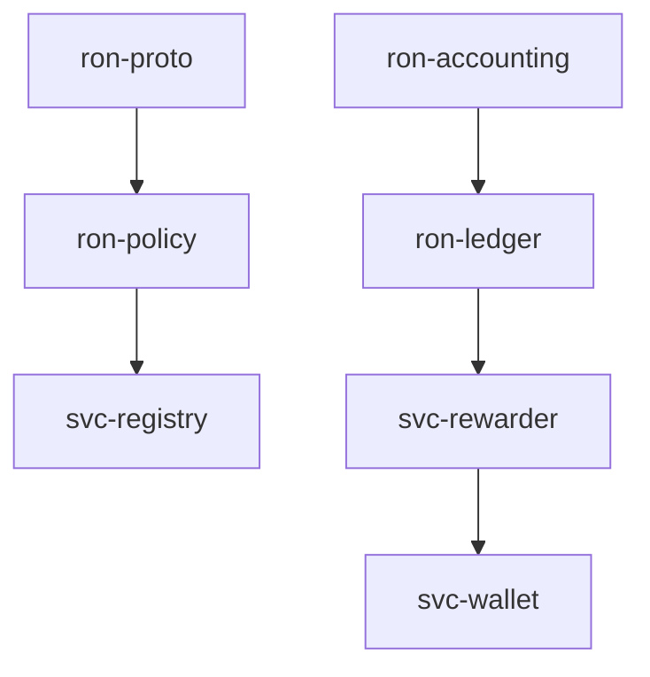

---

title: Build Guide — Filling Crates with Code
project: RustyOnions (RON)
version: 1.6.0
status: reviewed
last-updated: 2025-10-14
audience: contributors, leads, ops, auditors
msrv: 1.80.0

---

# Build Guide — Filling Crates with Code

This guide is the single procedure for turning scaffolded files into production-grade Rust across all 33 crates. It assumes each crate’s blueprints and templates (e.g., IDB.md, CONFIG.md, CONCURRENCY.md, and the full set: API.md, CONCURRENCY.md, CONFIG.md, GOVERNANCE.md, IDB.md, INTEROP.md, OBSERVABILITY.md, PERFORMANCE.md, QUANTUM.md, RUNBOOK.md, SECURITY.md, TESTS.md) are complete, along with TODO.md (file tree with one-liners).
Prime directive: ship code that is (1) canon-compliant, (2) provably correct, (3) efficient by profile—not by guess.

---

## 0) Stoplight Gates (make red easy)

* Green = All gates pass.
* Yellow = Non-blocking nits (docs, formatting).
* Red = Any invariant, test, clippy -D warnings, perf regression, or DOM gate fails.

**Run locally (crate-scoped):**

```
cargo build -p <crate> --all-features
cargo test -p <crate> --all-features
cargo clippy -p <crate> --all-features -- -D warnings -W clippy::await_holding_lock -W clippy::perf -W clippy::dbg_macro
cargo llvm-cov -p <crate> --all-features
cargo bench -p <crate> -- --save-baseline main --sample-size 30 --measurement-time 5
cargo +nightly miri test -p <crate> --all-features
cargo +nightly public-api -p <crate> --diff-git-check
cargo +nightly update -Z minimal-versions && cargo build -p <crate> --all-features
rustup toolchain install 1.80.0 && cargo +1.80.0 build -p <crate> --all-features
```

One-command alias: `xtask optimize -p <crate>` (see §13).

---

## 1) Invariants (MUST)

* **Canon boundaries:** No new crates; no role leakage (e.g., rewarder never mutates ledger).
* **Safety:** `unsafe` requires `// SAFETY:` + targeted test; prefer borrowing; no panics in hot paths; no global state/singletons.
* **Precision:** No floats in money/consensus; use integers or fixed-point with lossless conversions.
* **Concurrency:** No locks across `.await`; bounded queues; cooperative cancellation; shutdown drains.
* **Config:** All tunables are loaded & validated per CONFIG.md; fail-closed on bad config.
* **Observability:** Metrics and health/readiness (if service); no secrets in logs/metrics.
* **Proof:** Every IDB invariant maps to at least one test or property; conservation asserts where applicable.
* **Efficiency:** Avoid needless alloc/copies on hot paths; profile before micro-optimizing.
* **Conditional Data-Oriented Law:** When a hot path manipulates bulk homogeneous data (scans, intersections, reductions), it **must** prefer a contiguous, alias-free layout (flat arrays/bitsets/SoA) or provide a benchmark + flamegraph proving no measurable gain (see §5 and §10A).

---

## 2) Design Principles (SHOULD)

* **Purity first:** Core logic is pure, IO lives in adapters; tiny public surface.
* **Ownership zen:** Prefer stack data; `&str`/slices/`Bytes`; `Arc` only for shared immutable.
* **Readability:** Clear names; public items have rustdoc; macros only when removing boilerplate.
* **Perf by measurement:** criterion + flamegraph; `rayon` or `portable-simd` only after profiling.
* **Security hygiene:** `serde(deny_unknown_fields)`, zeroize secrets, least-privilege caps.
* **TDD cadence:** Test/spec first for each file in TODO.md; implementation next.
* **Forward-proof:** Version DTOs; feature-gate heavy deps; SemVer guarded by API snapshot.

---

## 3) Per-Crate Build Method (bottom-up)

Build all 33 crates in dependency order (see §14 for graph); parallelize non-deps. Per crate:

1. **Prep (10–20%)**

   * Read all 12 templates (IDB invariants, CONFIG knobs, CONCURRENCY tasks, SECURITY hygiene, etc.); scan TODO.md.
   * Turn on CI teeth: clippy -D warnings, coverage floor, benches, deny rules (see §7).
   * Create/refresh API snapshot (if library API visible).

2. **Core Logic (40%)**

   * Implement pure functions/modules promised by TODO.md.
   * Property tests for invariants (ordering, conservation, idempotency, etc.).
   * Add a micro-bench for the hottest pure path; set initial baseline.

3. **Adapters & Concurrency (20%)**

   * Thin IO adapters with explicit timeouts and bounded channels per CONCURRENCY.md.
   * Honor config keys; wire metrics. No locks across `.await`.

4. **Service Wiring (10%)** (service crates only)

   * Supervisor, routes, health/ready, metrics. Graceful shutdown and backpressure.

5. **Polish & Verify (10–20%)**

   * Fuzz decoders; Loom model if concurrency primitives exist; miri for UB.
   * Flamegraph; fix top 1–2 hot spots or document “as intended.”
   * **DOM pass (if applicable):** apply §10A; keep only if it clears the gates.
   * Re-run gates; update CHANGELOG.md; refresh API snapshot.

---

## 4) Per-File Definition of Done (DoD)

Tie each file directly to a check. Update TODO.md only when DoD is green.

**File (from TODO.md) → DoD (tests/gates)**

* **README.md** → Invariants + quickstart match code; links to docs; `cargo test --doc` passes.
* **docs/API.md** → Public surface matches code; examples compile.
* **docs/CONCURRENCY.md** → Channel caps/locks match code; “no lock across .await” example included.
* **docs/CONFIG.md** → All keys exist in code; `Config::validate()` enforces rules; reload semantics documented.
* **docs/GOVERNANCE.md** → Policy hooks implemented; audit events emitted.
* **docs/IDB.md** → Each invariant references specific test(s) by file name.
* **docs/INTEROP.md** → DTOs/protocols match code; compatibility tests present.
* **docs/OBSERVABILITY.md** → Metrics/endpoints match code; scrape verified.
* **docs/PERFORMANCE.md** → Benches match documented budgets; flamegraph baselines checked in.
* **docs/QUANTUM.md** → PQ/hybrid mode tested (or mark N/A explicitly).
* **docs/RUNBOOK.md** → Error handling/shutdown matches code; triage flows tested.
* **docs/SECURITY.md** → Hygiene enforced; vuln scans clean.
* **docs/TESTS.md** → Unit/property/fuzz strategies implemented; coverage meets floor.
* **src/lib.rs** → Minimal re-exports; public rustdoc complete; public-api snapshot matches or CHANGELOG bumped.
* **core/*.rs** → Pure (no IO/time/global); unit + property tests; micro-bench present; **if compute-heavy, DOM proof attached** (see §10A).
* **adapters/*.rs** → Typed errors; timeouts; metrics; no panics; fuzz tests for parsers/DTOs.
* **errors.rs** → `thiserror` enums; error taxonomy matches IDB (Retryable/Fatal/Quarantine).
* **config.rs** → Defaults + validate(); env/CLI/file merge covered by tests.
* **metrics.rs** → No global registry leakage; labels stable; Prometheus scrape verified.
* **bin/main.rs (svc)** → Supervisor, readiness/health; graceful shutdown proven by test or harness.
* **tests/** → One invariant per file; names mirror IDB labels; coverage meets floor.
* **benches/** → Criterion baselines checked in; regression threshold enforced in CI.

---

## 5) Efficiency Checklist (per PR)

* **Allocs:** No `to_string()`/`collect()` in hot loops; pre-size `Vec::with_capacity`; prefer slices/`Bytes`.
* **Copy elision:** Avoid cloning large structs; pass by reference; use `Cow` if needed.
* **Branches:** Keep hot path straight; move error mapping to `#[cold]` fns.
* **Iterators:** Use adapters to avoid temp allocations; favor clarity over overly clever chains.
* **Serde:** `deny_unknown_fields`; integers for money; avoid `String` when `&str` suffices.
* **Concurrency:** Bounded channels; `try_send` + `Busy` over buffering; `spawn_blocking` only for true blocking.
* **Compile flags:** `-C target-cpu=native` in dev only (not in release artifacts unless policy permits).
* **DOM preference (conditional):** For bulk homogeneous work, prefer flat arrays/bitsets/SoA and batch inner loops to SIMD width (see §10A).

---

## 6) Review Checklist (lead sign-off)

* Invariants concretely enforced? (asserts/tests)
* API surface minimal, documented, and snapshotted?
* No new deps or features outside workspace policy?
* Performance deltas understood (flamegraph/bench report attached)?
* Logs/metrics safe (no secrets), cardinality bounded?
* Shutdown and backpressure proven (test or harness)?
* **DOM applied where applicable?** (If declined, PR includes benchmark + flamegraph showing <10% gain.)

Reject if any red; request changes if perf floor/ceiling unexplained.

---

## 7) Enforcement Teeth (CI + Lints)

**Clippy & warnings (blocking):**

```
cargo clippy -p <crate> --all-features -- -D warnings -W clippy::await_holding_lock -W clippy::perf -W clippy::dbg_macro
```

**Coverage floor:** `cargo llvm-cov -p <crate> --all-features`

* libs: ≥80% line
* services: ≥70% overall, ≥80% core

**Benchmark guard:** compare criterion JSON to baseline; fail on >15% regression unless waived.

**Dependencies:** `cargo deny check` + `cargo +nightly udeps -p <crate>` → no unused/vuln deps.

**API stability (libs):** `cargo +nightly public-api -p <crate> --diff-git-check` (bump SemVer if changed).

**Unsafe gate:** grep for `unsafe` → requires “SAFETY” comments + test IDs in commit.

**Panic audit:** deny `unwrap`/`expect` outside tests/benches/examples or behind `#[cfg(debug_assertions)]` (use `debug_assert!`).

**Forbidden patterns:** no global singletons (deny `lazy_static!`, `once_cell::sync::Lazy`, `static mut`); no new workspace members; no float in money paths.

**UB detection:** `cargo +nightly miri test -p <crate> --all-features` in CI (allow-failure or per-crate opt-out via metadata until green).

**MSRV floor:** `rustup toolchain install 1.80.0 && cargo +1.80.0 build -p <crate> --all-features`.

**Minimal-versions (dep floor):**

```
cargo +nightly update -Z minimal-versions
cargo build -p <crate> --all-features
git checkout -- Cargo.lock
```

**Lockfile guard:** `git diff --exit-code Cargo.lock`.

**Doc links:** `cargo doc -p <crate> --no-deps -Z rustdoc-map` + `lychee` (e.g., `lychee --max-retries 3 --backoff 2s --no-external`) on docs/.

**Platform matrix (CI):**

* os: `ubuntu-latest`
* target: `x86_64-unknown-linux-gnu`, `aarch64-unknown-linux-gnu`

**Workspace .cargo/config.toml (local -D warnings):**

```
[build]
rustflags = ["-D", "warnings"]
```

---

## 8) Mapping IDB → Tests (traceability)

Maintain `docs/_matrix.md` with rows like:

```
I-1 (Canon boundary) -> tests/api_surface.rs
I-3 (Conservation)   -> tests/conservation_prop.rs
I-5 (No lock .await) -> clippy + loom
I-8 (Backpressure)   -> tests/backpressure_busy.rs
```

**CI check (build.rs): robust regex, filename convention `tests/i_*_.rs`:**

```rust
use regex::Regex;
fn main() {
    let idb = std::fs::read_to_string("docs/IDB.md").unwrap();
    let re = Regex::new(r"-\s*\[I-(\d+)\]").unwrap();
    let mut invariants = vec![];
    for cap in re.captures_iter(&idb) { invariants.push(cap[1].to_string()); }
    let tests_dir = std::fs::read_dir("tests").unwrap();
    let mut covered = vec![];
    for entry in tests_dir {
        let path = entry.unwrap().path();
        if path.is_file() && path.file_name().unwrap().to_str().unwrap().starts_with("i_") {
            let stem = path.file_stem().unwrap().to_str().unwrap();
            if let Some(n) = stem.strip_prefix("i_").and_then(|s| s.split('_').next()) {
                covered.push(n.to_string());
            }
        }
    }
    let missing: Vec<_> = invariants.iter().filter(|i| !covered.contains(i)).collect();
    if !missing.is_empty() { panic!("Missing tests for invariants: {:?}", missing); }
}
```

---

## 9) Property, Fuzz, Loom (when to use)

* **Property tests:** invariants over wide input (ordering, conservation, idempotency).
* **Fuzz targets:** decoders/parsers (DTOs, manifests). 60–120s per target on PR (`-max_total_time=60`).
* **Loom:** if the crate creates/uses channels or locks internally; model 1–2 key interleavings.
* **Miri:** Always in CI for UB detection (allow-failure or opt-out per crate until green).

**Determinism:** save failing proptest seeds to `artifacts/proptest-seeds.txt`; re-run in CI. Archive fuzz crashing inputs under `artifacts/fuzz/<crate>/`.

---

## 10) Performance Workflow

1. Add criterion bench for the hottest path.
2. Run `cargo flamegraph` for a representative workload.
3. Identify top 2 hot symbols; optimize or document “as intended.”
4. Commit baselines JSON; CI enforces ±15% budget:

```
cargo bench -p <crate> -- --baseline main --sample-size 30 --measurement-time 5
```

Tip: use `critcmp` locally for diffs.

### 10A) Data-Oriented Layout & SIMD (DOM) — Method and Gates

**When to apply:** the code performs bulk scans/intersections/reductions over homogeneous data (e.g., fan-out routing, capability checks, epoch math, ledger scans, metrics aggregation).

**Preferred representations (internal, not API):**

* **Flat arrays** (`Vec<T>`) with row/column order chosen so the *innermost* loop walks **stride-1**.
* **Bitsets/bitmasks** for membership and intersections (`u64` words, `bitvec`, or `portable-simd` masks).
* **Struct-of-Arrays (SoA)** for queues/tables scanned in bulk; headers AoS + payload SoA if messages vary.
* **Batching** to SIMD width (use `array_chunks` or manual chunking); branch-free masks in hot loops.
* **Cache-friendly search** (Eytzinger layout) or perfect hash for static keys.

**SIMD guidance:**

* Start with clean loops over slices; rely on auto-vectorization first.
* If needed, use `portable-simd` behind a feature flag (e.g., `features = ["simd"]`); keep small, contained intrinsics.

**Gates to keep or roll back:**

* **Win required:** ≥15% p95 latency reduction **or** ≥20% throughput gain **for the targeted hotspot** (Criterion diff vs baseline).
* **No regressions:** memory ≤ +10%; allocs on hot path do not increase; coverage/lints stay green.
* **Proof bundle:** before/after flamegraphs highlighting the reduced hot frames + bench report in PR.
* **Containment:** no public API changes; no governance/interop shifts; feature-gated where heavy.

**Anti-patterns (reject unless proven otherwise):**

* Dense 2D tables for extremely sparse data (prefer CSR/roaring-bitmaps).
* HashMap in top-10 frames of a hot loop (replace with fixed arrays or perfect hash).
* Rayon on async tasks (parallelize pure compute only; cap threads to avoid oversubscription).

---

## 11) Drift Guards & Governance

* **SemVer snapshot:** keep `docs/api-history/<crate>/vX.Y.Z.txt` current.
* **CHANGELOG discipline:** features/fixes/perf changes with PR links.
* **Review cadence:** every 90 days or any time invariants/tests change.
* **No scope creep:** if a file’s purpose (from TODO.md) doesn’t match needed code, amend TODO.md + IDB.md first, then implement.
* **Dep policy (denylist):** `ring`/`openssl`/`chrono`/`lazy_static` denied unless approved (cargo-deny config).

---

## 12) Quickstart “per file” micro-flow (repeat for each file)

1. Re-read the file’s one-liner in TODO.md.
2. Write a minimal test (or property) that proves the behavior.
3. Implement the smallest code to make it pass.
4. Run gates (tests, clippy, cov); keep perf neutral.
5. Add rustdoc & example if public API.
6. If compute-heavy, run DOM experiment (§10A); keep only if it clears gates.
7. Commit: `feat(<file>): implement as per IDB [tests: ...]`.

---

## 13) Appendix — Toolbelt & xtask

**Toolbelt:** rust-analyzer, cargo-watch, cargo-llvm-cov, cargo-deny, cargo-udeps, criterion, cargo-fuzz, cargo-flamegraph, cargo-public-api, cargo-miri, critcmp, lychee.

**xtask optimize (Cargo.toml alias or src/bin/xtask.rs):**

```rust
use std::process::Command;
fn main() -> anyhow::Result<()> {
    let crate_name = std::env::args().nth(1).unwrap_or("svc-rewarder".into());
    Command::new("cargo").args(["build", "-p", &crate_name, "--all-features"]).status()?;
    Command::new("cargo").args(["test", "-p", &crate_name, "--all-features"]).status()?;
    Command::new("cargo").args(["clippy", "-p", &crate_name, "--all-features", "--", "-D", "warnings"]).status()?;
    Command::new("cargo").args(["llvm-cov", "-p", &crate_name, "--all-features"]).status()?;
    Command::new("cargo").args(["bench", "-p", &crate_name, "--", "--save-baseline", "main", "--sample-size", "30", "--measurement-time", "5"]).status()?;
    Command::new("cargo").args(["+nightly", "miri", "test", "-p", &crate_name, "--all-features"]).status()?;
    Command::new("cargo").args(["+nightly", "public-api", "-p", &crate_name, "--diff-git-check"]).status()?;
    Ok(())
}
```

---

## 14) Crate Dependency Order (Mermaid for parallel builds)



**Text:** Foundational (ron-proto) → policy/registry → accounting/ledger → rewarder/wallet; parallelize non-deps (e.g., Linux/aarch64 in CI).

---

**This version bakes the data-oriented methodology into the invariants, checklists, DoD, CI gates, and perf workflow—so every crate gets the wins when applicable, and changes are self-policed by proof, not taste.**
