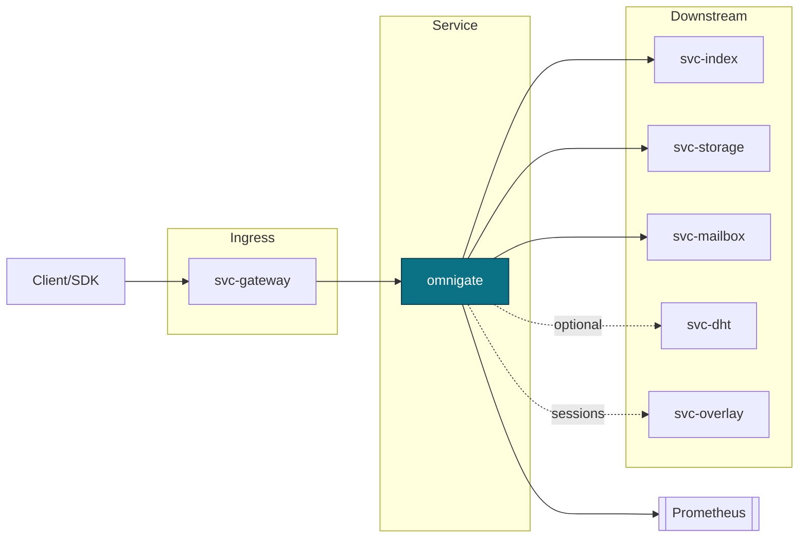
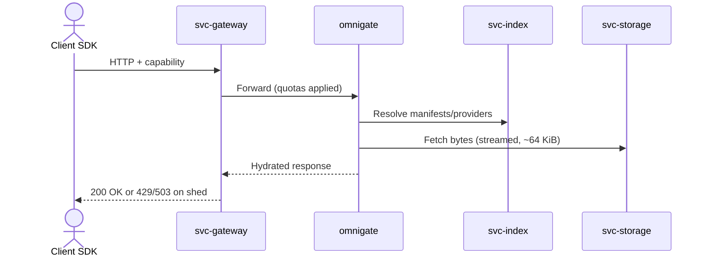
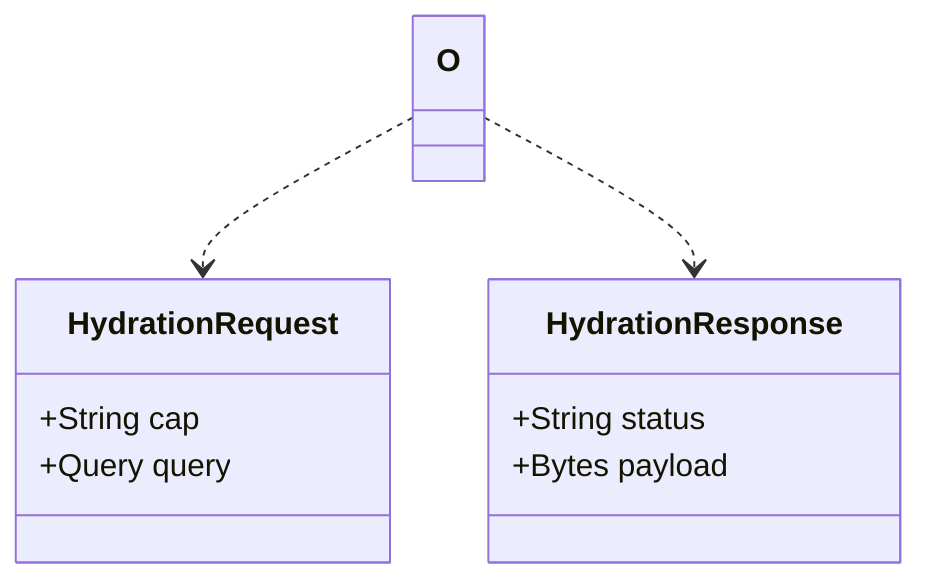
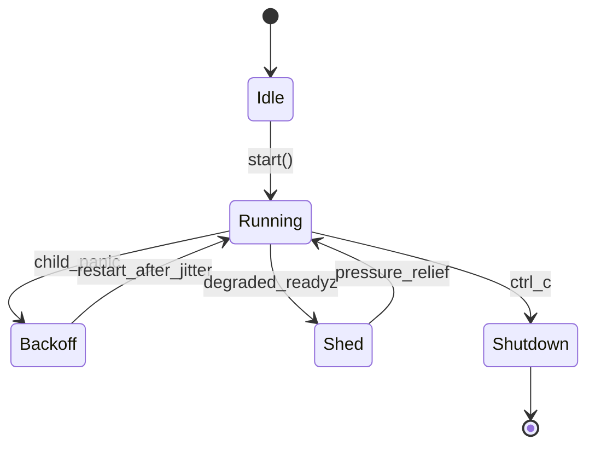

---

# omnigate

> **Role:** service
> **Owner:** Stevan White
> **Status:** draft
> **MSRV:** 1.80.0
> **Last reviewed:** 2025-10-07

Badges:
[]() []() []() []() []()

---

## 1) Overview

**What it is (one paragraph):**
Omnigate is the north–south **BFF / view hydrator** that turns client capabilities + queries into composed responses by orchestrating `svc-index`, `svc-storage`, and `svc-mailbox` (and optional facets) over **OAP/1**. It is **stateless** beyond counters and RAM caches, **policy-aware**, and strictly **capability-gated**. TLS termination, quotas, and fair-queueing live in `svc-gateway`; Omnigate focuses on **hydration, policy, and backpressure**. Micronode may embed it; Macronode deploys it behind `svc-gateway`.

**How it fits (RustyOnions topology):**

* **Pillar:** 6 — Ingress & Edge
* **Upstream callers:** `svc-gateway`, `ron-app-sdk`
* **Downstream deps:** `svc-index`, `svc-storage`, `svc-mailbox`, optionally `svc-dht` / `svc-overlay`
* **Data it touches:** In-memory counters/caches only (amnesia-compliant)
* **Security boundary:** Capability verification + policy evaluation; no ambient authority; no durable state

### 1.1 High-Level Architecture (Mermaid)



*Ingress handles TLS/quotas; Omnigate hydrates views; metrics are exported uniformly.*

---

## 2) Responsibilities & Boundaries

**MUST do (core responsibilities):**

* [ ] Hydrate client views by composing index/storage/mailbox with strict backpressure.
* [ ] Verify capabilities and evaluate policy **before fan-out**.
* [ ] Honor OAP limits: **max_frame = 1 MiB**, stream in ~**64 KiB** chunks on storage paths.
* [ ] Expose `/healthz`, `/readyz`, `/metrics` with golden metrics.

**MUST NOT do (anti-scope / boundaries):**

* [ ] Terminate TLS or enforce admission quotas (that’s `svc-gateway`).
* [ ] Own durable truth or DHT/ledger logic (owned by storage/index/ledger and `svc-dht`).
* [ ] Encode business rules for apps (no app-specific policy creep).

**Acceptance Gates (PROOF, CI-enforced):**

* [G-1] **OAP bounds**: reject >1 MiB frames; stream in ~64 KiB chunks.
  CI: `cargo test -p omnigate oap_limits::*` + property tests (proptest) on boundary sizes.
* [G-2] **Policy-before-fanout**: no downstream calls without a verified capability.
  CI: integration test `tests/policy_gate.rs` with allow/deny cases.
* [G-3] **Readiness shedders**: `/readyz` flips to `503` before queues saturate.
  CI: load harness asserts `rejected_total{reason="degraded"}` > 0 while p95 stays bounded.
* [G-4] **No locks across `.await` in hot paths**.
  CI: Loom scenario `tests/loom_fanout.rs`; fail build on Loom failure (CI-only).
* [G-5] **Fuzzed inputs** on envelopes/headers/params.
  CI: `cargo fuzz run oap_envelope` (short PR budget), nightly extended.
* [G-6] **Metrics contract** present: `latency_seconds{route,method}`, `rejected_total{reason}`, `service_restarts_total`.
  CI: scrape snapshot test verifies metric names/labels.
* [G-7] **SLO conformance**: hydration p95 ≤ 150 ms on reference rig.
  CI: perf job compares to baseline; >10% regression fails.

---

## 3) Public Interfaces

> Omnigate is a service; there is no public Rust API surface beyond DTO reuse from `ron-proto`.

### 3.2 Bus RPC / Events (service)

* **Topics (RON bus):**

  * RPC topic: `ron://omnigate/hydrate` — Request:{cap, query}; Response:{status, payload}
  * Events: `KernelEvent::Health{service,ok}`, `KernelEvent::ServiceCrashed{service}`
* **Subscribed topics:** none (pull-model via HTTP ingress); emits health events to kernel bus.



### 3.3 HTTP (service)

* **Base URL:** `http://<host>:<port>/`
* **Endpoints:**

  * `GET /healthz` → `200 OK {"status":"ok"}`
  * `GET /readyz` → `200 OK {"ready":true}` when deps healthy, else `503` with `Retry-After`
  * `GET /metrics` → Prometheus text exposition

### 3.4 CLI (binary/tool)

No CLI; interact via HTTP and the RON bus.

---

## 4) Configuration

| Variable                 | Type   | Default       | Description                             |
| ------------------------ | ------ | ------------- | --------------------------------------- |
| `OMNIGATE_BIND`          | socket | `127.0.0.1:0` | HTTP bind                               |
| `OMNIGATE_METRICS_ADDR`  | socket | `127.0.0.1:0` | Prometheus exporter bind                |
| `OMNIGATE_AMNESIA`       | bool   | `true`        | RAM-only caches; aggressive zeroization |
| `OMNIGATE_OAP_MAX_FRAME` | bytes  | `1048576`     | Max OAP frame (1 MiB)                   |
| `OMNIGATE_STREAM_CHUNK`  | bytes  | `65536`       | Target streaming chunk size (64 KiB)    |
| `LOG_LEVEL`              | string | `info`        | tracing level (`trace`..`error`)        |

**Feature flags (Cargo):**

* `tls` — enable TLS via `tokio-rustls` (transport layer)
* `arti` — optional Tor/Arti backend via `ron-transport`

**Common flags:**

```
--bind 0.0.0.0:8080
--max-conns 1024
--config ./Config.toml
```

---

## 5) Build, Run, Test

**Build**

```
cargo build -p omnigate
```

**Run (service)**

```
RUST_LOG=info OMNIGATE_AMNESIA=true OMNIGATE_METRICS_ADDR=127.0.0.1:0 cargo run -p omnigate
```

**Tests (unit/prop/docs)**

```
cargo test -p omnigate --all-features
cargo test -p omnigate --doc
```

**Lint & format**

```
cargo fmt --all
cargo clippy -p omnigate -- -D warnings
```

**Security & deps**

```
cargo deny check
```

**Bench (if provided)**

```
cargo bench -p omnigate
```

---

## 6) Observability

**Endpoints (service):** `/metrics`, `/healthz`, `/readyz`
**Golden Metrics:**

* `requests_total{route,method,status}` (Counter)
* `latency_seconds{route,method}` (Histogram)
* `inflight_requests{route}` (Gauge or implied by concurrency limit)
* `rejected_total{reason}` (quota, degraded, policy_denied) (Counter)
* `service_restarts_total{service}` (Counter)
* `bus_lagged_total{service}` (Counter, if bus consumers used)

**Alerts (suggested):**

* `rejected_total{reason="degraded"}` > 1% for 5m → page SRE
* `latency_seconds{route="/hydrate",quantile="0.95"}` > 150 ms for 10m → ticket
* `bus_lagged_total` > 0 → warning (investigate backpressure)

**Tracing:** targets `omnigate=info,axum=warn,tower_http=warn`
Span fields: `request_id`, `cap_id` (non-secret), `route`, `status`, `degraded`, `fanout_ms`, `downstream_time_ms{index,storage}`

---

## 7) Performance & SLOs

| Path / Facet       | Target (p95) | Notes                     |
| ------------------ | -----------: | ------------------------- |
| Hydration (common) |     ≤ 150 ms | index + storage compose   |
| Media range start  |     < 100 ms | cold start; 64 KiB chunks |
| Mailbox fetch      |     ≤ 120 ms | batched page fetch        |
| Graph/Feed query   |     ≤ 250 ms | cross-svc joins capped    |

**Repro:**
Machine: `c6i.4xlarge` (reference), `RUSTFLAGS="-C target-cpu=native"`
Cmds: `cargo bench -p omnigate` and `scripts/load/hydrate_mix.sh --rps 200 --p95 150`
Artifacts: store `perf/flamegraph.svg`; regression budget ±10% vs baseline

---

## 8) Data & Schema (if applicable)

Omnigate owns **no durable schema**. It composes DTOs from `ron-proto` and enforces `#[serde(deny_unknown_fields)]` at the edges. Content addressing (e.g., BLAKE3 forms) remains host-owned in downstream services.



---

## 9) Security & Privacy

* **Capabilities only** (e.g., macaroons); verify **before** any fan-out; structured denials.
* **Policy-aware hydration** using `ron-policy`; no ambient authority.
* **Amnesia Mode:** RAM-only caches/logs when enabled (Micronode default).
* **Input validation:** length limits, timeouts, deny-lists on headers/params.
* **Supply chain:** workspace-pinned deps; `cargo deny` clean; TLS via `tokio-rustls`.

---

## 10) Error Taxonomy

| HTTP | Code/Variant          | When                        | Client hint            | Retry |
| ---: | --------------------- | --------------------------- | ---------------------- | :---: |
|  400 | `BadRequest`          | malformed query/params      | fix request            |   no  |
|  401 | `Unauthenticated`     | missing/invalid capability  | attach capability      |   no  |
|  403 | `PolicyDenied`        | capability lacks privilege  | request new scope      |   no  |
|  413 | `BodyTooLarge`        | > OAP frame limit (1 MiB)   | split data             |   no  |
|  416 | `RangeNotSatisfiable` | bad range                   | adjust range           |   no  |
|  429 | `QuotaExceeded`       | ingress/local ceilings      | back off (Retry-After) |  yes  |
|  503 | `Degraded`            | shed mode                   | try later              |  yes  |
|  504 | `UpstreamTimeout`     | downstream slow/unavailable | retry with jitter      |  yes  |

**JSON envelope example:**

```json
{
  "status": "error",
  "code": "PolicyDenied",
  "http": 403,
  "request_id": "01J8ZEXAMPLE",
  "hint": "capability lacks `media.read`",
  "retry_after": null
}
```

---

## 11) Concurrency Model

* **Runtime:** tokio (1.x); crash-only tasks; jittered restarts via kernel supervision.
* **I/O:** `AsyncReadExt` / `AsyncWriteExt`, explicit timeouts.
* **Channels:** broadcast bus (cloneable), bounded `mpsc` for work queues.
* **Rules:** never hold a lock across `.await` in supervisory/hot paths; single writer per connection; bounded queues; readiness first.

**Validation:**

* **Loom**: fan-out + cancellation model (`tests/loom_fanout.rs`).
* **TLA+** (optional): readiness→shed→recovery liveness (no deadlock).
* **Bounded queues**: mpsc sizes documented; backpressure saturates before downstream melt.



---

## 12) Compatibility & Requirements

* **Rust:** MSRV 1.80.0
* **OS:** macOS 10.15+, Linux x86_64; Containers: supported
* **TLS:** `tokio_rustls::rustls::ServerConfig` (type expectation)
* **HTTP:** axum 0.7.x, tower-http 0.6.x
* **DB:** none (stateless)

---

## 13) Examples

Service health:

```
curl -sS http://127.0.0.1:8080/healthz | jq .
```

Hydration (capability-gated) example:

```
curl -sS -H 'X-Capability: macaroon:v1:AbCd...' \
  'http://127.0.0.1:8080/hydrate?profile=basic&ids=f:abc123,f:def456' | jq .
```

---

## 14) Troubleshooting

* **429/503 spikes:** check `rejected_total{reason}` and ingress quotas; verify `/readyz` shed mode.
* **Slow range starts:** ensure 64 KiB streaming and storage integration SLOs.
* **Policy denials:** confirm capability scope and `ron-policy` rules.
* **TLS errors:** ensure `tokio-rustls` config matches certs (do not use `rustls::ServerConfig` directly).
* **High latency:** check CPU throttling, `RUST_LOG` spam, missing `--release`.

---

## 15) Development Notes

* Axum handlers end with `.into_response()`; DTOs from `ron-proto`.
* Re-export common kernel surface where applicable: `Bus`, `KernelEvent`, `Metrics`, `HealthState`, `Config`, `wait_for_ctrl_c()`.
* Arti/Tor lives as a **feature of `ron-transport`**, not as a service.

**Pre-commit quickcheck**

```
cargo fmt --all
cargo clippy -- -D warnings
cargo test
cargo deny check
```

---

## 16) Mermaid Diagrams — Policy & Tooling

Author `.mmd` under `docs/` and render via CI. Keep node labels short (crate names) and highlight only Omnigate.

**Render locally (SVG)**

```
npm i -g @mermaid-js/mermaid-cli
mmdc -i docs/arch.mmd -o docs/arch.svg
```

**CI (GitHub Actions – Mermaid render)**

```yaml
name: render-mermaid
on: [push, pull_request]
jobs:
  mmdc:
    runs-on: ubuntu-latest
    steps:
      - uses: actions/checkout@v4
      - run: npm i -g @mermaid-js/mermaid-cli
      - run: |
          mkdir -p docs
          for f in $(git ls-files '*.mmd'); do
            out="${f%.mmd}.svg"
            mmdc -i "$f" -o "$out"
```

---

## 17) Roadmap & TODO

* [ ] **M1 — Bronze:** [G-1..G-3] enforced; metrics contract; `/readyz` shed + alert.
* [ ] **M2 — Silver:** [G-4..G-6]; Loom scenarios; fuzz harness; facet SLOs & dashboards.
* [ ] **M3 — Gold:** [G-7]; chaos drills; perf CI & flamegraphs; PQ-hybrid signaling (KMS handoff hooks); optional ZK receipts pilot for auditability.

---

## 18) Changelog

See `CHANGELOG.md`. Follow SemVer; document breaking changes with migration notes.

---

## 19) License

Dual-licensed under **MIT** or **Apache-2.0**. See `LICENSE-MIT` and `LICENSE-APACHE`.

---

## 20) Contributing

PRs welcome! Please run fmt/clippy/tests and include:

* Updated diagrams (if topology changed)
* Docs & examples
* Bench impact (if perf-sensitive)

> Also see: `docs/IDB.md` (Invariant-Driven Blueprint) for this crate.

---
