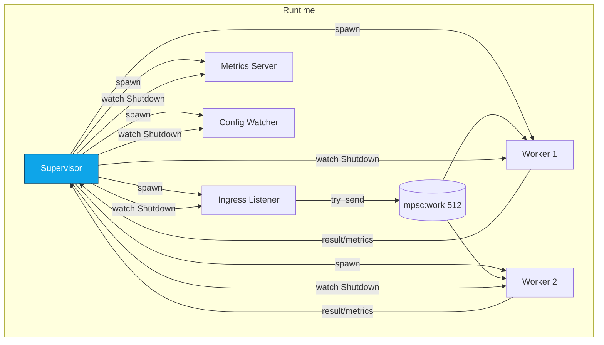
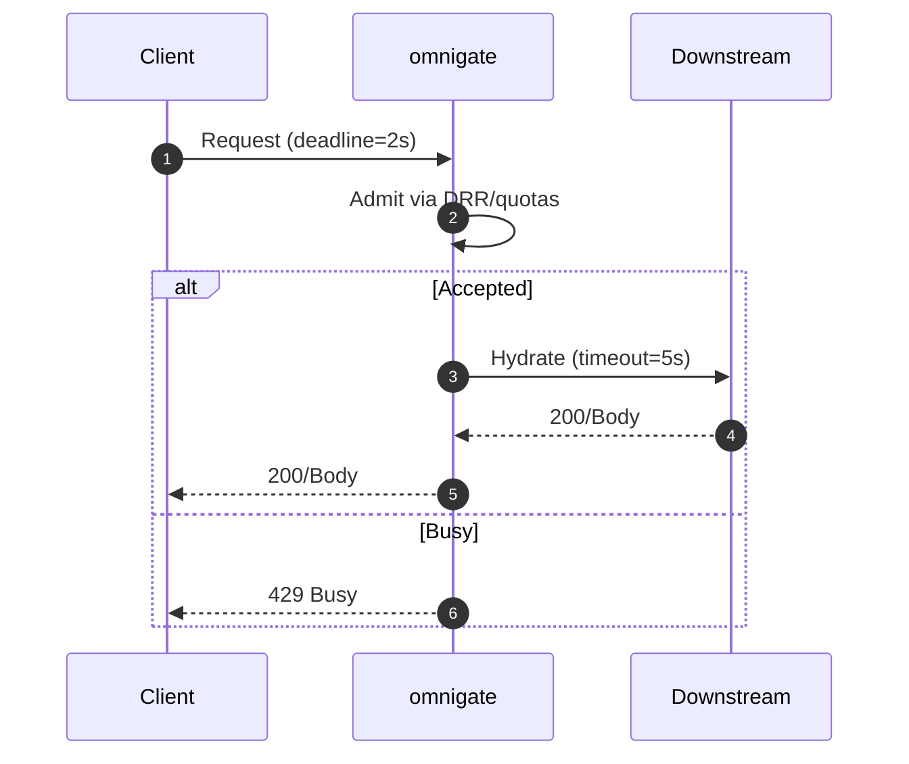
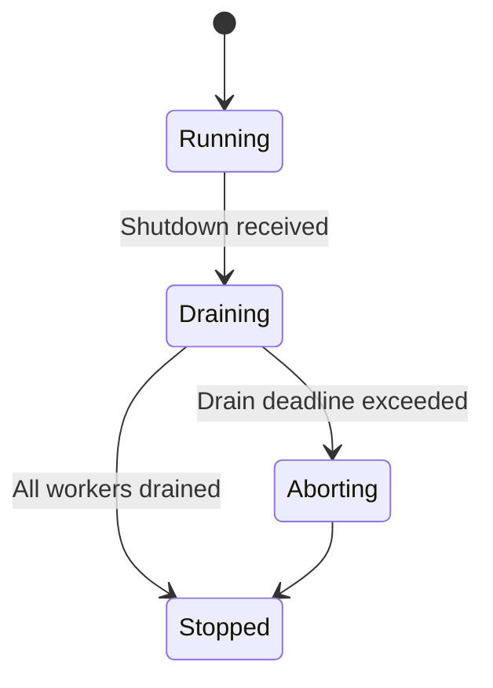
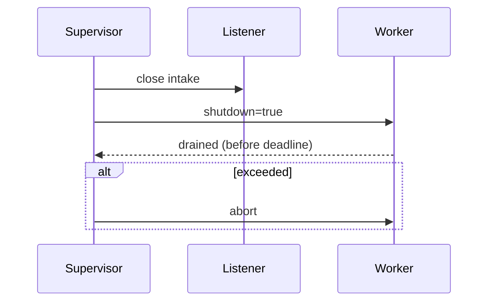

---

title: Concurrency Model — omnigate
crate: omnigate (impl: svc-gateway)
owner: Stevan White
last-reviewed: 2025-10-07
status: draft
template_version: 1.1
msrv: 1.80.0
tokio: "1.x (pinned at workspace root)"
loom: "0.7+ (dev-only)"
lite_mode: "N/A — service crate with background tasks"
------------------------------------------------------

# Concurrency Model — omnigate

This document makes the concurrency rules **explicit**: tasks, channels, locks, shutdown, timeouts,
and validation (property/loom/TLA+). It complements `docs/SECURITY.md`, `docs/CONFIG.md`,
and the crate’s `README.md` and `IDB.md`.

> **Golden rule:** never hold a lock across `.await` in supervisory or hot paths.

> **Alias note:** The “omnigate” blueprint is implemented by the **svc-gateway** crate in code. Concurrency applies identically.

---

## 0) Lite Mode (for tiny lib crates)

N/A (service crate).

---

## 1) Invariants (MUST)

* [ ] **No lock across `.await`**. If unavoidable, split the critical section and move awaited work outside the guard.
* [ ] **Single writer** per mutable resource; readers use snapshots (`ArcSwap`, `watch`) or short read guards.
* [ ] **Bounded channels** only (mpsc/broadcast) with explicit overflow policy and metrics.
* [ ] **Explicit timeouts** on all I/O and RPCs (ingress, downstream); fail-fast with typed errors.
* [ ] **Cooperative cancellation**: every `.await` is cancel-safe or guarded by `tokio::select!`.
* [ ] **Graceful shutdown**: observe `Shutdown` signal; stop intake; drain within deadline; abort stragglers; emit metrics.
* [ ] **No blocking syscalls** on the async runtime; use `spawn_blocking` only for CPU/FS hotspots (PEM parse, decompression).
* [ ] **No task leaks**: all tasks are owned and joined or deliberately detached with rationale + metric.
* [ ] **Backpressure over buffering**: prefer `Busy`/`429` and mpsc `try_send` over unbounded queues.
* [ ] **Framing**: HTTP request body limits enforced; OAP/1 bridging honors 1 MiB body cap and 10× decompress cap.
* [ ] **Admission before work**: quotas + DRR classify and throttle **before** expensive actions (auth, hydrate, decompress).
* [ ] **Async Drop**: teardown is via async `close()/shutdown()`; `Drop` never blocks.

---

## 2) Runtime Topology

**Tokio runtime:** multi-threaded scheduler. All long-lived tasks are supervised.

**Long-lived tasks (owners in parentheses):**

* **Supervisor** (kernel): starts tasks, owns shutdown, aggregates joins, emits `KernelEvent`s.
* **Ingress/Listener** (HTTP/axum): accepts connections; performs admission (quota/DRR); enqueues units of work.
* **Worker Pool** (N×): executes request units (auth → route → hydrate downstream → respond).
* **Metrics Server**: serves `/metrics`, `/healthz`, `/readyz`.
* **Config Watcher**: applies dynamic config; publishes to `ArcSwap<Config>` and `watch`.
* **Passport Cache Refresher** (optional): keeps verifier keys/cert chains warm.
* **Housekeeping**: trims stale counters, rotates DRR statistics.



**Text description:** The Supervisor spawns Listener, Workers, Metrics, and Config Watcher. Listener places work into a bounded mpsc queue. Workers consume from the queue. All tasks subscribe to a shutdown `watch`.

---

## 3) Channels & Backpressure

**Inventory (all bounded):**

| Name          | Kind      | Capacity | Producers → Consumers | Backpressure Policy                            | Drop/Reject Semantics                       |
| ------------- | --------- | -------: | --------------------- | ---------------------------------------------- | ------------------------------------------- |
| `work_tx`     | `mpsc`    |      512 | Listener → WorkerPool | `try_send`; if full: return `Busy`/HTTP 429    | Increment `busy_rejections_total{endpoint}` |
| `events_tx`   | broadcast |     1024 | Supervisor → others   | Lag counter; drop oldest for slow subscribers  | `bus_lagged_total` + warn                   |
| `shutdown_rx` | watch     |        1 | Supervisor → N        | Last-write-wins                                | N/A                                         |
| `cfg_rx`      | watch     |        1 | ConfigWatcher → N     | Last-write-wins; atomic snapshot via `ArcSwap` | N/A                                         |

**Guidelines**

* Listener never awaits downstream while holding queue capacity hostage: it **admits or rejects** quickly.
* Prefer **class-local queues** if per-class isolation is required (DRR); otherwise keep a single ordered queue with class tags.

---

## 4) Locks & Shared State

**Allowed (short, local):**

* `Mutex/RwLock` for small metadata and counters; **no `.await` under guard**.
* `ArcSwap<Config>` for zero-lock reader snapshots; updates are atomic.
* Per-connection/request state is **owned** by its task; cross-task transfer via messages.

**Forbidden:**

* Locks across `.await`.
* Nested locks without a documented **hierarchy**.

**Hierarchy (if unavoidable):**

1. `state_meta` (small, fast)
2. `routing_table` (read-mostly)
3. `counters` (atomic preferred)

---

## 5) Timeouts, Retries, Deadlines

* **Ingress I/O:** `read=5s`, `write=5s`, `idle=60s` (overridable by config).
* **Downstream RPC:** per-request **deadline**; retry only idempotent ops with jittered backoff (50–100 ms, cap 2 s, max 3 tries). No retries on non-idempotent writes.
* **Admission:** DRR/quotas decisions within **1 ms** typical; on overload, prefer `Busy`/`429` over queuing.
* **Circuit breaker (optional):** open on 5xx/timeout rates; half-open probes in background.



**Text:** Client sends a request with a deadline. Gateway quickly admits or rejects. On accept, a downstream call is made with a capped timeout; otherwise `429 Busy`.

---

## 6) Cancellation & Shutdown

* **Signal:** `KernelEvent::Shutdown` or `wait_for_ctrl_c()`.
* **Propagation:** `tokio::select! { _ = shutdown.changed() => ..., _ = job = rx.recv() => ... }`.
* **Sequence:** stop intake (close `work_tx`), drain workers within `drain_deadline` (1–5 s), then abort laggards.
* **Metrics:** `tasks_aborted_total{kind}`, `tasks_canceled_total`, `/readyz` switches to **degraded** during drain.



---

## 7) I/O & Framing

* **HTTP/1.1 + TLS (rustls)** via axum/hyper; enforce:

  * `max_body_bytes ≤ 1 MiB`
  * `decompress_ratio_cap ≤ 10×`
* **Read/write:** use `AsyncReadExt/AsyncWriteExt`; call `.shutdown().await` on success/error paths.
* **Partial reads:** handle split frames; never assume single `read` completes body.
* **Checksum/validation:** honor protocol-specific checks when bridging OAP.

---

## 8) Error Taxonomy (Concurrency-Relevant)

| Error          | Surface              | Retry?       | Metric                            | Notes                              |
| -------------- | -------------------- | ------------ | --------------------------------- | ---------------------------------- |
| `Busy`         | Admission/Queue full | Caller maybe | `busy_rejections_total{endpoint}` | Deterministic fast-fail            |
| `Timeout`      | I/O or RPC deadline  | Sometimes    | `io_timeouts_total{op}`           | Attach `op` (`read`,`write`,`rpc`) |
| `Canceled`     | Shutdown/Cancel      | No           | `tasks_canceled_total`            | Cooperative via `select!`          |
| `Lagging`      | Broadcast overflow   | No           | `bus_lagged_total`                | Slow consumer detection            |
| `BackoffRetry` | Transient RPC error  | Internal     | `backoff_retries_total{op}`       | Bounded, idempotent only           |

---

## 9) Metrics (Concurrency Health)

* `queue_depth{queue}` gauge; sampled every 250 ms.
* `queue_dropped_total{queue}` counter (shed at admission).
* `tasks_spawned_total{kind}` / `tasks_aborted_total{kind}`.
* `io_timeouts_total{op}` and `downstream_latency_seconds{service}` histogram.
* `busy_rejections_total{endpoint}` counter.
* DRR visibility: `fq_inflight{class}`, `fq_tokens{class}`, `rejected_total{reason}`.

---

## 10) Validation Strategy

**Unit / Property**

* Admission law: if `work_tx` full → `Busy` returned and `queue_dropped_total` increments.
* Deadlines: end-to-end ≤ configured; tolerance ±5%.
* Lock discipline: debug assertions for “await while holding lock” (tests + clippy lint).

**Loom (dev-only)**

* Model: Producer (Listener) → bounded queue → Consumer (Worker) with shutdown.
* Assert: no deadlocks; shutdown always observed; no double-drop; queues never exceed capacity.

**Fuzz**

* HTTP body boundaries, decompression ratio edges, malformed headers.

**Chaos / Soak**

* Kill workers under load; verify `/readyz` flips, drains within budget, recovery with exponential backoff.
* Overload tests: saturate class “anon”; ensure “internal” still proceeds (weights).

**TLA+ (optional)**

* Model DRR token accounting and fairness; prove no starvation given positive weights.

---

## 11) Code Patterns (Copy-Paste)

**Bounded mpsc with `try_send` (admission):**

```rust
match work_tx.try_send(job) {
    Ok(_) => {}
    Err(tokio::sync::mpsc::error::TrySendError::Full(_)) => {
        metrics::busy_rejections_total().inc();
        return Err(Error::Busy);
    }
    Err(e) => return Err(e.into()),
}
```

**Cooperative shutdown with `select!`:**

```rust
tokio::select! {
    _ = shutdown.changed() => { break; }
    maybe_job = work_rx.recv() => {
        let Some(job) = maybe_job else { break; };
        if let Err(err) = handle(job, cfg_snapshot.clone()).await {
            tracing::warn!(%err, "job failed");
        }
    }
}
```

**No lock across `.await`:**

```rust
let param = {
    let g = state.lock();   // short critical section
    g.compute_param()
};
do_async(param).await;
```

**Dynamic config snapshot (read-optimized):**

```rust
use arc_swap::ArcSwap;
static CONFIG: ArcSwap<Config> = ArcSwap::from_pointee(Config::default());
let cfg = CONFIG.load_full();   // Arc<Config> snapshot, no locks
```

**Spawn + join tracking:**

```rust
let (task_done_tx, mut task_done_rx) = tokio::sync::mpsc::channel::<TaskExit>(64);
let handle = tokio::spawn(async move { run_worker(...).await; let _ = task_done_tx.send(TaskExit::Worker).await; });
// on shutdown: let _ = handle.await;
```

**Timeout guard:**

```rust
let res = tokio::time::timeout(cfg.downstream.request_timeout, call_downstream(req)).await;
```

**Async Drop pattern:**

```rust
pub struct Client { inner: Option<Conn> }
impl Client {
  pub async fn shutdown(&mut self) -> anyhow::Result<()> {
    if let Some(mut c) = self.inner.take() { c.shutdown().await?; }
    Ok(())
  }
}
impl Drop for Client {
  fn drop(&mut self) {
    if self.inner.is_some() {
      tracing::debug!("Client dropped without shutdown(); resources reclaimed asynchronously");
    }
  }
}
```

---

## 12) Configuration Hooks (Quick Reference)

* `max_conns`, `read_timeout`, `write_timeout`, `idle_timeout`.
* Channel capacities (`work=512`, `events=1024`) — keep in sync with `CONFIG.md`.
* `drain_deadline` (shutdown budget).
* DRR knobs: `fair_queue.quantum_bytes`, `weights`, `max_inflight`.
* Retry/backoff window; circuit breaker toggles.

---

## 13) Known Trade-offs / Nonstrict Areas

* **Drop policy:** We prefer **reject-new** (fast `Busy`) instead of **drop-oldest** for `work_tx` to preserve request ordering and caller determinism.
* **Fairness vs latency:** Larger DRR quantum improves throughput but can increase tail latency for low-weight classes; tune per env.
* **Strict boot:** Health-checking downstreams on boot reduces surprise errors but may delay startup in degraded environments.

---

## 14) Mermaid Diagrams (REQUIRED)

### 14.1 Task & Queue Topology

```mermaid
flowchart LR
  IN[Ingress] -->|mpsc work(512)| W1[Worker A]
  IN -->|mpsc work(512)| W2[Worker B]
  subgraph Control
    SHUT[Shutdown watch] --> IN
    SHUT --> W1
    SHUT --> W2
  end
```

**Text:** Ingress feeds two workers via a bounded mpsc(512); a Shutdown watch notifies ingress and workers.

### 14.2 Shutdown Sequence



**Text:** Supervisor closes intake, signals workers, waits for drain, then aborts any stragglers.

---

## 15) CI & Lints (Enforcement)

* **Clippy:** `-D warnings -W clippy::await_holding_lock -W clippy::mutex_atomic`
* **Unit/Property:** admission/backpressure; deadline enforcement; config snapshot safety.
* **Loom job:** model producer/consumer/shutdown; run on PRs (short bounded exploration).
* **Fuzz job:** HTTP framing/body limits; decompression ratio bombs.
* **Soak job:** 30–60 min steady load; assert p95 and no leaks; workers restart randomly.

Example (excerpt):

```yaml
- run: cargo clippy -p omnigate -- -D warnings -W clippy::await_holding_lock
- run: RUSTFLAGS="--cfg loom" cargo test -p omnigate --tests -- --ignored
- run: cargo fuzz build -p omnigate
```

---

## 16) Schema Generation (Optional)

Document channels/locks at compile time:

* Annotate queue definitions (macro or doc attribute) and emit a generated fragment.
* Golden test compares runtime registry to the documented capacities/policies.

---

## 17) Review & Maintenance

* Review on any task/channel change or at least every **90 days**.
* Keep `owner`, `msrv`, `last-reviewed` current.
* PRs altering concurrency must update **this file** plus tests (loom/property/soak).
