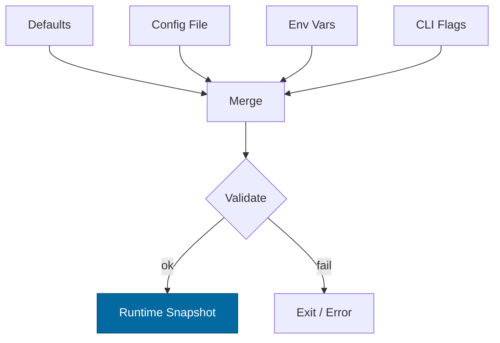

---

title: Configuration — omnigate
crate: omnigate (impl: svc-gateway)
owner: Stevan White
last-reviewed: 2025-10-07
status: draft
template_version: 1.1

---

# Configuration — omnigate

This document defines **all configuration** for `omnigate`, including sources,
precedence, schema (types/defaults), validation, feature flags, live-reload behavior,
and security implications. It complements `README.md` and `docs/SECURITY.md`.

> **Tiering:** `omnigate` is a **service** (Pillar 6: Ingress & Edge). It terminates TLS, enforces quotas with **DRR fair-queue**, and hydrates BFF views while brokering OAP/1 to downstream services. OAP body cap = **1 MiB**; typical streaming chunk ≈ **64 KiB**. TLS type is `tokio_rustls::rustls::ServerConfig`.

> **Crate alias note:** The “omnigate” blueprint is implemented by the **svc-gateway** crate in code. CLI examples use `omnigate` for clarity; in repos where the binary is exposed as `svc-gateway`, substitute accordingly.

---

## 1) Sources & Precedence (Authoritative)

Configuration may come from multiple sources. **Precedence (highest wins):**

1. **Process flags** (CLI)
2. **Environment variables**
3. **Config file** (e.g., `Config.toml` beside the binary)
4. **Built-in defaults** (hard-coded)

> On reload, recompute the **effective** config under the same precedence.
> **Supported file formats:** TOML (preferred), JSON (optional).
> **Path resolution for `--config` (if relative):** `./`, `$CWD`, crate dir.

---

## 2) Quickstart Examples

### 2.1 Minimal service start (dev-safe ports)

```bash
RUST_LOG=info
OMNIGATE_BIND_ADDR=127.0.0.1:9080      # dev-safe; prod may bind 0.0.0.0:9080 behind L4/L7
OMNIGATE_METRICS_ADDR=127.0.0.1:9090   # fixed port eases Prometheus scrape configs
cargo run -p omnigate
```

### 2.2 Config file (TOML)

```toml
# Config.toml
bind_addr     = "127.0.0.1:9080"
metrics_addr  = "127.0.0.1:9090"
max_conns     = 1024
read_timeout  = "5s"
write_timeout = "5s"
idle_timeout  = "60s"

[tls]
enabled   = false
# Preferred (secrets via env/inline):
# cert_pem = ""   # set via OMNIGATE_TLS_CERT_PEM
# key_pem  = ""   # set via OMNIGATE_TLS_KEY_PEM
# Optional (files if you must):
# cert_path = "/etc/ron/cert.pem"
# key_path  = "/etc/ron/key.pem"

[limits]
max_body_bytes       = "1MiB"
decompress_ratio_cap = 10

[quotas]
default_rps = 500
burst_rps   = 1000
per_ip_rps  = 50
per_cap_rps = 200

[fair_queue]               # Deficit Round Robin (DRR)
quantum_bytes = "64KiB"
classes      = ["anon","authed","internal"]
weights      = { anon=1, authed=5, internal=10 }
max_inflight = 512

[downstream]               # BFF hydration targets
index_url        = "http://127.0.0.1:9310"
storage_url      = "http://127.0.0.1:9320"
mailbox_url      = "http://127.0.0.1:9410"
overlay_url      = "http://127.0.0.1:9330"
dht_url          = "http://127.0.0.1:9340"
request_timeout  = "5s"

[auth]
mode            = "passport"           # "passport" | "none" (dev only)
passport_url    = "http://127.0.0.1:9250"
macaroon_header = "Authorization"

[amnesia]
enabled = false

[pq]
mode = "off"                            # "off" | "hybrid(x25519+kyber768)"
fallback_policy = "deny"                # "allow" | "deny" for non-PQ peers
```

### 2.3 CLI flags (override file/env)

```bash
cargo run -p omnigate -- \
  --bind 0.0.0.0:9080 \
  --metrics 127.0.0.1:9090 \
  --max-conns 2048 \
  --quota-default-rps 800 \
  --fq-quantum 64KiB \
  --strict-boot
```

---

## 3) Schema (Typed, With Defaults)

> **Prefix convention:** All env vars begin with `OMNIGATE_`.
> **Durations** accept `s`, `ms`, `m`, `h`. **Sizes** accept `B`, `KiB`, `MiB`.

| Key / Env Var                                                   | Type                                  | Default                        | Description                                             | Security Notes                                    |
| --------------------------------------------------------------- | ------------------------------------- | ------------------------------ | ------------------------------------------------------- | ------------------------------------------------- |
| `bind_addr` / `OMNIGATE_BIND_ADDR`                              | socket                                | `127.0.0.1:9080`               | HTTP ingress bind                                       | Public binds require threat review; prefer LB/L7. |
| `metrics_addr` / `OMNIGATE_METRICS_ADDR`                        | socket                                | `127.0.0.1:9090`               | Prometheus endpoint bind                                | Keep private.                                     |
| `max_conns` / `OMNIGATE_MAX_CONNS`                              | u32                                   | `1024`                         | Max concurrent connections                              | FD exhaustion guard.                              |
| `read_timeout` / `OMNIGATE_READ_TIMEOUT`                        | duration                              | `5s`                           | Per-request read timeout                                | DoS mitigation.                                   |
| `write_timeout` / `OMNIGATE_WRITE_TIMEOUT`                      | duration                              | `5s`                           | Per-request write timeout                               | DoS mitigation.                                   |
| `idle_timeout` / `OMNIGATE_IDLE_TIMEOUT`                        | duration                              | `60s`                          | Keep-alive idle shutdown                                | Resource hygiene.                                 |
| `limits.max_body_bytes` / `OMNIGATE_MAX_BODY_BYTES`             | size                                  | `1MiB`                         | Request payload cap (OAP parity)                        | Prevents giant bodies.                            |
| `limits.decompress_ratio_cap` / `OMNIGATE_DECOMPRESS_RATIO_CAP` | u32                                   | `10`                           | Max allowed decompression ratio                         | Zip-bomb guard.                                   |
| `tls.enabled` / `OMNIGATE_TLS_ENABLED`                          | bool                                  | `false`                        | Enable TLS                                              | Use **tokio-rustls**.                             |
| `tls.cert_pem` / `OMNIGATE_TLS_CERT_PEM`                        | string                                | `""`                           | Inline PEM for server cert (**wins over path**)         | Prefer env/secret store; never log.               |
| `tls.key_pem` / `OMNIGATE_TLS_KEY_PEM`                          | string                                | `""`                           | Inline PEM for private key (**wins over path**)         | Zeroize after parse.                              |
| `tls.cert_path` / `OMNIGATE_TLS_CERT_PATH`                      | path                                  | `""`                           | PEM cert path (fallback if no inline)                   | File perms 0644/0600.                             |
| `tls.key_path` / `OMNIGATE_TLS_KEY_PATH`                        | path                                  | `""`                           | PEM key path (fallback if no inline)                    | **0600**; zeroize buffer.                         |
| `uds.path` / `OMNIGATE_UDS_PATH`                                | path                                  | `""`                           | Optional Unix Domain Socket path                        | Dir 0700, sock 0600 + SO_PEERCRED.                |
| `uds.allow_uids` / `OMNIGATE_UDS_ALLOW_UIDS`                    | list<u32>                             | `[]`                           | PEERCRED allow-list                                     | Strict control.                                   |
| `quotas.default_rps` / `OMNIGATE_QUOTA_DEFAULT_RPS`             | u32                                   | `500`                          | Default RPS (token bucket)                              | Enforce early.                                    |
| `quotas.burst_rps` / `OMNIGATE_QUOTA_BURST_RPS`                 | u32                                   | `1000`                         | Burst RPS                                               | 429 on exceed.                                    |
| `quotas.per_ip_rps` / `OMNIGATE_PER_IP_RPS`                     | u32                                   | `50`                           | Per-IP ceiling (anon)                                   | Abuse control.                                    |
| `quotas.per_cap_rps` / `OMNIGATE_PER_CAP_RPS`                   | u32                                   | `200`                          | RPS per capability token                                |                                                   |
| `fair_queue.quantum_bytes` / `OMNIGATE_FQ_QUANTUM`              | size                                  | `64KiB`                        | DRR quantum per class                                   | Smoothness vs fairness.                           |
| `fair_queue.classes` / `OMNIGATE_FQ_CLASSES`                    | list<string>                          | `["anon","authed","internal"]` | Queue classes                                           | Classify by cap/path.                             |
| `fair_queue.weights.<class>` / `OMNIGATE_FQ_WEIGHT_<NAME>`      | u32                                   | class-specific                 | DRR weight per class                                    | Backpressure visibility.                          |
| `fair_queue.max_inflight` / `OMNIGATE_FQ_MAX_INFLIGHT`          | u32                                   | `512`                          | Per-instance inflight limit                             | `/readyz` sheds writes first.                     |
| `downstream.index_url` / `OMNIGATE_INDEX_URL`                   | url                                   | —                              | `svc-index` base URL                                    |                                                   |
| `downstream.storage_url` / `OMNIGATE_STORAGE_URL`               | url                                   | —                              | `svc-storage` base URL                                  |                                                   |
| `downstream.mailbox_url` / `OMNIGATE_MAILBOX_URL`               | url                                   | —                              | `svc-mailbox` base URL                                  |                                                   |
| `downstream.overlay_url` / `OMNIGATE_OVERLAY_URL`               | url                                   | —                              | `svc-overlay` base URL                                  |                                                   |
| `downstream.dht_url` / `OMNIGATE_DHT_URL`                       | url                                   | —                              | `svc-dht` base URL                                      |                                                   |
| `downstream.request_timeout` / `OMNIGATE_DOWNSTREAM_TIMEOUT`    | duration                              | `5s`                           | Per-request timeout to downstreams                      | Shed early on slow paths.                         |
| `auth.mode` / `OMNIGATE_AUTH_MODE`                              | enum(`passport`,`none`)               | `passport`                     | Capability verification mode                            | **Caps only**; no ambient trust.                  |
| `auth.passport_url` / `OMNIGATE_PASSPORT_URL`                   | url                                   | —                              | `svc-passport` verify/issue endpoint                    | Short-TTL tokens.                                 |
| `auth.macaroon_header` / `OMNIGATE_MACAROON_HEADER`             | string                                | `Authorization`                | Header carrying capability token                        | Never log token.                                  |
| `amnesia.enabled` / `OMNIGATE_AMNESIA`                          | bool                                  | `false`                        | RAM-only secrets mode                                   | No on-disk secrets.                               |
| `pq.mode` / `OMNIGATE_PQ_MODE`                                  | enum(`off`,`hybrid(x25519+kyber768)`) | `off`                          | PQ toggle; hybrid performs X25519 **and** Kyber-768 KEM | Interop risk if peers not PQ.                     |
| `pq.fallback_policy` / `OMNIGATE_PQ_FALLBACK`                   | enum(`allow`,`deny`)                  | `deny`                         | Accept classical-only peers when hybrid is set          | Metrics record fallback.                          |
| `log.format` / `OMNIGATE_LOG_FORMAT`                            | enum(`json`,`text`)                   | `json`                         | Structured logs                                         | JSON in prod.                                     |
| `log.level` / `OMNIGATE_LOG_LEVEL`                              | enum                                  | `info`                         | `trace`..`error`                                        | Avoid `trace` in prod.                            |
| `strict_boot` / `OMNIGATE_STRICT_BOOT`                          | bool                                  | `false`                        | Fail boot if any downstream health check fails          | Set via flag `--strict-boot`.                     |

**TLS material precedence:** `*_pem` (inline/env) ⟶ `*_path` (files) ⟶ disabled.

---

## 4) Validation Rules (Fail-Closed + Boot Health)

On startup or reload, apply the following:

* **TLS enabled ⇒** one of:

  * `cert_pem`+`key_pem` are non-empty and parse as valid PEM; or
  * `cert_path`+`key_path` exist; key not world-readable (**0600**).
* `max_conns > 0`, `limits.max_body_bytes ≥ 1 KiB`, `decompress_ratio_cap ≥ 1`.
* `fair_queue.quantum_bytes ∈ [4 KiB .. 1 MiB]`; weights ≥ 1; classes non-empty; `max_inflight > 0`.
* `auth.mode="passport"` ⇒ `passport_url` must be set.
* **Downstream health (boot):** resolve hostnames and attempt a **200/204** GET on `/healthz` (or **HEAD** if supported) with `downstream.request_timeout`.

  * If `strict_boot=false` (default): log warn and mark **degraded** on failures.
  * If `strict_boot=true` (flag/env): **fail boot** on any failure.
* **On violation:** log structured error; **exit non-zero** (service).
  **On reload failure:** keep serving with the **previous valid snapshot**; emit `reload_failed=1` metric and structured error.

---

## 5) Dynamic Reload

* **Trigger:** SIGHUP or bus event `ConfigUpdated { version }`.
* **Non-disruptive:** timeouts/quotas/log level.
* **Disruptive:** `bind_addr`, `tls.*`, `uds.*` (requires socket rebind).
* **Fail-safe:** if a disruptive change fails to bind/apply, **retain old sockets and old config**; discard the new snapshot; set `/readyz` to **degraded** until fixed.
* **Atomicity:** build a new snapshot; swap via mutex/ArcSwap without holding `.await`.
* **Audit:** emit `KernelEvent::ConfigUpdated { version }` + redacted diff (no secrets).

---

## 6) CLI Flags (Canonical)

```
--config <path>                 # Load Config.toml (low precedence vs env/flags)
--bind <ip:port>                # Override bind_addr
--metrics <ip:port>             # Override metrics_addr
--max-conns <num>
--read-timeout <dur>            # 5s, 250ms, etc.
--write-timeout <dur>
--idle-timeout <dur>
--tls                           # Shorthand: tls.enabled=true
--tls-cert <path>               # PEM cert path (overridden by OMNIGATE_TLS_CERT_PEM)
--tls-key <path>                # PEM key path  (overridden by OMNIGATE_TLS_KEY_PEM)
--uds <path>
--quota-default-rps <num>
--quota-burst-rps <num>
--per-ip-rps <num>
--per-cap-rps <num>
--fq-quantum <size>             # e.g., 64KiB
--fq-weight-<CLASS> <num>
--downstream-timeout <dur>
--strict-boot                   # Fail boot if any downstream health check fails
--log-format <json|text>
--log-level <trace|debug|info|warn|error>
```

*Example help excerpt:*

```
omnigate --help
  --config PATH   Load config file (TOML/JSON)
  --bind ADDR     Ingress bind, e.g., 0.0.0.0:9080
  --metrics ADDR  Metrics bind, e.g., 127.0.0.1:9090
  ...
```

---

## 7) Feature Flags (Cargo)

| Feature | Default | Effect                                         |
| ------- | ------: | ---------------------------------------------- |
| `tls`   |     off | Enable tokio-rustls server & TLS config keys   |
| `pq`    |     off | Enable hybrid KEM mode and `pq.*` knobs        |
| `cli`   |      on | Include CLI flag parsing                       |
| `kameo` |     off | Optional actor integration (supervision hooks) |

> TLS type must remain `tokio_rustls::rustls::ServerConfig`.

---

## 8) Security Implications

* **Ingress hardening:** apply quotas/DRR **before heavy work**; structured rejects (429/503) with metrics.
* **TLS:** prefer inline/env PEM; rotate without downtime; zeroize buffers after rustls config is built.
* **Capabilities only:** macaroon tokens via `svc-passport`; **no ambient trust**.
* **Amnesia mode:** RAM-only caches; no on-disk spill; zeroization obligations.
* **UDS:** enforce `0700/0600` + **SO_PEERCRED** allow-list.

---

## 9) Compatibility & Migration

* New keys land with **safe defaults**; renames keep env var alias ≥ 1 minor and warn.
* Breaking changes require **major** version and migration steps in `CHANGELOG.md`.
* Maintain deny-drift checks for OAP constants and ingress invariants.

---

## 10) Reference Implementation (Rust)

> Minimal `Config` with env + file + CLI.
> Enforce OAP constants (`max_body_bytes ≤ 1 MiB`; `decompress_ratio_cap ≤ 10×`).
> TLS server config type: **`tokio_rustls::rustls::ServerConfig`**.

```rust
use std::{collections::HashMap, net::SocketAddr, path::PathBuf, time::Duration};
use serde::{Deserialize, Serialize};

#[derive(Debug, Clone, Serialize, Deserialize)]
pub struct TlsCfg {
    pub enabled: bool,
    pub cert_path: Option<PathBuf>,
    pub key_path: Option<PathBuf>,
    #[serde(default)]
    pub cert_pem: Option<String>,   // zeroize after rustls config is built
    #[serde(default)]
    pub key_pem: Option<String>,    // zeroize after rustls config is built
}

#[derive(Debug, Clone, Serialize, Deserialize)]
pub struct Limits {
    #[serde(default = "default_body_bytes")]
    pub max_body_bytes: u64, // bytes
    #[serde(default = "default_decompress_ratio")]
    pub decompress_ratio_cap: u32,
}
fn default_body_bytes() -> u64 { 1 * 1024 * 1024 }
fn default_decompress_ratio() -> u32 { 10 }

#[derive(Debug, Clone, Serialize, Deserialize)]
pub struct Quotas {
    pub default_rps: u32,
    pub burst_rps: u32,
    pub per_ip_rps: u32,
    pub per_cap_rps: u32,
}

#[derive(Debug, Clone, Serialize, Deserialize)]
pub struct FairQueue {
    pub quantum_bytes: u64,            // e.g., 64 * 1024
    pub classes: Vec<String>,          // ["anon","authed","internal"]
    pub weights: HashMap<String, u32>,
    pub max_inflight: u32,
}

#[derive(Debug, Clone, Serialize, Deserialize)]
pub struct Downstream {
    pub index_url: Option<String>,
    pub storage_url: Option<String>,
    pub mailbox_url: Option<String>,
    pub overlay_url: Option<String>,
    pub dht_url: Option<String>,
    #[serde(with = "humantime_serde", default = "default_5s")]
    pub request_timeout: Duration,
}

#[derive(Debug, Clone, Serialize, Deserialize)]
pub struct AuthCfg {
    pub mode: String,                  // "passport" | "none"
    pub passport_url: Option<String>,
    pub macaroon_header: String,
}

#[derive(Debug, Clone, Serialize, Deserialize)]
pub struct PqCfg {
    pub mode: Option<String>,          // "off" | "hybrid(x25519+kyber768)"
    pub fallback_policy: Option<String>, // "allow" | "deny"
}

#[derive(Debug, Clone, Serialize, Deserialize)]
pub struct Config {
    pub bind_addr: Option<SocketAddr>,     // default 127.0.0.1:9080 (set in loader)
    pub metrics_addr: Option<SocketAddr>,  // default 127.0.0.1:9090 (set in loader)
    #[serde(default = "default_max_conns")]
    pub max_conns: u32,
    #[serde(with = "humantime_serde", default = "default_5s")]
    pub read_timeout: Duration,
    #[serde(with = "humantime_serde", default = "default_5s")]
    pub write_timeout: Duration,
    #[serde(with = "humantime_serde", default = "default_60s")]
    pub idle_timeout: Duration,
    #[serde(default)]
    pub tls: TlsCfg,
    #[serde(default)]
    pub limits: Limits,
    pub quotas: Quotas,
    pub fair_queue: FairQueue,
    pub downstream: Downstream,
    pub auth: AuthCfg,
    #[serde(default)]
    pub amnesia: Option<bool>,
    #[serde(default)]
    pub pq: Option<PqCfg>,
    #[serde(default)]
    pub strict_boot: Option<bool>,
}
fn default_5s() -> Duration { Duration::from_secs(5) }
fn default_60s() -> Duration { Duration::from_secs(60) }
fn default_max_conns() -> u32 { 1024 }

impl Config {
    pub fn validate(&self) -> anyhow::Result<()> {
        use anyhow::{bail, Context};
        if self.max_conns == 0 { bail!("max_conns must be > 0"); }
        if self.limits.max_body_bytes < 1024 { bail!("limits.max_body_bytes too small"); }
        if self.limits.decompress_ratio_cap == 0 { bail!("limits.decompress_ratio_cap must be >= 1"); }

        if self.fair_queue.quantum_bytes < 4 * 1024 || self.fair_queue.quantum_bytes > 1 * 1024 * 1024 {
            bail!("fair_queue.quantum_bytes out of range (4KiB..1MiB)");
        }
        if self.fair_queue.max_inflight == 0 { bail!("fair_queue.max_inflight must be > 0"); }
        if self.quotas.default_rps == 0 { bail!("quotas.default_rps must be > 0"); }

        if self.tls.enabled {
            let pem_ok = self.tls.cert_pem.as_ref().map(|s| !s.is_empty()).unwrap_or(false)
                && self.tls.key_pem.as_ref().map(|s| !s.is_empty()).unwrap_or(false);
            let path_ok = self.tls.cert_path.as_ref().map(|p| p.exists()).unwrap_or(false)
                && self.tls.key_path.as_ref().map(|p| p.exists()).unwrap_or(false);
            if !(pem_ok || path_ok) {
                bail!("TLS enabled but no cert/key provided (pem or files)");
            }
        }

        if self.auth.mode == "passport" {
            self.auth.passport_url.as_ref().context("auth.passport_url required when auth.mode=passport")?;
        }
        Ok(())
    }

    /// Best-effort downstream health probe. If `strict_boot==true`, return Err on any failure.
    pub async fn probe_downstreams(&self) -> anyhow::Result<()> {
        // Pseudocode: use reqwest with timeout self.downstream.request_timeout
        // HEAD/GET /healthz for each non-None URL; collect failures.
        // If strict_boot==true and any fail => Err; else log warnings.
        Ok(())
    }

    /// After building rustls config, call this to wipe inline PEMs from memory.
    pub fn zeroize_tls_inline(&mut self) {
        #[cfg(feature = "zeroize")]
        {
            use zeroize::Zeroize;
            if let Some(s) = &mut self.tls.cert_pem { s.zeroize(); }
            if let Some(s) = &mut self.tls.key_pem  { s.zeroize(); }
        }
        #[cfg(not(feature = "zeroize"))]
        {
            self.tls.cert_pem = None;
            self.tls.key_pem = None;
        }
    }
}
```

---

## 11) Test Matrix

| Scenario                                     | Expected Outcome                                                |
| -------------------------------------------- | --------------------------------------------------------------- |
| Missing `Config.toml`                        | Start with defaults; warn                                       |
| Invalid `bind_addr`                          | Fail fast with explicit error                                   |
| TLS enabled but no keys                      | Fail fast                                                       |
| Inline TLS PEM set, file paths empty         | Boot OK; certs parsed from env; PEM buffers zeroized after load |
| Body over `max_body_bytes`                   | `413 Payload Too Large`                                         |
| Ratio > `decompress_ratio_cap`               | `400 Bad Request` + metric                                      |
| Quota breach (RPS)                           | `429 Too Many Requests` + reason counter                        |
| Inflight > `max_inflight`                    | `503 Service Unavailable`; `/readyz` sheds writes               |
| Downstream health fails, `strict_boot=false` | Boot OK; log warn; `/readyz` degraded=true                      |
| Downstream health fails, `--strict-boot`     | Boot **fails** with clear error                                 |
| Reload introduces bad TLS key                | Old snapshot retained; `reload_failed=1`; error log             |
| PQ hybrid with non-PQ peer, fallback=`deny`  | Handshake refused; 426/400 with reason                          |
| PQ hybrid with non-PQ peer, fallback=`allow` | Proceed classical; metric `pq_fallback_total{peer=...}`         |

---

## 12) Mermaid — Config Resolution Flow



---

## 13) Operational Notes

* Keep **prod config in version control** (private repo/secret store). Prefer **env vars** for secrets; mount read-only.
* **Networking:** expose `bind_addr` behind L4/L7; keep `/metrics` private; egress to downstreams should be retried with budgets.
* **Suggested alerts (starter thresholds):**

  * `rejected_total{reason="quota"} > 1% for 5m`
  * `reload_failed_total > 0` (page)
  * `readyz_degraded == 1 for 5m`
  * `fq_inflight{class="anon"} == max_inflight for 10m`
  * `downstream_errors_total{service=*} > 0.5%` or `p95_downstream_latency > budget`
* **Budgets (tune per env):** downstream p95 ≤ **250 ms**; end-to-end p95 ≤ **300 ms** nominal.
* **Metrics to expose:** `rejected_total{reason}`, `fq_inflight{class}`, `quota_tokens{class}`, `pq_fallback_total`, `reload_failed_total`, `downstream_latency_seconds{service}`.

---

**Canon-fit summary:** Hardened defaults (fixed dev ports), secrets via env with zeroization, strict boot option, fail-safe reload, concrete PQ hybrid, and ops-ready alerts—all while preserving the original IDB invariants (OAP caps, DRR quotas, capability-first auth, amnesia mode).
