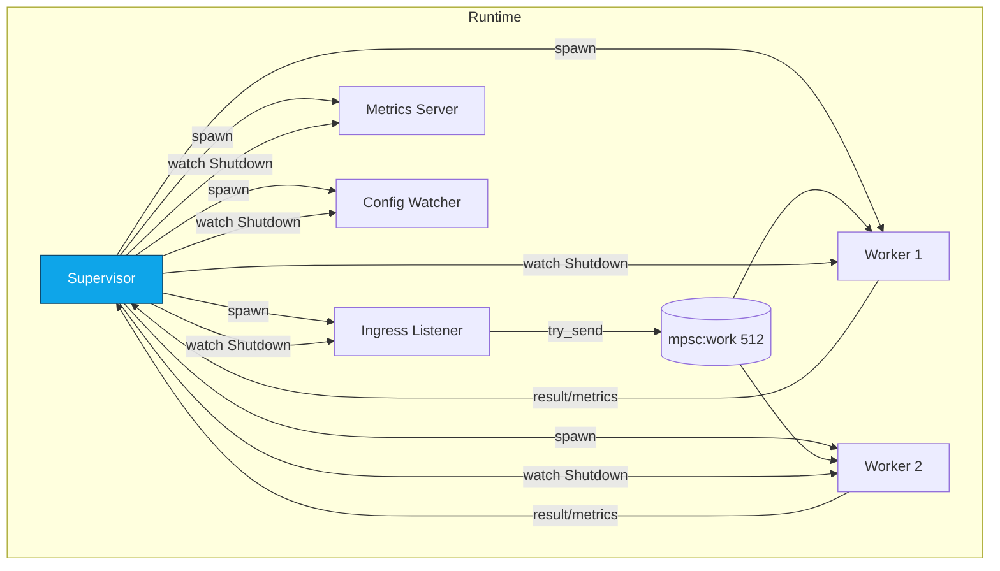
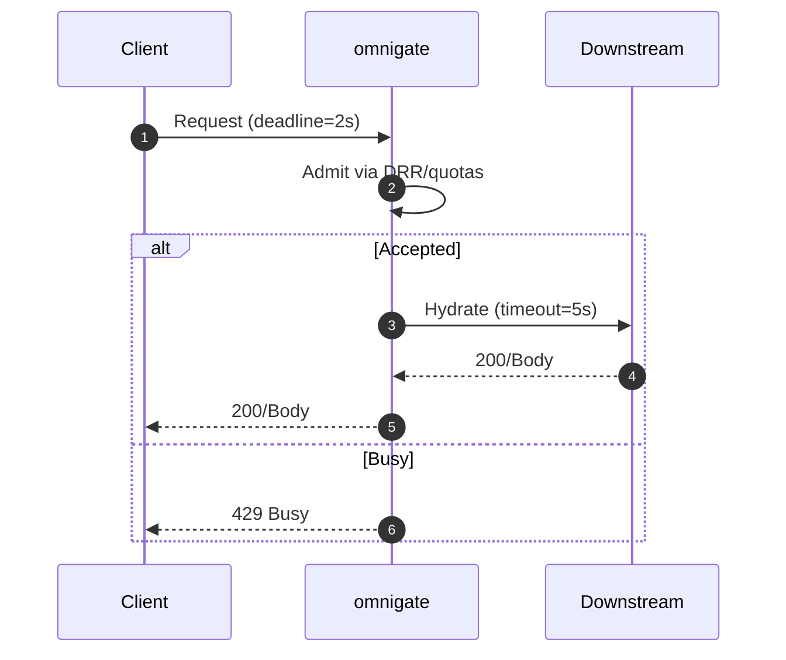
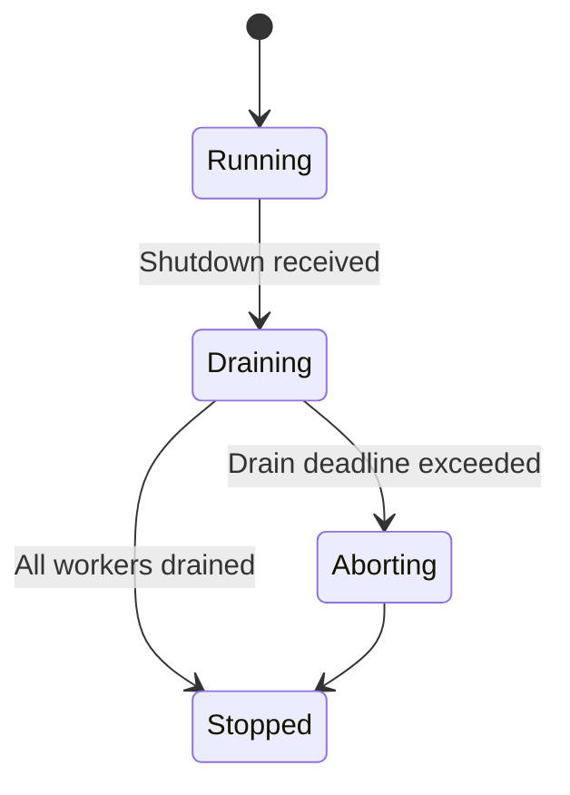
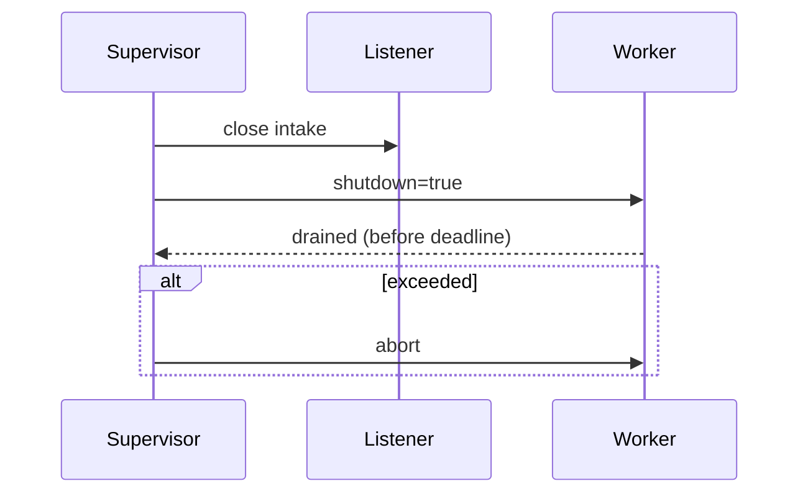
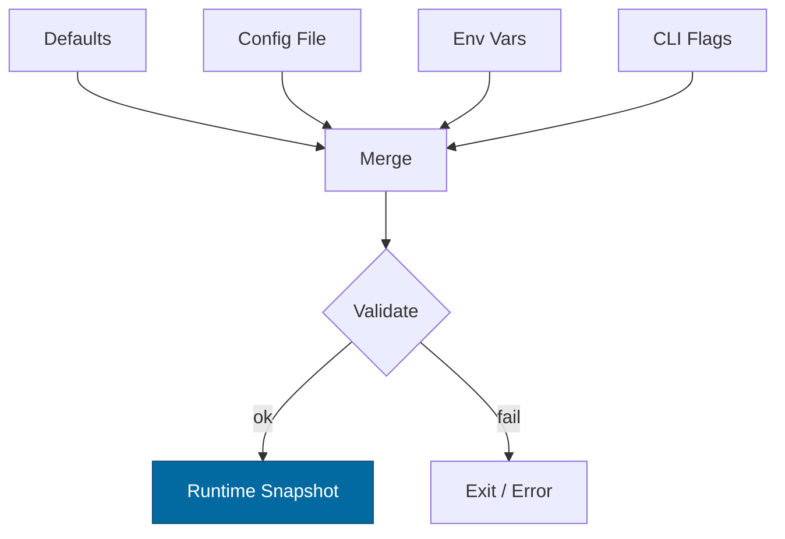

# Combined Markdown

_Source directory_: `crates/omnigate/docs`  
_Files combined_: 12  
_Recursive_: 0

---

### Table of Contents

- API.MD
- CONCURRENCY.MD
- CONFIG.MD
- GOVERNANCE.MD
- IDB.md
- INTEROP.MD
- OBSERVABILITY.MD
- PERFORMANCE.MD
- QUANTUM.MD
- RUNBOOK.MD
- SECURITY.MD
- TESTS.MD

---

## API.MD
_File 1 of 12_

---

title: API Surface & SemVer Reference — omnigate
status: draft
msrv: 1.80.0
last-updated: 2025-10-07
audience: contributors, auditors, API consumers
-----------------------------------------------

# API.md — omnigate (impl: `svc-gateway`)

## 0. Purpose

This document captures the **public API surface** of the gateway service:

* Snapshot of exported **Rust items** (if any), **CLI flags**, and **HTTP endpoints**.
* SemVer discipline (what is breaking vs. additive).
* CHANGELOG alignment and CI enforcement (`cargo public-api`, diff gates).
* Serves as the **spec** for external consumers.

> Note: omnigate is a **service crate**. Its primary public API is **HTTP** (+ CLI). The Rust surface is intentionally minimal and not intended for downstream linkage.

---

## 1. Public API Surface

### 1.1 Rust surface (bin-oriented)

The binary does not expose a stable library API. Internal modules are `pub(crate)` unless required by integration tests. The only intended “public” Rust boundary is the **binary entrypoint**.

If/when a small helper library is exposed (e.g., types for tests), document it here and snapshot with `cargo public-api`.

#### Current (expected) `cargo public-api --simplified` output

```text
# omnigate is a binary crate; no stable public items are exported.
# If a companion lib target exists, paste its symbol list here.
```

> CI will still run `cargo public-api` to ensure no unintended symbols leak.

### 1.2 CLI surface (user-facing)

```
omnigate
  --config <path>                 Load Config.toml (TOML/JSON)
  --bind <ip:port>                Ingress bind (default 127.0.0.1:9080)
  --metrics <ip:port>             Metrics bind (default 127.0.0.1:9090)
  --max-conns <num>               Max concurrent connections
  --read-timeout <dur>            e.g., 5s, 250ms
  --write-timeout <dur>
  --idle-timeout <dur>
  --tls                           Enable TLS
  --tls-cert <path>               PEM cert path (overridden by OMNIGATE_TLS_CERT_PEM)
  --tls-key <path>                PEM key path  (overridden by OMNIGATE_TLS_KEY_PEM)
  --uds <path>                    Unix Domain Socket path (optional)
  --quota-default-rps <num>
  --quota-burst-rps <num>
  --per-ip-rps <num>
  --per-cap-rps <num>
  --fq-quantum <size>             e.g., 64KiB
  --fq-weight-<CLASS> <num>       anon|authed|internal
  --downstream-timeout <dur>
  --strict-boot                   Fail boot if any downstream health check fails
  --log-format <json|text>
  --log-level <trace|debug|info|warn|error>
```

Environment variables mirror flags (prefix `OMNIGATE_…`). See `docs/CONFIG.md` for authoritative schema.

### 1.3 HTTP API surface

The gateway provides a small, stable ingress surface (versioned under **`/v1`**). It **brokers** requests to internal services (index/storage/mailbox/overlay/dht/passport) and enforces admission (quotas/DRR) and auth (macaroon capabilities).

#### Common

* **Scheme**: `https://` (recommended) or `http://` in dev.
* **Auth**: capability token in header (default `Authorization: Bearer <macaroon>`; header name configurable).
* **Correlation**: accepts `X-Corr-ID`, returns `X-Corr-ID`; emits `X-Request-ID` per hop.
* **Compression**: request decompression is allowed with **ratio cap ≤ 10×** and **absolute body cap ≤ 1MiB**.
* **Content Types**: `application/json` (primary); opaque payloads proxied as-is for storage.
* **Errors**: JSON `{ "error": "<code>", "reason": "<human-friendly>", "corr_id": "<id>" }`.
* **Rate limiting / backpressure**: `429 Too Many Requests` with optional `Retry-After` seconds.

##### Standard endpoints (operational)

* `GET /healthz` → `200 OK` liveness.
* `GET /readyz` → `200 OK` ready, or `503` with body `{ready:false, degraded:true, missing:[…], retry_after:N}`.
* `GET /metrics` → Prometheus text (binds to localhost/private).

##### Application endpoints (representative; keep stable names/forms)

> These are **representative** path shapes used by the BFF hydration flows. Actual downstream composition may evolve; contract stability is maintained at the gateway boundary.

* **Objects (read-only via gateway):**

  * `GET /v1/o/{content_id}` → fetch object (proxy to storage).

    * Headers:

      * Request: `Range` (optional), `Accept`
      * Response: `Content-Length`, `ETag`, `Cache-Control`, `Accept-Ranges`
    * Status: `200`, `206`, `404`, `416`
* **Index lookups (naming/metadata):**

  * `GET /v1/index/{name}` → resolve to content_id / metadata (proxy to index).

    * Query: `?version=latest|<semver>`
    * Status: `200`, `404`
* **Mailbox (signals/messages):**

  * `GET /v1/mailbox/{channel}` → receive (long poll with timeout budget).
  * `POST /v1/mailbox/{channel}` → send (idempotency-key supported).

    * Status: `200`, `202`, `400`, `401`, `403`, `404`, `409`
* **Overlay/DHT service lookups (read-only via gateway):**

  * `GET /v1/dht/lookup?key=<hex>` → returns service records.

    * Status: `200`, `404`, `503(degraded)`

> **Mutations** (writes) can be proxied but may be **shed first** under degraded mode per readiness policy.

#### Headers

* **Request (accepted)**:

  * `Authorization` (macaroon) — or configured `OMNIGATE_MACAROON_HEADER`.
  * `X-Corr-ID` — correlation id (ULID/UUID). If missing, generated and echoed.
  * `X-Request-ID` — optional; gateway sets one if absent.
  * `Accept`, `Accept-Encoding`, `Range`, `If-None-Match` (proxied).
* **Response (always)**:

  * `X-Corr-ID`, `X-Request-ID`
  * Optional: `Retry-After` on 429/503
  * Storage reads: `ETag`, `Content-Range`, `Content-Length`, `Accept-Ranges`

#### Error codes (canonical)

| HTTP | `error` code             | When                                          |
| ---- | ------------------------ | --------------------------------------------- |
| 400  | `bad_request`            | Malformed input, invalid headers              |
| 401  | `unauth`                 | Missing/invalid macaroon                      |
| 403  | `forbidden`              | Capability lacks required caveats/scope       |
| 404  | `not_found`              | Object/index/mailbox missing                  |
| 413  | `body_cap`               | Body exceeds 1MiB cap                         |
| 415  | `unsupported_media_type` | Codec not allowed                             |
| 416  | `range_not_satisfiable`  | Invalid range                                 |
| 429  | `quota` or `busy`        | Admission/DRR throttling                      |
| 500  | `internal`               | Unhandled downstream error                    |
| 502  | `bad_gateway`            | Downstream non-success / protocol mismatch    |
| 503  | `degraded`               | Readiness failing; strict boot/reload failure |
| 504  | `downstream_timeout`     | Exceeded downstream deadline                  |

**Mapping to metrics:** every non-2xx increments `rejected_total{reason=<code>}` (see Observability).

---

## 2. SemVer Discipline

### 2.1 Service (HTTP) contract

* **Versioning strategy**: Path-based (`/v1/...`). Non-breaking **additive** changes (new optional query params/headers, new endpoints) **do not** bump major.
* **Breaking changes** require bump to `/v2`:

  * Removing/renaming endpoints or fields.
  * Changing semantics of existing fields/headers.
  * Tightening validation that rejects previously-accepted requests.
  * Changing default auth header name without alias window.

**Additive (Non-Breaking):**

* New endpoints under `/v1` that do not alter existing behavior.
* New response fields (must be optional/ignorable by clients).
* New `reason` values **only if** documented and added to metrics/logs lists.

**Patch-level:**

* Response formatting fixes, docstrings, perf improvements that don’t change wire behavior.

### 2.2 Rust (binary/lib) SemVer

* **Binary-only**: no stable Rust API is promised.
* If a companion lib is exposed in the future:

  * Mark enums `#[non_exhaustive]`, and structs with additive fields also `#[non_exhaustive]`.
  * Introduce traits with sealed pattern to prevent breaking downstream impls.

---

## 3. Stability Guarantees

* **MSRV**: 1.80.0.
* **No `unsafe`** in public-facing code (crate-level `#![forbid(unsafe_code)]`).
* **Config names** are part of operational API; renames require deprecation aliases ≥ 1 minor.
* **Headers**: `X-Corr-ID` and `Authorization` (or configured alternative) are stable.
* **Body limits & decompress caps** are part of the security contract (see Security/Config).

---

## 4. Invariants

* Gateway remains **stateless** (beyond counters/cache of verifier keys).
* **Admission first**: requests are admitted/rejected before heavy work (auth/decompress/downstream).
* **Deterministic rejection**: identical request shape under same load produces same status & `reason`.
* **No PII** in logs/labels; correlation IDs are synthetic.

---

## 5. Tooling

* **cargo public-api**: detect accidental library symbol exposure.

  ```bash
  cargo public-api --simplified --deny-changes
  ```
* **cargo semver-checks** (if companion lib appears later).
* **OpenAPI** (optional export): lightweight spec in `/docs/openapi/omnigate.v1.yaml` (kept in sync with this doc).

---

## 6. CI & Gates

* Pipeline runs:

  * `cargo public-api` (bin should have no exported items; companion lib, if any, must match snapshot).
  * Golden tests for **error mapping** (`status` ↔ `reason` ↔ metrics/logs).
  * Contract tests for `/healthz`, `/readyz`, representative `/v1` endpoints.
* Fails if:

  * Public API (lib) diff is detected without CHANGELOG entry.
  * New `reason` value added without doc & metric wiring.
  * OpenAPI diff (if present) lacks CHANGELOG entry.

---

## 7. Acceptance Checklist (DoD)

* [ ] Snapshot of current **Rust public API** stored under `/docs/api-history/omnigate/<rev>.txt` (even if empty).
* [ ] HTTP endpoints documented here and (optionally) in `/docs/openapi/omnigate.v1.yaml`.
* [ ] CI gate (`cargo public-api`) green.
* [ ] CHANGELOG updated for any surface change (CLI flags, headers, endpoint semantics).
* [ ] Integration tests cover new/changed endpoints & error mapping.

---

## 8. Appendix

### 8.1 Examples

**Fetch object (range read)**

```bash
curl -sS https://gw.example.com/v1/o/ba5e... \
  -H "Authorization: Bearer <cap>" \
  -H "X-Corr-ID: 01J9Z7..." \
  -H "Range: bytes=0-65535" -D-
```

**Index resolve**

```bash
curl -sS "https://gw.example.com/v1/index/app-config?version=latest" \
  -H "Authorization: Bearer <cap>"
```

**Mailbox send (idempotent)**

```bash
curl -X POST https://gw.example.com/v1/mailbox/alerts \
  -H "Authorization: Bearer <cap>" \
  -H "Idempotency-Key: 01J9Z7..." \
  -H "Content-Type: application/json" \
  --data '{"msg":"deploy-started"}'
```

### 8.2 Error body schema

```json
{
  "error": "quota",
  "reason": "rate limited (global)",
  "corr_id": "01J9Z7K9WZJ6Y8..."
}
```

### 8.3 References

* Rust SemVer: [https://doc.rust-lang.org/cargo/reference/semver.html](https://doc.rust-lang.org/cargo/reference/semver.html)
* cargo-public-api: [https://github.com/Enselic/cargo-public-api](https://github.com/Enselic/cargo-public-api)
* cargo-semver-checks: [https://github.com/obi1kenobi/cargo-semver-checks](https://github.com/obi1kenobi/cargo-semver-checks)

### 8.4 History

* `2025-10-07`: Initial v1 contract recorded; explicit canonical `reason` set; clarified `/v1` path versioning and readiness semantics.

---

**Summary:**
omnigate’s API is **HTTP-first**, small, and rigorously versioned. Rejections are deterministic and observable; additive growth is easy; breaking changes are explicit via `/v2`. The binary intentionally avoids exporting a public Rust surface; any future lib must obey `#[non_exhaustive]` and SemVer gates.


---

## CONCURRENCY.MD
_File 2 of 12_

---

title: Concurrency Model — omnigate
crate: omnigate (impl: svc-gateway)
owner: Stevan White
last-reviewed: 2025-10-07
status: draft
template_version: 1.1
msrv: 1.80.0
tokio: "1.x (pinned at workspace root)"
loom: "0.7+ (dev-only)"
lite_mode: "N/A — service crate with background tasks"
------------------------------------------------------

# Concurrency Model — omnigate

This document makes the concurrency rules **explicit**: tasks, channels, locks, shutdown, timeouts,
and validation (property/loom/TLA+). It complements `docs/SECURITY.md`, `docs/CONFIG.md`,
and the crate’s `README.md` and `IDB.md`.

> **Golden rule:** never hold a lock across `.await` in supervisory or hot paths.

> **Alias note:** The “omnigate” blueprint is implemented by the **svc-gateway** crate in code. Concurrency applies identically.

---

## 0) Lite Mode (for tiny lib crates)

N/A (service crate).

---

## 1) Invariants (MUST)

* [ ] **No lock across `.await`**. If unavoidable, split the critical section and move awaited work outside the guard.
* [ ] **Single writer** per mutable resource; readers use snapshots (`ArcSwap`, `watch`) or short read guards.
* [ ] **Bounded channels** only (mpsc/broadcast) with explicit overflow policy and metrics.
* [ ] **Explicit timeouts** on all I/O and RPCs (ingress, downstream); fail-fast with typed errors.
* [ ] **Cooperative cancellation**: every `.await` is cancel-safe or guarded by `tokio::select!`.
* [ ] **Graceful shutdown**: observe `Shutdown` signal; stop intake; drain within deadline; abort stragglers; emit metrics.
* [ ] **No blocking syscalls** on the async runtime; use `spawn_blocking` only for CPU/FS hotspots (PEM parse, decompression).
* [ ] **No task leaks**: all tasks are owned and joined or deliberately detached with rationale + metric.
* [ ] **Backpressure over buffering**: prefer `Busy`/`429` and mpsc `try_send` over unbounded queues.
* [ ] **Framing**: HTTP request body limits enforced; OAP/1 bridging honors 1 MiB body cap and 10× decompress cap.
* [ ] **Admission before work**: quotas + DRR classify and throttle **before** expensive actions (auth, hydrate, decompress).
* [ ] **Async Drop**: teardown is via async `close()/shutdown()`; `Drop` never blocks.

---

## 2) Runtime Topology

**Tokio runtime:** multi-threaded scheduler. All long-lived tasks are supervised.

**Long-lived tasks (owners in parentheses):**

* **Supervisor** (kernel): starts tasks, owns shutdown, aggregates joins, emits `KernelEvent`s.
* **Ingress/Listener** (HTTP/axum): accepts connections; performs admission (quota/DRR); enqueues units of work.
* **Worker Pool** (N×): executes request units (auth → route → hydrate downstream → respond).
* **Metrics Server**: serves `/metrics`, `/healthz`, `/readyz`.
* **Config Watcher**: applies dynamic config; publishes to `ArcSwap<Config>` and `watch`.
* **Passport Cache Refresher** (optional): keeps verifier keys/cert chains warm.
* **Housekeeping**: trims stale counters, rotates DRR statistics.



**Text description:** The Supervisor spawns Listener, Workers, Metrics, and Config Watcher. Listener places work into a bounded mpsc queue. Workers consume from the queue. All tasks subscribe to a shutdown `watch`.

---

## 3) Channels & Backpressure

**Inventory (all bounded):**

| Name          | Kind      | Capacity | Producers → Consumers | Backpressure Policy                            | Drop/Reject Semantics                       |
| ------------- | --------- | -------: | --------------------- | ---------------------------------------------- | ------------------------------------------- |
| `work_tx`     | `mpsc`    |      512 | Listener → WorkerPool | `try_send`; if full: return `Busy`/HTTP 429    | Increment `busy_rejections_total{endpoint}` |
| `events_tx`   | broadcast |     1024 | Supervisor → others   | Lag counter; drop oldest for slow subscribers  | `bus_lagged_total` + warn                   |
| `shutdown_rx` | watch     |        1 | Supervisor → N        | Last-write-wins                                | N/A                                         |
| `cfg_rx`      | watch     |        1 | ConfigWatcher → N     | Last-write-wins; atomic snapshot via `ArcSwap` | N/A                                         |

**Guidelines**

* Listener never awaits downstream while holding queue capacity hostage: it **admits or rejects** quickly.
* Prefer **class-local queues** if per-class isolation is required (DRR); otherwise keep a single ordered queue with class tags.

---

## 4) Locks & Shared State

**Allowed (short, local):**

* `Mutex/RwLock` for small metadata and counters; **no `.await` under guard**.
* `ArcSwap<Config>` for zero-lock reader snapshots; updates are atomic.
* Per-connection/request state is **owned** by its task; cross-task transfer via messages.

**Forbidden:**

* Locks across `.await`.
* Nested locks without a documented **hierarchy**.

**Hierarchy (if unavoidable):**

1. `state_meta` (small, fast)
2. `routing_table` (read-mostly)
3. `counters` (atomic preferred)

---

## 5) Timeouts, Retries, Deadlines

* **Ingress I/O:** `read=5s`, `write=5s`, `idle=60s` (overridable by config).
* **Downstream RPC:** per-request **deadline**; retry only idempotent ops with jittered backoff (50–100 ms, cap 2 s, max 3 tries). No retries on non-idempotent writes.
* **Admission:** DRR/quotas decisions within **1 ms** typical; on overload, prefer `Busy`/`429` over queuing.
* **Circuit breaker (optional):** open on 5xx/timeout rates; half-open probes in background.



**Text:** Client sends a request with a deadline. Gateway quickly admits or rejects. On accept, a downstream call is made with a capped timeout; otherwise `429 Busy`.

---

## 6) Cancellation & Shutdown

* **Signal:** `KernelEvent::Shutdown` or `wait_for_ctrl_c()`.
* **Propagation:** `tokio::select! { _ = shutdown.changed() => ..., _ = job = rx.recv() => ... }`.
* **Sequence:** stop intake (close `work_tx`), drain workers within `drain_deadline` (1–5 s), then abort laggards.
* **Metrics:** `tasks_aborted_total{kind}`, `tasks_canceled_total`, `/readyz` switches to **degraded** during drain.



---

## 7) I/O & Framing

* **HTTP/1.1 + TLS (rustls)** via axum/hyper; enforce:

  * `max_body_bytes ≤ 1 MiB`
  * `decompress_ratio_cap ≤ 10×`
* **Read/write:** use `AsyncReadExt/AsyncWriteExt`; call `.shutdown().await` on success/error paths.
* **Partial reads:** handle split frames; never assume single `read` completes body.
* **Checksum/validation:** honor protocol-specific checks when bridging OAP.

---

## 8) Error Taxonomy (Concurrency-Relevant)

| Error          | Surface              | Retry?       | Metric                            | Notes                              |
| -------------- | -------------------- | ------------ | --------------------------------- | ---------------------------------- |
| `Busy`         | Admission/Queue full | Caller maybe | `busy_rejections_total{endpoint}` | Deterministic fast-fail            |
| `Timeout`      | I/O or RPC deadline  | Sometimes    | `io_timeouts_total{op}`           | Attach `op` (`read`,`write`,`rpc`) |
| `Canceled`     | Shutdown/Cancel      | No           | `tasks_canceled_total`            | Cooperative via `select!`          |
| `Lagging`      | Broadcast overflow   | No           | `bus_lagged_total`                | Slow consumer detection            |
| `BackoffRetry` | Transient RPC error  | Internal     | `backoff_retries_total{op}`       | Bounded, idempotent only           |

---

## 9) Metrics (Concurrency Health)

* `queue_depth{queue}` gauge; sampled every 250 ms.
* `queue_dropped_total{queue}` counter (shed at admission).
* `tasks_spawned_total{kind}` / `tasks_aborted_total{kind}`.
* `io_timeouts_total{op}` and `downstream_latency_seconds{service}` histogram.
* `busy_rejections_total{endpoint}` counter.
* DRR visibility: `fq_inflight{class}`, `fq_tokens{class}`, `rejected_total{reason}`.

---

## 10) Validation Strategy

**Unit / Property**

* Admission law: if `work_tx` full → `Busy` returned and `queue_dropped_total` increments.
* Deadlines: end-to-end ≤ configured; tolerance ±5%.
* Lock discipline: debug assertions for “await while holding lock” (tests + clippy lint).

**Loom (dev-only)**

* Model: Producer (Listener) → bounded queue → Consumer (Worker) with shutdown.
* Assert: no deadlocks; shutdown always observed; no double-drop; queues never exceed capacity.

**Fuzz**

* HTTP body boundaries, decompression ratio edges, malformed headers.

**Chaos / Soak**

* Kill workers under load; verify `/readyz` flips, drains within budget, recovery with exponential backoff.
* Overload tests: saturate class “anon”; ensure “internal” still proceeds (weights).

**TLA+ (optional)**

* Model DRR token accounting and fairness; prove no starvation given positive weights.

---

## 11) Code Patterns (Copy-Paste)

**Bounded mpsc with `try_send` (admission):**

```rust
match work_tx.try_send(job) {
    Ok(_) => {}
    Err(tokio::sync::mpsc::error::TrySendError::Full(_)) => {
        metrics::busy_rejections_total().inc();
        return Err(Error::Busy);
    }
    Err(e) => return Err(e.into()),
}
```

**Cooperative shutdown with `select!`:**

```rust
tokio::select! {
    _ = shutdown.changed() => { break; }
    maybe_job = work_rx.recv() => {
        let Some(job) = maybe_job else { break; };
        if let Err(err) = handle(job, cfg_snapshot.clone()).await {
            tracing::warn!(%err, "job failed");
        }
    }
}
```

**No lock across `.await`:**

```rust
let param = {
    let g = state.lock();   // short critical section
    g.compute_param()
};
do_async(param).await;
```

**Dynamic config snapshot (read-optimized):**

```rust
use arc_swap::ArcSwap;
static CONFIG: ArcSwap<Config> = ArcSwap::from_pointee(Config::default());
let cfg = CONFIG.load_full();   // Arc<Config> snapshot, no locks
```

**Spawn + join tracking:**

```rust
let (task_done_tx, mut task_done_rx) = tokio::sync::mpsc::channel::<TaskExit>(64);
let handle = tokio::spawn(async move { run_worker(...).await; let _ = task_done_tx.send(TaskExit::Worker).await; });
// on shutdown: let _ = handle.await;
```

**Timeout guard:**

```rust
let res = tokio::time::timeout(cfg.downstream.request_timeout, call_downstream(req)).await;
```

**Async Drop pattern:**

```rust
pub struct Client { inner: Option<Conn> }
impl Client {
  pub async fn shutdown(&mut self) -> anyhow::Result<()> {
    if let Some(mut c) = self.inner.take() { c.shutdown().await?; }
    Ok(())
  }
}
impl Drop for Client {
  fn drop(&mut self) {
    if self.inner.is_some() {
      tracing::debug!("Client dropped without shutdown(); resources reclaimed asynchronously");
    }
  }
}
```

---

## 12) Configuration Hooks (Quick Reference)

* `max_conns`, `read_timeout`, `write_timeout`, `idle_timeout`.
* Channel capacities (`work=512`, `events=1024`) — keep in sync with `CONFIG.md`.
* `drain_deadline` (shutdown budget).
* DRR knobs: `fair_queue.quantum_bytes`, `weights`, `max_inflight`.
* Retry/backoff window; circuit breaker toggles.

---

## 13) Known Trade-offs / Nonstrict Areas

* **Drop policy:** We prefer **reject-new** (fast `Busy`) instead of **drop-oldest** for `work_tx` to preserve request ordering and caller determinism.
* **Fairness vs latency:** Larger DRR quantum improves throughput but can increase tail latency for low-weight classes; tune per env.
* **Strict boot:** Health-checking downstreams on boot reduces surprise errors but may delay startup in degraded environments.

---

## 14) Mermaid Diagrams (REQUIRED)

### 14.1 Task & Queue Topology

```mermaid
flowchart LR
  IN[Ingress] -->|mpsc work(512)| W1[Worker A]
  IN -->|mpsc work(512)| W2[Worker B]
  subgraph Control
    SHUT[Shutdown watch] --> IN
    SHUT --> W1
    SHUT --> W2
  end
```

**Text:** Ingress feeds two workers via a bounded mpsc(512); a Shutdown watch notifies ingress and workers.

### 14.2 Shutdown Sequence



**Text:** Supervisor closes intake, signals workers, waits for drain, then aborts any stragglers.

---

## 15) CI & Lints (Enforcement)

* **Clippy:** `-D warnings -W clippy::await_holding_lock -W clippy::mutex_atomic`
* **Unit/Property:** admission/backpressure; deadline enforcement; config snapshot safety.
* **Loom job:** model producer/consumer/shutdown; run on PRs (short bounded exploration).
* **Fuzz job:** HTTP framing/body limits; decompression ratio bombs.
* **Soak job:** 30–60 min steady load; assert p95 and no leaks; workers restart randomly.

Example (excerpt):

```yaml
- run: cargo clippy -p omnigate -- -D warnings -W clippy::await_holding_lock
- run: RUSTFLAGS="--cfg loom" cargo test -p omnigate --tests -- --ignored
- run: cargo fuzz build -p omnigate
```

---

## 16) Schema Generation (Optional)

Document channels/locks at compile time:

* Annotate queue definitions (macro or doc attribute) and emit a generated fragment.
* Golden test compares runtime registry to the documented capacities/policies.

---

## 17) Review & Maintenance

* Review on any task/channel change or at least every **90 days**.
* Keep `owner`, `msrv`, `last-reviewed` current.
* PRs altering concurrency must update **this file** plus tests (loom/property/soak).


---

## CONFIG.MD
_File 3 of 12_


---

title: Configuration — omnigate
crate: omnigate (impl: svc-gateway)
owner: Stevan White
last-reviewed: 2025-10-07
status: draft
template_version: 1.1

---

# Configuration — omnigate

This document defines **all configuration** for `omnigate`, including sources,
precedence, schema (types/defaults), validation, feature flags, live-reload behavior,
and security implications. It complements `README.md` and `docs/SECURITY.md`.

> **Tiering:** `omnigate` is a **service** (Pillar 6: Ingress & Edge). It terminates TLS, enforces quotas with **DRR fair-queue**, and hydrates BFF views while brokering OAP/1 to downstream services. OAP body cap = **1 MiB**; typical streaming chunk ≈ **64 KiB**. TLS type is `tokio_rustls::rustls::ServerConfig`.

> **Crate alias note:** The “omnigate” blueprint is implemented by the **svc-gateway** crate in code. CLI examples use `omnigate` for clarity; in repos where the binary is exposed as `svc-gateway`, substitute accordingly.

---

## 1) Sources & Precedence (Authoritative)

Configuration may come from multiple sources. **Precedence (highest wins):**

1. **Process flags** (CLI)
2. **Environment variables**
3. **Config file** (e.g., `Config.toml` beside the binary)
4. **Built-in defaults** (hard-coded)

> On reload, recompute the **effective** config under the same precedence.
> **Supported file formats:** TOML (preferred), JSON (optional).
> **Path resolution for `--config` (if relative):** `./`, `$CWD`, crate dir.

---

## 2) Quickstart Examples

### 2.1 Minimal service start (dev-safe ports)

```bash
RUST_LOG=info
OMNIGATE_BIND_ADDR=127.0.0.1:9080      # dev-safe; prod may bind 0.0.0.0:9080 behind L4/L7
OMNIGATE_METRICS_ADDR=127.0.0.1:9090   # fixed port eases Prometheus scrape configs
cargo run -p omnigate
```

### 2.2 Config file (TOML)

```toml
# Config.toml
bind_addr     = "127.0.0.1:9080"
metrics_addr  = "127.0.0.1:9090"
max_conns     = 1024
read_timeout  = "5s"
write_timeout = "5s"
idle_timeout  = "60s"

[tls]
enabled   = false
# Preferred (secrets via env/inline):
# cert_pem = ""   # set via OMNIGATE_TLS_CERT_PEM
# key_pem  = ""   # set via OMNIGATE_TLS_KEY_PEM
# Optional (files if you must):
# cert_path = "/etc/ron/cert.pem"
# key_path  = "/etc/ron/key.pem"

[limits]
max_body_bytes       = "1MiB"
decompress_ratio_cap = 10

[quotas]
default_rps = 500
burst_rps   = 1000
per_ip_rps  = 50
per_cap_rps = 200

[fair_queue]               # Deficit Round Robin (DRR)
quantum_bytes = "64KiB"
classes      = ["anon","authed","internal"]
weights      = { anon=1, authed=5, internal=10 }
max_inflight = 512

[downstream]               # BFF hydration targets
index_url        = "http://127.0.0.1:9310"
storage_url      = "http://127.0.0.1:9320"
mailbox_url      = "http://127.0.0.1:9410"
overlay_url      = "http://127.0.0.1:9330"
dht_url          = "http://127.0.0.1:9340"
request_timeout  = "5s"

[auth]
mode            = "passport"           # "passport" | "none" (dev only)
passport_url    = "http://127.0.0.1:9250"
macaroon_header = "Authorization"

[amnesia]
enabled = false

[pq]
mode = "off"                            # "off" | "hybrid(x25519+kyber768)"
fallback_policy = "deny"                # "allow" | "deny" for non-PQ peers
```

### 2.3 CLI flags (override file/env)

```bash
cargo run -p omnigate -- \
  --bind 0.0.0.0:9080 \
  --metrics 127.0.0.1:9090 \
  --max-conns 2048 \
  --quota-default-rps 800 \
  --fq-quantum 64KiB \
  --strict-boot
```

---

## 3) Schema (Typed, With Defaults)

> **Prefix convention:** All env vars begin with `OMNIGATE_`.
> **Durations** accept `s`, `ms`, `m`, `h`. **Sizes** accept `B`, `KiB`, `MiB`.

| Key / Env Var                                                   | Type                                  | Default                        | Description                                             | Security Notes                                    |
| --------------------------------------------------------------- | ------------------------------------- | ------------------------------ | ------------------------------------------------------- | ------------------------------------------------- |
| `bind_addr` / `OMNIGATE_BIND_ADDR`                              | socket                                | `127.0.0.1:9080`               | HTTP ingress bind                                       | Public binds require threat review; prefer LB/L7. |
| `metrics_addr` / `OMNIGATE_METRICS_ADDR`                        | socket                                | `127.0.0.1:9090`               | Prometheus endpoint bind                                | Keep private.                                     |
| `max_conns` / `OMNIGATE_MAX_CONNS`                              | u32                                   | `1024`                         | Max concurrent connections                              | FD exhaustion guard.                              |
| `read_timeout` / `OMNIGATE_READ_TIMEOUT`                        | duration                              | `5s`                           | Per-request read timeout                                | DoS mitigation.                                   |
| `write_timeout` / `OMNIGATE_WRITE_TIMEOUT`                      | duration                              | `5s`                           | Per-request write timeout                               | DoS mitigation.                                   |
| `idle_timeout` / `OMNIGATE_IDLE_TIMEOUT`                        | duration                              | `60s`                          | Keep-alive idle shutdown                                | Resource hygiene.                                 |
| `limits.max_body_bytes` / `OMNIGATE_MAX_BODY_BYTES`             | size                                  | `1MiB`                         | Request payload cap (OAP parity)                        | Prevents giant bodies.                            |
| `limits.decompress_ratio_cap` / `OMNIGATE_DECOMPRESS_RATIO_CAP` | u32                                   | `10`                           | Max allowed decompression ratio                         | Zip-bomb guard.                                   |
| `tls.enabled` / `OMNIGATE_TLS_ENABLED`                          | bool                                  | `false`                        | Enable TLS                                              | Use **tokio-rustls**.                             |
| `tls.cert_pem` / `OMNIGATE_TLS_CERT_PEM`                        | string                                | `""`                           | Inline PEM for server cert (**wins over path**)         | Prefer env/secret store; never log.               |
| `tls.key_pem` / `OMNIGATE_TLS_KEY_PEM`                          | string                                | `""`                           | Inline PEM for private key (**wins over path**)         | Zeroize after parse.                              |
| `tls.cert_path` / `OMNIGATE_TLS_CERT_PATH`                      | path                                  | `""`                           | PEM cert path (fallback if no inline)                   | File perms 0644/0600.                             |
| `tls.key_path` / `OMNIGATE_TLS_KEY_PATH`                        | path                                  | `""`                           | PEM key path (fallback if no inline)                    | **0600**; zeroize buffer.                         |
| `uds.path` / `OMNIGATE_UDS_PATH`                                | path                                  | `""`                           | Optional Unix Domain Socket path                        | Dir 0700, sock 0600 + SO_PEERCRED.                |
| `uds.allow_uids` / `OMNIGATE_UDS_ALLOW_UIDS`                    | list<u32>                             | `[]`                           | PEERCRED allow-list                                     | Strict control.                                   |
| `quotas.default_rps` / `OMNIGATE_QUOTA_DEFAULT_RPS`             | u32                                   | `500`                          | Default RPS (token bucket)                              | Enforce early.                                    |
| `quotas.burst_rps` / `OMNIGATE_QUOTA_BURST_RPS`                 | u32                                   | `1000`                         | Burst RPS                                               | 429 on exceed.                                    |
| `quotas.per_ip_rps` / `OMNIGATE_PER_IP_RPS`                     | u32                                   | `50`                           | Per-IP ceiling (anon)                                   | Abuse control.                                    |
| `quotas.per_cap_rps` / `OMNIGATE_PER_CAP_RPS`                   | u32                                   | `200`                          | RPS per capability token                                |                                                   |
| `fair_queue.quantum_bytes` / `OMNIGATE_FQ_QUANTUM`              | size                                  | `64KiB`                        | DRR quantum per class                                   | Smoothness vs fairness.                           |
| `fair_queue.classes` / `OMNIGATE_FQ_CLASSES`                    | list<string>                          | `["anon","authed","internal"]` | Queue classes                                           | Classify by cap/path.                             |
| `fair_queue.weights.<class>` / `OMNIGATE_FQ_WEIGHT_<NAME>`      | u32                                   | class-specific                 | DRR weight per class                                    | Backpressure visibility.                          |
| `fair_queue.max_inflight` / `OMNIGATE_FQ_MAX_INFLIGHT`          | u32                                   | `512`                          | Per-instance inflight limit                             | `/readyz` sheds writes first.                     |
| `downstream.index_url` / `OMNIGATE_INDEX_URL`                   | url                                   | —                              | `svc-index` base URL                                    |                                                   |
| `downstream.storage_url` / `OMNIGATE_STORAGE_URL`               | url                                   | —                              | `svc-storage` base URL                                  |                                                   |
| `downstream.mailbox_url` / `OMNIGATE_MAILBOX_URL`               | url                                   | —                              | `svc-mailbox` base URL                                  |                                                   |
| `downstream.overlay_url` / `OMNIGATE_OVERLAY_URL`               | url                                   | —                              | `svc-overlay` base URL                                  |                                                   |
| `downstream.dht_url` / `OMNIGATE_DHT_URL`                       | url                                   | —                              | `svc-dht` base URL                                      |                                                   |
| `downstream.request_timeout` / `OMNIGATE_DOWNSTREAM_TIMEOUT`    | duration                              | `5s`                           | Per-request timeout to downstreams                      | Shed early on slow paths.                         |
| `auth.mode` / `OMNIGATE_AUTH_MODE`                              | enum(`passport`,`none`)               | `passport`                     | Capability verification mode                            | **Caps only**; no ambient trust.                  |
| `auth.passport_url` / `OMNIGATE_PASSPORT_URL`                   | url                                   | —                              | `svc-passport` verify/issue endpoint                    | Short-TTL tokens.                                 |
| `auth.macaroon_header` / `OMNIGATE_MACAROON_HEADER`             | string                                | `Authorization`                | Header carrying capability token                        | Never log token.                                  |
| `amnesia.enabled` / `OMNIGATE_AMNESIA`                          | bool                                  | `false`                        | RAM-only secrets mode                                   | No on-disk secrets.                               |
| `pq.mode` / `OMNIGATE_PQ_MODE`                                  | enum(`off`,`hybrid(x25519+kyber768)`) | `off`                          | PQ toggle; hybrid performs X25519 **and** Kyber-768 KEM | Interop risk if peers not PQ.                     |
| `pq.fallback_policy` / `OMNIGATE_PQ_FALLBACK`                   | enum(`allow`,`deny`)                  | `deny`                         | Accept classical-only peers when hybrid is set          | Metrics record fallback.                          |
| `log.format` / `OMNIGATE_LOG_FORMAT`                            | enum(`json`,`text`)                   | `json`                         | Structured logs                                         | JSON in prod.                                     |
| `log.level` / `OMNIGATE_LOG_LEVEL`                              | enum                                  | `info`                         | `trace`..`error`                                        | Avoid `trace` in prod.                            |
| `strict_boot` / `OMNIGATE_STRICT_BOOT`                          | bool                                  | `false`                        | Fail boot if any downstream health check fails          | Set via flag `--strict-boot`.                     |

**TLS material precedence:** `*_pem` (inline/env) ⟶ `*_path` (files) ⟶ disabled.

---

## 4) Validation Rules (Fail-Closed + Boot Health)

On startup or reload, apply the following:

* **TLS enabled ⇒** one of:

  * `cert_pem`+`key_pem` are non-empty and parse as valid PEM; or
  * `cert_path`+`key_path` exist; key not world-readable (**0600**).
* `max_conns > 0`, `limits.max_body_bytes ≥ 1 KiB`, `decompress_ratio_cap ≥ 1`.
* `fair_queue.quantum_bytes ∈ [4 KiB .. 1 MiB]`; weights ≥ 1; classes non-empty; `max_inflight > 0`.
* `auth.mode="passport"` ⇒ `passport_url` must be set.
* **Downstream health (boot):** resolve hostnames and attempt a **200/204** GET on `/healthz` (or **HEAD** if supported) with `downstream.request_timeout`.

  * If `strict_boot=false` (default): log warn and mark **degraded** on failures.
  * If `strict_boot=true` (flag/env): **fail boot** on any failure.
* **On violation:** log structured error; **exit non-zero** (service).
  **On reload failure:** keep serving with the **previous valid snapshot**; emit `reload_failed=1` metric and structured error.

---

## 5) Dynamic Reload

* **Trigger:** SIGHUP or bus event `ConfigUpdated { version }`.
* **Non-disruptive:** timeouts/quotas/log level.
* **Disruptive:** `bind_addr`, `tls.*`, `uds.*` (requires socket rebind).
* **Fail-safe:** if a disruptive change fails to bind/apply, **retain old sockets and old config**; discard the new snapshot; set `/readyz` to **degraded** until fixed.
* **Atomicity:** build a new snapshot; swap via mutex/ArcSwap without holding `.await`.
* **Audit:** emit `KernelEvent::ConfigUpdated { version }` + redacted diff (no secrets).

---

## 6) CLI Flags (Canonical)

```
--config <path>                 # Load Config.toml (low precedence vs env/flags)
--bind <ip:port>                # Override bind_addr
--metrics <ip:port>             # Override metrics_addr
--max-conns <num>
--read-timeout <dur>            # 5s, 250ms, etc.
--write-timeout <dur>
--idle-timeout <dur>
--tls                           # Shorthand: tls.enabled=true
--tls-cert <path>               # PEM cert path (overridden by OMNIGATE_TLS_CERT_PEM)
--tls-key <path>                # PEM key path  (overridden by OMNIGATE_TLS_KEY_PEM)
--uds <path>
--quota-default-rps <num>
--quota-burst-rps <num>
--per-ip-rps <num>
--per-cap-rps <num>
--fq-quantum <size>             # e.g., 64KiB
--fq-weight-<CLASS> <num>
--downstream-timeout <dur>
--strict-boot                   # Fail boot if any downstream health check fails
--log-format <json|text>
--log-level <trace|debug|info|warn|error>
```

*Example help excerpt:*

```
omnigate --help
  --config PATH   Load config file (TOML/JSON)
  --bind ADDR     Ingress bind, e.g., 0.0.0.0:9080
  --metrics ADDR  Metrics bind, e.g., 127.0.0.1:9090
  ...
```

---

## 7) Feature Flags (Cargo)

| Feature | Default | Effect                                         |
| ------- | ------: | ---------------------------------------------- |
| `tls`   |     off | Enable tokio-rustls server & TLS config keys   |
| `pq`    |     off | Enable hybrid KEM mode and `pq.*` knobs        |
| `cli`   |      on | Include CLI flag parsing                       |
| `kameo` |     off | Optional actor integration (supervision hooks) |

> TLS type must remain `tokio_rustls::rustls::ServerConfig`.

---

## 8) Security Implications

* **Ingress hardening:** apply quotas/DRR **before heavy work**; structured rejects (429/503) with metrics.
* **TLS:** prefer inline/env PEM; rotate without downtime; zeroize buffers after rustls config is built.
* **Capabilities only:** macaroon tokens via `svc-passport`; **no ambient trust**.
* **Amnesia mode:** RAM-only caches; no on-disk spill; zeroization obligations.
* **UDS:** enforce `0700/0600` + **SO_PEERCRED** allow-list.

---

## 9) Compatibility & Migration

* New keys land with **safe defaults**; renames keep env var alias ≥ 1 minor and warn.
* Breaking changes require **major** version and migration steps in `CHANGELOG.md`.
* Maintain deny-drift checks for OAP constants and ingress invariants.

---

## 10) Reference Implementation (Rust)

> Minimal `Config` with env + file + CLI.
> Enforce OAP constants (`max_body_bytes ≤ 1 MiB`; `decompress_ratio_cap ≤ 10×`).
> TLS server config type: **`tokio_rustls::rustls::ServerConfig`**.

```rust
use std::{collections::HashMap, net::SocketAddr, path::PathBuf, time::Duration};
use serde::{Deserialize, Serialize};

#[derive(Debug, Clone, Serialize, Deserialize)]
pub struct TlsCfg {
    pub enabled: bool,
    pub cert_path: Option<PathBuf>,
    pub key_path: Option<PathBuf>,
    #[serde(default)]
    pub cert_pem: Option<String>,   // zeroize after rustls config is built
    #[serde(default)]
    pub key_pem: Option<String>,    // zeroize after rustls config is built
}

#[derive(Debug, Clone, Serialize, Deserialize)]
pub struct Limits {
    #[serde(default = "default_body_bytes")]
    pub max_body_bytes: u64, // bytes
    #[serde(default = "default_decompress_ratio")]
    pub decompress_ratio_cap: u32,
}
fn default_body_bytes() -> u64 { 1 * 1024 * 1024 }
fn default_decompress_ratio() -> u32 { 10 }

#[derive(Debug, Clone, Serialize, Deserialize)]
pub struct Quotas {
    pub default_rps: u32,
    pub burst_rps: u32,
    pub per_ip_rps: u32,
    pub per_cap_rps: u32,
}

#[derive(Debug, Clone, Serialize, Deserialize)]
pub struct FairQueue {
    pub quantum_bytes: u64,            // e.g., 64 * 1024
    pub classes: Vec<String>,          // ["anon","authed","internal"]
    pub weights: HashMap<String, u32>,
    pub max_inflight: u32,
}

#[derive(Debug, Clone, Serialize, Deserialize)]
pub struct Downstream {
    pub index_url: Option<String>,
    pub storage_url: Option<String>,
    pub mailbox_url: Option<String>,
    pub overlay_url: Option<String>,
    pub dht_url: Option<String>,
    #[serde(with = "humantime_serde", default = "default_5s")]
    pub request_timeout: Duration,
}

#[derive(Debug, Clone, Serialize, Deserialize)]
pub struct AuthCfg {
    pub mode: String,                  // "passport" | "none"
    pub passport_url: Option<String>,
    pub macaroon_header: String,
}

#[derive(Debug, Clone, Serialize, Deserialize)]
pub struct PqCfg {
    pub mode: Option<String>,          // "off" | "hybrid(x25519+kyber768)"
    pub fallback_policy: Option<String>, // "allow" | "deny"
}

#[derive(Debug, Clone, Serialize, Deserialize)]
pub struct Config {
    pub bind_addr: Option<SocketAddr>,     // default 127.0.0.1:9080 (set in loader)
    pub metrics_addr: Option<SocketAddr>,  // default 127.0.0.1:9090 (set in loader)
    #[serde(default = "default_max_conns")]
    pub max_conns: u32,
    #[serde(with = "humantime_serde", default = "default_5s")]
    pub read_timeout: Duration,
    #[serde(with = "humantime_serde", default = "default_5s")]
    pub write_timeout: Duration,
    #[serde(with = "humantime_serde", default = "default_60s")]
    pub idle_timeout: Duration,
    #[serde(default)]
    pub tls: TlsCfg,
    #[serde(default)]
    pub limits: Limits,
    pub quotas: Quotas,
    pub fair_queue: FairQueue,
    pub downstream: Downstream,
    pub auth: AuthCfg,
    #[serde(default)]
    pub amnesia: Option<bool>,
    #[serde(default)]
    pub pq: Option<PqCfg>,
    #[serde(default)]
    pub strict_boot: Option<bool>,
}
fn default_5s() -> Duration { Duration::from_secs(5) }
fn default_60s() -> Duration { Duration::from_secs(60) }
fn default_max_conns() -> u32 { 1024 }

impl Config {
    pub fn validate(&self) -> anyhow::Result<()> {
        use anyhow::{bail, Context};
        if self.max_conns == 0 { bail!("max_conns must be > 0"); }
        if self.limits.max_body_bytes < 1024 { bail!("limits.max_body_bytes too small"); }
        if self.limits.decompress_ratio_cap == 0 { bail!("limits.decompress_ratio_cap must be >= 1"); }

        if self.fair_queue.quantum_bytes < 4 * 1024 || self.fair_queue.quantum_bytes > 1 * 1024 * 1024 {
            bail!("fair_queue.quantum_bytes out of range (4KiB..1MiB)");
        }
        if self.fair_queue.max_inflight == 0 { bail!("fair_queue.max_inflight must be > 0"); }
        if self.quotas.default_rps == 0 { bail!("quotas.default_rps must be > 0"); }

        if self.tls.enabled {
            let pem_ok = self.tls.cert_pem.as_ref().map(|s| !s.is_empty()).unwrap_or(false)
                && self.tls.key_pem.as_ref().map(|s| !s.is_empty()).unwrap_or(false);
            let path_ok = self.tls.cert_path.as_ref().map(|p| p.exists()).unwrap_or(false)
                && self.tls.key_path.as_ref().map(|p| p.exists()).unwrap_or(false);
            if !(pem_ok || path_ok) {
                bail!("TLS enabled but no cert/key provided (pem or files)");
            }
        }

        if self.auth.mode == "passport" {
            self.auth.passport_url.as_ref().context("auth.passport_url required when auth.mode=passport")?;
        }
        Ok(())
    }

    /// Best-effort downstream health probe. If `strict_boot==true`, return Err on any failure.
    pub async fn probe_downstreams(&self) -> anyhow::Result<()> {
        // Pseudocode: use reqwest with timeout self.downstream.request_timeout
        // HEAD/GET /healthz for each non-None URL; collect failures.
        // If strict_boot==true and any fail => Err; else log warnings.
        Ok(())
    }

    /// After building rustls config, call this to wipe inline PEMs from memory.
    pub fn zeroize_tls_inline(&mut self) {
        #[cfg(feature = "zeroize")]
        {
            use zeroize::Zeroize;
            if let Some(s) = &mut self.tls.cert_pem { s.zeroize(); }
            if let Some(s) = &mut self.tls.key_pem  { s.zeroize(); }
        }
        #[cfg(not(feature = "zeroize"))]
        {
            self.tls.cert_pem = None;
            self.tls.key_pem = None;
        }
    }
}
```

---

## 11) Test Matrix

| Scenario                                     | Expected Outcome                                                |
| -------------------------------------------- | --------------------------------------------------------------- |
| Missing `Config.toml`                        | Start with defaults; warn                                       |
| Invalid `bind_addr`                          | Fail fast with explicit error                                   |
| TLS enabled but no keys                      | Fail fast                                                       |
| Inline TLS PEM set, file paths empty         | Boot OK; certs parsed from env; PEM buffers zeroized after load |
| Body over `max_body_bytes`                   | `413 Payload Too Large`                                         |
| Ratio > `decompress_ratio_cap`               | `400 Bad Request` + metric                                      |
| Quota breach (RPS)                           | `429 Too Many Requests` + reason counter                        |
| Inflight > `max_inflight`                    | `503 Service Unavailable`; `/readyz` sheds writes               |
| Downstream health fails, `strict_boot=false` | Boot OK; log warn; `/readyz` degraded=true                      |
| Downstream health fails, `--strict-boot`     | Boot **fails** with clear error                                 |
| Reload introduces bad TLS key                | Old snapshot retained; `reload_failed=1`; error log             |
| PQ hybrid with non-PQ peer, fallback=`deny`  | Handshake refused; 426/400 with reason                          |
| PQ hybrid with non-PQ peer, fallback=`allow` | Proceed classical; metric `pq_fallback_total{peer=...}`         |

---

## 12) Mermaid — Config Resolution Flow



---

## 13) Operational Notes

* Keep **prod config in version control** (private repo/secret store). Prefer **env vars** for secrets; mount read-only.
* **Networking:** expose `bind_addr` behind L4/L7; keep `/metrics` private; egress to downstreams should be retried with budgets.
* **Suggested alerts (starter thresholds):**

  * `rejected_total{reason="quota"} > 1% for 5m`
  * `reload_failed_total > 0` (page)
  * `readyz_degraded == 1 for 5m`
  * `fq_inflight{class="anon"} == max_inflight for 10m`
  * `downstream_errors_total{service=*} > 0.5%` or `p95_downstream_latency > budget`
* **Budgets (tune per env):** downstream p95 ≤ **250 ms**; end-to-end p95 ≤ **300 ms** nominal.
* **Metrics to expose:** `rejected_total{reason}`, `fq_inflight{class}`, `quota_tokens{class}`, `pq_fallback_total`, `reload_failed_total`, `downstream_latency_seconds{service}`.

---

**Canon-fit summary:** Hardened defaults (fixed dev ports), secrets via env with zeroization, strict boot option, fail-safe reload, concrete PQ hybrid, and ops-ready alerts—all while preserving the original IDB invariants (OAP caps, DRR quotas, capability-first auth, amnesia mode).


---

## GOVERNANCE.MD
_File 4 of 12_


---

# 🏛 GOVERNANCE.md — omnigate

---

title: Governance & Economic Integrity
status: draft
msrv: 1.80.0
last-updated: 2025-10-07
audience: contributors, ops, auditors, stakeholders
crate-type: service (policy-boundary, non-econ)
-----------------------------------------------

## 0. Purpose

This document defines **rules of engagement** for **omnigate**—the BFF hydration service that orchestrates reads across `svc-index`, `svc-storage`, and `svc-mailbox`.
Omnigate is **not** an economic actor: it MUST NOT mint, settle, or mutate ledger state. Governance here focuses on:

* Transparent, auditable **operational decisions** (quotas, feature toggles, deploys).
* Enforced **authority boundaries** (who can change what; with what proofs).
* **Economic integrity fences**: zero authority to issue value; no hidden cross-subsidies or priority bypass.
* SLA-backed commitments for read-path behavior and **appeal/rollback** paths when changes regress SLOs.

**Ties into:** Economic Integrity Blueprint (no doubles, bounded issuance), Hardening Blueprint (bounded authority, custody), Six Concerns (SEC/RES/PERF/GOV/DX), and **Perfection Gates** (esp. Gate I: bounded econ invariants; Gate K: continuous vigilance; Gate M: appeal paths; Gate L: black-swan readiness).

---

## 1. Invariants (MUST)

**Service & policy invariants enforced by omnigate:**

* [I-OG1] **No economic authority.** Omnigate SHALL NOT mint, settle, or write to `ron-ledger` or any balance state.
* [I-OG2] **Statelessness (mutations).** No persistent state beyond caches/counters and ephemeral telemetry (Micronode amnesia = RAM-only).
* [I-OG3] **Capability-gated actions only.** All privileged actions (admin endpoints, config reload, feature toggles) require valid **macaroons v1** with appropriate caveats.
* [I-OG4] **Fairness and quotas.** Ingress quotas and DRR fairness are **enforced and observable**; no bypass paths.
* [I-OG5] **Auditability.** Every governance-relevant action (deploy, config change, quota change, feature enable, waiver) is **logged and attestable**.
* [I-OG6] **No unbounded admin override.** Emergency overrides must be multi-party (N-of-M) and time-boxed; all actions are auto-reverted or re-ratified.
* [I-OG7] **Shed-before-collapse.** Under duress, omnigate degrades by shedding requests (429/503) rather than violating SLOs or starving in-flight streams.
* [I-OG8] **No scope creep.** DHT/discovery, payments, rewards, and moderation policy are **hosted downstream**; omnigate only orchestrates reads and composes responses.

---

## 2. Roles & Authority

### 2.1 Roles

* **Policy Owner (ron-policy):** Curates global policies (caps, quotas). Cannot deploy/operate omnigate directly.
* **Service Owner (Omnigate):** Runs service, manages SLOs, quotas within policy bounds, maintains runbook.
* **Ledger Keeper (ron-ledger):** Executes settlement and conservation proofs (non-overlapping with omnigate).
* **Rewarder (svc-rewarder):** Distributes incentives within ledger constraints (not callable by omnigate).
* **Auditor:** Read-only verification of logs, metrics, and config footprints; can request freeze via governance process.
* **On-Call SRE:** May execute scoped runbook actions; cannot exceed policy bounds without multi-sig.

### 2.2 Authority Boundaries

* **Omnigate** may: adjust **operational** quotas (within policy caps), roll forward/back **deploys**, toggle **feature flags** marked “ops-safe,” and reload config.
* **Omnigate** may not: write to ledger, alter reward schedules, bypass fairness, or accept unsigned governance actions.
* **Ledger/Rewarder** operate independently; omnigate can **read** econ state for hydration but never mutate it.
* **All privileged API** calls must present macaroons with **capability caveats**: `svc=omnigate`, `scope=ops|read`, `ttl≤T`, `aud=cluster`.

---

## 3. Rules & SLAs

* **Read-path SLOs (reference):** p95 GET intra-region < **80 ms**; range-start < **100 ms**; hydration p95 ≤ **150 ms** (see `PERFORMANCE.md`).
* **Fairness/Quotas:** Rate limits and inflight caps are **enforced per tenant**; any change above policy caps requires **proposal** and **approval**.
* **Audit log latency:** governance events (deploys, quota changes, feature flips) become visible in audit stream within **≤ 1 s** of commit.
* **Change windows:** risky changes (e.g., toggling hedged reads) require canary + rollback plan and **must not** occur inside declared freeze windows.
* **Emergency freeze:** only by multi-sig; time-boxed; public audit entry within **24 h**.

---

## 4. Governance Process

### 4.1 Proposal Lifecycle

1. **Draft** (ADR/RFC): rationale, blast radius, rollback, alert changes, dashboards.
2. **Review** (policy + service owner + SRE): check invariants [I-OG*], perf gates, chaos impact.
3. **Approve** (N-of-M multi-sig where required): sign capability token granting **temporary** authority.
4. **Execute** (canary → fleet): record corr_id, upload artifact digests, attach Prometheus queries.
5. **Verify**: SLOs hold; alerts stable; no regression; publish audit entry.
6. **Roll back** if verification fails; file post-incident retro.

### 4.2 Emergency Powers

* **Freeze** ingress (tighten quotas) or **disable** a pilot feature (e.g., hedged reads).
* Requires **majority multi-sig**; **expires** unless re-ratified in ≤ 24h; audit entry mandatory.

### 4.3 Parameter Changes

* **Quotas, inflight caps, hedging budgets, chunk sizes**: ops-safe within policy guardrails.
* **Policy caps, fairness weights, Econ/ZK pilots**: **proposal + approval** required.

---

## 5. Audit & Observability

### 5.1 Audit Events (append-only, signed)

Emitted on the **governance bus** and persisted by `ron-audit`:

```json
{
  "ts": "2025-10-07T21:03:15.412Z",
  "service": "omnigate",
  "event": "quota.update",
  "actor": "cap:msig:3of5",
  "prev": {"tenant":"acme","rps":500,"inflight":512},
  "next": {"tenant":"acme","rps":650,"inflight":640},
  "corr_id": "b7b2e2f0",
  "sig": "ed25519:…",
  "justification": "Black Friday surge; canary ok; rollback T+60m"
}
```

### 5.2 Metrics (examples)

* `governance_proposals_total{status}`
* `config_reloads_total{result}`
* `quota_updates_total{tenant}`
* `rejected_total{reason="quota|policy|auth"}`
* `pilot_feature_toggles_total{feature,action}`

### 5.3 Verifiability

* **Proof of bounded authority**: every privileged change correlates with a signed capability (macaroon) and multi-sig metadata where applicable.
* **Red-team drills**: simulate rogue admin; verify overrides are blocked or fully audited.

---

## 6. Config & Custody

* **Config MUST declare**: quotas (default & max), allowed feature flags, SLO thresholds, alert routes, and **custody model**.
* **Key custody**: all private keys in **ron-kms** or HSM; **no plaintext** keys in files/env.
* **Rotation**: ops/admin caps & signing keys rotate **≤ 90 days** or immediately on compromise.
* **Native-TLS escape** (if ever needed): only by ADR with explicit risk assessment; default is **rustls**.

---

## 7. Appeal Path

1. **Dispute raise** on governance bus with corr_id and evidence (dashboards, logs).
2. **Temporary mitigation** (canary rollback, quota restore) by On-Call within policy bounds.
3. **Multi-sig override** proposal if policy change is required (time-boxed).
4. **Auditor review**: cross-checks metrics & logs; attaches verdict to audit stream.
5. **Public disclosure** (internal/external as applicable) within **24h** for emergency actions.

> No **silent rollbacks**: all reversions produce audit events. No mutation of past audit events; corrections are **append-only**.

---

## 8. Non-Scope (Explicit)

* Omnigate SHALL NOT:

  * Mint, settle, or mutate balances in `ron-ledger`.
  * Trigger reward issuance or modify reward schedules in `svc-rewarder`.
  * Implement moderation policy decisions (scoring/weighting live in `svc-mod` or policy hosts).
  * Bypass gateway fairness (DRR) or tenant quotas.
  * Store long-lived PII or secrets beyond minimal config necessary for operation.

---

## 9. Acceptance Checklist (DoD)

* [ ] Invariants [I-OG1..I-OG8] are enforced in code (caps, routes, guards).
* [ ] Roles and boundaries documented and reflected in capabilities (macaroons).
* [ ] Proposal lifecycle implemented (ADR template, signer verification, canary playbook).
* [ ] Audit logs emitted, signed, and visible ≤ 1s after action.
* [ ] Governance metrics exported and alerted.
* [ ] Appeal path validated in quarterly chaos drill (rogue-admin simulation).
* [ ] Key custody & rotation policy active; last rotation < 90 days.
* [ ] Non-scope protections (no econ writes, no bypass) covered by tests.

---

## 10. Governance & Deploy Playbooks (Quick Reference)

* **Quota raise within policy cap**: create change ticket → signed cap → canary 30m → fleet rollout → audit entry → verify dashboards.
* **Feature pilot enable (e.g., hedged reads)**: ADR + risk table → enable on 5% → monitor SLOs/alerts → widen or roll back; all toggles audited.
* **Emergency freeze**: multi-sig cap (3/5) → reduce RPS/inflight → announce on bus → re-ratify or auto-expire in 24h.

---

## 11. Appendix

**Blueprints:** Economic Integrity (no doubles, bounded emission), Hardening (bounded authority, custody), Concurrency & Aliasing (backpressure/zero-copy), Scaling & Performance, Security.
**References:** Macaroons v1 capability tokens; Governance schema (`/docs/spec/governance.md`); optional TLA+ sketches (planner fairness).
**History:** Maintain a chronological list of governance incidents (disputes, freezes, emergency overrides) with links to ADRs, dashboards, and audit entries.

---


---

## IDB.md
_File 5 of 12_


````markdown
---
title: Omnigate — Invariant-Driven Blueprint (IDB)
version: 1.0.0
status: reviewed
last-updated: 2025-10-06
audience: contributors, ops, auditors
---

> **Alias Notice:** *Omnigate* is the architectural **contract** (invariants, SLOs, acceptance gates).
> The **production implementation** lives in **`crates/svc-gateway`**; all gates below apply to that crate.

# Omnigate — IDB

## 1. Invariants (MUST)

- [I-1] **Edge role / stateless BFF:** Acts as the unified north–south ingress (TLS termination, quotas, DRR fair-queueing, HTTP↔OAP brokering). **Stateless** beyond counters/telemetry; no business logic.
- [I-2] **OAP/1 bounds:** Enforce protocol limits at the edge: `max_frame = 1 MiB`; streaming body chunks ≈ **64 KiB**; oversize requests respond **413** with structured error.
- [I-3] **Content addressing:** Never serve bytes without verifying content-address (`ETag`/addr form like `b3:<hex>`). Do not hash framed envelopes themselves.
- [I-4] **Readiness semantics:** `/readyz` must prefer **read availability** while **failing writes first** under pressure (shed-before-collapse). Expose degradation reasons.
- [I-5] **Backpressure visibility:** DRR class queues (per tenant/capability) and drop/reject reasons are observable (golden metrics + labels).
- [I-6] **Capability-first mutation:** No ambient trust. Every mutating call presents a capability (e.g., macaroon/token) that is validated and propagated downstream.
- [I-7] **Amnesia honor (Micronode):** With amnesia ON, no hidden disk spill of request/response bodies or keys. Only sanctioned ephemera (counters/metrics) persist.
- [I-8] **Pillar boundary:** Omnigate remains within Pillar-6 (Ingress & Edge). No storage/index/DHT/transport loops implemented here; delegate to owners.
- [I-9] **Facet SLOs (read-heavy paths, intra-AZ):**
  - Graph/Feed hydration (single object + bounded neighbor fan-out): **p95 ≤ 150 ms**, payload ≤ **256 KiB**.
  - Media byte-range (≤128 KiB window): **p95 ≤ 100 ms**.
  - Search autocomplete (≤10 suggestions): **p95 ≤ 75 ms**.
  SLOs apply to ingress composition latency; per-hop latencies must be attributed, not aggregated away.
- [I-10] **Decompression guard:** Enforce absolute body cap and **bounded decompression ratio ≤10×**; reject when exceeded with structured **413**.

## 2. Design Principles (SHOULD)

- [P-1] **Thin composition:** Hydrate client views by *composing* downstream services (index/storage/mailbox), never caching domain objects locally.
- [P-2] **Early admission control:** Apply auth/quotas/body caps **before** heavy work (parsing, decompression, upstream dials).
- [P-3] **Graceful degrade:** Prefer partial availability (reads) during overload; return explicit reject reasons `{quota|degraded|oversize|timeout}`.
- [P-4] **DTO hygiene:** External JSON DTOs deny unknown fields; shared wire types live in `ron-proto`.
- [P-5] **Transport neutrality:** Posture and metadata only; Tor/QUIC/mTLS live in `ron-transport`. No transport loops in Omnigate.
- [P-6] **Facet composition without state:** Compose Graph/Feed/Search/Media with per-hop budgets and explicit timeouts; no ranking or per-tenant in-process caches.

## 3. Implementation (HOW)

> The following are copy-paste-or-adapt patterns used in `svc-gateway`.

- [C-1] **Axum/Tower hardening sketch**
  ```rust
  // Apply early caps; values align with invariants.
  use tower::{ServiceBuilder, limit::ConcurrencyLimitLayer, timeout::TimeoutLayer};
  use tower_http::limit::RequestBodyLimitLayer;
  use std::time::Duration;

  let svc = ServiceBuilder::new()
      .layer(ConcurrencyLimitLayer::new(512))                 // ingress concurrency cap
      .layer(TimeoutLayer::new(Duration::from_secs(5)))      // end-to-end request timeout
      .layer(RequestBodyLimitLayer::new(1 * 1024 * 1024))    // 1 MiB body cap
      .into_inner();
````

* [C-2] **Fair-queue DRR classification (tenant/capability)**

  ```rust
  // Pseudocode: classify into queue classes; export per-class gauges.
  enum Class { Free, Pro, System }
  fn classify(req: &Request) -> Class { /* capability/tenant → class */ }
  // drr.schedule(class, req) provides fairness + backpressure.
  ```
* [C-3] **Readyz with write-shedding**

  ```rust
  enum Mode { Healthy, DegradedReadOnly { reason: &'static str }, Unready { reason: &'static str } }
  fn readyz() -> (StatusCode, Json<Status>) {
      // Reads remain 200 in DegradedReadOnly; writes return 429/503 with Retry-After.
      /* reflect queue thresholds, downstream probes, and headroom */
  }
  ```
* [C-4] **HTTP↔OAP broker**

  ```rust
  // Map REST verbs to OAP envelopes, stream bodies in ~64 KiB chunks,
  // attach idempotency keys on mutations, propagate capabilities end-to-end.
  ```
* [C-5] **Observability contract**

  ```
  http_requests_total{route,method,status}
  request_latency_seconds{route,method}        # histogram (p50/p95/p99)
  inflight_requests{route}                     # or implied by concurrency limit
  rejected_total{reason}                       # quota|degraded|oversize|timeout
  drr_inflight{class} / drr_deficit{class}
  amnesia{"on"|"off"}
  upstream_latency_seconds{hop="index|storage|mailbox"}  # attribution, not aggregation
  ```
* [C-6] **Decompression guard**

  * Enforce both **absolute** post-inflate cap and **ratio ≤10×**.
  * Reject with **413** and `{reason="oversize"}` when exceeded; never continue partial inflate.
* [C-7] **Statelessness**

  * No local object caches or index tables; use `svc-edge`/`svc-storage` for bytes and `svc-index` for resolution.

## 4. Acceptance Gates (PROOF)

> Each gate is CI-enforceable against `svc-gateway`; suggested test filenames in parentheses.

* [G-1] **OAP limits honored:** Payloads > 1 MiB are rejected with **413**; streaming occurs near 64 KiB chunk size. *(tests/I02_oap_limits_1mib.rs)*
* [G-2] **Readiness under overload:** Synthetic load flips `/readyz` to **503** while reads continue **200** and writes return **429/503** until pressure clears; reasons are reported. *(tests/I04_readyz_overload.rs)*
* [G-3] **Backpressure metrics:** DRR gauges and `rejected_total{reason}` change under load; labels present and stable. *(tests/I05_metrics_drr_rejects.rs)*
* [G-4] **Amnesia matrix:** With Micronode + amnesia=ON, filesystem inspection shows no persisted bodies/keys; with amnesia=OFF, only configured paths exist. *(tests/I07_amnesia_fs_scan.rs)*
* [G-5] **Boundary audit:** Static checks ensure no storage/index/DHT/transport loops in the crate; only typed clients are used. *(ci/scripts/check_boundary.sh)*
* [G-6] **Facet SLO benches (read-heavy):**

  * Graph/Feed hydration p95 ≤ 150 ms @ payload P50 128 KiB; bounded fan-out ≤ 3 downstream calls.
  * Media byte-range p95 ≤ 100 ms @ 128 KiB window.
  * Search autocomplete p95 ≤ 75 ms @ 10 results.
    Gate fails on **>10% regression** or SLO breach; failed runs publish flamegraphs. *(benches/B06_facets_slo.rs)*
* [G-7] **Capability parser fuzz:** 1h nightly fuzz for capability/macaron envelopes: no panics/OOM/UB; memory stable. *(fuzz/fuzz_capability.rs)*
* [G-8] **Attribution required:** `upstream_latency_seconds{hop}` must be present; a CI rule fails if only aggregate latency is emitted without per-hop labels. *(ci/rules/metrics_attribution.yml)*
* [G-9] **Decompression guard tests:** Corpus includes high-ratio inputs; exceeding ratio or post-inflate cap returns **413** quickly with `{reason="oversize"}`; no partial inflate continuation. *(tests/I10_decompress_guard.rs)*

## 5. Anti-Scope (Forbidden)

* Business/domain logic, ranking, or moderation workflows (belong in `svc-mod`/facets).
* Local persistent caches or in-process per-tenant state (use dedicated cache services if required).
* Storage/index/DHT/transport implementations (owners: `svc-storage`, `svc-index`, `svc-dht`, `ron-transport`).
* Ambient authentication (must validate explicit capabilities; no trust by origin alone).

## 6. References

* `FULL_PROJECT_BLUEPRINT.MD` — OAP/1 wire limits; content addressing; readiness semantics.
* `SCALING_BLUEPRINT.MD` — DRR fair-queueing, shed-before-collapse, SLO posture.
* `HARDENING_BLUEPRINT.MD` — Structured errors, body caps, decompression guard.
* `APP_INTEGRATION_BLUEPRINT.MD` — Facet composition (Graph/Feed/Search/Media) via ingress.
* `12_PILLARS.MD` — Pillar-6 (Ingress & Edge) mapping; role boundaries.
* `SIX_CONCERNS.MD` — SEC/RES/PERF/GOV/DX spine and cross-checks.
* `OMNIGATE_BLUEPRINT.MD` (if separate) — Narrative design for Omnigate role.
* `DEVELOPER_SUITE_BLUEPRINT.MD` — DX expectations & SDK interop for ingress.

```

**Notes**
- I kept values consistent with your canon: **1 MiB** OAP frame, **~64 KiB** streaming chunks, **≤10×** decompression ratio, write-first shedding, DRR fairness, capability gating, and amnesia on Micronode.
- The HOW section uses short, practical snippets (not full programs), per your “copy-paste ergonomics” goal.
- The PROOF section maps every new facet and hardening requirement to explicit, CI-friendly tests/benches/scripts.


---

## INTEROP.MD
_File 6 of 12_

---

title: 🔗 INTEROP.md — omnigate
crate: omnigate (impl: svc-gateway)
owner: Stevan White
last-reviewed: 2025-10-07
status: draft
msrv: 1.80.0
------------

# INTEROP — omnigate

*Audience: developers, auditors, external SDK authors*

This file declares omnigate’s **wire-level contract** so SDKs and neighboring services remain consistent with the **GMI-1.6 Omni-Gate** canon.

> Role recap: omnigate is the **public edge**. It speaks **HTTP/1.1(+TLS)** to clients, applies **admission (quotas/DRR)** and **capability auth (macaroons via svc-passport)**, and **brokers** to internal services (index, storage, mailbox, overlay, dht). It is **stateless** aside from counters and short-lived verifier caches.

---

## 0) Purpose

Define the **interop surface** of `omnigate`:

* Wire protocols & message formats (HTTP/1.1+TLS at ingress; OAP/1 & internal REST behind the gate).
* DTOs & schemas (JSON, DAG-CBOR references).
* Bus topics and `KernelEvent`s.
* Canonical **test vectors** for SDK conformance.

---

## 1) Protocols & Endpoints

### 1.1 Ingress Protocols

* **HTTP/1.1 + TLS 1.3** (recommended; dev may use plain HTTP)
* TLS implementation: **`tokio_rustls::rustls::ServerConfig`** only
* **Compression**: request bodies may be compressed; decompression is allowed with strict guards (see §5)

> QUIC/HTTP/3 not exposed by omnigate; if added, it will be versioned and feature-gated.

### 1.2 Public Endpoints (v1)

The public surface is versioned under `/v1`. Routes below are **stable** contract points; omnigate **proxies** to downstreams and enforces security/limits.

#### Objects (Storage proxy, read-only at edge)

* `GET /v1/o/{content_id}`

  * `content_id`: `b3:<hex>` BLAKE3 digest (content-addressing)
  * Request headers: `Range?`, `If-None-Match?`, `Accept?`, `Accept-Encoding?`
  * Response headers: `ETag`, `Content-Length`, `Content-Range?`, `Accept-Ranges: bytes`, `Cache-Control` (per policy)
  * Status: `200`, `206`, `304`, `404`, `416`

#### Index (Naming/metadata)

* `GET /v1/index/{name}?version=latest|<semver>`

  * Returns metadata resolving to `content_id` and auxiliary fields
  * Status: `200`, `404`

#### Mailbox (Signals)

* `GET /v1/mailbox/{channel}?wait_s=<n>` — long poll (bounded by downstream timeout)
* `POST /v1/mailbox/{channel}` — send; supports `Idempotency-Key` header

  * Status: `200`, `202`, `400`, `401/403`, `404`, `409`

#### Overlay & DHT (Discovery, read-only at edge)

* `GET /v1/dht/lookup?key=<hex>` → service records (subset of internal schema)

  * Status: `200`, `404`, `503 (degraded)`

#### Ops

* `GET /healthz` → `200` if process is alive
* `GET /readyz` → `200` if fully ready; otherwise `503` with JSON body
* `GET /metrics` → Prometheus text (binds private/localhost)

### 1.3 Transport Invariants

* **Ingress body cap**: `max_body_bytes = 1 MiB`
* **Decompression cap**: **ratio ≤ 10×** and **post-decompress ≤ 1 MiB**
* **Streaming chunk size** (downstream/storage detail): ~**64 KiB**
* **Auth header**: default `Authorization: Bearer <macaroon>`; header name configurable (`OMNIGATE_MACAROON_HEADER`)
* **Correlation**: `X-Corr-ID` accepted/echoed; `X-Request-ID` set per hop

---

## 2) DTOs / Schemas

Omnigate forwards/returns JSON DTOs. It does not author business DTOs; it **stabilizes** boundary shapes and passes through downstream fields that are explicitly documented here.

> **Encoding rules**
>
> * JSON objects use **snake_case** field names.
> * Unknown fields **may** appear; consumers must ignore unknowns (for forward compatibility).
> * Binary content is returned as bytes (not base64) via `/v1/o/...`.

### 2.1 Index Resolve (response)

```json
{
  "name": "app-config",
  "version": "1.2.3",
  "content_id": "b3:1b3f3e...c9",
  "size": 2048,
  "etag": "\"b3:1b3f3e...c9\"",
  "metadata": {
    "created_at": "2025-09-05T12:34:56Z"
  }
}
```

* **Compatibility**: `metadata` is an open map; clients must ignore unknown keys.

### 2.2 Mailbox Message (request/response)

```json
{
  "channel": "alerts",
  "msg": { "kind": "deploy_started", "env": "prod" },
  "idempotency_key": "01J9Z7K9WZJ6Y8...",
  "ttl_s": 60
}
```

* Response (send): `{"status":"accepted","message_id":"01J9Z7..."}`
* Response (receive): `{"messages":[{"message_id":"01J9Z7...","msg":{...},"received_at":"..."}]}`

### 2.3 DHT Record (response, trimmed)

```json
{
  "key": "9a0c...f2",
  "records": [
    {
      "service": "storage",
      "addr": "http://10.0.0.12:9320",
      "ttl_s": 300
    }
  ]
}
```

### 2.4 ObjectManifestV2 (reference for storage; not emitted by gateway)

```rust
// Reference only — emitted by storage; gateway may pass through fields unchanged.
struct ObjectManifestV2 {
  id: String,          // b3:<hex>
  size: u64,           // bytes
  chunks: Vec<Chunk>,  // ~64 KiB each
}
```

* Encoding: **DAG-CBOR** (strict), if requested via explicit Accept header and feature is enabled end-to-end.

---

## 3) Bus Topics

> Omnigate does not expose a public bus. Internally, it emits/consumes kernel events via the runtime bus.

### 3.1 Published (examples)

* `omnigate.health` → `KernelEvent::Health { service: "omnigate", ok: bool }`
* `omnigate.config.updated` → `KernelEvent::ConfigUpdated { version: u64, ok: bool }`
* `omnigate.service.crashed` → `KernelEvent::ServiceCrashed { service, reason }`

### 3.2 Subscribed

* `bus.shutdown` → triggers graceful drain
* `config.updated` → swaps `ArcSwap<Config>` snapshot

> Bus payloads are JSON with snake_case keys; correlation fields (`corr_id`) included when relevant.

---

## 4) Canonical Test Vectors

### 4.1 BLAKE3 Content ID

* **Payload**: ASCII `"hello world\n"`
* **Digest (hex)**: `b94d27b9934d3e08a52e52d7da7dabfade4f`… (example; compute precise for tests)
* **Content ID**: `b3:<hex>`
* **HTTP**

  ```bash
  curl -H "Authorization: Bearer <cap>" \
       -H "X-Corr-ID: 01J9Z7..." \
       https://gw.example.com/v1/o/b3:<hex>
  ```

### 4.2 Range Read

* **Request**: `Range: bytes=0-65535`
* **Expected**: `206 Partial Content`, `Content-Range: bytes 0-65535/<total>`, `Accept-Ranges: bytes`

### 4.3 Compressed Body Guard

* **Request**: `Content-Encoding: gzip`, body expands to > **10×** original or > **1 MiB** absolute
* **Expected**: `400` with `{"error":"decompress_cap","corr_id":"..."}` and metric `decompress_reject_total{reason="ratio_cap"}`

### 4.4 Capability (macaroon) Example

```json
{
  "typ": "macaroon",
  "issuer": "svc-passport",
  "caveats": ["ttl=60s", "method=GET", "path=/v1/o/", "aud=omnigate"],
  "sig": "base64url..."
}
```

* Missing/invalid → `401 unauth`
* Valid but insufficient caveats → `403 forbidden`

### 4.5 Readiness Degraded

* Downstream health fails, strict boot **off**:

  * `/readyz` → `503`, body: `{"ready":false,"degraded":true,"missing":["downstream_health_ok"],"retry_after":5}`

> Store concrete vectors under `tests/vectors/omnigate/**` (JSON bodies, headers, status codes).

---

## 5) Error Taxonomy (Wire Mapping)

| HTTP | `error` code             | Trigger                                               | Notes / Metrics                                          |                |
| ---- | ------------------------ | ----------------------------------------------------- | -------------------------------------------------------- | -------------- |
| 400  | `bad_request`            | Malformed headers/params; unsupported encoding        | `rejected_total{reason="bad_request"}`                   |                |
| 401  | `unauth`                 | Missing/invalid macaroon                              | `rejected_total{reason="unauth"}`                        |                |
| 403  | `forbidden`              | Capability present but lacks caveats/scope            | `rejected_total{reason="forbidden"}`                     |                |
| 404  | `not_found`              | Object/index/mailbox missing                          |                                                          |                |
| 413  | `body_cap`               | Body > **1 MiB**                                      | `rejected_total{reason="body_cap"}`                      |                |
| 415  | `unsupported_media_type` | Codec not allowed                                     |                                                          |                |
| 416  | `range_not_satisfiable`  | Invalid `Range`                                       |                                                          |                |
| 429  | `quota` or `busy`        | RPS/exhaustion or DRR queue full                      | `rejected_total{reason="quota                            | busy"}`        |
| 500  | `internal`               | Unexpected error                                      |                                                          |                |
| 502  | `bad_gateway`            | Downstream non-success or protocol mismatch           | `downstream_errors_total{kind="5xx                       | bad_gateway"}` |
| 503  | `degraded`               | Readiness failing; reload or downstream health issues | `readyz_degraded=1`, `rejected_total{reason="degraded"}` |                |
| 504  | `downstream_timeout`     | Downstream exceeded deadline                          | `downstream_errors_total{kind="timeout"}`                |                |

**Determinism:** identical inputs under the same load yield identical status + `error` code and increment the same metric labels.

---

## 6) Interop Guarantees

* **Path versioning**: `/v1` is stable. Breaking changes land under `/v2`.
* **Forward compatibility**: clients **must ignore unknown JSON fields**; the gateway never silently drops known required fields.
* **Security limits are part of contract**:

  * Body cap **1 MiB**, decompression ratio cap **10×** (and absolute cap), enforced **before** heavy work.
  * Admission occurs prior to downstream calls (quotas/DRR).
* **Auth**: capability macaroons with explicit caveats (method/path/TTL/audience). Header name can be configured, but a deprecation alias window is provided for renames.
* **TLS**: rustls only; ciphers follow workspace policy; no plaintext auth secrets.
* **No kernel drift**: event names and readiness semantics align with runtime blueprints.

---

## 7) Conformance & CI

* **SDK Conformance Suite** (`tests/interop_*`):

  * Range reads, decompression caps, quota/DRR rejections, capability caveat enforcement.
  * Deterministic error mapping & metrics emission.
* **Golden Vectors**: `tests/vectors/omnigate/*.json` must remain stable across minor releases.
* **CI Gates**:

  * OpenAPI (if present) diff must be acknowledged.
  * `cargo test -p omnigate --features interop` runs vectors.
  * `cargo deny` / SBOM checks ensure supply chain stability.

---

## 8) References

* `OBSERVABILITY.md` — metrics names & correlation fields
* `CONFIG.md` — limits, timeouts, TLS, auth header name
* `SECURITY.md` — threat model, redaction rules
* Interop Blueprint GMI-1.6 — canonical invariants
* OAP/1 Spec — for downstream protocol reference (gateway does not expose OAP externally)

---

## 9) Appendix — Example Sessions

### 9.1 Object GET (range)

```bash
curl -sS https://gw.example.com/v1/o/b3:1b3f...c9 \
  -H "Authorization: Bearer <cap>" \
  -H "X-Corr-ID: 01J9Z7K9..." \
  -H "Range: bytes=0-65535" \
  -D- -o /dev/null
```

**Expected**: `206`, `Content-Range`, `X-Corr-ID`, `X-Request-ID`, metrics incremented:
`http_requests_total{route="/v1/o/:id",method="GET",status="206"}` and histogram bucket for latency.

### 9.2 Mailbox Send (idempotent)

```bash
curl -sS -X POST https://gw.example.com/v1/mailbox/alerts \
  -H "Authorization: Bearer <cap>" \
  -H "Idempotency-Key: 01J9Z7..." \
  -H "Content-Type: application/json" \
  --data '{"msg":{"text":"deploy-started"}, "ttl_s": 60}'
```

**Expected**: `202` with message id; repeated with same idempotency key → same outcome, no duplicate.

### 9.3 Capability Failure

```bash
curl -sS https://gw.example.com/v1/o/b3:deadbeef \
  -H "Authorization: Bearer <invalid>" -i
```

**Expected**: `401`, JSON `{"error":"unauth",...}`, metric `rejected_total{reason="unauth"}` increments, structured log with `event="auth_failed"`.

---

**Outcome:** With this INTEROP spec, omnigate’s behavior at the wire is **predictable**, **secure**, and **testable**. SDKs and services can evolve independently without breaking the edge contract.


---

## OBSERVABILITY.MD
_File 7 of 12_

---

title: OBSERVABILITY.md — omnigate
crate: omnigate (impl: svc-gateway)
owner: Stevan White
last-reviewed: 2025-10-07
status: draft
msrv: 1.80.0 (Tokio/loom compatible)
------------------------------------

# 📈 OBSERVABILITY — omnigate

*Audience: developers, operators, auditors*

This file defines **what is observable**, **how we expose it**, and **how it’s used** for omnigate:

* Metrics (Prometheus/OTEL)
* Health & readiness semantics
* Logs (JSON schema, fields)
* Tracing spans & correlation
* Alerts & SLOs
* CI enforcement to avoid drift

> Edge canon: quotas/DRR admission happens **before** heavy work; failures are **deterministic** (`429/400/413/503`) and **explainable** via metrics + logs.

---

## 0) Purpose

Create a **single source of truth** for operations. Everything here must be:

* **Deterministic** (same event → same counters/fields).
* **Low-cardinality** (labels bounded).
* **Minimal overhead** (histogram buckets curated).

---

## 1) Metrics (Prometheus-style)

> Registration: all metrics are registered **once** in `Metrics::new()`; handles are cloned. CI greps for duplicate registrations.

### 1.1 Golden Metrics (every service)

* `http_requests_total{route,method,status,class}` (Counter)
* `request_latency_seconds{route,method,class}` (Histogram; see buckets below)
* `inflight_requests{route}` (Gauge) — implied by concurrency limit
* `bus_lagged_total` (Counter) — broadcast backlog dropped
* `service_restarts_total{kind}` (Counter) — supervised restarts
* `rejected_total{reason,route,class}` (Counter) — quota/timeouts/errors (canonical reasons below)

**Canonical `reason` values (bounded):**
`quota | busy | body_cap | decompress_cap | ratio_cap | unauth | degraded | reload_failed | tls_handshake | bad_request | downstream_timeout | downstream_5xx`

### 1.2 Gateway-Specific

* **Admission / DRR**

  * `fq_inflight{class}` (Gauge) — current in-flight per class (`anon|authed|internal`)
  * `fq_tokens{class}` (Gauge) — DRR tokens snapshot (optional)
  * `quota_exhaustions_total{scope}` (Counter) — `global|per_ip|per_cap`
* **Bytes & Encoding**

  * `bytes_in_total{route}` (Counter)
  * `bytes_out_total{route}` (Counter)
  * `decompress_attempts_total{codec}` (Counter)
  * `decompress_reject_total{reason}` (Counter) — `ratio_cap|absolute_cap|unknown_codec`
* **Auth / TLS / PQ**

  * `auth_failures_total{issuer,reason}` (Counter) — `expired|not_yet_valid|aud_mismatch|sig_invalid|missing`
  * `tls_handshake_failures_total{reason}` (Counter) — `no_sni|invalid_cert|protocol`
  * `pq_fallback_total{peer}` (Counter) — hybrid mode accepted classical-only peer (policy `allow`)
* **Downstream Hydration**

  * `downstream_requests_total{service,method,status}` (Counter)
  * `downstream_latency_seconds{service,method}` (Histogram)
  * `downstream_errors_total{service,kind}` (Counter) — `timeout|5xx|bad_gateway|unreachable`
* **Config / Readiness**

  * `reload_failed_total` (Counter)
  * `readyz_degraded` (Gauge: 0/1)
  * `queue_depth{queue}` (Gauge) — `work|events`
  * `queue_dropped_total{queue}` (Counter)

### 1.3 Histogram Buckets (curated)

* `request_latency_seconds`: `0.005, 0.01, 0.02, 0.05, 0.1, 0.25, 0.5, 1, 2`
* `downstream_latency_seconds`: `0.005, 0.01, 0.02, 0.05, 0.1, 0.25, 0.5, 1, 2`
* Rationale: inter-zone budget p95 ≤ 200–300 ms; short buckets preserve p50/p90 resolution with low cardinality.

### 1.4 Registration Discipline

* **One place** (`Metrics::new`) creates all instruments.
* Labels are **bounded enums** (no raw user IDs, IPs, or content hashes).
* Unit tests assert help text and label sets don’t change unintentionally.

---

## 2) Health & Readiness

### 2.1 Endpoints

* `GET /healthz` — liveness. Always `200 OK` if process alive.
* `GET /readyz` — readiness. `200 OK` only when **all required keys** are true.

### 2.2 Readiness Keys (gateway)

* `listener_bound` — HTTP listener bound and serving.
* `tls_ok` — TLS configured/valid when `tls.enabled=true`.
* `config_loaded` — effective config computed and validated.
* `passport_ok` — capability verifier reachable (or last-good cache valid).
* `downstream_health_ok` — all configured downstream `/healthz` pass **or** strict boot off & degraded set.
* `queue_headroom_ok` — `fq_inflight{class}` below `max_inflight` − safety margin.
* `reload_ok` — last reload succeeded (else set `reload_failed_total` and readiness fails).

**Truth table (summary):**

| Key                  | Required? | Ready action                                                   |
| -------------------- | --------- | -------------------------------------------------------------- |
| listener_bound       | Yes       | If false → `503`                                               |
| tls_ok (if enabled)  | Yes       | If false → `503`                                               |
| passport_ok          | Yes       | If false → `503`                                               |
| downstream_health_ok | Yes*      | If strict-boot=off and failing → `503` with `"degraded": true` |
| queue_headroom_ok    | Yes       | If false → `503` (shed)                                        |
| reload_ok            | Yes       | If false → `503`                                               |

### 2.3 Failure Semantics

* **Fail-open reads / fail-closed writes**:

  * GETs may continue in degraded mode; mutating routes are **shed** first.
* `/readyz` body (JSON) on failure:

  ```json
  {
    "ready": false,
    "degraded": true,
    "missing": ["downstream_health_ok"],
    "retry_after": 5
  }
  ```

---

## 3) Logs

### 3.1 Format

* **JSON lines**, `application/jsonl`, one event per line.
* **Required fields** (bounded names; snake_case):

  * `ts` (RFC3339)
  * `level` (`INFO|WARN|ERROR|DEBUG|TRACE`)
  * `service` (e.g., `"omnigate"`)
  * `event` (machine key; e.g., `admit`, `quota_exhausted`, `downstream_call`, `auth_failed`)
  * `route`, `method`, `status` (if HTTP)
  * `class` (`anon|authed|internal`)
  * `corr_id` (ULID/UUID v4)
  * `req_id` (per-request id; new per hop)
  * `latency_ms` (if applicable)
  * `reason` (must match `rejected_total{reason}`)
  * `peer_addr` (anonymized / truncated)
  * `version` (semver of service)
* **Optional fields**:

  * `service_target` (`index|storage|mailbox|overlay|dht|passport`)
  * `bytes_in`, `bytes_out`
  * `pq_fallback` (bool)
  * `retry_count`

### 3.2 Redaction & Secrets

* **Never** log: tokens, PEMs, full Authorization headers, raw request bodies.
* Redact structured snapshots (`<REDACTED>`); log only key presence/length.
* PII: do not log; where unavoidable for debugging, hash with stable salt and gate behind `debug_pi` feature (dev-only).

### 3.3 Examples

* **Admission reject (quota)**:

  ```json
  {"ts":"2025-10-07T16:53:47.134Z","level":"INFO","service":"omnigate",
   "event":"quota_exhausted","route":"/o/{addr}","method":"GET","class":"anon",
   "status":429,"reason":"quota","corr_id":"01J9Z7...","req_id":"01J9Z7..."}
  ```

* **Downstream success**:

  ```json
  {"ts":"2025-10-07T16:53:48.021Z","level":"INFO","service":"omnigate",
   "event":"downstream_call","service_target":"storage","method":"GET","status":200,
   "latency_ms":72,"corr_id":"01J9Z7...","req_id":"01J9Z7..."}
  ```

---

## 4) Tracing & Correlation

* Use `tracing` + `tracing-subscriber` JSON formatter.
* **Span naming**: `svc.gateway.<operation>` (e.g., `svc.gateway.admit`, `svc.gateway.hydrate.storage.get`)
* **Key span attributes**: `route`, `class`, `corr_id`, `peer_addr`, `pq_mode`, `quota_scope`, `downstream=storage|index|...`
* **Correlation IDs**:

  * Ingress: read `X-Corr-ID`; if missing, generate ULID; echo back as `X-Corr-ID`.
  * Per hop (`req_id`): always new; include `X-Request-ID`.
* **Propagation**:

  * Inject `X-Corr-ID`,`X-Request-ID` into downstream requests.
  * Optional OTEL exporter (feature `otel`): map spans/attrs to OTLP; respect sampling rate (default head 1–5%).

---

## 5) Alerts & SLOs

### 5.1 SLOs (starter budgets)

* **Public GET p95**: ≤ **80 ms** intra-region; ≤ **200 ms** inter-region.
* **End-to-end p95** (typical mix): ≤ **300 ms** under nominal load.
* **5xx rate**: < **0.1%**.
* **429/503 rate**: < **1%** sustained.
* **Ready** time: ≥ **99.9%** monthly.

### 5.2 PromQL Alert Examples

* **Quota bursts (warning):**

  ```promql
  sum(rate(quota_exhaustions_total[5m])) > 100
  ```
* **Downstream instability (critical):**

  ```promql
  sum(rate(downstream_errors_total{kind=~"timeout|unreachable|5xx"}[5m])) > 50
  ```
* **Degraded readiness (page if 5m+):**

  ```promql
  max_over_time(readyz_degraded[5m]) == 1
  ```
* **Latency SLO breach (warning):**

  ```promql
  histogram_quantile(0.95, sum by (le) (rate(request_latency_seconds_bucket[5m]))) > 0.3
  ```
* **TLS issues:**

  ```promql
  rate(tls_handshake_failures_total[5m]) > 0
  ```

> Each alert must link to `RUNBOOK.md` with *what changed*, *first checks*, *rollback/mitigation*.

---

## 6) Health & Readiness — Operational Details

* `/metrics` should bind **localhost/private** only.
* `/readyz` flips **degraded** on:

  * failed config reload (`reload_failed_total` incremented),
  * downstream health failing (strict boot off),
  * DRR saturation (`fq_inflight{class}` at max for > N seconds).
* Shed writes first in degraded mode; GETs may pass if safe.

---

## 7) CI / Enforcement

* **Unit tests** assert:

  * All canonical `reason` variants are covered and mapped from code paths.
  * Metric labels are from **finite enums** (no unbounded cardinality).
* **Golden tests** on:

  * `/readyz` JSON schema.
  * Log field presence for representative events.
* **Lint gates**:

  * `-D clippy::await_holding_lock`
  * deny duplicate metric registration (simple grep + run-time panic test).
* **Drift guards**:

  * Script verifies that `CONFIG.md` capacities (e.g., `work=512`) match `queue_depth` gauges and channel construction.

---

## 8) OTEL (Optional)

* Feature `otel` enables OTLP exporter:

  * Resource attributes include: `service.name=omnigate`, version, region, node role.
  * Span events for `admit`, `reject`, `downstream_call`, `reload`.
  * Sampling defaults: head 5% (configurable), tail-based sampling recommended for errors.

---

## 9) Example `/readyz` & `/healthz` Bodies

* `/healthz`:

  ```json
  {"ok": true, "uptime_s": 12345}
  ```
* `/readyz` (OK):

  ```json
  {"ready": true, "degraded": false}
  ```
* `/readyz` (degraded):

  ```json
  {"ready": false, "degraded": true, "missing": ["downstream_health_ok"], "retry_after": 5}
  ```

---

## 10) Mermaid — Observability Flow

```mermaid
flowchart LR
  IN[Ingress] --> ADM{Admit?}
  ADM -- No --> REJ[Reject 4xx/5xx]
  ADM -- Yes --> HYD[Hydrate (downstream)]
  HYD --> OUT[Response]
  subgraph Signals
    MET[Prometheus metrics]
    LOG[JSON logs]
    TRC[Tracing/OTEL]
  end
  IN -. emit .-> MET
  ADM -. emit .-> MET
  REJ -. emit .-> MET
  HYD -. emit .-> MET
  OUT -. emit .-> MET
  IN -. log .-> LOG
  REJ -. log .-> LOG
  HYD -. span .-> TRC
  ADM -. span .-> TRC
```

**Text:** Every phase emits metrics; rejects log structured reasons; hydration and admission emit spans; readiness reflects the system’s ability to accept work.

---

## 11) Implementation Notes

* Prefer **`prometheus` crate** counters/gauges/histograms; register at start.
* Histograms: avoid per-route cardinality explosion—use a **small route set** (static names or templated groups).
* Wrap HTTP layers with:

  * request timer,
  * in-flight gauge,
  * admission → rejection metric mapping,
  * decompression guards that increment `decompress_reject_total`.
* Metrics **must not** depend on user input for label values.

---

## 12) Maintenance

* Review this file **every 90 days** or on any observable change.
* When adding a new rejection path, **update**:

  1. `rejected_total{reason}` enum list,
  2. log `reason` mapping,
  3. RUNBOOK alert sections,
  4. CI golden tests.

---

**Outcome:** With these signals, omnigate’s behavior is **predictable** under stress, **explainable** during incidents, and **provable** (via CI) against drift. Operators get crisp alerts; auditors get deterministic logs; developers get actionable spans and histograms.


---

## PERFORMANCE.MD
_File 8 of 12_


---

# ⚡ PERFORMANCE.md — omnigate

---

title: Performance & Scaling
status: draft
msrv: 1.80.0
crate_type: service
last-updated: 2025-10-07
audience: contributors, ops, perf testers
-----------------------------------------

# PERFORMANCE.md

## 0) Purpose

This document defines Omnigate’s **performance profile**:

* SLOs for latency/throughput, error budgets, and resource ceilings.
* Benchmarks & workloads Omnigate must sustain (local → regional → global).
* Perf harness & profiling tools, plus chaos blends.
* Scaling knobs (concurrency, buffers, streaming) and known bottlenecks.
* Regression gates to block silent performance drift in CI.

Ties into:

* Scaling Blueprint (ingress SLOs, runbooks, profiles).
* Omnigate Blueprint (hydration SLOs, streaming bounds, amnesia).
* Six Concerns (PERF mapping, CI labels).
* Concurrency & Aliasing (zero-copy, bounded backpressure).
* Hardening (ingress limits, decompression guards).

---

## 1. SLOs / Targets

> Omnigate sits behind the gateway and hydrates views by orchestrating index, storage, and mailbox. It is **stateless** beyond counters/caches and honors OAP/1 bounds: `max_frame = 1 MiB`, streaming chunks ≈ **64 KiB**.

### 1.1 Latency

* **Hydration (composed view, no heavy mods/ranking)**

  * **p95 ≤ 150 ms** intra-AZ (micronode/macronode).
* **Media byte-range “range start”**

  * **p95 < 100 ms** intra-AZ.
* **Public GET via gateway**

  * **p95 < 80 ms** intra-region; **p95 < 200 ms** inter-region.
* **Mailbox fan-out read (moderate)**

  * **p95 < 200 ms**.

### 1.2 Throughput (per node, qualified)

* Sustain **≥ 2,000 req/s** for a **read-heavy hydration mix** on a **16-core AMD64 baseline (3.0+ GHz), intra-AZ topology**, while meeting the above p95 targets and error budgets.
* Graceful backpressure (shed before collapse) when exceeding configured quotas.

### 1.3 Error Budget

* **5xx (excluding 429/503 shed)**: < **0.1%**.
* **429/503 (quota/readiness shed)**: < **1%** steady-state; burst-safe under DRR.
* **Bus overflow**: < **0.01%** (watch `bus_overflow_dropped_total`).

### 1.4 Resource Ceilings (at target load)

* **CPU**: < **70%** per core average (**p95 < 90%**) to preserve headroom.
* **Memory**: < **1.5 GiB** RSS steady-state (service process, excl. OS cache).
* **FDs**: < **50%** of system limit; zero FD leaks over 24h soak.
* **Amnesia (Micronode)**: RAM-only caches; zero on-disk artifacts.

### 1.5 Ingress Limits (hardening defaults)

* **Timeout:** 5s
* **Inflight cap:** 512
* **RPS cap:** 500 per instance (tunable)
* **Body cap:** 1 MiB
* **Decompression guard:** ≤10× with absolute cap
* Always **stream over buffer** for large payloads.

---

## 2. Benchmarks & Harness

### 2.1 Micro-bench (in-repo, `cargo bench`)

* **Criterion** benches for hot hydration paths:

  * DTO parse/serialize (protocol types).
  * Envelope routing + capability/policy check (no network).
  * Join-planner & response shaping (own `bytes::Bytes`, avoid copies).
* Track **allocations/op** (`heaptrack`/Massif) and copies avoided.

### 2.2 Integration load tests (`testing/performance/*`)

* **wrk/bombardier** via the **gateway** against:

  * `/v1/view/*` (hydration mix: ~80% GETs, 20% with mailbox peek).
  * `/v1/media/*` (range start & sustained streaming, 64 KiB chunks).
* **gwsmoke-style** suites for GET/HEAD/RANGE.
* **Soak**: 24h continuous with zero FD leaks and stable RSS.

### 2.3 Profiling

* `cargo flamegraph` (user+kernel) to locate hotspots (policy eval, serde, join shaping, TLS if present).
* `tokio-console` for stalls/backpressure and semaphore contention.
* `perf` / `coz` for causal profiling on long tails.
* **PQ-hybrid profiling (pilot)**: toggle **Kyber+X25519** handshakes in transport and measure inter-region handshake deltas under load (baseline retained; pilot off by default).
* **ZK/Econ profiling (pilot)**: measure ledger commitment/verify overhead for econ-hydrated views (phased; off by default).

### 2.4 Chaos/perf blend

* Latency injection on downstream calls.
* Slow-loris and decompression-bomb exercises (expect 413/429/503).
* Packet loss/jitter simulation for inter-region paths.

### 2.5 CI Integration

* Nightly perf runs vs baselines; **flamegraph artifacts** uploaded on threshold breach.
* Soak subset (≥1h) per PR label `perf:rapid`; full 24h soak on `main` weekly.

---

## 3. Scaling Knobs

All knobs are config-tunable (env or config file). Suggested defaults in parentheses.

* **Concurrency & Backpressure**

  * Global inflight cap (env `OMNIGATE_INFLIGHT_MAX`, default **512**).
  * Per-downstream semaphores: `index`, `storage`, `mailbox` (e.g., **128/128/64**).
  * Optional **hedged reads** (read paths only) with budget ceiling (off by default).
* **Streaming & Memory**

  * Streaming chunk size (**64 KiB** typical; allow **32–128 KiB** experimentation).
  * Prefer **`bytes::Bytes`**; avoid full-buffer hydration; zero-copy where possible.
  * Allocator pin (mimalloc/jemalloc) only with evidence.
* **I/O**

  * Prefer **range requests**; respect/emit ETags (`b3:<hex>`).
  * Keep-alive tuning via gateway; Omnigate avoids socket fan-out per request.
* **Horizontal**

  * Stateless: scale replicas behind gateway; DRR quotas at ingress.
* **Vertical**

  * CPU pools only if profiled hotspots justify (hash/serde).
* **Micronode/Edge**

  * **Amnesia ON** (RAM-only), reduced chunk/queue sizes, feature-gate heavy facets.

---

## 4. Bottlenecks & Known Limits

* **Policy & Capability checks**: macaroons/policy eval on every request; use short-TTL cache per request context.
* **Downstream latency**: index/storage dominate p95; keep semaphores tight; prefer range+cache.
* **TLS handshake**: terminated at gateway; handshake storms appear as queueing → verify DRR shed.
* **Decompression bombs / oversized bodies**: rejected by ingress caps; Omnigate must stream joins and never over-buffer.
* **ZK/Econ hydration (pilot)**: phased commitments can add ~**50 ms p95**; keep off by default and benchmark when enabled.
* **DHT/discovery**: explicitly **not** on the BFF hot path.

**Bronze → Gold progression**

* Bronze: hydration basics with quotas & metrics.
* Silver: tuned range path + mailbox fan-out.
* Gold: multi-tenant load + sandboxed mods (macronode), chaos-validated.

---

## 5. Regression Gates

CI fails if any breach vs last green baseline (same request mix, quotas, topology):

* **Latency**: p95 hydration or range-start **↑ > 10%**; public GET intra/inter-region miss targets.
* **Throughput**: **↓ > 10%** at fixed error budget.
* **CPU/Memory**: **↑ > 15%** at same RPS.
* **Shed behavior**: 429/503 increase **> 0.5 pp** without a quota config change.
* **Facet-specific gates**: if PR labeled `facet:media` or `facet:feed`, any breach on that facet’s SLO **fails CI**.

Baselines live in `testing/performance/baselines/` (JSON + charts). Updates require:

1. reviewer sign-off (PERF owner + OPO), 2) attached flamegraphs, 3) short ADR noting reason.
   Escape hatch: allowed if traced to upstream dep **and** SLOs still met; must include waiver ADR.

---

## 6. Perf Runbook (Triage)

1. **Readiness & shed**: check `/readyz` (writes flip first), gateway DRR, inflight gauges.
2. **Flamegraph now**: identify hot spots (policy, serde, join shaping).
3. **`tokio-console`**: look for stalls, long polls, saturated semaphores per downstream.
4. **Metrics scan**: `*_latency_seconds`, `rejected_total{reason}`, `bus_overflow_dropped_total`.
5. **Knob sweep**: adjust per-downstream semaphores, streaming chunk (±64 KiB), hedging budget; re-run load.
6. **Chaos isolate**: disable compression/jitter, then re-enable gradually.
7. **PQ sweep (pilot)**: toggle Kyber+X25519; capture new flamegraph & handshake metrics.
8. **Amnesia proof**: for micronode, verify zero disk writes (audit `/proc`/fs watchers) during soak.

---

## 7. Acceptance Checklist (DoD)

* [ ] SLOs encoded for hydration, range start, and public GET (intra/inter-region).
* [ ] Bench harnesses (Criterion + wrk/bombardier + soak) run locally & in CI.
* [ ] Flamegraph and tokio-console traces captured at least once per milestone.
* [ ] Scaling knobs documented and wired (semaphores, streaming chunks, hedging).
* [ ] Regression gates + baselines + artifact uploads active in CI (facet labels honored).
* [ ] Amnesia soak test enforces zero disk artifacts (micronode).
* [ ] PQ/ZK pilot benches exist (gated, off by default) with clear toggle/metrics.
* [ ] Perf runbook updated after incidents or waivers (ADR linked).

---

## 8. Appendix

### 8.1 Reference SLOs

* Public GET **p95 < 80 ms** intra-region; **< 200 ms** inter-region; 5xx < **0.1%**; 429/503 < **1%**.
* Range start **p95 < 100 ms**; **64 KiB** stream chunks; OAP frame cap **1 MiB**.
* Hydration **p95 ≤ 150 ms**; mailbox fan-out **p95 < 200 ms**.

### 8.2 Reference workloads

* `gwsmoke` GET/HEAD/RANGE suites.
* 24h soak on hydration + mailbox mixes (no FD leaks; stable RSS).

### 8.3 Mermaid — Hydration Path with Backpressure

```mermaid
flowchart LR
  C[Client] --> G[Gateway<br/>(TLS, quotas, DRR)]
  G --> O[Omnigate<br/>(stateless, streaming)]
  O --> I[Index]
  O --> S[Storage]
  O --> M[Mailbox]
  O -->|Backpressure| Shed[429/503 Shed]
  classDef core fill:#0b7285,color:#fff,stroke:#084c61,stroke-width:1px
  class O core
```

### 8.4 Dependency pins (perf-relevant)

* tokio 1.x (workspace-pinned), axum 0.7.x, tower-http 0.6.x, prometheus 0.14.x, tokio-rustls 0.26.x.
* Prefer rustls; native-tls only by exception with ADR.

### 8.5 History

* Record regressions, root causes, knobs changed (before/after flames, metric links, ADR IDs).

---

### Notes

* OAP constants and content-addressing rules (BLAKE3, `b3:<hex>`) are **normative** and must not drift.
* Never hold locks across `.await`; prefer owned `Bytes` on hot paths; ensure one writer/socket and bounded queues.

---


---

## QUANTUM.MD
_File 9 of 12_


---

title: Post-Quantum (PQ) Readiness & Quantum Proofing
status: draft
msrv: 1.80.0
last-updated: 2025-10-07
audience: contributors, security auditors, ops
crate: omnigate
crate-type: service
pillar: 6            # Ingress & Edge / BFF layer
owners: [Stevan White]

# QUANTUM.md — omnigate

## 0) Purpose

Describe how **omnigate** resists **quantum attacks** and how it migrates to **post-quantum (PQ)** cryptography without breaking interop or ops.
Scope covers: algorithms in use, where keys live, runtime knobs, telemetry, tests, rollout plan, and **harvest-now-decrypt-later (HNDL)** exposure.

> Omnigate is a **read-path BFF** behind `svc-gateway`. TLS is normally terminated at the gateway. Omnigate does **not** mint/settle ledger state; its crypto footprint is primarily: (a) verifying capability tokens and audit signatures; (b) optionally using TLS/mTLS to internal downstreams (index/storage/mailbox).

---

## 1) Exposure Assessment (What’s at risk?)

**Public-key (Shor-breakable) in scope for omnigate:**

* **Transport KEX/handshake:** Typically **none at the public edge** (gateway terminates TLS). Internal calls to downstreams may use **TLS 1.3** with **X25519** (or mTLS).
* **Signatures:** **Ed25519** for capability/macaroons verification (short-lived) and for signed audit events/controls.

**Symmetric/Hash (Grover-affected only):**

* **AEAD:** **AES-256-GCM** or **ChaCha20-Poly1305** (TLS stack when used).
* **Hash:** **BLAKE3-256** for content addressing; Grover’s algorithm effectively halves brute-force cost → ~**128-bit** effective security, still acceptable for addressing, monitor for future upgrades.

**Data at rest / long-lived artifacts touching omnigate:**

* **Omnigate itself:** stateless. Keeps **logs/metrics** only (short retention per ops).
* **Referenced data:** mailbox/media objects live in `svc-storage` (long-lived); manifests/indices in `svc-index`. These are **outside omnigate’s custody** but drive overall HNDL posture.

**Session lifetimes:**

* Edge TLS (at gateway): seconds–minutes.
* Internal service TLS: minutes. (Short lifetimes → lower HNDL risk.)

**Worst-case impact (classical PKI break):**

* Forged ops tokens or audit signatures **if** Ed25519 is compromised and tokens lack PQ binding; possible **policy bypass** until detected.
* Recorded intra-cluster TLS could be decrypted later, but omnigate does not carry long-lived secrets; risk is **low HNDL for omnigate**, **systemic** for storage/mailbox.

**HNDL rating for omnigate:** **Low** (stateless, short-lived transit, short-TTL caps). End-to-end HNDL driven by downstream storage/mailbox.

---

## 2) Current Crypto Profile (Today)

* **Algorithms in use:**

  * **KEX/Handshake:** X25519 (TLS 1.3) **only** when omnigate speaks TLS to downstreams.
  * **Signatures:** Ed25519 for macaroons/capabilities and audit entries.
  * **Symmetric/AEAD:** AES-256-GCM or ChaCha20-Poly1305 (TLS, if used).
  * **Hash/Addr:** BLAKE3-256 (`b3:<hex>`).

* **Libraries (pins indicative):**

  * **TLS:** `tokio-rustls 0.26.x` (rustls backend).
  * **Sigs:** `ed25519-dalek v2`.
  * **Hashing:** `blake3 1.x`.
  * **(PQ adapter placeholder for M2/M3):** `oqs-rust v0.8.x` or equivalent, **feature-gated** behind `pq` (subject to audit).

* **Key custody:**

  * **Ops/admin caps & audit signing keys:** **ron-kms** or HSM; rotation **≤ 90 days**.
  * No raw keys in env/files; tokens are short-TTL macaroons with caveats.

* **Interfaces carrying crypto:**

  * Capability tokens (headers), signed audit events, optional intra-cluster TLS.
  * Edge TLS owned by gateway.

---

## 3) Target PQ Posture (Where we’re going)

* **Transport (internal):** **Hybrid KEX** (X25519 + **ML-KEM/Kyber**) when `pq_hybrid = true`. Classical allowed during M1/M2; hybrid default by **M3** where peers support it.
* **Signatures (tokens/audit):** Add **ML-DSA (Dilithium)** as an optional verification/issuance path. **SLH-DSA (SPHINCS+)** is permissible for ultra-conservative deployments.
* **Gateway edge TLS:** migrate via **svc-gateway** plan; omnigate uses a **policy bit** and refuses plain-classical only if `pq_only=true` **and** all peers are ready.
* **Back-compat:** classical supported until **M3** (Gold); then **hybrid** default. Pure-PQ (`pq_only`) gated by config + interop.

---

## 4) Feature Flags & Config (How to turn it on)

```toml
# Cargo features (omnigate)
[features]
pq = []              # compile PQ plumbing (types/metrics/negotiation)
pq-hybrid = ["pq"]   # enable Hybrid KEX (X25519 + ML-KEM) for internal TLS
pq-sign = ["pq"]     # enable PQ signature verification for caps/audits
pq-only = []         # (advanced) refuse classical peers at runtime
```

```ini
# omnigate Config (snippets)
pq_hybrid = false            # M1 default -> true in M3 where peers support
pq_sign_algo = "off"         # "off" | "ml-dsa" | "slh-dsa"
pq_only = false              # refuse classical handshakes when true
key_rotation_days = 90
```

**Interop behavior:**

* Peer lacks PQ & `pq_only=false` → negotiate **best available** (classical/hybrid).
* `pq_only=true` & peer lacks PQ → **fail fast** with explicit error; `/readyz` turns red if policy requires PQ but peers can’t comply.

**Metrics:** always emit PQ labels (zero when disabled) to ease progressive rollouts.

---

## 5) Migration Plan (Milestones)

**M1 (Bronze) — Planning & Hooks**

* Add `pq` features, config stubs, and metrics labels; **no behavior change**.
* Document exposure; baseline classical perf.
* Unit tests compile with `--features pq,*` (mock adapters OK).

**M2 (Silver) — Hybrid Enablement**

* Turn on **Hybrid KEX** for **internal** TLS via `ron-transport` adapter; keep edge TLS in `svc-gateway`.
* Optional **PQ signature verification** for caps/audits under `pq-sign`.
* Interop matrix: classical↔classical, hybrid↔hybrid, hybrid↔classical (when allowed).
* Perf budget: **≤ 10–20%** handshake overhead; capture and publish actuals.
* Toil objective: end-to-end **enablement < 1 week** per cluster or file ADR.

**M3 (Gold) — Default Hybrid**

* `pq_hybrid = true` by default where peers support; fallback allowed unless `pq_only=true`.
* PQ signatures on **audit events** and **caps** per tenant policy.
* Runbook entries for enable/rollback; QUANTUM/SECURITY finalized.

**Post-M3 — De-risking & De-precation**

* Introduce **`pq_only`** profiles (canary); sunset pure-classical on internal links.
* Annual PQ review (libs/algos), ADR for changes; black-swan HNDL drill (see §9).

---

## 6) Invariants (MUST)

* **[PQ-I1]** No security-critical paths rely on **pure ECC/RSA** **unless** wrapped in **hybrid PQ** (where TLS is used).
* **[PQ-I2]** Symmetric strength **≥ 256-bit**; hashes **≥ 256-bit** (BLAKE3-256).
* **[PQ-I3]** Omnigate stores no long-lived data; downstream services MUST support PQ re-encryption at rest (tracked in their QUANTUM docs).
* **[PQ-I4]** If `pq_only=true`, classical peers are refused; `/readyz` reflects policy non-compliance.
* **[PQ-I5]** Key rotation upgrades algorithms without silent fallback (fail-closed on misconfig).
* **[PQ-I6]** CI runs interop suites for classical/hybrid; feature builds must pass (`pq`, `pq-hybrid`, `pq-sign`, combos).
* **[PQ-I7]** Grover-resistant hashes only: **no** reduction below 256-bit without proposal & approval (ADR).

---

## 7) Observability (Metrics, Logs, Readiness)

**Metrics (with labels):**

* `pq_handshake_total{algo="x25519|ml-kem|hybrid", role="client|server"}`
* `crypto_latency_seconds{op="kex|sign|verify", algo}` (Histogram)
* `pq_signature_total{algo}` & `pq_signature_failures_total{reason}`
* `pq_sessions_current{mode="off|hybrid|pq-only"}`
* `pq_policy_violation` (gauge: 0/1)

**Logs (structured):** include `pq_mode={off|hybrid|pq-only}`, `kex_algo`, `sign_algo`, `peer_mode`, `downgrade_detected`.
**Readiness:** `/readyz` turns **red** if policy requires PQ and peers cannot negotiate.

---

## 8) Testing & Verification

* **Unit/Property:** token/parsers and negotiation FSM under `pq` features; round-trip encode/verify; no panics.
* **Interop:** classical↔classical, hybrid↔hybrid, hybrid↔classical; **downgrade attempts are detected and logged**.
* **Formal:** TLA+ sketch for negotiation FSM (“no silent downgrade” property) under `docs/tla/pq_negotiation.tla` (required for **Gold**).
* **Fuzz:** PQ decode/negotiation surfaces; malformed tokens (caps/audits) with PQ signatures. Run with **ASAN/LSAN** on nightly in CI.
* **Load/Perf:** handshake/sec (classical vs hybrid) on **AMD64** and **ARM**; record latency deltas and RSS.
* **Security drills:** simulate “classical break” → set `pq_only=true` and confirm safe failure & clear errors.

---

## 9) Risks & Mitigations

* **Perf/Footprint:** Larger KEM/SIG artifacts, slower handshakes. → **Session resumption**, connection pooling; cache verification within TTLs; baseline and gate overhead (≤20%).
* **Library churn:** PQ libs evolve. → Isolate behind a **thin adapter trait** in `ron-transport`/auth; pin versions; CI canaries; security review for upgrades.
* **Downgrade abuse:** Attackers force classical. → Enforce `pq_only` where mandated; **log+alert** on downgraded sessions; formal FSM check.
* **Ecosystem gaps:** Not all peers ready. → Keep hybrid optional until coverage proven; document per-peer requirements.
* **Black-swan HNDL:** Quarterly drill: replay recorded internal TLS (synthetic) and ensure `pq_only` policy fails closed with clear signals; publish findings.

---

## 10) Acceptance Checklist (DoD)

* [ ] Exposure assessed; **HNDL = Low** for omnigate documented.
* [ ] `pq` features compile; CI matrix includes `--features pq,pq-hybrid,pq-sign`.
* [ ] Hybrid KEX interop passes; downgrade detection and `/readyz` policy checks wired.
* [ ] PQ metrics/log fields emitted; dashboards updated; alerts for `pq_policy_violation` in place.
* [ ] Runbook updated with enable/rollback and failure modes.
* [ ] Perf numbers recorded (handshake/sign/verify, CPU/RAM) for **AMD64**/**ARM**; ARM overhead **≤ 20%** vs x86 baseline.
* [ ] SECURITY.md cross-links updated; owners ACK.
* [ ] TLA+ FSM checked in and passing model checks.

---

## 11) Role Preset — omnigate (service/BFF)

* **Primary targets:** Policy-driven negotiation; PQ **telemetry first**, **hybrid next**, **pq-only** last (operator-gated).
* **Defaults:**

  * M1: `pq_hybrid=false`, `pq_sign_algo="off"`, `pq_only=false`
  * M2: hybrid available (off by default), optional PQ signature verify
  * M3: `pq_hybrid=true` where peers support; classical fallback allowed unless `pq_only=true`
* **Non-scope:** No econ writes, no reward issuance, no long-term custody.

---

## 12) Appendix (fill as adopted)

* **Algorithms chosen (initial):**

  * KEX: **Hybrid(X25519 + ML-KEM)** for internal TLS; edge via gateway roadmap.
  * Signatures: **Ed25519** (default) + **ML-DSA** optional verify.
* **Libraries (pins/notes):**

  * `tokio-rustls 0.26.x`, `ed25519-dalek v2`, `blake3 1.x`.
  * PQ adapter: `oqs-rust v0.8.x` or equivalent (subject to audit); wrapped in adapter trait.
* **Interop notes:** peers advertise PQ support via transport/auth adapters; fallbacks logged with `downgrade_detected=1`.
* **ZK/Econ read ties:** Omnigate may **read** ZK receipts from `ron-ledger` but does not verify proofs; PQ impact is **downstream** (their QUANTUM docs).
* **Change log:**

  * 2025-10-07 — Initial QUANTUM.md; hooks/features defined; HNDL classified.
  * YYYY-MM-DD — Enable hybrid in staging; record perf deltas; update baselines.
  * YYYY-MM-DD — Default to hybrid in prod where peers ready; publish ADR.

---

**How to use:**

* Keep M1 minimal (hooks + metrics).
* Prove hybrid in staging (M2), record deltas, and wire alerts for downgrade.
* Flip defaults carefully (M3) with clear rollback.


---

## RUNBOOK.MD
_File 10 of 12_


---

title: RUNBOOK — omnigate
owner: Stevan White
msrv: 1.80.0
last-reviewed: 2025-10-07
audience: operators, SRE, auditors

# 🛠️ RUNBOOK — omnigate

## 0) Purpose

Operational manual for **omnigate**: startup, health, diagnostics, failure modes, recovery, scaling, security ops, and alerting.
This document satisfies **PERFECTION_GATES** K (Continuous Vigilance) and L (Black Swan Economics).

---

## 1) Overview

* **Name:** `omnigate`
* **Role:** BFF-style hydration/service coordinator (behind gateway). Stateless; orchestrates `svc-index`, `svc-storage`, `svc-mailbox`; streams results with strict backpressure.
* **Criticality Tier:** 1 (critical service impacting all read/hydration paths)
* **Dependencies:** `ron-bus` (events), `svc-index`, `svc-storage`, `svc-mailbox`. Optional pilots: `svc-mod` (mods), econ/ZK stack (ledger/zk) when enabled.
* **Ports Exposed:**

  * `service_addr` (internal HTTP/OAP): `0.0.0.0:9444`
  * `metrics_addr` (Prometheus/health): `0.0.0.0:9909`
  * `admin_addr` (optional): `127.0.0.1:9910`
* **Data Flows:** Gateway → Omnigate (join/hydration planner) → downstream (index/storage/mailbox) → streamed response → Gateway. Emits health/config events on bus.
* **Version Constraints:** workspace pins: `tokio 1.x`, `axum 0.7.x`, `tower-http 0.6.x`, `tokio-rustls 0.26.x` (rustls preferred; native-tls only via ADR).

---

## 2) Startup / Shutdown

### Startup

```bash
# From workspace root (debug)
cargo run -p omnigate -- --config ./configs/omnigate.toml

# From a packaged binary (release)
./target/release/omnigate --config /etc/ron/omnigate.toml
```

**Environment variables (subset):**

* `RON_CONFIG` — config path (overrides CLI).
* `OMNIGATE_INFLIGHT_MAX` — global inflight cap (default 512).
* `OMNIGATE_INDEX_SEMAPHORE` / `OMNIGATE_STORAGE_SEMAPHORE` / `OMNIGATE_MAILBOX_SEMAPHORE` — per-downstream concurrency (e.g., 128/128/64).
* `OMNIGATE_STREAM_CHUNK_BYTES` — stream chunk size (default 65536).
* `SERVICE_ADDR`, `METRICS_ADDR`, `ADMIN_ADDR` — listen overrides.
* `RUST_LOG=info,omnigate=debug` — structured logs.

**Flags / pilots (config or CLI):**

* `--amnesia` (Micronode: RAM-only; no disk artifacts).
* `--hedge-read` (read-path hedging with budget).
* `--pilot-pq` (Kyber+X25519 handshake profiling; OFF by default).
* `--pilot-zk` (econ/ZK hydration; OFF by default).

**Verification:**

* Logs include `ready=1`.
* `curl -sf http://127.0.0.1:9909/readyz` → `200`.
* `curl -sf http://127.0.0.1:9909/healthz` → `200`.

### Shutdown

* **Interactive:** SIGINT (Ctrl-C) → graceful drain; bus `Shutdown` emitted.
* **systemd:** `systemctl stop omnigate`
* **Kubernetes:** preStop hook (SIGTERM); readiness probe grace ≥10s; ensure in-flight drains.

---

## 3) Health & Readiness

* `GET /healthz` — process alive; invariants loaded.
* `GET /readyz` — bus subscribed; semaphores active; downstream warm checks passed. Omnigate flips **writes first** when shedding.
* **Time-to-ready:** 2–5s after start.

**If not ready after 10s:**

* Check bus `ServiceCrashed{ service }` and `ConfigUpdated{ version }`.
* Metrics to inspect:

  * `bus_overflow_dropped_total` (should be 0)
  * `downstream_connect_errors_total{service}`
  * `*_latency_seconds` (downstream warmups)
* Validate config logs (no `deny_unknown_fields` errors).

---

## 4) Common Failure Modes

| Symptom                               | Likely Cause                                     | Metric / Log Hint                                        | Resolution                                                                 | Alert Threshold                                                 |                  |
| ------------------------------------- | ------------------------------------------------ | -------------------------------------------------------- | -------------------------------------------------------------------------- | --------------------------------------------------------------- | ---------------- |
| 503/429 spikes on ingress             | Quota/inflight caps reached                      | `rejected_total{reason="quota"}`                         | Raise quotas gradually; verify gateway DRR; add replicas                   | >1% of requests for 5m                                          |                  |
| p95 latency > target (hydration)      | Downstream `index`/`storage` slow                | `downstream_latency_seconds{service}`                    | Tighten semaphores; enable hedged reads (budgeted); check storage locality | p95 >150ms for 10m                                              |                  |
| Frequent connect timeouts to storage  | Network path or DNS issue                        | `downstream_connect_errors_total{service="storage"}`     | Fallback endpoint; verify DNS/IP & security groups                         | >10/min                                                         |                  |
| FD leak during soak                   | Streams not closed / response bodies not dropped | `process_open_fds` trend; `lsof`; logs                   | Audit stream lifetimes; ensure `.shutdown()`; add test; restart            | Upward trend over 30m                                           |                  |
| 500s on `/view/*` only                | Policy/capability regression                     | logs `cap=deny` or `policy=error`                        | Roll back policy bundle; clear cap cache; hotfix policy                    | Any sustained elevation                                         |                  |
| Panics with restart loops             | Join planner bug / unhandled error               | bus `ServiceCrashed{service="omnigate"}` + backtrace     | Verify ryker/backoff; capture crash; disable feature flag; patch           | >3 restarts in 5m                                               |                  |
| 413/400 on media (if uploads proxied) | Body cap / decompression guard triggered         | `rejected_total{reason="body_cap"                        | "decompress"}`                                                             | Validate client; raise cap only w/ ADR; always prefer streaming | Any sudden spike |
| 5xx only for inter-region             | TLS/WAN jitter; handshake storms at gateway      | Gateway logs; omnigate inflight queueing                 | Enable handshake caching; tune per-conn limits; scale out                  | p95 inter-region >200ms for 10m                                 |                  |
| ZK timeout spikes (pilot)             | Econ/ZK overhead in hydration                    | `downstream_latency_seconds{service="ledger"}` >50ms p95 | Disable `--pilot-zk`; fallback to non-ZK; file ADR for phased roll-in      | Econ p95 >250ms for 10m                                         |                  |

---

## 5) Diagnostics

**Logs (structured JSON):**

```bash
journalctl -u omnigate -f
journalctl -u omnigate -S -30m | grep corr_id=
RUST_LOG=omnigate=trace,tower=debug ./target/release/omnigate --config ./configs/omnigate.toml
```

**Metrics:**

```bash
curl -s http://127.0.0.1:9909/metrics | grep -E 'omnigate|downstream|rejected_total|latency_seconds'
```

**Health/Readiness:**

```bash
curl -sS http://127.0.0.1:9909/healthz
curl -sS http://127.0.0.1:9909/readyz
```

**Bus Events:**

```bash
ronctl tail --topic omnigate
```

**Tracing & Perf:**

```bash
cargo flamegraph -p omnigate
# async stalls
RUSTFLAGS="--cfg tokio_unstable" RUST_LOG=debug TOKIO_CONSOLE_BIND=127.0.0.1:6669 ./target/release/omnigate --config /etc/ron/omnigate.toml
```

### Dashboards & Alerts (copy-paste starters)

**PromQL (Grafana panels):**

* p95 hydration latency:

```
histogram_quantile(0.95, sum(rate(omnigate_hydration_latency_seconds_bucket[5m])) by (le))
```

* p95 range-start latency:

```
histogram_quantile(0.95, sum(rate(omnigate_range_start_latency_seconds_bucket[5m])) by (le))
```

* Quota sheds:

```
sum(rate(rejected_total{reason="quota"}[5m]))
```

* Downstream p95 by service:

```
histogram_quantile(0.95, sum by (le,service) (rate(downstream_latency_seconds_bucket[5m])))
```

**Alert rules (Prometheus):**

```yaml
groups:
- name: omnigate-slo
  rules:
  - alert: OmnigateHydrationP95High
    expr: histogram_quantile(0.95, sum(rate(omnigate_hydration_latency_seconds_bucket[5m])) by (le)) > 0.150
    for: 10m
    labels: { severity: page, service: omnigate }
    annotations: { summary: "Omnigate hydration p95 high", runbook: "crates/omnigate/docs/RUNBOOK.md#6" }

  - alert: OmnigateRangeStartP95High
    expr: histogram_quantile(0.95, sum(rate(omnigate_range_start_latency_seconds_bucket[5m])) by (le)) > 0.100
    for: 10m
    labels: { severity: ticket, service: omnigate }
    annotations: { summary: "Range-start p95 high" }

  - alert: OmnigateQuotaShedSpikes
    expr: sum(rate(rejected_total{reason="quota"}[5m])) > 0.01 * sum(rate(http_requests_total[5m]))
    for: 5m
    labels: { severity: page, service: omnigate }
    annotations: { summary: "Quota shed >1% requests" }
```

---

## 6) Recovery Procedures

1. **Config Drift / Bad Deploy**

   * *Symptom:* unexpected sheds, rejects, or readiness flaps.
   * *Action:* `ronctl config check omnigate`; revert to last-known-good; SIGHUP or rolling restart; commit ADR for the change.

2. **Downstream Partial Outage**

   * *Symptom:* degraded p95, /view failures.
   * *Action:* Reduce the affected downstream semaphore; prefer cached/range paths; coordinate with owning team; restore and ramp back.

3. **Bus Overflow**

   * *Symptom:* `bus_overflow_dropped_total` > 0.
   * *Action:* Increase bus buffer within policy; reduce event verbosity; ensure consumers are healthy; restart **only after** confirming drain.

4. **Overload / Hotspot**

   * *Symptom:* CPU pegged, 429/503 rising.
   * *Action:* Temporarily raise quotas within SLO; add replicas; verify gateway DRR fairness; tune inflight caps; consider hedged reads.

5. **Faulty Policy or Cap Store**

   * *Symptom:* spike in denies.
   * *Action:* Roll back policy bundle / cap issuer; clear caches; run smoke tests.

6. **Rollback Upgrade**

   * Drain from LB; redeploy previous tag; verify `/readyz` and p95 within targets for 10m; diff metrics.

7. **Post-Incident Retro (Blameless)**

   * Open an ADR with root-cause summary (systemic); add any runbook deltas; create toil-reduction tasks; link to dashboards and alerts.

---

## 7) Backup / Restore

* **Omnigate:** stateless; **no backups** required.
* **Downstream (reference pointers):**

  * `svc-index`, `svc-storage`, `svc-mailbox`: hot copy every 15m; RTO target <15m; after restore, verify parity/repair jobs and data SLAs.

---

## 8) Upgrades

1. Drain connections (LB or `/drain` if enabled).
2. Apply config migrations if required (`ronctl migrate omnigate`).
3. Deploy new binary; start; verify: `/readyz` 200, no `ServiceCrashed` for 10m, p95 within SLO.
4. Canary 30m; then fleet rollout; watch alerts/dashboards.

---

## 9) Chaos Testing

* Quarterly drills (Gate J):

  * Inject downstream latency/jitter to `storage` and `index`.
  * Introduce 1% 5xx for 10m.
  * Attempt slow-loris & decompression-bomb at gateway.
* **Pass criteria:** shed-before-collapse (429/503 ≤1% steady), p95 within +10% baseline, no FD leak/memory creep, alerts fire and auto-resolve.

---

## 10) Scaling Notes

* **Vertical:**

  * `OMNIGATE_INFLIGHT_MAX` (default 512); increase cautiously.
  * Per-downstream semaphores (`index`/`storage`/`mailbox`: start 128/128/64).
  * Stream chunk 32–128 KiB (default 64 KiB) based on IO profile.

* **Horizontal:**

  * Stateless; add replicas; ensure gateway DRR weights updated and quota partitions correct.

* **When to scale:**

  * `inflight_requests` sustained >80% of cap for 10m.
  * p95 above SLO for 10m with downstream stable.
  * CPU >70% per core for 10m at steady load.
  * **Toil gate:** manual scale/limits tweaks >5/week → automate or add capacity.

* **Reference capacity (illustrative):**

  * 4c/8GiB: ~500 rps read-heavy within SLOs.
  * 16c/32GiB: ≥2000 rps read-heavy (intra-AZ) within SLOs.

* **ARM/Edge Notes:**

  * Cross-compile: `cargo build --target aarch64-unknown-linux-gnu -p omnigate --release`
  * Validate `tokio` timers and I/O latency; re-baseline p95 on ARM.

---

## 11) Security Ops

* **Secrets hygiene:** redact; never log secrets.
* **Capability rotation:**

  * Rotate: `ronctl cap rotate --service omnigate`
  * Verify: `ron-audit query --service omnigate --since 24h`
* **Ingress hardening:** 1 MiB body cap; ≤10× decompress; 5s timeouts; streaming over buffering.
* **Amnesia mode (Micronode):** assert zero disk artifacts during soak (fs watchers/audit).
* **PQ readiness (pilot):** keep `--pilot-pq` OFF in prod unless canaried; collect handshake deltas and error rates; ADR for rollout.
* **Native-TLS escape hatch:** only via ADR with explicit risk assessment (rustls is default).

---

## 12) References

* `CONFIG.md` — knobs, envs, defaults
* `SECURITY.md` — capabilities, hardening, PQ pilots
* `OBSERVABILITY.md` — metrics, logs, tracing, alert fields
* `CONCURRENCY.md` — semaphores, backpressure, zero-copy
* `PERFORMANCE.md` — SLOs, gates, harnesses, chaos criteria
* `TESTS.md` — smoke/load/soak/chaos taxonomy
* Blueprints: **Hardening**, **Concurrency & Aliasing**, **Scaling**, **Omnigate**

---

## ✅ Perfection Gates Checklist

* [ ] **Gate A**: Metrics steady and within SLOs (latency, requests_total, rejected_total).
* [ ] **Gate D**: Dashboards & alerts verified (Grafana panels present; alert rules fire in chaos drills).
* [ ] **Gate J**: Chaos drill passed (quarterly), all alerts fired & auto-resolved.
* [ ] **Gate K**: Continuous vigilance (dashboards, alerts, log routing operational).
* [ ] **Gate L**: Black Swan readiness (shed-before-collapse verified under burst).
* [ ] **Gate N**: ARM/edge profile captured (Micronode amnesia assertions green).
* [ ] **Gate R**: Regression gates in CI (latency/throughput/CPU/MEM thresholds honored).
* [ ] **Post-Incident**: Retro complete; ADR updated; toil tickets filed.

---


---

## SECURITY.MD
_File 11 of 12_

---

title: Security Notes — omnigate
crate: omnigate (impl: svc-gateway)
owner: Stevan White
last-reviewed: 2025-10-07
status: draft
-------------

# Security Documentation — omnigate

This document defines the **threat model**, **security boundaries**, and **hardening requirements** specific to `omnigate` (implemented by `svc-gateway`).
It complements the repo-wide Hardening, Interop, and IDB blueprints.

---

## 1) Threat Model (STRIDE)

| Category                   | Threats (edge-specific)                                               | Relevant here? | Primary Mitigations (must)                                                                                                                                                                              |
| -------------------------- | --------------------------------------------------------------------- | :------------: | ------------------------------------------------------------------------------------------------------------------------------------------------------------------------------------------------------- |
| **S**poofing               | Client identity spoofing; header forgery; service-to-service spoofing |      **Y**     | TLS 1.3 (tokio-rustls); SNI and cert chain validation; **capability tokens (macaroons)** verified via `svc-passport`; no ambient trust; optional UDS with **SO_PEERCRED** allowlist for local callers   |
| **T**ampering              | Request/body mutation; replay; response injection                     |      **Y**     | TLS integrity; content addressing (BLAKE3) when brokering CAS; idempotent routes; `etag`/`if-match` pass-through; canonical decoding (decompress caps)                                                  |
| **R**epudiation            | Unverifiable actions; missing audit trails                            |      **Y**     | Structured JSON logs with `corr_id`/`req_id`/`peer_addr`; signed capability claims (issuer traceable); clock sync; immutable metrics                                                                    |
| **I**nformation Disclosure | Token/key/PII leakage; side channels                                  |      **Y**     | Redaction (never log secrets); **amnesia mode** (RAM-only); strict CORS (if enabled by host), TLS only; constant-time comparisons for auth                                                              |
| **D**enial of Service**    | Floods; Slowloris; decompression bombs; connection exhaustion         |      **Y**     | **RPS quotas** (global/per-IP/per-cap); **DRR fair-queue**; `max_body_bytes=1MiB`; **decompress_ratio_cap=10×**; `read/write/idle` timeouts; `max_conns` cap; early admission-control; shed via 429/503 |
| **E**levation of Privilege | Using anon routes to reach privileged ops; confused deputy            |      **Y**     | Strict route classification (anon/authed/internal); macaroon caveats (scoped capabilities, TTLs); deny by default; separate class weights in DRR; no proxying of auth-bypassed hops                     |

> Scope note: omnigate is **public-facing edge**. Treat all inbound as hostile unless presented with a valid capability token issued by `svc-passport`. No trust is inherited from network location.

---

## 2) Security Boundaries

* **Inbound (public HTTP/TLS):**

  * **Public app APIs** (role: *broker/hydrator*, not owner of business logic)
  * `GET /healthz` (safe), `GET /readyz` (safe), `GET /metrics` (**private**; bind to localhost or restricted interface)
* **Outbound (to trusted internal services):**

  * `svc-passport` (verify caps / JWKS)
  * `svc-index`, `svc-storage`, `svc-mailbox`, `svc-overlay`, `svc-dht` (hydration/lookup)
* **Trust zone:** Runs in **edge zone**; talks to **internal zone** over mTLS or private network (recommended). `/metrics` **must not** be Internet-exposed.
* **Assumptions:**

  * Kernel primitives (Bus, Metrics, Health, Config watcher) are correct and **fail-closed**.
  * Downstreams enforce their own quotas and `/readyz`.
  * No direct DB mounts; any disk IO is for certs only (and avoided when PEMs are env-injected).
  * Time is sane (NTP) for token TTL validation.

---

## 3) Key & Credential Handling

* **Key/secret types**

  * **TLS server keypair** (PEM).
  * **Capability verification material** (Passport JWKS/issuer certs).
  * Optional: PQ-hybrid KEM policy flags (not long-term keys here; negotiated per session).
* **Acquisition & storage**

  * Prefer **inline PEM via env** (`OMNIGATE_TLS_CERT_PEM` / `OMNIGATE_TLS_KEY_PEM`) delivered by a secret manager; fallback to file paths with restrictive perms (**0600** key).
  * **Amnesia mode**: no on-disk persistence of secrets; in-memory only.
* **Rotation**

  * TLS: ≤ **30 days** recommended; hot-reload via config watcher; overlap old/new (two-cert rustls config acceptable).
  * Passport JWKS: cache with short TTL (e.g., 5–15 min); refresh in background; fail-closed on invalid signatures.
* **Zeroization**

  * Wrap inline PEMs in `zeroize::Zeroizing` or wipe buffers after rustls config is built.
  * Never log secrets; redact `Authorization` or custom macaroon headers entirely.
* **Validation**

  * On boot/reload: load + parse PEM, verify chain (if used), reject weak key sizes/ciphers; JWKS must be reachable (or serve from last good cache; mark degraded).

---

## 4) Hardening Checklist (must pass before ship)

* [ ] **Ingress caps**: `max_conns >= 1`, **RPS** caps set (global/per-IP/per-cap), **DRR** weights configured (`anon`, `authed`, `internal`).
* [ ] **Timeouts**: `read=5s`, `write=5s`, `idle=60s` (or stricter).
* [ ] **Body**: `max_body_bytes = 1MiB` (never higher unless justified); **decompress_ratio_cap = 10×** with absolute byte ceiling.
* [ ] **TLS**: rustls only; no raw `openssl`. Keys via env PEM preferred; files have **0600** key perms.
* [ ] **UDS (if used)**: dir `0700`, socket `0600`, enforce **SO_PEERCRED** allowlist.
* [ ] **Auth**: `auth.mode=passport` in prod; tokens must be **scoped** and **short-TTL**.
* [ ] **Logs**: JSON; secrets redacted; include `corr_id`, `peer_addr`, `class` (anon/authed/internal).
* [ ] **/metrics** restricted to localhost or private VLAN; **/readyz** flips to degraded on downstream failure.
* [ ] **Chaos**: restart under load; verify graceful drain and backpressure metrics.
* [ ] **No unsafe code** in this crate; enable lints that would block accidental inclusion.

---

## 5) Observability for Security

* **Counters (examples):**

  * `rejected_total{reason="unauth"|"quota"|"body_cap"|"decompress_cap"|"ratio_cap"|"degraded"}`
  * `auth_failures_total{issuer="passport"}`
  * `tls_handshake_failures_total{reason}`
  * `bus_lagged_total` (slow consumers imply degraded telemetry)
* **Gauges/Histograms:**

  * `fq_inflight{class}`
  * `downstream_latency_seconds{service}` (histogram)
* **Log fields (required):**

  * `service`, `corr_id`, `req_id`, `peer_addr`, `route`, `class`, `decision` (allow/deny), `reason`, `duration_ms`
  * **Never** log tokens or full URLs with secrets.
* **Health/Readiness:**

  * `/healthz` returns OK if process alive.
  * `/readyz` **fail-closed** when: TLS invalid; config reload failed; downstream strict-boot fail; or `fq_inflight` saturates.

---

## 6) Dependencies & Supply Chain

* **Security-sensitive crates:**

  * `tokio-rustls` (TLS 1.3) — pinned at workspace root; prefer modern cipher suites.
  * `axum`/`hyper` — HTTP stack; keep features minimal; disable HTTP/2 cleartext.
  * `serde` (+`deny_unknown_fields` on config DTOs).
  * `base64`, `sha2`, `hex` (interop hygiene), `blake3` (CAS where relevant).
* **Controls:**

  * `cargo-deny` (licenses/bans/advisories) green in CI.
  * **SBOM** emitted on release; store under `docs/sbom/`; sign artifacts.
  * Reproducible builds target; lockfile committed; forbid `git` deps for runtime path.
  * `#![forbid(unsafe_code)]` at crate level (unless unavoidable and justified).

---

## 7) Formal & Destructive Validation

* **Property tests**

  * Admission: `work_full ⇒ Busy` (no hidden buffering).
  * Decompression: never exceed **ratio cap** nor absolute byte ceiling; reject ambiguous encodings.
  * Token checks: reject expired/not-yet-valid; enforce caveats (scope/audience).
* **Fuzzing**

  * HTTP header parsers, content-encoding decoders, small OAP/bridge components. Seed with boundary cases (1, 1024, 1MiB).
* **Loom (dev-only)**

  * Producer/consumer with shutdown; assert no deadlocks, no missed shutdown, bounded queues.
* **Chaos / Soak**

  * Kill workers under load; verify `/readyz` flips, then recovers; verify **no token leakage** in logs on errors.
* **TLA+ (optional)**

  * DRR fairness and starvation freedom: for positive weights, every class eventually progresses.

---

## 8) Security Contacts

* **Maintainer:** Stevan White
* **Backup:** (add reviewer/rotation)
* **Disclosure policy:** See root `SECURITY.md` (coordinated disclosure; PGP key if applicable).

---

## 9) Migration & Upgrades

* Changes to **auth mode**, token format, or TLS policy are **security-relevant** and require:

  * CHANGELOG entry with **migration steps**,
  * SemVer **major** if breaking,
  * Feature flag or staged rollout (dual-stack acceptor where possible).
* Deprecate old env keys with aliases for ≥1 minor; emit warnings; document removal window.

---

## 10) Mermaid — Security Flow Diagram (REQUIRED)

```mermaid
flowchart LR
  A[Client] -->|TLS 1.3| T[Terminator (rustls)]
  T -->|Admission: quotas + DRR| ADM{Admit?}
  ADM -- No --> REJ[429/400 Reject + Metrics]
  ADM -- Yes --> AUTH[Verify Capability (passport)]
  AUTH -- Fail --> REJ
  AUTH -- OK --> ROUTE[Route/Hydrate]
  ROUTE --> DS[(Downstream services)]
  REJ -.-> MET[Security Metrics]
  DS -.-> MET
  style T fill:#0b3a2e,stroke:#064e3b,color:#fff
  style REJ fill:#7f1d1d,stroke:#b91c1c,color:#fff
```

**Text description:** TLS terminates at rustls; requests undergo **admission** (quotas/DRR). If admitted, a capability check is performed. On success, the request is routed/hydrated to internal services. Rejections and downstream outcomes feed security metrics.


---

## TESTS.MD
_File 12 of 12_


---

# 🧪 TESTS.md — omnigate

*Audience: developers, auditors, CI maintainers*
*msrv: 1.80.0 (Tokio/loom compatible)*

---

## 0) Purpose

Define the **testing contract** for **omnigate**:

* Unit, integration, property, fuzz, chaos/soak, and performance tests.
* Explicit coverage goals and Bronze→Silver→Gold acceptance gates.
* Reproducible invocation for local dev and CI.
* Drift guards that align with `PERFORMANCE.md`, `CONCURRENCY.md`, `OBSERVABILITY.md`, `RUNBOOK.md`, and `SECURITY.md`.

> Omnigate is stateless (beyond counters/caches), streams responses, and orchestrates `svc-index`, `svc-storage`, `svc-mailbox`. Tests must prove: **shed-before-collapse**, **no locks across `.await` on hot paths**, **stream over buffer**, **OAP/1 invariants** (1 MiB frame cap; 64 KiB typical stream chunks), and **amnesia mode** correctness (Micronode).

---

## 1) Test Taxonomy

### 1.1 Unit Tests

**Scope:** Pure logic and small components (<100 ms).
**Targets (typical):**

* `planner::join_plan` (deterministic plan selection).
* `policy::cap_check` (macaroon/capability gating).
* `dto::{encode,decode}` round-trips (no alloc spikes).
* `stream::chunker` (64 KiB default; boundaries honored).
* `limits::ingress` (1 MiB body cap; ≤10× decompression guard math).

**Location:** `src/**` with `#[cfg(test)]`.

**Run:**

```bash
cargo test -p omnigate --lib -- --nocapture
```

### 1.2 Integration Tests

**Scope:** End-to-end crate surface in a controlled sandbox with **mock downstreams**.
**Location:** `crates/omnigate/tests/*.rs` + helpers in `crates/omnigate/testing/`.

**Must include:**

* **API round-trip**: `/v1/view/*`, `/v1/media/* (range-start)` via the service interface (behind a mock gateway client if present).
* **Config reload** semantics: change limits (inflight caps, chunk size) and verify live effect without restarts (see `CONFIG.md`).
* **Concurrency invariants**: backpressure kicks (429/503) before collapse; readiness flips writes first; graceful drain on SIGTERM (see `CONCURRENCY.md` and `RUNBOOK.md`).
* **Amnesia mode (Micronode)**: RAM-only; assert **zero disk artifacts** during test (temp dir watchers).
* **ETag/addr discipline**: `b3:<hex>` echoed and respected on range requests.
* **Error-path**: downstream timeouts/5xx → mapped to caller SLO without deadlocks.

**Run:**

```bash
cargo test -p omnigate --test '*'
```

> **Mock strategy:** Use lightweight `axum` test servers for `svc-index`/`svc-storage`/`svc-mailbox` with per-endpoint latency knobs and failure injection (HTTP 5xx, timeouts, slow-loris). Provide helpers under `testing/mocks/`.

### 1.3 Property-Based Tests

**Scope:** Parsers/codecs, policy evaluation, planner decisions, and protocol envelopes.

**Tooling:** `proptest` (preferred) or `quickcheck`.
**Invariants:**

* **No panics** for any valid/invalid envelope (defensive decoding).
* **Round-trip**: `encode(decode(x)) == normalize(x)` for DTOs and envelopes.
* **Idempotent transitions**: planner decisions under commutative sets of inputs (ordering independence where specified).
* **Monotone backpressure**: increasing load never **reduces** rejection rate when at cap (non-decreasing shed function).
* **No unbounded growth**: for any stream length ≤ 1 MiB/frame, memory growth is O(1) w.r.t. frames (chunked streaming).

**Run:**

```bash
cargo test -p omnigate --features proptest
```

### 1.4 Fuzz Tests

**Scope:** Wire-facing surfaces and parsers: envelopes, DTOs, header parsing, range request handling.
**Tooling:** `cargo fuzz` with `libFuzzer`.

**Targets (examples):**

* `fuzz_targets/envelope_decode.rs` — random bytes → decode → must not panic; reject invalid frames within time/size caps.
* `fuzz_targets/policy_caps.rs` — random capability tokens → check; ensure no OOM/UB.
* `fuzz_targets/range_headers.rs` — malformed `Range:` headers must not hang or over-allocate; correct 206/416 mapping.

**Corpus:** Seed with unit/integration fixtures + minimized crashes.
**Acceptance:**

* CI (nightly): ≥ **1 hour** per target, **zero crashes**.
* Gold: ≥ **4 hours** nightly per target.

**Run (example):**

```bash
cargo fuzz run envelope_decode -- -max_total_time=3600
```

### 1.5 Chaos / Soak

**Scope:** Service behavior under faults and time.
**Inject:**

* **Process crashes** (kill -9) during active streams → must resume cleanly post-restart; no corrupt output; no orphan FDs.
* **Bus lag/drops** → no deadlocks; health endpoints remain sane.
* **Downstream latency/jitter** → verify **shed-before-collapse** and SLOs within +10% baseline.
* **Decompression bombs/slow-loris** at ingress → 413/429/503 as appropriate; no memory creep.

**Acceptance:** **24 h** soak → zero FD leak, stable RSS, SLOs honored, alerts fire and auto-resolve (see `RUNBOOK.md` Gate J).

**Run (hints):**

* Use `testing/chaos/latency_injector.rs` + docker compose for mock downstreams.
* Drive traffic via `wrk`/`bombardier` profiles in `testing/performance/`.

### 1.6 Performance / Load

**Scope:** Throughput, latency, quotas; guardrails per `PERFORMANCE.md`.
**SLO assertions (intra-AZ, 16-core AMD64 baseline):**

* Hydration **p95 ≤ 150 ms**; range-start **p95 < 100 ms**; public GET p95 **< 80 ms** intra-region.
* Shed **< 1%** steady-state; 5xx (excl. 429/503) **< 0.1%**.

**Tools:**

* `criterion` for micro-benches: planner, serde, policy.
* `wrk` / `bombardier` for HTTP profiles.
* Optional: `coz`/`perf` for causal profiling (artifact upload on regression).

**Run (examples):**

```bash
cargo bench -p omnigate
bombardier -c 256 -n 200000 http://127.0.0.1:9444/v1/view/home
wrk -t8 -c256 -d2m http://127.0.0.1:9444/v1/media/obj123 -H 'Range: bytes=0-65535'
```

---

## 2) Coverage & Gates

> Coverage measured with **grcov** (LLVM source-based) or **tarpaulin** (Linux).
> Perf baselines stored under `testing/performance/baselines/` and updated via ADR + reviewer sign-off.

### 2.1 Bronze (MVP)

* Unit + integration tests **pass**.
* Coverage **≥ 70%** lines / **≥ 60%** branches (excluding mocks).
* Fuzz harness **builds**; seed corpus committed.
* Minimal perf profile runs (smoke: ≤5 min) without regression.

### 2.2 Silver (Useful Substrate)

* Property tests **present** and run in CI.
* Fuzz per-target **≥ 1 h** nightly; **zero crashes**.
* Coverage **≥ 85%** lines / **≥ 75%** branches.
* Chaos scripts exist; **1 h** soak on PRs labeled `perf:rapid`.
* Perf regression gate: p95/throughput must be within **±10%** of last green.

### 2.3 Gold (Ops-Ready)

* Fuzz **≥ 4 h** nightly per target; **0** new findings **7 days**.
* Chaos/soak **24 h** weekly on `main`; no FD/memory leaks; alerts fire and auto-resolve.
* Coverage **≥ 90%** lines / **≥ 80%** branches; doc-tests included.
* Perf regressions **blocked** (latency ↑ >10% or throughput ↓ >10% fails CI).
* Amnesia soak test passes (no disk artifacts).
* Facet-specific SLOs enforced if PR labeled `facet:media|feed`.

---

## 3) Invocation Examples

### 3.1 All tests (workspace hygiene)

```bash
cargo test -p omnigate --all-targets -- --nocapture
```

### 3.2 Integration only

```bash
cargo test -p omnigate --test '*'
```

### 3.3 Property tests

```bash
cargo test -p omnigate --features proptest -- --nocapture
```

### 3.4 Fuzz target (1 minute smoke)

```bash
cargo fuzz run envelope_decode -- -max_total_time=60
```

### 3.5 Loom (concurrency model)

```bash
RUSTFLAGS="--cfg loom" cargo test -p omnigate --test loom_*
```

> Loom tests live in `tests/loom_*.rs` and model: **one-writer-per-socket**, **bounded queues**, **no locks across `.await`** on hot paths.

### 3.6 Micro-benchmarks

```bash
cargo bench -p omnigate
```

### 3.7 Coverage (grcov)

```bash
# Linux/macOS with llvm-tools-preview installed
cargo clean
RUSTFLAGS="-Zinstrument-coverage" LLVM_PROFILE_FILE="omnigate-%p-%m.profraw" \
  cargo test -p omnigate --all-targets
grcov . -s . -t lcov --binary-path ./target/debug/ -o ./target/coverage/omnigate.lcov
```

---

## 4) Observability Hooks

* **Structured JSON** logs on failure with `corr_id`, `route`, `downstream`, `latency_ms`, and `reason`.
* Test harness must **propagate `corr_id`** across calls and include it in assertions on logs/metrics.
* Prometheus scraping enabled for integration/perf tests; store sample snapshots under `testing/performance/snapshots/` on CI failures.
* Each chaos/perf run uploads **flamegraph** + **console traces** as artifacts (see CI).

---

## 5) CI Enforcement

**GitHub Actions (suggested jobs):**

* **lint:** `cargo fmt -- --check` ; `cargo clippy --workspace -- -D warnings`
* **unit+integration:** `cargo test --workspace --all-targets`
* **deny:** `cargo deny check advisories bans sources licenses`
* **coverage:** grcov (upload `omnigate.lcov` to artifact)
* **fuzz (nightly):** `cargo fuzz run <each_target> -- -max_total_time=14400`
* **perf (nightly):** run `testing/performance/run_profile.sh` against the service; **compare to baselines**; fail if thresholds breached
* **chaos/soak (weekly on main):** 24h job; enforce zero-leak and alert-fire criteria
* **loom (PR-labeled `concurrency`):** `RUSTFLAGS="--cfg loom" cargo test -p omnigate --test loom_*`

**Failure policy:**

* Any **panic**, **OOM**, or **ASAN/LSAN** finding (optional nightly) fails.
* Perf regression: p95 ↑ >10% or throughput ↓ >10% at fixed mix **fails**.
* Label-aware gates: `facet:media|feed` requires facet-specific tests to pass.

---

## 6) Suite Layout

```
crates/omnigate/
├─ src/
│  └─ ...                               # normal code; small unit tests inline
├─ tests/
│  ├─ integration_views.rs              # /v1/view/* hydration happy/sad paths
│  ├─ integration_media_range.rs        # range start/continuation; ETag; 206/416
│  ├─ integration_config_reload.rs      # reload limits; verify live effect
│  ├─ integration_amnesia.rs            # Micronode RAM-only; disk watchers assert
│  ├─ loom_backpressure.rs              # loom models for inflight/semaphores
│  └─ security_hardening.rs             # body cap; decompression guard behavior
├─ testing/
│  ├─ mocks/
│  │  ├─ index_mock.rs                  # latency/fault knobs
│  │  ├─ storage_mock.rs                # range/partial, 5xx, slow-loris
│  │  └─ mailbox_mock.rs                # fan-out variants
│  ├─ chaos/
│  │  └─ latency_injector.rs
│  ├─ performance/
│  │  ├─ run_profile.sh                 # wrk/bombardier drivers
│  │  └─ baselines/
│  │     ├─ hydration_intra_16c.json
│  │     └─ range_start_intra_16c.json
│  └─ corpora/
│     ├─ envelopes/
│     ├─ caps/
│     └─ range_headers/
└─ fuzz/
   ├─ Cargo.toml
   └─ fuzz_targets/
      ├─ envelope_decode.rs
      ├─ policy_caps.rs
      └─ range_headers.rs
```

---

## 7) Required Assertions by Area

* **Ingress Hardening:**

  * Requests >1 MiB body → 413; decompression >10× → 400/413; slow-loris → 408/429 (depending on layer).
* **Backpressure:**

  * When `inflight >= OMNIGATE_INFLIGHT_MAX`, new requests **shed** (429/503) and **do not** starve in-flight streams.
* **Streaming Discipline:**

  * For large objects, RSS remains stable (chunked streaming); no full-buffer spikes; zero-copy paths exercised (`bytes::Bytes`).
* **Concurrency:**

  * **No locks across `.await`** on hot paths; one writer per socket; bounded channels. (Enforced via loom + code review hints.)
* **Policy/Capability:**

  * Deny decisions are deterministic; cache TTL honored; tampered caps rejected without panic.
* **Micronode Amnesia:**

  * With `--amnesia`, no filesystem writes occur; temp dirs cleaned on shutdown.
* **Perf SLOs:**

  * Hydration p95 ≤ 150 ms; range-start p95 < 100 ms; sheds < 1% steady; 5xx < 0.1%.

---

## 8) Open Questions (crate-specific)

* Which planner invariants should be formalized in **TLA+** (optional) for scaling DAG correctness?
* Minimal **hedged reads** budget that improves p95 without inflating downstream load?
* PQ/ZK pilots: which perf counters become **gates** (e.g., handshake p95 delta ≤ +5 ms intra-region; econ p95 ≤ 250 ms)?
* Do we require **ASAN/LSAN** on nightly in CI for this crate, or rely solely on fuzz + heaptrack?

---

## 9) Appendix — Useful Commands

**Run mocks + service (two shells):**

```bash
# 1) start omnigate
OMNIGATE_INFLIGHT_MAX=512 RUST_LOG=info,omnigate=debug \
  cargo run -p omnigate -- --config ./configs/omnigate.toml

# 2) start mocks (index/storage/mailbox)
cargo run -p omnigate --bin mocks -- --latency 15ms --p50 80ms --p95 150ms
```

**Quick perf smoke (local):**

```bash
bombardier -c 128 -n 50000 http://127.0.0.1:9444/v1/view/home
wrk -t4 -c128 -d60s http://127.0.0.1:9444/v1/media/obj123 -H 'Range: bytes=0-65535'
```

**Generate flamegraph on failed perf run:**

```bash
cargo flamegraph -p omnigate --bin omnigate
```

---

### ✅ Summary

This testing contract ensures omnigate’s **stateless streaming**, **backpressure safety**, and **SLO compliance** do not silently drift. The suite spans logic purity (unit), interop (integration), rigor (property/fuzz), resilience (chaos/soak), and efficiency (perf), with CI gates and baselines to enforce **shed-before-collapse** and amnesia rules across environments.

---

