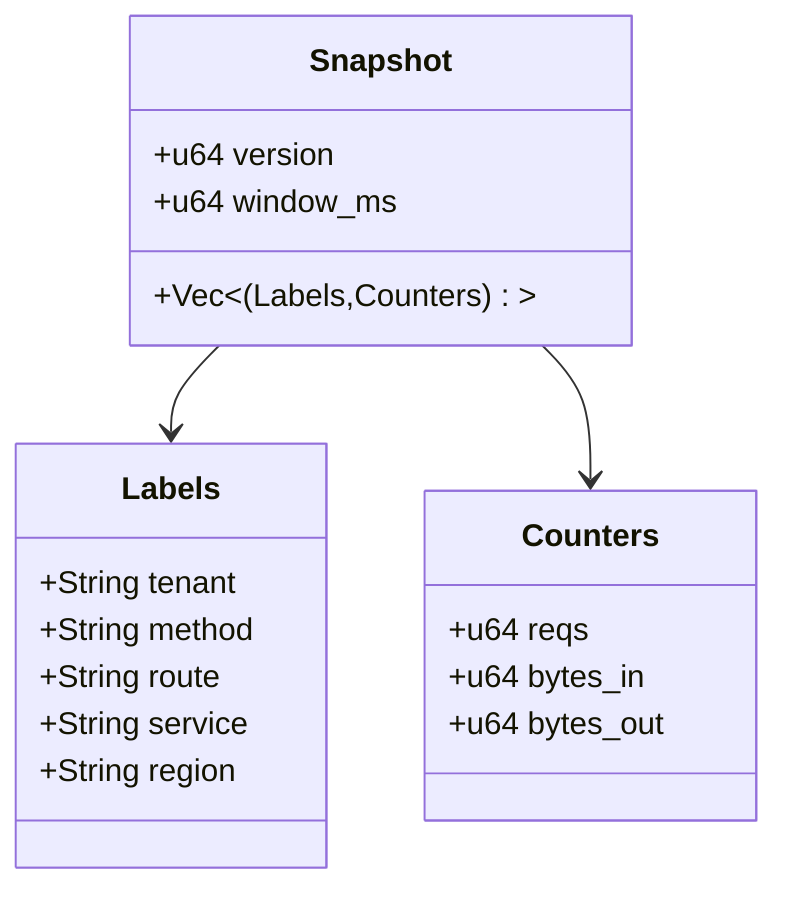
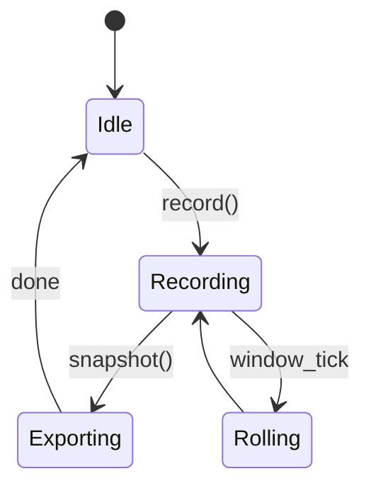
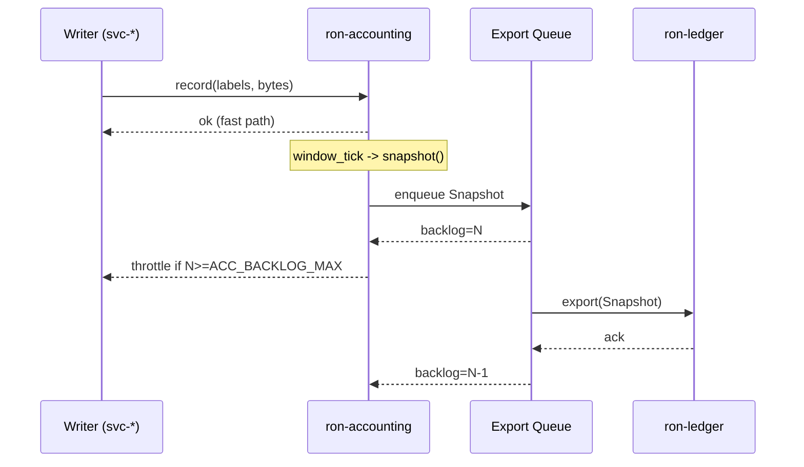

---

# ron-accounting

> **Role:** library
> **Owner:** Stevan White (or maintainer)
> **Status:** draft
> **MSRV:** 1.80.0
> **Last reviewed:** 2025-10-16

Badges (optional):
[]() []() []() []()

---

## 1) Overview

**What it is (one paragraph):**
`ron-accounting` provides fast, **in-memory** metering for RustyOnions services: request counters, inbound/outbound byte tallies, and **time-sliced snapshots** keyed by (tenant, method, route, service, region). It is expressly **transient** and **not** a source of durable economic truth. Snapshots are exported out-of-band to `ron-ledger` (and ECON services) for conservation proofs and settlements. The library is contention-averse, allocation-light on the hot path, and **amnesia-aware** (RAM-only by default for Micronode).

**How it fits (RustyOnions topology):**

* **Pillar:** 12 — Economics & Wallets (PERF/RES duties on hot paths)
* **Upstream callers:** `svc-gateway`, `omnigate`, `svc-edge`, `svc-mailbox`, `svc-index`, `svc-storage`
* **Downstream deps:** none at runtime; snapshots consumed by `ron-ledger` / `svc-rewarder`
* **Data it touches:** RAM (ring buffers); optional feature-gated WAL spill (autodisabled under Amnesia)
* **Security boundary:** no secrets/PII; capability/tenant tags only; labels must be PII-free and normalized

### 1.1 High-Level Architecture (Mermaid REQUIRED)

```mermaid
flowchart LR
  subgraph Service
    A[svc-gateway|omnigate|svc-edge|svc-storage|svc-index|svc-mailbox] -->|record()| B(ron-accounting)
  end

  B -->|export snapshot| C[ron-ledger (durable truth)]
  B -->|Metrics| D[[Prometheus]]

  style B fill:#0b7285,stroke:#083344,color:#fff
```

---

## 2) Responsibilities & Boundaries

**MUST do (core responsibilities):**

* [ ] Provide **low-overhead** counters/byte tallies with composable label sets (tenant, method, route, service, region).
* [ ] Produce **time-sliced snapshots** without stalling writers; budgeted export.
* [ ] Respect **Amnesia Mode**: RAM-only, zeroization on rotate, refuse disk I/O.
* [ ] Expose **golden metrics** (export latency, evictions, backlog, rows per snapshot).

**MUST NOT do (anti-scope / boundaries):**

* [ ] **No durable balances / conservation proofs** (that’s `ron-ledger`).
* [ ] **No policy, auth, or quotas** (ingress services + `ron-policy`).
* [ ] **No raw PII in labels**; labels must be normalized/templated.

**Acceptance Gates (PROOF you did it):**

* [ ] Unit/prop + loom tests cover increments, rollovers, and evictions under concurrency.
* [ ] Metrics exported (`requests_total`, `bytes_*_total`, export latency, backlog).
* [ ] Perf bench shows ≤1µs p50 increment on common label sets; zero hot-path allocations.
* [ ] Backlog/eviction SLOs respected under nominal load.

---

## 3) Public Interfaces

### 3.1 Rust API (library)

Key modules/types:

* `pub mod counters` — atomic fast-path counters and byte tallies.
* `pub mod window` — time-sliced ring buffers with rollover.
* `pub mod export` — snapshot structs + serde for shipping to `ron-ledger`/`svc-rewarder`.
* `pub mod normalize` — label normalization (e.g., route templating).
* `pub struct Accounting` — façade providing per-service handles.
* `pub struct Snapshot` — aggregated usage view, versioned.

Example (rustdoc-testable):

```rust
use ron_accounting::{Accounting, labels};

fn main() -> anyhow::Result<()> {
    let acc = Accounting::new_default(); // amnesia-aware defaults (env-driven)
    let l = labels()
        .tenant("t-123")
        .method("GET")
        .route("/v1/objects/:id") // templated, not raw ID
        .service("omnigate")
        .region("iad");

    acc.incr_request(&l);
    acc.add_bytes_in(&l, 32 * 1024);
    acc.add_bytes_out(&l, 4096);

    let snap = acc.snapshot();
    // ship `snap` to a channel or service that exports to ron-ledger
    assert!(snap.entries().len() >= 1);
    Ok(())
}
```

### 3.2 Bus RPC / Events (service)

*Not applicable (library).*

### 3.3 HTTP / gRPC (service/binary)

*Not applicable (library).*

### 3.4 CLI (binary/tool)

*Not applicable.*

---

## 4) Configuration

> Env-first with sane defaults. Host services may pass flags and/or env.

| Variable               | Type   |       Default | Description                                                                 |
| ---------------------- | ------ | ------------: | --------------------------------------------------------------------------- |
| `ACC_WINDOW_MS`        | int    |       `60000` | Snapshot window size (ms)                                                   |
| `ACC_SLICES`           | int    |           `5` | Rolling slices retained                                                     |
| `ACC_LABEL_LIMIT`      | int    |        `2048` | Max distinct label sets (LRU beyond)                                        |
| `ACC_EXPORT_MAXMS`     | int    |          `50` | Soft budget for snapshot/export (ms)                                        |
| `ACC_BACKLOG_MAX`      | int    |        `1000` | Max in-flight snapshot items before exporter throttles                      |
| `ACC_EXPORT_JITTER_MS` | int    |          `25` | Jitter to avoid herd effects on export                                      |
| `ACC_LABEL_NORMALIZER` | str    |       `route` | `route` (templated paths), `none` (unsafe), or `custom:<module>`            |
| `ACC_WAL_DIR`          | str    |     *(unset)* | WAL spill directory (**requires** `--features wal`; **ignored in Amnesia**) |
| `LOG_LEVEL`            | string |        `info` | tracing level (`trace`..`error`)                                            |
| `METRICS_ADDR`         | socket | `127.0.0.1:0` | Prometheus exporter bind (if host exposes)                                  |

**Flags (if any):** (host services pass through; lib reads env in `new_default()`)

```bash
--acc-window-ms 60000
--acc-slices 5
--acc-label-limit 2048
```

**Feature flags (Cargo):**

* `default = ["serde", "parking_lot"]`
* `export-serde` — enable serde for snapshots
* `ledger-wire` — include wire DTOs for `ron-ledger` integration
* `wal` — optional write-ahead logging for crash-replay; integrity-checked; **auto-off in Amnesia**

> **Amnesia rule:** If Amnesia Mode is detected, WAL is force-disabled even if compiled and configured.

---

## 5) Build, Run, Test

**Build**

```bash
cargo build -p ron-accounting
```

**Run (service/binary)**
*Not applicable (library)*

**Tests (unit/prop/docs)**

```bash
cargo test -p ron-accounting --all-features
cargo test -p ron-accounting --doc
```

**Loom models (concurrency)**

```bash
RUSTFLAGS="--cfg loom" cargo test -p ron-accounting --test loom -- --nocapture
```

**Fuzz (if repo enables cargo-fuzz)**

```bash
cargo fuzz run snapshot_codec
cargo fuzz run label_normalizer
```

**Lint & format**

```bash
cargo fmt --all
cargo clippy -p ron-accounting -- -D warnings
```

**Security & deps**

```bash
cargo deny check
```

**Bench**

```bash
cargo bench -p ron-accounting
```

---

## 6) Observability

**Endpoints (service):** N/A (library). Host services expose `/metrics`, `/healthz`, `/readyz`.

**Canonical Metrics (align with RustyOnions):**

* `requests_total{tenant,method,route,service,region}`
* `bytes_in_total{tenant,method,route,service,region}`
* `bytes_out_total{tenant,method,route,service,region}`
* `snapshot_export_latency_seconds{service}` — histogram
* `accounting_export_backlog{service}` — gauge
* `accounting_evictions_total{service,reason="cardinality|age"}` — counter
* `accounting_snapshot_rows{service}` — histogram
* `accounting_wal_errors_total{service}` — counter (only when `wal` is enabled)

**Golden PromQL checks (copy-paste)**

```promql
max_over_time(accounting_export_backlog{service="ron-accounting"}[5m]) < 1000
rate(accounting_evictions_total{service="ron-accounting"}[5m]) < 1
histogram_quantile(0.95, sum(rate(snapshot_export_latency_seconds_bucket[5m])) by (le)) < 0.150
```

**Tracing**

* Targets: `ron-accounting=info`
* Span fields: `tenant`, `method`, `route`, `service`, `region`

---

## 7) Performance & SLOs

| Metric                     | Target | Notes                                  |
| -------------------------- | -----: | -------------------------------------- |
| Increment p50              |   ≤1µs | 4–6 labels typical                     |
| Snapshot p95 (export path) |  ≤10ms | for ≤2k label sets                     |
| Start-to-ready             |   <1ms | construction of façade                 |
| Max label sets             |   2–8k | above this, evict (LRU)                |
| Export backlog (steady)    |  <1000 | backpressure ≥ `ACC_BACKLOG_MAX`       |
| Snapshot rows (p95)        | <2,048 | guard via `ACC_LABEL_LIMIT` + eviction |
| Eviction rate (p95)        |   ~0/s | spikes imply normalization gaps        |

> **Repro:** Release build, templated routes (e.g., `/v1/objects/:id`), `ACC_LABEL_LIMIT=2048`.

---

## 8) Data & Schema

**Data model (summary)**

* Label key: composite `(tenant, method, route, service, region)`
* Value: counters `{ reqs, bytes_in, bytes_out }`, plus monotonic version & window index.



**Migrations**
Snapshots include a `version` field (semver-gated). External writers MUST tolerate unknown label keys; when serialized with `export-serde`, we use strict DTOs for `ledger-wire`.

---

## 9) Security & Privacy

* **Threat model (summary):**

  * *Spoofing:* prevented upstream via capabilities/policy at ingress.
  * *Tampering:* counters are in-proc; integrity matters when exporting (handled by ledger/audit domains).
* **Key handling:** none (no secrets in this lib).
* **Label Hygiene:** **MUST NOT** include PII or unbounded free-text. Route labels SHOULD be templated (e.g., `/v1/objects/:id`) rather than raw IDs.
* **WAL Integrity (`wal` feature only):** WAL segments are length-delimited and sealed with per-segment checksums. On startup, WAL replays only fully verified segments; partial tails are dropped and counted via `accounting_wal_errors_total`.
* **Amnesia Enforcement:** When Amnesia Mode is detected, the library (1) refuses to open a WAL directory, (2) zeroizes ring buffers on rotate, and (3) skips any disk serialization.

---

## 10) Error Taxonomy

| Code/Variant                     | When it happens                     | User hint                                 | Retries |
| -------------------------------- | ----------------------------------- | ----------------------------------------- | ------- |
| `AccError::LabelOverflow`        | label sets exceed `ACC_LABEL_LIMIT` | normalize labels / raise limit cautiously | n/a     |
| `AccError::ExportBusy`           | export window saturated             | jitter/backoff; increase consumers        | yes     |
| `AccError::SerdeCompat`          | version mismatch on wire DTOs       | align features/DTO versions               | no      |
| `AccError::SnapshotTooLarge`     | rows exceed soft cap                | reduce cardinality / increase limits      | n/a     |
| `AccError::CardinalityThrottled` | writes paused by guard              | normalize labels / wait for eviction      | yes     |
| `AccError::WalCorrupt`           | WAL segment integrity failure       | inspect storage; tail auto-pruned         | n/a     |

---

## 11) Concurrency Model

* **Runtime:** callers run on tokio; lib types are `Send + Sync` with tight lock scopes.
* **I/O:** none on hot path; exports copy owned snapshots.
* **Channels:** optional bounded MPSC for export hooks.
* **Rules:** never hold a lock across `.await` (hot path avoids `.await` entirely).



**Loom invariants**

* No lost increments under arbitrary interleavings for identical labels.
* No deadlock during `snapshot()` under high churn.
* After LRU eviction, new inserts never observe stale counters.

---

## 12) Compatibility & Requirements

* **Rust:** MSRV 1.80.0
* **OS:** macOS 10.15+, Linux x86_64; containers supported
* **TLS/HTTP/DB:** N/A (library; RAM-only; optional `wal`)
* **Workspace:** matches RustyOnions pins (tokio/axum/prometheus versions via workspace deps)

---

## 13) Examples

Minimal example (library):

```rust
use ron_accounting::{Accounting, labels};

fn main() -> anyhow::Result<()> {
    let acc = Accounting::new_default();
    let l = labels()
        .tenant("acme")
        .method("GET")
        .route("/v1/feed")
        .service("omnigate")
        .region("iad");

    acc.incr_request(&l);
    acc.add_bytes_out(&l, 1024);

    let snap = acc.snapshot();
    println!("window={}ms entries={}", snap.window_ms, snap.entries().len());
    Ok(())
}
```

---

## 14) Troubleshooting

* **Cardinality runaway:** ensure `ACC_LABEL_NORMALIZER=route` and route templating is active in the host service.
* **Export backlog high:** raise `ACC_EXPORT_JITTER_MS`, scale export consumers, and confirm downstream ledger isn’t blocking.
* **WAL replays every boot:** likely Amnesia Mode + `wal` compiled; remove `--features wal` or unset `ACC_WAL_DIR`.
* **Hot path allocations:** reuse label builders and intern common strings.

---

## 15) Development Notes

**Project conventions (RustyOnions):**

* Golden metrics and `/readyz` behavior live in host services (`ron-metrics`), not here.
* Keep kernel/transport TLS rules out of this lib; it’s ECON metering only.
* ECON split: **counters vs truth** — never blur with `ron-ledger`.

**Pre-commit quickcheck**

```bash
cargo fmt --all
cargo clippy -- -D warnings
cargo test
cargo deny check
```

---

## 16) Mermaid Diagrams — Policy & Tooling (REQUIRED)

This README includes:

1. One **architecture** diagram ✅
2. One **sequence** diagram (below) ✅
3. One **state** diagram (above) ✅

**Sequence (snapshot export with backpressure):**



**Render locally (SVG)**

```bash
npm i -g @mermaid-js/mermaid-cli
mmdc -i docs/arch.mmd -o docs/arch.svg
```

**Render via Docker (no Node install)**

```bash
docker run --rm -v "$PWD":/data minlag/mermaid-cli mmdc -i docs/arch.mmd -o docs/arch.svg
```

**CI (GitHub Actions snippets)**

```yaml
name: render-mermaid
on: [push, pull_request]
jobs:
  mmdc:
    runs-on: ubuntu-latest
    steps:
      - uses: actions/checkout@v4
      - run: npm i -g @mermaid-js/mermaid-cli
      - run: |
          mkdir -p docs
          for f in $(git ls-files '*.mmd'); do
            out="${f%.mmd}.svg"
            mmdc -i "$f" -o "$out"
```

**API drift & coverage gates (recommended)**

```yaml
name: public-api
on: [pull_request]
jobs:
  check:
    runs-on: ubuntu-latest
    steps:
      - uses: actions/checkout@v4
      - uses: dtolnay/rust-toolchain@stable
      - run: cargo install cargo-public-api
      - run: cargo public-api -p ron-accounting --deny-changes
```

```yaml
name: coverage
on: [pull_request]
jobs:
  cov:
    runs-on: ubuntu-latest
    steps:
      - uses: actions/checkout@v4
      - uses: dtolnay/rust-toolchain@stable
      - run: cargo install cargo-tarpaulin
      - run: cargo tarpaulin -p ron-accounting --out Xml
      - run: |
          pct=$(grep -oP 'line-rate="\K[0-9.]+' tarpaulin-report.xml | head -1)
          req=0.85
          awk -v p="$pct" -v r="$req" 'BEGIN{exit !(p>=r)}'
```

---

## 17) Roadmap & TODO

* [ ] M1 — Export DTOs + serde parity (`ledger-wire`); PromQL assertions baked into ops docs
* [ ] M2 — Bench harness + flamegraphs on regressions; snapshot budget tuning
* [ ] Hardening — label cardinality guards; fuzz `snapshot_codec` & `label_normalizer`
* [ ] Micronode matrix — amnesia on/off correctness & WAL refusal tests
* [ ] CI — enable `public-api` and coverage gates

---

## 18) Changelog

See [CHANGELOG.md](./CHANGELOG.md). Follow SemVer; document breaking changes with migration notes.

---

## 19) License

Dual-licensed under **MIT** or **Apache-2.0**. See [LICENSE-MIT](../LICENSE-MIT) and [LICENSE-APACHE](../LICENSE-APACHE).

---

## 20) Contributing

PRs welcome! Please run fmt/clippy/tests and include:

* Updated diagrams (if topology changed)
* Docs & examples
* Bench impact (if perf-sensitive)

> Also see: `docs/IDB.md` (Invariant-Driven Blueprint) for this crate.

---

### Notes on using this template well

* **Be ruthless about scope.** Fill “MUST NOT” with real anti-goals to prevent creep.
* **Prove it.** Acceptance gates are how reviewers check the work (tests, metrics, SLOs).
* **Treat diagrams as code.** Keep `.mmd` sources under `docs/` and render SVGs in CI.
* **Keep examples compiling.** Prefer `rustdoc` examples so `cargo test --doc` enforces them.
* **Pin the MSRV** and record breaking changes in the changelog.

---
