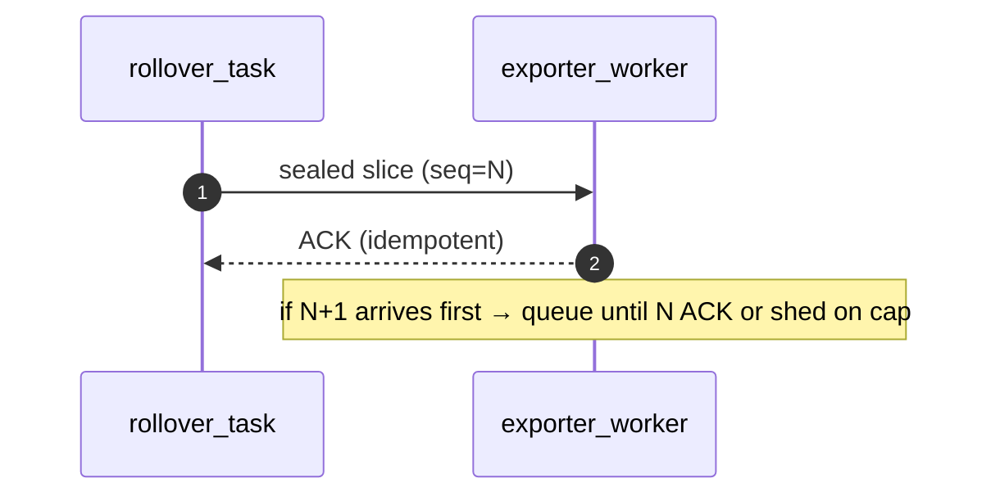
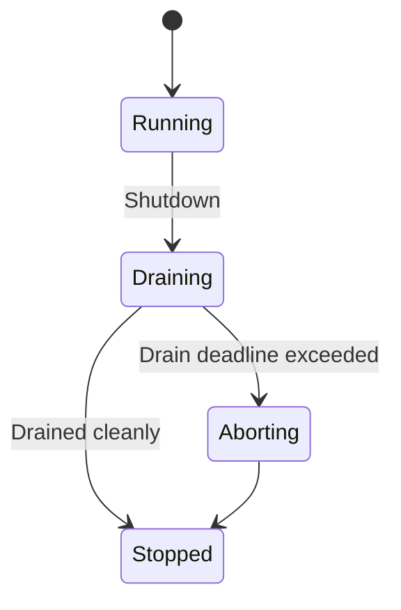
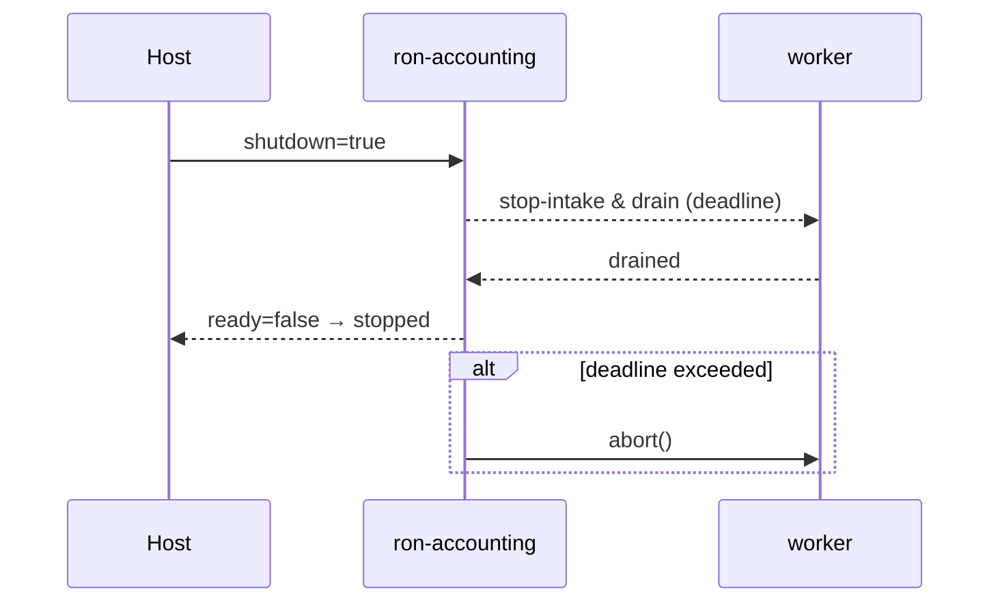

````markdown
---
title: Concurrency Model — ron-accounting
crate: ron-accounting
owner: Stevan White
last-reviewed: 2025-10-14
status: draft
template_version: 1.1
msrv: 1.80.0
tokio: "1.x (pinned at workspace root)"
loom: "0.7+ (dev-only)"
lite_mode: "For small library crates: fill §§1,3,4,5,10,11 and mark others N/A"
---

# Concurrency Model — ron-accounting

This document makes the concurrency rules **explicit**: tasks, channels, locks, shutdown, timeouts,
and validation (property/loom/TLA+). It complements `docs/SECURITY.md`, `docs/CONFIG.md`,
and the crate’s `README.md` and `IDB.md`.

> **Golden rule:** never hold a lock across `.await` in supervisory or hot paths.

---

## 0) Lite Mode

`ron-accounting` is a **library** that may run **background tasks** (rollover, exporter, WAL replay) when enabled by the host.
Therefore, **full mode** applies by default. For pure-counter embedding without exporters, you may treat §§2/6/7 as N/A.

**In lite mode (no background tasks), the host must:**
- Trigger **manual rollovers on UTC boundaries**.
- Propagate **shutdown** and ensure in-flight work is drained before process exit (reuse the patterns in §6).

---

## 1) Invariants (MUST)

- [I-async-1] **No lock across `.await`.** Guards **must** be dropped before any await point.
- [I-async-2] **Single writer** per export stream `(tenant,dimension)`; readers operate on sealed snapshots.
- [I-async-3] **Bounded channels only** (`mpsc`, `broadcast`, `watch`) with explicit overflow/drop policy.
- [I-async-4] **Explicit timeouts** on I/O (HTTP/OAP) and WAL fs ops; fail-fast with typed errors.
- [I-async-5] **Cooperative cancellation:** every `.await` is cancel-safe or guarded by `select!`.
- [I-async-6] **Graceful shutdown:** observe `Shutdown` signal; stop intake, drain pending within deadline; abort stragglers.
- [I-async-7] **No blocking syscalls** on the reactor; use `spawn_blocking` for fsync/rename if needed (short & bounded).
- [I-async-8] **No task leaks:** all spawned tasks are join-tracked; detach only for fire-and-forget with rationale.
- [I-async-9] **Backpressure over buffering:** prefer `try_send`/reject to growing queues.
- [I-async-10] **Framing is checked:** HTTP/OAP frames length-delimited (≤1 MiB) and chunked (~64 KiB); verify before allocation.
- [I-async-11] **UTC windowing is monotone:** boundary detection is idempotent under clock skew (≤500 ms) and jump; exactly one rollover per boundary.
- [I-async-12] **Export ordering enforced:** per-stream sequence ordering cannot be violated by concurrency.
- [I-async-13] **Async Drop:** never block in `Drop`; teardown via explicit async `close()`/`shutdown()`.

---

## 2) Runtime Topology

**Runtime:** Tokio multi-threaded. Library exposes constructors that spawn a minimal set of tasks when exporters/WAL are enabled.

**Primary tasks (names used in code & logs):**
- `rollover_task` — Aligns to UTC boundaries; seals shards → `pending_slices`; computes `b3` + `prev_b3`. **Critical.**
- `wal_replay_task` (amnesia=false, wal.enabled=true) — On startup, scans WAL, rehydrates `pending_slices`. **Best-effort.**
- `exporter_router` — Dequeues sealed slices; routes into per-stream ordered lanes; enforces `seq` ordering with fairness (§11).
- `exporter_worker-{tenant}-{dimension}` — **Single writer** per stream; performs `put()` with jittered backoff; maintains ACK LRU.
- `metrics_task` (adapter builds) — Scrapes internal gauges to Prometheus registry (or just registers Once).
- `shutdown_watcher` — Fan-out `watch<bool>` for cooperative cancellation.

**Worker bound:** at most **one** `exporter_worker` per **active** `(tenant,dimension)` stream.  
The router applies **cross-tenant fairness** (round-robin or WFQ) so a hot tenant cannot starve others (§11).

```mermaid
flowchart TB
  subgraph ron-accounting runtime
    A[shutdown_watcher]:::ctrl
    B[rollover_task]:::hot -->|mpsc:sealed( pending_slices )| R[exporter_router]:::hot
    W[wal_replay_task] --> R
    R -->|mpsc:lane(ordered)| E1[exporter_worker bytes]:::io
    R -->|mpsc:lane(ordered)| E2[exporter_worker requests]:::io
  end
  classDef hot fill:#0ea5e9,stroke:#0c4a6e,color:#fff;
  classDef io fill:#10b981,stroke:#065f46,color:#fff;
  classDef ctrl fill:#64748b,stroke:#334155,color:#fff;
````

**Text description:** `rollover_task` seals active counters and pushes sealed slices into a bounded `pending_slices` queue. `wal_replay_task` (if enabled) pre-populates that queue from WAL. `exporter_router` drains `pending_slices`, enqueues by stream `(tenant,dimension)` into bounded per-stream lanes, and each lane has exactly one `exporter_worker` enforcing ordering and idempotent `put()`.

---

## 3) Channels & Backpressure

**All channels are bounded.** Capacities default from config; shown here as symbols.

| Name                   | Kind      | Capacity                          | Producers → Consumers             | Backpressure Policy                     | Drop Semantics                            |
| ---------------------- | --------- | --------------------------------- | --------------------------------- | --------------------------------------- | ----------------------------------------- |
| `pending_slices_tx`    | `mpsc`    | `pending_slices_cap`              | rollover/wal → exporter_router    | `try_send`; else `OrderOverflow`        | `rejected_total{reason="capacity"}`       |
| `lane_{t,d}_tx`        | `mpsc`    | `ordered_buffer_cap` (per-stream) | exporter_router → exporter_worker | hold-for-order until `N` ACK, else shed | `rejected_total{reason="order_overflow"}` |
| `events_tx` (optional) | broadcast | 1024 (sampled)                    | core → observers                  | drop oldest on lag                      | `bus_lagged_total` + warn                 |
| `shutdown_rx`          | watch     | 1                                 | supervisor → all                  | last-write-wins                         | N/A                                       |

**Guidelines:**

* Always prefer `try_send` and return `Error::Busy`/`OrderOverflow` rather than blocking producers.
* Maintain `queue_depth{queue}` gauges (sampled if high cardinality).
* Make “shed” observable via metrics and structured logs.

---

## 4) Locks & Shared State

**Allowed**

* `OnceLock` for global registries (metrics, dimension consts).
* Short-lived `parking_lot::Mutex/RwLock` for metadata & LRU caches (ACK cache), **never** held across `.await`.
* `Arc<Shard>` containing `AHashMap`/`DashMap` for counters; hot path uses atomics and interior mutability without `.await`.

**Forbidden**

* Holding any lock across `.await`.
* Nested locks beyond this hierarchy without justification.

**Hierarchy (coarse to fine)**

1. `state_meta` (cfg snapshot, readiness flags)
2. `export_cache` (ACK LRU)
3. `shard_n` (hot counter maps)

**Pattern:** Compute → drop guard → await:

```rust
let (slice_id, rows) = {
  let g = shard.lock();     // SHORT critical section
  g.seal_now()
};                           // guard dropped
exporter.enqueue(slice_id, rows).await?;
```

---

## 5) Timeouts, Retries, Deadlines

* **HTTP/OAP exporter I/O:** `read=5s`, `write=5s`, `idle=60s` (configurable).
* **Exporter retry:** jittered exponential backoff (base 50 ms, cap 5 s), idempotent `put()` only, **global op deadline** 10 s (configurable); retries must respect remaining budget.
* **WAL fs ops:** metadata ops with 2 s timeout; `fsync` in `spawn_blocking` guarded by a **5 s** per-op deadline; if budget is exhausted, error out (`PersistenceFull`).
* **Rollover boundary detection tolerance:** ≤500 ms skew; duplicate boundary events are collapsed.



---

## 6) Cancellation & Shutdown

* **Signal source:** host sends `Shutdown` over `watch<bool>` or drops the handle.
* **Propagation:** all tasks run `select!{ _ = shutdown.changed() => … }`.
* **Sequence:**

  1. **Stop intake** (stop recording new events into new slices; current windows still seal once).
  2. `exporter_router` **drains** `pending_slices` into lanes until **drain_deadline** (default 5 s).
  3. Workers stop creating new connections when shutdown is visible; finish in-flight `put()` within per-op deadline (respects global op deadline).
  4. After deadline, call `abort()` on remaining tasks; increment `tasks_aborted_total{kind}`.



---

## 7) I/O & Framing

* **Framing:** length-delimited DTOs, ≤1 MiB/frame; body streamed in ~64 KiB chunks.
* **Validation:** deny unknown fields, check body length before allocation; 413/429 on violation.
* **Decompression (adapter):** enforce `decompress_ratio_cap` (see `CONFIG.md`) **before** allocating expanded buffers.
* **Shutdown semantics:** call `AsyncWriteExt::shutdown().await` on success or error; tolerate half-closed peers.

---

## 8) Error Taxonomy (Concurrency-Relevant)

| Error             | Raised by               | Retry?           | Metric                                    | Notes                          |
| ----------------- | ----------------------- | ---------------- | ----------------------------------------- | ------------------------------ |
| `Busy`            | record/enqueue          | caller-dependent | `busy_rejections_total{endpoint}`         | capacity hit on hot path       |
| `OrderOverflow`   | exporter_router/lanes   | no               | `rejected_total{reason="order_overflow"}` | preserves ordering invariant   |
| `Timeout`         | I/O/WAL                 | sometimes        | `io_timeouts_total{op}`                   | attach op (`read/write/fsync`) |
| `Canceled`        | during shutdown         | no               | `tasks_canceled_total{kind}`              | cooperative                    |
| `DuplicateExport` | exporter_worker         | no               | `accounting_exports_total{status="dup"}`  | idempotent downstream          |
| `PersistenceFull` | WAL append/fsync budget | no               | `rejected_total{reason="wal_full"}`       | bounded persistence            |
| `WalCorrupt`      | WAL replay/scan         | no               | `accounting_wal_corrupt_total`            | skip bad frame; continue       |
| `SchemaViolation` | decoder                 | no               | `dto_violation_total`                     | 400/413 path                   |

---

## 9) Metrics (Concurrency Health)

* `queue_depth{queue}` gauge (sampled)
* `queue_dropped_total{queue,reason}`
* `tasks_spawned_total{kind}` / `tasks_aborted_total{kind}`
* `io_timeouts_total{op}` (`read`,`write`,`fsync`)
* `backoff_retries_total{op}`
* `busy_rejections_total{endpoint}`
* `accounting_exports_total{status}` (`ok|dup|retry_network|retry_remote_5xx|fail`)
* `accounting_degraded` gauge

---

## 10) Validation Strategy

**Unit / Property**

* **Ordering:** Given events producing slices `… N, N+1 …`, prove `N+1` is not exported before `N` ACK unless shed.
* **Monotonic boundary:** Skew/jump tests trigger **exactly one** rollover per UTC boundary.
* **Backpressure:** With tiny caps, sustained input yields rejects (no deadlock).
* **Global deadlines:** ensure exporter retries respect a fixed 10 s budget by measuring elapsed.

**Loom (model)**

* Model 1 producer → `pending_slices` → router → lane → worker, with shutdown races.
* Assertions: no deadlock, no lost wakeups, **no lock across await** patterns.

**Fuzz**

* Frame fuzz for DTO limits; WAL record-length corruption.

**Chaos**

* Inject 10–30% network failure; ensure bounded backlog, proper shedding, and full drain post-recovery.

**TLA+ sketch (optional)**

* Variables: `Seq`, `Lane`, `ACKed`. Invariants: `\A k: Exported(k) => \A j < k: Exported(j) \/ Shed(j)`; Liveness: `Eventually \A k in Pending: Exported(k) \/ Shed(k)`.

---

## 11) Code Patterns (Copy-Paste)

**Bounded lane with ordered enqueue (no await under lock)**

```rust
// inside exporter_router
if let Some(tx) = lanes.get(&(tenant, dimension)) {
    if let Err(tokio::sync::mpsc::error::TrySendError::Full(_)) = tx.try_send(slice) {
        metrics::rejected_total("order_overflow").inc();
        return Err(Error::OrderOverflow);
    }
} else {
    // create lane (bounded mpsc) and spawn single-writer worker
}
```

**Router fairness (round-robin; WFQ-ready)**

```rust
/// For "wfq", replace rr with a small weighted ring where weight derives from a per-tenant u8 (1..=8).
#[derive(Default)]
struct Router {
    rr: smallvec::SmallVec<[StreamId; 64]>, // active order
    next: usize,
}

impl Router {
    fn next_stream(&mut self) -> Option<StreamId> {
        if self.rr.is_empty() { return None; }
        let id = self.rr[self.next];
        self.next = (self.next + 1) % self.rr.len();
        Some(id)
    }
}

// In exporter_router loop:
while let Some(slice) = pending_slices_rx.recv().await {
    let id = StreamId::from(&slice); // (tenant, dimension)
    let lane = lanes.entry(id).or_insert_with(|| make_lane_and_spawn_worker(id));
    if let Err(tokio::sync::mpsc::error::TrySendError::Full(_)) = lane.try_send(slice) {
        metrics::rejected_total("order_overflow").inc();
        // Optional: adjust fairness ordering to avoid hammering a perpetually full lane.
        continue;
    }
    // Optional: (re)register id in rr if it became active.
}
```

**Worker respects ordering & idempotence (global deadline aware)**

```rust
let op_budget = tokio::time::Duration::from_secs(10);
loop {
  tokio::select! {
    _ = shutdown.changed() => break,
    Some(slice) = lane_rx.recv() => {
      if !ordering_state.ready_for(&slice.id.seq) {
        // keep in lane; router enforces cap; no busy-wait
        continue;
      }
      let start = tokio::time::Instant::now();
      let mut backoff = backoff::Exponential::new(50, 5_000);
      loop {
        let left = op_budget.saturating_sub(start.elapsed());
        if left.is_zero() { break; } // give up within budget
        match tokio::time::timeout(left, exporter.put(&slice)).await {
          Ok(Ok(Ack::Ok | Ack::Duplicate)) => { ordering_state.ack(slice.id.seq); break; }
          Ok(Err(e)) if e.is_retryable() => { backoff.sleep_jittered().await; continue; }
          Ok(Err(_e)) | Err(_timeout) => { metrics::exports_fail().inc(); break; }
        }
      }
    }
  }
}
```

**No lock across `.await` (LRU example)**

```rust
let existed = { export_cache.lock().contains(&key) }; // drop guard
if !existed {
  let res = remote_check(&key).await?;
  { export_cache.lock().insert(key.clone(), res); } // short insert
}
```

**Shutdown drain with deadline**

```rust
let deadline = tokio::time::Instant::now() + cfg.drain_deadline;
tokio::select! {
  _ = drain_all() => {},
  _ = tokio::time::sleep_until(deadline) => { abort_inflight().await; }
}
```

---

## 12) Configuration Hooks (Quick Reference)

* `accounting.pending_slices_cap`, `accounting.exporter.ordered_buffer_cap`
* `accounting.fairness` (router’s cross-tenant scheduling; `round_robin` or `wfq`)
* For **WFQ**, weights derive from a tiny per-tenant map (`u8` weight 1..=8), default 1; configured by the host.
* I/O timeouts & backoff: `exporter.backoff_*`
* `drain_deadline` (in adapter/host)
* WAL caps: size/entries/age

Authoritative schema: `docs/CONFIG.md`.

---

## 13) Known Trade-offs / Nonstrict Areas

* **Lane cap vs. fairness:** `ordered_buffer_cap` too small may shed under bursty out-of-order readiness; we prefer **order preservation** over losslessness.
* **`spawn_blocking` for fsync:** tiny blocking windows traded for durability.
* **Broadcast events:** lagging subscribers are **dropped** to protect hot path.
* **Multi-node semantics:** This model assumes a **single-node writer** per `(tenant,dimension)`. For HA, coordinate sequence/ACK via `ron-ledger` (or a thin ingress service) so exactly one node is active for a stream; others buffer or forward.

---

## 14) Mermaid Diagrams

### 14.1 Task & Queue Topology

```mermaid
flowchart LR
  RW[rollover_task] -->|mpsc: pending(cap)| R[exporter_router]
  WAL[wal_replay_task] --> R
  R -->|mpsc: lane(cap)| W1[worker (tenant A, bytes)]
  R -->|mpsc: lane(cap)| W2[worker (tenant A, requests)]
  R -->|mpsc: lane(cap)| W3[worker (tenant B, bytes)]
  SH[shutdown watch] --> RW
  SH --> R
  SH --> W1
  SH --> W2
  SH --> W3
```

**Text:** rollover & WAL feed a bounded pending queue; router fans into bounded, per-stream lanes; each lane has exactly one worker; a shutdown watch fan-outs to all tasks.

### 14.2 Shutdown Sequence



---

## 15) CI & Lints (Enforcement)

**Clippy / rustc lints**

* `-D warnings`
* `-D clippy::await_holding_lock`
* `-D clippy::mutex_atomic`
* `-W clippy::large_enum_variant` (hot-path hygiene)

**GitHub Actions (sketch)**

```yaml
name: concurrency-guardrails
on: [push, pull_request]
jobs:
  clippy:
    runs-on: ubuntu-latest
    steps:
      - uses: actions/checkout@v4
      - uses: dtolnay/rust-toolchain@stable
      - run: cargo clippy -p ron-accounting -- -D warnings -D clippy::await_holding_lock

  loom:
    if: github.event_name == 'pull_request'
    runs-on: ubuntu-latest
    steps:
      - uses: actions/checkout@v4
      - uses: dtolnay/rust-toolchain@stable
      - run: RUSTFLAGS="--cfg loom" cargo test -p ron-accounting --tests -- --ignored --nocapture

  fuzz:
    runs-on: ubuntu-latest
    steps:
      - uses: actions/checkout@v4
      - uses: dtolnay/rust-toolchain@stable
      - run: cargo install cargo-fuzz
      - run: cargo fuzz build -p ron-accounting
```

*(Optional loom ergonomics: provide a `loom_channel(cap)` helper behind `--cfg loom` so loom models can swap channel impls without code drift.)*

---

## 16) Schema Generation (Optional)

* Keep a `concurrency.rs` registry for channels/locks with a unit test that renders a markdown fragment and compares to this doc (golden test).
* Or annotate with `#[doc_channel(...)]` attributes and scrape in `build.rs`.

---

## 17) Review & Maintenance

* Review on any change to tasks/channels/locks or at least every 90 days.
* Keep `owner`, `msrv`, `last-reviewed` fresh.
* PR checklist must include: **updated doc + property/loom test adjustments**, and an audit for new/changed channels & locks in diff.

```
```
