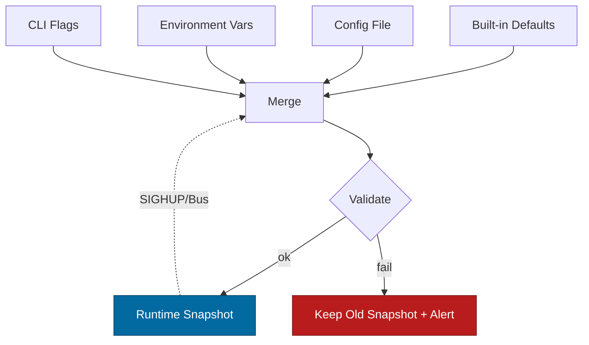

````markdown
---
title: Configuration — ron-accounting
crate: ron-accounting
owner: Stevan White
last-reviewed: 2025-10-14
status: draft
template_version: 1.0
---

# Configuration — ron-accounting

This document defines **all configuration** for `ron-accounting`, including sources,
precedence, schema (types/defaults), validation, feature flags, live-reload behavior,
and security implications. It complements `README.md`, `docs/IDB.md`, and `docs/SECURITY.md`.

> **Tiering**
> - **Library crate (primary):** Everything in **Accounting Core** applies.
> - **Adapters/Service wrappers (optional):** Additional **HTTP/OAP Exporter** keys apply if you compile/use the provided helpers.

---

## 1) Sources & Precedence (Authoritative)

Configuration may come from multiple sources. **Precedence (highest wins):**

1. **Process flags** (CLI) — only if using a service/adapter binary  
2. **Environment variables**  
3. **Config file** (`Config.toml` by convention)  
4. **Built-in defaults** (hard-coded)

> On reload, the effective config is recomputed under the same precedence.

**Supported file formats:** TOML (preferred), JSON (optional).  
**Path resolution for `--config` (relative):** `./`, `$CWD`, crate directory.

**Environment prefix:** `RON_ACC_` (e.g., `RON_ACC_WINDOW_LEN_S`).

---

## 2) Quickstart Examples

### 2.1 Minimal (library usage in your binary)
```rust
// main.rs (example)
use ron_accounting::Config;

fn main() -> anyhow::Result<()> {
    // Load from defaults + Config.toml + env (precedence handled by your glue)
    let cfg = ron_accounting::config::load(None)?; // None = default path search
    cfg.validate(/* is_micronode */ false)?;
    let acc = ron_accounting::Accounting::new(cfg.clone())?;
    // wire exporter, start rollover task, etc...
    Ok(())
}
````

### 2.2 Config file (TOML) — **Accounting Core (Macronode defaults)**

```toml
[accounting]
window_len_s = 300                 # 5 minutes; restart required to change
shards = 64                        # power of two
capacity_rows = 200_000            # in-flight row cap
pending_slices_cap = 8192          # sealed-but-unexported slice buffer
amnesia = false                    # Macronode default=false
fairness = "round_robin"           # or "wfq"

[accounting.metrics]
sample_backlog_labels = true       # control cardinality for {tenant,dimension}

[accounting.exporter]
ordered_buffer_cap = 1024
backoff_base_ms = 50
backoff_cap_ms  = 5000
jitter = true

[accounting.wal]
enabled = true
dir = "/var/lib/ron/accounting/wal"
max_bytes = "512MiB"
max_entries = 200_000
max_age_s = 86_400
fsync_on_close = true
fsync_dir_on_create = true
```

### 2.2.1 Micronode profile (local dev)

```toml
[accounting]
window_len_s = 300
shards = 32
capacity_rows = 100_000
pending_slices_cap = 2048
amnesia = true            # Micronode default
fairness = "round_robin"

[accounting.wal]
enabled = false           # ignored when amnesia=true

[accounting.metrics]
sample_backlog_labels = true
```

**Effective config logging (example):**

```
INFO  ron_accounting::config: effective_config profile=micronode \
 window_len_s=300 shards=32 amnesia=true wal.enabled=false \
 cap_rows=100000 pending=2048 fairness=round_robin sample_backlog=true
WARN  ron_accounting::config: wal.* settings ignored because amnesia=true
```

### 2.3 Optional HTTP exporter (adapter) — add to the same file

```toml
[export_http]                      # only if using the HTTP/OAP adapter
enabled = false
bind_addr = "127.0.0.1:0"
metrics_addr = "127.0.0.1:0"
read_timeout = "5s"
write_timeout = "5s"
idle_timeout = "60s"

[export_http.limits]
max_body_bytes = "1MiB"
decompress_ratio_cap = 10

[export_http.tls]
enabled = false
# cert_path = "/etc/ron/cert.pem"
# key_path  = "/etc/ron/key.pem"
```

### 2.4 CLI flags (override file/env) — **adapter binaries only**

```bash
RON_ACC_WINDOW_LEN_S=300 \
RON_ACC_AMNESIA=false \
RON_ACC_WAL_ENABLED=true \
RON_ACC_WAL_DIR=/var/lib/ron/accounting/wal \
cargo run -p ron-accounting-adapter -- \
  --bind 0.0.0.0:8080 \
  --metrics 127.0.0.1:0 \
  --max-body-bytes 1MiB
```

> **Deliberate omission:** Core invariants (e.g., `accounting.window_len_s`, `accounting.shards`) are **not** exposed as CLI flags. Configure via file/env and **restart** to avoid rollover/order drift.

---

## 3) Schema (Typed, With Defaults)

> **Durations** accept `ms`, `s`, `m`, `h`. **Sizes** accept `B`, `KB`, `MB`, `GB`, `KiB`, `MiB`, `GiB`.
> **Env Prefix:** `RON_ACC_...`

### 3.1 Accounting Core (library)

| Key / Env Var                                                                | Type               | Default         | Description                                                       | Security Notes                                 |                                    |
| ---------------------------------------------------------------------------- | ------------------ | --------------- | ----------------------------------------------------------------- | ---------------------------------------------- | ---------------------------------- |
| `accounting.window_len_s` / `RON_ACC_WINDOW_LEN_S`                           | u32 (seconds)      | `300`           | Fixed window length. **Restart required** to change.              | Aligns to UTC; protects invariants & ordering. |                                    |
| `accounting.shards` / `RON_ACC_SHARDS`                                       | u32 (power of two) | `64`            | Shard count for hot-path counters.                                | Too low → contention; too high → memory.       |                                    |
| `accounting.capacity_rows` / `RON_ACC_CAP_ROWS`                              | u64                | `200_000`       | Max in-flight counter rows across shards (bounded memory).        | Prevents DoS via unbounded growth.             |                                    |
| `accounting.pending_slices_cap` / `RON_ACC_PEND`                             | u32                | `8192`          | Bounded ring for sealed slices awaiting export/order.             | Order overflow sheds instead of blocking.      |                                    |
| `accounting.amnesia` / `RON_ACC_AMNESIA`                                     | bool               | `false` (macro) | RAM-only mode (Micronode default=true). Disables WAL persistence. | Intentional loss on restart; must be visible.  |                                    |
| `accounting.fairness` / `RON_ACC_FAIRNESS`                                   | enum `round_robin  | wfq`            | `round_robin`                                                     | Cross-tenant shed/export fairness policy.      | Prevents single-tenant starvation. |
| `accounting.metrics.sample_backlog_labels` / `RON_ACC_SAMPLE_BACKLOG_LABELS` | bool               | `true`          | Sample `(tenant,dimension)` on backlog gauges to cap cardinality. | Controls Prometheus explosion.                 |                                    |

**Exporter (core behavior, not network):**

| Key / Env Var                                                 | Type | Default | Description                                            | Security Notes                       |
| ------------------------------------------------------------- | ---- | ------- | ------------------------------------------------------ | ------------------------------------ |
| `accounting.exporter.ordered_buffer_cap` / `RON_ACC_EXP_OBUF` | u32  | `1024`  | Max per-stream buffered slices waiting for prior ACKs. | On overflow → shed (no order break). |
| `accounting.exporter.backoff_base_ms` / `RON_ACC_EXP_BBASE`   | u32  | `50`    | Retry base backoff (ms).                               |                                      |
| `accounting.exporter.backoff_cap_ms` / `RON_ACC_EXP_BCAP`     | u32  | `5000`  | Retry max backoff cap (ms).                            |                                      |
| `accounting.exporter.jitter` / `RON_ACC_EXP_JITTER`           | bool | `true`  | Add full jitter to retries to avoid thundering herds.  |                                      |

**WAL (persistence when `amnesia=false`):**

| Key / Env Var                                                  | Type | Default                          | Description                                      | Security Notes                                     |
| -------------------------------------------------------------- | ---- | -------------------------------- | ------------------------------------------------ | -------------------------------------------------- |
| `accounting.wal.enabled` / `RON_ACC_WAL_ENABLED`               | bool | `true` (macro) / `false` (micro) | Enables bounded WAL for sealed slices until ACK. | Durable staging; guard disk usage with caps.       |
| `accounting.wal.dir` / `RON_ACC_WAL_DIR`                       | path | `""` (disabled if empty)         | WAL directory (set in prod).                     | Dir **0700**, owner = effective UID, fsync needed. |
| `accounting.wal.max_bytes` / `RON_ACC_WAL_MAX_BYTES`           | size | `512MiB`                         | WAL total size cap.                              | Prevents disk fill.                                |
| `accounting.wal.max_entries` / `RON_ACC_WAL_MAX_ENTRIES`       | u64  | `200_000`                        | Max staged slices.                               |                                                    |
| `accounting.wal.max_age_s` / `RON_ACC_WAL_MAX_AGE_S`           | u32  | `86_400` (1 day)                 | Age cap for staged entries.                      |                                                    |
| `accounting.wal.fsync_on_close` / `RON_ACC_WAL_FSYNC_CLOSE`    | bool | `true`                           | fsync file on close (seal).                      | Data safety vs latency trade-off.                  |
| `accounting.wal.fsync_dir_on_create` / `RON_ACC_WAL_FSYNC_DIR` | bool | `true`                           | fsync directory on new file creation.            | Guards against rename loss after crash.            |

### 3.2 HTTP/OAP Exporter Adapter (optional)

| Key / Env Var                                                      | Type     | Default       | Description                        | Security Notes                             |
| ------------------------------------------------------------------ | -------- | ------------- | ---------------------------------- | ------------------------------------------ |
| `export_http.enabled` / `RON_ACC_HTTP`                             | bool     | `false`       | Enables HTTP/OAP exporter adapter. | Disable unless needed.                     |
| `export_http.bind_addr` / `RON_ACC_BIND`                           | socket   | `127.0.0.1:0` | Adapter bind address.              | Public binds require threat review.        |
| `export_http.metrics_addr` / `RON_ACC_METRICS`                     | socket   | `127.0.0.1:0` | Prometheus endpoint bind.          | Prefer localhost; scrape via gateway.      |
| `export_http.read_timeout` / `RON_ACC_READ_MS`                     | duration | `5s`          | Per-request read timeout.          | DoS mitigation.                            |
| `export_http.write_timeout` / `RON_ACC_WRITE_MS`                   | duration | `5s`          | Per-request write timeout.         |                                            |
| `export_http.idle_timeout` / `RON_ACC_IDLE_MS`                     | duration | `60s`         | Keep-alive idle shutdown.          |                                            |
| `export_http.limits.max_body_bytes` / `RON_ACC_MAX_BODY_BYTES`     | size     | `1MiB`        | Payload cap (OAP frame ≤ 1 MiB).   | Zip bomb guard.                            |
| `export_http.limits.decompress_ratio_cap` / `RON_ACC_DECOMP_RATIO` | u32      | `10`          | Max decompression ratio.           |                                            |
| `export_http.tls.enabled` / `RON_ACC_TLS`                          | bool     | `false`       | Enable TLS (tokio-rustls).         | Never use `rustls::ServerConfig` directly. |
| `export_http.tls.cert_path` / `RON_ACC_TLS_CERT`                   | path     | `""`          | PEM certificate path.              | Secrets on disk; perms **0600**.           |
| `export_http.tls.key_path` / `RON_ACC_TLS_KEY`                     | path     | `""`          | PEM private key path.              | Zeroize in memory; not world-readable.     |

---

## 4) Validation Rules (Fail-Closed)

At startup or reload:

**Accounting Core**

* `window_len_s ∈ [60, 3600]` and **may not change at runtime** (restart required).
* `shards` is a power of two in `[1, 4096]`.
* `capacity_rows ≥ 1024`, `pending_slices_cap ≥ 64`.
* If `amnesia = true` ⇒ enforce `wal.enabled = false` (ignore with `WARN` if set).
* If `wal.enabled = true` ⇒

  * `wal.dir` **must exist or be creatable**, be owned by the effective UID, have mode **0700**, be writable by owner, and be on a filesystem that honors **fsync**; otherwise **fail** with `ERR_WAL_DIR_UNUSABLE`.
  * `wal.max_bytes ≥ 1MiB`, `wal.max_entries ≥ pending_slices_cap`, `wal.max_age_s ≥ window_len_s`.
* Fairness ∈ `{round_robin, wfq}`.

**HTTP/OAP Exporter Adapter (if enabled)**

* `bind_addr` and `metrics_addr` parse; ports <1024 require privileges.
* If `tls.enabled` ⇒ `cert_path` and `key_path` exist and are not world-readable.
* Limits: `max_body_bytes ≤ 1MiB`, `decompress_ratio_cap ≥ 1`.

**Violation behavior**

* **Library:** return structured error (do not start).
* **Adapter service:** log structured error and **exit non-zero**.

---

## 5) Dynamic Reload (If Supported)

* **Trigger:** SIGHUP (adapter) or bus event `ConfigUpdated { version }`.
* **Reloadable (non-disruptive):** exporter backoff caps, fairness policy, metrics sampling flags, adapter timeouts.
* **Disruptive / restart-required:** `window_len_s`, `shards`, WAL directory, TLS keys, bind addresses.
* **Atomicity:** compute new snapshot; swap under a mutex **without holding `.await`**.
* **Failure semantics:** if reload validation fails, keep the **previous snapshot**, emit `KernelEvent::ConfigUpdated { version, failed: true }`, and increment `config_reload_fail_total`.
* **Rate-limit:** ignore reload triggers more frequent than **1/minute** (log at INFO) to prevent thrash.
* **Audit:** emit structured diff (never include secrets) upon successful reload.

---

## 6) CLI Flags (Canonical; adapter builds only)

```
--config <path>                 # Load Config.toml (low precedence vs env/flags)
--bind <ip:port>                # export_http.bind_addr
--metrics <ip:port>             # export_http.metrics_addr
--read-timeout <dur>            # e.g., 5s, 250ms
--write-timeout <dur>
--idle-timeout <dur>
--tls                           # export_http.tls.enabled=true
--tls-cert <path>               # export_http.tls.cert_path
--tls-key <path>                # export_http.tls.key_path
--max-body-bytes <size>         # export_http.limits.max_body_bytes
--decompress-ratio <num>        # export_http.limits.decompress_ratio_cap
```

> **Note:** Core accounting parameters are set via env/file only and require **restart**.

**`--help` sketch (adapter):**

```
$ ron-accounting-adapter --help
FLAGS:
  --config <path>      --bind <ip:port>   --metrics <ip:port>
  --read-timeout <dur> --write-timeout <dur> --idle-timeout <dur>
  --tls --tls-cert <p> --tls-key <p>
  --max-body-bytes <size> --decompress-ratio <n>
NOTE: Core invariants (window_len_s, shards) are env/file only; restart required.
```

---

## 7) Feature Flags (Cargo)

| Feature        | Default | Effect                                                            |
| -------------- | :-----: | ----------------------------------------------------------------- |
| `http-adapter` |   off   | Builds HTTP/OAP exporter adapter + CLI glue + `/metrics` handler. |
| `wal`          |    on   | Enables WAL persistence path (ignored if `amnesia=true`).         |
| `metrics`      |    on   | Registers Prometheus metrics and endpoints in adapter builds.     |
| `pq`           |   off   | PQ-related knobs (if any), kept for cross-crate consistency.      |
| `kameo`        |   off   | Optional actor integration used by some node profiles.            |

> Enable TLS only via **tokio-rustls** in adapters.

---

## 8) Security Implications

* **Amnesia mode:** intentional loss of unflushed data on restart; posture must be visible in metrics/logs.
* **WAL:** Guard disk usage with caps; set directory permissions **0700**; consider `umask 0077` for the process; enable fsync where required by SLOs.
* **Fairness:** Prevents tenant starvation; tune to business needs.
* **Metrics cardinality:** Sampling avoids label explosion; never include PII in labels.
* **TLS (adapters):** Use `tokio_rustls::rustls::ServerConfig`; never leak key paths in logs; ensure keys are not world-readable.

See `docs/SECURITY.md` and `docs/IDB.md` for threat model and invariants.

---

## 9) Compatibility & Migration

* Additive keys must provide safe defaults.
* Renames should keep env var aliases ≥ 1 minor release and emit `WARN` when used.
* Breaking changes require a **major** version bump + `docs/CHANGELOG.md` steps.
* **Runtime enforcement:** attempts to hot-flip `window_len_s` are rejected and logged (restart required).

---

## 10) Reference Implementation (Rust)

> Minimal, paste-ready struct layout (library focus). Uses `humantime_serde` and size parsing.
> **Note:** Add `byte_unit = "5"` (or similar) to parse human sizes like `512MiB`.

```rust
use std::{path::PathBuf, time::Duration};
use serde::{Deserialize, Serialize};

#[derive(Debug, Clone, Serialize, Deserialize)]
pub struct MetricsCfg {
    #[serde(default = "default_true")]
    pub sample_backlog_labels: bool,
}

#[derive(Debug, Clone, Serialize, Deserialize)]
pub struct ExporterCfg {
    #[serde(default = "d_obuf")]
    pub ordered_buffer_cap: u32,
    #[serde(default = "d_bbase")]
    pub backoff_base_ms: u32,
    #[serde(default = "d_bcap")]
    pub backoff_cap_ms: u32,
    #[serde(default = "default_true")]
    pub jitter: bool,
}

#[derive(Debug, Clone, Serialize, Deserialize)]
pub struct WalCfg {
    #[serde(default)]
    pub enabled: bool,
    #[serde(default)]
    pub dir: Option<PathBuf>,
    #[serde(default = "d_wal_bytes")]
    pub max_bytes: String,       // parse as size later (e.g., 512MiB)
    #[serde(default = "d_wal_entries")]
    pub max_entries: u64,
    #[serde(default = "d_wal_age")]
    pub max_age_s: u32,
    #[serde(default = "default_true")]
    pub fsync_on_close: bool,
    #[serde(default = "default_true")]
    pub fsync_dir_on_create: bool,
}

#[derive(Debug, Clone, Serialize, Deserialize)]
pub struct AccountingCfg {
    #[serde(default = "d_window")]
    pub window_len_s: u32,
    #[serde(default = "d_shards")]
    pub shards: u32,
    #[serde(default = "d_cap_rows")]
    pub capacity_rows: u64,
    #[serde(default = "d_pending")]
    pub pending_slices_cap: u32,
    #[serde(default)]
    pub amnesia: bool,
    #[serde(default = "d_fairness")]
    pub fairness: Fairness,
    #[serde(default)]
    pub metrics: MetricsCfg,
    #[serde(default)]
    pub exporter: ExporterCfg,
    #[serde(default)]
    pub wal: WalCfg,
}

#[derive(Debug, Clone, Serialize, Deserialize)]
#[serde(rename_all = "snake_case")]
pub enum Fairness { RoundRobin, Wfq }
impl Default for Fairness { fn default() -> Self { Fairness::RoundRobin } }

#[derive(Debug, Clone, Serialize, Deserialize)]
pub struct Config {
    #[serde(default)]
    pub accounting: AccountingCfg,

    // Optional HTTP adapter section (only used if feature = "http-adapter")
    #[serde(default)]
    pub export_http: Option<HttpAdapterCfg>,
}

#[derive(Debug, Clone, Serialize, Deserialize)]
pub struct HttpAdapterCfg {
    #[serde(default)]
    pub enabled: bool,
    #[serde(default)]
    pub bind_addr: Option<String>,    // parse at runtime to SocketAddr
    #[serde(default)]
    pub metrics_addr: Option<String>,
    #[serde(with = "humantime_serde", default = "d_5s")]
    pub read_timeout: Duration,
    #[serde(with = "humantime_serde", default = "d_5s")]
    pub write_timeout: Duration,
    #[serde(with = "humantime_serde", default = "d_60s")]
    pub idle_timeout: Duration,
    #[serde(default)]
    pub limits: HttpLimits,
    #[serde(default)]
    pub tls: HttpTls,
}

#[derive(Debug, Clone, Serialize, Deserialize)]
pub struct HttpLimits {
    #[serde(default = "d_1mib")]
    pub max_body_bytes: String,       // size string
    #[serde(default = "d_ratio")]
    pub decompress_ratio_cap: u32,
}
#[derive(Debug, Clone, Serialize, Deserialize)]
pub struct HttpTls {
    #[serde(default)]
    pub enabled: bool,
    #[serde(default)]
    pub cert_path: Option<PathBuf>,
    #[serde(default)]
    pub key_path: Option<PathBuf>,
}

// Defaults
fn default_true() -> bool { true }
fn d_window() -> u32 { 300 }
fn d_shards() -> u32 { 64 }
fn d_cap_rows() -> u64 { 200_000 }
fn d_pending() -> u32 { 8_192 }
fn d_fairness() -> Fairness { Fairness::RoundRobin }
fn d_obuf() -> u32 { 1_024 }
fn d_bbase() -> u32 { 50 }
fn d_bcap() -> u32 { 5_000 }
fn d_wal_bytes() -> String { "512MiB".to_string() }
fn d_wal_entries() -> u64 { 200_000 }
fn d_wal_age() -> u32 { 86_400 }
fn d_5s() -> Duration { Duration::from_secs(5) }
fn d_60s() -> Duration { Duration::from_secs(60) }
fn d_1mib() -> String { "1MiB".to_string() }
fn d_ratio() -> u32 { 10 }

// Helper: parse human sizes (KB/MB/GB and KiB/MiB/GiB)
// Add to Cargo.toml: byte_unit = "5"
fn parse_size(s: &str) -> anyhow::Result<u64> {
    Ok(byte_unit::Byte::from_str(s)?.get_bytes())
}

// Validation (fail-closed)
impl Config {
    /// Validate full configuration. `is_micronode` toggles posture warnings.
    pub fn validate(&self, is_micronode: bool) -> anyhow::Result<()> {
        let a = &self.accounting;

        if !(60..=3600).contains(&a.window_len_s) {
            anyhow::bail!("accounting.window_len_s must be between 60 and 3600 seconds");
        }
        if a.shards == 0 || (a.shards & (a.shards - 1)) != 0 {
            anyhow::bail!("accounting.shards must be a power of two");
        }
        if a.capacity_rows < 1024 { anyhow::bail!("accounting.capacity_rows too small"); }
        if a.pending_slices_cap < 64 { anyhow::bail!("accounting.pending_slices_cap too small"); }

        if is_micronode && !a.amnesia {
            // Not a hard error: runtime should log WARN that Micronode typically uses amnesia=true
        }

        if a.amnesia {
            // WAL should effectively be off; runtime may log WARN if enabled
        } else if a.wal.enabled {
            if a.wal.dir.is_none() {
                anyhow::bail!("accounting.wal.dir must be set when wal.enabled=true");
            }
            let bytes = parse_size(&a.wal.max_bytes)
                .map_err(|e| anyhow::anyhow!("invalid wal.max_bytes: {e}"))?;
            if bytes < 1_048_576 { anyhow::bail!("wal.max_bytes must be >= 1MiB"); }
            if a.wal.max_entries < a.pending_slices_cap as u64 {
                anyhow::bail!("wal.max_entries must be >= pending_slices_cap");
            }
            if a.wal.max_age_s < a.window_len_s {
                anyhow::bail!("wal.max_age_s must be >= window_len_s");
            }
        }

        if let Some(http) = &self.export_http {
            if http.enabled {
                if http.limits.decompress_ratio_cap == 0 {
                    anyhow::bail!("export_http.limits.decompress_ratio_cap must be >= 1");
                }
                // Addresses & TLS key perms are validated in the adapter runtime before bind.
            }
        }
        Ok(())
    }
}
```

---

## 11) Env Var Quick Reference (ops)

* `RON_ACC_WINDOW_LEN_S=300`
* `RON_ACC_SHARDS=64`
* `RON_ACC_CAP_ROWS=200000`
* `RON_ACC_PEND=8192`
* `RON_ACC_AMNESIA=true|false`
* `RON_ACC_FAIRNESS=round_robin|wfq`
* `RON_ACC_SAMPLE_BACKLOG_LABELS=true|false`
* `RON_ACC_EXP_OBUF=1024`
* `RON_ACC_EXP_BBASE=50`
* `RON_ACC_EXP_BCAP=5000`
* `RON_ACC_EXP_JITTER=true|false`
* `RON_ACC_WAL_ENABLED=true|false`
* `RON_ACC_WAL_DIR=/var/lib/ron/accounting/wal`
* `RON_ACC_WAL_MAX_BYTES=512MiB`
* `RON_ACC_WAL_MAX_ENTRIES=200000`
* `RON_ACC_WAL_MAX_AGE_S=86400`

---

## 12) Test Matrix

| Scenario                                 | Expected Outcome                                                        |
| ---------------------------------------- | ----------------------------------------------------------------------- |
| Missing `Config.toml`                    | Start with defaults; WARN that file not found (if requested).           |
| `window_len_s` set to 30                 | Fail fast (must be ≥ 60).                                               |
| `shards = 48`                            | Fail fast (not a power of two).                                         |
| `amnesia=true` with `wal.enabled=true`   | Accept but log WARN; WAL settings ignored.                              |
| `wal.enabled=true` without `wal.dir`     | Fail fast (`ERR_WAL_DIR_UNUSABLE`).                                     |
| `wal.dir` non-writable / wrong owner     | Fail fast (`ERR_WAL_DIR_UNUSABLE`).                                     |
| `wal.max_bytes` < 1MiB                   | Fail fast (size coherence).                                             |
| `wal.max_entries` < `pending_slices_cap` | Fail fast (coherence).                                                  |
| Adapter oversize body                    | `413 Payload Too Large` and metric increment.                           |
| TLS key world-readable                   | Fail fast with explicit perms error (adapter).                          |
| Reload invalid config                    | Old snapshot retained; `config_reload_fail_total += 1`; alert.          |
| Reload spam (>1/min)                     | Extra triggers ignored; INFO log.                                       |
| Hot-flip `window_len_s`                  | Denied at runtime; log and retain previous snapshot (restart required). |

---

## 13) Mermaid — Config Resolution + Reload Loop



---

## 14) Operational Notes

* Keep **production config in version control** or a secret manager; mount `wal.dir` with **0700** perms; consider `umask 0077`.
* For containers, prefer **env vars** over baked files; keep secrets out of logs.
* **Micronode profile:** default `amnesia=true`; WAL off.
  **Macronode profile:** default `amnesia=false`; WAL on with caps.
* Log **Effective Config** at startup (INFO; `WARN` for profile overrides like WAL ignored due to amnesia).
* **Suggested alerts:**

  * `accounting_wal_size_bytes / wal.max_bytes > 0.8` for 10m → **WARN**
  * `config_reload_fail_total > 0` in 1h → **ERROR**
  * `accounting_degraded == 1` for >5m → **PAGE**
  * `accounting_export_backlog{…}` p99 above threshold for >10m → **WARN**

```

