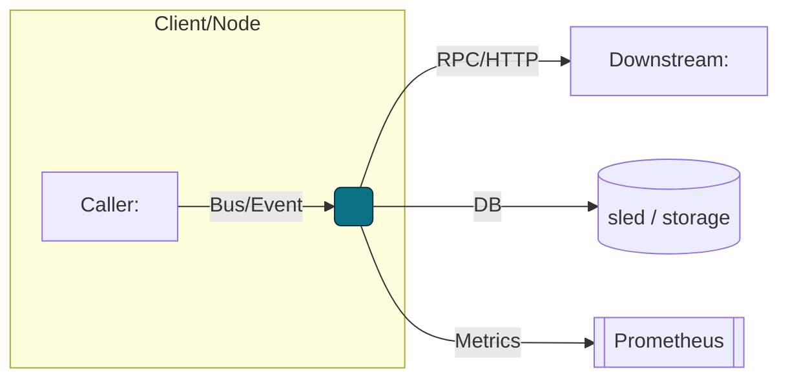
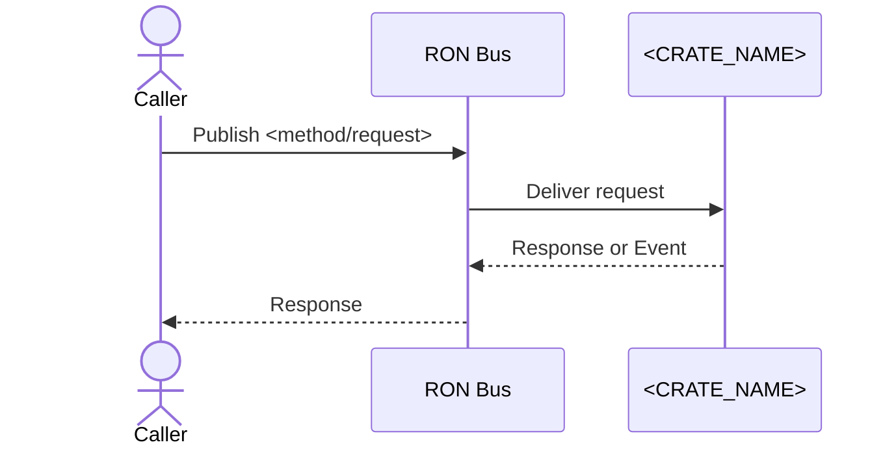
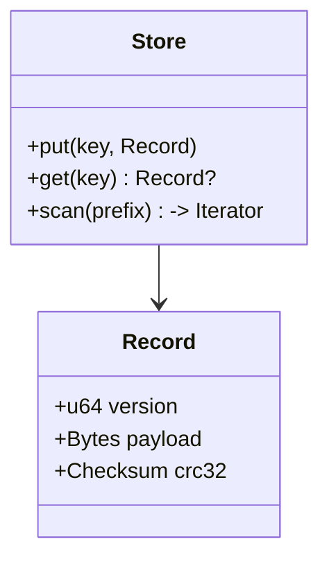
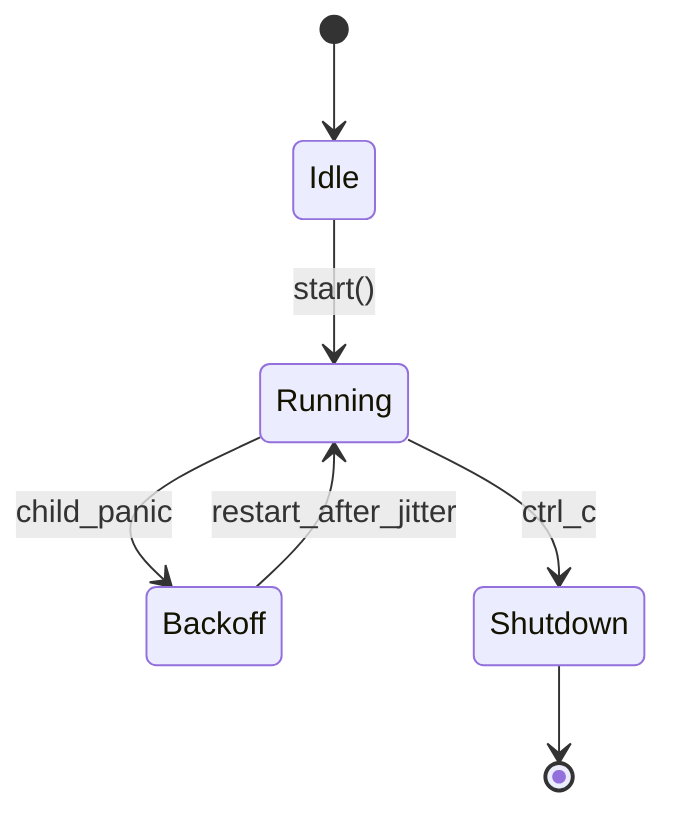

Below is a single file you can drop into any crate as `README.md`. It includes:

* Role-aware sections (library / service / binary) that you keep or delete.
* Opinionated observability, security, and acceptance gates.
* Canonical metrics & invariants hooks (aligned with RustyOnions).
* **Mermaid** examples for architecture, sequence, and state flows.
* Copy-paste commands (no leading `#`), checklists, and tables.

---

# <CRATE_NAME>

> **Role:** <library | service | binary/tool>  
> **Owner:** Stevan White (or maintainer)  
> **Status:** draft | beta | stable  
> **MSRV:** <e.g., 1.75.0>  
> **Last reviewed:** YYYY-MM-DD

Badges (optional):  
[]() []() []() []()

---

## 1) Overview

**What it is (one paragraph):**  
<Succinct purpose & why it exists. 3–5 sentences max.>

**How it fits (RustyOnions topology):**  
- **Pillar:** <which of the 12>  
- **Upstream callers:** <crates/services>  
- **Downstream deps:** <crates/services/external systems>  
- **Data it touches:** <in-memory | sled/db | network | disk>  
- **Security boundary:** <trust zone, key handling, PII? Y/N>

### 1.1 High-Level Architecture (Mermaid REQUIRED)



* Keep this diagram minimal but accurate (crates, external systems, observability).

---

## 2) Responsibilities & Boundaries

**MUST do (core responsibilities):**

* [ ] \<Responsibility 1 (invariant-aligned)>
* [ ] \<Responsibility 2>

**MUST NOT do (anti-scope / boundaries):**

* [ ] \<Non-goal 1>
* [ ] \<Non-goal 2>

**Acceptance Gates (PROOF you did it):**

* [ ] Unit/prop tests cover invariants X/Y/Z
* [ ] Metrics <name> exported & alert wired
* [ ] Health/readiness endpoints reflect real state
* [ ] Bench meets SLO: \<target + percentile>

---

## 3) Public Interfaces

> Keep only the subsections that apply to this crate.

### 3.1 Rust API (library)

Key modules/types:

* `pub mod <module>` — <what it exposes>
* `struct <Type>` — <role>
* `fn <function>(...) -> Result<...>` — <contract>
  Example:

```rust
use <crate>::<Type>;

fn main() -> anyhow::Result<()> {
    let t = <Type>::new();
    // ...
    Ok(())
}
```

### 3.2 Bus RPC / Events (service)

* **RPC:** `<method_name>(Request) -> Response` (topic: `ron://<domain>/<method>`)
* **Events Emitted:** `KernelEvent::<Variant>` (when <condition>)
* **Subscribed Topics:** `<topic>` (expects <schema>)



### 3.3 HTTP / gRPC (service/binary)

* **Base URL:** `http://<host>:<port>/`
* **Endpoints:**

  * `GET /healthz` → `200 OK {status:"ok"}`
  * `GET /readyz` → `200 OK {ready:true}`
  * `GET /metrics` → Prometheus text

### 3.4 CLI (binary/tool)

* **Usage:**

  ```bash
  cargo run -p <crate> -- <subcommand> [flags]
  ```
* **Commands:**

  * `<cmd>` — <description>
  * `<cmd> --flag` — <description>

---

## 4) Configuration

> Prefer environment variables first. Provide sane defaults.

| Variable       | Type            |       Default | Description                      |
| -------------- | --------------- | ------------: | -------------------------------- |
| `<VAR_NAME>`   | string/int/bool |   `<default>` | <what it controls>               |
| `LOG_LEVEL`    | string          |        `info` | tracing level (`trace`..`error`) |
| `METRICS_ADDR` | socket          | `127.0.0.1:0` | Prometheus exporter bind         |

**Flags (if any):**

```bash
--bind 0.0.0.0:8080
--config ./Config.toml
--max-conns 1024
```

**Feature flags (Cargo):**

* `default = ["tokio", "serde"]`
* `tls` — enables TLS via tokio-rustls
* `kameo` — optional actor integration

---

## 5) Build, Run, Test

**Build**

```bash
cargo build -p <crate>
```

**Run (service/binary)**

```bash
RUST_LOG=info METRICS_ADDR=127.0.0.1:0 cargo run -p <crate>
```

**Tests (unit/prop/docs)**

```bash
cargo test -p <crate> --all-features
cargo test -p <crate> --doc
```

**Lint & format**

```bash
cargo fmt --all
cargo clippy -p <crate> -- -D warnings
```

**Security & deps**

```bash
cargo deny check
```

**Bench (if provided)**

```bash
cargo bench -p <crate>
```

---

## 6) Observability

**Endpoints (service):**

* `/metrics` — Prometheus exposition
* `/healthz` — liveness (fast, dependency-light)
* `/readyz` — readiness (checks critical deps)

**Canonical Metrics (align with RustyOnions):**

* `bus_lagged_total{service="<crate>"}` — lagging bus consumers
* `bus_queue_depth{service="<crate>"}` — backlog gauge
* `request_latency_seconds{method,route}` — histogram
* `service_restarts_total{service}` — counter
* `errors_total{stage,kind}` — counter

**Tracing**

* Targets: `<crate>=info,axum=warn,tower_http=warn`
* Span fields: `request_id`, `peer_addr`, `route`, `status`

---

## 7) Performance & SLOs

| Metric         |        Target | Notes                |
| -------------- | ------------: | -------------------- |
| P50 latency    | \<e.g., 10ms> | steady-state         |
| P99 latency    | \<e.g., 50ms> | under nominal load   |
| Start-to-ready |  \<e.g., <1s> | cold start           |
| Max RPS        |       <value> | on <machine profile> |

> Document *how to reproduce* the numbers: dataset, flags, machine.

---

## 8) Data & Schema (if applicable)

**Data model (summary)**

* Keys: `<prefix>/<id>` in sled
* Values: bincode-serialized `<Type>` with schema version



**Migrations**

* Version gate in header (reject older than `<min>`).
* `upgrade_vN_to_vN+1()` idempotent & reversible notes.

---

## 9) Security & Privacy

* **Threat model:** STRIDE summary (<2 bullets each).
* **Key handling:** uses tokio-rustls; keys loaded from `<path>`; never logged.
* **PII:** \<none | list of fields>. Data retention: <policy>.
* **AuthN/Z:** \<how requests are authenticated/authorized>.
* **Input validation:** length limits, timeouts, deny-lists.
* **Supply chain:** pins to workspace deps; `cargo deny` clean.

---

## 10) Error Taxonomy

| Code/Variant              | When it happens     | User hint       | Retries        |
| ------------------------- | ------------------- | --------------- | -------------- |
| `ConfigError::MissingVar` | required env absent | set `<VAR>`     | no             |
| `NetError::Timeout`       | downstream slowness | try later       | yes (jittered) |
| `StateError::Conflict`    | concurrent update   | backoff + retry | yes            |

---

## 11) Concurrency Model

* **Runtime:** tokio (1.x), cooperative tasks.
* **I/O:** `AsyncReadExt/AsyncWriteExt`, explicit timeouts.
* **Channels:** broadcast bus (cloneable), mpsc for work queues.
* **Rules:** never hold a lock across `.await` in supervisory paths.



---

## 12) Compatibility & Requirements

* **Rust:** MSRV \<X.Y.Z>
* **OS:** macOS 10.15+, Linux x86\_64; Containers: yes
* **TLS:** tokio\_rustls 0.26.x
* **HTTP:** axum 0.7.x, tower-http 0.6.x
* **DB:** sled (if used)

---

## 13) Examples

Minimal example (library):

```rust
use <crate>::Client;

fn main() -> anyhow::Result<()> {
    let c = Client::connect("127.0.0.1:12345")?;
    let rsp = c.ping()?;
    println!("{rsp:?}");
    Ok(())
}
```

Service curl:

```bash
curl -sS http://127.0.0.1:8080/healthz | jq .
```

---

## 14) Troubleshooting

* **Port already in use:** change `--bind` or `<VAR>`.
* **TLS errors:** ensure tokio\_rustls config matches certs; don’t use `rustls::ServerConfig` directly.
* **Sled permission:** verify directory exists & writable.
* **High latency:** check CPU throttling, RUST\_LOG spam, or missing `--release`.
* **Bus “lagged”:** inspect `bus_queue_depth`, backpressure settings.

---

## 15) Development Notes

**Project conventions (RustyOnions):**

* Axum handlers end with `.into_response()`.
* Re-export crate surface in `lib.rs`: `Bus`, `KernelEvent`, `Metrics`, `HealthState`, `Config`, `wait_for_ctrl_c()`.
* Transport TLS uses `tokio_rustls::rustls::ServerConfig`.

**Pre-commit quickcheck**

```bash
cargo fmt --all
cargo clippy -- -D warnings
cargo test
cargo deny check
```

---

## 16) Mermaid Diagrams — Policy & Tooling (REQUIRED)

Every README must include at least:

1. One **architecture** (flowchart) diagram
2. One **sequence** diagram for a common path
3. One **state** diagram if the crate has lifecycle/actors

**Authoring tips**

* Prefer concise node labels (`crate::module`).
* Theme: default. Avoid color overload; highlight only the subject node.

**Render locally (SVG)**

```bash
npm i -g @mermaid-js/mermaid-cli
mmdc -i docs/arch.mmd -o docs/arch.svg
```

**Render via Docker (no Node install)**

```bash
docker run --rm -v "$PWD":/data minlag/mermaid-cli mmdc -i docs/arch.mmd -o docs/arch.svg
```

**CI (GitHub Actions snippet)**

```yaml
name: render-mermaid
on: [push, pull_request]
jobs:
  mmdc:
    runs-on: ubuntu-latest
    steps:
      - uses: actions/checkout@v4
      - run: npm i -g @mermaid-js/mermaid-cli
      - run: |
          mkdir -p docs
          for f in $(git ls-files '*.mmd'); do
            out="${f%.mmd}.svg"
            mmdc -i "$f" -o "$out"
          done
```

---

## 17) Roadmap & TODO

* [ ] Milestone 1 — <goal>
* [ ] Milestone 2 — <goal>
* [ ] Hardening tasks — limits, timeouts, fuzz targets

---

## 18) Changelog

See [CHANGELOG.md](./CHANGELOG.md). Follow SemVer; document breaking changes with migration notes.

---

## 19) License

Dual-licensed under **MIT** or **Apache-2.0**. See [LICENSE-MIT](../LICENSE-MIT) and [LICENSE-APACHE](../LICENSE-APACHE).

---

## 20) Contributing

PRs welcome! Please run fmt/clippy/tests and include:

* Updated diagrams (if topology changed)
* Docs & examples
* Bench impact (if perf-sensitive)

> Also see: `docs/IDB.md` (Invariant-Driven Blueprint) for this crate.


---

### Notes on using this template well

- **Be ruthless about scope.** Fill “MUST NOT” with real anti-goals to prevent creep.  
- **Prove it.** Acceptance gates are how reviewers check the work (tests, metrics, SLOs).  
- **Treat diagrams as code.** Keep `.mmd` sources under `docs/` and render SVGs in CI.  
- **Keep examples compiling.** Prefer `rustdoc` examples so `cargo test --doc` enforces them.  
- **Pin the MSRV** and record breaking changes in the changelog.

