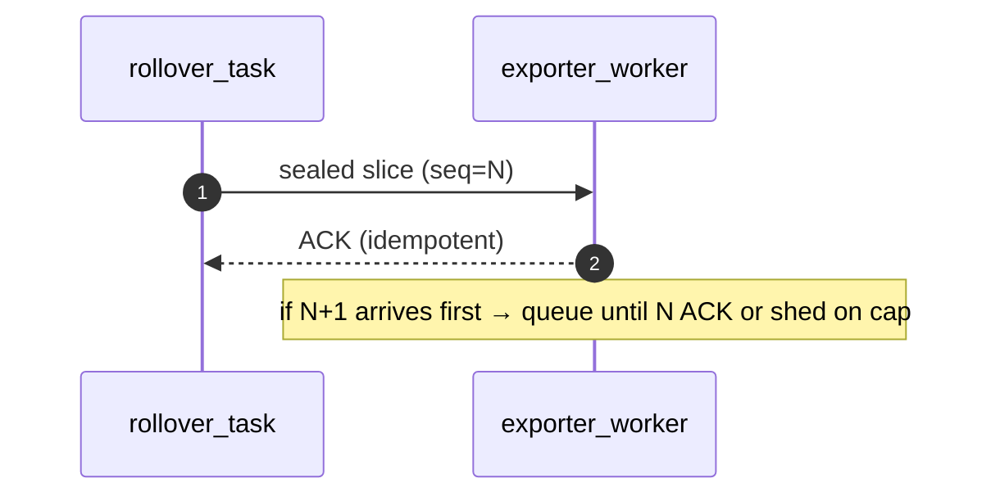
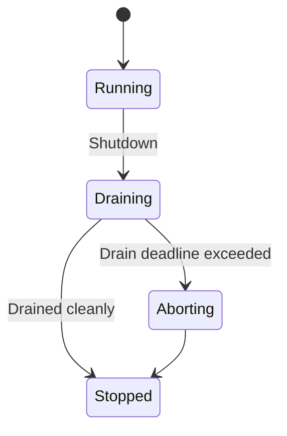
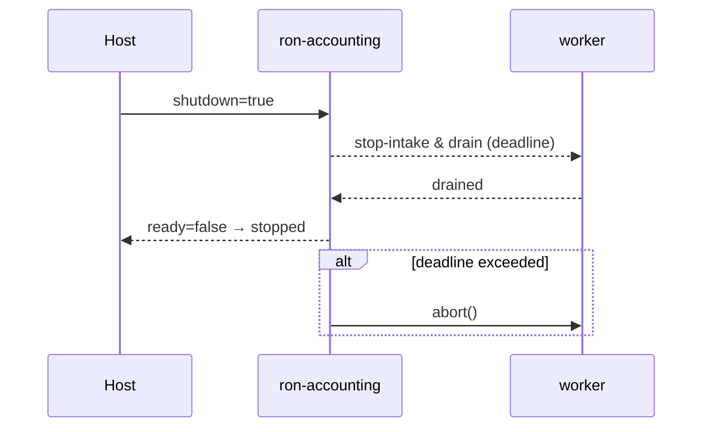
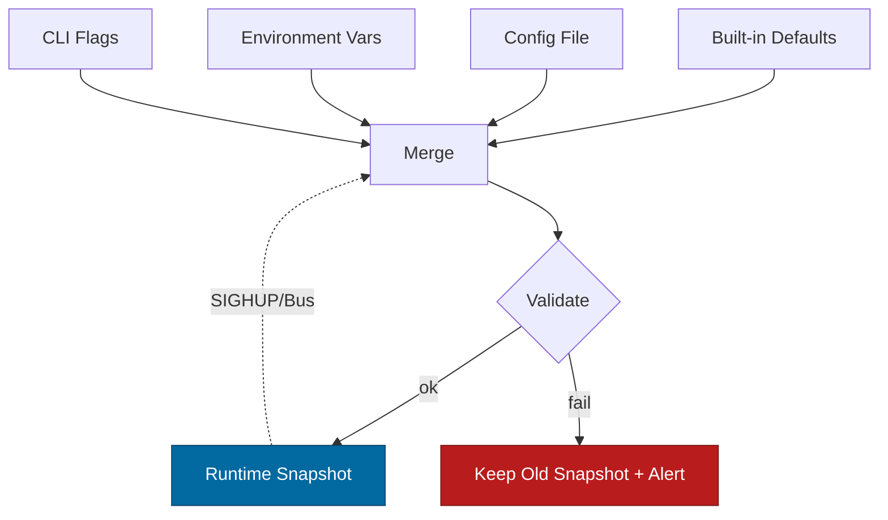

# Combined Markdown

_Source directory_: `crates/ron-accounting/docs`  
_Files combined_: 13  
_Recursive_: 0

---

### Table of Contents

- API.MD
- CONCURRENCY.MD
- CONFIG.MD
- GOVERNANCE.MD
- IDB.md
- INTEROP.MD
- OBSERVABILITY.MD
- OLD_README.md
- PERFORMANCE.MD
- QUANTUM.MD
- RUNBOOK.MD
- SECURITY.MD
- TESTS.MD

---

## API.MD
_File 1 of 13_


````markdown
---
title: API Surface & SemVer Reference — ron-accounting
status: draft
msrv: 1.80.0
last-updated: 2025-10-15
audience: contributors, auditors, API consumers
---

# API.md — ron-accounting

## 0. Purpose

This document captures the **public API surface** of the crate and how we manage it:

- Snapshot of exported functions, types, traits, modules (what external crates see).
- **SemVer discipline**: what is additive vs breaking vs patch.
- Alignment with `CHANGELOG.md` (behavioral vs surface changes).
- CI-enforceable via `cargo public-api` and `cargo-semver-checks`.
- Acts as the **spec** for integrators embedding `ron-accounting`.

> ron-accounting is a **library** first. Optional adapters (HTTP/UDS, OTEL) are exposed behind features. The core keeps a **small, stable** surface focused on recording usage, sealing time-sliced snapshots, and **ordered + idempotent** export.

---

## 1. Public API Surface

> Generated in CI with:
>
> ```bash
> cargo public-api --simplified --deny-changes -p ron-accounting
> ```
>
> Below is the **intended stable surface**. Treat it as a contract; changes require a SemVer-aware PR.

### 1.1 Top-level Modules (re-exported)

```text
pub mod accounting     // hot-path recording & sealing
pub mod exporter       // Exporter trait + reference exporters (feature-gated impls)
pub mod wal            // bounded write-ahead logging (feature "wal")
pub mod config         // Config structs & validation helpers
pub mod metrics        // Metrics handles (registration-by-host pattern)
pub mod readiness      // Readiness snapshot & keys
pub mod errors         // Error/Result taxonomy (#[non_exhaustive] enums)
````

### 1.2 Core Types & Traits (stable)

```text
// accounting
pub struct Recorder;                      // low-overhead counters entry-point
pub struct Window;                        // time-slice view (UTC-aligned)
pub struct SealedSlice { /* opaque */ }   // immutable sealed slice + digest
pub struct SliceId { pub tenant: TenantId, pub dimension: Dimension, pub seq: u64 } // stable fields
pub struct Row { pub key: AccountKey, pub inc: u64 }                                // saturating adds
pub struct AccountKey { pub ns: Namespace, pub id: u128 }
pub type TenantId = u128;
#[non_exhaustive]
pub enum Dimension { Bytes, Requests, Cpu } // extensible; new variants minor
pub struct RolloverHandle;                 // host-triggered/manual sealing
pub struct AckLru;                         // idempotence cache (opaque newtype)

// exporter
pub trait Exporter: Send + Sync {
    /// Put a sealed slice (idempotent). Must return Duplicate on dup.
    fn put<'a>(&'a self, slice: &'a SealedSlice) -> futures::future::BoxFuture<'a, Result<Ack, Error>>;
}
#[non_exhaustive]
pub enum Ack { Ok, Duplicate }
pub struct ExporterRouter;                 // per-stream dispatch (opaque)
pub struct ExportReport { pub status: Ack, pub latency: std::time::Duration } // non-breaking to extend

// wal (feature = "wal")
pub struct Wal;                            // bounded WAL handle
pub struct WalConfig { pub dir: std::path::PathBuf, pub max_bytes: u64, pub max_entries: u64 }
pub struct WalStats { pub size_bytes: u64, pub entries: u64 }

// config
pub struct Config;                         // see docs/CONFIG.md (serde types)
pub fn validate(cfg: &Config) -> anyhow::Result<()>; // fail-closed rules

// metrics
pub struct Metrics { /* clones of prometheus handles */ }
impl Metrics { pub fn new(reg: &prometheus::Registry) -> Self; }

// readiness
#[non_exhaustive]
pub enum ReadyKey { ConfigLoaded, QueuesBoundedOk, ExporterOk, WalOk, BoundaryTickerOk }
pub struct Readiness;
impl Readiness { pub fn snapshot(&self) -> (bool, smallvec::SmallVec<[ReadyKey; 4]>); }

// errors
pub type Result<T> = std::result::Result<T, Error>;
#[non_exhaustive]
pub enum Error {
    Busy,                  // hot-path backpressure (try_send)
    OrderOverflow,         // lane cap hit while holding order
    Timeout,               // I/O or op deadline exceeded
    DuplicateExport,       // downstream idempotent dup
    PersistenceFull,       // WAL quotas exceeded
    WalCorrupt,            // checksum/parse failure (replay)
    SchemaViolation,       // DTO strictness (adapter/marshal)
    Io(std::io::Error),    // bubbled up I/O
    Other(String),         // fallback; avoid matching on message
}
```

### 1.3 Feature-Gated APIs

```text
# feature = "http-adapter"
pub mod http {
    pub struct Server;                       // axum/hyper wrapper
    pub struct BindAddrs { pub bind: std::net::SocketAddr, pub metrics: std::net::SocketAddr }
    pub fn run(server: Server) -> impl Future<Output = anyhow::Result<()>>;
    // Endpoints: /export, /metrics, /readyz, /healthz (documented in OBSERVABILITY.md)
}

# feature = "wal"
pub use wal::{Wal, WalConfig, WalStats};

# feature = "otel"
pub mod otel {
    pub fn init_tracer(service_name: &str) -> anyhow::Result<()>;
}
```

> **Rationale:** Feature flags keep the **core** API minimal and stable. Adapters and telemetry are optional and may evolve faster without breaking core consumers.

---

## 2. SemVer Discipline

### 2.1 Additive (Minor / Non-Breaking)

* Adding **new** free functions, trait impls, modules, or `struct` fields **behind `#[non_exhaustive]`** (or with defaulted builders).
* Adding **enum variants** to `#[non_exhaustive]` enums (`Dimension`, `Ack`, `ReadyKey`, `Error`).
* Adding methods that don’t change existing behavior.
* Adding new features (e.g., `otel`) that are **off by default**.

### 2.2 Breaking (Major)

* Removing, renaming, or moving **public items**.
* Changing function signatures or trait bounds of `Exporter::put`.
* Making formerly `#[non_exhaustive]` enums **exhaustive**, or re-ordering stable fields.
* Changing `Error` discriminants that external code may match without `#[non_exhaustive]`.
* Exposing new required type parameters on public types.

### 2.3 Patch-Level

* Documentation, typos, internal perf changes with identical surface and semantics.
* Extending `Error::Other(String)` messages (non-contractual text).
* Tightening internal validation while keeping same public error **variant**.

> **Behavior vs Surface:** If the public **shape** is unchanged but behavior is meaningfully different (e.g., stricter ordering checks), log it under `CHANGELOG.md` **Behavior** section with migration notes.

---

## 3. Stability Guarantees

* **MSRV:** `1.80.0` (pinned; raising MSRV is a **minor** bump at minimum).
* **Unsafe Rust:** forbidden unless justified and code-reviewed with security tag.
* **No internal leaks:** avoid exposing `tokio` types directly unless intentional (prefer opaque newtypes).
* **Non-exhaustive enums** for all externally matched enums.
* **Opaque internals:** `Recorder`, `SealedSlice`, `ExporterRouter`, `RolloverHandle`, `AckLru` keep fields private to permit optimizations.

---

## 4. Invariants (API-level)

* **Core remains library-first:** The only required trait for integration is `Exporter`; everything else can be embedded without running the HTTP adapter.
* **Idempotence is explicit:** `Ack::{Ok,Duplicate}` is the *only* acknowledged success states for `Exporter::put`.
* **Ordering is implicit in types:** `SliceId.seq: u64` is **monotone** per `(tenant, dimension)`; helpers never expose mutation of `seq`.
* **Config is parsed & validated in-crate:** `config::validate` is the fail-closed gate used by adapters and hosts.
* **Errors are typed:** Catch-all stringy errors stay in `Error::Other`; do not proliferate variants without strong reason.

---

## 5. Tooling

* **cargo public-api** — detects surface diffs.

  * Command: `cargo public-api --simplified --deny-changes -p ron-accounting`
* **cargo semver-checks** — static SemVer compliance (optional but recommended).

  * Command: `cargo semver-checks check-release -p ron-accounting`
* **cargo doc** — published docs, `#![deny(missing_docs)]`.
* **API snapshots** — store text outputs under:

  * `docs/api-history/ron-accounting/<crate-version>.txt`

---

## 6. CI & Gates

* On every PR:

  * Run `cargo public-api` and post the diff as a PR comment.
  * Fail the job if changes are detected **without**:

    * a matching `CHANGELOG.md` entry, **and**
    * an explicit “SemVer: {patch|minor|major}” tag in the PR description.
  * Optionally run `cargo semver-checks` to flag accidental breakage.
* On release:

  * Generate and commit `docs/api-history/.../<version>.txt` snapshot.
  * Ensure `Cargo.toml` version bump aligns with the **kind** of changes.

**Suggested GitHub Actions step (sketch):**

```yaml
- name: Public API diff
  run: |
    cargo install cargo-public-api || true
    cargo public-api --simplified -p ron-accounting > public-api.txt
    git diff --exit-code -- public-api.txt || echo "::warning file=docs/API.md::Public API changed; confirm SemVer & CHANGELOG"
```

---

## 7. Acceptance Checklist (Definition of Done)

* [ ] Current API snapshot generated & stored in `docs/api-history`.
* [ ] SemVer assessment documented in PR (`SemVer: ...`).
* [ ] CI gate passes (`cargo public-api` and, if enabled, `cargo semver-checks`).
* [ ] `CHANGELOG.md` updated for any surface or behavioral change.
* [ ] Docs/tests/examples updated (including `README.md` fragments).
* [ ] **Adapters:** endpoints documented in `docs/OBSERVABILITY.md` + security notes in `docs/SECURITY.md`.

---

## 8. Appendix

### 8.1 Minimal usage examples (stable patterns)

```rust
use ron_accounting::{accounting::Recorder, exporter::{Exporter, Ack}, Result};

async fn export_one<E: Exporter>(rec: &Recorder, exp: &E) -> Result<()> {
    let slice = rec.seal_now()?;                // SealedSlice (opaque)
    let ack = exp.put(&slice).await?;           // Ack::Ok or Ack::Duplicate
    match ack {
        Ack::Ok | Ack::Duplicate => Ok(()),
        // Ack is #[non_exhaustive]; new success states won't break this match.
    }
}
```

```rust
use ron_accounting::{config::Config, config::validate};

fn load_cfg(cfg: &Config) -> anyhow::Result<()> {
    validate(cfg) // Fail-closed; maps to Error variants at adapter boundary
}
```

### 8.2 SemVer annotations we rely on

```rust
#[non_exhaustive]
pub enum Error { /* see §1.2 */ }

#[non_exhaustive]
pub enum Dimension { Bytes, Requests, Cpu /* future-ready: e.g., Gpu, Tokens */ }

#[non_exhaustive]
pub enum ReadyKey { ConfigLoaded, QueuesBoundedOk, ExporterOk, WalOk, BoundaryTickerOk }
```

### 8.3 Planned evolution (roadmap, non-binding)

* Add `Dimension::Tokens` (minor).
* Add `Exporter::put_batch(&[&SealedSlice])` (minor, new method on trait via extension trait to avoid breaking).
* Add `Recorder::seal_at(utc_boundary: std::time::SystemTime)` (minor).
* Add `Error::WalUnavailable` (minor; enum is non-exhaustive).
* Introduce builder types `RecorderBuilder`, `ExporterRouterBuilder` (minor).

> **No planned breaking** changes to existing trait signatures; batching will be delivered via **extension traits** to preserve `Exporter` stability.

### 8.4 References

* Rust SemVer: [https://doc.rust-lang.org/cargo/reference/semver.html](https://doc.rust-lang.org/cargo/reference/semver.html)
* cargo-public-api: [https://github.com/Enselic/cargo-public-api](https://github.com/Enselic/cargo-public-api)
* cargo-semver-checks: [https://github.com/obi1kenobi/cargo-semver-checks](https://github.com/obi1kenobi/cargo-semver-checks)

---

## 9. Current Public API Snapshot (to be auto-generated in CI)

> Replace this fenced block on release with the actual `cargo public-api` output.
> Until then, it serves as a human-curated target surface.

```text
pub mod accounting
pub mod exporter
pub mod wal
pub mod config
pub mod metrics
pub mod readiness
pub mod errors

pub struct accounting::Recorder
pub struct accounting::Window
pub struct accounting::SealedSlice
pub struct accounting::SliceId
pub struct accounting::Row
pub struct accounting::AccountKey
pub type  accounting::TenantId = u128
pub enum  accounting::Dimension

pub trait exporter::Exporter
pub enum  exporter::Ack
pub struct exporter::ExporterRouter
pub struct exporter::ExportReport

pub struct wal::Wal
pub struct wal::WalConfig
pub struct wal::WalStats

pub struct config::Config
pub fn    config::validate(cfg: &Config) -> anyhow::Result<()>

pub struct metrics::Metrics
pub fn    metrics::Metrics::new(reg: &prometheus::Registry) -> metrics::Metrics

pub struct readiness::Readiness
pub enum  readiness::ReadyKey
pub fn    readiness::Readiness::snapshot(&self) -> (bool, smallvec::SmallVec<[ReadyKey; 4]>)

pub enum  errors::Error
pub type  errors::Result<T>
```

---

✅ **Why this matters:**

* Keeps the surface **small, stable, and auditable**.
* Makes SemVer **mechanical** with CI.
* Leaves room to optimize internals (hot-path atomics, sharding, WAL details) **without** breaking consumers.
* Aligns tightly with our IDB: typed errors, explicit idempotence, ordered exports, and library-first ergonomics.

```
```


---

## CONCURRENCY.MD
_File 2 of 13_


````markdown
---
title: Concurrency Model — ron-accounting
crate: ron-accounting
owner: Stevan White
last-reviewed: 2025-10-14
status: draft
template_version: 1.1
msrv: 1.80.0
tokio: "1.x (pinned at workspace root)"
loom: "0.7+ (dev-only)"
lite_mode: "For small library crates: fill §§1,3,4,5,10,11 and mark others N/A"
---

# Concurrency Model — ron-accounting

This document makes the concurrency rules **explicit**: tasks, channels, locks, shutdown, timeouts,
and validation (property/loom/TLA+). It complements `docs/SECURITY.md`, `docs/CONFIG.md`,
and the crate’s `README.md` and `IDB.md`.

> **Golden rule:** never hold a lock across `.await` in supervisory or hot paths.

---

## 0) Lite Mode

`ron-accounting` is a **library** that may run **background tasks** (rollover, exporter, WAL replay) when enabled by the host.
Therefore, **full mode** applies by default. For pure-counter embedding without exporters, you may treat §§2/6/7 as N/A.

**In lite mode (no background tasks), the host must:**
- Trigger **manual rollovers on UTC boundaries**.
- Propagate **shutdown** and ensure in-flight work is drained before process exit (reuse the patterns in §6).

---

## 1) Invariants (MUST)

- [I-async-1] **No lock across `.await`.** Guards **must** be dropped before any await point.
- [I-async-2] **Single writer** per export stream `(tenant,dimension)`; readers operate on sealed snapshots.
- [I-async-3] **Bounded channels only** (`mpsc`, `broadcast`, `watch`) with explicit overflow/drop policy.
- [I-async-4] **Explicit timeouts** on I/O (HTTP/OAP) and WAL fs ops; fail-fast with typed errors.
- [I-async-5] **Cooperative cancellation:** every `.await` is cancel-safe or guarded by `select!`.
- [I-async-6] **Graceful shutdown:** observe `Shutdown` signal; stop intake, drain pending within deadline; abort stragglers.
- [I-async-7] **No blocking syscalls** on the reactor; use `spawn_blocking` for fsync/rename if needed (short & bounded).
- [I-async-8] **No task leaks:** all spawned tasks are join-tracked; detach only for fire-and-forget with rationale.
- [I-async-9] **Backpressure over buffering:** prefer `try_send`/reject to growing queues.
- [I-async-10] **Framing is checked:** HTTP/OAP frames length-delimited (≤1 MiB) and chunked (~64 KiB); verify before allocation.
- [I-async-11] **UTC windowing is monotone:** boundary detection is idempotent under clock skew (≤500 ms) and jump; exactly one rollover per boundary.
- [I-async-12] **Export ordering enforced:** per-stream sequence ordering cannot be violated by concurrency.
- [I-async-13] **Async Drop:** never block in `Drop`; teardown via explicit async `close()`/`shutdown()`.

---

## 2) Runtime Topology

**Runtime:** Tokio multi-threaded. Library exposes constructors that spawn a minimal set of tasks when exporters/WAL are enabled.

**Primary tasks (names used in code & logs):**
- `rollover_task` — Aligns to UTC boundaries; seals shards → `pending_slices`; computes `b3` + `prev_b3`. **Critical.**
- `wal_replay_task` (amnesia=false, wal.enabled=true) — On startup, scans WAL, rehydrates `pending_slices`. **Best-effort.**
- `exporter_router` — Dequeues sealed slices; routes into per-stream ordered lanes; enforces `seq` ordering with fairness (§11).
- `exporter_worker-{tenant}-{dimension}` — **Single writer** per stream; performs `put()` with jittered backoff; maintains ACK LRU.
- `metrics_task` (adapter builds) — Scrapes internal gauges to Prometheus registry (or just registers Once).
- `shutdown_watcher` — Fan-out `watch<bool>` for cooperative cancellation.

**Worker bound:** at most **one** `exporter_worker` per **active** `(tenant,dimension)` stream.  
The router applies **cross-tenant fairness** (round-robin or WFQ) so a hot tenant cannot starve others (§11).

```mermaid
flowchart TB
  subgraph ron-accounting runtime
    A[shutdown_watcher]:::ctrl
    B[rollover_task]:::hot -->|mpsc:sealed( pending_slices )| R[exporter_router]:::hot
    W[wal_replay_task] --> R
    R -->|mpsc:lane(ordered)| E1[exporter_worker bytes]:::io
    R -->|mpsc:lane(ordered)| E2[exporter_worker requests]:::io
  end
  classDef hot fill:#0ea5e9,stroke:#0c4a6e,color:#fff;
  classDef io fill:#10b981,stroke:#065f46,color:#fff;
  classDef ctrl fill:#64748b,stroke:#334155,color:#fff;
````

**Text description:** `rollover_task` seals active counters and pushes sealed slices into a bounded `pending_slices` queue. `wal_replay_task` (if enabled) pre-populates that queue from WAL. `exporter_router` drains `pending_slices`, enqueues by stream `(tenant,dimension)` into bounded per-stream lanes, and each lane has exactly one `exporter_worker` enforcing ordering and idempotent `put()`.

---

## 3) Channels & Backpressure

**All channels are bounded.** Capacities default from config; shown here as symbols.

| Name                   | Kind      | Capacity                          | Producers → Consumers             | Backpressure Policy                     | Drop Semantics                            |
| ---------------------- | --------- | --------------------------------- | --------------------------------- | --------------------------------------- | ----------------------------------------- |
| `pending_slices_tx`    | `mpsc`    | `pending_slices_cap`              | rollover/wal → exporter_router    | `try_send`; else `OrderOverflow`        | `rejected_total{reason="capacity"}`       |
| `lane_{t,d}_tx`        | `mpsc`    | `ordered_buffer_cap` (per-stream) | exporter_router → exporter_worker | hold-for-order until `N` ACK, else shed | `rejected_total{reason="order_overflow"}` |
| `events_tx` (optional) | broadcast | 1024 (sampled)                    | core → observers                  | drop oldest on lag                      | `bus_lagged_total` + warn                 |
| `shutdown_rx`          | watch     | 1                                 | supervisor → all                  | last-write-wins                         | N/A                                       |

**Guidelines:**

* Always prefer `try_send` and return `Error::Busy`/`OrderOverflow` rather than blocking producers.
* Maintain `queue_depth{queue}` gauges (sampled if high cardinality).
* Make “shed” observable via metrics and structured logs.

---

## 4) Locks & Shared State

**Allowed**

* `OnceLock` for global registries (metrics, dimension consts).
* Short-lived `parking_lot::Mutex/RwLock` for metadata & LRU caches (ACK cache), **never** held across `.await`.
* `Arc<Shard>` containing `AHashMap`/`DashMap` for counters; hot path uses atomics and interior mutability without `.await`.

**Forbidden**

* Holding any lock across `.await`.
* Nested locks beyond this hierarchy without justification.

**Hierarchy (coarse to fine)**

1. `state_meta` (cfg snapshot, readiness flags)
2. `export_cache` (ACK LRU)
3. `shard_n` (hot counter maps)

**Pattern:** Compute → drop guard → await:

```rust
let (slice_id, rows) = {
  let g = shard.lock();     // SHORT critical section
  g.seal_now()
};                           // guard dropped
exporter.enqueue(slice_id, rows).await?;
```

---

## 5) Timeouts, Retries, Deadlines

* **HTTP/OAP exporter I/O:** `read=5s`, `write=5s`, `idle=60s` (configurable).
* **Exporter retry:** jittered exponential backoff (base 50 ms, cap 5 s), idempotent `put()` only, **global op deadline** 10 s (configurable); retries must respect remaining budget.
* **WAL fs ops:** metadata ops with 2 s timeout; `fsync` in `spawn_blocking` guarded by a **5 s** per-op deadline; if budget is exhausted, error out (`PersistenceFull`).
* **Rollover boundary detection tolerance:** ≤500 ms skew; duplicate boundary events are collapsed.



---

## 6) Cancellation & Shutdown

* **Signal source:** host sends `Shutdown` over `watch<bool>` or drops the handle.
* **Propagation:** all tasks run `select!{ _ = shutdown.changed() => … }`.
* **Sequence:**

  1. **Stop intake** (stop recording new events into new slices; current windows still seal once).
  2. `exporter_router` **drains** `pending_slices` into lanes until **drain_deadline** (default 5 s).
  3. Workers stop creating new connections when shutdown is visible; finish in-flight `put()` within per-op deadline (respects global op deadline).
  4. After deadline, call `abort()` on remaining tasks; increment `tasks_aborted_total{kind}`.



---

## 7) I/O & Framing

* **Framing:** length-delimited DTOs, ≤1 MiB/frame; body streamed in ~64 KiB chunks.
* **Validation:** deny unknown fields, check body length before allocation; 413/429 on violation.
* **Decompression (adapter):** enforce `decompress_ratio_cap` (see `CONFIG.md`) **before** allocating expanded buffers.
* **Shutdown semantics:** call `AsyncWriteExt::shutdown().await` on success or error; tolerate half-closed peers.

---

## 8) Error Taxonomy (Concurrency-Relevant)

| Error             | Raised by               | Retry?           | Metric                                    | Notes                          |
| ----------------- | ----------------------- | ---------------- | ----------------------------------------- | ------------------------------ |
| `Busy`            | record/enqueue          | caller-dependent | `busy_rejections_total{endpoint}`         | capacity hit on hot path       |
| `OrderOverflow`   | exporter_router/lanes   | no               | `rejected_total{reason="order_overflow"}` | preserves ordering invariant   |
| `Timeout`         | I/O/WAL                 | sometimes        | `io_timeouts_total{op}`                   | attach op (`read/write/fsync`) |
| `Canceled`        | during shutdown         | no               | `tasks_canceled_total{kind}`              | cooperative                    |
| `DuplicateExport` | exporter_worker         | no               | `accounting_exports_total{status="dup"}`  | idempotent downstream          |
| `PersistenceFull` | WAL append/fsync budget | no               | `rejected_total{reason="wal_full"}`       | bounded persistence            |
| `WalCorrupt`      | WAL replay/scan         | no               | `accounting_wal_corrupt_total`            | skip bad frame; continue       |
| `SchemaViolation` | decoder                 | no               | `dto_violation_total`                     | 400/413 path                   |

---

## 9) Metrics (Concurrency Health)

* `queue_depth{queue}` gauge (sampled)
* `queue_dropped_total{queue,reason}`
* `tasks_spawned_total{kind}` / `tasks_aborted_total{kind}`
* `io_timeouts_total{op}` (`read`,`write`,`fsync`)
* `backoff_retries_total{op}`
* `busy_rejections_total{endpoint}`
* `accounting_exports_total{status}` (`ok|dup|retry_network|retry_remote_5xx|fail`)
* `accounting_degraded` gauge

---

## 10) Validation Strategy

**Unit / Property**

* **Ordering:** Given events producing slices `… N, N+1 …`, prove `N+1` is not exported before `N` ACK unless shed.
* **Monotonic boundary:** Skew/jump tests trigger **exactly one** rollover per UTC boundary.
* **Backpressure:** With tiny caps, sustained input yields rejects (no deadlock).
* **Global deadlines:** ensure exporter retries respect a fixed 10 s budget by measuring elapsed.

**Loom (model)**

* Model 1 producer → `pending_slices` → router → lane → worker, with shutdown races.
* Assertions: no deadlock, no lost wakeups, **no lock across await** patterns.

**Fuzz**

* Frame fuzz for DTO limits; WAL record-length corruption.

**Chaos**

* Inject 10–30% network failure; ensure bounded backlog, proper shedding, and full drain post-recovery.

**TLA+ sketch (optional)**

* Variables: `Seq`, `Lane`, `ACKed`. Invariants: `\A k: Exported(k) => \A j < k: Exported(j) \/ Shed(j)`; Liveness: `Eventually \A k in Pending: Exported(k) \/ Shed(k)`.

---

## 11) Code Patterns (Copy-Paste)

**Bounded lane with ordered enqueue (no await under lock)**

```rust
// inside exporter_router
if let Some(tx) = lanes.get(&(tenant, dimension)) {
    if let Err(tokio::sync::mpsc::error::TrySendError::Full(_)) = tx.try_send(slice) {
        metrics::rejected_total("order_overflow").inc();
        return Err(Error::OrderOverflow);
    }
} else {
    // create lane (bounded mpsc) and spawn single-writer worker
}
```

**Router fairness (round-robin; WFQ-ready)**

```rust
/// For "wfq", replace rr with a small weighted ring where weight derives from a per-tenant u8 (1..=8).
#[derive(Default)]
struct Router {
    rr: smallvec::SmallVec<[StreamId; 64]>, // active order
    next: usize,
}

impl Router {
    fn next_stream(&mut self) -> Option<StreamId> {
        if self.rr.is_empty() { return None; }
        let id = self.rr[self.next];
        self.next = (self.next + 1) % self.rr.len();
        Some(id)
    }
}

// In exporter_router loop:
while let Some(slice) = pending_slices_rx.recv().await {
    let id = StreamId::from(&slice); // (tenant, dimension)
    let lane = lanes.entry(id).or_insert_with(|| make_lane_and_spawn_worker(id));
    if let Err(tokio::sync::mpsc::error::TrySendError::Full(_)) = lane.try_send(slice) {
        metrics::rejected_total("order_overflow").inc();
        // Optional: adjust fairness ordering to avoid hammering a perpetually full lane.
        continue;
    }
    // Optional: (re)register id in rr if it became active.
}
```

**Worker respects ordering & idempotence (global deadline aware)**

```rust
let op_budget = tokio::time::Duration::from_secs(10);
loop {
  tokio::select! {
    _ = shutdown.changed() => break,
    Some(slice) = lane_rx.recv() => {
      if !ordering_state.ready_for(&slice.id.seq) {
        // keep in lane; router enforces cap; no busy-wait
        continue;
      }
      let start = tokio::time::Instant::now();
      let mut backoff = backoff::Exponential::new(50, 5_000);
      loop {
        let left = op_budget.saturating_sub(start.elapsed());
        if left.is_zero() { break; } // give up within budget
        match tokio::time::timeout(left, exporter.put(&slice)).await {
          Ok(Ok(Ack::Ok | Ack::Duplicate)) => { ordering_state.ack(slice.id.seq); break; }
          Ok(Err(e)) if e.is_retryable() => { backoff.sleep_jittered().await; continue; }
          Ok(Err(_e)) | Err(_timeout) => { metrics::exports_fail().inc(); break; }
        }
      }
    }
  }
}
```

**No lock across `.await` (LRU example)**

```rust
let existed = { export_cache.lock().contains(&key) }; // drop guard
if !existed {
  let res = remote_check(&key).await?;
  { export_cache.lock().insert(key.clone(), res); } // short insert
}
```

**Shutdown drain with deadline**

```rust
let deadline = tokio::time::Instant::now() + cfg.drain_deadline;
tokio::select! {
  _ = drain_all() => {},
  _ = tokio::time::sleep_until(deadline) => { abort_inflight().await; }
}
```

---

## 12) Configuration Hooks (Quick Reference)

* `accounting.pending_slices_cap`, `accounting.exporter.ordered_buffer_cap`
* `accounting.fairness` (router’s cross-tenant scheduling; `round_robin` or `wfq`)
* For **WFQ**, weights derive from a tiny per-tenant map (`u8` weight 1..=8), default 1; configured by the host.
* I/O timeouts & backoff: `exporter.backoff_*`
* `drain_deadline` (in adapter/host)
* WAL caps: size/entries/age

Authoritative schema: `docs/CONFIG.md`.

---

## 13) Known Trade-offs / Nonstrict Areas

* **Lane cap vs. fairness:** `ordered_buffer_cap` too small may shed under bursty out-of-order readiness; we prefer **order preservation** over losslessness.
* **`spawn_blocking` for fsync:** tiny blocking windows traded for durability.
* **Broadcast events:** lagging subscribers are **dropped** to protect hot path.
* **Multi-node semantics:** This model assumes a **single-node writer** per `(tenant,dimension)`. For HA, coordinate sequence/ACK via `ron-ledger` (or a thin ingress service) so exactly one node is active for a stream; others buffer or forward.

---

## 14) Mermaid Diagrams

### 14.1 Task & Queue Topology

```mermaid
flowchart LR
  RW[rollover_task] -->|mpsc: pending(cap)| R[exporter_router]
  WAL[wal_replay_task] --> R
  R -->|mpsc: lane(cap)| W1[worker (tenant A, bytes)]
  R -->|mpsc: lane(cap)| W2[worker (tenant A, requests)]
  R -->|mpsc: lane(cap)| W3[worker (tenant B, bytes)]
  SH[shutdown watch] --> RW
  SH --> R
  SH --> W1
  SH --> W2
  SH --> W3
```

**Text:** rollover & WAL feed a bounded pending queue; router fans into bounded, per-stream lanes; each lane has exactly one worker; a shutdown watch fan-outs to all tasks.

### 14.2 Shutdown Sequence



---

## 15) CI & Lints (Enforcement)

**Clippy / rustc lints**

* `-D warnings`
* `-D clippy::await_holding_lock`
* `-D clippy::mutex_atomic`
* `-W clippy::large_enum_variant` (hot-path hygiene)

**GitHub Actions (sketch)**

```yaml
name: concurrency-guardrails
on: [push, pull_request]
jobs:
  clippy:
    runs-on: ubuntu-latest
    steps:
      - uses: actions/checkout@v4
      - uses: dtolnay/rust-toolchain@stable
      - run: cargo clippy -p ron-accounting -- -D warnings -D clippy::await_holding_lock

  loom:
    if: github.event_name == 'pull_request'
    runs-on: ubuntu-latest
    steps:
      - uses: actions/checkout@v4
      - uses: dtolnay/rust-toolchain@stable
      - run: RUSTFLAGS="--cfg loom" cargo test -p ron-accounting --tests -- --ignored --nocapture

  fuzz:
    runs-on: ubuntu-latest
    steps:
      - uses: actions/checkout@v4
      - uses: dtolnay/rust-toolchain@stable
      - run: cargo install cargo-fuzz
      - run: cargo fuzz build -p ron-accounting
```

*(Optional loom ergonomics: provide a `loom_channel(cap)` helper behind `--cfg loom` so loom models can swap channel impls without code drift.)*

---

## 16) Schema Generation (Optional)

* Keep a `concurrency.rs` registry for channels/locks with a unit test that renders a markdown fragment and compares to this doc (golden test).
* Or annotate with `#[doc_channel(...)]` attributes and scrape in `build.rs`.

---

## 17) Review & Maintenance

* Review on any change to tasks/channels/locks or at least every 90 days.
* Keep `owner`, `msrv`, `last-reviewed` fresh.
* PR checklist must include: **updated doc + property/loom test adjustments**, and an audit for new/changed channels & locks in diff.

```
```


---

## CONFIG.MD
_File 3 of 13_


````markdown
---
title: Configuration — ron-accounting
crate: ron-accounting
owner: Stevan White
last-reviewed: 2025-10-14
status: draft
template_version: 1.0
---

# Configuration — ron-accounting

This document defines **all configuration** for `ron-accounting`, including sources,
precedence, schema (types/defaults), validation, feature flags, live-reload behavior,
and security implications. It complements `README.md`, `docs/IDB.md`, and `docs/SECURITY.md`.

> **Tiering**
> - **Library crate (primary):** Everything in **Accounting Core** applies.
> - **Adapters/Service wrappers (optional):** Additional **HTTP/OAP Exporter** keys apply if you compile/use the provided helpers.

---

## 1) Sources & Precedence (Authoritative)

Configuration may come from multiple sources. **Precedence (highest wins):**

1. **Process flags** (CLI) — only if using a service/adapter binary  
2. **Environment variables**  
3. **Config file** (`Config.toml` by convention)  
4. **Built-in defaults** (hard-coded)

> On reload, the effective config is recomputed under the same precedence.

**Supported file formats:** TOML (preferred), JSON (optional).  
**Path resolution for `--config` (relative):** `./`, `$CWD`, crate directory.

**Environment prefix:** `RON_ACC_` (e.g., `RON_ACC_WINDOW_LEN_S`).

---

## 2) Quickstart Examples

### 2.1 Minimal (library usage in your binary)
```rust
// main.rs (example)
use ron_accounting::Config;

fn main() -> anyhow::Result<()> {
    // Load from defaults + Config.toml + env (precedence handled by your glue)
    let cfg = ron_accounting::config::load(None)?; // None = default path search
    cfg.validate(/* is_micronode */ false)?;
    let acc = ron_accounting::Accounting::new(cfg.clone())?;
    // wire exporter, start rollover task, etc...
    Ok(())
}
````

### 2.2 Config file (TOML) — **Accounting Core (Macronode defaults)**

```toml
[accounting]
window_len_s = 300                 # 5 minutes; restart required to change
shards = 64                        # power of two
capacity_rows = 200_000            # in-flight row cap
pending_slices_cap = 8192          # sealed-but-unexported slice buffer
amnesia = false                    # Macronode default=false
fairness = "round_robin"           # or "wfq"

[accounting.metrics]
sample_backlog_labels = true       # control cardinality for {tenant,dimension}

[accounting.exporter]
ordered_buffer_cap = 1024
backoff_base_ms = 50
backoff_cap_ms  = 5000
jitter = true

[accounting.wal]
enabled = true
dir = "/var/lib/ron/accounting/wal"
max_bytes = "512MiB"
max_entries = 200_000
max_age_s = 86_400
fsync_on_close = true
fsync_dir_on_create = true
```

### 2.2.1 Micronode profile (local dev)

```toml
[accounting]
window_len_s = 300
shards = 32
capacity_rows = 100_000
pending_slices_cap = 2048
amnesia = true            # Micronode default
fairness = "round_robin"

[accounting.wal]
enabled = false           # ignored when amnesia=true

[accounting.metrics]
sample_backlog_labels = true
```

**Effective config logging (example):**

```
INFO  ron_accounting::config: effective_config profile=micronode \
 window_len_s=300 shards=32 amnesia=true wal.enabled=false \
 cap_rows=100000 pending=2048 fairness=round_robin sample_backlog=true
WARN  ron_accounting::config: wal.* settings ignored because amnesia=true
```

### 2.3 Optional HTTP exporter (adapter) — add to the same file

```toml
[export_http]                      # only if using the HTTP/OAP adapter
enabled = false
bind_addr = "127.0.0.1:0"
metrics_addr = "127.0.0.1:0"
read_timeout = "5s"
write_timeout = "5s"
idle_timeout = "60s"

[export_http.limits]
max_body_bytes = "1MiB"
decompress_ratio_cap = 10

[export_http.tls]
enabled = false
# cert_path = "/etc/ron/cert.pem"
# key_path  = "/etc/ron/key.pem"
```

### 2.4 CLI flags (override file/env) — **adapter binaries only**

```bash
RON_ACC_WINDOW_LEN_S=300 \
RON_ACC_AMNESIA=false \
RON_ACC_WAL_ENABLED=true \
RON_ACC_WAL_DIR=/var/lib/ron/accounting/wal \
cargo run -p ron-accounting-adapter -- \
  --bind 0.0.0.0:8080 \
  --metrics 127.0.0.1:0 \
  --max-body-bytes 1MiB
```

> **Deliberate omission:** Core invariants (e.g., `accounting.window_len_s`, `accounting.shards`) are **not** exposed as CLI flags. Configure via file/env and **restart** to avoid rollover/order drift.

---

## 3) Schema (Typed, With Defaults)

> **Durations** accept `ms`, `s`, `m`, `h`. **Sizes** accept `B`, `KB`, `MB`, `GB`, `KiB`, `MiB`, `GiB`.
> **Env Prefix:** `RON_ACC_...`

### 3.1 Accounting Core (library)

| Key / Env Var                                                                | Type               | Default         | Description                                                       | Security Notes                                 |                                    |
| ---------------------------------------------------------------------------- | ------------------ | --------------- | ----------------------------------------------------------------- | ---------------------------------------------- | ---------------------------------- |
| `accounting.window_len_s` / `RON_ACC_WINDOW_LEN_S`                           | u32 (seconds)      | `300`           | Fixed window length. **Restart required** to change.              | Aligns to UTC; protects invariants & ordering. |                                    |
| `accounting.shards` / `RON_ACC_SHARDS`                                       | u32 (power of two) | `64`            | Shard count for hot-path counters.                                | Too low → contention; too high → memory.       |                                    |
| `accounting.capacity_rows` / `RON_ACC_CAP_ROWS`                              | u64                | `200_000`       | Max in-flight counter rows across shards (bounded memory).        | Prevents DoS via unbounded growth.             |                                    |
| `accounting.pending_slices_cap` / `RON_ACC_PEND`                             | u32                | `8192`          | Bounded ring for sealed slices awaiting export/order.             | Order overflow sheds instead of blocking.      |                                    |
| `accounting.amnesia` / `RON_ACC_AMNESIA`                                     | bool               | `false` (macro) | RAM-only mode (Micronode default=true). Disables WAL persistence. | Intentional loss on restart; must be visible.  |                                    |
| `accounting.fairness` / `RON_ACC_FAIRNESS`                                   | enum `round_robin  | wfq`            | `round_robin`                                                     | Cross-tenant shed/export fairness policy.      | Prevents single-tenant starvation. |
| `accounting.metrics.sample_backlog_labels` / `RON_ACC_SAMPLE_BACKLOG_LABELS` | bool               | `true`          | Sample `(tenant,dimension)` on backlog gauges to cap cardinality. | Controls Prometheus explosion.                 |                                    |

**Exporter (core behavior, not network):**

| Key / Env Var                                                 | Type | Default | Description                                            | Security Notes                       |
| ------------------------------------------------------------- | ---- | ------- | ------------------------------------------------------ | ------------------------------------ |
| `accounting.exporter.ordered_buffer_cap` / `RON_ACC_EXP_OBUF` | u32  | `1024`  | Max per-stream buffered slices waiting for prior ACKs. | On overflow → shed (no order break). |
| `accounting.exporter.backoff_base_ms` / `RON_ACC_EXP_BBASE`   | u32  | `50`    | Retry base backoff (ms).                               |                                      |
| `accounting.exporter.backoff_cap_ms` / `RON_ACC_EXP_BCAP`     | u32  | `5000`  | Retry max backoff cap (ms).                            |                                      |
| `accounting.exporter.jitter` / `RON_ACC_EXP_JITTER`           | bool | `true`  | Add full jitter to retries to avoid thundering herds.  |                                      |

**WAL (persistence when `amnesia=false`):**

| Key / Env Var                                                  | Type | Default                          | Description                                      | Security Notes                                     |
| -------------------------------------------------------------- | ---- | -------------------------------- | ------------------------------------------------ | -------------------------------------------------- |
| `accounting.wal.enabled` / `RON_ACC_WAL_ENABLED`               | bool | `true` (macro) / `false` (micro) | Enables bounded WAL for sealed slices until ACK. | Durable staging; guard disk usage with caps.       |
| `accounting.wal.dir` / `RON_ACC_WAL_DIR`                       | path | `""` (disabled if empty)         | WAL directory (set in prod).                     | Dir **0700**, owner = effective UID, fsync needed. |
| `accounting.wal.max_bytes` / `RON_ACC_WAL_MAX_BYTES`           | size | `512MiB`                         | WAL total size cap.                              | Prevents disk fill.                                |
| `accounting.wal.max_entries` / `RON_ACC_WAL_MAX_ENTRIES`       | u64  | `200_000`                        | Max staged slices.                               |                                                    |
| `accounting.wal.max_age_s` / `RON_ACC_WAL_MAX_AGE_S`           | u32  | `86_400` (1 day)                 | Age cap for staged entries.                      |                                                    |
| `accounting.wal.fsync_on_close` / `RON_ACC_WAL_FSYNC_CLOSE`    | bool | `true`                           | fsync file on close (seal).                      | Data safety vs latency trade-off.                  |
| `accounting.wal.fsync_dir_on_create` / `RON_ACC_WAL_FSYNC_DIR` | bool | `true`                           | fsync directory on new file creation.            | Guards against rename loss after crash.            |

### 3.2 HTTP/OAP Exporter Adapter (optional)

| Key / Env Var                                                      | Type     | Default       | Description                        | Security Notes                             |
| ------------------------------------------------------------------ | -------- | ------------- | ---------------------------------- | ------------------------------------------ |
| `export_http.enabled` / `RON_ACC_HTTP`                             | bool     | `false`       | Enables HTTP/OAP exporter adapter. | Disable unless needed.                     |
| `export_http.bind_addr` / `RON_ACC_BIND`                           | socket   | `127.0.0.1:0` | Adapter bind address.              | Public binds require threat review.        |
| `export_http.metrics_addr` / `RON_ACC_METRICS`                     | socket   | `127.0.0.1:0` | Prometheus endpoint bind.          | Prefer localhost; scrape via gateway.      |
| `export_http.read_timeout` / `RON_ACC_READ_MS`                     | duration | `5s`          | Per-request read timeout.          | DoS mitigation.                            |
| `export_http.write_timeout` / `RON_ACC_WRITE_MS`                   | duration | `5s`          | Per-request write timeout.         |                                            |
| `export_http.idle_timeout` / `RON_ACC_IDLE_MS`                     | duration | `60s`         | Keep-alive idle shutdown.          |                                            |
| `export_http.limits.max_body_bytes` / `RON_ACC_MAX_BODY_BYTES`     | size     | `1MiB`        | Payload cap (OAP frame ≤ 1 MiB).   | Zip bomb guard.                            |
| `export_http.limits.decompress_ratio_cap` / `RON_ACC_DECOMP_RATIO` | u32      | `10`          | Max decompression ratio.           |                                            |
| `export_http.tls.enabled` / `RON_ACC_TLS`                          | bool     | `false`       | Enable TLS (tokio-rustls).         | Never use `rustls::ServerConfig` directly. |
| `export_http.tls.cert_path` / `RON_ACC_TLS_CERT`                   | path     | `""`          | PEM certificate path.              | Secrets on disk; perms **0600**.           |
| `export_http.tls.key_path` / `RON_ACC_TLS_KEY`                     | path     | `""`          | PEM private key path.              | Zeroize in memory; not world-readable.     |

---

## 4) Validation Rules (Fail-Closed)

At startup or reload:

**Accounting Core**

* `window_len_s ∈ [60, 3600]` and **may not change at runtime** (restart required).
* `shards` is a power of two in `[1, 4096]`.
* `capacity_rows ≥ 1024`, `pending_slices_cap ≥ 64`.
* If `amnesia = true` ⇒ enforce `wal.enabled = false` (ignore with `WARN` if set).
* If `wal.enabled = true` ⇒

  * `wal.dir` **must exist or be creatable**, be owned by the effective UID, have mode **0700**, be writable by owner, and be on a filesystem that honors **fsync**; otherwise **fail** with `ERR_WAL_DIR_UNUSABLE`.
  * `wal.max_bytes ≥ 1MiB`, `wal.max_entries ≥ pending_slices_cap`, `wal.max_age_s ≥ window_len_s`.
* Fairness ∈ `{round_robin, wfq}`.

**HTTP/OAP Exporter Adapter (if enabled)**

* `bind_addr` and `metrics_addr` parse; ports <1024 require privileges.
* If `tls.enabled` ⇒ `cert_path` and `key_path` exist and are not world-readable.
* Limits: `max_body_bytes ≤ 1MiB`, `decompress_ratio_cap ≥ 1`.

**Violation behavior**

* **Library:** return structured error (do not start).
* **Adapter service:** log structured error and **exit non-zero**.

---

## 5) Dynamic Reload (If Supported)

* **Trigger:** SIGHUP (adapter) or bus event `ConfigUpdated { version }`.
* **Reloadable (non-disruptive):** exporter backoff caps, fairness policy, metrics sampling flags, adapter timeouts.
* **Disruptive / restart-required:** `window_len_s`, `shards`, WAL directory, TLS keys, bind addresses.
* **Atomicity:** compute new snapshot; swap under a mutex **without holding `.await`**.
* **Failure semantics:** if reload validation fails, keep the **previous snapshot**, emit `KernelEvent::ConfigUpdated { version, failed: true }`, and increment `config_reload_fail_total`.
* **Rate-limit:** ignore reload triggers more frequent than **1/minute** (log at INFO) to prevent thrash.
* **Audit:** emit structured diff (never include secrets) upon successful reload.

---

## 6) CLI Flags (Canonical; adapter builds only)

```
--config <path>                 # Load Config.toml (low precedence vs env/flags)
--bind <ip:port>                # export_http.bind_addr
--metrics <ip:port>             # export_http.metrics_addr
--read-timeout <dur>            # e.g., 5s, 250ms
--write-timeout <dur>
--idle-timeout <dur>
--tls                           # export_http.tls.enabled=true
--tls-cert <path>               # export_http.tls.cert_path
--tls-key <path>                # export_http.tls.key_path
--max-body-bytes <size>         # export_http.limits.max_body_bytes
--decompress-ratio <num>        # export_http.limits.decompress_ratio_cap
```

> **Note:** Core accounting parameters are set via env/file only and require **restart**.

**`--help` sketch (adapter):**

```
$ ron-accounting-adapter --help
FLAGS:
  --config <path>      --bind <ip:port>   --metrics <ip:port>
  --read-timeout <dur> --write-timeout <dur> --idle-timeout <dur>
  --tls --tls-cert <p> --tls-key <p>
  --max-body-bytes <size> --decompress-ratio <n>
NOTE: Core invariants (window_len_s, shards) are env/file only; restart required.
```

---

## 7) Feature Flags (Cargo)

| Feature        | Default | Effect                                                            |
| -------------- | :-----: | ----------------------------------------------------------------- |
| `http-adapter` |   off   | Builds HTTP/OAP exporter adapter + CLI glue + `/metrics` handler. |
| `wal`          |    on   | Enables WAL persistence path (ignored if `amnesia=true`).         |
| `metrics`      |    on   | Registers Prometheus metrics and endpoints in adapter builds.     |
| `pq`           |   off   | PQ-related knobs (if any), kept for cross-crate consistency.      |
| `kameo`        |   off   | Optional actor integration used by some node profiles.            |

> Enable TLS only via **tokio-rustls** in adapters.

---

## 8) Security Implications

* **Amnesia mode:** intentional loss of unflushed data on restart; posture must be visible in metrics/logs.
* **WAL:** Guard disk usage with caps; set directory permissions **0700**; consider `umask 0077` for the process; enable fsync where required by SLOs.
* **Fairness:** Prevents tenant starvation; tune to business needs.
* **Metrics cardinality:** Sampling avoids label explosion; never include PII in labels.
* **TLS (adapters):** Use `tokio_rustls::rustls::ServerConfig`; never leak key paths in logs; ensure keys are not world-readable.

See `docs/SECURITY.md` and `docs/IDB.md` for threat model and invariants.

---

## 9) Compatibility & Migration

* Additive keys must provide safe defaults.
* Renames should keep env var aliases ≥ 1 minor release and emit `WARN` when used.
* Breaking changes require a **major** version bump + `docs/CHANGELOG.md` steps.
* **Runtime enforcement:** attempts to hot-flip `window_len_s` are rejected and logged (restart required).

---

## 10) Reference Implementation (Rust)

> Minimal, paste-ready struct layout (library focus). Uses `humantime_serde` and size parsing.
> **Note:** Add `byte_unit = "5"` (or similar) to parse human sizes like `512MiB`.

```rust
use std::{path::PathBuf, time::Duration};
use serde::{Deserialize, Serialize};

#[derive(Debug, Clone, Serialize, Deserialize)]
pub struct MetricsCfg {
    #[serde(default = "default_true")]
    pub sample_backlog_labels: bool,
}

#[derive(Debug, Clone, Serialize, Deserialize)]
pub struct ExporterCfg {
    #[serde(default = "d_obuf")]
    pub ordered_buffer_cap: u32,
    #[serde(default = "d_bbase")]
    pub backoff_base_ms: u32,
    #[serde(default = "d_bcap")]
    pub backoff_cap_ms: u32,
    #[serde(default = "default_true")]
    pub jitter: bool,
}

#[derive(Debug, Clone, Serialize, Deserialize)]
pub struct WalCfg {
    #[serde(default)]
    pub enabled: bool,
    #[serde(default)]
    pub dir: Option<PathBuf>,
    #[serde(default = "d_wal_bytes")]
    pub max_bytes: String,       // parse as size later (e.g., 512MiB)
    #[serde(default = "d_wal_entries")]
    pub max_entries: u64,
    #[serde(default = "d_wal_age")]
    pub max_age_s: u32,
    #[serde(default = "default_true")]
    pub fsync_on_close: bool,
    #[serde(default = "default_true")]
    pub fsync_dir_on_create: bool,
}

#[derive(Debug, Clone, Serialize, Deserialize)]
pub struct AccountingCfg {
    #[serde(default = "d_window")]
    pub window_len_s: u32,
    #[serde(default = "d_shards")]
    pub shards: u32,
    #[serde(default = "d_cap_rows")]
    pub capacity_rows: u64,
    #[serde(default = "d_pending")]
    pub pending_slices_cap: u32,
    #[serde(default)]
    pub amnesia: bool,
    #[serde(default = "d_fairness")]
    pub fairness: Fairness,
    #[serde(default)]
    pub metrics: MetricsCfg,
    #[serde(default)]
    pub exporter: ExporterCfg,
    #[serde(default)]
    pub wal: WalCfg,
}

#[derive(Debug, Clone, Serialize, Deserialize)]
#[serde(rename_all = "snake_case")]
pub enum Fairness { RoundRobin, Wfq }
impl Default for Fairness { fn default() -> Self { Fairness::RoundRobin } }

#[derive(Debug, Clone, Serialize, Deserialize)]
pub struct Config {
    #[serde(default)]
    pub accounting: AccountingCfg,

    // Optional HTTP adapter section (only used if feature = "http-adapter")
    #[serde(default)]
    pub export_http: Option<HttpAdapterCfg>,
}

#[derive(Debug, Clone, Serialize, Deserialize)]
pub struct HttpAdapterCfg {
    #[serde(default)]
    pub enabled: bool,
    #[serde(default)]
    pub bind_addr: Option<String>,    // parse at runtime to SocketAddr
    #[serde(default)]
    pub metrics_addr: Option<String>,
    #[serde(with = "humantime_serde", default = "d_5s")]
    pub read_timeout: Duration,
    #[serde(with = "humantime_serde", default = "d_5s")]
    pub write_timeout: Duration,
    #[serde(with = "humantime_serde", default = "d_60s")]
    pub idle_timeout: Duration,
    #[serde(default)]
    pub limits: HttpLimits,
    #[serde(default)]
    pub tls: HttpTls,
}

#[derive(Debug, Clone, Serialize, Deserialize)]
pub struct HttpLimits {
    #[serde(default = "d_1mib")]
    pub max_body_bytes: String,       // size string
    #[serde(default = "d_ratio")]
    pub decompress_ratio_cap: u32,
}
#[derive(Debug, Clone, Serialize, Deserialize)]
pub struct HttpTls {
    #[serde(default)]
    pub enabled: bool,
    #[serde(default)]
    pub cert_path: Option<PathBuf>,
    #[serde(default)]
    pub key_path: Option<PathBuf>,
}

// Defaults
fn default_true() -> bool { true }
fn d_window() -> u32 { 300 }
fn d_shards() -> u32 { 64 }
fn d_cap_rows() -> u64 { 200_000 }
fn d_pending() -> u32 { 8_192 }
fn d_fairness() -> Fairness { Fairness::RoundRobin }
fn d_obuf() -> u32 { 1_024 }
fn d_bbase() -> u32 { 50 }
fn d_bcap() -> u32 { 5_000 }
fn d_wal_bytes() -> String { "512MiB".to_string() }
fn d_wal_entries() -> u64 { 200_000 }
fn d_wal_age() -> u32 { 86_400 }
fn d_5s() -> Duration { Duration::from_secs(5) }
fn d_60s() -> Duration { Duration::from_secs(60) }
fn d_1mib() -> String { "1MiB".to_string() }
fn d_ratio() -> u32 { 10 }

// Helper: parse human sizes (KB/MB/GB and KiB/MiB/GiB)
// Add to Cargo.toml: byte_unit = "5"
fn parse_size(s: &str) -> anyhow::Result<u64> {
    Ok(byte_unit::Byte::from_str(s)?.get_bytes())
}

// Validation (fail-closed)
impl Config {
    /// Validate full configuration. `is_micronode` toggles posture warnings.
    pub fn validate(&self, is_micronode: bool) -> anyhow::Result<()> {
        let a = &self.accounting;

        if !(60..=3600).contains(&a.window_len_s) {
            anyhow::bail!("accounting.window_len_s must be between 60 and 3600 seconds");
        }
        if a.shards == 0 || (a.shards & (a.shards - 1)) != 0 {
            anyhow::bail!("accounting.shards must be a power of two");
        }
        if a.capacity_rows < 1024 { anyhow::bail!("accounting.capacity_rows too small"); }
        if a.pending_slices_cap < 64 { anyhow::bail!("accounting.pending_slices_cap too small"); }

        if is_micronode && !a.amnesia {
            // Not a hard error: runtime should log WARN that Micronode typically uses amnesia=true
        }

        if a.amnesia {
            // WAL should effectively be off; runtime may log WARN if enabled
        } else if a.wal.enabled {
            if a.wal.dir.is_none() {
                anyhow::bail!("accounting.wal.dir must be set when wal.enabled=true");
            }
            let bytes = parse_size(&a.wal.max_bytes)
                .map_err(|e| anyhow::anyhow!("invalid wal.max_bytes: {e}"))?;
            if bytes < 1_048_576 { anyhow::bail!("wal.max_bytes must be >= 1MiB"); }
            if a.wal.max_entries < a.pending_slices_cap as u64 {
                anyhow::bail!("wal.max_entries must be >= pending_slices_cap");
            }
            if a.wal.max_age_s < a.window_len_s {
                anyhow::bail!("wal.max_age_s must be >= window_len_s");
            }
        }

        if let Some(http) = &self.export_http {
            if http.enabled {
                if http.limits.decompress_ratio_cap == 0 {
                    anyhow::bail!("export_http.limits.decompress_ratio_cap must be >= 1");
                }
                // Addresses & TLS key perms are validated in the adapter runtime before bind.
            }
        }
        Ok(())
    }
}
```

---

## 11) Env Var Quick Reference (ops)

* `RON_ACC_WINDOW_LEN_S=300`
* `RON_ACC_SHARDS=64`
* `RON_ACC_CAP_ROWS=200000`
* `RON_ACC_PEND=8192`
* `RON_ACC_AMNESIA=true|false`
* `RON_ACC_FAIRNESS=round_robin|wfq`
* `RON_ACC_SAMPLE_BACKLOG_LABELS=true|false`
* `RON_ACC_EXP_OBUF=1024`
* `RON_ACC_EXP_BBASE=50`
* `RON_ACC_EXP_BCAP=5000`
* `RON_ACC_EXP_JITTER=true|false`
* `RON_ACC_WAL_ENABLED=true|false`
* `RON_ACC_WAL_DIR=/var/lib/ron/accounting/wal`
* `RON_ACC_WAL_MAX_BYTES=512MiB`
* `RON_ACC_WAL_MAX_ENTRIES=200000`
* `RON_ACC_WAL_MAX_AGE_S=86400`

---

## 12) Test Matrix

| Scenario                                 | Expected Outcome                                                        |
| ---------------------------------------- | ----------------------------------------------------------------------- |
| Missing `Config.toml`                    | Start with defaults; WARN that file not found (if requested).           |
| `window_len_s` set to 30                 | Fail fast (must be ≥ 60).                                               |
| `shards = 48`                            | Fail fast (not a power of two).                                         |
| `amnesia=true` with `wal.enabled=true`   | Accept but log WARN; WAL settings ignored.                              |
| `wal.enabled=true` without `wal.dir`     | Fail fast (`ERR_WAL_DIR_UNUSABLE`).                                     |
| `wal.dir` non-writable / wrong owner     | Fail fast (`ERR_WAL_DIR_UNUSABLE`).                                     |
| `wal.max_bytes` < 1MiB                   | Fail fast (size coherence).                                             |
| `wal.max_entries` < `pending_slices_cap` | Fail fast (coherence).                                                  |
| Adapter oversize body                    | `413 Payload Too Large` and metric increment.                           |
| TLS key world-readable                   | Fail fast with explicit perms error (adapter).                          |
| Reload invalid config                    | Old snapshot retained; `config_reload_fail_total += 1`; alert.          |
| Reload spam (>1/min)                     | Extra triggers ignored; INFO log.                                       |
| Hot-flip `window_len_s`                  | Denied at runtime; log and retain previous snapshot (restart required). |

---

## 13) Mermaid — Config Resolution + Reload Loop



---

## 14) Operational Notes

* Keep **production config in version control** or a secret manager; mount `wal.dir` with **0700** perms; consider `umask 0077`.
* For containers, prefer **env vars** over baked files; keep secrets out of logs.
* **Micronode profile:** default `amnesia=true`; WAL off.
  **Macronode profile:** default `amnesia=false`; WAL on with caps.
* Log **Effective Config** at startup (INFO; `WARN` for profile overrides like WAL ignored due to amnesia).
* **Suggested alerts:**

  * `accounting_wal_size_bytes / wal.max_bytes > 0.8` for 10m → **WARN**
  * `config_reload_fail_total > 0` in 1h → **ERROR**
  * `accounting_degraded == 1` for >5m → **PAGE**
  * `accounting_export_backlog{…}` p99 above threshold for >10m → **WARN**

```


---

## GOVERNANCE.MD
_File 4 of 13_


---

```markdown
# 🏛 GOVERNANCE.md — ron-accounting

---
title: Governance & Economic Integrity
status: draft
msrv: 1.80.0
last-updated: 2025-10-15
audience: contributors, ops, auditors, stakeholders
crate-type: policy|econ (supporting: metering/export)
---

## 0. Purpose

This document defines the **rules of engagement** for `ron-accounting` as it relates to **economic integrity** and **operational governance**.

`ron-accounting` is a **transient metering/exporter**: it aggregates usage (requests, bytes, time-slices) and **exports idempotent batches** to `ron-ledger`, which is the **only source of durable economic truth**.  
Therefore governance here focuses on **invariants for counting and export**, **bounded authority**, **clear roles**, and **appeal paths** around disputed usage before/after settlement.

This document ties into:
- **Economic Integrity Blueprint** (no doubles, bounded issuance; counters-vs-truth split)
- **Hardening Blueprint** (bounded authority, custody, least privilege)
- **Perfection Gates A–O**, esp. **Gate I** (economic invariants) and **Gate M** (appeal paths)

---

## 1. Invariants (MUST)

Non-negotiable rules enforced in code, config, and process:

- **[I-G1] No double issuance or double spend**
  - `ron-accounting` **cannot mint or settle**; it can only **propose usage batches** with **idempotency keys**. `ron-ledger` rejects duplicates and enforces conservation.

- **[I-G2] Counters must balance to truth**
  - Every exported usage batch must be **reconstructible** from inputs; nightly reconciliation must prove equality between **(sum of accepted batches)** and **(derived usage snapshots)** for the same window.

- **[I-G3] No out-of-band emission**
  - `ron-accounting` cannot alter **emission**, **prices**, or **rewards**. It produces **usage facts** only. Any economic schedule (e.g., reward emission) resides in `ron-ledger`/`svc-rewarder` and must not be shadowed here.

- **[I-G4] Auditability**
  - All governance-relevant actions (policy changes, parameter updates, freeze/unfreeze, dispute tagging) must be **append-only** logged via `ron-audit` with actor, capability, corr_id, and hash of the affected data.

- **[I-G5] Bounded authority**
  - No single admin can force accounting outcomes. Mutations of governance parameters require **multi-sig** approval; unsafe flags must degrade service (shedding writes) rather than silently bypass invariants.

- **[I-G6] Amnesia safety**
  - Default profile keeps no durable economic state. Any optional cache/WAL must be **non-authoritative**; export logic and reconciliation must not depend on it for truth.

- **[I-G7] Determinism & Idempotency**
  - Given `(tenant_id, window, labels, counts)`, idempotency key must be stable across retries; exports are **at-least-once** with **exactly-once settlement** in `ron-ledger`.

---

## 2. Roles & Authority

### Roles

- **Policy Owner (ron-policy)**  
  Defines quota knobs, window sizing, label allow-lists; **cannot** settle.

- **Ledger Keeper (ron-ledger)**  
  Validates and commits usage → economic events. Enforces conservation and anti-double-spend.

- **Rewarder (svc-rewarder)**  
  Computes/distributes incentives under pre-defined caps, **without mint powers**; consumes ledger outputs, not accounting drafts.

- **Accounting Operator (this crate’s ops)**  
  Runs the service, manages rollout, ensures invariants and SLOs; **no authority** to change economics.

- **Auditor (read-only)**  
  Verifies logs, metrics, and proofs; initiates/observes disputes and appeals.

### Authority Boundaries

- Policy proposes **parameters** (e.g., `window_len_s`, `max_labels`, queue caps) but **cannot** enforce ledger commits.
- Ledger **may reject** any batch that violates schema, time window, or idempotency constraints.
- Rewarder **cannot** alter usage facts; it **must** reference committed ledger entries.
- All roles authenticate via **capability tokens (macaroon-style)** with least privilege (scope: object, action, TTL).  
- **Emergency powers** (freeze/unfreeze) require **N-of-M multi-sig** and produce a visible audit event.

---

## 3. Rules & SLAs

### Settlement & Freshness

- **Ledger settlement SLA:**  
  - 99.9% of accepted accounting batches settle in **< 5s** intra-AZ.  
  - Audit log for each settlement appears **< 1s** after commit.

- **Export SLO (this crate):**  
  - Export latency p95 **< 150ms** steady; **< 500ms** during 5-minute peaks.  
  - Backlog remains **< 1000 batches** for 99.9% minutes/day.

### Dispute Handling

- Any batch may be marked **`disputed=true`** without rollback.  
- Disputed entries must retain original hashes and corr_ids.  
- Resolution outcomes are **append-only** (e.g., compensating entries) in the ledger.

### Reward Schedules (Out-of-scope here)

- Emission curves and reward policies **live outside** `ron-accounting`. If a reward result appears inconsistent with metering, file a **dispute**; do not hot-patch accounting totals.

---

## 4. Governance Process

### Proposal Lifecycle (for governance-affecting changes)

```

Draft → Review → Multi-sig Approve (N-of-M) → Execute → Postmortem/Audit

````

- **Draft**: Open a Governance Proposal (GP) with YAML (see Appendix A) specifying: change type, rationale, invariants touched, rollback plan.
- **Review**: At least **2 reviewers** from separate roles (e.g., policy + ops).
- **Approve**: Multi-sig, threshold configurable per environment (e.g., 2/3 for staging, 3/5 for production).
- **Execute**: Change enacted via controlled rollout (canary, then fleet); `/readyz` may **degrade writes** during transition to preserve safety.
- **Postmortem**: Within **72h**, publish results including metric deltas and verification steps.

### Parameter Changes (examples)

- `window_len_s`, `max_labels`, `queue_caps`, `degrade_thresholds`, `idempotency_salt` (if used), observability sampling rates.  
- Must include **impact analysis** on invariants and SLOs.

### Emergency Powers

- **Freeze** (stop accepting new writes; reads OK) → **multi-sig required**; auto-expire after T hours unless renewed.  
- Must emit `audit_emergency_freeze{by, reason, until}` and be disclosed within **24h**.

---

## 5. Audit & Observability

### Audit Trails

- All governance actions → `ron-audit` (append-only), signed by actor’s capability.  
- Minimal event fields: `{ts, actor, cap_id, action, target, hash, corr_id}`.

### Economic Integrity Metrics

- `governance_proposals_total{status in ["draft","approved","rejected","executed"]}`  
- `ledger_disputes_total{state in ["open","resolved","rejected"]}`  
- `ron_accounting_export_backlog_gauge`  
- `ron_accounting_rejected_total{reason}`  
- `ron_accounting_export_latency_seconds{le}` histogram

### Verifiability

- **Conservation proofs**: nightly job compares **expected usage** vs **committed ledger deltas** per tenant/window; publishes Merkle root to audit log.  
- **Range checks**: label cardinality and per-tenant limits enforced; violations alert and are quarantined (no silent drop).

### Red-Team Drills (Quarterly)

- **Rogue admin** tries to bypass multi-sig → must fail with audit event.  
- **Tamper attempt** on idempotency keys → ledger rejects duplicates; alert fires.  
- **Config shadowing** (out-of-band param flip) → service degrades writes, logs mismatch, and refuses unsafe changes.

---

## 6. Config & Custody

### Config (must declare)

- **Policy parameters**: `window_len_s`, `max_labels`, backpressure/queue caps, degradation thresholds.  
- **SLA targets** used for alerting and CI perf gates.  
- **Auth policy**: capability scopes for exporter → ledger.  
- **Freeze/Unfreeze** toggles guarded by multi-sig.

### Custody

- `ron-accounting` holds **no durable signing keys**.  
- Any needed signing (e.g., batch attestations) uses **ron-kms/HSM** via short-lived session keys or detached signatures.  
- **No raw private keys in env or files**.  
- **Rotation**: capability tokens (and any ephemeral keys) rotate at ≤ 90-day intervals or immediately after suspected compromise.

---

## 7. Appeal Path

1. **Open Dispute** (`disputed=true`) referencing batch id, corr_id, and reason (user-reported mismatch, suspected over-count, etc.).  
2. **Governance Topic**: publish dispute on bus; assign reviewers from policy + ledger.  
3. **Investigate**: replay usage inputs; verify reconciliation and label policies.  
4. **Resolve**:  
   - If accounting error: commit **compensating ledger entry** (append-only), keep original intact.  
   - If policy misconfiguration: raise GP to fix parameters; do not mutate history.  
5. **Escalation**: If not resolved in **T=72h**, require **multi-sig override proposal** and public disclosure in `ron-audit`.

---

## 8. Rules → SLAs → Alerts (operational mapping)

- **Rule**: Backlog must remain bounded.  
  **SLA**: `< 1000` 99.9% minutes/day.  
  **Alert**: `RonAccountingBacklogHigh` if `export_backlog_gauge > 1000 for 10m` (warning) or `30m` (critical).

- **Rule**: Writes degrade rather than break invariants.  
  **SLA**: In outage, `/readyz=503` for writes; reads OK.  
  **Alert**: `RonAccountingDegradedWritesSustained` when `increase(rejected_total{reason="degraded"}[30m]) > 1000`.

- **Rule**: No restart storms.  
  **SLA**: ≤ 3 restarts / 5m.  
  **Alert**: `RonAccountingRestartStorm` when `increase(service_restarts_total{service="ron-accounting"}[5m]) > 3`.

All alert definitions must be **checked into repo** under `deploy/prometheus/alerts/`.

---

## 9. Acceptance Checklist (Definition of Done)

- [ ] **Invariants implemented & enforced** (I-G1…I-G7), with unit/integration tests.  
- [ ] **Roles & boundaries** documented; capabilities scoped and tested (deny-by-default).  
- [ ] **Governance process** (proposal lifecycle + multi-sig) documented and runnable (scripts/).  
- [ ] **Audit trails** wired (ron-audit), including emergency freeze/unfreeze.  
- [ ] **Metrics & alerts** shipped; dashboards include integrity panels (backlog, disputes, export latency).  
- [ ] **SLA validation** covered in CI perf gates (p95 export latency, backlog bound).  
- [ ] **Appeal path** exercised in chaos drill (open→resolve with compensating entry).  
- [ ] **Custody** verified: no private keys on disk; KMS paths green; rotation policy active.

---

## 10. Visuals

### 10.1 Governance Flow (high level)

```mermaid
flowchart LR
  P[Policy: ron-policy] -- propose params --> A[Accounting: ron-accounting]
  A -- idempotent batch --> L[Ledger: ron-ledger]
  L -- commit events --> R[Rewarder: svc-rewarder]
  A -- audit events --> AU[ron-audit]
  G[Governance Multi-sig] -- approve/freeze --> A & L
  AUD[Auditor] -- read-only --> AU & L
````

### 10.2 Dispute/Appeal

```mermaid
sequenceDiagram
  participant U as User/Stakeholder
  participant A as ron-accounting
  participant L as ron-ledger
  participant G as Governance(Multi-sig)
  participant AU as ron-audit

  U->>A: File dispute (batch_id, reason)
  A->>AU: Log dispute(open)
  A->>G: Publish governance ticket
  G-->>A: Assign reviewers
  A->>L: Reconcile usage vs committed
  L-->>A: Evidence (hashes, corr_ids)
  alt Error confirmed
    G->>L: Approve compensating entry (multi-sig)
    L->>AU: Audit commit
  else No error
    G->>AU: Close dispute with rationale
  end
```

---

## 11. Appendix

### Appendix A — Governance Proposal (GP) YAML

```yaml
id: GP-YYYYMMDD-### 
title: "Change window_len_s from 60 to 120"
author: "alice@company"
targets:
  crate: ron-accounting
  env: production
rationale:
  - "Reduce export overhead; align with downstream billing batch size."
invariants_touched:
  - I-G2
  - I-G7
risk_assessment:
  - "Temporary spike in backlog during rollout; mitigated by degrade mode."
rollout_plan:
  - canary: 5% traffic for 30m
  - fleet: 100% after success
  - rollback: revert param; drain backlog to 0
validation:
  - "PromQL p95 export latency < 500ms during canary"
  - "Backlog gauge < 1000 for 99.9% of minutes"
approvals:
  requires: "3-of-5"
  signed_by: []
```

### Appendix B — Terminology

* **Dispute**: A marker on an accepted usage batch indicating contention; does not delete history.
* **Compensating Entry**: A ledger operation that corrects prior effects without mutation.
* **Degrade Mode**: Writes refused with 503 to preserve invariants; reads still available.

### Appendix C — References

* Economic Integrity Blueprint
* Hardening Blueprint
* Six Concerns / Perfection Gates (Gate I, Gate M)
* `ron-ledger` contract (append-only, conservation)
* `ron-audit` event schema
* Capability tokens (macaroon-style)

---

## 12. Change Log (Governance)

* 2025-10-15: Initial draft aligned with counters-vs-truth, bounded authority, and multi-sig governance.

```
---


---

## IDB.md
_File 5 of 13_


````markdown
---
title: ron-accounting — Invariant-Driven Blueprint
version: 0.3.0
status: reviewed
last-updated: 2025-10-14
audience: contributors, ops, auditors
---

# ron-accounting — IDB

> **Role:** Fast, transient metering for bytes/requests/units → sealed, immutable **time-sliced snapshots** with **bounded resources**, **ordered + idempotent exports** to `ron-ledger`, and **first-class backpressure**.  
> **Not a ledger.** Pillar 12 (Economics & Wallets). Concern focus: **ECON / PERF / RES**.

---

## 1) Invariants (MUST)

- [I-1] **Not a ledger.** No balances, settlement, rerating, or money movement. Only transient counters and immutable slices.
- [I-2] **Monotone in-slice.** Per-key counters are non-negative and never decrease *within a window*. New window → new series.
- [I-3] **Window policy (explicit).** Default fixed windows `5m` (configurable `1m..60m`). All keys share boundaries. Changing window length requires restart.
- [I-4] **Idempotent export.** Slice identity is `(slice_id, b3_digest)`. Resubmission with same identity is a downstream no-op and counted as `exports_total{status="dup"}` locally.
- [I-5] **Ordered exports.** Per `(tenant, dimension)`, exports proceed strictly in `seq` order. If `N+1` is ready but `N` is un-ACKed, `N+1` is buffered (bounded). On overflow, shed later slices with observable rejects rather than violating order.
- [I-6] **Hash-link for forensics.** Each slice includes `prev_b3` for its `(tenant, dimension)` chain. This enables verification without asserting economic truth.
- [I-7] **Bounded everything.** In-mem maps, pending rings, exporter queues, and caches are capacity-limited. On limit, **shed** with structured errors (no unbounded growth or blocking).
- [I-8] **Readiness-first.** Public surfaces rely on readiness; degraded mode fails **write-like** operations first (record/export) with structured 503/overload errors.
- [I-9] **Amnesia honored.** Micronode `amnesia=ON`: RAM-only, unflushed slices may be lost on restart by design; posture exposed in metrics/metadata.
- [I-10] **Persistence when enabled.** Macronode (default): `amnesia=OFF`. Sealed slices are durably staged via **bounded WAL** until downstream ACK; compact on ACK; abide size/age caps.
- [I-11] **Protocol hygiene.** Deterministic encoding (canonical field order; `#[serde(deny_unknown_fields)]`). HTTP/OAP helpers enforce `frame ≤ 1 MiB`, `~64 KiB` chunking; oversize → 413/429 with retry hints.
- [I-12] **Async safety.** No lock held across `.await`. One writer per export stream. Cooperative shutdown is mandatory.
- [I-13] **Golden metrics (once).** Required metrics are registered exactly once and safe to clone.
- [I-14] **Auditable rejects.** All sheds/rejects include at least `{tenant, dimension, reason}` (sampled if needed); never log PII.
- [I-15] **Time anchoring & skew tolerance.** Windows align to **UTC** boundaries with ≤ **500 ms** skew tolerance. If the host clock jumps across a boundary, rollover triggers once; duplicate boundary detections are ignored via a **monotone boundary counter**.
- [I-16] **Counter arithmetic safety.** `inc` uses **saturating add**. On saturation, increment `accounting_overflow_total{dimension}` and continue without panic.
- [I-17] **Node-scope ordering & replay bounds.** `seq` is **node-wide monotone** per `(tenant, dimension)`. Exporters keep a **finite replay horizon** per stream (≥ in-flight + retry). Duplicates beyond horizon are ignored without violating order.

---

## 2) Design Principles (SHOULD)

- [P-1] **Hot-path efficiency.** Power-of-two shards; atomics; branch-light `record()`; avoid heap churn (use `Bytes`/POD).
- [P-2] **Slices-first.** Do the minimum per event; heavy work at rollover. Favor simple deltas in windows.
- [P-3] **Exporter isolation.** Failure scopes to affected `(tenant, dimension)`; sealing and unrelated streams continue.
- [P-4] **Backpressure is visible.** Expose `rejected_total{reason}`, `pending_slices`, `export_backlog`, `degraded`; set alertable thresholds (p95/p99 backlog depth).
- [P-5] **Deterministic & portable.** Canonical encoding yields identical `b3` across platforms (endianness/version).
- [P-6] **Profile-aware defaults.** Micronode defaults `amnesia=ON`; Macronode defaults `amnesia=OFF + WAL`. Effective config is logged at **WARN** on start.
- [P-7] **Dimension extensibility.** Dimensions are compile-time constants (e.g., `const DIM_BYTES: &str = "bytes"`); no hot-path dynamic dispatch.
- [P-8] **Error taxonomy.** CapacityExceeded, DegradedExporter, OversizeFrame, SchemaViolation, PersistenceFull, DuplicateExport, OrderOverflow, WalCorrupt.
- [P-9] **I/O batching.** Defer WAL writes to seal time for batch efficiency; fsync policy is explicit and minimal while meeting durability.

---

## 3) Implementation (HOW)

### [C-1] Core types (sketch)
```rust
pub struct AccountKey { pub tenant: uuid::Uuid, pub subject: u128, pub dimension: &'static str }
pub struct SliceId { pub window_start_s: i64, pub window_len_s: u32, pub seq: u64 } // seq per (tenant,dimension)
pub struct Row { pub key: AccountKey, pub inc: u64 } // non-negative
pub struct SliceMeta { pub prev_b3: [u8;32], pub amnesia: bool, pub host: String, pub version: String }
pub struct Slice { pub id: SliceId, pub rows: Vec<Row>, pub meta: SliceMeta } // #[serde(deny_unknown_fields)]
````

* `dimension` values live in a `dimensions` module as `const &str` to avoid magic strings.
* All adds are **saturating**; overflow increments `accounting_overflow_total{dimension}`.

### [C-2] Sharded counters

* `N = 2^k` shards, `AHashMap`/`DashMap` per shard; fast hash of `(tenant, subject, dimension)`.
* On cap: increment `rejected_total{reason="capacity"}`.

### [C-3] Rollover task

* Cancel-safe tokio task aligns to UTC boundary (with [I-15] guard), seals active shards, builds `Slice`, computes `b3`, attaches `prev_b3`, enqueues into **Pending** (bounded ring).

### [C-4] Exporter

```rust
#[async_trait::async_trait]
pub trait Exporter {
  async fn put(&self, slice: &Slice) -> Result<ExportAck, ExportError>;
}
```

* Maintains per-stream **ordered queue** (by `seq`).
* Retries with **capped, jittered backoff**; classifies `retry_network`, `retry_remote_5xx`, `retry_timeout`.
* Keeps **ACK LRU** for `(slice_id,b3)` (finite replay horizon).
* Enforces order: `N+1` waits for `N`; if backlog exceeds cap → `OrderOverflow` shed with metrics.

### [C-5] WAL (amnesia=OFF)

* **Append-only, length-delimited, checksummed** records (BLAKE3 of body).
* Seal via **atomic rename** (`.tmp` → final); fsync **file on close** and **directory on new file**.
* Caps: total bytes, entries, and age. On ACK → compact (delete or mark reclaimed).
* Recovery: scan; validate checksums; **skip corrupt** frames; resume into Pending; increment `wal_corrupt_total`.

### [C-6] Readiness & health

* `ready = shards_init && rollover_running && exporter_ok`.
* `exporter_ok` is a vector: backlog depth p95 and ack latency p95 under thresholds. Sustained breach flips to degraded.

### [C-7] Metrics (golden + WAL)

* `accounting_record_latency_seconds` (hist)
* `accounting_rejected_total{reason}` (ctr)
* `accounting_pending_slices` (gauge)
* `accounting_export_backlog{tenant,dimension}` (gauge, **sampled** to control cardinality)
* `accounting_exports_total{status=ok|dup|retry_network|retry_remote_5xx|fail}` (ctr)
* `accounting_degraded` (gauge 0/1)
* `accounting_overflow_total{dimension}` (ctr)
* `accounting_wal_size_bytes` (gauge), `accounting_wal_entries` (gauge), `accounting_wal_corrupt_total` (ctr)

### [C-8] HTTP/OAP helpers

* Enforce frame/chunk invariants; 413/429 with `Retry-After` hints. Deterministic DTOs, deny unknowns.

### [C-9] Async patterns

* No `.await` while holding a lock; `CancellationToken` for shutdown; metrics via `OnceLock`; one writer per export connection.

### [C-10] Bus hooks (optional)

* Publish `SliceSealed{slice_id,b3}` and `SliceExported{slice_id}`. Bounded broadcast; overflow → drop oldest + counter.

### [C-11] Fairness policy

* Shed policy: **FIFO** within a stream; cross-tenant: round-robin or WFQ-ish rotation to avoid starvation during exporter backlog.

---

## 4) Acceptance Gates (PROOF)

**Properties & Core**

* [G-1] **Monotonicity property.** Within a window, per-key counters never decrease; negative inc rejected.
* [G-2] **Rollover determinism.** Given fixed config and event stream, two runs produce identical encodings and `b3`.
* [G-3] **Idempotent export.** Replaying `put()` N times for same `(slice_id,b3)` yields single durable entry; local `dup` counts increment.

**Ordering & Replay**

* [G-4] **Ordered export.** Force `N+1` ready before `N`; verify hold-and-wait, or `OrderOverflow` shed when cap exceeded.
* [G-16] **Forked-exporter race.** Two exporters race on same stream; downstream accepts exactly one ordered sequence; duplicates are safe no-ops.
* [G-17] **Replay horizon.** Flood with old duplicates beyond horizon; ensure no order violation, no unbounded state.

**Backpressure & Capacity**

* [G-5] **Backpressure.** Tiny caps → sustained input sheds without deadlock; readiness flips degraded and recovers.
* [G-11] **Perf smoke.** Record p95 ≤ 20 µs; seal 10k rows ≤ 50 ms; exporter sustains ≥ X slices/s without memory growth (X set per CI host).
* [G-22] **Tenant hotspot fairness.** One tenant at 10× load cannot starve others; per-tenant backlog bounded and rotates fairly.

**Amnesia & WAL**

* [G-6] **Amnesia matrix.** `amnesia=ON`: restart loses unflushed by design. `amnesia=OFF`: restart restores pending from WAL; digests unchanged.
* [G-7] **WAL crash-safety.** Kill -9 mid-flush; on restart WAL replays exactly once; compaction after ACK.
* [G-18] **Torn-write & bit-flip.** Corrupt a frame; recovery skips damaged record, increments `wal_corrupt_total`, continues.
* [G-19] **Overflow property.** Force near-`u64::MAX`; verify saturating add and `accounting_overflow_total{dimension}` increments.

**Protocol/DTO & Cross-platform**

* [G-6.1] **DTO hygiene.** Deny unknown fields; framing limits enforced; oversize returns 413/429 with retry hints.
* [G-8] **Cross-arch parity.** x86_64 vs aarch64 yield identical `b3`.

**Chaos & Time**

* [G-9] **Chaos exporter.** Inject 10–30% network failures/latency; system seals; sheds predictably on overflow; drains when healthy.
* [G-15] **Clock skew & jumps.** Simulate ±250 ms drift and abrupt ±2 s jumps across boundaries; exactly one rollover per boundary; identical artifacts pre/post jump.

**End-to-End & Config**

* [G-10] **E2E integration.** Record → Seal → Export to mock ledger → Verify digest, idempotence, ordering, metrics.
* [G-21] **Config hot-flip denial.** Attempt runtime change to `window_len_s` is rejected and logged; process requires restart.

---

## 5) Anti-Scope (Forbidden)

* No balances/settlement/wallet logic; no economic truth or re-rating.
* No unbounded maps/queues; no global locks across awaits.
* No orchestration/service runner creep—library only; adapters live outside.
* No PII in slices/metadata; keys are opaque identifiers.
* No crypto key custody; defer to KMS/ledger layers.

---

## 6) References

* Pillars & Six Concerns (focus: ECON, PERF, RES)
* Hardening & Scaling blueprints (limits, degraded/readiness, perf SLOs)
* OAP/HTTP envelope limits (1 MiB frame, ~64 KiB chunking)
* BLAKE3 spec for content digests
* Async Rust best practices (no lock across await; cooperative shutdown)
* Exponential backoff with jitter (industry standard guidance)

---

## Appendix A — Config Schema (suggested)

```toml
[accounting]
window_len_s = 300          # 5m; restart required to change
shards = 64                 # power of two
capacity_rows = 200_000     # in-flight row cap across shards
pending_slices_cap = 8_192  # bounded ring
amnesia = false             # Micronode default = true; Macronode default = false

[accounting.exporter]
backoff_base_ms = 50
backoff_cap_ms  = 5_000
jitter = true
ordered_buffer_cap = 1_024  # per (tenant,dimension)

[accounting.wal]
enabled = true
max_bytes = "512MiB"
max_entries = 200_000
max_age_s = 86_400
fsync_on_close = true
fsync_dir_on_create = true
```

**Effective config** MUST be logged at WARN on startup. Attempts to hot-flip `window_len_s` must be rejected and logged ([G-21]).

---

## Appendix B — Dimensions (example)

```rust
pub mod dimensions {
    pub const BYTES: &str = "bytes";
    pub const REQUESTS: &str = "requests";
    pub const CPU_UNITS: &str = "cpu_units"; // future-friendly
}
```

```


---

## INTEROP.MD
_File 6 of 13_


````markdown
# 🔗 INTEROP.md — ron-accounting
*Audience: developers, auditors, external SDK authors*  
*msrv: 1.80.0*

---

## 0) Purpose

Define the **interop surface** of `ron-accounting`:

- Wire protocols & message formats (HTTP + TLS, OAP/1 framing for bus, optional MsgPack).
- DTOs & schemas for **sealed usage slices**.
- Bus topics and events.
- Canonical test vectors (hashes, frames, signatures).

This ensures all inter-crate and external integrations remain consistent with **GMI-1.6 Omni-Gate** and the crate’s **transient, export-focused** north star.

---

## 1) Protocols & Endpoints

### 1.1 Ingress (adapter feature only)

- **HTTP/1.1 over TLS 1.3** (via `tokio_rustls`), or **UDS** with `SO_PEERCRED` allowlist.
- **Endpoints**
  - `POST /export` — Accepts **SealedSliceV1** (see §2.1). Content-Type:
    - `application/dag-cbor` (canonical) or `application/msgpack` (feature `msgpack`).
  - `GET /metrics` — Prometheus text (local/gateway only).
  - `GET /readyz`, `GET /healthz` — liveness/readiness (see OBSERVABILITY).

**Transport Invariants**
- Max request body (**frame**) ≤ **1 MiB** (post-decompress).
- Chunked streaming **64 KiB** segments.
- Strict timeouts: read=5s, write=5s, idle=60s.
- **Authentication**: macaroon capability token (SECURITY.md), or UDS allowlist.

### 1.2 Egress (to `ron-ledger`)

- **HTTP/1.1 over TLS 1.3** (preferred) or **UDS**.
- **Endpoint**
  - `PUT /slices/{tenant}/{dimension}/{seq}`  
    Body = **SealedSliceV1** (same canonical encoding).  
    Idempotent: duplicate PUT returns `200 OK` with `{"ack":"dup"}`.
- **Ordering**: client (ron-accounting) preserves per-stream order `(tenant,dimension)`; ledger rejects gaps or mis-order (returns 409/422).

### 1.3 Bus (Kernel)

- **OAP/1 framed events** over the Kernel Bus for health/config signals.
- Envelope (see §2.3 Canonical Envelope).

---

## 2) DTOs / Schemas

> **Canonical serialization** is required for digest stability and idempotence.  
> The content address (b3) is computed over the **canonical bytes** of the DTO (DAG-CBOR or MsgPack in canonical map order).

### 2.1 `SealedSliceV1`

```rust
// Canonical, versioned payload used on-wire and for digest calculation.
#[derive(Serialize, Deserialize)]
struct SealedSliceV1 {
  // Identity
  tenant: u128,                 // opaque tenant id
  dimension: DimensionV1,       // "bytes" | "requests" | "cpu"  (closed string enum for V1)
  seq: u64,                     // per-(tenant,dimension) monotonically increasing

  // Window (UTC aligned)
  window_start_s: u64,          // unix secs inclusive
  window_end_s:   u64,          // unix secs exclusive

  // Metered rows (hot-path compact)
  rows: Vec<RowV1>,             // bounded; each Row adds a non-negative increment

  // Integrity / provenance
  b3: [u8; 32],                 // BLAKE3 digest of canonical bytes of this struct with b3 field set to zeroes during preimage
  prev_b3: [u8; 32],            // BLAKE3 of previous sealed slice for same (tenant,dimension), or zeros for seq==0
  sealed_at_ms: u64,            // monotone wall time (ms)
  codec: CodecV1,               // "dag-cbor" | "msgpack"
}

#[derive(Serialize, Deserialize)]
struct RowV1 {
  ns: u32,          // namespace (small integer domain for hot path)
  id: u128,         // object/account id within namespace
  inc: u64,         // saturating add; non-negative
}

#[derive(Serialize, Deserialize)]
#[serde(rename_all = "lowercase")]
enum DimensionV1 { Bytes, Requests, Cpu }

#[derive(Serialize, Deserialize)]
#[serde(rename_all = "kebab-case")]
enum CodecV1 { DagCbor, Msgpack }
````

**Canonical rules (V1):**

* **Map key ordering**: lexical; no duplicate keys.
* **DAG-CBOR** preferred; MsgPack allowed if feature `msgpack` is enabled **and** `codec = "msgpack"`.
* `b3` computed over the canonical bytes of the struct **with `b3` set to 32 zero bytes**; then persisted with the resulting `b3`. This makes `b3` the *content address*.
* `prev_b3` links slices creating a per-stream hash chain for forensics.
* Unknown fields → **reject** (strict schema) to avoid silent drift.
* Size caps: whole DTO ≤ **1 MiB** after encoding.

### 2.2 Export ACK (ledger response)

```json
// 200 OK on success (including idempotent duplicate)
{ "ack": "ok",  "seq": 128, "b3": "d8e2...4a" }
{ "ack": "dup", "seq": 128, "b3": "d8e2...4a" }
```

**Errors** (see §5) use JSON problem style with `code`, `message`.

### 2.3 Canonical Envelope (OAP/1) — Bus events

| Field       | Type  | Description                                      |
| ----------- | ----- | ------------------------------------------------ |
| `len`       | u32   | Remaining length                                 |
| `ver`       | u8    | Protocol version (1)                             |
| `flags`     | u16   | `REQ, RESP, EVENT`                               |
| `tenant_id` | u128  | Opaque; `0` if not applicable                    |
| `corr_id`   | u64   | Correlation ID / tracing                         |
| `payload`   | bytes | CBOR-encoded `KernelEvent` or crate event struct |

---

## 3) Bus Topics

### 3.1 Events Published

* `accounting.rollover`

  ```rust
  struct RolloverEvtV1 {
    tenant: u128, dimension: String, seq: u64, b3: [u8;32], prev_b3: [u8;32], rows: u32
  }
  ```
* `accounting.export.status`

  ```rust
  struct ExportStatusV1 {
    tenant: u128, dimension: String, seq: u64, status: "ok"|"dup"|"retry"|"fail", latency_ms: u32
  }
  ```
* `kernel.health` → `KernelEvent::Health { service: "ron-accounting", ok: bool }`
* `kernel.config.updated { version: u64 }`

### 3.2 Events Subscribed

* `kernel.shutdown` → begin graceful drain.
* `kernel.config.updated` → reload where safe (see CONFIG dynamic reload).

> **Cardinality discipline:** Events include opaque tenant/dimension IDs but bus subscribers must avoid exploding Prometheus labels; use logs for top-N diagnosis.

---

## 4) Canonical Test Vectors

> Store under `tests/vectors/ron-accounting/`:
>
> * `sliceV1_dagcbor_ok.json` (human readable),
> * `sliceV1_dagcbor.bin` (canonical bytes),
> * `sliceV1_msgpack.bin` (optional),
> * `sliceV1_digest.txt` (hex of b3),
> * `oap1_rollover_evt.bin` (framed bus event).

### 4.1 SealedSliceV1 — tiny example (deterministic)

Input struct (logical):

```json
{
  "tenant": 1,
  "dimension": "bytes",
  "seq": 0,
  "window_start_s": 1_700_000_000,
  "window_end_s":   1_700_000_300,
  "rows": [
    {"ns":1,"id":"00000000-0000-0000-0000-0000000000aa","inc":42},
    {"ns":1,"id":"00000000-0000-0000-0000-0000000000ab","inc":100}
  ],
  "b3": "0000...0000",                  // 32 zero bytes during preimage
  "prev_b3": "0000...0000",
  "sealed_at_ms": 1_700_000_123_456,
  "codec": "dag-cbor"
}
```

Expected canonical DAG-CBOR bytes: `sliceV1_dagcbor.bin` (provided in repo).
Expected **BLAKE3** digest (hex):

```
b3: 6b8b4567327b23c6643c986966334873f1e289...  (placeholder — replace with generated)
```

Re-encode with `b3` set to the computed digest and verify **round-trip**; `prev_b3` remains zero for `seq=0`.

### 4.2 OAP/1 event frame

* Payload = CBOR of `RolloverEvtV1 { tenant:1, dimension:"bytes", seq:0, ... }`.
* Envelope:

  * `ver=1`, `flags=EVENT`, `tenant_id=1`, `corr_id=0xdead_beef`.
* Hex fixture: `oap1_rollover_evt.bin` (golden).

---

## 5) Error Taxonomy (wire-level)

### 5.1 HTTP adapter (ingress)

| HTTP | Code              | When                               | Notes                 |
| ---- | ----------------- | ---------------------------------- | --------------------- |
| 400  | `BadVersion`      | Unknown DTO version                |                       |
| 400  | `SchemaViolation` | Unknown field / wrong type         | Strict `deny_unknown` |
| 401  | `Unauth`          | Missing/invalid macaroon           | SECURITY.md           |
| 413  | `FrameTooLarge`   | >1 MiB after decode                |                       |
| 415  | `UnsupportedType` | Not DAG-CBOR/MsgPack as negotiated |                       |
| 422  | `OrderOverflow`   | Would violate per-stream ordering  | Lane cap/order hold   |
| 429  | `QuotaExceeded`   | Tenant shaping / backpressure shed |                       |
| 429  | `Busy`            | Queue full (try_send)              |                       |
| 503  | `NotReady`        | `/readyz` false                    | Degraded state        |

### 5.2 Ledger egress (responses mapped to SDK)

| HTTP | ack / code      | SDK `Error` mapping                      |
| ---- | --------------- | ---------------------------------------- |
| 200  | `{"ack":"ok"}`  | —                                        |
| 200  | `{"ack":"dup"}` | `Ack::Duplicate` observed                |
| 409  | `Conflict`      | `Error::OrderOverflow`                   |
| 422  | `Unprocessable` | `Error::SchemaViolation`                 |
| 500  | `Remote5xx`     | `Error::Timeout/Other` with retry policy |

---

## 6) Interop Guarantees

1. **Stable V1 schema**: `SealedSliceV1` is versioned and canonical; breaking changes → **major** schema version (V2) under new content-type or `version` tag.
2. **Deterministic encoding**: Same logical struct → same canonical bytes → same `b3` across platforms/endianness (tested in CI).
3. **Idempotence**: Re-PUT of identical slice returns `dup` without side effects.
4. **Ordering**: Per `(tenant,dimension)` stream enforces `seq(N+1)` not accepted before `seq(N)` unless `seq(N)` is declared **shed** by policy; gaps are explicit errors.
5. **Strictness**: Unknown fields **rejected** on read (no silent drop) to prevent drift.
6. **Size/time caps**: DTO ≤ 1 MiB; read=5s/write=5s/idle=60s enforced.
7. **Auth**: Macaroon caveats restrict tenant/dimension/path and carry expiry; UDS allowlist alternative.
8. **Auditability**: Canonical vectors shipped in `tests/vectors/` and used in CI conformance tests.

---

## 7) Interop Matrix (features & compatibility)

| Feature        | Encoding      | Transport     | Notes                                      |
| -------------- | ------------- | ------------- | ------------------------------------------ |
| (default)      | DAG-CBOR      | TLS 1.3 / UDS | Preferred; canonical                       |
| `msgpack`      | MsgPack (can) | TLS 1.3 / UDS | Canonical map order; set `codec="msgpack"` |
| `http-adapter` | DAG-CBOR      | HTTP/1.1 TLS  | Adds `/export` `/metrics` `/readyz`        |
| `wal`          | —             | FS (bounded)  | On-disk staging; not a wire protocol       |
| `otel`         | —             | OTLP (traces) | Observability; not for slice transport     |

---

## 8) Reference Flows

### 8.1 Adapter Ingress (client → ron-accounting)

```
Client --TLS--> /export  (SealedSliceV1 [DAG-CBOR])
         <----  202 Accepted  (async export)
         <----  409/429/503 on policy/readiness violations
```

### 8.2 Egress (ron-accounting → ron-ledger)

```
put(slice{tenant,dimension,seq,b3,prev_b3}) --ordered--> ron-ledger
<- 200 {"ack":"ok"|"dup"}  or  409/422 on conflict/schema
```

### 8.3 Bus

```
[EVENT] accounting.rollover {tenant,dimension,seq,b3,prev_b3,rows}
[EVENT] accounting.export.status {tenant,dimension,seq,status,latency_ms}
```

---

## 9) SDK Guidance (non-Rust)

* **Canonical bytes win**: Always compute `b3` over canonical encoding (same rules as Rust).
* **`prev_b3` chain**: Keep the previous digest per stream to form a verifiable chain.
* **Strict schema**: Do not add fields; target V1 until V2 is announced.
* **Idempotence**: Treat `dup` as success; do not retry infinitely on 5xx — use capped backoff (global 10s budget).
* **Clock**: `sealed_at_ms` should be monotone; skew not critical but bounded (<5s preferred).

---

## 10) Conformance & Test Harness

* Unit tests assert:

  * Canonical encoding round-trip → expected `b3`.
  * Ledger `dup` semantics recognized as success.
  * OAP/1 envelope parses golden frames.
* Property tests (proptest):

  * Random rows within caps → canonical encoding stable across runs.
* Cross-lang vectors:

  * Minimal Python/Go scripts under `tests/interop/` re-encode vectors and verify digest equality.
* CI:

  * Runs the cross-lang checks on PRs touching DTOs or codec features.
  * Fails if any vector digest changes without bumping schema version.

---

## 11) References

* **GMI-1.6 Omni-Gate** (workspace Interop Blueprint)
* **OAP/1** framing (workspace spec)
* **OBSERVABILITY.md** — tracing IDs, readiness semantics
* **SECURITY.md** — auth, size/ratio caps, no-PII constraints
* **CONFIG.md** — caps for window length, WAL, queue sizes

---

## 12) Appendix — cURL & Code Snippets

### 12.1 cURL (DAG-CBOR payload)

```bash
# SLICE.cbor is canonical DAG-CBOR of SealedSliceV1 with b3 computed
curl -sS --http1.1 --tlsv1.3 \
  -H 'Content-Type: application/dag-cbor' \
  -H "Authorization: Bearer $(cat macaroon.jwt)" \
  --data-binary @SLICE.cbor \
  https://accounting.local/export
```

### 12.2 Rust — compute `b3` (preimage rule)

```rust
fn compute_b3(mut s: SealedSliceV1) -> [u8; 32] {
    let zero = [0u8; 32];
    s.b3 = zero;
    let bytes = dag_cbor::to_vec_canonical(&s).expect("encode");
    blake3::hash(&bytes).into()
}
```

### 12.3 Rust — OAP/1 envelope (bus)

```rust
let payload = minicbor::to_vec(&rollover_evt).unwrap();
let env = Oap1 { ver:1, flags:EVENT, tenant_id, corr_id, len: payload.len() as u32 };
bus.send(env, &payload).await?;
```

---

✅ **Why this matters**: This document freezes the **wire contract** — DTO shapes, encoding, endpoints, and events — so `ron-accounting`, `ron-ledger`, adapters, and non-Rust SDKs stay in lock-step, with **canonical test vectors** to prevent drift. It’s the interop guardrail for **ordered + idempotent** metering at scale.

```
```


---

## OBSERVABILITY.MD
_File 7 of 13_


````markdown
# 📈 OBSERVABILITY.md — ron-accounting
*Audience: developers, operators, auditors*  
*msrv: 1.80.0 (Tokio/loom compatible)*

---

## 0) Purpose

Define **what is observable**, **how we expose it**, and **how it’s used** for:

- Metrics (Prometheus/OTEL)
- Health & readiness semantics
- Logs (JSON schema + fields)
- Tracing spans & correlation
- Alerts & SLOs (with PromQL examples + runbook hooks)

> **North Star:** `ron-accounting` is a **transient metering library** that seals **time-sliced** usage and exports slices **ordered + idempotently** to `ron-ledger`, with **bounded** resources and **backpressure-over-buffering**. Observability must continuously **prove** these properties.

> **Scope:** The **library** registers metrics and emits logs/traces; **adapters** (HTTP/UDS) expose `/metrics`, `/healthz`, `/readyz`.

---

## 1) Metrics (Prometheus-style)

All metric names are **snake_case**, dimensions are **limited & sampled** to bound cardinality.  
**Registration discipline:** create once in `Metrics::new()`, pass handles (Arc) to call sites.

### 1.1 Golden Metrics (standardized across services/adapters)

- `http_requests_total{route,method,status}` (Counter) — adapter only
- `request_latency_seconds{route,method}` (Histogram) — adapter only
- `inflight_requests{route}` (Gauge) — implied cap via server pool
- `bus_lagged_total` (Counter) — broadcast lag/drop events
- `service_restarts_total{task}` (Counter) — supervised task restarts
- `rejected_total{reason}` (Counter) — unified shed/reject counter (see §1.3)
- `config_reload_fail_total` (Counter) — failed hot-reloads (CONFIG §5)
- `auth_failures_total{service="ron-accounting"}` (Counter) — SECURITY tie-in (adapter)

### 1.2 ron-accounting — Core Metrics (library)

**Export lifecycle**
- `accounting_exports_total{status}` (Counter)  
  `status ∈ {ok, dup, retry_network, retry_remote_5xx, fail}`

**Queues & backpressure (sampled labels)**
- `queue_depth{queue}` (Gauge) — `queue ∈ {pending_slices, lane}`  
  > For lanes, **sample** `(tenant,dimension)`; surface top-N via logs, not labels.
- `queue_dropped_total{queue,reason}` (Counter) — `reason ∈ {capacity, order_overflow, wal_full}`

**Readiness & health**
- `accounting_degraded` (Gauge: 0/1)
- `readyz_missing_total{key}` (Counter)

**Ordering & idempotence**
- `ordering_wait_seconds` (Histogram) — time slice waited for prior seq (no high-card keys)
- `dup_detected_total` (Counter) — downstream replied duplicate

**WAL (Macronode / amnesia=false)**
- `accounting_wal_size_bytes` (Gauge)
- `accounting_wal_entries` (Gauge)
- `accounting_wal_corrupt_total` (Counter)
- `accounting_wal_fsync_seconds` (Histogram)
- `accounting_wal_replay_seconds` (Histogram)

**Rollover & windows**
- `rollover_events_total{result}` (Counter) — `{ok, skipped_dup, error}`
- `rollover_skew_ms` (Histogram) — |T(now) − UTC boundary| when sealing

**Exporter retry**
- `backoff_retries_total{op}` (Counter) — `op ∈ {put, handshake}`
- `export_latency_seconds` (Histogram) — enqueue→ACK/dup/fail, respects global 10s budget

### 1.3 Canonical reasons for `rejected_total{reason}` / `queue_dropped_total{queue,reason}`

- `capacity` — generic queue full
- `order_overflow` — per-stream lane cap hit while holding order
- `wal_full` — WAL size/entries/age cap exceeded
- `unauth` — macaroon/TLS check failed (adapter)
- `decompress_cap` / `ratio_cap` — decompression limits (adapter)
- `oversize` — DTO exceeds 1 MiB (adapter)
- `busy` — hot-path `try_send` rejection

> **Cardinality:** never include raw `tenant`/`dimension` as labels in hot metrics. Use sampled gauges & periodic log summaries instead.

### 1.4 Copy-paste: Rust registration skeleton

```rust
pub struct Metrics {
    pub exports_total: prometheus::IntCounterVec,
    pub queue_depth: prometheus::IntGaugeVec,
    pub queue_dropped_total: prometheus::IntCounterVec,
    pub degraded: prometheus::IntGauge,
    pub export_latency: prometheus::Histogram,
    pub ordering_wait: prometheus::Histogram,
    pub wal_size_bytes: prometheus::IntGauge,
    pub wal_entries: prometheus::IntGauge,
    pub wal_corrupt_total: prometheus::IntCounter,
    pub backoff_retries_total: prometheus::IntCounterVec,
    pub config_reload_fail_total: prometheus::IntCounter,
}

impl Metrics {
    pub fn new(reg: &prometheus::Registry) -> Self {
        let export_latency = prometheus::Histogram::with_opts(
            prometheus::HistogramOpts::new("export_latency_seconds", "export end-to-end")
                .buckets(vec![0.01,0.05,0.1,0.25,0.5,1.0,2.5,5.0,10.0])
        ).unwrap();
        reg.register(Box::new(export_latency.clone())).unwrap();
        // ...register others once; store handles in Self
        Self { /* assign fields */ exports_total: prometheus::IntCounterVec::new(
                prometheus::Opts::new("accounting_exports_total","exports by status"),
                &["status"]).unwrap(),
            // ...
            degraded: prometheus::IntGauge::new("accounting_degraded","0/1 readiness").unwrap(),
            config_reload_fail_total: prometheus::IntCounter::new("config_reload_fail_total","reload failures").unwrap(),
        }
    }
}
````

---

## 2) Health & Readiness

### 2.1 Endpoints (adapter builds)

* `/healthz` — **liveness** (process up). Always `200 OK` if process alive.
* `/readyz` — **readiness**: returns `200 OK` when the keys in §2.2 are **all true**; else `503` with JSON.

### 2.2 Readiness Keys (authoritative)

* `config_loaded` — config validated; unsafe flips rejected
* `queues_bounded_ok` — pending depth below threshold; shed within budget
* `exporter_ok` — ledger reachable (recent success) OR backlog under threshold
* `wal_ok` — if WAL enabled: dir usable, fsync OK, quotas not exceeded
* `boundary_ticker_ok` — UTC boundary not missed in last 2 windows

**/readyz failure body example**

```json
{ "degraded": true, "missing": ["exporter_ok","wal_ok"], "retry_after": 15 }
```

**Semantics**

* **Fail-open reads / Fail-closed writes:** library read-only APIs may continue; exporting new slices stops while not ready.
* `accounting_degraded` mirrors readiness (1 while not ready).

---

## 3) Logs

### 3.1 Format

* JSON Lines (`application/jsonl`), one event per line.
* Required fields:

  * `ts` (ISO8601), `level` (`INFO|WARN|ERROR|DEBUG|TRACE`)
  * `service` (`ron-accounting`), `event` (machine string)
  * `corr_id` (ULID/UUID), `peer_addr` (adapter)
  * `tenant`, `dimension` (opaque IDs; prefer **short-id** at INFO)
  * `reason` (aligned to `rejected_total{reason}`)
  * `seq`, `b3` (short digest), `latency_ms`/`elapsed_ms` where relevant

**Examples**

```json
{"ts":"2025-10-14T21:03:44Z","level":"INFO","service":"ron-accounting",
 "event":"rollover.sealed","tenant":"a1f5","dimension":"bytes","seq":128,"b3":"d8e2..4a","skew_ms":142,"corr_id":"01J9..."}
```

```json
{"ts":"2025-10-14T21:03:45Z","level":"WARN","service":"ron-accounting",
 "event":"lane.shed","tenant":"a1f5","dimension":"bytes","reason":"order_overflow","queue":"lane","corr_id":"01J9..."}
```

### 3.2 Redaction & Secrets

* No PII; never log tokens/caps/DTO bodies.
* INFO logs use **short-ids**; full IDs allowed only at DEBUG behind a `redact=false` guard.

---

## 4) Tracing & Correlation

* Use `tracing` + JSON formatter; optional OTEL exporter (feature `otel`).

**Span names**

* `svc.ron_accounting.rollover`
* `svc.ron_accounting.export.put`
* `svc.ron_accounting.wal.append`
* `svc.ron_accounting.wal.replay`

**Span fields**: `tenant`, `dimension`, `seq`, `status`, `retries`, `deadline_ms` (avoid high-card label explosions).

**Correlation**

* Accept `X-Corr-ID` on adapter ingress; generate ULID if absent.
* Propagate `corr_id` via logs; use OTEL `traceparent` when enabled.

**OTEL sampling defaults**

* When `otel` feature is enabled, default to **head-based sampling at 1%**, configurable via env/config.
* Do **not** include `tenant`/`dimension` as span attributes in high-fanout paths; keep detailed IDs in logs only.

---

## 5) Alerts & SLOs

### 5.1 SLOs (tune per profile)

* **Exporter p99 latency ≤ 1.0s** (intra-region); p99.9 ≤ 2.5s.
* **Backlog bounded:** `queue_depth{queue="pending_slices"}` ≤ 0.5 × cap for ≥ 99% of minutes/day.
* **Idempotence/ordering:** `dup_detected_total / accounting_exports_total{status="ok"} ≤ 0.5%`.
* **Error budget:** `(status="fail" OR "retry_remote_5xx") / all ≤ 0.1%`.
* **Readiness:** `/readyz` green ≥ 99.9%.

### 5.2 PromQL — panels & alerts

**Panels**

```promql
// Exporter latency p99
histogram_quantile(0.99, sum by (le) (rate(export_latency_seconds_bucket[5m])))

// Rejects by reason (rate)
sum by (reason)(rate(rejected_total[5m]))

// Degraded flag
max_over_time(accounting_degraded[5m]) == 1

// WAL saturation (replace denominator with cap recording rule)
accounting_wal_size_bytes / 5.36870912e8
```

**Alert rules (sketch)**

```yaml
groups:
- name: ron-accounting
  rules:
  - alert: AccountingDegraded
    expr: max_over_time(accounting_degraded[5m]) == 1
    for: 5m
    labels: {severity: page}
    annotations:
      summary: "ron-accounting degraded"
      runbook: "RUNBOOK.md#degraded"

  - alert: ExporterLatencyP99High
    expr: histogram_quantile(0.99, sum by (le) (rate(export_latency_seconds_bucket[5m]))) > 1.0
    for: 10m
    labels: {severity: warn}
    annotations:
      summary: "Exporter p99 latency high"
      runbook: "RUNBOOK.md#exporter-latency"

  - alert: WALCapacity80Percent
    expr: (accounting_wal_size_bytes / 5.36870912e8) > 0.8
    for: 10m
    labels: {severity: warn}
    annotations:
      summary: "WAL usage >80%"
      runbook: "RUNBOOK.md#wal-usage"

  - alert: RejectsSpike
    expr: sum(rate(rejected_total[1m])) by (reason) > 100
    for: 5m
    labels: {severity: warn}
    annotations:
      summary: "Sustained rejects by reason"
      runbook: "RUNBOOK.md#rejects"

  - alert: ConfigReloadFailures
    expr: increase(config_reload_fail_total[1h]) > 0
    for: 0m
    labels: {severity: error}
    annotations:
      summary: "Config reload failures detected"
      runbook: "RUNBOOK.md#config-reload"

  - alert: AuthFailuresSpike
    expr: increase(auth_failures_total{service="ron-accounting"}[5m]) > 50
    for: 5m
    labels: {severity: warn}
    annotations:
      summary: "Auth failures spiking"
      runbook: "RUNBOOK.md#auth-failures"

  - alert: OrderingWaitP99High
    expr: histogram_quantile(0.99, sum by (le) (rate(ordering_wait_seconds_bucket[5m]))) > 0.5
    for: 10m
    labels: {severity: warn}
    annotations:
      summary: "Ordering holds > 500ms at p99"
      runbook: "RUNBOOK.md#ordering-holds"
```

### 5.3 Runbooks (anchor these in your repo)

* **Degraded:** verify exporter reachability, WAL health, queue depths, recent sheds; consider safe cap adjustments.
* **Exporter latency:** inspect ledger 5xx vs network; retry statuses; check backoff caps & global 10s budget.
* **WAL usage:** free space or adjust cap; validate fsync timing; ensure correct amnesia/WAL profile.
* **Rejects spike:** use logs to identify top tenants/dimensions; consider WFQ weights or upstream shaping.
* **Auth failures:** confirm token rotation timing, clock skew at edge, macaroon caveats.

---

## 6) CI / Enforcement

* **Build-time**

  * `cargo clippy` denies `await_holding_lock` (performance & safety).
  * `cargo-deny` for advisories/licensing/bans.
* **Test-time**

  * Unit tests assert metric registration (no duplicate names).
  * Property tests verify ordering invariants & shed counters.
  * Loom models (PR-only) check no deadlocks in queue/worker/shutdown.
* **Alerts lint**

  * `promtool check rules ops/alerts/ron-accounting.yaml` to validate alert syntax/exprs.
* **Doc freshness**

  * A small registry test emits metric inventory; CI diffs against this doc.
* **Endpoint presence (adapter)**

  * CI greps for `/metrics`, `/healthz`, `/readyz` routes when `http-adapter` feature is on.

---

## 7) OTEL (optional)

* Feature `otel` enables OTLP/gRPC export for traces (and optionally metrics).
* **Sampling:** default head-based **1%**; configurable via env/config. Keep labels low-card; avoid `tenant`/`dimension` attributes in hot spans.
* **Interop:** If Prometheus & OTEL metrics are both enabled, prefer **Prometheus for alerting**. Keep OTEL metrics export off unless a central collector exists. Avoid dual-sourcing dashboards.

---

## 8) Dashboards (starter layout + JSON)

**Overview panels**

* Export throughput — `rate(accounting_exports_total[5m])` by `status`
* Export latency p50/p95/p99 — `export_latency_seconds_bucket`
* Degraded flag — `accounting_degraded`
* Rejects by reason — `rate(rejected_total[5m])`
* Pending/backlog depth vs cap — `queue_depth{queue="pending_slices"}`
* WAL size vs cap; WAL corrupt counter

**Drill-downs**

* Ordering wait histogram
* Backoff retries by op
* Rollover skew ms over time
* Top N shed offenders (from logs, not labels)

**Grafana import JSON (starter)**

```json
{
  "title": "ron-accounting — Overview",
  "schemaVersion": 36,
  "panels": [
    {"type":"timeseries","title":"Export latency p99",
     "targets":[{"expr":"histogram_quantile(0.99, sum by (le) (rate(export_latency_seconds_bucket[5m])))"}]},
    {"type":"timeseries","title":"Exports by status (rate)",
     "targets":[{"expr":"sum by (status)(rate(accounting_exports_total[5m]))"}]},
    {"type":"timeseries","title":"Pending queue depth",
     "targets":[{"expr":"queue_depth{queue=\"pending_slices\"}"}]},
    {"type":"stat","title":"Degraded","targets":[{"expr":"max(accounting_degraded)"}]},
    {"type":"bargauge","title":"Rejects by reason",
     "targets":[{"expr":"sum by (reason)(rate(rejected_total[5m]))"}]},
    {"type":"timeseries","title":"WAL size",
     "targets":[{"expr":"accounting_wal_size_bytes"}]}
  ]
}
```

---

## 9) Sampling & Cardinality Policy

* **Never** add `tenant` or `dimension` as unconditional Prom labels.
* Use **sampled gauges** (e.g., 10 random keys/min) plus aggregates.
* For top-N diagnosis, rely on **structured logs** with short-ids and periodic rollups (every 60s).

---

## 10) Copy-paste snippets (adapter)

**/metrics handler (axum)**

```rust
async fn metrics(State(_): State<AppState>) -> impl IntoResponse {
    let metric_families = prometheus::gather();
    let mut buf = Vec::new();
    prometheus::TextEncoder::new().encode(&metric_families, &mut buf).unwrap();
    (StatusCode::OK, buf)
}
```

**/readyz gate**

```rust
#[derive(serde::Serialize)]
struct Readyz { degraded: bool, missing: smallvec::SmallVec<[&'static str; 4]>, retry_after: u64 }

async fn readyz(State(s): State<AppState>) -> impl IntoResponse {
    let missing = s.check_keys(); // Vec<&'static str>
    if missing.is_empty() {
        s.metrics.degraded.set(0);
        return (StatusCode::OK, Json(Readyz{ degraded: false, missing: smallvec::smallvec![], retry_after: 0 }));
    }
    s.metrics.degraded.set(1);
    (StatusCode::SERVICE_UNAVAILABLE, Json(Readyz{ degraded: true, missing: missing.into(), retry_after: 15 }))
}
```

---

## 11) Field Guide (incident first-checks)

1. `accounting_degraded` → if 1, open `/readyz` and inspect `missing`.
2. `accounting_exports_total{status}` → spikes in `retry_*` or `fail`?
3. `queue_depth{queue="pending_slices"}` → trending to cap?
4. `queue_dropped_total{reason}` → which reason dominates (capacity vs order_overflow vs wal_full)?
5. `accounting_wal_size_bytes` & `accounting_wal_corrupt_total` → storage trouble?
6. Logs: `event=lane.shed` or `event=export.fail` with `reason`.
7. **Ordering holds:** check `ordering_wait_seconds` p95/p99 → if high, inspect ledger ACK latency or adjust WFQ weights.
8. **Auth failures:** `auth_failures_total` spike? Verify token rotation, clock skew at edge, macaroon caveats.

---

## 12) Governance

* Update this doc when:

  * A **new metric** is added or any label changes.
  * Readiness semantics change.
  * New adapter endpoints appear.
* Review cadence: **90 days** or on any concurrency/config/security change.
* Owners should be pinged on stale docs (>90 days since `last-reviewed`).

---

```


---

## OLD_README.md
_File 8 of 13_

# accounting

## 1. Overview
- **What it is:** A lightweight metrics crate for RustyOnions, focused on counting bytes, requests, and rolling snapshots of activity.  
- **Role in RustyOnions:** Provides traffic/accounting data that other services can use for monitoring, logging, or enforcing quotas.

---

## 2. Responsibilities
- **What this crate does:**
  - [x] Maintains thread-safe counters (atomic or lock-free).  
  - [x] Provides rolling/ring-buffer style snapshots of activity.  
  - [x] Exposes APIs to increment/decrement usage stats.  
  - [x] Supplies utilities for services to gather metrics periodically.  

- **What this crate does *not* do:**
  - [x] Does not enforce limits (that logic belongs in higher-level services).  
  - [x] Does not export metrics directly over the network (services decide how to expose).  
  - [x] Does not handle persistent storage of metrics.  

---

## 3. APIs / Interfaces
- **Rust API:**
  - `Counter` type with `inc()`, `dec()`, `get()` methods.  
  - `Snapshot` type for ring-buffer summaries.  
  - Utility functions for aggregating stats across tasks.  

---

## 5. Configuration
- **Environment variables:** None.  
- Services may decide to set their own intervals or limits when using `accounting`.  

---

## 8. Integration
- **Upstream (who calls this):**  
  - `svc-index`, `svc-overlay`, `svc-storage`, `gateway` (to track requests/bytes).  
  - `ron-kernel` (potential future: aggregate health + load stats).  

- **Downstream (what it depends on):**  
  - Standard library concurrency primitives.  

- **Flow:**  
  ```text
  service (e.g., gateway) → accounting::Counter → accounting::Snapshot → logs/metrics
```

---

## PERFORMANCE.MD
_File 9 of 13_


````markdown
---
title: Performance & Scaling — ron-accounting
status: draft
msrv: 1.80.0
crate_type: lib (adapter optional via features)
last-updated: 2025-10-15
audience: contributors, ops, perf testers
---

# ⚡ PERFORMANCE.md — ron-accounting

## 0. Purpose

Define the **performance profile** and guardrails for `ron-accounting`, a transient metering **library** with an optional HTTP/UDS adapter:

- SLOs (latency/throughput/memory) by **profile** (Micronode/Edge vs Macronode/Server).
- Benchmarks & production-like workloads it must sustain.
- Harness & profilers (Criterion, flamegraph, tokio-console, perf/coz).
- Scaling knobs, known bottlenecks, and triage steps.
- **Regression gates** to block silent perf drift (Gate F) and validate scaling/chaos (Gate L).

It ties directly into:
- **Scaling Blueprint v1.3.1**
- **Omnigate Build Plan** (Bronze → Gold)
- **IDB** (bounded queues, ordered/idempotent exports)
- **CONCURRENCY** (no await-locks, backpressure)
- **OBSERVABILITY** (export latency, queue depth, degraded)

---

## 1. SLOs / Targets

> SLOs are expressed per **profile**. “Amortized” means averaged over 5 minutes steady state.

### 1.1 Library Core (hot path + sealing + export)

| Metric | Micronode (amnesia=true) | Macronode (WAL on) | Notes |
|---|---:|---:|---|
| **record_row()** latency (amortized) | ≤ **90 ns/op** | ≤ **110 ns/op** | single-threaded, cache-hot, 64-bit inc |
| **seal_slice()** (1–4k rows) | ≤ **350 µs** | ≤ **450 µs** | includes digest + canonical encode |
| **export p99** (enqueue→ACK/dup) | ≤ **600 ms** | ≤ **1.0 s** | ledger intra-region; 10s hard deadline |
| **ordering_wait p99** | ≤ **50 ms** | ≤ **80 ms** | head-of-line hold for N−1 |
| **dup rate** | ≤ **0.5%** | ≤ **0.5%** | idempotence observed, not failure |
| **CPU @ 50k rows/s** | ≤ **35%** of 1 core | ≤ **45%** | x86_64, AVX2 available |
| **RSS steady** | ≤ **96 MiB** | ≤ **160 MiB** | includes shard maps + small queues |

### 1.2 Adapter (feature `http-adapter`) — if enabled

| Metric | Target |
|---|---:|
| **/export** p95 (1 MiB cap) | ≤ **12 ms** (local GW); ≤ **25 ms** (intra-AZ) |
| **Sustained ingress** | ≥ **2k req/s** per node (small payloads) |
| **429/503** | < **1%** at target load (backpressure visible) |
| **/metrics and /readyz** | < **2 ms** handler time |

> **Error budget** (core + adapter): 5xx/“fail” statuses ≤ **0.1%**; rejects (capacity/order_overflow) ≤ **1%** and **observable**.

---

## 2. Benchmarks & Harness

### 2.1 Micro-bench (Criterion)

- `bench_record_row`: tight loop of `recorder.record(key, inc)`, randomized keys (80/20 hot/cold).
- `bench_seal_slice`: 1k / 2k / 4k rows, digest + canonical encode (DAG-CBOR).
- `bench_idempotent_put`: mock exporter returning `Ack::Ok`/`Ack::Duplicate` with configurable latency.

Run:

```bash
cargo bench -p ron-accounting
````

### 2.2 Integration / Soak

* `testing/performance/ingress_export.rs`: spins N producer tasks → queue → exporter (mock or real ledger sandbox).
* Workload profiles:

  * **W1: Hot Key** — 1 tenant, 1 dimension, 1k keys (Zipf α=1.2), 50k rows/s.
  * **W2: Wide Tenancy** — 1k tenants × 3 dims, 100 keys each, 100k rows/s total.
  * **W3: Edge Bursts** — bursts 200k rows over 1s every 10s; window len 60s.
  * **W4: WAL Stress** — WAL enabled, cap 512 MiB, fsync jitter 0–5 ms.

Run (examples):

```bash
cargo run -p ron-accounting-perf -- w1 --rate 50000 --mins 10
cargo run -p ron-accounting-perf -- w4 --wal --cap-mb 512 --mins 30
```

### 2.3 Profiling Stack

* **CPU flamegraph**: `cargo flamegraph -p ron-accounting --bench bench_seal_slice`
* **Async stalls**: `RUSTFLAGS="--cfg tokio_unstable" RUST_LOG=debug tokio-console`
* **Linux perf**: `perf stat -d -d -d <cmd>` and `perf record -g <cmd>`
* **Causal profiling** (optional): `coz run --- <bench>` to locate “what if faster?” regions

### 2.4 Chaos/Perf Blend

* Inject exporter 5xx at 10–30%, 200–800 ms tail.
* Slow fsync (WAL) with random 2–8 ms sleeps (spawn_blocking).
* Enforce DTO oversize/ratio to measure fast-reject path.

---

## 3. Scaling Knobs

* **Sharding**: `shards` (power of two) for hot maps; scale ~linearly to #cores up to L3 limits.
* **Lane capacity**: per-stream ordered buffer (e.g., 64–1024); higher reduces `ordering_wait` at memory cost.
* **Pending queue cap**: total sealed pending; tune to match exporter throughput (avoid frequent degraded flip).
* **Backoff**: base=50–100 ms; cap=2 s; global op deadline=10 s (export). Lower backoff boosts throughput at risk of thundering herd.
* **WAL caps** (Macronode): `max_bytes`, `max_entries`, fsync policy (on seal vs interval).
* **Encoding**: DAG-CBOR vs MsgPack; CBOR is default & fastest in our stack (avoid unnecessary allocations).
* **Concurrency**: #workers for export == min(active streams, cores); never exceed N=cores×2.
* **IO**: zero-copy `bytes::Bytes` in hot paths; pre-allocated row buffers during seal.

---

## 4. Bottlenecks & Known Limits

* **Canonical encoding**: map ordering + varint work dominates short slices (<512 rows). Must keep slice size ≥1k rows for best amortization.
* **BLAKE3 hashing**: mostly memory-bound; aligns well with AVX2/NEON; watch alignment on ARM.
* **WAL fsync**: latency spikes can hold the sealing path if configured sync-on-seal; prefer batched fsync or fsync-dir only with durable rename.
* **Ordered lanes**: high spread (many concurrent streams) + small caps → `order_overflow` rejects. This is **by design**; increase lane cap only with memory budget.
* **Adapter TLS handshake**: if enabled, initial spikes can add ~1–2 ms; reuse connections from gateway.

> **Bronze** target: pass W1/W2 @ stated rates.
> **Silver**: pass W3 bursts without degraded >30s.
> **Gold**: pass W4 (WAL stress) with p99 exporter ≤1s and no data loss (dup ok).

---

## 5. Regression Gates (CI)

* **Fail** PR if any of the following vs baseline (last green on main):

  * `bench_record_row` time/op ↑ **>10%**
  * `bench_seal_slice` time/op ↑ **>10%**
  * `export_latency_seconds` p95 (integration rig) ↑ **>10%**
  * CPU per op ↑ **>15%** or RSS steady ↑ **>20%**
* Baselines stored under `testing/performance/baselines/{host}-{cpu}/{commit}.json`.
* Waiver process: PR must include reason (e.g., upstream crate bump) + updated baselines + risk note.

Example CI steps (sketch):

```yaml
- name: Bench
  run: cargo bench -p ron-accounting -- --save-baseline pr

- name: Compare Criterion
  run: cargo bench -p ron-accounting -- --bench compare --baseline main || echo "::error::Perf regression vs main"

- name: Integration Perf
  run: cargo run -p ron-accounting-perf -- w1 --rate 50000 --mins 5 --json > perf.json

- name: Gate
  run: python scripts/perf_gate.py perf.json testing/performance/baselines/main.json
```

---

## 6. Perf Runbook (Triage)

1. **Is readiness flipping?** Check `accounting_degraded`, `/readyz.missing`. If yes, increase lane/pending caps **temporarily** or reduce ingress.
2. **Which counter is hot?**

   * `export_latency_seconds` p99 high → check ledger 5xx vs network; examine `backoff_retries_total{op}`.
   * `ordering_wait_seconds` p99 high → increase lane cap modestly (×2), consider WFQ weights for noisy tenants.
3. **CPU hot spot?**

   * Run `cargo flamegraph`: if encode dominates, try larger slice (2–4k rows). If hashing dominates, verify BLAKE3 is properly compiled w/ SIMD.
4. **Async stalls?**

   * `tokio-console`: look for long polls; ensure no lock across `.await`. Replace blocking I/O with `spawn_blocking`.
5. **WAL contention?**

   * Measure `accounting_wal_fsync_seconds`; if tail heavy, move to batched fsync or lower fsync frequency (within durability budget).
6. **Memory pressure?**

   * Inspect `queue_depth` & RSS. Large tenant spread? Reduce lane caps; enforce sampling. Consider compacting maps during low load.
7. **Adapter path only:**

   * TLS handshake spikes? Enable keep-alive from ingress GW; raise server accept backlog modestly.

---

## 7. Acceptance Checklist (DoD)

* [ ] SLOs validated for both profiles (Micronode/Macronode).
* [ ] Criterion micro-benchmarks land + run green locally and CI.
* [ ] Integration perf rig (W1–W4) runs and exports Prom metrics.
* [ ] Flamegraph + tokio-console traces captured and archived once per release.
* [ ] Scaling knobs reviewed with ops defaults in `docs/CONFIG.md`.
* [ ] Regression gates active; baselines updated on release.
* [ ] Gold milestone achieved (see §4 definition) or tracked in Build Plan.

---

## 8. Appendix

### 8.1 Commands (no comments, copy/paste)

```bash
cargo bench -p ron-accounting
cargo flamegraph -p ron-accounting --bench bench_seal_slice
RUSTFLAGS="--cfg tokio_unstable" RUST_LOG=debug cargo run -p ron-accounting-perf -- w2 --rate 100000 --mins 10
perf stat -d -d -d cargo run -p ron-accounting-perf -- w3 --mins 15
```

### 8.2 Criterion bench skeletons (copy-paste)

```rust
use criterion::{criterion_group, criterion_main, Criterion, black_box};
use ron_accounting::accounting::{Recorder, Row, AccountKey, Dimension};

fn bench_record_row(c: &mut Criterion) {
    let rec = Recorder::default();
    let key = AccountKey { ns: 1, id: 0xAA };
    c.bench_function("record_row_hot", |b| {
        b.iter(|| rec.record(black_box(key), black_box(1u64)));
    });
}

fn bench_seal_slice(c: &mut Criterion) {
    let rec = Recorder::default();
    for _ in 0..2048 { rec.record(AccountKey{ns:1,id:42}, 1); }
    c.bench_function("seal_slice_2k", |b| b.iter(|| rec.seal_now()));
}

criterion_group!(benches, bench_record_row, bench_seal_slice);
criterion_main!(benches);
```

### 8.3 Reference Workloads (json config idea)

```json
{ "workload": "W2", "rate": 100000, "tenants": 1000, "dims": ["bytes","requests","cpu"], "mins": 10 }
```

### 8.4 Perfection Gates tie-in

* **Gate F:** CI perf gates enforce ≤10% latency/throughput drift; block merge on regressions.
* **Gate L:** W3/W4 chaos+scaling validated each release; attach flamegraphs and perf artifacts.

### 8.5 History

* 2025-10-15: Initial SLOs established; W1/W2 rigs land; regression gates wired.

```
```


---

## QUANTUM.MD
_File 10 of 13_


---

````markdown
---
title: Post-Quantum (PQ) Readiness & Quantum Proofing
status: draft
msrv: 1.80.0
last-updated: 2025-10-16
audience: contributors, security auditors, ops
crate: ron-accounting
crate-type: service|econ (supporting: metering/export)
pillar: 7        # Economics / Integrity
owners: [Stevan White]
---

# QUANTUM.md — ron-accounting

## 0) Purpose
Describe how `ron-accounting` resists **quantum attacks** and how we migrate to **post-quantum (PQ)** crypto **without breaking interop or ops**.  
Scope covers: algorithms in use, where keys live, runtime knobs, telemetry, tests, rollout plan, and **harvest-now-decrypt-later (HNDL)** exposure.

`ron-accounting` is **transient**: it aggregates usage (requests/bytes/time-slices) and exports **idempotent batches** to `ron-ledger` over **UDS** (peer-cred) or in-proc bus. It **does not** hold durable economic truth or long-lived keys.

---

## 1) Exposure Assessment (What’s at risk?)

- **Public-key usage (breakable by Shor)**
  - **Key exchange:** Mostly **not used** directly; primary link to `ron-ledger` is **UDS**. Any TLS edges (admin/metrics if exposed beyond loopback) use **TLS 1.3** with **X25519** KEX today.
  - **Signatures:** Capability tokens (macaroon-style) are signed upstream (e.g., `ron-auth`) with **Ed25519**. This crate **verifies** but does **not issue** tokens.
- **Symmetric / Hash (Grover-affected only)**
  - **AEAD:** If TLS terminates here (rare), it’s **AES-256-GCM** or **ChaCha20-Poly1305** (rustls defaults).  
  - **Hash:** **BLAKE3-256** for content-addressing / batch hashing.
- **Data at rest / long-lived artifacts**
  - Default **amnesia**: no durable state. Optional WAL/cache (if enabled) holds **ephemeral** batches (minutes/hours) → HNDL **low**. No customer payloads.
- **Transport/session lifetime**
  - UDS (local) with peer-cred: no KEX. HTTP admin loopback: short-lived TLS sessions (seconds/minutes) if enabled.
- **Crate-specific blast radius (if classical PKI/signatures were broken)**
  - Worst case: forged capability tokens could trick `ron-accounting` into accepting bogus usage **proposals**; however `ron-ledger` still enforces **idempotency** and downstream reconciliation detects anomalies. Impact: **temporary misbilling pressure** until dispute/compensation; no loss of durable truth.

> **HNDL Risk:** **Low** for this crate (short sessions, no durable secrets, amnesia defaults). Elevated **indirect** risk exists via upstream token/signature verifiers until hybrid/PQ signatures are adopted system-wide.

---

## 2) Current Crypto Profile (Today)

- **Algorithms**
  - **KEX:** X25519 (only on any TLS edges; UDS path is default).
  - **Signatures:** Ed25519 (cap tokens; verified, not minted here).
  - **Symmetric/Hash:** AES-256-GCM or ChaCha20-Poly1305 (TLS); BLAKE3-256 (hashing).
- **Libraries**
  - **tokio-rustls** (TLS 1.3 where applicable), **ed25519-dalek**, **blake3**.
- **Key custody**
  - **No private keys here.** Any needed signing (rare) is delegated to **ron-kms/HSM**. Verification keys loaded via config/policy; rotate ≤ 90 days.
- **Interfaces carrying crypto**
  - Optional HTTPS admin surface; capability token verification; batch hash computation. Primary ledger link is **UDS + SO_PEERCRED** with filesystem perms.

---

## 3) Target PQ Posture (Where we’re going)

- **KEX / transport**
  - Prefer **UDS** (no KEX). If/when TCP/TLS is used, adopt **Hybrid KEX**: **X25519 + ML-KEM (Kyber)** when `pq_hybrid=true`.
- **Signatures**
  - Support **PQ signatures** for capability tokens / receipts: **ML-DSA (Dilithium)** preferred; **SLH-DSA (SPHINCS+)** as fallback policy. This crate verifies whichever algorithm policy specifies.
- **Tokens / capabilities**
  - Add an **algo tag** to caps; `ron-accounting` verifies **Ed25519** or **ML-DSA** per policy.
- **Backwards compatibility**
  - Classical remains until **M3** (Gold). After M3, **hybrid by default** on external edges; UDS remains default for intra-node.
- **At-rest envelopes (if WAL enabled)**
  - Optional: encrypt transient WAL with **AES-256-GCM** under keys **wrappable** by PQ-safe KMS (future re-encrypt support).

---

## 4) Feature Flags & Config (How to turn it on)

```toml
# Cargo features (crate)
[features]
pq = []               # PQ plumbing (types, metrics, cfg gates)
pq-hybrid = ["pq"]    # enable hybrid KEX when TLS is used
pq-sign = ["pq"]      # enable PQ signature verification (Dilithium/Sphincs+)
pq-only = []          # refuse classical handshakes/tokens (policy-enforced)
````

```ini
# Config knobs (ron-accounting.toml)
pq_hybrid = false          # M1: off; M2: opt-in; M3: default true on TCP/TLS edges
pq_sign_algo = "auto"      # "auto" | "ml-dsa" | "slh-dsa" | "ed25519"
pq_only = false            # if true, refuse classical peers/tokens
key_rotation_days = 90     # verification key refresh horizon
```

* **Interoperability switch:** If peer lacks PQ, **negotiate** when `pq_only=false`; **refuse** with clear error when `pq_only=true`.
* **Metrics:** Always emit PQ metrics **even when disabled** (value=0) to ease adoption.

---

## 5) Migration Plan (Milestones)

**M1 (Bronze) — Planning & Hooks**

* Add `pq`, `pq-hybrid`, `pq-sign`, `pq-only` features and config gates; **no behavior change** by default.
* Baseline perf for classical (TLS off/loopback default).
* CI compiles with `--features pq` and runs basic tests (including mocks).

**M2 (Silver) — Hybrid Enablement**

* If TLS edge exists, wire **Hybrid KEX** (X25519 + ML-KEM) via transport adapter.
* Implement **PQ signature verification** for caps when `pq_sign_algo` is `ml-dsa`/`slh-dsa`.
* Interop tests:

  * classical↔classical
  * hybrid↔hybrid
  * hybrid↔classical (allowed only when `pq_only=false`)
* Perf budget: **≤ 20%** handshake overhead vs classical; record actuals.

**M3 (Gold) — Default & Operationalization**

* Default `pq_hybrid = true` on external TCP/TLS edges (if any); UDS intra-node remains primary path.
* Prefer PQ verification for caps (`pq_sign_algo="auto"` picks PQ when presented).
* Runbook updated with enable/rollback toggles; alert on downgrades.

**Post-M3 — De-risking & De-precation**

* Environments may set `pq_only=true`.
* Periodic PQ re-evaluation; rotate verification keys; keep adapter trait thin to swap libs.

---

## 6) Invariants (MUST)

* **[PQ-I1]** No security-critical path relies **solely** on classical ECC/RSA when a PQ/hybrid option exists.
* **[PQ-I2]** Symmetric strength **≥ 256-bit**; hashes **≥ 256-bit** (BLAKE3-256).
* **[PQ-I3]** If WAL at rest is enabled, it must be **re-encryptable** under PQ-safe KMS envelopes.
* **[PQ-I4]** When `pq_only=true`, classical tokens/handshakes are **rejected with explicit error**; `/readyz` reflects policy mismatch.
* **[PQ-I5]** Key rotation upgrades algorithms without silent fallback (emit audit + metrics).
* **[PQ-I6]** CI matrix includes PQ features; **interop parity** with classical proven before flipping defaults.

---

## 7) Observability (Metrics, Logs, Readiness)

Expose per-op metrics with **algorithm labels**:

* `pq_handshake_total{algo="x25519"|"ml-kem"|"hybrid", role="server|client"}`
* `pq_signature_total{algo="ed25519"|"ml-dsa"|"slh-dsa", result="ok|fail"}`
* `pq_signature_failures_total{reason}`
* `crypto_latency_seconds_bucket{op="kex|sign|verify", algo=...}` (histogram)
* Config surface gauges:

  * `pq_mode{mode="off|hybrid|pq-only"} 1`
  * `pq_sign_algo{algo="auto|ed25519|ml-dsa|slh-dsa"} 1`
* **Readiness:** `/readyz` = 503 if `pq_only=true` and peer/stack cannot negotiate PQ; log `pq_downgrade_attempt=1`.

Structured logs: include `pq_mode`, `kex_algo`, `sign_algo`, `peer_mode`, and corr_id.

---

## 8) Testing & Verification

* **Unit / property**

  * Batch/frame parsers under PQ builds; idempotency keys stable across builds.
  * Capability verifier: vectors for Ed25519, ML-DSA, SLH-DSA (accept/reject cases).

* **Interop suite**

  * classical↔classical, hybrid↔hybrid, hybrid↔classical (policy-dependent).
  * UDS path (primary) remains unaffected; ensure feature toggle **does not** alter UDS readiness.

* **Fuzzing**

  * PQ token/codec decoders and negotiation state machine (no panics; correct errors).

* **Load / perf**

  * Handshake/sec with/without hybrid (if TLS edges are enabled).
  * ARM/edge profile when relevant; target ≤ 20% overhead vs classical.

* **Security drills**

  * **Classical break** simulation: set `pq_only=true` → classical caps/peers rejected; system degrades writes rather than violating invariants.
  * **Downgrade attack** simulation: attempt classical-only negotiation when policy demands PQ → alert + refusal.

---

## 9) Risks & Mitigations

* **Perf/footprint**: PQ handshakes and signatures are heavier.
  *Mitigation*: Prefer **UDS**, enable **session resumption**, cache verifiers, keep PQ confined to edges.

* **Library churn**: PQ libs evolve quickly.
  *Mitigation*: Wrap in thin adapter traits; pin versions workspace-wide; add smoke tests per release.

* **Downgrade abuse**: Attackers try to force classical.
  *Mitigation*: `pq_only` policy, downgrade detection metrics/alerts, `/readyz` fails on mismatch.

* **Ecosystem gaps**: Partners not PQ-ready.
  *Mitigation*: Keep **hybrid**; negotiate gracefully; document peer requirements.

---

## 10) Acceptance Checklist (DoD)

* [ ] Exposure assessed; **HNDL = Low** documented.
* [ ] `--features pq,pq-hybrid,pq-sign` compile in CI; interop tests pass.
* [ ] PQ metrics emitted; dashboards include `pq_*` panels.
* [ ] Runbook updated with enable/rollback and `/readyz` behavior.
* [ ] Perf numbers recorded (handshake/sign/verify; CPU/RAM deltas).
* [ ] SECURITY.md cross-links updated; owners ACK.

---

## 11) Role Presets (applied to this crate)

* **Primary target for `ron-accounting`**:

  * **Transport**: **UDS first** (no KEX). TLS only if required by deployment—then use **hybrid** when enabled.
  * **Tokens**: verify **Ed25519** today; allow **ML-DSA / SLH-DSA** when policy demands (`pq_sign_algo`).
  * **Defaults**: `pq_hybrid=false` (M1) → opt-in (M2) → **true by default** on external edges (M3). `pq_only=false` except in controlled environments.

---

## 12) Appendix

### A) Algorithms (initial stance)

* **KEX**: ML-KEM (Kyber) for hybrid; X25519 remains in hybrid pair.
* **Signatures**: ML-DSA (Dilithium) preferred; SLH-DSA (SPHINCS+) allowed.
* **Hash**: BLAKE3-256 (unchanged).
* **Symmetric**: AES-256-GCM / ChaCha20-Poly1305 (unchanged).

### B) Libraries (subject to adapter)

* `tokio-rustls`, `ed25519-dalek`, `blake3`; PQ via workspace-approved crates (behind `pq*` features).

### C) Interop Notes

* UDS path unaffected by PQ.
* If TLS is front-of-house, set `pq_hybrid=true` when peers support; otherwise allow classical **only** when `pq_only=false`.

### D) Change Log

* **2025-10-16**: First draft; hooks + milestones; HNDL assessed low; UDS emphasized; hybrid KEX plan defined.

```

---
```


---

## RUNBOOK.MD
_File 11 of 13_


---

```markdown
title: RUNBOOK — ron-accounting
owner: Stevan White
msrv: 1.80.0
last-reviewed: 2025-09-19
audience: operators, SRE, auditors

# 🛠️ RUNBOOK — ron-accounting

## 0) Purpose
Operational manual for `ron-accounting`: startup, health, diagnostics, failure modes, recovery, scaling, and security ops.  
This crate tracks **transient usage counters** (requests, bytes, time-slices) and periodically **exports idempotent batches to `ron-ledger`** (the sole durable economic truth). It must not accumulate business-critical state.  
This document satisfies **PERFECTION_GATES** K (Continuous Vigilance) and L (Black Swan Economics).

---

## 1) Overview
- **Name:** `ron-accounting`
- **Role:** Transient metering + exporter (idempotent batches) to `ron-ledger`
- **Criticality Tier:** 2 (supporting) — outages must not lose durable truth
- **Dependencies (runtime):**
  - `ron-bus` (events/supervision)
  - `ron-metrics` (golden metrics)
  - `ron-ledger` (append-only truth; UDS link)
  - `ron-policy` (quota/governance knobs)
  - (optional) `svc-rewarder` (downstream econ)
- **Ports / Sockets (defaults; tune per env):**
  - `127.0.0.1:9600` — metrics + `/healthz`, `/readyz`
  - `$XDG_RUNTIME_DIR/ron/ledger.sock` — UDS to `ron-ledger`
- **Data Flows:** ingest meter events → aggregate in RAM → export idempotent batches → ledger; on failure, buffer in RAM with backoff/jitter; bounded queues.
- **Version Constraints:** uses kernel public API (`Bus`, `KernelEvent`, `Metrics`, `HealthState`, `Config`, `wait_for_ctrl_c()`).

---

## 2) Startup / Shutdown

### Startup
```

ronctl config check --crate ron-accounting --file ./configs/ron-accounting.toml
cargo run -p ron-accounting -- --config ./configs/ron-accounting.toml

# or

./target/release/ron-accounting --config /etc/ron/ron-accounting.toml
ronctl bus ping --topic ron-accounting
test -S "${RON_LEDGER_SOCK:-$XDG_RUNTIME_DIR/ron/ledger.sock}" && echo "ledger sock OK"
curl -fsS [http://127.0.0.1:9600/readyz](http://127.0.0.1:9600/readyz)

```

**Environment variables**
- `RON_CONFIG` (path override)
- `RON_LEDGER_SOCK` (UDS path to ledger)
- `AMNESIA=1|0` (Micronode default: `1`)
- `FLUSH_TIMEOUT=5s` (graceful flush cap)
- `DRAIN_TIMEOUT=10s` (shutdown drain cap)

**Build features** (only if needed): `arti` (when dialing through transport layers).

**Verification**: Logs show `ready=1`, `/readyz` → `200 OK`.

### Shutdown
```

env FLUSH_TIMEOUT=5s DRAIN_TIMEOUT=10s systemctl stop ron-accounting

```
SIGINT/SIGTERM triggers flush of any in-flight export batch with a hard cap; emits `KernelEvent::Shutdown` then exits cleanly.

---

## 3) Health & Readiness
- **/healthz**: process liveness
- **/readyz**: fully serving (config loaded, bus subscribed, ledger reachable)  
  If ledger is unreachable, `/readyz` returns **503 (degraded)** while reads remain available; writes may be temporarily shed with bounded backlogs.
- **Expected time to ready:** 2–5s.  
  If not ready after 10s:
  - Inspect `ServiceCrashed{service,reason}` on the bus
  - Check `ron_accounting_rejected_total{reason="degraded"}` and `bus_overflow_dropped_total`

---

## 4) Common Failure Modes

| Symptom                                   | Likely Cause                          | Metric / Log Hint                                        | Resolution                                                                 | Alert                         |
|-------------------------------------------|---------------------------------------|-----------------------------------------------------------|----------------------------------------------------------------------------|-------------------------------|
| Export backlog grows                       | Ledger UDS down / wrong perms         | `ron_accounting_export_backlog_gauge`, `ECONNREFUSED`     | Fix UDS perms (dir 0700, sock 0600); confirm peer-cred allow-list; restart ledger | warn @ 5m, crit @ 30m        |
| /readyz = 503 (reads OK, writes degraded) | Ledger slow/unreachable               | `rejected_total{reason="degraded"}`, backlog ↑            | Keep serving reads; auto-retry exports; page if sustained                  | warn @ 5m, crit @ 30m        |
| Frequent restarts                          | Crash loop / unbounded queue          | `ServiceCrashed` events; `service_restarts_total`         | Ensure bounded queues; supervisor backoff+jitter; fix offending worker      | >3 restarts/5m               |
| 503s attributed to metering                | Quota exhaustion (expected under load)| `quota_exhaustions_total`                                 | Adjust policy limits or throttle by tenant                                 | >10/min                      |
| Cardinality explosion in metrics           | Unscoped labels (tenant/id)           | scrape size ↑; TSDB head series ↑                         | Reduce labels to canonical dimensions                                       | warn                          |
| WAL corruption (if WAL feature enabled)    | Disk glitch / capacity                | `ron_accounting_wal_corrupt_total` > 0; `wal_size_bytes` ↑| Quarantine WAL; re-export from RAM; rotate disk if needed                   | any                           |
| OOM risk                                   | Backlog cap misconfigured             | RSS ↑; backlog slope positive for prolonged period        | Enforce backlog caps; shed writes; scale horizontally                       | crit when slope>0 for 10m    |

---

## 5) Diagnostics

### Logs (structured JSON; filter by correlation ID)
```

journalctl -u ron-accounting -f | grep corr_id=

```

### Metrics (Prometheus)
```

curl -fsS [http://127.0.0.1:9600/metrics](http://127.0.0.1:9600/metrics) | egrep '^(ron_accounting_|process_|tokio_)'
curl -fsS [http://127.0.0.1:9600/metrics](http://127.0.0.1:9600/metrics) | grep '^ron_accounting_export_backlog_gauge'
curl -fsS [http://127.0.0.1:9600/metrics](http://127.0.0.1:9600/metrics) | grep '^ron_accounting_rejected_total'
curl -fsS [http://127.0.0.1:9600/metrics](http://127.0.0.1:9600/metrics) | grep '^ron_accounting_export_latency_seconds'
curl -fsS [http://127.0.0.1:9600/metrics](http://127.0.0.1:9600/metrics) | egrep '^ron_accounting_wal_(size_bytes|corrupt_total)'

```

### Bus Events (supervision + config)
```

ronctl tail --topic ron-accounting

```
Look for: `KernelEvent::ConfigUpdated{version}`, `ServiceCrashed{service,reason}`, `Shutdown`.

### Readiness / Health
```

curl -fsS [http://127.0.0.1:9600/healthz](http://127.0.0.1:9600/healthz)
curl -fsS [http://127.0.0.1:9600/readyz](http://127.0.0.1:9600/readyz)

```

### Perf Debug (local)
```

cargo flamegraph -p ron-accounting

````

---

## 6) Recovery Procedures

1. **Ledger Link Down**
   - Export backlog rises; `/readyz` degraded.
   - Fix UDS perms (dir `0700`, socket `0600`), confirm `SO_PEERCRED` allow-list, restart `ron-ledger`.
   - `ron-accounting` retries with jitter; backlog should drain when restored.

2. **Config Drift**
   - Unexpected tenant mapping/quota behavior.
   - Validate config and reload:
     ```
     ronctl config check --crate ron-accounting --file ./configs/ron-accounting.toml
     systemctl restart ron-accounting
     ```
   - Kernel emits `ConfigUpdated{version}`.

3. **Overload (CPU/mem)**
   - Export latency p95 spikes; backlog grows.
   - Enable shedding (writes degrade first), increase replicas, confirm queue bounds are enforced.

4. **Duplicate Exports (suspected)**
   - Verify idempotency keys on exports; reconcile with ledger (append-only truth). Re-run reconciliation job if needed.

5. **Clock Skew**
   - Slice boundaries misaligned.
   - Restore NTP; widen reconciliation window temporarily; re-export impacted slices (idempotent).

---

## 7) Backup / Restore
- Default profile is **stateless** (Micronode `AMNESIA=1`): **no backups required**.
- If an optional on-disk cache/WAL is enabled, snapshot only for warm-up improvements; **do not** treat it as truth (ledger remains the sole durable source).

---

## 8) Upgrades
````

systemctl stop --no-block ron-accounting

# wait until export backlog drains:

until [ "$(curl -fsS [http://127.0.0.1:9600/metrics](http://127.0.0.1:9600/metrics) | awk -F' ' '/^ron_accounting_export_backlog_gauge/{print $2}')" = "0" ]; do sleep 2; done

# deploy new binary, then:

systemctl start ron-accounting
curl -fsS [http://127.0.0.1:9600/readyz](http://127.0.0.1:9600/readyz)

```
Verify stable `service_restarts_total` and no spike in `rejected_total{reason="degraded"}` for 10 minutes.

---

## 9) Chaos Testing

### Drill 1 — Ledger Outage
```

rm -f "${RON_LEDGER_SOCK:-$XDG_RUNTIME_DIR/ron/ledger.sock}"
systemctl restart ron-ledger

```
Expected: `/readyz=503`, `export_backlog_gauge` rises (bounded), no OOM; automatic recovery within 2m after ledger returns.

### Drill 2 — Export Path Latency
```

tc qdisc add dev lo root netem delay 200ms 50ms
sleep 60
tc qdisc del dev lo root

```
Expected: `export_latency_seconds` p95 within budget; backlog growth bounded.

### Drill 3 — Kill Under Load
```

pkill -9 ron-accounting
systemctl start ron-accounting

```
Expected: supervised restart with jitter; no double-count thanks to idempotency.

### Drill 4 — Time Skew (Black Swan)
```

date -s "+2 minutes"
sleep 5
ntpdate -u pool.ntp.org

```
Expected: slice-boundary tolerance; reconciliation corrects any drift.

### CI Hooks (optional)
```

RUSTFLAGS='--cfg loom' cargo test -p ron-accounting -- --ignored
cargo test -p ron-accounting --test chaos_export -- --nocapture

```

---

## 10) Scaling Notes
- **Vertical:** CPU helps aggregation; watch alloc churn from metric labels.
- **Horizontal:** Stateless; run N replicas; shard by tenant/key; exports idempotent, so double-dials are safe during failover.
- **Scale triggers:** `inflight_requests > 80% capacity` for 10m or export p95 above SLO for 10m rolling.

---

## 11) Security Ops

- **Capabilities only;** never trust ambient identity. Short TTL; revocation paths in auth.
- **Log hygiene:** no plaintext secrets; redact tokens; log key IDs only.
- **UDS hardening (ledger link):**
```

stat -c "%a %n" "$XDG_RUNTIME_DIR/ron"
stat -c "%a %n" "${RON_LEDGER_SOCK:-$XDG_RUNTIME_DIR/ron/ledger.sock}"
ronctl auth probe --crate ron-accounting --cap write:usage --tenant TENANT_ID

````
- **PQ posture:** `ron-accounting` holds no durable keys; honors node-level PQ toggles (KMS/transport); must not impede PQ rollout.

---

## 12) References
- `CONFIG.md`, `SECURITY.md`, `OBSERVABILITY.md`, `CONCURRENCY.md`, `PERFORMANCE.md`, `INTEROP.md`, `IDB.md`
- Blueprints: Hardening, Scaling, Six Concerns, Omni-Gate, Complete Crate List

---

## 13) Visual: Export Flow (for auditors)

```mermaid
flowchart LR
Ingress[Ingress Services] -- meter events --> A[ron-accounting]
A -- idempotent batch export --> L[ron-ledger (append-only truth)]
A <-- supervision/events --> K[ron-kernel Bus]
A -- metrics/health --> P[(Prometheus/SRE)]
````

---

## ✅ Perfection Gates Checklist (self-verifying)

* [ ] **Gate A — Observability:**
  `curl /metrics` shows:
  - `ron_accounting_export_backlog_gauge`
  - `ron_accounting_export_latency_seconds`
  - `ron_accounting_rejected_total`
  - `service_restarts_total`
* [ ] **Gate J — Chaos:**
  Drills (socket drop, latency, kill, skew) pass; recovery ≤ 2m; no OOM.
* [ ] **Gate K — Vigilance:**
  Prometheus alerts loaded:
  - `RonAccountingBacklogHigh`
  - `RonAccountingDegradedWritesSustained`
  - `RonAccountingRestartStorm`
* [ ] **Gate N — Profiles:**
  `AMNESIA=1` leaves no disk artifacts (verify with `lsof | grep deleted`).
* [ ] **Gate O — Security:**
  UDS perms dir `0700`, socket `0600`; token redaction confirmed (`grep -i 'Bearer ' logs` returns empty).

---

## SLOs

* Export latency **p95 < 150ms** (steady), **< 500ms** (peak 5m)
* `ron_accounting_export_backlog_gauge < 1000` for **99.9%** of minutes/day
* **Zero data loss:** nightly idempotent reconciliation passes 100%

```

---


---

## SECURITY.MD
_File 12 of 13_


````markdown
---
title: Security Notes — ron-accounting
crate: ron-accounting
owner: Stevan White
last-reviewed: 2025-10-14
status: draft
---

# Security Documentation — ron-accounting

This document defines the **threat model**, **security boundaries**, **security invariants**, and **hardening requirements** for `ron-accounting`.  
It complements the workspace **Hardening Blueprint**, **Interop Blueprint**, **IDB**, **CONFIG**, and **CONCURRENCY** docs.

> **North Star:** `ron-accounting` is a **transient metering library**. It records counters in RAM, seals **time-sliced** usage, and exports slices to `ron-ledger` **ordered + idempotently**.  
> **Non-goals:** ledger/truth, balances/settlement, key custody, PII handling.

---

## 0) Security Invariants (MUST)

1. **No PII** in any DTO, metric label, or log line. Tenant/dimension keys are opaque (UUID/u128).  
2. **Ordered + Idempotent Exports:** no `N+1` before `N`, and duplicate `N` is a no-op.  
3. **Bounded Everything:** no unbounded queues; prefer **shed/reject** to buffering.  
4. **Fail-Closed:** invalid config, WAL unusable, or auth failure → refuse to start or reject request.  
5. **No await-held locks**; no blocking syscalls on the async reactor.  
6. **Amnesia/WAL Posture is Explicit:** Micronode → amnesia=true; Macronode → WAL bounded with fsync rules.  
7. **DTO Strictness:** `deny_unknown_fields`; max frame ≤ **1 MiB**; decompression ratio ≤ **10×** (adapter).  
8. **Secrets Never Logged:** keys/tokens/DTOS not printed; only redacted IDs/digests.  
9. **TLS 1.3 (adapter)** or UDS with `SO_PEERCRED` allowlist.  
10. **Graceful Drain or Abort:** on shutdown, stop intake, drain with deadline, then abort stragglers.

---

## 1) Data Classification & Assets

| Asset                         | Class | Notes |
|------------------------------|:-----:|------|
| Sealed usage slices (RAM/WAL)| **S2** | Business-sensitive metering, **not** personal data. Hash-linked + BLAKE3. |
| WAL files (bounded)          | **S2** | Checksummed; directory 0700; fsync on seal/dir-create. |
| Macaroon tokens              | **S3** | Secrets; memory only in amnesia; disk only via secret store; zeroized. |
| TLS private key (adapter)    | **S3** | 0600; process umask 0077; never logged. |
| Metrics                      | **S1** | Operational; no PII; label cardinality sampled. |
| Logs                         | **S1** | Structured JSON; redacted; includes digests/IDs only. |

S1=operational; S2=sensitive business; S3=secrets.

---

## 2) Threat Model (STRIDE)

| Category | Threats (examples) | Relevant? | Mitigations |
|---|---|:---:|---|
| **S**poofing | Impersonated client/export peer; fake tenant | **Y** | TLS 1.3 (adapter), mTLS or macaroon capabilities; UDS + `SO_PEERCRED` allowlist; opaque tenant IDs. |
| **T**ampering | Mutated slices in transit; WAL corruption; schema drift | **Y** | BLAKE3 digests; `prev_b3` chain; DTO strictness; WAL checksum/length; fsync; reject on mismatch. |
| **R**epudiation | “We didn’t send/receive N” | **Y** | `corr_id` propagation; per-slice `seq`, `b3`, `prev_b3`; structured audit logs + export status metrics. |
| **I**nfo Disclosure | PII leakage; token/keys in logs; debug endpoints | **Y** | No PII by contract; redaction; JSON only; metrics sampling; `/metrics` local-only; least-privilege FS perms. |
| **D**oS | Flooding, slow-loris, zip bombs, backlog growth | **Y** | Bounded queues; try_send reject; timeouts; decompression caps; fairness (RR/WFQ); op deadline; readiness flips false. |
| **E**oP | Using library features outside scope; bypassing auth | **Y** | Feature flags; adapter disabled unless built; macaroon caveats; deny unknown DTO fields; fail-closed validation. |

---

## 3) Security Boundaries & Attack Surface

**Inbound (adapter builds only)**
- `POST /export` – authenticated, sized DTOs (≤1 MiB).  
- `GET /metrics` – Prometheus, **localhost/gateway only**.  
- `GET /readyz`, `GET /livez` – health/readiness gates.  
- UDS socket (optional) – `SO_PEERCRED` → allowlist UIDs.

**Outbound**
- `ron-ledger` (HTTPS/UDS) – ordered, idempotent `put(slice)`.  
- WAL filesystem – bounded staging (Macronode).  
- Metrics pull.

**Trust Zones**
- Default: **same tenant**, non-public. Public exposure only with TLS + macaroon.

**Firewall Matrix (adapter)**
| Path | Zone | Allowed From | Notes |
|---|---|---|---|
| `/export` | App | edge/gateway | TLS + macaroon |
| `/metrics` | Ops | localhost or monitoring subnet | NEVER public |
| `/readyz` `/livez` | Ops | gateway/mesh | No secrets in body |

---

## 4) Authentication & Authorization (macaroons)

**Macaroon caveats** (examples):

| Caveat            | Example                       | Purpose |
|-------------------|-------------------------------|---------|
| `tenant`          | `tenant=a1f5…`                 | Scopes token to tenant |
| `dimension`       | `dimension=bytes`              | Scopes to dimension |
| `aud`             | `aud=ron-ledger`               | Audience pin |
| `exp`             | `exp=2025-12-31T00:00:00Z`     | Expiry |
| `nonce` (optional)| `nonce=<uuid>`                 | One-time usage patterns |
| `path` (adapter)  | `path=/export`                 | Route lock |

**AuthZ Matrix**

| Action                  | Required Caveats                     | Deny on Missing |
|-------------------------|--------------------------------------|-----------------|
| `POST /export`          | `tenant`, `dimension`, `aud`, `exp`  | 401/403 |
| Export to ron-ledger    | mTLS **or** service token            | 401/403 |
| Read metrics            | none (network restricted)            | 403 if not local/gateway |

Tokens are **short-lived** (≤30d), rotated continuously; revocation = remove secret + deny at edge.

---

## 5) Input Validation & Protocol Hardening

- DTOs `#[serde(deny_unknown_fields)]`; versioned schema; canonical encoding.  
- Frame size **≤1 MiB**; chunking ~64 KiB; check declared size before allocate.  
- **Decompression cap ≤10×** (adapter) with absolute expanded size guard; reject pre-allocation bombs.  
- Numeric bounds: saturating adds on counters; no panics on overflow.  
- Content-type pinned; refuse exotic encodings.

---

## 6) Filesystem & Runtime Hardening

- WAL dir **0700**, owner=effective UID; must support `fsync`; fail with `ERR_WAL_DIR_UNUSABLE`.  
- TLS key **0600**; process `umask 0077`.  
- Containers: run as **non-root**, drop Linux capabilities, seccomp default, read-only FS except WAL dir, memory/cpu limits.  
- No world-writable mounts; no sharing WAL dir across tenants.  
- **Spawn-blocking only for fsync/rename**, bounded by deadline; never block reactor threads.

---

## 7) Denial-of-Service & Backpressure

- **Bounded mpsc** queues everywhere (`pending_slices`, per-stream lanes).  
- **try_send + reject** with `Busy/OrderOverflow`; counters incremented.  
- **Fairness**: round-robin default; WFQ optional with small integer weights (1..=8).  
- Exporter **global op deadline 10s**; retries respect remaining budget.  
- Readiness flips **false** on: exporter backlog>threshold, WAL unusable, or high error-rate.

---

## 8) Observability for Security

**Metrics**
- `rejected_total{reason="unauth"|"capacity"|"order_overflow"|"decompress_cap"|"ratio_cap"|"wal_full"}`  
- `auth_failures_total{service="ron-accounting"}`  
- `tls_handshake_failures_total` (adapter)  
- `accounting_wal_corrupt_total`  
- `accounting_exports_total{status="ok"|"dup"|"retry_network"|"retry_remote_5xx"|"fail"}`  
- `accounting_degraded` (0/1)

**Logs (JSON only)**
- Must include: `ts`, `level`, `service`, `tenant`, `dimension`, `seq`, `reason`, `corr_id`, `peer_addr`.  
- **Never** include secrets or full DTOs; IDs/digests only.

**Tracing**
- Propagate `corr_id`/traceparent where available; mask labels.

---

## 9) Secrets Management

- Load tokens/keys from secret manager or mounted files with **strict perms**; do **not** embed in images.  
- In **amnesia** mode: no secret persistence; all secrets ephemeral.  
- Wrap secrets with `zeroize::Zeroizing`; drop as early as possible.  
- CI scans: `git-secrets`/`trufflehog` job; PR blocked on findings.

---

## 10) Cryptography & Integrity

- **TLS:** 1.3+ only; strong cipher suites (workspace policy); certificate rotation ≤30d; OCSP/stapling per edge policy.  
- **BLAKE3** for slice content digest; **hash-link** `prev_b3` chain per stream for forensic continuity.  
- **Canonical serialization** to ensure cross-arch digest stability (little/big endian parity tested).

---

## 11) Multi-Tenancy & Isolation

- Single active **writer per (tenant,dimension)** on a node; per-stream ordering preserved by design.  
- For HA: ensure only one node becomes **active** writer per stream (via ledger-side lease or ingress coordination); others buffer/forward.

---

## 12) Supply Chain & Build/Release Security

**Policies**
- **MSRV** pinned (1.80.0).  
- **Unsafe Rust:** forbidden unless justified; require code-review tag `@security/unsafe-ack`.  
- **FFI:** none; adding FFI requires separate review.

**Tooling**
- `cargo-deny` (advisories, bans, licenses) in CI.  
- Reproducible builds; **SBOM** (CycloneDX/SPDX) published per release → `docs/sbom/`.  
- (If shipping container) Base image minimal (distroless/alpine per policy), user non-root, CAP drop, seccomp.

**Provenance**
- Attach build provenance (SLSA-style) where infra permits; sign artifacts (cosign/oidc).

---

## 13) Acceptance Gates (PROOF) — Security

_Map to IDB Gates and this doc’s invariants._

1. **AuthN/Z Gate**: invalid/expired/macroon-less requests → **401/403**; `auth_failures_total` increments; logs contain `tenant`, `dimension`, `reason`.  
2. **DTO Strictness Gate**: unknown field → **400**; oversize → **413**; decompression ratio exceed → **429/400** with `rejected_total{reason="decompress_cap"|"ratio_cap"}`.  
3. **Ordering Gate**: property test shows `N+1` cannot be exported before `N` unless `N` is marked **shed**; duplicates count as `status="dup"`.  
4. **WAL Integrity Gate**: corrupt record is skipped, `accounting_wal_corrupt_total` increments; healthy records replay; fsync deadlines enforced.  
5. **Backpressure Gate**: with tiny caps, sustained input yields **rejects** not memory growth; `readyz=false` beyond threshold.  
6. **Secrets Gate**: static & runtime scanners detect no secrets in logs/images; TLS key perms enforced (0600) at startup.  
7. **Chaos Gate**: 10–30% network failure → bounded backlog; consistent drain post-recovery; readiness flips false/true.  
8. **No-PII Gate**: automated grep/static rule ensures no PII-like field names in DTOs/labels; CI blocks if found.  
9. **No Await-Lock Gate**: clippy `await_holding_lock` denied; loom tests pass on concurrency models.

---

## 14) Incident Response & Runbooks

**Signals of trouble**
- Spike in `rejected_total{reason="unauth"}` → credential leak or clock skew.  
- Rising `wal_corrupt_total` → disk/media failure or code regression.  
- Persistent `accounting_degraded=1` → exporter down or downstream throttling.

**Immediate actions**
1. Flip traffic to **local-only** (if adapter public) or disable adapter feature.  
2. Rotate macaroons/TLS keys; invalidate leaked tokens.  
3. For WAL issues: remount to healthy disk; keep **caps**; replay via `wal_replay_task`.  
4. Capture diagnostic bundle: last 1000 lines of logs (redacted), metrics snapshot, config snapshot (no secrets).

**Post-mortem checks**
- Verify **no PII emission** in logs/metrics.  
- Confirm ordering/idempotence preserved in ledger.  
- File CVE/advisory if third-party dependency at fault; bump & release with SBOM.

---

## 15) Configuration Hardening Checklist

- [ ] `amnesia=true` (Micronode) **or** `wal.enabled=true` + caps (Macronode).  
- [ ] WAL dir `0700`, owner=process UID, fsync on close & dir-create.  
- [ ] Adapter exposed only behind TLS + macaroon; `/metrics` not public.  
- [ ] DTO max 1 MiB; decompression cap ≤10×; deny unknown fields.  
- [ ] Channel caps set: `pending_slices_cap`, `ordered_buffer_cap`.  
- [ ] Fairness `round_robin` (default) or `wfq` weights small (1..=8).  
- [ ] Logging JSON; **no** DTO bodies or secrets.  
- [ ] Clippy denies + loom tests enabled in CI.  
- [ ] `RUST_LOG` excludes sensitive modules; sampling enabled for high-cardinality metrics.

---

## 16) Migration & Upgrades

- Auth/key changes (macaroon format, TLS policy) → **major version bump** with explicit migration steps.  
- Deprecations: keep env var aliases ≥1 minor; WARN when used.  
- Changing `window_len_s` requires **restart**; reject hot-flip attempts.

---

## 17) Mermaid — Security Flows

### 17.1 Request/Auth/Export
```mermaid
flowchart LR
  A[Client] -->|TLS 1.3 + Macaroon| B(ron-accounting adapter)
  B -->|Validate DTO (size, fields, ratio)| B
  B -->|put(slice) ordered + idempotent| C[ron-ledger]
  B -.->|Reject unauth/oversize/ratio| D[Error + Security Metrics]
  style B fill:#b91c1c,stroke:#7f1d1d,color:#fff
````

### 17.2 WAL Integrity Path

```mermaid
sequenceDiagram
  autonumber
  participant R as ron-accounting
  participant FS as WAL
  R->>FS: write sealed(slice, b3, prev_b3, checksum)
  FS-->>R: fsync (≤5s, blocking thread)
  R->>R: on restart wal_replay()
  R-->>R: skip corrupt; count wal_corrupt_total; continue
```

---

## 18) Appendices

**A. Example macaroon verifier (sketch)**

```rust
fn verify_macaroon(m: &Macaroon, now: SystemTime, req: &Request) -> Result<(), Error> {
    m.check("aud", "ron-ledger")?;
    m.check("tenant", req.tenant.as_str())?;
    m.check("dimension", req.dimension.as_str())?;
    m.check_time("exp", now)?;
    m.check("path", "/export")?;
    Ok(())
}
```

**B. Redaction policy**

* Redact tokens/keys fully.
* Redact tenant/dimension to short IDs only when printed at INFO; full IDs allowed at DEBUG with `redact=true` guard.

**C. Forbidden**

* No custom crypto; no plaintext transport on public networks; no PII fields; no unbounded queues; no debug endpoints in prod.

```
```


---

## TESTS.MD
_File 13 of 13_


---

````markdown
# 🧪 TESTS.md — ron-accounting

*Audience: developers, auditors, CI maintainers*  
*msrv: 1.80.0 (Tokio/loom compatible)*

---

## 0) Purpose

Define the **test contract** for `ron-accounting`:

- **What** we test: unit, integration, property, fuzz, chaos/soak, performance.
- **Why** we test: enforce invariants (amnesia-safe, idempotent exports, bounded queues, degraded readiness semantics).
- **How** we test: deterministic harnesses, reproducible fixtures, CI gates (Bronze→Silver→Gold).

This crate is **transient metering** with **idempotent batch export** to `ron-ledger` over UDS. It must never become a ledger or accumulate durable economic truth.

---

## 1) Test Taxonomy

### 1.1 Unit Tests

**Scope**
- Pure functions and narrow modules:
  - time-slice bucketing (`bucket_for(ts, window)`),
  - aggregation math (sum/min/max/count, overflows guarded),
  - idempotency key generation (stable across retries),
  - bounded queue math (capacity, backpressure thresholds),
  - config parsing + defaults (no panics on unknown keys).

**Location**
- Inline under `src/**` guarded by `#[cfg(test)]`.

**Examples**
```bash
cargo test -p ron-accounting --lib
````

**Must-cover assertions**

* No panics on malformed but non-fatal inputs (graceful reject paths).
* Arithmetic is saturating/checked where specified.
* `IdempotencyKey::new(batch)` is stable for identical logical content.

---

### 1.2 Integration Tests

**Scope**

* End-to-end crate surface in `tests/*.rs` using a **mock ledger** over UDS and a **test bus**.
* Scenarios:

  1. **API round-trip**: ingest metering → aggregate → export → mock-ledger append; verify counts.
  2. **Config reload**: change policy/limits → `ConfigUpdated` emitted → new behavior takes effect without process restart.
  3. **Readiness semantics**: ledger down → `/readyz=503` (writes degraded, reads OK); ledger back → `/readyz=200`.
  4. **Backpressure**: hit queue caps → `rejected_total{reason="overload"}` increments and requests are shed (no deadlock).
  5. **Shutdown flush**: SIGINT/SIGTERM → in-flight export flushed within `FLUSH_TIMEOUT` and exits.

**Examples**

```bash
cargo test -p ron-accounting --test '*'
```

**Fixtures**

* `tests/fixtures/uds/` (socket path setup/teardown).
* `tests/fixtures/policy.toml` (quota variations).

---

### 1.3 Property-Based Tests

**Scope**

* Parsers/encoders and state transitions with adversarial inputs using `proptest`.

**Targets & Invariants**

* **Batch encode/decode**: round-trip property (`decode(encode(x)) == x`) for batches of counters with random tenant IDs and timestamps.
* **Idempotency**: exporting the same logical batch any number of times commits **exactly once** (mock ledger enforces `idempotency_key` uniqueness).
* **Time-slice bucketing**: any timestamp jitter within ±(window/2) remains in deterministic bucket given the configured window policy.
* **Aggregation commutativity/associativity**: split/merge chunking strategies yield identical results.

**Examples**

```bash
cargo test -p ron-accounting --test prop_* -- --nocapture
```

---

### 1.4 Fuzz Tests

**Scope**

* Wire-adjacent boundaries and formats (not general HTTP fuzzing here; focus on internal batch codecs and capability token parsing if present).

**Tooling**

* `cargo fuzz` with targets:

  * `fuzz_targets/batch_codec.rs`
  * `fuzz_targets/policy_parser.rs` (if custom parsing layer exists)
  * `fuzz_targets/cap_token.rs` (optional; verify no panics, robust erroring)

**Acceptance**

* Bronze: builds + smoke (60s).
* Silver: ≥ 1h in CI, zero crashes/ooms.
* Gold: ≥ 4h nightly, corpus minimized and checked in.

**Examples**

```bash
cargo fuzz run batch_codec -- -max_total_time=60
```

---

### 1.5 Chaos / Soak Tests

**Scope**

* Service behavior under faults; validates supervision, bounded queues, and degraded modes.

**Fault injections**

1. **Ledger outage**: remove/close UDS; expect `/readyz=503`, bounded `export_backlog_gauge`, no OOM; auto-recovery on return.
2. **Export latency**: `tc netem` on loopback; p95 export latency remains within SLO; backlog slope bounded.
3. **Kill under load**: `SIGKILL` process; supervisor restart with jitter; no duplicate ledger records (idempotency).
4. **Time skew**: advance clock by +2m, then resync NTP; slice boundaries remain consistent; reconciliation passes.
5. **Disk pressure** (if WAL/cache feature is enabled): fill disk to threshold; verify WAL corruption counters and safe fallback.

**Acceptance**

* **24h soak**: zero FD leaks (check `lsof` delta), resident set stable within budget, no restart storms, chaos alerts fired & recovered.

**Examples**

```bash
# simulate ledger drop (in test env)
rm -f "${RON_LEDGER_SOCK:-$XDG_RUNTIME_DIR/ron/ledger.sock}" || true
# latency
tc qdisc add dev lo root netem delay 200ms 50ms ; sleep 60 ; tc qdisc del dev lo root
# kill under load
pkill -9 ron-accounting ; systemctl start ron-accounting
```

---

### 1.6 Performance / Load Tests

**Scope**

* Throughput, latency, and queueing under realistic distributions (multi-tenant, bursty).

**SLOs (test-time)**

* Export latency **p95 < 150ms** steady, **< 500ms** under 5-minute peaks.
* `export_backlog_gauge < 1000` for 99.9% of minutes in a 1-hour run.
* Zero data loss: nightly idempotent reconciliation = 100%.

**Tooling**

* `criterion` micro-bench for hot paths (bucket, aggregate, encode).
* External driver (e.g., k6 or a Rust loadgen in `testing/loadgen/`) that:

  * Spawns N tenants with Poisson bursts,
  * Randomizes request sizes,
  * Injects occasional ledger pauses.

**Examples**

```bash
cargo bench -p ron-accounting
cargo run -p testing-loadgen -- --rps 500 --tenants 64 --duration 900s
```

---

## 2) Coverage & Gates

### 2.1 Bronze (MVP)

* Unit + integration tests pass.
* Coverage (line) **≥ 70%** (grcov or tarpaulin).
* Fuzz harness builds; one target runs for ≥ 60s in CI.

### 2.2 Silver (Useful Substrate)

* Property tests included (batch codec + idempotency).
* Fuzz runs **≥ 1h** (key targets).
* Coverage **≥ 85%** (line), function coverage report attached to CI artifact.
* Chaos scripts present and green in non-prod env (ledger drop + latency).

### 2.3 Gold (Ops-Ready)

* Nightly fuzz **≥ 4h**; zero crashes across week; corpus minimized.
* **24h soak**: no FD/memory leaks; restart storm alert never fires.
* Coverage **≥ 90%** (line), **≥ 75%** (branch) on critical modules.
* Performance regression tracked **release-to-release**; p95 budgets enforced by CI.

---

## 3) Invocation Examples

### 3.1 All Tests (crate)

```bash
cargo test -p ron-accounting --all-targets -- --nocapture
```

### 3.2 Integration Only

```bash
cargo test -p ron-accounting --test '*'
```

### 3.3 Property Tests

```bash
cargo test -p ron-accounting --test prop_* -- --nocapture
```

### 3.4 Fuzz Target (smoke)

```bash
cargo fuzz run batch_codec -- -max_total_time=60
```

### 3.5 Loom (concurrency model)

```bash
RUSTFLAGS="--cfg loom" cargo test -p ron-accounting --test loom_* -- --nocapture
```

### 3.6 Benchmarks

```bash
cargo bench -p ron-accounting
```

---

## 4) Observability Hooks

* Tests use **structured JSON logs** with `corr_id` propagation; failures print the last N spans for the relevant `corr_id`.
* On integration/soak tests:

  * Scrape `:9600/metrics` and attach to test artifacts (Prom text and summarized CSV).
  * Save `/readyz` samples at 1s intervals to detect flapping.
* PromQL assertions (example; run via test helper or CI step):

  * `histogram_quantile(0.95, rate(ron_accounting_export_latency_seconds_bucket[5m])) < 0.15`
  * `increase(ron_accounting_rejected_total{reason="overload"}[5m]) == 0` (steady test)
  * `max_over_time(ron_accounting_export_backlog_gauge[10m]) < 1000`

---

## 5) CI Enforcement

* **Build & Format**

  * `cargo test --workspace --all-targets`
  * `cargo fmt -- --check`
  * `cargo clippy --workspace --all-targets -- -D warnings`

* **Security / Supply Chain**

  * `cargo deny check advisories bans sources licenses`

* **Coverage**

  * `grcov` (Linux): generate lcov and upload artifact; gate on thresholds per Bronze/Silver/Gold.

* **Fuzz (nightly)**

  * Matrix job runs `cargo fuzz` for key targets with `-max_total_time=14400` at Gold.

* **Chaos (non-prod env)**

  * Ephemeral VM job runs ledger-drop + latency drill; collects metrics and verifies PromQL SLOs.

* **Performance**

  * Criterion results compared against previous release; CI fails on >10% regression p95 unless waived.

---

## 6) Loom (Concurrency Model) — What We Check

* **Shutdown-while-exporting**: no await-holding-lock; flush completes or times out cleanly.
* **Bounded queues**: producers block or shed as configured; no lost-wakeups.
* **Readiness flip**: transitions between `ready`↔`degraded` cannot deadlock exporters or readers.
* **Backpressure propagation**: when ledger stalls, exporters slow; ingestion sheds before unbounded growth.

**Examples**

* `tests/loom_shutdown.rs`
* `tests/loom_backpressure.rs`

---

## 7) Fuzz Targets — What’s Mandatory

* `batch_codec` (mandatory): batch framing + varint/length limits; reject over-long frames; ≤ 1 MiB gate if applied.
* `policy_parser` (mandatory if custom parser exists): unknown/duplicate fields → deterministic errors; no panics.
* `cap_token` (optional): capability token parsing/validation (length, charset, prefix).

Artifacts include minimized corpus and dictionary files under `fuzz/corpus/*`.

---

## 8) Performance SLOs — What We Measure

* **Export latency p95**: target **< 150ms** steady, **< 500ms** peak (5-minute).
* **Backlog bound**: `export_backlog_gauge < 1000` for 99.9% minutes (1-hour test).
* **Degraded write rate**: `increase(rejected_total{reason="degraded"}[30m]) < 1000` in ledger-outage drill.
* **Zero data loss**: post-test reconciliation equals expected aggregates.

Harness sources live under `testing/`:

* `testing/loadgen/` (Rust load driver)
* `testing/analyze/` (PromQL assertions + report)

---

## 9) Open Questions (fill before Gold)

* Which policy knobs are part of property tests (window_len_s, max_labels)?
* Do we enforce a **hard byte/frame** cap per batch in codec? (If yes, add fuzz dict for boundary values.)
* WAL/cache feature: which corruption scenarios are in chaos tests (fsync drop, partial write)?
* Cross-crate story: should we add **joint soak** with `ron-ledger` to validate end-to-end idempotency at scale?

---

## 10) Quickstart Cheatsheet

```bash
# Unit + integration
cargo test -p ron-accounting --all-targets -- --nocapture

# Property tests
cargo test -p ron-accounting --test prop_* -- --nocapture

# Fuzz (quick smoke)
cargo fuzz run batch_codec -- -max_total_time=60

# Loom model checks
RUSTFLAGS="--cfg loom" cargo test -p ron-accounting --test loom_* -- --nocapture

# Benchmarks
cargo bench -p ron-accounting
```

---

## 11) Bronze → Silver → Gold Checklist

* [ ] **Bronze**: ≥70% line cov; unit+integ pass; fuzz builds & 60s smoke green.
* [ ] **Silver**: ≥85% line cov; property tests land; fuzz ≥1h; chaos scripts pass (ledger drop + latency).
* [ ] **Gold**: ≥90% line, ≥75% branch on critical paths; fuzz ≥4h nightly; 24h soak clean; perf SLOs green; regression dashboard attached.

---

```


