---

# ron-app-sdk

> **Role:** library (application SDK)
> **Owner:** Stevan White
> **Status:** beta
> **MSRV:** 1.80.0
> **Last reviewed:** 2025-10-16

Badges (optional):
[]() []() []() []()

---

## 1) Overview

**What it is (one paragraph):**
`ron-app-sdk` is the thin, client-only SDK that apps use to talk to RustyOnions nodes (Micronode or Macronode). It enforces the wire contract (OAP/1 envelope, strict DTO hygiene via `ron-proto`), capability-based auth (macaroons), deadline/backoff/idempotency semantics, and optional content addressing (BLAKE3 verify). It never listens on ports or persists secrets—pure client library designed for safe retries and zero-trust edges.

**How it fits (RustyOnions topology):**

* **Pillar:** 7 — App BFF & SDK
* **Upstream callers:** your app / higher-level SDKs (Rust/TS/Python/Swift)
* **Downstream deps:** `svc-gateway` → `svc-storage`/`svc-index`/`svc-mailbox`/`svc-overlay` via OAP/1
* **Data it touches:** in-memory only (optional bounded TTL cache)
* **Security boundary:** capabilities only (no ambient trust); TLS 1.3 or Tor transport

### 1.1 High-Level Architecture (Mermaid REQUIRED)


*Canon notes:* OAP/1 `max_frame = 1 MiB`; storage streaming ≈64 KiB; identical semantics for Micronode/Macronode.

---

## 2) Responsibilities & Boundaries

**MUST do (core responsibilities):**

* [ ] Enforce OAP/1 frame cap (1 MiB) and strict DTO parsing (`deny_unknown_fields`).
* [ ] Attach capabilities on mutating calls; map 401/403 to non-retriable errors.
* [ ] Provide deadlines, full-jitter backoff, and idempotency keys for safe retries.
* [ ] Support TLS and Tor via the `ron-transport` abstraction.

**MUST NOT do (anti-scope / boundaries):**

* [ ] Run servers or listen on ports (client-only).
* [ ] Persist raw secrets or bypass node policy/quota decisions.

**Acceptance Gates (PROOF you did it):**

* [ ] Limits tests (1 MiB), ~64 KiB chunking, DTO strictness, capability handling.
* [ ] Interop vectors pass (`tests/vectors/*`) and polyglot parity checks noted.
* [ ] Perf baselines recorded; CI guards for regressions; structured logs carry `corr_id`.

---

## 3) Public Interfaces

### 3.1 Rust API (library)

Key modules/types:

* `pub mod config` — parse/validate env & files; apply defaults (timeouts/backoff/cache/PQ).
* `pub struct SdkConfig` — builder for timeouts, retries, transport, idempotency, cache.
* `pub struct RonAppSdk` — async client surface (edge/index/storage/mailbox ops).
* `fn new(cfg: SdkConfig) -> Result<Self, Error>` — validates OAP bounds; prepares transport.

Example:

```rust
use ron_app_sdk::{RonAppSdk, SdkConfig};

#[tokio::main]
async fn main() -> anyhow::Result<()> {
    let cfg = SdkConfig::from_env()?.validate()?;
    let sdk = RonAppSdk::new(cfg).await?;
    let _bytes = sdk.edge_get("cap", "/hello.txt", None).await?;
    Ok(())
}
```

### 3.2 Bus RPC / Events (service)

N/A (library; no kernel bus surface).

### 3.3 HTTP / gRPC (service/binary)

N/A — the SDK calls these via `ron-transport` (e.g., `GET /o/{addr_b3}`, `POST /put`, mailbox send/recv/ack).

### 3.4 CLI (binary/tool)

Optional examples may exist behind a feature flag; not part of the core crate.

---

## 4) Configuration

> Prefer environment variables first. Provide sane defaults.

| Variable                     | Type   | Default | Description                                 |
| ---------------------------- | ------ | ------: | ------------------------------------------- |
| `RON_SDK_TRANSPORT`          | string |   `tls` | `tls` | `tor`                               |
| `RON_SDK_GATEWAY_ADDR`       | string |       — | Base URL or `.onion` (when `transport=tor`) |
| `RON_SDK_OVERALL_TIMEOUT_MS` | int    |  `5000` | Overall per-call deadline                   |
| `RON_SDK_RETRY_BASE_MS`      | int    |   `100` | Backoff base; factor/cap also available     |
| `RON_SDK_IDEM_ENABLED`       | bool   |  `true` | Attach idempotency keys on mutations        |
| `SDK_CACHE_ENABLED`          | bool   | `false` | Optional bounded TTL cache                  |

**Flags (if any):**

```bash
--config ./Config.toml
```

**Feature flags (Cargo):**

* `tor` — enable `.onion` transport
* `pq` / `pq-hybrid` — enable PQ-hybrid negotiation hooks

---

## 5) Build, Run, Test

**Build**

```bash
cargo build -p ron-app-sdk
```

**Run (example, if present)**

```bash
RUST_LOG=info cargo run -p ron-app-sdk --features tor --example demo
```

**Unit/prop/doc tests**

```bash
cargo test -p ron-app-sdk --all-features
cargo test -p ron-app-sdk --doc
PROPTEST_CASES=4096 cargo test -p ron-app-sdk --test prop_*
```

**Fuzz (optional, if `cargo-fuzz` configured)**

```bash
cargo install cargo-fuzz
cargo fuzz run oap_frame_parser
cargo fuzz run dto_roundtrip
```

**Loom (concurrency checks; optional)**

```bash
RUSTFLAGS="--cfg loom" cargo test -p ron-app-sdk --test loom_*
```

**Lint & format**

```bash
cargo fmt --all
cargo clippy -p ron-app-sdk -- -D warnings
```

**Security & deps**

```bash
cargo deny check
```

**Bench (if provided)**

```bash
cargo bench -p ron-app-sdk
```

---

## 6) Observability

The SDK is a library; it emits structured tracing events that your host app should collect. Suggested host setup:

```rust
use tracing_subscriber::{EnvFilter, fmt};
fn init_tracing() {
    let filter = EnvFilter::from_default_env()
        .add_directive("ron_app_sdk=info".parse().unwrap())
        .add_directive("reqwest=warn".parse().unwrap());
    tracing_subscriber::registry().with(filter).with(fmt::layer().json()).init();
}
```

**Suggested host metrics (Prometheus):**

* `sdk_request_latency_seconds{method}` — histogram
* `sdk_errors_total{kind}` — counter
* `sdk_rate_limited_total` — counter (429 honors `Retry-After`)
* `sdk_idempotent_retries_total` — counter

**Tracing guidance**

* Propagate `corr_id` across retries; include `route`, `status`, `peer_addr` where available.

---

## 7) Performance & SLOs

| Metric                   |       Target | Notes                                   |
| ------------------------ | -----------: | --------------------------------------- |
| P50 call (TLS, local gw) |        <10ms | headers + envelope only                 |
| P99 call (TLS, local gw) |        <50ms | excludes downstream stall               |
| P95 Tor vs TLS delta     |       ≤ 2.0× | budget for Tor path inflation           |
| Start-to-ready           |       <100ms | config parse + transport init           |
| Regression guard         | Δ P95 ≤ +10% | vs last release on same machine profile |

> Reproduce with `gwsmoke` and mailbox soak workloads (document machine profile and flags in PRs).

---

## 8) Data & Schema (if applicable)

**Data model (summary)**
No persistent SDK store. DTOs round-trip strictly (`deny_unknown_fields`). Content addresses use `b3:<hex>`.


**Migrations**
DTOs are additive-first; strict parsing remains on by default. Use SemVer for any surface change.

---

## 9) Security & Privacy

* **Threat model (STRIDE, brief):**

  * S: spoofing blocked by TLS/Tor + capability verification
  * T: tamper detected by content addressing & strict DTOs
  * R: signed capability receipts; structured audit logs upstream
  * I: TLS; optional local BLAKE3 verify
  * D: deadlines/backoff; rate-limit handling; bounded retries
  * E: no privileged escalation paths; library does not run servers
* **Key handling:** no on-disk secrets; macaroons in memory only; redact AND zeroize transient buffers.
* **PII:** SDK does not persist user payloads; host app responsible for input minimization and retention.
* **Input validation:** frame cap 1 MiB; ~64 KiB streaming; strict DTOs; timeouts everywhere.

---

## 10) Error Taxonomy

| Code/Variant                 | When it happens             | User hint                   | Retries       |
| ---------------------------- | --------------------------- | --------------------------- | ------------- |
| `SdkError::OapViolation{..}` | bad version / >1 MiB frame  | check OAP constants         | no            |
| `SdkError::CapabilityDenied` | 401/403                     | refresh capability          | no            |
| `SdkError::Timeout`          | transport deadline exceeded | extend deadline or retry    | yes (bounded) |
| `SdkError::RateLimited`      | 429 with `Retry-After`      | honor backoff               | yes (paced)   |
| `SdkError::Decode`           | DTO parse/serde error       | verify schema compatibility | no            |

---

## 11) Concurrency Model

* **Runtime:** async client; cancel-safe calls; no unbounded task spawns.
* **I/O:** explicit read/write timeouts; backpressure honored from transport.
* **Rules:** never hold a lock across `.await` on supervisory paths; Loom tests cover invariants.


---

## 12) Compatibility & Requirements

* **Rust:** MSRV 1.80.0
* **OS:** macOS 10.15+, Linux x86_64; containers OK
* **TLS:** via `tokio-rustls` in transport; Tor via `tor` feature
* **Canon invariants:** OAP `max_frame=1 MiB`, storage stream ≈64 KiB

---

## 13) Examples

Minimal example (library):

```rust
use ron_app_sdk::{RonAppSdk, SdkConfig};

#[tokio::main]
async fn main() -> anyhow::Result<()> {
    let cfg = SdkConfig::from_env()?.validate()?;
    let sdk = RonAppSdk::new(cfg).await?;
    let addr = sdk.storage_put("cap", b"hello", None).await?;
    println!("{addr}");
    Ok(())
}
```

Service curl (reference path through gateway):

```bash
curl -sS http://127.0.0.1:8080/healthz
```

---

## 14) Troubleshooting

* **FrameTooLarge (413):** payload exceeds OAP limit; stream or reduce.
* **CapabilityExpired:** refresh token; do not auto-retry.
* **High latency (TLS):** increase per-call deadline; check RUST_LOG noise; use `--release`.
* **Tor timeouts:** widen deadlines; confirm SOCKS addr; expect higher RTT.

---

## 15) Development Notes

**Project conventions (RustyOnions):**

* DTOs live in `ron-proto`; `#[serde(deny_unknown_fields)]` enforced.
* OAP constants: `max_frame=1 MiB`; storage chunk ≈64 KiB.
* Polyglot parity required (Rust/TS/Python/Swift) — see matrix below.

**Pre-commit quickcheck**

```bash
cargo fmt --all
cargo clippy -- -D warnings
cargo test
cargo deny check
```

**Polyglot parity matrix (tracked)**

| Feature               | Rust |  TS | Python | Swift |
| --------------------- | :--: | :-: | :----: | :---: |
| Edge GET/PUT          |   ✅  |  ✅  |    ✅   |   🟡  |
| Storage PUT (idem)    |   ✅  |  ✅  |    ✅   |   🟡  |
| Mailbox send/recv/ack |   ✅  |  🟡 |   🟡   |   🟡  |
| PQ-hybrid negotiate   |  🟡  |  🟡 |   🟡   |   🟡  |

Legend: ✅ parity; 🟡 planned

---

## 16) Mermaid Diagrams — Policy & Tooling (REQUIRED)

At minimum:

1. Architecture diagram — §1.1
2. Sequence diagram — common PUT below
3. State diagram — §11

**Common sequence: storage PUT with idempotency & verify**

```mermaid
sequenceDiagram
  actor App
  participant SDK as ron-app-sdk
  participant GW as svc-gateway
  participant ST as svc-storage
  App->>SDK: storage_put(bytes, cap, idem_key)
  SDK->>GW: OAP/1 POST /put (≤1 MiB frame)
  GW->>ST: stream ~64 KiB chunks
  ST-->>GW: AddrB3 (b3:<hex>)
  GW-->>SDK: AddrB3 receipt
  SDK-->>App: AddrB3 (optional local BLAKE3 verify)
```



**Render locally (SVG)**

```bash
npm i -g @mermaid-js/mermaid-cli
mmdc -i docs/arch.mmd -o docs/arch.svg
```

**Render via Docker**

```bash
docker run --rm -v "$PWD":/data minlag/mermaid-cli mmdc -i docs/arch.mmd -o docs/arch.svg
```

---

## 17) Roadmap & TODO

**BUILDPLAN milestones**

* **Bronze** — Limits/DTO strictness tests; baseline perf; interop vectors pass
* **Silver** — Tor delta SLOs recorded; fuzz targets stable; Loom checks merged
* **Gold** — PQ-hybrid gated rollout; polyglot parity ✅; chaos/soak green

**Tasks**

* [ ] Add TS/Py/Swift parity tests into CI matrix
* [ ] Land PQ-hybrid negotiation + `pq_only` refuse mode
* [ ] Flamegraph artifacts for hot paths; Δ P95 guard in CI

---

## 18) Changelog

See [CHANGELOG.md](./CHANGELOG.md). Example (latest):

```
## v0.2.0 (2025-10-16)
- Added Tor transport feature flag and Tor SLO guidance
- Introduced idempotency keys on storage PUT
- Tightened DTO strictness and bumped MSRV to 1.80
```

---

## 19) License

Dual-licensed under **MIT** or **Apache-2.0**. See [LICENSE-MIT](../LICENSE-MIT) and [LICENSE-APACHE](../LICENSE-APACHE).

---

## 20) Contributing

PRs welcome! Please run fmt/clippy/tests and include:

* Updated diagrams (if topology changed)
* Interop vectors & polyglot parity notes
* Bench impact (if perf-sensitive)

> Also see: `docs/IDB.md`, `docs/CONFIG.md`, `docs/SECURITY.md`, `docs/PERFORMANCE.md`, `docs/INTEROP.md`, `docs/TESTS.md`.

---
