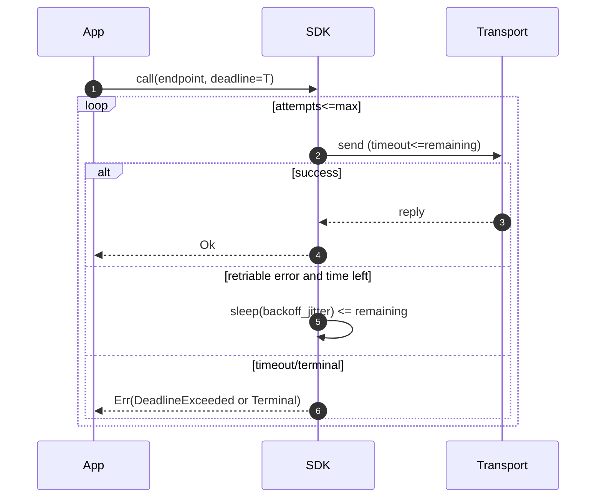

````markdown
---
title: Concurrency Model — ron-app-sdk
crate: ron-app-sdk
owner: Stevan White
last-reviewed: 2025-10-16
status: draft
template_version: 1.1
msrv: 1.80.0
tokio: "1.x (pinned at workspace root)"
loom: "0.7+ (dev-only)"
lite_mode: "For small library crates: fill §§1,3,4,5,10,11 and mark others N/A"
---

# Concurrency Model — ron-app-sdk

This document makes the concurrency rules **explicit**: tasks, channels, locks, shutdown, timeouts,
and validation (property/loom/TLA+). It complements `docs/SECURITY.md`, `docs/CONFIG.md`,
and the crate’s `README.md` and `IDB.md`.

> **Golden rule:** never hold a lock across `.await` in supervisory or hot paths.

---

## 0) Lite Mode (for tiny lib crates)

This crate is a **library** (client SDK) with **no long-lived background tasks** by default.
We therefore fully specify **§§1,3,4,5,10,11**, and mark **§§2,6,7** as **N/A** unless the host enables optional background features (e.g., telemetry pusher).

---

## 1) Invariants (MUST)

- [I-1] **No lock across `.await`.** If unavoidable, split the critical section and move the `.await` outside the guard.
- [I-2] **Single writer** per mutable resource (e.g., active config pointer); readers obtain snapshots (`Arc` clone) or short read guards.
- [I-3] **Bounded work**: the SDK performs **no unbounded buffering**. Retries/backoff are time-bounded by a caller **deadline**.
- [I-4] **Explicit deadlines** on all I/O; every public async method accepts/derives a deadline and uses `tokio::time::timeout`.
- [I-5] **Cooperative cancellation**: every `.await` is cancel-safe; use `tokio::select!` to observe cancellation signals (caller’s future drop or host shutdown).
- [I-6] **No blocking syscalls on runtime**: crypto/digest or filesystem touches (if any) run via `spawn_blocking`, capped and measured.
- [I-7] **No task leaks**: the SDK does not spawn detached tasks by default. Optional tasks (feature-gated) return `JoinHandle`s or are owned inside types with `close()` semantics.
- [I-8] **Backpressure over buffering**: when a host-provided queue/channel is full, return a typed `Busy`/`RetryLater` error—**do not** buffer infinitely.
- [I-9] **Framing limits enforced**: OAP/1 envelope size and chunk sizes are validated pre-I/O; partial reads/writes are handled safely.
- [I-10] **Async Drop**: `Drop` is non-blocking; resources requiring orderly teardown expose `async fn close(&mut self)`.

---

## 2) Runtime Topology

**N/A (Library).** `ron-app-sdk` does not run its own Tokio runtime and does not launch long-lived tasks by default. All APIs are async and execute on the **caller’s** runtime.

> If the host enables an optional background telemetry/prefetch feature, it must:
> (a) return `JoinHandle`s, (b) expose `close()` to drain, and (c) obey all invariants above.

---

## 3) Channels & Backpressure

The SDK itself **avoids internal channels** in the core request path. Where channels appear (feature-gated helpers or host-integrations), they must be **bounded** and documented.

**Inventory (typical/optional):**

| Name              | Kind      | Capacity | Producers → Consumers | Backpressure Policy            | Drop Semantics                       |
|-------------------|-----------|---------:|-----------------------|--------------------------------|--------------------------------------|
| `telemetry_tx`    | mpsc      |     512  | N → 1                 | `try_send` → `Busy`            | increment `busy_rejections_total`    |
| `shutdown_rx`     | watch     |       1  | 1 → N                 | last write wins                | N/A                                  |

Guidelines:

- Prefer **direct async calls** over internal queues in the request path.
- If a queue is unavoidable, **measure depth**, use `try_send`, and **drop** with a metric instead of blocking the caller.

---

## 4) Locks & Shared State

**Allowed**

- Short-lived `Mutex`/`RwLock` (prefer `parking_lot`) for small metadata (e.g., config pointer swap, token cache index), with no `.await` while held.
- **Lock-free reads** via `Arc` snapshots (e.g., `Arc<SdkConfig>`). When reconfiguring, swap atomically (e.g., write guard held briefly).

**Forbidden**

- Holding **any** lock across network `.await`s.
- Nested locks without a published **hierarchy**.

**Hierarchy (if ever needed)**

1. `cfg_ptr` (configuration snapshot pointer)
2. `token_cache_meta`
3. `counters`

> Always **compute** values (e.g., request headers, idempotency key) **before** the first `.await` to avoid guard extension.

**Pattern (config swap, no await under guard)**

```rust
// Shared across client clones
struct Inner {
    cfg: std::sync::Arc<parking_lot::RwLock<std::sync::Arc<SdkConfig>>>,
}

impl Inner {
    fn cfg_snapshot(&self) -> std::sync::Arc<SdkConfig> {
        self.cfg.read().clone() // cheap, no await
    }
    fn update_cfg(&self, new_cfg: std::sync::Arc<SdkConfig>) {
        *self.cfg.write() = new_cfg; // short critical section
    }
}
````

---

## 5) Timeouts, Retries, Deadlines

* **Per-call deadline (outer):** enforced with `tokio::time::timeout(overall, async { ... })`.
* **I/O timeouts (inner):** connect/read/write timeouts derived from config; enforced at socket/transport layer when available.
* **Retries:** only for **idempotent** or **explicitly idempotency-keyed** operations; **full-jitter exponential backoff** bounded by:

  * `base=100ms`, `factor=2.0`, `cap=10s`, `max_attempts=5`
  * Formula: `delay_n = min(cap, base * factor^(n-1)) * (1 + rand[0,1))`
* **Classification:** `Retriable` (timeouts, 5xx, `Retry-After`), `Maybe` (overload/backpressure), `NoRetry` (cap/authorization/OAP/schema).

**Sequence (deadline respected end-to-end)**

```rust
use tokio::time::{timeout, sleep, Instant, Duration};
async fn call_with_backoff(cfg: &SdkConfig, fut: impl std::future::Future<Output=Result<T, E>>) -> Result<T, SdkError> {
    let started = Instant::now();
    let mut attempt = 0;
    loop {
        attempt += 1;
        let remaining = cfg.remaining_overall(started)?;
        match timeout(remaining, fut).await {
            Ok(Ok(v)) => return Ok(v),
            Ok(Err(e)) if is_retriable(&e) && attempt < cfg.retry.max_attempts => {
                let d = cfg.retry.delay(attempt);
                let left = cfg.remaining_overall(started)?;
                if d >= left { return Err(SdkError::DeadlineExceeded); }
                sleep(d).await;
            }
            Ok(Err(e)) => return Err(map_err(e)),
            Err(_) => return Err(SdkError::DeadlineExceeded),
        }
    }
}
```

---

## 6) Cancellation & Shutdown

**N/A (Library).** The SDK does **not** own global shutdown. Cancellation is **cooperative** via:

* Caller **dropping** the future (Tokio cancels awaits).
* Optional host-provided **watch** for shutdown used inside `select!` to exit loops immediately.

If optional background helpers are enabled, they must expose `async fn close()` and obey a **drain deadline** (1–5s) before aborting.

---

## 7) I/O & Framing

**N/A (Library path is transport-client).** Framing and partial read handling are delegated to `ron-transport` (OAP/1). The SDK ensures **pre-flight envelope bounds** and validates content addressing (BLAKE3) when acting as terminal consumer.

---

## 8) Error Taxonomy (Concurrency-Relevant)

| Error               | When                                | Retry? | Metric                            | Notes                         |
| ------------------- | ----------------------------------- | ------ | --------------------------------- | ----------------------------- |
| `Busy`              | host queue full / immediate backoff | maybe  | `busy_rejections_total`           | prefer drop+metric over block |
| `DeadlineExceeded`  | overall timeout reached             | no     | `io_timeouts_total{op="overall"}` | end-to-end deadline honored   |
| `TransportTimedOut` | connect/read/write timeout          | yes    | `io_timeouts_total{op}`           | classify as retriable         |
| `Canceled`          | future dropped / host shutdown      | no     | `tasks_canceled_total`            | cooperative cancellation      |
| `Lagging`           | broadcast/watch overflow (rare)     | no     | `bus_lagged_total`                | only in optional helpers      |

---

## 9) Metrics (Concurrency Health)

* `sdk_request_latency_seconds{endpoint}` — histogram (p50/p95/p99)
* `io_timeouts_total{op}` — counter (`connect|read|write|overall`)
* `backoff_retries_total{endpoint,reason}` — counter
* `busy_rejections_total{endpoint}` — counter (if host queues used)
* `tasks_spawned_total{kind}` / `tasks_aborted_total{kind}` — counters (optional features)

---

## 10) Validation Strategy

**Unit / Property**

* Deadline honored: any call completes with `Ok` or `DeadlineExceeded` within `(overall + ε)`.
* Retry window bounded: attempts ≤ `max_attempts`, cumulative sleep ≤ `cap` window and `< overall`.
* Lock discipline: compile-time lint + runtime assertions in debug builds (`await_holding_lock` clippy lint on).

**Loom (dev-only)**

* Model: producer (caller) → retry loop (bounded sleeps) under a watch shutdown.
* Properties: no deadlock; cancellation causes exit within one tick; no missed wakeups.

**Fuzz**

* Envelope bound checks (sizes around 1 MiB); malformed responses → `SchemaViolation` without panics.

**Chaos (host test)**

* Inject 20% transient faults + 2% timeouts; validate `p95` success ≤ 3 attempts and **no duplicate side effects** with idempotency keys.

**(Optional) TLA+**

* If host uses SDK with an external queue, specify “at-least-once w/ idempotency” safety (no double-commit) and liveness (eventual completion under finite faults).

---

## 11) Code Patterns (Copy-Paste)

**Cancel-safe request with shutdown observation**

```rust
pub async fn storage_get_cancel_safe(
    sdk: &RonAppSdk,
    cap: Capability,
    addr: &str,
    shutdown: &tokio::sync::watch::Receiver<bool>,
    overall: std::time::Duration,
) -> Result<bytes::Bytes, SdkError> {
    let fut = sdk.storage_get(cap, addr, overall);
    tokio::pin!(fut);
    tokio::select! {
        res = &mut fut => res,
        _ = shutdown.changed() => Err(SdkError::Canceled),
    }
}
```

**Compute outside the lock; drop guard before `.await`**

```rust
// BAD: holding lock during await
// let mut g = state.lock();
// let hdrs = g.make_headers()?;
// let reply = transport.send(hdrs, body).await;

// GOOD: compute then await
let hdrs = {
    let g = state.lock();
    g.make_headers() // guard drops here
};
let reply = transport.send(hdrs, body).await;
```

**Bounded backoff with overall deadline**

```rust
let started = tokio::time::Instant::now();
for attempt in 1..=cfg.retry.max_attempts {
    let left = cfg.remaining_overall(started)?;
    let res = tokio::time::timeout(left, do_call()).await;
    match res {
        Ok(Ok(v)) => return Ok(v),
        Ok(Err(e)) if is_retriable(&e) && attempt < cfg.retry.max_attempts => {
            let d = cfg.retry.delay(attempt);
            if d >= cfg.remaining_overall(started)? { break; }
            tokio::time::sleep(d).await;
        }
        _ => break,
    }
}
Err(SdkError::DeadlineExceeded)
```

**Async close pattern (no blocking Drop)**

```rust
pub struct Client { conn: Option<TransportConn> }

impl Client {
    pub async fn close(&mut self) -> Result<(), SdkError> {
        if let Some(mut c) = self.conn.take() {
            c.shutdown().await?;
        }
        Ok(())
    }
}

impl Drop for Client {
    fn drop(&mut self) {
        if self.conn.is_some() {
            tracing::debug!("Client dropped without close(); resources reclaimed best-effort");
        }
    }
}
```

---

## 12) Configuration Hooks (Quick Reference)

* `overall_timeout`, `timeouts.{connect,read,write}`
* `retry.{base,factor,cap,max_attempts}`
* `idempotency.{enabled,key_prefix}`
* optional: queue capacities for helper features
* drain deadline for optional background tasks

See `docs/CONFIG.md` for authoritative schema.

---

## 13) Known Trade-offs / Nonstrict Areas

* The SDK favors **deterministic failure** (typed `Busy`/`DeadlineExceeded`) over hidden buffering.
* Optional background features are **off by default** to avoid task management in library use.
* CPU-heavy verification (e.g., BLAKE3 terminal verify) may use `spawn_blocking`; bounded by deadline.

---

## 14) Mermaid Diagrams

### 14.1 (Lite) Retry & Deadline Envelope



**Text:** The SDK always respects the caller’s outer deadline (`T`), bounding both retries and sleeps.

---

## 15) CI & Lints (Enforcement)

**Clippy (repo standard)**

* `-D warnings`
* `-W clippy::await_holding_lock`
* `-W clippy::dbg_macro`
* `-W clippy::wildcard_imports`
* `-W clippy::redundant_clone`

**GitHub Actions (suggested job)**

```yaml
name: sdk-concurrency-guardrails
on: [push, pull_request]
jobs:
  clippy:
    runs-on: ubuntu-latest
    steps:
      - uses: actions/checkout@v4
      - uses: dtolnay/rust-toolchain@stable
      - run: cargo clippy -p ron-app-sdk -- -D warnings -W clippy::await_holding_lock

  loom:
    if: github.event_name == 'pull_request'
    runs-on: ubuntu-latest
    steps:
      - uses: actions/checkout@v4
      - uses: dtolnay/rust-toolchain@stable
      - run: RUSTFLAGS="--cfg loom" cargo test -p ron-app-sdk --tests -- --ignored
```

---

```
```
