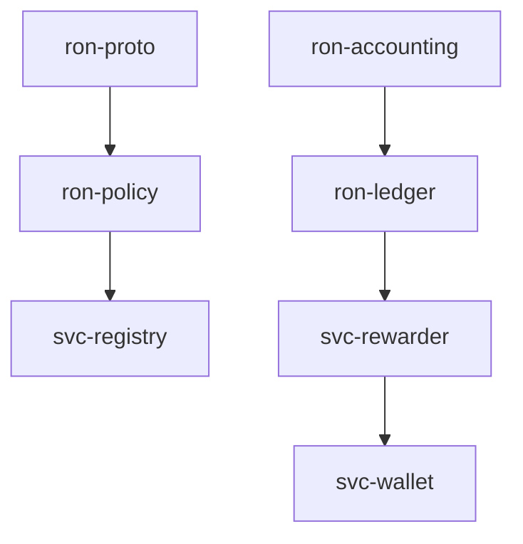
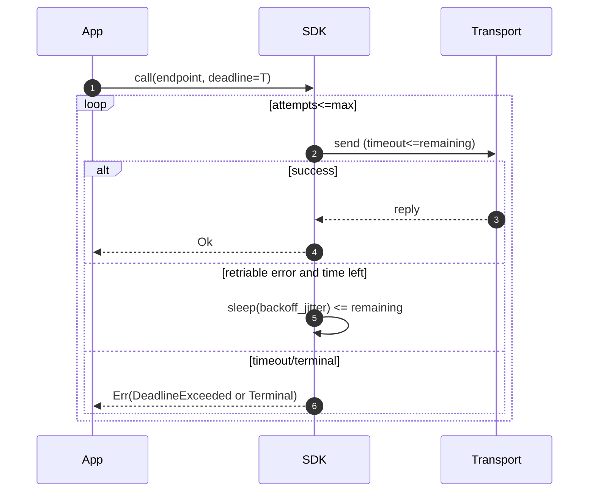

# Combined Markdown

_Source directory_: `crates/ron-app-sdk/docs`  
_Files combined_: 13  
_Recursive_: 0

---

### Table of Contents

- API.MD
- BUILDPLAN.MD
- CONCURRENCY.MD
- CONFIG.MD
- GOVERNANCE.MD
- IDB.md
- INTEROP.MD
- OBSERVABILITY.MD
- PERFORMANCE.MD
- QUANTUM.MD
- RUNBOOK.MD
- SECURITY.MD
- TESTS.MD

---

## API.MD
_File 1 of 13_


````markdown
---
title: API Surface & SemVer Reference
status: draft
msrv: 1.80.0
last-updated: 2025-10-16
audience: contributors, auditors, API consumers
---

# API.md — ron-app-sdk

## 0. Purpose

This document captures the **public API surface** of `ron-app-sdk`:

- Snapshot of exported functions, types, traits, modules.
- SemVer discipline: what changes break vs. extend.
- Behavioral stability: deadlines, retries, error taxonomy, and config defaults.
- CI-enforceable via `cargo public-api` and `cargo semver-checks`.
- The canonical “spec” for external consumers (apps using the SDK).

---

## 1. Public API Surface

> Generate with:
>
> ```bash
> cargo public-api -p ron-app-sdk --simplified --deny-changes
> ```
>
> - Commit the output under `docs/api-history/ron-app-sdk/<version>.txt`.
> - Keep the snapshot below in sync each release.

### 1.1 Proposed Surface (v0.1.0) — until first `cargo public-api` run

> This section reflects the **intended** public API we’ve locked in across the other blueprints. Replace with real output once the crate compiles.

```text
# Top-level types
pub struct RonAppSdk
pub struct SdkContext { pub profile: NodeProfile, pub amnesia: bool }

# Configuration (public, constructible)
pub struct SdkConfig
pub enum Transport { Tls, Tor }
pub enum Jitter { Full, None }
pub enum Redaction { Safe, None }
pub enum PqMode { Off, Hybrid }
pub struct Timeouts { pub connect: Duration, pub read: Duration, pub write: Duration }
pub struct RetryCfg { pub base: Duration, pub factor: f32, pub cap: Duration, pub max_attempts: u32, pub jitter: Jitter }
pub struct IdemCfg { pub enabled: bool, pub key_prefix: Option<String> }
pub struct CacheCfg { pub enabled: bool, pub max_entries: usize, pub ttl: Duration, pub verify_puts: bool }
pub struct TracingCfg { pub propagate: bool, pub redaction: Redaction }
pub struct TorCfg { pub socks_addr: String }

# Errors (stable, non-exhaustive)
#[non_exhaustive]
pub enum SdkError {
  DeadlineExceeded,
  Transport(std::io::ErrorKind),
  Tls,
  TorUnavailable,
  OapViolation { reason: &'static str },
  CapabilityExpired,
  CapabilityDenied,
  SchemaViolation { path: String, detail: String },
  NotFound,
  Conflict,
  RateLimited { retry_after: Option<std::time::Duration> },
  Server(u16),
  Unknown(String),
}

# Client facade (async)
impl RonAppSdk {
  pub async fn new(cfg: SdkConfig) -> Result<RonAppSdk, SdkError>;
  pub fn context(&self) -> SdkContext;

  // Mailbox plane
  pub async fn mailbox_send(&self, cap: Capability, msg: Mail, deadline: Duration, idem: Option<IdemKey>) -> Result<Receipt, SdkError>;
  pub async fn mailbox_recv(&self, cap: Capability, deadline: Duration) -> Result<Vec<Mail>, SdkError>;
  pub async fn mailbox_ack(&self, cap: Capability, ack: Ack, deadline: Duration) -> Result<(), SdkError>;

  // Edge plane (byte-range friendly)
  pub async fn edge_get(&self, cap: Capability, path: &str, range: Option<ByteRange>, deadline: Duration) -> Result<bytes::Bytes, SdkError>;

  // Storage plane (content addressed)
  pub async fn storage_get(&self, cap: Capability, addr_b3_hex: &str, deadline: Duration) -> Result<bytes::Bytes, SdkError>;
  pub async fn storage_put(&self, cap: Capability, blob: bytes::Bytes, deadline: Duration, idem: Option<IdemKey>) -> Result<AddrB3, SdkError>;

  // Index plane
  pub async fn index_resolve(&self, cap: Capability, key: &IndexKey, deadline: Duration) -> Result<AddrB3, SdkError>;
}

# Config helpers
impl SdkConfig {
  pub fn from_env() -> anyhow::Result<SdkConfig>;
  pub fn validate(&self) -> anyhow::Result<()>;
  pub fn with_overrides<F: FnOnce(&mut SdkConfig)>(self, f: F) -> SdkConfig;
}

# Context & enums
pub enum NodeProfile { Micronode, Macronode }

# Re-exports (facade to canon)
pub use ron_proto::{Capability, IdemKey, Mail, Ack, Receipt, IndexKey, AddrB3, ByteRange};
````

> **Feature gating (public surface impact):**
>
> * `tor` feature exposes `Transport::Tor` and `TorCfg` (present but no-ops if disabled).
> * `metrics` feature adds a `metrics()` getter returning an opaque handle (not required for core use).
> * `cli` (if any example/bin exists) is **out of library surface** and documented separately.

---

## 2. SemVer Discipline

### 2.1 Additive (Minor / Non-Breaking)

* New **methods** on `RonAppSdk` that don’t change existing signatures.
* New **variants** on `SdkError` (enum is `#[non_exhaustive]`).
* New **fields** on config structs **if** they derive `Default` and are optional or have safe defaults.
* New re-exports (e.g., additional DTOs from `ron-proto`) so long as names don’t shadow existing exports.

### 2.2 Breaking (Major)

* Removing or renaming any public item (types, functions, re-exports).
* Changing function **signatures** (params, return types) or trait bounds.
* Making an enum exhaustive (removing `#[non_exhaustive]`) or retyping variants.
* Tightening visibility (e.g., pub→crate) of anything already public.
* Changing config defaults in a way that meaningfully alters **behavioral contracts** (deadline policy, retry caps) without a coordinated migration.

### 2.3 Patch-Level

* Documentation improvements, typos, examples.
* Performance improvements that preserve behavioral semantics.
* Internal refactors, private module layout, dependency bumps with identical API.

---

## 3. Stability Guarantees

* **MSRV**: `1.80.0` (bumps are **minor** and called out in CHANGELOG).
* **No `unsafe`** in public API (any `unsafe` usage requires justification and audit).
* **Error taxonomy** is stable: string matching is discouraged; use enum variants.
* **Transport neutrality**: public API does not expose transport internals (no `TcpStream`/`TlsStream` in signatures).
* **Deadlines present** across all network methods; no unbounded I/O paths are exposed.

---

## 4. Invariants (API-Level)

* `RonAppSdk` methods are **async** and accept a **deadline** (or derive one from config) — this is part of the contract.
* **Idempotency**: all mutating methods accept an optional `IdemKey`; the SDK auto-generates if `idempotency.enabled`.
* **One SDK, two profiles**: behavior at the SDK surface is identical for Micronode/Macronode; profile is available via `SdkContext` only (metadata).
* **DTO hygiene**: all public DTOs come from `ron-proto`; unknown fields are rejected internally, not surfaced as successful results.
* **Content addressing**: storage APIs operate on/return `AddrB3` (BLAKE3) values.

---

## 5. Behavioral Compatibility

> These are **not** symbol changes but still observable by consumers; we document and version them carefully.

* **Retry policy defaults** (base/factor/cap/max_attempts) — changing them is **behavioral**; treat as **minor** only with explicit release notes.
* **Timeout defaults** — same rule as retries.
* **Redaction defaults** — must remain `Safe`; changing to `None` would be breaking for compliance.
* **Transport defaults** — `Transport::Tls` remains default; adding Tor has **no effect** unless selected.

---

## 6. Tooling

* `cargo public-api` — detect surface diffs:

  ```bash
  cargo public-api -p ron-app-sdk --simplified --deny-changes
  ```
* `cargo semver-checks` — enforce SemVer adherence:

  ```bash
  cargo semver-checks check-release -p ron-app-sdk
  ```
* `cargo doc --no-deps -p ron-app-sdk` — docs CI; **all public items must be documented** (`#![deny(missing_docs)]` suggested).

---

## 7. CI & Gates

* **PR gate** runs:

  * `cargo public-api` (diff posted in PR comment; job fails on unacknowledged changes).
  * `cargo semver-checks` (fails on breaking changes without a major bump).
* **CHANGELOG coupling**:

  * If a surface diff exists, a CHANGELOG entry is **mandatory**.
  * Major changes must include **migration notes** and examples.
* **Snapshot archival**:

  * On publish, write `docs/api-history/ron-app-sdk/<version>.txt` from `cargo public-api`.

---

## 8. Acceptance Checklist (DoD)

* [ ] Current API snapshot generated & stored under `docs/api-history/`.
* [ ] `cargo public-api` passes in CI (no unexpected diffs).
* [ ] `cargo semver-checks` passes or change is marked **breaking** with major bump.
* [ ] CHANGELOG updated (surface + behavioral notes).
* [ ] Rustdoc examples compile (`cargo test --doc`).
* [ ] New/changed APIs have observability coverage (spans/metrics) in examples/tests.

---

## 9. Appendix

### 9.1 References

* Rust SemVer: [https://doc.rust-lang.org/cargo/reference/semver.html](https://doc.rust-lang.org/cargo/reference/semver.html)
* cargo-public-api: [https://github.com/Enselic/cargo-public-api](https://github.com/Enselic/cargo-public-api)
* cargo-semver-checks: [https://github.com/obi1kenobi/cargo-semver-checks](https://github.com/obi1kenobi/cargo-semver-checks)

### 9.2 Perfection Gates tie-in

* **Gate G**: No undocumented public items (docs must exist).
* **Gate H**: Breaking changes → major version bump + migration.
* **Gate J**: CHANGELOG + API snapshot alignment enforced.

### 9.3 API Evolution Playbook

* **Add a new plane method?**

  * Prefer adding on `RonAppSdk` with a clear `endpoint` name and deadline param.
  * Add spans/metrics; document examples; minor bump.

* **Extend `SdkError`?**

  * Add a new variant (enum is non-exhaustive); minor bump; update mapping table in `SECURITY.md`.

* **Add config?**

  * Add struct field with safe default; minor bump; update `CONFIG.md` table.

* **Deprecate a method?**

  * Keep symbol; add `#[deprecated(note = "...", since = "x.y.z")]`; provide a replacement; remove in next **major**.

### 9.4 History

* *v0.1.0* — Initial surface with async client facade, strict DTOs, stable error taxonomy, and config builders.

```


---

## BUILDPLAN.MD
_File 2 of 13_


---

title: Build Guide — Filling Crates with Code
project: RustyOnions (RON)
version: 1.6.0
status: reviewed
last-updated: 2025-10-14
audience: contributors, leads, ops, auditors
msrv: 1.80.0

---

# Build Guide — Filling Crates with Code

This guide is the single procedure for turning scaffolded files into production-grade Rust across all 33 crates. It assumes each crate’s blueprints and templates (e.g., IDB.md, CONFIG.md, CONCURRENCY.md, and the full set: API.md, CONCURRENCY.md, CONFIG.md, GOVERNANCE.md, IDB.md, INTEROP.md, OBSERVABILITY.md, PERFORMANCE.md, QUANTUM.md, RUNBOOK.md, SECURITY.md, TESTS.md) are complete, along with TODO.md (file tree with one-liners).
Prime directive: ship code that is (1) canon-compliant, (2) provably correct, (3) efficient by profile—not by guess.

---

## 0) Stoplight Gates (make red easy)

* Green = All gates pass.
* Yellow = Non-blocking nits (docs, formatting).
* Red = Any invariant, test, clippy -D warnings, perf regression, or DOM gate fails.

**Run locally (crate-scoped):**

```
cargo build -p <crate> --all-features
cargo test -p <crate> --all-features
cargo clippy -p <crate> --all-features -- -D warnings -W clippy::await_holding_lock -W clippy::perf -W clippy::dbg_macro
cargo llvm-cov -p <crate> --all-features
cargo bench -p <crate> -- --save-baseline main --sample-size 30 --measurement-time 5
cargo +nightly miri test -p <crate> --all-features
cargo +nightly public-api -p <crate> --diff-git-check
cargo +nightly update -Z minimal-versions && cargo build -p <crate> --all-features
rustup toolchain install 1.80.0 && cargo +1.80.0 build -p <crate> --all-features
```

One-command alias: `xtask optimize -p <crate>` (see §13).

---

## 1) Invariants (MUST)

* **Canon boundaries:** No new crates; no role leakage (e.g., rewarder never mutates ledger).
* **Safety:** `unsafe` requires `// SAFETY:` + targeted test; prefer borrowing; no panics in hot paths; no global state/singletons.
* **Precision:** No floats in money/consensus; use integers or fixed-point with lossless conversions.
* **Concurrency:** No locks across `.await`; bounded queues; cooperative cancellation; shutdown drains.
* **Config:** All tunables are loaded & validated per CONFIG.md; fail-closed on bad config.
* **Observability:** Metrics and health/readiness (if service); no secrets in logs/metrics.
* **Proof:** Every IDB invariant maps to at least one test or property; conservation asserts where applicable.
* **Efficiency:** Avoid needless alloc/copies on hot paths; profile before micro-optimizing.
* **Conditional Data-Oriented Law:** When a hot path manipulates bulk homogeneous data (scans, intersections, reductions), it **must** prefer a contiguous, alias-free layout (flat arrays/bitsets/SoA) or provide a benchmark + flamegraph proving no measurable gain (see §5 and §10A).

---

## 2) Design Principles (SHOULD)

* **Purity first:** Core logic is pure, IO lives in adapters; tiny public surface.
* **Ownership zen:** Prefer stack data; `&str`/slices/`Bytes`; `Arc` only for shared immutable.
* **Readability:** Clear names; public items have rustdoc; macros only when removing boilerplate.
* **Perf by measurement:** criterion + flamegraph; `rayon` or `portable-simd` only after profiling.
* **Security hygiene:** `serde(deny_unknown_fields)`, zeroize secrets, least-privilege caps.
* **TDD cadence:** Test/spec first for each file in TODO.md; implementation next.
* **Forward-proof:** Version DTOs; feature-gate heavy deps; SemVer guarded by API snapshot.

---

## 3) Per-Crate Build Method (bottom-up)

Build all 33 crates in dependency order (see §14 for graph); parallelize non-deps. Per crate:

1. **Prep (10–20%)**

   * Read all 12 templates (IDB invariants, CONFIG knobs, CONCURRENCY tasks, SECURITY hygiene, etc.); scan TODO.md.
   * Turn on CI teeth: clippy -D warnings, coverage floor, benches, deny rules (see §7).
   * Create/refresh API snapshot (if library API visible).

2. **Core Logic (40%)**

   * Implement pure functions/modules promised by TODO.md.
   * Property tests for invariants (ordering, conservation, idempotency, etc.).
   * Add a micro-bench for the hottest pure path; set initial baseline.

3. **Adapters & Concurrency (20%)**

   * Thin IO adapters with explicit timeouts and bounded channels per CONCURRENCY.md.
   * Honor config keys; wire metrics. No locks across `.await`.

4. **Service Wiring (10%)** (service crates only)

   * Supervisor, routes, health/ready, metrics. Graceful shutdown and backpressure.

5. **Polish & Verify (10–20%)**

   * Fuzz decoders; Loom model if concurrency primitives exist; miri for UB.
   * Flamegraph; fix top 1–2 hot spots or document “as intended.”
   * **DOM pass (if applicable):** apply §10A; keep only if it clears the gates.
   * Re-run gates; update CHANGELOG.md; refresh API snapshot.

---

## 4) Per-File Definition of Done (DoD)

Tie each file directly to a check. Update TODO.md only when DoD is green.

**File (from TODO.md) → DoD (tests/gates)**

* **README.md** → Invariants + quickstart match code; links to docs; `cargo test --doc` passes.
* **docs/API.md** → Public surface matches code; examples compile.
* **docs/CONCURRENCY.md** → Channel caps/locks match code; “no lock across .await” example included.
* **docs/CONFIG.md** → All keys exist in code; `Config::validate()` enforces rules; reload semantics documented.
* **docs/GOVERNANCE.md** → Policy hooks implemented; audit events emitted.
* **docs/IDB.md** → Each invariant references specific test(s) by file name.
* **docs/INTEROP.md** → DTOs/protocols match code; compatibility tests present.
* **docs/OBSERVABILITY.md** → Metrics/endpoints match code; scrape verified.
* **docs/PERFORMANCE.md** → Benches match documented budgets; flamegraph baselines checked in.
* **docs/QUANTUM.md** → PQ/hybrid mode tested (or mark N/A explicitly).
* **docs/RUNBOOK.md** → Error handling/shutdown matches code; triage flows tested.
* **docs/SECURITY.md** → Hygiene enforced; vuln scans clean.
* **docs/TESTS.md** → Unit/property/fuzz strategies implemented; coverage meets floor.
* **src/lib.rs** → Minimal re-exports; public rustdoc complete; public-api snapshot matches or CHANGELOG bumped.
* **core/*.rs** → Pure (no IO/time/global); unit + property tests; micro-bench present; **if compute-heavy, DOM proof attached** (see §10A).
* **adapters/*.rs** → Typed errors; timeouts; metrics; no panics; fuzz tests for parsers/DTOs.
* **errors.rs** → `thiserror` enums; error taxonomy matches IDB (Retryable/Fatal/Quarantine).
* **config.rs** → Defaults + validate(); env/CLI/file merge covered by tests.
* **metrics.rs** → No global registry leakage; labels stable; Prometheus scrape verified.
* **bin/main.rs (svc)** → Supervisor, readiness/health; graceful shutdown proven by test or harness.
* **tests/** → One invariant per file; names mirror IDB labels; coverage meets floor.
* **benches/** → Criterion baselines checked in; regression threshold enforced in CI.

---

## 5) Efficiency Checklist (per PR)

* **Allocs:** No `to_string()`/`collect()` in hot loops; pre-size `Vec::with_capacity`; prefer slices/`Bytes`.
* **Copy elision:** Avoid cloning large structs; pass by reference; use `Cow` if needed.
* **Branches:** Keep hot path straight; move error mapping to `#[cold]` fns.
* **Iterators:** Use adapters to avoid temp allocations; favor clarity over overly clever chains.
* **Serde:** `deny_unknown_fields`; integers for money; avoid `String` when `&str` suffices.
* **Concurrency:** Bounded channels; `try_send` + `Busy` over buffering; `spawn_blocking` only for true blocking.
* **Compile flags:** `-C target-cpu=native` in dev only (not in release artifacts unless policy permits).
* **DOM preference (conditional):** For bulk homogeneous work, prefer flat arrays/bitsets/SoA and batch inner loops to SIMD width (see §10A).

---

## 6) Review Checklist (lead sign-off)

* Invariants concretely enforced? (asserts/tests)
* API surface minimal, documented, and snapshotted?
* No new deps or features outside workspace policy?
* Performance deltas understood (flamegraph/bench report attached)?
* Logs/metrics safe (no secrets), cardinality bounded?
* Shutdown and backpressure proven (test or harness)?
* **DOM applied where applicable?** (If declined, PR includes benchmark + flamegraph showing <10% gain.)

Reject if any red; request changes if perf floor/ceiling unexplained.

---

## 7) Enforcement Teeth (CI + Lints)

**Clippy & warnings (blocking):**

```
cargo clippy -p <crate> --all-features -- -D warnings -W clippy::await_holding_lock -W clippy::perf -W clippy::dbg_macro
```

**Coverage floor:** `cargo llvm-cov -p <crate> --all-features`

* libs: ≥80% line
* services: ≥70% overall, ≥80% core

**Benchmark guard:** compare criterion JSON to baseline; fail on >15% regression unless waived.

**Dependencies:** `cargo deny check` + `cargo +nightly udeps -p <crate>` → no unused/vuln deps.

**API stability (libs):** `cargo +nightly public-api -p <crate> --diff-git-check` (bump SemVer if changed).

**Unsafe gate:** grep for `unsafe` → requires “SAFETY” comments + test IDs in commit.

**Panic audit:** deny `unwrap`/`expect` outside tests/benches/examples or behind `#[cfg(debug_assertions)]` (use `debug_assert!`).

**Forbidden patterns:** no global singletons (deny `lazy_static!`, `once_cell::sync::Lazy`, `static mut`); no new workspace members; no float in money paths.

**UB detection:** `cargo +nightly miri test -p <crate> --all-features` in CI (allow-failure or per-crate opt-out via metadata until green).

**MSRV floor:** `rustup toolchain install 1.80.0 && cargo +1.80.0 build -p <crate> --all-features`.

**Minimal-versions (dep floor):**

```
cargo +nightly update -Z minimal-versions
cargo build -p <crate> --all-features
git checkout -- Cargo.lock
```

**Lockfile guard:** `git diff --exit-code Cargo.lock`.

**Doc links:** `cargo doc -p <crate> --no-deps -Z rustdoc-map` + `lychee` (e.g., `lychee --max-retries 3 --backoff 2s --no-external`) on docs/.

**Platform matrix (CI):**

* os: `ubuntu-latest`
* target: `x86_64-unknown-linux-gnu`, `aarch64-unknown-linux-gnu`

**Workspace .cargo/config.toml (local -D warnings):**

```
[build]
rustflags = ["-D", "warnings"]
```

---

## 8) Mapping IDB → Tests (traceability)

Maintain `docs/_matrix.md` with rows like:

```
I-1 (Canon boundary) -> tests/api_surface.rs
I-3 (Conservation)   -> tests/conservation_prop.rs
I-5 (No lock .await) -> clippy + loom
I-8 (Backpressure)   -> tests/backpressure_busy.rs
```

**CI check (build.rs): robust regex, filename convention `tests/i_*_.rs`:**

```rust
use regex::Regex;
fn main() {
    let idb = std::fs::read_to_string("docs/IDB.md").unwrap();
    let re = Regex::new(r"-\s*\[I-(\d+)\]").unwrap();
    let mut invariants = vec![];
    for cap in re.captures_iter(&idb) { invariants.push(cap[1].to_string()); }
    let tests_dir = std::fs::read_dir("tests").unwrap();
    let mut covered = vec![];
    for entry in tests_dir {
        let path = entry.unwrap().path();
        if path.is_file() && path.file_name().unwrap().to_str().unwrap().starts_with("i_") {
            let stem = path.file_stem().unwrap().to_str().unwrap();
            if let Some(n) = stem.strip_prefix("i_").and_then(|s| s.split('_').next()) {
                covered.push(n.to_string());
            }
        }
    }
    let missing: Vec<_> = invariants.iter().filter(|i| !covered.contains(i)).collect();
    if !missing.is_empty() { panic!("Missing tests for invariants: {:?}", missing); }
}
```

---

## 9) Property, Fuzz, Loom (when to use)

* **Property tests:** invariants over wide input (ordering, conservation, idempotency).
* **Fuzz targets:** decoders/parsers (DTOs, manifests). 60–120s per target on PR (`-max_total_time=60`).
* **Loom:** if the crate creates/uses channels or locks internally; model 1–2 key interleavings.
* **Miri:** Always in CI for UB detection (allow-failure or opt-out per crate until green).

**Determinism:** save failing proptest seeds to `artifacts/proptest-seeds.txt`; re-run in CI. Archive fuzz crashing inputs under `artifacts/fuzz/<crate>/`.

---

## 10) Performance Workflow

1. Add criterion bench for the hottest path.
2. Run `cargo flamegraph` for a representative workload.
3. Identify top 2 hot symbols; optimize or document “as intended.”
4. Commit baselines JSON; CI enforces ±15% budget:

```
cargo bench -p <crate> -- --baseline main --sample-size 30 --measurement-time 5
```

Tip: use `critcmp` locally for diffs.

### 10A) Data-Oriented Layout & SIMD (DOM) — Method and Gates

**When to apply:** the code performs bulk scans/intersections/reductions over homogeneous data (e.g., fan-out routing, capability checks, epoch math, ledger scans, metrics aggregation).

**Preferred representations (internal, not API):**

* **Flat arrays** (`Vec<T>`) with row/column order chosen so the *innermost* loop walks **stride-1**.
* **Bitsets/bitmasks** for membership and intersections (`u64` words, `bitvec`, or `portable-simd` masks).
* **Struct-of-Arrays (SoA)** for queues/tables scanned in bulk; headers AoS + payload SoA if messages vary.
* **Batching** to SIMD width (use `array_chunks` or manual chunking); branch-free masks in hot loops.
* **Cache-friendly search** (Eytzinger layout) or perfect hash for static keys.

**SIMD guidance:**

* Start with clean loops over slices; rely on auto-vectorization first.
* If needed, use `portable-simd` behind a feature flag (e.g., `features = ["simd"]`); keep small, contained intrinsics.

**Gates to keep or roll back:**

* **Win required:** ≥15% p95 latency reduction **or** ≥20% throughput gain **for the targeted hotspot** (Criterion diff vs baseline).
* **No regressions:** memory ≤ +10%; allocs on hot path do not increase; coverage/lints stay green.
* **Proof bundle:** before/after flamegraphs highlighting the reduced hot frames + bench report in PR.
* **Containment:** no public API changes; no governance/interop shifts; feature-gated where heavy.

**Anti-patterns (reject unless proven otherwise):**

* Dense 2D tables for extremely sparse data (prefer CSR/roaring-bitmaps).
* HashMap in top-10 frames of a hot loop (replace with fixed arrays or perfect hash).
* Rayon on async tasks (parallelize pure compute only; cap threads to avoid oversubscription).

---

## 11) Drift Guards & Governance

* **SemVer snapshot:** keep `docs/api-history/<crate>/vX.Y.Z.txt` current.
* **CHANGELOG discipline:** features/fixes/perf changes with PR links.
* **Review cadence:** every 90 days or any time invariants/tests change.
* **No scope creep:** if a file’s purpose (from TODO.md) doesn’t match needed code, amend TODO.md + IDB.md first, then implement.
* **Dep policy (denylist):** `ring`/`openssl`/`chrono`/`lazy_static` denied unless approved (cargo-deny config).

---

## 12) Quickstart “per file” micro-flow (repeat for each file)

1. Re-read the file’s one-liner in TODO.md.
2. Write a minimal test (or property) that proves the behavior.
3. Implement the smallest code to make it pass.
4. Run gates (tests, clippy, cov); keep perf neutral.
5. Add rustdoc & example if public API.
6. If compute-heavy, run DOM experiment (§10A); keep only if it clears gates.
7. Commit: `feat(<file>): implement as per IDB [tests: ...]`.

---

## 13) Appendix — Toolbelt & xtask

**Toolbelt:** rust-analyzer, cargo-watch, cargo-llvm-cov, cargo-deny, cargo-udeps, criterion, cargo-fuzz, cargo-flamegraph, cargo-public-api, cargo-miri, critcmp, lychee.

**xtask optimize (Cargo.toml alias or src/bin/xtask.rs):**

```rust
use std::process::Command;
fn main() -> anyhow::Result<()> {
    let crate_name = std::env::args().nth(1).unwrap_or("svc-rewarder".into());
    Command::new("cargo").args(["build", "-p", &crate_name, "--all-features"]).status()?;
    Command::new("cargo").args(["test", "-p", &crate_name, "--all-features"]).status()?;
    Command::new("cargo").args(["clippy", "-p", &crate_name, "--all-features", "--", "-D", "warnings"]).status()?;
    Command::new("cargo").args(["llvm-cov", "-p", &crate_name, "--all-features"]).status()?;
    Command::new("cargo").args(["bench", "-p", &crate_name, "--", "--save-baseline", "main", "--sample-size", "30", "--measurement-time", "5"]).status()?;
    Command::new("cargo").args(["+nightly", "miri", "test", "-p", &crate_name, "--all-features"]).status()?;
    Command::new("cargo").args(["+nightly", "public-api", "-p", &crate_name, "--diff-git-check"]).status()?;
    Ok(())
}
```

---

## 14) Crate Dependency Order (Mermaid for parallel builds)



**Text:** Foundational (ron-proto) → policy/registry → accounting/ledger → rewarder/wallet; parallelize non-deps (e.g., Linux/aarch64 in CI).

---

**This version bakes the data-oriented methodology into the invariants, checklists, DoD, CI gates, and perf workflow—so every crate gets the wins when applicable, and changes are self-policed by proof, not taste.**


---

## CONCURRENCY.MD
_File 3 of 13_


````markdown
---
title: Concurrency Model — ron-app-sdk
crate: ron-app-sdk
owner: Stevan White
last-reviewed: 2025-10-16
status: draft
template_version: 1.1
msrv: 1.80.0
tokio: "1.x (pinned at workspace root)"
loom: "0.7+ (dev-only)"
lite_mode: "For small library crates: fill §§1,3,4,5,10,11 and mark others N/A"
---

# Concurrency Model — ron-app-sdk

This document makes the concurrency rules **explicit**: tasks, channels, locks, shutdown, timeouts,
and validation (property/loom/TLA+). It complements `docs/SECURITY.md`, `docs/CONFIG.md`,
and the crate’s `README.md` and `IDB.md`.

> **Golden rule:** never hold a lock across `.await` in supervisory or hot paths.

---

## 0) Lite Mode (for tiny lib crates)

This crate is a **library** (client SDK) with **no long-lived background tasks** by default.
We therefore fully specify **§§1,3,4,5,10,11**, and mark **§§2,6,7** as **N/A** unless the host enables optional background features (e.g., telemetry pusher).

---

## 1) Invariants (MUST)

- [I-1] **No lock across `.await`.** If unavoidable, split the critical section and move the `.await` outside the guard.
- [I-2] **Single writer** per mutable resource (e.g., active config pointer); readers obtain snapshots (`Arc` clone) or short read guards.
- [I-3] **Bounded work**: the SDK performs **no unbounded buffering**. Retries/backoff are time-bounded by a caller **deadline**.
- [I-4] **Explicit deadlines** on all I/O; every public async method accepts/derives a deadline and uses `tokio::time::timeout`.
- [I-5] **Cooperative cancellation**: every `.await` is cancel-safe; use `tokio::select!` to observe cancellation signals (caller’s future drop or host shutdown).
- [I-6] **No blocking syscalls on runtime**: crypto/digest or filesystem touches (if any) run via `spawn_blocking`, capped and measured.
- [I-7] **No task leaks**: the SDK does not spawn detached tasks by default. Optional tasks (feature-gated) return `JoinHandle`s or are owned inside types with `close()` semantics.
- [I-8] **Backpressure over buffering**: when a host-provided queue/channel is full, return a typed `Busy`/`RetryLater` error—**do not** buffer infinitely.
- [I-9] **Framing limits enforced**: OAP/1 envelope size and chunk sizes are validated pre-I/O; partial reads/writes are handled safely.
- [I-10] **Async Drop**: `Drop` is non-blocking; resources requiring orderly teardown expose `async fn close(&mut self)`.

---

## 2) Runtime Topology

**N/A (Library).** `ron-app-sdk` does not run its own Tokio runtime and does not launch long-lived tasks by default. All APIs are async and execute on the **caller’s** runtime.

> If the host enables an optional background telemetry/prefetch feature, it must:
> (a) return `JoinHandle`s, (b) expose `close()` to drain, and (c) obey all invariants above.

---

## 3) Channels & Backpressure

The SDK itself **avoids internal channels** in the core request path. Where channels appear (feature-gated helpers or host-integrations), they must be **bounded** and documented.

**Inventory (typical/optional):**

| Name              | Kind      | Capacity | Producers → Consumers | Backpressure Policy            | Drop Semantics                       |
|-------------------|-----------|---------:|-----------------------|--------------------------------|--------------------------------------|
| `telemetry_tx`    | mpsc      |     512  | N → 1                 | `try_send` → `Busy`            | increment `busy_rejections_total`    |
| `shutdown_rx`     | watch     |       1  | 1 → N                 | last write wins                | N/A                                  |

Guidelines:

- Prefer **direct async calls** over internal queues in the request path.
- If a queue is unavoidable, **measure depth**, use `try_send`, and **drop** with a metric instead of blocking the caller.

---

## 4) Locks & Shared State

**Allowed**

- Short-lived `Mutex`/`RwLock` (prefer `parking_lot`) for small metadata (e.g., config pointer swap, token cache index), with no `.await` while held.
- **Lock-free reads** via `Arc` snapshots (e.g., `Arc<SdkConfig>`). When reconfiguring, swap atomically (e.g., write guard held briefly).

**Forbidden**

- Holding **any** lock across network `.await`s.
- Nested locks without a published **hierarchy**.

**Hierarchy (if ever needed)**

1. `cfg_ptr` (configuration snapshot pointer)
2. `token_cache_meta`
3. `counters`

> Always **compute** values (e.g., request headers, idempotency key) **before** the first `.await` to avoid guard extension.

**Pattern (config swap, no await under guard)**

```rust
// Shared across client clones
struct Inner {
    cfg: std::sync::Arc<parking_lot::RwLock<std::sync::Arc<SdkConfig>>>,
}

impl Inner {
    fn cfg_snapshot(&self) -> std::sync::Arc<SdkConfig> {
        self.cfg.read().clone() // cheap, no await
    }
    fn update_cfg(&self, new_cfg: std::sync::Arc<SdkConfig>) {
        *self.cfg.write() = new_cfg; // short critical section
    }
}
````

---

## 5) Timeouts, Retries, Deadlines

* **Per-call deadline (outer):** enforced with `tokio::time::timeout(overall, async { ... })`.
* **I/O timeouts (inner):** connect/read/write timeouts derived from config; enforced at socket/transport layer when available.
* **Retries:** only for **idempotent** or **explicitly idempotency-keyed** operations; **full-jitter exponential backoff** bounded by:

  * `base=100ms`, `factor=2.0`, `cap=10s`, `max_attempts=5`
  * Formula: `delay_n = min(cap, base * factor^(n-1)) * (1 + rand[0,1))`
* **Classification:** `Retriable` (timeouts, 5xx, `Retry-After`), `Maybe` (overload/backpressure), `NoRetry` (cap/authorization/OAP/schema).

**Sequence (deadline respected end-to-end)**

```rust
use tokio::time::{timeout, sleep, Instant, Duration};
async fn call_with_backoff(cfg: &SdkConfig, fut: impl std::future::Future<Output=Result<T, E>>) -> Result<T, SdkError> {
    let started = Instant::now();
    let mut attempt = 0;
    loop {
        attempt += 1;
        let remaining = cfg.remaining_overall(started)?;
        match timeout(remaining, fut).await {
            Ok(Ok(v)) => return Ok(v),
            Ok(Err(e)) if is_retriable(&e) && attempt < cfg.retry.max_attempts => {
                let d = cfg.retry.delay(attempt);
                let left = cfg.remaining_overall(started)?;
                if d >= left { return Err(SdkError::DeadlineExceeded); }
                sleep(d).await;
            }
            Ok(Err(e)) => return Err(map_err(e)),
            Err(_) => return Err(SdkError::DeadlineExceeded),
        }
    }
}
```

---

## 6) Cancellation & Shutdown

**N/A (Library).** The SDK does **not** own global shutdown. Cancellation is **cooperative** via:

* Caller **dropping** the future (Tokio cancels awaits).
* Optional host-provided **watch** for shutdown used inside `select!` to exit loops immediately.

If optional background helpers are enabled, they must expose `async fn close()` and obey a **drain deadline** (1–5s) before aborting.

---

## 7) I/O & Framing

**N/A (Library path is transport-client).** Framing and partial read handling are delegated to `ron-transport` (OAP/1). The SDK ensures **pre-flight envelope bounds** and validates content addressing (BLAKE3) when acting as terminal consumer.

---

## 8) Error Taxonomy (Concurrency-Relevant)

| Error               | When                                | Retry? | Metric                            | Notes                         |
| ------------------- | ----------------------------------- | ------ | --------------------------------- | ----------------------------- |
| `Busy`              | host queue full / immediate backoff | maybe  | `busy_rejections_total`           | prefer drop+metric over block |
| `DeadlineExceeded`  | overall timeout reached             | no     | `io_timeouts_total{op="overall"}` | end-to-end deadline honored   |
| `TransportTimedOut` | connect/read/write timeout          | yes    | `io_timeouts_total{op}`           | classify as retriable         |
| `Canceled`          | future dropped / host shutdown      | no     | `tasks_canceled_total`            | cooperative cancellation      |
| `Lagging`           | broadcast/watch overflow (rare)     | no     | `bus_lagged_total`                | only in optional helpers      |

---

## 9) Metrics (Concurrency Health)

* `sdk_request_latency_seconds{endpoint}` — histogram (p50/p95/p99)
* `io_timeouts_total{op}` — counter (`connect|read|write|overall`)
* `backoff_retries_total{endpoint,reason}` — counter
* `busy_rejections_total{endpoint}` — counter (if host queues used)
* `tasks_spawned_total{kind}` / `tasks_aborted_total{kind}` — counters (optional features)

---

## 10) Validation Strategy

**Unit / Property**

* Deadline honored: any call completes with `Ok` or `DeadlineExceeded` within `(overall + ε)`.
* Retry window bounded: attempts ≤ `max_attempts`, cumulative sleep ≤ `cap` window and `< overall`.
* Lock discipline: compile-time lint + runtime assertions in debug builds (`await_holding_lock` clippy lint on).

**Loom (dev-only)**

* Model: producer (caller) → retry loop (bounded sleeps) under a watch shutdown.
* Properties: no deadlock; cancellation causes exit within one tick; no missed wakeups.

**Fuzz**

* Envelope bound checks (sizes around 1 MiB); malformed responses → `SchemaViolation` without panics.

**Chaos (host test)**

* Inject 20% transient faults + 2% timeouts; validate `p95` success ≤ 3 attempts and **no duplicate side effects** with idempotency keys.

**(Optional) TLA+**

* If host uses SDK with an external queue, specify “at-least-once w/ idempotency” safety (no double-commit) and liveness (eventual completion under finite faults).

---

## 11) Code Patterns (Copy-Paste)

**Cancel-safe request with shutdown observation**

```rust
pub async fn storage_get_cancel_safe(
    sdk: &RonAppSdk,
    cap: Capability,
    addr: &str,
    shutdown: &tokio::sync::watch::Receiver<bool>,
    overall: std::time::Duration,
) -> Result<bytes::Bytes, SdkError> {
    let fut = sdk.storage_get(cap, addr, overall);
    tokio::pin!(fut);
    tokio::select! {
        res = &mut fut => res,
        _ = shutdown.changed() => Err(SdkError::Canceled),
    }
}
```

**Compute outside the lock; drop guard before `.await`**

```rust
// BAD: holding lock during await
// let mut g = state.lock();
// let hdrs = g.make_headers()?;
// let reply = transport.send(hdrs, body).await;

// GOOD: compute then await
let hdrs = {
    let g = state.lock();
    g.make_headers() // guard drops here
};
let reply = transport.send(hdrs, body).await;
```

**Bounded backoff with overall deadline**

```rust
let started = tokio::time::Instant::now();
for attempt in 1..=cfg.retry.max_attempts {
    let left = cfg.remaining_overall(started)?;
    let res = tokio::time::timeout(left, do_call()).await;
    match res {
        Ok(Ok(v)) => return Ok(v),
        Ok(Err(e)) if is_retriable(&e) && attempt < cfg.retry.max_attempts => {
            let d = cfg.retry.delay(attempt);
            if d >= cfg.remaining_overall(started)? { break; }
            tokio::time::sleep(d).await;
        }
        _ => break,
    }
}
Err(SdkError::DeadlineExceeded)
```

**Async close pattern (no blocking Drop)**

```rust
pub struct Client { conn: Option<TransportConn> }

impl Client {
    pub async fn close(&mut self) -> Result<(), SdkError> {
        if let Some(mut c) = self.conn.take() {
            c.shutdown().await?;
        }
        Ok(())
    }
}

impl Drop for Client {
    fn drop(&mut self) {
        if self.conn.is_some() {
            tracing::debug!("Client dropped without close(); resources reclaimed best-effort");
        }
    }
}
```

---

## 12) Configuration Hooks (Quick Reference)

* `overall_timeout`, `timeouts.{connect,read,write}`
* `retry.{base,factor,cap,max_attempts}`
* `idempotency.{enabled,key_prefix}`
* optional: queue capacities for helper features
* drain deadline for optional background tasks

See `docs/CONFIG.md` for authoritative schema.

---

## 13) Known Trade-offs / Nonstrict Areas

* The SDK favors **deterministic failure** (typed `Busy`/`DeadlineExceeded`) over hidden buffering.
* Optional background features are **off by default** to avoid task management in library use.
* CPU-heavy verification (e.g., BLAKE3 terminal verify) may use `spawn_blocking`; bounded by deadline.

---

## 14) Mermaid Diagrams

### 14.1 (Lite) Retry & Deadline Envelope



**Text:** The SDK always respects the caller’s outer deadline (`T`), bounding both retries and sleeps.

---

## 15) CI & Lints (Enforcement)

**Clippy (repo standard)**

* `-D warnings`
* `-W clippy::await_holding_lock`
* `-W clippy::dbg_macro`
* `-W clippy::wildcard_imports`
* `-W clippy::redundant_clone`

**GitHub Actions (suggested job)**

```yaml
name: sdk-concurrency-guardrails
on: [push, pull_request]
jobs:
  clippy:
    runs-on: ubuntu-latest
    steps:
      - uses: actions/checkout@v4
      - uses: dtolnay/rust-toolchain@stable
      - run: cargo clippy -p ron-app-sdk -- -D warnings -W clippy::await_holding_lock

  loom:
    if: github.event_name == 'pull_request'
    runs-on: ubuntu-latest
    steps:
      - uses: actions/checkout@v4
      - uses: dtolnay/rust-toolchain@stable
      - run: RUSTFLAGS="--cfg loom" cargo test -p ron-app-sdk --tests -- --ignored
```

---

```
```


---

## CONFIG.MD
_File 4 of 13_


````markdown
---
title: Configuration — ron-app-sdk
crate: ron-app-sdk
owner: Stevan White
last-reviewed: 2025-10-16
status: draft
template_version: 1.0
---

# Configuration — ron-app-sdk

This document defines **all configuration** for `ron-app-sdk`, including sources,
precedence, schema (types/defaults), validation, feature flags, live-reload behavior,
and security implications. It complements `README.md`, `docs/IDB.md`, and `docs/SECURITY.md`.

> **Tiering:**  
> - **Library crate:** this document focuses on client-side knobs: transport, timeouts, retries, idempotency, caches, tracing, PQ.  
> - **Service-specific fields** (e.g., bind/metrics) are **N/A** for this crate.

---

## 1) Sources & Precedence (Authoritative)

Configuration may come from multiple sources. **Precedence (highest wins):**

1. **Process flags** (only if using the optional `cli` feature in an example/bin)
2. **Environment variables**
3. **Config file** (e.g., `Config.toml` in app repo or next to the binary)
4. **Built-in defaults** (hard-coded)

> On live reload, the **effective** config is recomputed using the same precedence.

**Supported file formats:** TOML (preferred), JSON (optional).  
**Path resolution for `--config` (if relative):** `./`, then `$CWD`.

---

## 2) Quickstart Examples

### 2.1 Minimal (env + builder)
```bash
RON_SDK_TRANSPORT=tls
RON_SDK_GATEWAY_ADDR=https://localhost:8443
RON_SDK_OVERALL_TIMEOUT_MS=5000
RON_SDK_RETRY_BASE_MS=100
RON_SDK_RETRY_MAX_ATTEMPTS=5
RON_SDK_IDEM_ENABLED=true
````

```rust
use ron_app_sdk::{RonAppSdk, SdkConfig};
use std::time::Duration;

let cfg = SdkConfig::from_env()?.with_overrides(|c| {
    c.overall_timeout = Duration::from_millis(5000);
});
let sdk = RonAppSdk::new(cfg).await?;
```

### 2.2 Config file (TOML)

```toml
# Config.toml — client-side SDK config
transport        = "tls"          # tls | tor
gateway_addr     = "https://localhost:8443"   # base URL or .onion (when transport=tor)
overall_timeout  = "5s"

[timeouts]
connect = "2s"
read    = "5s"
write   = "5s"

[retry]
base_ms      = 100
factor       = 2.0
cap_ms       = 10000
max_attempts = 5
jitter       = "full"            # full | none

[idempotency]
enabled    = true
key_prefix = "app1"

[cache]
enabled      = false
max_entries  = 256
ttl          = "30s"
verify_puts  = false

[tracing]
propagate = true
redaction = "safe"               # safe | none

[pq]
mode = "off"                     # off | hybrid
```

### 2.3 CLI flags (if the app opts into `cli`)

```bash
myapp --config ./Config.toml \
  --gateway https://localhost:8443 \
  --transport tls \
  --overall-timeout 5s \
  --retry-base 100ms --retry-max 5
```

---

## 3) Schema (Typed, With Defaults)

> **Prefix convention:** All env vars begin with `RON_SDK_`.
> **Durations** accept `ms`, `s`, `m`, `h`.
> **Sizes** accept `B`, `KiB`, `MiB` (only used for cache sizing if extended).

| Key / Env Var                                       | Type                 | Default          | Description                                         | Security Notes                                     |
| --------------------------------------------------- | -------------------- | ---------------- | --------------------------------------------------- | -------------------------------------------------- |
| `transport` / `RON_SDK_TRANSPORT`                   | enum(`tls`,`tor`)    | `tls`            | Client transport backend                            | `tor` routes via local SOCKS (arti/tor); see below |
| `gateway_addr` / `RON_SDK_GATEWAY_ADDR`             | URL/string           | `""`             | Base endpoint (https://… or .onion)                 | Validate scheme; prefer HTTPS                      |
| `overall_timeout` / `RON_SDK_OVERALL_TIMEOUT_MS`    | duration             | `5s`             | Outer per-call deadline                             | Prevents hangs                                     |
| `timeouts.connect` / `RON_SDK_CONNECT_TIMEOUT_MS`   | duration             | `2s`             | Dial/connect timeout                                | DoS/backoff synergy                                |
| `timeouts.read` / `RON_SDK_READ_TIMEOUT_MS`         | duration             | `5s`             | Read timeout                                        | DoS mitigation                                     |
| `timeouts.write` / `RON_SDK_WRITE_TIMEOUT_MS`       | duration             | `5s`             | Write timeout                                       | DoS mitigation                                     |
| `retry.base_ms` / `RON_SDK_RETRY_BASE_MS`           | u64 (ms)             | `100`            | Full-jitter backoff base (I-5)                      | N/A                                                |
| `retry.factor` / `RON_SDK_RETRY_FACTOR`             | f32                  | `2.0`            | Backoff multiplier                                  | N/A                                                |
| `retry.cap_ms` / `RON_SDK_RETRY_CAP_MS`             | u64 (ms)             | `10000`          | Max backoff                                         | N/A                                                |
| `retry.max_attempts` / `RON_SDK_RETRY_MAX_ATTEMPTS` | u32                  | `5`              | Max tries (including first)                         | N/A                                                |
| `retry.jitter` / `RON_SDK_RETRY_JITTER`             | enum(`full`,`none`)  | `full`           | Jitter strategy                                     | Use `full` in prod                                 |
| `idempotency.enabled` / `RON_SDK_IDEM_ENABLED`      | bool                 | `true`           | Attach idempotency key to mutating calls            | Prevent dup effects                                |
| `idempotency.key_prefix` / `RON_SDK_IDEM_PREFIX`    | string/optional      | `""`             | Optional prefix to help dedupe by app/tenant        | Avoid PII                                          |
| `cache.enabled` / `RON_SDK_CACHE_ENABLED`           | bool                 | `false`          | Enable ephemeral LRU cache                          | Never bypass auth                                  |
| `cache.max_entries` / `RON_SDK_CACHE_MAX_ENTRIES`   | usize                | `256`            | Cache bound                                         | N/A                                                |
| `cache.ttl` / `RON_SDK_CACHE_TTL_MS`                | duration             | `30s`            | Entry TTL                                           | N/A                                                |
| `cache.verify_puts` / `RON_SDK_CACHE_VERIFY_PUTS`   | bool                 | `false`          | Verify BLAKE3 on terminal PUT success               | CPU trade-off                                      |
| `tracing.propagate` / `RON_SDK_TRACING_PROPAGATE`   | bool                 | `true`           | Forward correlation headers (B3/W3C when available) | Don’t leak secrets                                 |
| `tracing.redaction` / `RON_SDK_TRACING_REDACTION`   | enum(`safe`,`none`)  | `safe`           | Redact payload/meta in spans                        | Prefer `safe`                                      |
| `pq.mode` / `RON_SDK_PQ_MODE`                       | enum(`off`,`hybrid`) | `off`            | PQ hybrid toggle (e.g., X25519+Kyber)               | Interop risk; gate rollout                         |
| `tor.socks_addr` / `RON_SDK_TOR_SOCKS_ADDR`         | socket/string        | `127.0.0.1:9150` | Local Tor/arti SOCKS address (when `transport=tor`) | Local-only                                         |
| `msrv` (implicit)                                   | rustc version        | `1.80.0`         | Minimum supported Rust (build-time)                 | Bumps are semver-minor                             |

---

## 4) Validation Rules (Fail-Closed)

On init or reload:

* `gateway_addr` must be non-empty and parseable. When `transport="tls"`, scheme must be `https`. When `transport="tor"`, address must be a valid `.onion` host.
* `overall_timeout` ≥ `1s`. `max_attempts` ≥ `1`. `factor` ≥ `1.0`. `cap_ms` ≥ `base_ms`.
* When `transport="tor"`: `tor.socks_addr` must parse and be reachable (best-effort probe allowed).
* If `cache.enabled=true`: `max_entries` ≥ `1`, `ttl` ≥ `1s`.
* `tracing.redaction="safe"` in production builds (warn if `none`).
* If `pq.mode="hybrid"`: require caller opt-in (feature flag) and show an interop warning (documented).

**On violation:** return an error (library); **do not** fall back silently.

---

## 5) Dynamic Reload (If Supported by the Host App)

* **Trigger:** host app calls `sdk.update_config(new_cfg)` or uses a watcher (e.g., SIGHUP in host that rebuilds `SdkConfig`).
* **Reload semantics:** non-disruptive for timeouts/retries/tracing/cache. **Disruptive** for transport layer changes (`tls↔tor`, gateway base) which reinitialize connectors.
* **Atomicity:** compute a new `SdkConfig`, validate, then swap an `Arc<SdkConfig>` without holding `.await` across the swap.
* **Audit:** emit a tracing event `sdk.config.updated` with a **redacted** diff (no secrets).

---

## 6) CLI Flags (Canonical, optional via `cli` feature)

```
--config <path>                    # Load Config.(toml|json)
--gateway <url>                    # Override gateway_addr
--transport <tls|tor>
--overall-timeout <dur>            # e.g., 5s
--connect-timeout <dur>
--read-timeout <dur>
--write-timeout <dur>
--retry-base <dur>
--retry-factor <float>
--retry-cap <dur>
--retry-max <u32>
--idem-enabled <bool>
--idem-prefix <str>
--cache-enabled <bool>
--cache-max-entries <usize>
--cache-ttl <dur>
--tracing-propagate <bool>
--tracing-redaction <safe|none>
--pq-mode <off|hybrid>
--tor-socks <addr:port>
```

---

## 7) Feature Flags (Cargo)

|   Feature | Default | Effect                                              |
| --------: | :-----: | --------------------------------------------------- |
|     `tls` |    on   | Use TLS transport (native roots pre-configured)     |
|     `tor` |   off   | Route via local SOCKS (arti/tor)                    |
| `metrics` |   off   | Emit Prometheus counters/histograms (host collects) |
|     `cli` |   off   | Enable CLI parsing for host/example binaries        |
|      `pq` |   off   | Enable PQ hybrid mode toggles                       |

> Changes in features may gate which keys are accepted; unknown keys **warn** but do not crash unless `strict` mode is enabled by the host.

---

## 8) Security Implications

* **Capabilities** must never be logged; redact headers/bodies when `tracing.redaction="safe"`.
* **Tor**: ensure SOCKS is local-only; never auto-enable Tor without explicit choice.
* **Deadlines** are mandatory; library refuses unbounded I/O.
* **Caches** are ephemeral; they **never** bypass capability checks nor alter authorization.
* **PQ hybrid** can fragment interop; roll out behind explicit flags and compat tests.

---

## 9) Compatibility & Migration

* **Additive-first:** introduce new keys with safe defaults.
* **Renames:** keep env-var aliases for ≥1 minor; emit a deprecation warning.
* **Breaking changes:** require a **major** version bump and a migration note in `CHANGELOG.md`.

*Deprecation table (to be maintained):*

| Old Key              | New Key                      | Removal Target | Notes              |
| -------------------- | ---------------------------- | -------------- | ------------------ |
| `RON_SDK_TIMEOUT_MS` | `RON_SDK_OVERALL_TIMEOUT_MS` | v2.0.0         | Keep alias 1 minor |

---

## 10) Reference Implementation (Rust)

> Paste into `src/config/mod.rs`. Uses `serde` + `humantime_serde` for durations and an `Env` loader. Keep comments.

```rust
use serde::{Deserialize, Serialize};
use std::{path::PathBuf, time::Duration};

#[derive(Debug, Clone, Copy, Serialize, Deserialize)]
#[serde(rename_all = "lowercase")]
pub enum Transport { Tls, Tor }

#[derive(Debug, Clone, Copy, Serialize, Deserialize)]
#[serde(rename_all = "lowercase")]
pub enum Jitter { Full, None }

#[derive(Debug, Clone, Copy, Serialize, Deserialize)]
#[serde(rename_all = "lowercase")]
pub enum Redaction { Safe, None }

#[derive(Debug, Clone, Copy, Serialize, Deserialize)]
#[serde(rename_all = "lowercase")]
pub enum PqMode { Off, Hybrid }

#[derive(Debug, Clone, Serialize, Deserialize)]
pub struct Timeouts {
    #[serde(with = "humantime_serde", default = "default_connect")]
    pub connect: Duration,
    #[serde(with = "humantime_serde", default = "default_io")]
    pub read: Duration,
    #[serde(with = "humantime_serde", default = "default_io")]
    pub write: Duration,
}
fn default_connect() -> Duration { Duration::from_secs(2) }
fn default_io() -> Duration { Duration::from_secs(5) }

#[derive(Debug, Clone, Serialize, Deserialize)]
pub struct RetryCfg {
    #[serde(with = "humantime_serde", default = "default_retry_base")]
    pub base: Duration,
    #[serde(default = "default_retry_factor")]
    pub factor: f32,
    #[serde(with = "humantime_serde", default = "default_retry_cap")]
    pub cap: Duration,
    #[serde(default = "default_retry_max_attempts")]
    pub max_attempts: u32,
    #[serde(default = "default_jitter")]
    pub jitter: Jitter,
}
fn default_retry_base() -> Duration { Duration::from_millis(100) }
fn default_retry_factor() -> f32 { 2.0 }
fn default_retry_cap() -> Duration { Duration::from_secs(10) }
fn default_retry_max_attempts() -> u32 { 5 }
fn default_jitter() -> Jitter { Jitter::Full }

#[derive(Debug, Clone, Serialize, Deserialize)]
pub struct IdemCfg {
    #[serde(default = "default_true")]
    pub enabled: bool,
    pub key_prefix: Option<String>,
}
fn default_true() -> bool { true }

#[derive(Debug, Clone, Serialize, Deserialize)]
pub struct CacheCfg {
    #[serde(default)]
    pub enabled: bool,
    #[serde(default = "default_cache_entries")]
    pub max_entries: usize,
    #[serde(with = "humantime_serde", default = "default_cache_ttl")]
    pub ttl: Duration,
    #[serde(default)]
    pub verify_puts: bool,
}
fn default_cache_entries() -> usize { 256 }
fn default_cache_ttl() -> Duration { Duration::from_secs(30) }

#[derive(Debug, Clone, Serialize, Deserialize)]
pub struct TracingCfg {
    #[serde(default = "default_true")]
    pub propagate: bool,
    #[serde(default = "default_redaction")]
    pub redaction: Redaction,
}
fn default_redaction() -> Redaction { Redaction::Safe }

#[derive(Debug, Clone, Serialize, Deserialize)]
pub struct TorCfg {
    #[serde(default = "default_tor_socks")]
    pub socks_addr: String, // "127.0.0.1:9150"
}
fn default_tor_socks() -> String { "127.0.0.1:9150".into() }

#[derive(Debug, Clone, Serialize, Deserialize)]
pub struct SdkConfig {
    #[serde(default = "default_transport")]
    pub transport: Transport,
    #[serde(default)]
    pub gateway_addr: String,
    #[serde(with = "humantime_serde", default = "default_overall")]
    pub overall_timeout: Duration,
    #[serde(default)]
    pub timeouts: Timeouts,
    #[serde(default)]
    pub retry: RetryCfg,
    #[serde(default)]
    pub idempotency: IdemCfg,
    #[serde(default)]
    pub cache: CacheCfg,
    #[serde(default)]
    pub tracing: TracingCfg,
    #[serde(default)]
    pub pq: PqMode,
    #[serde(default)]
    pub tor: TorCfg,
    // allow extension fields as needed
}
fn default_transport() -> Transport { Transport::Tls }
fn default_overall() -> Duration { Duration::from_secs(5) }

impl Default for SdkConfig {
    fn default() -> Self {
        Self {
            transport: default_transport(),
            gateway_addr: String::new(),
            overall_timeout: default_overall(),
            timeouts: Timeouts { connect: default_connect(), read: default_io(), write: default_io() },
            retry: RetryCfg { base: default_retry_base(), factor: default_retry_factor(), cap: default_retry_cap(), max_attempts: default_retry_max_attempts(), jitter: default_jitter() },
            idempotency: IdemCfg { enabled: true, key_prefix: None },
            cache: CacheCfg { enabled: false, max_entries: default_cache_entries(), ttl: default_cache_ttl(), verify_puts: false },
            tracing: TracingCfg { propagate: true, redaction: default_redaction() },
            pq: PqMode::Off,
            tor: TorCfg { socks_addr: default_tor_socks() },
        }
    }
}

impl SdkConfig {
    pub fn validate(&self) -> anyhow::Result<()> {
        if self.gateway_addr.trim().is_empty() {
            anyhow::bail!("gateway_addr must be set");
        }
        if matches!(self.transport, Transport::Tls) && !self.gateway_addr.starts_with("https://") {
            anyhow::bail!("transport=tls requires an https:// gateway_addr");
        }
        if matches!(self.transport, Transport::Tor) && !self.gateway_addr.contains(".onion") {
            anyhow::bail!("transport=tor requires a .onion gateway_addr");
        }
        if self.retry.max_attempts == 0 { anyhow::bail!("retry.max_attempts must be >= 1"); }
        if self.retry.factor < 1.0 { anyhow::bail!("retry.factor must be >= 1.0"); }
        if self.retry.cap < self.retry.base { anyhow::bail!("retry.cap must be >= retry.base"); }
        if self.cache.enabled {
            if self.cache.max_entries == 0 { anyhow::bail!("cache.max_entries must be >= 1"); }
            if self.cache.ttl < Duration::from_secs(1) { anyhow::bail!("cache.ttl must be >= 1s"); }
        }
        Ok(())
    }

    pub fn from_env() -> anyhow::Result<Self> {
        // Lightweight env loader (explicit to avoid extra deps).
        let mut cfg = SdkConfig::default();
        if let Ok(s) = std::env::var("RON_SDK_TRANSPORT") {
            cfg.transport = match s.to_ascii_lowercase().as_str() {
                "tls" => Transport::Tls,
                "tor" => Transport::Tor,
                other => anyhow::bail!("invalid RON_SDK_TRANSPORT: {other}"),
            };
        }
        if let Ok(s) = std::env::var("RON_SDK_GATEWAY_ADDR") { cfg.gateway_addr = s; }
        if let Ok(ms) = std::env::var("RON_SDK_OVERALL_TIMEOUT_MS").ok().and_then(|x| x.parse().ok()) {
            cfg.overall_timeout = Duration::from_millis(ms);
        }
        // (Omitted: parse remaining envs similarly or switch to figment/envy if preferred)
        cfg.validate()?;
        Ok(cfg)
    }

    pub fn with_overrides<F: FnOnce(&mut Self)>(mut self, f: F) -> Self {
        f(&mut self);
        self
    }
}
```

---

## 11) Test Matrix

| Scenario                            | Expected Outcome                                    |
| ----------------------------------- | --------------------------------------------------- |
| Empty `gateway_addr`                | Error (fail-fast)                                   |
| `transport=tls` with http:// URL    | Error (require `https://`)                          |
| `transport=tor` with non-onion host | Error                                               |
| `retry.max_attempts=0`              | Error                                               |
| `cache.enabled=true` with ttl < 1s  | Error                                               |
| Switch TLS→Tor at runtime           | Reinitialize transport (disruptive), no panic       |
| Large retries under faults          | Backoff with full jitter; respect `overall_timeout` |

---

## 12) Mermaid — Config Resolution Flow

```mermaid
flowchart TB
  A[Defaults] --> D[Merge]
  B[Config File] --> D
  C[Env Vars] --> D
  E[CLI Flags (optional)] --> D
  D --> V{Validate}
  V -- ok --> R[Runtime Snapshot (Arc<SdkConfig>)]
  V -- fail --> X[Return Error]
  style R fill:#0369a1,stroke:#0c4a6e,color:#fff
```

---

## 13) Operational Notes

* Keep application-level config in version control; **never** commit secrets (capabilities).
* Prefer environment variables in containerized deployments; mount config files read-only.
* For Tor, run a **local** SOCKS (arti/tor) and restrict binds to localhost.
* Treat PQ hybrid as a **coordinated rollout** across client and node; guard with compatibility tests.

```


---

## GOVERNANCE.MD
_File 5 of 13_


---

# 🏛 GOVERNANCE.md

---

title: Governance & Economic Integrity
status: draft
msrv: 1.80.0
last-updated: 2025-10-16
audience: contributors, ops, auditors, stakeholders
crate-type: sdk|lib
-------------------

# GOVERNANCE.md — ron-app-sdk

## 0. Purpose

This document defines the **rules of engagement** for `ron-app-sdk` as it participates in RustyOnions’ economic/policy system from the **application edge**. While the SDK does not hold mint/settle authority, it **must** enforce policy-relevant client-side invariants (idempotency, quotas adherence, DTO strictness) and provide **auditable, repeatable** mechanisms for change control.

It ensures:

* Transparent, auditable change management of the SDK surface that affects **economic outcomes** downstream.
* Enforcement of **economic invariants at the edge** (no double submission, bounded retries, no out-of-band mint requests).
* Clear **authority boundaries**: SDK proposes; **nodes decide** (policy/ledger/rewarder).
* SLA-backed commitments for SDK behaviors that materially impact consumers (e.g., idempotent retries, header formation, limits).

Ties into:

* **Economic Integrity Blueprint** (no doubles, bounded issuance).
* **Hardening Blueprint** (bounded authority, cap tokens, key custody).
* **Scaling & Performance** (deadline/backoff, OAP/1 frame limits).
* **Perfection Gates** (esp. Gate I: bounded economic invariants; Gate M: appeal paths; Gate K: continuous vigilance).

---

## 1. Invariants (MUST)

Non-negotiable rules that the SDK enforces locally and/or never violates:

* **[I-G1] No double submission:** All **mutations** must carry an **idempotency key**; the SDK must never auto-retry a mutation without the same key, and must never generate two different keys for the same logical operation.
* **[I-G2] Bound retries:** The SDK will not mask failures with unbounded retries. Retries are **exponential with cap** and respect `Retry-After`/quota signals. Auth/Schema failures are **non-retriable**.
* **[I-G3] Frame & chunk limits:** OAP/1 **max frame = 1 MiB** (hard cap). Storage I/O streams in **~64 KiB** chunks. Oversize is refused **client-side**.
* **[I-G4] DTO strictness:** `deny_unknown_fields` stays enabled. Unknown/extra fields cause typed errors; the SDK never silently drops unrecognized data that could impact accounting.
* **[I-G5] Capability discipline:** Every request that requires authority includes a valid capability token (macaroon). The SDK **never** logs, persists, or transmits caps outside the intended channel.
* **[I-G6] Bounded authority:** The SDK cannot mint, settle, or override ledger entries; it only **proposes** operations to node services. There is **no admin override path** in the SDK.
* **[I-G7] Redaction & auditability:** Logs are structured and **safe by default** (no secrets/idempotency keys/macaroons). All governance-relevant events are **traceable** via correlation IDs.
* **[I-G8] Version integrity:** Public API/DTO evolution is **additive-first**. Removals/renames require a **major** version bump and documented deprecation windows.

---

## 2. Roles & Authority

### Roles

* **SDK Maintainers (this crate):** Own SDK surface, invariants enforcement, release governance, and security posture.
* **Policy Owner (`ron-policy`):** Defines system-wide invariants and policy rules.
* **Ledger Keeper (`ron-ledger`):** Executes settlement; enforces conservation; can reject invalid operations.
* **Rewarder (`svc-rewarder`):** Distributes emissions under caps; cannot mint.
* **Auditor:** Internal/external reviewer with read-only insight into logs/metrics, public API diffs, and test evidence.
* **Node Operator:** Operates gateway/overlay/index/storage; consumes SDK edge behavior.

### Authority Boundaries

* SDK **cannot** mint/settle/freeze; it **must** respect transport, quota, and policy signals from nodes.
* Policy can propose rules; Ledger can **reject** requests that violate invariants (SDK must surface these errors without mutation retries).
* Rewarder never mints; SDK may only submit requests within published reward schemas.
* All parties authenticate/authorize using **capability tokens** with scoped caveats.

---

## 3. Rules & SLAs (SDK-level)

* **Idempotency SLA:** For mutation endpoints, the SDK **always** attaches an idempotency key when the caller provides one; helper APIs must make providing it trivial. Duplicate deliveries with the same key must **not** create additional effects (server-enforced; SDK verifies semantics via integration tests).
* **Retry & Deadline SLA:** Default deadlines and retry caps are published; changes follow governance process (Section 4). The SDK never exceeds the cap or ignores `Retry-After`.
* **Limits SLA:** The SDK **refuses oversize** frames locally; chunking behavior is stable across minor releases.
* **Logging SLA:** On error, logs must include `event`, `endpoint`, `attempt`, `deadline_ms`, `latency_ms`, `error_kind`, `transport`, `corr_id`, with **redaction enforced**.
* **Compat SLA:** API/DTO changes are additive-first. Deprecations include **migration notes** and minimum one minor-version grace period.

---

## 4. Governance Process (SDK Changes)

* **Proposal lifecycle (changes affecting economics/security):**
  **Draft → Design Review → Security Review → Approval → Implement → Ship → Postmortem (if hotfix).**

  * **Design Review quorum:** ≥2 SDK maintainers + 1 policy/ledger reviewer for economics-relevant changes.
  * **Security Review:** Required for auth header logic, capability handling, logging/redaction, or PQ adapters.
  * **Approval:** Tracked via PR label and signed-off checklist (Section 8).
* **Deprecations:** Clearly documented, with code warnings where feasible; removal only in a **major** release.
* **Hotfix (Emergency):**

  * Trigger: critical security or economics-impacting bug (e.g., duplicate submission tolerance, leaked headers).
  * Path: short-circuit review with **post-hoc** security sign-off within 48h.
  * Disclosure: changelog entry and release notes detailing impact/scope/migration.

---

## 5. Audit & Observability

* **Auditability:**

  * Public API diffs recorded per release (`cargo public-api`).
  * DTO schema diffs stored alongside releases.
  * Test artifacts retained (coverage, fuzz corpora, integration logs).
* **Metrics (host-exported, SDK-prefixed):**

  * `sdk_requests_total{endpoint}`
  * `sdk_request_latency_seconds{endpoint}`
  * `sdk_backoff_retries_total`
  * `sdk_rate_limited_total`
  * `sdk_auth_failures_total`
  * `sdk_oap_violations_total`
  * Optional cache metrics: `sdk_cache_hits_total|_misses_total|_evictions_total`
* **Red-team drills:**

  * Simulate rogue caller attempts (oversize frame, forged caps, replay); verify SDK refuses/flags before transport.

---

## 6. Config & Custody

* **Config declaration (SDK side):**

  * Deadlines, retry caps, backoff, transport mode (TLS/Tor), OAP/1 limits (compile-time constants), idempotency behavior, optional cache bounds/TTL, PQ posture (if feature-gated).
* **Custody:**

  * The SDK **never** stores raw private keys.
  * Capability tokens (macaroons) are **in-memory only**; not logged; not persisted.
  * If a caller integrates signing keys, they must live in a **system keychain/HSM** (outside this crate); SDK only uses abstracted sign interfaces.
* **Rotation:**

  * Capability rotation is caller-driven; SDK must **fail closed** on expired/denied and surface the error without retries.

---

## 7. Appeal Path (when economic outcomes are disputed)

1. **Mark disputed at the node** (server-side ledger flagging; SDK includes correlation IDs that link client attempts).
2. **Open a governance proposal** (node governance channel) with supporting SDK request/response evidence (redacted logs).
3. **Multi-sig override** (if permitted by policy) to remedy effects; **no silent rollback** performed by the SDK.
4. **Auditor review** and public disclosure (release notes or governance log).

---

## 8. Acceptance Checklist (Definition of Done)

* [ ] Invariants enforced in code: idempotency, bounded retries, OAP cap, DTO strictness, redaction.
* [ ] Roles & authority boundaries documented in crate docs.
* [ ] Governance process followed (Design + Security Review sign-offs).
* [ ] Metrics and structured logs verified in integration/chaos tests.
* [ ] Perf/limits honored (bench + limits tests green).
* [ ] Appeal path documented, with sample evidence bundle (redacted) from tests.
* [ ] SemVer/DTO diffs attached to the release; deprecation windows communicated.

---

## 9. Appendix

* **Blueprints:** Economic Integrity (no doubles, bounded emission); Hardening (bounded authority, custody); Scaling/Performance (OAP/1 limits, latency budgets); Six Concerns alignment.
* **References:** Macaroons v1 capability tokens; DTO schemas; API/CONFIG/SECURITY/OBSERVABILITY/PERFORMANCE docs; public-api diffs; fuzz/prop test specs.
* **History:** Keep a short ledger of notable governance incidents (e.g., hotfixes, deprecation removals, red-team findings) with dates, scope, outcome.

---

### Notes for Implementers

* Any change to **idempotency semantics**, **capability handling**, **logging/redaction**, **OAP/1 limits**, or **DTO acceptance** is **governance-sensitive** and must follow Section 4.
* For economics-relevant bugfixes, always produce: (a) failing test first, (b) fix, (c) retroactive risk assessment, (d) release notes with guidance.

---


---

## IDB.md
_File 6 of 13_


````markdown
---
title: ron-app-sdk — Invariant-Driven Blueprint (IDB)
version: 1.0.0
status: ready
last-updated: 2025-10-16
audience: contributors, ops, auditors
msrv: 1.80.0
crate-type: sdk
concerns: [DX, SEC, RES]
pillar: 7 # App BFF & SDK
---

# ron-app-sdk — IDB

## 0) Scope & Role

`ron-app-sdk` is the **thin, profile-agnostic client** for applications to speak to RustyOnions nodes (Micronode & Macronode) using **capability-based** auth and **OAP/1** envelopes. The SDK is **client-only** (no servers), enforces canon limits (frame/chunk), offers **resilient defaults** (deadlines, idempotency, full-jitter retries), and guarantees **schema hygiene** via `ron-proto` types. It exposes an ergonomic async API with **typed DTOs**, **trace propagation**, and **consistent errors**.

---

## 1) Invariants (MUST)

- [I-1] **Profile parity**  
  Behavior at the public API is identical for Micronode (amnesia) and Macronode (persistent). No semantic branches by profile.

- [I-2] **Capabilities-only**  
  Every outbound request carries a valid capability; no ambient credentials are used by default.

- [I-3] **OAP/1 fidelity**  
  Enforce `max_frame = 1 MiB`; stream large payloads in ~64 KiB chunks; refuse to construct or send envelopes beyond bounds.

- [I-4] **Canonical content addressing**  
  Object IDs are `b3:<hex>`; when the SDK is the terminal consumer (e.g., local verify), compute and verify the full BLAKE3 digest.

- [I-5] **Resilient-by-default**  
  Mutating calls attach an idempotency key; retries use **full-jitter exponential backoff** with defaults:  
  `base=100ms`, `factor=2.0`, `cap=10s`, `max_attempts=5`; all attempts respect per-call deadlines.

- [I-6] **DTO hygiene in both directions**  
  Deserialization uses `serde(deny_unknown_fields)`; serialization emits no extraneous fields (round-trip stable).

- [I-7] **Transport-agnostic client**  
  Bind via `ron-transport` (TLS; optional Tor via `arti` feature). SDK never opens server sockets or runs service loops.

- [I-8] **Deadlines everywhere**  
  Every call requires an explicit or default deadline and is executed with non-blocking async I/O.

- [I-9] **Error taxonomy is stable**  
  Public errors are represented by `SdkError` with `#[non_exhaustive]`. No string matching for control flow.

- [I-10] **Versioning & compatibility**  
  Public API follows SemVer; breaking changes are major-only with a migration note. DTO evolution is **additive-first** and tracked in a **compat matrix**.

- [I-11] **No persistent local state**  
  The SDK maintains only opt-in ephemeral caches (bounded + TTL) that never bypass capability checks and respect amnesia expectations.

- [I-12] **Canon discipline**  
  Only canonical crates are referenced; names and versions are pinned in the workspace policy.

---

## 2) Design Principles (SHOULD)

- [P-1] **Small surface, strong defaults**: Safe-by-default (caps, deadlines, retries, idempotency). Power tuning requires explicit opt-in.
- [P-2] **Deterministic envelopes & errors**: Map wire/OAP errors exactly; never “guess” recovery on non-retriables.
- [P-3] **Transparency without leaks**: Expose `SdkContext { profile, amnesia }` as metadata; do **not** change semantics based on it.
- [P-4] **Zero kernel creep**: Protocol rules and DTOs live in `oap`/`ron-proto`. SDK is a client library, not a policy engine.
- [P-5] **Pluggable observability**: Provide hooks for tracing/log enrichment, redaction, and custom metrics without forking core.

---

## 3) Implementation (HOW)

### 3.1 Cargo Features & Dependency Posture
- **Features**: `default = ["tls"]`; optional: `tor` (via `arti`), `metrics`, `serde_json` (examples/dev only).
- **No** server deps; **no** kernel/service loops.
- **Tokio** required (`rt-multi-thread`, `time`, `net`, `io-util`).

```toml
[dependencies]
tokio = { version = "1.47", features = ["macros","rt-multi-thread","time","net","io-util"] }
ron-transport = { version = "x.y", default-features = false, features = ["tls"] }
ron-proto = "x.y"
tracing = "0.1"
blake3 = "1"
serde = { version = "1", features = ["derive"] }
serde_json = { version = "1", optional = true }

[features]
default = ["tls"]
tls = []
tor = ["ron-transport/tor"]
metrics = []
````

### 3.2 Public API Surface (sketch)

```rust
pub struct SdkConfig {
    pub transport: TransportCfg,
    pub timeouts: Timeouts { connect: Duration, read: Duration, write: Duration, overall: Duration },
    pub retry: RetryCfg { base: Duration, factor: f32, cap: Duration, max_attempts: u32, jitter: Jitter },
    pub idempotency: IdemCfg { enabled: bool, key_prefix: Option<String> },
    pub cache: CacheCfg { enabled: bool, max_entries: usize, ttl: Duration },
    pub tracing: TracingCfg { propagate: bool, redaction: RedactionPolicy },
}

pub struct RonAppSdk { /* ... */ }

impl RonAppSdk {
    pub async fn new(cfg: SdkConfig) -> Result<Self, SdkError>;

    // Mailbox (at-least-once)
    pub async fn mailbox_send(&self, cap: Capability, msg: Mail, deadline: Duration, idem: Option<IdemKey>)
        -> Result<Receipt, SdkError>;
    pub async fn mailbox_recv(&self, cap: Capability, deadline: Duration)
        -> Result<Vec<Mail>, SdkError>;
    pub async fn mailbox_ack(&self, cap: Capability, ack: Ack, deadline: Duration)
        -> Result<(), SdkError>;

    // Edge (HTTP-ish fetch with byte-range)
    pub async fn edge_get(&self, cap: Capability, path: &str, range: Option<ByteRange>, deadline: Duration)
        -> Result<Bytes, SdkError>;

    // Storage (content addressed)
    pub async fn storage_get(&self, cap: Capability, addr_b3_hex: &str, deadline: Duration)
        -> Result<Bytes, SdkError>;
    pub async fn storage_put(&self, cap: Capability, blob: Bytes, deadline: Duration, idem: Option<IdemKey>)
        -> Result<AddrB3, SdkError>;

    // Index (resolve)
    pub async fn index_resolve(&self, cap: Capability, key: &IndexKey, deadline: Duration)
        -> Result<AddrB3, SdkError>;

    pub fn context(&self) -> SdkContext; // { profile: Micronode|Macronode, amnesia: bool }
}
```

### 3.3 End-to-End Pseudocode: Mutating Call (Idempotent + Backoff)

```rust
pub async fn storage_put(
    &self,
    cap: Capability,
    blob: Bytes,
    deadline: Duration,
    idem: Option<IdemKey>,
) -> Result<AddrB3, SdkError> {
    let idem = idem.unwrap_or_else(IdemKey::generate);
    let started = Instant::now();
    let mut attempt = 0u32;

    loop {
        attempt += 1;
        let attempt_deadline = self.deadline_slice(deadline, started)?;
        let span = tracing::info_span!(
            "sdk.call",
            endpoint = "storage.put",
            attempt,
            deadline_ms = attempt_deadline.as_millis() as i64,
            payload_len = blob.len() as i64,
            node_profile = %self.ctx.profile,
            amnesia = self.ctx.amnesia
        );
        let _e = span.enter();

        // 1) Build OAP/1 envelope (frame-bound checked)
        let env = build_envelope_put(&cap, &blob, &idem).map_err(SdkError::OapViolation)?;

        // 2) Send with per-attempt deadline
        let send_res = tokio::time::timeout(attempt_deadline, self.tx.send(env)).await;
        let res = match send_res {
            Err(_) => Err(SdkError::DeadlineExceeded),
            Ok(inner) => inner,
        };

        match res {
            Ok(reply) => {
                let dto = decode_and_validate::<PutReceipt>(reply)
                    .map_err(|e| SdkError::SchemaViolation { path: e.path, detail: e.detail })?;
                let addr = AddrB3::try_from(dto.addr)?;
                // Optional terminal verify if configured (I-4)
                if self.cfg.cache.enabled && self.cfg.cache.verify_puts {
                    verify_blake3(&blob, &addr)?;
                }
                tracing::info!(target: "sdk", "ok");
                return Ok(addr);
            }
            Err(e) => {
                if !self.is_retriable(&e) || attempt >= self.cfg.retry.max_attempts {
                    tracing::warn!(target = "sdk", error = %e, "fail");
                    return Err(self.map_error(e));
                }
                let delay = self.backoff_delay(attempt);
                tracing::info!(target = "sdk", ?delay, "retry");
                tokio::time::sleep(delay).await;
                continue;
            }
        }
    }
}
```

**Retry classes**

* `Retriable`: transport timeouts, transient 5xx, explicit `Retry-After`.
* `Maybe`: overload/backpressure signals (respect hints).
* `NoRetry`: capability failure/expired, OAP bound breach, schema violation, 4xx that indicate caller error.

**Backoff (full-jitter) formula**
`delay_n = min(cap, base * factor^(n-1)) * (1 + rand[0,1))`

### 3.4 Error Taxonomy (public, stable)

```rust
#[non_exhaustive]
pub enum SdkError {
  DeadlineExceeded,
  Transport(std::io::ErrorKind),
  Tls,
  TorUnavailable,
  OapViolation { reason: &'static str },
  CapabilityExpired,
  CapabilityDenied,
  SchemaViolation { path: String, detail: String },
  NotFound,                 // 404/resolve miss
  Conflict,                 // 409
  RateLimited { retry_after: Option<std::time::Duration> }, // 429
  Server(u16),              // 5xx code
  Unknown(String),
}
```

**Mapping (illustrative):**

| Wire/Condition                 | SdkError variant                 | Retry?      |
| ------------------------------ | -------------------------------- | ----------- |
| Timeout (connect/read/write)   | `Transport(ErrorKind::TimedOut)` | Yes         |
| TLS handshake fail             | `Tls`                            | No (config) |
| Tor SOCKS not available        | `TorUnavailable`                 | Maybe       |
| OAP frame > 1 MiB              | `OapViolation{...}`              | No          |
| 401/403 cap invalid/expired    | `CapabilityDenied/Expired`       | No          |
| 404 resolve miss               | `NotFound`                       | No          |
| 409 conflict on idempotent PUT | `Conflict`                       | No          |
| 429 with `Retry-After`         | `RateLimited{retry_after}`       | Yes (hint)  |
| 5xx (generic)                  | `Server(code)`                   | Yes         |
| DTO parse/unknown field        | `SchemaViolation{...}`           | No          |

### 3.5 Tracing & Metrics

**Spans/fields (minimum):**

* `sdk.call`: `endpoint`, `attempt`, `deadline_ms`, `payload_len`, `frame_count`, `node_profile`, `amnesia`, `idem_key[redacted]`
* `sdk.retry`: `attempt`, `delay_ms`, `class` (`retriable|maybe`)
* `sdk.decode`: `dto`, `bytes`, `elapsed_ms`

**Metrics (Prometheus names):**

* `sdk_requests_total{endpoint, outcome="ok|error", code}`
* `sdk_request_latency_seconds{endpoint, quantile}` (histogram → summarize p50/p95/p99)
* `sdk_retries_total{endpoint, reason}`
* `sdk_oap_violations_total{endpoint, reason}`
* `sdk_deadline_exceeded_total{endpoint}`

### 3.6 Configuration Schema (env + builder parity)

| Key                          | Type  | Default | Notes                   |
| ---------------------------- | ----- | ------- | ----------------------- |
| `RON_SDK_TRANSPORT`          | enum  | `tls`   | `tls` or `tor`          |
| `RON_SDK_TIMEOUT_OVERALL_MS` | u64   | 5000    | Per-call outer deadline |
| `RON_SDK_RETRY_BASE_MS`      | u64   | 100     | I-5                     |
| `RON_SDK_RETRY_FACTOR`       | f32   | 2.0     | I-5                     |
| `RON_SDK_RETRY_CAP_MS`       | u64   | 10000   | I-5                     |
| `RON_SDK_RETRY_MAX_ATTEMPTS` | u32   | 5       | I-5                     |
| `RON_SDK_IDEM_ENABLED`       | bool  | true    | Mutations               |
| `RON_SDK_CACHE_ENABLED`      | bool  | false   | Ephemeral only          |
| `RON_SDK_CACHE_MAX_ENTRIES`  | usize | 256     | LRU                     |
| `RON_SDK_CACHE_TTL_MS`       | u64   | 30000   | 30s                     |
| `RON_SDK_TRACING_PROPAGATE`  | bool  | true    | B3/W3C as supported     |

---

## 4) Acceptance Gates (PROOF)

### 4.1 Tests & Property Checks

* [G-1] **Interop**: TLS + Tor round-trips for: `mailbox_send/recv/ack`, `edge_get` (range), `storage_get/put`, `index_resolve`.
* [G-2] **OAP bounds**: Proptests reject frames > 1MiB; storage streaming slices at ~64 KiB; fuzz harness covers envelope/decoder.
* [G-3] **DX**: Doc examples compile (`cargo test --doc`) and pass against Micronode (amnesia ON); mutation examples verify idempotency under injected retries.
* [G-4] **Security**: All tests attach a capability; short-TTL rotate path covered; no ambient calls in test suite.
* [G-5] **Concerns**: CI labels `concern:DX|SEC|RES` pass; `cargo clippy -D warnings`, `cargo fmt -- --check`.
* [G-6] **Public API**: `cargo public-api` + `cargo semver-checks` are green; MSRV checked in CI with `1.80.0`.
* [G-7] **Perf SLO (SDK overhead)**: Loopback, warm TLS, ≤64 KiB: median ≤ 2ms, p95 ≤ 5ms; report includes CPU, core count, and TLS session reuse settings.
* [G-8] **Chaos retries**: With 20% transient faults + 2% timeouts injected, p95 success ≤ 3 attempts; **no duplicate side effects** for idempotent ops.
* [G-9] **Error conformance**: Wire errors map to stable `SdkError` variants; forbid substring matching for control flow in lints.
* [G-10] **Compat matrix**: CI runs the SDK against `ron-proto` (N, N-1) and wire (N, N-1) schemas; fails on non-additive changes without major bump.

### 4.2 Invariants → Gates Traceability

| Invariant | Gate(s)                                                              |
| --------- | -------------------------------------------------------------------- |
| I-1       | G-1, G-3 (Micronode vs Macronode parity)                             |
| I-2       | G-4                                                                  |
| I-3       | G-2                                                                  |
| I-4       | G-1, G-2 (terminal verify path)                                      |
| I-5       | G-8 (chaos), G-7 (perf impact), G-3 (examples)                       |
| I-6       | G-9, G-10                                                            |
| I-7       | G-1 (TLS/Tor), code review checklists                                |
| I-8       | G-1/G-7 (deadline enforcement), clippy lints disallow blocking calls |
| I-9       | G-9                                                                  |
| I-10      | G-6, G-10                                                            |
| I-11      | Code scan + tests; cache TTL tests                                   |
| I-12      | G-6 (deps audit), repo policy script                                 |

---

## 5) Anti-Scope (Forbidden)

* No profile-specific semantic branching.
* No ambient credentials; no cache that bypasses capability checks.
* No servers/accept loops/kernel logic inside the SDK.
* No DTOs without strict (de)serialization guards.
* No persistent local state (ephemeral caches must be bounded+TTL).
* No stringly-typed error control flow.

---

## 6) Reviewer & CI Checklists

**Reviewer quick pass**

* [ ] New APIs are `async` and accept deadlines.
* [ ] Mutations accept or generate idempotency keys.
* [ ] OAP frame enforcement present prior to send.
* [ ] `SdkError` mapping added; no string matching.
* [ ] DTOs derive `serde` with `deny_unknown_fields`.
* [ ] No server sockets/loops; no blocking I/O.

**CI jobs**

* [ ] Linux/macOS builds at MSRV=1.80.0 and stable.
* [ ] `cargo test --all-features` including `tor`.
* [ ] `cargo public-api`, `cargo semver-checks`.
* [ ] Proptests + fuzz (envelope/decoder).
* [ ] Perf microbench: report p50/p95.
* [ ] Compat matrix job (proto N, N-1).

---

## 7) Appendix: Example Integration (docs test)

```rust
/// Basic storage PUT with deadlines, idempotency, and trace propagation.
#[tokio::test]
async fn docs_storage_put_example() -> Result<(), Box<dyn std::error::Error>> {
    let sdk = RonAppSdk::new(SdkConfig::default()) .await?;
    let cap = Capability::from_env()?;
    let payload = Bytes::from_static(b"hello onions");
    let receipt = sdk.storage_put(cap, payload, Duration::from_secs(5), None).await?;
    assert!(receipt.to_string().starts_with("b3:"));
    Ok(())
}
```

---

## 8) References (canon anchors)

* App Integration canon — SDK contract, flows, SLOs (v2.0)
* OAP/1 framing & envelope rules (v1.0)
* Six Concerns gating rubric (DX, SEC, RES) (v1.3)
* Pillar 7 — App BFF & SDK (v2.0)
* Canonical crate list & naming discipline (v2.0)
* Versioning & compat matrix governance (v1.1)

```


---

## INTEROP.MD
_File 7 of 13_


````markdown
# 🔗 INTEROP.md — ron-app-sdk

*Audience: developers, auditors, external SDK authors*  
*msrv: 1.80.0*

---

## 0) Purpose

Define the **interop surface** of `ron-app-sdk`:

- Wire protocols & message formats (OAP/1 over TLS or Tor).
- DTOs & schemas (from `ron-proto`), plus strictness rules.
- Canonical gateways/endpoints and plane semantics (Mailbox, Edge, Storage, Index).
- Canonical test vectors (frames, capability examples, byte-range semantics).
- Error taxonomy alignment and guarantees, consistent with **GMI-1.6 Omni-Gate**.

---

## 1) Protocols & Endpoints

### 1.1 Ingress Protocols (client → gateway/node)

- **OAP/1 framed** over:
  - **TLS 1.3** (`transport=tls`) via `tokio-rustls` (client mode).
  - **Tor** (`transport=tor`) via local SOCKS (arti/tor); gateway address is a `.onion` host.
- **HTTP/1.1** semantics are exposed by the gateway for “Edge” style paths (byte-range GET). The SDK still wraps these as typed calls.

> The SDK is **client-only**: it opens no server sockets and does not listen on any port.

### 1.2 Exposed Endpoints (Gateway facets)

| Plane    | Endpoint (canonical)           | Verb | Summary                                                                 |
|----------|--------------------------------|------|-------------------------------------------------------------------------|
| Storage  | `GET /o/{addr_b3}`             | GET  | Fetch object by BLAKE3 address (`b3:<hex>`). Supports range via Edge.   |
| Storage  | `POST /put`                    | POST | Store object (body); returns `AddrB3` receipt; **requires capability**. |
| Edge     | `GET /edge/{path}`             | GET  | Gatewayed fetch; supports `Range: bytes=start-end`.                     |
| Mailbox  | `POST /mailbox/send`           | POST | At-least-once send; **idempotency key** recommended.                    |
| Mailbox  | `GET /mailbox/recv`            | GET  | Receive pending messages (batch).                                       |
| Mailbox  | `POST /mailbox/ack`            | POST | Acknowledge processed messages.                                         |
| Index    | `POST /index/resolve`          | POST | Resolve logical key → `AddrB3`.                                         |

> **Transport Invariants:**  
> • `max_frame = 1 MiB` (OAP/1 hard ceiling).  
> • Streaming chunk size ≈ **64 KiB** on Storage paths.  
> • All mutating endpoints require a **capability** (macaroon) and should use an **idempotency key**.

---

## 2) DTOs / Schemas

All DTOs are defined in `ron-proto`. The SDK enforces:

- **Strict deserialization** (`serde(deny_unknown_fields)`) for inbound DTOs (fail-closed on unexpected fields).
- **Canonical serialization** (no extra/unknown fields) for outbound payloads.
- **Content addressing** format: `AddrB3` strings are **`"b3:<hex>"`** (lowercase hex, no separators).

### 2.1 Object Manifest (example)

```rust
// ron-proto (sketch)
pub struct ObjectManifestV2 {
  pub id: String,          // b3:<hex>
  pub size: u64,           // bytes
  pub chunks: Vec<Chunk>,  // ~64 KiB each (last may be shorter)
}
````

* **Encoding**: DAG-CBOR (strict schema, versioned).
* **Validation**: If the SDK is the terminal consumer (e.g., after `storage_put`), it may optionally perform full **BLAKE3** digest verification.

### 2.2 Canonical Envelope (OAP/1)

| Field       | Type   | Description                               |
| ----------- | ------ | ----------------------------------------- |
| `len`       | `u32`  | Remaining length (excluding this prefix). |
| `ver`       | `u8`   | Protocol version (**1**).                 |
| `flags`     | `u16`  | Bit flags: `REQ`, `RESP`, `EVENT`, …      |
| `tenant_id` | `u128` | ULID/UUID; `0` if unused.                 |
| `corr_id`   | `u64`  | Correlation ID (for tracing).             |
| `payload`   | `[]`   | App-opaque bytes (may be compressed).     |

SDK obligations:

* **Refuse** to build/forward frames where `len > 1_048_576` (1 MiB).
* Map `corr_id` to tracing spans; propagate correlation across retries.

---

## 3) Bus Topics

**N/A for SDK.** `ron-app-sdk` does **not** publish or subscribe to kernel bus topics.
(Hosts may forward SDK health/metrics to their buses; that is out-of-scope for this crate.)

---

## 4) Canonical Test Vectors

> Test vectors live under `tests/vectors/` and are consumed by interop & property tests.

### 4.1 OAP/1 Frame — Minimal Request

* **Purpose**: validate frame size checks, version byte, and correlation propagation.
* **Given**:

  * `ver = 0x01`
  * `flags = REQ`
  * `tenant_id = 0`
  * `corr_id = 0x1122_3344_5566_7788`
  * `payload = 32 bytes` (opaque)
* **Expect**:

  * `len == 1 (ver) + 2 (flags) + 16 (tenant) + 8 (corr) + 32 (payload) = 59`
  * Parser accepts; encoder refuses if `payload.len()` pushes `len > 1 MiB`.

> Vector files:
> • `oap1_min_req.bin` (raw)
> • `oap1_min_req.json` (decoded fields)

### 4.2 Capability (Macaroon) Example

```json
{
  "typ": "macaroon",
  "ver": 1,
  "caveats": ["ttl=60s", "method=POST", "path=/put", "tenant=t01"],
  "sig": "base64-opaque"
}
```

* **Usage**: attached to every mutating request; transported as an auth header or within the OAP envelope headers (transport-dependent).
* **SDK rule**: on `CapabilityExpired/Denied`, **do not retry**; surface typed error.

### 4.3 Byte-Range GET (Edge)

* **Input**: `range = bytes=0-65535` (first 64 KiB)
* **Expect**:

  * Gateway returns `206 Partial Content` with `Content-Range: bytes 0-65535/*`.
  * SDK maps to `edge_get(cap, path, Some(ByteRange::from(0..=65535)))` and exposes the raw bytes to the caller.

### 4.4 Content Addressing Receipt (Storage PUT)

* **Input**: arbitrary payload ≤ 1 MiB; idempotency key set.
* **Expect**:

  * Response DTO contains `AddrB3` as `b3:<hex>`.
  * If SDK “terminal verify” is enabled, it computes BLAKE3 of the payload and asserts equality with `<hex>` before returning.

> Note: Digest equality is asserted **case-insensitively** for hex, but SDK **emits lowercase**.

---

## 5) Error Taxonomy (Wire ↔ SDK)

The SDK maps wire-level failures to stable `SdkError` variants (non-exhaustive). Key cases:

| Wire / Gateway Condition           | HTTP/OAP Code             | SDK Error Variant                                   | Retry?           |
| ---------------------------------- | ------------------------- | --------------------------------------------------- | ---------------- |
| Unsupported protocol/version       | `400 BadVersion` / OAP v! | `SdkError::OapViolation { reason: "version" }`      | **No**           |
| Frame exceeds 1 MiB                | `413 FrameTooLarge`       | `SdkError::OapViolation { reason: "frame" }`        | **No**           |
| Capability missing/invalid/expired | `401/403`                 | `SdkError::CapabilityDenied/CapabilityExpired`      | **No**           |
| Quota/rate limit                   | `429` (`Retry-After?`)    | `SdkError::RateLimited { retry_after }`             | **Yes** (hinted) |
| Gateway not ready                  | `503 NotReady`            | `SdkError::Server(503)`                             | **Yes**          |
| Transient server                   | `5xx`                     | `SdkError::Server(code)`                            | **Yes**          |
| Not found                          | `404`                     | `SdkError::NotFound`                                | No               |
| Conflict on idempotent PUT         | `409`                     | `SdkError::Conflict`                                | No               |
| Schema invalid / unknown fields    | decode failure            | `SdkError::SchemaViolation { path, detail }`        | No               |
| Connect/read/write timeout         | I/O timeout               | `SdkError::Transport(std::io::ErrorKind::TimedOut)` | **Yes**          |
| Overall deadline exceeded          | client timeout            | `SdkError::DeadlineExceeded`                        | No               |
| Tor SOCKS unavailable              | local transport           | `SdkError::TorUnavailable`                          | Maybe (config)   |

**Retry policy** follows the SDK’s invariants: **full-jitter exponential backoff**; idempotent or idem-keyed ops only.

---

## 6) Interop Guarantees

* **No Kernel Drift**: SDK surface tracks the canon gateways/planes; it never embeds kernel/bus semantics.
* **SemVer Discipline**:

  * **Schema/DTO** changes are **additive-first** (new optional fields).
  * Removing/renaming fields or changing types is **major** only and requires migration notes.
* **Strict Read / Canonical Write**:

  * SDK **rejects unknown inbound fields** (fail-closed), ensuring callers update promptly when schemas evolve.
  * SDK **emits only known fields** and canonical encodings.
* **Frame Limits**: OAP/1 1 MiB cap and ~64 KiB storage streaming are **hard** interop constraints.
* **Auditability**: Canonical vectors live in `/tests/vectors/` and are exercised in CI (round-trip + property tests).
* **Profile Parity**: Micronode/Macronode behave identically at the SDK surface (capability & envelope semantics unchanged).

---

## 7) References

* **Interop Blueprint GMI-1.6** — Omni-Gate contracts and planes.
* **OAP/1 Spec** — Version, flags, frame limits, correlation.
* **OBSERVABILITY.md** — Correlation IDs & span fields.
* **CONCURRENCY.md** — Deadline & retry contracts.
* **SECURITY.md** — Capability handling, redaction, and fail-closed posture.
* **CONFIG.md** — `transport`, deadlines, retry caps, Tor SOCKS, idempotency.

---

✅ With this, external integrators and alternate SDK authors can implement compatible clients: OAP/1 framing, gateway endpoints, strict DTOs, capability handling, and error → retry semantics are all explicit and testable.

```


---

## OBSERVABILITY.MD
_File 8 of 13_


````markdown
# 📈 OBSERVABILITY.md — ron-app-sdk

*Audience: developers, operators, auditors*  
*msrv: 1.80.0 (Tokio/loom compatible)*

---

## 0) Purpose

Define **what is observable**, **how we expose it**, and **how it’s used** for:

- Metrics (Prometheus/OTEL) — **SDK-scoped**, exported via optional feature flags and host integrations
- Health & readiness semantics — **programmatic** readiness for host `/readyz`
- Logs (JSON schema, fields) — stable, redacted
- Tracing spans & correlation — B3 / W3C propagation, deterministic names/attrs
- Alerts & SLOs — SDK-added overhead and error budgets

> Note: `ron-app-sdk` is a **library** (no HTTP listener). Observability is:
> 1) emitted from the caller process (host service), and  
> 2) exposed via **metrics handles**, **tracing spans**, and **structured logs**.

---

## 1) Metrics (Prometheus-style)

The SDK emits metrics **only if** the host enables the `metrics` feature and registers collectors. Names are stable and **registered once** in `Metrics::new()`; clones are cheap handles.

### 1.1 Golden Metrics (SDK)

- `sdk_requests_total{endpoint, outcome="ok|error", code}` (Counter)  
  Total calls by endpoint. `code` mirrors typed error or transport status (e.g., `server_5xx`, `cap_denied`, `deadline`).

- `sdk_request_latency_seconds{endpoint, quantile}` (Histogram, OTEL-compatible buckets)  
  End-to-end latency (includes retries). Track p50/p95/p99.

- `sdk_inflight_requests{endpoint}` (Gauge)  
  In-flight call count (increment on call start, decrement on finish).

- `sdk_backoff_retries_total{endpoint, reason="timeout|server_5xx|rate_limited|overload"}` (Counter)  
  Count of retries executed and why.

- `sdk_io_timeouts_total{op="connect|read|write|overall"}` (Counter)  
  Timeouts at each layer; `overall` maps to deadline exceeded.

- `sdk_oap_violations_total{kind="frame|schema"}` (Counter)  
  Frame > 1 MiB, or DTO with unknown fields.

- `sdk_auth_failures_total{reason="denied|expired"}` (Counter)  
  Capability failures; **non-retriable** by policy.

- `sdk_cache_events_total{event="hit|miss|insert|evict"}` (Counter, if cache enabled)  
  Ephemeral LRU cache behavior.

- `sdk_tor_events_total{event="bootstrap|unavailable"}` (Counter, when `transport=tor`)  
  Tor/arti readiness signals from the transport binding.

### 1.2 Plane / Operation-Specific

- **Mailbox**:  
  - `sdk_mailbox_acks_total{outcome}` (Counter)  
  - `sdk_mailbox_delivery_latency_seconds` (Histogram)

- **Storage**:  
  - `sdk_storage_put_bytes_total` (Counter)  
  - `sdk_storage_get_bytes_total` (Counter)  
  - `sdk_integrity_verify_total{outcome="ok|mismatch"}` (Counter; terminal BLAKE3 verify)

- **Edge (byte-range)**:  
  - `sdk_edge_range_requests_total{partial="true|false"}` (Counter)

- **Index**:  
  - `sdk_index_resolve_total{outcome}` (Counter)

> **Label discipline**: prefer low-cardinality labels (`endpoint`, `outcome`, `reason`). Never include user IDs, tokens, or paths with high entropy.

### 1.3 Registration Discipline

- Metrics are **constructed once**:
  ```rust
  pub struct Metrics { /* counters/histograms/gauges */ }
  impl Metrics {
      pub fn new(registry: &prometheus::Registry) -> Self { /* register */ }
  }
````

* Expose `&Metrics` on `RonAppSdk` (or store in `Arc<Metrics>`).
* CI “grep guard” forbids duplicate registration strings.

---

## 2) Health & Readiness

The SDK doesn’t own endpoints. It provides **programmatic readiness** for host `/readyz`.

### 2.1 Programmatic API

* `RonAppSdk::ready() -> ReadyReport`

  ```json
  { "ready": true, "checks": { "config": "ok", "transport": "ok", "tor": "n/a" } }
  ```
* `Ready keys`:

  * `config` — validated SDK config (gateway_addr, deadlines, retry caps).
  * `transport` — TLS client instantiated and handshake attempted to gateway (optional proactive probe).
  * `tor` — SOCKS reachable and bootstrap observed (when `transport=tor`).

### 2.2 Failure Semantics (for host mapping)

* If any key is not “ok”, host should expose `/readyz` = **503** with JSON:

  ```json
  { "sdk_ready": false, "missing": ["transport"], "retry_after": 5 }
  ```
* SDK calls **fail closed** (typed errors) when not ready (e.g., `TorUnavailable`, `Transport`).

---

## 3) Logs

### 3.1 Format

* JSON lines (`application/jsonl`), one event per call attempt and one summary per call.
* **Required fields** (all lower_snake_case):

  * `ts` (ISO8601), `level` (`INFO|WARN|ERROR|DEBUG`)
  * `service` (host sets), `crate` = `"ron-app-sdk"`
  * `event` (`"sdk.call"|"sdk.retry"|"sdk.decode"|"sdk.error"`)
  * `endpoint` (`"mailbox_send"|"storage_put"|...`)
  * `attempt` (u32), `max_attempts` (u32)
  * `deadline_ms` (i64), `latency_ms` (i64, summary only)
  * `outcome` (`"ok"|"error"`), `error_kind` (stable enum string)
  * `corr_id` (UUID/ULID if present), `node_profile` (`"micronode"|"macronode"`), `amnesia` (bool)
  * `frame_count` (u32), `payload_len` (u64)
  * `transport` (`"tls"|"tor"`)

### 3.2 Redaction & Secrets

* **Never** log capability bodies or idempotency keys; include `idem_key_redacted=true` flag only.
* Truncate paths/URLs to origin; log content lengths, not contents.
* Config diff logs redact secrets.

---

## 4) Tracing & Correlation

* Use `tracing` + `tracing-subscriber` JSON formatter. OTEL export via feature flag is allowed (host decides).
* **Span names** (consistent, low-cardinality):

  * `sdk.ron-app-sdk.call`
  * `sdk.ron-app-sdk.retry`
  * `sdk.ron-app-sdk.decode`
* **Span attributes** (at minimum):

  * `endpoint`, `attempt`, `deadline_ms`, `payload_len`, `frame_count`, `node_profile`, `amnesia`, `transport`, `outcome`
* **Correlation IDs**:

  * If host injects W3C `traceparent` / B3 headers into capability metadata, the SDK **propagates** them end-to-end.
  * Provide helper: `SdkTracing::propagate_from_current_span(headers_mut)`.

**Example setup (host side):**

```rust
use tracing_subscriber::{fmt, EnvFilter};
fn init_tracing() {
    let filter = EnvFilter::from_default_env()
        .add_directive("ron_app_sdk=info".parse().unwrap());
    tracing_subscriber::registry()
        .with(filter)
        .with(fmt::layer().json().with_current_span(false).flatten_event(true))
        .init();
}
```

---

## 5) Alerts & SLOs

### 5.1 Standard SLOs (SDK-added)

* **Overhead**: SDK-added median latency ≤ **2 ms**; p95 ≤ **5 ms** for payloads ≤ 64 KiB (loopback, warm TLS).
* **Error rate**: non-retriable error rate (auth/OAP/schema) < **0.1%** of total calls.
* **Retry pressure**: retries/call p95 ≤ **2** under transient faults (20% 5xx + 2% timeouts).
* **OAP violations**: **0** per release (`sdk_oap_violations_total == 0` steady state).

### 5.2 Example Alerts (PromQL, host scrapes SDK metrics)

* **Transport instability**

  ```promql
  increase(sdk_io_timeouts_total{op="connect"}[5m]) > 50
  ```
* **Auth failures spike**

  ```promql
  rate(sdk_auth_failures_total[5m]) > 1
  ```
* **Retry storm**

  ```promql
  rate(sdk_backoff_retries_total[5m]) > 100
  ```
* **Integrity mismatch**

  ```promql
  increase(sdk_integrity_verify_total{outcome="mismatch"}[1h]) > 0
  ```

> Each alert **must** link to a `RUNBOOK.md` entry (triage: check gateway, tokens, DNS/Tor).

---

## 6) CI / Enforcement

* **Unit tests** assert metrics registration once and label sets are low-cardinality.
* **Doctests** for logging ensure required fields exist.
* **Microbench** job records SDK overhead p50/p95; compare against SLO.
* **Lint**: forbid logging secrets (`deny(secrets_in_logs)` custom lint or grep).
* **Golden file** tests: JSON event schema (serde snapshots) for `sdk.call` and `sdk.error`.

---

## 7) Copy-Paste: Metrics Handle

```rust
// src/metrics.rs (sketch)
use prometheus::{Registry, IntCounterVec, HistogramVec, IntGaugeVec};

#[derive(Clone)]
pub struct Metrics {
    pub reqs: IntCounterVec,
    pub lat: HistogramVec,
    pub inflight: IntGaugeVec,
    pub retries: IntCounterVec,
    pub timeouts: IntCounterVec,
    pub oap_violations: IntCounterVec,
    pub auth_failures: IntCounterVec,
}

impl Metrics {
    pub fn new(reg: &Registry) -> Self {
        let reqs = IntCounterVec::new(
            prometheus::Opts::new("sdk_requests_total", "SDK calls"),
            &["endpoint","outcome","code"]
        ).unwrap();
        let lat = HistogramVec::new(
            prometheus::HistogramOpts::new("sdk_request_latency_seconds", "End-to-end latency"),
            &["endpoint"]
        ).unwrap();
        let inflight = IntGaugeVec::new(
            prometheus::Opts::new("sdk_inflight_requests", "In-flight calls"),
            &["endpoint"]
        ).unwrap();
        let retries = IntCounterVec::new(
            prometheus::Opts::new("sdk_backoff_retries_total", "Retries performed"),
            &["endpoint","reason"]
        ).unwrap();
        let timeouts = IntCounterVec::new(
            prometheus::Opts::new("sdk_io_timeouts_total", "Timeouts by op"),
            &["op"]
        ).unwrap();
        let oap_violations = IntCounterVec::new(
            prometheus::Opts::new("sdk_oap_violations_total", "OAP/DTO violations"),
            &["kind"]
        ).unwrap();
        let auth_failures = IntCounterVec::new(
            prometheus::Opts::new("sdk_auth_failures_total", "Auth failures"),
            &["reason"]
        ).unwrap();

        reg.register(Box::new(reqs.clone())).unwrap();
        reg.register(Box::new(lat.clone())).unwrap();
        reg.register(Box::new(inflight.clone())).unwrap();
        reg.register(Box::new(retries.clone())).unwrap();
        reg.register(Box::new(timeouts.clone())).unwrap();
        reg.register(Box::new(oap_violations.clone())).unwrap();
        reg.register(Box::new(auth_failures.clone())).unwrap();

        Self { reqs, lat, inflight, retries, timeouts, oap_violations, auth_failures }
    }
}
```

---

## 8) Copy-Paste: Span Emission

```rust
pub async fn storage_put_with_spans(
    sdk: &RonAppSdk, cap: Capability, blob: bytes::Bytes, deadline: std::time::Duration
) -> Result<AddrB3, SdkError> {
    let span = tracing::info_span!(
        "sdk.ron-app-sdk.call",
        endpoint = "storage_put",
        payload_len = blob.len() as i64,
        deadline_ms = deadline.as_millis() as i64,
    );
    let _g = span.enter();
    let t0 = std::time::Instant::now();
    match sdk.storage_put(cap, blob, deadline, None).await {
        Ok(addr) => {
            tracing::info!(outcome="ok", latency_ms=?t0.elapsed().as_millis(), content_id=%addr.to_string());
            Ok(addr)
        }
        Err(e) => {
            tracing::warn!(outcome="error", error_kind=%e.kind(), latency_ms=?t0.elapsed().as_millis());
            Err(e)
        }
    }
}
```

---

## 9) Red/Green Dashboards (suggested panels)

* **Requests**: `sdk_requests_total` stacked by `endpoint`
* **Latency**: `sdk_request_latency_seconds` p50/p95/p99 by `endpoint`
* **Timeouts & Retries**: `sdk_io_timeouts_total` and `sdk_backoff_retries_total`
* **Auth/OAP**: `sdk_auth_failures_total`, `sdk_oap_violations_total`
* **Tor**: `sdk_tor_events_total` (if used)

---

## 10) Review & Maintenance

* Refresh this document **every 90 days** or on observability schema changes.
* Any new public API **must** add metrics/tracing/log coverage and tests.
* Keep metric names **stable**; if renaming, provide an alias period and dashboard migration notes.

---

```


---

## PERFORMANCE.MD
_File 9 of 13_


````markdown
---
title: Performance & Scaling — ron-app-sdk
status: draft
msrv: 1.80.0
crate_type: lib
last-updated: 2025-10-16
audience: contributors, ops, perf testers
---

# PERFORMANCE.md

## 0. Purpose

This document defines the **performance profile** of `ron-app-sdk`:
- Lib-level SLOs (SDK-added latency, retries bound by deadline).
- Benchmarks & workloads it must sustain.
- Perf harness & profiling tools.
- Scaling knobs, bottlenecks, and triage steps.
- Regression gates in CI to prevent silent drift.

Ties into:
- **Scaling Blueprint v1.3.1** (roles, SLOs, runbooks).
- **Omnigate Build Plan** milestones Bronze→Gold.
- **Perfection Gates** (F = perf regressions barred, L = chaos-tested scaling).

---

## 1. SLOs / Targets (Library)

### 1.1 SDK-Added Overhead (hot path, loopback, warm TLS)
- **p50 ≤ 2 ms**, **p95 ≤ 5 ms** per call for payloads ≤ 64 KiB.
- Measured as **call wall time** minus **gateway echo time** (local loopback harness).

### 1.2 End-to-End Behavior Under Faults
- With **20% transient 5xx** + **2% timeouts** injected:
  - **p95 attempts ≤ 3** (bounded by backoff & deadline).
  - **0 duplicate side effects** for idempotent ops (idempotency key respected).

### 1.3 Allocations / Op (target bands)
- Storage GET (≤64 KiB): **≤ 8 allocs/op**, **≤ 4 KiB transient heap**.
- Storage PUT (≤64 KiB): **≤ 12 allocs/op**, **≤ 8 KiB transient heap**.
- Mailbox send: **≤ 10 allocs/op**.

> These are **engineering bands**; lock in exact numbers once benches stabilize and record baselines.

### 1.4 Cold Start
- `RonAppSdk::new(SdkConfig::default())`: **≤ 5 ms** without Tor; Tor path excluded (external bootstrap).

---

## 2. Benchmarks & Harness

### 2.1 Micro-bench (Criterion) — copy/paste

Create `benches/sdk_benches.rs`:

```rust
use criterion::{criterion_group, criterion_main, BenchmarkId, Criterion, Throughput, black_box};
use ron_app_sdk::{RonAppSdk, SdkConfig};
use bytes::Bytes;
use std::time::Duration;

fn bench_storage_put(c: &mut Criterion) {
    // Use a mock/loopback transport provided by tests or a feature-gated dev server.
    let rt = tokio::runtime::Runtime::new().unwrap();
    let payload = Bytes::from(vec![0u8; 64*1024]);

    c.benchmark_group("storage_put_64k")
        .throughput(Throughput::Bytes(payload.len() as u64))
        .bench_function(BenchmarkId::from_parameter("tls_loopback"), |b| {
            b.to_async(&rt).iter(|| async {
                let mut cfg = SdkConfig::default();
                cfg.overall_timeout = Duration::from_millis(5000);
                // cfg.transport = Transport::Tls; cfg.gateway_addr = "https://127.0.0.1:8443".into();
                let sdk = RonAppSdk::new(cfg).await.unwrap();
                // let cap = test_capability(); // helper from dev harness
                // black_box(sdk.storage_put(cap, payload.clone(), Duration::from_secs(5), None).await).unwrap();
                black_box(());
            })
        });
}

criterion_group!(benches, bench_storage_put);
criterion_main!(benches);
````

Run:

```
cargo bench -p ron-app-sdk
```

> Replace mock calls with your loopback gateway once available (dev harness). Keep benches hermetic: no internet, no Tor.

### 2.2 Integration Load (dev harness)

* **Loopback Gateway** (dev/test binary) implementing OAP/1 echo/ok paths:

  * `storage_put` → returns synthetic `AddrB3`.
  * `edge_get` → serves fixed 64 KiB buffer with byte-range.
  * **Fault injection**: 5xx and timeout ratios toggleable via env.
* Drive with `gwsmoke` or a small Rust loadgen (Tokio tasks, bounded concurrency).

### 2.3 Profiling Tools

* **Flamegraph**: identify serde/envelope/copy hot spots.

  ```
  cargo flamegraph -p ron-app-sdk --bench sdk_benches
  ```
* **tokio-console**: watch stalls in integration tests (enable console feature in host).
* **heaptrack / dhat-rs**: allocations/op on benches.
* **perf / coz**: system-level or causal profiling (Linux).

### 2.4 Chaos/Perf Blend

* Inject latency (P90, P99), random 5xx spikes, and I/O timeouts in loopback gateway.
* Verify **retry pressure** (retries/call) and **deadline adherence**.

---

## 3. Scaling Knobs

* **Concurrency (caller-side)**: The SDK is async; throughput scales with the caller’s task count. Use bounded semaphores in the host when necessary.
* **Connection reuse**: Leverage keep-alive/session reuse in `ron-transport` (if exposed). Avoid reconnect-per-call.
* **Chunking**: Storage streams ~64 KiB chunks. Larger chunks reduce syscalls, smaller improve fairness. Stay within OAP limits.
* **Idempotency**: Set idempotency keys on mutations so retries are safe at higher concurrency.
* **Backoff**: `base`, `factor`, `cap`, and `max_attempts` directly impact tail latency under faults; tune per environment.
* **Tor**: Expect higher latency; consider longer deadlines and possibly fewer concurrent inflight ops to avoid queue contention inside SOCKS.

---

## 4. Bottlenecks & Known Limits

* **TLS handshake**: cold handshakes dominate p95 in short-lived clients. Prefer connection reuse; warm up on start.
* **Serde (DTO strictness)**: `deny_unknown_fields` can add overhead—worth it for safety; mitigate with zero-copy `bytes::Bytes` and pre-allocated buffers.
* **BLAKE3 verification**: optional terminal verify on PUTs costs CPU; gate via config (`cache.verify_puts`/explicit verify).
* **Tor bootstrap/unavailability**: adds large, bursty latency; SDK surfaces `TorUnavailable`—do not mask with retries.
* **Large envelopes**: hard cap **1 MiB**; attempts above cap are rejected early (cheap) to avoid wasted I/O.

Classify:

* **Must-fix regressions**: handshake reuse disabled; retries ignoring deadlines; alloc/op jumps > 2×.
* **Acceptable trade-offs**: +3–5% CPU for DTO strictness; ≤1 alloc/op drift when adding observability fields.

---

## 5. Regression Gates (CI)

* Fail PR if any of the following vs. baseline:

  * `sdk_request_latency_seconds{endpoint}` **p95 +10%** or more (bench histogram compare).
  * **Throughput −10%** on loopback storage PUT/GET benches.
  * **Alloc/op +15%** or **peak RSS +15%** in benches.
* Baselines stored under:

  * `testing/performance/baselines/ron-app-sdk/<bench>.json` (Criterion)
  * `testing/performance/baselines/allocations/*.txt` (heaptrack/dhat)
* Waivers:

  * Allowed only with a linked analysis and issue; time-boxed and revisited next release.

**CI snippet (suggested):**

```yaml
name: perf-guardrails
on: [push, pull_request]
jobs:
  bench:
    runs-on: ubuntu-latest
    steps:
      - uses: actions/checkout@v4
      - uses: dtolnay/rust-toolchain@stable
      - run: cargo bench -p ron-app-sdk -- --output-format bencher > bench.txt
      - run: python3 scripts/compare_bench.py bench.txt testing/performance/baselines/bench.txt --p95-delta 0.10

  flamegraph:
    if: github.event_name == 'schedule'
    runs-on: ubuntu-latest
    steps:
      - uses: actions/checkout@v4
      - uses: EmbarkStudios/cargo-flamegraph@v0.4
      - run: cargo flamegraph -p ron-app-sdk --bench sdk_benches
```

---

## 6. Perf Runbook (Triage)

1. **Confirm environment**: CPU governor, frequency scaling, TLS session reuse, debug flags off.
2. **Check flamegraph**: look for top frames in serde (DTO), hashing (BLAKE3), memcpy.
3. **tokio-console**: identify long polls or blocked tasks (unexpected `.await` under lock).
4. **Metrics**: spikes in `sdk_io_timeouts_total{op}` or `sdk_backoff_retries_total{reason}` → investigate gateway or deadlines too tight.
5. **Tune knobs**: enlarge backoff `cap` slightly; increase overall deadline; ensure idempotency for mutations.
6. **Isolation**: compare loopback vs. real gateway to separate SDK overhead from network.
7. **Tor path**: verify SOCKS reachability; if `TorUnavailable` spikes, do not increase retries—fix transport first.

---

## 7. Acceptance Checklist (DoD)

* [ ] Targets set: overhead p50/p95, attempts under faults, alloc/op bands.
* [ ] Criterion benches land and run locally + CI.
* [ ] At least one **flamegraph** captured and stored under `testing/performance/artifacts/`.
* [ ] Scaling knobs documented; defaults justified.
* [ ] Regression gates wired; baselines committed.
* [ ] Chaos/fault injection harness proves retries bounded by deadlines with no duplicate side effects.

---

## 8. Appendix

### 8.1 Reference SLOs (Scaling Blueprint)

* p95 GET < 80 ms intra-region; < 200 ms inter-region (host service perspective).
* Failures < 0.1%; RF observed ≥ RF target.

### 8.2 Reference Workloads

* `gwsmoke` GET/HEAD/RANGE against loopback gateway.
* 24h soak on mailbox send/recv/ack with idempotency ON and induced 5xx/timeout ratios.

### 8.3 Perfection Gates Tie-in

* **Gate F**: perf regressions barred by CI.
* **Gate L**: scaling validated with chaos/fault injection and sustained soak.

### 8.4 History

* Keep a short log of notable perf changes (e.g., “v0.1.0 reduced alloc/op on storage_get by 35% via zero-copy Bytes”).

```


---

## QUANTUM.MD
_File 10 of 13_


---

````markdown
---
title: Post-Quantum (PQ) Readiness & Quantum Proofing
status: draft
msrv: 1.80.0
last-updated: 2025-10-16
audience: contributors, security auditors, ops
crate: ron-app-sdk
crate-type: sdk
pillar: 7
owners: [Stevan White]
---

# QUANTUM.md — ron-app-sdk

## 0) Purpose

Define how `ron-app-sdk` resists **quantum attacks** and how we migrate to **post-quantum (PQ)** modes without breaking interop or DX.  
Scope covers: algorithms used via transports/tokens, where keys live (or don’t, for the SDK), runtime toggles, telemetry, tests, rollout, and **harvest-now-decrypt-later (HNDL)** exposure.

---

## 1) Exposure Assessment (What’s at risk?)

**Crate role:** Client SDK (Tier-2). It **does not** terminate TLS, mint ledger state, or persist secrets. It **forms** requests, attaches capabilities, enforces OAP/1 bounds (1 MiB), chunks storage (~64 KiB), and negotiates transport features.

- **Public-key usage (Shor-breakable) – via dependencies/peers:**
  - **Transport:** TLS 1.3 to gateway/overlay using **X25519** ECDH KEX (classical today).
  - **Signatures (SDK-adjacent):**  
    - **Server certs**: classical WebPKI; verified by rustls.  
    - **Receipts/tickets**: verified server-side; SDK may **verify** optional signatures (Ed25519) when surfaces are exposed.  
  - **SDK tokens (capabilities/macaroons):** HMAC-based (symmetric) → **not Shor-broken**; security margin governed by key length.

- **Symmetric/Hash (Grover-affected only):**
  - **AEAD:** ChaCha20-Poly1305 and/or AES-256-GCM.
  - **Hashing/content addressing:** **BLAKE3-256** (or SHA-256 where required).  
  - **Macaroons:** HMAC-SHA-256 (or equivalent) → increase key sizes for Grover cushion.

- **Data at rest / long-lived artifacts (SDK side):**
  - Default **amnesia**: SDK does **not** persist caps, keys, or payloads.  
  - Optional ephemeral cache (if enabled): bounded TTL/minimal scope; **no secrets** stored.  
  - **HNDL risk:** **Low** for the SDK. Long-lived risk lives server-side (ledger, mailbox, archives).

- **Transport/session lifetime:** seconds to minutes (connection reuse). Short sessions reduce HNDL exposure.

- **Worst-case blast radius if classical PKI breaks:**  
  Adversary could MITM TLS to nodes if the app is coerced into classical-only; SDK mitigates by offering **hybrid KEX** negotiation and a **pq_only** refuse mode. Capability abuse remains gated by HMAC (symmetric).

> **HNDL = Harvest-Now, Decrypt-Later**: recording TLS today and decrypting post-breakthrough. SDK’s mitigation is to (1) prefer short-lived sessions, (2) enable hybrid KEX when supported, (3) allow `pq_only` for high-assurance tenants.

---

## 2) Current Crypto Profile (Today)

- **Algorithms in use (through dependencies):**  
  - **KEX:** X25519 (TLS 1.3).  
  - **Signatures:** Ed25519 (optional verification surfaces), WebPKI (server certs).  
  - **Symmetric/AEAD:** ChaCha20-Poly1305 and/or AES-256-GCM.  
  - **Hash:** BLAKE3-256; SHA-256 (for HMAC/macaroons).  
- **Libraries:** `rustls` (via `ron-transport`), `ed25519-dalek` (optional), `ring`/`sha2`/`blake3`.  
- **Key custody:** **None in SDK.** Capability tokens (macaroons) are caller-provided or minted server-side; the SDK holds them **in memory only** and never logs/persists them.  
- **Interfaces touching crypto:**  
  - Outbound HTTPS/Tor+TLS requests; headers (caps/idempotency); OAP/1 framing; optional receipt verification adapters.

---

## 3) Target PQ Posture (Where we’re going)

- **Transport (KEX):** **Hybrid** KEX by default when enabled: `X25519 + ML-KEM (Kyber)`.  
- **Signatures (optional verification surfaces):** **ML-DSA (Dilithium)** by default; **SLH-DSA (SPHINCS+)** as a fallback profile.  
- **Tokens/capabilities:** remain **HMAC-based** (symmetric). Ensure ≥256-bit keys and rotation to mitigate Grover.  
- **Backwards compatibility:** Classical remains supported through **M2**; SDK can run **hybrid** opportunistically; **pq_only** opt-in for high-assurance tenants.  
- **PQ at rest:** Out of SDK scope; documented expectations for node/storage crates.

---

## 4) Feature Flags & Config (How to turn it on)

```toml
# Cargo features (SDK)
[features]
pq = []                # enable PQ plumbing & labels
pq-hybrid = ["pq"]     # prefer Hybrid KEX (X25519 + ML-KEM) when peer supports
pq-sign = ["pq"]       # enable PQ signature verify adapters (Dilithium/Sphincs+)
pq-only = []           # build-time hardening (optional): refuse classical peers

# Dependency hints (illustrative; bound in transport/auth crates)
# pq uses adapters around rustls/oqs (or equivalent) via ron-transport/ron-auth.
````

```ini
# SDK Config (mapped onto SdkConfig)
pq_hybrid = false        # M1 default=false → M3 default=true (opportunistic)
pq_sign_algo = "ml-dsa"  # "ml-dsa" | "slh-dsa" | "off"
pq_only = false          # if true, refuse classical negotiation (fail closed)
key_rotation_days = 90   # guidance for HMAC/macaroons (caller policy)
```

*Interoperability switch:* If peer lacks PQ and `pq_only=false`, fall back to classical but **log downgrade** with metrics. If `pq_only=true`, **refuse** with a typed error.
*Metrics toggle:* Always emit PQ-labeled metrics (value=0 when disabled) to ease adoption.

---

## 5) Migration Plan (Milestones)

**M1 (Bronze) — Hooks & Baselines**

* Add `pq`/`pq-hybrid`/`pq-sign` feature flags and config fields (no behavior change by default).
* Document exposure; record **classical** handshake/latency baselines.
* CI compiles with PQ features (mock adapters if needed).

**M2 (Silver) — Hybrid Enablement**

* Enable **Hybrid KEX** path via `ron-transport` when `pq_hybrid=true`.
* Optional: expose **PQ signature** verification adapter for receipts when available.
* Interop matrix: classical↔classical, hybrid↔hybrid, hybrid↔classical (when allowed).
* Perf budget: **≤20%** handshake overhead; record actuals and publish.

**M3 (Gold) — Default Hybrid & Ops**

* **Default `pq_hybrid=true`** for app-facing planes (opportunistic).
* Add `pq_only` mode for high-assurance tenants; include **rollback** guidance (flip back to classical).
* Dashboards: PQ metrics/alerts; Runbook updated.

**Post-M3 — De-risking & Deprecation**

* Evaluate making hybrid the **mandatory** default where peers support it; begin sunsetting pure-classical edges.
* Periodic PQ review as libs mature.

---

## 6) Invariants (MUST)

* **[PQ-I1]** No security-critical path remains **pure classical** once `pq_hybrid` is enabled; hybrid negotiation must not be silently skipped.
* **[PQ-I2]** Symmetric strength **≥ 256-bit**; HMAC keys **≥ 256 bits** with rotation ≤ 90 days.
* **[PQ-I3]** If `pq_only=true`, **refuse** classical peers with a clear, typed error and guidance.
* **[PQ-I4]** SDK never persists caps or private keys; PQ adoption must not introduce storage of secrets.
* **[PQ-I5]** Public API/DTO stability: introducing PQ must be **additive**; classical interop remains available until documented milestone.
* **[PQ-I6]** CI must test classical, hybrid, and (where applicable) pq-only matrices; no hidden regressions.

---

## 7) Observability (Metrics, Logs, Readiness)

Emit per-op metrics with **algo labels** to visualize rollout:

* `sdk_pq_handshake_total{mode="off|hybrid|pq-only", algo="x25519|ml-kem|hybrid"}`
* `sdk_pq_downgrade_total{reason="peer_no_pq|policy"}`
* `sdk_pq_signature_total{algo="ml-dsa|slh-dsa"}`
* `sdk_pq_signature_failures_total{reason}`
* `sdk_crypto_latency_seconds{op="kex|sign|verify", algo}` (histogram)

**Structured logs:** include `pq.mode`, `pq.algo`, `peer.mode`, `negotiated=true|false`, `downgraded=true|false`.
**Readiness mapping (host):** if tenant policy requires PQ (pq_only) and peer can’t negotiate, surface **not ready** for that dependency.

---

## 8) Testing & Verification

* **Unit/property:** DTO codecs, OAP framing, token/header builders under PQ flags; never panic on malformed inputs.
* **Interop suite:** classical↔classical, hybrid↔hybrid, hybrid↔classical (allowed), pq-only↔classical (must fail clearly).
* **Fuzz:** negotiation paths and PQ decoder/validator surfaces.
* **Load:** handshake/sec and p95 latency deltas for TLS vs Hybrid; ARM/edge where relevant.
* **Security drills:** simulate **“classical break”** by forcing `pq_only=true`; ensure safe failure and actionable errors.

---

## 9) Risks & Mitigations

* **Perf/footprint hit:** Larger keys/certs & slower handshakes.
  *Mitigate:* session reuse, connection pooling, keep-alives; measure and budget (<20% handshake hit target).
* **Library churn/ABI stability:** PQ libs evolve.
  *Mitigate:* thin **adapter traits** in transport/auth crates; pin versions workspace-wide.
* **Downgrade abuse:** Attackers push classical fallback.
  *Mitigate:* `pq_only` for strict tenants; **downgrade metrics + alerts**; log peer capabilities.
* **DX friction:** Too many knobs may confuse devs.
  *Mitigate:* sane defaults (opportunistic hybrid), one-liner enablement, clear errors.

---

## 10) Acceptance Checklist (DoD)

* [ ] Exposure labeled; **HNDL risk** assessed (SDK = **Low**).
* [ ] `pq`, `pq-hybrid`, `pq-sign`, `pq-only` features compile; CI matrix includes them.
* [ ] Interop matrix passes; clear typed errors on forbidden mixes.
* [ ] PQ metrics/logs emitted (even when disabled with zeros).
* [ ] Runbook/SECURITY cross-links updated (enable/rollback, policy notes).
* [ ] Perf numbers recorded (handshake delta, CPU/RAM).
* [ ] Owners ack; release notes document defaults and migration.

---

## 11) Role Presets for This SDK

* **Primary target:** Client-side **negotiation** and **policy enforcement** (fail-closed options).
* **Defaults:**

  * M1: `pq_hybrid=false`, `pq_sign=off`, `pq_only=false`.
  * M2: tenants **may** enable `pq_hybrid=true`.
  * M3: default `pq_hybrid=true` (opportunistic), `pq_only` opt-in per tenant risk profile.

---

## 12) Appendix (fill as we adopt)

* **Algorithms chosen:** KEX=`hybrid(x25519+ml-kem)`; SIG=`ml-dsa` (fallback `slh-dsa`).
* **Libraries:** rustls + PQ adapter (via `ron-transport`), ed25519-dalek (legacy verify), oqs/oqs-sys (if selected) — versions pinned in workspace.
* **Interop notes:** peers supported = {gateway≥X, overlay≥Y}; classical fallback allowed unless `pq_only=true`.
* **Change log:**

  * 2025-Q4: Hooks added; baselines captured.
  * 2026-Q1: Hybrid optional (Silver).
  * 2026-Q2: Hybrid default (Gold); pq_only supported for strict tenants.

```
---


---

## RUNBOOK.MD
_File 11 of 13_


---

```markdown
title: RUNBOOK — ron-app-sdk
owner: Stevan White
msrv: 1.80.0
last-reviewed: 2025-10-16
audience: operators, SRE, auditors
```

# 🛠️ RUNBOOK — ron-app-sdk

## 0) Purpose

Operational manual for `ron-app-sdk`: initialization in the host, readiness, diagnostics, failure modes, recovery, scaling, and security ops.
This document satisfies **PERFECTION_GATES** K (Continuous Vigilance) and L (Black Swan Economics).

---

## 1) Overview

* **Name:** `ron-app-sdk`
* **Role:** Application-side SDK (no server sockets). Enforces OAP/1 bounds, DTO hygiene, deadlines/retries, and capabilities on every call to RustyOnions nodes (Gateway/Overlay/Index/Storage/Mailbox) over TLS or Tor.
* **Criticality Tier:** 2 (supporting library) gating Tier-1 services.
* **Dependencies (runtime):** `ron-transport` (client), `ron-proto` (DTOs), `tracing`, `serde`, `blake3`. Supply-chain controls: cargo-deny green; SBOM shipped on release.
* **Ports Exposed:** none (library).
* **Data Flows:** App → SDK → OAP/1 over TLS or `.onion` → Node; responses → DTO decode. **Max frame = 1 MiB**; storage streaming **≈64 KiB** chunks; idempotency keys for mutations.
* **Version/Compat:** SemVer discipline; DTOs are additive-first; `deny_unknown_fields` stays enabled. Keep env var aliases ≥1 minor before removal.

---

## 2) Startup / Shutdown (Host Integration)

### Initialize in the host

```rust
use ron_app_sdk::{RonAppSdk, SdkConfig, Transport};
use std::time::Duration;

#[tokio::main]
async fn main() -> anyhow::Result<()> {
    // Prefer env parsing + validation for ops ergonomics
    let mut cfg = SdkConfig::from_env()?  // RON_GATEWAY, RON_TRANSPORT, SDK_DEADLINE_MS, etc.
        .validate()?                      // checks OAP bounds, timeouts, cache limits
        .with_deadlines(Duration::from_secs(5)); // optional override

    // Example explicit transport selection
    cfg.transport = Transport::Tls; // or Transport::Tor if feature enabled

    // Optional PQ posture (classical default; Hybrid behind feature/config)
    // cfg.pq_mode = PqMode::Hybrid;

    let sdk = RonAppSdk::new(cfg).await?;

    // Canonical readiness mapping for your host's /readyz
    if !sdk.ready().ready {
        eprintln!("sdk not ready; failing fast");
        std::process::exit(1);
    }
    Ok(())
}
```

* **Env knobs (common):** `RON_GATEWAY`, `RON_TRANSPORT=tls|tor`, `RON_TOR_SOCKS_ADDR`, `SDK_RETRIES`, `SDK_DEADLINE_MS`, `SDK_BACKOFF_CAP_MS`, `SDK_IDEMPOTENCY=true|false`, `SDK_CACHE_ENABLED=true|false`, `SDK_CACHE_MAX_ENTRIES`, `SDK_CACHE_TTL_MS`.
* **Feature flags:** `tor` enables `.onion` via `ron-transport`; `pq` (or `hybrid`) enables PQ-Hybrid adapters if present.
* **Verification (host side):**

  * `sdk.ready()` returns `ready=true` with checks `{config, transport, tor?}`.
  * If your current SDK version lacks `ready()`, map a zero-side-effect `sdk.ping()` call to your host `/readyz`.

### Shutdown

* SDK owns no servers. Ensure the host cancels or awaits in-flight futures before exit.

---

## 3) Health & Readiness

* **Programmatic only:** `RonAppSdk::ready() -> ReadyReport { ready: bool, checks: { "config": "ok"|"bad", "transport": "ok"|"bad", "tor": "n/a"|"ok"|"bad" } }`.
* **Expectation:** Ready during init in **2–5s** (TLS). Tor may extend readiness; SDK reports `tor` check explicitly.
* **If not ready after 10s:** Treat as a fault (likely env/transport). Log typed error; do **not** mask with unbounded retries.

---

## 4) Common Failure Modes

| Symptom / Signal                     | Likely Cause                          | Metric / Log Clue                            | Resolution                                                                 | Alert Threshold          |
| ------------------------------------ | ------------------------------------- | -------------------------------------------- | -------------------------------------------------------------------------- | ------------------------ |
| `SdkError::DeadlineExceeded`         | Deadlines too tight; network variance | `sdk_request_latency_seconds` p95 drifts up  | Raise deadline modestly; cap backoff; verify gateway health and keep-alive | p95 > target +10% for 5m |
| `CapabilityExpired`/`Denied`         | Stale/invalid macaroon / wrong scope  | `sdk_auth_failures_total`                    | Refresh capability; **do not retry**                                       | any spike                |
| `OapViolation { oversize }`          | Attempted frame > 1 MiB               | `sdk_oap_violations_total`                   | Split payload or refuse; 1 MiB hard cap                                    | >0/min sustained         |
| `SchemaViolation`                    | DTO drift or server bug               | log `error_kind="SchemaViolation"`           | Pin versions; roll back/forward; keep `deny_unknown_fields`                | any burst                |
| `TorUnavailable`                     | SOCKS down; bootstrap stalled         | `sdk_tor_events_total{reason}`               | Fix Tor path first; don’t increase retries to mask                         | >3/min                   |
| **`RateLimited`**                    | Quota policy triggered                | `sdk_rate_limited_total`; `retry_after` seen | Respect `retry_after`; exponential backoff; enable idempotency for writes  | >5/min                   |
| Slow responses under load            | No TLS reuse; excessive alloc/serde   | flamegraph hotspots; alloc/op up             | Enable keep-alive; profile & trim allocations; reduce label cardinality    | p95 +10% vs baseline     |
| Cache misses > expected (if enabled) | Cache too small/TTL too short         | `sdk_cache_hits_total`, `*_misses_total`     | Tune `max_entries`/`ttl_ms`; consider `verify_puts=true` for safety        | hit rate < desired SLO   |

---

## 5) Diagnostics

* **Logs (host):** structured JSON lines. Required keys:
  `event`, `endpoint`, `attempt`, `deadline_ms`, `latency_ms`, `error_kind`, `transport`, `corr_id`.
  **Redaction = Safe** (no secrets, macaroon bodies, or idempotency keys).
* **Metrics (host-exported):**

  * Core: `sdk_requests_total{endpoint}`, `sdk_request_latency_seconds{endpoint}`, `sdk_io_timeouts_total`, `sdk_backoff_retries_total`, `sdk_auth_failures_total`, `sdk_oap_violations_total`, `sdk_rate_limited_total`, `sdk_tor_events_total{reason}`.
  * **Cache (if enabled):** `sdk_cache_hits_total`, `sdk_cache_misses_total`, `sdk_cache_evictions_total`, `sdk_cache_items`.
  * Keep label cardinality low (endpoint groups, not full paths).
* **Tracing:** spans `sdk.call|retry|decode`; propagate `corr_id` into outbound headers.
* **Perf debug:** `cargo flamegraph -p ron-app-sdk --bench sdk_benches`; `tokio-console` in integration runs.

---

## 6) Recovery Procedures

1. **Capability failures**
   Refresh/rotate macaroons; stop retrying until a fresh token is installed. Verify redaction in logs.
2. **Transport not ready**
   Validate gateway URL scheme (`https://` or `.onion`), TLS reachability, Tor SOCKS addr. Only then extend deadline/backoff.
3. **Oversize request (>1 MiB)**
   Split or refuse; for storage, stream in ≈64 KiB chunks.
4. **Schema drift**
   Pin/align `ron-proto` & server; roll back or forward; `deny_unknown_fields` stays on.
5. **Performance regressions**
   Confirm env parity; check `sdk_backoff_retries_total`; analyze flamegraph; enable connection reuse; trim allocations.
6. **Cache inconsistencies (if enabled)**
   Set `verify_puts=true` temporarily; clear ephemeral cache on restart; consider disabling cache in amnesia-strict contexts.

---

## 7) Backup / Restore

* **Stateless library.** No persistent state.
* If a host enables a local cache, treat it as **ephemeral**: may be purged anytime; must **never** bypass capability checks.
* **Amnesia mode (IDB)**: when `amnesia=true`, no backups; caches live strictly in memory.

---

## 8) Upgrades

* **SemVer + DTO discipline:** additive-first; removals/renames require a **major** bump. Keep env var aliases ≥1 minor before removal.
* **Compat gates:** CI runs `cargo public-api` snapshot and N/N-1 proto tests.
* **Perf gates:** compare benches pre/post; alert if p95 latency or throughput drifts by >10% or alloc/op by >15%.

---

## 9) Chaos & Fault Injection (Host Harness)

* Inject faults against a loopback/mock gateway:

  * 20% transient 5xx; 2% timeouts; random jitter.
  * Verify **p95 attempts ≤ 3** and no duplicate side-effects (idempotent mutations).
* Treat any masking by unbounded retries as a failure.

---

## 10) Scaling Notes (Library)

* **Concurrency:** scale by caller task count; guard with a host semaphore if needed.
* **Connection reuse:** reuse TLS sessions; avoid reconnect-per-call.
* **Chunking:** storage I/O ≈64 KiB; stay under OAP 1 MiB/frame.
* **Idempotency:** set idempotency keys on **all mutations** so retries are safe.
* **Tor path:** expect higher/variable latency; use smaller inflight, longer deadlines.
* **Cache tuning (if enabled):** bound memory via `max_entries`; choose `ttl_ms` to target your hit-rate SLO; export cache metrics.

---

## 11) Security Ops

* **Redaction:** no secrets/macaroons/idempotency keys in logs.
* **Capabilities:** attach on every call; on `Expired/Denied`, **do not retry** until refreshed.
* **OAP/1 limits:** hard 1 MiB frame cap; refuse oversize early.
* **DTO strictness:** `deny_unknown_fields` remains enabled in all builds.
* **PQ posture:** Classical by default; enable **Hybrid** via config/feature where supported; adapters must be audited before GA.

---

## 12) References

* `API.md`, `CONFIG.md`, `CONCURRENCY.md`, `INTEROP.md`, `OBSERVABILITY.md`, `PERFORMANCE.md`, `SECURITY.md`, `IDB.md` (amnesia/cache).
* Canon: Microkernel, Six Concerns, Scaling, Hardening, Omnigate/OAP bounds.

---

## ✅ Perfection Gates Checklist (SDK)

* [ ] **Gate A** — Metrics green (`sdk_request_latency_seconds`, error counters stable)
* [ ] **Gate F** — Perf guardrails: p95 latency +≤10%, throughput −≤10%, alloc/op +≤15%
* [ ] **Gate J** — Chaos drill passes; p95 attempts ≤ 3; no dup effects
* [ ] **Gate K** — Continuous vigilance: required log fields present; redaction safe
* [ ] **Gate N** — Tor perf gate: p95(Tor) ≤ **2×** p95(TLS) at equal load, with retries capped
* [ ] **Gate O** — Security audit clean (caps enforced, OAP cap observed, DTO strict, PQ posture declared)

```


---

## SECURITY.MD
_File 12 of 13_


````markdown
---
title: Security Notes — ron-app-sdk
crate: ron-app-sdk
owner: Stevan White
last-reviewed: 2025-10-16
status: draft
---

# Security Documentation — ron-app-sdk

This document defines the **threat model**, **security boundaries**, and **hardening requirements** for `ron-app-sdk`.  
It complements the repo-wide **Hardening Blueprint** and **Interop Blueprint**, and should be read alongside `docs/IDB.md`, `docs/CONFIG.md`, and `docs/CONCURRENCY.md`.

> Profile note: `ron-app-sdk` is a **library** (client) with no server sockets. Its primary job is to **enforce canon** at the edge of the application: capability-based auth (macaroons), OAP/1 bounds, strict DTO hygiene, content addressing (BLAKE3), deterministic deadlines, and safe retries with idempotency.

---

## 1) Threat Model (STRIDE)

| Category | Threats (SDK context) | Relevant? | Mitigation (SDK obligations) |
|---|---|:--:|---|
| **S**poofing | Impersonation via missing/forged credentials; malicious gateway URL | **Y** | **Capabilities-only** requests (macaroon tokens) attached to every call; HTTPS/TLS 1.3 for `transport=tls`; `.onion` + local SOCKS for `transport=tor`; gateway URL validation (https:// or .onion); optional pinning hook if the host app uses cert/public key pinning. |
| **T**ampering | In-transit modification of frames; integrity loss on objects | **Y** | TLS; OAP/1 envelope length + checksum guardrails; **BLAKE3** content addressing—verify digest when SDK is the terminal consumer; reject schema-invalid responses (`serde(deny_unknown_fields)`). |
| **R**epudiation | Missing correlation between client calls and node logs | **Y** | Structured spans/logs with correlation IDs propagated; stable error taxonomy; request/response event fields (`endpoint`, `idem_key_redacted`, `corr_id`). |
| **I**nformation Disclosure | Leaking tokens/PII in logs or spans; cache side-channels | **Y** | **Redaction=Safe** by default (no payloads, no secrets); never log macaroon contents; ephemeral caches (TTL+bounded) that **do not** bypass capability checks; optional amnesia posture respected (no persistent SDK state). |
| **D**enial of Service | Unbounded retries; large payloads; decompression bombs; slow I/O | **Y** | **Deadlines everywhere**; full-jitter exponential backoff with caps; OAP/1 frame cap = **1 MiB**; streaming in ~64 KiB chunks; decompression ratio caps enforced downstream (SDK refuses oversize frames); connect/read/write timeouts; fail-fast on backpressure. |
| **E**levation of Privilege | Using SDK to access unauthorized operations | **Y** | Capability (macaroon) verification by the node, and SDK **never** performs ambient/implicit auth; typed errors (`CapabilityDenied/Expired`) are non-retriable; no local policy overrides in SDK. |

---

## 2) Security Boundaries

- **Inbound (to the SDK)**: App calls into `ron-app-sdk` public APIs (`mailbox_*`, `edge_get`, `storage_{get,put}`, `index_resolve`) with **explicit** capability tokens and deadlines. No external network listeners exist in the SDK.
- **Outbound (from the SDK)**: Network requests via `ron-transport` to a gateway/base URL (HTTPS or `.onion` when `transport=tor`). The SDK sends OAP/1 frames and receives DTOs defined in `ron-proto`.
- **Trust Zones**:
  - **App Process** (same trust domain as caller): SDK runs in the app’s address space.
  - **Network Boundary**: TLS or Tor to RustyOnions nodes (Micronode/Macronode).
- **Assumptions**:
  - Downstream nodes enforce their own `/readyz`, quotas, and capability checks.
  - The app provides capabilities securely (env, sealed store, or KMS); SDK never fabricates creds.
  - When “amnesia posture” is ON on the node, the **SDK does not introduce persistence** that could defeat it.

---

## 3) Key & Credential Handling

- **Key/Token Types**:
  - **Capability tokens (macaroons)**: bearer-style, short-TTL; may include caveats.
  - **TLS**: handled by `ron-transport` (client→gateway).
  - **Optional**: per-app secrets (e.g., token fetcher) provided by host app.

- **Acquisition & Storage**:
  - Tokens are supplied by the host app to SDK calls or via a small token provider; **never** stored on disk by the SDK.
  - In-memory only; wrap in `zeroize::Zeroizing` when cached briefly for request construction.
  - **Amnesia principle**: the SDK maintains no persistent store; ephemeral caches are bounded and do not contain raw secrets.

- **Rotation**:
  - Encourage rotation ≤ 30 days for long-lived apps; SDK surfaces `CapabilityExpired` distinctly so the host can refresh.
  - Provide a hook to plug a **token refresh** callback; refresh occurs **before** retries to avoid replaying expired creds.

- **Zeroization & Redaction**:
  - Credentials and sensitive headers are redacted from logs/spans (`redaction=Safe` default).
  - Drop paths zeroize temporary secret buffers after use.

---

## 4) Hardening Checklist (SDK-specific)

- [ ] **Deadlines**: Every public call requires or derives an outer deadline; `timeout(overall)` wraps the whole pipeline.  
- [ ] **Retry caps**: Full-jitter exponential backoff with `base=100ms`, `factor=2.0`, `cap=10s`, `max_attempts=5`; only for idempotent/idem-keyed ops.  
- [ ] **OAP/1 limits**: Reject frames > **1 MiB**; stream payloads in ~64 KiB chunks.  
- [ ] **Schema hygiene**: `serde(deny_unknown_fields)` on all DTOs; reject unknown/extra fields.  
- [ ] **No ambient auth**: Every request carries a capability; tests forbid ambient mode.  
- [ ] **Redaction by default**: No secrets/PII in logs/spans; redact idem keys and correlation details as needed.  
- [ ] **No persistent state**: Only bounded, TTL ephemeral caches; never bypass capability checks.  
- [ ] **Transport choice explicit**: `tls` or `tor` only; `.onion` required for `tor`.  
- [ ] **Config validation**: `gateway_addr` scheme validated; deadlines/attempt limits sane; tor SOCKS must be local.  
- [ ] **Supply chain**: `cargo-deny` clean; MSRV pinned; TLS via `tokio-rustls` only.

---

## 5) Observability for Security

- **Metrics (opt-in `metrics` feature)**:
  - `sdk_requests_total{endpoint, outcome="ok|error", code}`  
  - `auth_failures_total{reason="denied|expired"}`  
  - `tls_handshake_failures_total`  
  - `oap_violations_total{kind="frame|schema"}`  
  - `backoff_retries_total{endpoint,reason}`  
  - `io_timeouts_total{op="connect|read|write|overall"}`

- **Logs/Spans (structured JSON)**:
  - Required fields: `endpoint`, `corr_id`, `attempt`, `deadline_ms`, `node_profile`, `amnesia`, `outcome`, `error_kind`.
  - Secret handling: redact macaroon and idempotency keys; truncate payload lengths, not contents.

- **Health gates (SDK perspective)**:
  - The SDK does not expose `/healthz`; instead it **fails closed** on config/transport errors and returns typed errors to the host.
  - Host apps should wire SDK error rates/timeouts into their readiness gates.

---

## 6) Dependencies & Supply Chain

- **Sensitive crates**:
  - `tokio-rustls` (TLS 1.3 client) — pin at workspace root; no `rustls::ServerConfig` direct use.
  - `serde` + `serde_json` — strict DTO handling (`deny_unknown_fields`).
  - `blake3` — content addressing and terminal verify.
  - `tracing` — structured observability with redaction.

- **Controls**:
  - **cargo-deny**: licenses/bans/advisories/sources must be green.
  - **SBOM**: generated on release; store in `docs/sbom/`; include exact versions and features.
  - **Repro**: CI builds with **MSRV=1.80.0** and stable; public API/semver checks enabled.

---

## 7) Formal & Destructive Validation

- **Property tests**:  
  - Reject >1 MiB frames; reject DTO unknown fields; idempotency: no duplicate effects under retries.
- **Fuzzing**:  
  - OAP/1 envelope/decoder (malformed/edge sizes); ensure panic-free, typed `SchemaViolation`.
- **Loom (dev)**:  
  - Model cancel-safe retry loop under shutdown; assert no deadlocks and bounded exit times.
- **Chaos (host harness)**:  
  - Inject 20% transient 5xx + 2% timeouts; ensure p95 success ≤ 3 attempts; verify `CapabilityExpired` leads to refresh path.
- **Pen-test guidance (host)**:  
  - Attempt credential exfil via logs; verify redaction; attempt replay with expired macaroon—should be non-retriable.

---

## 8) Security Contacts

- **Maintainer:** Stevan White  
- **Backup:** repo CODEOWNERS  
- **Disclosure policy:** See repo root `SECURITY.md` (responsible disclosure; private email; target fix SLAs).

---

## 9) Migration & Upgrades

- **Auth or token format changes** → **major** version bump; add migration notes and compat tests.  
- **DTO evolution** is **additive-first**; removing/renaming fields requires major.  
- **Config**: deprecate old keys with warnings; keep env aliases ≥ 1 minor before removal.

---

## 10) Mermaid — Security Flow Diagram (REQUIRED)

```mermaid
flowchart LR
  A[App] -->|capability + deadline| B(ron-app-sdk)
  B -->|OAP/1 frame + TLS/.onion| C[Gateway/Node]
  C -->|DTO (strict schema)| B
  B -.->|reject: no cap / oversize / expired| D[Typed error + metrics]
  style B fill:#b91c1c,stroke:#7f1d1d,color:#fff
````

**Text:** The app calls the SDK with a capability and deadline. The SDK enforces OAP/1 bounds, redaction, and strict DTO hygiene, then sends over TLS or Tor. Unauthorized/oversize/expired cases are rejected with typed errors and metrics.

---

## 11) Appendix — Secure Defaults Snapshot

* Redaction: **Safe** (on)
* Transport: **TLS** (default), **Tor** (opt-in)
* Idempotency: **enabled** for mutations
* Retries: **full-jitter** capped; non-retriable on auth/schema/OAP
* Deadlines: **required**; no unbounded I/O
* Persistence: **none** (ephemeral caches only, bounded+TTL)
* DTOs: **strict** (`deny_unknown_fields`)

```


---

## TESTS.MD
_File 13 of 13_


---

# 🧪 TESTS.md

*Audience: developers, auditors, CI maintainers*
*msrv: 1.80.0 (Tokio/loom compatible)*

---

## 0) Purpose

Define the **testing contract** for `ron-app-sdk`:

* Unit, integration, property, fuzz, chaos/soak (host harness), and performance tests.
* Coverage targets and Bronze→Silver→Gold **acceptance gates**.
* Dev & CI **invocation** commands with feature/transport matrices.
* Guardrails to prevent perf drift, schema drift, and silent security regressions.

The SDK is a **Tier-2 library**; tests are **host-centric** (no daemon). Integration tests use a **mock gateway** (TLS and Tor-sim via SOCKS stub when feature-gated).

---

## 1) Test Taxonomy

### 1.1 Unit Tests

**Scope:** Pure logic and boundaries, fast (<100 ms), **no network**.

**Targets (examples):**

* `config::from_env` and `config::validate` (deadlines, backoff caps, cache bounds).
* `limits::oap_frame_guard` (hard cap 1 MiB; refuse oversize).
* `storage::chunker` (~64 KiB boundaries; last chunk ≤64 KiB).
* `auth::cap_attach` (macaroon always present; never logged).
* `idempotency::key_gen` (stable formatting; entropy sanity).
* `retries::policy` (non-retriable for auth/schema; exponential with cap for 5xx/timeouts).
* `logs::redaction` (secrets/macaroons/idem keys always redacted).

**Location:** `src/**/*` guarded with `#[cfg(test)]`.

**Run:**

```bash
cargo test -p ron-app-sdk --lib
```

---

### 1.2 Integration Tests

**Scope:** End-to-end crate surface via **mock gateway** under `tests/`.

**Must include:**

* **API round-trip:** Encode request → mock → decode response; strict DTOs (`deny_unknown_fields`).
* **Capability flow:** Requests carry macaroons; **Expired/Denied** errors are **not retried**.
* **Limits:** Refuse >1 MiB OAP frames; storage streams in ~64 KiB chunks.
* **Concurrency invariants:** Cancel-safe futures, no task leaks on drop.
* **Retry/Backoff:** Transient 5xx + timeouts retried up to cap; idempotency keys prevent duplicate side-effects.
* **Rate limiting:** Respect `Retry-After`; metric increments (`sdk_rate_limited_total`).
* **Tor path (feature `tor`):** SOCKS stub; higher latency; deadlines honored.

**Suggested files:**

* `tests/mock_gateway.rs` (axum/tower mock + fixtures)
* `tests/integration_api.rs` (CRUD-like samples across planes)
* `tests/integration_limits.rs` (OAP cap, chunking)
* `tests/integration_retries.rs` (5xx/timeout, rate-limit)
* `tests/integration_tor.rs` (behind `--features tor`)

**Run:**

```bash
cargo test -p ron-app-sdk --test '*'
# With Tor feature:
cargo test -p ron-app-sdk --features tor --test integration_tor
```

---

### 1.3 Property-Based Tests

**Scope:** DTO codecs, OAP framing, chunking, idempotency semantics (at SDK boundary).

**Tooling:** `proptest` (preferred) or `quickcheck`.

**Invariants:**

* **No panics** for any generated input within configured bounds.
* **Round-trip**: `decode(encode(x)) == x` for DTOs (within schema).
* **Framing:** `sum(chunks) == payload` and `max(chunk) ≤ 64 KiB`.
* **OAP bound:** `frame_size(x) ≤ 1 MiB` ⇒ accepted; `> 1 MiB` ⇒ rejected early.
* **Idempotency:** Two identical requests with same key → one semantic effect (mock gateway deduplicates by key).

**Run:**

```bash
PROPTEST_CASES=4096 cargo test -p ron-app-sdk --test prop_*
```

---

### 1.4 Fuzz Tests

**Scope:** Wire-adjacent surfaces the SDK validates:

* DTO decoders
* OAP frame parser/validator
* Header builder (capabilities, idempotency)
* Error mappers (server → typed SdkError)

**Tooling:** `cargo fuzz` (libFuzzer).
**Corpus:** Seed with unit/integ artifacts + minimized crashes.

**Acceptance:** **No crashes** in a 4h run locally/nightly.

**Run:**

```bash
cargo fuzz run dto_decode_fuzz -- -max_total_time=60
cargo fuzz run oap_frame_fuzz -- -max_total_time=60
```

---

### 1.5 Chaos / Soak (Host Harness)

**Scope:** Library-level “chaos” via mock gateway fault injection:

* Random 5xx (p=0.2), timeouts (p=0.02), latency jitter.
* Burst rate-limits with `Retry-After`.
* Connection drops (to exercise reconnect/keep-alive).

**Acceptance:** 1h CI soak (PR), 4h nightly soak:

* **Zero** task/file-descriptor leaks.
* **p95 attempts ≤ 3**, **no duplicate side-effects** (idempotent writes).

**Run (example):**

```bash
RUST_LOG=info cargo test -p ron-app-sdk --test chaos_harness -- --ignored --nocapture
```

---

### 1.6 Performance / Load

**Scope:** Latency/throughput under TLS and Tor (feature-gated), plus alloc/op.

**Tools:** `criterion`, flamegraphs for investigations.

**Budgets (relative):**

* p95 **Δ ≤ +10%** vs previous release at same QPS & payload mix.
* Throughput **Δ ≥ −10%** vs previous release.
* Allocations/op **Δ ≤ +15%**.

**Run:**

```bash
cargo bench -p ron-app-sdk
```

Use `critcmp` to compare bench baselines, and store artifacts for regression checks.

---

## 2) Coverage & Gates

### 2.1 Bronze (MVP)

* Unit + integration tests pass on **stable** and **MSRV 1.80**.
* Coverage **≥ 70%** (line); DTO encode/decode units included.
* Fuzz harness **builds** (no runs required in PR).

### 2.2 Silver (Useful Substrate)

* Property-based tests present for DTOs + framing.
* Fuzz **≥ 1h** in nightly CI, zero crashes.
* Coverage **≥ 85%**.
* Chaos harness scripted and **runs for 30m** on PRs (ignored in quick mode).

### 2.3 Gold (Ops-Ready)

* Nightly fuzz **≥ 4h** per target, zero crashes.
* Soak **≥ 4h** nightly (leak-free; stable p95 attempts).
* Coverage **≥ 90%**; critical paths (limits, auth, retries) **100% branch**.
* Perf regressions auto-gated (p95/throughput/alloc deltas).

---

## 3) Invocation Examples

### 3.1 All tests, all targets

```bash
cargo test -p ron-app-sdk --all-targets --features "" -- --nocapture
```

### 3.2 With Tor transport

```bash
cargo test -p ron-app-sdk --features tor --all-targets -- --nocapture
```

### 3.3 Property tests (deeper)

```bash
PROPTEST_CASES=8192 RUST_BACKTRACE=1 cargo test -p ron-app-sdk --test prop_*
```

### 3.4 Fuzz (quick sanity)

```bash
cargo fuzz run dto_decode_fuzz -- -max_total_time=60
```

### 3.5 Loom (concurrency model)

```bash
RUSTFLAGS="--cfg loom" cargo test -p ron-app-sdk --test loom_*
```

### 3.6 Benchmarks

```bash
cargo bench -p ron-app-sdk
```

---

## 4) Observability Hooks

* Tests use a **JSON logger** with mandatory keys:
  `event, endpoint, attempt, deadline_ms, latency_ms, error_kind, transport, corr_id`.
* **Redaction is required**: never log macaroons, idempotency keys, or secrets.
* CorrIDs are **propagated** in integration/chaos tests to correlate retries and results.
* Perf/chaos tests emit Prometheus-style test metrics (optional) for quick diffing.

---

## 5) CI Enforcement

**Matrix:**

* Toolchains: **stable**, **msrv (1.80.0)**.
* Features: `default` and `tor`.
* OS: linux-x86_64 (primary), macOS (smoke).

**Jobs:**

```text
- build: cargo build --workspace --all-features
- fmt:   cargo fmt -- --check
- clippy: cargo clippy --workspace --all-targets -- -D warnings
- test:  cargo test --workspace --all-targets
- coverage:
    - linux: grcov or tarpaulin (line+branch if feasible)
- deny:  cargo deny check advisories bans licenses sources
- public-api (SDK): cargo public-api --diff-git-checks
- fuzz (nightly): cargo fuzz run <target> -- -max_total_time=3600
- soak (nightly): chaos harness --ignored for 4h
- bench (report-only): cargo bench; attach critcmp diffs (no hard gate unless regression > thresholds)
```

Artifacts: coverage HTML, crash reproducers, minimized corpora, criterion baselines, flamegraphs on perf job.

---

## 6) Open Questions (crate-specific to finalize)

* **Loom scope**: Which concurrency invariants are modeled? (e.g., retry backoff scheduler; cancel-safety of in-flight request map).
* **Mandatory fuzz targets**: Minimum set (DTO decode, OAP frame, header builder) vs. optional (error mappers).
* **Perf SLOs**: TLS p95 baseline at reference HW; Tor tolerance factor (e.g., p95(Tor) ≤ 2× p95(TLS)).
* **Cache tests**: If cache is enabled, what are required hit-rate SLOs and eviction semantics under load? Expose `sdk_cache_*` metrics in tests?

---

## 7) File/Folder Hints (suggested layout)

```
ron-app-sdk/
  docs/TESTS.md
  tests/
    mock_gateway.rs
    integration_api.rs
    integration_limits.rs
    integration_retries.rs
    integration_tor.rs
    chaos_harness.rs
    prop_dto_roundtrip.rs
    loom_retry_backoff.rs
  fuzz/
    fuzz_targets/
      dto_decode_fuzz.rs
      oap_frame_fuzz.rs
      header_builder_fuzz.rs
  benches/
    sdk_benches.rs
```

---

## 8) Quick Acceptance Checklist (per PR)

* [ ] Unit + integration tests pass on **stable** and **MSRV**.
* [ ] Coverage ≥ **70%** (Bronze) OR **85%** (Silver) OR **90%** (Gold).
* [ ] No new `clippy` warnings; `cargo deny` clean.
* [ ] Public API diff reviewed (additive-first).
* [ ] If touching DTOs/limits/retries: property tests updated and passing.
* [ ] If touching perf-sensitive code: bench run attached; no regression beyond thresholds.
* [ ] If touching auth/headers: redaction test passes; no secrets in logs.

---


