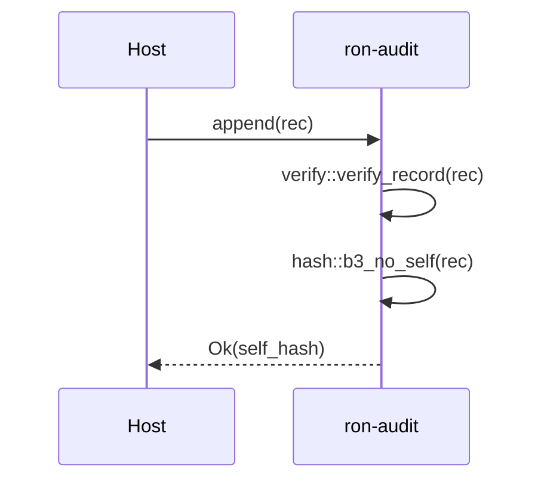
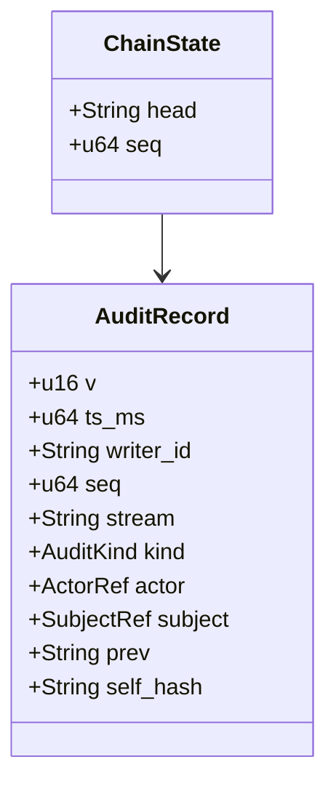
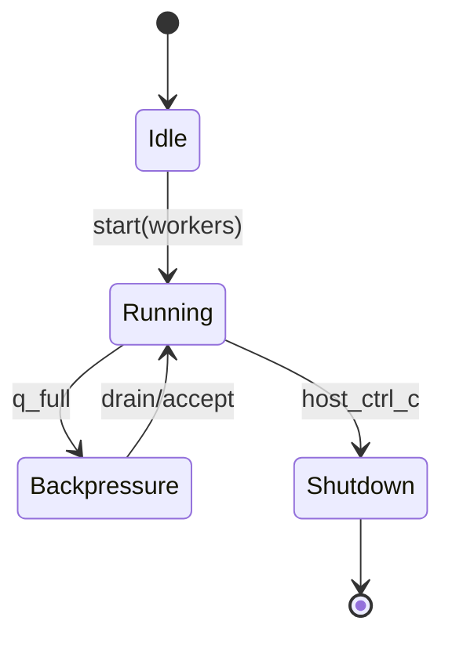

---

# ron-audit

> **Role:** library (integrity plane)
> **Owner:** Stevan White (maintainer)
> **Status:** draft
> **MSRV:** 1.80.0
> **Last reviewed:** 2025-10-08

Badges (optional):
[]() []() []() []()

---

## 1) Overview

**What it is (one paragraph):**
`ron-audit` provides the **tamper-evident audit core** for RustyOnions. It canonicalizes records, computes BLAKE3 digests, enforces hash-links (`prev → self_hash`), and guarantees append-only semantics with idempotent dedupe keys. It is **lib-only** (no sockets/HTTP/CLI); hosts embed it to wire storage, metrics, and exports. The library is amnesia-aware (Micronode RAM sinks vs. Macronode WAL/exports) and forbids secrets/PII in records.

**How it fits (RustyOnions topology):**

* **Pillar:** Audit & Compliance (append-only; exportable; cross-link to registry/ledger)
* **Upstream callers:** `svc-gateway`, `svc-overlay`, `svc-index`, `svc-storage` (embed & emit)
* **Downstream deps:** Host-provided KMS/signers, WAL/export, Prometheus registry
* **Data it touches:** in-memory state; host may attach WAL/exports (Macronode)
* **Security boundary:** No keys or raw PII here; signatures/checkpoints occur in hosts

### 1.1 High-Level Architecture (Mermaid REQUIRED)

```mermaid
flowchart LR
  subgraph Host Service (e.g., svc-gateway)
    A[Emit AuditRecord] -->|bounded mpsc| B(ron-audit)
  end

  B -->|append-only| C[[Chain State]]
  B -->|verify| D[[Hash/Link Checks]]
  B -->|metrics hooks| E[[Prometheus (host)]]
  B -. Micronode .-> F[(RAM sink)]
  B -. Macronode .-> G[(WAL + Export Manifests)]

  style B fill:#0b7285,stroke:#083344,color:#fff
```

---

## 2) Responsibilities & Boundaries

**MUST do (core responsibilities):**

* [ ] Append-only ingestion; return updated chain head (`self_hash`)
* [ ] Canonicalization + BLAKE3 hashing + `(prev→self_hash)` verification
* [ ] Enforce bounds (e.g., `attrs ≤ 1 KiB`, record ≤ `4 KiB`); idempotent dedupe key
* [ ] Provide per-(writer,stream) ordering; deterministic total-order key

**MUST NOT do (anti-scope / boundaries):**

* [ ] No HTTP/CLI/endpoints or long-running servers
* [ ] No secrets/tokens/raw PII or full-precision IPs in audit records
* [ ] No embedded signature crypto; hosts sign checkpoints and exports

**Acceptance Gates (PROOF you did it):**

* [ ] Invariants covered by unit/prop/loom/fuzz; chaos drills documented
* [ ] Canonical metrics wired in hosts; alerts configured
* [ ] Health/readiness (in hosts) reflect real audit path state
* [ ] Perf gates hold: verify/link throughput & WAL/exports p95 targets

---

## 3) Public Interfaces

> Lib-only. Keep this section tight and stable for SemVer.

### 3.1 Rust API (library)

Key modules/types (intended v1.x surface):

* `pub trait AuditSink` / `pub trait AuditStream` — append-only sink & read state
* `pub mod canon` — canonicalization helpers + errors (**DTOs must use `#[serde(deny_unknown_fields)]`**)
* `pub mod hash` — `b3_no_self`, stable `dedupe_key`
* `pub mod verify` — record/link/chain verification

Example:

```rust
use ron_audit::{hash, verify};
use ron_proto::audit::AuditRecord;

fn main() -> anyhow::Result<()> {
    let rec: AuditRecord = /* build canonical record */;
    let id = hash::b3_no_self(&rec)?; // "b3:<hex>"
    verify::verify_record(&rec)?;
    println!("ok, id={id}");
    Ok(())
}
```

### 3.2 Quickstart (host wiring)

Minimal host-side pseudocode for embedding:

```rust
use ron_audit::{AuditSink, verify, hash};
use ron_proto::audit::AuditRecord;
use prometheus::{Registry, Histogram, IntCounterVec};

struct HostAudit {
    q: tokio::sync::mpsc::Sender<AuditRecord>,
    // wal/export wiring & metrics live here
}

impl AuditSink for HostAudit {
    async fn append(&self, rec: AuditRecord) -> anyhow::Result<String> {
        verify::verify_record(&rec)?;
        let id = hash::b3_no_self(&rec)?;
        self.q.send(rec).await.map_err(|e| anyhow::anyhow!(e))?;
        Ok(id)
    }
}

// In your service bootstrap:
// - construct bounded channel (shed on overflow)
// - spawn WAL/export worker(s) with explicit timeouts
// - register metrics (audit_drop_total, audit_verify_fail_total, wal_fsync_seconds, ...)
```

### 3.3 Common path (sequence diagram)



---

## 4) Configuration

> Configuration is owned by the **host**. `ron-audit` exposes validation helpers and sane defaults.

| Variable (host)          | Type | Default/Notes                   |        |                               |
| ------------------------ | ---- | ------------------------------- | ------ | ----------------------------- |
| `RON_AUDIT_AMNESIA`      | bool | `true` Micronode; RAM-only sink |        |                               |
| `RON_AUDIT_MAX_ATTRS`    | int  | `1024` bytes                    |        |                               |
| `RON_AUDIT_MAX_RECORD`   | int  | `4096` bytes                    |        |                               |
| `RON_AUDIT_WAL_DIR`      | path | required if WAL enabled         |        |                               |
| `RON_AUDIT_PRIVACY_MODE` | enum | `drop                           | prefix | salted_hash` (+ per-env salt) |

**Feature flags (Cargo):** `wal`, `export`, optional signer/verify adapters behind feature gates.
**See also:** workspace dependencies in **COMPLETECRATELIST.MD**.

---

## 5) Build, Run, Test

**Build**

```bash
cargo build -p ron-audit
```

**Tests (unit/prop/docs)**

```bash
cargo test -p ron-audit --all-features
cargo test -p ron-audit --doc
```

**Fuzz / Loom / Benches**

```bash
# Fuzz requires nightly toolchain
cargo +nightly fuzz run canonicalize_fuzz -- -max_total_time=60

# Loom tests (deterministic concurrency exploration)
RUSTFLAGS="--cfg loom" cargo test -p ron-audit --test loom_* -- --nocapture

# Criterion benches
cargo bench -p ron-audit
```

**Lint & deps**

```bash
cargo fmt --all
cargo clippy -p ron-audit -- -D warnings
cargo deny check
```

(Optional) API diffs:

```bash
cargo public-api -p ron-audit
```

---

## 6) Observability

**Endpoints:** none here (lib-only). Hosts expose:

* `/metrics` — Prometheus exposition
* `/healthz` — liveness, dependency-light
* `/readyz` — readiness (WAL/export/queue health)

**Canonical Metrics (host wiring):**

* `audit_drop_total{reason}` — backpressure/limits drops
* `audit_verify_fail_total{kind}` — verification failures (target: 0 when healthy)
* `wal_fsync_seconds` — p95 ≤ 8 ms, p99 ≤ 15 ms (batched)
* `export_batch_seconds` — p95 ≤ 250 ms / 10k records

**Tracing:** include `seed`, `writer`, `stream`, `corr_id` on failure paths.

---

## 7) Performance & SLOs

| Metric                        | Target                     | Notes     |
| ----------------------------- | -------------------------- | --------- |
| Verify `self_hash` throughput | ≥ 400k ops/s (single core) | CI gate   |
| Link check throughput         | ≥ 250k links/s             | CI gate   |
| WAL fsync p95 / p99           | ≤ 8 ms / ≤ 15 ms (batched) | Macronode |
| Export batch p95              | ≤ 250 ms per 10k records   | Macronode |

> Measured on lab baseline hardware; reproduce with Criterion benches and `testing/performance/audit/*.sh`. Regressions >10% fail CI. See [§6 Observability](#6-observability) for the metrics you should watch while running perf benches.

---

## 8) Data & Schema

**Data model summary**

* `AuditRecord` (re-exported via `ron-proto`), **must** be `#[serde(deny_unknown_fields)]` for forward-secure parsing
* Chain fields `prev`, `self_hash`; deterministic canonicalization (e.g., NFC, stable map order, no floats)



**Migrations**

* Structural changes use schema **major**; minor evolutions via bounded `attrs`
* Exports are idempotent; hosts sign checkpoints and manage verification keys

---

## 9) Security & Privacy

* **Threat model (STRIDE):**

  * **Tampering/Repudiation:** hash-chains + signed export checkpoints
  * **Spoofing:** explicit writer/seq; host authZ/authN and capability checks
* **Key handling:** none in this crate; hosts sign/rotate/verify
* **PII:** secrets/tokens/raw IPs **forbidden**. **Privacy modes:**

  * `drop` — strip sensitive fields entirely
  * `prefix` — coarse anonymization via truncated/prefixed tokens
  * `salted_hash` — irreversible hashing with per-environment salt
    Micronode defaults to **amnesia** (RAM-only sinks).

---

## 10) Error Taxonomy

| Code/Variant                | When it happens          | User hint                 | Retries        |
| --------------------------- | ------------------------ | ------------------------- | -------------- |
| `AppendError::Full`         | queue bounded / overflow | shed or increase limits   | yes (jittered) |
| `AppendError::SizeExceeded` | record bounds exceeded   | reduce attrs/record sizes | no             |
| `VerifyError::HashMismatch` | chain link mismatch      | investigate upstream data | no             |
| `VerifyError::Canon(..)`    | non-canonical inputs     | normalize fields          | fix input      |
| `IoError` (host layer)      | WAL/export I/O issues    | check disk/perm/latency   | yes w/ backoff |

---

## 11) Concurrency Model

* **Runtime:** host tokio; `ron-audit` assumes **bounded queues** and **shed-not-block** under surge
* **I/O:** host workers own WAL/export I/O with explicit timeouts
* **Rules:** never hold a lock across `.await` in supervisory or hot paths



---

## 12) Compatibility & Requirements

* **Rust:** MSRV 1.80.0
* **OS:** macOS 10.15+, Linux x86_64; containers OK
* **TLS:** N/A (lib-only; hosts typically use tokio_rustls (e.g., 0.26.x))
* **HTTP:** N/A (hosts typically use axum 0.7.x, tower-http 0.6.x)
* **DB:** Optional (hosts: sled/WAL/export)
* **Workspace deps:** see **COMPLETECRATELIST.MD**

---

## 13) Examples

Minimal verify:

```rust
use ron_audit::verify;
use ron_proto::audit::AuditRecord;

fn main() -> anyhow::Result<()> {
    let rec: AuditRecord = /* ... */;
    verify::verify_record(&rec)?;
    Ok(())
}
```

Host bench & chaos:

```bash
cargo bench -p ron-audit
bash testing/runbook/chaos_inject.sh storm 600
```

---

## 14) Troubleshooting

* **Queue overflow / Busy:** expect `audit_drop_total{reason="audit_backpressure"}`; prefer shedding over blocking
* **Verification failures:** check canonicalization (NFC, stable map order, no floats) and chain links; `audit_verify_fail_total` should be 0 when healthy
* **WAL latency spikes:** monitor `wal_fsync_seconds`; follow **RUNBOOK.md** freeze/recovery SLAs

> Freeze/recovery drills: see **RUNBOOK.md**.

---

## 15) Development Notes

**Project conventions (RustyOnions):**

* This crate is **lib-only**; hosts expose metrics/health/ready
* Track surface changes with `cargo public-api`; classify SemVer diffs in **CHANGELOG.md**
* Canon/bounds changes require updated **test vectors** in the PR

**Pre-commit quickcheck**

```bash
cargo fmt --all
cargo clippy -- -D warnings
cargo test
cargo deny check
```

**Code of Conduct:** contributions follow the Rust Code of Conduct.

---

## 16) Mermaid Diagrams — Policy & Tooling (REQUIRED)

Include at least: (1) one **architecture** flowchart, (2) one **sequence** diagram for a common path, (3) one **state** diagram if lifecycle/actors exist.

**Render locally (SVG)**

```bash
npm i -g @mermaid-js/mermaid-cli
mmdc -i docs/arch.mmd -o docs/arch.svg
```

**Render via Docker**

```bash
docker run --rm -v "$PWD":/data minlag/mermaid-cli mmdc -i docs/arch.mmd -o docs/arch.svg
```

**CI (GitHub Actions snippet)**

```yaml
name: render-mermaid
on: [push, pull_request]
jobs:
  mmdc:
    runs-on: ubuntu-latest
    steps:
      - uses: actions/checkout@v4
      - run: npm i -g @mermaid-js/mermaid-cli
      - run: |
          mkdir -p docs
          for f in $(git ls-files '*.mmd'); do
            out="${f%.mmd}.svg"
            mmdc -i "$f" -o "$out"
```

**Repo hygiene:** commit rendered SVGs in `docs/` so diagrams are viewable offline.

---

## 17) Roadmap & TODO

* [ ] M1 — Land bounds/canon vectors + Bronze coverage; host metrics wired
* [ ] M2 — WAL/export harness green in staging; address **Six Concerns – Latency** via batching options; drill freeze/recovery SLAs (RUNBOOK)
* [ ] M3 — PQ envelope & hybrid verify path behind feature gate; perf re-baseline post-refactor

---

## 18) Changelog

See [CHANGELOG.md](./CHANGELOG.md). Gate public API diffs; document breaking changes with migration notes.

---

## 19) License

Dual-licensed under **MIT** or **Apache-2.0**. See [LICENSE-MIT](../LICENSE-MIT) and [LICENSE-APACHE](../LICENSE-APACHE).

---

## 20) Contributing

PRs welcome! Please include:

* Updated canonicalization vectors if schema/canon changed
* Bench impact and chaos notes for perf-sensitive changes
* Docs & examples that compile (`cargo test --doc`)

---
