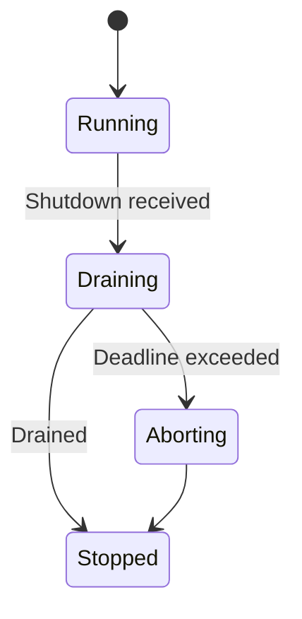
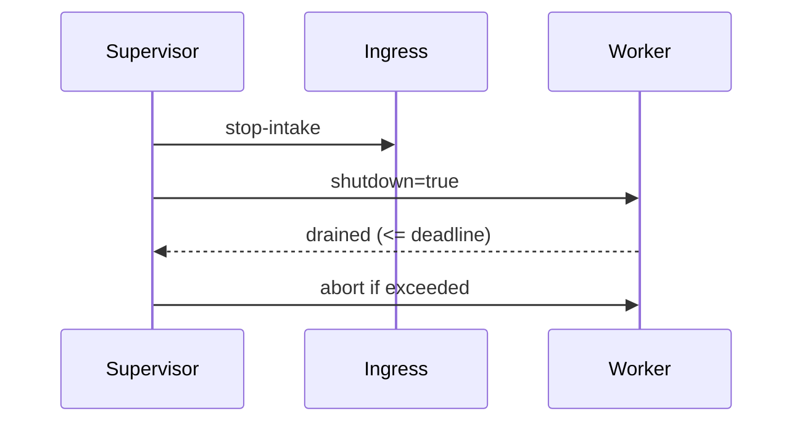

````markdown
---
title: Concurrency Model — ron-audit
crate: ron-audit
owner: Stevan White
last-reviewed: 2025-10-07
status: draft
template_version: 1.1
msrv: 1.80.0
tokio: "1.x (pinned at workspace root)"
loom: "0.7+ (dev-only)"
lite_mode: "For small library crates: fill §§1,3,4,5,10,11 and mark others N/A"
---

# Concurrency Model — ron-audit

This document makes the concurrency rules **explicit**: tasks, channels, locks, shutdown, timeouts,
and validation (property/loom/TLA+). It complements `docs/SECURITY.md`, `docs/CONFIG.md`,
and the crate’s `README.md` and `IDB.md`.

> **Golden rule:** never hold a lock across `.await` in supervisory or hot paths.

---

## 0) Lite Mode (for tiny lib crates)

`ron-audit` is a **library**: it defines DTOs, sink traits, helpers, and verification.
It does **not** spawn runtimes or own long-lived tasks. Therefore:

- We fully specify **§1 Invariants**, **§3 Channels**, **§4 Locks**, **§5 Timeouts**, **§10 Validation**, **§11 Code Patterns** for the library surface and the **host integration pattern**.
- Sections about hosting a runtime (**§2 Runtime**, **§6 Shutdown**, **§7 I/O framing**) are **N/A for the library** but specified as **host guidance** so services wire it correctly.

---

## 1) Invariants (MUST)

- [I-1] **No lock across `.await`.** Hashing/canonicalization happens before awaits; any shared metadata is copied out of locks first.
- [I-2] **Single writer per stream head.** Each `(writer_id, stream)` sequence is advanced by exactly one sink worker at a time; chain head updates are not raced.
- [I-3] **Bounded channels only.** All producer→sink communication is via **bounded** `mpsc`; overflow must shed (`Busy`) rather than buffer unbounded.
- [I-4] **Explicit timeouts at host edges.** Host must bound enqueue attempts and export/WAL I/O with deadlines; fail fast with typed errors.
- [I-5] **Cooperative cancellation.** Every `await` in host workers is cancel-safe; workers use `select!` with a shutdown signal.
- [I-6] **No blocking syscalls on the async runtime.** WAL fsync or large file ops use `spawn_blocking` (host concern).
- [I-7] **No task leaks.** Hosts track worker handles and join/abort deterministically on shutdown.
- [I-8] **Backpressure over buffering.** On a full queue, shed and emit `audit_drop_total{reason="audit_backpressure"}` (host metric).
- [I-9] **Async Drop discipline.** Library types do not block in `Drop`. For teardown, expose/expect an async `close()` on sinks; hosts call it before drop.

---

## 2) Runtime Topology

**N/A for the library.**  
**Host guidance (recommended):** a lightweight supervisor spawns a small worker pool to service the bounded queue.

```mermaid
flowchart TB
  subgraph Host Runtime
    SUP[Supervisor] -->|spawn| IN[Ingress (emit API)]
    SUP -->|spawn| WP[(Sink Worker(s))]
    IN -->|mpsc: audit_work(cap=queue_depth)| WP
    SUP -->|watch: Shutdown| IN
    SUP -->|watch: Shutdown| WP
  end
  style SUP fill:#0ea5e9,stroke:#0c4a6e,color:#fff
````

*Text:* A Supervisor spawns the public `emit` ingress and N sink workers. Ingress uses a bounded `mpsc` to feed workers; a shutdown watch is fanned out to all tasks.

---

## 3) Channels & Backpressure

**Library surface:** provides *no global channels*.
**Host integration pattern (canonical):**

| Name            | Kind      | Capacity (cfg) | Producers → Consumers   | Backpressure Policy            | Drop Semantics                                            |
| --------------- | --------- | -------------- | ----------------------- | ------------------------------ | --------------------------------------------------------- |
| `audit_work`    | mpsc      | `queue_depth`  | N → M (Ingress→Workers) | `try_send`; on `Full` → `Busy` | increment `audit_drop_total{reason="audit_backpressure"}` |
| `shutdown`      | watch     | 1              | 1 → N                   | last-write-wins                | N/A                                                       |
| `events` (opt.) | broadcast | 1024           | 1 → N                   | drop-oldest on lag             | increment `bus_lagged_total`                              |

Guidelines:

* Prefer `try_send` with an immediate **typed error** (`Busy`) over waiting.
* Expose a **depth gauge** and a **drop counter** for `audit_work`.

---

## 4) Locks & Shared State

**Allowed**

* Short-lived `Mutex`/`RwLock` around the **in-memory chain head** (`prev`/`seq`) per stream, updated only in the sink worker thread; keep critical sections tiny and never await while held.
* Read-mostly snapshots via `Arc<StateSnapshot>` for metrics counters.

**Forbidden**

* Holding locks across `.await`.
* Nested locks without a documented order.

**Suggested order (if multi-lock needed)**

1. `stream_registry` (map of streams → head)
2. `policy_view` (read-mostly)
3. `counters` (atomic preferred; no lock if possible)

---

## 5) Timeouts, Retries, Deadlines

* **Enqueue deadline:** hosts should bound `emit()` end-to-end (e.g., 5–25ms); on timeout → `Busy`.
* **WAL I/O:** per-append soft deadline (e.g., 5–50ms) with a breaker to shed if the device stalls.
* **Export/Checkpoint:** long-running; always run with time budget (e.g., ≤ 2s per batch) and off the core runtime via `spawn_blocking` where applicable.
* **Retries:** only idempotent replays (same dedupe key) with jittered backoff (50–100ms → cap 2s, ≤ 3 tries).

```mermaid
sequenceDiagram
  autonumber
  participant Caller
  participant H as Host(emit)
  participant W as Sink Worker
  Caller->>H: emit(AuditRecord) deadline=25ms
  H->>W: try_send(job)
  alt queue full
    H-->>Caller: Err(Busy)
  else accepted
    W-->>Caller: ack via completion (internal)
  end
```

---

## 6) Cancellation & Shutdown

**N/A for the library.**
**Host guidance:** stop intake, drain within a deadline (1–5s), then abort laggards. All `.await`s in workers are wrapped by `select!` with shutdown.



---

## 7) I/O & Framing

**N/A for the library.**
**Host guidance:** WAL writes are length-delimited records with a fixed header (size, range, checksum). Use `AsyncWriteExt::write_all` and `shutdown().await` where appropriate.

---

## 8) Error Taxonomy (Concurrency-Relevant)

| Error          | When                         | Retry?   | Metric                                       | Notes                   |               |
| -------------- | ---------------------------- | -------- | -------------------------------------------- | ----------------------- | ------------- |
| `Busy`         | `mpsc` full or enqueue timed | no/maybe | `busy_rejections_total`                      | Prefer immediate return |               |
| `Timeout`      | WAL/export step exceeded     | maybe    | `io_timeouts_total{op="wal                   | export"}`               | Bound latency |
| `Canceled`     | shutdown                     | no       | `tasks_canceled_total{kind="worker"}`        | cooperative             |               |
| `Lagging`      | broadcast overflow           | no       | `bus_lagged_total`                           | diagnostic only         |               |
| `Backpressure` | device slow / breaker open   | no       | `audit_drop_total{reason="io_backpressure"}` | sheds to protect SLO    |               |

---

## 9) Metrics (Concurrency Health) — Host Emits

* `queue_depth{queue="audit_work"}`
* `audit_drop_total{reason}`
* `tasks_spawned_total{kind}`, `tasks_aborted_total{kind}`
* `io_timeouts_total{op}`
* `backoff_retries_total{op}`
* `busy_rejections_total{endpoint="emit"}`

---

## 10) Validation Strategy

**Unit / Property (library)**

* Hash-chain property holds when records are appended in any interleaving consistent with `(writer_id, stream, seq)`.
* Dedupe key idempotency: same canonicalization → same position/head.

**Host-focused tests**

* Backpressure: fill `audit_work` and assert `Busy` + `audit_drop_total` increment.
* Deadline honored for enqueue and WAL ops.
* Drain on shutdown within deadline; no task leaks.

**Loom (dev-only)**

* Model: producer → bounded queue → single consumer with shutdown.
* Assert: no deadlock, no missed shutdown, no double update of stream head.

**Fuzz**

* Fuzz canonicalization inputs (`attrs` size bounds, NFC/NFD strings) to ensure no panics and correct `SizeExceeded`.

**Chaos**

* Inject slow disk / FD exhaustion; confirm breaker sheds and queues don’t grow; chain integrity preserved after recovery.

**TLA+ (optional)**

* State machine: `(prev, self_hash, seq)` per stream. Prove safety (no two distinct records share same `(writer_id,stream,seq)`; no head regress) and liveness (eventual drain under finite arrivals).

---

## 11) Code Patterns (Copy-Paste)

**Bounded enqueue with shed**

```rust
use tokio::sync::mpsc;
fn enqueue(tx: &mpsc::Sender<Job>, job: Job) -> Result<(), Error> {
    match tx.try_send(job) {
        Ok(_) => Ok(()),
        Err(mpsc::error::TrySendError::Full(_)) => {
            metrics::audit_drop_total("audit_backpressure").inc();
            Err(Error::Busy)
        }
        Err(mpsc::error::TrySendError::Closed(_)) => Err(Error::Closed),
    }
}
```

**Worker with cooperative shutdown**

```rust
async fn run_worker(mut rx: mpsc::Receiver<Job>, mut shut: tokio::sync::watch::Receiver<bool>) {
    loop {
        tokio::select! {
            _ = shut.changed() => break,
            maybe = rx.recv() => {
                let Some(job) = maybe else { break };
                if let Err(e) = process(job).await {
                    tracing::warn!(error=%e, "audit job failed");
                }
            }
        }
    }
}
```

**No lock across `.await`**

```rust
let (prev, next_seq) = {
    let mut head = stream_heads.lock();   // short critical section
    let st = head.entry(stream.clone()).or_default().clone();
    (st.prev.clone(), st.seq + 1)
}; // lock dropped here
let record = build_canonical(prev, next_seq, input)?;
sink.append(&record).await?;             // safe await with no lock held
```

**Timeout wrapper (host I/O)**

```rust
let res = tokio::time::timeout(cfg.wal_timeout, wal_append(&segment, buf)).await;
match res {
    Ok(Ok(())) => {},
    Ok(Err(e)) => return Err(Error::Io(e)),
    Err(_)     => return Err(Error::Timeout),
}
```

**Async Drop pattern**

```rust
pub struct WalSink { inner: Option<WalHandle> }
impl WalSink {
  pub async fn close(&mut self) -> anyhow::Result<()> {
    if let Some(mut h) = self.inner.take() { h.flush().await?; }
    Ok(())
  }
}
impl Drop for WalSink {
  fn drop(&mut self) {
    if self.inner.is_some() {
      tracing::debug!("WalSink dropped without close(); relying on OS cleanup");
    }
  }
}
```

---

## 12) Configuration Hooks (Quick Reference)

From `docs/CONFIG.md`:

* `queue_depth`, `workers`, `shed_policy`
* `max_attrs_bytes`, `max_record_bytes`
* WAL: `wal.dir`, `wal.rotate_bytes`, `wal.fsync`
* Export: `export.dir`, `checkpoint_every`, `export_every`
* Amnesia: `amnesia=true` forbids WAL

---

## 13) Known Trade-offs / Nonstrict Areas

* **Drop vs Reject:** We standardize on **reject new (`Busy`)** rather than drop-oldest for `audit_work` to keep caller semantics crisp; broadcast channels may drop-oldest with metrics.
* **Single-consumer chain head:** Simpler correctness; if scaling requires >1 consumer per stream, shard by `stream` key rather than concurrent writers on the same head.
* **spawn_blocking:** WAL fsyncs may use it; keep batches small to avoid starving the runtime.

---

## 14) Mermaid Diagrams

### 14.1 Task & Queue Topology (host)

```mermaid
flowchart LR
  IN[Ingress emit()] -->|mpsc:audit_work(<= queue_depth)| W1[Worker A]
  IN -->|mpsc:audit_work| W2[Worker B]
  subgraph Control
    SH[Shutdown watch] --> W1
    SH --> W2
  end
```

*Text:* Ingress pushes to a bounded queue consumed by a small worker pool; a shutdown watch fans out to workers.

### 14.2 Shutdown Sequence (host)



---

## 15) CI & Lints (Enforcement)

* Enable at workspace level: `-D warnings`, `-W clippy::await_holding_lock`.
* Add loom job for `--cfg loom` models of producer/consumer with shutdown.
* Fuzz canonicalization and bounds (attrs/record size).

---

## 16) Schema Generation (Optional)

You may annotate queue creations in host code with a small macro to generate `docs/_generated/concurrency.mdfrag` and include it here to avoid drift.

---

## 17) Review & Maintenance

* **Review cadence:** 90 days or on any change to sink traits/host wiring.
* Keep `owner`, `msrv`, `last-reviewed` current.
* **PR checklist:** if you modify queue sizes, worker counts, or lock patterns, update this doc + tests (unit/property/loom).

```
```
