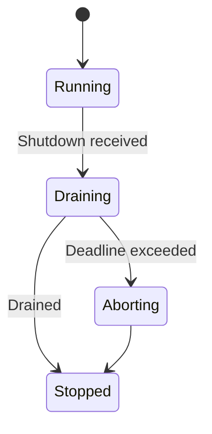
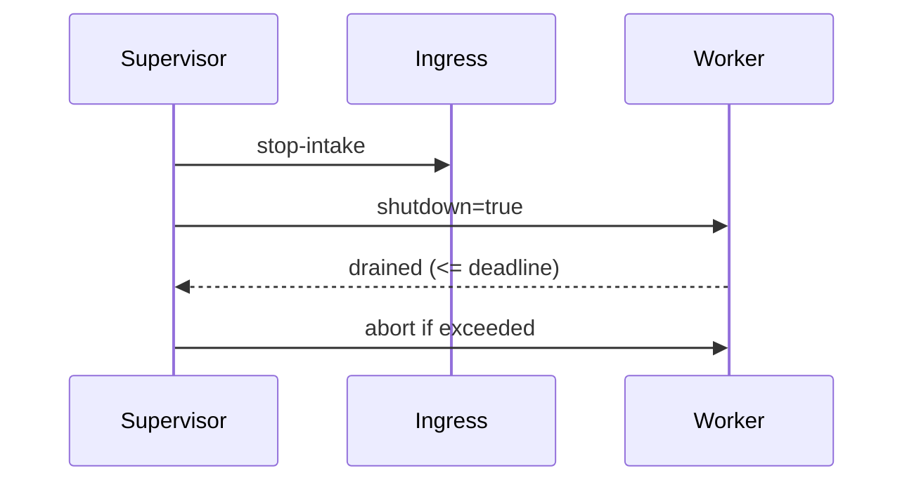

# Combined Markdown

_Source directory_: `crates/ron-audit/docs`  
_Files combined_: 12  
_Recursive_: 0

---

### Table of Contents

- API.MD
- CONCURRENCY.MD
- CONFIG.MD
- GOVERNANCE.MD
- IDB.md
- INTEROP.MD
- OBSERVABILITY.MD
- PERFORMANCE.MD
- QUANTUM.MD
- RUNBOOK.MD
- SECURITY.MD
- TESTS.MD

---

## API.MD
_File 1 of 12_


---

````markdown
---
title: API Surface & SemVer Reference — ron-audit
status: draft
msrv: 1.80.0
last-updated: 2025-10-07
audience: contributors, auditors, API consumers
---

# API.md — ron-audit

## 0. Purpose

This document captures the **public API surface** of `ron-audit`:

- Snapshot of exported *functions, types, traits, modules* (Rust surface only; this is a library, not a service).
- SemVer discipline: what is **additive**, what is **breaking**, and which **feature flags** gate optional APIs.
- CI enforceability via `cargo public-api` and (optionally) `cargo semver-checks`.
- Canon alignment: all exports reflect the IDB invariants (BLAKE3 chaining, dedupe, bounds, checkpoints).

> `ron-audit` is **lib-only**. No HTTP/CLI endpoints are part of this crate’s API surface. Hosts (e.g., `svc-gateway`, `svc-storage`) wire the library and expose endpoints/metrics.

---

## 1. Public API Surface

Generate (at release and every PR):

```bash
cargo public-api -p ron-audit --simplified --deny-changes
````

### Current Surface (authoritative snapshot)

> Replace this block with the output of `cargo public-api` from your branch before merging.
> The list below is the **intended** stable surface for v1.x and should match the tool output.

```text
# re-exports (minimal, convenience only)
pub use ron_proto::audit::AuditRecord;

# core traits & errors
pub trait AuditSink
pub trait AuditStream
pub struct ChainState { pub head: String, pub seq: u64 }
pub enum AppendError { Full, Tamper, SizeExceeded, Io, Schema }

# canonicalization & hashing
pub mod canon {
    pub fn canonicalize_without_self_hash(rec: &AuditRecord) -> Result<Vec<u8>, CanonError>
    pub enum CanonError { NonCanonicalInput, FloatDisallowed, KeyOrder, Utf8Nfc }
}
pub mod hash {
    pub fn b3_no_self(rec: &AuditRecord) -> Result<String, CanonError>
    pub fn dedupe_key(rec: &AuditRecord) -> Result<[u8; 32], CanonError>
}

# verification helpers
pub mod verify {
    pub fn verify_record(rec: &AuditRecord) -> Result<(), VerifyError>
    pub fn verify_link(prev: &AuditRecord, next: &AuditRecord) -> Result<(), VerifyError>
    pub fn verify_chain<'a, I: IntoIterator<Item=&'a AuditRecord>>(iter: I) -> Result<(), VerifyError>
    pub enum VerifyError { HashMismatch, PrevMismatch, Canon(CanonError) }
}

# bounds & policy
pub mod bounds {
    #[derive(Clone, Copy)]
    pub struct Limits { pub max_attrs_bytes: usize, pub max_record_bytes: usize }
    pub fn check(rec: &AuditRecord, lim: Limits) -> Result<(), BoundsError>
    pub enum BoundsError { AttrsTooLarge, RecordTooLarge }
}

# feature: wal
#[cfg(feature = "wal")]
pub mod wal {
    pub struct WalSink { /* opaque */ }
    impl AuditSink for WalSink { /* ... */ }
    pub struct WalConfig { pub dir: std::path::PathBuf, pub rotate_bytes: u64, pub fsync: FsyncPolicy }
    pub enum FsyncPolicy { Always, OnCheckpoint, Never }
}

# feature: export
#[cfg(feature = "export")]
pub mod export {
    pub struct Manifest { /* opaque */ }
    pub struct Checkpoint {
        pub range: (u64, u64),
        pub root: String,           // "b3:<hex>"
        pub signer_key_id: String,
        pub alg: String,            // tag only; signing done by host
        pub sig: Vec<u8>,           // host-provided
    }
    pub trait ExportSink: Send + Sync {
        fn write_manifest(&self, m: &Manifest) -> Result<(), std::io::Error>;
        fn write_checkpoint(&self, c: &Checkpoint) -> Result<(), std::io::Error>;
    }
}

# optional helper for hosts (off by default)
#[cfg(feature = "cli")]
pub mod config {
    pub use ron_audit_config_types::*;
}
```

> **Notes**
>
> * We **intentionally** re-export `AuditRecord` from `ron-proto` for ergonomics. Its SemVer stability is tracked in §2 (re-export policy).
> * `WalSink`, `Manifest`, `Checkpoint` are **feature-gated** (`wal`, `export`) to minimize footprint for Micronode (amnesia) use.

---

## 2. SemVer Discipline

### 2.1 Additive (MINOR / Non-Breaking)

* New modules **behind a new feature flag** (default-off).
* New methods with default impls on traits if trait object safety is preserved.
* New `AppendError` / `VerifyError` **variants** only if marked `#[non_exhaustive]` (recommended).
* New helper fns in `canon`, `hash`, `verify`, `bounds`.

### 2.2 Breaking (MAJOR)

* Removing/renaming any exported item (fn/type/trait/mod).
* Changing function signatures, trait method sets, or object safety.
* Changing canonicalization semantics (key order, float policy, NFC) — this is **API by contract**; any change requires **major**.
* Changing `AuditRecord` re-export target or replacing it with a local type.
* Making previously `#[non_exhaustive]` enums exhaustive.
* Altering feature-flag defaults (e.g., enabling `wal` by default).

### 2.3 Patch-Level

* Doc fixes, internal perf changes that preserve observable behavior.
* Implementation changes that don’t affect types, signatures, or canonicalization.
* Tightened error messages/text without changing error **types**.

### 2.4 Re-Export Policy for `AuditRecord`

* We re-export `ron_proto::audit::AuditRecord` for convenience.

  * **Breaking**: structural changes in `AuditRecord` that are not backward-compatible (major bump in `ron-proto`) → require a **matching major** in `ron-audit`.
  * **Non-breaking**: additive fields under `#[serde(deny_unknown_fields)]` are **not** allowed; additions must go into `attrs`. Structural additions imply a major in `ron-proto`.

---

## 3. Stability Guarantees

* **MSRV**: `1.80.0` for all v1.x.
* `#![forbid(unsafe_code)]` — no public API depends on unsafe unless explicitly justified (requires owner sign-off).
* No leaking of internal implementation types (e.g., file handles, tokio types) through public signatures.
* Canonicalization is **law**: string NFC, fixed field order, no floats, deterministic JSON map order.
* Feature flags are **additive** and default-off; enabling an optional feature must not affect unrelated APIs.

---

## 4. Invariants (API-Visible Contracts)

* `AuditSink::append` is **append-only**; on success returns the new chain head (`self_hash` of `rec`).
* `AuditStream::state` exposes a **snapshot**; consumers must not infer global ordering beyond `(writer_id, stream, seq)`.
* `hash::b3_no_self` computes `"b3:<hex>"` over canonicalized bytes **excluding** `self_hash`.
* `hash::dedupe_key` is stable across versions for an identical canonical record; replays using the same key MUST be idempotent.
* `verify::*` never mutates inputs and returns **typed** errors (`VerifyError`).
* `bounds::check` enforces `attrs ≤ 1 KiB` and canonical record size `≤ 4 KiB` by default limits (callers may pass stricter).

---

## 5. Tooling

* **cargo public-api** — hard gate on surface drift.
* **cargo semver-checks** — optional, to catch subtle SemVer violations.
* **cargo doc** — public items must be documented (`#![deny(missing_docs)]` in lib).
* **API snapshots** stored at: `docs/api-history/ron-audit/<version>.txt` (exact `cargo public-api` output).

Commands:

```bash
cargo public-api -p ron-audit --simplified > docs/api-history/ron-audit/next.txt
git diff -- docs/api-history/ron-audit/  # review before bumping
```

---

## 6. CI & Gates

* **PR pipeline**:

  * `cargo public-api -p ron-audit --simplified --deny-changes`
  * `cargo doc -p ron-audit` with `#![deny(missing_docs)]`
  * (optional) `cargo semver-checks check-release`
* **CHANGELOG.md** rule:

  * If `cargo public-api` reports differences, the PR **must** include a CHANGELOG entry with **SemVer classification** (patch/minor/major) and rationale.
* **IDB binding**:

  * Any change affecting canonicalization or bounds **must** reference the IDB section and include updated *canonicalization test vectors*.

---

## 7. Acceptance Checklist (DoD)

* [ ] Current API snapshot generated and added to `docs/api-history/ron-audit/<new-version>.txt`.
* [ ] `cargo public-api` gate passes (or intentional diffs explained + CHANGELOG updated).
* [ ] All public items documented and rustdoc builds clean.
* [ ] Feature-flag matrix compiled at least once (`--features wal`, `--features export`, combos).
* [ ] If `AuditRecord` shape changed (via `ron-proto`): coordinated **major** plan captured.

---

## 8. Appendix

### 8.1 References

* Rust SemVer: [https://doc.rust-lang.org/cargo/reference/semver.html](https://doc.rust-lang.org/cargo/reference/semver.html)
* cargo-public-api: [https://github.com/Enselic/cargo-public-api](https://github.com/Enselic/cargo-public-api)
* cargo-semver-checks: [https://github.com/obi1kenobi/cargo-semver-checks](https://github.com/obi1kenobi/cargo-semver-checks)

### 8.2 Perfection Gates (tie-in)

* **Gate G:** No undocumented public items.
* **Gate H:** Canon changes ⇒ major bump; vectors updated.
* **Gate J:** CHANGELOG alignment with `cargo public-api` diff.

### 8.3 History

* **v1.0.0 → v1.0.1:** Added bounds/canonicalization helpers; no surface break.
* **v1.0.1 → v1.0.2:** Clarified multi-writer ordering; added `verify_chain`; feature-gated `export::Checkpoint`.

```


---

## CONCURRENCY.MD
_File 2 of 12_


````markdown
---
title: Concurrency Model — ron-audit
crate: ron-audit
owner: Stevan White
last-reviewed: 2025-10-07
status: draft
template_version: 1.1
msrv: 1.80.0
tokio: "1.x (pinned at workspace root)"
loom: "0.7+ (dev-only)"
lite_mode: "For small library crates: fill §§1,3,4,5,10,11 and mark others N/A"
---

# Concurrency Model — ron-audit

This document makes the concurrency rules **explicit**: tasks, channels, locks, shutdown, timeouts,
and validation (property/loom/TLA+). It complements `docs/SECURITY.md`, `docs/CONFIG.md`,
and the crate’s `README.md` and `IDB.md`.

> **Golden rule:** never hold a lock across `.await` in supervisory or hot paths.

---

## 0) Lite Mode (for tiny lib crates)

`ron-audit` is a **library**: it defines DTOs, sink traits, helpers, and verification.
It does **not** spawn runtimes or own long-lived tasks. Therefore:

- We fully specify **§1 Invariants**, **§3 Channels**, **§4 Locks**, **§5 Timeouts**, **§10 Validation**, **§11 Code Patterns** for the library surface and the **host integration pattern**.
- Sections about hosting a runtime (**§2 Runtime**, **§6 Shutdown**, **§7 I/O framing**) are **N/A for the library** but specified as **host guidance** so services wire it correctly.

---

## 1) Invariants (MUST)

- [I-1] **No lock across `.await`.** Hashing/canonicalization happens before awaits; any shared metadata is copied out of locks first.
- [I-2] **Single writer per stream head.** Each `(writer_id, stream)` sequence is advanced by exactly one sink worker at a time; chain head updates are not raced.
- [I-3] **Bounded channels only.** All producer→sink communication is via **bounded** `mpsc`; overflow must shed (`Busy`) rather than buffer unbounded.
- [I-4] **Explicit timeouts at host edges.** Host must bound enqueue attempts and export/WAL I/O with deadlines; fail fast with typed errors.
- [I-5] **Cooperative cancellation.** Every `await` in host workers is cancel-safe; workers use `select!` with a shutdown signal.
- [I-6] **No blocking syscalls on the async runtime.** WAL fsync or large file ops use `spawn_blocking` (host concern).
- [I-7] **No task leaks.** Hosts track worker handles and join/abort deterministically on shutdown.
- [I-8] **Backpressure over buffering.** On a full queue, shed and emit `audit_drop_total{reason="audit_backpressure"}` (host metric).
- [I-9] **Async Drop discipline.** Library types do not block in `Drop`. For teardown, expose/expect an async `close()` on sinks; hosts call it before drop.

---

## 2) Runtime Topology

**N/A for the library.**  
**Host guidance (recommended):** a lightweight supervisor spawns a small worker pool to service the bounded queue.

```mermaid
flowchart TB
  subgraph Host Runtime
    SUP[Supervisor] -->|spawn| IN[Ingress (emit API)]
    SUP -->|spawn| WP[(Sink Worker(s))]
    IN -->|mpsc: audit_work(cap=queue_depth)| WP
    SUP -->|watch: Shutdown| IN
    SUP -->|watch: Shutdown| WP
  end
  style SUP fill:#0ea5e9,stroke:#0c4a6e,color:#fff
````

*Text:* A Supervisor spawns the public `emit` ingress and N sink workers. Ingress uses a bounded `mpsc` to feed workers; a shutdown watch is fanned out to all tasks.

---

## 3) Channels & Backpressure

**Library surface:** provides *no global channels*.
**Host integration pattern (canonical):**

| Name            | Kind      | Capacity (cfg) | Producers → Consumers   | Backpressure Policy            | Drop Semantics                                            |
| --------------- | --------- | -------------- | ----------------------- | ------------------------------ | --------------------------------------------------------- |
| `audit_work`    | mpsc      | `queue_depth`  | N → M (Ingress→Workers) | `try_send`; on `Full` → `Busy` | increment `audit_drop_total{reason="audit_backpressure"}` |
| `shutdown`      | watch     | 1              | 1 → N                   | last-write-wins                | N/A                                                       |
| `events` (opt.) | broadcast | 1024           | 1 → N                   | drop-oldest on lag             | increment `bus_lagged_total`                              |

Guidelines:

* Prefer `try_send` with an immediate **typed error** (`Busy`) over waiting.
* Expose a **depth gauge** and a **drop counter** for `audit_work`.

---

## 4) Locks & Shared State

**Allowed**

* Short-lived `Mutex`/`RwLock` around the **in-memory chain head** (`prev`/`seq`) per stream, updated only in the sink worker thread; keep critical sections tiny and never await while held.
* Read-mostly snapshots via `Arc<StateSnapshot>` for metrics counters.

**Forbidden**

* Holding locks across `.await`.
* Nested locks without a documented order.

**Suggested order (if multi-lock needed)**

1. `stream_registry` (map of streams → head)
2. `policy_view` (read-mostly)
3. `counters` (atomic preferred; no lock if possible)

---

## 5) Timeouts, Retries, Deadlines

* **Enqueue deadline:** hosts should bound `emit()` end-to-end (e.g., 5–25ms); on timeout → `Busy`.
* **WAL I/O:** per-append soft deadline (e.g., 5–50ms) with a breaker to shed if the device stalls.
* **Export/Checkpoint:** long-running; always run with time budget (e.g., ≤ 2s per batch) and off the core runtime via `spawn_blocking` where applicable.
* **Retries:** only idempotent replays (same dedupe key) with jittered backoff (50–100ms → cap 2s, ≤ 3 tries).

```mermaid
sequenceDiagram
  autonumber
  participant Caller
  participant H as Host(emit)
  participant W as Sink Worker
  Caller->>H: emit(AuditRecord) deadline=25ms
  H->>W: try_send(job)
  alt queue full
    H-->>Caller: Err(Busy)
  else accepted
    W-->>Caller: ack via completion (internal)
  end
```

---

## 6) Cancellation & Shutdown

**N/A for the library.**
**Host guidance:** stop intake, drain within a deadline (1–5s), then abort laggards. All `.await`s in workers are wrapped by `select!` with shutdown.



---

## 7) I/O & Framing

**N/A for the library.**
**Host guidance:** WAL writes are length-delimited records with a fixed header (size, range, checksum). Use `AsyncWriteExt::write_all` and `shutdown().await` where appropriate.

---

## 8) Error Taxonomy (Concurrency-Relevant)

| Error          | When                         | Retry?   | Metric                                       | Notes                   |               |
| -------------- | ---------------------------- | -------- | -------------------------------------------- | ----------------------- | ------------- |
| `Busy`         | `mpsc` full or enqueue timed | no/maybe | `busy_rejections_total`                      | Prefer immediate return |               |
| `Timeout`      | WAL/export step exceeded     | maybe    | `io_timeouts_total{op="wal                   | export"}`               | Bound latency |
| `Canceled`     | shutdown                     | no       | `tasks_canceled_total{kind="worker"}`        | cooperative             |               |
| `Lagging`      | broadcast overflow           | no       | `bus_lagged_total`                           | diagnostic only         |               |
| `Backpressure` | device slow / breaker open   | no       | `audit_drop_total{reason="io_backpressure"}` | sheds to protect SLO    |               |

---

## 9) Metrics (Concurrency Health) — Host Emits

* `queue_depth{queue="audit_work"}`
* `audit_drop_total{reason}`
* `tasks_spawned_total{kind}`, `tasks_aborted_total{kind}`
* `io_timeouts_total{op}`
* `backoff_retries_total{op}`
* `busy_rejections_total{endpoint="emit"}`

---

## 10) Validation Strategy

**Unit / Property (library)**

* Hash-chain property holds when records are appended in any interleaving consistent with `(writer_id, stream, seq)`.
* Dedupe key idempotency: same canonicalization → same position/head.

**Host-focused tests**

* Backpressure: fill `audit_work` and assert `Busy` + `audit_drop_total` increment.
* Deadline honored for enqueue and WAL ops.
* Drain on shutdown within deadline; no task leaks.

**Loom (dev-only)**

* Model: producer → bounded queue → single consumer with shutdown.
* Assert: no deadlock, no missed shutdown, no double update of stream head.

**Fuzz**

* Fuzz canonicalization inputs (`attrs` size bounds, NFC/NFD strings) to ensure no panics and correct `SizeExceeded`.

**Chaos**

* Inject slow disk / FD exhaustion; confirm breaker sheds and queues don’t grow; chain integrity preserved after recovery.

**TLA+ (optional)**

* State machine: `(prev, self_hash, seq)` per stream. Prove safety (no two distinct records share same `(writer_id,stream,seq)`; no head regress) and liveness (eventual drain under finite arrivals).

---

## 11) Code Patterns (Copy-Paste)

**Bounded enqueue with shed**

```rust
use tokio::sync::mpsc;
fn enqueue(tx: &mpsc::Sender<Job>, job: Job) -> Result<(), Error> {
    match tx.try_send(job) {
        Ok(_) => Ok(()),
        Err(mpsc::error::TrySendError::Full(_)) => {
            metrics::audit_drop_total("audit_backpressure").inc();
            Err(Error::Busy)
        }
        Err(mpsc::error::TrySendError::Closed(_)) => Err(Error::Closed),
    }
}
```

**Worker with cooperative shutdown**

```rust
async fn run_worker(mut rx: mpsc::Receiver<Job>, mut shut: tokio::sync::watch::Receiver<bool>) {
    loop {
        tokio::select! {
            _ = shut.changed() => break,
            maybe = rx.recv() => {
                let Some(job) = maybe else { break };
                if let Err(e) = process(job).await {
                    tracing::warn!(error=%e, "audit job failed");
                }
            }
        }
    }
}
```

**No lock across `.await`**

```rust
let (prev, next_seq) = {
    let mut head = stream_heads.lock();   // short critical section
    let st = head.entry(stream.clone()).or_default().clone();
    (st.prev.clone(), st.seq + 1)
}; // lock dropped here
let record = build_canonical(prev, next_seq, input)?;
sink.append(&record).await?;             // safe await with no lock held
```

**Timeout wrapper (host I/O)**

```rust
let res = tokio::time::timeout(cfg.wal_timeout, wal_append(&segment, buf)).await;
match res {
    Ok(Ok(())) => {},
    Ok(Err(e)) => return Err(Error::Io(e)),
    Err(_)     => return Err(Error::Timeout),
}
```

**Async Drop pattern**

```rust
pub struct WalSink { inner: Option<WalHandle> }
impl WalSink {
  pub async fn close(&mut self) -> anyhow::Result<()> {
    if let Some(mut h) = self.inner.take() { h.flush().await?; }
    Ok(())
  }
}
impl Drop for WalSink {
  fn drop(&mut self) {
    if self.inner.is_some() {
      tracing::debug!("WalSink dropped without close(); relying on OS cleanup");
    }
  }
}
```

---

## 12) Configuration Hooks (Quick Reference)

From `docs/CONFIG.md`:

* `queue_depth`, `workers`, `shed_policy`
* `max_attrs_bytes`, `max_record_bytes`
* WAL: `wal.dir`, `wal.rotate_bytes`, `wal.fsync`
* Export: `export.dir`, `checkpoint_every`, `export_every`
* Amnesia: `amnesia=true` forbids WAL

---

## 13) Known Trade-offs / Nonstrict Areas

* **Drop vs Reject:** We standardize on **reject new (`Busy`)** rather than drop-oldest for `audit_work` to keep caller semantics crisp; broadcast channels may drop-oldest with metrics.
* **Single-consumer chain head:** Simpler correctness; if scaling requires >1 consumer per stream, shard by `stream` key rather than concurrent writers on the same head.
* **spawn_blocking:** WAL fsyncs may use it; keep batches small to avoid starving the runtime.

---

## 14) Mermaid Diagrams

### 14.1 Task & Queue Topology (host)

```mermaid
flowchart LR
  IN[Ingress emit()] -->|mpsc:audit_work(<= queue_depth)| W1[Worker A]
  IN -->|mpsc:audit_work| W2[Worker B]
  subgraph Control
    SH[Shutdown watch] --> W1
    SH --> W2
  end
```

*Text:* Ingress pushes to a bounded queue consumed by a small worker pool; a shutdown watch fans out to workers.

### 14.2 Shutdown Sequence (host)



---

## 15) CI & Lints (Enforcement)

* Enable at workspace level: `-D warnings`, `-W clippy::await_holding_lock`.
* Add loom job for `--cfg loom` models of producer/consumer with shutdown.
* Fuzz canonicalization and bounds (attrs/record size).

---

## 16) Schema Generation (Optional)

You may annotate queue creations in host code with a small macro to generate `docs/_generated/concurrency.mdfrag` and include it here to avoid drift.

---

## 17) Review & Maintenance

* **Review cadence:** 90 days or on any change to sink traits/host wiring.
* Keep `owner`, `msrv`, `last-reviewed` current.
* **PR checklist:** if you modify queue sizes, worker counts, or lock patterns, update this doc + tests (unit/property/loom).

```
```


---

## CONFIG.MD
_File 3 of 12_


---

````markdown
---
title: Configuration — ron-audit
crate: ron-audit
owner: Stevan White
last-reviewed: 2025-10-07
status: draft
template_version: 1.0
---

# Configuration — ron-audit

This document defines **all configuration** for `ron-audit`, including sources,
precedence, schema (types/defaults), validation, feature flags, live-reload behavior,
and security implications. It complements `README.md` and `docs/SECURITY.md`.

> **Tiering**
> - **Library crate (this crate):** exposes a typed `Config` and helpers; **does not** bind sockets or host endpoints.
> - **Service crates (hosts):** import `ron-audit` and surface these configs as env/file/flags.

---

## 1) Sources & Precedence (Authoritative)

`ron-audit` ingests config via the host (which may read file/env/flags). Effective precedence (highest wins):

1. **Process flags** (host CLI)  
2. **Environment variables**  
3. **Config file** (e.g., `Config.toml` of the host service)  
4. **Built-in defaults** (hard-coded in `ron-audit`)

> On dynamic reload, recompute under the same precedence.

**File formats:** TOML (preferred), JSON (optional).  
**Env prefix (suggested for hosts):** `RON_AUDIT_`.

---

## 2) Quickstart Examples

### 2.1 Minimal (Micronode-style, RAM-only with strict bounds)
```bash
RON_AUDIT_SINK=ram \
RON_AUDIT_QUEUE_DEPTH=1024 \
RON_AUDIT_MAX_ATTRS_BYTES=1KiB \
RON_AUDIT_MAX_RECORD_BYTES=4KiB \
RON_AUDIT_PRIVACY_IP_MODE=drop \
RON_AUDIT_AMNESIA=true \
cargo run -p svc-gateway
````

### 2.2 Macronode (durable WAL + periodic checkpoints & exports)

```bash
RON_AUDIT_SINK=wal \
RON_AUDIT_WAL_DIR=/var/lib/ron/audit \
RON_AUDIT_WAL_ROTATE_BYTES=128MiB \
RON_AUDIT_WAL_FSYNC=on_checkpoint \
RON_AUDIT_EXPORT_DIR=/var/lib/ron/audit/exports \
RON_AUDIT_CHECKPOINT_EVERY=50000 \
RON_AUDIT_EXPORT_EVERY=15m \
RON_AUDIT_CHECKPOINT_SIGNER_KEY_ID=ops-hsm-1 \
RON_AUDIT_CHECKPOINT_ALG=ed25519 \
RON_AUDIT_QUEUE_DEPTH=8192 \
RON_AUDIT_WORKERS=2 \
cargo run -p svc-storage
```

### 2.3 Config file (TOML) embedded by a host service

```toml
# audit.toml
sink = "ram"        # "ram" | "wal" | "export" | "wal+export"

# Global bounds & flow-control
queue_depth        = 2048
workers            = 1
max_attrs_bytes    = "1KiB"
max_record_bytes   = "4KiB"
shed_policy        = "drop"     # "drop" | "block" (block is forbidden in hot paths; only in tests)

# Privacy / redaction
[privacy]
ip_mode        = "prefix"       # "drop" | "prefix" | "hash"
hash_salt_path = "/etc/ron/audit/ip_hash_salt"  # required when ip_mode="hash"

# WAL (durable) sink
[wal]
dir            = "/var/lib/ron/audit"
rotate_bytes   = "128MiB"
fsync          = "on_checkpoint"   # "always" | "on_checkpoint" | "never" (never is test-only)

# Export + Checkpoints (Macronode)
[export]
dir               = "/var/lib/ron/audit/exports"
checkpoint_every  = 50000          # records
export_every      = "15m"
signer_key_id     = "ops-hsm-1"
alg               = "ed25519"      # tag only; signing is host-provided

# Streams (optional special-casing)
[streams."ingress"]
queue_depth      = 4096

[streams."policy"]
queue_depth      = 1024
```

---

## 3) Schema (Typed, With Defaults)

> Durations accept `ms`, `s`, `m`, `h`. Sizes accept `B`, `KB`, `MB`, `MiB`, etc.
> Env vars use `RON_AUDIT_` prefix.

| Key / Env Var                                                 | Type     | Default         | Description                                               | Security Notes                  |                |                    |
| ------------------------------------------------------------- | -------- | --------------- | --------------------------------------------------------- | ------------------------------- | -------------- | ------------------ |
| `sink` / `RON_AUDIT_SINK`                                     | enum     | `ram`           | Audit sink strategy: `ram`, `wal`, `export`, `wal+export` | `ram` required in amnesia mode  |                |                    |
| `queue_depth` / `RON_AUDIT_QUEUE_DEPTH`                       | u32      | `1024`          | Bounded enqueue size per worker                           | Prevents unbounded memory       |                |                    |
| `workers` / `RON_AUDIT_WORKERS`                               | u16      | `1`             | Sink worker threads/tasks                                 | Keep small to reduce contention |                |                    |
| `max_attrs_bytes` / `RON_AUDIT_MAX_ATTRS_BYTES`               | size     | `1KiB`          | Max serialized `attrs` size (IDB [I-9])                   | DoS guard                       |                |                    |
| `max_record_bytes` / `RON_AUDIT_MAX_RECORD_BYTES`             | size     | `4KiB`          | Max canonical record size excl. `self_hash` (IDB [I-9])   | DoS guard                       |                |                    |
| `shed_policy` / `RON_AUDIT_SHED_POLICY`                       | enum     | `drop`          | `drop` (shed on full) or `block` (test only)              | Never `block` on hot paths      |                |                    |
| `amnesia` / `RON_AUDIT_AMNESIA`                               | bool     | `true`          | When `true`, forbid disk writes silently                  | Enforced in Micronode           |                |                    |
| `privacy.ip_mode` / `RON_AUDIT_PRIVACY_IP_MODE`               | enum     | `drop`          | `drop`, `prefix`(/24,/64), `hash`(salted)                 | PII minimization                |                |                    |
| `privacy.hash_salt_path` / `RON_AUDIT_PRIVACY_HASH_SALT_PATH` | path     | `""`            | Required if `ip_mode=hash`                                | File perms 0600                 |                |                    |
| `wal.dir` / `RON_AUDIT_WAL_DIR`                               | path     | `""`            | WAL directory                                             | Dir 0700                        |                |                    |
| `wal.rotate_bytes` / `RON_AUDIT_WAL_ROTATE_BYTES`             | size     | `128MiB`        | WAL segment rotation threshold                            | Prevent giant files             |                |                    |
| `wal.fsync` / `RON_AUDIT_WAL_FSYNC`                           | enum     | `on_checkpoint` | `always`                                                  | `on_checkpoint`                 | `never` (test) | Durability vs perf |
| `export.dir` / `RON_AUDIT_EXPORT_DIR`                         | path     | `""`            | Export/manifest directory                                 | Dir 0700                        |                |                    |
| `export.checkpoint_every` / `RON_AUDIT_CHECKPOINT_EVERY`      | u64      | `50000`         | Records per Merkle checkpoint                             | Larger → fewer writes           |                |                    |
| `export.export_every` / `RON_AUDIT_EXPORT_EVERY`              | duration | `15m`           | Time-based export cadence                                 | Ops SLO                         |                |                    |
| `export.signer_key_id` / `RON_AUDIT_CHECKPOINT_SIGNER_KEY_ID` | string   | `""`            | Host key id for checkpoint signatures                     | No private keys in this crate   |                |                    |
| `export.alg` / `RON_AUDIT_CHECKPOINT_ALG`                     | string   | `ed25519`       | Signature alg tag only (host-provided ops)                | PQ-ready tag later              |                |                    |
| `streams.<name>.queue_depth`                                  | u32      | inherits        | Optional per-stream override                              | Finer control                   |                |                    |

> **N/A for library:** `bind_addr`, `metrics_addr`, TLS ports, etc. remain in host services.

---

## 4) Validation Rules (Fail-Closed)

On initialization or reload:

* **Amnesia:** if `amnesia=true` then `sink` **must be** `ram` or `export` (export may buffer to RAM then hand off via host hook; no disk writes in this crate).
* **Bounds:** `max_attrs_bytes ≥ 256B`, `max_record_bytes ≥ max_attrs_bytes + 512B`.
* **Queue:** `queue_depth > 0`, `workers ∈ [1..8]`.
* **Privacy:** if `privacy.ip_mode="hash"`, `hash_salt_path` must exist, be non-empty, file mode `0600`.
* **WAL:** if `sink` includes `wal`, then `wal.dir` must exist (dir `0700`), writable; `wal.rotate_bytes ≥ 8MiB`. If `wal.fsync="never"`, mark **TEST ONLY** and reject in `profile=prod`.
* **Export:** if `sink` includes `export`, `export.dir` must exist (dir `0700`); `checkpoint_every ≥ 1000`; for signed checkpoints, `signer_key_id` non-empty; `alg` non-empty tag.

**On violation:** return error (lib). Hosts should **fail fast** at boot with a structured message.

---

## 5) Dynamic Reload (If Supported by Host)

* **Trigger:** SIGHUP in host **or** a kernel bus `ConfigUpdated { version }`.
* **Semantics:**

  * **Non-disruptive:** bounds, queue depth (new applies to future enqueues), workers (graceful resize), privacy mode.
  * **Potentially disruptive:** switching `sink` type; enabling `wal`/`export` may spin new workers.
* **Atomicity:** Build new `Config` snapshot and **swap** under a mutex; do not hold `.await` while swapping.
* **Audit:** Host emits `KernelEvent::ConfigUpdated { version }` with a non-secret diff in logs.

---

## 6) CLI Flags (Canonical, for Hosts)

> `ron-audit` is lib-only; hosts SHOULD expose a subset of these:

```
--audit-config <path>          # Load audit.toml
--audit-sink <ram|wal|export|wal+export>
--audit-queue-depth <n>
--audit-workers <n>
--audit-max-attrs <size>
--audit-max-record <size>
--audit-shed <drop|block>
--audit-amnesia                 # boolean
--audit-privacy-ip <drop|prefix|hash>
--audit-privacy-hash-salt <path>
--audit-wal-dir <path>
--audit-wal-rotate <size>
--audit-wal-fsync <always|on_checkpoint|never>
--audit-export-dir <path>
--audit-checkpoint-every <n>
--audit-export-every <dur>
--audit-checkpoint-signer <key-id>
--audit-checkpoint-alg <tag>
```

---

## 7) Feature Flags (Cargo)

| Feature  | Default | Effect                                                    |
| -------- | :-----: | --------------------------------------------------------- |
| `export` |   off   | Enable export helpers & manifest types                    |
| `wal`    |   off   | Enable WAL sink impls                                     |
| `kameo`  |   off   | Optional actor integration (host orchestration)           |
| `cli`    |   off   | Host-side parsing helpers (behind a small adapter module) |

> Keep `tls`/networking out of this crate (host concerns).

---

## 8) Security Implications

* **Amnesia**: With `amnesia=true`, disk writes are forbidden; `wal` is rejected.
* **File perms**: `wal.dir` and `export.dir` must be owned by the service user, `0700`. Manifest and segment files `0600`.
* **Keys**: This crate holds **no private keys**; `signer_key_id`/`alg` are tags only (host signs checkpoints).
* **PII**: Prefer `ip_mode=drop`. If `prefix`, store only `/24` (IPv4) or `/64` (IPv6). If `hash`, require salt on disk (0600) and rotate periodically.
* **Shedding**: Always prefer `shed_policy=drop` in production to protect SLOs.

See `docs/SECURITY.md` and `docs/IDB.md` (§ invariants) for the full model.

---

## 9) Compatibility & Migration

* **Additive keys** come with safe defaults; hosts can opt-in gradually.
* **Renames**: keep env aliases ≥ 1 minor and log a warning when used.
* **Breaking**: changes that affect persistence layout (e.g., WAL segment format) or canonicalization require a **major** bump and a migration tool in the host repo.

**Deprecation table**

|    Old Key | New Key   | Removal Target | Notes                          |
| ---------: | :-------- | :------------: | :----------------------------- |
| `WAL_PATH` | `wal.dir` |     v2.0.0     | Align naming with other crates |

---

## 10) Reference Implementation (Rust)

> Paste-ready minimal config types for `ron-audit` (host may wrap or merge with its own).

```rust
use std::{path::PathBuf, time::Duration};
use serde::{Deserialize, Serialize};

#[derive(Debug, Clone, Copy, Serialize, Deserialize)]
#[serde(rename_all = "snake_case")]
pub enum SinkKind { Ram, Wal, Export, WalExport }

#[derive(Debug, Clone, Copy, Serialize, Deserialize)]
#[serde(rename_all = "snake_case")]
pub enum ShedPolicy { Drop, Block } // Block is for tests only

#[derive(Debug, Clone, Copy, Serialize, Deserialize)]
#[serde(rename_all = "snake_case")]
pub enum FsyncPolicy { Always, OnCheckpoint, Never } // Never is test-only

#[derive(Debug, Clone, Copy, Serialize, Deserialize)]
#[serde(rename_all = "snake_case")]
pub enum IpMode { Drop, Prefix, Hash }

#[derive(Debug, Clone, Serialize, Deserialize, Default)]
pub struct PrivacyCfg {
    #[serde(default = "default_ip_mode")]
    pub ip_mode: IpMode,
    pub hash_salt_path: Option<PathBuf>, // required for IpMode::Hash
}
fn default_ip_mode() -> IpMode { IpMode::Drop }

#[derive(Debug, Clone, Serialize, Deserialize, Default)]
pub struct WalCfg {
    pub dir: Option<PathBuf>,
    #[serde(default = "default_rotate")]
    pub rotate_bytes: humansize::Size,   // use your size type or u64 bytes
    #[serde(default = "default_fsync")]
    pub fsync: FsyncPolicy,
}
fn default_rotate() -> humansize::Size { humansize::Size::from_bytes(128 * 1024 * 1024) }
fn default_fsync() -> FsyncPolicy { FsyncPolicy::OnCheckpoint }

#[derive(Debug, Clone, Serialize, Deserialize, Default)]
pub struct ExportCfg {
    pub dir: Option<PathBuf>,
    #[serde(default = "default_checkpoint_every")]
    pub checkpoint_every: u64,
    #[serde(with = "humantime_serde", default = "default_export_every")]
    pub export_every: Duration,
    pub signer_key_id: Option<String>,
    #[serde(default = "default_alg")]
    pub alg: String,
}
fn default_checkpoint_every() -> u64 { 50_000 }
fn default_export_every() -> Duration { Duration::from_secs(15 * 60) }
fn default_alg() -> String { "ed25519".to_string() }

#[derive(Debug, Clone, Serialize, Deserialize, Default)]
pub struct StreamOverride {
    pub queue_depth: Option<u32>,
}

#[derive(Debug, Clone, Serialize, Deserialize)]
pub struct AuditConfig {
    #[serde(default = "default_sink")]
    pub sink: SinkKind,
    #[serde(default = "default_queue")]
    pub queue_depth: u32,
    #[serde(default = "default_workers")]
    pub workers: u16,
    #[serde(default = "default_max_attrs")]
    pub max_attrs_bytes: humansize::Size,
    #[serde(default = "default_max_record")]
    pub max_record_bytes: humansize::Size,
    #[serde(default = "default_shed")]
    pub shed_policy: ShedPolicy,
    #[serde(default = "default_amnesia")]
    pub amnesia: bool,
    #[serde(default)]
    pub privacy: PrivacyCfg,
    #[serde(default)]
    pub wal: WalCfg,
    #[serde(default)]
    pub export: ExportCfg,
    /// Optional per-stream overrides
    #[serde(default)]
    pub streams: std::collections::BTreeMap<String, StreamOverride>,
}

fn default_sink() -> SinkKind { SinkKind::Ram }
fn default_queue() -> u32 { 1024 }
fn default_workers() -> u16 { 1 }
fn default_max_attrs() -> humansize::Size { humansize::Size::from_str("1KiB").unwrap() }
fn default_max_record() -> humansize::Size { humansize::Size::from_str("4KiB").unwrap() }
fn default_shed() -> ShedPolicy { ShedPolicy::Drop }
fn default_amnesia() -> bool { true }

impl AuditConfig {
    pub fn validate(&self, profile_prod: bool) -> anyhow::Result<()> {
        use anyhow::{bail, Context as _};
        if self.queue_depth == 0 { bail!("queue_depth must be > 0"); }
        if !(1..=8).contains(&self.workers) { bail!("workers must be in 1..=8"); }
        let attrs = self.max_attrs_bytes.to_bytes();
        let rec   = self.max_record_bytes.to_bytes();
        if attrs < 256 { bail!("max_attrs_bytes must be >= 256B"); }
        if rec < attrs + 512 { bail!("max_record_bytes must be >= max_attrs_bytes + 512B"); }

        // Amnesia posture
        if self.amnesia {
            match self.sink {
                SinkKind::Ram | SinkKind::Export => {},
                _ => bail!("amnesia=true forbids WAL sinks; use sink=ram or export"),
            }
        }

        // Privacy
        if matches!(self.privacy.ip_mode, IpMode::Hash) && self.privacy.hash_salt_path.is_none() {
            bail!("privacy.ip_mode=hash requires privacy.hash_salt_path");
        }

        // WAL
        if matches!(self.sink, SinkKind::Wal | SinkKind::WalExport) {
            let dir = self.wal.dir.as_ref().context("wal.dir is required")?;
            if !dir.exists() { bail!("wal.dir does not exist: {}", dir.display()); }
            if self.wal.rotate_bytes.to_bytes() < 8 * 1024 * 1024 {
                bail!("wal.rotate_bytes must be >= 8MiB");
            }
            if profile_prod && matches!(self.wal.fsync, FsyncPolicy::Never) {
                bail!("wal.fsync=never is forbidden in production");
            }
        }

        // Export
        if matches!(self.sink, SinkKind::Export | SinkKind::WalExport) {
            let dir = self.export.dir.as_ref().context("export.dir is required")?;
            if !dir.exists() { bail!("export.dir does not exist: {}", dir.display()); }
            if self.export.checkpoint_every < 1_000 {
                bail!("export.checkpoint_every must be >= 1000");
            }
            if self.export.signer_key_id.as_deref().unwrap_or("").is_empty() {
                // Allowed if host chooses unsigned checkpoints, but warn at host.
            }
        }
        Ok(())
    }

    /// Resolve per-stream queue depth (override or global).
    pub fn queue_depth_for(&self, stream: &str) -> u32 {
        self.streams.get(stream).and_then(|s| s.queue_depth).unwrap_or(self.queue_depth)
    }
}
```

---

## 11) Test Matrix

| Scenario                                         | Expected Outcome                                          |
| ------------------------------------------------ | --------------------------------------------------------- |
| `amnesia=true` with `sink=wal`                   | Validation error (forbidden)                              |
| `max_attrs_bytes=2KiB` & `max_record_bytes=2KiB` | Validation error (record < attrs+512)                     |
| `privacy.ip_mode=hash` w/o `hash_salt_path`      | Validation error                                          |
| `wal.sink` with missing `wal.dir`                | Validation error                                          |
| `wal.fsync=never` and `profile_prod=true`        | Validation error                                          |
| Queue overflow at runtime                        | Shed with `audit_drop_total{reason="audit_backpressure"}` |
| Switch `sink=ram → wal` at reload                | New workers started; old drain; chain preserved           |
| Export checkpoint timer fires                    | Manifest + root written; next batch starts                |

---

## 12) Mermaid — Config Resolution Flow (Host)

```mermaid
flowchart TB
  A[Defaults (ron-audit)] --> D[Merge]
  B[File: audit.toml] --> D
  C[Env: RON_AUDIT_*] --> D
  E[CLI: --audit-*] --> D
  D --> V{Validate}
  V -- ok --> S[Snapshot to sink workers]
  V -- fail --> X[Fail fast]
  style S fill:#0b7285,stroke:#0b7285,color:#fff
```

---

## 13) Operational Notes

* Keep `wal.dir` and `export.dir` on **dedicated volumes** with monitoring for space and IO latency.
* Back up **export manifests**; they are the index to your audit evidence.
* Treat `privacy.hash_salt_path` as a **secret** (0600) and rotate periodically; maintain a mapping table for audits if required by policy.
* Prefer **`shed_policy=drop`** in production; blocking can violate SLOs under surge.
* For Micronode, ship a **RAM-only** default profile and a CLI toggle to enable periodic offload handled by the host (not this crate).

```
---
```


---

## GOVERNANCE.MD
_File 4 of 12_


---

# 🏛 GOVERNANCE.md

---

title: Governance & Integrity — ron-audit
status: draft
msrv: 1.80.0
last-updated: 2025-10-08
audience: contributors, ops, auditors, stakeholders
crate-type: lib (integrity plane)
---------------------------------

## 0. Purpose

This document defines the **rules of engagement** for the `ron-audit` integrity plane:

* Transparent, reproducible decision-making for **changes that impact audit integrity**.
* Enforcement of **integrity invariants** (append-only, tamper-evident, bounded authority).
* Clear **role boundaries**, escalation and **appeal paths** when disputes arise.
* SLO-backed commitments (visibility of commits, durability posture), with **observability** to prove compliance.

Ties into:

* **Hardening Blueprint** (bounded authority, key custody, amnesia mode).
* **Scaling & Performance Blueprints** (SLOs, gates).
* **Perfection Gates A–O** (esp. Gate **I**: integrity invariants enforced; Gate **K**: continuous vigilance; Gate **M**: appeal paths; Gate **F/L**: perf & scaling under chaos).

---

## 1. Invariants (MUST)

Non-negotiable rules the audit plane **must** uphold:

* **[I-A1] Append-only**: No deletion, in-place mutation, or re-ordering of audit records. Corrections occur via **new records** that reference the original.
* **[I-A2] Tamper-evident chain**: Each record’s `self_hash` and `prev` link must verify; chain breaks surface as `audit_verify_fail_total > 0` and stop the world for writes (fail-closed or shed).
* **[I-A3] Canonicalization**: Inputs are normalized (e.g., NFC) and size-bounded; canonical bytes are deterministic across runs/hosts.
* **[I-A4] No silent redaction**: Redactions, if allowed, occur **only** via a cryptographic **tombstone** (new record) that: (a) references the redacted record’s address, (b) states a reason code, (c) is gated by **multi-sig** approval, (d) leaves the original bytes intact in durable stores (or indirection swapped) while remaining provably detectable.
* **[I-A5] Bounded authority**: No single admin can bypass invariants. Sensitive actions (freeze, unfreeze, redaction, key rotation) require **N-of-M** approval and are themselves audited.
* **[I-A6] Custody & rotation**: Signing keys live in KMS/HSM; rotations are **cross-signed** in the audit stream; private keys never reside in env/plain files.
* **[I-A7] Observability is truth**: Audit plane exposes metrics/counters that make failures and operator actions **measurable**. Metrics must be registered by hosts once and never silently disabled.

---

## 2. Roles & Authority

### Roles

* **Policy Owner** (project stewards): curates invariants, schema constraints, acceptance gates across crates.
* **Host Owner** (service team, e.g., `svc-gateway`): operates the embedding service; owns readiness, quotas, WAL/export posture.
* **Custodian** (KMS/HSM admins): manages signing keys & rotations under dual control.
* **SRE/Operator**: runs upgrades, scaling, chaos drills; owns alerts and runbook execution.
* **Security (Blue Team)**: leads tamper/bitrot incident response, redaction governance, and post-mortems.
* **Auditor** (internal/external): read-only verification of checkpoints, manifests, and chain proofs.

### Authority Boundaries

* `ron-audit` (lib) **cannot** mutate or delete durable history; it only appends and verifies.
* Hosts decide **posture** (Micronode amnesia vs Macronode durable) but **must** surface metrics and follow fail-closed policy on integrity failures.
* **Custodians** can rotate keys but **cannot** bypass verify; rotations must emit chain-verifiable events.
* **Security** can request redaction via governance proposal; execution requires multi-sig and results in a tombstone record.

---

## 3. Rules & SLAs

### Integrity & Visibility

* **Commit visibility SLO**: Newly appended audit events become visible to in-process readers **≤ 1s** (Micronode) and **≤ 3s** (Macronode with WAL/export).
* **Verification SLO**: Background verification detects a corrupted segment within **≤ 60s** (Macronode) or at read-time (Micronode).

### Durability Posture

* **Micronode** (amnesia ON): No WAL/export; integrity relies on verification and upstream replication; allowed only for dev/edge profiles as documented in CONFIG.
* **Macronode** (durable): WAL batched fsync p95 ≤ 8ms; periodic export + checkpoint; restores must re-verify to **zero** verify-fail.

### Change Control

* **Config changes** impacting audit (queue depth, WAL/export toggle, batch size, checkpoint cadence, readiness behavior) require:

  1. PR with rationale + expected metric deltas,
  2. Staging canary + Grafana snapshots,
  3. Approval from Host Owner **and** Security,
  4. Entry in CHANGELOG and a signed audit record emitted by the host at rollout.

### Redactions

* Allowed only for lawful requests (e.g., PII exposure under policy). Must use **tombstone** flow; no byte erasure in chain. Public redaction ledger is exported with reason codes and approver fingerprints.

---

## 4. Governance Process

### Proposal Lifecycle (for sensitive actions)

**Draft → Review → Approve → Execute → Post-mortem**

* **Quorum**: **N-of-M** (e.g., 2/3) among Security + Host Owner + Custodian (if keys involved).
* **Timeout**: Default reject if quorum not met in **24h** (emergency: 1h).
* **Auditability**: Proposal, votes, and execution emit audit records with addresses and prior hashes.

### Emergency Powers

* **Freeze writes** (fail-closed) when `audit_verify_fail_total > 0` or chain mismatch suspected. Requires immediate Security ack; must log within **15m** and produce an incident record in the audit stream within **24h**.
* **Unfreeze** only after **full re-verification** and post-mortem approval.

### Parameter Changes

* WAL batch, export cadence, queue depth, readiness gating → go through the lifecycle above. Canary first, then fleet.

---

## 5. Audit & Observability

### Mandatory Metrics (host-registered)

* `audit_appended_total`, `audit_bytes_total`
* `audit_queue_depth`, `audit_drop_total{reason}`
* `busy_rejections_total{endpoint="emit"}`
* `audit_verify_fail_total`
* Macronode: `wal_fsync_seconds` (histogram), `export_batch_seconds` (histogram), `audit_export_checkpoints_total`

### Governance Metrics

* `audit_gov_proposals_total{status}` (`draft|approved|rejected|executed|expired`)
* `audit_gov_freezes_total`
* `audit_redactions_total{reason}`
* `audit_key_rotations_total`

### Verifiability

* Every export includes a **manifest** with Merkle roots; checkpoints are signed by the current key and cross-signed on rotation.
* Field tools (`ronctl audit verify`) must reproduce **zero** verify-fail for healthy sets.

### Drills (Red-Team)

* **Rogue admin** simulation: attempt unauthorized redaction; assert denial (multi-sig enforced) and **no metrics suppression**.
* **Bitrot** simulation: single-chunk corruption triggers verify-fail and freeze flow.

---

## 6. Config & Custody

### Config (host)

* Declare posture (`AUDIT_WAL_ENABLED`, `AUDIT_EXPORT_ENABLED`), batch sizes, queue depths, checkpoint cadence, readiness behavior on failure (fail-closed vs shed).
* Declare `AUDIT_KEY_ID` (KMS alias) and rotation policy window.

### Custody (keys)

* Keys in **ron-kms**/HSM; **never** in env or plaintext files.
* **Rotation**: every **90 days** or on incident. Rotations must:

  1. Emit a rotation-start audit record,
  2. Cross-sign first checkpoint under the new key,
  3. Retain prior key until **two** checkpoints confirmed,
  4. Emit rotation-complete record.

---

## 7. Appeal Path (Disputes & Corrections)

* **Dispute**: Append a **dispute record** referencing the contested event (`disputed=true`, reason). No rollback.
* **Appeal**: File a governance proposal to attach a **tombstone** (if policy permits). Requires quorum and produces its own audit record.
* **Disclosure**: Public export of the dispute/tombstone is mandatory in the next checkpoint cycle.
* **Escalation**: If disagreement persists, Security convenes an appeals review; decision and rationale are appended to the audit stream.

---

## 8. Rules & SLAs (Ops-Facing)

* **Freeze SLA**: If `audit_verify_fail_total > 0`, host must block writes or shed within **≤ 60s** while emitting a freeze record.
* **Recovery SLA**: From freeze to validated restore **≤ 15m** on staged runbooks (see RUNBOOK §6.2).
* **Chaos cadence**: Quarterly drills (latency, disk-full, storm, bitrot) with attached dashboards.
* **Perf gates**: No release may regress perf >10% vs last green baselines (PERFORMANCE.md).

---

## 9. Acceptance Checklist (DoD)

* [ ] Invariants [I-A1…A7] enforced in code paths and tests (unit/property/loom/fuzz).
* [ ] Role boundaries and sensitive action **quorum** implemented; proposal/approval/execute records emitted.
* [ ] Metrics: governance counters live and scraped; alerts wired (verify-fail, shedding budget, WAL p95).
* [ ] Custody: KMS integration in hosts; rotation cross-sign flow validated in staging.
* [ ] Redaction/tombstone flow tested (staging) with multi-sig and public export.
* [ ] Chaos drills executed and documented (latency, disk-full, storm, bitrot).
* [ ] RUNBOOK, PERFORMANCE, TESTS cross-refs current; PR template requires governance impact section.

---

## 10. Appendix

### A. Canon & Blueprints

* **Hardening Blueprint** — bounded authority, custody, amnesia.
* **Scaling Blueprint** — SLO grammar, perf gates, chaos.
* **Concurrency & Aliasing Blueprint** — bounded queues; shed-not-block.
* **Perfection Gates** — A (metrics), F (perf), I (integrity), K (vigilance), L (black swan), M (appeals).

### B. References

* Capability tokens/macaroons (for host governance endpoints).
* TLA+/Alloy sketches (chain invariants, governance quorum).
* Governance schema: `/docs/spec/governance.md` (proposal records, tombstone format).

### C. History (fill as events occur)

* 2025-Q4: Initial governance standing up (multi-sig, rotation cross-sign).
* … add disputes, freezes, overrides with links to incident reports and audit addresses.

---

**Summary**: This governance charter converts `ron-audit` from “a hashing library” into a **verifiable institution**: bounded powers, cryptographic accountability, repeatable procedures, and public evidence that integrity is not optional—it’s enforced.


---

## IDB.md
_File 5 of 12_


````markdown
---
title: ron-audit — Invariant-Driven Blueprint (IDB)
version: 1.0.2
status: reviewed
last-updated: 2025-10-07
audience: contributors, ops, auditors
crate: ron-audit
pillar: 4 (Audit & Compliance)
concerns: [SEC, GOV, RES, PERF, DX]
msrv: 1.80.0
---

# ron-audit — IDB

## 1) Invariants (MUST)

- [I-1] **Append-only evidence.** All audit writes are immutable. Any compaction/export preserves append-only semantics and tamper-evidence (no destructive rewrites).
- [I-2] **Canonical DTO.** Audit records use a stable schema (serde with `deny_unknown_fields`). Structural fields evolve by **major** version only; optional details live in bounded `attrs`.
- [I-3] **Tamper-evident chaining.** Each record includes `prev` and `self_hash`, where `self_hash = BLAKE3(canon(record_without_self_hash))`. Chaining `(prev → self_hash)` must validate on read.
- [I-4] **Separation of truth.** Audit is not metrics and not economic state. It may reference metrics (ids) and ledger txids but never duplicates or derives truth from them.
- [I-5] **Capability hygiene & privacy.** Never store secrets, bearer tokens, or raw PII. Only capability IDs, public key fingerprints, passport IDs, policy/version IDs. IPs MUST be dropped, coarsened (/24 IPv4, /64 IPv6), or salted-hashed.
- [I-6] **Amnesia by profile.** Micronode default is RAM-only sinks with bounded memory; no disk spill unless explicitly opted-in. Macronode may use durable WORM/WAL with rotation and export.
- [I-7] **Ordering without perfect time (multi-writer clarified).** Ordering within a **stream** is defined per **(writer_id, stream)** by a strictly monotone `seq`. Global ingest merges concurrent writers by a deterministic total order: `order_key = (ts_ms, writer_id_lex, seq)`. Ties resolve by `writer_id_lex` then `seq`. Wall-clock is advisory only.
- [I-8] **Idempotency.** The dedupe key is `BLAKE3(canon(record_without_self_hash))`. Replays MUST be accepted as no-ops (same key → same position/head).
- [I-9] **Strict payload bounds.** `attrs` (serialized) ≤ **1 KiB**; full canonical record (excluding `self_hash`) ≤ **4 KiB**; per-stream enqueue depth bounded (configurable) with explicit shedding on exceed.
- [I-10] **Canonicalization is law.** Canonical form:
  - UTF-8 **NFC** normalization for strings.
  - Field order: `v, ts_ms, writer_id, seq, stream, kind, actor, subject, reason, attrs, prev`.
  - Integers are base-10 (no leading zeros); **no floats**.
  - JSON with stable map key ordering and no insignificant whitespace.
- [I-11] **Lib-only boundary.** ron-audit is a **library** (types, traits, helpers). It MUST NOT host HTTP endpoints or long-running tasks by itself. Hosts (services) integrate sinks and expose metrics/health.
- [I-12] **Export checkpoints (Macronode).** Durable sinks MUST support periodic **checkpoints** containing a Merkle root over the last N appended records, signed by a host-provided key (`alg` tagged). Exports include a manifest of ranges and roots.
- [I-13] **Backpressure ≠ latency collapse.** Under saturation, hosts shed audit enqueues (best-effort) with explicit reason codes, rather than blocking hot paths.

## 2) Design Principles (SHOULD)

- [P-1] **Composable sinks.** Provide traits for `RamSink`, `WalSink` (append-only file/WORM), and `ExportSink` (batch to external attest logs). Keep implementations bounded and backpressure-aware.
- [P-2] **Hash-chain by default.** Each sink persists/validates `(prev, self_hash)` and exposes chain head per `stream`.
- [P-3] **Redact at source.** Prefer IDs/fingerprints; when sensitive values appear, redact/coarsen before emission. Track redaction counters.
- [P-4] **Cross-links.** Reference `policy_version`, `registry_descriptor_id`, `ledger_txid`, and content IDs (`"b3:<hex>"`) to enable forensics without duplication.
- [P-5] **Host observability contract.** Services using ron-audit SHOULD expose:
  - `audit_appended_total{kind,service}`
  - `audit_drop_total{reason,service}`
  - `audit_bytes_total{service}`
  - `audit_queue_depth{service,stream}`
  - `audit_export_checkpoints_total{service}`
  - `audit_pii_redacted_total{service}`, `audit_pii_blocked_total{service}`
- [P-6] **Profile-aware defaults.** Micronode: RAM-only, small bounds, optional periodic offload. Macronode: WAL+rotation, signed checkpoints, export jobs.
- [P-7] **Crypto agility for checkpoints.** Keep record hashing at BLAKE3. Checkpoint signatures are host-provided with an `alg` tag (room for ML-DSA later); no per-record signing.
- [P-8] **Schema evolution DX.** Provide migration notes and compatibility tables for **major** DTO bumps; prefer additive fields in `attrs` for minor evolutions to minimize downstream breaks.

## 3) Implementation (HOW)

### 3.1 DTO (in ron-proto)

```rust
#[derive(serde::Serialize, serde::Deserialize)]
#[serde(deny_unknown_fields)]
pub struct AuditRecord {
  pub v: u16,             // schema major
  pub ts_ms: u64,         // advisory wall-clock millis
  pub writer_id: String,  // "svc-gateway@inst-123" (lex order stable)
  pub seq: u64,           // strictly monotone per (writer_id, stream)
  pub stream: String,     // "ingress" | "policy" | ...
  pub kind: AuditKind,    // CapIssued | PolicyChanged | IndexWrite | GetServed | QuotaReject | ...
  pub actor: ActorRef,    // {cap_id?, key_fpr?, passport_id?, anon?:bool}
  pub subject: SubjectRef,// {content_id? "b3:<hex>", ledger_txid?, name?}
  pub reason: ReasonCode, // normalized taxonomy
  pub attrs: serde_json::Value, // ≤ 1 KiB canonicalized
  pub prev: String,       // "b3:<hex>" previous or "b3:0" for genesis
  pub self_hash: String,  // "b3:<hex>" over canonicalized record excluding self_hash
}
````

### 3.2 Canonicalization (reference)

```
canon(record_without_self_hash):
  - Strings → UTF-8 NFC
  - Key order: v, ts_ms, writer_id, seq, stream, kind, actor, subject, reason, attrs, prev
  - Integers: base-10; no floats allowed (reject)
  - Stable JSON map ordering; no extra whitespace
```

`self_hash = "b3:" + hex(BLAKE3_256(canon(record_without_self_hash)))`

### 3.3 Dedupe key

`dedupe_key = BLAKE3(canon(record_without_self_hash))` → idempotent appends.

### 3.4 Sink Traits (in ron-audit)

```rust
pub struct ChainState { pub head: String, pub seq: u64 }

pub trait AuditStream {
    fn state(&self, stream: &str) -> ChainState;
    fn next_seq(&self, stream: &str) -> u64 { self.state(stream).seq + 1 }
}

pub enum AppendError { Full, Tamper, SizeExceeded, Io, Schema }

pub trait AuditSink: Send + Sync + 'static {
    /// Append returns the new chain head (self_hash).
    fn append(&self, rec: &AuditRecord) -> Result<String, AppendError>;
    fn flush(&self) -> Result<(), AppendError>;
}
```

### 3.5 Emission pattern (host service)

```rust
pub fn emit(sink: &dyn AuditSink, mut rec: AuditRecord) -> Result<(), AppendError> {
    bounds::check(&rec)?; // attrs ≤ 1KiB, record ≤ 4KiB, no floats, NFC strings
    let state = sink.state(&rec.stream);
    rec.prev = state.head;
    rec.seq  = state.seq + 1; // monotone per (writer_id, stream)
    rec.self_hash = hash::b3_no_self(&rec)?;
    let _head = sink.append(&rec)?;
    // host emits metrics via ron-metrics (not from this crate)
    Ok(())
}
```

### 3.6 Backpressure & shed (host)

* Bounded MPSC between hot path and sink workers.
* On full queue: increment `audit_drop_total{reason="audit_backpressure"}`; **do not block** request critical paths.

### 3.7 Exports & checkpoints (Macronode)

* Periodically compute Merkle root over records since last checkpoint.
* **Checkpoint**:

  ```
  { range: [start_seq, end_seq], root: "b3:<hex>", signer_key_id, alg, sig }
  ```
* **Manifest** per export (ranges, roots, sizes, digests).
* External verifier can re-derive roots from WAL segments.

## 4) Acceptance Gates (PROOF)

* [G-1] **Append-only property.** Generate N records; assert `(prev,self_hash)` continuity. Mutations → `Tamper`.
* [G-2] **Hash verification.** Recompute `self_hash` for all persisted records before serving; mismatches are fatal.
* [G-3] **DTO hygiene & compat.** `deny_unknown_fields`; mixed-version read tests; majors only for structural changes; minors add via `attrs`.
* [G-4] **Amnesia matrix.** Micronode: zero on-disk artifacts. Macronode: WAL present; chaining intact across restarts.
* [G-5] **Backpressure drill.** Saturate queues; assert `audit_drop_total{reason="audit_backpressure"}` increments and service p95 latency stays within SLO.
* [G-6] **Bounds enforcement fuzz.** Fuzz `attrs`/record size; expect `SizeExceeded`; zero panics; allocation caps respected.
* [G-7] **Ordering & idempotency.** Concurrent writers on same `stream`: ensure per-(writer_id,stream) monotonicity; dedupe replays.
* [G-8] **Canonicalization vectors.** “Good/evil” vectors (NFC vs NFD, key order, integer forms). Any drift fails CI.
* [G-9] **Chaos & resource stress.** FD exhaustion, disk-full (Macronode), slow IO, randomized drops; no deadlocks; predictable shedding; chain integrity after recovery.
* [G-10] **Checkpoint verification.** Rebuild Merkle roots; verify `alg/sig/signer_key_id`; manifest continuity across exports.
* [G-11] **Privacy counters.** Redaction scenarios increment `audit_pii_redacted_total` / `audit_pii_blocked_total` at host.
* [G-12] **Interop fuzz (evolution).** Fuzz parsers across DTO versions; confirm no panics and intended compat semantics for minors.
* [G-13] **End-to-end forensics.** From WAL+manifests only, reconstruct full chain; inject a tampered record and prove detection via root mismatch.

## 5) Anti-Scope (Forbidden)

* ❌ Hosting HTTP endpoints, long-running servers, or embedding exporters in this crate.
* ❌ Storing secrets, tokens, raw PII, or full-precision IPs.
* ❌ Implementing query/analytics engines here (separate ops tooling).
* ❌ Violating Micronode amnesia defaults or silently writing to disk.
* ❌ Changing canonicalization semantics without a major bump & updated vectors.
* ❌ **Embedding signature crypto.** Record hashing is BLAKE3; **checkpoint signatures are host-provided** (generation/verification lives outside this crate).

## 6) References

* **Pillars:** #4 Audit & Compliance; #5 Observability (host metrics contract).
* **Six Concerns:** SEC (no secrets/PII), GOV (policy/ledger/registry links), RES/PERF (bounded queues, shedding), DX (copy/paste HOW).
* **Project Canon:** BLAKE3 addressing, OAP/1 invariants, amnesia profile defaults, lib/host boundaries.
* **Hardening:** structured reason codes; fail-fast shedding; chaos drills.
* **Scaling & Profiles:** Micronode vs Macronode retention/durability posture.

```


---

## INTEROP.MD
_File 6 of 12_


---

# 🔗 INTEROP.md — ron-audit

*Audience: developers, auditors, external SDK authors*
*msrv: 1.80.0*

---

## 0) Purpose

Define the **interop surface** of `ron-audit`:

* **DTOs & schemas** (audit record, checkpoint, manifest).
* **On-disk formats** used by hosts (WAL segments, export manifests).
* **Canonicalization rules** (hashing, dedupe).
* **Bus events** the host service MUST publish when using `ron-audit`.
* **Canonical test vectors** so external implementations (SDKs/tools) can verify parity.

This keeps inter-crate and external integrations consistent with **GMI-1.6 Omni-Gate** (Omni-Gate mandates BLAKE3 addressing, append-only evidence, and host-surfaced observability).

---

## 1) Protocols & Endpoints

`ron-audit` is **lib-only** — it exposes no sockets or HTTP. All wire protocols are the **host’s** concern.

**Ingress Protocols (host examples):** HTTP/1.1 + TLS (tokio-rustls), gRPC, or an internal bus.
**Exposed Endpoints (host examples):** none defined here; hosts MAY expose `/metrics`, `/readyz`, `/healthz` and NOT audit-specific endpoints.

**Transport Invariants (host, if applicable):**

* Max ingress frame **MUST** obey host limits; audit emission is an internal API only.
* TLS endpoints (if any) **MUST** use `tokio_rustls::rustls::ServerConfig`.

> Interop for `ron-audit` is **data-level**, not network-level.

---

## 2) DTOs / Schemas

### 2.1 `AuditRecord` (re-exported from `ron-proto`)

**Role:** Canonical, tamper-evident audit event.

```rust
#[derive(Serialize, Deserialize)]
#[serde(deny_unknown_fields)]
pub struct AuditRecord {
  pub v: u16,             // schema major
  pub ts_ms: u64,         // advisory wall-clock millis
  pub writer_id: String,  // stable identity: "svc-gateway@inst-123"
  pub seq: u64,           // strictly monotone per (writer_id, stream)
  pub stream: String,     // logical stream, e.g., "ingress", "policy"
  pub kind: AuditKind,    // enum (non_exhaustive recommended)
  pub actor: ActorRef,    // { cap_id?, key_fpr?, passport_id?, anon?:bool }
  pub subject: SubjectRef,// { content_id? "b3:<hex>", ledger_txid?, name? }
  pub reason: ReasonCode, // normalized taxonomy
  pub attrs: serde_json::Value, // sparse; <= 1 KiB canonicalized
  pub prev: String,       // previous record hash or "b3:0" for genesis
  pub self_hash: String,  // "b3:<hex>" = BLAKE3(canon(record_without_self_hash))
}
```

**Encoding:** JSON (UTF-8) with strict canonicalization (see §2.3).
**Versioning:** `v` is **major**; structural changes require a major bump. Additive details go into `attrs`.

#### 2.2 `Checkpoint` (export metadata; host signs)

```json
{
  "range": [12345, 15000],        // inclusive seq range within a stream segment
  "root": "b3:<hex>",             // Merkle root over the batch's canonical bytes
  "signer_key_id": "ops-hsm-1",   // identifier only
  "alg": "ed25519",               // tag only; signing done by host
  "sig": "<base64>"               // host-provided signature bytes
}
```

#### 2.3 `Manifest` (export index; one per export batch)

```json
{
  "version": 1,
  "stream": "ingress",
  "writer_id": "svc-gateway@inst-123",
  "segments": [
    {
      "file": "wal-000042.seg",
      "offset": 0,
      "count": 2048,
      "range": [13000, 15047],
      "root": "b3:<hex>"
    }
  ],
  "checkpoints": [ /* array of Checkpoint */ ],
  "created_ts_ms": 173###        // wall-clock at manifest creation
}
```

> **Note:** Signatures are **not** produced by `ron-audit`; hosts are responsible for signing checkpoints and managing keys.

### 2.3 Canonicalization Law (MUST)

Canonical form for hashing & dedupe:

* **Strings:** UTF-8 **NFC** normalization.
* **No floats:** any floating JSON value → **reject**.
* **Integer format:** base-10; no leading zeros.
* **Field order** (object keys) **exactly:**
  `v, ts_ms, writer_id, seq, stream, kind, actor, subject, reason, attrs, prev`
* **Whitespace:** none significant (minified is assumed).
* **Hashing:**

  * `canonical_bytes = canonicalize(record_without_self_hash)`
  * `self_hash = "b3:" + hex(BLAKE3_256(canonical_bytes))`
  * `dedupe_key = BLAKE3_256(canonical_bytes)` (raw 32-byte key; may be hex/base64 by tooling)

---

## 3) WAL & Export Formats (Host-Writable)

### 3.1 WAL Segment (`*.seg`) — append-only

**Header (fixed 32 bytes):**

```
magic:   0x52 0x4F 0x4E 0x2D 0x41 0x55 0x44 0x01   # "RON-AUD" v1
flags:   u16 (reserved=0)
count:   u32 (records in this segment)             # may be 0 during open
rsvd:    padding to 32 bytes
```

**Record framing (repeated):**

```
u32  len            # length of canonical JSON (record_without_self_hash)
u8   v              # redundant major for quick scan
u64  seq
[ len bytes canonical JSON ]
u32  self_hash_len  # ALWAYS 34 ("b3:" + 32 hex)? if hex encoded -> 66; choose one and fix
[ self_hash bytes ] # we recommend ASCII "b3:<64hex>"
```

**Constraints:**

* **Append-only**; never rewrite prior frames.
* `prev` of the next record MUST equal the prior record’s `self_hash`.
* Segment rotation: host-configurable (e.g., 128 MiB).

### 3.2 Manifest & Checkpoints

* **Manifest** references WAL files, ranges, and per-segment Merkle roots.
* **Checkpoint** is emitted at configured cadence (e.g., every 50k records) and **signed by the host**.
* **Verification tools** MUST be able to reconstruct the roots from WAL records (canonical bytes), detect any tampering, and validate signature authenticity.

---

## 4) Bus Topics (Host Emits / Subscribes)

`ron-audit` itself does not speak on the bus, but hosts MUST integrate:

### 4.1 Events Published (host)

* `audit.checkpoint.created` → `{ stream, writer_id, range, root, signer_key_id }`
* `audit.verify.failed` → `{ stream, writer_id, seq, reason ∈ { "hash_mismatch", "prev_mismatch" } }`
* `kernel.config.updated` (if audit config changed)

### 4.2 Events Subscribed (host)

* `kernel.shutdown` → triggers graceful drain & stop intake.
* `config.updated` → rebuild `AuditConfig` snapshot and swap atomically.

---

## 5) Canonical Test Vectors

> These vectors validate **canonicalization**, **hashing**, and **chaining** across independent implementations.
> Place the JSON and expected outputs under `/tests/vectors/audit/`.

### 5.1 Minimal Record (Genesis)

`record.genesis.json` (canonical, **without** `self_hash`):

```json
{"v":1,"ts_ms":1730246400000,"writer_id":"svc-gateway@inst-1","seq":1,"stream":"ingress","kind":"GetServed","actor":{"anon":true},"subject":{},"reason":"ok","attrs":{},"prev":"b3:0"}
```

Expected:

```
self_hash = b3:<HEX_OF_CANON_BYTES>
dedupe_key = <32-byte BLAKE3 of same bytes (binary/hex)>
```

### 5.2 Next Record (Chained)

`record.next.json` (no `self_hash`; `prev` must be the genesis `self_hash`):

```json
{"v":1,"ts_ms":1730246400100,"writer_id":"svc-gateway@inst-1","seq":2,"stream":"ingress","kind":"QuotaReject","actor":{"passport_id":"u:abcd"},"subject":{"content_id":"b3:1111"},"reason":"audit_backpressure","attrs":{"q":"work"},"prev":"<GENESIS_SELF_HASH>"}
```

Expected:

```
self_hash(next) = b3:<HEX>
verify_link(genesis, next) = Ok
```

### 5.3 Canonicalization “Evil” Inputs

Provide pairs of (input → canonicalized OR reject):

1. **NFD to NFC:** `"writer_id":"s\u0065\u0301rver"` → NFC normalized form → stable hash.
2. **Float reject:** `"seq":2.0` → **reject** (no floats).
3. **Key order drift:** keys shuffled → MUST re-order to fixed key order before hashing.
4. **Oversize attrs:** attrs serialized > 1 KiB → **reject** (`BoundsError::AttrsTooLarge`).

### 5.4 Merkle Root Checkpoint Vector

* Input: a batch of canonical bytes for seq `[100..199]`.
* Expected: `root = b3:<hex>` (computed by the reference tool).
* Include a tampered case (flip 1 byte in one record) → recomputed root MUST mismatch.

> We intentionally do **not** include signature bytes in vectors; signatures are host-specific. Provide **alg** and **signer_key_id** only.

---

## 6) Error Taxonomy (Interop-Visible)

* **Append/Emit (host facing):**

  * `Busy` — mpsc full or enqueue deadline exceeded.
  * `SizeExceeded` — attrs/record exceeds configured bounds (IDB [I-9]).
  * `Schema` — unknown fields / float encountered / non-NFC string.
* **Verification:**

  * `HashMismatch` — recomputed `self_hash` differs.
  * `PrevMismatch` — chain discontinuity (bad or missing `prev`).
* **Export/WAL (host tooling):**

  * I/O errors surfaced with context; `Timeout` counted in `io_timeouts_total{op}`.

---

## 7) Interop Guarantees

* **Canonicalization is Law:** Any change to field order, NFC policy, float policy, or hashing is a **major** schema change.
* **Append-Only:** WAL segments and export manifests are append-only; checkpoints summarize immutable ranges.
* **Dedupe Stability:** `dedupe_key` is stable across versions for identical canonical bytes.
* **Backward Compatibility:**

  * Structural additions go to `attrs`.
  * Unknown top-level fields are rejected (`deny_unknown_fields`).
* **No Kernel Drift:** `ron-audit` does not expose kernel/bus APIs; hosts must keep bus topics stable.
* **Auditability:** All vectors live under `/tests/vectors/audit/`; CI must re-compute to ensure parity.

---

## 8) References

* **GMI-1.6 Omni-Gate** — interop tenets: content addressing (BLAKE3), append-only evidence, host-exposed metrics.
* **IDB.md (ron-audit)** — invariants & acceptance gates.
* **CONFIG.md** — bounds, amnesia, WAL/export controls.
* **CONCURRENCY.md** — bounded queues, shed semantics.
* **OBSERVABILITY.md** — required metrics & readiness keys.

---

✅ With this INTEROP spec, independent implementations (other languages, ops tools, forensic verifiers) can produce **byte-for-byte identical canonical forms**, **hashes**, and **Merkle roots**, and can parse/validate **WAL & Manifest** formats without depending on internal crate code.


---

## OBSERVABILITY.MD
_File 7 of 12_


````markdown
# 📈 OBSERVABILITY.md — ron-audit

*Audience: developers, operators, auditors*  
*msrv: 1.80.0 (Tokio/loom compatible)*

---

## 0) Purpose

Define **what is observable**, **how it’s exposed (via hosts)**, and **how it’s used** for:

- Metrics (Prometheus/OTEL)
- Health & readiness semantics (host endpoints)
- Logs (JSON schema/fields)
- Tracing (spans, correlation IDs)
- Alerts & SLOs (for the audit pipeline)

> `ron-audit` itself **does not** bind HTTP; hosts must surface the metrics/health endpoints and wire the counters/gauges described here.

---

## 1) Metrics (Prometheus-style)

### 1.1 Golden (host-level, required when using ron-audit)

- `audit_appended_total{service,kind,stream}` (Counter)  
  Records successfully appended (post-canonicalization & chain update).

- `audit_drop_total{service,reason}` (Counter)  
  Best-effort sheds: `audit_backpressure`, `io_backpressure`, `bounds_exceeded`, `shutdown`, `closed`.

- `audit_queue_depth{service,stream}` (Gauge)  
  Current `mpsc` depth for the audit work queue.

- `audit_bytes_total{service}` (Counter)  
  Serialized bytes appended (canonical excluding `self_hash`).

- `audit_export_checkpoints_total{service}` (Counter)  
  Number of Merkle checkpoints produced (Macronode).

- `io_timeouts_total{service,op="wal|export"}` (Counter)  
  WAL/Export operations that exceeded time budgets.

- `audit_verify_fail_total{service,reason}` (Counter)  
  Verification-on-read failures: `hash_mismatch`, `prev_mismatch`, `manifest_gap`.

- `tasks_{spawned,aborted}_total{service,kind="audit_worker"}` (Counters)  
  Concurrency health for sink workers (host).

- `busy_rejections_total{service,endpoint="emit"}` (Counter)  
  Caller-facing rejections due to full queue or enqueue deadline.

### 1.2 Optional/diagnostic

- `audit_dedupe_hits_total{service}` (Counter) — idempotent replays accepted.  
- `audit_pii_{redacted,blocked}_total{service}` (Counters) — privacy instrumentation.  
- `wal_fsync_seconds` (Histogram) — latency of fsync batches (Macronode).  
- `export_batch_seconds` (Histogram) — Merkle + manifest latency.

### 1.3 Registration Discipline

- Hosts **register once** in a `Metrics::new()` and pass handles down.  
- This crate offers **label keys** and helper macros (optional) but **does not** register a global singleton.

---

## 2) Health & Readiness (host endpoints)

### 2.1 Endpoints (host must expose)

- `/healthz` — liveness (process up).
- `/readyz` — **audit pipeline readiness**, must return `200` only if:

### 2.2 Readiness Keys (audit-specific)

- `audit.config_loaded` — config parsed & validated (amnesia/WAL compatibility).
- `audit.queue_bound_ok` — queue constructed with configured bounds.
- `audit.wal_ready` — WAL dir exists, writable (Macronode only).
- `audit.export_ready` — export dir exists, writable (Macronode only).
- `audit.checkpoint_timer_active` — checkpoint scheduler running (if enabled).
- `audit.verify_on_read` — verification hook enabled before serving to auditors.

### 2.3 Failure Semantics (host)

- **Fail-closed** for write paths: if WAL/export broken or queue saturated persistently, expose `503` from write/emit edges and set `/readyz` to `503` with payload:
  ```json
  { "degraded": true, "missing": ["audit.wal_ready"], "retry_after": 5 }
````

* **Fail-open** only for **read-only** diagnostic surfaces *not* used for compliance.

---

## 3) Logs

### 3.1 Format & Required Fields

* JSON Lines; one event per line; UTC timestamps.
* Required keys (merge with host logging schema):

  * `ts` (RFC3339), `level`, `service`, `event`
  * `corr_id` (UUID/ULID), `span_id`, `trace_id` (if OTEL)
  * **Audit-specific:** `stream`, `writer_id`, `seq`, `prev`, `self_hash`, `reason`
  * Optional: `content_id`, `ledger_txid`, `policy_version`

### 3.2 Canonical Events

* `audit.append.ok` — appended; include `stream`, `seq`, `self_hash`.
* `audit.append.reject` — include `reason` ∈ {`bounds_exceeded`,`tamper`,`busy`,`schema`}.
* `audit.verify.fail` — include `reason` ∈ {`hash_mismatch`,`prev_mismatch`}.
* `audit.checkpoint.created` — include `range`, `root`, `signer_key_id`.
* `audit.export.error` — include error and retry posture.

### 3.3 Redaction & Secrets

* Never log secrets, tokens, raw IPs, or WAL contents.
* If `privacy.ip_mode=hash`, do **not** log the salt or raw IPs; at most log prefix.

---

## 4) Tracing & Correlation

* Use `tracing` with JSON formatter; optional OTEL exporter behind a host feature.
* Span naming: `svc.<host>.<plane>.audit.<op>`

  * Examples: `svc.gateway.ingress.audit.emit`, `svc.storage.audit.wal_append`, `svc.storage.audit.checkpoint`.
* Attach fields:

  * `stream`, `writer_id`, `seq`, `prev`, `self_hash`, `reason`, `queue_depth`.
* Correlation:

  * `corr_id` injected by host at ingress; propagated on all audit spans/logs.

---

## 5) Alerts & SLOs (Audit Pipeline)

### 5.1 SLOs (recommended)

* **Emit p95 latency**: `< 25 ms` intra-region (enqueue path).
* **Backpressure rate**: `audit_drop_total{reason="audit_backpressure"} / audit_appended_total < 0.5%` (5m window).
* **Verification failures**: `audit_verify_fail_total == 0` (hard SLO).
* **Checkpoint cadence**: mean interval within `±20%` of configured target.

### 5.2 Alerts (Prometheus-style examples)

* **Queue Saturation (warning)**

  ```
  avg_over_time(audit_queue_depth{service="$svc"}[5m]) 
    > 0.8 * on(configured_depth) configured_depth
  ```
* **Shed Spike (critical)**

  ```
  increase(audit_drop_total{reason="audit_backpressure",service="$svc"}[5m]) > 100
  ```
* **Verification Failure (critical)**

  ```
  increase(audit_verify_fail_total{service="$svc"}[10m]) > 0
  ```
* **Checkpoint Stale (warning/critical)**

  ```
  time() - max_over_time(audit_export_checkpoints_total{service="$svc"}[30m]) > 1800
  ```

### 5.3 Runbooks (link from alerts)

* `RUNBOOK_audit_queue_saturation.md` — tune `queue_depth`, check slow WAL/FS.
* `RUNBOOK_audit_verify_fail.md` — isolate segment range; re-derive Merkle roots; audit for tamper.
* `RUNBOOK_audit_checkpoint_stale.md` — inspect scheduler, disk space, signer availability.

---

## 6) CI / Enforcement

* **Compile-time:** enable `-W clippy::await_holding_lock`.
* **Unit/property:** prove chain continuity, dedupe idempotency, bounds enforcement (no panics).
* **Golden metrics check:** a CI grep ensures the host exposes all **required** audit metrics.
* **Evil vectors:** CI test vectors validate canonicalization stability (NFC, key order, integer forms).
* **cargo-deny:** advisories/licenses pinned; SBOM generated at release.

---

## 7) Example (Host Wiring)

### 7.1 Metrics Registration (host)

```rust
#[derive(Clone)]
pub struct AuditMetrics {
  pub appended: prometheus::IntCounterVec,
  pub drops: prometheus::IntCounterVec,
  pub q_depth: prometheus::IntGaugeVec,
  pub bytes: prometheus::IntCounter,
  pub verify_fail: prometheus::IntCounterVec,
  pub checkpoints: prometheus::IntCounter,
  pub io_timeouts: prometheus::IntCounterVec,
  pub busy_rej: prometheus::IntCounterVec,
}

impl AuditMetrics {
  pub fn new(reg: &prometheus::Registry) -> Self { /* register vectors once */ /* ... */ Self { /* ... */ } }
}
```

### 7.2 Emit Path (host)

```rust
fn try_enqueue(tx: &mpsc::Sender<Job>, job: Job, m: &AuditMetrics) -> Result<(), Error> {
    match tx.try_send(job) {
        Ok(_) => Ok(()),
        Err(mpsc::error::TrySendError::Full(_)) => {
            m.drops.with_label_values(&["audit_backpressure", SERVICE]).inc();
            m.busy_rej.with_label_values(&["emit", SERVICE]).inc();
            Err(Error::Busy)
        }
        Err(mpsc::error::TrySendError::Closed(_)) => Err(Error::Closed),
    }
}
```

### 7.3 Append Success (host worker)

```rust
fn on_append_ok(m: &AuditMetrics, stream: &str, kind: &str, bytes: usize) {
    m.appended.with_label_values(&[SERVICE, kind, stream]).inc();
    m.bytes.inc_by(bytes as u64);
}
```

---

## 8) Dashboards (suggested panels)

* **Audit Throughput:** `sum by (service,kind)(rate(audit_appended_total[5m]))`
* **Queue Health:** `audit_queue_depth` with threshold line; overlay `busy_rejections_total` rate.
* **Shedding:** stacked `rate(audit_drop_total[5m]) by (reason)`
* **Verification:** `rate(audit_verify_fail_total[5m])` (should be zero)
* **Durability:** `rate(audit_export_checkpoints_total[15m])`, `wal_fsync_seconds` p95

---

## 9) Field Guide for Auditors

* **Proving a chain segment:** export records `n..m`, recompute `self_hash` and `(prev→self)` continuity; compare with manifest ranges and checkpoint Merkle root.
* **Detecting tamper:** any recomputed root mismatch or `prev` discontinuity is a red flag; cross-check `audit_verify_fail_total` and error logs around the same time window.

---

## 10) FAQ

* **Why shed instead of block?** Protects host SLOs; audit is best-effort evidence with strong tamper-evidence when present. Drops are **measured** and alarmed.
* **Why verification on read?** Defense-in-depth vs. at-rest tamper or bitrot; zero trust in storage media.
* **Where are the endpoints?** In the **host** (service) that embeds `ron-audit`. This crate defines the **contract**.

---

```


---

## PERFORMANCE.MD
_File 8 of 12_


---

# ⚡ PERFORMANCE.md — ron-audit

---

title: Performance & Scaling — ron-audit
status: draft
msrv: 1.80.0
crate_type: lib
last-updated: 2025-10-08
audience: contributors, ops, perf testers
-----------------------------------------

## 0) Purpose

Define the **performance profile** of `ron-audit`, a **library** for tamper-evident, hash-chained audit records with optional durability/export handled by the **host**. We set measurable targets, benches, knobs, bottlenecks, and CI gates to prevent drift—while honoring SECURITY (no `unsafe`), IDB bounds (record/attrs size limits), and CONFIG profiles (Micronode amnesia vs. Macronode durable).

---

## 1) SLOs / Targets (Library Mode)

Assume 1 KiB canonical body, ≤1 KiB attrs, release build, AVX2 x86_64, single core unless noted.

### 1.1 Quick-scan SLO table

| Profile                                                                                | Metric                              | Target                                                              |
| -------------------------------------------------------------------------------------- | ----------------------------------- | ------------------------------------------------------------------- |
| Micronode (amnesia; `feature = "wal"` **disabled**, `feature = "export"` **disabled**) | **Append throughput (single core)** | ≥ **120k ops/s** p50, ≥ **90k ops/s** p95                           |
|                                                                                        | **Append latency**                  | p95 ≤ **0.8 ms**, p99 ≤ **1.5 ms**                                  |
|                                                                                        | **Allocations/op**                  | ≤ **8**                                                             |
|                                                                                        | **Bytes/op (heap)**                 | ≤ **3 KiB**                                                         |
|                                                                                        | **Cold start**                      | ≤ **2 ms**                                                          |
| Macronode (durable; `feature = "wal"` **enabled**, `feature = "export"` optional)      | **WAL fsync**                       | `wal_fsync_seconds` p95 ≤ **8 ms**, p99 ≤ **15 ms** (NVMe, batched) |
|                                                                                        | **Export/checkpoint**               | `export_batch_seconds` p95 ≤ **250 ms** per 10k records             |
| All                                                                                    | **Verify self-hash**                | ≥ **400k ops/s** (single core, 1 KiB)                               |
| All                                                                                    | **Chain link check (prev→self)**    | ≥ **250k links/s** (in-mem batch)                                   |
| All                                                                                    | **Busy / shed**                     | `busy_rejections_total{endpoint="emit"}` ≤ **0.5%** at design load  |
| All                                                                                    | **Verify failures**                 | `audit_verify_fail_total` **= 0** steady-state                      |

**Error budget** (observed by host): failures <0.1%, quota 429/503 <1%, bus overflow <0.01%.

> Note: `ron-audit` is lib-only; hosts own registration of metrics, readiness keys, quotas, and shedding policy. This doc defines the numeric goals the host should see.

---

## 2) Benchmarks & Harness

### 2.1 Criterion micro-benches (crate-local)

* `benches/append_hot.rs` — canonicalize → BLAKE3 → chain → Ed25519 sign (RAM).
* `benches/verify_hot.rs` — `self_hash`, `prev→self` chain continuity.
* `benches/dedupe_key.rs` — cost & stability of `dedupe_key`.

Run & store baselines:

```
cargo bench -p ron-audit -- --save-baseline=main
```

### 2.2 Workspace perf rigs (host-facing but required for DoD)

* `testing/performance/audit/wal_steady.sh` — 1–5 kHz append with batched fsync; capture `wal_fsync_seconds`, `audit_queue_depth`.
* `testing/performance/audit/export_batch.sh` — synthesize 10k records; time export/checkpoint; record `export_batch_seconds`.
* `testing/performance/audit/shed_storm.sh` — drive queue to 110% capacity; validate `audit_drop_total{reason}`, `busy_rejections_total` rates; verify alerts.

### 2.3 Profiling

* `cargo flamegraph` (CPU hotspots), `perf stat` (LLC/branch), `coz` (optional causal profiling).
* For async hosts, use `tokio-console` to spot stalls around audit sinks.

---

## 3) Scaling Knobs (Library Levers)

* **CPU parallelism:** run N workers ≈ `min(physical_cores, queue_bound)`. Append path is CPU-bound (BLAKE3 + Ed25519).
* **Queue bounds:** bounded `mpsc`; burst absorption via depth; **shed** on full (never unbounded growth). Track `audit_queue_depth` and drops.
* **Batching:** WAL fsync batch = 8–64 records. Larger batches → lower p95 fsync but longer worst-case flush. Tune per media.
* **Export cadence:** checkpoint per **10k records** or **15 min**, whichever first; balance Merkle/build cost vs. recovery time.
* **Amnesia mode:** disable `wal`/`export` features in Micronode; rely on verification on read + replication at higher layers.

---

## 4) Bottlenecks & Known Limits

* **Ed25519 sign/verify** dominates CPU after BLAKE3; scales linearly with threads until memory bandwidth limits.
* **WAL fsync p99 spikes** under contention; must be smoothed with batching and fast storage; watch `wal_fsync_seconds`.
* **Queue saturation** on bursts is **by design shed-not-block**; acceptable if within shed budget; otherwise raise bounds/workers or add replicas.
* **Schema growth impact:** any interop change that increases record size (new fields) **must** be re-baselined; expect proportional hash/sign cost increase.
* **PQ readiness (future):** migrating signatures to ML-DSA/Dilithium will reduce throughput materially; track as a controlled perf step (see §8.4).

---

## 5) Regression Gates (CI-enforced)

CI fails if any of the following exceed the last green **baseline**:

* **Append throughput (RAM)**: drop > **10%** (p50 or p95).
* **Verify throughput**: drop > **10%**.
* **Allocations/op**: +> **2** allocs vs. baseline.
* **WAL fsync p95** (Macronode rig): +> **20%** at fixed batch size.
* **Busy/shed rate** at design load: +> **0.5 percentage points** absolute.

Baselines are committed under:

```
testing/performance/baselines/ron-audit/{criterion_json, metrics_snapshots}/
```

Waivers require: root cause (e.g., upstream `blake3`/`ring` change), CHANGELOG note, and perf sign-off.

---

## 6) Perf Runbook (Triage)

1. **Dashboards first:** Audit Throughput, Queue Health, Shedding, Verification, Durability.
2. **Counters:** rising `audit_drop_total{reason}` or `busy_rejections_total` ⇒ increase queue bounds/workers or scale out; confirm shedding is measured (not silent).
3. **Verification:** any `audit_verify_fail_total` > 0 ⇒ isolate range; recompute chain/Merkle; compare with latest checkpoint; **escalate to SECURITY owners**.
4. **CPU profile:** `cargo flamegraph` → check BLAKE3 vs. Ed25519 balance; consider batching or enabling target-CPU flags in host build.
5. **I/O smoothing:** tune fsync batch; ensure WAL/export on low-latency disk; watch `wal_fsync_seconds` p95.
6. **Chaos reproduction:** re-run `shed_storm.sh` and `wal_steady.sh` with disk-pressure or latency injection (see RUNBOOK) to confirm remediation.

Readiness: hosts should fail-closed for write paths if the audit plane is degraded (document the readiness key and consequences in the host’s README/RUNBOOK).

---

## 7) Acceptance Checklist (DoD)

* [ ] SLOs codified with quick-scan table.
* [ ] Criterion benches present, baselines captured and stored.
* [ ] Workspace rigs for WAL/export/shed run and produce metrics snapshots.
* [ ] Required metrics wired by host (`audit_appended_total`, `audit_drop_total{reason}`, `audit_queue_depth`, `audit_bytes_total`, `audit_verify_fail_total`, `wal_fsync_seconds`, `export_batch_seconds`, `busy_rejections_total`).
* [ ] CI regression gates enforce thresholds; waiver path documented.
* [ ] Runbook section updated with escalation and chaos steps.
* [ ] PRs that can affect perf include baseline diffs and reviewer sign-off.

---

## 8) Appendix

### 8.1 Grafana panels (formulas)

| Panel            | Query (PromQL)                                                                                                              |
| ---------------- | --------------------------------------------------------------------------------------------------------------------------- |
| Audit Throughput | `sum by(service,kind)(rate(audit_appended_total[5m]))`                                                                      |
| Queue Health     | `audit_queue_depth` with threshold; overlay `rate(busy_rejections_total[5m])`                                               |
| Shedding         | `sum by(reason)(rate(audit_drop_total[5m]))`                                                                                |
| Verification     | `rate(audit_verify_fail_total[5m])`                                                                                         |
| Durability       | `histogram_quantile(0.95, sum(rate(wal_fsync_seconds_bucket[5m])) by (le))` and `rate(audit_export_checkpoints_total[15m])` |

### 8.2 Perf flow (Mermaid)

```mermaid
flowchart LR
  A[emit(record)] --> B{bounded queue}
  B -- try_send ok --> C[append: canonicalize → BLAKE3 → chain → sign]
  B -- full --> D[drop + count busy/ shed]
  C -->|Micronode| E[verify on read]
  C -->|Macronode| F[WAL batched fsync]
  F --> G[export + checkpoint]
```

### 8.3 Baseline hardware (example — commit with your lab specs)

| CPU           | Storage   | OS           | Rust   | Notes                         |
| ------------- | --------- | ------------ | ------ | ----------------------------- |
| Ryzen 9 7950X | NVMe Gen4 | Ubuntu 24.04 | 1.80.0 | AVX2 on; governor performance |

### 8.4 PQ & Interop evolution notes

* **PQ**: When enabling `feature = "pq"` (ML-DSA/Dilithium), expect **≥2×** sign/verify cost; capture new baselines and relax throughput gates accordingly in a dedicated PR.
* **Interop**: Adding fields to `AuditRecord` (schema growth) increases canonical bytes; **re-run benches** and adjust baselines.

---

### Governance tie-in

Scaling choices (e.g., replicas, queue policy changes) should follow the project’s governance workflow: include perf evidence, dashboard screenshots, and CI baseline diffs in the proposal/PR.

---


---

## QUANTUM.MD
_File 9 of 12_


---

title: Post-Quantum (PQ) Readiness & Quantum Proofing
status: draft
msrv: 1.80.0
last-updated: 2025-10-08
audience: contributors, security auditors, ops
crate: ron-audit
crate-type: lib
pillar: 4                      # Integrity & Evidence (audit plane)
owners: [Stevan White]

# QUANTUM.md

## 0) Purpose

Define how `ron-audit` resists **quantum attacks** and how we migrate to **post-quantum (PQ)** signatures without breaking interop, reproducibility, or ops. Scope: algorithms, custody, config flags, telemetry, tests, rollout plan, and **harvest-now-decrypt-later (HNDL)** authenticity exposure.

> Governance note: enabling PQ by default or enforcing `pq_only=true` requires a governance proposal per **GOVERNANCE.md §4**.

---

## 1) Exposure Assessment (What’s at risk?)

* **Public-key usage (Shor-breakable):**

  * **Signatures:** Ed25519 on each audit record and checkpoint/manifest.
  * **KEX/transport:** N/A inside this crate (hosts handle transports).
* **Symmetric / Hash (Grover-affected):**

  * **Hash:** BLAKE3-256 for `self_hash` and chain linkage (≥256-bit).
  * **AEAD:** N/A here (no encryption in this crate).
* **Data at rest / long-lived artifacts:** exported audit records, manifests, checkpoints (retention: **years**).
  **HNDL risk:** Confidentiality low (not encrypted); **Authenticity high** (future PQ adversary could forge classical signatures unless mitigated).
* **Blast radius statement:** If classical sigs become forgeable and verifiers accept them, an attacker could mint alternative histories/checkpoints. Hybrid/PQ signatures and cross-sign rotations prevent acceptance of such forgeries by PQ-aware verifiers.

---

## 2) Current Crypto Profile (Today)

* **Algorithms:** Ed25519 (sign), BLAKE3-256 (hash).
* **Libraries:** `ed25519-dalek` v2, `blake3`. (Hosts may use `rustls`/`ring` externally.)
* **Key custody:** KMS/HSM (host), rotation **90 days** or on incident; rotations are **cross-signed** in the audit stream.
* **Crypto-carrying interfaces:** record signature envelope; checkpoint/manifest signature.

---

## 3) Target PQ Posture (Where we’re going)

* **Signatures:** Hybrid **dual-sign** (`Ed25519 + ML-DSA/Dilithium-2`) per record and checkpoint; optional **SLH-DSA/SPHINCS+** conservative path.
* **PQ-only mode:** Available via policy once ecosystem supports it.
* **Transport TLS:** Out of scope here; hosts move to **hybrid KEX (X25519+ML-KEM/Kyber)** per their QUANTUM.md.
* **Back-compat:** Classical supported through **M2 (Silver)**; **M3 (Gold)** defaults to hybrid.

### 3.1 Signature Algorithms (reference)

| Algo                    | Security  | Sig size (approx) | Pubkey size | Notes                                           |
| ----------------------- | --------- | ----------------- | ----------- | ----------------------------------------------- |
| Ed25519                 | Classical | 64 B              | 32 B        | Fast; Shor-vulnerable long-term                 |
| ML-DSA (Dilithium-2)    | PQ        | ~2.4–2.7 KB       | ~1.3 KB     | NIST primary; good perf/size tradeoff           |
| SLH-DSA (SPHINCS+-128s) | PQ        | ~8–17 KB          | 32 B        | Stateless hash-based; conservative, larger sigs |

*(Sizes are ballpark; use crate docs/bench outputs for exacts.)*

---

## 4) Feature Flags & Config (How to turn it on)

```toml
# Cargo features (crate)
[features]
pq = []                 # compile PQ plumbing (envelopes, traits)
pq-sign = ["pq"]        # emit PQ signatures (per record/manifest)
pq-hybrid = ["pq"]      # dual-sign (Ed25519 + PQ)
pq-only = ["pq-sign"]   # forbid classical sign/verify paths at runtime gates
sphincs = ["pq-sign"]   # optional PQ alternative (SLH-DSA)
```

```ini
# Host/Config knobs (mapped via ron-audit public API)
audit.pq_hybrid = true            # dual-sign on
audit.pq_sign_algo = "ml-dsa"     # "ml-dsa" | "slh-dsa"
audit.pq_only = false             # if true, refuse classical peers+artifacts
audit.key_rotation_days = 90
```

* **Interoperability:** If peer lacks PQ verify and `pq_only=false`, accept classical while logging downgrade; else fail.
* **Metrics:** Always emit PQ-labeled metrics (0 when off) to ease adoption tracking.

---

## 5) Migration Plan (Milestones)

### 5.1 Roadmap (scan)

| Milestone       | Goals                                                                                   | Canon tie-ins             | Exit criteria                                             |
| --------------- | --------------------------------------------------------------------------------------- | ------------------------- | --------------------------------------------------------- |
| **M1 (Bronze)** | Add flags; introduce **signature envelope** (multi-algo); baseline perf/size            | TESTS, PERFORMANCE        | CI builds with `--features pq*`; no behavior change       |
| **M2 (Silver)** | **Dual-sign opt-in**; interop matrix (classical↔/hybrid↔); telemetry for downgrades     | RUNBOOK, OBS, CONCURRENCY | Hybrid signing stable; perf deltas recorded; alerts wired |
| **M3 (Gold)**   | **Hybrid default**; archive **checkpoint co-sign backfill** tool; runbooks for rollback | GOVERNANCE §4, SECURITY   | PQ verify parity; default enabled; backfill tested        |
| **Post-M3**     | PQ-only tenants; deprecate classical acceptance                                         | GOVERNANCE                | Policies documented; annual NIST re-eval                  |

### 5.2 Flow (visual)

```mermaid
flowchart LR
  A[Classical-only] --> B[Add envelopes & PQ verify]
  B --> C[Dual-sign opt-in (hybrid)]
  C --> D[Default hybrid (M3)]
  D --> E[PQ-only per policy]
```

---

## 6) Invariants (MUST)

| ID        | Invariant                                                                                 | Enforcement                                                      |
| --------- | ----------------------------------------------------------------------------------------- | ---------------------------------------------------------------- |
| **PQ-I1** | When `pq_hybrid=true`, every record & checkpoint is **dual-signed**                       | Sign path asserts PQ present; tests check envelope contains both |
| **PQ-I2** | When `pq_only=true`, classical **not emitted/accepted**; readiness fails if peers lack PQ | Gate in sign/verify; `/readyz` policy check                      |
| **PQ-I3** | Hash stays **BLAKE3-256** (≥256-bit)                                                      | API/impl constant; tests                                         |
| **PQ-I4** | **Key rotations are cross-signed** in stream and over checkpoints                         | Rotation procedure + tests                                       |
| **PQ-I5** | Verifiers record **which algo** validated                                                 | Metrics/log labels + tests                                       |
| **PQ-I6** | CI passes classical, hybrid, and PQ-only builds & test suites                             | CI matrix                                                        |
| **PQ-I7** | Historical **checkpoints** can be **co-signed** without altering record payloads          | Backfill tool + verification tests                               |

---

## 7) Observability (Metrics, Logs, Readiness)

**Metrics (with `{algo}` labels)**

* `audit_sign_total{algo="ed25519|ml-dsa|slh-dsa"}`
* `audit_verify_total{algo}`
* `audit_verify_fail_total{algo,reason}`
* `audit_pq_missing_verify_total` (verification done but only classical path used)
* `crypto_latency_seconds{op="sign|verify",algo}` (histogram)

**Alerts (PromQL examples)**

* PQ missing too often (adoption lag):
  `sum(rate(audit_pq_missing_verify_total[15m])) / clamp_min(sum(rate(audit_verify_total[15m])),1) > 0.10`
* PQ verify failures:
  `sum(rate(audit_verify_fail_total{algo!="ed25519"}[5m])) > 0`

**Readiness**

* Fail when policy requires PQ (e.g., `pq_only=true`) and PQ stacks/peers aren’t available.

**Logs (sample)**

```
level=INFO pq_mode=hybrid sign_algos=[ed25519,ml-dsa] verify_algos=[ml-dsa,ed25519] pq_only=false
```

---

## 8) Testing & Verification

* **Unit/property**

  * Signature envelope is deterministic; verification succeeds if **any** valid signature present; order-independent.
  * Canonical bytes invariant unchanged under hybrid/PQ signing.
* **Interop suite**

  * classical↔classical; hybrid↔hybrid; hybrid emitter ↔ classical verifier (accept classical unless `pq_only`).
* **Fuzz**

  * Envelope decoders (malformed/mixed algos); stripped-sig detection; duplicate/forged combos.
* **Loom (concurrency)**

  * Dual-sign path quiesces on shutdown; no torn states between classical and PQ signer tasks.
* **Perf / load**

  * Append p50/p95; verify throughput across Ed25519, ML-DSA, and dual-sign; update **PERFORMANCE.md** baselines.
* **Archive upgrader**

  * Backfill PQ co-signatures for **checkpoint manifests** (not individual records) preserving Merkle roots; PQ-only verification then passes.
* **Security drills**

  * Simulate “classical break”: set `pq_only=true` in staging; ensure classical verifiers fail cleanly; hybrid clusters continue.

---

## 9) Risks & Mitigations

| Risk                               | Impact                              | Mitigation                                                                                |
| ---------------------------------- | ----------------------------------- | ----------------------------------------------------------------------------------------- |
| Larger PQ sigs, slower sign/verify | Higher tail latency; bigger exports | Batch signing; parallel workers; keep hash-chain unchanged; store PQ on checkpoints first |
| PQ library churn                   | Breakage, CVEs                      | Adapter traits (`Signer`/`Verifier`), pinned versions, `cargo deny` in CI                 |
| Downgrade attacks to classical     | Loss of PQ benefit                  | `pq_only=true` where mandated; alert on `audit_pq_missing_verify_total`                   |
| Key sprawl / ops complexity        | Rotation errors                     | Dual-control KMS; cross-sign checkpoints; documented runbooks                             |
| Interop with classical verifiers   | Adoption friction                   | Hybrid by default (M3); envelope format deterministic; clear error taxonomy               |

---

## 10) Acceptance Checklist (DoD)

* [ ] Exposure documented; **HNDL authenticity risk = high**.
* [ ] Features compile: `--features pq,pq-sign,pq-hybrid,pq-only` (plus `sphincs` optional).
* [ ] Interop matrix green (classical, hybrid, PQ-only); CI includes all modes.
* [ ] PQ metrics and alerts present (even when disabled).
* [ ] Archive checkpoint **co-sign** tool verifies under PQ-only.
* [ ] PERFORMANCE baselines updated with PQ deltas; gates adjusted if needed.
* [ ] RUNBOOK/SECURITY updated (custody, rotation, rollback).
* [ ] GOVERNANCE proposal template ready for default flip.

**Sign-off:** Date ______  ·  Owner ______  ·  Result ☐ Approved ☐ Revisions needed

---

## 11) Role Presets (this crate)

* **Signer/Verifier abstraction:** Provide `Signer`/`Verifier` traits with **Ed25519** and **PQ** backends (ML-DSA primary; optional SLH-DSA) behind features.
* **Defaults:** `pq_hybrid=false` (M1–M2) → **true** (M3); `pq_only=false`. Rotation every 90 days; **cross-sign** manifests at rotate.
* **Peers:** Host verifiers and off-box readers must accept the **envelope** and record which algo succeeded.

---

## 12) Appendix

* **Algorithms chosen (initial):** SIG=**ML-DSA (Dilithium-2)**; HASH=BLAKE3-256. SLH-DSA optional.
* **Libraries (candidates):** `ml-dsa`/`pqcrypto`/`liboqs-rust` (hidden behind adapter traits; do not leak into public API).
* **Envelope format:** Deterministic CBOR/flat struct: `{algo_id, sig, pubkey_id?}`; canonicalized; stable across versions.
* **Change log (to fill):**

  * 2025-Q4: Flags & envelope landed; hybrid verify path.
  * 2026-Q1: Hybrid sign in staging; checkpoint co-sign backfill tool.
  * 2026-Q2: Hybrid default; PQ-only tenants begin.

---


---

## RUNBOOK.MD
_File 10 of 12_


---

title: RUNBOOK — ron-audit
owner: Stevan White
msrv: 1.80.0
last-reviewed: 2025-10-08
audience: operators, SRE, auditors

# 🛠️ RUNBOOK — ron-audit

## 0) Purpose

Operational manual for `ron-audit`: health signals, common failures, recovery, scaling, security ops, chaos drills.
Meets **PERFECTION_GATES**: **K** (Continuous Vigilance) and **L** (Black Swan Economics).

> `ron-audit` is a **library** embedded by host services (e.g., `svc-gateway`, `svc-overlay`, `svc-index`). Hosts own ports, readiness, quotas, and metric registration.

---

## 1) Overview

* **Name:** `ron-audit` (library)
* **Role:** Tamper-evident audit trail — canonicalize → BLAKE3 → hash-chain (`prev→self`) → sign; optional WAL + export/checkpoint for durability.
* **Criticality Tier:** 1 (critical correctness plane). If degraded, hosts fail-closed on writes or shed with explicit counting.
* **Dependencies (via host):** `ron-kernel` (bus events), KMS/custody for signing, WAL/export filesystem when enabled.
* **Ports Exposed:** none directly (use host’s `metrics_addr` like `:9909`).
* **Data Flows (high level):**

```mermaid
flowchart LR
  I[Host emit(record)] --> Q{bounded queue}
  Q -- ok --> A[append: canonicalize → BLAKE3 → chain → sign]
  Q -- full --> S[drop + count busy/shed]
  A -- Micronode --> R[verify on read]
  A -- Macronode --> W[WAL batched fsync] --> E[export + checkpoint]
```

* **Version Constraints:** Workspace MSRV 1.80.0; host pins a compatible `ron-audit` API version.

---

## 2) Startup / Shutdown

Because `ron-audit` is embedded, you start/stop the **host**.

### Startup (example: `svc-gateway` with audit)

```
./target/release/svc-gateway \
  --config /etc/ron/svc-gateway.toml \
  --enable-audit
```

**Typical env/flags:**

* `AUDIT_ENABLED=true`
* `AUDIT_QUEUE_DEPTH=4096`
* `AUDIT_WAL_ENABLED=true|false`            # Macronode vs Micronode
* `AUDIT_WAL_DIR=/var/lib/ron/audit/wal`
* `AUDIT_WAL_BATCH=32`
* `AUDIT_EXPORT_ENABLED=true|false`
* `AUDIT_EXPORT_DIR=/var/lib/ron/audit/export`
* `AUDIT_CHECKPOINT_EVERY=10000`            # records or time window
* `AUDIT_KEY_ID=aud-2025q4`

**Verification**

* Logs: `audit.ready=1` and no `verify_fail` lines.
* Readiness: `curl -sf http://127.0.0.1:9909/readyz` → `200`.
* Healthy metric snapshot (example):
  `audit_appended_total` increasing; `audit_verify_fail_total=0`; `busy_rejections_total` ~0.

**Sample healthy log line**

```
level=INFO ts=2025-10-08T19:10:42Z svc=svc-gateway audit.ready=1 queue_depth=4096 wal=true export=true key=aud-2025q4
```

### Shutdown

* SIGINT/SIGTERM drains audit workers; host emits `KernelEvent::Shutdown`.
* systemd:

```
systemctl stop svc-gateway
```

---

## 3) Health & Readiness

**Host endpoints**

* `/healthz` = process alive.
* `/readyz` = audit plane wired (queue, KMS/FS checks pass).

**Golden metrics (host registers)**

* Core: `audit_appended_total`, `audit_bytes_total`, `audit_queue_depth`
* Shedding: `audit_drop_total{reason}`, `busy_rejections_total{endpoint="emit"}`
* Integrity: `audit_verify_fail_total`
* Durability (Macronode): `wal_fsync_seconds` (histogram), `export_batch_seconds` (histogram), `audit_export_checkpoints_total`

**Expectations**

* Ready ≤ 5s in normal conditions.
* `audit_verify_fail_total` **must stay 0**.
* Shedding (`busy_rejections_total`) ≤ 0.5% at design load.

**If not ready after 10s**

* Check host logs for permission/KMS errors, or bus `ServiceCrashed`.
* Inspect `audit_queue_depth` and `busy_rejections_total` (mis-sized queue or overload).

**Alert rules (PromQL examples)**

* Verify failures (page): `sum(audit_verify_fail_total) > 0`
* Shedding budget: `sum(rate(busy_rejections_total[5m])) / sum(rate(audit_appended_total[5m])) > 0.005`
* WAL p95 breach: `histogram_quantile(0.95, sum(rate(wal_fsync_seconds_bucket[5m])) by (le)) > 0.008`

---

## 4) Common Failure Modes

| Symptom                                                                        | Likely Cause                                     | What to Check                                          | First Response                                                                                                                     | Alert Threshold     |
| ------------------------------------------------------------------------------ | ------------------------------------------------ | ------------------------------------------------------ | ---------------------------------------------------------------------------------------------------------------------------------- | ------------------- |
| `audit_verify_fail_total > 0`                                                  | Bitrot/tamper; buggy canonicalization; bad disk  | Host logs around `verify_fail`; last export checkpoint | **SEV-1:** isolate range; run chain verification (§6.2); switch to **amnesia** (disable WAL/export) while restoring; page Security | any                 |
| High `busy_rejections_total` / `audit_drop_total{reason="audit_backpressure"}` | Queue too small; CPU saturated; burst > capacity | `audit_queue_depth` near cap; CPU usage; incoming RPS  | Double `AUDIT_QUEUE_DEPTH`, add workers; consider replica scale-out                                                                | >0.5% of emits (5m) |
| WAL p95 > 8ms sustained                                                        | Slow/contended disk; batch too small             | FS/mount; `AUDIT_WAL_BATCH`; I/O contention            | Move WAL to NVMe; raise batch (8→32→64); re-check p95                                                                              | p95 > 8ms (10m)     |
| Export backlog                                                                 | Cadence too aggressive; export CPU bound         | `export_batch_seconds`, missed checkpoints             | Reduce cadence; add export worker; ensure disk not full                                                                            | >2 missed intervals |
| Host not ready                                                                 | KMS offline; wrong `AUDIT_KEY_ID`; FS perms      | KMS status; key alias; dir ownership                   | Fix IAM/key; chown/chmod dirs; restart host                                                                                        | >2m not-ready       |
| Throughput drops >10% vs baseline                                              | Regression in host/dep; CPU throttle             | Compare Criterion; `dmesg` for throttle                | Roll back host; set performance governor; file regression                                                                          | >10%                |

---

## 5) Diagnostics

**Metrics**
`curl -s http://127.0.0.1:9909/metrics | grep -E 'audit_|busy_rejections|wal_fsync|export_batch'`

**Logs**
`journalctl -u <host> -f | grep -E 'audit|verify|checkpoint|busy_rejections'`

**Bus events**
`ronctl tail --topic kernel --since 10m`

**Perf (benches or host under load)**
`cargo flamegraph -p ron-audit`

**Chain spot-check (field guide tool)**
`ronctl audit verify --since "<ts1>" --until "<ts2>" --export-dir /var/lib/ron/audit/export`

---

## 6) Recovery Procedures

### 6.1 Overload / Backpressure

1. Validate shedding within budget (≤0.5%).
2. Increase queue + workers; redeploy host:

```
export AUDIT_QUEUE_DEPTH=$(( AUDIT_QUEUE_DEPTH * 2 ))
export AUDIT_WORKERS=$(( AUDIT_WORKERS + 2 ))
systemctl restart <host>
```

3. If still pegged, add replicas and rebalance traffic.

**Target MTTR:** < 2 minutes to stabilize shedding.

### 6.2 Verification Failures (SEV-1)

1. Isolate time window and recompute chain & Merkle against last checkpoint:
   `ronctl audit range --from "<ts1>" --to "<ts2>" --export-dir /var/lib/ron/audit/export`
2. If mismatch persists:

   * Switch host to **Micronode (amnesia)**:

```
export AUDIT_WAL_ENABLED=false
export AUDIT_EXPORT_ENABLED=false
systemctl restart <host>
```

* Replace/restore export set from last good snapshot; if WAL intact, replay to head; re-verify full set.

3. Re-enable WAL/export and confirm `audit_verify_fail_total==0`.

**Target MTTR:** < 15 minutes to isolate & contain.

### 6.3 Disk / Filesystem

* Move WAL/export to healthy NVMe, increase `AUDIT_WAL_BATCH`, recheck p95.
* Clear disk-full; confirm export resumes.

### 6.4 KMS / Key Issues

* Rotate key and cross-sign next checkpoint:

```
ronctl kms rotate --key-alias aud-2025q4
export AUDIT_KEY_ID=aud-2025q4
systemctl restart <host>
```

* Keep old key until two checkpoints verified with new key.

### 6.5 Config Drift

* `ronctl config check /etc/ron/<host>.toml`
* Apply hot-reload (HUP) if host supports; otherwise rolling restart.

### 6.6 Rollback Upgrade

```
systemctl stop <host>
/usr/local/bin/deploy <host> --version vX.Y.Z
systemctl start <host>
```

Verify `/readyz`, throughput near baseline, and `audit_verify_fail_total==0`.

---

## 7) Backup / Restore (Macronode only)

**Backup**

* `AUDIT_EXPORT_DIR` (manifests/checkpoints).
* Optionally `AUDIT_WAL_DIR` (for replay).

**Cadence & Retention**

* Snapshots every 15m; retain 24h of checkpoints + daily for 30d.
* Encrypt at rest per SECURITY (e.g., LUKS/volume encryption).

**Restore**

1. Stop host; restore last good export (and WAL if used).
2. Start host; run `ronctl audit verify --full --export-dir ...`
3. Admit traffic after `audit_verify_fail_total==0`.

---

## 8) Upgrades

**Rollout**

* Staging: run Criterion; compare to baseline (±10%).
* Canary 1–5% for 30m; watch `audit_*`, `wal_fsync_seconds`.
* Fleet: rolling; keep surge capacity.

**Schema / Interop growth**

* Any `AuditRecord` size increase → **re-baseline perf** and update SLOs/gates in PERFORMANCE.md.

**Downgrade**

* Symmetric to §6.6; verify schema compatibility per INTEROP before rolling back.

---

## 9) Chaos Testing (Quarterly — Gate J)

1. **Latency injection (WAL):** add 20ms±10ms for 5m → p95 fsync rises; shedding still ≤ budget.
2. **Disk-full:** quota the export volume; host goes degraded (amnesia) without crashing; alerts fire.
3. **Message storm:** 2× design load for 10m → bounded queue grows, drops counted, no OOM or panics.
4. **Bitrot drill:** corrupt a single exported chunk in staging → `audit_verify_fail_total` > 0, range isolated, recovery run.

Attach Grafana screenshots and log excerpts to the drill report.

---

## 10) Scaling Notes

* **Vertical:** add CPU; bump `AUDIT_WORKERS` up to physical cores (watch memory bandwidth in flamegraphs).
* **Horizontal:** add replicas; load-balance emits; decide centralized vs per-instance exports; budget for downstream compaction/merge.
* **Knobs to tune:** `AUDIT_QUEUE_DEPTH`, `AUDIT_WAL_BATCH`, export cadence.
* **Scale triggers:**

  * `busy_rejections_total` > 0.5% (5m), or
  * `wal_fsync_seconds` p95 > 8ms for 10m, or
  * CPU > 85% while below perf baseline.

---

## 11) Security Ops

* No secrets in logs; redact by default at host.
* Key rotation: quarterly or on incident; cross-sign checkpoints.
* Export directory perms: `root:ron` `0750` (ops group read).
* **PQ readiness:** enabling ML-DSA/Dilithium may 2× CPU cost; run perf re-baseline and temporarily relax throughput gates during rollout.

---

## 12) References

**Crate docs:** CONFIG.md · OBSERVABILITY.md · CONCURRENCY.md · PERFORMANCE.md · SECURITY.md · IDB.md
**Blueprints:** Hardening_Blueprint.md · Concurrency_And_Aliasing_Blueprint.md · Scaling_Blueprint.md · Omnigate_Blueprint.md

---

## ✅ Perfection Gates Checklist

* [ ] **Gate A:** Metrics green (`audit_verify_fail_total==0`, shedding ≤ budget, fsync p95 ≤ target)
* [ ] **Gate F:** CI perf gates pass (no >10% regress vs baseline)
* [ ] **Gate J:** Chaos drill docs attached (latency, disk-full, storm, bitrot)
* [ ] **Gate K:** Alerts wired; on-call rota recorded; dashboards linked
* [ ] **Gate L:** Black-swan playbook tested (amnesia flip, export restore)
* [ ] **Gate N:** ARM/edge Micronode profile captured
* [ ] **Gate O:** Security audit clean; key rotation exercised

**Sign-off:** *Date*: ________  ·  *Owner*: __________________  ·  *All gates green*: ☐

---


---

## SECURITY.MD
_File 11 of 12_


````markdown
---
title: Security Notes — ron-audit
crate: ron-audit
owner: Stevan White
last-reviewed: 2025-10-07
status: draft
---

# Security Documentation — ron-audit

This document defines the **threat model**, **security boundaries**, and **hardening requirements** specific to `ron-audit`.  
It complements the repo-wide Hardening Blueprint and Interop docs and is **normative** for reviews.

`ron-audit` is a **library** that standardizes tamper-evident audit evidence (BLAKE3-addressed, hash-chained records) and provides sink traits (RAM/WAL/export). It **does not** host endpoints or hold private keys; hosts (e.g., `svc-gateway`, `svc-storage`) wire it into their runtime.

---

## 1) Threat Model (STRIDE)

| Category | Threats (examples) | Relevant? | Primary Mitigations (this crate or host contract) |
|---|---|:--:|---|
| **S**poofing | Forged actor/subject identities; fake writer | **Y** | Canonical DTO with `deny_unknown_fields`; explicit `writer_id` + per-stream monotone `seq`; host-level capability/macaroons validation before emit |
| **T**ampering | On-disk WAL edits, record mutation, chain truncation | **Y** | BLAKE3 `self_hash`; `(prev → self_hash)` hash-chain; Merkle **checkpoints** + signed manifests (host signs); verification on read |
| **R**epudiation | Missing logs; inability to prove authorship/order | **Y** | Append-only sinks; idempotent dedupe key; per-(writer,stream) ordering; export manifests; auditability via re-derivable roots |
| **I**nformation Disclosure | PII leakage in `attrs`; IP exposure | **Y** | **Amnesia** defaults; bounded `attrs` (≤1 KiB); privacy modes (`drop` / prefix / salted hash); forbid secrets/tokens; JSON structured logs without secret material |
| **D**enial of Service | Queue floods; disk-stall; compression/size bombs | **Y** | **Bounded** mpsc; shed (`Busy`) not block; record size cap (≤4 KiB canonical); timeouts on WAL/export; breaker + `spawn_blocking` for slow I/O |
| **E**levation of Privilege | Unauthorized emits/exports | **Y** | Host must authenticate/authorize before calling `emit`; export signer key is **host-provided** (no signing here); config validation fail-closed |

**Notes:** TLS, rate-limits, and macaroon verification live in **hosts**. `ron-audit` assumes authenticated/authorized callers.

---

## 2) Security Boundaries

- **Inbound (library API):**
  - `emit(sink, AuditRecord)` — host-only API; no network surface.
  - Sink construction (`RamSink`, `WalSink`, `ExportSink`) — host creates with validated `AuditConfig`.
- **Outbound:**
  - Optional write to **WAL** directory (Macronode profile).
  - Optional write of **export manifests/checkpoints** (host-signed).
- **Trust Zone:**
  - Runs **in-process** with the host service; inherits host’s trust boundary.
  - Micronode defaults to **amnesia (RAM-only)**; Macronode may use durable media (strict perms).
- **Assumptions:**
  - Host enforces capability checks and quotas **before** calling `emit`.
  - Host exposes observability (`/metrics`) and implements shutdown/drain.
  - Filesystem paths are **service-local** and isolated; no shared world-writable mounts.

---

## 3) Key & Credential Handling

`ron-audit` does **not** hold private keys. Checkpoint signatures are **host-provided**.

- **Key types (host):** export checkpoint signer key (e.g., Ed25519 or future ML-DSA), macaroon root keys (for host auth), TLS keys (host).
- **In this crate:** only **tags/IDs** (`signer_key_id`, `alg`) ever appear; no secret material.
- **Storage & rotation (host policy):**
  - Signer keys in HSM or sealed store; rotate ≤ 90 days; publish key IDs.
  - If `privacy.ip_mode=hash`, the **hash salt** file must be `0600`, rotated per policy (e.g., 30–90 days) with clear auditor guidance on reversibility.
- **Zeroization:** If helper structs ever wrap sensitive bytes (e.g., salts read by host and passed down), use `zeroize::Zeroizing` and drop eagerly. This crate **discourages** passing raw secrets through its API.

---

## 4) Hardening Checklist (crate + host)

- [ ] **Amnesia posture:** `amnesia=true` ⇒ disallow WAL; only RAM/export (in-memory staging).  
- [ ] **Queue bound:** `audit_work` mpsc is bounded (cfg `queue_depth`), uses `try_send` + `Busy` rejection.  
- [ ] **Record bounds:** `max_attrs_bytes ≤ 1 KiB`, `max_record_bytes ≤ 4 KiB` (canonical, excl. `self_hash`).  
- [ ] **No secrets/PII:** forbid tokens; IP handling per policy (`drop` default).  
- [ ] **Timeouts:** enqueue ≤ 25 ms (host), WAL append ≤ 50 ms soft deadline; exports run with budgets.  
- [ ] **I/O isolation:** WAL/Export dirs owned by service user, `0700` dir, files `0600`.  
- [ ] **No blocking on runtime:** use `spawn_blocking` for fsync/large IO; keep batches small.  
- [ ] **Shedding over blocking:** never block hot paths; increment `audit_drop_total{reason}`.  
- [ ] **Verification on read:** re-hash every record before serving auditors; fail-closed.  
- [ ] **Checkpoints:** periodic Merkle roots + **host-signed** checkpoints; export manifests include ranges/roots/digests.  
- [ ] **Config validate fail-closed:** reject `wal.fsync=never` in prod; require dirs to exist; enforce amnesia/WAL incompatibility.

---

## 5) Observability for Security

- **Metrics (host emits, contract defined by this crate):**
  - `audit_appended_total{kind,service}`
  - `audit_drop_total{reason,service}` (e.g., `audit_backpressure`, `io_backpressure`, `bounds_exceeded`)
  - `audit_queue_depth{service,stream}`
  - `io_timeouts_total{op="wal|export"}`
  - `audit_export_checkpoints_total{service}`
  - `audit_pii_redacted_total{service}`, `audit_pii_blocked_total{service}`
- **Logs:** JSON; include `service`, `stream`, `writer_id`, `seq`, `prev`, `self_hash`, `reason`, `corr_id`. **Never** log tokens or full IPs.
- **Health gates:** host `/readyz` should fail-closed on sustained WAL failures, manifest write failures, or queue saturation (SLO breach).

---

## 6) Dependencies & Supply Chain

- **Security-sensitive crates:**
  - `blake3` — record hashing (tamper evidence).
  - `serde`, `serde_json` — strict DTOs with `deny_unknown_fields`.
  - `parking_lot` or `std::sync` — short critical sections (no `.await` under lock).
  - `zeroize` — for any transient sensitive buffers (if host passes salts).
- **Not in this crate:** TLS (handled by hosts with `tokio-rustls`), macaroons, HSM/KMS.
- **Controls:**
  - Workspace-root `cargo-deny` (licenses/advisories/bans) **required** in CI.
  - Repro builds in CI; SBOM exported at release.

---

## 7) Formal & Destructive Validation

- **Property tests (crate):**
  - Chain integrity: `(prev → self_hash)` continuity under any interleaving consistent with `(writer_id,stream,seq)`.
  - Idempotency: same canonicalization → same dedupe key → no duplicate append.
  - Bounds: reject oversize `attrs`/record; never panic.
- **Fuzzing (crate):**
  - Canonicalization inputs: NFC/NFD, large unicode, edge integers; JSON key reordering; ensure stable `self_hash` or clean reject.
- **Loom (crate):**
  - Model producer → bounded queue → single consumer with shutdown; assert no deadlock/missed shutdown (dev-only feature).
- **Chaos (host):**
  - Disk-full, FD-exhaustion, slow-IO injection; breaker opens; queues shed; chain remains consistent across restart.
- **Forensic E2E (host tooling):**
  - Recompute Merkle roots from WAL + manifests; detect a single tampered record via root mismatch; verify checkpoint signatures (host).

---

## 8) Data Handling & Privacy

- **Do not store secrets** or bearer tokens in audit records or logs.  
- **IP handling:** default **drop**; if required, store `/24` (IPv4) or `/64` (IPv6) prefix, or salted hash (salt file `0600`, rotated).  
- **PII budget:** prefer IDs/fingerprints; record redaction events via metrics.  
- **Amnesia default:** Micronode runs RAM-only; operators must **opt-in** to durability.

---

## 9) Migration & Upgrades

- **Canonicalization changes** or record structure changes require a **major** schema version and updated test vectors.  
- **WAL/Manifest format** changes: version fields + migration tool (host repo).  
- **Deprecations**: provide compat period (≥1 minor); warn on old env keys.

---

## 10) Security Contacts

- **Maintainer:** Stevan White  
- **Security disclosure:** See repo root `SECURITY.md` (coordinated disclosure; private contact email).

---

## 11) Mermaid — Security Flow Diagram (Library in Host Context)

```mermaid
flowchart LR
  A[Host Service] -- validated, authorized call --> B{{ron-audit: emit()}}
  B --> C[Sink Worker(s)]
  C -->|append| D[(WAL/Export Manifests)]
  C -->|metrics| E[(/metrics via host)]
  B -. bounds/PII checks .-> F[Reject & Shed (Busy)]
  style B fill:#b91c1c,stroke:#7f1d1d,color:#fff
````

**Text:** The host authenticates/authorizes. `emit()` enforces bounds/canonicalization. Workers append to WAL/exports or shed under backpressure; host emits security-relevant metrics.

---

```
```


---

## TESTS.MD
_File 12 of 12_


---

# 🧪 TESTS.md — ron-audit

*Audience: developers, auditors, CI maintainers*
*msrv: 1.80.0 (Tokio/loom compatible)*

---

## 0) Purpose

Define the **testing contract** for `ron-audit`:

* Unit / integration / property / fuzz / loom / chaos / performance.
* Explicit coverage goals & Bronze→Silver→Gold acceptance gates.
* One-command invocations for devs & CI, with reproducible datasets & baselines.

`ron-audit` is a **library** embedded by hosts. Tests target the lib surface and its required host behaviors (metrics, shedding, WAL/export) via harnesses and fixtures.

---

## 1) Test Taxonomy

### 1.1 Unit Tests (fast, pure)

**Scope**

* Canonicalization and normalization helpers.
* `dedupe_key` stability and cost.
* Record building & invariant guards (no floats, NFC text, size bounds).
* Hashing (`self_hash`) and `prev→self` link computation.
* Signature attach/verify plumbing (using deterministic test keys).
* Export manifest struct encode/decode (no I/O).

**Layout**

* `src/**` with `#[cfg(test)] mod tests` blocks.
* Fixture helpers in `tests/common/mod.rs`.

**Run**

```bash
cargo test -p ron-audit --lib -- --nocapture
```

**Key assertions**

* Determinism: same input → same canonical bytes/hash/signature.
* Bounds respected: attrs ≤ configured max; error on overflow.
* Zero panics on valid inputs; precise error types on invalid.

---

### 1.2 Integration Tests (end-to-end lib surface)

**Scope**

* Append pipeline: canonicalize → BLAKE3 → chain → sign → (optional) WAL/export (mocked fs).
* Verify-on-read path over synthetic batches.
* Config toggles: Micronode (no WAL/export) vs Macronode (with WAL/export).
* Concurrency invariants, backpressure & shedding (bounded queue).

**Layout**

* `tests/*.rs`:

  * `append_roundtrip.rs`
  * `verify_chain.rs`
  * `macronode_export.rs`
  * `micronode_mode.rs`
  * `shedding_semantics.rs`

**Must include**

* **API round-trip**: Build `AuditRecord` → append → read-verify → export checkpoint hash equals in-memory root.
* **Config reload semantics**: apply new audit knobs (queue depth/batch size) through the exposed API (or host shim) and confirm no record loss or invariant break.
* **Concurrency adherence**: simulate burst; assert **shed-not-block** with accurate counters.

**Run**

```bash
cargo test -p ron-audit --tests -- --nocapture
```

---

### 1.3 Property-Based Tests (determinism & correctness)

**Tooling**: `proptest`

**Targets & invariants**

* **Canonicalization** (`prop_canon_deterministic`):

  * For arbitrary Unicode text/attrs/maps (bounded size), canonical form is **deterministic** and stable across runs.
  * Canonicalize → parse back (if applicable) → canonicalize again ⇒ identical bytes.
* **Hash chain** (`prop_chain_continuity`):

  * For a random sequence of valid records, `prev` linkage is correct; removing a record or altering any byte is detected by re-verification.
* **Signature** (`prop_signature_valid`):

  * Deterministically signed records verify; any bit-flip fails.
* **Dedupe key** (`prop_dedupe_stable`):

  * Equal logical records (modulo stable ordering) yield same dedupe key; small perturbations change it.

**Run**

```bash
cargo test -p ron-audit --features proptest -- --nocapture
```

> Keep generators **bounded** (e.g., body ≤ 4 KiB, attrs map ≤ 32 entries) to avoid pathological memory usage and to mirror PERF envelopes.

---

### 1.4 Fuzz Tests (robustness at the edges)

**Tooling**: `cargo fuzz` (LLVM libFuzzer)

**Targets**

* `fuzz_targets/canonicalize_fuzz.rs`

  * Feed arbitrary byte sequences as “records” → ensure canonicalizer rejects/normalizes without panics or UB.
* `fuzz_targets/record_parse_fuzz.rs`

  * Decode candidate `AuditRecord` bytes → validate invariants (size, NFC) → re-encode → compare (where defined).
* `fuzz_targets/export_manifest_fuzz.rs`

  * Decode export manifest; re-encode/stress unusual field orders; ensure no crash & round-trip stability.

**Corpora**

* Seed from `tests/data/*.bin` (hand-crafted edge cases: empty attrs, max attrs, high Unicode, near-limit sizes).
* Persist crashers under `fuzz/corpus/*` and minimize.

**Acceptance**

* CI (nightly): **≥ 1h** per target, zero crashes/oom.
* Weekly soak: **≥ 4h** per target in scheduled job.

**Run (examples)**

```bash
cargo fuzz run canonicalize_fuzz -- -max_total_time=3600
cargo fuzz run record_parse_fuzz -- -max_total_time=3600
```

---

### 1.5 Loom Tests (concurrency model checking)

**Tooling**: `loom` (dev-only)

**Models**

* **Bounded queue, shed-not-block**:

  * Two producers / one consumer contending on a bounded channel.
  * Invariant: when full, **try_send** path returns Busy and increments `drop{reason="audit_backpressure"}`; no spin/park deadlock.
* **No cross-task aliasing bugs**:

  * Internal state (e.g., last hash, prev pointer) not observed in a torn state; no reading partially written record.
* **Shutdown quiescence**:

  * A `shutdown` signal causes consumers to drain current batch and stop; no stuck tasks; no double-drop.

**Run**

```bash
RUSTFLAGS="--cfg loom" cargo test -p ron-audit --test loom_* -- --nocapture
```

> Keep state small; use Loom’s model bounds (max threads/steps) to constrain exploration while catching races.

---

### 1.6 Chaos / Soak (host-simulated, but required for DoD)

**Scope**

* Disk latency/pressure injection (WAL), message storms (burst), and bitrot simulation against **export** (staging).
* Verify **no leaks** (FD/memory), consistent shedding within budget, and **no crashes**.

**Harness**

* Scripts under `testing/runbook/` and `testing/performance/audit/`:

  * `chaos_inject.sh wal-latency 300`
  * `chaos_inject.sh storm 600`
  * Bitrot: corrupt a single exported chunk; ensure `audit_verify_fail_total > 0` and run §6.2 recovery from RUNBOOK.

**Acceptance**

* **24h soak** in CI/staging: zero panics; stable memory/FD counts; all alerts within budgets (see OBSERVABILITY).

---

### 1.7 Performance / Load (tie to PERFORMANCE.md)

**Tooling**

* `criterion` micro-benches (`benches/append_hot.rs`, `verify_hot.rs`, `dedupe_key.rs`).
* Workspace rigs: `testing/performance/audit/{wal_steady.sh,export_batch.sh,shed_storm.sh}`.

**Measured SLOs (must hold on lab baseline hardware)**

* **Micronode (RAM-only)**:

  * Append throughput (single core): p50 ≥ **120k ops/s**, p95 ≥ **90k ops/s**.
  * Append latency: p95 ≤ **0.8 ms**, p99 ≤ **1.5 ms**.
* **All**:

  * Verify `self_hash`: ≥ **400k ops/s** (single core).
  * Chain link check: ≥ **250k links/s**.
* **Macronode (WAL/export)**:

  * `wal_fsync_seconds` p95 ≤ **8 ms**, p99 ≤ **15 ms** (batched).
  * `export_batch_seconds` p95 ≤ **250 ms** per 10k records.

**Regression gates**

* Drop >10% throughput or >2 allocs/op vs last green baseline = CI fail.

**Run**

```bash
cargo bench -p ron-audit -- --save-baseline=local
bash testing/performance/audit/wal_steady.sh
bash testing/performance/audit/export_batch.sh
bash testing/performance/audit/shed_storm.sh
```

---

## 2) Coverage & Gates

### 2.1 Bronze (MVP)

* ✔ Unit + integration tests pass on x86_64.
* ✔ Code coverage **≥ 70%** (lines).
* ✔ Fuzz harnesses compile.
* ✔ Loom smoke model runs (bounded queue basic).

### 2.2 Silver (Useful Substrate)

* ✔ Property tests included and passing.
* ✔ Fuzz **≥ 1h**/target nightly, zero crashes.
* ✔ Coverage **≥ 85%** (lines), **≥ 75%** (branches) for core modules.
* ✔ Chaos scripts present; 1h soak with **no leaks** and shedding ≤ budget.

### 2.3 Gold (Ops-Ready)

* ✔ Fuzz **≥ 4h** nightly per target, zero crashes in last 14 days.
* ✔ Chaos/soak **24h** quarterly; attach Grafana snapshots; no panics, budget respected.
* ✔ Coverage **≥ 90%** lines, **≥ 80%** branches for `append`, `verify`, canonicalization, export manifest.
* ✔ Perf baselines green; no >10% regressions; gates enforced in CI.

---

## 3) Invocation Examples

### 3.1 All tests (fast & integ)

```bash
cargo test -p ron-audit --all-targets -- --nocapture
```

### 3.2 Property tests only

```bash
cargo test -p ron-audit prop_ -- --nocapture
```

### 3.3 Fuzz targets

```bash
cargo fuzz run canonicalize_fuzz -- -max_total_time=60
cargo fuzz run record_parse_fuzz -- -max_total_time=60
cargo fuzz run export_manifest_fuzz -- -max_total_time=60
```

### 3.4 Loom models

```bash
RUSTFLAGS="--cfg loom" cargo test -p ron-audit --test loom_* -- --nocapture
```

### 3.5 Benches

```bash
cargo bench -p ron-audit
```

### 3.6 Soak / chaos (staging)

```bash
bash testing/runbook/chaos_inject.sh wal-latency 300
bash testing/runbook/chaos_inject.sh storm 600
```

---

## 4) Observability Hooks

* Tests **must** use structured logs (`tracing`) and, on failure, print:

  * input seed / case index,
  * corr_id (uuid v4 per test),
  * minimal repro snippet.
* Integration tests expose Prometheus test registries to assert metric **names & increments**:

  * e.g., `audit_drop_total{reason="audit_backpressure"}` increments when queue is full,
  * `audit_verify_fail_total==0` for clean paths.
* Benches emit Criterion reports; CI archives JSON baselines.
* Chaos/soak scripts capture:

  * `/metrics` snapshots pre/post,
  * selected Grafana panel PNGs (if available),
  * system stats (CPU, IO, FD counts).

---

## 5) CI Enforcement

**Jobs (GitHub Actions)**

* **Lint & hygiene**: `cargo fmt -- --check`, `cargo clippy -D warnings`, `cargo deny check advisories bans licenses sources`.
* **Test matrix**:

  * `cargo test -p ron-audit --all-targets` on:

    * ubuntu-latest x86_64,
    * ubuntu-arm64 (self-hosted/emu acceptable for smoke),
  * **loom** job: `RUSTFLAGS="--cfg loom" cargo test -p ron-audit --test loom_*`.
* **Coverage**:

  * `grcov` or `cargo-tarpaulin` producing LCOV; thresholds enforced (Bronze/Silver/Gold).
* **Fuzz (nightly)**:

  * `cargo fuzz run <target> -- -max_total_time=3600` (artifact crashers uploaded).
* **Perf gates**:

  * `cargo bench` with Criterion JSON diff vs `testing/performance/baselines/ron-audit/`.
  * Fail if p50/p95 throughput ↓ >10% or allocs/op ↑ >2.
* **Chaos (scheduled / staging)**:

  * Triggered workflow running `testing/runbook/chaos_inject.sh` modes and archiving metrics/log bundles.

**Artifacts**

* Criterion baselines, LCOV, fuzz corpora/crashers (if any), chaos bundles.

---

## 6) Canon-Specific Answers (crate-filled)

**Which invariants are loom-checked?**

1. **Bounded queue never grows unbounded**; full queue returns Busy → increments `audit_drop_total{reason="audit_backpressure"}`.
2. **No deadlocks** between producers/consumer on shutdown; all tasks quiesce.
3. **No torn reads**: readers never observe a partially formed record.

**Which fuzz targets are mandatory?**

* `canonicalize_fuzz` (MUST) — catches Unicode/canonical edge cases.
* `record_parse_fuzz` (MUST) — wire safety for record bytes.
* `export_manifest_fuzz` (SHOULD) — durability metadata stability.

**What SLOs are measured in perf tests?**

* Micronode append p50/p95 throughput & p95/p99 latency (per §1.7).
* Verify throughput (self_hash, chain).
* Macronode `wal_fsync_seconds` p95/p99 and `export_batch_seconds` p95 (with fixed batch/cadence).

**Minimum coverage by module (Gold)**

* `append` + `verify`: **≥ 95% lines**, **≥ 85% branches**.
* Canonicalization: **≥ 95% lines**.
* Export manifest: **≥ 90% lines**.

**Reproducibility**

* Property tests print failing seeds; rerun with `PROPTEST_CASES=1 PROPTEST_SEED=<seed>`.
* Fuzzers keep minimized artifacts under `fuzz/artifacts/*`; add as regression tests.

**Non-goals**

* No network I/O in unit/property tests.
* No flaky wall-clock dependencies (use deterministic clocks in tests).

---

## 7) Local Developer Quickstart

```bash
# 1) Run fast unit/integration
cargo test -p ron-audit --all-targets

# 2) Property tests (bounded)
PROPTEST_CASES=512 cargo test -p ron-audit prop_

# 3) Fuzz for a minute each (smoke)
cargo fuzz run canonicalize_fuzz -- -max_total_time=60
cargo fuzz run record_parse_fuzz -- -max_total_time=60

# 4) Loom models
RUSTFLAGS="--cfg loom" cargo test -p ron-audit --test loom_*

# 5) Benches and compare locally
cargo bench -p ron-audit -- --save-baseline=dev
```

---

## 8) Appendix — File Map & Stubs

```
crates/ron-audit/
├─ benches/
│  ├─ append_hot.rs
│  ├─ verify_hot.rs
│  └─ dedupe_key.rs
├─ fuzz/
│  ├─ fuzz_targets/
│  │  ├─ canonicalize_fuzz.rs
│  │  ├─ record_parse_fuzz.rs
│  │  └─ export_manifest_fuzz.rs
│  └─ cargo-fuzz.toml
├─ tests/
│  ├─ append_roundtrip.rs
│  ├─ verify_chain.rs
│  ├─ macronode_export.rs
│  ├─ micronode_mode.rs
│  ├─ shedding_semantics.rs
│  └─ common/mod.rs
└─ testing/
   ├─ performance/audit/{wal_steady.sh,export_batch.sh,shed_storm.sh}
   └─ runbook/{chaos_inject.sh,audit_verify.sh,diagnostics_bundle.sh,Makefile.perf}
```

---

**With this contract in place**: new work can’t land without adequate tests; CI enforces coverage, perf, and fuzz/loom discipline; and ops can trust the audit plane under load, bursts, or black-swan events.

