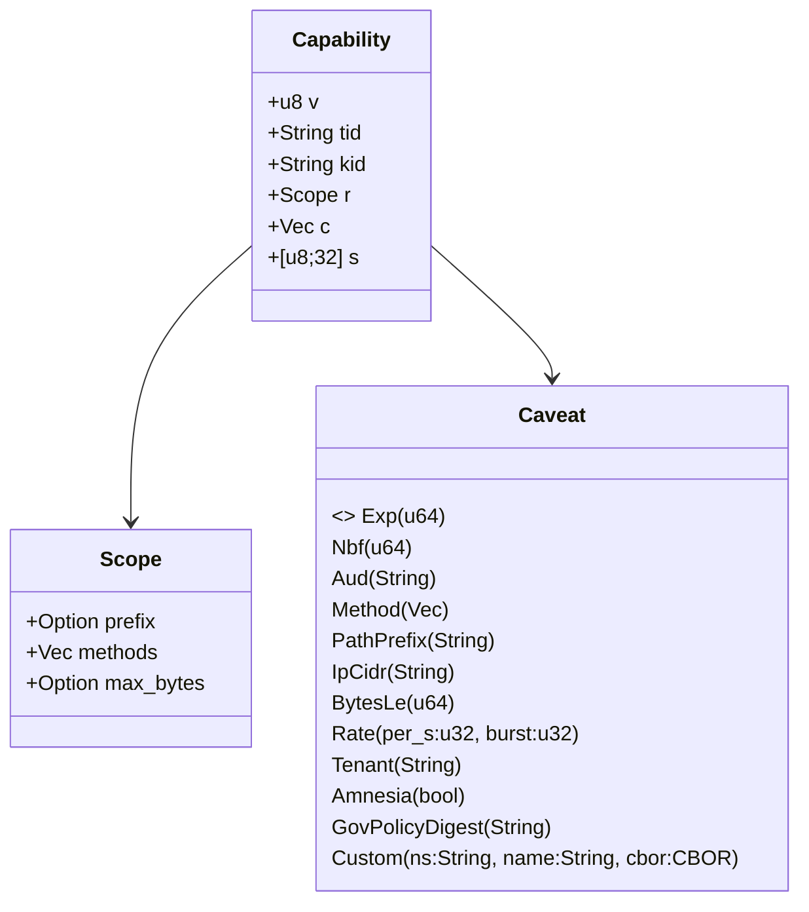
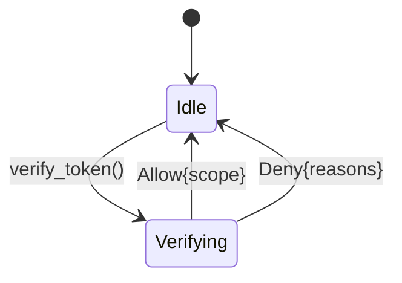
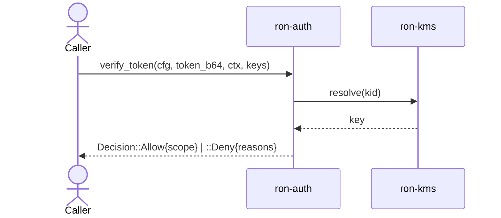

---

````markdown
# ron-auth

> **Role:** library  
> **Owner:** Stevan White  
> **Status:** draft (canon-aligned)  
> **MSRV:** 1.80.0  
> **Last reviewed:** 2025-10-04

Badges:  
[]() []() []()

---

## 1) Overview

**What it is**  
`ron-auth` is RustyOnions’ **capability verification and attenuation library** (macaroon-style). It verifies short-lived, caveat-bound **Capabilities** and lets callers **attenuate** (tighten) capabilities. **Root minting is not exposed** here (that’s `svc-passport`). This is a **pure library** (no I/O), typically paired with `ron-kms` for key access.

**How it fits**

- **Pillar:** 3 — Identity & Keys  
- **Upstream callers:** `svc-passport`, `svc-gateway`, `omnigate`, application services  
- **Downstream deps:** `ron-kms` for key material  
- **Data touched:** in-memory only  
- **Security boundary:** handles key IDs & signatures; never logs secrets/PII

### 1.1 High-Level Architecture

```mermaid
flowchart LR
  subgraph Node
    P[svc-passport] -->|issues Capability| App[Service]
    App -->|attenuate + verify| RA(ron-auth)
    RA -->|kid→key| K[ron-kms]
  end
  style RA fill:#0b7285,stroke:#083344,color:#fff
````

---

## 2) Responsibilities & Boundaries

**MUST do**

* Deterministic verification (MAC/signature over canonical form + caveats).
* **Attenuation**: build stricter child capabilities (add caveats; never broaden).
* Enforce strict size/time/shape bounds; reject unknown fields.
* Surface canonical metrics for verifications/denies/latency.

**MUST NOT do**

* No **root minting** (issuance = `svc-passport`).
* No network/DB I/O or global mutable state.
* No long-lived key handles; caller provides a key provider.

**Acceptance Gates**

* Invariant tests (MAC integrity, caveat enforcement, clock skew).
* Fuzz (parser/decoder).
* Perf gate: microsecond verify path with per-caveat scaling.
* Metrics present & labeled (result + reason).

---

## 3) Public Interfaces (library)

### 3.1 Rust API (sync — canonical names/shapes)

* `pub struct Capability` — opaque, canonical form.

* `pub struct Scope { pub prefix: Option<String>, pub methods: Vec<String>, pub max_bytes: Option<u64> }`

* `pub enum Caveat {`
  `  Exp(u64), Nbf(u64),`
  `  Aud(String),`
  `  Method(Vec<String>), PathPrefix(String),`
  `  IpCidr(String), BytesLe(u64),`
  `  Rate { per_s: u32, burst: u32 },`
  `  Tenant(String), Amnesia(bool),`
  `  GovPolicyDigest(String),`
  `  Custom { ns: String, name: String, cbor: serde_cbor::Value }`
  `}`

* **Attenuation (builder starts new; attenuation-only policy):**
  `pub struct CapabilityBuilder;`
  `impl CapabilityBuilder {`
  `  pub fn new(scope: Scope, tid: impl Into<String>, kid: impl Into<String>) -> Self;`
  `  pub fn caveat(self, c: Caveat) -> Self;`
  `  pub fn build(self) -> Capability;`
  `  pub fn encode_b64url(&self) -> String;`
  `}`

* **Verification (verbatim shape):**
  `pub struct VerifierConfig { /* bounds + skew */ }`
  `pub struct RequestCtx {`
  `  pub now_unix_s: u64,`
  `  pub method: String,`
  `  pub path: String,`
  `  pub peer_ip: Option<std::net::IpAddr>,`
  `  pub object_addr: Option<String>,`
  `  pub tenant: String,`
  `  pub amnesia: bool,`
  `  pub policy_digest_hex: Option<String>,`
  `  pub extras: serde_cbor::Value,`
  `}`
  `pub trait MacKeyProvider { fn key_for(&self, kid: &str) -> Option<MacKey>; }`
  `pub enum Decision { Allow { scope: Scope }, Deny { reasons: Vec<DenyReason> } }`
  `pub fn verify_token(cfg: &VerifierConfig, token_b64: &str, ctx: &RequestCtx, keys: &impl MacKeyProvider)`
  `  -> Result<Decision, AuthError>;`

**Quickstart — verify an incoming capability**

```rust,ignore
use ron_auth::{verify_token, VerifierConfig, RequestCtx, Decision, MacKeyProvider};

fn handle(header_b64: &str, ctx: &RequestCtx, keys: &impl MacKeyProvider)
  -> Result<Decision, ron_auth::AuthError>
{
  let cfg = VerifierConfig::with_defaults();
  verify_token(&cfg, header_b64, ctx, keys)
}
```

**Attenuate (delegation) — build a stricter child**

```rust,ignore
use ron_auth::{Capability, CapabilityBuilder, Scope, Caveat};

// NOTE: Attenuation uses a new builder with the *same* kid/tid policy decided by the caller.
// If you need chain semantics, orchestrate via svc-passport.
fn narrow(parent_b64: &str, kid: &str, now: u64) -> Result<String, ron_auth::AuthError> {
  // (Optional) Inspect parent if your policy requires it:
  let _parent = Capability::decode_b64url(parent_b64)?;

  let scope = Scope {
    prefix: Some("/index/".into()),
    methods: vec!["GET".into()],
    max_bytes: Some(1_000_000),
  };

  let child = CapabilityBuilder::new(scope, "delegation-123", kid.to_string())
      .caveat(Caveat::Exp(now + 300))
      .caveat(Caveat::Tenant("tenant-a".into()))
      .build();

  Ok(child.encode_b64url())
}
```

---

## 4) Configuration

| Variable                       | Type | Default | Description                            |
| ------------------------------ | ---- | ------: | -------------------------------------- |
| `RON_VERIFIER_MAX_TOKEN_BYTES` | int  |    4096 | Upper bound after Base64URL decode     |
| `RON_VERIFIER_CLOCK_SKEW_SECS` | int  |      60 | Allowed skew for `nbf` / `exp` caveats |

**Features (Cargo):**

* `pq-hybrid` — PQ-hybrid signature adapter via `ron-kms`
* `config-env` — parse env into `VerifierConfig`

---

## 5) Build, Test, Lint

```bash
cargo build -p ron-auth
cargo test  -p ron-auth --all-features
cargo fmt   --all
cargo clippy -p ron-auth -- -D warnings
cargo deny  check
```

---

## 6) Observability

**Metrics (exported by host via hooks):**

* `ron_auth_verify_total{result="ok|deny"}`
* `ron_auth_deny_total{reason="mac_mismatch|expired|not_yet_valid|bounds|unknown_kid|malformed|policy"}`
* `parse_error_total{kind}`            # decode/shape issues
* `verify_latency_seconds`             # histogram
* `token_size_bytes`                   # summary/gauge

**Tracing fields:** `kid`, `tid`, `tenant`, `method`, `path`, `deny_reason`.

---

## 7) Performance & SLOs

| Metric                       | Target              | Notes                                 |
| ---------------------------- | ------------------- | ------------------------------------- |
| Verify p95 (baseline)        | **≤ 60 µs**         | 0 caveats                             |
| Per-caveat verify cost (p95) | **≤ 8 µs / caveat** | Exp/Nbf/Method/PathPrefix/Aud typical |
| Decode p95 (4 KiB token)     | **≤ 300 µs**        | CBOR + Base64URL                      |
| Start-to-ready               | **< 50 ms**         | after keyset available                |

Reproduce via Criterion benches + perf harness in `testing/`.

---

## 8) Data & Schema

**Canonical fields**

```
v   : u8               # schema version
tid : String           # token id (opaque)
kid : String           # verification key id
r   : Scope            # rights/scope (structured)
c   : Vec<Caveat>      # caveats (Exp/Nbf/Method/PathPrefix/IpCidr/BytesLe/Rate/Tenant/Amnesia/GovPolicyDigest/Custom)
s   : [u8; 32]         # MAC/signature tag (BLAKE3-sized)
```



Encoding: canonical CBOR → MAC/signature → Base64URL. Unknown fields are rejected (`deny_unknown_fields`).

---

## 9) Security & Privacy

* **Threats:** MAC tamper (`MacMismatch`), replay/staleness (`Expired`, `NotYetValid`), key confusion (`UnknownKid`), bounds/malformed input.
* **Mitigations:** Verified signature over canonical form; strict size/time/shape bounds; clock-skew guard; deny unknown fields.
* **Key custody:** Caller provides keys via `MacKeyProvider` (often backed by `ron-kms`).
* **PII:** none in the capability object.
* **PQ readiness:** optional **PQ-hybrid** verification via `pq-hybrid`.

---

## 10) Error Taxonomy

| Error Variant            | When                                   | Retry |
| ------------------------ | -------------------------------------- | :---: |
| `AuthError::MacMismatch` | Signature / MAC mismatch               |   no  |
| `AuthError::Expired`     | `exp < now - skew`                     |   no  |
| `AuthError::NotYetValid` | `now + skew < nbf`                     | later |
| `AuthError::Bounds`      | exceeds `RON_VERIFIER_MAX_TOKEN_BYTES` |   no  |
| `AuthError::UnknownKid`  | `kid` not found                        | later |
| `AuthError::Malformed`   | parse/shape violation                  |   no  |
| `AuthError::PolicyDeny`  | policy/caveat evaluation denied        |   no  |

> `Decision::Deny { reasons: Vec<DenyReason> }` explains *why*; map to metrics label `reason`.

---

## 11) Concurrency Model

* **Sync** verification (no `.await`).
* Owned buffers internally; no locks across operations.
* `MacKeyProvider` implementors should be thread-safe and fast.



---

## 12) Compatibility & Requirements

* **Rust:** ≥ 1.80.0
* **Crypto:** via `ron-kms` (BLAKE3 MAC/signature; PQ-hybrid available)
* **Platforms:** macOS 10.15+, Linux x86_64
* **Containers:** safe (stateless)

---

## 13) Examples

**End-to-end verify with a dummy key provider**

```rust,ignore
use ron_auth::{verify_token, VerifierConfig, RequestCtx, Decision, MacKeyProvider};

struct DummyKeys;
impl MacKeyProvider for DummyKeys {
  fn key_for(&self, _kid: &str) -> Option<ron_auth::MacKey> { None } // replace in real code
}

fn example(header_b64: &str) -> Result<Decision, ron_auth::AuthError> {
  let cfg = VerifierConfig::with_defaults();
  let ctx = RequestCtx {
    now_unix_s: 1_700_000_000,
    method: "GET".into(),
    path: "/index/abc".into(),
    peer_ip: None,
    object_addr: None,
    tenant: "tenant-a".into(),
    amnesia: false,
    policy_digest_hex: None,
    extras: serde_cbor::Value::Null,
  };
  verify_token(&cfg, header_b64, &ctx, &DummyKeys)
}
```

---

## 14) Troubleshooting

* **`UnknownKid`**: ensure the current keyset is loaded/published.
* **Clock issues** (`NotYetValid`/`Expired`): check NTP and `RON_VERIFIER_CLOCK_SKEW_SECS`.
* **`Bounds`**: token exceeded size limit; trim caveats or reduce path/method lists.
* **High denies**: inspect `ron_auth_deny_total{reason}` and tracing (`kid`, `tenant`, `method`, `path`).

---

## 15) Development Notes

* `#![forbid(unsafe_code)]`; clippy denies unwrap/expect.
* Fuzz target: capability parser/decoder (CBOR + Base64URL).
* Property tests: canonicalization and **attenuation monotonicity** (child ≤ parent).
* Keep README synced with rustdoc (`#[doc = include_str!("../README.md")]`).

---

## 16) Mermaid Sources



---

## 17) Roadmap & TODO

* [ ] PQ-hybrid conformance vectors in perf harness.
* [ ] Fuzz windows: 1h nightly, 4h weekly; corpus exported in CI artifacts.
* [ ] Additional caveats (residency/region) aligned with RequestCtx.

---

## 18) Changelog

See [CHANGELOG.md](./CHANGELOG.md).

---

## 19) License

Dual-licensed under **MIT** or **Apache-2.0**. See [LICENSE-MIT](../LICENSE-MIT) and [LICENSE-APACHE](../LICENSE-APACHE).

---

## 20) Contributing

Please attach:

* Verify-path bench results,
* Fuzz corpus deltas (if parser changes),
* Diagram updates if topology changes.

```

---

