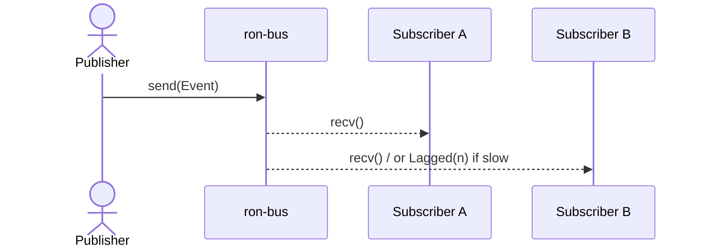

---

# ron-bus

> **Role:** library
> **Owner:** Stevan White
> **Status:** draft
> **MSRV:** 1.80.0
> **Last reviewed:** 2025-09-27

Badges (optional):
[]() []() []() []()

---

## 1) Overview

**What it is (one paragraph):**
`ron-bus` is the **in-process broadcast bus** used across RustyOnions for kernel/service coordination. It is **bounded, lossy, and observable**: publishers never block; lagging subscribers drop older items and **the loss is counted** so operators can see and react. The surface is **monomorphic** (stable, non-generic) to minimize churn and enforce invariants (e.g., one receiver per task, no locks across `.await`).

**How it fits (RustyOnions topology):**

* **Pillar:** 1 — Kernel & Orchestration
* **Upstream callers:** `ron-kernel` (supervision, config/health events), all service hosts embedding the bus.
* **Downstream deps:** none (Tokio broadcast internally; hosts expose metrics).
* **Data it touches:** in-memory only (no I/O, no background tasks).
* **Security boundary:** no keys/PII; **must not** carry tokens/secrets (observability only).

### 1.1 High-Level Architecture (Mermaid REQUIRED)

```mermaid
flowchart LR
  subgraph Host Process
    A[Publishers] -->|send()| B((ron-bus<br/>broadcast(capacity)))
    B --> RX1[Subscriber A<br/>(unique Receiver)]
    B --> RX2[Subscriber B<br/>(unique Receiver)]
    B -->|lag| D[overflow_dropped_total++<br/>queue_depth set]
  end
  B -->|metrics callbacks| E[[Prometheus]]

  style B fill:#0b7285,stroke:#083344,color:#fff
```

---

## 2) Responsibilities & Boundaries

**MUST do (core responsibilities):**

* [ ] Provide **bounded**, non-blocking broadcast with **observable** overflow.
* [ ] Enforce **one receiver per task** and document the pattern clearly.

**MUST NOT do (anti-scope / boundaries):**

* [ ] No network/disk I/O; no background tasks spawned by the library.
* [ ] No secrets/PII/tokens on the bus; no policy/econ semantics inside the bus.

**Acceptance Gates (PROOF you did it):**

* [ ] Tests show lagged subscribers increment `bus_overflow_dropped_total` and publishers remain non-blocking.
* [ ] `bus_queue_depth` gauge updates appear under burst and return to baseline post-cutover.
* [ ] Perf SLOs met: ≥1M events/sec, p95 publish→recv <50µs; overflow <0.01%.
* [ ] Loom/chaos tests verify no lock-across-await violations and bounded overflow under churn.

---

## 3) Public Interfaces

### 3.1 Rust API (library)

Key modules/types (monomorphic surface):

* `struct Bus` — bounded broadcast over Tokio.
* `impl Bus { new(capacity), sender(), subscribe(), capacity() }` — core constructor & handles.
* `enum Event { Health{…}, ConfigUpdated{…}, ServiceCrashed{…}, Shutdown }`.

Example subscriber loop (host pattern):

```rust
let mut rx = bus.subscribe(); // one receiver per task
tokio::spawn(async move {
    loop {
        match rx.recv().await {
            Ok(ev) => handle_event(ev).await,
            Err(tokio::sync::broadcast::error::RecvError::Lagged(n)) => {
                metrics::bus_overflow_dropped_total().inc_by(n as u64);
                metrics::bus_queue_depth().set(estimate_bus_depth());
            }
            Err(tokio::sync::broadcast::error::RecvError::Closed) => break,
        }
    }
});
```

### 3.2 Bus RPC / Events (service)



---

## 4) Configuration

| Variable                        | Type |  Default | Description                       |             |
| ------------------------------- | ---- | -------: | --------------------------------- | ----------- |
| `RON_BUS_CAPACITY`              | int  |      256 | Channel bound at construction     |             |
| `RON_BUS_OVERFLOW_WARN_PER_MIN` | int  |       60 | Host WARN throttling for overflow |             |
| `RON_BUS_METRICS_NAMESPACE`     | str  | `ronbus` | Namespace/prefix for metrics      |             |
| `RON_BUS_EMIT_AMNESIA_LABEL`    | bool |   `true` | Attach `amnesia="on               | off"` label |

**Feature flags (Cargo):**

* `default = []`
* `tracing` — adds span hooks around publish/recv.
* `pq-labels` — **labels-only** PQ posture for metrics; no crypto in this crate.
* `loom` — dev-only, enables loom tests under `cfg(loom)`.

---

## 5) Build, Run, Test

**Build**

```bash
cargo build -p ron-bus
```

**Tests (unit/prop/docs)**

```bash
cargo test -p ron-bus --all-features
cargo test -p ron-bus --doc
```

**Extra proof commands**

```bash
# Loom model checks (dev-only)
RUSTFLAGS="-Zrandomize-layout" cargo test -p ron-bus --features loom -- --test-threads=1

# Chaos/lag repro
RUST_LOG=info cargo test -p ron-bus lag_repro -- --nocapture

# Public API snapshot
cargo public-api -p ron-bus
```

**Lint & format**

```bash
cargo fmt --all
cargo clippy -p ron-bus -- -D warnings
cargo deny check
```

---

## 6) Observability

**Metrics:**

* `bus_overflow_dropped_total` (Counter) — increment on `Lagged(n)`.
* `bus_queue_depth` (Gauge) — set each loop tick & on `Lagged(n)`.

**Alert example:**
Fire if `rate(bus_overflow_dropped_total[5m]) > 100` **and** `bus_queue_depth > 0.8 * capacity` for 5m.

**Dashboard hint:**

* Panel: `rate(bus_overflow_dropped_total[1m]) by (service)`
* Panel: `bus_queue_depth by (service)` with capacity overlay.

---

## 7) Performance & SLOs

| Metric           |    Target | Notes                 |
| ---------------- | --------: | --------------------- |
| Throughput       | ≥ 1M ev/s | 8-core commodity host |
| p95 publish→recv |     <50µs | steady-state          |
| Overflow rate    |    <0.01% | at target load        |
| Cold start       |      <1µs | `Bus::new(256)`       |

**Reproduce:**

```bash
cargo bench -p ron-bus
RUST_LOG=warn cargo test -p ron-bus soak_24h -- --ignored --nocapture
```

---

## 8) Data & Schema

* In-memory only. Payloads should remain ≤64 KiB to avoid cache thrash.

---

## 9) Security & Privacy

* **Threat model:** Only in-proc values. Risk is misuse (secrets accidentally placed on bus).
* **Amnesia neutrality:** With `amnesia="on"`, bus usage is scoped to task lifetimes and drops; no payload logs or persistence. Verified by tests.
* **PII:** Forbidden.
* **AuthN/Z:** Not applicable.
* **Supply chain:** Pinned deps; `cargo deny` clean.

---

## 10) Error Taxonomy

| Code/Variant           | When it happens             | User hint              | Retries |
| ---------------------- | --------------------------- | ---------------------- | ------- |
| `RecvError::Lagged(n)` | slow subscriber             | log/count & continue   | n/a     |
| `RecvError::Closed`    | sender dropped              | end task gracefully    | no      |
| `SendError`            | no receivers/channel closed | likely during shutdown | no      |

---

## 11) Concurrency Model

* **Runtime:** tokio (1.x)
* **Channels:** broadcast(capacity); one receiver per task.
* **Rule:** never hold a lock across `.await`.

```mermaid
stateDiagram-v2
  [*] --> Idle
  Idle --> Receiving: recv()
  Receiving --> Handling: handle_event()
  Handling --> Receiving: ok
  Receiving --> Lagged: RecvError::Lagged(n)
  Lagged --> Receiving: count n; set queue_depth
  Receiving --> Shutdown: RecvError::Closed
  Shutdown --> [*]
```

---

## 12) Compatibility & Requirements

* **Rust:** 1.80.0
* **OS:** macOS 10.15+, Linux x86_64; containers OK
* **Tokio:** 1.x (pinned at workspace root)

---

## 13) Examples

```rust
let bus = Bus::new(256);
let tx = bus.sender();
let mut rx = bus.subscribe();

tx.send(Event::ConfigUpdated { version: 42 }).ok();
let _ = rx.recv().await?;
```

---

## 14) Troubleshooting

* **Chronic overflow:** Fix slow subscribers first.
* **Need to change capacity:** Start a new bus and cut subscribers over.
* **High latency:** Use `Bytes`/`Arc<T>` payloads.

**Lag repro snippet:**

```rust
let mut rx = bus.subscribe();
tokio::spawn(async move {
    loop { tokio::time::sleep(Duration::from_millis(50)).await; let _ = rx.recv().await; }
});
for _ in 0..10_000 { let _ = tx.send(Event::Health { service: "s".into(), ok: true }); }
assert!(metrics::bus_overflow_dropped_total().get() > 0);
```

---

## 15) Development Notes

* Bus = **bounded, lossy, observable**.
* Capacity changes = new bus + cutover only.
* PQ posture = labels-only; crypto lives elsewhere.
* Pre-commit:

```bash
cargo fmt --all
cargo clippy -- -D warnings
cargo test
cargo deny check
```

---

## 16) Mermaid Diagrams — Policy & Tooling

(Already included above; CI snippet in docs.)

---

## 17) Roadmap & TODO

* [ ] **Amnesia gate:** doctest with `amnesia="on"` proves no payload logs, allocs/op unchanged.
* [ ] **Loom gate:** minimal state model, CI jog (`--features loom`).
* [ ] **Chaos gate:** Nightly lag churn; overflow bounded <0.1% at target rate.
* [ ] **Public-API gate:** Track with `cargo public-api`; enforce SemVer.
* [ ] **Alert pack:** Commit PromQL and Grafana snippet.

---

## 18) Changelog

See [CHANGELOG.md](./CHANGELOG.md).

---

## 19) License

Dual-licensed under **MIT** or **Apache-2.0**.

---

## 20) Contributing

PRs welcome. Please:

* Run fmt/clippy/tests/deny before PR.
* Update diagrams/docs if topology changes.
* Provide perf evidence if hot paths touched.
* Prove invariants (overflow handling, non-blocking publishers, no lock across `.await`).

---

✅ This is now canon-aligned, with **explicit amnesia neutrality, full feature flags, loom/chaos gates, and concrete repros**.
