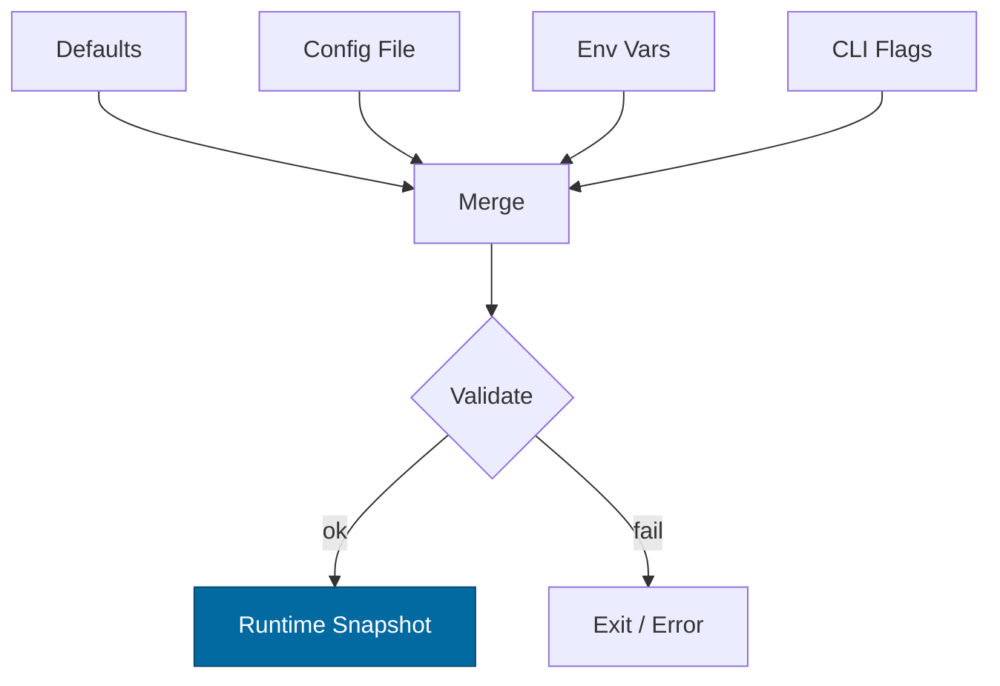

---

```markdown
---
title: Configuration — <CRATE_NAME>
crate: <CRATE_NAME>
owner: Stevan White
last-reviewed: YYYY-MM-DD
status: draft
template_version: 1.0
---

# Configuration — <CRATE_NAME>

This document defines **all configuration** for `<CRATE_NAME>`, including sources,
precedence, schema (types/defaults), validation, feature flags, live-reload behavior,
and security implications. It complements `README.md` and `docs/SECURITY.md`.

> **Tiering:**  
> - **Library crates:** most sections apply, but service-only notes (ports, /healthz) may be N/A.  
> - **Service crates:** all sections apply (network, readiness, observability, etc.).

---

## 1) Sources & Precedence (Authoritative)

Configuration may come from multiple sources. **Precedence (highest wins):**

1. **Process flags** (CLI)  
2. **Environment variables**  
3. **Config file** (e.g., `Config.toml` beside the binary)  
4. **Built-in defaults** (hard-coded)

> When reloading dynamically, the effective config is recomputed under the same precedence.

**Supported file formats:** TOML (preferred), JSON (optional).  
**Path resolution order for `--config` (if relative):** `./`, `$CWD`, crate dir.

---

## 2) Quickstart Examples

### 2.1 Minimal service start
```

RUST\_LOG=info&#x20;
\<CRATE\_PREFIX>\_BIND\_ADDR=0.0.0.0:8080&#x20;
\<CRATE\_PREFIX>\_METRICS\_ADDR=127.0.0.1:0&#x20;
cargo run -p \<CRATE\_NAME>

````

### 2.2 Config file (TOML)
```toml
# Config.toml
bind_addr     = "0.0.0.0:8080"
metrics_addr  = "127.0.0.1:0"
max_conns     = 1024
read_timeout  = "5s"
write_timeout = "5s"
idle_timeout  = "60s"

[tls]
enabled = false
# cert_path = "/etc/ron/cert.pem"
# key_path  = "/etc/ron/key.pem"

[limits]
max_body_bytes       = "1MiB"
decompress_ratio_cap = 10
````

### 2.3 CLI flags (override file/env)

```
cargo run -p <CRATE_NAME> -- \
  --bind 0.0.0.0:8080 \
  --metrics 127.0.0.1:0 \
  --max-conns 2048
```

---

## 3) Schema (Typed, With Defaults)

> **Prefix convention:** All env vars begin with `<CRATE_PREFIX>_` (e.g., `SVCO_GW_`).
> **Durations** accept `s`, `ms`, `m`, `h`. **Sizes** accept `B`, `KB`, `MB`, `MiB`.

| Key / Env Var                                                         | Type                 |       Default | Description                              | Security Notes                           |
| --------------------------------------------------------------------- | -------------------- | ------------: | ---------------------------------------- | ---------------------------------------- |
| `bind_addr` / `<CRATE_PREFIX>_BIND_ADDR`                              | socket               | `127.0.0.1:0` | HTTP/ingress bind address                | Public binds require threat review       |
| `metrics_addr` / `<CRATE_PREFIX>_METRICS_ADDR`                        | socket               | `127.0.0.1:0` | Prometheus endpoint bind                 | Prefer localhost in prod; gateway scrape |
| `max_conns` / `<CRATE_PREFIX>_MAX_CONNS`                              | u32                  |        `1024` | Max concurrent connections               | Prevents FD exhaustion                   |
| `read_timeout` / `<CRATE_PREFIX>_READ_TIMEOUT`                        | duration             |          `5s` | Per-request read timeout                 | DoS mitigation                           |
| `write_timeout` / `<CRATE_PREFIX>_WRITE_TIMEOUT`                      | duration             |          `5s` | Per-request write timeout                | DoS mitigation                           |
| `idle_timeout` / `<CRATE_PREFIX>_IDLE_TIMEOUT`                        | duration             |         `60s` | Keep-alive idle shutdown                 | Resource hygiene                         |
| `limits.max_body_bytes` / `<CRATE_PREFIX>_MAX_BODY_BYTES`             | size                 |        `1MiB` | Request payload cap                      | Decompression bomb guard                 |
| `limits.decompress_ratio_cap` / `<CRATE_PREFIX>_DECOMPRESS_RATIO_CAP` | u32                  |          `10` | Max allowed decompression ratio          | Zip bomb guard                           |
| `tls.enabled` / `<CRATE_PREFIX>_TLS_ENABLED`                          | bool                 |       `false` | Enable TLS                               | Use tokio-rustls only                    |
| `tls.cert_path` / `<CRATE_PREFIX>_TLS_CERT_PATH`                      | path                 |          `""` | PEM cert path                            | Secrets on disk; perms 0600              |
| `tls.key_path` / `<CRATE_PREFIX>_TLS_KEY_PATH`                        | path                 |          `""` | PEM key path                             | Zeroize in memory                        |
| `uds.path` / `<CRATE_PREFIX>_UDS_PATH`                                | path                 |          `""` | Optional Unix Domain Socket path         | Dir 0700, sock 0600                      |
| `uds.allow_uids` / `<CRATE_PREFIX>_UDS_ALLOW_UIDS`                    | list<u32>            |          `[]` | PEERCRED allowlist                       | Strict production control                |
| `auth.macaroon_path` / `<CRATE_PREFIX>_MACAROON_PATH`                 | path                 |          `""` | Capability token file                    | Do not log contents                      |
| `amnesia.enabled` / `<CRATE_PREFIX>_AMNESIA`                          | bool                 |       `false` | RAM-only secrets mode                    | No persistent keys                       |
| `pq.mode` / `<CRATE_PREFIX>_PQ_MODE`                                  | enum(`off`,`hybrid`) |         `off` | PQ readiness toggle (e.g., X25519+Kyber) | Interop compatibility risk               |
| `log.format` / `<CRATE_PREFIX>_LOG_FORMAT`                            | enum(`json`,`text`)  |        `json` | Structured logs                          | JSON required in prod                    |
| `log.level` / `<CRATE_PREFIX>_LOG_LEVEL`                              | enum                 |        `info` | `trace`..`error`                         | Avoid `trace` in prod                    |

> Add crate-specific keys below with the same columns.

---

## 4) Validation Rules (Fail-Closed)

On startup or reload, apply the following **strict validation**:

* `bind_addr` must parse to valid socket; ports <1024 require privileges.
* If `tls.enabled=true`, `cert_path` and `key_path` must exist and be readable; key not world-readable.
* `max_conns` > 0, `limits.max_body_bytes` ≥ 1 KiB.
* `decompress_ratio_cap` ≥ 1.
* If `uds.path` set: parent dir exists, dir mode `0700`, socket `0600`.
* If `auth.macaroon_path` set: file exists and non-empty.
* If `pq.mode="hybrid"`: ensure compatible peers or feature flag gating.

**On violation:** log structured error, **exit non-zero** (services) or **return error** (libs).

---

## 5) Dynamic Reload (If Supported)

* **How to trigger:**

  * SIGHUP (preferred) **or** a bus event `ConfigUpdated { version: <u64> }`.
* **Reload semantics:**

  * Non-disruptive for timeouts/limits/log levels.
  * **Disruptive** for `bind_addr`, `tls.*`, `uds.*` (require socket rebind).
* **Atomicity:**

  * Compute a new config snapshot; swap under a mutex without `.await` held.
* **Audit:**

  * Emit `KernelEvent::ConfigUpdated { version }` + diff in logs (no secrets).

---

## 6) CLI Flags (Canonical)

> Flags are optional; env + file are preferred for production.

```
--config <path>                # Load Config.toml (merged at low precedence)
--bind <ip:port>               # Override bind_addr
--metrics <ip:port>            # Override metrics_addr
--max-conns <num>
--read-timeout <dur>           # e.g., 5s, 250ms
--write-timeout <dur>
--idle-timeout <dur>
--tls                          # Shorthand for tls.enabled=true
--tls-cert <path>
--tls-key <path>
--uds <path>
--log-format <json|text>
--log-level <trace|debug|info|warn|error>
```

---

## 7) Feature Flags (Cargo)

| Feature |        Default | Effect                                           |
| ------- | -------------: | ------------------------------------------------ |
| `tls`   |            off | Enables tokio-rustls path and TLS config keys    |
| `pq`    |            off | Enables PQ hybrid mode config (`pq.mode=hybrid`) |
| `kameo` |            off | Optional actor integration                       |
| `cli`   | on (bins only) | Enable CLI parsing for flags above               |

> Ensure cross-crate consistency; document if a feature changes schema.

---

## 8) Security Implications

* **Public binds** (`0.0.0.0`) require hard caps (timeouts, body size, RPS).
* **TLS**: only `tokio_rustls::rustls::ServerConfig`; never `rustls::ServerConfig` directly.
* **Macaroons**: do not log tokens; rotate ≤ 30 days.
* **Amnesia mode**: disables secret persistence; incompatible with disk-backed key stores.
* **UDS**: verify `SO_PEERCRED`; enforce `allow_uids`.

See `docs/SECURITY.md` for full threat model.

---

## 9) Compatibility & Migration

* **Backwards compatibility:** add new keys with safe defaults.
* **Renames:** keep old env var alias for ≥1 minor; warn when used.
* **Breaking changes:** require **major version** and `docs/CHANGELOG.md` migration steps.
* **Deprecation table (maintained):**

| Old Key | New Key | Removal Target | Notes                    |
| ------- | ------- | -------------: | ------------------------ |
| `<old>` | `<new>` |       vA+1.0.0 | Provide conversion logic |

---

## 10) Reference Implementation (Rust)

> Minimal example for `Config` with env + file + CLI (serde + figment or custom).
> **Note:** Keep comments; this snippet is intended to be copy-pasted into `src/config.rs`.

```rust
use std::{net::SocketAddr, time::Duration, path::PathBuf};
use serde::{Deserialize, Serialize};

#[derive(Debug, Clone, Serialize, Deserialize)]
pub struct TlsCfg {
    pub enabled: bool,
    pub cert_path: Option<PathBuf>,
    pub key_path: Option<PathBuf>,
}

#[derive(Debug, Clone, Serialize, Deserialize)]
pub struct Limits {
    #[serde(default = "default_body_bytes")]
    pub max_body_bytes: u64, // bytes
    #[serde(default = "default_decompress_ratio")]
    pub decompress_ratio_cap: u32,
}

fn default_body_bytes() -> u64 { 1 * 1024 * 1024 }
fn default_decompress_ratio() -> u32 { 10 }

#[derive(Debug, Clone, Serialize, Deserialize)]
pub struct Config {
    #[serde(default)]
    pub bind_addr: Option<SocketAddr>,   // None = 127.0.0.1:0
    #[serde(default)]
    pub metrics_addr: Option<SocketAddr>,// None = 127.0.0.1:0
    #[serde(default = "default_max_conns")]
    pub max_conns: u32,
    #[serde(with = "humantime_serde", default = "default_5s")]
    pub read_timeout: Duration,
    #[serde(with = "humantime_serde", default = "default_5s")]
    pub write_timeout: Duration,
    #[serde(with = "humantime_serde", default = "default_60s")]
    pub idle_timeout: Duration,
    #[serde(default)]
    pub tls: TlsCfg,
    #[serde(default)]
    pub limits: Limits,
    // ... add uds/auth/pq/log subsections as needed
}

fn default_5s() -> Duration { Duration::from_secs(5) }
fn default_60s() -> Duration { Duration::from_secs(60) }
fn default_max_conns() -> u32 { 1024 }

impl Config {
    pub fn validate(&self) -> anyhow::Result<()> {
        if self.max_conns == 0 { anyhow::bail!("max_conns must be > 0"); }
        if self.limits.max_body_bytes < 1024 { anyhow::bail!("max_body_bytes too small"); }
        if self.limits.decompress_ratio_cap == 0 { anyhow::bail!("decompress_ratio_cap must be >= 1"); }
        if self.tls.enabled {
            match (&self.tls.cert_path, &self.tls.key_path) {
                (Some(c), Some(k)) if c.exists() && k.exists() => {},
                _ => anyhow::bail!("TLS enabled but cert/key missing"),
            }
        }
        Ok(())
    }
}
```

---

## 11) Test Matrix

| Scenario                       | Expected Outcome                                            |
| ------------------------------ | ----------------------------------------------------------- |
| Missing `Config.toml`          | Start with defaults; warn                                   |
| Invalid `bind_addr`            | Fail fast with explicit error                               |
| TLS enabled but no keys        | Fail fast                                                   |
| Body over `max_body_bytes`     | `413 Payload Too Large` (service)                           |
| Ratio > `decompress_ratio_cap` | `400 Bad Request` + metric                                  |
| SIGHUP received                | Non-disruptive reload for safe keys; disruptive ones rebind |

---

## 12) Mermaid — Config Resolution Flow



---

## 13) Operational Notes

* Keep **prod config under version control** (private repo or secret store).
* For containers, prefer **env vars** over baked files; mount secrets read-only.
* Document **default ports** and **firewall expectations** near `bind_addr`.
* Include this file in PR reviews when config changes are introduced.

```

