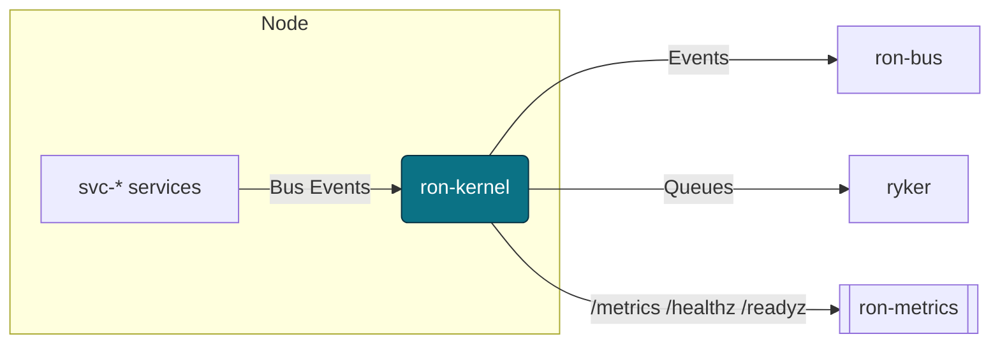
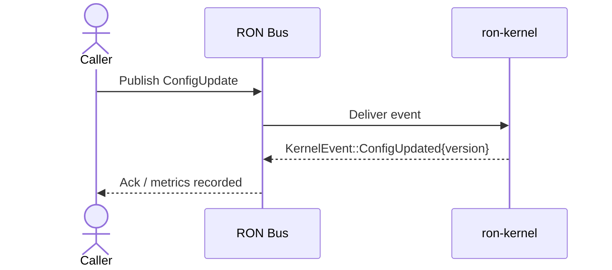
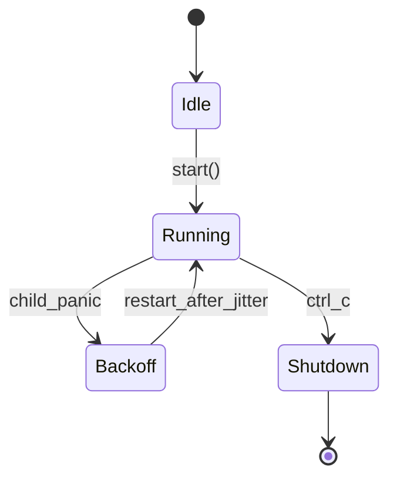

---

# ron-kernel

> **Role:** library (microkernel core)
> **Owner:** Stevan White
> **Status:** draft → stable (API frozen)
> **MSRV:** 1.80.0
> **Last reviewed:** 2025-09-26

[]() []()

---

## 1) Overview

**What it is (one paragraph):**
`ron-kernel` is the **microkernel** of RustyOnions. It provides supervision (crash-only restarts with jitter), config hot-reload, an in-process broadcast bus, canonical health/readiness wiring, golden metrics, and a **global Amnesia Mode** flag. The public API is **semver-frozen** so services and profiles can rely on a tiny, stable surface.

**How it fits (RustyOnions topology):**

* **Pillar:** 1 — Kernel & Orchestration
* **Six Concerns:** SEC, RES, PERF, GOV
* **Upstream callers:** all `svc-*` crates; node profiles `macronode`, `micronode`
* **Downstream deps:** `ron-bus` (broadcast), `ryker` (bounded mailboxes), `ron-metrics` (Prometheus + /healthz, /readyz)
* **Data it touches:** in-memory only; no DB
* **Security boundary:** surfaces TLS type (`tokio_rustls::rustls::ServerConfig`), **Amnesia Mode**, and **PQ posture pass-through**; kernel itself holds no secrets
* **Facets:** none (kernel owns no Graph/Feed/Search/Media/T&S/Geo logic)

### 1.1 High-Level Architecture (Mermaid)



---

## 2) Responsibilities & Boundaries

**MUST do (core responsibilities):**

* Supervise child tasks (crash-only; backoff+jitter; intensity caps).
* Expose **Config hot-reload** and emit `KernelEvent::ConfigUpdated`.
* Provide readiness & liveness wiring; export **golden metrics**.
* Surface **Amnesia Mode** (RAM-first bias, zeroization expectations).

**MUST NOT do (anti-scope / boundaries):**

* No overlay/DHT logic (lives in `svc-overlay`, `svc-dht`).
* No storage/index/ledger/economics.
* No app or policy logic; no facet ownership.
* No transport loops (use `ron-transport` in services; kernel is orchestration only).

**Acceptance Gates (PROOF you did it):**

* [ ] **Frozen API** exactly re-exports: `Bus`, `KernelEvent`, `Metrics`, `HealthState`, `Config`, `wait_for_ctrl_c()`.
* [ ] **Bus bounded & observable** under stress (`bus_lagged_total`, dropped counters).
* [ ] **One broadcast receiver per task** (documented & tested).
* [ ] `/readyz` **degrades before collapse** (reflects saturation; writes fail first where applicable).
* [ ] **Supervisor** restarts show backoff+jitter and increment `service_restarts_total`.
* [ ] **Amnesia metrics label present** (`amnesia="on|off"`).
* [ ] **ServiceCrashed carries a structured `reason`** (string cause captured in event/log).

---

## 3) Public Interfaces

### 3.1 Rust API (library)

Frozen re-exports:

```rust
pub use {
  Bus,
  KernelEvent,
  Metrics,
  HealthState,
  Config,
  wait_for_ctrl_c,
};
```

Key types (contract sketch):

```rust
enum KernelEvent {
  Health        { service: String, ok: bool },
  ConfigUpdated { version: u64 },
  ServiceCrashed{ service: String, reason: String },
  Shutdown,
}
```

Usage example:

```rust
use ron_kernel::{Config, wait_for_ctrl_c};

#[tokio::main]
async fn main() -> anyhow::Result<()> {
    let _cfg = Config::default();
    // spawn services; wire bus, metrics, readiness...
    wait_for_ctrl_c().await?;
    Ok(())
}
```

### 3.2 Bus RPC / Events (service consumers)



---

## 4) Configuration

| Variable       | Type   | Default | Description                                  |
| -------------- | ------ | ------- | -------------------------------------------- |
| `AMNESIA`      | bool   | `false` | Global Amnesia Mode (RAM-first; zeroization) |
| `LOG_LEVEL`    | string | `info`  | tracing level (`trace`..`error`)             |
| `METRICS_ADDR` | socket | `:0`    | Prometheus exporter bind address             |

**Flags (if any):**

```
--config ./Config.toml
--bind 127.0.0.1:0
```

**Feature flags (Cargo):**

* `default = ["tokio","serde"]`
* `kameo` — optional actor integration

---

## 5) Quickstart

```
cargo build -p ron-kernel
RUST_LOG=info AMNESIA=1 cargo run -p ron-kernel
cargo test -p ron-kernel --all-features
```

---

## 6) Observability

**Endpoints (via `ron-metrics` in consumers):**

* `/metrics` — Prometheus exposition
* `/healthz` — liveness
* `/readyz` — readiness (degrade before collapse)

**Canonical Metrics**

* `bus_lagged_total{service}` — broadcast backlog dropped/lagged
* `service_restarts_total{service}` — supervised restarts
* `request_latency_seconds{route,method}` — histogram

**Tracing**

* Targets: `ron_kernel=info,axum=warn,tower_http=warn`
* Span fields: `request_id`, `peer_addr`, `route`, `status`, `amnesia`

---

## 7) Performance & SLOs

| Metric           | Target          | Notes                          |
| ---------------- | --------------- | ------------------------------ |
| P99 bus lag      | `< 10 messages` | sustained publish              |
| Restart to ready | `< 1s`          | backoff+jitter; intensity caps |
| Cold start       | `< 500ms`       | readiness true on minimal      |

> Reproduce with the perf harness under `testing/performance` and record machine profile.

---

## 8) Data & Schema

Kernel owns **no durable data**. Config/state is **in-memory** and hot-swapped atomically (e.g., `ArcSwap<Config>`). Services that persist use their own stores.

---

## 9) Security & Privacy

* **Threats:** config poisoning, unbounded queues (DoS), transport coupling, PQ downgrade.
* **Mitigations:** atomic config swaps + rollback; bounded bus & mailboxes; TLS type **must** be `tokio_rustls::rustls::ServerConfig`; **PQ-hybrid pass-through** (X25519+Kyber/Dilithium) via config/features; kernel holds no secrets.
* **Amnesia Mode:** global flag; implies RAM-first caches, ephemeral logs, timed key purge (enforced by services); add `amnesia="on|off"` label to metrics.

---

## 10) Error Taxonomy

| Code/Variant                          | When it happens               | User hint                       | Retries           |
| ------------------------------------- | ----------------------------- | ------------------------------- | ----------------- |
| `ConfigError::Invalid`                | failed validation             | fix file/env; rollback          | no                |
| `NetError::Timeout`                   | downstream unresponsive       | try later                       | yes (jittered)    |
| `StateError::Conflict`                | hot-swap race detected        | backoff then retry              | yes               |
| `KernelEvent::ServiceCrashed{reason}` | supervised child panics/exits | inspect reason; observe backoff | auto (supervised) |

**Completeness checks:**

* [ ] All crash paths supply a **non-empty `reason`** string.
* [ ] Crash emits metric/log and **KernelEvent::ServiceCrashed**.

---

## 11) Concurrency Model

* **Runtime:** Tokio 1.x (pinned at workspace root).
* **Bus:** `tokio::broadcast` (bounded, lossy). **Exactly one receiver per task.**
* **Supervisor:** crash-only restarts with jitter; intensity caps.
* **Rules:** never hold a lock across `.await` in supervisory/hot paths; cancel-safe tasks; async-Drop safe.



**Formal/Model hooks:**

* Loom interleavings for bus/readiness.
* TLA+ sketches (`specs/supervisor.tla`, `specs/bus.tla`) for restart/overflow properties.

---

## 11.1) Bus Contract (Frozen)

## Kernel Bus — Contract (Frozen)

**Purpose:** in-process, bounded, non-blocking fan-out for kernel events.

- **Type:** `Bus<T: Clone + Send + 'static>`
- **Publish:** `publish(msg: T) -> usize`
  - Returns the **receiver count at send time**.
  - **Never blocks.** Sender is oblivious to slow receivers.
  - If there are zero receivers, `publish(...)` **returns `0`** and still counts as a publish.
- **Subscribe:** `subscribe() -> Receiver<T>` (Tokio broadcast).
- **Lag handling:** Receivers must call `Bus::handle_recv(res, metrics)` which:
  - Returns `Some(msg)` on success.
  - Returns `None` on `Lagged(n)` and increments `bus_receiver_lag_total` by `n`.
- **Drops:** If the channel is closed between count and send, sender increments `bus_dropped_total` and returns `0`.

**Canonical metrics (Prometheus):**
- `bus_published_total`
- `bus_no_receivers_total`
- `bus_receiver_lag_total`
- `bus_dropped_total`


## 12) Compatibility & Requirements

* **Rust:** MSRV 1.80.0 (MSRV bumps require a **major** version bump or explicit policy note)
* **OS:** macOS 10.15+, Linux x86_64; containers ok
* **TLS:** `tokio_rustls` 0.26.x (type: `tokio_rustls::rustls::ServerConfig`)
* **HTTP:** axum 0.7.x, tower-http 0.6.x (used by services, not by kernel directly)

---

## 13) Examples

Minimal supervision:

```rust
use ron_kernel::{Config, wait_for_ctrl_c};

#[tokio::main]
async fn main() -> anyhow::Result<()> {
    let _cfg = Config::default();
    // spawn supervised child tasks here...
    wait_for_ctrl_c().await?;
    Ok(())
}
```

cURL (consumer service):

```
curl -sS http://127.0.0.1:9600/healthz
curl -sS http://127.0.0.1:9600/readyz
```

---

## 14) Troubleshooting

* **High latency / spikes:** ensure `RUST_LOG` isn’t overly verbose; use `--release`; watch `bus_lagged_total`.
* **Restart storms:** track `service_restarts_total`; confirm backoff jitter and intensity caps.
* **TLS type mismatch:** always use `tokio_rustls::rustls::ServerConfig`; never `rustls::ServerConfig`.
* **Amnesia not honored:** confirm `AMNESIA=1` and metrics label; ensure downstream services respect RAM-only/zeroization.

---

## 15) Development Notes

**Project conventions:**

* `#![forbid(unsafe_code)]` at crate root.
* Axum handlers (in services) end with `.into_response()`.
* OAP/1 constants (frame **1 MiB**) and storage chunk (~**64 KiB**) are **normative but enforced by services**, not the kernel.
* Keep the local OAP doc as a **pointer** to the normative spec to avoid drift.

**Pre-commit quickcheck**

```
cargo fmt --all
cargo clippy -- -D warnings
cargo test
cargo deny check
```

---

## 16) Mermaid Diagrams — Policy & Tooling (REQUIRED)

**Diagrams required:** one **architecture** flowchart (above), one **sequence** (above), one **state** (above).
Store sources under `docs/*.mmd` and render SVGs in CI.

Render locally:

```
npm i -g @mermaid-js/mermaid-cli
mmdc -i docs/arch.mmd -o docs/arch.svg
```

**CI (GitHub Actions snippet)**

```yaml
name: kernel-ci
on: [push, pull_request]
jobs:
  public-api:
    runs-on: ubuntu-latest
    steps:
      - uses: actions/checkout@v4
      - uses: dtolnay/rust-toolchain@stable
      - run: cargo install cargo-public-api || true
      - run: cargo public-api -p ron-kernel --deny changed
  mermaid:
    runs-on: ubuntu-latest
    steps:
      - uses: actions/checkout@v4
      - run: npm i -g @mermaid-js/mermaid-cli
      - run: |
          mkdir -p docs
          for f in $(git ls-files '*.mmd'); do
            mmdc -i "$f" -o "${f%.mmd}.svg"
          done
```

---

## 17) Roadmap & TODO

* [ ] Loom tests for bus/health interleavings.
* [ ] TLA+ specs for supervisor & bus.
* [ ] PQ pass-through tests (Kyber/Dilithium feature flags plumbed end-to-end).
* [ ] Amnesia on/off matrix in CI (Micronode vs Macronode profiles).

---

## 18) Changelog

See [CHANGELOG.md](./CHANGELOG.md). Follow SemVer; document breaking changes with migration notes.

---

## 19) License

Dual-licensed under **MIT** or **Apache-2.0**. See `LICENSE-MIT` and `LICENSE-APACHE`.

---

## 20) Contributing

PRs welcome! Please run fmt/clippy/tests and include:

* Updated diagrams (.mmd sources rendered by CI)
* Docs & examples
* Perf impact (if relevant)
* **Respect the frozen API**; `cargo public-api` must pass

```

---
