# Combined Markdown

_Source directory_: `crates/ron-kernel/docs`  
_Files combined_: 12  
_Recursive_: 0

---

### Table of Contents

- API.MD
- CONCURRENCY.MD
- CONFIG.MD
- GOVERNANCE.MD
- IDB.md
- INTEROP.MD
- OBSERVABILITY.MD
- PERFORMANCE.MD
- QUANTUM.MD
- RUNBOOK.MD
- SECURITY.MD
- TESTS.MD

---

## API.MD
_File 1 of 12_


---

# 📖 API.md — ron-kernel

---

title: API Surface & SemVer Reference
status: draft
msrv: 1.80.0
last-updated: 2025-09-27
audience: contributors, auditors, API consumers
-----------------------------------------------

# API.md

## 0. Purpose

This document captures the **public API surface** of `ron-kernel`:

* Snapshot of exported functions, types, traits, modules (the **frozen** microkernel surface).
* SemVer discipline (what breaks vs. what extends).
* CI-enforceable via `cargo public-api` (and optional `cargo semver-checks`).
* Canonical reference for downstream crates and node profiles.

---

## 1. Public API Surface

> The kernel’s public surface is intentionally **tiny and frozen**. Any drift requires a **major** bump.

Generate snapshot:

```bash
cargo public-api -p ron-kernel --simplified
```

### 1.1 Current Surface (canonical, human-readable)

```text
# Re-exports (the only stable, supported surface)
pub struct Bus
pub enum  KernelEvent
pub struct Metrics
pub struct HealthState
pub struct Config
pub async fn wait_for_ctrl_c() -> Result<(), std::io::Error>
```

### 1.2 Canonical contracts (shape & intent)

* `pub struct Bus`
  In-process **broadcast bus** (bounded), cloneable handle. Lag/drop are observable via metrics (implementation detail; not part of the surface).

* `pub enum KernelEvent`  *(shape is frozen; see SemVer rules)*

  * `Health        { service: String, ok: bool }`
  * `ConfigUpdated { version: u64 }`
  * `ServiceCrashed{ service: String, reason: String }`  *(reason is required, structured string)*
  * `Shutdown`

* `pub struct Metrics`

  * `fn new() -> Metrics`
  * `fn health(&self) -> &HealthState`
  * `async fn serve(self, addr: std::net::SocketAddr) -> (tokio::task::JoinHandle<()>, std::net::SocketAddr)`
    *(consumes `self` by design)*
    — Exposes **golden metrics** used across RustyOnions (e.g., `bus_lagged_total`, `service_restarts_total`, `request_latency_seconds`) without policy enforcement.

* `pub struct HealthState`

  * `fn set(&self, ready: bool)`
  * `fn snapshot(&self) -> bool`        // or richer snapshot in future
  * `fn all_ready(&self) -> bool`

* `pub async fn wait_for_ctrl_c() -> Result<(), std::io::Error>`
  Cooperative shutdown helper.

**Notes**

* TLS types are not exposed here; services consume `tokio_rustls::rustls::ServerConfig`.
* No transport/overlay/storage APIs leak into the kernel surface.

---

## 2. SemVer Discipline

**Strict SemVer** with a **frozen** core surface.

### 2.1 Additive (Minor / Non-Breaking)

* Docs, tests, internal changes.
* Adding methods to **opaque** types when it cannot change behavior or trait guarantees (rare).
* Adding metrics labels/fields (affects emitted metrics, not this Rust surface) — document in CHANGELOG.

> We **do not** promise additive variants on `KernelEvent`; it is a fixed contract.

### 2.2 Breaking (Major)

* Any change to the re-export list (`Bus`, `KernelEvent`, `Metrics`, `HealthState`, `Config`, `wait_for_ctrl_c`).
* Renaming/removing exports, changing visibility/paths.
* Signature/ownership changes (e.g., making `Metrics::serve` borrow instead of consume).
* Changing `KernelEvent` shape (renames, add/remove fields, add new variants).
* Changing return types (e.g., `wait_for_ctrl_c` error type).

### 2.3 Patch-Level (Non-Breaking)

* Doc fixes, examples, internal perf/resilience with identical surface.
* Bug fixes that do not alter observable API.

---

## 3. Stability Guarantees

* **MSRV:** `1.80.0` (MSRV bumps require a major version bump or clearly documented policy exception).
* **No `unsafe`** in public API (`#![forbid(unsafe_code)]`).
* No leaking incidental runtime types (e.g., TCP streams, axum state).
* `Metrics::serve` **consumes** `self` intentionally; do not assume interior mutability.

---

## 4. Invariants

* **Kernel role (scope)**

  * Public surface is **only**: `Bus`, `KernelEvent`, `Metrics`, `HealthState`, `Config`, `wait_for_ctrl_c`.
  * No overlay/DHT/storage/ledger/app logic in this crate.

* **Concurrency (contextual, not surface)**

  * **One broadcast receiver per task**, bounded bus, **no locks across `.await`** on supervisory paths.

* **Context hooks (not surface)**

  * **Amnesia Mode** and **PQ posture** are surfaced via `Config` and passed through; the kernel **does not** enforce crypto or persistence policy.

* **Review & CI**

  * API diffs **must** be reviewed; CI runs `cargo public-api` and fails on unacknowledged changes.
  * All public items **must** have rustdoc (`#![deny(missing_docs]` in CI).

---

## 5. Tooling

* **cargo public-api** — authoritative surface diff

  ```bash
  cargo public-api -p ron-kernel --simplified
  ```
* **cargo semver-checks** — SemVer advisor (optional but recommended)

  ```bash
  cargo install cargo-semver-checks
  cargo semver-checks check-release -p ron-kernel
  ```
* **cargo doc** — docs + doctests

  ```bash
  cargo doc -p ron-kernel --no-deps
  cargo test -p ron-kernel --doc
  ```
* **API snapshots** (optional)

  * Store under `/docs/api-history/ron-kernel/<version>.txt`.

---

## 6. CI & Gates

* **Public API gate**

  ```yaml
  - name: public-api
    run: cargo public-api -p ron-kernel --deny changed
  ```
* **Missing docs gate**

  ```yaml
  - name: docs
    run: RUSTDOCFLAGS="--deny missing_docs" cargo doc -p ron-kernel --no-deps
  ```
* **SemVer advisor (optional)**

  ```yaml
  - name: semver-checks
    run: cargo semver-checks check-release -p ron-kernel || true
  ```
* **CHANGELOG hygiene**

  * If `cargo public-api` reports a surface change, the PR **must** include a matching CHANGELOG entry with SemVer rationale.

---

## 7. Acceptance Checklist (Definition of Done)

* [ ] API snapshot generated (`cargo public-api -p ron-kernel --simplified`) and attached to PR.
* [ ] CI gate passes **or** change is explicitly acknowledged as **major** (version bump + migration notes).
* [ ] CHANGELOG updated for any surface change (added/removed/renamed items, signature changes).
* [ ] Rustdoc coverage: **no missing docs** on public items.
* [ ] Doctests/examples updated and passing.
* [ ] Downstream crates audited for breakage (bus/event consumers, profiles).

---

## 8. Appendix

**References**

* Rust SemVer guidelines — [https://doc.rust-lang.org/cargo/reference/semver.html](https://doc.rust-lang.org/cargo/reference/semver.html)
* cargo-public-api — [https://github.com/Enselic/cargo-public-api](https://github.com/Enselic/cargo-public-api)
* cargo-semver-checks — [https://github.com/obi1kenobi/cargo-semver-checks](https://github.com/obi1kenobi/cargo-semver-checks)

**Perfection Gates tie-in**

* **Gate G:** No undocumented public items.
* **Gate H:** Breaking changes require a major bump.
* **Gate J:** CHANGELOG alignment with any public diff.

**History (examples)**

* **v1.0.0** — Initial frozen API: re-exports `Bus`, `KernelEvent` (4 variants), `Metrics`, `HealthState`, `Config`, `wait_for_ctrl_c`; `Metrics::serve(self, addr) -> (JoinHandle<()>, SocketAddr)`; `HealthState::{set,snapshot,all_ready}`.

**Contributor note**
Propose any change to `KernelEvent` or the re-export list via RFC first. The small, stable surface is what keeps the microkernel drift-proof.


---

## CONCURRENCY.MD
_File 2 of 12_


---
title: Concurrency Model — <CRATE_NAME>
crate: <CRATE_NAME>
owner: Stevan White
last-reviewed: YYYY-MM-DD
status: draft
template_version: 1.1
msrv: 1.80.0
tokio: "1.x (pinned at workspace root)"
loom: "0.7+ (dev-only)"
lite_mode: "For small library crates: fill §§1,3,4,5,10,11 and mark others N/A"
---

# Concurrency Model — <CRATE_NAME>

This document makes the concurrency rules **explicit**: tasks, channels, locks, shutdown, timeouts,
and validation (property/loom/TLA+). It complements `docs/SECURITY.md`, `docs/CONFIG.md`,
and the crate’s `README.md` and `IDB.md`.

> **Golden rule:** never hold a lock across `.await` in supervisory or hot paths.

---

## 0) Lite Mode (for tiny lib crates)

If this crate is a small **library** with no background tasks:
- Complete **§1 Invariants**, **§3 Channels**, **§4 Locks**, **§5 Timeouts**, **§10 Validation**, **§11 Code Patterns**.
- Mark **§2 Runtime**, **§6 Shutdown**, **§7 I/O framing** N/A if not applicable.

---

## 1) Invariants (MUST)

- [ ] **No lock across `.await`**. If unavoidable, split the critical section.
- [ ] **Single writer** per mutable resource; readers use snapshots or short read guards.
- [ ] **Bounded channels** only (mpsc/broadcast) with explicit overflow policy.
- [ ] **Explicit timeouts** on all I/O and RPCs; fail-fast with typed errors.
- [ ] **Cooperative cancellation**: every `.await` is cancel-safe or guarded by `select!`.
- [ ] **Graceful shutdown**: observe `Shutdown` signal; drain within deadline; abort stragglers.
- [ ] **No blocking syscalls** on the async runtime; use `spawn_blocking` if required.
- [ ] **No task leaks**: track joins; detach only with rationale.
- [ ] **Backpressure over buffering**: drop/reject with metrics; never grow unbounded queues.
- [ ] **Framing**: length-delimited/checked; handle split reads.

**Async Drop**
- [ ] Do **not** block in `Drop`. For teardown, expose an **async `close()`/`shutdown()`** API and call it before the value is dropped. `Drop` should only release cheap, non-blocking resources.

---

## 2) Runtime Topology

Describe Tokio runtime & task layout (if applicable).

- **Runtime:** tokio multi-threaded.
- **Primary tasks:**
  - `<task name>` — purpose, cadence, criticality.
  - `<task name>` — …
- **Supervision:** jittered backoff on panic; escalation/limits documented.

```mermaid
flowchart TB
  subgraph Runtime
    A[Supervisor] -->|spawn| B[Listener]
    A -->|spawn| C[Worker Pool]
    B -->|mpsc (bounded)| C
    A -->|watch Shutdown| B
    A -->|watch Shutdown| C
  end
  C -->|results| A
  style A fill:#0ea5e9,stroke:#0c4a6e,color:#fff
````

**Diagram (text description for accessibility):** The Supervisor task spawns one Listener and a Worker Pool. The Listener feeds a bounded mpsc queue into the Worker Pool. Both Listener and Workers subscribe to a Shutdown watch channel from the Supervisor.

---

### 2.1 Runtime Skeleton (Rust)

```rust
use anyhow::{anyhow, Result};
use tokio::{
    signal,
    sync::{mpsc, watch},
    task::JoinSet,
};

struct Config {
    work_queue: usize,
}

#[derive(Debug)]
struct Job(u64);

async fn next_job() -> Result<Job> {
    // Replace with real ingestion logic (network, fs, etc.).
    Ok(Job(0))
}

async fn handle_job(job: Job) -> Result<()> {
    println!("processed {:?}", job);
    Ok(())
}

pub async fn run_runtime(cfg: &Config) -> Result<()> {
    let (work_tx, mut work_rx) = mpsc::channel::<Job>(cfg.work_queue);
    let (shutdown_tx, _) = watch::channel(false);
    let mut shutdown_rx = shutdown_tx.subscribe();
    let mut workers = JoinSet::new();

    let ingress = tokio::spawn({
        let mut shutdown_rx = shutdown_tx.subscribe();
        let work_tx = work_tx.clone();
        async move {
            loop {
                tokio::select! {
                    _ = shutdown_rx.changed() => break,
                    job = next_job() => {
                        let job = job?;
                        match work_tx.try_send(job) {
                            Ok(()) => {}
                            Err(mpsc::error::TrySendError::Full(job)) => {
                                return Err(anyhow!("work queue full; backpressure on {:?}", job));
                            }
                            Err(mpsc::error::TrySendError::Closed(_)) => break,
                        }
                    }
                }
            }
            Ok::<_, anyhow::Error>(())
        }
    });

    loop {
        tokio::select! {
            _ = signal::ctrl_c() => {
                shutdown_tx.send(true)?;
                break;
            }
            maybe_job = work_rx.recv() => {
                let Some(job) = maybe_job else { break; };
                let mut worker_shutdown = shutdown_tx.subscribe();
                workers.spawn(async move {
                    tokio::select! {
                        _ = worker_shutdown.changed() => Ok::<_, anyhow::Error>(()),
                        result = handle_job(job) => result,
                    }
                });
            }
        }
    }

    drop(work_tx);
    while let Some(res) = workers.join_next().await {
        res??;
    }
    ingress.await??;
    Ok(())
}
```

---

## 3) Channels & Backpressure

**Inventory (bounded unless noted):**

| Name          | Kind      | Capacity | Producers → Consumers | Backpressure Policy       | Drop Semantics              |
| ------------- | --------- | -------: | --------------------- | ------------------------- | --------------------------- |
| `<events_tx>` | broadcast |     1024 | 1 → N                 | lag counter + drop oldest | increment metric + warn log |
| `<work_tx>`   | mpsc      |      512 | N → M                 | `try_send` → `Busy`       | return 429/`Busy` upstream  |
| `<ctrl_rx>`   | watch     |        1 | 1 → N                 | last-write wins           | N/A                         |

Guidelines:

* Prefer `try_send` + explicit error over buffering.
* Emit `queue_dropped_total{queue="work"}` on shed; keep a depth gauge.

---

## 4) Locks & Shared State

**Allowed**

* Short-lived `Mutex`/`RwLock` for metadata (no `.await` under guard).
* Read-mostly snapshots via `Arc<StateSnapshot>`.
* Per-connection state owned by its task; cross-task via channels.

**Forbidden**

* Holding locks across `.await`.
* Nested locks without a documented hierarchy.

**Hierarchy (if needed)**

1. `state_meta`
2. `routing_table`
3. `counters`

---

## 5) Timeouts, Retries, Deadlines

* **I/O:** `read=5s`, `write=5s`, `idle=60s` (override via config).
* **RPC:** total deadline enforced; retry idempotent ops only with jittered backoff (50–100ms → cap 2s, max 3 tries).
* **Circuit breaker (opt):** open on error rate; half-open probes recover.

```mermaid
sequenceDiagram
  autonumber
  participant Caller
  participant S as <CRATE_NAME>
  Caller->>S: Request (deadline=2s)
  S-->>Caller: 202 Accepted or Result
  Note over S: On backpressure → Busy<br/>On timeout → typed error
```



**Diagram (text):** Caller sends a request with a 2s deadline; service either accepts work or returns a Busy/timeout error deterministically.

---

## 6) Cancellation & Shutdown

* **Signal:** `KernelEvent::Shutdown` or `wait_for_ctrl_c()`.
* **Propagation:** `tokio::select! { _ = shutdown.changed() => ..., _ = work => ... }`.
* **Draining:** stop intake; flush in-flight within deadline (1–5s).
* **Abort:** tasks exceeding deadline → `handle.abort()`; count `aborted_tasks_total`.


**Diagram (text):** On shutdown signal, system enters Draining; if deadline passes, remaining tasks are Aborted; otherwise transitions to Stopped.

---

## 7) I/O & Framing

* Length-prefix or delimiter with strict maximums.
* Use `AsyncReadExt/AsyncWriteExt`; call `.shutdown().await` on success/error.
* Handle partial reads; verify checksums when protocol requires.

---

## 8) Error Taxonomy (Concurrency-Relevant)

| Error      | When               | Retry?    | Metric                  | Notes          |
| ---------- | ------------------ | --------- | ----------------------- | -------------- |
| `Busy`     | queue full         | maybe     | `busy_rejections_total` | caller-visible |
| `Timeout`  | deadline exceeded  | sometimes | `io_timeouts_total{op}` | attach op      |
| `Canceled` | shutdown           | no        | `tasks_canceled_total`  | cooperative    |
| `Lagging`  | broadcast overflow | no        | `bus_lagged_total`      | slow consumer  |

---

## 9) Metrics (Concurrency Health)

* `queue_depth{queue}` gauge (sampled)
* `queue_dropped_total{queue}` counter
* `tasks_spawned_total{kind}` / `tasks_aborted_total{kind}`
* `io_timeouts_total{op}` (`read`,`write`,`connect`)
* `backoff_retries_total{op}`
* `busy_rejections_total{endpoint}`

---

## 10) Validation Strategy

**Unit / Property**

* Backpressure behavior (drop vs reject).
* Deadline honored within tolerance.
* Lock discipline (runtime asserts if needed).

**Loom**

* Model producer → bounded queue → consumer + shutdown.
* Assert: no deadlocks, no missed shutdown, no double-drop.

**Fuzz**

* Frame/decoder fuzz (malformed/boundary inputs).

**Chaos**

* Kill/restart workers under load; `/readyz` flips correctly; drains respected.

**TLA+ (if ordering matters)**

* Specify message/state; prove safety (no dup/loss) & liveness (eventual drain).

---

## 11) Code Patterns (Copy-Paste)

**Spawn + cooperative shutdown**

```rust
let (shutdown_tx, mut shutdown_rx) = tokio::sync::watch::channel(false);
let worker = tokio::spawn({
  let mut rx = work_rx;
  async move {
    loop {
      tokio::select! {
        _ = shutdown_rx.changed() => break,
        maybe_job = rx.recv() => {
          let Some(job) = maybe_job else { break };
          if let Err(e) = handle_job(job).await {
            tracing::warn!(error=%e, "job failed");
          }
        }
      }
    }
  }
});
// shutdown_tx.send(true).ok(); let _ = worker.await;
```

**Bounded mpsc with try\_send**

```rust
if let Err(tokio::sync::mpsc::error::TrySendError::Full(_)) = tx.try_send(job) {
  metrics::busy_rejections_total().inc();
  return Err(Error::Busy);
}
```

**Timeout with deadline**

```rust
let res = tokio::time::timeout(cfg.read_timeout, read_frame(&mut stream)).await;
```

**Async Drop pattern**

```rust
pub struct Client { inner: Option<Conn> }

impl Client {
  pub async fn close(&mut self) -> anyhow::Result<()> {
    if let Some(conn) = self.inner.take() {
      conn.shutdown().await?;
    }
    Ok(())
  }
}

impl Drop for Client {
  fn drop(&mut self) {
    // Best-effort: log if still open; do NOT block here.
    if self.inner.is_some() {
      tracing::debug!("Client dropped without close(); resources will be reclaimed");
    }
  }
}
```

**No lock across `.await`**

```rust
let value = { let g = state.lock(); g.derive_value() }; // drop guard
do_async(value).await;
```

---

## 12) Configuration Hooks (Quick Reference)

* `max_conns`, `read_timeout`, `write_timeout`, `idle_timeout`
* channel capacities
* `drain_deadline`
* retry/backoff window

See `docs/CONFIG.md` for authoritative schema.

---

## 13) Known Trade-offs / Nonstrict Areas

* Justify **drop-oldest vs reject-new** choice per queue.
* Call out eventual consistency / best-effort areas.

---

## 14) Mermaid Diagrams (REQUIRED)

### 14.1 Task & Queue Topology

```mermaid
flowchart LR
  IN[Ingress] -->|mpsc:work(512)| W1[Worker A]
  IN -->|mpsc:work(512)| W2[Worker B]
  subgraph Control
    SHUT[Shutdown watch] --> W1
    SHUT --> W2
  end
```

**Text description:** Ingress feeds two workers via a bounded mpsc(512); a Shutdown watch channel notifies both workers.

### 14.2 Shutdown Sequence


**Text description:** Supervisor signals shutdown; Worker drains and acknowledges; if time limit exceeded, Supervisor aborts Worker.

---

## 15) CI & Lints (Enforcement)

**Clippy lints to enable**

* `-D clippy:await_holding_lock`
* `-D clippy:needless_collect`
* `-D clippy:useless_async`
* `-D warnings` (repo standard)

**GitHub Actions suggestions**

```yaml
name: concurrency-guardrails
on: [push, pull_request]
jobs:
  clippy:
    runs-on: ubuntu-latest
    steps:
      - uses: actions/checkout@v4
      - uses: dtolnay/rust-toolchain@stable
      - run: cargo clippy -p <CRATE_NAME> -- -D warnings -W clippy::await_holding_lock

  loom:
    if: github.event_name == 'pull_request'
    runs-on: ubuntu-latest
    steps:
      - uses: actions/checkout@v4
      - uses: dtolnay/rust-toolchain@stable
      - run: RUSTFLAGS="--cfg loom" cargo test -p <CRATE_NAME> --tests -- --ignored

  fuzz:
    runs-on: ubuntu-latest
    steps:
      - uses: actions/checkout@v4
      - uses: dtolnay/rust-toolchain@stable
      - run: cargo install cargo-fuzz
      - run: cargo fuzz build -p <CRATE_NAME>
```

---

## 16) Schema Generation (Optional, Nice-to-Have)

Automate **Channels/Locks tables** from code to avoid rot:

* Annotate channels/locks with macros or attributes, e.g.:

  ```rust
  #[doc_channel(name="work", kind="mpsc", cap=512, policy="try_send")]
  let (tx, rx) = tokio::sync::mpsc::channel(512);
  ```
* A small **proc-macro** or a **build script** (`build.rs`) can emit `docs/_generated/concurrency.mdfrag` which you include via an md include.
* Alternatively, keep a `concurrency.rs` registry module and unit-test that the doc table matches the registry entries (golden test).

---

## 17) Review & Maintenance

* **Review cadence:** every 90 days or on any change to tasks/channels/locks.
* **Keep `owner`, `msrv`, `last-reviewed` current.**
* **PR checklist:** if you modify concurrency, update this file + Loom/property tests.


# NEW: UPDATE OCT 18 2025:

## Kernel Bus — Contract (Frozen)

**Purpose:** in-process, bounded, non-blocking fan-out for kernel events.

- **Type:** `Bus<T: Clone + Send + 'static>`
- **Publish:** `publish(msg: T) -> usize`
  - Returns the **receiver count at send time**.
  - **Never blocks.** Sender is oblivious to slow receivers.
  - If there are zero receivers, `publish(...)` **returns `0`** and still counts as a publish.
- **Subscribe:** `subscribe() -> Receiver<T>` (Tokio broadcast).
- **Lag handling:** Receivers must call `Bus::handle_recv(res, metrics)` which:
  - Returns `Some(msg)` on success.
  - Returns `None` on `Lagged(n)` and increments `bus_receiver_lag_total` by `n`.
- **Drops:** If the channel is closed between count and send, sender increments `bus_dropped_total` and returns `0`.

**Canonical metrics (Prometheus):**
- `bus_published_total`
- `bus_no_receivers_total`
- `bus_receiver_lag_total`
- `bus_dropped_total`


```


---


---

## CONFIG.MD
_File 3 of 12_


---

````markdown
---
title: Configuration — ron-kernel
crate: ron-kernel
owner: Stevan White
last-reviewed: 2025-09-24
status: draft
template_version: 1.0
---

# Configuration — ron-kernel

This document defines **all configuration** for `ron-kernel`: sources,
precedence, schema (types/defaults), validation, feature flags, live-reload behavior,
and security implications. It complements `README.md`, `docs/IDB.md`, and `docs/SECURITY.md`.

> **Tiering:**  
> - **Library crate (default):** kernel is lifecycle/supervision/config/bus/health; it **does not** run overlay/DHT/storage/transport loops. Observability endpoints live in `ron-metrics` or service crates; kernel **emits** canonical counters/events.  
> - **Demo bins (optional):** may bind localhost for `/metrics|/healthz|/readyz` via `ron-metrics`. Production services typically own network binds.

---

## 1) Sources & Precedence (Authoritative)

Configuration may come from multiple sources. **Precedence (highest wins):**

1. **Process flags** (CLI)  
2. **Environment variables**  
3. **Config file** (`Config.toml` adjacent to the binary or as passed via `--config`)  
4. **Built-in defaults** (hard-coded)

Reload recomputes the **effective config** under the same precedence ordering.  
Supported file formats: **TOML** (preferred), **JSON** (optional).  
Relative `--config` is resolved against `./` then `$CWD`.

> Kernel exposes a **hot-reload watcher** and emits `KernelEvent::ConfigUpdated{ version }` on success (services consume it); the **public API re-exports** include `Config` and `wait_for_ctrl_c()`.

---

## 2) Quickstart Examples

### 2.1 Minimal (library usage; no ports)
```bash
RUST_LOG=info \
RONK_AMNESIA=false \
cargo test -p ron-kernel
````

### 2.2 Demo bin with localhost observability (optional)

```bash
RUST_LOG=info \
RONK_OBS_ADDR=127.0.0.1:0 \
RONK_SUP_RESTART_CAP=5 \
cargo run -p ron-kernel --bin kernel_demo
```

> Kernel emits **golden metrics** (`bus_lagged_total`, `service_restarts_total`, `request_latency_seconds`) and readiness events; production services expose HTTP endpoints.

### 2.3 Config file (TOML; safe defaults)

```toml
# Config.toml
[supervisor]
min_backoff   = "100ms"
max_backoff   = "30s"
restart_cap   = 5         # max restarts per window
restart_window= "60s"

[bus]
capacity = 4096           # bounded broadcast buffer per IDB

[amnesia]
enabled = false           # kernel-level flag; services must honor

[pq]
mode = "off"              # or "hybrid" (pass-through posture only)

[observability]
expose_http = false       # library default; demo bins may set true
addr        = "127.0.0.1:0"

[log]
format = "json"
level  = "info"
```

### 2.4 CLI flags (override file/env)

```bash
cargo run -p ron-kernel -- \
  --sup-restart-cap 5 \
  --bus-capacity 4096 \
  --amnesia on \
  --obs-http true --obs-addr 127.0.0.1:0
```

---

## 3) Schema (Typed, With Defaults)

> **Prefix convention:** All env vars start with `RONK_` (e.g., `RONK_AMNESIA`).
> **Durations** accept `ms`, `s`, `m`, `h`. **Sizes** are not typical here (kernel is not an HTTP ingress).
> **Note:** Ports/binds are **N/A for library**; observability bind is **optional** and typically handled by `ron-metrics`/services.

| Key / Env Var                                     | Type                   | Default       | Description                                                                   | Security Notes                        |                          |                         |
| ------------------------------------------------- | ---------------------- | ------------- | ----------------------------------------------------------------------------- | ------------------------------------- | ------------------------ | ----------------------- |
| `supervisor.min_backoff` / `RONK_SUP_MIN`         | duration               | `100ms`       | Crash-only restart backoff lower bound                                        | Prevents thundering herds             |                          |                         |
| `supervisor.max_backoff` / `RONK_SUP_MAX`         | duration               | `30s`         | Backoff cap                                                                   | See chaos tests                       |                          |                         |
| `supervisor.restart_cap` / `RONK_SUP_RESTART_CAP` | u32                    | `5`           | Max restarts per window before quarantine                                     | Emits `ServiceCrashed{reason}`        |                          |                         |
| `supervisor.restart_window` / `RONK_SUP_WINDOW`   | duration               | `60s`         | Window for `restart_cap`                                                      | Ops alerting hook                     |                          |                         |
| `bus.capacity` / `RONK_BUS_CAPACITY`              | u32                    | `4096`        | Broadcast buffer (bounded)                                                    | Overflow counted, never blocks kernel |                          |                         |
| `amnesia.enabled` / `RONK_AMNESIA`                | bool                   | `false`       | Global amnesia flag surfaced by kernel; services must honor                   | RAM-only caches, ephemeral logs       |                          |                         |
| `pq.mode` / `RONK_PQ_MODE`                        | enum(`off`,`hybrid`)   | `off`         | **Pass-through posture** (e.g., transport/proto PQ); kernel is crypto-neutral | Interop posture only                  |                          |                         |
| `observability.expose_http` / `RONK_OBS_HTTP`     | bool                   | `false`       | If `true`, demo exposes `/metrics                                             | /healthz                              | /readyz`via`ron-metrics` | Prefer localhost in dev |
| `observability.addr` / `RONK_OBS_ADDR`            | socket                 | `127.0.0.1:0` | Bind for demo observability if enabled                                        | Library default is off                |                          |                         |
| `log.format` / `RONK_LOG_FORMAT`                  | enum(`json`,`text`)    | `json`        | Log format                                                                    | JSON in prod                          |                          |                         |
| `log.level` / `RONK_LOG_LEVEL`                    | enum(`trace`..`error`) | `info`        | Log level                                                                     | Avoid `trace` in prod                 |                          |                         |

> **Canonical kernel metrics** are always emitted (counters/histograms) regardless of who serves them: `bus_lagged_total`, `service_restarts_total`, `request_latency_seconds`.

---

## 4) Validation Rules (Fail-Closed)

On startup or reload:

* `bus.capacity` **> 0**; assert boundedness (no “unbounded” sentinel).
* `supervisor.restart_cap` **≥ 1**; `min_backoff ≤ max_backoff`.
* `observability.addr` must parse to socket **iff** `expose_http=true`.
* `pq.mode ∈ {off, hybrid}`; kernel treats it as **posture passthrough**, not behavior (no crypto in kernel).
* **On violation:** structured error, **exit non-zero** (for bins) or **Err** (lib), per Hardening defaults.

---

## 5) Dynamic Reload (If Supported)

**Triggers**

* POSIX: `SIGHUP` (bins)
* Programmatic: `KernelEvent::ConfigUpdated { version }` published on successful swap

**Semantics**

* **Non-disruptive:** `bus.capacity` (applies to new subscribers), log level, `amnesia.enabled`, `pq.mode` (posture).
* **Quasi-disruptive:** `supervisor.*` takes effect for future restarts; does not preempt running children.
* **Atomicity:** compute a new `Arc<Config>` snapshot; swap without holding a lock across `.await` (IDB invariant).

**Audit**

* Log a redacted **diff** (no secrets), include new `version`, and emit metrics labels when `amnesia` changes.

---

## 6) CLI Flags (Canonical)

```
--config <path>                 # Load Config.toml
--bus-capacity <num>            # Bounded broadcast buffer
--sup-min-backoff <dur>         # 100ms, 250ms, etc.
--sup-max-backoff <dur>         # 30s, etc.
--sup-restart-cap <num>         # e.g., 5
--sup-restart-window <dur>      # e.g., 60s
--amnesia <on|off>              # kernel flag (services must honor)
--pq <off|hybrid>               # posture passthrough only
--obs-http <true|false>         # demo only
--obs-addr <ip:port>            # demo only
--log-format <json|text>
--log-level  <trace|debug|info|warn|error>
```

---

## 7) Feature Flags (Cargo)

| Feature   | Default | Effect                                              |          |          |
| --------- | ------: | --------------------------------------------------- | -------- | -------- |
| `cli`     |     on* | Enables CLI parsing for the flags above (bins only) |          |          |
| `metrics` |     off | Integrates `ron-metrics` helper for demo `/metrics  | /healthz | /readyz` |
| `kameo`   |     off | Optional actor integration (kept behind a flag)     |          |          |
| `pq`      |     off | Enables PQ posture surfacing (`pq.mode`)            |          |          |

> Keep features **orthogonal** and ensure public API re-exports remain unchanged.

---

## 8) Security Implications

* **Kernel minimalism:** No overlay/DHT/transport/storage/ledger loops in kernel; keep all IO/policy in services.
* **Amnesia:** When `amnesia.enabled=true`, expect RAM-only caches and ephemeral logs across the stack; kernel must label metrics `amnesia="on"` for auditability.
* **PQ posture:** Kernel stays crypto-neutral but must not block PQ adoption; flags are pass-through and visible in health snapshots.
* **Hardening inheritance:** Most global limits (5s timeouts/1MiB bodies/10× decompress) apply to **services**; kernel tracks rejects via counters but does not police payloads.
* **UDS/PEERCRED:** If a demo uses UDS for observability, honor `0700/0600` and **SO_PEERCRED** allow-list as per Hardening defaults.

---

## 9) Compatibility & Migration

* **Backwards-compatible keys**: add with safe defaults; never repurpose semantics silently (GOV).
* **Renames:** deprecate with env var alias for ≥1 minor; warn on use.
* **Breaking changes:** require **major version** and `CHANGELOG.md` with migration steps; CI public-API guard enforces freeze.

*Deprecation table (maintained):*

| Old Key | New Key | Removal Target | Notes                    |
| ------: | :------ | -------------: | :----------------------- |
| `<old>` | `<new>` |     v(A+1).0.0 | Provide conversion logic |

---

## 10) Reference Implementation (Rust)

> Minimal `Config` with file/env/CLI merge and strict validation.
> Copy into `src/config.rs`. Keep comments—reviewers use them for drift checks.

```rust
use std::{time::Duration, net::SocketAddr};
use serde::{Deserialize, Serialize};

#[derive(Debug, Clone, Serialize, Deserialize)]
pub struct SupervisorCfg {
    #[serde(with = "humantime_serde", default = "d_100ms")]
    pub min_backoff: Duration,
    #[serde(with = "humantime_serde", default = "d_30s")]
    pub max_backoff: Duration,
    #[serde(default = "d_restart_cap")]
    pub restart_cap: u32,
    #[serde(with = "humantime_serde", default = "d_60s")]
    pub restart_window: Duration,
}

#[derive(Debug, Clone, Serialize, Deserialize)]
pub struct BusCfg {
    #[serde(default = "d_bus_capacity")]
    pub capacity: u32,
}

#[derive(Debug, Clone, Serialize, Deserialize)]
pub struct AmnesiaCfg {
    #[serde(default)]
    pub enabled: bool,
}

#[derive(Debug, Clone, Serialize, Deserialize)]
#[serde(rename_all = "lowercase")]
pub enum PqMode { Off, Hybrid }
impl Default for PqMode { fn default() -> Self { PqMode::Off } }

#[derive(Debug, Clone, Serialize, Deserialize)]
pub struct PqCfg {
    #[serde(default)]
    pub mode: PqMode, // posture only; crypto-neutral kernel
}

#[derive(Debug, Clone, Serialize, Deserialize)]
pub struct ObservabilityCfg {
    #[serde(default)]
    pub expose_http: bool, // demo bins only
    #[serde(default = "d_localhost0")]
    pub addr: SocketAddr,  // 127.0.0.1:0
}

#[derive(Debug, Clone, Serialize, Deserialize)]
pub struct LogCfg {
    #[serde(default = "d_log_format")]
    pub format: String,  // "json"|"text"
    #[serde(default = "d_log_level")]
    pub level: String,   // trace..error
}

#[derive(Debug, Clone, Serialize, Deserialize)]
pub struct Config {
    #[serde(default)]
    pub supervisor: SupervisorCfg,
    #[serde(default)]
    pub bus: BusCfg,
    #[serde(default)]
    pub amnesia: AmnesiaCfg,
    #[serde(default)]
    pub pq: PqCfg,
    #[serde(default)]
    pub observability: ObservabilityCfg,
    #[serde(default)]
    pub log: LogCfg,
}

fn d_100ms() -> Duration { Duration::from_millis(100) }
fn d_30s()   -> Duration { Duration::from_secs(30) }
fn d_60s()   -> Duration { Duration::from_secs(60) }
fn d_restart_cap() -> u32 { 5 }
fn d_bus_capacity() -> u32 { 4096 }
fn d_localhost0() -> SocketAddr { "127.0.0.1:0".parse().unwrap() }
fn d_log_format() -> String { "json".into() }
fn d_log_level() -> String { "info".into() }

impl Config {
    pub fn validate(&self) -> anyhow::Result<()> {
        use anyhow::bail;
        if self.bus.capacity == 0 { bail!("bus.capacity must be > 0"); }
        if self.supervisor.restart_cap == 0 { bail!("supervisor.restart_cap must be >= 1"); }
        if self.supervisor.min_backoff > self.supervisor.max_backoff {
            bail!("min_backoff must be <= max_backoff");
        }
        if self.observability.expose_http && (self.observability.addr.ip().is_unspecified()) {
            bail!("observability.addr must be a concrete address when expose_http=true");
        }
        Ok(())
    }
}
```

---

## 11) Test Matrix

| Scenario                               | Expected Outcome                                         |
| -------------------------------------- | -------------------------------------------------------- |
| Missing/empty `Config.toml`            | Start with safe defaults; log that defaults were applied |
| `bus.capacity = 0`                     | Fail fast with explicit error; no unbounded queues       |
| `min_backoff > max_backoff`            | Fail fast on validation                                  |
| Restart storm (> `restart_cap`/window) | Quarantine child; increment `service_restarts_total`     |
| Toggle `amnesia.enabled` on reload     | Snapshot flips; metrics include `amnesia="on"` label     |
| `pq.mode = hybrid`                     | Exposed in health; no kernel crypto behavior change      |
| `expose_http=true` with bad addr       | Fail validation; demo refuses to bind                    |

---

## 12) Mermaid — Config Resolution Flow

```mermaid
flowchart TB
  A[Defaults] --> D[Merge]
  B[Config File] --> D
  C[Env Vars (RONK_*)] --> D
  E[CLI Flags] --> D
  D --> V{Validate}
  V -- ok --> S[Arc<Config> Snapshot]
  V -- fail --> X[Exit/Error]
  S --> K[Emit KernelEvent::ConfigUpdated{version}]
  style S fill:#0369a1,stroke:#0c4a6e,color:#fff
```

---

## 13) Operational Notes

* Kernel is **tiny by design**—it orchestrates, it **does not** police protocol payloads; services enforce OAP limits and surface rejects which the kernel **observes** via counters.
* Watch **bus lag** and **restart storms**; `/readyz` must degrade early by design under sustained pressure.
* Hardening defaults (timeouts/body caps/decompress guard) live in **services**; keep the kernel focused on **boundedness + observability**.

```


---

## GOVERNANCE.MD
_File 4 of 12_


---

**File:** `crates/ron-kernel/docs/GOVERNANCE.md`

```markdown
# 🏛 GOVERNANCE.md 

---
title: Governance & Economic Integrity (Kernel-Scoped)
status: draft
msrv: 1.80.0
last-updated: 2025-09-26
audience: contributors, ops, auditors, stakeholders
crate-type: kernel (code/process governance; not economic policy)
---

# GOVERNANCE.md — ron-kernel

## 0. Purpose

This document defines the **rules of engagement** for the `ron-kernel` crate’s governance: how we change it, who can change it, and the **non-negotiable boundaries** that keep the kernel tiny, stable, and orchestration-only.  
It enforces:

- Transparent, auditable decision-making (RFCs/ADRs, CI gates, metrics & events).  
- **Pillar-1** constraints: frozen public API, bounded queues, supervision, observability. :contentReference[oaicite:0]{index=0}  
- Clear **authority boundaries**: kernel is not policy/econ/overlay/storage; those belong to other crates/services. :contentReference[oaicite:1]{index=1}

**Scope note:** Traditional “economic integrity” (issuance, rewards, ledger) is **out of scope** for the kernel and lives in `ron-ledger`, `ron-accounting`, `ron-policy`, `svc-rewarder`. Kernel governance focuses on **code/process** and interop boundaries. :contentReference[oaicite:2]{index=2}

---

## 1. Invariants (MUST)

Non-negotiable rules for `ron-kernel`:

- [I-K1] **Public API is frozen**: re-exports = `{ Bus, KernelEvent, Metrics, HealthState, Config, wait_for_ctrl_c }`. Any change is a **major** bump with migration notes. :contentReference[oaicite:3]{index=3} :contentReference[oaicite:4]{index=4}  
- [I-K2] **Kernel boundaries**: kernel **is** supervision/config/health/bus/observability; kernel **is not** overlay/DHT/storage/ledger/gateway. :contentReference[oaicite:5]{index=5}  
- [I-K3] **Concurrency**: no locks across `.await`; **bounded** mailboxes/bus; lag/drop metrics present. :contentReference[oaicite:6]{index=6}  
- [I-K4] **Observability, not enforcement**: kernel exposes OAP/BLAKE3/TLS invariants; services enforce wire rules (e.g., `max_frame=1 MiB`, `DATA` header `obj:"b3:<hex>"`). :contentReference[oaicite:7]{index=7}  
- [I-K5] **TLS type**: any TLS touched by kernel uses `tokio_rustls::rustls::ServerConfig` (never `rustls::ServerConfig`). :contentReference[oaicite:8]{index=8}  
- [I-K6] **Amnesia mode surfaced** as a global flag + `amnesia="on|off"` metrics label; services must honor semantics (RAM-only, zeroization). :contentReference[oaicite:9]{index=9} :contentReference[oaicite:10]{index=10}  
- [I-K7] **PQ neutrality & pass-through**: kernel does not block PQ; passes transport/proto PQ flags and surfaces posture in health snapshots. :contentReference[oaicite:11]{index=11}

---

## 2. Roles & Authority

### Roles
- **Kernel Maintainers** — own API stability & boundaries; gate PRs per Pillar-1 checklist. :contentReference[oaicite:12]{index=12}  
- **Release Manager** — tags releases; ensures semver discipline & migration notes on majors. :contentReference[oaicite:13]{index=13}  
- **Security/Hardening Reviewer** — checks TLS type, amnesia surfacing, and observability of rejects. :contentReference[oaicite:14]{index=14}  
- **SRE/Operators** — consume kernel events/metrics; validate readiness behavior under load. :contentReference[oaicite:15]{index=15}  
- **Auditors** — verify invariants via tests/vectors and acceptance gates. :contentReference[oaicite:16]{index=16}

### Authority Boundaries
- Kernel **cannot** add overlay/DHT/storage/ledger logic; reject via review gates. :contentReference[oaicite:17]{index=17}  
- Kernel **may** surface protocol bounds (OAP/TLS/BLAKE3) as metrics/events, **may not** enforce them. :contentReference[oaicite:18]{index=18}  
- Config watcher emits `ConfigUpdated`; rollback for invalid config remains service-side policy. :contentReference[oaicite:19]{index=19}

---

## 3. Rules & SLAs

- **Readiness semantics**: `/healthz` = liveness; `/readyz` = backpressure/supervisor state; services **fail fast** on saturation or restart storms. Kernel must make this state visible. :contentReference[oaicite:20]{index=20}  
- **Bus SLAs**: bounded buffers; lag/drop **observable** via `bus_lagged_total` (and drop counters if present). No blocking in supervisory paths. :contentReference[oaicite:21]{index=21}  
- **Metrics golden set**: `bus_lagged_total`, `service_restarts_total`, `request_latency_seconds` present & tested. :contentReference[oaicite:22]{index=22}

---

## 4. Governance Process

- **Change classes**
  - **Docs/tests only**: maintainer review.  
  - **Non-breaking code**: maintainer + security reviewer sign-off.  
  - **Breaking (public API)**: **RFC/ADR**, quorum of maintainers, **major** version bump, migration notes. :contentReference[oaicite:23]{index=23}

- **Proposal lifecycle**: Draft → Review → Approve → Merge → Release. PRs must pass Pillar-1 acceptance checklist & CI label routing (RES/GOV jobs; loom/fuzz/TLA+ when applicable). :contentReference[oaicite:24]{index=24} :contentReference[oaicite:25]{index=25}

- **Non-goals enforcement**: any PR introducing app/overlay/econ logic is rejected on boundary breach. :contentReference[oaicite:26]{index=26}

---

## 5. Audit & Observability

- **Events**: kernel emits `KernelEvent::{Health,ConfigUpdated,ServiceCrashed{reason},Shutdown}`; crashes include **structured `reason`**. :contentReference[oaicite:27]{index=27} :contentReference[oaicite:28]{index=28}  
- **Metrics**: golden set (above); amnesia label attached when surfaced. :contentReference[oaicite:29]{index=29}  
- **Proofs**: canonical vectors for bus overflow & degraded readiness live under `/tests/vectors/`; formal/perf hooks exist (TLA+ specs, perf harness). :contentReference[oaicite:30]{index=30}

---

## 6. Config & Custody

- **Config**: hot-reload via watcher emits `ConfigUpdated{version}`; invalid configurations are rejected upstream and should not be applied globally. :contentReference[oaicite:31]{index=31}  
- **TLS custody (kernel-adjacent)**: when kernel touches TLS config types, it uses `tokio_rustls::rustls::ServerConfig`. No raw private keys handled by the kernel. :contentReference[oaicite:32]{index=32}  
- **PQ posture**: kernel passes transport/proto PQ flags and surfaces posture—no policy decisions made in kernel. :contentReference[oaicite:33]{index=33}

---

## 7. Appeal Path

1) Raise concern in PR review referencing Pillar-1 acceptance checklist items. :contentReference[oaicite:34]{index=34}  
2) Escalate to Kernel Maintainers quorum; if unresolved, open an ADR capturing the dispute & resolution.  
3) For urgent boundary breaches (e.g., unbounded queues, API drift), **block release** until checklist passes. :contentReference[oaicite:35]{index=35}

---

## 8. Acceptance Checklist (DoD)

- [ ] **API surface unchanged** (or major bump + migration notes if changed). :contentReference[oaicite:36]{index=36}  
- [ ] **No locks across `.await`**; **all channels bounded**. :contentReference[oaicite:37]{index=37}  
- [ ] **Metrics present & exercised**: `bus_lagged_total`, `service_restarts_total`, `request_latency_seconds`. :contentReference[oaicite:38]{index=38}  
- [ ] **Readiness degrades/fails** correctly under saturation/restart storms. :contentReference[oaicite:39]{index=39}  
- [ ] **TLS type invariant** satisfied (tokio_rustls wrapper). :contentReference[oaicite:40]{index=40}  
- [ ] **Amnesia surfaced** (flag + label), and services assert honoring. :contentReference[oaicite:41]{index=41}  
- [ ] **OAP exposure only** (no enforcement creep); DATA header rule documented in downstream specs. :contentReference[oaicite:42]{index=42}  
- [ ] **Formal/Perf hooks** present: TLA+ specs, perf harness smoke. :contentReference[oaicite:43]{index=43}

---

## 9. Appendix

- **Blueprints / Canon:**  
  - Microkernel Blueprint (FINAL+) — scope, API, invariants, amnesia, PQ posture. :contentReference[oaicite:44]{index=44} :contentReference[oaicite:45]{index=45}  
  - 12 Pillars — Pillar-1 roles & review gates; 33-crate canon. :contentReference[oaicite:46]{index=46}  
- **References:**  
  - OAP/1 limits & content addressing (exposed by kernel, enforced by services). :contentReference[oaicite:47]{index=47}  
  - CI label routing & verification plan (RES/GOV, loom/fuzz/TLA+). :contentReference[oaicite:48]{index=48}  
- **History:**  
  - Track API changes, boundary exceptions (none allowed), notable readiness incidents and resolutions.

```

---


---

## IDB.md
_File 5 of 12_


---

````markdown
---
title: IDB — ron-kernel (Microkernel)
version: 1.0.1
status: draft
last-updated: 2025-09-24
audience: contributors, reviewers, ops, auditors
---

# 🪓 Invariant-Driven Blueprinting — ron-kernel

Pillar: **P1 Kernel & Orchestration**  
Crates impacted: `ron-kernel`, `ron-bus`, `ryker`  
Six Concerns: **SEC, RES, PERF, GOV, DX**  

---

## 1) Invariants (MUST)

- [I-1] **Frozen public API**  
  The kernel re-exports **exactly**:  
  `pub use { Bus, KernelEvent, Metrics, HealthState, Config, wait_for_ctrl_c };`  
  Any semantic change → **major** bump + migration notes.

- [I-2] **KernelEvent contract (exact shape)**  
  ```rust
  enum KernelEvent {
    Health        { service: String, ok: bool },
    ConfigUpdated { version: u64 },
    ServiceCrashed{ service: String, reason: String },
    Shutdown,
  }
````

* \[I-3] **Crash-only supervision**
  Exponential backoff with full jitter (100ms → 30s cap); **≤ 5 restarts / 60s** per child before quarantine; emits `ServiceCrashed{reason}`.

* \[I-4] **No locks across `.await`** on supervisory or other hot paths.
  (Lint/CI enforced; see §4 Gates.)

* \[I-5] **Bounded queues everywhere**

  * **Bus**: `tokio::broadcast` with bounded capacity (default 4096). Overflow **never blocks kernel**; increments `bus_overflow_dropped_total`.
  * **Mailboxes (Ryker)**: per-service bounded `mpsc` (default 128).
  * **Commands**: request/response via bounded `mpsc` + `oneshot`.

* \[I-6] **TLS type and immutability**
  TLS server config is `Arc<tokio_rustls::rustls::ServerConfig>` and **immutable** post-startup.

* \[I-7] **OAP/1 constants & ownership (delegated enforcement)**
  Protocol **defaults**: `max_frame = 1 MiB` (protocol); storage streaming **chunks \~64 KiB** (I/O detail, not frame size).
  **DATA headers MUST include** `obj:"b3:<hex>"` for object IDs.
  **Enforcement is owned by services/libraries** (`oap`/service handlers). The kernel **does not police payloads**; it **exposes counters/metrics only** (e.g., `rejected_total{reason=oversize}`).

* \[I-8] **Content addressing is BLAKE3**
  Addresses use `b3:<hex>` (BLAKE3-256 of the **unencrypted** object/manifest root). Services **MUST** verify the **full digest** before serving.

* \[I-9] **Global Amnesia Mode**
  A kernel-surfaced, read-only flag (`amnesia = on|off`) present in health snapshots and as a metrics label. **All services must honor it** (RAM-only caches, ephemeral logs, timed key purge, no disk spill).

* \[I-10] **Golden metrics are mandatory**
  Kernel exports:

  * `bus_lagged_total` (counter)
  * `service_restarts_total` (counter)
  * `request_latency_seconds` (histogram)
    `/healthz`, `/readyz` semantics: **liveness** vs **readiness/backpressure**; writes fail first under degradation.

---

## 2) Design Principles (SHOULD)

* \[P-1] **Crash fast, restart clean** — avoid in-loop bespoke retries; rely on supervision/backoff.
* \[P-2] **Message passing > shared mutability** — prefer bus + bounded mailboxes.
* \[P-3] **Deterministic observability** — readiness reflects real capacity; fail closed on writes first.
* \[P-4] **Config as snapshot** — `Arc<Config>` with atomic hot-swaps; **rollback** on invalid updates.
* \[P-5] **Kernel minimalism** — lifecycle/health/config/bus only; **no overlay/DHT/storage/ledger/transport loops**.
* \[P-6] **DX-first** — hermetic tests (no network), stable public API, strict docs/CI gating.
* \[P-7] **PQ neutrality** — kernel passes through PQ/crypto posture (e.g., `pq_hybrid=true`) and surfaces it in health; crypto specifics live outside.

---

## 3) Implementation Patterns (HOW)

* \[C-1] **Bounded broadcast bus**

  ```rust
  let (tx, _rx0) = tokio::sync::broadcast::channel(4096);
  // one Receiver per task; overflow is counted, not blocking
  ```

* \[C-2] **Supervisor jittered backoff**

  ```rust
  use rand::Rng;
  use tokio::time::{sleep, Duration};

  async fn backoff(attempt: u32) {
      let base = Duration::from_millis(100);
      let cap  = Duration::from_secs(30);
      let exp  = base.saturating_mul(2u32.saturating_pow(attempt));
      let jit  = Duration::from_millis(rand::thread_rng().gen_range(0..100));
      sleep(std::cmp::min(exp, cap) + jit).await;
  }
  ```

* \[C-3] **Atomic config hot-swap**

  ```rust
  use arc_swap::ArcSwap;
  use std::sync::Arc;

  pub struct Cfg(ArcSwap<Config>);
  impl Cfg {
      pub fn get(&self) -> Arc<Config> { self.0.load_full() }
      pub fn set(&self, new_cfg: Config) { self.0.store(Arc::new(new_cfg)); }
  }
  ```

* \[C-4] **Readiness gating (Axum sketch)**

  ```rust
  use axum::{http::StatusCode, response::IntoResponse};
  pub async fn readyz(state: AppState) -> impl IntoResponse {
      if state.health.all_ready() {
          (StatusCode::OK, "ready").into_response()
      } else {
          (StatusCode::SERVICE_UNAVAILABLE, [("Retry-After","1")], "degraded").into_response()
      }
  }
  ```

* \[C-5] **Owned bytes end-to-end (ETag)**

  ```rust
  use bytes::Bytes;
  let body: Bytes = Bytes::from(data);
  let etag = format!("\"b3:{}\"", blake3::hash(&body).to_hex());
  ```

---

## 4) Acceptance Gates (PROOF)

**Each invariant maps to at least one gate. “Green CI == green spec.”**

* \[G-1] **Unit/Integration**

  * Bus fan-out under saturation: no deadlock; overflow increments `bus_overflow_dropped_total`. (I-5)
  * Supervisor restarts emit `ServiceCrashed{reason}`; restart intensity cap enforced. (I-3)
  * Config invalidation triggers rollback; emits `ConfigUpdated{version}` only on success. (I-2/I-4)

* \[G-2] **Property tests**

  * “Kernel never blocks”: prove bus overflow does **not** block supervisory loops. (I-5)
  * Health/readiness: once `ready=true`, regressions require explicit cause (state machine property).

* \[G-3] **Fuzzing (structure-aware)**

  * OAP/1 envelope fuzz (HELLO/START/DATA/END/ACK/ERROR) — **kernel does not enforce**, but parsers/telemetry paths must remain robust. (I-7)

* \[G-4] **Loom (interleavings)**

  * Readiness DAG (config→bus→metrics): no deadlocks; `all_ready()` only when prerequisites satisfied. (I-4/I-10)

* \[G-5] **Chaos**

  * Inject panics in supervised tasks: `/readyz` flips to degraded; `service_restarts_total` increases; quarantine after cap. (I-3/I-10)

* \[G-6] **CI Teeth (deny drift)**

  * Clippy wall (`await_holding_lock`, `unwrap_used`, `expect_used`) (I-4).
  * **TSan mandatory** (critical crate).
  * **Tokio flavors**: tests pass for `multi_thread` and `current_thread`.
  * **Miri** on logic-heavy tests.
  * **Public API guard** (`cargo public-api` / semver checks) (I-1/I-2).

* \[G-7] **Coverage & Soak**

  * Coverage ≥ **85%**; 1-hour soak: restart storms & bus overflow produce expected metrics patterns. (I-3/I-5/I-10)

* \[G-8] **Amnesia validation**

  * Matrix run with `amnesia=on/off`: with **on**, assert **no disk artifacts**, logs ephemeral, keys time-boxed; metrics include `amnesia="on"`. (I-9)

---

## 5) Anti-Scope (Forbidden)

* ❌ **No global mutable state** (`static mut`, ad-hoc singletons).
* ❌ **No protocol/payload policing** in kernel (OAP enforcement lives in services/libs; kernel only observes).
* ❌ **No overlay/DHT/storage/ledger/transport loops** inside the kernel.
* ❌ **No unbounded queues** of any kind.
* ❌ **No ambient auth** (capability systems live in `ron-auth`/`svc-passport`).
* ❌ **No SHA-2/MD5** for addressing; **BLAKE3 only** for content address digests.
* ❌ **No direct `rustls::ServerConfig`**; must use `tokio_rustls::rustls::ServerConfig`.

---

## 6) References

* **Microkernel Blueprint (FINAL)** — kernel scope, API freeze, amnesia flag, metrics, supervision.
* **Full Project Blueprint (v2.0)** — 33-crate canon, OAP constants, content addressing, overlay/DHT split, transport merge.
* **Concurrency & Aliasing Blueprint (v1.3)** — no locks across `.await`, bounded queues, single-writer discipline, readiness rules.
* **Hardening Blueprint (v2.0)** — OAP limits, decompression caps, degraded readiness, amnesia mode spec.
* **Six Concerns (2025)** — SEC/RES/PERF/GOV/DX mappings (kernel primary: SEC/RES/PERF/GOV).

---

### Definition of Done (for this IDB)

* Invariants are **executable** (each has at least one gate).
* OAP enforcement is **explicitly delegated** to services; kernel remains **crypto/protocol-neutral** while exporting **observability**.
* Public API re-exports & `KernelEvent` shape are **unchanged**.
* Amnesia is end-to-end verifiable via **metrics + disk-artifact checks**.
* CI blocks **any** drift on the above.

```


---

## INTEROP.MD
_File 6 of 12_


---

**File:** `crates/ron-kernel/docs/INTEROP.md`

````markdown
# 🔗 INTEROP.md — ron-kernel

*Audience:* developers, auditors, external SDK authors  
*msrv:* 1.80.0  
*concerns:* Microkernel/Interop focus → **[SEC, RES, PERF, GOV, DX]**【turn1file0†MICROKERNEL_BLUEPRINT.MD†L12-L16】

---

## 0) Purpose

Declare the **interop surface** of `ron-kernel`—what the kernel exposes and guarantees—and what it explicitly does **not** own.

**Kernel scope (Pillar-1):** lifecycle/supervision, config hot-reload, health/readiness wiring, **in-process bus**, and canonical observability hooks; it is **not** overlay/DHT/storage/ledger/gateway logic【turn1file4†MICROKERNEL_BLUEPRINT.MD†L28-L32】.

**Global deltas reflected here:** canonical 33-crate alignment, Arti under `ron-transport` feature, and **Global Amnesia Mode** surfaced by the kernel for services to honor【turn1file0†MICROKERNEL_BLUEPRINT.MD†L22-L69】.

Kernel is **crypto/protocol-neutral**: it **exposes** OAP/1 constants and content-addressing rules via metrics/events, but **does not enforce** wire behavior (services do)【turn1file2†MICROKERNEL_BLUEPRINT.MD†L5-L11】.

---

## 1) Protocols & Endpoints

**Kernel-owned ingress endpoints:** **None.** Services (e.g., gateway/storage/overlay) terminate HTTP/OAP/QUIC. Kernel provides types, supervision, health/ready wiring, and metrics【turn1file6†MICROKERNEL_BLUEPRINT.MD†L5-L9】.

**Normative protocol facts (observability surfaced by kernel):**
- **OAP/1 framing:** default **`max_frame = 1 MiB`**; **storage streaming chunk = 64 KiB** (not the same thing). Enforcement in services; kernel records rejects/latency【turn1file2†MICROKERNEL_BLUEPRINT.MD†L5-L10】.
- **Content addressing:** object IDs are **`b3:<hex>`** (BLAKE3-256). Services **MUST verify full digest** before serving bytes; kernel exposes counters/latency only【turn1file2†MICROKERNEL_BLUEPRINT.MD†L7-L10】.
- **DATA header rule (explicit):** `DATA` frames include `obj:"b3:<hex>"` for object IDs; frames above negotiated `max_frame` rejected **by services**【turn1file2†MICROKERNEL_BLUEPRINT.MD†L7-L10】.
- **TLS type at boundaries:** any TLS touched by kernel uses `tokio_rustls::rustls::ServerConfig` (never `rustls::ServerConfig`)【turn1file4†MICROKERNEL_BLUEPRINT.MD†L33-L38】.
- **PQ readiness posture:** kernel remains **crypto-neutral**; **passes through** PQ feature flags (e.g., `pq_hybrid=true`) and surfaces them in health snapshots so ops can verify posture【turn1file6†MICROKERNEL_BLUEPRINT.MD†L41-L45】【turn1file1†MICROKERNEL_BLUEPRINT.MD†L7-L11】.

> **Spec policy:** Keep local OAP file as a **stub** pointing to the external normative spec to avoid drift【turn1file6†MICROKERNEL_BLUEPRINT.MD†L50-L53】.

---

## 2) DTOs / Schemas

### 2.1 Kernel Public API (frozen surface)

The kernel re-exports **exactly** this set (semver-frozen; major bump required for changes)【turn1file4†MICROKERNEL_BLUEPRINT.MD†L1-L12】【turn1file4†MICROKERNEL_BLUEPRINT.MD†L25-L26】:

```rust
pub use {
  Bus,
  KernelEvent,
  Metrics,
  HealthState,
  Config,
  wait_for_ctrl_c,
};
````

`KernelEvent` shape (internal enum)【turn1file4†MICROKERNEL_BLUEPRINT.MD†L15-L24】:

```rust
enum KernelEvent {
  Health        { service: String, ok: bool },
  ConfigUpdated { version: u64 },
  ServiceCrashed{ service: String, reason: String },
  Shutdown,
}
```

### 2.2 Polyglot Audit/Export Shape (JSON)

For cross-language auditors/SDK tooling, kernel events exported to logs/streams MUST serialize as **flat JSON** with variant in `"type"`:

```json
{ "type":"Health",        "service":"svc-storage", "ok":true }
{ "type":"ConfigUpdated", "version":42 }
{ "type":"ServiceCrashed","service":"svc-index","reason":"panic: sled iterator misuse" }
{ "type":"Shutdown" }
```

*Wire DTOs (OAP envelopes, manifests, etc.) live in `ron-proto` with `#[serde(deny_unknown_fields)]` to prevent drift; the kernel does **not** define wire payloads*【turn1file2†MICROKERNEL_BLUEPRINT.MD†L10-L11】.

---

## 3) Bus Topics

The kernel ships a **monomorphic**, broadcast-backed bus with **bounded** buffers and explicit **lag/drop metrics**【turn1file4†MICROKERNEL_BLUEPRINT.MD†L33-L39】. Supervisory paths obey “no locks across `.await`”; each task owns its own receiver【turn1file4†MICROKERNEL_BLUEPRINT.MD†L35-L36】.

### 3.1 Published Topics (canonical, stable)

* `kernel.health` → `KernelEvent::Health { service, ok }`
* `kernel.config.updated` → `KernelEvent::ConfigUpdated { version }`
* `kernel.service.crashed` → `KernelEvent::ServiceCrashed { service, reason }`
* `kernel.shutdown` → `KernelEvent::Shutdown`

Overflow **must not block**; bus saturation increments `bus_lagged_total` (and drop counters, if implemented)【turn1file5†MICROKERNEL_BLUEPRINT.MD†L14-L16】【turn1file4†MICROKERNEL_BLUEPRINT.MD†L37-L39】.

### 3.2 Subscriptions

Kernel doesn’t subscribe to app/service topics; services subscribe to kernel lifecycle/config. Readiness gates use **`HealthState` snapshots** to guard `/readyz` in services【turn1file6†MICROKERNEL_BLUEPRINT.MD†L31-L34】.

---

## 4) Canonical Test Vectors (kernel-focused)

> Location: `crates/ron-kernel/tests/vectors/`

1. **Bus overflow visibility**
   **Setup:** Publish N ≫ capacity.
   **Expect:** `bus_lagged_total` (and drop counters where present) increase; no deadlocks; supervisor still emits `ServiceCrashed` on induced panic【turn1file5†MICROKERNEL_BLUEPRINT.MD†L12-L16】【turn1file6†MICROKERNEL_BLUEPRINT.MD†L13-L15】.

2. **Readiness degradation**
   **Setup:** Keep a dependent service “not ready” past deadline.
   **Expect:** `/readyz` (service endpoint) returns **503** with explicit **degraded** semantics; kernel `HealthState` reflects non-ready snapshot【turn1file6†MICROKERNEL_BLUEPRINT.MD†L31-L34】.

3. **OAP/1 observability (non-enforcing)**
   **Setup:** Service injects frames > 1 MiB.
   **Expect:** Service rejects (400/413 per hardening); kernel counters reflect rejects; kernel never enforces wire rules【turn1file2†MICROKERNEL_BLUEPRINT.MD†L5-L11】.

4. **Content-address sanity**
   **Setup:** Known payload ⇒ `b3:<hex>`; service GET round-trip.
   **Expect:** Service verifies full digest; kernel exposes latency/error metrics only【turn1file2†MICROKERNEL_BLUEPRINT.MD†L7-L10】.

> OAP/manifest wire-vectors live with `oap`/`ron-proto`; kernel vectors center on **bus**, **health/readiness**, and **observability**.

---

## 5) Error Taxonomy (kernel-adjacent observability)

Services own the HTTP/OAP **envelope**; kernel standardizes **observability**:

* **400 BadVersion / 413 FrameTooLarge** → OAP enforcement in services; kernel increments reject counters only【turn1file2†MICROKERNEL_BLUEPRINT.MD†L5-L11】.
* **429 QuotaExceeded** → ingress quota (service); kernel surfaces reject/latency signals.
* **503 NotReady / Degraded** → readiness gate fail-closed (service); kernel’s `HealthState` drives readiness semantics【turn1file6†MICROKERNEL_BLUEPRINT.MD†L31-L34】.

---

## 6) Interop Guarantees

* **No Kernel Drift:** Public re-exports + `KernelEvent` shape are **frozen**; breaking changes require **major** version and migration notes【turn1file4†MICROKERNEL_BLUEPRINT.MD†L25-L26】.
* **SemVer Discipline:** Wire DTOs in `ron-proto` have schema-compat tests with `deny_unknown_fields` (kernel never mirrors them)【turn1file2†MICROKERNEL_BLUEPRINT.MD†L10-L11】.
* **Backward Compatibility (polyglot logs):** Unknown JSON fields in **exported audit** lines are ignored by consumers; field names are stable.
* **Auditability:** Canonical kernel vectors (overflow, degraded readiness) live under `/tests/vectors/`; OAP wire vectors live with `oap`.

---

## 7) References

* **Microkernel Blueprint (FINAL+)** — scope, frozen API, OAP/constants, amnesia label【turn1file0†MICROKERNEL_BLUEPRINT.MD†L28-L41】【turn1file4†MICROKERNEL_BLUEPRINT.MD†L33-L40】
* **Protocol & Addressing (Pillar-1)** — 1 MiB frame; 64 KiB storage chunk; `b3:<hex>`; DATA header rule【turn1file2†MICROKERNEL_BLUEPRINT.MD†L5-L10】
* **Integrations Non-Goals** — transport/overlay/DHT owned by services; kernel doesn’t run I/O loops【turn1file6†MICROKERNEL_BLUEPRINT.MD†L5-L11】
* **Security & PQ Readiness** — PQ flag pass-through; crypto-neutral kernel posture【turn1file6†MICROKERNEL_BLUEPRINT.MD†L37-L45】
* **Verification Plan** — loom/fuzz/TLA+, perf harness; CI label routing【turn1file1†MICROKERNEL_BLUEPRINT.MD†L33-L41】【turn1file5†MICROKERNEL_BLUEPRINT.MD†L1-L9】

---

## 8) Bus Flow (visual, not normative)

```mermaid
flowchart LR
  subgraph Kernel
    K[supervisor] -->|emit| B(broadcast bus)
    C[config watcher] -->|ConfigUpdated| B
    H[health/readiness] -->|Health| B
  end

  B -->|ServiceCrashed| Ops[operators/alerts]
  B --> SvcA[svc-gateway]
  B --> SvcB[svc-storage]
  B --> SvcC[svc-overlay]

  note right of Ops: watch restarts & bus lag metrics
```

*Bounded buffers; lag/drop metrics; no locks across `.await` on supervisory paths【turn1file4†MICROKERNEL_BLUEPRINT.MD†L33-L36】.*

---

## 9) Amnesia & PQ in Interop

* **Amnesia Mode (kernel flag):** surfaced as a read-only snapshot and as metrics label `amnesia="on|off"`; services must interpret as RAM-only caches, ephemeral logs, aggressive zeroization【turn1file2†MICROKERNEL_BLUEPRINT.MD†L53-L60】【turn1file0†MICROKERNEL_BLUEPRINT.MD†L68-L69】.
* **PQ Flags (pass-through):** kernel must not block PQ adoption; **passes through** transport/proto flags untouched and surfaces posture in health snapshots【turn1file1†MICROKERNEL_BLUEPRINT.MD†L7-L11】.

---

## 10) Verification Hooks (CI Teeth)

* **Hermetic tests**: bus/topic/load (no network)【turn1file6†MICROKERNEL_BLUEPRINT.MD†L49-L52】
* **Loom/Fuzz (RES)** where applicable; **TLA+ specs** for supervisor/bus (`specs/supervisor.tla`, `specs/bus.tla`)【turn1file1†MICROKERNEL_BLUEPRINT.MD†L33-L36】
* **Perf harness** in `testing/performance` (publish rates vs lag; frame rate vs ACK credit)【turn1file1†MICROKERNEL_BLUEPRINT.MD†L35-L37】
* **CI label routing**: kernel/bus/ryker PRs trigger RES jobs + GOV checks【turn1file5†MICROKERNEL_BLUEPRINT.MD†L6-L9】

---

## 11) Acceptance Gates (Definition of Done)

* [ ] **API surface frozen:** re-exports + `KernelEvent{..reason}` unchanged【turn1file3†MICROKERNEL_BLUEPRINT.MD†L7-L13】
* [ ] **Concurrency:** no locks across `.await`; all channels **bounded**【turn1file3†MICROKERNEL_BLUEPRINT.MD†L8-L8】
* [ ] **Metrics present:** `bus_lagged_total`, `service_restarts_total`, `request_latency_seconds` validated by tests【turn1file3†MICROKERNEL_BLUEPRINT.MD†L9-L10】
* [ ] **Readiness:** `/readyz` degrades/fails under saturation or restart storms (service-side)【turn1file3†MICROKERNEL_BLUEPRINT.MD†L10-L10】
* [ ] **TLS type invariant:** `tokio_rustls::rustls::ServerConfig` only【turn1file3†MICROKERNEL_BLUEPRINT.MD†L11-L11】
* [ ] **Amnesia:** kernel flag surfaced; metrics labeled `amnesia`【turn1file3†MICROKERNEL_BLUEPRINT.MD†L12-L12】
* [ ] **OAP/1 rule:** `DATA` header includes `obj:"b3:<hex>"`; no conflation of frame vs chunk sizes【turn1file3†MICROKERNEL_BLUEPRINT.MD†L13-L13】
* [ ] **Formal/Perf hooks:** TLA+ specs exist; perf harness smoke passes【turn1file3†MICROKERNEL_BLUEPRINT.MD†L14-L14】

---

```


---

## OBSERVABILITY.MD
_File 7 of 12_


---

````markdown
# 📈 OBSERVABILITY.md — ron-kernel

*Audience: developers, operators, auditors*  
*msrv: 1.80.0 (Tokio/loom compatible)*

---

## 0) Purpose

Define **what is observable**, **how we expose it**, and **how it’s used** for:

* Metrics (Prometheus/OTEL)
* Health & readiness semantics
* Logs (JSON schema, fields)
* Tracing spans & correlation
* Alerts & SLOs

The kernel is orchestration only (supervision, bus, config, health, metrics).  
Protocol/data-plane metrics are **delegated to services**; the kernel exposes **golden signals**.

---

## 1) Metrics (Prometheus-style)

### 1.1 Golden Metrics

The kernel must expose the following counters/gauges/histograms:

* `bus_lagged_total` (Counter) — dropped events due to slow consumers
* `service_restarts_total{service}` (Counter) — supervised child restarts
* `request_latency_seconds{op}` (Histogram) — latency for kernel ops (`config_reload`, `bus_publish`, `/readyz`)
* `busy_rejections_total{queue}` (Counter) — send failures due to backpressure
* `queue_dropped_total{queue}` (Counter) — items dropped due to overflow
* `tasks_spawned_total{kind}`, `tasks_aborted_total{kind}` (Counters) — task lifecycle events

> **Note:** HTTP-style metrics (`http_requests_total`, `inflight_requests`) apply only to the **demo observability bin**, not the core library.

### 1.2 Registration Discipline

* All metrics registered once in `Metrics::new()`.  
* Clone handles everywhere (`Arc<Metrics>`).  
* CI ensures no duplicate registration (`cargo deny`/lint).

---

## 2) Health & Readiness

### 2.1 Endpoints (demo bin)

* `/healthz` — process alive. Always `200 OK` if process is running.
* `/readyz` — readiness = `200 OK` only if:
  - config loaded
  - bus initialized
  - supervisor children within restart caps

### 2.2 Failure Semantics

* Fail-open reads; fail-closed writes (per Final Blueprint).  
* Degraded mode: return `503` with JSON:
  ```json
  { "degraded": true, "missing": ["bus_attached"], "retry_after": 5 }
````

---

## 3) Logs

### 3.1 Format

* **JSON lines** (`application/jsonl`), one event per line.
* Required fields:

  * `ts` (ISO8601 UTC)
  * `level` (`INFO|WARN|ERROR|DEBUG|TRACE`)
  * `service="ron-kernel"`
  * `event` (e.g., `service_crashed`, `config_updated`, `shutdown`)
  * `reason` (string; aligns with `rejected_total{reason}`)
  * `corr_id` (UUID/ULID, propagated if present)
  * `latency_ms` (if measured)
  * `amnesia` (`on|off`)

### 3.2 Redaction

* No secrets/keys logged.
* Config diffs redact sensitive values.
* Errors log only **key identifiers**, never raw contents.

---

## 4) Tracing & Correlation

* Use `tracing` crate with JSON `tracing-subscriber`.
* Span naming: `kernel.<component>.<operation>`

  * e.g., `kernel.bus.publish`, `kernel.supervisor.restart`.
* Correlation IDs:

  * Ingested if present (e.g., via service bus or CLI test rig).
  * Propagated into all bus events and spans.
* OTEL exporters behind a `telemetry` feature flag.

---

## 5) Alerts & SLOs

### 5.1 Kernel SLOs

* Bus publish→deliver p99 < **200µs** @ 8 receivers.
* Config reload p95 < **10ms**.
* Supervisor restart detection < **25ms**.
* Bus overflow ratio < **0.01%**.

### 5.2 Alerts (examples)

* `bus_lagged_total > 0 sustained 5m` — slow consumers.
* `service_restarts_total{service} > 5 in 5m` — crash loop.
* `/readyz` returns 503 > 1m — degraded kernel.
* `busy_rejections_total{queue}` > threshold — backpressure overload.

### 5.3 Runbooks

Every alert must link to [RUNBOOK.md](./RUNBOOK.md) for triage/recovery steps.

---

## 6) CI / Enforcement

* CI must confirm:

  * Golden metrics exported (`bus_lagged_total`, `service_restarts_total`, etc.).
  * `/metrics`, `/healthz`, `/readyz` present in demo bin.
  * Structured JSON logs (no bare printlns).
* Lints:

  * `clippy::await_holding_lock` enforced (protects metrics paths).
  * Deny secret logging via regex grep in CI (`key=`, `token=`, etc.).
* Observability docs refreshed every 90 days; drift check in PR template.

---

✅ With this, `ron-kernel` exposes consistent **golden metrics, structured logs, and spans**, enabling **cross-crate dashboards** and fast incident triage.

```

---


---

## PERFORMANCE.MD
_File 8 of 12_


---

````markdown
---
title: Performance & Scaling — ron-kernel
status: draft
msrv: 1.80.0
crate_type: lib
last-updated: 2025-09-26
audience: contributors, ops, perf testers
---

# PERFORMANCE.md

## 0. Purpose

This document defines the **performance profile** of `ron-kernel`:
- Library-level SLOs (event publish/deliver latency, restart detection, config hot-swap).
- Benchmarks & workloads it must sustain.
- Perf harness & profiling tools.
- Scaling knobs, bottlenecks, and triage steps.
- Regression gates to prevent silent perf drift.

It ties directly into:
- **Scaling Blueprint v1.3.1** (roles, SLOs, runbooks).
- **Omnigate Build Plan** milestones Bronze→Gold.
- **Perfection Gates** (F = perf regressions barred, L = scaling chaos-tested).

---

## 1. SLOs / Targets

> Scope reminder: `ron-kernel` is orchestration (supervision, bus, config, health+metrics surfacing). No protocol/data-plane loops live here. Targets below cover the **library** and, where noted, the **demo observability bin**.

### Library SLOs

**Event Bus (broadcast 1→N)**
- p99 **publish→deliver** (1 producer → 8 receivers, `Bytes` payload ~128B):
  - p50 ≤ **20µs**, p95 ≤ **60µs**, p99 ≤ **200µs**
- Sustained **publish rate** with 8 receivers:
  - ≥ **250k events/s** (steady, no lag drops) on 4c/8GB Linux
- **Lag budget** (drop on slow consumer):
  - `bus_lagged_total / events_published_total` ≤ **0.01%**

**Supervisor**
- **Crash detection → restart spawn**:
  - p95 ≤ **10ms**, p99 ≤ **25ms**
- **Restart storm control**:
  - Cap respected (≤ 5/60s per child) with jittered backoff

**Config Hot-Swap**
- **Validate + swap snapshot**:
  - p95 ≤ **10ms**, p99 ≤ **30ms** (median config size ≤ 4KB)

**Readiness Change Propagation**
- Event to observable flip (`/readyz` in demo):
  - p95 ≤ **15ms**

### Demo Observability Bin (localhost only)

**HTTP (health/ready/metrics)**
- p95 `/readyz` ≤ **3ms**, p99 ≤ **10ms**
- `/metrics` scrape renders ≤ **10ms** at 2k series

**Resource ceilings** at library targets (4c/8GB, Linux, Rust 1.80):
- Kernel steady **CPU** < **5% of one core** at 100k events/s fanout
- **Memory** < **100 MB** steady for kernel structures (excl. app/services)
- **FDs** < **256** steady (demo bin)

> Calibrate on your baseline hardware and record in **Appendix → History** after first run.

---

## 2. Benchmarks & Harness

**Micro-benchmarks (Criterion)**
- `broadcast_publish_latency`: 1→{1,2,4,8,16} receivers; payload `{32,128,512}B`; measures publish→first_deliver.
- `broadcast_fanout_throughput`: steady publish at target rates; assert **no lag**.
- `supervisor_restart_path`: measure panic→respawn overhead (mock child).
- `config_hot_swap`: parse+validate+swap of 1–8KB configs.

Run:
```bash
cargo bench -p ron-kernel
````

**Integration load rigs (`testing/performance/*`)**

* `bus_fanout_load.rs`: N producers, M subscribers, adjustable capacities, random consumer stalls (to trigger lag).
* `restart_storm.rs`: inject panics, verify caps/jitter and event metrics.
* `config_reload_loop.rs`: SIGHUP or bus-driven reload at 10–50Hz bursts.

Run:

```bash
cargo run -p ron-kernel --bin perf_bus_fanout
cargo run -p ron-kernel --bin perf_restart_storm
cargo run -p ron-kernel --bin perf_config_reload
```

**Profiling**

* Hotspots: `cargo flamegraph -p ron-kernel`
* Async stalls: `RUSTFLAGS="--cfg tokio_unstable" tokio-console` (when enabled)
* CLI micro-latency: `hyperfine -w 3 'ron-kernel-demo --help'`
* Causal profiling (opt): `coz run -- cargo run ...`

**Chaos/perf blend**

* Latency injection in subscribers, bursty publishers, simulated slow consumer to exercise `bus_lagged_total`.

**CI Integration**

* Nightly perf job compares Criterion baselines (`target/criterion`) and JSON exports in `testing/performance/baselines/`.

---

## 3. Scaling Knobs

* **Bus capacity**: `bus.capacity` (default 4096). Larger capacity reduces drops at cost of memory and tail latency under burst.
* **Receiver fanout**: number of broadcast receivers per task; prefer **one receiver per task** (do not share).
* **Payload type**: prefer `Arc<[u8]>`/`Bytes` over owned `Vec<u8>` to minimize clone costs.
* **Runtime threads**: Tokio worker count (default = cores). For pure kernel workloads, default is typically optimal.
* **Logging verbosity**: `info` vs `debug` has material impact; JSON formatting can dominate under very high rates.
* **Metrics cardinality**: limit label explosion; avoid per-request high-cardinality labels.
* **Backoff jitter**: broader jitter lowers thundering herds at tiny cost to mean time-to-recover.

---

## 4. Bottlenecks & Known Limits

* **Broadcast O(N) fanout**: each publish touches all active receivers; payload cloning dominates if not using `Bytes`/`Arc`.
* **Logging hot path**: synchronous JSON formatting is measurable at >100k events/s; restrict to WARN on steady state.
* **Histogram buckets**: too many buckets for `request_latency_seconds` increases CPU and scrape size; use a modest bucket set.
* **Config reload frequency**: extreme reload rates (≫ 10Hz) can cause unnecessary churn; batched updates recommended.
* **OS scheduling**: saturated cores can delay timers/backoff; keep a CPU headroom buffer.

Classify:

* **Must-fix for Gold**: broadcast cloning patterns, log verbosity under load.
* **Acceptable for Bronze/Silver**: occasional lag drop ≤ 0.01%, demo HTTP p99 ≤ 10ms.

---

## 5. Regression Gates

CI fails if any of the following relative to the stored baseline:

* **Bus latency**: p95 ↑ > **10%** or p99 ↑ > **15%**
* **Throughput**: sustained publish rate ↓ > **10%**
* **Supervisor**: panic→respawn p95 ↑ > **20%**
* **Config swap**: p95 ↑ > **20%**
* **Resource**: CPU or memory at target load ↑ > **15%**

Baselines:

* Stored in `testing/performance/baselines/` (Criterion JSON + derived CSV).
* Update allowed only with **explicit waiver** explaining cause (e.g., dependency upgrade) and attaching new calibration runs.

---

## 6. Perf Runbook (Triage)

1. **Confirm symptom**

   * Check `request_latency_seconds` and `bus_lagged_total`
   * Validate queue depths and drop counters per queue

2. **Flamegraph first**

   * Look for logging/serialization/metrics overhead (“fmt::write”, histogram updates)

3. **tokio-console**

   * Identify stuck tasks, long polls, or starving executors

4. **Reduce noise**

   * Set `log.level=warn`, drop verbose spans, reduce metrics cardinality

5. **Tighten data path**

   * Switch payload to `Bytes`/`Arc<[u8]>`, eliminate copies, pre-allocate where safe

6. **Backpressure tuning**

   * Lower `bus.capacity` to fail fast under destructive bursts or raise it to absorb brief spikes (watch tail latency)

7. **Chaos toggle**

   * Remove artificial delays, disable intermittent chaos; confirm headroom

8. **Re-measure**

   * Re-run `cargo bench` and perf rigs; compare deltas to baselines

---

## 7. Acceptance Checklist (DoD)

* [ ] Library SLOs defined and agreed
* [ ] Criterion benches implemented and reproducible locally
* [ ] Perf rigs produce machine-readable outputs and graphs
* [ ] CI regression gates wired to baseline
* [ ] First calibration run captured in **Appendix → History**
* [ ] Perf triage playbook validated on at least one induced regression

---

## 8. Appendix

### Reference SLO Hints (Scaling Blueprint alignment)

* Core orchestrator latency budgets should remain **sub-millisecond p95** within a node.
* Error budgets: event loss (lag) ≤ **0.01%** by design; restart storms bounded by caps.

### Reference workloads

* `perf_bus_fanout`: 1 publisher @ {50k,100k,250k} evt/s to 8 receivers; 30s soak each.
* `perf_restart_storm`: panic child every {250ms, 500ms, 1s}; ensure caps/jitter respected.
* `perf_config_reload`: 10Hz reload for 60s; ensure no leaks, flat latency.

### Tooling commands (copy-paste)

```bash
cargo bench -p ron-kernel
cargo run -p ron-kernel --bin perf_bus_fanout
cargo run -p ron-kernel --bin perf_restart_storm
cargo run -p ron-kernel --bin perf_config_reload
cargo flamegraph -p ron-kernel
```

### History (fill as you measure)

* 2025-MM-DD — Baseline, 4c/8GB, Linux 6.x, Rust 1.80:

  * publish→deliver p99 = ___ µs @ 8 receivers, 128B payload
  * sustained publish = ___ events/s, `bus_lagged_total` ratio = ___%
  * supervisor panic→respawn p95 = ___ ms
  * config swap p95 = ___ ms

```
---
```


---

## QUANTUM.MD
_File 9 of 12_


---

**File:** `crates/ron-kernel/docs/QUANTUM.md`

````markdown
---
title: Post-Quantum (PQ) Readiness & Quantum Proofing
status: draft
msrv: 1.80.0
last-updated: 2025-09-26
audience: contributors, security auditors, ops
crate: ron-kernel
crate-type: lib
pillar: 1               # Kernel & orchestration
owners: [Stevan White]
---

# QUANTUM.md — ron-kernel

## 0) Purpose

Explain how `ron-kernel` (the microkernel: supervision, config, health/readiness, in-proc bus, observability) supports a safe transition to **post-quantum** cryptography **without owning crypto**.  
The kernel is **crypto/protocol-neutral**: it does **not** implement KEX/signatures or wire enforcement; instead it:
- **Surfaces posture** (PQ flags, amnesia) via health snapshots and metrics.
- **Binds policy** at the orchestration layer (readiness gating, config hooks).
- **Gives CI teeth** (feature matrices, interop sanity, downgrade-attack visibility).

Scope covers: exposure assessment, pass-through config/flags, metrics, tests, rollout plan, and HNDL exposure **as it pertains to kernel-owned state** (which is intentionally minimal and mostly transient).

---

## 1) Exposure Assessment (What’s at risk?)

**Kernel crypto usage:** _None directly._ The kernel does not negotiate handshakes, verify signatures, or encrypt payloads. It may **hold config** that toggles PQ posture in other crates and **emit events/metrics** about that posture.

- **Public-key usage (breakable by Shor):**  
  - **KEX:** _N/A in kernel_ (done by `ron-transport` / services).  
  - **Signatures:** _N/A in kernel_ (e.g., `ron-auth`, `svc-passport`).

- **Symmetric/Hash (Grover-affected):**  
  - Kernel computes **no** content hashes for trust; content addressing (BLAKE3) is enforced in services.  
  - Kernel may log/verbalize “`b3:<hex>`” identifiers as *metadata only*.

- **Data at rest / long-lived artifacts (kernel):**  
  - Transient logs/metrics, ephemeral config snapshots, supervisor state.  
  - **Retention:** should be short (hours–days) or controlled by ops.  
  - **HNDL risk:** **Low** (kernel does not store ciphertexts or long-term secrets).

- **Transport/session lifetimes:** Managed by services; kernel tracks readiness only. Typical TLS sessions minutes–hours → **reduced HNDL exposure** when hybrid is enabled by services.

- **Worst-case blast radius if classical PKI breaks:**  
  - Peers could negotiate classical handshakes in services; kernel itself remains uncompromised but **must** reflect policy failure (e.g., `/readyz` degraded if PQ is mandated but unavailable) and **must not mask downgrades**.

> **HNDL = Harvest-Now-Decrypt-Later**. For kernel, risk is indirect: visibility and policy enforcement (readiness/alerts) rather than secret exposure.

---

## 2) Current Crypto Profile (Today)

- **Algorithms in use in kernel:** _None directly._  
- **Libraries:** Kernel uses **no crypto primitives** beyond any standard hashing in build/test tooling (not runtime critical path).
- **Key custody:** _N/A_ (no keys handled by kernel). Custody lives in `ron-kms`/HSM and consuming services.
- **Interfaces that carry crypto:** Kernel **observes** (does not enforce) protocol constants (e.g., OAP/1 frame limits, content addressing), and **propagates** PQ posture via health snapshots/bus events.

---

## 3) Target PQ Posture (Where we’re going)

- **Principle:** Kernel stays **PQ-agnostic**, but **first-class aware**.
- **KEX / Transport:** Implemented in `ron-transport`/services. Kernel **surfaces** negotiated mode:
  - `pq_mode ∈ { "off", "hybrid", "pq-only" }`
  - `kex ∈ { "x25519", "ml-kem", "hybrid" }`
- **Signatures:** Implemented in `ron-auth`/policy/ledger crates; kernel **does not sign/verify**.
- **Backwards compatibility:** Kernel allows classical systems to operate **until policy flips**. When a policy/tenant requires PQ, kernel **drives readiness to degraded/fail** if upstreams can’t negotiate required posture.
- **Amnesia mode:** Kernel exports amnesia status (`on|off`) to encourage RAM-only caches and zeroization downstream; orthogonal but synergistic with PQ.

---

## 4) Feature Flags & Config (How to turn it on)

> Kernel provides **pass-through** features and config **without runtime crypto**. These make posture visible and testable end-to-end.

```toml
# Cargo features (kernel — plumbing only; no crypto inside kernel)
[features]
pq = []              # Enable PQ posture plumbing (metrics labels, health fields)
pq-hybrid = ["pq"]   # Assume hybrid KEX in downstream transports; affect readiness wiring
pq-only = ["pq"]     # When service policy requires PQ-only, kernel enforces readiness gating

# No PQ libraries are linked here; they live in transport/auth/kms crates.
````

```ini
# Config (ron-kernel::Config subset; names illustrative)
[pq]
enabled = true             # Enables posture surfacing/labels (no crypto)
hybrid_default = false     # Ops hint: expect hybrid by default upstream (M3→true)
require_pq = false         # If true, /readyz is degraded when peers are classical
```

* **Interoperability switch:** When `require_pq=true`, peers without PQ cause **degraded** or **fail** readiness (policy-driven).
* **Metrics:** Always emit **pq labels** (with zero counts when off) to simplify adoption dashboards.

---

## 5) Migration Plan (Milestones)

**M1 (Bronze) — Planning & Hooks**

* Add `pq`, `pq-hybrid`, `pq-only` features and matching config fields; **no behavior change** beyond posture surfacing.
* Add kernel metrics labels (`pq_mode`, `kex`, `sig`) and health snapshot fields.
* Ensure CI matrix builds kernel with `--features pq,pq-hybrid,pq-only`.

**M2 (Silver) — Hybrid Enablement (Downstream)**

* Transports enable **Hybrid KEX** (`X25519+ML-KEM`) behind feature flags.
* Kernel **observes** negotiated posture and sets readiness semantics per policy:

  * `require_pq=false`: informational metrics only.
  * `require_pq=true`: **degraded** or **fail** readiness if peers are classical.
* Interop tests (in transport/service crates) exercise classical↔classical, hybrid↔hybrid, hybrid↔classical; kernel asserts posture propagation.

**M3 (Gold) — Default & Ops**

* Default `pq.hybrid_default = true` for app-facing edges (when the ecosystem is ready).
* Runbooks: enable/rollback steps, dashboards with PQ panels.
* Kernel QUANTUM.md/SECURITY.md finalized; acceptance gates enforced in CI.

**Post-M3**

* Support `pq-only` deployments where policy mandates.
* Periodic PQ re-evaluation; version pinning and compat checks.

---

## 6) Invariants (MUST)

* **[PQ-K1]** Kernel does **not** implement KEX/signatures; it **exposes** posture and **gates readiness** when policy demands.
* **[PQ-K2]** When `require_pq=true`, classical-only peers or stacks **must** yield degraded/failing `/readyz` with explicit reason.
* **[PQ-K3]** PQ posture is **observable**: metrics labels and health snapshot fields are mandatory and stable.
* **[PQ-K4]** Kernel **never** silently downgrades or hides posture; downgrade attempts must be logged and metrically visible.
* **[PQ-K5]** Symmetric/hash assumptions appear only as **limits** in observability (e.g., BLAKE3 identifiers) — no kernel-side trust decisions.
* **[PQ-K6]** Feature-gated builds for `pq`, `pq-hybrid`, `pq-only` must compile and pass CI across the matrix.

---

## 7) Observability (Metrics, Logs, Readiness)

**Metrics (kernel-side labels; counts may be sourced from services via bus/aggregation pipes):**

* `pq_handshake_total{mode="off|hybrid|pq-only", kex="x25519|ml-kem|hybrid", role}`
* `pq_downgrade_events_total{reason}` *(observed/relayed)*
* `crypto_latency_seconds{op="kex|sign|verify", algo}` *(histogram; optional, if relayed)*
* `readiness_degraded_total{cause="pq_required_but_unavailable"}`
* Global labels: `amnesia="on|off"`, `tenant`, `plane="node|app"`.

**Logs (structured):**

```json
{ "evt":"pq_posture", "mode":"hybrid", "kex":"hybrid", "sig":"ml-dsa", "amnesia":"on", "tenant":"..." }
{ "evt":"pq_downgrade_detected", "peer":"...", "required":"hybrid", "negotiated":"classical" }
```

**Readiness:**

* `/readyz` (implemented in services) **must** consult kernel `HealthState` for `pq_required` + current posture.
* Kernel ensures posture is present in `HealthState`; failing conditions set `degraded=true` + `reason`.

---

## 8) Testing & Verification

* **Unit/prop tests (kernel):** config parsing for PQ knobs; health snapshot propagation; metrics label presence; bus topics carrying posture updates.
* **Interop suite (downstream):** executed in transport/auth/gateway crates; kernel participates by **asserting** that posture and readiness reflect ground truth.
* **Fuzzing:** negotiation state transitions in the kernel’s policy adapter (stringly config/flags → snapshot); malformed posture events must not panic.
* **Load:** ensure bus bounding under PQ posture event storms; readiness evaluation stays O(1) and non-blocking.
* **Security drills:** simulate “classical break” → flip `pq-only` → validate clean failure modes and alerting.

---

## 9) Risks & Mitigations

* **Visibility gaps:** If services fail to emit posture, operators fly blind → **Mitigation:** kernel requires posture field; absence triggers warning metrics (`pq_posture_missing_total`).
* **Policy drift:** Mixed clusters with different defaults → **Mitigation:** kernel snapshots include versioned posture fields; CI enforces schema stability.
* **Perf/footprint concerns:** PQ raises overheads → **Mitigation (kernel):** *do not* add blocking posture checks; keep readiness evaluation constant-time; keep bus bounded.
* **Library churn:** PQ libs evolve → **Mitigation:** kernel depends only on **traits/events**, not PQ libs; version pins live downstream.

---

## 10) Acceptance Checklist (DoD)

* [ ] **Exposure assessed**; HNDL risk labeled **Low** for kernel.
* [ ] **Features compile:** `--features pq,pq-hybrid,pq-only` across CI matrix.
* [ ] **Health snapshot** carries `pq_required`, `pq_mode`, `kex` fields; defaults sensible.
* [ ] **Metrics labels** present even when PQ disabled (values zero).
* [ ] **Readiness policy**: `require_pq=true` causes degraded/fail when peers are classical.
* [ ] **Downgrade visibility**: logs + `pq_downgrade_events_total` increment on mismatch.
* [ ] **Docs updated**: SECURITY.md cross-links; runbook has enable/rollback steps.
* [ ] **Perf sanity**: posture updates do not block; bus remains bounded under stress.

---

## 11) Role Presets (Kernel + Friends)

* **ron-kernel (this crate):** PQ-agnostic; expose posture; gate readiness per policy; no crypto code.
* **ron-transport / svc-arti-transport:** implement **Hybrid KEX**; export posture to kernel.
* **ron-auth / svc-passport / ron-kms:** implement **PQ signatures & custody**; export posture.
* **svc-gateway / omnigate / nodes:** enforce tenant policy; use kernel health snapshots for readiness.

---

## 12) Appendix (fill as adoption progresses)

* **Algorithms chosen (downstream):** KEX=<X25519+ML-KEM>, SIG=<ML-DSA>, rationale: NIST selections/hybrid defense-in-depth.
* **Libraries (downstream):** e.g., `rustls` (+ PQ KEM), `ml-dsa` bindings via adapter crates; pinned in workspace.
* **Interop notes:** peers supported, fallback policy (`hybrid` default at M3); explicit error taxonomy on refusal.
* **Change log:**

  * 2025-Q3: added posture fields, CI matrix for features.
  * 2025-Q4: readiness gating for `require_pq`.
  * … (continue)

```

---


---

## RUNBOOK.MD
_File 10 of 12_


---

````markdown
---
title: RUNBOOK — ron-kernel
owner: Stevan White
msrv: 1.80.0
last-reviewed: 2025-09-26
audience: operators, SRE, auditors
---

# 🛠️ RUNBOOK — ron-kernel

## 0) Purpose
Operational manual for `ron-kernel`: startup, health, diagnostics, failure modes, recovery, scaling, and security ops.  
This document satisfies **PERFECTION_GATES** K (Continuous Vigilance) and L (Black Swan Economics).  

---

## 1) Overview
- **Name:** ron-kernel  
- **Role:** Microkernel (supervision, bus, config, health, metrics)  
- **Criticality Tier:** 0 (foundation; all other crates depend on it)  
- **Dependencies:**  
  - `ron-bus` (internal broadcast)  
  - `ron-metrics` (observability)  
  - `ron-config` (config snapshot/reload)  
- **Ports Exposed:**  
  - None by default (library).  
  - Demo bins: `metrics_addr=127.0.0.1:9909` (Prometheus + healthz/readyz).  
- **Data Flows:**  
  - In: Config/env/CLI → `ConfigUpdated` bus events.  
  - Out: `KernelEvent::{Health,ConfigUpdated,ServiceCrashed,Shutdown}` → subscribers.  
- **Version Constraints:** ron-kernel ≥ v1.0 (API frozen: Bus, KernelEvent, Metrics, HealthState, Config).

---

## 2) Startup / Shutdown
### Startup
```bash
cargo run -p ron-kernel -- --config ./configs/ron-kernel.toml
# or, for demo bin:
./target/release/ron-kernel-demo --config /etc/ron/ron-kernel.toml
````

* Env vars: `RON_CONFIG`, `RON_KERNEL_METRICS_ADDR`
* Feature flags: `--features tls,pq,kameo`

**Verification**:

* Logs: `KernelEvent::Health{ok=true}` appears.
* `curl http://127.0.0.1:9909/readyz` → `200 OK` (demo only).

### Shutdown

* `Ctrl-C` (SIGINT) → kernel emits `KernelEvent::Shutdown`.
* Systemd: `systemctl stop ron-kernel`.
* On shutdown, all bus subscribers receive `Shutdown` before process exit.

---

## 3) Health & Readiness

* **/healthz** = process liveness (demo bin).
* **/readyz** = kernel ready (bus active, config loaded).
* Expected: ready within 2–5s.
* If not ready after 10s:

  * Check bus for `ServiceCrashed{reason}`.
  * Inspect metric `bus_lagged_total`.

---

## 4) Common Failure Modes

| Symptom               | Likely Cause             | Metric / Log               | Resolution                         | Alert Threshold |
| --------------------- | ------------------------ | -------------------------- | ---------------------------------- | --------------- |
| 503 on /readyz        | Config invalid / reload  | log `ConfigUpdated{error}` | Fix config, `SIGHUP` to reload     | any             |
| Slow readiness (>10s) | Bus backpressure         | `bus_lagged_total` > 0     | Scale consumers, reduce queue size | sustained >100  |
| Frequent restarts     | Child crash loop         | `ServiceCrashed` events    | Check restart caps/backoff policy  | >5/5m           |
| Metrics endpoint 500  | Bind conflict / TLS fail | log `bind error`           | Rebind on free port, check certs   | any             |

---

## 5) Diagnostics

* **Logs**:
  `journalctl -u ron-kernel -f | jq .`
* **Metrics**:
  `curl -s http://127.0.0.1:9909/metrics | grep ron_kernel`
* **Bus Events**:
  `ronctl tail --topic kernel`
* **Tracing**:
  `RUST_LOG=debug cargo run -p ron-kernel-demo`
* **Perf Debug**:
  `cargo flamegraph -p ron-kernel`

---

## 6) Recovery Procedures

1. **Config Drift**

   * Symptom: reload fails, degraded readiness.
   * Action: validate config (`ronctl config check`), correct file, send SIGHUP.

2. **Restart Storms**

   * Symptom: repeated panics in child tasks.
   * Action: check `ServiceCrashed` logs, adjust backoff, quarantine misbehaving service.

3. **Overload**

   * Symptom: bus lag counters increasing.
   * Action: increase consumer capacity, tune `bus.capacity`.

4. **Rollback Upgrade**

   * Symptom: new kernel release unstable.
   * Action: redeploy last known good git tag & binary.

---

## 7) Backup / Restore

* **ron-kernel is stateless**.
* No backup required beyond config files.
* Ensure `/etc/ron/ron-kernel.toml` is in version control or secret store.

---

## 8) Upgrades

* Drain: `systemctl stop --no-block ron-kernel-demo`.
* Redeploy binary or update library dependency.
* Restart, validate `/readyz`.
* Confirm no `ServiceCrashed` events for ≥10m.

---

## 9) Chaos Testing

* Run:
  `ronctl chaos inject --target ron-kernel --fault=panic`
* Expect: supervisor enforces backoff/jitter, restart capped.
* Verify: `/readyz` degrades then recovers.
* Must pass quarterly chaos drill (**Perfection Gate J**).

---

## 10) Scaling Notes

* **Vertical**: bus capacity and task concurrency can be tuned in config (`max_conns`, `bus.capacity`).
* **Horizontal**: multiple kernel instances embed in services, each with local bus.
* Monitor scaling trigger: sustained `bus_lagged_total > 0` or `queue_depth > 80%`.

---

## 11) Security Ops

* No persistent secrets in kernel.
* If demo TLS used: rotate certs ≤30d; store with 0600 perms.
* Amnesia mode ON disables secret persistence; recommended in prod.
* Ensure structured logs are shipped to central SIEM.
* Audit trail: subscribe to bus events via `ron-audit`.

---

## 12) References

* [CONFIG.md](./CONFIG.md)
* [SECURITY.md](./SECURITY.md)
* [OBSERVABILITY.md](./OBSERVABILITY.md)
* [CONCURRENCY.md](./CONCURRENCY.md)
* [TESTS.md](./TESTS.md)
* Blueprints: Hardening, Concurrency & Aliasing, Omnigate

---

## ✅ Perfection Gates Checklist

* [ ] Gate A: Metrics green (`latency`, `requests_total`)
* [ ] Gate J: Chaos drill passed
* [ ] Gate K: Continuous vigilance (logs, alerts wired)
* [ ] Gate N: ARM/edge perf profiled
* [ ] Gate O: Security audit clean

---

```


---

## SECURITY.MD
_File 11 of 12_


---

````markdown
---
title: Security Notes — ron-kernel
crate: ron-kernel
owner: Stevan White
last-reviewed: 2025-09-26
status: draft
---

# Security Documentation — ron-kernel

This document defines the **threat model**, **security boundaries**, and **hardening requirements** specific to `ron-kernel`.  
It complements the repo-wide Hardening Blueprint and Interop/OAP spec. The kernel is **lifecycle/orchestration only** (supervision, bus, config, health, metrics surface). **Protocol and policy enforcement live in services/libs**, not in the kernel.

---

## 1) Threat Model (STRIDE)

| Category | Threats (examples) | Relevant in `ron-kernel`? | Mitigation / Notes |
|---|---|:--:|---|
| **S**poofing | Fake peers, unauth callers | N (library) | Kernel has **no public network surface** by default. Demo bins bind **localhost** only. Auth/caps are enforced by services (`svc-gateway`, `svc-passport`). |
| **T**ampering | Mutated frames, corrupted state | Partial | Protocol integrity checks (BLAKE3, frame limits) are enforced by services/OAP libs. Kernel protects its own state via **single-writer discipline**, **bounded channels**, and **no lock across `.await`**. |
| **R**epudiation | Unattributable actions | Y | **Structured JSON logs** with `service`, `event`, `corr_id`, and **golden metrics** (`service_restarts_total`, `bus_lagged_total`). Bus events are typed (`KernelEvent`). |
| **I**nformation Disclosure | Leaking secrets or internal topology | Partial | Kernel is **crypto-neutral**; it **does not store long-term secrets**. In **amnesia mode**, any transient credentials/paths are RAM-only and logs are ephemeral. Avoid logging PII/keys; redact diffs on config updates. |
| **D**enial of Service | Flooding queues, slow consumers, restart storms | Y | **Bounded queues** everywhere, **drop/reject over buffer**, lag counters, restart caps with jittered backoff, and early `/readyz` degradation in demo bins. |
| **E**levation of Privilege | Unauthorized operations | N (library) | No privileged ops; no policy engine here. Capability enforcement happens in auth/policy services. Kernel **never** bypasses them. |

---

## 2) Security Boundaries

- **Inbound (kernel library):**
  - **Process boundary:** CLI flags, environment, `Config.toml`.
  - **Control signals:** `SIGHUP` for reload (bins), `wait_for_ctrl_c()` for shutdown.
  - **Bus subscriptions:** internal subscribers receive `KernelEvent` via **bounded broadcast**.
  - **Demo observability (optional):** localhost `/metrics|/healthz|/readyz` served via `ron-metrics`.

- **Outbound:**
  - **Bus events:** `Health`, `ConfigUpdated`, `ServiceCrashed`, `Shutdown`.
  - **Logs:** structured JSON to stdout/stderr only.
  - **Metrics:** Prometheus registry (counters/gauges/histograms) for scraping by ops surfaces.

- **Trust Zone:**
  - Kernel runs **inside the same tenant/process space** as services embedding it. It is **not Internet-exposed** by default.

- **Assumptions:**
  - Services enforce **capabilities/quotas/limits** and control ingress e.g., `svc-gateway`.
  - Filesystem/UDS isolation & permissions are set by the **embedding service**.
  - OAP protocol invariants are enforced in **oap/ron-proto/service layers**.

---

## 3) Key & Credential Handling

- **Default posture:** Kernel holds **no persistent secrets**.
- **Possible transients:** demo TLS for local observability, or service-passed handles/paths.
- **Storage:**
  - **Amnesia ON:** RAM-only; no on-disk spill; ephemeral logs; timed zeroization.
  - **Amnesia OFF:** secrets belong to embedding services (e.g., `ron-kms`), not the kernel.
- **Rotation:** Secrets are rotated by upstream services. Kernel only **observes posture** (e.g., `pq.mode`) and reflects it in health; it does **not** manage keys.
- **Zeroization:** Any transient secret data handled in-proc should be wrapped with `zeroize::Zeroizing` and dropped promptly.
- **Logging:** Never log raw secrets or tokens; log **key IDs**/fingerprints only.

---

## 4) Hardening Checklist (applies to the kernel’s scope)

> Items here are requirements to be validated later. Leave unchecked until verified.

- [ ] No public network surface by default (library). Demo binds `127.0.0.1:0` only.
- [ ] Bounded channels only; overflow increments counters; bus lag visible.
- [ ] No locks across `.await` in supervisory/hot paths; clippy lint gate.
- [ ] Restart caps + jittered backoff; quarantine after threshold.
- [ ] Early `/readyz` degrade (demo): fail writes/accepts first; expose degraded metrics.
- [ ] Amnesia mode flag surfaced; metrics labeled `amnesia="on|off"`.
- [ ] Structured JSON logs with correlation IDs.
- [ ] `forbid(unsafe_code)` and deny-wall in CI.
- [ ] Timeouts/body caps/decompress caps (delegated to services).
- [ ] Auth/capability enforcement (delegated).
- [ ] UDS perms/PEERCRED for service sockets (delegated).

---

## 5) Observability for Security

- **Metrics (kernel):**
  - `service_restarts_total{service}`
  - `bus_lagged_total`
  - `request_latency_seconds{op}`
  - `busy_rejections_total{queue}`
  - `queue_dropped_total{queue}`
  - Labels include `amnesia`, `version`, `runtime_flavor`.

- **Logs (structured JSON):**
  - Fields: `ts`, `level`, `service="ron-kernel"`, `event`, `corr_id`, `reason`, `child`, `queue`, `amnesia`.
  - **Config diffs:** redacted (no secrets), include `version` and changed keys.

- **Health gates (demo bins):**
  - `/healthz` = liveness; `/readyz` = capacity/backpressure. On degradation, `/readyz` returns `503` and **sheds load deterministically**.

---

## 6) Dependencies & Supply Chain

- **Security-sensitive crates:**
  - `tokio`, `tokio-rustls` (if demo TLS), `prometheus`, `serde` (+ `deny_unknown_fields` on DTOs).
- **Policies:**
  - Workspace-pinned versions; no ad-hoc upgrades in leaf crates.
  - `forbid(unsafe_code)` in crate root.
  - `cargo-deny`: licenses/bans/advisories/sources must pass.
  - Repro builds: CI caches + lockfiles; SBOM generated at release (`/docs/sbom/`).
  - No direct `rustls::ServerConfig`; only `tokio_rustls::rustls::ServerConfig`.

---

## 7) Formal & Destructive Validation

- **Property tests:** bus overflow never blocks kernel; restart storm caps enforced; readiness transitions monotonic.
- **Loom tests:** concurrency interleavings of shutdown/config/bus; assert safety/liveness.
- **Fuzzing:** any framing/parser paths in demo bins fuzzed against malformed inputs.
- **Chaos:** panic child tasks under load; supervisor enforces backoff, metrics reflect; `/readyz` degrades early.
- **TLA+:** Supervisor/Bus spec sketches prove no deadlocks; eventual drain under shutdown.

---

## 8) Security Contacts

- **Maintainer:** Stevan White  
- *
- **Disclosure policy:** See repository root `SECURITY.md`.

---

## 9) Migration & Upgrades

- **Auth/Policy semantics:** N/A in kernel (delegated).  
- **Breaking changes:** Any change to `KernelEvent` shape or public API requires a **major version bump** and explicit migration notes.  
- **Deprecations:** Provide aliases for ≥1 minor; log warnings; update docs/IDB/CONFIG/CONCURRENCY accordingly.

---

## 10) Mermaid — Security Flow Diagram (REQUIRED)

```mermaid
flowchart LR
  A[Embedding Service] -->|caps/TLS/limits (enforced here)| B((ron-kernel))
  B -->|KernelEvent: Health/Config/Crash| C[Other Services]
  B -.->|Reject (Busy/Degraded) in demo| A
  B -->|Structured logs + Metrics| D[Ops/Observability]
  style B fill:#b91c1c,stroke:#7f1d1d,color:#fff
````

**Text:** The embedding service enforces authentication, capability tokens, and protocol limits. `ron-kernel` orchestrates lifecycle, emits typed events, and exposes metrics/logs. In demo mode, it sheds load deterministically and degrades `/readyz` early; it never becomes a bypass for auth/policy.

---

```


---

## TESTS.MD
_File 12 of 12_


---

````markdown
# 🧪 TESTS.md — ron-kernel

*Audience: developers, auditors, CI maintainers*  
*msrv: 1.80.0 (Tokio/Loom compatible)*

---

## 0) Purpose

Define the **test contract** for `ron-kernel`:

* Unit, integration, property, fuzz (where applicable), chaos/soak, performance.
* Explicit coverage goals & Bronze→Silver→Gold acceptance gates.
* **Invariant mapping** to tests (IDB), plus CI wiring to prevent drift.

This file complements: `docs/IDB.md`, `docs/CONCURRENCY.md`, `docs/CONFIG.md`, `docs/PERFORMANCE.md`, `docs/SECURITY.md`.

---

## 1) Test Taxonomy

### 1.1 Unit Tests (fast, <100ms)

**Scope:** pure logic & small async units.

**Must-cover (examples):**
- `supervisor::backoff(attempt)` — jittered exponential backoff caps at 30s; monotonic non-decreasing.
- `supervisor::intensity_cap` — ≤ 5 restarts / 60s quarantines the child.
- `config::validate()` — fail-closed for illegal values; redaction on diff logs.
- `bus::bounded_broadcast` helpers — capacity set; overflow increments counters.
- `health::merge_ready()` — state machine correctness under single-threaded updates.
- `metrics` registration — golden metrics present (`service_restarts_total`, `bus_lagged_total`, `request_latency_seconds`).

**Run:**
```bash
cargo test -p ron-kernel --lib
````

---

### 1.2 Integration Tests (end-to-end surface)

**Scope:** crate wiring in `tests/*.rs`.

**Required scenarios:**

* **Config reload semantics** (file + SIGHUP + bus event): success and rollback on invalid update.
* **Bus fanout under pressure**: 1→N publish with slow consumer — overflow counted, kernel never blocks.
* **Supervisor crash→restart→quarantine**: emitted `KernelEvent::ServiceCrashed{reason}`, caps enforced.
* **Readiness gating** (demo bin): `/healthz` liveness OK; `/readyz` degrades under backpressure.
* **Amnesia label propagation**: metrics carry `amnesia="on|off"` after toggle.

**Run:**

```bash
cargo test -p ron-kernel --test '*'
```

---

### 1.3 Property-Based Tests (proptest)

**Targets & invariants:**

* **Config precedence**: `CLI > ENV > FILE > DEFAULTS` (associativity & idempotence of merge).
* **Backpressure law**: For any arrival sequence, queue depth ≤ capacity; on overflow, returns Busy or drops (per policy) and increments counter.
* **Restart windows**: Arbitrary crash sequences respect `(cap, window)`; quarantine iff exceeded.
* **Readiness monotonicity**: Once `ready=true`, it cannot flip to `true` again without a preceding `false` caused by a documented condition.

**Run:**

```bash
cargo test -p ron-kernel --features proptest
```

---

### 1.4 Fuzz Tests (targeted)

**Kernel has no external protocol parser; fuzz only minimal surfaces:**

* **Config loader** (TOML/JSON): structure-aware fuzz to ensure no panics, graceful errors, redaction works.
* **Optional demo HTTP**: fuzz request line/headers (if demo routes are enabled).

**Tooling & runs:**

```bash
cargo fuzz list
cargo fuzz run cfg_parser -- -max_total_time=60
```

**Acceptance:** CI nightly ≥ 1h total across fuzz targets; zero crashes/ooms.

---

### 1.5 Chaos / Soak Tests

**Scope:** concurrency & resilience.

**Scenarios:**

* **Restart storm**: induce panics at {250ms, 500ms, 1s}; verify backoff+jitter; quarantine after cap; `/readyz` degrades then recovers.
* **Lagging consumer**: stall a receiver; assert `bus_lagged_total` increases, no deadlocks, throughput for other receivers stable.
* **Shutdown drain**: send `Shutdown`; all tasks exit ≤ deadline (1–5s); stragglers aborted; `tasks_aborted_total` increments.

**Acceptance:** 24h soak without FD/memory leaks (RSS flat within tolerance), no deadlocks.

---

### 1.6 Performance / Load Tests

See `docs/PERFORMANCE.md` for SLOs & rigs. Kernel-specific:

* **Publish→deliver latency** (p50/p95/p99).
* **Sustained fanout throughput** (1→8 receivers).
* **Config hot-swap latency**.
* **Crash→respawn latency**.

**Run:**

```bash
cargo bench -p ron-kernel
cargo run -p ron-kernel --bin perf_bus_fanout
cargo run -p ron-kernel --bin perf_restart_storm
cargo run -p ron-kernel --bin perf_config_reload
```

---

## 2) Invariant → Test Matrix (audit-critical)

| Invariant (IDB)                                  | Unit                             | Integration / Property / Chaos                                   | CI Gate         |
| ------------------------------------------------ | -------------------------------- | ---------------------------------------------------------------- | --------------- |
| No lock across `.await`                          | lint test (`await_holding_lock`) | Loom model (see §3.3), clippy deny-wall                          | ✅ block on fail |
| Bounded channels; overflow counted, not blocking | `bus::capacity_overflow()`       | `bus_fanout_load.rs`; proptest backpressure law                  | ✅               |
| Crash-only restarts; caps + jitter               | `backoff_caps()`                 | `restart_storm.rs` (chaos), property restart window              | ✅               |
| Config hot-swap; rollback on invalid             | `config::validate()`             | `config_reload_loop.rs` (file, SIGHUP, bus)                      | ✅               |
| Readiness degrade under pressure                 | `health::merge_ready()`          | demo `/readyz` under load; verify 503 + Retry-After              | ✅               |
| Amnesia flag surfaced & labeled                  | `metrics_labels()`               | toggle & scrape; labels present                                  | ✅               |
| Golden metrics exported                          | `metrics_registry_contains()`    | scrape verifies `{bus_lagged_total, service_restarts_total,...}` | ✅               |

> CI Gate column means PR must fail if any linked test fails.

---

## 3) Invocation Examples

### 3.1 All tests (workspace style)

```bash
cargo test -p ron-kernel --all-targets -- --nocapture
```

### 3.2 Fuzz target (config)

```bash
cargo fuzz run cfg_parser -- -max_total_time=60
```

### 3.3 Loom (concurrency model)

```bash
RUSTFLAGS="--cfg loom" cargo test -p ron-kernel --test loom_* -- --ignored
```

### 3.4 Benches (Criterion)

```bash
cargo bench -p ron-kernel
```

---

## 4) Observability Hooks

* **Structured JSON logs**: tests install a JSON subscriber; on failure, logs include `corr_id`, `event`, `queue`, `amnesia`.
* **Metrics during tests**: ephemeral Prometheus registry per test; assert presence/values for golden metrics.
* **Bus tail helper**: a test-only utility to subscribe and assert on `KernelEvent::*`.

---

## 5) CI Enforcement

**Jobs (suggested GitHub Actions):**

* **Unit+Integration:** `cargo test --workspace --all-targets`
* **Lints:** `cargo clippy -p ron-kernel -- -D warnings -D clippy::await_holding_lock`
* **Fmt:** `cargo fmt -- --check`
* **Deny:** `cargo deny check advisories bans licenses sources`
* **Coverage:** `grcov` or `tarpaulin` (linux)
* **Loom (PRs):** run `--cfg loom` for `loom_*` tests (ignored by default otherwise)
* **Fuzz (nightly):** `cargo fuzz run cfg_parser -- -max_total_time=3600`
* **Perf (nightly):** run perf rigs; compare to baselines; fail on regression (see PERFORMANCE.md)

**Coverage targets (Linux, stable toolchain):**

* Bronze ≥ **70%**, Silver ≥ **85%**, Gold ≥ **90%** (line + branch where supported).

---

## 6) Reference Test Skeletons (copy-paste)

**Unit — backoff caps**

```rust
#[test]
fn backoff_caps_at_30s() {
    for a in 0..12 {
        let d = supervisor::backoff(a);
        assert!(d <= std::time::Duration::from_secs(30));
    }
}
```

**Integration — bus overflow never blocks**

```rust
#[tokio::test(flavor = "multi_thread")]
async fn bus_overflow_counts_not_blocks() {
    let (tx, _) = tokio::sync::broadcast::channel(1024);
    let slow = tx.subscribe();
    // drop slow consumer messages by not receiving
    for _ in 0..10_000 {
        let _ = tx.send(bytes::Bytes::from_static(b"x"));
    }
    // assert: kernel counter incremented; no deadlock occurred
    assert!(metrics::bus_lagged_total().get() > 0);
}
```

**Property — config precedence**

```rust
use proptest::prelude::*;
proptest!{
  #[test]
  fn merge_precedence(cli in any::<Config>(), env in any::<Config>(), file in any::<Config>()) {
    let merged = precedence::merge(&[Defaults, &file, &env, &cli]);
    prop_assert_eq!(merged, precedence::apply(cli, env, file));
  }
}
```

**Loom — shutdown race**

```rust
#[test]
#[ignore] // run with --cfg loom
fn loom_shutdown_no_deadlock() {
    loom::model(|| {
        let (tx, rx) = loom::sync::mpsc::channel::<u8>();
        let stop = loom::sync::Arc::new(loom::sync::atomic::AtomicBool::new(false));
        // model a worker loop using try_recv with stop flag...
    });
}
```

---

## 7) Coverage & Gates

### 7.1 Bronze (MVP)

* [ ] Unit + integration tests pass
* [ ] Code coverage ≥ **70%**
* [ ] Fuzz harness builds

### 7.2 Silver (Useful Substrate)

* [ ] Property tests included
* [ ] Fuzz run ≥ **1h** in CI
* [ ] Coverage ≥ **85%**
* [ ] Chaos scripts (restart/lag/shutdown) present

### 7.3 Gold (Ops-Ready)

* [ ] Nightly fuzz ≥ **4h**; zero crashes
* [ ] 24h soak; FD/memory stable
* [ ] Coverage ≥ **90%**
* [ ] Perf regressions tracked & gated release-to-release

---

## 8) Open Questions (crate-specific; answer during implementation)

* Which queues adopt **drop-oldest** vs **reject-new**? (Default: broadcast=drop-oldest, mpsc=reject-new.)
* Which **Loom** tests are mandatory vs optional for the current release?
* Exact **metrics cardinality** budget for tests (limit test label explosion).
* Are demo HTTP routes enabled in CI (localhost)? If yes, which fuzz targets?

---

## 9) Appendix — Commands (quick copy)

```bash
# Units & integrations
cargo test -p ron-kernel --all-targets -- --nocapture

# Property
cargo test -p ron-kernel --features proptest

# Loom (PRs)
RUSTFLAGS="--cfg loom" cargo test -p ron-kernel --test loom_* -- --ignored

# Fuzz
cargo fuzz run cfg_parser -- -max_total_time=3600

# Coverage (example with tarpaulin)
cargo tarpaulin -p ron-kernel --out Xml

# Performance (see PERFORMANCE.md for acceptance thresholds)
cargo bench -p ron-kernel
```

---

```
```

