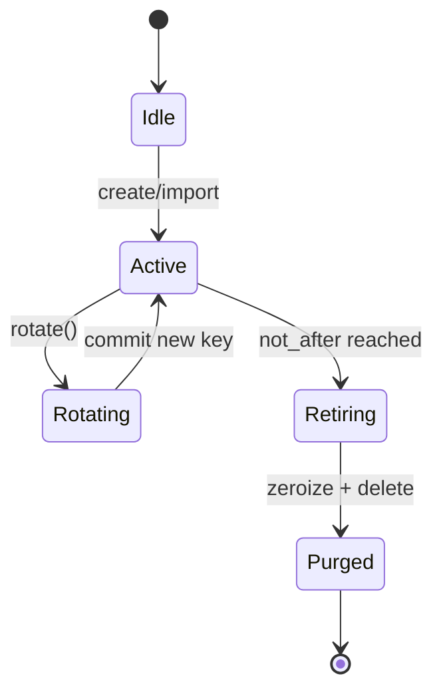

---

# ron-kms

> **Role:** library (core custody only)
> **Owner:** Stevan White
> **Status:** draft
> **MSRV:** 1.80.0
> **Last reviewed:** 2025-10-09
> **Deployment stance:** This crate is a **pure library**. Any HTTP service lives **outside** this crate (e.g., `testing/kms-dev-server` for local dev/tests, or `svc-kms` for production). DTOs/wire schemas remain canonical and identical across harness/service.

Badges (optional):
[]() []() []() []()

---

## 0.1 Governance & SemVer

* **SemVer:** Public API is guarded with `cargo public-api` and `cargo-semver-checks`.
* **Reviews:** Security/interop changes require a second reviewer and updated KATs.
* **Docs discipline:** Any wire/schema change must update `INTEROP.md` and add vectors.

---

## 1) Overview

**What it is:**
`ron-kms` is RustyOnions’ **key custody core**: generate, import, rotate, seal, and zeroize keys with trait-based **sign/verify** and **(hybrid) KEM**. It is **PQ-ready** (classical today; hybrid X25519+ML-KEM and ML-DSA/SLH-DSA via features). It **does not** implement business policy or any network I/O.

**Service story (out-of-tree):**

* For **local integration** and tests, use the thin harness at `testing/kms-dev-server/` which maps DTOs to HTTP.
* For **production**, a separate crate (e.g., `svc-kms`) hosts the same handlers.

**How it fits:**

* **Pillar:** 3 — Identity & Key Management
* **Upstream callers:** `ron-auth`, `svc-passport`, services needing sealed custody
* **Downstream deps:** sealed store (RAM/file/HSM adapter), OS RNG, optional metrics
* **Data:** in-memory secrets; sealed blobs on disk (off under amnesia)
* **Security boundary:** long-lived secrets; **Amnesia Mode** (RAM-only, timed purge)

### 1.1 High-Level Architecture

```mermaid
flowchart LR
  subgraph Services/Libs
    A[ron-auth / svc-passport] -->|KMS Traits| B(ron-kms)
  end

  B -->|seal/unseal| C[(SealedStore<br/>(memory|file|HSM))]
  B -->|Metrics| D[[Prometheus]]
  B -->|Entropy| E[[OS RNG]]

  style B fill:#0b7285,stroke:#083344,color:#fff
```

---

## 2) Responsibilities & Boundaries

**MUST do:**

* [ ] Custody: create/import/rotate/attest/zeroize (deterministic audit chain)
* [ ] Sign/verify + KEM (hybrid classical+PQ by runtime policy)
* [ ] Sealed-at-rest format (versioned header, alg id, not_after)
* [ ] Observability: metrics/traces without secret leakage

**MUST NOT do:**

* [ ] No policy (cadence/tenants) and no ambient authority
* [ ] **No network code** (HTTP/gRPC lives only in test harness or svc-kms)
* [ ] No PII storage

**Acceptance Gates:**

* [ ] Property/unit tests: zeroization, anti-rollback, rotate-without-loss
* [ ] Fuzz targets: sealed header decode, DTO `deny_unknown_fields`
* [ ] Metrics: `kms_ops_total`, `kms_failures_total`, `kms_op_latency_seconds`
* [ ] Bench SLO: sign/verify/encap/decap p95 targets documented

---

## 3) Public Interfaces

### 3.1 Rust API (library)

Core traits and types:

* `Keystore` (create/rotate/get/attest), `Signer`/`Verifier`
* `Kem`/`Decap` and `HybridKem`
* `KeyId`/`Kid` (versioned), `SealedStore` (pluggable backends)

```rust
use ron_kms::{Keystore, Signer, Verifier, KeyId};

fn main() -> anyhow::Result<()> {
    let kms = ron_kms::mem::keystore();
    let kid: KeyId = kms.create_ed25519("auth.signing")?;
    let msg = b"hello";
    let sig = kms.sign(&kid, msg)?;
    assert!(kms.verify(&kid, msg, &sig)?);
    Ok(())
}
```

### 3.2 Canonical HTTP DTOs (served by harness/service, not this crate)

**Base URL:** `/v1/kms`
**Endpoints (canonical):**

* `POST /keys` → create (`tenant`, `purpose`, `alg`, `policy`) → `Kid`
* `POST /keys/{kid}/rotate` → new version `kid#vN`
* `GET  /keys/{kid}` → public material (pubkey, alg, versions)
* `POST /sign` → `{ kid | kid_set, payload_b3, alg? }` → `{ sigs[], attestation? }`
* `POST /verify` → `{ payload_b3, sigs[], policy }` → `{ ok, details, cache_age_ms? }`
* `POST /wrap` / `/unwrap` → envelope ops
  **Auth:** Bearer macaroon scopes: `kms:read`, `kms:sign`, `kms:rotate`, `kms:wrap`.

**Example — POST /v1/kms/sign**

*Request*

```json
{
  "kid": "auth.signing#v3",
  "payload_b3": "SGVsbG8sIFJ1c3R5T25pb25zIQ==",
  "alg": "Ed25519"
}
```

*Response*

```json
{
  "ok": true,
  "sigs": [
    {"alg":"Ed25519","sig_b3":"4m6..."},
    {"alg":"ML-DSA","sig_b3":"A8Q...","hybrid":true}
  ],
  "attestation": {"kid":"auth.signing#v3","created_ms":1738791000000}
}
```

---

## 4) Configuration

Library defaults respect env only when using convenience constructors.

| Variable              | Type | Default         | Description                                      |
| --------------------- | ---- | --------------- | ------------------------------------------------ |
| `RON_KMS_STORE`       | str  | `memory:`       | `memory:` | `file:./secrets` | `pkcs11:URI`      |
| `RON_KMS_PQ_MODE`     | str  | `classical`     | `classical` | `hybrid` | `pq`                    |
| `RON_KMS_ROTATE_DAYS` | int  | `30`            | soft hint; enforced by policy layer              |
| `RON_KMS_AMNESIA`     | bool | `1` (micronode) | RAM-only; zeroize on shutdown                    |
| `RON_KMS_METRICS`     | bool | `1`             | export metrics if available                      |
| `KMS_PKCS11_LIB`      | path | —               | HSM: shared library path                         |
| `KMS_PKCS11_SLOT`     | str  | —               | HSM: slot selection                              |
| `KMS_PKCS11_PIN`      | str  | —               | HSM: user/so PIN (use secret storage, never log) |

**Cargo features:** `mlkem`, `mldsa`, `slhdsa`, `soft-seal`, `with-metrics`

---

## 5) Build, Run, Test

**Build**

```bash
cargo build -p ron-kms
```

**Run a dev HTTP harness (example project layout)**

```bash
# From repo root (harness is its own crate):
cargo run -p kms-dev-server
# Then:
curl -sS http://127.0.0.1:8080/v1/kms/keys | jq .
```

**Tests**

```bash
cargo test -p ron-kms --all-features
cargo test -p ron-kms --doc
```

**Fuzz / Loom / Soak**

```bash
# 1h nightly fuzz (example target names)
cargo fuzz run sealed_header -- -max_total_time=3600
cargo fuzz run dto_sign -- -max_total_time=3600

# Loom (lock ordering / concurrency invariants)
RUST_LOOM_MAX_PREEMPTIONS=2 cargo test -p ron-kms --features loom

# 24h soak (run via testing/kms-dev-server)
RUST_LOG=warn RON_KMS_AMNESIA=1 cargo run -p kms-dev-server &
k6 run testing/scripts/soak_sign.js   # or vegeta/bombardier equivalent
```

**Lint & deps**

```bash
cargo fmt --all
cargo clippy -p ron-kms -- -D warnings
cargo deny check
```

**Bench**

```bash
cargo bench -p ron-kms
```

---

## 6) Observability

**Metrics**

* `kms_ops_total{op}` — `create|import|sign|verify|encap|decap|rotate|seal|unseal`
* `kms_failures_total{op,kind}`
* `kms_keys_total{alg,hybrid}` — gauge
* `kms_op_latency_seconds{op}` — histogram

**Tracing**

* Spans include `op`, `kid`, `alg`, `hybrid`, `result`, `corr_id`
* Redact lengths/secret bytes; `deny_unknown_fields` at DTO boundaries

**Logging**

* JSON logs only; include `corr_id`, `op`, `kid`, `alg`, `result`
* Never log key material, ciphertext lengths, or AEAD nonces
* Rejected DTOs log at INFO with redacted field names only (harness/service side)

---

## 7) Performance & SLOs

| Metric                   | Target (guide) | Notes                                 |
| ------------------------ | -------------: | ------------------------------------- |
| Sign p95 (Ed25519)       |         ≤ 1 ms | dev laptop                            |
| Verify p95 (Ed25519)     |         ≤ 1 ms |                                       |
| Encap/Decap p95 (ML-KEM) |        ≤ 10 ms | platform-dependent; benchmark locally |
| Hybrid Encap/Decap p95   |   ≤ (class+PQ) | budget both paths                     |
| Start-to-ready           |       < 100 ms | amnesia mode                          |

**Drift gates (fail CI if exceeded vs last baseline):**

* `sign_p95_ed25519`:   +20%
* `verify_p95_ed25519`: +20%
* `encap_p95_mlkem`:    +25%
* `decap_p95_mlkem`:    +25%

**Flamegraphs (developer reproducible):**

```bash
cargo bench -p ron-kms -- --bench sign
sudo perf record -F 99 -g target/release/deps/ron_kms-*
sudo perf script | inferno-flamegraph > flame.svg
```

---

## 8) Data & Schema

**Sealed record header (abridged)**

```
magic="RONK", version=u8, alg=u16, hybrid=u8, created_at=unix_ms, not_after=unix_ms,
kid=bytes(16), pubkey_len=u16, pubkey[..], aead_nonce=12B, aead_ct=.., aead_tag=16B
```

* Versioned; reject unknown/malformed
* AEAD with domain separation; integrity before decrypt
* Public key cache allowed for quick list/verify

---

## 9) Security & Privacy

* **Threats:** blob theft, memory scrape, classical-only downgrade, expired key misuse
* **Controls:** zeroize, sealed-at-rest, amnesia mode, anti-rollback, constant-time compares
* **PII:** none
* **AuthN/Z:** library is capability-agnostic; harness/service enforce macaroon scopes
* **PQ migration:** `RON_KMS_PQ_MODE=hybrid` → dual-path verification; policy drives cutover
* **Supply chain:** workspace pins; `cargo deny` clean

---

## 10) Error Taxonomy

| Code/Variant               | When                  | Hint                               | Retry          |
| -------------------------- | --------------------- | ---------------------------------- | -------------- |
| `KmsError::NoSuchKey`      | unknown `Kid`         | check id/namespace                 | no             |
| `KmsError::SealedCorrupt`  | AEAD failure / tamper | restore known-good, verify backups | no             |
| `KmsError::AlgUnavailable` | feature not built     | enable `mlkem`/`mldsa`/`slhdsa`    | no             |
| `KmsError::Expired`        | `not_after` exceeded  | rotate/import a fresh key          | no             |
| `KmsError::Entropy`        | RNG failure           | check OS entropy                   | yes w/ backoff |

---

## 11) Concurrency Model

* **Core:** synchronous custody ops; async wrappers never hold locks across `.await`
* **Single-writer** per key file; bounded work queues exist **only in harness/service**
* **Loom** targets for critical lock-ordering paths (opt-in feature)



---

## 12) Compatibility & Requirements

* **Rust:** 1.80.0
* **OS:** macOS 10.15+, Linux x86_64
* **TLS:** n/a here; services use `tokio_rustls`
* **Backends:** memory / file (soft-seal) / PKCS#11 (adapter)

### 12.1 Interop & Known Answer Tests (KATs)

* **Vectors:** `tests/vectors/ed25519/`, `tests/vectors/mlkem/`, `tests/vectors/mldsa/`.
* **Policy:** New algs or header changes MUST include KATs and cross-verify with at least one external implementation (document the toolchain).
* **Run:**

```bash
cargo test -p ron-kms --test interop_kats --all-features
```

---

## 13) Examples

Library usage: see §3.1.
Harness curl:

```bash
# after cargo run -p kms-dev-server
curl -sS http://127.0.0.1:8080/v1/kms/keys | jq .
```

---

## 14) Troubleshooting

* **AlgUnavailable:** build with `--features mldsa,mlkem,slhdsa`
* **SealedCorrupt:** header mismatch/tamper—restore from backup
* **Amnesia created files:** ensure `RON_KMS_AMNESIA=1` in the harness/service host; use `memory:`
* **HSM issues:** verify `KMS_PKCS11_LIB/SLOT/PIN` and provider permissions
* **High latency:** ensure `--release`, check CPU throttling, disable noisy tracing in hot loops

---

## 15) Development Notes

* Keep DTOs in `ron-proto` if shared; **no network side-effects** in this crate
* Metrics via `ron-metrics`; register once and clone handles
* Pre-commit:

```bash
cargo fmt --all
cargo clippy -- -D warnings
cargo test
cargo deny check
```

---

## 16) Mermaid Diagrams — Policy & Tooling

Keep `.mmd` under `docs/`; render SVGs in CI.

**Render locally (SVG)**

```bash
npm i -g @mermaid-js/mermaid-cli
mmdc -i docs/arch.mmd -o docs/arch.svg
```

**Render via Docker**

```bash
docker run --rm -v "$PWD":/data minlag/mermaid-cli mmdc -i docs/arch.mmd -o docs/arch.svg
```

**CI (governance + diagrams)**

```yaml
name: ci
on: [push, pull_request]
jobs:
  rust:
    runs-on: ubuntu-latest
    steps:
      - uses: actions/checkout@v4
      - uses: dtolnay/rust-toolchain@stable
      - run: sudo apt-get update && sudo apt-get install -y pkg-config libssl-dev
      - run: cargo fmt --all -- --check
      - run: cargo clippy -p ron-kms -- -D warnings
      - run: cargo test -p ron-kms --all-features
      - name: public API (diff)
        run: cargo install cargo-public-api && cargo public-api -p ron-kms --diff-git-checks
      - name: semver checks
        run: cargo install cargo-semver-checks && cargo semver-checks check-release -p ron-kms

  diagrams:
    runs-on: ubuntu-latest
    steps:
      - uses: actions/checkout@v4
      - run: npm i -g @mermaid-js/mermaid-cli
      - run: |
          mkdir -p docs
          for f in $(git ls-files '*.mmd'); do
            mmdc -i "$f" -o "${f%.mmd}.svg"
          done
      - uses: actions/upload-artifact@v4
        with:
          name: mermaid-svgs
          path: "**/*.svg"
```

---

## 17) Roadmap & TODO

* [ ] **M1 (Bronze):** Ed25519/X25519 + sealed memory/file; zeroize; metrics
* [ ] **M2 (Silver):** **Hybrid** X25519+ML-KEM; PQ verify; rotation runbook; fuzz targets
* [ ] **M3 (Gold):** PQ-preferred; HSM adapter; interop vectors; 24h soak & chaos
* [ ] Interop: publish KAT packs (ZIP) and cross-impl CI (mlkem/mldsa) before PQ cutover.

---

## 18) Changelog

See [CHANGELOG.md](./CHANGELOG.md).

---

## 19) License

Dual-licensed under **MIT** or **Apache-2.0**. See `LICENSE-MIT` and `LICENSE-APACHE`.

---

## 20) Contributing

PRs welcome—include updated diagrams, tests, and perf notes.
Also see: `IDB.md`, `QUANTUM.md`, `INTEROP.md`, `SECURITY.md`, `PERFORMANCE.md`, `RUNBOOK.md`.

---

### Why this is better

* **No server in the library**: zero transport creep, minimal deps, tighter SemVer.
* **Harness is isolated**: you still get curl-able endpoints for fuzz/soak/KATs, but they live in `testing/` where they belong.
* **Prod remains clean**: `svc-kms` (or any service wrapper) can evolve independently with rate limits, TLS, auth, etc., without touching the custody core.

