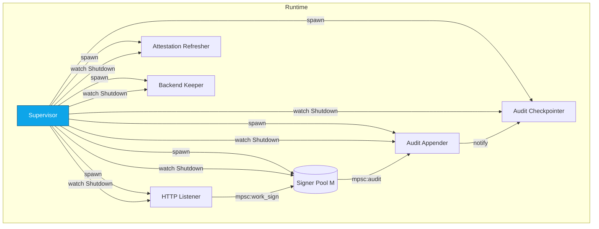
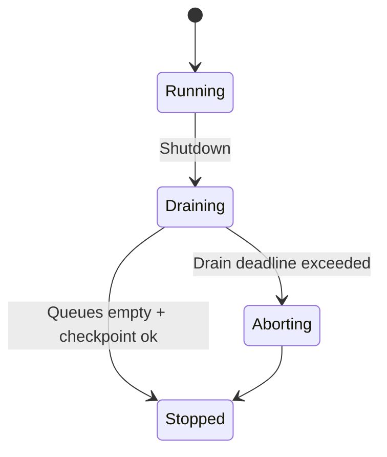
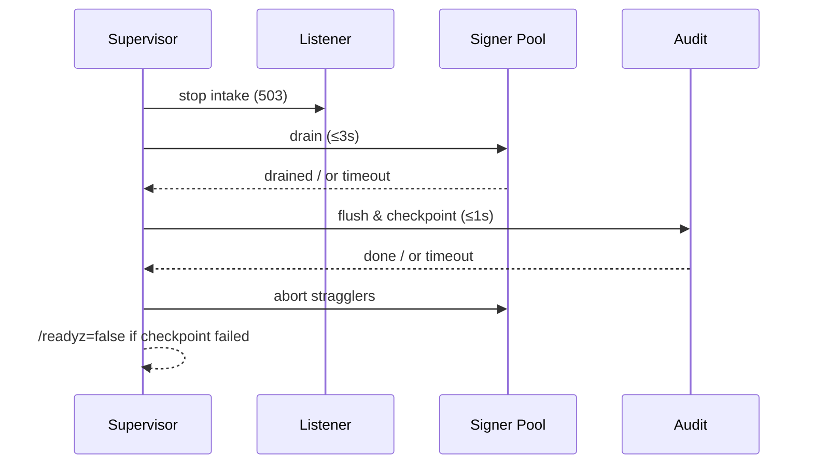

---

title: Concurrency Model — ron-kms
crate: ron-kms
owner: Stevan White
last-reviewed: 2025-10-09
status: draft
template_version: 1.1
msrv: 1.80.0
tokio: "1.x (pinned at workspace root)"
loom: "0.7+ (dev-only)"
lite_mode: "For small library crates: fill §§1,3,4,5,10,11 and mark others N/A"
-------------------------------------------------------------------------------

# Concurrency Model — ron-kms

This document makes the concurrency rules **explicit**: tasks, channels, locks, shutdown, timeouts,
and validation (property/loom/TLA+). It complements `docs/SECURITY.md`, `docs/CONFIG.md`,
and the crate’s `README.md` and `IDB.md`.

> **Golden rule:** never hold a lock across `.await` in supervisory or hot paths.

---

## 0) Lite Mode (for tiny lib crates)

N/A — `ron-kms` is a **service** with background tasks.

---

## 1) Invariants (MUST)

* **No lock across `.await`.** If unavoidable, split the critical section or clone a snapshot (`ArcSwap`/copy) before `.await`.
* **Single writer** per mutable resource (per-key version head, nonce tracker, attestation cache); readers use snapshots.
* **Bounded channels only** (mpsc/broadcast/watch) with explicit overflow policy and metrics.
* **Explicit timeouts** on all I/O and backend calls (HSM/TPM/PKCS#11, file I/O, cloud KMS).
* **Cooperative cancellation** at every `.await` via `select!` with shutdown.
* **Graceful shutdown**: stop intake, drain within deadline, abort stragglers and count them.
* **No blocking syscalls** on the async runtime; use `spawn_blocking` for PKCS#11/TPM calls that can block.
* **No task leaks**: every spawned task is either joined on shutdown or documented as detached with rationale.
* **Backpressure > buffering**: prefer rejecting (`Busy/429`) over growing queues.
* **Framing**: HTTP/JSON (& OAP/1 if enabled) is length-delimited with hard caps; handle split reads/writes.
* **Async Drop**: `Drop` must not block; provide async `close()/shutdown()` for resources.

---

## 2) Runtime Topology

**Runtime:** Tokio multi-threaded, enable I/O and time drivers.

**Primary tasks (supervised):**

* **HTTP Listener (Axum)** — accepts `/v1/kms/*` requests; applies limits/quota; fans out to worker queues.
* **Signer Pool (M workers)** — performs sign/unwrap/rotate against the active backend; emits audit records.
* **Verify Path (inline + cache)** — verifies using cached pubkeys/metadata; background refresh maintains cache TTL.
* **Audit Appender** — consumes `AuditEvent` mpsc; appends to tamper-evident log; signals checkpoint scheduler.
* **Audit Checkpointer (interval)** — every *N ops* or *T seconds*, writes a signed checkpoint; on failure flips readiness.
* **Attestation Refresher** — periodically (or on demand) renews attestation evidence; publishes into cache.
* **Backend Keeper** — keeps PKCS#11/TPM/cloud sessions live; reconnects with jittered backoff on error.
* **Config Watch** — subscribes to `ConfigUpdated` and atomically swaps `Arc<Config>` + revalidates backends.
* **Health/Metrics** — surfaces `/metrics`, `/healthz`, `/readyz` (often bundled into HTTP Listener with separate router).

**Supervision:** on panic, restart with **exponential backoff + jitter** (min 100ms, cap 5s, max 10 attempts per minute). Escalate to process exit if the Listener or Audit Appender flaps continuously.



**Text description:** Supervisor spawns Listener, Signer Pool, and auxiliary tasks. Listener feeds a bounded work queue to the pool; signer workers emit audit events to a bounded audit queue consumed by the appender, which triggers periodic checkpoints.

---

## 3) Channels & Backpressure

**Inventory (all bounded):**

| Name           | Kind      | Capacity | Producers → Consumers   | Backpressure Policy                   | Drop Semantics                                                                    |
| -------------- | --------- | -------: | ----------------------- | ------------------------------------- | --------------------------------------------------------------------------------- |
| `work_sign_tx` | mpsc      |      512 | N (HTTP) → M (signers)  | `try_send` else `Busy` (429)          | Caller sees `Busy`; metric `busy_rejections_total{queue="sign"}`                  |
| `audit_tx`     | mpsc      |     2048 | M (signers) → 1 (audit) | `send().await` with 200ms timeout     | On timeout, drop oldest **non-checkpoint** event; increment `audit_dropped_total` |
| `shutdown_rx`  | watch     |        1 | 1 → N                   | last-write wins                       | N/A                                                                               |
| `events_tx`    | broadcast |     1024 | 1 → N                   | drop oldest; count `bus_lagged_total` | Warn & count lagging subscribers                                                  |
| `config_rx`    | watch     |        1 | 1 → N                   | last-write wins                       | N/A                                                                               |

**Guidelines**

* Prefer **reject-new** on hot path (`work_sign_tx`) to keep p95 low.
* `audit_tx` prefers **bounded wait** then **drop oldest non-checkpoint** to preserve integrity anchors.
* Export gauges for queue depth; counters for drops per queue.

---

## 4) Locks & Shared State

**Allowed**

* Short-lived `Mutex/RwLock` for small metadata (e.g., **nonce tracker per `kid#vN`**); never hold across `.await`.
* Lock-free snapshots via **`ArcSwap`** for **KeyIndex** (KID→pubkey/version metadata) and **PolicyHints**.
* Per-connection/request state lives on the task; cross-task communication via channels only.

**Forbidden**

* Any lock held across `.await`.
* Nested locks without explicit **hierarchy**.

**Hierarchy (if absolutely needed)**

1. `nonce_tracker` (finest)
2. `keymeta_local` (per-key mutable bits)
3. `audit_state` (checkpoint counters)

> Acquire in ascending order; release before any `.await`.

---

## 5) Timeouts, Retries, Deadlines

* **HTTP I/O:** `read=5s`, `write=5s`, `idle=60s` (from CONFIG).
* **Sign/Unwrap to backend:** overall **deadline 2s**; retry **idempotent** ops only (e.g., verify) with backoff `50–100ms` → cap `1s`, max **2** tries.
* **Attestation refresh:** deadline **3s**; on failure, set degraded flag and surface in `/readyz`.
* **Audit append:** deadline **200ms** per batch; on breach, **drop oldest non-checkpoint** and count.
* **Checkpoint write:** deadline **1s**; if missed, flip readiness **false** and raise `kms_audit_integrity_failed_total`.

```mermaid
sequenceDiagram
  autonumber
  participant C as Client
  participant G as ron-kms
  C->>G: POST /sign (deadline=2s)
  alt queue full
    G-->>C: 429 Busy
  else signed
    G-->>C: 200 {sigs[], att?}
  end
  Note over G: Per-op deadline enforced; no queue growth beyond cap
```

---

## 6) Cancellation & Shutdown

* **Signal source:** `KernelEvent::Shutdown` or `wait_for_ctrl_c()`.
* **Propagation:** use `tokio::select! { _ = shutdown.changed() => ..., _ = task_future => ... }` in every loop.
* **Orderly drain:**

  1. Listener **stops intake** and returns `503 Retry-After`.
  2. Signer Pool **finishes in-flight** jobs (deadline `drain=3s`).
  3. Audit Appender **flushes** queue; Checkpointer writes final checkpoint (deadline `1s`).
* **Abort policy:** tasks exceeding drain deadline → `handle.abort()`; count `tasks_aborted_total{kind}`.



---

## 7) I/O & Framing

* **HTTP/JSON** (canonical). Body caps from CONFIG (`1 MiB`); decompression ratio cap `10x`.
* **OAP/1** (if enabled later): length-delimited frames; **max_frame=1 MiB**; streaming chunk = **64 KiB**; checksum verify on receipt.
* Always call `.shutdown().await` (TLS and TCP) on normal and error exits.

---

## 8) Error Taxonomy (Concurrency-Relevant)

| Error                | When                                  | Retry? | Metric                                | Notes                                    |
| -------------------- | ------------------------------------- | ------ | ------------------------------------- | ---------------------------------------- |
| `Busy`               | `work_sign_tx` full                   | Caller | `busy_rejections_total{queue="sign"}` | Prefer fast-fail to preserve latency     |
| `Timeout`            | Backend call exceeds deadline         | Maybe  | `io_timeouts_total{op}`               | Attach op (`sign`,`attest`,`checkpoint`) |
| `Canceled`           | Shutdown while awaiting               | No     | `tasks_canceled_total{kind}`          | Cooperative cancellation                 |
| `Lagging`            | broadcast overflow                    | No     | `bus_lagged_total`                    | Warn slow consumer                       |
| `DegradedAudit`      | Audit checkpoint missed               | No     | `kms_audit_integrity_failed_total`    | Flip `/readyz=false`                     |
| `VerifyCacheExpired` | Verify soft-TTL crossed during outage | Maybe  | `verify_cache_expired_total`          | Response includes `cache_age_ms`         |

---

## 9) Metrics (Concurrency Health)

* `queue_depth{queue}` gauge (`sign`,`audit`)
* `queue_dropped_total{queue}` counter
* `busy_rejections_total{queue}` counter
* `tasks_spawned_total{kind}` / `tasks_aborted_total{kind}` / `tasks_canceled_total{kind}`
* `io_timeouts_total{op}` (`sign`,`attest`,`checkpoint`)
* `backoff_retries_total{op}`
* `bus_lagged_total`
* `kms_audit_integrity_failed_total`
* `verify_cache_age_ms` gauge (optional export when degraded)

---

## 10) Validation Strategy

**Unit / Property**

* **Backpressure law:** for full `work_sign_tx`, `POST /sign` → `Busy/429` (never block).
* **Deadline law:** `sign()` must respect per-op deadline ≤ 2s (tunable) under induced delays.
* **Lock discipline:** CI lint + targeted tests ensure no lock is held across `.await`.

**Loom (dev-only)**

* **Rotate vs Sign race:** One writer (rotate) + many signers; assert version monotonicity and no torn read of `kid#vN`.
* **Shutdown reachability:** All workers observe shutdown; no missed notifications; no deadlocks.
* **Audit ordering:** For any interleaving, Merkle index is contiguous; `checkpoint` reflects all prior appends.

**Fuzz**

* **Frame/decoder fuzz** for any non-HTTP protocols enabled later (e.g., OAP/1).
* **JSON DTO fuzz** (size limits, deny-unknown-fields).

**Chaos**

* Kill signer workers under load → pool backfills; p95 remains within budget; `/readyz` unaffected.
* Induce backend outage → verify via cache passes ≤ TTL; sign returns 503 with `Retry-After`.

**(Optional) TLA+**

* Model `Sign/Rotate/Audit` state machine to prove:
  **Safety:** audit index strictly increases; version heads monotonic per KID.
  **Liveness:** drain completes under bounded failures.

---

## 11) Code Patterns (Copy-Paste)

**Spawn + cooperative shutdown (worker loop)**

```rust
let (shutdown_tx, mut shutdown_rx) = tokio::sync::watch::channel(false);
let (work_tx, mut work_rx) = tokio::sync::mpsc::channel(512);

let worker = tokio::spawn(async move {
  loop {
    tokio::select! {
      _ = shutdown_rx.changed() => break,
      some = work_rx.recv() => {
        let Some(job) = some else { break };
        // No lock across .await: compute snapshot first
        let snapshot = key_index.load(); // ArcSwap<...>
        if let Err(e) = sign_with(snapshot, job).await {
          tracing::warn!(error=%e, "sign job failed");
        }
      }
    }
  }
});
```

**Bounded mpsc with `try_send` (reject-new)**

```rust
match work_tx.try_send(job) {
  Ok(()) => {}
  Err(tokio::sync::mpsc::error::TrySendError::Full(_)) => {
    metrics::busy_rejections_total("sign").inc();
    return Err(Error::Busy);
  }
  Err(e) => return Err(Error::Queue(e.to_string())),
}
```

**Timeout wrapper for backend call**

```rust
let deadline = cfg.sign_deadline(); // derive from CONFIG
let res = tokio::time::timeout(deadline, backend.sign(kid, msg, policy)).await;
let sig = res.map_err(|_| Error::Timeout)??;
```

**Async Drop pattern (no blocking in `Drop`)**

```rust
pub struct BackendClient { inner: Option<Handle> }
impl BackendClient {
  pub async fn close(&mut self) -> anyhow::Result<()> {
    if let Some(h) = self.inner.take() { h.shutdown().await?; }
    Ok(())
  }
}
impl Drop for BackendClient {
  fn drop(&mut self) {
    if self.inner.is_some() {
      tracing::debug!("BackendClient dropped without close(); resources reclaimed best-effort");
    }
  }
}
```

**No lock across `.await`**

```rust
let next_nonce = {
  let mut guard = nonce_tracker.lock();      // short critical section
  guard.next_for(kid_version)                // compute
}; // guard dropped here
backend.aead_seal(kid_version, next_nonce, &pt).await; // now safe to await
```

---

## 12) Configuration Hooks (Quick Reference)

* `max_conns`, `read_timeout`, `write_timeout`, `idle_timeout`
* `work_sign` capacity (512), `audit` capacity (2048)
* `drain_deadline` (default 3s), `checkpoint_deadline` (1s)
* per-op deadlines (`sign`, `attest`, `wrap/unwrap`)
* retry/backoff window for idempotent ops (verify)
* verify cache TTL (degraded mode)

See `docs/CONFIG.md` for authoritative schema.

---

## 13) Known Trade-offs / Nonstrict Areas

* **Audit queue policy:** dropping **non-checkpoint** events under extreme pressure preserves integrity anchors at the cost of auxiliary detail. This is intentional.
* **Reject-new vs drop-oldest on `work_sign`:** we choose **reject-new** to preserve latency SLOs; callers can retry.
* **Attestation refresh cadence:** favor slightly aggressive refresh to keep degraded windows short, at the cost of extra backend calls.

---

## 14) Mermaid Diagrams (REQUIRED)

### 14.1 Task & Queue Topology

```mermaid
flowchart LR
  IN[HTTP Ingress] -->|mpsc:work_sign(512)| W1[Signer A]
  IN -->|mpsc:work_sign(512)| W2[Signer B]
  W1 -->|mpsc:audit(2048)| AUD[Audit Appender]
  W2 -->|mpsc:audit(2048)| AUD
  AUD -->|tick/ops| CKPT[Checkpoint Writer]
  subgraph Control
    SHUT[Shutdown watch] --> IN
    SHUT --> W1
    SHUT --> W2
    SHUT --> AUD
    SHUT --> CKPT
  end
```

**Text:** Ingress fans out to a bounded sign queue served by workers; workers emit audit events to a bounded audit queue; a checkpointer runs by ops/ticks. Shutdown watch notifies all tasks.

### 14.2 Shutdown Sequence



**Text:** Supervisor stops intake, drains workers, flushes audit, writes a final checkpoint, aborts stragglers if needed, and reflects readiness.

---

## 15) CI & Lints (Enforcement)

**Clippy (crate-level)**

* `-D warnings`
* `-W clippy::await_holding_lock` (treat as error)
* `-W clippy::needless_collect`
* `-W clippy::useless_async`

**GitHub Actions (suggested)**

```yaml
name: kms-concurrency-guardrails
on: [push, pull_request]
jobs:
  clippy:
    runs-on: ubuntu-latest
    steps:
      - uses: actions/checkout@v4
      - uses: dtolnay/rust-toolchain@stable
      - run: cargo clippy -p ron-kms -- -D warnings -W clippy::await_holding_lock

  loom:
    if: github.event_name == 'pull_request'
    runs-on: ubuntu-latest
    steps:
      - uses: actions/checkout@v4
      - uses: dtolnay/rust-toolchain@stable
      - run: RUSTFLAGS="--cfg loom" cargo test -p ron-kms --tests -- --ignored

  fuzz:
    runs-on: ubuntu-latest
    steps:
      - uses: actions/checkout@v4
      - uses: dtolnay/rust-toolchain@stable
      - run: cargo install cargo-fuzz
      - run: cargo fuzz build -p ron-kms
```

---

## 16) Schema Generation (Optional)

* Annotate channel declarations with attributes and generate `docs/_generated/concurrency.mdfrag` via `build.rs`, or
* Keep a `concurrency.rs` registry module and a golden test asserting doc ↔ code parity for channel names/caps.

---

## 17) Review & Maintenance

* **Review cadence:** every 90 days or on any change to tasks/channels/locks.
* **PR checklist:** update this doc + Loom/property tests whenever concurrency changes.
* Keep `owner`, `msrv`, and `last-reviewed` fresh.

---
