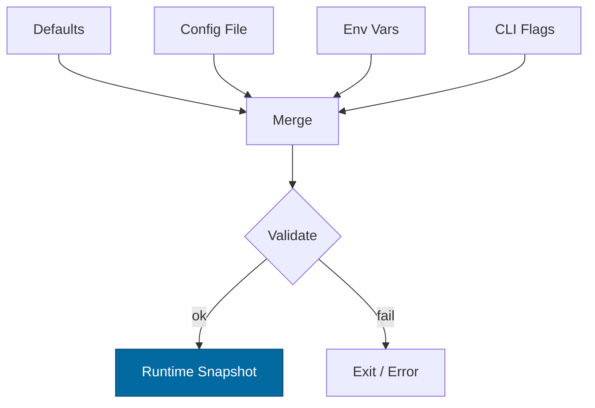

---

title: Configuration — ron-kms
crate: ron-kms
owner: Stevan White
last-reviewed: 2025-10-09
status: draft
template_version: 1.0
---------------------

# Configuration — ron-kms

This document defines **all configuration** for `ron-kms`, including sources,
precedence, schema (types/defaults), validation, feature flags, live-reload behavior,
and security implications. It complements `README.md`, `docs/SECURITY.md`, and `IDB.md`.

> **Tiering:**
>
> * **Service crate:** all sections apply (network, readiness, observability, custody backends).
> * **Library adapters** (e.g., `ron-proto` DTOs) are out of scope here.

---

## 1) Sources & Precedence (Authoritative)

Configuration may come from multiple sources. **Precedence (highest wins):**

1. **Process flags** (CLI)
2. **Environment variables** (prefix: `RON_KMS_`)
3. **Config file** (e.g., `Config.toml` beside the binary or `--config`)
4. **Built-in defaults** (hard-coded)

> On reload, the effective config is recomputed under the same precedence.

**Supported file formats:** TOML (preferred), JSON (optional).
**Path resolution order for `--config` (if relative):** `./`, `$CWD`, crate dir.
**List parsing in ENV:** comma-delimited (e.g., `RON_KMS_ALLOWED_ALGS=ed25519,ml-dsa,x25519,ml-kem`).

---

## 2) Quickstart Examples

### 2.1 Minimal service start (Micronode/dev; amnesia + inmem)

```bash
RUST_LOG=info
RON_KMS_BIND_ADDR=127.0.0.1:7441
RON_KMS_METRICS_ADDR=127.0.0.1:0
RON_KMS_BACKEND=inmem
RON_KMS_AMNESIA=1
RON_KMS_PQ_PRODUCE_HYBRID=1
RON_KMS_PQ_VERIFY_MODE=or
RON_KMS_SIGN_RATE_LIMIT=200
cargo run -p ron-kms
```

### 2.2 Config file (TOML; Macronode/HSM + strict PQ)

```toml
# Config.toml
bind_addr     = "0.0.0.0:7441"
metrics_addr  = "127.0.0.1:0"
max_conns     = 2048
read_timeout  = "5s"
write_timeout = "5s"
idle_timeout  = "60s"

[service]
backend = "pkcs11"
amnesia = false
allowed_algs = ["ed25519","ml-dsa","x25519","ml-kem"]
allow_sign_fallback = false
multi_backends = ["pkcs11","file"]   # sign authority is first entry

[tls]
enabled = false

[limits]
max_body_bytes       = "1MiB"
decompress_ratio_cap = 10

[security]
attest_require = "required"          # never|if-available|required
sign_rate_limit_rps = 500
time_skew_tolerance_ms = 1000

[entropy_time]
rng_reseed_interval_ops = 200000

[pq]
produce_hybrid  = true
verify_mode     = "and"              # or|and|pq_only
rollout_percent = 100

[audit]
dir = "./kms-audit"
checkpoint_interval_ops = 5000
sealing = "attested"                 # software|attested
verify_cache_ttl_ms = 300000

[observability]
redact_level="hashes"                # none|lengths|hashes
log_inputs=false
correlation_id_mode="uuidv7"
emit_cache_age_metric=true

[backends.pkcs11]
module_path="/usr/lib/softhsm/libsofthsm2.so"
slot_label="RON-KMS"
pin_env="KMS_PKCS11_PIN_ENV"         # name of env var that stores the PIN

[backends.file]
dir="./kms-sealed"
kdf="scrypt"
aead="chacha20poly1305"
```

### 2.3 CLI flags (override file/env)

```bash
cargo run -p ron-kms -- \
  --bind 0.0.0.0:7441 \
  --metrics 127.0.0.1:0 \
  --backend pkcs11 \
  --allowed-algs ed25519,ml-dsa,x25519,ml-kem \
  --attest required \
  --pq-verify and \
  --pq-produce-hybrid \
  --audit-dir ./kms-audit
```

---

## 3) Schema (Typed, With Defaults)

> **Prefix convention:** All env vars begin with `RON_KMS_`.
> **Durations** accept `s`, `ms`, `m`, `h`. **Sizes** accept `B`, `KB`, `MB`, `MiB`.
> **Lists in ENV** use comma-delimited strings.

| Key / Env Var                                                              | Type     |                        Default | Description                               | Security Notes                            |                                   |                           |        |                        |
| -------------------------------------------------------------------------- | -------- | -----------------------------: | ----------------------------------------- | ----------------------------------------- | --------------------------------- | ------------------------- | ------ | ---------------------- |
| `bind_addr` / `RON_KMS_BIND_ADDR`                                          | socket   |                  `127.0.0.1:0` | Service bind address                      | Public binds require threat review        |                                   |                           |        |                        |
| `metrics_addr` / `RON_KMS_METRICS_ADDR`                                    | socket   |                  `127.0.0.1:0` | Prometheus endpoint bind                  | Prefer localhost; scrape via gateway      |                                   |                           |        |                        |
| `max_conns` / `RON_KMS_MAX_CONNS`                                          | u32      |                         `1024` | Max concurrent connections                | Prevents FD exhaustion                    |                                   |                           |        |                        |
| `read_timeout` / `RON_KMS_READ_TIMEOUT`                                    | duration |                           `5s` | Per-request read timeout                  | DoS mitigation                            |                                   |                           |        |                        |
| `write_timeout` / `RON_KMS_WRITE_TIMEOUT`                                  | duration |                           `5s` | Per-request write timeout                 | DoS mitigation                            |                                   |                           |        |                        |
| `idle_timeout` / `RON_KMS_IDLE_TIMEOUT`                                    | duration |                          `60s` | Keep-alive idle shutdown                  | Resource hygiene                          |                                   |                           |        |                        |
| `limits.max_body_bytes` / `RON_KMS_MAX_BODY_BYTES`                         | size     |                         `1MiB` | Request payload cap                       | Clients send BLAKE3 of canonical payloads |                                   |                           |        |                        |
| `limits.decompress_ratio_cap` / `RON_KMS_DECOMPRESS_RATIO_CAP`             | u32      |                           `10` | Max allowed decompression ratio           | Zip bomb guard                            |                                   |                           |        |                        |
| `tls.enabled` / `RON_KMS_TLS_ENABLED`                                      | bool     |                        `false` | Enable TLS                                | Use `tokio_rustls::rustls` only           |                                   |                           |        |                        |
| `tls.cert_path` / `RON_KMS_TLS_CERT_PATH`                                  | path     |                           `""` | PEM cert path                             | Secret on disk; perms 0600                |                                   |                           |        |                        |
| `tls.key_path` / `RON_KMS_TLS_KEY_PATH`                                    | path     |                           `""` | PEM key path                              | Zeroize in memory                         |                                   |                           |        |                        |
| `service.backend` / `RON_KMS_BACKEND`                                      | enum     |                         `file` | `inmem                                    | file                                      | pkcs11                            | tpm                       | cloud` | Non-exportable custody |
| `service.amnesia` / `RON_KMS_AMNESIA`                                      | bool     |                        `false` | RAM-only secrets mode                     | No persistent keys; Micronode=true        |                                   |                           |        |                        |
| `service.allowed_algs` / `RON_KMS_ALLOWED_ALGS`                            | list     | `ed25519,ml-dsa,x25519,ml-kem` | Allowed primitive list                    | No novel crypto                           |                                   |                           |        |                        |
| `service.allow_sign_fallback` / `RON_KMS_ALLOW_SIGN_FALLBACK`              | bool     |                        `false` | Permit sign fallback across backends      | Only if KID+attestation match             |                                   |                           |        |                        |
| `service.multi_backends` / `RON_KMS_MULTI_BACKENDS`                        | list     |                         `file` | Ordered read set; first is sign authority | Verify may consult all                    |                                   |                           |        |                        |
| `security.attest_require` / `RON_KMS_ATTEST_REQUIRE`                       | enum     |                 `if-available` | `never                                    | if-available                              | required`                         | Gate sign on attestation  |        |                        |
| `security.sign_rate_limit_rps` / `RON_KMS_SIGN_RATE_LIMIT`                 | u32      |                          `500` | RPS budget per instance                   | Prefer 429 over latency stretch           |                                   |                           |        |                        |
| `security.time_skew_tolerance_ms` / `RON_KMS_TIME_SKEW_TOLERANCE_MS`       | u32      |                         `2000` | Verify window tolerance                   | G-14 skew tests                           |                                   |                           |        |                        |
| `entropy_time.rng_reseed_interval_ops` / `RON_KMS_RNG_RESEED_INTERVAL_OPS` | u64      |                       `100000` | DRBG reseed cadence                       | Pulls from OS RNG                         |                                   |                           |        |                        |
| `pq.produce_hybrid` / `RON_KMS_PQ_PRODUCE_HYBRID`                          | bool     |                         `true` | Emit classical+PQ signatures              | PQ migration                              |                                   |                           |        |                        |
| `pq.verify_mode` / `RON_KMS_PQ_VERIFY_MODE`                                | enum     |                          `and` | `or                                       | and                                       | pq_only`                          | Interop/migration gates   |        |                        |
| `pq.rollout_percent` / `RON_KMS_PQ_ROLLOUT_PERCENT`                        | u8       |                          `100` | Progressive enablement                    | Tenant/service gating upstream            |                                   |                           |        |                        |
| `audit.dir` / `RON_KMS_AUDIT_DIR`                                          | path     |                  `./kms-audit` | Append-only audit log directory           | Omit/ramfs in amnesia                     |                                   |                           |        |                        |
| `audit.checkpoint_interval_ops` / `RON_KMS_AUDIT_CHECKPOINT_INTERVAL`      | u32      |                         `5000` | Ops between checkpoints                   | Anti-rollback proofs                      |                                   |                           |        |                        |
| `audit.sealing` / `RON_KMS_AUDIT_SEALING`                                  | enum     |                     `software` | `software                                 | attested`                                 | Bind to device/slot when possible |                           |        |                        |
| `audit.verify_cache_ttl_ms` / `RON_KMS_VERIFY_CACHE_TTL_MS`                | u32      |                       `300000` | Verify soft-TTL for outages               | Response includes `cache_age_ms`          |                                   |                           |        |                        |
| `observability.redact_level` / `RON_KMS_REDACT_LEVEL`                      | enum     |                       `hashes` | `none                                     | lengths                                   | hashes`                           | Per I-16; prefer `hashes` |        |                        |
| `observability.log_inputs` / `RON_KMS_LOG_INPUTS`                          | bool     |                        `false` | Log raw inputs (forbidden in prod)        | Keep false                                |                                   |                           |        |                        |
| `observability.correlation_id_mode` / `RON_KMS_CORRELATION_ID_MODE`        | enum     |                       `uuidv7` | `uuidv4                                   | uuidv7`                                   | Never user-derived                |                           |        |                        |
| `observability.emit_cache_age_metric` / `RON_KMS_EMIT_CACHE_AGE_METRIC`    | bool     |                         `true` | Export metric during degraded verify      | No payload leakage                        |                                   |                           |        |                        |
| `backends.pkcs11.module_path` / `RON_KMS_PKCS11_MODULE_PATH`               | path     |                           `""` | PKCS#11 module                            |                                           |                                   |                           |        |                        |
| `backends.pkcs11.slot_label` / `RON_KMS_PKCS11_SLOT_LABEL`                 | string   |                      `RON-KMS` | Slot label                                |                                           |                                   |                           |        |                        |
| `backends.pkcs11.pin_env` / `RON_KMS_PKCS11_PIN_ENV`                       | string   |                           `""` | Name of ENV var that holds PIN            | Do not store PIN in files                 |                                   |                           |        |                        |
| `backends.file.dir` / `RON_KMS_FILE_DIR`                                   | path     |                 `./kms-sealed` | Sealed blobs directory                    | fsync on mutate                           |                                   |                           |        |                        |
| `backends.file.kdf` / `RON_KMS_FILE_KDF`                                   | enum     |                       `scrypt` | `scrypt                                   | age`                                      | Workspace-pinned                  |                           |        |                        |
| `backends.file.aead` / `RON_KMS_FILE_AEAD`                                 | enum     |             `chacha20poly1305` | `chacha20poly1305                         | aes-gcm`                                  | 96-bit nonce, explicit            |                           |        |                        |

---

## 4) Validation Rules (Fail-Closed)

On startup or reload, apply the following **strict validation**:

* `bind_addr`, `metrics_addr` parse to valid sockets; privileged ports require privileges.
* `max_conns` > 0, `limits.max_body_bytes` ≥ 1 KiB, `decompress_ratio_cap` ≥ 1.
* If `tls.enabled=true`: `cert_path`/`key_path` exist and are not world-readable.
* `service.backend` ∈ {inmem,file,pkcs11,tpm,cloud}.

  * If `pkcs11`: `module_path` must exist; `pin_env` must name an existing environment variable at runtime.
  * If `file`: `dir` must exist or be creatable; fsync on mutate must succeed.
* If `service.amnesia=true`: **no persistent keys** are allowed; `audit.dir` must be omitted or point to RAM (tmpfs/ramfs).
* `service.allowed_algs` must be a subset of the project allow-list.
* `security.attest_require=required` demands attestation material from the selected backend; otherwise **fail to start**.
* `pq.verify_mode` ∈ {or,and,pq_only}. If `pq_only`, ensure consumer services are compatible (interop gate).
* `audit.checkpoint_interval_ops` ≥ 1; `audit.sealing` ∈ {software,attested}.
* `observability.log_inputs=false` in production (enforced by deployment policy).

**On violation:** structured error → **exit non-zero** (service) or **return error** (libs/tools).

---

## 5) Dynamic Reload (If Supported)

* **How to trigger:** SIGHUP (preferred) or bus event `ConfigUpdated { version }`.
* **Reload semantics:** Non-disruptive for timeouts/limits/logging/PQ knobs.
  **Disruptive** for `bind_addr`, `tls.*`, `service.backend`, and PKCS#11 module changes (socket rebind / backend re-open).
* **Atomicity:** Compute a new config snapshot; swap an `Arc<Config>` without holding `.await`. In-flight ops continue on the old snapshot.
* **Audit:** Emit `KernelEvent::ConfigUpdated { version }` and a redacted diff (no secrets, no raw inputs).

---

## 6) CLI Flags (Canonical)

```
--config <path>                     # Load Config.toml (merged at low precedence)
--bind <ip:port>                    # bind_addr
--metrics <ip:port>                 # metrics_addr
--max-conns <num>
--read-timeout <dur>                # e.g., 5s, 250ms
--write-timeout <dur>
--idle-timeout <dur>
--backend <inmem|file|pkcs11|tpm|cloud>
--amnesia                           # amnesia=true
--allowed-algs <list>               # comma-delimited
--attest <never|if-available|required>
--pq-verify <or|and|pq_only>
--pq-produce-hybrid                 # toggles produce_hybrid=true
--pq-rollout <0..100>
--audit-dir <path>
--audit-checkpoint-ops <num>
--audit-sealing <software|attested>
--verify-cache-ttl <ms>
--allow-sign-fallback
--multi-backends <list>             # comma-delimited; first is sign authority
--log-format <json|text>
--log-level <trace|debug|info|warn|error>
```

---

## 7) Feature Flags (Cargo)

| Feature  |        Default | Effect                                                |
| -------- | -------------: | ----------------------------------------------------- |
| `tls`    |            off | Enables tokio-rustls TLS listener path and TLS keys   |
| `pq`     |            off | Enables PQ hybrid primitives and related config gates |
| `pkcs11` |            off | Enables PKCS#11 backend adapter                       |
| `tpm`    |            off | Enables TPM backend adapter                           |
| `cloud`  |            off | Enables cloud wrap/unwrap adapter                     |
| `cli`    | on (bins only) | Enables CLI parsing for flags above                   |

> Keep cross-crate consistency; document any feature that changes schema/behavior.

---

## 8) Security Implications

* **Public binds** (`0.0.0.0`) require timeouts/body caps/RPS limits.
* **TLS**: use `tokio_rustls::rustls::ServerConfig` only (never native-tls).
* **Attestation**: with `attest_require=required`, signing is **blocked** until attestation is present/valid.
* **Amnesia mode**: forbids persistent key storage; audit logs must be ephemeral if present at all.
* **Observability redaction**: `redact_level="hashes"` ensures only lengths/BLAKE3 digests appear; `log_inputs=false` in prod.
* **Multi-backend safety**: `allow_sign_fallback=false` by default; if enabled, fallback only when KID, version, and **attestation class** match.
* **Macaroons**: never log tokens; rotate ≤ 30 days; verification lives in `ron-auth`/`ron-policy` (no business logic here).

---

## 9) Compatibility & Migration

* Add new keys with safe defaults; avoid breaking changes.
* For renames, keep old env aliases ≥ 1 minor; warn when used.
* **PQ migration**: use `pq.verify_mode` (OR→AND→PQ-only) and `pq.produce_hybrid` to stage rollouts; watch `kms_reject_total{reason="pq_policy"}` and latency by alg.

**Deprecation table (maintained):**

| Old Key          | New Key                                            | Removal Target | Notes             |
| ---------------- | -------------------------------------------------- | -------------: | ----------------- |
| `pq.mode=hybrid` | `pq.verify_mode=or/and` + `pq.produce_hybrid=true` |         v1.1.0 | Split for clarity |

---

## 10) Reference Implementation (Rust)

> Minimal example for `Config` with env + file + CLI (serde).
> **Note:** This is illustrative and trimmed for brevity; actual code should add all subsections and `deny_unknown_fields`.

```rust
use std::{net::SocketAddr, path::PathBuf, time::Duration};
use serde::{Deserialize, Serialize};

#[derive(Debug, Clone, Serialize, Deserialize)]
#[serde(rename_all = "kebab-case", deny_unknown_fields)]
pub struct TlsCfg {
    pub enabled: bool,
    pub cert_path: Option<PathBuf>,
    pub key_path: Option<PathBuf>,
}

#[derive(Debug, Clone, Serialize, Deserialize)]
#[serde(deny_unknown_fields)]
pub struct Limits {
    #[serde(default = "default_body_bytes")]
    pub max_body_bytes: u64,
    #[serde(default = "default_decompress_ratio")]
    pub decompress_ratio_cap: u32,
}

#[derive(Debug, Clone, Serialize, Deserialize)]
#[serde(deny_unknown_fields)]
pub struct ServiceCfg {
    pub backend: String,                 // inmem|file|pkcs11|tpm|cloud
    #[serde(default)]
    pub amnesia: bool,
    #[serde(default = "default_allowed_algs")]
    pub allowed_algs: Vec<String>,
    #[serde(default)]
    pub allow_sign_fallback: bool,
    #[serde(default = "default_multi_backends")]
    pub multi_backends: Vec<String>,
}

#[derive(Debug, Clone, Serialize, Deserialize)]
#[serde(deny_unknown_fields)]
pub struct SecurityCfg {
    #[serde(default = "default_attest")]
    pub attest_require: String,          // never|if-available|required
    #[serde(default = "default_sign_rps")]
    pub sign_rate_limit_rps: u32,
    #[serde(default = "default_skew_ms")]
    pub time_skew_tolerance_ms: u32,
}

#[derive(Debug, Clone, Serialize, Deserialize)]
#[serde(deny_unknown_fields)]
pub struct EntropyTimeCfg {
    #[serde(default = "default_reseed_ops")]
    pub rng_reseed_interval_ops: u64,
}

#[derive(Debug, Clone, Serialize, Deserialize)]
#[serde(deny_unknown_fields)]
pub struct PqCfg {
    #[serde(default = "default_true")]
    pub produce_hybrid: bool,
    #[serde(default = "default_verify_mode")]
    pub verify_mode: String,             // or|and|pq_only
    #[serde(default = "default_rollout")]
    pub rollout_percent: u8,
}

#[derive(Debug, Clone, Serialize, Deserialize)]
#[serde(deny_unknown_fields)]
pub struct AuditCfg {
    pub dir: Option<PathBuf>,
    #[serde(default = "default_checkpoint_ops")]
    pub checkpoint_interval_ops: u32,
    #[serde(default = "default_sealing")]
    pub sealing: String,                 // software|attested
    #[serde(default = "default_verify_ttl")]
    pub verify_cache_ttl_ms: u32,
}

#[derive(Debug, Clone, Serialize, Deserialize)]
#[serde(deny_unknown_fields)]
pub struct ObservabilityCfg {
    #[serde(default = "default_redact")]
    pub redact_level: String,            // none|lengths|hashes
    #[serde(default)]
    pub log_inputs: bool,
    #[serde(default = "default_cid")]
    pub correlation_id_mode: String,     // uuidv4|uuidv7
    #[serde(default = "default_true")]
    pub emit_cache_age_metric: bool,
}

#[derive(Debug, Clone, Serialize, Deserialize)]
#[serde(deny_unknown_fields)]
pub struct Config {
    pub bind_addr: Option<SocketAddr>,
    pub metrics_addr: Option<SocketAddr>,
    #[serde(default = "default_max_conns")]
    pub max_conns: u32,
    #[serde(with = "humantime_serde", default = "d5s")]
    pub read_timeout: Duration,
    #[serde(with = "humantime_serde", default = "d5s")]
    pub write_timeout: Duration,
    #[serde(with = "humantime_serde", default = "d60s")]
    pub idle_timeout: Duration,
    #[serde(default)]
    pub tls: TlsCfg,
    #[serde(default)]
    pub limits: Limits,
    #[serde(default)]
    pub service: ServiceCfg,
    #[serde(default)]
    pub security: SecurityCfg,
    #[serde(default)]
    pub entropy_time: EntropyTimeCfg,
    #[serde(default)]
    pub pq: PqCfg,
    #[serde(default)]
    pub audit: AuditCfg,
    #[serde(default)]
    pub observability: ObservabilityCfg,
}

fn default_body_bytes() -> u64 { 1 * 1024 * 1024 }
fn default_decompress_ratio() -> u32 { 10 }
fn default_max_conns() -> u32 { 1024 }
fn d5s() -> Duration { Duration::from_secs(5) }
fn d60s() -> Duration { Duration::from_secs(60) }
fn default_allowed_algs() -> Vec<String> { vec!["ed25519","ml-dsa","x25519","ml-kem"].into_iter().map(String::from).collect() }
fn default_multi_backends() -> Vec<String> { vec!["file".into()] }
fn default_attest() -> String { "if-available".into() }
fn default_sign_rps() -> u32 { 500 }
fn default_skew_ms() -> u32 { 2000 }
fn default_reseed_ops() -> u64 { 100_000 }
fn default_true() -> bool { true }
fn default_verify_mode() -> String { "and".into() }
fn default_rollout() -> u8 { 100 }
fn default_checkpoint_ops() -> u32 { 5000 }
fn default_sealing() -> String { "software".into() }
fn default_verify_ttl() -> u32 { 300_000 }
fn default_redact() -> String { "hashes".into() }
fn default_cid() -> String { "uuidv7".into() }

impl Config {
    pub fn validate(&self) -> anyhow::Result<()> {
        use anyhow::bail;
        if self.max_conns == 0 { bail!("max_conns must be > 0"); }
        if self.limits.max_body_bytes < 1024 { bail!("limits.max_body_bytes too small"); }
        if self.limits.decompress_ratio_cap == 0 { bail!("limits.decompress_ratio_cap must be >= 1"); }
        match self.service.backend.as_str() {
            "inmem" | "file" | "pkcs11" | "tpm" | "cloud" => {}
            other => bail!("unsupported backend: {other}"),
        }
        if self.security.attest_require == "required" && self.service.backend == "pkcs11" {
            // Example check; real code must verify attestation availability.
        }
        if let Some(dir) = &self.audit.dir {
            if self.service.amnesia {
                // Strong warning: persistent audit dir + amnesia is contradictory.
                // Policy: either deny or allow RAM-backed paths only.
            }
            if self.audit.checkpoint_interval_ops == 0 { bail!("checkpoint_interval_ops must be >= 1"); }
        }
        Ok(())
    }
}
```

---

## 11) Test Matrix

| Scenario                               | Expected Outcome                                                                                     |
| -------------------------------------- | ---------------------------------------------------------------------------------------------------- |
| Missing `Config.toml`                  | Start with defaults; info log notes defaults used                                                    |
| Invalid `bind_addr`                    | Fail fast with explicit error                                                                        |
| TLS enabled but missing keys           | Fail fast                                                                                            |
| Body over `max_body_bytes`             | 413 Payload Too Large                                                                                |
| Ratio > `decompress_ratio_cap`         | 400 Bad Request + metric                                                                             |
| Amnesia=true with persistent backend   | Fail to start (conflict)                                                                             |
| PKCS#11 selected but `pin_env` missing | Fail to start                                                                                        |
| SIGHUP received                        | Non-disruptive reload for safe keys; disruptive ones rebind                                          |
| Backend outage                         | Verify works within `verify_cache_ttl_ms` and reports `cache_age_ms`; Sign returns 503 + Retry-After |
| PQ mode transitions                    | OR→AND→PQ-only staged without breaking consumers (gated by config)                                   |

---

## 12) Mermaid — Config Resolution Flow



---

## 13) Operational Notes

* Keep **prod config under version control** (private repo/secret store).
* For containers, prefer **env vars**; mount secrets read-only; PKCS#11 PIN via a dedicated env var (not in TOML).
* Document **default ports** and **firewall** rules with `bind_addr`.
* When enabling `allow_sign_fallback`, document the **attestation class** matching policy and run contract tests.
* Monitor golden metrics: `kms_ops_total`, `kms_latency_seconds`, `kms_reject_total{reason}`, `kms_audit_integrity_failed_total`, and cache-age during degraded verify.

---
