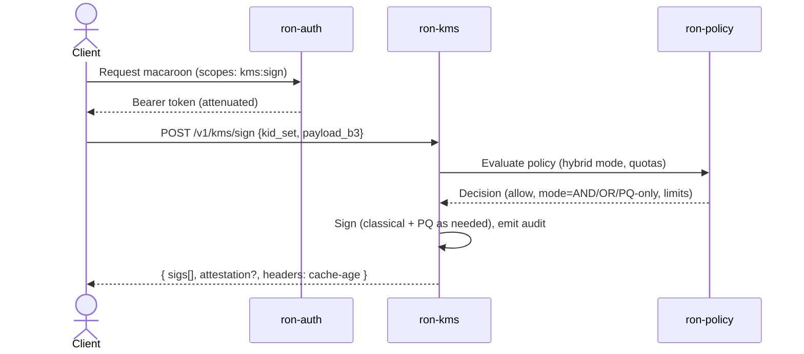

````markdown
---
title: ron-kms — Key Management Service (IDB)
version: 0.1.0
status: draft
last-updated: 2025-10-09
audience: contributors, ops, auditors
---

# ron-kms — Invariant-Driven Blueprint

`ron-kms` is RustyOnions’ custody and signing authority. It provides deterministic, auditable **sign/encrypt/wrap** primitives behind a narrow API; keeps private key material **non-exportable**; and integrates with policy/governance (signer sets, rotation) without leaking business logic into custody.

---

## 1. Invariants (MUST)

- **[I-1 Non-Exportability]** Private key material is **never** exported in plaintext. No API returns private keys; memory for secrets is **zeroized** on drop; disk persistence uses sealed/encumbered formats only.
- **[I-2 Deterministic Auditability]** Every key operation emits a **tamper-evident** audit record: `(op_id, tenant, key_id@version, alg, purpose, input_hash, ts, result, actor, attestation?)`, append-only, monotonic per key_id.
- **[I-3 Least Capability Surface]** All APIs require a **capability** with explicit scopes (`kms:sign`, `kms:unwrap`, `kms:rotate`, …) and rate limits. No ambient authority.
- **[I-4 Separation of Duties]** Custody (ron-kms) is distinct from **policy** (`ron-policy`) and **auth** (`ron-auth`). ron-kms **verifies** scopes; it does not make policy.
- **[I-5 Versioned Keys & Rotation]** Keys are identified as `kid = <tenant>/<purpose>/<alg>/<uuid>#vN`. New versions **do not** invalidate prior versions for verification; verify must support `(v_min … v_current)`.
- **[I-6 Anti-Rollback]** Key version metadata and audit chain include **monotonic counters** and checkpoint digests to detect rollback on store restoration.
- **[I-7 PQ-Readiness (Hybrid)]** Supports **hybrid suites** for sign/KEM (e.g., Ed25519+ML-DSA / X25519+ML-KEM). A key set may require `k_classical + k_pq` to satisfy policy; verify must succeed if policy conditions are met (OR/AND/PQ-only).
- **[I-8 Side-Channel Hygiene]** Constant-time comparisons for MAC/signature checks; no branch on secret; disable variable-time debug/formatting of secret material; memory locking when available.
- **[I-9 Backend Isolation]** Tenants and keyspaces remain isolated across backends (in-mem, file, HSM/TPM/Yubi/cloud). One tenant cannot observe another’s usage patterns beyond allowed metrics.
- **[I-10 Time & Entropy Guarantees]** Signing that requires randomness uses a **CSPRNG** (OS `getrandom` + DRBG) with reseed intervals; time used in validity windows comes from a **trusted** source (monotonic for sequencing + UTC wall clock with NTP discipline).
- **[I-11 Availability vs Durability]** For Micronode **amnesia mode**, secrets live only in RAM (optional sealed root for session); for Macronode, durably sealed at rest with rotation & backup. Mode is explicit in config.
- **[I-12 Attestation Where Possible]** When hardware supports it, export **attestation** evidence binding key material to device/slot/firmware for each operation (or per session).
- **[I-13 Deny Unknown Fields]** All request DTOs use `deny_unknown_fields` and hard size limits (bytes, array lengths, path lengths).
- **[I-14 Idempotence on Mutations]** `create`, `rotate`, `destroy` are idempotent using client-supplied `op_id` (UUID) to avoid double effects.
- **[I-15 No Homegrown Crypto]** Only vetted primitives (workspace-pinned libs). Algorithms are centrally allow-listed.
- **[I-16 Observability Without Leakage]** Metrics/logs redact inputs and secret material; only **hashes** or lengths appear; correlation IDs never include user inputs.

**Resiliency extensions**

- **[I-17 Tenant Fairness & Isolation]** Per-tenant quotas & rate limits prevent cross-tenant DoS; accounting is independent (no shared unbounded queues).
- **[I-18 Verify Always-On]** Verify operations remain available under backend outage using cached public material and last-known key metadata (soft TTL), subject to policy.
- **[I-19 Degraded-Mode Clarity]** When backends degrade, sign returns explicit `503 StoreUnavailable` with `Retry-After`; verify advertises cache age in response metadata (no silent success).
- **[I-20 Multi-Backend Safety]** If multiple backends are configured, **no automatic fallback for signing** unless keys are provably identical (same KID, attestation class) and policy allows it; verify may consult multiple sources read-only.

---

### Threat Model (summary)

- Adversary can read/modify storage at rest ⇒ countered by [I-1], [I-2], [I-6], [I-11].  
- Adversary can replay or roll back metadata ⇒ [I-6] monotonic counters + signed checkpoints.  
- Adversary can flood sign path (DoS) ⇒ [P-6] backpressure + quotas; G-6 chaos drills.  
- Insider with limited scopes ⇒ [I-3] least capability + macaroon attenuation; [I-14] idempotent mutations.  
- Side-channels (timing/mem) ⇒ [I-8] constant-time ops, zeroization, page-lock where available.  
- PQ “harvest-now, decrypt-later” ⇒ [I-7] hybrid sign/KEM, policy-gated migration phases.

**Threat tags (STRIDE map):**
- **S**poofing → I-3 (least capability), I-12 (attestation), P-1 (narrow API)  
- **T**ampering → I-2 (audit chain), I-6 (anti-rollback), 3.6 (Merkle+checkpoints)  
- **R**epudiation → I-2 (op_id, actor), 3.7 (stable error envelope)  
- **I**nformation disclosure → I-1/I-16 (non-export + redaction), I-8 (side-channel)  
- **D**enial of service → I-17/I-19 (fairness/degraded clarity), P-6 (backpressure), G-10/G-11  
- **E**levation of privilege → I-3 (scoped macaroons), I-4 (sep. of duties), G-8 (policy interop)

**Assumed Trust Boundaries**
- OS kernel RNG (`getrandom`) and NTP discipline are trustworthy within configured skew tolerance (I-10).  
- Hardware root (HSM/TPM/PKCS#11 slot) enforces non-export and attestation semantics when used (I-1/I-12).  
- Reverse proxies do not terminate KMS auth; KMS validates capabilities end-to-end (I-3).  
- Storage medium may be compromised at rest; tamper-evidence is mandatory (I-2/I-6).

---

## 2. Design Principles (SHOULD)

- **[P-1 Narrow API First]** Expose **verbs** (sign/verify, wrap/unwrap, derive, rotate) not storage semantics. Keep custody headless with clear DTOs.
- **[P-2 Pluggable Backends]** Implement a minimal `KeyStore` & `Signer` trait with adapters: `inmem`, `file`, `pkcs11` (HSM/Yubi), `tpm`, `cloud`.
- **[P-3 Secure Defaults]** Default algs: Ed25519 + ML-DSA; X25519 + ML-KEM; AES-GCM or ChaCha20-Poly1305 with explicit **nonce strategy**.
- **[P-4 Root of Trust]** Keep an **offline root** or sealed root key used to wrap operational keys; rotation scripted/runbooked.
- **[P-5 Deterministic KDF Trees]** Use HKDF-based derivation trees for purpose-scoped subkeys (context labels mandatory).
- **[P-6 Backpressure before Degrade]** Under load, reject (`429`) before stretching latency of signing critical paths; publish `kms_reject_total{reason}`.
- **[P-7 First-class PQ]** Prefer hybrid sign until ecosystem fully PQ; expose **policy toggles** with staged rollouts/metrics.
- **[P-8 Reproducible Builds]** Embed build info; ship SBOM; gate releases on `cargo deny` + coverage + perf deltas.
- **[P-9 Ergonomics for SDKs]** Return verification **hints** (kid set, alg set) without leaking secret data; keep error taxonomy stable.

---

## 3. Implementation (HOW)

### 3.1 Public Surface (conceptual, REST canonical)
- `POST /v1/kms/keys` — create key (`tenant`, `purpose`, `alg`, `policy`).
- `POST /v1/kms/keys/{kid}/rotate` — new version; returns `kid#vN`.
- `POST /v1/kms/sign` — sign payload `{ kid | kid_set, payload_b3, alg? }` → `{ sigs[], attestation? }`.
- `POST /v1/kms/verify` — verify payload `{ payload_b3, sigs[], policy }` → `{ ok, details, cache_age_ms? }`.
- `POST /v1/kms/wrap` / `unwrap` — envelope key ops.
- `GET  /v1/kms/keys/{kid}` — public material (pubkey, alg, versions).
- **Auth**: Bearer macaroon with scopes: `kms:read`, `kms:sign`, `kms:rotate`, `kms:wrap`.
- **Transport:** **HTTP/JSON (canonical)**. gRPC optional and must mirror DTOs 1:1; **no gRPC-only fields**.

### 3.2 Traits (sketch)
```rust
pub trait KeyStore {
    fn create(&self, req: CreateReq) -> Result<KeyMeta>;
    fn rotate(&self, kid: Kid) -> Result<KeyMeta>;
    fn get(&self, kid: KidRef) -> Result<KeyMeta>;
    fn attest(&self, kid: KidRef) -> Result<Option<Attestation>>;
}

pub trait Signer {
    fn sign(&self, kid_or_set: KidSelector, msg: &[u8], policy: SignPolicy) -> Result<SignBundle>;
    fn verify(&self, msg: &[u8], bundle: &SignBundle, policy: VerifyPolicy) -> Result<VerifyReport>;
}
````

### 3.3 Algorithms (allow-list)

| Purpose | Classical                   | PQ                 | Hybrid Note                   |
| ------- | --------------------------- | ------------------ | ----------------------------- |
| Sign    | Ed25519                     | ML-DSA (Dilithium) | Modes: **OR / AND / PQ-only** |
| KEX     | X25519                      | ML-KEM (Kyber)     | Default: **Hybrid KEM**       |
| AEAD    | ChaCha20-Poly1305 / AES-GCM | —                  | Nonces: 96-bit, explicit      |

### 3.4 Key IDs & Trees

* `kid = <tenant>/<purpose>/<alg>/<uuid>#vN`
* Derivations: `HKDF(info = "ron-kms::<tenant>::<purpose>::<ctx>")`

### 3.5 Storage Backends (feature-gated)

* `inmem`: dev, amnesia=on; zeroize on shutdown.
* `file`: sealed blobs (age/scrypt + AEAD), fsync on mutate.
* `pkcs11`: slot/pin; uses object handles; no extract.
* `tpm`: NV index + sealed.
* `cloud`: KMS providers (wrap/unwrap only), local policy still enforced.

### 3.6 Audit Chain (tamper-evident)

* Append-only **audit store** with per-chunk **Merkle roots** and periodic **checkpoint records** signed by a KMS attestation key.
* **Restore detection:** On startup, recompute head roots and verify latest checkpoint; mismatch ⇒ refuse writes, expose `/readyz=false`, raise `kms_audit_integrity_failed_total`.

### 3.7 Error Envelope (stable)

```json
{
  "error": {
    "code": "NoCapability",
    "message": "scope 'kms:sign' required",
    "retryable": false,
    "hint": "attach macaroon with kms:sign",
    "ts": "2025-10-09T20:33:11Z",
    "request_id": "r-abc123"
  }
}
```

### 3.8 Metrics (canonical)

* `kms_ops_total{op,alg,result}` counter
* `kms_latency_seconds{op,alg}` histogram
* `kms_reject_total{reason}` counter
* `kms_keys_total{tenant,purpose,alg}` gauge
* `kms_attest_total{backend}` counter
* `kms_audit_integrity_failed_total` counter

### 3.9 Config (env-first; grouped)

**Core**

* `KMS_BIND`, `KMS_BACKEND`, `KMS_AMNESIA`, `KMS_MAX_PAYLOAD`, `KMS_ALLOWED_ALGS`

**Security & Policy**

* `KMS_ATTEST_REQUIRE`, `KMS_SIGN_RATE_LIMIT`, `KMS_TIME_SKEW_TOLERANCE_MS`

**Entropy/Time**

* `KMS_RNG_RESEED_INTERVAL_OPS`

**PQ Rollout**

* `KMS_PQ_PRODUCE_HYBRID`, `KMS_PQ_VERIFY_MODE` (`or|and|pq_only`), `KMS_PQ_ROLLOUT_PERCENT`

### 3.10 Security Mechanics

* Zeroization for secret buffers; page-lock where OS allows.
* Constant-time equality for tags/sigs.
* No logging of raw inputs; only `BLAKE3(payload)` and lengths.

### 3.11 PQ Migration Phases (policy-driven)

> For org-wide rollout details, see **PQ_MIGRATION.md**. This section summarizes KMS-local toggles and metrics only.

* **Phase 0 (Classical-only)**: `policy.hybrid_mode=off`. Metrics: `kms_ops_total{alg=ed25519|x25519}`.
* **Phase 1 (Hybrid-OR)**: accept `(classical OR pq)` for verify; sign produces both when `policy.produce_hybrid=true`.
* **Phase 2 (Hybrid-AND default)**: verify requires **both** sigs; sign emits both. Gate with rollout % by tenant/service.
* **Phase 3 (PQ-only)**: deprecate classical verify for new KIDs; legacy verify persists for defined grace period.

**Config knobs**

```
KMS_PQ_PRODUCE_HYBRID=true|false
KMS_PQ_VERIFY_MODE=or|and|pq_only
KMS_PQ_ROLLOUT_PERCENT=0..100
```

**Metrics to watch**: `kms_ops_total{alg=ml-dsa|ml-kem}`, `kms_reject_total{reason="pq_policy"}`.

### 3.12 Inter-crate Integration (sequence)



### 3.13 DX Quickstart (SDK touch)

```rust
// sign (hybrid by policy)
let token = obtain_macaroon("kms:sign")?;
let bundle = kms.sign(SignRequest{
    kid_or_set: KidSelector::Kid("tenant/audit/ed25519/<uuid>#v3".into()),
    payload_b3: blake3::hash(&payload).to_hex().to_string(),
    policy: None, // server policy applies
}, &token)?;
assert!(kms.verify(VerifyRequest{ payload_b3, sigs: bundle.sigs, policy: None })?.ok);
```

**Common pitfalls**

* Don’t send raw payloads; always send `payload_b3` (BLAKE3) of the canonical form.
* AEAD nonces must be unique per key/version; never reuse or derive from uncontrolled input.
* Hybrid modes add latency (PQ); watch `kms_latency_seconds{alg}` before flipping `KMS_PQ_VERIFY_MODE=pq_only`.
* Capabilities are attenuable; ensure the macaroon scope includes `kms:sign` for sign calls and `kms:verify` if enforced.

---

## 4. Acceptance Gates (PROOF)

* **[G-1 Unit/Prop Tests]**

  * Non-exportability: attempts to export keys fail with `403 ExportForbidden`.
  * Idempotence: duplicate `op_id` yields same result.
  * Verify backward compatibility across versions (v1..vN).

* **[G-2 Vectors & KATs]**

  * Canonical test vectors for sign/verify per alg; hybrid vectors (classical+PQ).
  * HKDF derivation vectors with fixed `info`/salt.

* **[G-3 Fuzz & Differential]**

  * Fuzz `verify(bundle)` and JSON parsers; differential verify across backends.

* **[G-4 Loom/Concurrency]**

  * Model rotate vs sign races; HEAD/version monotonicity preserved; no lock across `.await`.

* **[G-5 Perf & SLOs]**

  * p95 sign latency on dev profile: Ed25519 ≤ **1.0 ms**; ML-DSA ≤ **10 ms** (document machine).
  * Reject before queue if backlog > threshold; record `kms_reject_total{reason="backpressure"}`.

* **[G-6 Chaos/Failure Drills]**

  * Backend outage → verify still functions using cached pubkeys; sign returns `503 StoreUnavailable`.
  * Attestation unavailable → policy decides: `fail_open=false` should **block** sign.

* **[G-7 Audit Chain]**

  * Append-only proof: attempting rollback or hole insertion detected and alarmed; checkpoints verify end-to-end.

* **[G-8 Policy Interop]**

  * Policy toggles (hybrid AND/OR/PQ-only) exercised in integration with `ron-policy` & consumers (`svc-registry`, `ron-auth`).

* **[G-9 Supply Chain]**

  * `cargo deny` clean; SBOM published; pinned versions per workspace.

* **[G-10 Isolation/Fairness]**

  * Load tests show per-tenant throttling: a tenant at 10× normal load cannot push another tenant’s p95 sign > **2× baseline**.

* **[G-11 Verify-during-Outage]**

  * Simulated backend outage: verify succeeds via cached pubkeys for ≥ configured TTL; responses include `cache_age_ms`.

* **[G-12 Fallback Policy]**

  * With multi-backend config, sign attempts on non-authoritative backends are rejected unless `allow_sign_fallback=true` **and** attestation class matches; covered by contract tests.

* **[G-13 Restore Drill]**

  * Simulate rollback (delete last N audit records); service refuses write path, emits integrity alarm; verify remains available.

* **[G-14 Time Skew Property]**

  * With injected clock skew within `KMS_TIME_SKEW_TOLERANCE_MS`, signatures with validity windows verify; beyond it, requests fail with explicit skew errors and metrics increment.

* **[G-15 AEAD Nonce Uniqueness]**

  * Property/fuzz test proves AEAD nonce reuse is detected or prevented for the configured nonce strategy per `kid#vN`; violations trip a CI gate.

---

## 5. Anti-Scope (Forbidden)

* Exporting private keys in any form (plaintext, PEM, DER) — **forbidden**.
* Implementing novel cryptographic primitives in this crate.
* Embedding business authorization rules (lives in `ron-policy`/`ron-auth`).
* Storing capabilities/macaroons long-term.
* Using non-deterministic or time-varying contexts for KDF labels.
* Logging secret material or unbounded payloads.
* Accepting requests without explicit size/time limits.

---

## 6. References

* **Pillars & Spine:** 12 Pillars (Identity & Policy; Security), Six Concerns (SEC/RES/PERF/OBS/INT/DX).
* **Interop:** `ron-proto` DTOs for KMS requests/responses; vectors under `docs/vectors/`.
* **Security & Hardening:** project Hardening & Governance blueprints; Zeroization guidance.
* **PQ Standards:** NIST ML-DSA (Dilithium), ML-KEM (Kyber) references; hybrid migration notes.
* **Ops:** Runbooks for rotation, signer-set changes, attestation failures, amnesia mode.

**Glossary**

* **ML-DSA**: NIST post-quantum signature (Dilithium family).
* **ML-KEM**: NIST post-quantum KEM (Kyber family).
* **Macaroon**: bearer token with attenuation (caveats) for scoped capability.
* **Attestation**: cryptographic evidence binding a key to hardware/firmware identity.

```
