# Combined Markdown

_Source directory_: `crates/ron-kms/docs`  
_Files combined_: 12  
_Recursive_: 0

---

### Table of Contents

- API.MD
- CONCURRENCY.MD
- CONFIG.MD
- GOVERNANCE.MD
- IDB.md
- INTEROP.MD
- OBSERVABILITY.MD
- PERFORMANCE.MD
- QUANTUM.MD
- RUNBOOK.MD
- SECURITY.MD
- TESTS.MD

---

## API.MD
_File 1 of 12_


---

# 📖 API.md — ron-kms

---

title: API Surface & SemVer Reference
status: draft
msrv: 1.80.0
last-updated: 2025-10-09
audience: contributors, auditors, API consumers
-----------------------------------------------

# API.md

## 0. Purpose

This document captures the **public API surface** of `ron-kms`:

* Snapshot of exported Rust symbols (traits, types, modules) and **canonical HTTP surface**.
* SemVer discipline (what breaks vs. extends).
* Alignment with CHANGELOG.md (behavioral vs. surface changes).
* CI-enforceable via `cargo public-api` and semver gates.
* Acts as the “spec” for external consumers (services, SDKs, auditors).

---

## 1. Public API Surface

### 1.1 Rust surface (crate exports)

> Generated with:
>
> ```
> cargo public-api --simplified --deny-changes -p ron-kms
> ```

**Current intended surface** (developers: keep this in sync with `cargo public-api` output):

```text
pub mod api          // DTOs, errors, auth scopes, serde types
pub mod service      // server bootstrap & router wiring (feature "bin")
pub mod backend      // KeyStore/Signer traits + adapters (re-exports only)

pub use backend::{KeyStore, Signer, Attestation};
pub use api::{
  Kid, KidRef, KidSelector, Alg, KeyPurpose, SignPolicy, VerifyPolicy,
  SignRequest, SignResponse, VerifyRequest, VerifyResponse,
  WrapRequest, WrapResponse, UnwrapRequest, UnwrapResponse,
  CreateKeyRequest, KeyMaterialPublic, KeyMeta, RotateResponse,
  ErrorEnvelope, ErrorCode
};
```

**Traits** (semantic contracts):

```rust
pub trait KeyStore {
    fn create(&self, req: CreateKeyRequest) -> Result<KeyMeta, ErrorEnvelope>;
    fn rotate(&self, kid: Kid) -> Result<KeyMeta, ErrorEnvelope>;
    fn get(&self, kid: KidRef) -> Result<KeyMeta, ErrorEnvelope>;
    fn attest(&self, kid: KidRef) -> Result<Option<Attestation>, ErrorEnvelope>;
}

pub trait Signer {
    fn sign(
        &self,
        kid_or_set: KidSelector,
        msg: &[u8],
        policy: Option<SignPolicy>
    ) -> Result<SignResponse, ErrorEnvelope>;

    fn verify(
        &self,
        msg: &[u8],
        bundle: &SignResponse,
        policy: Option<VerifyPolicy>
    ) -> Result<VerifyResponse, ErrorEnvelope>;
}
```

> **Stability:** `backend::*` traits are **public** on purpose to allow adapters (`pkcs11`, `tpm`, `file`, `cloud`). We gate breaking edits with SemVer rules (§2).

---

### 1.2 Canonical HTTP API (service interface)

* **Base**: `/v1/kms`
* **Auth**: Bearer macaroon with scopes (`kms:read`, `kms:sign`, `kms:verify`, `kms:rotate`, `kms:wrap`)
* **Transport**: HTTP/JSON (canonical). gRPC (optional feature) mirrors DTOs 1:1 (no extra fields).

#### Endpoints

| Method | Path                 | Scope(s)      | Description                                                                   |
| -----: | -------------------- | ------------- | ----------------------------------------------------------------------------- |
|   POST | `/sign`              | `kms:sign`    | Sign payload (may emit hybrid sigs)                                           |
|   POST | `/verify`            | `kms:verify`* | Verify signatures (reads only; may succeed during backend outage using cache) |
|   POST | `/wrap`              | `kms:wrap`    | Wrap an ephemeral/data key (hybrid KEM)                                       |
|   POST | `/unwrap`            | `kms:unwrap`  | Unwrap a wrapped key                                                          |
|   POST | `/keys`              | `kms:rotate`  | Create a new key (returns `kid#v1`)                                           |
|   POST | `/keys/{kid}/rotate` | `kms:rotate`  | Create a new **version** for an existing key                                  |
|    GET | `/keys/{kid}`        | `kms:read`    | Get **public** material, algorithm, versions, attestation class               |

* `kms:verify` is recommended; if not provided, some deployments allow verify with `kms:read`—check policy.

---

## 2. Request/Response Schemas (canonical JSON)

> **General rules**: All DTOs use `deny_unknown_fields`. Sizes capped (e.g., body ≤ 1 MiB). Payloads are **not** sent raw; callers send `payload_b3 = BLAKE3(canonical_form)`.

### 2.1 Common types

```jsonc
// Kid = "<tenant>/<purpose>/<alg>/<uuid>#vN"
"kid": "core/audit/ed25519/0b2e...#v3"

// Key selector (exact kid or a set)
"kid_or_set": {
  "kid": "core/audit/ed25519/0b2e...#v3"
  // or
  // "kid_set": ["...#v3", "...#v2"]
}

// Algorithms
"alg": "ed25519" | "ml-dsa" | "x25519" | "ml-kem"

// Policies (server may ignore local fields and consult ron-policy)
"sign_policy": { "produce_hybrid": true }
"verify_policy": { "mode": "or|and|pq_only" }
```

### 2.2 POST `/sign`

**Request**

```json
{
  "kid_or_set": { "kid": "core/audit/ed25519/0b2e...#v3" },
  "payload_b3": "7f3c... (hex)",
  "policy": { "produce_hybrid": true },
  "op_id": "8f9a2c34-..." // idempotency (optional but strongly encouraged)
}
```

**Response**

```json
{
  "sigs": [
    { "alg": "ed25519", "signature_b64": "..." },
    { "alg": "ml-dsa",  "signature_b64": "..." } // present if hybrid
  ],
  "kid": "core/audit/ed25519/0b2e...#v3",
  "attestation": { "class": "pkcs11-yubihsm2", "evidence": "..." } // optional
}
```

**Errors** (ErrorEnvelope, §2.7): `NoCapability`, `NotFound`, `StoreUnavailable`, `AttestationMissing`, `Backpressure`, `BadRequest`.

### 2.3 POST `/verify`

**Request**

```json
{
  "payload_b3": "7f3c... (hex)",
  "sigs": [
    { "alg": "ed25519", "signature_b64": "..." },
    { "alg": "ml-dsa",  "signature_b64": "..." }
  ],
  "policy": { "mode": "and" }
}
```

**Response**

```json
{
  "ok": true,
  "details": {
    "checked": ["ed25519","ml-dsa"],
    "satisfied_mode": "and"
  },
  "cache_age_ms": 742 // present if using cached pubkeys
}
```

### 2.4 POST `/wrap` and `/unwrap`

**Wrap Request**

```json
{
  "kid": "core/kem/x25519/3c8b...#v2",
  "plaintext_key_b64": "...",      // small symmetric key to wrap (or use "size": 32 for KEM-generated)
  "kem_mode": "hybrid"              // default
}
```

**Wrap Response**

```json
{
  "wrapped_b64": "...",            // AEAD+KEM envelope
  "alg": "hybrid(x25519+ml-kem)",
  "kid": "core/kem/x25519/3c8b...#v2"
}
```

**Unwrap Request**

```json
{
  "kid": "core/kem/x25519/3c8b...#v2",
  "wrapped_b64": "..."
}
```

**Unwrap Response**

```json
{
  "plaintext_key_b64": "...",
  "alg": "hybrid(x25519+ml-kem)",
  "kid": "core/kem/x25519/3c8b...#v2"
}
```

### 2.5 POST `/keys` (create)

**Request**

```json
{
  "tenant": "core",
  "purpose": "audit",
  "alg": "ed25519",                 // or "ml-dsa", "hybrid" (implies dual tracks)
  "policy_hints": { "rotate_days": 30 } // opaque to KMS; forwarded to policy
}
```

**Response**

```json
{
  "kid": "core/audit/ed25519/bf1a...#v1",
  "public": { "alg": "ed25519", "pubkey_b64": "..." }
}
```

### 2.6 POST `/keys/{kid}/rotate`

**Response**

```json
{
  "kid": "core/audit/ed25519/bf1a...#v2",
  "previous": "core/audit/ed25519/bf1a...#v1"
}
```

### 2.7 GET `/keys/{kid}`

**Response**

```json
{
  "kid": "core/audit/ed25519/bf1a...#v3",
  "alg": "ed25519",
  "versions": ["#v1","#v2","#v3"],
  "public": { "pubkey_b64": "..." },
  "attestation_class": "pkcs11-yubihsm2" // optional
}
```

---

## 3. Error Envelope (stable)

All non-2xx responses use a **stable** envelope:

```json
{
  "error": {
    "code": "NoCapability" | "NotFound" | "BadRequest" | "StoreUnavailable" |
            "AttestationMissing" | "Backpressure" | "Timeout" | "Conflict" |
            "TooLarge" | "Unsupported" | "Internal",
    "message": "human-readable, redacted",
    "retryable": true,
    "hint": "attach macaroon with kms:sign",
    "ts": "2025-10-09T20:33:11Z",
    "request_id": "r-abc123"
  }
}
```

**Semantics**

* `StoreUnavailable` → sign path returns **503** + `Retry-After`.
* `AttestationMissing` (when required by config/policy) → **403**.
* `Backpressure` → **429**.
* `TooLarge` / `Unsupported` → **4xx**.
* `Internal` → **500** (rare; audited).

---

## 4. OpenAPI (excerpt)

> A full spec lives at `/docs/openapi/ron-kms.yaml`. This excerpt shows the canonical schemas/names.

```yaml
openapi: 3.0.3
info:
  title: ron-kms
  version: 1.0.0
servers:
  - url: /v1/kms
paths:
  /sign:
    post:
      operationId: sign
      security: [{ bearerAuth: [] }]
      requestBody:
        required: true
        content:
          application/json:
            schema: { $ref: "#/components/schemas/SignRequest" }
      responses:
        "200": { description: OK, content: { application/json: { schema: { $ref: "#/components/schemas/SignResponse" }}}}
        "429": { $ref: "#/components/responses/Backpressure" }
        "503": { $ref: "#/components/responses/StoreUnavailable" }
components:
  securitySchemes:
    bearerAuth:
      type: http
      scheme: bearer
  schemas:
    SignRequest:
      type: object
      additionalProperties: false
      required: [kid_or_set, payload_b3]
      properties:
        kid_or_set: { oneOf: [ { $ref: "#/components/schemas/Kid" }, { type: object, properties: { kid_set: { type: array, items: { $ref: "#/components/schemas/Kid" }}}}]}
        payload_b3: { type: string, pattern: "^[0-9a-f]+$" }
        policy: { $ref: "#/components/schemas/SignPolicy" }
        op_id: { type: string, format: uuid }
    SignResponse:
      type: object
      additionalProperties: false
      required: [sigs, kid]
      properties:
        sigs:
          type: array
          items:
            type: object
            required: [alg, signature_b64]
            properties:
              alg: { $ref: "#/components/schemas/Alg" }
              signature_b64: { type: string }
        kid: { $ref: "#/components/schemas/Kid" }
        attestation:
          type: object
          additionalProperties: true
    Alg:
      type: string
      enum: [ed25519, ml-dsa, x25519, ml-kem]
    Kid:
      type: string
      pattern: "^[^/]+/[^/]+/[^/]+/[a-f0-9-]+#v[0-9]+$"
  responses:
    Backpressure: { description: Queue full; retry later }
    StoreUnavailable: { description: Signing store unavailable; retry later }
```

---

## 5. SemVer Discipline

### 5.1 Additive (Minor / Non-Breaking)

* Adding **new** endpoints (e.g., `/attest`) or optional response fields.
* Adding algorithms to the **allow-list** while keeping default behavior unchanged.
* Adding enum variants when types are `#[non_exhaustive]`.
* Adding headers/metadata that clients can ignore.

### 5.2 Breaking (Major)

* Removing/renaming public Rust exports (`api::…`, `backend::…`), or changing trait method signatures.
* Changing endpoint paths, required fields, or error codes.
* Making previously `#[non_exhaustive]` enums exhaustive.
* Changing DTO field meaning or default behavior (e.g., changing default verify mode).

### 5.3 Patch-Level

* Doc fixes, log message tweaks, dependency bumps that don’t alter API.
* Performance improvements with identical inputs/outputs.
* Tightening validation **that already matched the documented contract**.

---

## 6. Stability Guarantees

* **MSRV**: `1.80.0`.
* **DTOs** use `deny_unknown_fields`; clients must not rely on unspecified behavior.
* **KID semantics**: verification remains **backward compatible across versions** (`v1..vN`).
* **Unsafe code**: forbidden unless justified and reviewed.
* **No internal types leak** (e.g., no `hyper::Request` in public APIs).
* **gRPC (optional)** mirrors JSON DTOs **1:1** (no gRPC-only fields).

---

## 7. Invariants (API-level)

* **Payloads** are identified by `payload_b3` (BLAKE3 hash of canonical form). Raw payloads are never transmitted to KMS.
* **Hybrid PQ**: verify modes `or|and|pq_only` are controlled by policy/config; server may include hints in responses but never leaks secrets.
* **Idempotent mutations** accept `op_id` and return the same result on replay.
* **Error envelope** shape is stable; codes are additive (new codes may appear but existing ones don’t change meaning).

---

## 8. Tooling

* `cargo public-api` → detects Rust surface diffs.
* `cargo semver-checks` (optional) → compile-time SemVer validation.
* `cargo doc` + doctests for examples.
* API snapshots stored in `docs/api-history/ron-kms/{version}.txt`.

**Makefile targets (suggested)**

```bash
make api-snapshot   # runs cargo public-api and writes docs/api-history/...
make api-verify     # runs public-api --deny-changes
```

---

## 9. CI & Gates

* PR pipeline runs:

  * `cargo public-api --deny-changes -p ron-kms`
  * (optional) `cargo semver-checks check -p ron-kms`
* Fail CI if any **breaking** changes are unacknowledged.
* Bot posts the symbol diff as a PR comment.
* If a surface diff exists, a **CHANGELOG.md** entry is **required** (CI enforces).

---

## 10. Acceptance Checklist (DoD)

* [ ] Current API snapshot generated & stored under `docs/api-history/`.
* [ ] SemVer review performed; if breaking, **major** bump planned and documented.
* [ ] CI gate passes (`cargo public-api`).
* [ ] CHANGELOG updated for any surface changes (endpoints/DTOs/errors).
* [ ] OpenAPI updated (`/docs/openapi/ron-kms.yaml`) and rendered.
* [ ] Examples/tests updated (SDK snippets).

---

## 11. History (notable shifts)

* **1.0.0**: Canonical `/v1/kms` surface established; hybrid PQ support with `verify_mode` and `produce_hybrid`; ErrorEnvelope stabilized.
* **1.1.0 (planned)**: Optional `/attest` read-only endpoint for device evidence export (non-breaking).
* **2.0.0 (reserved)**: Any change to trait signatures or endpoint compatibility (none planned).

---

### Appendix A — Error Codes (quick ref)

| Code                 | HTTP | Notes                                    |
| -------------------- | ---: | ---------------------------------------- |
| `NoCapability`       |  403 | Missing/insufficient scope               |
| `NotFound`           |  404 | Unknown KID/version                      |
| `BadRequest`         |  400 | DTO validation, size caps                |
| `StoreUnavailable`   |  503 | Backend/HSM down; includes `Retry-After` |
| `AttestationMissing` |  403 | Required attestation absent              |
| `Backpressure`       |  429 | Queue full / RPS limit                   |
| `Timeout`            |  504 | Backend op deadline exceeded             |
| `TooLarge`           |  413 | Body over limit                          |
| `Unsupported`        |  400 | Disallowed algorithm/mode                |
| `Conflict`           |  409 | Idempotency clash / rotate race          |
| `Internal`           |  500 | Unexpected; audited                      |

---

### Appendix B — Headers

* **Request**

  * `Authorization: Bearer <macaroon>`
  * `X-Corr-ID: <uuidv7>` (optional; server generates if absent)
* **Response**

  * `Retry-After: <seconds>` on `503`
  * `X-KMS-Cache-Age: <ms>` on verify via cache (duplicate of JSON `cache_age_ms`)

---

### Appendix C — gRPC Notes (optional feature)

* Service `ron.kms.v1.Kms` with RPCs: `Sign`, `Verify`, `Wrap`, `Unwrap`, `CreateKey`, `Rotate`, `GetKey`.
* Protos live under `proto/ron/kms/v1/`.
* Messages mirror JSON DTOs **field-for-field**. No gRPC-only fields allowed.

---

✅ With this API spec:

* External consumers know exactly which endpoints/DTOs to use (and **never** send raw payloads).
* Contributors have a CI-enforced snapshot to prevent accidental breakage.
* Auditors can compare implementation vs. this contract and the OpenAPI file for compliance.


---

## CONCURRENCY.MD
_File 2 of 12_


---

title: Concurrency Model — ron-kms
crate: ron-kms
owner: Stevan White
last-reviewed: 2025-10-09
status: draft
template_version: 1.1
msrv: 1.80.0
tokio: "1.x (pinned at workspace root)"
loom: "0.7+ (dev-only)"
lite_mode: "For small library crates: fill §§1,3,4,5,10,11 and mark others N/A"
-------------------------------------------------------------------------------

# Concurrency Model — ron-kms

This document makes the concurrency rules **explicit**: tasks, channels, locks, shutdown, timeouts,
and validation (property/loom/TLA+). It complements `docs/SECURITY.md`, `docs/CONFIG.md`,
and the crate’s `README.md` and `IDB.md`.

> **Golden rule:** never hold a lock across `.await` in supervisory or hot paths.

---

## 0) Lite Mode (for tiny lib crates)

N/A — `ron-kms` is a **service** with background tasks.

---

## 1) Invariants (MUST)

* **No lock across `.await`.** If unavoidable, split the critical section or clone a snapshot (`ArcSwap`/copy) before `.await`.
* **Single writer** per mutable resource (per-key version head, nonce tracker, attestation cache); readers use snapshots.
* **Bounded channels only** (mpsc/broadcast/watch) with explicit overflow policy and metrics.
* **Explicit timeouts** on all I/O and backend calls (HSM/TPM/PKCS#11, file I/O, cloud KMS).
* **Cooperative cancellation** at every `.await` via `select!` with shutdown.
* **Graceful shutdown**: stop intake, drain within deadline, abort stragglers and count them.
* **No blocking syscalls** on the async runtime; use `spawn_blocking` for PKCS#11/TPM calls that can block.
* **No task leaks**: every spawned task is either joined on shutdown or documented as detached with rationale.
* **Backpressure > buffering**: prefer rejecting (`Busy/429`) over growing queues.
* **Framing**: HTTP/JSON (& OAP/1 if enabled) is length-delimited with hard caps; handle split reads/writes.
* **Async Drop**: `Drop` must not block; provide async `close()/shutdown()` for resources.

---

## 2) Runtime Topology

**Runtime:** Tokio multi-threaded, enable I/O and time drivers.

**Primary tasks (supervised):**

* **HTTP Listener (Axum)** — accepts `/v1/kms/*` requests; applies limits/quota; fans out to worker queues.
* **Signer Pool (M workers)** — performs sign/unwrap/rotate against the active backend; emits audit records.
* **Verify Path (inline + cache)** — verifies using cached pubkeys/metadata; background refresh maintains cache TTL.
* **Audit Appender** — consumes `AuditEvent` mpsc; appends to tamper-evident log; signals checkpoint scheduler.
* **Audit Checkpointer (interval)** — every *N ops* or *T seconds*, writes a signed checkpoint; on failure flips readiness.
* **Attestation Refresher** — periodically (or on demand) renews attestation evidence; publishes into cache.
* **Backend Keeper** — keeps PKCS#11/TPM/cloud sessions live; reconnects with jittered backoff on error.
* **Config Watch** — subscribes to `ConfigUpdated` and atomically swaps `Arc<Config>` + revalidates backends.
* **Health/Metrics** — surfaces `/metrics`, `/healthz`, `/readyz` (often bundled into HTTP Listener with separate router).

**Supervision:** on panic, restart with **exponential backoff + jitter** (min 100ms, cap 5s, max 10 attempts per minute). Escalate to process exit if the Listener or Audit Appender flaps continuously.


**Text description:** Supervisor spawns Listener, Signer Pool, and auxiliary tasks. Listener feeds a bounded work queue to the pool; signer workers emit audit events to a bounded audit queue consumed by the appender, which triggers periodic checkpoints.

---

## 3) Channels & Backpressure

**Inventory (all bounded):**

| Name           | Kind      | Capacity | Producers → Consumers   | Backpressure Policy                   | Drop Semantics                                                                    |
| -------------- | --------- | -------: | ----------------------- | ------------------------------------- | --------------------------------------------------------------------------------- |
| `work_sign_tx` | mpsc      |      512 | N (HTTP) → M (signers)  | `try_send` else `Busy` (429)          | Caller sees `Busy`; metric `busy_rejections_total{queue="sign"}`                  |
| `audit_tx`     | mpsc      |     2048 | M (signers) → 1 (audit) | `send().await` with 200ms timeout     | On timeout, drop oldest **non-checkpoint** event; increment `audit_dropped_total` |
| `shutdown_rx`  | watch     |        1 | 1 → N                   | last-write wins                       | N/A                                                                               |
| `events_tx`    | broadcast |     1024 | 1 → N                   | drop oldest; count `bus_lagged_total` | Warn & count lagging subscribers                                                  |
| `config_rx`    | watch     |        1 | 1 → N                   | last-write wins                       | N/A                                                                               |

**Guidelines**

* Prefer **reject-new** on hot path (`work_sign_tx`) to keep p95 low.
* `audit_tx` prefers **bounded wait** then **drop oldest non-checkpoint** to preserve integrity anchors.
* Export gauges for queue depth; counters for drops per queue.

---

## 4) Locks & Shared State

**Allowed**

* Short-lived `Mutex/RwLock` for small metadata (e.g., **nonce tracker per `kid#vN`**); never hold across `.await`.
* Lock-free snapshots via **`ArcSwap`** for **KeyIndex** (KID→pubkey/version metadata) and **PolicyHints**.
* Per-connection/request state lives on the task; cross-task communication via channels only.

**Forbidden**

* Any lock held across `.await`.
* Nested locks without explicit **hierarchy**.

**Hierarchy (if absolutely needed)**

1. `nonce_tracker` (finest)
2. `keymeta_local` (per-key mutable bits)
3. `audit_state` (checkpoint counters)

> Acquire in ascending order; release before any `.await`.

---

## 5) Timeouts, Retries, Deadlines

* **HTTP I/O:** `read=5s`, `write=5s`, `idle=60s` (from CONFIG).
* **Sign/Unwrap to backend:** overall **deadline 2s**; retry **idempotent** ops only (e.g., verify) with backoff `50–100ms` → cap `1s`, max **2** tries.
* **Attestation refresh:** deadline **3s**; on failure, set degraded flag and surface in `/readyz`.
* **Audit append:** deadline **200ms** per batch; on breach, **drop oldest non-checkpoint** and count.
* **Checkpoint write:** deadline **1s**; if missed, flip readiness **false** and raise `kms_audit_integrity_failed_total`.

```mermaid
sequenceDiagram
  autonumber
  participant C as Client
  participant G as ron-kms
  C->>G: POST /sign (deadline=2s)
  alt queue full
    G-->>C: 429 Busy
  else signed
    G-->>C: 200 {sigs[], att?}
  end
  Note over G: Per-op deadline enforced; no queue growth beyond cap
```

---

## 6) Cancellation & Shutdown

* **Signal source:** `KernelEvent::Shutdown` or `wait_for_ctrl_c()`.
* **Propagation:** use `tokio::select! { _ = shutdown.changed() => ..., _ = task_future => ... }` in every loop.
* **Orderly drain:**

  1. Listener **stops intake** and returns `503 Retry-After`.
  2. Signer Pool **finishes in-flight** jobs (deadline `drain=3s`).
  3. Audit Appender **flushes** queue; Checkpointer writes final checkpoint (deadline `1s`).
* **Abort policy:** tasks exceeding drain deadline → `handle.abort()`; count `tasks_aborted_total{kind}`.


---

## 7) I/O & Framing

* **HTTP/JSON** (canonical). Body caps from CONFIG (`1 MiB`); decompression ratio cap `10x`.
* **OAP/1** (if enabled later): length-delimited frames; **max_frame=1 MiB**; streaming chunk = **64 KiB**; checksum verify on receipt.
* Always call `.shutdown().await` (TLS and TCP) on normal and error exits.

---

## 8) Error Taxonomy (Concurrency-Relevant)

| Error                | When                                  | Retry? | Metric                                | Notes                                    |
| -------------------- | ------------------------------------- | ------ | ------------------------------------- | ---------------------------------------- |
| `Busy`               | `work_sign_tx` full                   | Caller | `busy_rejections_total{queue="sign"}` | Prefer fast-fail to preserve latency     |
| `Timeout`            | Backend call exceeds deadline         | Maybe  | `io_timeouts_total{op}`               | Attach op (`sign`,`attest`,`checkpoint`) |
| `Canceled`           | Shutdown while awaiting               | No     | `tasks_canceled_total{kind}`          | Cooperative cancellation                 |
| `Lagging`            | broadcast overflow                    | No     | `bus_lagged_total`                    | Warn slow consumer                       |
| `DegradedAudit`      | Audit checkpoint missed               | No     | `kms_audit_integrity_failed_total`    | Flip `/readyz=false`                     |
| `VerifyCacheExpired` | Verify soft-TTL crossed during outage | Maybe  | `verify_cache_expired_total`          | Response includes `cache_age_ms`         |

---

## 9) Metrics (Concurrency Health)

* `queue_depth{queue}` gauge (`sign`,`audit`)
* `queue_dropped_total{queue}` counter
* `busy_rejections_total{queue}` counter
* `tasks_spawned_total{kind}` / `tasks_aborted_total{kind}` / `tasks_canceled_total{kind}`
* `io_timeouts_total{op}` (`sign`,`attest`,`checkpoint`)
* `backoff_retries_total{op}`
* `bus_lagged_total`
* `kms_audit_integrity_failed_total`
* `verify_cache_age_ms` gauge (optional export when degraded)

---

## 10) Validation Strategy

**Unit / Property**

* **Backpressure law:** for full `work_sign_tx`, `POST /sign` → `Busy/429` (never block).
* **Deadline law:** `sign()` must respect per-op deadline ≤ 2s (tunable) under induced delays.
* **Lock discipline:** CI lint + targeted tests ensure no lock is held across `.await`.

**Loom (dev-only)**

* **Rotate vs Sign race:** One writer (rotate) + many signers; assert version monotonicity and no torn read of `kid#vN`.
* **Shutdown reachability:** All workers observe shutdown; no missed notifications; no deadlocks.
* **Audit ordering:** For any interleaving, Merkle index is contiguous; `checkpoint` reflects all prior appends.

**Fuzz**

* **Frame/decoder fuzz** for any non-HTTP protocols enabled later (e.g., OAP/1).
* **JSON DTO fuzz** (size limits, deny-unknown-fields).

**Chaos**

* Kill signer workers under load → pool backfills; p95 remains within budget; `/readyz` unaffected.
* Induce backend outage → verify via cache passes ≤ TTL; sign returns 503 with `Retry-After`.

**(Optional) TLA+**

* Model `Sign/Rotate/Audit` state machine to prove:
  **Safety:** audit index strictly increases; version heads monotonic per KID.
  **Liveness:** drain completes under bounded failures.

---

## 11) Code Patterns (Copy-Paste)

**Spawn + cooperative shutdown (worker loop)**

```rust
let (shutdown_tx, mut shutdown_rx) = tokio::sync::watch::channel(false);
let (work_tx, mut work_rx) = tokio::sync::mpsc::channel(512);

let worker = tokio::spawn(async move {
  loop {
    tokio::select! {
      _ = shutdown_rx.changed() => break,
      some = work_rx.recv() => {
        let Some(job) = some else { break };
        // No lock across .await: compute snapshot first
        let snapshot = key_index.load(); // ArcSwap<...>
        if let Err(e) = sign_with(snapshot, job).await {
          tracing::warn!(error=%e, "sign job failed");
        }
      }
    }
  }
});
```

**Bounded mpsc with `try_send` (reject-new)**

```rust
match work_tx.try_send(job) {
  Ok(()) => {}
  Err(tokio::sync::mpsc::error::TrySendError::Full(_)) => {
    metrics::busy_rejections_total("sign").inc();
    return Err(Error::Busy);
  }
  Err(e) => return Err(Error::Queue(e.to_string())),
}
```

**Timeout wrapper for backend call**

```rust
let deadline = cfg.sign_deadline(); // derive from CONFIG
let res = tokio::time::timeout(deadline, backend.sign(kid, msg, policy)).await;
let sig = res.map_err(|_| Error::Timeout)??;
```

**Async Drop pattern (no blocking in `Drop`)**

```rust
pub struct BackendClient { inner: Option<Handle> }
impl BackendClient {
  pub async fn close(&mut self) -> anyhow::Result<()> {
    if let Some(h) = self.inner.take() { h.shutdown().await?; }
    Ok(())
  }
}
impl Drop for BackendClient {
  fn drop(&mut self) {
    if self.inner.is_some() {
      tracing::debug!("BackendClient dropped without close(); resources reclaimed best-effort");
    }
  }
}
```

**No lock across `.await`**

```rust
let next_nonce = {
  let mut guard = nonce_tracker.lock();      // short critical section
  guard.next_for(kid_version)                // compute
}; // guard dropped here
backend.aead_seal(kid_version, next_nonce, &pt).await; // now safe to await
```

---

## 12) Configuration Hooks (Quick Reference)

* `max_conns`, `read_timeout`, `write_timeout`, `idle_timeout`
* `work_sign` capacity (512), `audit` capacity (2048)
* `drain_deadline` (default 3s), `checkpoint_deadline` (1s)
* per-op deadlines (`sign`, `attest`, `wrap/unwrap`)
* retry/backoff window for idempotent ops (verify)
* verify cache TTL (degraded mode)

See `docs/CONFIG.md` for authoritative schema.

---

## 13) Known Trade-offs / Nonstrict Areas

* **Audit queue policy:** dropping **non-checkpoint** events under extreme pressure preserves integrity anchors at the cost of auxiliary detail. This is intentional.
* **Reject-new vs drop-oldest on `work_sign`:** we choose **reject-new** to preserve latency SLOs; callers can retry.
* **Attestation refresh cadence:** favor slightly aggressive refresh to keep degraded windows short, at the cost of extra backend calls.

---

## 14) Mermaid Diagrams (REQUIRED)

### 14.1 Task & Queue Topology

```mermaid
flowchart LR
  IN[HTTP Ingress] -->|mpsc:work_sign(512)| W1[Signer A]
  IN -->|mpsc:work_sign(512)| W2[Signer B]
  W1 -->|mpsc:audit(2048)| AUD[Audit Appender]
  W2 -->|mpsc:audit(2048)| AUD
  AUD -->|tick/ops| CKPT[Checkpoint Writer]
  subgraph Control
    SHUT[Shutdown watch] --> IN
    SHUT --> W1
    SHUT --> W2
    SHUT --> AUD
    SHUT --> CKPT
  end
```

**Text:** Ingress fans out to a bounded sign queue served by workers; workers emit audit events to a bounded audit queue; a checkpointer runs by ops/ticks. Shutdown watch notifies all tasks.

### 14.2 Shutdown Sequence

```mermaid
sequenceDiagram
  participant SUP as Supervisor
  participant L as Listener
  participant P as Signer Pool
  participant A as Audit
  SUP->>L: stop intake (503)
  SUP->>P: drain (≤3s)
  P-->>SUP: drained / or timeout
  SUP->>A: flush & checkpoint (≤1s)
  A-->>SUP: done / or timeout
  SUP->>P: abort stragglers
  SUP-->>SUP: /readyz=false if checkpoint failed
```



**Text:** Supervisor stops intake, drains workers, flushes audit, writes a final checkpoint, aborts stragglers if needed, and reflects readiness.

---

## 15) CI & Lints (Enforcement)

**Clippy (crate-level)**

* `-D warnings`
* `-W clippy::await_holding_lock` (treat as error)
* `-W clippy::needless_collect`
* `-W clippy::useless_async`

**GitHub Actions (suggested)**

```yaml
name: kms-concurrency-guardrails
on: [push, pull_request]
jobs:
  clippy:
    runs-on: ubuntu-latest
    steps:
      - uses: actions/checkout@v4
      - uses: dtolnay/rust-toolchain@stable
      - run: cargo clippy -p ron-kms -- -D warnings -W clippy::await_holding_lock

  loom:
    if: github.event_name == 'pull_request'
    runs-on: ubuntu-latest
    steps:
      - uses: actions/checkout@v4
      - uses: dtolnay/rust-toolchain@stable
      - run: RUSTFLAGS="--cfg loom" cargo test -p ron-kms --tests -- --ignored

  fuzz:
    runs-on: ubuntu-latest
    steps:
      - uses: actions/checkout@v4
      - uses: dtolnay/rust-toolchain@stable
      - run: cargo install cargo-fuzz
      - run: cargo fuzz build -p ron-kms
```

---

## 16) Schema Generation (Optional)

* Annotate channel declarations with attributes and generate `docs/_generated/concurrency.mdfrag` via `build.rs`, or
* Keep a `concurrency.rs` registry module and a golden test asserting doc ↔ code parity for channel names/caps.

---

## 17) Review & Maintenance

* **Review cadence:** every 90 days or on any change to tasks/channels/locks.
* **PR checklist:** update this doc + Loom/property tests whenever concurrency changes.
* Keep `owner`, `msrv`, and `last-reviewed` fresh.

---


---

## CONFIG.MD
_File 3 of 12_


---

title: Configuration — ron-kms
crate: ron-kms
owner: Stevan White
last-reviewed: 2025-10-09
status: draft
template_version: 1.0
---------------------

# Configuration — ron-kms

This document defines **all configuration** for `ron-kms`, including sources,
precedence, schema (types/defaults), validation, feature flags, live-reload behavior,
and security implications. It complements `README.md`, `docs/SECURITY.md`, and `IDB.md`.

> **Tiering:**
>
> * **Service crate:** all sections apply (network, readiness, observability, custody backends).
> * **Library adapters** (e.g., `ron-proto` DTOs) are out of scope here.

---

## 1) Sources & Precedence (Authoritative)

Configuration may come from multiple sources. **Precedence (highest wins):**

1. **Process flags** (CLI)
2. **Environment variables** (prefix: `RON_KMS_`)
3. **Config file** (e.g., `Config.toml` beside the binary or `--config`)
4. **Built-in defaults** (hard-coded)

> On reload, the effective config is recomputed under the same precedence.

**Supported file formats:** TOML (preferred), JSON (optional).
**Path resolution order for `--config` (if relative):** `./`, `$CWD`, crate dir.
**List parsing in ENV:** comma-delimited (e.g., `RON_KMS_ALLOWED_ALGS=ed25519,ml-dsa,x25519,ml-kem`).

---

## 2) Quickstart Examples

### 2.1 Minimal service start (Micronode/dev; amnesia + inmem)

```bash
RUST_LOG=info
RON_KMS_BIND_ADDR=127.0.0.1:7441
RON_KMS_METRICS_ADDR=127.0.0.1:0
RON_KMS_BACKEND=inmem
RON_KMS_AMNESIA=1
RON_KMS_PQ_PRODUCE_HYBRID=1
RON_KMS_PQ_VERIFY_MODE=or
RON_KMS_SIGN_RATE_LIMIT=200
cargo run -p ron-kms
```

### 2.2 Config file (TOML; Macronode/HSM + strict PQ)

```toml
# Config.toml
bind_addr     = "0.0.0.0:7441"
metrics_addr  = "127.0.0.1:0"
max_conns     = 2048
read_timeout  = "5s"
write_timeout = "5s"
idle_timeout  = "60s"

[service]
backend = "pkcs11"
amnesia = false
allowed_algs = ["ed25519","ml-dsa","x25519","ml-kem"]
allow_sign_fallback = false
multi_backends = ["pkcs11","file"]   # sign authority is first entry

[tls]
enabled = false

[limits]
max_body_bytes       = "1MiB"
decompress_ratio_cap = 10

[security]
attest_require = "required"          # never|if-available|required
sign_rate_limit_rps = 500
time_skew_tolerance_ms = 1000

[entropy_time]
rng_reseed_interval_ops = 200000

[pq]
produce_hybrid  = true
verify_mode     = "and"              # or|and|pq_only
rollout_percent = 100

[audit]
dir = "./kms-audit"
checkpoint_interval_ops = 5000
sealing = "attested"                 # software|attested
verify_cache_ttl_ms = 300000

[observability]
redact_level="hashes"                # none|lengths|hashes
log_inputs=false
correlation_id_mode="uuidv7"
emit_cache_age_metric=true

[backends.pkcs11]
module_path="/usr/lib/softhsm/libsofthsm2.so"
slot_label="RON-KMS"
pin_env="KMS_PKCS11_PIN_ENV"         # name of env var that stores the PIN

[backends.file]
dir="./kms-sealed"
kdf="scrypt"
aead="chacha20poly1305"
```

### 2.3 CLI flags (override file/env)

```bash
cargo run -p ron-kms -- \
  --bind 0.0.0.0:7441 \
  --metrics 127.0.0.1:0 \
  --backend pkcs11 \
  --allowed-algs ed25519,ml-dsa,x25519,ml-kem \
  --attest required \
  --pq-verify and \
  --pq-produce-hybrid \
  --audit-dir ./kms-audit
```

---

## 3) Schema (Typed, With Defaults)

> **Prefix convention:** All env vars begin with `RON_KMS_`.
> **Durations** accept `s`, `ms`, `m`, `h`. **Sizes** accept `B`, `KB`, `MB`, `MiB`.
> **Lists in ENV** use comma-delimited strings.

| Key / Env Var                                                              | Type     |                        Default | Description                               | Security Notes                            |                                   |                           |        |                        |
| -------------------------------------------------------------------------- | -------- | -----------------------------: | ----------------------------------------- | ----------------------------------------- | --------------------------------- | ------------------------- | ------ | ---------------------- |
| `bind_addr` / `RON_KMS_BIND_ADDR`                                          | socket   |                  `127.0.0.1:0` | Service bind address                      | Public binds require threat review        |                                   |                           |        |                        |
| `metrics_addr` / `RON_KMS_METRICS_ADDR`                                    | socket   |                  `127.0.0.1:0` | Prometheus endpoint bind                  | Prefer localhost; scrape via gateway      |                                   |                           |        |                        |
| `max_conns` / `RON_KMS_MAX_CONNS`                                          | u32      |                         `1024` | Max concurrent connections                | Prevents FD exhaustion                    |                                   |                           |        |                        |
| `read_timeout` / `RON_KMS_READ_TIMEOUT`                                    | duration |                           `5s` | Per-request read timeout                  | DoS mitigation                            |                                   |                           |        |                        |
| `write_timeout` / `RON_KMS_WRITE_TIMEOUT`                                  | duration |                           `5s` | Per-request write timeout                 | DoS mitigation                            |                                   |                           |        |                        |
| `idle_timeout` / `RON_KMS_IDLE_TIMEOUT`                                    | duration |                          `60s` | Keep-alive idle shutdown                  | Resource hygiene                          |                                   |                           |        |                        |
| `limits.max_body_bytes` / `RON_KMS_MAX_BODY_BYTES`                         | size     |                         `1MiB` | Request payload cap                       | Clients send BLAKE3 of canonical payloads |                                   |                           |        |                        |
| `limits.decompress_ratio_cap` / `RON_KMS_DECOMPRESS_RATIO_CAP`             | u32      |                           `10` | Max allowed decompression ratio           | Zip bomb guard                            |                                   |                           |        |                        |
| `tls.enabled` / `RON_KMS_TLS_ENABLED`                                      | bool     |                        `false` | Enable TLS                                | Use `tokio_rustls::rustls` only           |                                   |                           |        |                        |
| `tls.cert_path` / `RON_KMS_TLS_CERT_PATH`                                  | path     |                           `""` | PEM cert path                             | Secret on disk; perms 0600                |                                   |                           |        |                        |
| `tls.key_path` / `RON_KMS_TLS_KEY_PATH`                                    | path     |                           `""` | PEM key path                              | Zeroize in memory                         |                                   |                           |        |                        |
| `service.backend` / `RON_KMS_BACKEND`                                      | enum     |                         `file` | `inmem                                    | file                                      | pkcs11                            | tpm                       | cloud` | Non-exportable custody |
| `service.amnesia` / `RON_KMS_AMNESIA`                                      | bool     |                        `false` | RAM-only secrets mode                     | No persistent keys; Micronode=true        |                                   |                           |        |                        |
| `service.allowed_algs` / `RON_KMS_ALLOWED_ALGS`                            | list     | `ed25519,ml-dsa,x25519,ml-kem` | Allowed primitive list                    | No novel crypto                           |                                   |                           |        |                        |
| `service.allow_sign_fallback` / `RON_KMS_ALLOW_SIGN_FALLBACK`              | bool     |                        `false` | Permit sign fallback across backends      | Only if KID+attestation match             |                                   |                           |        |                        |
| `service.multi_backends` / `RON_KMS_MULTI_BACKENDS`                        | list     |                         `file` | Ordered read set; first is sign authority | Verify may consult all                    |                                   |                           |        |                        |
| `security.attest_require` / `RON_KMS_ATTEST_REQUIRE`                       | enum     |                 `if-available` | `never                                    | if-available                              | required`                         | Gate sign on attestation  |        |                        |
| `security.sign_rate_limit_rps` / `RON_KMS_SIGN_RATE_LIMIT`                 | u32      |                          `500` | RPS budget per instance                   | Prefer 429 over latency stretch           |                                   |                           |        |                        |
| `security.time_skew_tolerance_ms` / `RON_KMS_TIME_SKEW_TOLERANCE_MS`       | u32      |                         `2000` | Verify window tolerance                   | G-14 skew tests                           |                                   |                           |        |                        |
| `entropy_time.rng_reseed_interval_ops` / `RON_KMS_RNG_RESEED_INTERVAL_OPS` | u64      |                       `100000` | DRBG reseed cadence                       | Pulls from OS RNG                         |                                   |                           |        |                        |
| `pq.produce_hybrid` / `RON_KMS_PQ_PRODUCE_HYBRID`                          | bool     |                         `true` | Emit classical+PQ signatures              | PQ migration                              |                                   |                           |        |                        |
| `pq.verify_mode` / `RON_KMS_PQ_VERIFY_MODE`                                | enum     |                          `and` | `or                                       | and                                       | pq_only`                          | Interop/migration gates   |        |                        |
| `pq.rollout_percent` / `RON_KMS_PQ_ROLLOUT_PERCENT`                        | u8       |                          `100` | Progressive enablement                    | Tenant/service gating upstream            |                                   |                           |        |                        |
| `audit.dir` / `RON_KMS_AUDIT_DIR`                                          | path     |                  `./kms-audit` | Append-only audit log directory           | Omit/ramfs in amnesia                     |                                   |                           |        |                        |
| `audit.checkpoint_interval_ops` / `RON_KMS_AUDIT_CHECKPOINT_INTERVAL`      | u32      |                         `5000` | Ops between checkpoints                   | Anti-rollback proofs                      |                                   |                           |        |                        |
| `audit.sealing` / `RON_KMS_AUDIT_SEALING`                                  | enum     |                     `software` | `software                                 | attested`                                 | Bind to device/slot when possible |                           |        |                        |
| `audit.verify_cache_ttl_ms` / `RON_KMS_VERIFY_CACHE_TTL_MS`                | u32      |                       `300000` | Verify soft-TTL for outages               | Response includes `cache_age_ms`          |                                   |                           |        |                        |
| `observability.redact_level` / `RON_KMS_REDACT_LEVEL`                      | enum     |                       `hashes` | `none                                     | lengths                                   | hashes`                           | Per I-16; prefer `hashes` |        |                        |
| `observability.log_inputs` / `RON_KMS_LOG_INPUTS`                          | bool     |                        `false` | Log raw inputs (forbidden in prod)        | Keep false                                |                                   |                           |        |                        |
| `observability.correlation_id_mode` / `RON_KMS_CORRELATION_ID_MODE`        | enum     |                       `uuidv7` | `uuidv4                                   | uuidv7`                                   | Never user-derived                |                           |        |                        |
| `observability.emit_cache_age_metric` / `RON_KMS_EMIT_CACHE_AGE_METRIC`    | bool     |                         `true` | Export metric during degraded verify      | No payload leakage                        |                                   |                           |        |                        |
| `backends.pkcs11.module_path` / `RON_KMS_PKCS11_MODULE_PATH`               | path     |                           `""` | PKCS#11 module                            |                                           |                                   |                           |        |                        |
| `backends.pkcs11.slot_label` / `RON_KMS_PKCS11_SLOT_LABEL`                 | string   |                      `RON-KMS` | Slot label                                |                                           |                                   |                           |        |                        |
| `backends.pkcs11.pin_env` / `RON_KMS_PKCS11_PIN_ENV`                       | string   |                           `""` | Name of ENV var that holds PIN            | Do not store PIN in files                 |                                   |                           |        |                        |
| `backends.file.dir` / `RON_KMS_FILE_DIR`                                   | path     |                 `./kms-sealed` | Sealed blobs directory                    | fsync on mutate                           |                                   |                           |        |                        |
| `backends.file.kdf` / `RON_KMS_FILE_KDF`                                   | enum     |                       `scrypt` | `scrypt                                   | age`                                      | Workspace-pinned                  |                           |        |                        |
| `backends.file.aead` / `RON_KMS_FILE_AEAD`                                 | enum     |             `chacha20poly1305` | `chacha20poly1305                         | aes-gcm`                                  | 96-bit nonce, explicit            |                           |        |                        |

---

## 4) Validation Rules (Fail-Closed)

On startup or reload, apply the following **strict validation**:

* `bind_addr`, `metrics_addr` parse to valid sockets; privileged ports require privileges.
* `max_conns` > 0, `limits.max_body_bytes` ≥ 1 KiB, `decompress_ratio_cap` ≥ 1.
* If `tls.enabled=true`: `cert_path`/`key_path` exist and are not world-readable.
* `service.backend` ∈ {inmem,file,pkcs11,tpm,cloud}.

  * If `pkcs11`: `module_path` must exist; `pin_env` must name an existing environment variable at runtime.
  * If `file`: `dir` must exist or be creatable; fsync on mutate must succeed.
* If `service.amnesia=true`: **no persistent keys** are allowed; `audit.dir` must be omitted or point to RAM (tmpfs/ramfs).
* `service.allowed_algs` must be a subset of the project allow-list.
* `security.attest_require=required` demands attestation material from the selected backend; otherwise **fail to start**.
* `pq.verify_mode` ∈ {or,and,pq_only}. If `pq_only`, ensure consumer services are compatible (interop gate).
* `audit.checkpoint_interval_ops` ≥ 1; `audit.sealing` ∈ {software,attested}.
* `observability.log_inputs=false` in production (enforced by deployment policy).

**On violation:** structured error → **exit non-zero** (service) or **return error** (libs/tools).

---

## 5) Dynamic Reload (If Supported)

* **How to trigger:** SIGHUP (preferred) or bus event `ConfigUpdated { version }`.
* **Reload semantics:** Non-disruptive for timeouts/limits/logging/PQ knobs.
  **Disruptive** for `bind_addr`, `tls.*`, `service.backend`, and PKCS#11 module changes (socket rebind / backend re-open).
* **Atomicity:** Compute a new config snapshot; swap an `Arc<Config>` without holding `.await`. In-flight ops continue on the old snapshot.
* **Audit:** Emit `KernelEvent::ConfigUpdated { version }` and a redacted diff (no secrets, no raw inputs).

---

## 6) CLI Flags (Canonical)

```
--config <path>                     # Load Config.toml (merged at low precedence)
--bind <ip:port>                    # bind_addr
--metrics <ip:port>                 # metrics_addr
--max-conns <num>
--read-timeout <dur>                # e.g., 5s, 250ms
--write-timeout <dur>
--idle-timeout <dur>
--backend <inmem|file|pkcs11|tpm|cloud>
--amnesia                           # amnesia=true
--allowed-algs <list>               # comma-delimited
--attest <never|if-available|required>
--pq-verify <or|and|pq_only>
--pq-produce-hybrid                 # toggles produce_hybrid=true
--pq-rollout <0..100>
--audit-dir <path>
--audit-checkpoint-ops <num>
--audit-sealing <software|attested>
--verify-cache-ttl <ms>
--allow-sign-fallback
--multi-backends <list>             # comma-delimited; first is sign authority
--log-format <json|text>
--log-level <trace|debug|info|warn|error>
```

---

## 7) Feature Flags (Cargo)

| Feature  |        Default | Effect                                                |
| -------- | -------------: | ----------------------------------------------------- |
| `tls`    |            off | Enables tokio-rustls TLS listener path and TLS keys   |
| `pq`     |            off | Enables PQ hybrid primitives and related config gates |
| `pkcs11` |            off | Enables PKCS#11 backend adapter                       |
| `tpm`    |            off | Enables TPM backend adapter                           |
| `cloud`  |            off | Enables cloud wrap/unwrap adapter                     |
| `cli`    | on (bins only) | Enables CLI parsing for flags above                   |

> Keep cross-crate consistency; document any feature that changes schema/behavior.

---

## 8) Security Implications

* **Public binds** (`0.0.0.0`) require timeouts/body caps/RPS limits.
* **TLS**: use `tokio_rustls::rustls::ServerConfig` only (never native-tls).
* **Attestation**: with `attest_require=required`, signing is **blocked** until attestation is present/valid.
* **Amnesia mode**: forbids persistent key storage; audit logs must be ephemeral if present at all.
* **Observability redaction**: `redact_level="hashes"` ensures only lengths/BLAKE3 digests appear; `log_inputs=false` in prod.
* **Multi-backend safety**: `allow_sign_fallback=false` by default; if enabled, fallback only when KID, version, and **attestation class** match.
* **Macaroons**: never log tokens; rotate ≤ 30 days; verification lives in `ron-auth`/`ron-policy` (no business logic here).

---

## 9) Compatibility & Migration

* Add new keys with safe defaults; avoid breaking changes.
* For renames, keep old env aliases ≥ 1 minor; warn when used.
* **PQ migration**: use `pq.verify_mode` (OR→AND→PQ-only) and `pq.produce_hybrid` to stage rollouts; watch `kms_reject_total{reason="pq_policy"}` and latency by alg.

**Deprecation table (maintained):**

| Old Key          | New Key                                            | Removal Target | Notes             |
| ---------------- | -------------------------------------------------- | -------------: | ----------------- |
| `pq.mode=hybrid` | `pq.verify_mode=or/and` + `pq.produce_hybrid=true` |         v1.1.0 | Split for clarity |

---

## 10) Reference Implementation (Rust)

> Minimal example for `Config` with env + file + CLI (serde).
> **Note:** This is illustrative and trimmed for brevity; actual code should add all subsections and `deny_unknown_fields`.

```rust
use std::{net::SocketAddr, path::PathBuf, time::Duration};
use serde::{Deserialize, Serialize};

#[derive(Debug, Clone, Serialize, Deserialize)]
#[serde(rename_all = "kebab-case", deny_unknown_fields)]
pub struct TlsCfg {
    pub enabled: bool,
    pub cert_path: Option<PathBuf>,
    pub key_path: Option<PathBuf>,
}

#[derive(Debug, Clone, Serialize, Deserialize)]
#[serde(deny_unknown_fields)]
pub struct Limits {
    #[serde(default = "default_body_bytes")]
    pub max_body_bytes: u64,
    #[serde(default = "default_decompress_ratio")]
    pub decompress_ratio_cap: u32,
}

#[derive(Debug, Clone, Serialize, Deserialize)]
#[serde(deny_unknown_fields)]
pub struct ServiceCfg {
    pub backend: String,                 // inmem|file|pkcs11|tpm|cloud
    #[serde(default)]
    pub amnesia: bool,
    #[serde(default = "default_allowed_algs")]
    pub allowed_algs: Vec<String>,
    #[serde(default)]
    pub allow_sign_fallback: bool,
    #[serde(default = "default_multi_backends")]
    pub multi_backends: Vec<String>,
}

#[derive(Debug, Clone, Serialize, Deserialize)]
#[serde(deny_unknown_fields)]
pub struct SecurityCfg {
    #[serde(default = "default_attest")]
    pub attest_require: String,          // never|if-available|required
    #[serde(default = "default_sign_rps")]
    pub sign_rate_limit_rps: u32,
    #[serde(default = "default_skew_ms")]
    pub time_skew_tolerance_ms: u32,
}

#[derive(Debug, Clone, Serialize, Deserialize)]
#[serde(deny_unknown_fields)]
pub struct EntropyTimeCfg {
    #[serde(default = "default_reseed_ops")]
    pub rng_reseed_interval_ops: u64,
}

#[derive(Debug, Clone, Serialize, Deserialize)]
#[serde(deny_unknown_fields)]
pub struct PqCfg {
    #[serde(default = "default_true")]
    pub produce_hybrid: bool,
    #[serde(default = "default_verify_mode")]
    pub verify_mode: String,             // or|and|pq_only
    #[serde(default = "default_rollout")]
    pub rollout_percent: u8,
}

#[derive(Debug, Clone, Serialize, Deserialize)]
#[serde(deny_unknown_fields)]
pub struct AuditCfg {
    pub dir: Option<PathBuf>,
    #[serde(default = "default_checkpoint_ops")]
    pub checkpoint_interval_ops: u32,
    #[serde(default = "default_sealing")]
    pub sealing: String,                 // software|attested
    #[serde(default = "default_verify_ttl")]
    pub verify_cache_ttl_ms: u32,
}

#[derive(Debug, Clone, Serialize, Deserialize)]
#[serde(deny_unknown_fields)]
pub struct ObservabilityCfg {
    #[serde(default = "default_redact")]
    pub redact_level: String,            // none|lengths|hashes
    #[serde(default)]
    pub log_inputs: bool,
    #[serde(default = "default_cid")]
    pub correlation_id_mode: String,     // uuidv4|uuidv7
    #[serde(default = "default_true")]
    pub emit_cache_age_metric: bool,
}

#[derive(Debug, Clone, Serialize, Deserialize)]
#[serde(deny_unknown_fields)]
pub struct Config {
    pub bind_addr: Option<SocketAddr>,
    pub metrics_addr: Option<SocketAddr>,
    #[serde(default = "default_max_conns")]
    pub max_conns: u32,
    #[serde(with = "humantime_serde", default = "d5s")]
    pub read_timeout: Duration,
    #[serde(with = "humantime_serde", default = "d5s")]
    pub write_timeout: Duration,
    #[serde(with = "humantime_serde", default = "d60s")]
    pub idle_timeout: Duration,
    #[serde(default)]
    pub tls: TlsCfg,
    #[serde(default)]
    pub limits: Limits,
    #[serde(default)]
    pub service: ServiceCfg,
    #[serde(default)]
    pub security: SecurityCfg,
    #[serde(default)]
    pub entropy_time: EntropyTimeCfg,
    #[serde(default)]
    pub pq: PqCfg,
    #[serde(default)]
    pub audit: AuditCfg,
    #[serde(default)]
    pub observability: ObservabilityCfg,
}

fn default_body_bytes() -> u64 { 1 * 1024 * 1024 }
fn default_decompress_ratio() -> u32 { 10 }
fn default_max_conns() -> u32 { 1024 }
fn d5s() -> Duration { Duration::from_secs(5) }
fn d60s() -> Duration { Duration::from_secs(60) }
fn default_allowed_algs() -> Vec<String> { vec!["ed25519","ml-dsa","x25519","ml-kem"].into_iter().map(String::from).collect() }
fn default_multi_backends() -> Vec<String> { vec!["file".into()] }
fn default_attest() -> String { "if-available".into() }
fn default_sign_rps() -> u32 { 500 }
fn default_skew_ms() -> u32 { 2000 }
fn default_reseed_ops() -> u64 { 100_000 }
fn default_true() -> bool { true }
fn default_verify_mode() -> String { "and".into() }
fn default_rollout() -> u8 { 100 }
fn default_checkpoint_ops() -> u32 { 5000 }
fn default_sealing() -> String { "software".into() }
fn default_verify_ttl() -> u32 { 300_000 }
fn default_redact() -> String { "hashes".into() }
fn default_cid() -> String { "uuidv7".into() }

impl Config {
    pub fn validate(&self) -> anyhow::Result<()> {
        use anyhow::bail;
        if self.max_conns == 0 { bail!("max_conns must be > 0"); }
        if self.limits.max_body_bytes < 1024 { bail!("limits.max_body_bytes too small"); }
        if self.limits.decompress_ratio_cap == 0 { bail!("limits.decompress_ratio_cap must be >= 1"); }
        match self.service.backend.as_str() {
            "inmem" | "file" | "pkcs11" | "tpm" | "cloud" => {}
            other => bail!("unsupported backend: {other}"),
        }
        if self.security.attest_require == "required" && self.service.backend == "pkcs11" {
            // Example check; real code must verify attestation availability.
        }
        if let Some(dir) = &self.audit.dir {
            if self.service.amnesia {
                // Strong warning: persistent audit dir + amnesia is contradictory.
                // Policy: either deny or allow RAM-backed paths only.
            }
            if self.audit.checkpoint_interval_ops == 0 { bail!("checkpoint_interval_ops must be >= 1"); }
        }
        Ok(())
    }
}
```

---

## 11) Test Matrix

| Scenario                               | Expected Outcome                                                                                     |
| -------------------------------------- | ---------------------------------------------------------------------------------------------------- |
| Missing `Config.toml`                  | Start with defaults; info log notes defaults used                                                    |
| Invalid `bind_addr`                    | Fail fast with explicit error                                                                        |
| TLS enabled but missing keys           | Fail fast                                                                                            |
| Body over `max_body_bytes`             | 413 Payload Too Large                                                                                |
| Ratio > `decompress_ratio_cap`         | 400 Bad Request + metric                                                                             |
| Amnesia=true with persistent backend   | Fail to start (conflict)                                                                             |
| PKCS#11 selected but `pin_env` missing | Fail to start                                                                                        |
| SIGHUP received                        | Non-disruptive reload for safe keys; disruptive ones rebind                                          |
| Backend outage                         | Verify works within `verify_cache_ttl_ms` and reports `cache_age_ms`; Sign returns 503 + Retry-After |
| PQ mode transitions                    | OR→AND→PQ-only staged without breaking consumers (gated by config)                                   |

---

## 12) Mermaid — Config Resolution Flow


---

## 13) Operational Notes

* Keep **prod config under version control** (private repo/secret store).
* For containers, prefer **env vars**; mount secrets read-only; PKCS#11 PIN via a dedicated env var (not in TOML).
* Document **default ports** and **firewall** rules with `bind_addr`.
* When enabling `allow_sign_fallback`, document the **attestation class** matching policy and run contract tests.
* Monitor golden metrics: `kms_ops_total`, `kms_latency_seconds`, `kms_reject_total{reason}`, `kms_audit_integrity_failed_total`, and cache-age during degraded verify.

---


---

## GOVERNANCE.MD
_File 4 of 12_


---

# 🏛 GOVERNANCE.md — ron-kms

---

title: Governance & Economic Integrity — ron-kms
status: draft
msrv: 1.80.0
last-updated: 2025-10-09
audience: contributors, ops, auditors, stakeholders
crate-type: policy
------------------

## 0. Purpose

`ron-kms` controls **key custody and authorization** for signing/verification and wrap/unwrap. This document defines the **rules of engagement** that bind its policy surface, authority boundaries, quorum, and audit posture.

It ensures:

* Transparent, immutable, and externally **auditable** control decisions.
* Enforcement of **economic-style invariants** adapted to KMS (bounded capability issuance, no out-of-band key material, no unbounded admin).
* **Clear roles & quorum** for sensitive actions (e.g., root rotation, PQ mode changes).
* SLA-backed commitments (revocation latency, audit durability, capability issuance fairness).

Ties into: Hardening (bounded authority/custody), Scaling/Observability (SLOs & alerts), QUANTUM (PQ rollout), Performance (drift gates), and Perfection Gates I/K/L/M.

---

## 1. Invariants (MUST)

* **[K-G1] No out-of-band keys.** All private keys originate from approved backends (HSM/TPM/sealed-file) under declared custody. No ad-hoc/imported secrets outside approved migration.
* **[K-G2] No sign without capability.** Every signing op requires a **capability token** (macaroon v1) with passing caveats (tenant/scope/alg/expiry/usage).
* **[K-G3] Bounded capability issuance.** Capability minting is scoped, time-boxed, and rate-limited per tenant; no unbounded “god tokens.”
* **[K-G4] Sensitive actions are **quorum-gated**.** Root rotation, backend change, PQ escalation (`pq_only`), global rollback require N-of-M multi-sig approval.
* **[K-G5] Immutable audit.** Every authority change and every sign/verify/wrap/unwrap result emits an append-only, signed audit record (local + `ron-audit`).
* **[K-G6] Attestation precedence.** If required by policy, **sign** is blocked while attestation readiness is failing; **verify** may continue per policy.
* **[K-G7] PQ governance safety.** PQ rollout follows Phase 0→3; default production mode is **hybrid-AND** unless a tenant-scoped exception is quorum-approved and audited.
* **[K-G8] Deny on ambiguity.** On conflicting policy/caveats, the service MUST refuse to sign and produce an auditable reject.

---

## 2. Roles & Authority

### Roles

* **Policy Owner (ron-policy):** Maintains global/tenant policy (caps, PQ phases, attestation). Proposes changes; cannot mint caps.
* **KMS Operator (ron-kms ops):** Operates service; executes policy-approved changes; cannot bypass quorum.
* **Custodian (HSM/TPM admin):** Manages backend modules/slots; cannot alter policy or mint caps.
* **Auditor (read-only):** Verifies logs/metrics/proofs; can mark disputes; cannot execute changes.
* **Incident Commander (IC):** Coordinates emergencies; still bound by quorum.
* **Release Manager:** Approves deploys; SBOM/signature compliance.

### Authority Boundaries

* Policy **proposes**; quorum-approved execution only for sensitive actions.
* Operators may tune runtime limits **within policy bounds** (e.g., ±20%); beyond requires proposal.
* Custodians cannot mint caps or change policy; backend swaps are quorum-gated and audited.
* No “break-glass” user without multi-sig; emergency freezes are quorum-gated and auto-expire.

---

## 3. Rules & SLAs

* **Revocation SLA:** Capability or key revocation enforced **≤ 5s** after acceptance (readyz true); corresponding metric/log entry **≤ 1s** after enforcement.
* **Audit availability:** Audit record for a successful sign is durable locally and exported to `ron-audit` **≤ 1s** after completion.
* **Capability ceilings:** Per-tenant active capabilities and mint rate are enforced; excess attempts rejected with explicit taxonomy.
* **Attestation SLO:** When required, `attestation_ready=true` **≥ 99.99%** of minutes; dips alarm and **freeze sign** until recovery.
* **PQ transition SLA:** Phase changes (OR→AND→PQ-only) occur inside a declared change window; **tenant rollback to OR in ≤ 60s** if rejects spike. Each proposal must attach CI links to **phase-transition property tests** and a **15-minute perf snapshot**.
* **Governance proposal SLA:** **Decision within 24h**; default reject if quorum not met.

---

## 4. Governance Process

* **Lifecycle:** *Draft → Review (policy+security) → Quorum sign → Execute → Post-audit*.

  * Proposals are signed objects: author, scope (global/tenant), rationale, changeset, risk, rollback, expiry, signer set, attachments (CI evidence).
  * Minimum quorum: **2-of-3** (default; environment-configurable).

* **Sensitive actions (quorum required):**
  Root key rotation; backend change (module/path/slot); production PQ escalation to `pq_only`; attestation policy from optional→required; disabling hybrid-AND in prod; enabling “amnesia off” in a profile that mandates amnesia.

* **Parameter changes (non-quorum within bounds):**
  Inflight caps, cache TTL/size, per-tenant cap mint rate **within ±20%** of policy baseline. Outside bounds → proposal.

### 4.x Quorum Cryptography (How)

* **Scheme:** Ed25519 threshold (Shamir-protected signing keys) aggregating an Ed25519 multi-signature envelope over a **canonical JSON** digest (SHA-256). Compatible with `ed25519-dalek`.
* **Threshold:** default **2-of-3** (policy owner, security officer, custodian).
* **Signer set rotation:** **Quarterly** or upon role change; rotations are quorum-approved proposals.
* **Artifacts:** Proposals carry `signatures[]` (role, key id, sig).
* **Verification:** `ron-kms` verifies threshold **before** executing any sensitive action.

### 4.y Operator Workflow (ronctl)

* Draft:
  `ronctl governance propose --scope tenant:ACME --change 'pq_mode=and' --rationale 'hybrid AND cutover' --expires 24h`
* Review: `ronctl governance show PROPOSAL_ID`
* Approve: `ronctl governance approve PROPOSAL_ID --role security-officer`
* Execute: `ronctl governance execute PROPOSAL_ID`
* Audit log: `ronctl governance log --since 7d`

---

## 5. Audit & Observability

* **Audit records** (append-only, signed): capability mint/revoke; policy changes; backends/rotations; sign/verify/wrap/unwrap outcomes (metadata only); emergency freeze/unfreeze; PQ phase changes.
* **Metrics (examples):**

  * `kms_governance_proposals_total{status}`
  * `kms_capabilities_active{tenant}` / `kms_capabilities_minted_total{tenant}`
  * `kms_capabilities_minted_fairness_skew{window}` *(gauge; top-QPS vs median)*
  * `kms_emergency_freezes_total`
  * `kms_attestation_ready_seconds_total{state}`
  * `kms_policy_rejects_total{reason}`
  * `kms_pq_phase{tenant,phase}` (gauge)
* **Verifiability:**

  * Custody proofs: attestation quotes or sealed-file attest artifacts linked to key IDs.
  * Capability proofs: macaroon verifiers + caveat transcripts.
  * Policy diffs: signed; hash-linked chain of custody.
* **Red-team drills (quarterly):**
  Rogue admin attempt (single-party override) must fail; capability replay must fail (nonce/expiry); attestation bypass must block sign.

---

## 6. Config & Custody

* **Config MUST declare:** active backend & slot, attestation policy, cap mint ceilings, PQ defaults & per-tenant exception policy, revocation webhooks/bus topics.
* **Custody rules:** keys reside in approved backends only; **no raw keys** in env/files; rotation **≥ every 90 days** or upon compromise; rotations emit KAT-verifiable continuity proofs (old→new linkage).

**Micronode / Edge Profiles**
For single-tenant, air-gapped micronodes, quorum may be temporarily reduced to **1-of-2** (owner, security officer) with stricter audit: freeze auto-expiry **30 min**, mandatory **weekly** rotation of the secondary signer device, and continuous export of audit logs off-box.

---

## 7. Appeal Path

* **Dispute flow:**

  1. Tenant/auditor files dispute on governance topic (cap ID, request IDs, policy refs).
  2. KMS marks disputed items (`disputed=true`) in audit; **no silent rollback** of completed signatures.
  3. Quorum-gated override proposal if remediation requires policy exception.
  4. Auditor review + published resolution.

* **Time goals:** acknowledge ≤ **1h**, triage ≤ **24h**, final decision ≤ **24h** (unless extended with rationale).

**Escalation & Deadlock Handling**
If quorum is **deadlocked > 24h** on a safety-neutral appeal, escalate to an **external auditor** signer (temporary 4th key) with a **48h time-lock**. Auditor may cast a **tie-break** signature limited to that proposal. All escalations are reported in governance reports and expire after the proposal closes.

---

## 8. Acceptance Checklist (DoD)

* [ ] Invariants [K-G1..K-G8] enforced in code & covered by tests.
* [ ] Roles & boundaries documented; no backdoors.
* [ ] Quorum flow implemented; signer set maintained & rotated.
* [ ] Audit/metrics exported; dashboards & alerts wired (attestation, freeze, rejects, fairness skew).
* [ ] SLAs (revocation, audit export) tested in CI/chaos; evidence attached to proposals.
* [ ] Appeal & escalation path validated (tabletop + red-team drill).

---

## 9. Appendix

### A. Blueprint Links

Hardening (bounded authority/custody), Scaling (readiness/shedding), QUANTUM (PQ phases), Perfection Gates: I (bounded issuance/custody), K (vigilance), L (black swan), M (appeals).

### B. Governance Objects (Schema Hints)

* **Proposal**
  `{ id, author, scope, rationale, changeset, risk, rollback, quorum, signer_set{members[], threshold, rotated_at}, signatures[], created_at, expires_at, attachments[] }`
* **Capability**
  `{ id, tenant, scope, caveats{alg, exp, rps, paths}, minted_at, expires_at, minted_by }`
* **Rotation**
  `{ key_id_old, key_id_new, backend, attestation, approved_by[], executed_at }`

### C. Thresholds (Defaults)

* Quorum: **2-of-3** signers (policy owner, security officer, custodian).
* Freeze auto-expiry: **60 min** (micronode: **30 min**).
* Revocation SLA: **≤ 5s**; Audit export: **≤ 1s**.

### D. History

* **2025-10-09**: Initial charter with quorum enforcement, PQ safeguards, attestation precedence, fairness metrics, and escalation/alerts.

---

## 10. Alerts (PromQL)

```yaml
groups:
- name: ron-kms.governance
  rules:
  - alert: KMS_Governance_Deadlock
    expr: increase(kms_governance_proposals_total{status="pending"}[24h]) > 0
    for: 24h
    labels: {severity: page}
    annotations:
      summary: "ron-kms: governance proposals pending >24h (potential quorum deadlock)"

  - alert: KMS_PQ_Policy_Rejects
    expr: increase(kms_policy_rejects_total{reason="pq_policy"}[10m]) > 0
    for: 10m
    labels: {severity: page}
    annotations:
      summary: "ron-kms: PQ policy rejects observed (Phase 0–2 tenants)"

  - alert: KMS_Capability_Fairness_Skew
    expr: kms_capabilities_minted_fairness_skew{window="1h"} > 3
    for: 30m
    labels: {severity: ticket}
    annotations:
      summary: "ron-kms: tenants skew >3× in capability minting (1h)"
```

---

**Operator note:** This charter complements `RUNBOOK.md`, `PERFORMANCE.md`, and `SECURITY.md`. Any action touching **quorum-gated** surfaces requires a signed proposal—even under emergency; use the **expedited freeze** (quorum-gated, auto-expiring) rather than ad-hoc overrides.


---

## IDB.md
_File 5 of 12_


````markdown
---
title: ron-kms — Key Management Service (IDB)
version: 0.1.0
status: draft
last-updated: 2025-10-09
audience: contributors, ops, auditors
---

# ron-kms — Invariant-Driven Blueprint

`ron-kms` is RustyOnions’ custody and signing authority. It provides deterministic, auditable **sign/encrypt/wrap** primitives behind a narrow API; keeps private key material **non-exportable**; and integrates with policy/governance (signer sets, rotation) without leaking business logic into custody.

---

## 1. Invariants (MUST)

- **[I-1 Non-Exportability]** Private key material is **never** exported in plaintext. No API returns private keys; memory for secrets is **zeroized** on drop; disk persistence uses sealed/encumbered formats only.
- **[I-2 Deterministic Auditability]** Every key operation emits a **tamper-evident** audit record: `(op_id, tenant, key_id@version, alg, purpose, input_hash, ts, result, actor, attestation?)`, append-only, monotonic per key_id.
- **[I-3 Least Capability Surface]** All APIs require a **capability** with explicit scopes (`kms:sign`, `kms:unwrap`, `kms:rotate`, …) and rate limits. No ambient authority.
- **[I-4 Separation of Duties]** Custody (ron-kms) is distinct from **policy** (`ron-policy`) and **auth** (`ron-auth`). ron-kms **verifies** scopes; it does not make policy.
- **[I-5 Versioned Keys & Rotation]** Keys are identified as `kid = <tenant>/<purpose>/<alg>/<uuid>#vN`. New versions **do not** invalidate prior versions for verification; verify must support `(v_min … v_current)`.
- **[I-6 Anti-Rollback]** Key version metadata and audit chain include **monotonic counters** and checkpoint digests to detect rollback on store restoration.
- **[I-7 PQ-Readiness (Hybrid)]** Supports **hybrid suites** for sign/KEM (e.g., Ed25519+ML-DSA / X25519+ML-KEM). A key set may require `k_classical + k_pq` to satisfy policy; verify must succeed if policy conditions are met (OR/AND/PQ-only).
- **[I-8 Side-Channel Hygiene]** Constant-time comparisons for MAC/signature checks; no branch on secret; disable variable-time debug/formatting of secret material; memory locking when available.
- **[I-9 Backend Isolation]** Tenants and keyspaces remain isolated across backends (in-mem, file, HSM/TPM/Yubi/cloud). One tenant cannot observe another’s usage patterns beyond allowed metrics.
- **[I-10 Time & Entropy Guarantees]** Signing that requires randomness uses a **CSPRNG** (OS `getrandom` + DRBG) with reseed intervals; time used in validity windows comes from a **trusted** source (monotonic for sequencing + UTC wall clock with NTP discipline).
- **[I-11 Availability vs Durability]** For Micronode **amnesia mode**, secrets live only in RAM (optional sealed root for session); for Macronode, durably sealed at rest with rotation & backup. Mode is explicit in config.
- **[I-12 Attestation Where Possible]** When hardware supports it, export **attestation** evidence binding key material to device/slot/firmware for each operation (or per session).
- **[I-13 Deny Unknown Fields]** All request DTOs use `deny_unknown_fields` and hard size limits (bytes, array lengths, path lengths).
- **[I-14 Idempotence on Mutations]** `create`, `rotate`, `destroy` are idempotent using client-supplied `op_id` (UUID) to avoid double effects.
- **[I-15 No Homegrown Crypto]** Only vetted primitives (workspace-pinned libs). Algorithms are centrally allow-listed.
- **[I-16 Observability Without Leakage]** Metrics/logs redact inputs and secret material; only **hashes** or lengths appear; correlation IDs never include user inputs.

**Resiliency extensions**

- **[I-17 Tenant Fairness & Isolation]** Per-tenant quotas & rate limits prevent cross-tenant DoS; accounting is independent (no shared unbounded queues).
- **[I-18 Verify Always-On]** Verify operations remain available under backend outage using cached public material and last-known key metadata (soft TTL), subject to policy.
- **[I-19 Degraded-Mode Clarity]** When backends degrade, sign returns explicit `503 StoreUnavailable` with `Retry-After`; verify advertises cache age in response metadata (no silent success).
- **[I-20 Multi-Backend Safety]** If multiple backends are configured, **no automatic fallback for signing** unless keys are provably identical (same KID, attestation class) and policy allows it; verify may consult multiple sources read-only.

---

### Threat Model (summary)

- Adversary can read/modify storage at rest ⇒ countered by [I-1], [I-2], [I-6], [I-11].  
- Adversary can replay or roll back metadata ⇒ [I-6] monotonic counters + signed checkpoints.  
- Adversary can flood sign path (DoS) ⇒ [P-6] backpressure + quotas; G-6 chaos drills.  
- Insider with limited scopes ⇒ [I-3] least capability + macaroon attenuation; [I-14] idempotent mutations.  
- Side-channels (timing/mem) ⇒ [I-8] constant-time ops, zeroization, page-lock where available.  
- PQ “harvest-now, decrypt-later” ⇒ [I-7] hybrid sign/KEM, policy-gated migration phases.

**Threat tags (STRIDE map):**
- **S**poofing → I-3 (least capability), I-12 (attestation), P-1 (narrow API)  
- **T**ampering → I-2 (audit chain), I-6 (anti-rollback), 3.6 (Merkle+checkpoints)  
- **R**epudiation → I-2 (op_id, actor), 3.7 (stable error envelope)  
- **I**nformation disclosure → I-1/I-16 (non-export + redaction), I-8 (side-channel)  
- **D**enial of service → I-17/I-19 (fairness/degraded clarity), P-6 (backpressure), G-10/G-11  
- **E**levation of privilege → I-3 (scoped macaroons), I-4 (sep. of duties), G-8 (policy interop)

**Assumed Trust Boundaries**
- OS kernel RNG (`getrandom`) and NTP discipline are trustworthy within configured skew tolerance (I-10).  
- Hardware root (HSM/TPM/PKCS#11 slot) enforces non-export and attestation semantics when used (I-1/I-12).  
- Reverse proxies do not terminate KMS auth; KMS validates capabilities end-to-end (I-3).  
- Storage medium may be compromised at rest; tamper-evidence is mandatory (I-2/I-6).

---

## 2. Design Principles (SHOULD)

- **[P-1 Narrow API First]** Expose **verbs** (sign/verify, wrap/unwrap, derive, rotate) not storage semantics. Keep custody headless with clear DTOs.
- **[P-2 Pluggable Backends]** Implement a minimal `KeyStore` & `Signer` trait with adapters: `inmem`, `file`, `pkcs11` (HSM/Yubi), `tpm`, `cloud`.
- **[P-3 Secure Defaults]** Default algs: Ed25519 + ML-DSA; X25519 + ML-KEM; AES-GCM or ChaCha20-Poly1305 with explicit **nonce strategy**.
- **[P-4 Root of Trust]** Keep an **offline root** or sealed root key used to wrap operational keys; rotation scripted/runbooked.
- **[P-5 Deterministic KDF Trees]** Use HKDF-based derivation trees for purpose-scoped subkeys (context labels mandatory).
- **[P-6 Backpressure before Degrade]** Under load, reject (`429`) before stretching latency of signing critical paths; publish `kms_reject_total{reason}`.
- **[P-7 First-class PQ]** Prefer hybrid sign until ecosystem fully PQ; expose **policy toggles** with staged rollouts/metrics.
- **[P-8 Reproducible Builds]** Embed build info; ship SBOM; gate releases on `cargo deny` + coverage + perf deltas.
- **[P-9 Ergonomics for SDKs]** Return verification **hints** (kid set, alg set) without leaking secret data; keep error taxonomy stable.

---

## 3. Implementation (HOW)

### 3.1 Public Surface (conceptual, REST canonical)
- `POST /v1/kms/keys` — create key (`tenant`, `purpose`, `alg`, `policy`).
- `POST /v1/kms/keys/{kid}/rotate` — new version; returns `kid#vN`.
- `POST /v1/kms/sign` — sign payload `{ kid | kid_set, payload_b3, alg? }` → `{ sigs[], attestation? }`.
- `POST /v1/kms/verify` — verify payload `{ payload_b3, sigs[], policy }` → `{ ok, details, cache_age_ms? }`.
- `POST /v1/kms/wrap` / `unwrap` — envelope key ops.
- `GET  /v1/kms/keys/{kid}` — public material (pubkey, alg, versions).
- **Auth**: Bearer macaroon with scopes: `kms:read`, `kms:sign`, `kms:rotate`, `kms:wrap`.
- **Transport:** **HTTP/JSON (canonical)**. gRPC optional and must mirror DTOs 1:1; **no gRPC-only fields**.

### 3.2 Traits (sketch)
```rust
pub trait KeyStore {
    fn create(&self, req: CreateReq) -> Result<KeyMeta>;
    fn rotate(&self, kid: Kid) -> Result<KeyMeta>;
    fn get(&self, kid: KidRef) -> Result<KeyMeta>;
    fn attest(&self, kid: KidRef) -> Result<Option<Attestation>>;
}

pub trait Signer {
    fn sign(&self, kid_or_set: KidSelector, msg: &[u8], policy: SignPolicy) -> Result<SignBundle>;
    fn verify(&self, msg: &[u8], bundle: &SignBundle, policy: VerifyPolicy) -> Result<VerifyReport>;
}
````

### 3.3 Algorithms (allow-list)

| Purpose | Classical                   | PQ                 | Hybrid Note                   |
| ------- | --------------------------- | ------------------ | ----------------------------- |
| Sign    | Ed25519                     | ML-DSA (Dilithium) | Modes: **OR / AND / PQ-only** |
| KEX     | X25519                      | ML-KEM (Kyber)     | Default: **Hybrid KEM**       |
| AEAD    | ChaCha20-Poly1305 / AES-GCM | —                  | Nonces: 96-bit, explicit      |

### 3.4 Key IDs & Trees

* `kid = <tenant>/<purpose>/<alg>/<uuid>#vN`
* Derivations: `HKDF(info = "ron-kms::<tenant>::<purpose>::<ctx>")`

### 3.5 Storage Backends (feature-gated)

* `inmem`: dev, amnesia=on; zeroize on shutdown.
* `file`: sealed blobs (age/scrypt + AEAD), fsync on mutate.
* `pkcs11`: slot/pin; uses object handles; no extract.
* `tpm`: NV index + sealed.
* `cloud`: KMS providers (wrap/unwrap only), local policy still enforced.

### 3.6 Audit Chain (tamper-evident)

* Append-only **audit store** with per-chunk **Merkle roots** and periodic **checkpoint records** signed by a KMS attestation key.
* **Restore detection:** On startup, recompute head roots and verify latest checkpoint; mismatch ⇒ refuse writes, expose `/readyz=false`, raise `kms_audit_integrity_failed_total`.

### 3.7 Error Envelope (stable)

```json
{
  "error": {
    "code": "NoCapability",
    "message": "scope 'kms:sign' required",
    "retryable": false,
    "hint": "attach macaroon with kms:sign",
    "ts": "2025-10-09T20:33:11Z",
    "request_id": "r-abc123"
  }
}
```

### 3.8 Metrics (canonical)

* `kms_ops_total{op,alg,result}` counter
* `kms_latency_seconds{op,alg}` histogram
* `kms_reject_total{reason}` counter
* `kms_keys_total{tenant,purpose,alg}` gauge
* `kms_attest_total{backend}` counter
* `kms_audit_integrity_failed_total` counter

### 3.9 Config (env-first; grouped)

**Core**

* `KMS_BIND`, `KMS_BACKEND`, `KMS_AMNESIA`, `KMS_MAX_PAYLOAD`, `KMS_ALLOWED_ALGS`

**Security & Policy**

* `KMS_ATTEST_REQUIRE`, `KMS_SIGN_RATE_LIMIT`, `KMS_TIME_SKEW_TOLERANCE_MS`

**Entropy/Time**

* `KMS_RNG_RESEED_INTERVAL_OPS`

**PQ Rollout**

* `KMS_PQ_PRODUCE_HYBRID`, `KMS_PQ_VERIFY_MODE` (`or|and|pq_only`), `KMS_PQ_ROLLOUT_PERCENT`

### 3.10 Security Mechanics

* Zeroization for secret buffers; page-lock where OS allows.
* Constant-time equality for tags/sigs.
* No logging of raw inputs; only `BLAKE3(payload)` and lengths.

### 3.11 PQ Migration Phases (policy-driven)

> For org-wide rollout details, see **PQ_MIGRATION.md**. This section summarizes KMS-local toggles and metrics only.

* **Phase 0 (Classical-only)**: `policy.hybrid_mode=off`. Metrics: `kms_ops_total{alg=ed25519|x25519}`.
* **Phase 1 (Hybrid-OR)**: accept `(classical OR pq)` for verify; sign produces both when `policy.produce_hybrid=true`.
* **Phase 2 (Hybrid-AND default)**: verify requires **both** sigs; sign emits both. Gate with rollout % by tenant/service.
* **Phase 3 (PQ-only)**: deprecate classical verify for new KIDs; legacy verify persists for defined grace period.

**Config knobs**

```
KMS_PQ_PRODUCE_HYBRID=true|false
KMS_PQ_VERIFY_MODE=or|and|pq_only
KMS_PQ_ROLLOUT_PERCENT=0..100
```

**Metrics to watch**: `kms_ops_total{alg=ml-dsa|ml-kem}`, `kms_reject_total{reason="pq_policy"}`.

### 3.12 Inter-crate Integration (sequence)


### 3.13 DX Quickstart (SDK touch)

```rust
// sign (hybrid by policy)
let token = obtain_macaroon("kms:sign")?;
let bundle = kms.sign(SignRequest{
    kid_or_set: KidSelector::Kid("tenant/audit/ed25519/<uuid>#v3".into()),
    payload_b3: blake3::hash(&payload).to_hex().to_string(),
    policy: None, // server policy applies
}, &token)?;
assert!(kms.verify(VerifyRequest{ payload_b3, sigs: bundle.sigs, policy: None })?.ok);
```

**Common pitfalls**

* Don’t send raw payloads; always send `payload_b3` (BLAKE3) of the canonical form.
* AEAD nonces must be unique per key/version; never reuse or derive from uncontrolled input.
* Hybrid modes add latency (PQ); watch `kms_latency_seconds{alg}` before flipping `KMS_PQ_VERIFY_MODE=pq_only`.
* Capabilities are attenuable; ensure the macaroon scope includes `kms:sign` for sign calls and `kms:verify` if enforced.

---

## 4. Acceptance Gates (PROOF)

* **[G-1 Unit/Prop Tests]**

  * Non-exportability: attempts to export keys fail with `403 ExportForbidden`.
  * Idempotence: duplicate `op_id` yields same result.
  * Verify backward compatibility across versions (v1..vN).

* **[G-2 Vectors & KATs]**

  * Canonical test vectors for sign/verify per alg; hybrid vectors (classical+PQ).
  * HKDF derivation vectors with fixed `info`/salt.

* **[G-3 Fuzz & Differential]**

  * Fuzz `verify(bundle)` and JSON parsers; differential verify across backends.

* **[G-4 Loom/Concurrency]**

  * Model rotate vs sign races; HEAD/version monotonicity preserved; no lock across `.await`.

* **[G-5 Perf & SLOs]**

  * p95 sign latency on dev profile: Ed25519 ≤ **1.0 ms**; ML-DSA ≤ **10 ms** (document machine).
  * Reject before queue if backlog > threshold; record `kms_reject_total{reason="backpressure"}`.

* **[G-6 Chaos/Failure Drills]**

  * Backend outage → verify still functions using cached pubkeys; sign returns `503 StoreUnavailable`.
  * Attestation unavailable → policy decides: `fail_open=false` should **block** sign.

* **[G-7 Audit Chain]**

  * Append-only proof: attempting rollback or hole insertion detected and alarmed; checkpoints verify end-to-end.

* **[G-8 Policy Interop]**

  * Policy toggles (hybrid AND/OR/PQ-only) exercised in integration with `ron-policy` & consumers (`svc-registry`, `ron-auth`).

* **[G-9 Supply Chain]**

  * `cargo deny` clean; SBOM published; pinned versions per workspace.

* **[G-10 Isolation/Fairness]**

  * Load tests show per-tenant throttling: a tenant at 10× normal load cannot push another tenant’s p95 sign > **2× baseline**.

* **[G-11 Verify-during-Outage]**

  * Simulated backend outage: verify succeeds via cached pubkeys for ≥ configured TTL; responses include `cache_age_ms`.

* **[G-12 Fallback Policy]**

  * With multi-backend config, sign attempts on non-authoritative backends are rejected unless `allow_sign_fallback=true` **and** attestation class matches; covered by contract tests.

* **[G-13 Restore Drill]**

  * Simulate rollback (delete last N audit records); service refuses write path, emits integrity alarm; verify remains available.

* **[G-14 Time Skew Property]**

  * With injected clock skew within `KMS_TIME_SKEW_TOLERANCE_MS`, signatures with validity windows verify; beyond it, requests fail with explicit skew errors and metrics increment.

* **[G-15 AEAD Nonce Uniqueness]**

  * Property/fuzz test proves AEAD nonce reuse is detected or prevented for the configured nonce strategy per `kid#vN`; violations trip a CI gate.

---

## 5. Anti-Scope (Forbidden)

* Exporting private keys in any form (plaintext, PEM, DER) — **forbidden**.
* Implementing novel cryptographic primitives in this crate.
* Embedding business authorization rules (lives in `ron-policy`/`ron-auth`).
* Storing capabilities/macaroons long-term.
* Using non-deterministic or time-varying contexts for KDF labels.
* Logging secret material or unbounded payloads.
* Accepting requests without explicit size/time limits.

---

## 6. References

* **Pillars & Spine:** 12 Pillars (Identity & Policy; Security), Six Concerns (SEC/RES/PERF/OBS/INT/DX).
* **Interop:** `ron-proto` DTOs for KMS requests/responses; vectors under `docs/vectors/`.
* **Security & Hardening:** project Hardening & Governance blueprints; Zeroization guidance.
* **PQ Standards:** NIST ML-DSA (Dilithium), ML-KEM (Kyber) references; hybrid migration notes.
* **Ops:** Runbooks for rotation, signer-set changes, attestation failures, amnesia mode.

**Glossary**

* **ML-DSA**: NIST post-quantum signature (Dilithium family).
* **ML-KEM**: NIST post-quantum KEM (Kyber family).
* **Macaroon**: bearer token with attenuation (caveats) for scoped capability.
* **Attestation**: cryptographic evidence binding a key to hardware/firmware identity.

```


---

## INTEROP.MD
_File 6 of 12_


---

# 🔗 INTEROP.md — ron-kms

*Audience: developers, auditors, external SDK authors*
*msrv: 1.80.0*

---

## 0) Purpose

Define the **interop surface** of `ron-kms`:

* **Wire protocols & endpoints:** HTTP/1.1 (+TLS) canonical; optional gRPC mirroring; OAP/1 framing (disabled by default).
* **DTOs & schemas:** strict JSON with `deny_unknown_fields`, size caps, canonical hashing.
* **Bus topics & events:** readiness, config, integrity, policy hints.
* **Canonical test vectors:** content hashing, sign/verify bundles (Ed25519, ML-DSA, Hybrid), KEM wrap/unwrap (X25519, ML-KEM, Hybrid).
* **Guarantees:** compatibility, SemVer, Omni-Gate alignment (GMI-1.6).

`ron-kms` is **custody-only**: it verifies **capability scopes** and enforces crypto invariants; **policy decisions** live in `ron-policy`.

---

## 1) Protocols & Endpoints

### 1.1 Ingress Protocols (canonical → optional)

| Protocol            | Status       | Notes                                                           |
| ------------------- | ------------ | --------------------------------------------------------------- |
| **HTTP/1.1 + TLS**  | **Required** | Axum/Hyper; JSON DTOs; canonical transport                      |
| gRPC (HTTP/2 + TLS) | Optional     | Messages mirror JSON 1:1 (no gRPC-only fields)                  |
| OAP/1 framed TCP    | Optional/Off | Length-delimited frames (see §1.4); for controlled fabrics only |

> TLS must use `tokio_rustls::rustls::ServerConfig`. Reverse proxies **must not** terminate capability verification — KMS validates tokens end-to-end.

### 1.2 Exposed Endpoints (HTTP base: `/v1/kms`)

| Method | Path                 | Scope(s)      | Description                                                  |
| -----: | -------------------- | ------------- | ------------------------------------------------------------ |
|   POST | `/sign`              | `kms:sign`    | Sign `payload_b3`; may emit **hybrid** (ed25519 + ML-DSA)    |
|   POST | `/verify`            | `kms:verify`* | Verify bundle; may succeed via cached pubkeys during outages |
|   POST | `/wrap`              | `kms:wrap`    | Wrap (AEAD+KEM); default **Hybrid KEM (X25519+ML-KEM)**      |
|   POST | `/unwrap`            | `kms:unwrap`  | Unwrap envelope                                              |
|   POST | `/keys`              | `kms:rotate`  | Create key; returns `kid#v1` + public                        |
|   POST | `/keys/{kid}/rotate` | `kms:rotate`  | New version for existing key                                 |
|    GET | `/keys/{kid}`        | `kms:read`    | Public material + versions (+ attestation class)             |

* Deployments may allow `/verify` with `kms:read`; default expects `kms:verify`.

### 1.3 Transport Invariants

* **Body caps:** request ≤ **1 MiB**; decompression ratio ≤ **10×**.
* **Correlation:** `X-Corr-ID` (UUIDv7) honored or generated; echoed in logs/spans.
* **No raw payloads:** callers send **`payload_b3 = BLAKE3(canonical_payload)`** hex (lowercase).
* **Strict parsing:** JSON DTOs `deny_unknown_fields`; bounded arrays; fixed enums/alg names.

### 1.4 OAP/1 (Optional Framed Transport)

> Disabled by default; only for private fabrics requiring non-HTTP framing.

| Field       | Type  | Description                                 |      |        |
| ----------- | ----- | ------------------------------------------- | ---- | ------ |
| `len`       | u32   | Remaining length (not incl. header)         |      |        |
| `ver`       | u8    | 1                                           |      |        |
| `flags`     | u16   | `REQ                                        | RESP | EVENT` |
| `tenant_id` | u128  | ULID/UUID; `0` if unused                    |      |        |
| `corr_id`   | u64   | Correlation (truncated/derived from UUIDv7) |      |        |
| `payload`   | bytes | JSON payload (optionally COMP)              |      |        |

**Limits:** `max_frame = 1 MiB`; streaming chunk = **64 KiB**; checksums validated when COMP is used.

---

## 2) DTOs / Schemas (canonical JSON)

### 2.1 Common Types

* **Key ID:** `kid = "<tenant>/<purpose>/<alg>/<uuid>#vN"`
* **Algorithms:** `ed25519 | ml-dsa | x25519 | ml-kem`
* **Policies:**

  * Sign: `{ "produce_hybrid": bool }`
  * Verify: `{ "mode": "or"|"and"|"pq_only" }`

> All DTOs enforce **`deny_unknown_fields`**, hard size/length caps, and fixed enums.

### 2.2 Sign / Verify

```jsonc
// POST /sign
{
  "kid_or_set": { "kid": "core/audit/ed25519/0b2e...#v3" },
  "payload_b3": "9f64a747... (hex)",       // BLAKE3(“hello world”)= 9f64a7…
  "policy": { "produce_hybrid": true },
  "op_id": "8f9a2c34-..."                  // idempotency (optional)
}
```

```jsonc
// 200 OK
{
  "sigs": [
    { "alg": "ed25519", "signature_b64": "..." },
    { "alg": "ml-dsa",  "signature_b64": "..." }   // if hybrid
  ],
  "kid": "core/audit/ed25519/0b2e...#v3",
  "attestation": { "class": "pkcs11-yubihsm2", "evidence": "..." } // optional
}
```

```jsonc
// POST /verify
{
  "payload_b3": "9f64a747...",
  "sigs": [
    { "alg": "ed25519", "signature_b64": "..." },
    { "alg": "ml-dsa",  "signature_b64": "..." }
  ],
  "policy": { "mode": "and" }
}
// 200 OK
{ "ok": true, "details": { "checked": ["ed25519","ml-dsa"], "satisfied_mode": "and" }, "cache_age_ms": 742 }
```

### 2.3 Wrap / Unwrap (Hybrid KEM default)

```jsonc
// POST /wrap
{
  "kid": "core/kem/x25519/3c8b...#v2",
  "plaintext_key_b64": "uMo9a...==",
  "kem_mode": "hybrid"
}
```

```jsonc
// POST /unwrap
{
  "kid": "core/kem/x25519/3c8b...#v2",
  "wrapped_b64": "Q2lwaGVyVGV4dA..."        // AEAD+KEM envelope
}
```

### 2.4 Keys (Create / Rotate / Get)

```jsonc
// POST /keys
{ "tenant":"core","purpose":"audit","alg":"ed25519","policy_hints":{"rotate_days":30} }
// 200 OK
{ "kid":"core/audit/ed25519/bf1a...#v1","public":{"alg":"ed25519","pubkey_b64":"..." } }
```

```jsonc
// POST /keys/{kid}/rotate
{ "kid":"core/audit/ed25519/bf1a...#v2","previous":"...#v1" }
```

```jsonc
// GET /keys/{kid}
{
  "kid":"core/audit/ed25519/bf1a...#v3",
  "alg":"ed25519",
  "versions":["#v1","#v2","#v3"],
  "public":{"pubkey_b64":"..."},
  "attestation_class":"pkcs11-yubihsm2"
}
```

---

## 3) Bus Topics

> Bus is optional; used for **state signaling** (config, readiness, integrity). No secret material is ever published.

### 3.1 Events Published

| Topic                    | Payload                                               | When                               |                                 |                                    |
| ------------------------ | ----------------------------------------------------- | ---------------------------------- | ------------------------------- | ---------------------------------- |
| `kms.health`             | `{ service:"ron-kms", ok:bool, reason?:string }`      | On liveness transitions            |                                 |                                    |
| `kms.ready`              | `{ ready:bool, missing:[string], degraded:[string] }` | Readiness flips / degraded clarity |                                 |                                    |
| `kms.audit.checkpoint`   | `{ head: "<hex>", index: u64, ok: bool }`             | After checkpoint attempt           |                                 |                                    |
| `kms.attestation.status` | `{ backend:"pkcs11                                    | tpm                                | ...", class?:string, ok:bool }` | Refresh cycle                      |
| `kms.config.updated`     | `{ version:u64 }`                                     | After config swap                  |                                 |                                    |
| `kms.policy.hint`        | `{ pq_mode:"or                                        | and                                | pq_only", rollout_percent:u8 }` | For dashboards (no decisions here) |

### 3.2 Events Subscribed

| Topic            | Action                               |
| ---------------- | ------------------------------------ |
| `config.updated` | Reload config snapshot (atomic swap) |
| `bus.shutdown`   | Begin graceful drain/abort sequence  |

> Policy **decisions** are not taken from bus; `ron-kms` calls `ron-policy` directly (in-process client or HTTP/gRPC) and caches hints.

---

## 4) Canonical Test Vectors

> Store these under `tests/vectors/kms/` and publish for SDK authors.

### 4.1 Content Hash (BLAKE3)

* Input (UTF-8): `"hello world"`
* `payload_b3` (hex, lowercase):
  `9f64a747e1...` (full 32 bytes hex; canonical reference in repo)

### 4.2 Ed25519 Sign/Verify

* **Public key (b64):** `...`
* **Signature (b64):** `...`
* **Verify:** `ok=true` with `policy.mode="or"` (or `and` if hybrid contains both).

*(Provide concrete byte strings in repo vectors; keep constants stable across releases.)*

### 4.3 ML-DSA (Dilithium) Sign/Verify

* **Parameters:** ML-DSA-2 (documented in vectors).
* **Signature (b64):** `...`
* **Verify:** `ok=true`.

### 4.4 Hybrid Sign Bundle

* `sigs = [{alg:"ed25519",...},{alg:"ml-dsa",...}]`
* **Verify (OR):** `ok=true` if either valid.
* **Verify (AND):** `ok=true` only if both valid.

### 4.5 X25519 / ML-KEM Wrap/Unwrap

* **Plaintext key (32B, b64):** `uMo9a...==`
* **Wrapped (b64):** `Q2lwaGVyVGV4dA...`
* **Unwrap → Plaintext** matches original.

> Each vector records: `kid#vN`, algs, signatures, envelope bytes, and expected results under `verify_mode ∈ {or,and,pq_only}`.

---

## 5) Error Taxonomy (wire level)

|    HTTP | Code               | When                                       | Notes                            |
| ------: | ------------------ | ------------------------------------------ | -------------------------------- |
|     400 | `BadRequest`       | DTO validation, size caps, bad alg         | `deny_unknown_fields`, hex check |
| 401/403 | `NoCapability`     | Missing/insufficient scope                 | Bearer macaroon                  |
|     404 | `NotFound`         | Unknown `kid` / version                    |                                  |
|     409 | `Conflict`         | Idempotent mutation collision; rotate race |                                  |
|     413 | `TooLarge`         | Body over cap                              |                                  |
|     429 | `Backpressure`     | Queue full / RPS limit                     | Prefer reject-new                |
|     500 | `Internal`         | Unexpected; audited                        |                                  |
|     503 | `StoreUnavailable` | Backend/attestation gate                   | Include `Retry-After`            |
|     504 | `Timeout`          | Backend op deadline                        |                                  |

**Envelope (stable):**

```json
{ "error": { "code":"Backpressure","message":"queue full","retryable":true,"ts":"...","request_id":"r-abc123" } }
```

---

## 6) Interop Guarantees

* **No Kernel Drift:** Transport surfaces (HTTP, optional gRPC) are versioned and frozen per SemVer.
* **SemVer Discipline:** Additive fields/endpoints are **minor**; any removal/requirement change is **major**.
* **Backward Compatibility:**

  * JSON: unknown fields **rejected** (security posture); **new optional** fields added only when clients can ignore them safely.
  * **KID verification** remains backward compatible across versions (`v1..vN`).
* **Auditability:** All vectors live in `tests/vectors/` with README and sha256 sums.
* **No secret leakage:** `kid` replaced by `kid_hash` in logs/events; payloads referenced via `payload_b3`.

---

## 7) References

* **Omni-Gate / Interop Blueprint (GMI-1.6):** `docs/Interop_Blueprint.md`
* **API Contract:** `docs/API.md`, `docs/openapi/ron-kms.yaml`
* **Observability:** `docs/OBSERVABILITY.md` (IDs, spans, metrics)
* **Security:** `docs/SECURITY.md` (threats, redaction, attestation)
* **Concurrency:** `docs/CONCURRENCY.md` (readiness & degraded semantics)

---

## 8) Quick Examples (for SDKs)

### 8.1 `curl` Sign (hybrid on)

```bash
curl -sS -H "Authorization: Bearer $MACAROON" \
  -H "X-Corr-ID: $(uuidgen)" \
  -H "Content-Type: application/json" \
  -d '{"kid_or_set":{"kid":"core/audit/ed25519/0b2e...#v3"},"payload_b3":"9f64a747...","policy":{"produce_hybrid":true}}' \
  https://kms.internal/v1/kms/sign
```

### 8.2 `curl` Verify (AND mode)

```bash
curl -sS -H "Authorization: Bearer $MACAROON" \
  -H "Content-Type: application/json" \
  -d '{"payload_b3":"9f64a747...","sigs":[{"alg":"ed25519","signature_b64":"..."},{"alg":"ml-dsa","signature_b64":"..."}],"policy":{"mode":"and"}}' \
  https://kms.internal/v1/kms/verify
```

### 8.3 gRPC (proto note)

* Service: `ron.kms.v1.Kms`
* RPCs: `Sign`, `Verify`, `Wrap`, `Unwrap`, `CreateKey`, `Rotate`, `GetKey`
* Messages mirror JSON fields exactly; **no** gRPC-only metadata.

---

## 9) Compatibility Matrix (policy & PQ)

| Client                    | `produce_hybrid` | `verify_mode` | Expected                |
| ------------------------- | ---------------: | ------------: | ----------------------- |
| Legacy (classical only)   |            false |          `or` | OK (classical sig only) |
| Hybrid-OR rollout         |             true |          `or` | OK if either sig valid  |
| Hybrid-AND (default prod) |             true |         `and` | Requires both sigs      |
| PQ-only                   |       true/false |     `pq_only` | Requires PQ sigs only   |

---

✅ With this interop contract, SDKs and peer services have **exact, testable** wire semantics for `ron-kms` — no drift, no surprises, fully aligned with Omni-Gate and your invariants.


---

## OBSERVABILITY.MD
_File 7 of 12_


---

# 📈 OBSERVABILITY.md — ron-kms

*Audience: developers, operators, auditors*
*msrv: 1.80.0 (Tokio/loom compatible)*

---

## 0) Purpose

Define **what is observable**, **how we expose it**, and **how it’s used** for:

* Metrics (Prometheus/OTEL)
* Health & readiness semantics
* Logs (JSON schema, fields, redaction)
* Tracing spans & correlation
* Alerts, SLOs, dashboards, and runbooks

`ron-kms` is a custody/signing service. Observability must never leak secrets and must make **tamper-evidence**, **attestation**, **hybrid PQ rollout**, and **degraded verify** status explicit.

---

## 1) Metrics (Prometheus-style)

### 1.1 Golden Metrics (service-common)

* `http_requests_total{route,method,status}` (Counter)
* `request_latency_seconds{route,method}` (Histogram)
* `inflight_requests{route}` (Gauge)
* `rejected_total{reason}` (Counter) — `unauth|backpressure|decompress_cap|ratio_cap|pq_policy|attest_missing|store_unavailable`
* `service_restarts_total` (Counter)
* `bus_lagged_total` (Counter) — broadcast backlog dropped

### 1.2 KMS-Specific Canon

**Ops & Latency**

* `kms_ops_total{op,alg,result}` (Counter)
  `op ∈ {sign,verify,wrap,unwrap,rotate,create,attest,checkpoint}`
  `alg ∈ {ed25519,ml-dsa,x25519,ml-kem,aead}`
  `result ∈ {ok,err}`

* `kms_latency_seconds{op,alg}` (Histogram)
  Histograms with SLA buckets:

  * `ed25519`: `[{0.0005,0.001,0.002,0.005,0.01,0.02}]`
  * `ml-dsa`: `[{0.002,0.005,0.01,0.02,0.05,0.1}]`
  * others sized accordingly.

**Audit & Integrity**

* `kms_audit_appends_total{result}` (Counter)
* `kms_audit_checkpoint_total{result}` (Counter)
* `kms_audit_integrity_failed_total` (Counter) — **zero** in healthy state
* `kms_audit_queue_depth` (Gauge)
* `kms_audit_dropped_total{kind}` (Counter) — `kind=non_checkpoint|other`

**Attestation & Backends**

* `kms_attest_total{backend,result}` (Counter)
* `kms_backend_sessions{backend,state}` (Gauge) — `state=connected|connecting|error`
* `kms_backend_reconnects_total{backend}` (Counter)

**Hybrid PQ & Policy**

* `kms_pq_mode{mode}` (Gauge 0/1) — `mode=or|and|pq_only`
* `kms_pq_rollout_percent` (Gauge)
* `kms_reject_total{reason="pq_policy"}` (Counter) *(alias of `rejected_total` for convenience)*

**Verify-during-Outage**

* `kms_verify_cache_age_ms` (Gauge) — sampled
* `kms_verify_cache_hits_total{hit}` (Counter) — `hit=true|false`

**Fairness & Backpressure**

* `queue_depth{queue}` (Gauge) — `queue=sign|audit`
* `queue_dropped_total{queue}` (Counter)
* `busy_rejections_total{queue}` (Counter)

**Keys & Versions**

* `kms_keys_total{tenant,purpose,alg}` (Gauge)
* `kms_key_version_head{kid}` (Gauge) — useful for per-key canaries

### 1.3 Registration Discipline

* All metrics **registered once** in `metrics::new()`.
* Metric handles cloned where needed.
* CI check: grep for duplicate `register_int_counter/…` calls.
* **Naming rule:** prefix KMS-specific metrics with `kms_`; avoid cardinality explosions (no raw UUIDs as labels; use `kid_hash=blake3_8` when necessary).

---

## 2) Health & Readiness

### 2.1 Endpoints

* `/healthz` — **liveness**; returns `200 OK` if process is alive.
* `/readyz` — **readiness**; returns `200 OK` only when all readiness keys are satisfied. Payload includes structured reasons.

### 2.2 Readiness Keys (must all be true)

* `config_loaded` — config parsed & validated; backends bound to config snapshot
* `listener_bound` — HTTP listener bound and accepting
* `backend_ready` — active custody backend reachable (PKCS#11/TPM/file/cloud)
* `attestation_ready` — attestation evidence present **if required** by config/policy
* `audit_ready` — audit appender writable; last checkpoint verified
* `checkpoint_recent` — last checkpoint time/ops within threshold
* `rng_ok` — OS RNG usable; reseed cadence healthy
* `clock_ok` — monotonic OK and UTC skew within tolerance
* `verify_cache_ok` — cache present and not beyond soft TTL (warn threshold does not flip readiness)

### 2.3 Failure Semantics

* **Fail-closed writes:** sign/rotate/wrap return **503** with `Retry-After` when `backend_ready=false` or `attestation_ready=false` (if required).
* **Fail-open reads (bounded):** verify can succeed with cached public material; response includes `cache_age_ms`; readiness remains **true** unless `checkpoint_recent=false` or cache beyond **hard** TTL.
* `/readyz` payload example:

```json
{
  "ready": false,
  "missing": ["attestation_ready", "checkpoint_recent"],
  "degraded": ["backend_ready"],
  "retry_after": 5,
  "snapshot": {
    "backend": "pkcs11",
    "pq_mode": "and",
    "audit_last_checkpoint_age_s": 42
  }
}
```

---

## 3) Logs

### 3.1 Format (JSON lines)

* `content-type: application/jsonl`
* One event per line; no multi-line fields.

**Required fields (every log):**

* `ts` — ISO8601 UTC
* `level` — `INFO|WARN|ERROR|DEBUG|TRACE`
* `service` — `"ron-kms"`
* `event` — terse semantic name (see catalog below)
* `corr_id` — UUIDv7
* `request_id` — stable per-request ID (HTTP request span)
* `peer_addr` — remote socket (when available)
* `tenant` — short string or hash
* `route` — e.g., `/v1/kms/sign`

**Operation fields (where applicable):**

* `op_id` — client-supplied UUID for idempotent mutations
* `kid` — **never raw**; emit `kid_hash` = `BLAKE3(kid)[:8]`
* `kid_version` — integer `vN`
* `alg` — e.g., `ed25519|ml-dsa|x25519|ml-kem`
* `result` — `ok|err`
* `latency_ms`
* `attestation_class` — when present
* `cache_age_ms` — for verify under degraded mode
* `reason` — aligns with `rejected_total{reason=…}`

**Event catalog (non-exhaustive):**

* `sign_request`, `sign_result`
* `verify_request`, `verify_result`
* `rotate_request`, `rotate_result`
* `audit_append`, `audit_checkpoint_ok`, `audit_checkpoint_failed`
* `attestation_refresh_ok`, `attestation_refresh_failed`
* `backend_session_up`, `backend_session_down`
* `readyz_false`, `readyz_true` (include `missing` keys)
* `config_updated` (redacted diff)

### 3.2 Redaction & Secrets

* **Never log raw payloads, caps, or private keys.**
* Represent payloads solely as `payload_b3` (hex) and **lengths**.
* Redact `kid` to `kid_hash`.
* Redact PKCS#11 pins/env vars entirely.
* Config diffs are **redacted** for secrets and large arrays.

**Example log (sign):**

```json
{"ts":"2025-10-09T20:30:22Z","level":"INFO","service":"ron-kms","event":"sign_result","corr_id":"018f3a6e-...","request_id":"r-abc123","tenant":"core","route":"/v1/kms/sign","kid_hash":"b3afc1d2","kid_version":3,"alg":"ed25519","result":"ok","latency_ms":0.9}
```

---

## 4) Tracing & Correlation

* Use `tracing` + `tracing-subscriber` JSON formatter; optional OTEL export behind `feature="otel"`.

**Span naming:**

* `svc.kms.http` (per-request root)
* `svc.kms.sign`, `svc.kms.verify`, `svc.kms.wrap`, `svc.kms.unwrap`, `svc.kms.rotate`
* `svc.kms.audit.append`, `svc.kms.audit.checkpoint`
* `svc.kms.attest.refresh`
* `backend.pkcs11.sign`, `backend.tpm.sign`, `backend.file.sign`, `backend.cloud.wrap`

**Span attributes (key ones):**

* `tenant`, `route`, `kid_hash`, `kid_version`, `alg`, `pq_mode`, `attestation_required`, `backend`
* `cache_age_ms` (verify)
* `result`, `error.kind` (on failure)

**Correlation IDs:**

* Ingress: `X-Corr-ID` honored or generated (UUIDv7).
* Propagate `corr_id` and `request_id` into all child spans and logs.
* For downstream calls (policy/backends), inject `corr_id` header if HTTP/gRPC; otherwise carry in span attributes.

---

## 5) Alerts & SLOs

### 5.1 SLOs (per environment; tune in prod)

* **Latency (sign):**

  * `ed25519` p95 ≤ **1.0 ms**
  * `ml-dsa` p95 ≤ **10 ms**
* **Availability:**

  * `/readyz` false **0** minutes monthly (error budget excludes planned maintenance windows)
* **Error rates:**

  * 5xx < **0.1%**
  * 429/`backpressure` < **1%** sustained
* **Audit integrity:** `kms_audit_integrity_failed_total` = **0**
* **Attestation:** if required-by-config, `attestation_ready=true` **99.99%** of minutes
* **Verify cache:** `kms_verify_cache_age_ms` ≤ **TTL**; misses tolerated during outage, but alert if stale > **2× TTL**

### 5.2 PromQL Alerts (examples)

**A. Audit Integrity Failure (Critical)**

```promql
increase(kms_audit_integrity_failed_total[5m]) > 0
```

**B. Readiness Flapping (Critical if sustained)**

```promql
max_over_time(kube_probe_ready{service="ron-kms"}[5m]) == 0
```

**C. Sign Latency SLO Violation (Warning/Critical)**

```promql
histogram_quantile(0.95, sum by (le) (rate(kms_latency_seconds_bucket{op="sign",alg="ed25519"}[5m]))) > 0.001
```

(Use `> 0.010` for `alg="ml-dsa"`)

**D. Backpressure Spike (Warning)**

```promql
increase(busy_rejections_total{queue="sign"}[1m]) > 50
```

**E. PKCS#11 Session Flap (Warning)**

```promql
increase(kms_backend_reconnects_total{backend="pkcs11"}[10m]) > 3
```

**F. Attestation Missing when Required (Critical)**

```promql
max_over_time(kms_attest_total{result="missing"}[2m]) > 0 and on() kube_probe_ready{service="ron-kms"} == 1
```

**G. Verify Cache Stale (Warning)**

```promql
avg_over_time(kms_verify_cache_age_ms[5m]) > (2 * on() kms_config_verify_cache_ttl_ms)
```

*(If you export TTL as a gauge; else hardcode milliseconds.)*

### 5.3 Runbooks (link from alerts)

* `RUNBOOK_audit_integrity.md`: verify storage, recompute head, force checkpoint, restore from trusted snapshot if needed.
* `RUNBOOK_attestation.md`: rotate or re-issue attestation; validate device/slot; confirm `attest_require`.
* `RUNBOOK_backpressure.md`: check incoming RPS, tenant quotas, queue depths; scale pool; confirm policy gating.
* `RUNBOOK_latency_pq.md`: inspect alg mix (hybrid), pool CPU, HSM load, PQ rollout percent; consider reverting to `verify_mode=or` temporarily.

---

## 6) CI / Enforcement

* **HTTP surface check:** Ensure `/metrics`, `/healthz`, `/readyz`, `/version` exist and return sane payloads in integration tests.
* **Metric presence tests:** prove `kms_ops_total`, `kms_latency_seconds`, `kms_audit_integrity_failed_total`, `busy_rejections_total`, and `rejected_total{reason}` are **emitted at least once** under a smoke scenario.
* **No duplicate registration:** grep or unit test `metrics::new()` registers exactly once.
* **Log schema test:** golden sample for `sign_result` with required fields; ensure **no raw payload** fields appear.
* **Tracing test:** span tree contains `svc.kms.http` → `svc.kms.sign` → `backend.*` with `corr_id` propagated.
* **Readiness contract test:** flip `attestation_ready=false` in a harness → `/readyz=false`, **writes 503**, **verify returns with `cache_age_ms`** when cached.
* **Redaction test:** config diff logs redact secrets (env/pins), and `kid` never appears raw (only `kid_hash`).

---

## 7) Dashboards (suggested panels)

1. **Service Overview**

   * Requests by route/status; p50/p95 latency; inflight
   * Rejections by reason; backpressure trend
2. **KMS Core**

   * `kms_ops_total` split by `op,alg,result`
   * `kms_latency_seconds` (overlay ed25519 vs ml-dsa)
   * Queue depths (`sign`, `audit`) + drops
3. **Audit/Integrity**

   * Appends/checkpoints; time since last checkpoint
   * Integrity failures (single-stat, red)
4. **Attestation & Backend**

   * Attest result rate
   * Backend sessions & reconnects (pkcs11/tpm/cloud)
5. **Degraded Verify**

   * Cache age distribution; cache hit ratio
   * `/readyz` timeline + degraded flags

---

## 8) OTEL Mapping (optional feature)

* Spans exported via OTLP/HTTP when `--features otel` enabled.
* Resource attributes: `service.name=ron-kms`, `service.version`, `deployment.environment`.
* Span attributes mirror log fields (`kid_hash`, `alg`, `pq_mode`, etc.); redact as in logs.
* Exemplars: attach span links to `kms_latency_seconds` histograms for p95 debugging.

---

## 9) Field Reference (cheat sheet)

| Name           | Type   | Example        | Notes                       |     |          |
| -------------- | ------ | -------------- | --------------------------- | --- | -------- |
| `corr_id`      | UUIDv7 | `018f3a6e-…`   | Ingress header or generated |     |          |
| `request_id`   | string | `r-abc123`     | Stable per request          |     |          |
| `op_id`        | UUID   | `f1d2-…`       | Idempotent mutations        |     |          |
| `kid_hash`     | hex8   | `b3afc1d2`     | `BLAKE3(kid)[:8]`           |     |          |
| `alg`          | enum   | `ed25519`      | Allow-list only             |     |          |
| `pq_mode`      | enum   | `and`          | `or                         | and | pq_only` |
| `cache_age_ms` | int    | `742`          | Verify degraded             |     |          |
| `reason`       | enum   | `backpressure` | Must match metrics label    |     |          |

---

## 10) Example `/metrics` excerpt (sanitized)

```
kms_ops_total{op="sign",alg="ed25519",result="ok"} 132942
kms_latency_seconds_sum{op="sign",alg="ed25519"} 92.1
kms_latency_seconds_count{op="sign",alg="ed25519"} 130000
kms_audit_integrity_failed_total 0
busy_rejections_total{queue="sign"} 4
kms_verify_cache_age_ms 238
rejected_total{reason="attest_missing"} 2
```

---

## 11) Governance

* This document is **reviewed every 90 days** or whenever telemetry names change.
* Any new metric or log field must follow **naming guidelines** and be accompanied by a dashboard/alert addition or an explicit rationale for omission.

---

✅ With this, `ron-kms` emits **actionable, leak-free** telemetry that proves custody safety (audit/attestation), preserves latency SLOs under PQ, and makes degraded states **explicit** for operators and auditors.


---

## PERFORMANCE.MD
_File 8 of 12_


---

# ⚡ PERFORMANCE.md — ron-kms

---

title: Performance & Scaling — ron-kms
status: draft
msrv: 1.80.0
crate_type: service
last-updated: 2025-10-09
audience: contributors, ops, perf testers
-----------------------------------------

## 0) Purpose

Define the **performance profile** for `ron-kms` (custody/sign/verify, wrap/unwrap, key lifecycle):

* SLOs for latency/availability/error budgets and attestation posture.
* Benchmarks & workloads (classical vs PQ/hybrid) with **explicit baselines**.
* Perf harness & profiling tools wired to CI (drift gates).
* Scaling knobs (semaphores, pools, verify cache, per-tenant fairness).
* Chaos & triage steps for realistic outages (HSM/TPM flap, PQ spikes, memory pressure).

Binds to canon: Scaling Blueprint, Six Concerns (PERF), Hardening defaults, Observability metrics, QUANTUM (PQ phases), CONFIG (env knobs).

---

## 1) SLOs / Targets

### 1.1 Latency (p95 steady state, non-saturated)

* **sign(Ed25519)**: ≤ **1.0 ms**
* **sign(ML-DSA/Dilithium3)**: ≤ **10 ms** (HSM/file backend profile noted in baseline table)
* **verify (cache-hit)**: ≤ **1.0 ms**
* **verify (cache-miss, classical)**: ≤ **5.0 ms**
* **wrap/unwrap (ML-KEM/Kyber)**: ≤ **6.0 ms** p95

> All targets measured intra-region on the documented baseline host; inter-region adds network RTT and is tracked separately in dashboards.

### 1.2 Availability & Error Budget

* **Availability**: `/readyz=true` ≥ 99.99% monthly (planned maintenance excluded).
* **Error budget**: 5xx < **0.1%**; backpressure 429/503 < **1%** over 5-min windows.
* **Audit integrity**: `kms_audit_integrity_failed_total == 0`.
* **Attestation posture** (when policy requires): `attestation_ready=true` ≥ 99.99%.

### 1.3 Resource Ceilings @ Target Load

* **CPU**: < **60%/core** median (headroom for PQ spikes).
* **Memory**: < **512 MiB** steady (service process; HSM external).
* **FDs**: < **30%** of system limit (bounded PKCS#11 sessions).
* **GC/allocs**: no per-op alloc regressions > **15%** vs baseline.

### 1.4 PQ / Hybrid Rollout SLO Hooks

* During rollout: `kms_reject_total{reason="pq_policy"} == 0` for tenants at Phase 0–2; violations must auto-rollback policy to `verify=or`.
* Verify cache **staleness alert**: `cache_age_ms > 2×TTL` (numerically enforced; see §6.4).

---

## 2. Benchmarks & Harness

### 2.1 Micro-bench (Criterion)

Hot paths & counters:

* `sign(ed25519)`, `sign(ml-dsa)`, `verify(hit/miss)`, `wrap`, `unwrap`, AEAD seal/open.
* Metrics: ops/sec, ns/op, allocations/op; heaptrack snapshots optional per PR.
* Distributions captured for p50/p95/p99 with run metadata (commit, toolchain, host).

### 2.2 Integration Load (HTTP + gRPC)

* Endpoints: `POST /v1/kms/{sign|verify|wrap|unwrap|keys|rotate}` and gRPC mirrors.
* Rigs: `bombardier`, `wrk`, `gwsmoke` suites; gRPC load via `ghz`.
* Mixes:

  * **Steady**: 70% sign, 20% verify, 10% wrap/unwrap.
  * **Burst**: 10× RPS for 60s every 5 min; ensure shed before work.
  * **Rotate flood**: simulate PQ migration spike (rotate QPS 10× for 5 min).
  * **Tenant isolation**: dual-tenant test (80/20 QPS) verifies fair-share caps.

### 2.3 Profiling

* `cargo flamegraph` (CPU hotspots: PKCS#11, PQ sig/KEM, AEAD, serde).
* `tokio-console` (stalls; pool contention).
* `perf` / `coz` for causal gains; `hyperfine` for one-shot API latency.

### 2.4 Chaos/Perf Blend

* HSM/TPM adapter latency injection & session flap.
* Slow-loris ingress; oversized/compress-bomb bodies (must reject pre-work).
* Network jitter & packet loss (tc netem) to model inter-region tails.

### 2.5 CI Integration

* Nightly perf pipeline runs all suites; baselines loaded from `testing/performance/baselines/ron-kms/*.json`.
* CI fails on drift gates (§5). Waivers require linked upstream issue + temporary baseline bump PR.

---

## 3. Scaling Knobs

* **Concurrency & Backpressure**

  * Global **semaphore caps** per op type with **per-tenant fair-share**:
    `KMS_MAX_INFLIGHT_SIGN`, `KMS_MAX_INFLIGHT_VERIFY`, `KMS_TENANT_SHARE_MIN` (e.g., 5% floor).
  * Early shed at ingress (429/503) before heavy work paths.

* **Backend Pools**

  * Bounded **PKCS#11/TPM session pools**; JIT acquisition; circuit-breakers on flap; exponential backoff with jitter.

* **Verify Cache**

  * Size & TTL: `KMS_VERIFY_CACHE_MAX`, `KMS_VERIFY_CACHE_TTL_MS`; LRU keyed by `kid#vN`.
  * Miss path p95 target ≤ 5 ms; **stale alert** at `2×TTL`.

* **PQ Policy**

  * `KMS_PQ_PRODUCE_HYBRID=true|false`
  * `KMS_PQ_VERIFY_MODE=or|and|pq_only`
  * `KMS_PQ_ROLLOUT_PERCENT=0..100` (per-tenant)

* **Ingress Hardening**

  * Timeouts, RPS caps, body cap **1 MiB**, decompression ratio ≤ **10×**.

* **Amnesia Mode**

  * RAM-only keys; ephemeral logs; verify cache allowed, memory-bounded.

---

## 4. Bottlenecks & Known Limits

* **PKCS#11/TPM latency & session churn**: tail-latency driver; mitigate with pooling, breaker, and fair scheduler.
* **PQ cryptography cost**: ML-DSA/KEM larger & slower; rollout phases must budget +CPU and +wire bytes.
* **Verify cache cold starts**: spike on rollout or mass rotate; watch `cache_miss_ratio`.
* **Noisy neighbors**: without per-tenant shares, a single tenant can starve others under burst—use fair-share caps.

Acceptable vs Must-fix:

* Acceptable (Bronze): brief p99 spikes during backend failover (<2 min).
* Must-fix: sustained `kms_reject_total{reason="pq_policy"}` > 0, verify cache staleness breaches, pool starvation, or 5xx > 0.1%.

---

## 5. Regression Gates (CI must fail if…)

* **Latency**: p95 `sign(ed25519)` ↑ > **10%**, `sign(ml-dsa)` ↑ > **15%**, `verify(hit)` ↑ > **10%** vs baseline.
* **Throughput**: `sign/sec` ↓ > **10%** at fixed error budget.
* **Resources**: CPU or memory ↑ > **15%** at target load.
* **Taxonomy**: sustained 5xx > **0.1%** or 429/503 > **1%** (without a matching burst test).
* **PQ**: increase in `kms_reject_total{reason="pq_policy"}` above baseline > **0** for Phase 0–2 tenants.
* **Fairness**: tenant P95 latency skew > **2×** between top-QPS and low-QPS tenants in fair-share suite.

Baselines in `testing/performance/baselines/ron-kms/`. Waivers require explicit PR with justification and time-boxed expiry.

---

## 6. Perf Runbook (Triage)

1. **Confirm the hotspot**

   * Flamegraph → PKCS#11 vs PQ crypto vs serde.
   * tokio-console → pool waits, blocked tasks.

2. **Read metrics**

   * `kms_latency_seconds{op,alg}`, `kms_ops_total{op,alg}`, `rejected_total{reason}`, `backend_reconnects_total`, `verify_cache_{hit,miss,stale}_total`.

3. **Isolate & toggle**

   * Switch `KMS_PQ_VERIFY_MODE=or` and/or lower `KMS_PQ_ROLLOUT_PERCENT` to separate PQ cost from infra issues.
   * Temporarily disable request decompression.

4. **Scale knobs**

   * Raise per-op semaphore by **10–20%**; enlarge verify cache **by 25%** (watch memory).
   * Adjust pool sizes cautiously; verify breaker isn’t open-flapping.

5. **Memory pressure drill**

   * Capture heap: run with `MALLOC_CONF`/jemalloc profiling or `heaptrack` for 2 minutes at load.
   * If cache growth drives RSS: lower `KMS_VERIFY_CACHE_MAX`, shorten TTL by **25%**, re-run.

6. **Staleness thresholds**

   * If `verify_cache_stale_max_ms > 2×TTL` (e.g., TTL=300_000 ms → alert at >600_000 ms), force cache sweep and drop items > TTL; re-warm via background verifies if enabled.

7. **Backend failover**

   * If HSM flap: reduce pool concurrency by **30%**, increase backoff jitter, and (policy permitting) fail over to sealed-file backend for **verify-only**; block sign if attestation required.

8. **Record outcome**

   * Append regression note to Appendix E (symptom, cause, fix, commit, baseline diffs).

---

## 7. Acceptance Checklist (DoD)

* [ ] Histograms wired: `kms_latency_seconds{op,alg}` (p50/p95/p99), cache hit/miss/stale counters.
* [ ] Baselines captured on documented host (see §8.A) for **classical** and **PQ**.
* [ ] Nightly perf CI compares against baselines; drift gates enforced.
* [ ] Tenant fair-share suite passing; skew ≤ 2× at p95.
* [ ] Chaos drills run: HSM flap, burst 10×, rotate flood, memory pressure.
* [ ] Runbook exercised once; artifacts (SVG flamegraph, tokio-console trace) attached to CI.

---

## 8. Appendix

### A) Documented Baseline Host & Toolchain

| Profile         | Host          |       vCPU/RAM | Toolchain              | HSM/Backend             |
| --------------- | ------------- | -------------: | ---------------------- | ----------------------- |
| **A (default)** | AWS m6i.large | 2 vCPU / 8 GiB | rustc 1.80.x, jemalloc | File-sealed (no HSM)    |
| **B (HSM)**     | AWS m6i.large |          2 / 8 | rustc 1.80.x           | PKCS#11 (YubiHSM-class) |

> All numbers below were last refreshed on the date in header.

### B) Reference Baselines (A — default)

| Operation               |     p50 |     p95 |     p99 | Throughput (ops/sec) |
| ----------------------- | ------: | ------: | ------: | -------------------: |
| sign(Ed25519)           | 0.35 ms | 0.85 ms |  1.6 ms |               11,500 |
| verify(hit)             | 0.20 ms | 0.70 ms |  1.2 ms |               18,000 |
| verify(miss, classical) | 0.90 ms |  3.6 ms |  6.8 ms |                7,800 |
| sign(ML-DSA)            |  4.4 ms |  9.2 ms | 14.8 ms |                1,800 |
| wrap(ML-KEM)            |  2.8 ms |  5.7 ms |  9.9 ms |                3,200 |

*(Illustrative placeholders until your first CI run writes real JSON baselines.)*

### C) PQ Hybrid Cost Deltas (A — default)

| Scenario                 | Δ p95 latency vs classical | Δ payload size |
| ------------------------ | -------------------------: | -------------: |
| **Hybrid-OR verify**     |                    +1.2 ms |       +1.1 KiB |
| **Hybrid-AND verify**    |                    +2.3 ms |       +1.1 KiB |
| **sign (hybrid bundle)** |                    +7.9 ms |       +1.1 KiB |

> Use these as sanity bands; CI will learn exact values per host.

### D) Workloads (explicit mixes)

* **Steady**: 70/20/10 sign/verify/wrap, 5m duration, RPS = target × 0.8.
* **Burst**: RPS = target × 8 for 60s every 5m, 30m duration.
* **Rotate flood**: rotate QPS = steady × 10 for 5m, then steady.
* **Tenant isolation**: Tenants A/B at 80/20 QPS; ensure p95 skew ≤ 2×.

### E) CI Wiring (commands)

```
cargo bench --profile perf
scripts/perf/run_http.sh --mix steady --duration 300
scripts/perf/run_grpc.sh --mix burst --burst-mult 10 --interval 300
scripts/perf/check_drift.py testing/performance/baselines/ron-kms/*.json target/perf/*.json
```

### F) History (regressions & fixes)

* *2025-10-09*: **Template init** — added baseline scaffolds; tenant fairness suite; PQ delta bands.
* *YYYY-MM-DD*: (add entries as they occur)

---


---

## QUANTUM.MD
_File 9 of 12_


---

title: Post-Quantum (PQ) Readiness & Quantum Proofing
status: draft
msrv: 1.80.0
last-updated: 2025-10-09
audience: contributors, security auditors, ops
crate: ron-kms
crate-type: kms|service
pillar: P3 (Identity & Keys)
owners: [Stevan White]

# QUANTUM.md

## 0) Purpose

Describe how `ron-kms` resists **quantum attacks** and how we migrate to **post-quantum (PQ)** crypto without breaking interop or ops. Scope covers: algorithms in use, where keys live, runtime knobs, telemetry, tests, rollout plan, and Harvest-Now-Decrypt-Later (HNDL) exposure.

---

## 1) Exposure Assessment (What’s at risk?)

* **Public-key usage (Shor-breakable):**

  * **KEX:** X25519 for KEM/wrap flows when hybrid is off (transport/library layers).
  * **Signatures:** Ed25519 for sign/verify bundles and attest/checkpoints today.
* **Symmetric/Hash (Grover-affected only):**

  * **AEAD:** ChaCha20-Poly1305 / AES-GCM.
  * **Hash:** BLAKE3-256 (content addressing and input hashing).
* **Data at rest / long-lived artifacts:**

  * **Tamper-evident audit chain** (append-only Merkle + signed checkpoints). Retention: years → **HNDL risk = medium** (signatures can be verified later; contents already hashed).
* **Transport/session lifetime:** short (HTTP/TLS requests), low HNDL exposure on transit.
* **Crate-specific blast radius (worst case if classical PKI is broken):** adversary could forge classical-only signatures or wrap/unwrap sessions if hybrid isn’t enforced; audit integrity detection still prevents silent tampering on restore.

> **HNDL**: We mitigate by adopting **hybrid** now and planning PQ-only later; long-lived artifacts are content-addressed and checkpoint-signed.

---

## 2) Current Crypto Profile (Today)

* **Algorithms in use (allow-list):**

  * **Sign:** Ed25519 (classical) → PQ target ML-DSA (Dilithium).
  * **KEX:** X25519 (classical) → PQ target ML-KEM (Kyber).
  * **AEAD:** ChaCha20-Poly1305 / AES-GCM.
  * Modes support **OR/AND/PQ-only** for verify (policy-driven).
* **Libraries:** ed25519-dalek v2 (noted in ops docs), rustls/transport adapters via `ron-transport`.
* **Key custody:** sealed/file, PKCS#11/HSM, TPM, in-mem dev; non-exportable secrets, anti-rollback & audit checkpoints.
* **Interfaces that carry crypto:** HTTP `/v1/kms/sign|verify|wrap|unwrap|rotate` (canonical), optional gRPC mirror; strict DTOs.

---

## 3) Target PQ Posture (Where we’re going)

* **KEX / Encryption:** **Hybrid KEM** by default (**X25519+ML-KEM**), then selective **PQ-only** by policy/env.
* **Signatures:** **Hybrid Sign** (Ed25519 + ML-DSA) for bundles; policy can require **AND** or allow **OR** during migration; eventual **PQ-only** for new KIDs.
* **Transport TLS:** enable hybrid KEX when `pq_hybrid=true`; fall back only if policy allows.
* **Tokens/Capabilities:** support PQ signature option; negotiate per-tenant via `ron-policy`.
* **Back-compat:** classical remains until **Phase 3**; default becomes **Hybrid-AND** at **Phase 2** (Gold).

---

## 4) Feature Flags & Config (How to turn it on)

```toml
# Cargo features (illustrative)
[features]
pq = []            # enable PQ plumbing in this crate
pq-hybrid = ["pq"] # use Hybrid KEM (X25519 + ML-KEM) where applicable
pq-sign = ["pq"]   # enable PQ signatures (ML-DSA); hybrid bundles in sign path
pq-only = []       # (rare) build-time harden to PQ-only (ops prefers runtime)
```

```ini
# Runtime (maps to CONFIG.md schema)
KMS_PQ_PRODUCE_HYBRID=1             # sign emits classical+PQ (when policy allows)
KMS_PQ_VERIFY_MODE=or|and|pq_only   # interop policy (Phase 1→3)
KMS_PQ_ROLLOUT_PERCENT=0..100       # per-tenant staged cutover
```

Knobs and phases are canonical in the repo and surfaced in metrics and docs.

**Interoperability:** if a peer lacks PQ, behavior = negotiate (OR) unless `pq_only` is required → refuse with stable error. **Emit PQ-labeled metrics even when disabled** to ease adoption.

---

## 5) Migration Plan (Milestones)

* **Phase 0 — Classical-only (Bronze)**
  Policy hybrid off. Measure baselines (handshake/sign/verify CPU/latency).

* **Phase 1 — Hybrid-OR (Silver)**
  Verify accepts **classical OR PQ**; sign produces hybrid bundles when `produce_hybrid=true`. Interop matrix: classical↔classical, hybrid↔hybrid, hybrid↔classical (when policy allows).

* **Phase 2 — Hybrid-AND (Gold default)**
  Verify **requires both** sigs; sign emits both; rollout gated by tenant `%`. Strict observability: rejections tagged `reason="pq_policy"`.

* **Phase 3 — PQ-only (post-Gold)**
  New KIDs PQ-only; classical verify allowed only during grace for legacy IDs, then sunset.

Rollback path: flip `KMS_PQ_VERIFY_MODE` one notch looser, drop rollout %, and alert on downgrade.

---

## 6) Invariants (MUST)

* **[PQ-I1]** Security-critical paths never run **pure classical** once policy requires hybrid/PQ.
* **[PQ-I2]** Symmetric ≥256-bit; hashes ≥256-bit; constant-time checks.
* **[PQ-I3]** Long-lived data (audit, key blobs) stay re-encryptable; anti-rollback enforced.
* **[PQ-I4]** `pq_only=true` must refuse downgraded sessions with a clear, canonical error.
* **[PQ-I5]** Rotation upgrades algorithms atomically; no silent fallback.
* **[PQ-I6]** CI matrix builds/tests `pq`, `pq-hybrid`, `pq-sign`; interop parity proven.

---

## 7) Observability (Metrics, Logs, Readiness)

Emit per-op metrics with **algo** labels:

* `kms_ops_total{op,alg,result}` (includes `alg="ed25519|ml-dsa|x25519|ml-kem"`)
* `kms_latency_seconds{op,alg}` (histogram)
* `kms_reject_total{reason="pq_policy|attest_missing|…"}`
* `kms_audit_integrity_failed_total` (tamper detection)
* PQ rollout watchpoints: `kms_ops_total{alg="ml-dsa|ml-kem"}`, `kms_reject_total{reason="pq_policy"}`.

**Readiness:** `/readyz=false` if policy requires hybrid/PQ and peer/stack can’t satisfy it (or audit integrity fails).

**Logs (structured):** include `pq={off|hybrid|pq-only}`, `pq_mode={or|and|pq_only}`, `alg`, `tenant`, `kid_hash`, never raw secrets.

---

## 8) Testing & Verification

* **Unit/Property:** DTO parsers, bundle assembly, policy state-machine under classical/PQ/hybrid.
* **Interop suite:** classical↔classical, hybrid↔hybrid, hybrid↔classical (policy OR).
* **Fuzz:** PQ decoders & negotiation paths; robust error taxonomy.
* **Load:** handshake/ops/sec with and without PQ; include ARM/edge profiles (Micronode).
* **Security drills:** force `pq_only` and verify safe/refusals; simulate classical break.

---

## 9) Risks & Mitigations

* **Perf & footprint (bigger keys, slower handshakes):** cache handshakes; reuse sessions; scale signer pools; monitor latency deltas by alg.
* **Library churn:** isolate via thin adapter traits; pin versions per workspace.
* **Downgrade abuse:** enforce `pq_only` where mandated; alert on downgraded sessions.
* **E2E gaps:** keep PQ optional until peers are ready; document peer requirements and tenant rollout %.

---

## 10) Acceptance Checklist (DoD)

* [ ] Exposure assessed; HNDL risk labeled.
* [ ] CI builds with `--features pq,pq-hybrid,pq-sign` and runs interop tests.
* [ ] Hybrid KEM/sign interop passes; clear downgrade errors.
* [ ] PQ metrics emitted; dashboards show alg split & rejections.
* [ ] Runbook updated with enable/rollback steps (flip verify_mode / rollout %).
* [ ] Perf numbers recorded (handshake/sign/verify CPU & latency).
* [ ] SECURITY.md cross-links updated; owners ack.

---

## 11) Role Presets (crate-specific)

**Identity/policy/kms (`ron-kms`, `ron-auth`, `svc-passport`, `ron-policy`, `ron-audit`)**
Primary targets: **PQ signatures** option; custody & rotation; audit coverage.
Defaults: `pq_sign=false (Phase 0/1) → optional (Phase 2/3)`; `key_rotation_days=90`.

**Transport (`ron-transport`)**
Primary: **Hybrid KEX** adapter + negotiation policy.
Default: `pq_hybrid=false (Phase 0/1) → true (Phase 2)`; `pq_only=false`.

**Gatekeepers (omnigate/gateway/nodes)**
Policy-driven negotiation; `/readyz` reflects PQ requirements; easy rollback.

---

## 12) Appendix

* **Algorithms chosen:**

  * **KEX:** Hybrid (X25519+ML-KEM) → PQ-only ML-KEM for new KIDs post-sunset.
  * **SIG:** Hybrid (Ed25519+ML-DSA) → PQ-only ML-DSA for new KIDs when policy moves to Phase 3.
* **Libraries (tracking):** ed25519-dalek v2; transport via rustls/`ron-transport`; PQ adapters behind feature gates (workspace-pinned).
* **Interop notes:** canonical HTTP/JSON; optional gRPC mirrors 1:1; DTOs strict; peers must advertise hybrid/PQ readiness.
* **Config quick-ref:** `KMS_PQ_PRODUCE_HYBRID`, `KMS_PQ_VERIFY_MODE=or|and|pq_only`, `KMS_PQ_ROLLOUT_PERCENT=0..100`.
* **Change log (seed):**

  * 2025-10-09: Initial QUANTUM.md; wired phases, knobs, metrics; defaults = Phase 1 (Hybrid-OR) for dev, Phase 2 (Hybrid-AND) targeted for Gold.

---

### Notes for auditors & ops

* This document inherits **Hardening v2** mandates: **capabilities only**, **PQ-hybrid readiness**, **amnesia mode** on Micronode.
* The **tamper-evident audit chain** is the lifeline under migration—if integrity check fails at startup, the service refuses writes and surfaces degraded readiness.

---


---

## RUNBOOK.MD
_File 10 of 12_


---

title: RUNBOOK — ron-kms
owner: RustyOnions Core · Identity & Policy (ron-kms)
msrv: 1.80.0
last-reviewed: 2025-10-09
audience: operators, SRE, auditors

# 🛠️ RUNBOOK — ron-kms

## 0) Purpose

Operational manual for `ron-kms`: startup, health, diagnostics, failure modes, recovery, scaling, and security ops.
Satisfies **PERFECTION_GATES** K (Continuous Vigilance) and L (Black Swan Economics).

---

## 1) Overview

* **Name:** `ron-kms`
* **Role:** Key custody & policy; sign/verify, wrap/unwrap, key lifecycle; classical + PQ/hybrid.
* **Criticality Tier:** **1 — critical service** (gates signing for the whole fabric).
* **Dependencies (runtime):**

  * `ron-bus` (control/events)
  * Backends: **PKCS#11 HSM**/**TPM**, or sealed-file backend (profile-specific)
  * `ron-audit` (cap mint/audit trails)
  * `ron-policy` (optional external policy lookups)
* **Ports Exposed (default):**

  * API (HTTP/JSON): `:9446`
  * gRPC (optional): `:9445`
  * Metrics/health: `:9909`
* **Data Flows:**

  * Ingress: HTTP/gRPC requests (`/v1/kms/sign|verify|wrap|unwrap|keys|rotate`).
  * Egress: bus events (health, config), audit records, backend calls (HSM/TPM/file).
* **Version Constraints:**

  * Requires `ron-kernel ≥ vX.Y` (broadcast bus API frozen).
  * TLS via rustls, axum 0.7 stack (workspace pins).
  * MSRV 1.80.0.

---

## 2) Startup / Shutdown

### Startup

```bash
# Dev
cargo run -p ron-kms -- --config ./configs/ron-kms.toml

# Prod
/usr/local/bin/ron-kms --config /etc/ron/ron-kms.toml
```

**Key env vars (override config):**

* `RON_CONFIG=/etc/ron/ron-kms.toml`
* `KMS_API_ADDR=0.0.0.0:9446`
* `KMS_GRPC_ADDR=0.0.0.0:9445`     # optional
* `KMS_METRICS_ADDR=0.0.0.0:9909`
* `KMS_BACKEND=pkcs11|tpm|file`
* `KMS_PKCS11_MODULE=/usr/lib/pkcs11.so`
* `KMS_PQ_PRODUCE_HYBRID=true|false`
* `KMS_PQ_VERIFY_MODE=or|and|pq_only`
* `KMS_PQ_ROLLOUT_PERCENT=0..100`
* `KMS_VERIFY_CACHE_MAX=262144`
* `KMS_VERIFY_CACHE_TTL_MS=300000`
* `KMS_MAX_INFLIGHT_SIGN=512`
* `KMS_MAX_INFLIGHT_VERIFY=1024`
* `KMS_TENANT_SHARE_MIN=0.05`

**Verification**

* Logs show `service=ron-kms ready=1`.
* `curl -fsS http://127.0.0.1:9909/readyz` → `200 OK`.
* Metrics include `kms_latency_seconds*` and `verify_cache_*_total`.

### Shutdown

* SIGINT/SIGTERM → graceful drain, bus `Shutdown` event.
* systemd: `systemctl stop ron-kms` (ensure watchdog not flapping).

---

## 3) Health & Readiness

* `GET /healthz` → process alive (always cheap, no backends).
* `GET /readyz` → fully serving (bus subscribed, backend pools warm, policy loaded).
* Expected ready within **2–5s**. If not **ready after 10s**:

  1. `journalctl -u ron-kms -n 200 --no-pager` (backend/policy init errors)
  2. `curl -s :9909/metrics | grep -E 'backend_reconnects|ServiceCrashed|rejected_total'`
  3. `ronctl tail --topic kms --since 10m` (bus events)

**Red flags**:

* `backend_reconnects_total` growing fast
* `rejected_total{reason="backpressure"}` sustained > 1%
* `kms_audit_integrity_failed_total > 0`

---

## 4) Common Failure Modes

| Symptom                   | Likely Cause                                    | Metric / Log                                                       | Resolution                                                                                                                              | Alert          |
| ------------------------- | ----------------------------------------------- | ------------------------------------------------------------------ | --------------------------------------------------------------------------------------------------------------------------------------- | -------------- |
| 503/429 spikes under load | Inflight caps saturated (burst), noisy neighbor | `rejected_total{reason="backpressure"}`; p95 up                    | Raise `KMS_MAX_INFLIGHT_*` 10–20%, enable **per-tenant fair-share** (`KMS_TENANT_SHARE_MIN`), scale out                                 | 429/503 >1% 5m |
| 5xx on sign               | HSM/TPM flap / pool exhaustion                  | `backend_reconnects_total`, error logs                             | Reduce pool concurrency 30%, widen backoff; if policy allows, **verify-only** failover to sealed-file; block sign if attestation needed | 5xx >0.1% 5m   |
| Verify p95 > SLO          | Verify cache miss storm, stale cache            | `verify_cache_{hit,miss,stale}_total`, `cache_age_ms`              | Increase cache size 25% or shorten TTL; pre-warm; address rotate flood                                                                  | p95>5ms (miss) |
| `pq_policy` rejects       | Misconfigured rollout / wrong phase             | `kms_reject_total{reason="pq_policy"}`                             | Temporarily set `KMS_PQ_VERIFY_MODE=or` or lower `KMS_PQ_ROLLOUT_PERCENT`; notify tenant owner                                          | any            |
| Not ready post-deploy     | Policy/attestation not ready; bus not connected | `/readyz` false; logs show `attestation_ready=false` or bus errors | Wait for deps; if stuck, restart; verify creds, time sync                                                                               | >5m not ready  |
| Clock skew                | NTP drift breaks attestation/policy             | logs with `clock_skew`                                             | Fix NTP/hwclock; restart                                                                                                                | any            |
| Memory growth             | Verify cache too large; backend leak            | RSS climbs; `verify_cache_size` high                               | Cap `KMS_VERIFY_CACHE_MAX`, shorten TTL, restart with heap snapshot; update driver                                                      | RSS>512MiB     |

---

## 5) Diagnostics

**Logs**

```
journalctl -u ron-kms -f | sed -n 's/\x1b\[[0-9;]*m//gp'
journalctl -u ron-kms -n 200 | grep 'corr_id='
```

**Metrics**

```
curl -s :9909/metrics | grep -E 'kms_|verify_cache_|rejected_total|backend_reconnects'
# Quick SLO snapshot (p95 sign)
curl -s :9909/metrics | grep 'kms_latency_seconds_p95{op="sign"'
```

**Bus Events**

```
ronctl tail --topic kms --since 10m
```

**Tracing**

```
RUST_LOG=info,ron_kms=debug /usr/local/bin/ron-kms --config /etc/ron/ron-kms.toml
```

**Perf**

```
cargo flamegraph -p ron-kms
# Async stalls
# (start tokio-console if enabled and attach to PID)
```

**Heap / Memory**

* Jemalloc (if enabled): `MALLOC_CONF=prof:true,prof_active:true` before start; dump on SIGHUP.
* One-shot: run `heaptrack` under load to confirm.

**Tenant triage (one-liners)**

```
# Top talkers (tenants) last 5m by ops
curl -s :9909/metrics | grep 'kms_ops_total' \
 | sed 's/.*tenant="\([^"]*\)".*op="\([^"]*\)".*} \([0-9.]*\)/\1 \2 \3/' | sort

# Per-tenant p95 sign (if precomputed quantiles exposed)
curl -s :9909/metrics | grep 'kms_latency_seconds_p95{op="sign"'

# Policy/PQ state for a tenant
ronctl policy inspect --tenant TENANT_ID | grep -E 'pq_|verify_mode|rollout_percent'
```

**Concurrency / loom hooks**

```
# Repro suspected pool/fairness race locally
RUSTFLAGS="--cfg loom" cargo test -p ron-kms --test loom_pools -- --include-ignored
```

---

## 6) Recovery Procedures

### 6.1 Config Drift / Bad Deploy

1. `ronctl config get ron-kms > /tmp/kms.cfg`
2. Validate: `ronctl config check /tmp/kms.cfg`
3. Rollback: deploy previous known-good; restart service.
4. Postmortem: diff config; add regression test.

### 6.2 Backend Outage (HSM/TPM)

1. Confirm via metrics (`backend_reconnects_total`) and logs.
2. Reduce pool concurrency by 30%, increase backoff jitter.
3. If policy allows: switch to sealed-file backend for **verify-only** continuity (`KMS_BACKEND=file`) and **block sign** if attestation required.
4. Notify security; record incident.

### 6.3 Verify Cache Staleness

1. Check `verify_cache_stale_max_ms` against **2×TTL**.
2. Force cache sweep; lower TTL by 25%; increase size by 25% (temporary).
3. Warm cache by replaying hot key verifies (scripted).
4. Restore defaults after tail settles.

### 6.4 PQ Policy Rollback (per-tenant)

1. If `kms_reject_total{reason="pq_policy"} > 0`:

   * Set `KMS_PQ_VERIFY_MODE=or` **or** lower `KMS_PQ_ROLLOUT_PERCENT` for the tenant.
2. Verify with `ronctl policy inspect --tenant TENANT_ID`.
3. Communicate change with tenant; schedule fix; record in audit & history.

### 6.5 Overload / Burst

1. Confirm 429/503 due to backpressure (not 5xx).
2. Raise `KMS_MAX_INFLIGHT_*` by **10–20%** cautiously.
3. Enable `KMS_TENANT_SHARE_MIN=0.05` to protect small tenants.
4. Scale horizontally; validate p95 recovers to target.

### 6.6 Clock Skew

1. `timedatectl status` and `hwclock --show`.
2. Fix NTP/hwclock; restart if attestation/policy latched.

---

## 7) Backup / Restore

**Sealed-file backend (stateful)**

* **Backup:** snapshot encrypted key store dir (quiesce or fs freeze), every 15 minutes, encrypted off-box.
* **Restore:** stop → replace dir → start → verify `/readyz` → run KAT verifies.
* **Note:** Don’t restore across incompatible policy/attestation modes without re-attesting.

**HSM/TPM (host stateless)**

* Keys live in module; host backups limited to config & policy.

---

## 8) Upgrades

1. Announce window; set maintenance page if any.
2. Drain new conns (keep-alive timeout < 5s).
3. Deploy new binary; run migrations (`ronctl migrate ron-kms`) if present.
4. Start; verify `/readyz`; ensure zero `ServiceCrashed` for 10 minutes.
5. Smoke: sign/verify (classical + PQ), wrap/unwrap.
6. Update **last-reviewed** if procedures changed.

**Rollback**: keep prior binary staged; `systemctl stop` → swap symlink → `systemctl start`.

---

## 9) Chaos Testing (Quarterly, Gate J)

* **HSM flap drill:** inject reconnect storms for 3 minutes; shed-before-work; zero audit integrity failures.
* **Burst drill:** 10× RPS for 60s every 5m; p95 within ±15% baseline; 429/503 < 1%.
* **Rotate flood:** simulate PQ migration; verify cache miss ratio and staleness alerts; no `pq_policy` rejects.
* **Network jitter:** +100ms RTT + 1% loss; verify inter-region dashboards.

**Artifact handling:** store flamegraph SVG, tokio-console capture, perf JSON, ghz/bombardier outputs as CI build artifacts and attach to incident ticket. Naming: `kms-chaos-YYYYMMDD-HHMM/<artifact>`.

---

## 10) Scaling Notes

* **Vertical:** more cores help PQ ops; pin pools roughly to core count.
* **Horizontal:** multiple replicas behind L4; stateless unless file backend.
* **Per-tenant fairness:** enable `KMS_TENANT_SHARE_MIN` to cap noisy neighbors.
* **Scale triggers:** p95 sign edging to SLO; inflight > 80% for 10m; or 429/503 > 0.5% sustained.
* **Reference capacity (baseline host):** ~11.5k sign/s (Ed25519), ~1.8k sign/s (ML-DSA), mixed 70/20/10 ≈ ~6k rps.

**ARM/edge notes:**

* ARM/Graviton often shows **10–25% lower** PQ throughput vs x86 at same vCPU; classical near-parity. Start with `KMS_MAX_INFLIGHT_*` ~10% lower; recalc baselines on ARM and append to PERFORMANCE.md §8.

---

## 11) Security Ops

* **Secrets hygiene:** no plaintext secrets in logs; verify redaction on error paths.
* **Attestation:** block sign if attestation required and missing; alert if posture < 99.99%.
* **Key rotation:** `POST /v1/kms/keys/rotate` or `ronctl cap rotate`; verify audit entries in `ron-audit`.
* **PQ readiness:** manage phases with env knobs; hybrid-AND in prod unless exception approved.
* **Access control:** capability checks precede all cryptographic work; 401/403 must be cheap.

---

## 12) References

* [`CONFIG.md`](./CONFIG.md) — env & flags
* [`SECURITY.md`](./SECURITY.md) — custody, attestation, PQ policy
* [`OBSERVABILITY.md`](./OBSERVABILITY.md) — metrics, SLOs, alerts
* [`CONCURRENCY.md`](./CONCURRENCY.md) — pools, semaphores, aliasing rules
* [`PERFORMANCE.md`](./PERFORMANCE.md) — SLOs, baselines, drift gates
* [`INTEROP.md`](./INTEROP.md) — API surfaces, DTOs
* Blueprints: Hardening, Concurrency & Aliasing, Scaling

---

## 13) Alerts (PromQL)

```yaml
groups:
- name: ron-kms.slo
  rules:
  - alert: KMS_Backpressure_Excess
    expr: sum(rate(rejected_total{reason="backpressure"}[5m])) > 0.01
    for: 5m
    labels: {severity: page}
    annotations:
      summary: "ron-kms: backpressure >1% for 5m"

  - alert: KMS_5xx_Excess
    expr: sum(rate(http_requests_total{code=~"5..",service="ron-kms"}[5m]))
          / sum(rate(http_requests_total{service="ron-kms"}[5m])) > 0.001
    for: 5m
    labels: {severity: page}
    annotations:
      summary: "ron-kms: 5xx >0.1% for 5m"

  - alert: KMS_VerifyCache_Stale
    expr: max(verify_cache_stale_max_ms{service="ron-kms"})
          > (2 * on() max(verify_cache_ttl_ms{service="ron-kms"}))
    for: 2m
    labels: {severity: ticket}
    annotations:
      summary: "ron-kms: verify cache staleness > 2× TTL"

  - alert: KMS_PQ_Policy_Rejects
    expr: increase(kms_reject_total{reason="pq_policy"}[10m]) > 0
    for: 10m
    labels: {severity: page}
    annotations:
      summary: "ron-kms: PQ policy rejects observed (Phase 0–2 tenants)"
```

---

## ✅ Perfection Gates Checklist

* [ ] **Gate A**: Metrics green (`kms_latency_seconds`, `rejected_total`, `verify_cache_*`).
* [ ] **Gate J**: Chaos drill artifacts attached; thresholds met.
* [ ] **Gate K**: Continuous vigilance (alerts, runbook reviewed/dated).
* [ ] **Gate L**: Black swan validated (backend flap + burst + rotate flood).
* [ ] **Gate N**: ARM/edge profile tested; notes appended to PERFORMANCE.md.
* [ ] **Gate O**: Security audit (attestation, access control) clean.

---

## 14) Runbook History

* **2025-10-09**: Initial GA runbook with PQ rollback, fair-share, chaos artifacts.
* **2025-10-09**: Added PromQL alerts, tenant triage one-liners, loom hooks, ARM notes, artifact storage guidance.

---

**Repo nits (optional but recommended):**

* Add helper scripts under `scripts/runbooks/`:

  * `kms_dump_slos.sh` (metrics slice)
  * `kms_pq_rollback.sh` (per-tenant rollback)
  * `kms_failover_file_backend.sh` (verify-only failover)

These mirror the procedures above and reduce on-call toil.


---

## SECURITY.MD
_File 11 of 12_


---

title: Security Notes — ron-kms
crate: ron-kms
owner: Stevan White
last-reviewed: 2025-10-09
status: draft
-------------

# Security Documentation — ron-kms

This document defines the **threat model**, **security boundaries**, and **hardening requirements** specific to `ron-kms`.
It complements the repo-wide Hardening Blueprint and Interop Blueprint, plus `docs/CONFIG.md` and `IDB.md`.

---

## 1) Threat Model (STRIDE)

| Category                   | Threats                                                                    | Relevant in `ron-kms`? | Mitigation                                                                                                                                                                                                                                                                   |
| -------------------------- | -------------------------------------------------------------------------- | ---------------------- | ---------------------------------------------------------------------------------------------------------------------------------------------------------------------------------------------------------------------------------------------------------------------------- |
| **S**poofing               | Fake clients, forged capabilities, MITM on ingress                         | **Y**                  | TLS 1.3 (tokio-rustls); macaroon **capability tokens** with explicit KMS scopes (`kms:sign`,`kms:verify`,`kms:rotate`,`kms:wrap`); deny ambient authority; mTLS optional intra-mesh; stable `client_id` extraction and `corr_id` propagation                                 |
| **T**ampering              | Mutated requests; key store rollback; audit log edits                      | **Y**                  | Content addressing (`payload_b3 = BLAKE3(payload)`); **append-only audit chain** with per-chunk Merkle roots and **signed checkpoints**; **anti-rollback** counters; fsync on mutate; `deny_unknown_fields` on DTOs                                                          |
| **R**epudiation            | Disputed operations; missing logs                                          | **Y**                  | **Deterministic audit records** `(op_id, tenant, kid@v, alg, purpose, input_hash, ts, result, actor, attestation?)`; stable error envelopes; NTP-disciplined UTC + monotonic clocks for ordering                                                                             |
| **I**nformation Disclosure | Leakage of private keys, plaintext inputs, or policy hints                 | **Y**                  | **Non-exportability** (HSM/TPM/PKCS#11; sealed blobs for file backend); **amnesia mode** (RAM-only) for Micronode; zeroization + page-lock where available; **redaction**: logs/metrics only lengths or BLAKE3 hashes; constant-time compares; no debug format of secrets    |
| **D**enial of Service      | Flooding sign path; slow-loris; compression bombs; per-tenant interference | **Y**                  | Hard **timeouts**, **bounded channels**, **rate limits** (RPS), body caps (1 MiB), decompression ratio cap (≤ 10×), **reject-before-latency** (429), per-tenant quotas (via policy), degraded-mode clarity (sign → 503 with `Retry-After`, verify advertises `cache_age_ms`) |
| **E**levation of Privilege | Using sign to bypass policy; rotating/destroying without authority         | **Y**                  | Strict **scope verification** in KMS; **separation of duties** (policy decisions in `ron-policy`, authentication in `ron-auth`); idempotent mutations bound to client `op_id`; audit trail with actor identity; optional **attestation required** for sign path              |

---

## 2) Security Boundaries

* **Inbound (trust boundary termination):**

  * HTTP/JSON (canonical):

    * `POST /v1/kms/sign`
    * `POST /v1/kms/verify`
    * `POST /v1/kms/wrap` / `POST /v1/kms/unwrap`
    * `POST /v1/kms/keys` (create), `POST /v1/kms/keys/{kid}/rotate`
    * `GET /v1/kms/keys/{kid}` (public material)
  * **Auth**: Bearer macaroon with KMS scopes; KMS validates **capabilities** (not business policy).

* **Outbound (dependencies invoked by `ron-kms`):**

  * **Custody backends:** `pkcs11` (HSM/Yubi), `tpm`, **file** (sealed), `cloud` (wrap/unwrap).
  * **Policy** (`ron-policy`): verify hybrid modes/quotas; returns allow/deny + mode (`OR/AND/PQ-only`).
  * **Time/entropy:** OS `getrandom`, monotonic clock, NTP-disciplined UTC.
  * **Metrics/health:** Prometheus `/metrics`; `/healthz`; `/readyz`. (No external DBs.)

* **Trust Zone:** Privileged service inside the cluster **security tier**; may be exposed to internal meshes only. Public exposure requires explicit review (extra mTLS and WAF/ingress caps).

* **Assumptions:**

  * Kernel services (metrics, config hot-reload, health) are honest and available.
  * Hardware roots (HSM/TPM) enforce non-exportability and attestation semantics.
  * Storage may be compromised **at rest** → tamper-evidence and anti-rollback are mandatory.

---

## 3) Key & Credential Handling

* **Key classes managed/used by `ron-kms`:**

  * **Operational signing keys**: Ed25519; PQ **ML-DSA** (Dilithium); **hybrid** bundles (both).
  * **KEM keys**: X25519; PQ **ML-KEM** (Kyber) for wrap/unwrap (hybrid by default).
  * **AEAD keys**: ChaCha20-Poly1305 or AES-GCM (nonce strategy **explicit**, no reuse per `kid#vN`).
  * **Audit/attestation keys**: bind audit checkpoints to device/slot/firmware when supported.
  * **TLS** (service endpoint): optional; managed externally; hot-reload supported.
  * **Macaroon secrets**: **not stored** by KMS; verification is capability-scope checking (no long-term secret custody in `ron-kms`).

* **Storage & handling:**

  * **Non-exportable** by design. PKCS#11/TPM: object handles only. File backend: sealed blobs (KDF + AEAD), fsync on mutate. **Amnesia mode**: RAM-only, no durable keys.
  * Memory: **zeroize on drop**, avoid `Debug`/`Display` of secrets, **page-lock** when available.
  * **Attestation**: if enabled, sign operations include evidence (or session-scoped evidence) proving key residency.

* **Rotation & revocation:**

  * KID scheme: `tenant/purpose/alg/uuid#vN`. New versions **do not** invalidate old ones for verify.
  * Rotation runbook: policy-gated; **idempotent** via client `op_id`.
  * Audit/attestation key rotation: scheduled; checkpoints prove continuity; record key transition in audit.
  * TLS: rotate ≤ 90 days; macaroon root rotation handled by `ron-auth`.

---

## 4) Hardening Checklist (from Blueprint)

* [x] **Timeouts**: read=5s, write=5s, idle=60s; backend sign deadline ≤ 2s; attestation ≤ 3s; checkpoint ≤ 1s.
* [x] **Concurrency cap**: listener & pool sized; **bounded mpsc** queues (sign: 512, audit: 2048).
* [x] **RPS cap**: `sign_rate_limit_rps` (default 500); reject with 429 before latency stretch.
* [x] **Request body cap**: 1 MiB; **decompression ratio** ≤ 10×; deny unknown fields.
* [x] **AEAD nonce** policy: **explicit**, per-`kid#vN` uniqueness enforced; reject reuse.
* [x] **No blocking in async**: PKCS#11/TPM calls via `spawn_blocking` if they may block.
* [x] **UDS** (if enabled): dir `0700`, socket `0600`, `SO_PEERCRED` allowlist.
* [x] **Chaos**: restart under load; verify stays available via cache TTL; `/readyz` flips on audit checkpoint failure.
* [x] **Logs**: structured JSON; secrets redacted (length/hash only).
* [x] **Clocks**: monotonic for sequencing + UTC for stamps; skew tolerance enforced.

---

## 5) Observability for Security

* **Security-relevant metrics:**

  * `kms_ops_total{op,alg,result}`
  * `kms_reject_total{reason="backpressure"|"unauth"|"pq_policy"|"decompress_cap"|"ratio_cap"}`
  * `kms_audit_integrity_failed_total`
  * `tls_handshake_failures_total` (if TLS enabled at the service)
  * `verify_cache_age_ms` gauge (during degraded verify)
  * `auth_failures_total{service="ron-kms"}` (capability verification failures)

* **Logs (structured JSON):** `service`, `op_id`, `corr_id`, `tenant`, `kid@v`, `result`, `reason`, **never payloads** (only `payload_b3` and lengths), peer address, and **attestation class** when relevant.

* **Health gates:**

  * `/readyz=false` when: audit checkpoint cannot be written/verified; required **attestation** is missing; backend session cannot be re-established; config invalid after reload.
  * `/healthz` shows degraded flags; verify path advertises `cache_age_ms` when reading from stale cache.

---

## 6) Dependencies & Supply Chain

* **Security-sensitive crates (pinned at workspace root):**

  * Crypto: `blake3`, `hkdf`, `subtle`, `zeroize`, `rand_core`/`getrandom`, Ed25519 (e.g., `ed25519-dalek`), PQ suites (e.g., `pqcrypto`, `ml-dsa`/`ml-kem` bindings pinned to vetted forks).
  * Transport: `tokio`, `hyper`/`axum`, `tokio-rustls` (TLS 1.3 only).
  * Serde stack: `serde` + `serde_json` with `deny_unknown_fields` on DTOs.
  * Storage/adapters: `pkcs11` bindings, `tss-esapi` (TPM), filesystem I/O.

* **Controls:**

  * **`cargo-deny`** (licenses/advisories/bans) is mandatory in CI.
  * **SBOM** generated at release; stored under `docs/sbom/`.
  * **Reproducible builds** + version pinning; release gates include KATs and perf deltas.

---

## 7) Formal & Destructive Validation

* **Property/KATs:**

  * Signature correctness per alg; **hybrid** vectors (classical + PQ); HKDF context binding.
  * AEAD nonce uniqueness property test per `kid#vN`.
  * Idempotent mutations (`op_id`) return identical results.

* **Fuzzing:**

  * JSON DTO fuzzers (size caps, unknown fields).
  * Any non-HTTP framing (OAP/1) parsers.

* **Loom (concurrency):**

  * **Rotate vs Sign** races preserve version monotonicity; no lock across `.await`.
  * Audit appender/checkpointer ordering invariants.

* **Chaos drills:**

  * Backend outage: **sign** → 503 + `Retry-After`; **verify** succeeds via cached pubkeys ≤ TTL, and responses include `cache_age_ms`.
  * Restore/rollback simulation: on mismatch, write path refuses; integrity alarm fires.

* **(Optional) TLA+:**

  * Model of `Sign/Rotate/Audit` demonstrating safety (no rollback, monotonic audit index) and liveness (eventual drain under bounded failures).

---

## 8) Security Contacts

* **Maintainer:** Stevan White
* **Backup:** Core RustyOnions Security ([security@rustyonions.local](mailto:security@rustyonions.local))
* **Disclosure policy:** See repo root `SECURITY.md` (coordinated disclosure; 90-day max SLA; crypto issues prioritized).

---

## 9) Migration & Upgrades

* **PQ migration:** staged via config (`produce_hybrid`, `verify_mode=or|and|pq_only`, `rollout_percent`). Document per-tenant cutovers and rollbacks; measure `kms_reject_total{reason="pq_policy"}` and alg latency histograms.
* **Breaking changes** to auth, attestation, or KID layout require a **major version** and a clear migration path in `CHANGELOG.md`.
* **Deprecations:** keep env aliases ≥ 1 minor; announce EoS window; supply `config` transformer when renaming keys.

---

## 10) Mermaid — Security Flow Diagram (REQUIRED)

```mermaid
flowchart LR
  A[Client] -->|TLS 1.3 + macaroon (scoped)| B(ron-kms)
  B -->|capability check + policy consult| C[ron-policy]
  B -->|custody op| D[HSM/TPM/Sealed Store]
  B -.->|reject unauth/oversized/backpressure| E[Typed Error + Metrics + Audit]
  style B fill:#b91c1c,stroke:#7f1d1d,color:#fff
```

**Text description:** Client calls `ron-kms` over TLS with a scoped macaroon. KMS validates capability scopes (and consults `ron-policy` for mode/limits), performs custody via HSM/TPM/sealed store, and emits tamper-evident audit records. Unauth/oversized/backpressured requests receive typed errors and are counted in metrics.

---

### Appendix A — Security Defaults (quick ref)

* **Allowed algs:** `ed25519`, `ml-dsa`, `x25519`, `ml-kem` (centrally allow-listed).
* **Modes:** Micronode (amnesia=true, Hybrid-OR), Macronode (HSM, attestation **required**, Hybrid-AND).
* **Observability redaction:** `hashes` by default; `log_inputs=false`.
* **Attestation:** if policy requires and backend supports, **block sign** when missing.
* **Verify-during-outage:** soft TTL with `cache_age_ms` surfaced to callers.

---


---

## TESTS.MD
_File 12 of 12_


---

# 🧪 TESTS.md — ron-kms

*Audience: developers, auditors, CI maintainers*
*msrv: 1.80.0 (Tokio/loom compatible)*

---

## 0) Purpose

Define the **test contract** for `ron-kms`:

* Unit, integration, property, fuzz, chaos/soak, and performance tests.
* Explicit coverage goals & Bronze→Silver→Gold acceptance gates.
* Commands for devs & CI, plus artifact expectations (flamegraphs, perf JSON, fuzz corpora).

This test plan enforces:

* **Security**: capability checks precede crypto work; attestation policy honored.
* **Interop**: HTTP+gRPC DTOs stable; canonical encodings; KATs for classical & PQ.
* **Concurrency**: pools/semaphores fair; no deadlocks under burst/backpressure.
* **Perf**: SLOs & drift gates per `PERFORMANCE.md`.

---

## 1) Test Taxonomy

### 1.1 Unit Tests

**Scope (fast, <100ms each):**

* Crypto adapters: Ed25519, ML-DSA (Dilithium), ML-KEM (Kyber), AEAD wrappers (seal/open).
* DTO/codec: request/response structs, error taxonomy, capability parsing.
* Policy evaluators: `verify_mode` transitions (or/and/pq_only), tenant overrides.
* Verify cache: LRU eviction, TTL semantics, staleness counters.
* Config guards: env/CLI precedence, deny_unknown_fields.

**Locations & patterns**

* `src/**/mod.rs` with `#[cfg(test)]`
* `tests/common/*.rs` shared helpers (mock backends, fixed RNG, KAT loader)

**Run**

```bash
cargo test -p ron-kms --lib
```

**Must assert**

* No panic on bad inputs; errors are typed (`Error::Policy`, `Error::Capability`, `Error::Backend`).
* Deterministic results with fixed RNG (seeded `StdRng`).
* Backends behind trait object are **pure** under unit conditions (use mock).

---

### 1.2 Integration Tests

**Scope (E2E crate surface in `tests/*.rs`):**

* **API round-trip** (HTTP & gRPC if enabled):

  * `POST /v1/kms/sign|verify|wrap|unwrap|keys|rotate`
  * Happy paths & negative cases (capability missing, malformed DTOs, policy reject).
* **Config reload semantics**:

  * SIGHUP or `/admin/reload` toggles values without dropping inflight; verify `readyz` stays true; metrics reflect new limits.
* **Concurrency invariants**:

  * Backpressure: saturated inflight caps return 429/503 **before** heavy work.
  * Graceful shutdown: inflight drained; no leaked tasks/FDs; bus `Shutdown` observed.
* **Backend matrices**:

  * **sealed-file** backend (CI default).
  * **PKCS#11** (smoke; gated by `KMS_E2E_PKCS11=1` to avoid flakiness in CI).
  * **TPM** (optional; `KMS_E2E_TPM=1`).
* **PQ modes**:

  * `verify=or` (Hybrid-OR), `verify=and` (Hybrid-AND), `pq_only`.

**Run**

```bash
cargo test -p ron-kms --test '*'
# Enable optional backends as needed:
KMS_E2E_PKCS11=1 cargo test -p ron-kms --test e2e_pkcs11
```

**Must assert**

* Semver-stable fields; unknown fields rejected when configured.
* Canonical errors: 401/403 cheap; 4xx taxonomy consistent across HTTP/gRPC.

---

### 1.3 Property-Based Tests

**Tooling:** `proptest` (preferred)
**Targets & invariants:**

* **DTO codecs**: JSON ↔ struct round-trip (lossless), unknown-field behavior.
* **Signature bundles** (classical/PQ/hybrid):

  * Round-trip encode/decode stable across versions.
  * Idempotent `verify(verify(sign(m))) == Ok` for allowed alg sets.
* **Policy state machine**:

  * Transitions over `(tenant_phase, verify_mode, rollout_percent)` never admit invalid combos (e.g., AND with missing PQ half).
* **Verify cache**:

  * TTL monotonicity; staleness never decreases; eviction obeys LRU.

**Run**

```bash
cargo test -p ron-kms --features proptest
```

---

### 1.4 Fuzz Tests

**Tooling:** `cargo fuzz`, libFuzzer
**Targets (examples)**

* `fuzz_targets/json_api.rs`: fuzz HTTP JSON bodies for sign/verify/keys/rotate.
* `fuzz_targets/grpc_api.rs`: fuzz gRPC-encoded messages (if enabled).
* `fuzz_targets/codec_bundle.rs`: fuzz signature bundle parser (hybrid/classical).
* `fuzz_targets/pkcs11_adapter.rs`: fuzz backend responses (behind a mock shim).

**Corpus**

* Seed with:

  * Minimised CI failures.
  * Captured real-world invalid samples (redacted).
  * KAT files (shrunk variants) to teach structure.

**Acceptance**

* **Bronze**: targets build.
* **Silver**: ≥1h CI nightly, zero crashes.
* **Gold**: ≥4h nightly, zero crashes; coverage >90% regions of codec & policy logic.

**Run**

```bash
cargo fuzz run json_api -- -max_total_time=3600
```

---

### 1.5 Chaos / Soak Tests (service profile)

**Harness:** `testing/chaos/*` scripts (tc netem, fault injection)
**Faults injected**

* **Backend flap** (PKCS#11 reconnect storms, session exhaustion).
* **Process crash** (SIGSEGV via test flag) → supervisor restart; clean readiness in <10s.
* **Bus lag/drops** → no deadlocks; events eventually consistent.
* **Disk full/slow I/O** (file backend) → sign must fail fast; verify allowed if policy permits cached verification.
* **Network jitter** (+100ms RTT, 1% loss) → inter-AZ tail tracked.

**Acceptance**

* **24h soak**: zero FD/memory leaks (RSS stable), no task leaks, p95 within +15% baseline for steady mix.
* No `kms_audit_integrity_failed_total`.

**Run (examples)**

```bash
# HSM flap, 15m
testing/chaos/hsm_flap.sh --duration 900
# Soak 24h, steady mix, capture artifacts
testing/chaos/soak.sh --duration 86400 --mix steady
```

---

### 1.6 Performance / Load Tests

**Harness:** `criterion` micro-bench + `testing/performance/*`
**Metrics & SLOs** (see `PERFORMANCE.md`):

* p95 sign(Ed25519) ≤ 1.0 ms; sign(ML-DSA) ≤ 10 ms.
* verify(hit) ≤ 1.0 ms; verify(miss,classical) ≤ 5.0 ms.
* Throughput at baseline host (ref table); drift gates ±10–15%.

**Workloads**

* Steady 70/20/10 (sign/verify/wrap).
* Burst 10× for 60s every 5m.
* Rotate flood (PQ migration spike).
* Tenant isolation (80/20 QPS; p95 skew ≤ 2×).

**Run**

```bash
cargo bench -p ron-kms
testing/performance/run_http.sh --mix steady --duration 300
testing/performance/run_grpc.sh --mix burst --burst-mult 10 --interval 300
```

**Artifacts**

* Flamegraph SVGs, tokio-console traces, perf JSON in `target/perf/`.
* Baselines under `testing/performance/baselines/ron-kms/`.

---

## 2) Coverage & Gates

### 2.1 Coverage measurement

* Tool: `grcov` (Linux) or `cargo-tarpaulin` (fallback).
* **Exclude** benches, examples, generated code; **include** adapters, policy, codecs, cache, API handlers.

### 2.2 Bronze (MVP)

* Unit + integration tests pass on Linux/x86_64.
* Coverage ≥ **70%** overall; ≥ **80%** for codec & policy modules.
* Fuzz harness builds for all listed targets.
* CI smoke for sealed-file backend; PKCS#11 gated.

### 2.3 Silver (Useful Substrate)

* Property tests included for codecs & policy.
* Fuzz runs ≥ **1h** nightly; zero crashes.
* Coverage ≥ **85%** overall; ≥ **90%** codec & policy.
* Chaos scripts present; 1h chaos job passes (no leaks).
* Loom tests for pool fairness and shutdown ordering pass.

### 2.4 Gold (Ops-Ready)

* Fuzz runs ≥ **4h** nightly; zero crashes; new repros filed automatically.
* **24h soak** weekly; no FD/memory leaks; tails within ±15% of baseline.
* Coverage ≥ **90%** overall; **no** `#[allow(dead_code)]` in src/.
* Performance drift gates enforced (CI fails if p95 ↑ >10–15% or throughput ↓ >10%).
* KATs for classical/PQ/hybrid pinned and verified release-to-release.

---

## 3) Invocation Examples

### 3.1 All tests (fast path)

```bash
cargo test -p ron-kms --all-targets -- --nocapture
```

### 3.2 Integration matrix

```bash
# default (sealed-file)
cargo test -p ron-kms --test e2e_http
# with gRPC
KMS_ENABLE_GRPC=1 cargo test -p ron-kms --test e2e_grpc
# with PKCS#11 (opt-in)
KMS_E2E_PKCS11=1 cargo test -p ron-kms --test e2e_pkcs11 -- --test-threads=1
```

### 3.3 Property tests

```bash
cargo test -p ron-kms --features proptest --test prop_*
```

### 3.4 Fuzz

```bash
cargo fuzz run json_api -- -max_total_time=3600
```

### 3.5 Loom (concurrency model)

```bash
RUSTFLAGS="--cfg loom" cargo test -p ron-kms --test loom_* -- --include-ignored
```

### 3.6 Benchmarks & perf suite

```bash
cargo bench -p ron-kms
testing/performance/run_http.sh --mix steady --duration 300
```

---

## 4) Observability Hooks

* Tests emit **structured JSON** logs on failure with `corr_id`, `tenant`, `op`, `alg`, `backend`, `verify_mode`.
* Histograms/counters are scraped in perf/chaos jobs and written to `target/perf/*.json`.
* Chaos jobs must upload artifacts (flamegraph SVG, tokio-console capture, perf JSON, ghz/bombardier outputs) in CI under:

  * `artifacts/kms-<job>-YYYYMMDD-HHMM/…`

---

## 5) CI Enforcement

**Jobs (GitHub Actions):**

* **Lint/Sec**: `cargo fmt -- --check`, `cargo clippy -D warnings`, `cargo deny check advisories licenses bans sources`
* **Unit & Integration**: `cargo test --workspace --all-targets`
* **Property**: `cargo test -p ron-kms --features proptest --test prop_*`
* **Coverage**: `grcov` (Linux) → badge + threshold gates
* **Fuzz (nightly)**: run each target ≥1h; upload crashers/corpus; fail on new crash
* **Perf (nightly)**: run perf suite; compare to baselines; **fail** on drift
* **Chaos (weekly)**: 24h soak; leak check; artifacts uploaded

**Fail conditions**

* Coverage < target for tier.
* New 5xx/429 taxonomy mismatch in E2E.
* Perf gates breached (see `PERFORMANCE.md`).
* Fuzz crash not triaged within SLA.

---

## 6) Open Questions (crate-specific resolutions)

* **Which invariants are loom-checked?**

  * Pool fairness: no tenant starvation under burst (fair-share semaphore).
  * Shutdown ordering: no task after backend drop; no double-close on PKCS#11 sessions.
  * Cache + reload: TTL updates while concurrent lookups do not deadlock.

* **Which fuzz targets are mandatory?**

  * `json_api`, `codec_bundle` (mandatory Bronze+).
  * `grpc_api` (if gRPC enabled), `pkcs11_adapter` (Silver+ when backend present).

* **What SLOs are measured in perf tests?**

  * p95 latencies & throughput per op/alg (Ed25519, ML-DSA, ML-KEM).
  * Tenant p95 skew (≤ 2×).
  * Backpressure ratio (<1%).
  * Cache hit/miss/stale ratios; staleness ≤ 2× TTL.

---

## 7) Test Data & KATs

* **KATs** live in `testing/vectors/ron-kms/`:

  * `ed25519/*.kat`, `ml-dsa/*.kat`, `ml-kem/*.kat`, `hybrid/*.kat`
* Each KAT includes: message, public params, signature/ciphertext, expected verify result.
* **Rule**: KATs are immutable; add new files for new alg versions.
* CI verifies KATs across all backends that implement the alg.

---

## 8) Flake & Secret Hygiene

* No network in unit/property tests; integration uses loopback only.
* Skip HSM/TPM tests in CI unless explicitly enabled; mark as `#[ignore]` locally if hardware absent.
* Never log secrets or private material; tests redact with `<redacted>` helpers.
* Deterministic seeds for RNG in tests (`StdRng::seed_from_u64(42)`), except for fuzz.

---

## 9) Local Dev Shortcuts

```bash
# Fast inner loop
cargo nextest run -p ron-kms

# Only codec+policy
cargo test -p ron-kms codec policy -- --nocapture

# Re-run last 10 failing tests
cargo test -p ron-kms -- --include-ignored --failed --run-ignored
```

---

## 10) Artifacts & Reporting

* **On failure**, CI uploads:

  * Test logs (JSON), flamegraphs, tokio-console traces.
  * Fuzz crashers & minimized repros.
  * Perf run JSON + diff vs baseline.
* **Dashboards** link back to build via build number + git SHA.
* **Auto-file** GitHub issues for new fuzzers (nightly) with minimized repro and stack.

---

## 11) Bronze → Silver → Gold Checklist

* [ ] **Bronze**: unit + integration green; coverage ≥70%; fuzz builds; sealed-file backend E2E.
* [ ] **Silver**: property tests; fuzz ≥1h nightly; coverage ≥85%; chaos scripts pass 1h; loom suites pass.
* [ ] **Gold**: fuzz ≥4h nightly; 24h soak weekly; coverage ≥90%; perf drift gates enforced; KATs pinned across algs/backends.

---

## 12) Commands (copy-paste)

```bash
# Unit + integration + property
cargo test -p ron-kms --all-targets --features proptest -- --nocapture

# Fuzz (1h)
cargo fuzz run json_api -- -max_total_time=3600

# Loom suite
RUSTFLAGS="--cfg loom" cargo test -p ron-kms --test loom_* -- --include-ignored

# Perf (steady + burst)
cargo bench -p ron-kms
testing/performance/run_http.sh --mix steady --duration 300
testing/performance/run_grpc.sh --mix burst --burst-mult 10 --interval 300

# Chaos (HSM flap 15m; soak 24h)
testing/chaos/hsm_flap.sh --duration 900
testing/chaos/soak.sh --duration 86400 --mix steady
```

---

✅ With this test contract, `ron-kms` is verifiable end-to-end: correctness (KATs), safety (policy/attestation), robustness (loom/chaos), and speed (perf gates). It’s CI-enforceable and auditor-friendly, and it scales with PQ migration without drift.

