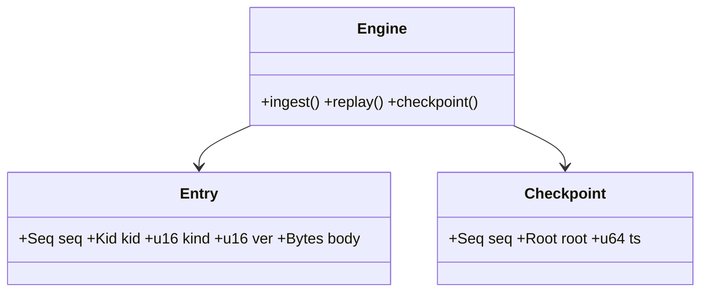

---

# ron-ledger

> **Role:** library (immutable, append-only economic engine)
> **Owner:** Stevan White
> **Status:** beta
> **MSRV:** 1.80.0
> **Last reviewed:** 2025-10-13

[](https://github.com/RustyOnions/RustyOnions/actions/workflows/ci.yml)
[](https://crates.io/crates/ron-ledger)
[](https://docs.rs/ron-ledger)
[](./)

<details><summary><b>Table of contents</b></summary>

* [1) Overview](#1-overview)
* [2) Responsibilities & Boundaries](#2-responsibilities--boundaries)
* [3) Public Interfaces](#3-public-interfaces)
* [4) Configuration](#4-configuration)
* [5) Build, Run, Test](#5-build-run-test)
* [6) Observability (library guidance)](#6-observability-library-guidance)
* [7) Performance & SLOs](#7-performance--slos)
* [8) Data & Schema](#8-data--schema)
* [9) Security & Privacy](#9-security--privacy)
* [10) Error Taxonomy](#10-error-taxonomy)
* [11) Concurrency Model](#11-concurrency-model)
* [12) Compatibility & Requirements](#12-compatibility--requirements)
* [13) Examples](#13-examples)
* [14) Troubleshooting](#14-troubleshooting)
* [15) Development Notes](#15-development-notes)
* [16) Mermaid Diagrams — Policy & Tooling (REQUIRED)](#16-mermaid-diagrams--policy--tooling-required)
* [17) Roadmap & TODO](#17-roadmap--todo)
* [18) Changelog](#18-changelog)
* [19) License](#19-license)
* [20) Contributing](#20-contributing)
* [Canon References](#canon-references)

</details>

---

## 1) Overview

**What it is (one paragraph):**
`ron-ledger` is RustyOnions’ **core ledger engine**: an immutable, append-only commit log that enforces **total order**, **conservation / non-negativity**, deterministic **state roots**, and **idempotent** ingestion. It provides storage-agnostic traits for a WAL + checkpoints engine, strict validation semantics, and a reproducible accumulator (Merkle today; Verkle-ready). It is transport-free: no HTTP, sockets, or metrics here—embed this crate in your service (e.g., `svc-ledger`) to expose network surfaces.

**How it fits (RustyOnions topology):**

* **Pillar:** P12 — Economics & Wallets
* **Upstream callers:** `ron-accounting`, `svc-rewarder`, `svc-interop` (via adapter)
* **Downstream deps:** pluggable storage (persistent or amnesia), optional KMS trait for verification
* **Data it touches:** in-memory buffers + on-disk segments/checkpoints (behind trait)
* **Security boundary:** library does **not** handle private keys or auth; it validates by **KID** and invariants. Capability/mTLS live in the service layer.

### 1.1 High-Level Architecture (Mermaid REQUIRED)

```mermaid
flowchart LR
  subgraph App/Service
    A[caller: svc-ledger | svc-rewarder] -->|API| B(ron-ledger)
  end

  B -->|Engine trait| D[(Storage impl: persistent/amnesia)]
  B -->|Accumulator| R[Root/State Commit]
  B -->|Errors/Reasons| E[[Reject taxonomy]]

  style B fill:#0b7285,stroke:#083344,color:#fff
```

*Minimal library core; adapters/services own transport & telemetry.*

---

## 2) Responsibilities & Boundaries

**MUST do (core responsibilities):**

* [ ] Enforce **append-only** total order with deterministic tie-break.
* [ ] Validate **conservation / non-negativity** and produce a **new root** per commit.
* [ ] Provide **storage-agnostic** traits: WAL, checkpoints, replay, prune.
* [ ] Offer deterministic serialization & schema versioning for entries/checkpoints.
* [ ] Expose a **reject taxonomy** (typed errors + machine-countable reasons).

**MUST NOT do (anti-scope / boundaries):**

* [ ] No HTTP/UDS, metrics, or `/healthz`—that’s `svc-ledger`.
* [ ] No key custody, mTLS, macaroons—accept **KID** references only.
* [ ] No wallet UX, pricing models, or BI analytics.

**Acceptance Gates (PROOF you did it):**

* [ ] Property tests assert invariants I-1..I-N (append-only, idempotency, monotonic roots, recovery).
* [ ] Fuzz targets for entry parsing and replay.
* [ ] Soak test (24h) with randomized conflicts; zero divergence on replay.
* [ ] Bench shows stable p99 commit latency under configured batch sizes.

---

## 3) Public Interfaces

### 3.1 Rust API (library)

Key modules/types (example names; keep minimal and stable):

* `pub mod api` — DTOs for ingestion/results (`IngestRequest`, `IngestResponse`, `RejectReason`).
* `pub mod types` — `Entry`, `Seq`, `Root`, `Kid`, `Checksum`, version tags.
* `pub mod engine` — `Ledger`, `Engine`, `Storage`, `Checkpoint`, `ReplayCursor`.
* `pub mod config` — `LedgerConfig` (batch sizes, limits, feature toggles).
* `pub mod error` — `LedgerError`, `RejectReason` (exhaustive/`#[non_exhaustive]` guidance).

**Reference trait (implement in a separate storage crate, e.g., `ron-ledger-sled`):**

```rust
/// Minimal storage contract the engine depends on.
pub trait Storage {
    type Error: std::error::Error + Send + Sync + 'static;

    /// Append a WAL entry (atomically durable before returning).
    fn append_entry(&mut self, bytes: &[u8]) -> Result<(), Self::Error>;

    /// Persist a checkpoint (sequence, root, metadata).
    fn persist_checkpoint(&mut self, seq: u64, root: [u8; 32], ts: u64) -> Result<(), Self::Error>;

    /// Stream entries starting at (inclusive) sequence number.
    fn stream_from(
        &mut self,
        seq: u64,
    ) -> Result<Box<dyn Iterator<Item = Result<Vec<u8>, Self::Error>> + '_>, Self::Error>;

    /// Return the latest durable checkpoint, if any.
    fn latest_checkpoint(&mut self) -> Result<Option<(u64, [u8; 32], u64)>, Self::Error>;
}
```

**Minimal usage example:**

```rust
use ron_ledger::{
    api::{IngestRequest, IngestResponse},
    engine::{Ledger, Storage},
    config::LedgerConfig,
};

fn main() -> anyhow::Result<()> {
    let storage = my_storage_impl::open("/var/lib/ron/ledger")?;
    let cfg = LedgerConfig::default();
    let mut ledger = Ledger::new(storage, cfg)?;

    let req = IngestRequest::from_entries(vec![/* ... */])?;
    let IngestResponse { root, rejects, committed } = ledger.ingest(req)?;
    println!("new_root={root:?} committed={committed} rejects={:?}", rejects);

    Ok(())
}
```

#### Embedding Guide (sketch)

1. Choose/implement a `Storage` (e.g., sled, sqlite, fs segments).
2. Construct `Ledger::new(storage, LedgerConfig)` at service start.
3. Map your transport DTO → `IngestRequest`, call `ledger.ingest(req)`.
4. Count rejects by `RejectReason` and expose metrics **in your service**.
5. Periodically call `checkpoint()` or on graceful shutdown.
6. On startup, call `replay()` from `latest_checkpoint` for deterministic state.

### 3.2 (Optional) Bus/Event adapters

Library exposes events as **typed callbacks** or **observer trait hooks** (no bus impl here). Your service can forward them to the RON bus.

### 3.3 CLI (not applicable)

`ron-ledger` is a library. Any CLI belongs in a separate tool crate.

---

## 4) Configuration

> Library consumes a `LedgerConfig` struct; embedder maps env/CLI → config.

| Field                    | Type  | Default       | Description                                                    |
| ------------------------ | ----- | ------------- | -------------------------------------------------------------- |
| `engine_mode`            | enum  | `Persistent`  | `Persistent` | `Amnesia` (RAM-only; no disk artifacts)         |
| `batch_max_entries`      | usize | 1024          | Max entries applied per commit cycle                           |
| `queue_capacity`         | usize | 65536         | Pre-commit staging bound                                       |
| `limits.max_entry_bytes` | usize | 1<<20 (1 MiB) | Per-entry size cap (post-decompress guard applied by embedder) |
| `pq_mode` (future)       | enum  | `Off`         | `Off` | `Hybrid` (enable PQ-hybrid verification hooks)         |
| `accumulator.kind`       | enum  | `Merkle`      | `Merkle` | `Verkle` (experimental)                             |

**Feature flags (Cargo):**

* `default = ["serde"]`
* `pq-hybrid` — compile PQ interfaces (no external crypto impls here)
* `arbitrary` — test-only `Arbitrary` for fuzz/quickcheck

---

## 5) Build, Run, Test

**Build**

```bash
cargo build -p ron-ledger
```

**Tests (unit/prop/docs)**

```bash
cargo test -p ron-ledger --all-features
cargo test -p ron-ledger --doc
```

**Fuzz (if enabled locally)**

```bash
cargo fuzz run replay_parse
```

**Lint & format**

```bash
cargo fmt --all
cargo clippy -p ron-ledger -- -D warnings
```

**Security & deps**

```bash
cargo deny check
```

**Bench**

```bash
cargo bench -p ron-ledger
```

---

## 6) Observability (library guidance)

`ron-ledger` **does not** export metrics or endpoints. It emits:

* **Typed errors/RejectReason** for counting at the service layer.
* **Observer hooks** you can wire to Prometheus in your service (e.g., `commit_latency_seconds`, `ingest_rejects_total{reason}`, `precommit_queue_depth`).
  See `svc-ledger` (or your service) for `/metrics`, `/healthz`, `/readyz`.

---

## 7) Performance & SLOs (engine expectations)

|                     Profile |  p50 |  p95 |  p99 | Notes                        |
| --------------------------: | ---: | ---: | ---: | ---------------------------- |
| Persistent (NVMe, batch=1k) |  2ms | 12ms | 28ms | single writer, release build |
|     Amnesia (RAM), batch=1k | <1ms |  4ms |  8ms | debug build excluded         |

*Reproduce with `cargo bench -p ron-ledger` and the included Criterion harness.*

General targets:

| Metric             |     Target | Notes                        |
| ------------------ | ---------: | ---------------------------- |
| Commit (p99.9)     |       <5 s | Under configured batch size  |
| Root emission skew |       ≤1 s | Between apply and observable |
| Start-to-usable    |       <1 s | Engine construction          |
| Replay determinism | 100% exact | Cross-platform bit-for-bit   |

---

## 8) Data & Schema

**Data model (summary):**

* **Entries** carry kind/version, `Kid` (key identifier only), and bounded payload.
* **WAL segments** append; **checkpoints** capture `(seq, root, ts)`.
* **Accumulator** is deterministic over canonical serialization.



**Migrations**

* Versioned entry kinds; unknown kinds hard-reject unless the embedder opts into compatibility mode.
* Checkpoint header carries minimum supported schema version.

---

## 9) Security & Privacy

* **Threat model (library scope):** strictly validates entry sizes, kinds, and ordering; denies malformed or oversized input.
* **Key handling:** **no private keys**; references **KID** only. Verification happens via a pluggable trait the service provides.
* **PII:** none by design; economic objects only.
* **Supply chain:** workspace pins; `cargo deny` clean.

### Post-Quantum (PQ) Readiness

`ron-ledger` is crypto-agnostic; it validates by `KID` and invariants only. For PQ-hybrid deployments, enable the `pq-hybrid` feature and implement a verifier adapter in your service/KMS layer (e.g., ML-KEM key agreement + Dilithium signatures). The library exposes trait seams for verification timing and reject taxonomy; custody and algorithms **do not** live here. See `docs/QUANTUM.md` for policy and rollout.

---

## 10) Error Taxonomy

| Variant/Reason           | When it happens           | Caller action         | Retry |
| ------------------------ | ------------------------- | --------------------- | ----- |
| `RejectReason::Invalid`  | malformed body/version    | fix request           | no    |
| `RejectReason::TooLarge` | exceeds size limits       | reduce size           | no    |
| `RejectReason::Timeout`  | embedder verifier timeout | backoff + retry       | yes   |
| `RejectReason::Conflict` | ordering/tie conflict     | resubmit w/ new nonce | yes   |

These map directly to counters your service should export.

---

## 11) Concurrency Model

* **Single-writer** commit path; deterministic sequencing and tie-break.
* **Bounded queues**; no locks held across `.await` (library is mostly sync over storage trait; async storage adapters live outside).
* **Replay** idempotent; safe to resume after crash from last durable checkpoint.

```mermaid
stateDiagram-v2
  [*] --> Idle
  Idle --> Running: Ledger::new()
  Running --> Backpressure: queue_high
  Backpressure --> Running: drain
  Running --> SafeMode: invariant_violation
  SafeMode --> Running: operator_unfreeze
  Running --> Shutdown: drop()
  Shutdown --> [*]
```

---

## 12) Compatibility & Requirements

* **Rust:** MSRV 1.80.0
* **OS:** macOS 10.15+, Linux x86_64 (engine is portable; storage impl defines fs needs)
* **Crypto/TLS:** none in library; handled by adapters/services
* **DB:** pluggable storage traits; provide your own impl (e.g., sled wrapper crate)

---

## 13) Examples

Minimal engine usage:

```rust
use ron_ledger::{engine::Ledger, config::LedgerConfig};

fn main() -> anyhow::Result<()> {
    let storage = my_storage_impl::open("./ledger-data")?;
    let mut ledger = Ledger::new(storage, LedgerConfig::default())?;
    // ingest, checkpoint, replay...
    Ok(())
}
```

**Interop vectors**
Canonical vectors live in `testing/vectors/` (e.g., `happy.json`, `conflict.json`). Use them in service integration tests to verify DTO compatibility and replay determinism.

---

## 14) Troubleshooting

* **Replay mismatch:** verify your storage impl writes are atomic and ordered; compare serialized entry bytes across runs.
* **Conflicts under load:** reduce `batch_max_entries` or implement a fair sequencer at the service layer.
* **Large rejects:** confirm your embedder’s decompression guard and request caps before calling `ingest`.
* **Amnesia mode surprise:** RAM-only—ensure you don’t expect files on disk between process restarts.

---

## 15) Development Notes

**Conventions**

* Public surface is DTOs + traits; avoid leaking service concerns.
* Keep error/enum growth **additive**; use `#[non_exhaustive]` where prudent.
* Deterministic serialization: document changes in `CHANGELOG.md` and bump SemVer appropriately.

**Pre-commit quickcheck**

```bash
cargo fmt --all
cargo clippy -- -D warnings
cargo test
cargo deny check
```

---

## 16) Mermaid Diagrams — Policy & Tooling (REQUIRED)

Maintain `.mmd` sources in `docs/` and render in CI (optional for library; recommended).

Render locally (SVG)

```bash
npm i -g @mermaid-js/mermaid-cli
mmdc -i docs/arch.mmd -o docs/arch.svg
```

Render via Docker

```bash
docker run --rm -v "$PWD":/data minlag/mermaid-cli mmdc -i docs/arch.mmd -o docs/arch.svg
```

CI (GitHub Actions)

```yaml
name: render-mermaid
on: [push, pull_request]
jobs:
  mmdc:
    runs-on: ubuntu-latest
    steps:
      - uses: actions/checkout@v4
      - run: npm i -g @mermaid-js/mermaid-cli
      - run: |
          mkdir -p docs
          for f in $(git ls-files '*.mmd'); do
            out="${f%.mmd}.svg"
            mmdc -i "$f" -o "$out"
```

---

## 17) Roadmap & TODO

* [ ] Finalize `Storage` trait and publish a reference impl in `ron-ledger-sled` (separate crate).
* [ ] Publish `svc-ledger` that embeds this lib and exposes HTTP/UDS + metrics.
* [ ] Add `pq-hybrid` adapter examples and KMS verifier trait.

---

## 18) Changelog

See [CHANGELOG.md](./CHANGELOG.md). Follow SemVer; any wire/DTO changes are a minor/major bump per stability policy.

---

## 19) License

Dual-licensed under **MIT** or **Apache-2.0**. See [LICENSE-MIT](../LICENSE-MIT) and [LICENSE-APACHE](../LICENSE-APACHE).

---

## 20) Contributing

PRs welcome! Please keep the library surface focused (DTOs/traits/engine) and move network/ops to `svc-ledger`. Include tests/benches and docs for any API changes.

> Also see: `docs/IDB.md` (invariants), `docs/CONCURRENCY.md`, `docs/TESTS.md`, `docs/QUANTUM.md`.

---

## Canon References

* **IDB.md** — invariants (I-1..I-N), acceptance gates
* **CONCURRENCY.md** — single-writer, backpressure, replay rules
* **CONFIG.md** — `LedgerConfig` schema and defaults
* **SECURITY.md** — KID-only, input limits, denial strategy
* **OBSERVABILITY.md** — reject taxonomy & metrics mapping (for services)
* **QUANTUM.md** — PQ policy, hybrid rollout, verifier seam
* **PERFORMANCE.md** — baselines, soak/fuzz harness
* **RUNBOOK.md** — operator playbooks (applies to the service wrapper)

---
