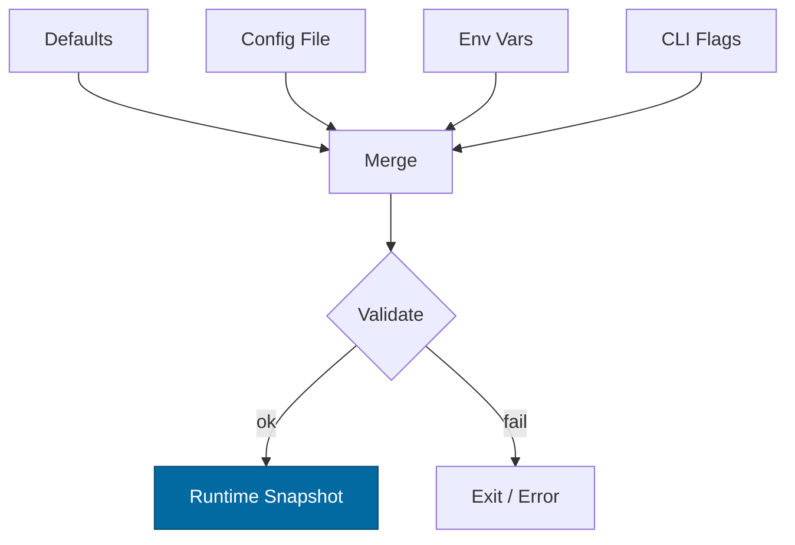

````markdown
---
title: Configuration — ron-ledger
crate: ron-ledger
owner: Stevan White
last-reviewed: 2025-10-12
status: draft
template_version: 1.0
---

# Configuration — ron-ledger

This document defines **all configuration** for `ron-ledger`, including sources,
precedence, schema (types/defaults), validation, feature flags, live-reload behavior,
and security implications. It complements `README.md`, `docs/IDB.md`, and `docs/SECURITY.md`.

> **Tiering:**  
> `ron-ledger` runs as a **service** (exposes `/metrics`, `/healthz`, `/readyz`, and a private ingestion surface); all sections apply.

---

## 1) Sources & Precedence (Authoritative)

Configuration may come from multiple sources. **Precedence (highest wins):**

1. **Process flags** (CLI)  
2. **Environment variables**  
3. **Config file** (e.g., `Config.toml` beside the binary)  
4. **Built-in defaults** (hard-coded)

> On dynamic reload, the effective config is recomputed under the same precedence.

**Supported file formats:** TOML (preferred), JSON (optional).  
**Path resolution order for `--config` (if relative):** `./`, `$CWD`, crate dir.

---

## 2) Quickstart Examples

### 2.1 Minimal service start
```bash
RUST_LOG=info \
RON_LEDGER_BIND_ADDR=0.0.0.0:5082 \
RON_LEDGER_METRICS_ADDR=127.0.0.1:0 \
RON_LEDGER_ENGINE=persistent \
RON_LEDGER_DATA_DIR=/var/lib/ron/ledger \
cargo run -p ron-ledger
````

### 2.2 Config file (TOML)

```toml
# Config.toml
bind_addr     = "0.0.0.0:5082"
metrics_addr  = "127.0.0.1:0"
max_conns     = 2048
read_timeout  = "5s"
write_timeout = "5s"
idle_timeout  = "60s"

[limits]
max_body_bytes       = "1MiB"
decompress_ratio_cap = 10

[log]
format = "json"
level  = "info"

[tls]
enabled   = false
# cert_path = "/etc/ron/tls/cert.pem"
# key_path  = "/etc/ron/tls/key.pem"

[engine]
mode                 = "persistent"        # persistent | amnesia
data_dir             = "/var/lib/ron/ledger"
wal_dir              = "/var/lib/ron/ledger/wal"
checkpoint_interval  = 10000               # entries per checkpoint
retention_checkpoints= 5                    # how many to retain
accumulator          = "merkle"             # merkle | verkle (future)
batch_max_entries    = 1024                 # max entries per commit batch
queue_capacity       = 65536                # pre-commit queue size

[sequencer]
source               = "local"              # local | external
external_endpoint    = ""                   # required if source=external

[governance]
reversible_bridges   = "disabled"           # disabled | require-cap | allow (dev-only)

[kms]
require_kid          = true                 # every entry must carry a KID
timeout              = "1s"                 # KMS verify timeout

[pq]
mode                 = "off"                # off | hybrid

[amnesia]
enabled              = false                # hard override for engine.mode=amnesia

[audit]
root_emit_interval   = "5s"                 # how often to emit/root-log accumulator

[observability]
latency_buckets_ms   = [5,10,20,50,80,120,200,400,800,1600]

[backpressure]
queue_high_water     = 52428                # ~80% of queue_capacity
reject_when_high     = true

[uds]
path = ""                                   # optional UDS for local ingestion
allow_uids = []                             
```

### 2.3 CLI flags (override file/env)

```bash
cargo run -p ron-ledger -- \
  --bind 0.0.0.0:5082 \
  --metrics 127.0.0.1:0 \
  --engine persistent \
  --data-dir /var/lib/ron/ledger \
  --batch-max 2048
```

---

## 3) Schema (Typed, With Defaults)

> **Prefix convention:** All env vars begin with `RON_LEDGER_`.
> **Durations** accept `s`, `ms`, `m`, `h`. **Sizes** accept `B`, `KB`, `MB`, `MiB`.

| Key / Env Var                                                       | Type                                   | Default                                | Description                              | Security Notes                     |
| ------------------------------------------------------------------- | -------------------------------------- | -------------------------------------- | ---------------------------------------- | ---------------------------------- |
| `bind_addr` / `RON_LEDGER_BIND_ADDR`                                | socket                                 | `127.0.0.1:0`                          | HTTP/ingress bind address                | Public binds require threat review |
| `metrics_addr` / `RON_LEDGER_METRICS_ADDR`                          | socket                                 | `127.0.0.1:0`                          | Prometheus endpoint bind                 | Prefer localhost in prod           |
| `max_conns` / `RON_LEDGER_MAX_CONNS`                                | u32                                    | `1024`                                 | Max concurrent connections               | Prevents FD exhaustion             |
| `read_timeout` / `RON_LEDGER_READ_TIMEOUT`                          | duration                               | `5s`                                   | Per-request read timeout                 | DoS mitigation                     |
| `write_timeout` / `RON_LEDGER_WRITE_TIMEOUT`                        | duration                               | `5s`                                   | Per-request write timeout                | DoS mitigation                     |
| `idle_timeout` / `RON_LEDGER_IDLE_TIMEOUT`                          | duration                               | `60s`                                  | Keep-alive idle shutdown                 | Hygiene                            |
| `limits.max_body_bytes` / `RON_LEDGER_MAX_BODY_BYTES`               | size                                   | `1MiB`                                 | Request payload cap                      | Zip/decompression guard            |
| `limits.decompress_ratio_cap` / `RON_LEDGER_DECOMPRESS_RATIO_CAP`   | u32                                    | `10`                                   | Max allowed decompression ratio          | Zip bomb guard                     |
| `log.format` / `RON_LEDGER_LOG_FORMAT`                              | enum(`json`,`text`)                    | `json`                                 | Structured logs                          | JSON in prod                       |
| `log.level` / `RON_LEDGER_LOG_LEVEL`                                | enum(`trace`..`error`)                 | `info`                                 | Global log level                         | Avoid `trace` in prod              |
| `tls.enabled` / `RON_LEDGER_TLS_ENABLED`                            | bool                                   | `false`                                | Enable TLS (tokio-rustls)                | Use rustls only                    |
| `tls.cert_path` / `RON_LEDGER_TLS_CERT_PATH`                        | path                                   | `""`                                   | PEM cert path                            | Secrets on disk; 0600              |
| `tls.key_path` / `RON_LEDGER_TLS_KEY_PATH`                          | path                                   | `""`                                   | PEM key path                             | Zeroize in memory                  |
| `engine.mode` / `RON_LEDGER_ENGINE`                                 | enum(`persistent`,`amnesia`)           | `persistent`                           | Storage profile                          | Amnesia forbids disk writes        |
| `engine.data_dir` / `RON_LEDGER_DATA_DIR`                           | path                                   | `""`                                   | Data directory (persistent)              | Needs rwx perms                    |
| `engine.wal_dir` / `RON_LEDGER_WAL_DIR`                             | path                                   | `""`                                   | WAL directory (persistent)               | Separate disk ok                   |
| `engine.checkpoint_interval` / `RON_LEDGER_CHECKPOINT_INTERVAL`     | u64                                    | `10000`                                | Entries per checkpoint                   | Larger = fewer fsyncs              |
| `engine.retention_checkpoints` / `RON_LEDGER_RETENTION_CHECKPOINTS` | u32                                    | `5`                                    | How many checkpoints to retain           | Space vs recovery                  |
| `engine.accumulator` / `RON_LEDGER_ACCUMULATOR`                     | enum(`merkle`,`verkle`)                | `merkle`                               | Accumulator algorithm                    | Determinism required               |
| `engine.batch_max_entries` / `RON_LEDGER_BATCH_MAX`                 | u32                                    | `1024`                                 | Max entries per commit batch             | Deterministic batching             |
| `engine.queue_capacity` / `RON_LEDGER_QUEUE_CAP`                    | u32                                    | `65536`                                | Pre-commit queue capacity                | Backpressure                       |
| `sequencer.source` / `RON_LEDGER_SEQ_SOURCE`                        | enum(`local`,`external`)               | `local`                                | Who assigns `seq`                        | External requires endpoint         |
| `sequencer.external_endpoint` / `RON_LEDGER_SEQ_ENDPOINT`           | string                                 | `""`                                   | URL for external sequencer               | mTLS strongly recommended          |
| `governance.reversible_bridges` / `RON_LEDGER_REVERSIBLE`           | enum(`disabled`,`require-cap`,`allow`) | `disabled`                             | Reversal policy                          | `allow` is dev-only                |
| `kms.require_kid` / `RON_LEDGER_REQUIRE_KID`                        | bool                                   | `true`                                 | Require KID per entry                    | Enforces custody                   |
| `kms.timeout` / `RON_LEDGER_KMS_TIMEOUT`                            | duration                               | `1s`                                   | KMS verify timeout                       | Fail-closed                        |
| `pq.mode` / `RON_LEDGER_PQ_MODE`                                    | enum(`off`,`hybrid`)                   | `off`                                  | PQ hybrid toggle (e.g., X25519+Kyber)    | Interop risk if mismatched         |
| `amnesia.enabled` / `RON_LEDGER_AMNESIA`                            | bool                                   | `false`                                | Forces in-mem engine                     | No persistent keys                 |
| `audit.root_emit_interval` / `RON_LEDGER_ROOT_INTERVAL`             | duration                               | `5s`                                   | How often to emit/record the root        | Auditor UX                         |
| `observability.latency_buckets_ms` / `RON_LEDGER_LAT_BUCKETS`       | list<u64>                              | `[5,10,20,50,80,120,200,400,800,1600]` | Histogram buckets                        | Tune per SLOs                      |
| `backpressure.queue_high_water` / `RON_LEDGER_Q_HIGH`               | u32                                    | `52428`                                | Threshold for backpressure               | ~80% of cap                        |
| `backpressure.reject_when_high` / `RON_LEDGER_Q_REJECT`             | bool                                   | `true`                                 | Reject new writes when beyond high-water | Protects latency                   |
| `uds.path` / `RON_LEDGER_UDS_PATH`                                  | path                                   | `""`                                   | Optional UDS for local ingestion         | Dir 0700, sock 0600                |
| `uds.allow_uids` / `RON_LEDGER_UDS_ALLOW_UIDS`                      | list<u32>                              | `[]`                                   | PEERCRED allowlist                       | Strict in prod                     |

---

## 4) Validation Rules (Fail-Closed)

On startup or reload:

* `bind_addr`, `metrics_addr` must parse; privileged ports (<1024) require privileges.
* If `tls.enabled=true`: both `cert_path` and `key_path` **exist** and are readable; key not world-readable.
* `max_conns > 0`; `limits.max_body_bytes ≥ 1 KiB`; `decompress_ratio_cap ≥ 1`.
* `engine.mode=amnesia` ⇒ **forbid** `data_dir`/`wal_dir` writes; warn if set.
* If `engine.mode=persistent`: `data_dir` and `wal_dir` exist or are creatable; fs perms sane (dirs 0700; files 0600).
* `engine.checkpoint_interval ≥ 1`; `engine.retention_checkpoints ≥ 1`.
* `engine.batch_max_entries ≥ 1`; `engine.queue_capacity ≥ engine.batch_max_entries`.
* If `sequencer.source=external`: `sequencer.external_endpoint` non-empty and reachable at boot (heads-up probe); TLS required.
* `governance.reversible_bridges="allow"` is **dev-only**; fail in `RUST_ENV=production`.
* `kms.require_kid=true` in production; fail config if false and `RUST_ENV=production`.
* `pq.mode="hybrid"`: require peer compatibility flag (cluster-wide), else fail.

**On violation:** log structured error and **exit non-zero** (service).

---

## 5) Dynamic Reload (If Supported)

**Triggers**

* SIGHUP (preferred) or kernel bus event: `ConfigUpdated { version: u64 }`.

**Hot-reload (non-disruptive)**

* Timeouts, limits, logging level/format, `observability.latency_buckets_ms`,
  `backpressure.*`, `audit.root_emit_interval`, `governance.reversible_bridges` (tightening only),
  `pq.mode` (from `off`→`hybrid` requires cluster gate; `hybrid`→`off` allowed if quiesced).

**Cold-reload (disruptive / requires rebind or restart)**

* `bind_addr`, `metrics_addr`, `tls.*`, `uds.*`, `engine.*` (mode/dirs/accumulator), `sequencer.*`.

**Atomicity**

* Build a new immutable snapshot; swap under a mutex without holding `.await`.

**Audit**

* Emit `KernelEvent::ConfigUpdated { version }` and log a redacted diff (no secrets).

---

## 6) CLI Flags (Canonical)

```
--config <path>                 # Load Config.toml
--bind <ip:port>                # bind_addr
--metrics <ip:port>             # metrics_addr
--max-conns <num>
--read-timeout <dur>            # e.g., 5s, 250ms
--write-timeout <dur>
--idle-timeout <dur>
--log-format <json|text>
--log-level <trace|debug|info|warn|error>
--tls                           # tls.enabled=true
--tls-cert <path>
--tls-key <path>
--engine <persistent|amnesia>
--data-dir <path>
--wal-dir <path>
--checkpoint-interval <u64>
--retention-checkpoints <u32>
--accumulator <merkle|verkle>
--batch-max <u32>
--queue-cap <u32>
--seq-source <local|external>
--seq-endpoint <url>
--reversible <disabled|require-cap|allow>
--require-kid <true|false>
--kms-timeout <dur>
--pq-mode <off|hybrid>
--root-interval <dur>
--uds <path>
```

---

## 7) Feature Flags (Cargo)

| Feature        | Default | Effect                                          |
| -------------- | :-----: | ----------------------------------------------- |
| `tls`          |   off   | Enables tokio-rustls path and TLS config keys   |
| `pq`           |   off   | Enables PQ hybrid code paths gated by `pq.mode` |
| `engine-sled`  |   off   | Use sled-like/LSM engine (persistent profile)   |
| `engine-rocks` |   off   | Use RocksDB engine (persistent profile)         |
| `cli` (bins)   |    on   | Enable CLI parsing for flags above              |
| `kameo`        |   off   | Optional actor integration                      |

> Keep engine features **mutually exclusive** in CI. Document if a feature changes schema/semantics.

---

## 8) Security Implications

* **Public binds (`0.0.0.0`)**: require timeouts, size caps, and backpressure; prefer gateway fronting.
* **TLS**: only `tokio_rustls::rustls::ServerConfig` (no native-tls). Keys must be 0600; zeroize in memory.
* **KMS custody**: `require_kid=true` in prod; never log secrets or raw signatures (KID only).
* **Amnesia**: disables persistence; no on-disk secrets or WAL—intended for Micronode/demos.
* **UDS**: enforce `SO_PEERCRED`; `allow_uids` required in prod; socket 0600, dir 0700.
* **External sequencer**: require mTLS and capability check; treat as Tier-0 dependency with health probes.

---

## 9) Compatibility & Migration

* **Backward compatible**: Add new keys with safe defaults; do not repurpose existing keys.
* **Renames**: Keep env var aliases ≥1 minor; emit deprecation warnings.
* **Breaking**: Require major bump + `CHANGELOG.md` migration steps (e.g., accumulator switch).

**Deprecation table**

|  Old Key | New Key | Removal Target | Notes             |
| -------: | :------ | -------------: | ----------------- |
| *(none)* | *(n/a)* |        *(n/a)* | First publication |

---

## 10) Reference Implementation (Rust)

> Minimal `Config` with serde, humantime parsing, and validate(). Keep comments; paste into `src/config.rs`.

```rust
use std::{net::SocketAddr, path::PathBuf, time::Duration};
use serde::{Deserialize, Serialize};

#[derive(Debug, Clone, Serialize, Deserialize)]
pub struct TlsCfg {
    pub enabled: bool,
    pub cert_path: Option<PathBuf>,
    pub key_path: Option<PathBuf>,
}

#[derive(Debug, Clone, Serialize, Deserialize)]
pub struct Limits {
    #[serde(default = "default_body_bytes")]
    pub max_body_bytes: u64, // bytes
    #[serde(default = "default_decompress_ratio")]
    pub decompress_ratio_cap: u32,
}

#[derive(Debug, Clone, Serialize, Deserialize)]
#[serde(rename_all = "kebab-case")]
pub enum EngineMode { Persistent, Amnesia }

#[derive(Debug, Clone, Serialize, Deserialize)]
#[serde(rename_all = "kebab-case")]
pub enum Accumulator { Merkle, Verkle }

#[derive(Debug, Clone, Serialize, Deserialize)]
#[serde(rename_all = "kebab-case")]
pub enum SeqSource { Local, External }

#[derive(Debug, Clone, Serialize, Deserialize)]
#[serde(rename_all = "kebab-case")]
pub enum ReversiblePolicy { Disabled, RequireCap, Allow } // Allow = dev-only

#[derive(Debug, Clone, Serialize, Deserialize)]
pub struct EngineCfg {
    #[serde(default = "default_engine_mode")]
    pub mode: EngineMode,
    pub data_dir: Option<PathBuf>,
    pub wal_dir: Option<PathBuf>,
    #[serde(default = "default_checkpoint_interval")]
    pub checkpoint_interval: u64,
    #[serde(default = "default_retention_checkpoints")]
    pub retention_checkpoints: u32,
    #[serde(default = "default_accumulator")]
    pub accumulator: Accumulator,
    #[serde(default = "default_batch_max")]
    pub batch_max_entries: u32,
    #[serde(default = "default_queue_capacity")]
    pub queue_capacity: u32,
}

#[derive(Debug, Clone, Serialize, Deserialize)]
pub struct SequencerCfg {
    #[serde(default = "default_seq_source")]
    pub source: SeqSource,
    #[serde(default)]
    pub external_endpoint: Option<String>,
}

#[derive(Debug, Clone, Serialize, Deserialize)]
pub struct GovernanceCfg {
    #[serde(default = "default_reversible")]
    pub reversible_bridges: ReversiblePolicy,
}

#[derive(Debug, Clone, Serialize, Deserialize)]
pub struct KmsCfg {
    #[serde(default = "default_require_kid")]
    pub require_kid: bool,
    #[serde(with = "humantime_serde", default = "default_1s")]
    pub timeout: Duration,
}

#[derive(Debug, Clone, Serialize, Deserialize)]
#[serde(rename_all = "kebab-case")]
pub enum PqMode { Off, Hybrid }

#[derive(Debug, Clone, Serialize, Deserialize)]
pub struct AuditCfg {
    #[serde(with = "humantime_serde", default = "default_5s")]
    pub root_emit_interval: Duration,
}

#[derive(Debug, Clone, Serialize, Deserialize)]
pub struct ObservabilityCfg {
    #[serde(default = "default_latency_buckets")]
    pub latency_buckets_ms: Vec<u64>,
}

#[derive(Debug, Clone, Serialize, Deserialize)]
pub struct BackpressureCfg {
    #[serde(default = "default_queue_high_water")]
    pub queue_high_water: u32,
    #[serde(default = "default_true")]
    pub reject_when_high: bool,
}

#[derive(Debug, Clone, Serialize, Deserialize)]
pub struct LogCfg {
    #[serde(default = "default_log_format")]
    pub format: String, // "json" | "text"
    #[serde(default = "default_log_level")]
    pub level: String,  // "info" etc.
}

#[derive(Debug, Clone, Serialize, Deserialize)]
pub struct UdsCfg {
    pub path: Option<PathBuf>,
    #[serde(default)]
    pub allow_uids: Vec<u32>,
}

#[derive(Debug, Clone, Serialize, Deserialize)]
pub struct Config {
    pub bind_addr: Option<SocketAddr>,     // None => 127.0.0.1:0
    pub metrics_addr: Option<SocketAddr>,  // None => 127.0.0.1:0
    #[serde(default = "default_max_conns")]
    pub max_conns: u32,
    #[serde(with = "humantime_serde", default = "default_5s")]
    pub read_timeout: Duration,
    #[serde(with = "humantime_serde", default = "default_5s")]
    pub write_timeout: Duration,
    #[serde(with = "humantime_serde", default = "default_60s")]
    pub idle_timeout: Duration,

    #[serde(default)]
    pub log: LogCfg,
    #[serde(default)]
    pub tls: TlsCfg,
    #[serde(default)]
    pub limits: Limits,
    #[serde(default)]
    pub engine: EngineCfg,
    #[serde(default)]
    pub sequencer: SequencerCfg,
    #[serde(default)]
    pub governance: GovernanceCfg,
    #[serde(default)]
    pub kms: KmsCfg,
    #[serde(default = "default_pq_mode")]
    pub pq: PqMode,
    #[serde(default)]
    pub audit: AuditCfg,
    #[serde(default)]
    pub observability: ObservabilityCfg,
    #[serde(default)]
    pub backpressure: BackpressureCfg,
    #[serde(default)]
    pub uds: UdsCfg,

    #[serde(default)]
    pub amnesia: AmnesiaOverride,
}

#[derive(Debug, Clone, Serialize, Deserialize)]
pub struct AmnesiaOverride {
    #[serde(default)]
    pub enabled: bool,
}

/* -------- defaults -------- */
fn default_true() -> bool { true }
fn default_1s() -> Duration { Duration::from_secs(1) }
fn default_5s() -> Duration { Duration::from_secs(5) }
fn default_60s() -> Duration { Duration::from_secs(60) }
fn default_body_bytes() -> u64 { 1 * 1024 * 1024 }
fn default_decompress_ratio() -> u32 { 10 }
fn default_max_conns() -> u32 { 1024 }
fn default_engine_mode() -> EngineMode { EngineMode::Persistent }
fn default_checkpoint_interval() -> u64 { 10_000 }
fn default_retention_checkpoints() -> u32 { 5 }
fn default_accumulator() -> Accumulator { Accumulator::Merkle }
fn default_batch_max() -> u32 { 1024 }
fn default_queue_capacity() -> u32 { 65_536 }
fn default_seq_source() -> SeqSource { SeqSource::Local }
fn default_reversible() -> ReversiblePolicy { ReversiblePolicy::Disabled }
fn default_require_kid() -> bool { true }
fn default_latency_buckets() -> Vec<u64> { vec![5,10,20,50,80,120,200,400,800,1600] }
fn default_log_format() -> String { "json".into() }
fn default_log_level() -> String { "info".into() }
fn default_pq_mode() -> PqMode { PqMode::Off }

/* -------- validation -------- */
impl Config {
    pub fn validate(&self) -> anyhow::Result<()> {
        use anyhow::{bail, Context};
        if self.max_conns == 0 { bail!("max_conns must be > 0"); }
        if self.limits.max_body_bytes < 1024 { bail!("limits.max_body_bytes too small"); }
        if self.limits.decompress_ratio_cap == 0 { bail!("limits.decompress_ratio_cap must be >= 1"); }

        // TLS
        if self.tls.enabled {
            let c = self.tls.cert_path.as_ref().context("tls.cert_path required")?;
            let k = self.tls.key_path.as_ref().context("tls.key_path required")?;
            if !c.exists() { bail!("tls.cert_path does not exist: {}", c.display()); }
            if !k.exists() { bail!("tls.key_path does not exist: {}", k.display()); }
        }

        // Engine & Amnesia
        match self.engine.mode {
            EngineMode::Persistent => {
                let d = self.engine.data_dir.as_ref().context("engine.data_dir required for persistent")?;
                let w = self.engine.wal_dir.as_ref().unwrap_or(d);
                if self.amnesia.enabled { bail!("amnesia.enabled=true conflicts with engine.mode=persistent"); }
                if self.engine.checkpoint_interval == 0 { bail!("engine.checkpoint_interval must be >= 1"); }
                if self.engine.retention_checkpoints == 0 { bail!("engine.retention_checkpoints must be >= 1"); }
                if self.engine.batch_max_entries == 0 { bail!("engine.batch_max_entries must be >= 1"); }
                if self.engine.queue_capacity < self.engine.batch_max_entries {
                    bail!("engine.queue_capacity must be >= engine.batch_max_entries");
                }
                // Existence checks deferred to runtime create-if-missing with sane perms.
                let _ = (d, w);
            }
            EngineMode::Amnesia => {
                if self.engine.data_dir.is_some() || self.engine.wal_dir.is_some() {
                    // Not fatal, but warn at runtime; guard writes.
                }
            }
        }

        // Sequencer
        if let SeqSource::External = self.sequencer.source {
            let ep = self.sequencer.external_endpoint.as_ref().context("sequencer.external_endpoint required")?;
            if ep.is_empty() { bail!("sequencer.external_endpoint cannot be empty"); }
        }

        // Governance
        if let ReversiblePolicy::Allow = self.governance.reversible_bridges {
            if std::env::var("RUST_ENV").unwrap_or_default() == "production" {
                bail!("governance.reversible_bridges=allow is dev-only");
            }
        }

        // KMS
        if !self.kms.require_kid && std::env::var("RUST_ENV").unwrap_or_default() == "production" {
            bail!("kms.require_kid=false is forbidden in production");
        }

        Ok(())
    }
}
```

---

## 11) Test Matrix

| Scenario                                    | Expected Outcome                                                      |
| ------------------------------------------- | --------------------------------------------------------------------- |
| Missing `Config.toml`                       | Start with defaults; emit info log                                    |
| Invalid `bind_addr`                         | Fail fast with explicit error                                         |
| TLS enabled but missing keys                | Fail fast                                                             |
| Engine = persistent but missing data_dir    | Fail fast                                                             |
| Engine = amnesia but data_dir provided      | Start; warn that persistence is disabled                              |
| Body over `max_body_bytes`                  | `413 Payload Too Large` (service)                                     |
| Decompress ratio exceeded                   | `400 Bad Request` + `ledger_rejects_total{reason="decompress_ratio"}` |
| SIGHUP reload (adjust timeouts)             | Non-disruptive hot reload                                             |
| Change bind_addr/tls                        | Cold reload required (rebind)                                         |
| Queue beyond high-water with reject enabled | 429/503 + backpressure metric; recovery when queue drains             |
| PQ mode hybrid without cluster flag         | Fail-closed at startup                                                |
| Reversible=allow in prod                    | Fail-closed at startup                                                |

---

## 12) Mermaid — Config Resolution Flow



---

## 13) Operational Notes

* Keep **prod config in version control** or a secret store; mount as read-only.
* For containers, prefer **env vars**; mount TLS material with 0600 perms.
* Document firewall rules next to `bind_addr` and expected scrapers for `/metrics`.
* When switching accumulators (e.g., Merkle → Verkle), plan as a **major migration** with dual-write and cutover windows.
* For **external sequencer**, require **mTLS**, liveness checks, and capability gating.

```
```
