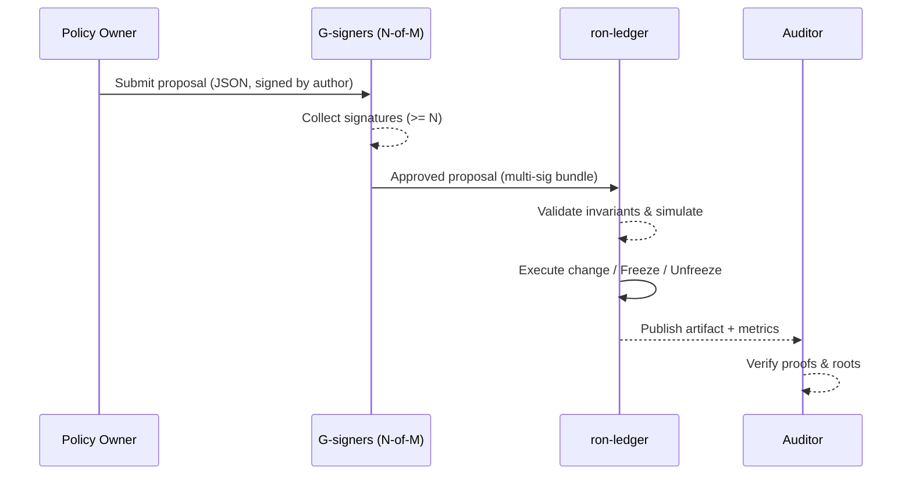

---

# 🏛 GOVERNANCE.md

````markdown
---
title: Governance & Economic Integrity — ron-ledger
status: reviewed
msrv: 1.80.0
last-updated: 2025-10-13
audience: contributors, ops, auditors, stakeholders
crate-type: policy|econ
owners: [Stevan White]
links:
  - IDB: ./IDB.md
  - SECURITY: ./SECURITY.md
  - OBSERVABILITY: ./OBSERVABILITY.md
  - API: ./API.md
  - INTEROP: ./INTEROP.md
  - RUNBOOK: ./RUNBOOK.md
  - PERFORMANCE: ./PERFORMANCE.md
  - CONFIG: ./CONFIG.md
---

# GOVERNANCE.md

## 0. Purpose

This document defines the **rules of engagement** for `ron-ledger` economic and policy operations. It ensures:

- Transparent, auditable decision-making and change control.
- Enforcement of **economic invariants** (no doubles, bounded issuance, conservation).
- Clear **authority boundaries**, role separation, and an **appeal path** with quorum.
- SLA-backed commitments for settlement and auditability.

Ties into:
- **Economic Integrity Blueprint** (conservation, bounded emission).
- **Hardening Blueprint** (bounded authority, custody & rotation).
- **Perfection Gates A–O** (esp. Gate **I**: bounded economic invariants, Gate **M**: appeal paths).

---

## 1. Invariants (MUST)

Non-negotiable rules. Violation triggers **freeze** and incident response.

- **[I-G1] No double issuance / double spend.** Ledger rejects conflicting writes. (IDB I-2, I-7)
- **[I-G2] Conservation on every commit.** Credits = debits ± governed mint/burn; reversible links preserve net zero. (IDB I-2, I-14)
- **[I-G3] Bounded emission.** Reward emission strictly follows pre-defined curve; no out-of-band minting.
- **[I-G4] Full auditability.** All governance actions and parameter changes are **logged, signed, and timestamped**; immutable history.
- **[I-G5] Bounded authority.** No unbounded admin override; all exceptional operations require multi-sig governance action and on-chain(ledger) evidence.
- **[I-G6] Determinism.** Any approved change must not break deterministic state hashing. (IDB I-5, I-15)
- **[I-G7] Compatibility.** Governance cannot introduce wire breaking changes without SemVer major bump & approved migration (API/Interop).

---

## 2. Roles & Authority

### 2.1 Roles

- **Policy Owner (`ron-policy`)**  
  Authors policy proposals (emission curve updates, quotas, dispute resolutions). Cannot commit to ledger.
- **Ledger Keeper (`ron-ledger`)**  
  Applies valid batches, enforces invariants, publishes roots.
- **Rewarder (`svc-rewarder`)**  
  Distributes incentives **within** policy caps and ledger constraints; cannot mint.
- **Auditor (external / read-only)**  
  Verifies roots, proofs of conservation, and governance actions.
- **Governance Signers (G-signers)**  
  N-of-M keys authorized to approve proposals, freezes, and overrides.

### 2.2 Authority Boundaries

- Policy may **propose**, never **execute** ledger state changes.
- Ledger **MUST** reject any action violating I-G1..I-G6, regardless of who signed it.
- Rewarder **cannot** exceed emission schedule or bypass ledger validation.
- All roles authenticate via **capability tokens (macaroons v1)** or **mTLS (privileged plane)**. Capabilities are **scoped** and **expiring** (SECURITY.md).
- Emergency actions (freeze/unfreeze) require **multi-sig** and produce signed artifacts.

---

## 3. Rules & SLAs

### 3.1 Settlement & Audit SLAs

- **99.9%** of settlements committed within **< 5s**.
- Audit root for a commit visible via `/roots` within **≤ 1s** of commit.
- On **degradation** (breakers or safe-mode): reads remain available; writes fail-closed.

### 3.2 Emission & Quotas

- Emission curve: defined as a piecewise function (epochs → reward per epoch). Stored in config and mirrored in policy repo.
- **Deviation guardrails:**
  - Instantaneous emission > **+5%** from schedule (rolling 1h) → **WARN**.
  - > **+10%** or sustained 5%+ over **24h** → **AUTO-FREEZE** (proposal required to unfreeze).

### 3.3 Disputes & Overrides

- Invalid or contested transaction → mark **`disputed=true`**; no silent rollback.
- **Override** only via governance action with quorum (see §4), and **must** produce a reversing entry **linked** to the original (I-G2, I-G4, I-G5).

---

## 4. Governance Process

### 4.1 Proposal Lifecycle

1. **Draft** (Policy Owner): proposal JSON + rationale + risk assessment.
2. **Review** (Stakeholders + Auditor): formal checks (see §4.3).
3. **Approval** (G-signers): N-of-M multi-sig within **T = 48h** window.
4. **Execution** (Ledger Keeper): apply change deterministically or publish freeze/unfreeze.
5. **Disclosure**: signed log entry & metrics update within **1 min**.

**Quorum defaults:** **3-of-5** G-signers (configurable; min 2-of-3).  
**Timeout default:** 48h; lapse → **auto-reject**.

### 4.2 Emergency Powers

- **Freeze** (`governance.freeze`) permitted only via quorum (**3-of-5**) or **2-of-3** if SLA breach SEV-1 (seq gap, emission >10%).  
- **Unfreeze** requires full quorum and a remediation plan attached (root cause, mitigations).
- Emergency actions **must** be publicly disclosed in the audit log within **24h**.

### 4.3 Formal Checks (pre-merge / pre-execute)

- **Semantic diff** of parameters (emission/quotas/SLA) with bounds check.
- **TLA+ / model sketch** updated if state machine semantics change.
- **Repro harness**: run canonical vectors (INTEROP §4) with proposal applied on a fork; verify conservation & determinism.
- **Security review**: capability scope & expiry, KMS key status.

### 4.4 Proposal Schema (normative)

```json
{
  "id": "gov_2025_10_13_001",
  "ts": 1734096000000,
  "kind": "param_update|freeze|unfreeze|override|emission_update",
  "scope": "ledger|rewarder|policy",
  "changes": { "emission": {"epoch":1234, "reward_per_epoch": "1000"} },
  "rationale": "Reduce emission per schedule.",
  "risk": "low|medium|high",
  "attachments": ["sha256:..."], 
  "signatures": [
    {"kid":"g1","sig":"..."},
    {"kid":"g2","sig":"..."},
    {"kid":"g3","sig":"..."}
  ],
  "corr_id": "3f3a...c9",
  "v": 1
}
````

* **Signatures** must be verifiable via `ron-kms` by **KID**; raw keys never leave HSM/KMS.

---

## 5. Audit & Observability

### 5.1 Logs & Artifacts

* Governance actions are **append-only**, **signed**, and **immutable**:

  * Stored as JSONL artifacts with SHA-256 checksums.
  * Included in periodic **checkpoints** (Macronode) and mirrored offsite.

### 5.2 Metrics (required)

* `governance_proposals_total{status="draft|approved|rejected|executed|expired"}`
* `governance_freeze_state{state="frozen|unfrozen"}`
* `ledger_disputes_total`
* `rewarder_emissions_total{epoch}` and `rewarder_emission_deviation`
* `governance_overrides_total{reason}`

Dashboards (OBSERVABILITY.md) must display trend lines and error budgets; alerts:

* Deviation >5% (1h) **WARN**; >10% (15m) **PAGE**.
* Freeze state change **PAGE**.
* Proposals expired >0/day **WARN**.

### 5.3 Verifiability

* **Conservation proofs** (per commit and range).
* **Range proofs** across epochs for emission.
* Auditor scripts: `ron-ledgerctl audit` produce deterministic outputs tied to roots.

### 5.4 Red-Team Drills (quarterly)

* Rogue admin attempt (invalid override) → must fail closed.
* Signer compromise simulation → rotation and quorum shrink/expand scenario.
* Emission misconfig → detect via metrics and auto-freeze.

---

## 6. Config & Custody

### 6.1 Config (normative keys)

```toml
[governance]
quorum.m = 5
quorum.n = 3
proposal.timeout_hours = 48
emission.curve_file = "/etc/ron/emission_curve.json"
freeze.auto_on_emission_deviation_pct = 10.0
freeze.auto_on_seq_gap = true
sla.settlement_p95_ms = 80
```

* Config changes require proposal lifecycle (§4); hot reload allowed only for **non-behavioral** presentation fields.

### 6.2 Custody

* All governance keys reside in **`ron-kms` or HSM**; only KIDs are referenced.
* **Rotation:** every **90 days** or after compromise; staged roll with overlapping validity.
* **No raw keys** in files/env; enforce via SECURITY.md checks and CI.

---

## 7. Appeal Path

* **Step 1 — Dispute:** mark entry `disputed=true` with reference & rationale.
* **Step 2 — Proposal:** submit **override** proposal that links to disputed entry and proposes a reversing ledger entry (net zero maintained).
* **Step 3 — Quorum:** approve via multi-sig (3-of-5 by default).
* **Step 4 — Execution & Disclosure:** apply reversal, publish evidence artifact, update metrics.
* **Step 5 — Auditor Review:** independent validation; results linked to artifact.

**Escalation:** Governance bus topic `gov.dispute` → `gov.proposal` → `gov.executed` with `corr_id` propagation.

---

## 8. Acceptance Checklist (DoD)

* [ ] Invariants I-G1..I-G7 enforced at commit time; unit tests cover rejects.
* [ ] Roles & boundaries implemented (capabilities/mTLS; rewarder cannot mint).
* [ ] Governance proposal lifecycle implemented with multi-sig verification.
* [ ] Metrics, logs, and artifacts exported; dashboards live; alerts wired.
* [ ] SLAs validated in PERF + RUNBOOK; auto-freeze rules exercised in chaos drill.
* [ ] Appeal path validated end-to-end with canonical vectors (unknown/disputed/override).
* [ ] Key rotation and quorum change tested (staging).

---

## 9. Appendix

### 9.1 Blueprint Anchors

* **Economic Integrity:** conservation, no doubles, schedule-bounded emission.
* **Hardening:** least privilege, capability scoping, custody & rotation.
* **Perfection Gates:** **I** (econ invariants), **M** (appeals), **K/L** (vigilance/black swan).

### 9.2 Governance Bus Topics (normative)

* `gov.proposal` `{id, kind, status, quorum, ts}`
* `gov.executed` `{id, kind, artifact_sha256, ts}`
* `gov.freeze` `{state, reason, signer_kids[], ts}`
* `gov.dispute` `{entry_id, reason, corr_id, ts}`

All include `corr_id`, exported as OTEL spans (OBSERVABILITY.md).

### 9.3 Mermaid — Proposal Flow



### 9.4 History (maintain)

* 2025-10-13: Initial governance charter; quorum 3-of-5; auto-freeze rules added.

```
```
