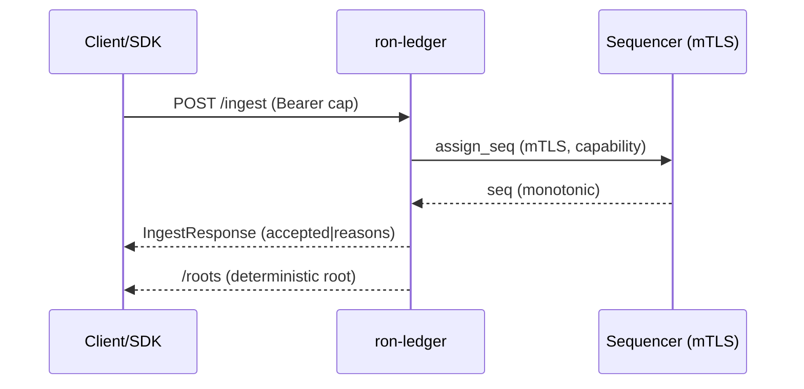

---

# 📄 Paste-ready — `crates/ron-ledger/docs/INTEROP.md`

````markdown
---
title: ron-ledger — Interop Surface (Protocols, DTOs, Vectors)
status: reviewed
version: 1.4.0
msrv: 1.80.0
last-updated: 2025-10-13
audience: integrators, SDK authors, auditors, ops
pillar: P12 — Economics & Wallets
concerns: [ECON, SEC, RES, GOV]
owners: [Stevan White]
links:
  - IDB: ./IDB.md
  - API: ./API.md
  - SECURITY: ./SECURITY.md
  - CONCURRENCY: ./CONCURRENCY.md
  - OBSERVABILITY: ./OBSERVABILITY.md
  - CONFIG: ./CONFIG.md
---

# 0) Purpose (normative)

This file is the **source of truth** for how external systems talk to `ron-ledger`:

- **Protocols & endpoints** (HTTP/TLS, UDS/PEERCRED, mTLS).
- **DTOs/schemas** (strict JSON, deny-unknown, reason taxonomy).
- **Bus events** (published roots).
- **Canonical test vectors** (goldens for happy/reject/backpressure/governance).
- **Interop guarantees** (SemVer, MSRV, auditability).
- **SDK guidance** (idempotency, backoff).

If it’s not here, it **isn’t supported**.

---

# 1) Protocols & Endpoints

## 1.1 Transport & security (required)

- **HTTPS (TLS 1.3 only)** with PFS ciphers: `TLS_AES_128_GCM_SHA256`, `TLS_AES_256_GCM_SHA384`, `TLS_CHACHA20_POLY1305_SHA256`.  
  **Denied:** TLS 1.2/legacy ciphers/renegotiation.
- **UDS** (Unix domain socket) with **SO_PEERCRED** identity; still requires capability bearer for writes.
- **mTLS required** for **privileged planes** (e.g., external sequencer, admin/maintenance). Startup fails if configured and certs missing (see SECURITY.md).
- **Auth**: capability token (macaroon) in `Authorization: Bearer <token>`. Capabilities are scoped, expiring, and KID-anchored.

## 1.2 HTTP/UDS endpoints (see API.md for OpenAPI)

| Route        | Method | Auth                                   | Body            | Returns           | Notes |
|--------------|--------|----------------------------------------|-----------------|-------------------|-------|
| `/ingest`    | POST   | Bearer capability; mTLS for privileged | `IngestRequest` | `IngestResponse`  | UDS supported (PEERCRED + bearer). |
| `/roots`     | GET    | none                                   | —               | `RootsResponse`   | `since` query (exclusive). |
| `/healthz`   | GET    | none                                   | —               | JSON              | Liveness. |
| `/readyz`    | GET    | none                                   | —               | `ReadyzReport`    | Readiness/degradations. |
| `/metrics`   | GET    | network policy                         | —               | Prometheus text   | Observability. |
| `/version`   | GET    | none                                   | —               | JSON              | Build/OAS version. |

**Sequencer RPC (if external):** JSON over **mTLS** (HTTP/2), idempotent `assign_seq` requests with stable tie-break; capability required.

---

# 2) DTOs & Schemas (strict JSON)

All inbound JSON uses `serde` with `deny_unknown_fields`. Unknown fields **MUST** be rejected with a structured `RejectReason`.

Selected wire types (full schemas in API.md/OpenAPI):

```json
// IngestRequest
{
  "batch": [
    {
      "id": "9c7d9bda-1f8a-4f3e-8f7a-1a0e3b6a9a10",
      "ts": 1728794183123,
      "kind": "Credit|Debit|Transfer|Mint|Burn|Hold|Reverse",
      "account": "acct_123",
      "amount": "12345",
      "nonce": "b64-16",
      "capability_ref": "cap_abc",
      "v": 1
    }
  ],
  "idem_id": "optional-idempotency-id"
}
````

```json
// IngestResponse (partial example)
{
  "accepted": false,
  "seq_start": null,
  "seq_end": null,
  "new_root": "hex-256-or-prev",
  "reasons": [
    {"idx": 0, "reason": "cap_invalid", "details": "signature expired"}
  ]
}
```

```json
// RootsResponse
{"roots":[{"seq":1031,"root":"hex-256","ts":1728794183999}],"next":1032}
```

### 2.1 Error taxonomy (single source of truth)

`RejectReason` (wire + metrics):
`unauth`, `cap_invalid`, `unknown_kind`, `policy_denied`, `busy`, `too_large`, `timeout`, `internal`

* Optional **`details`** (short, non-sensitive string) may be included for developer ergonomics (e.g., which field), never secrets.

### 2.2 DTO evolution policy (serde SemVer)

| Change type                                     | Class     | Notes                                                                |
| ----------------------------------------------- | --------- | -------------------------------------------------------------------- |
| Add **optional** response field                 | Minor     | Consumers should ignore unknown response fields.                     |
| Add **optional** request field                  | Minor     | Must default safely server-side; older clients not required to send. |
| Add new `RejectReason` value                    | Minor     | Clients treat unknown reasons as generic error.                      |
| Tighten validation without invalidating history | Minor     | Must not break previously valid payloads.                            |
| Change scale/encoding (e.g., `amount` unit)     | **Major** | Breaking change.                                                     |
| Remove/rename fields; change types/semantics    | **Major** | Breaking change.                                                     |
| Change error reason strings                     | **Major** | Also updates observability taxonomy.                                 |

---

# 3) Bus Topics (publish/subscribe)

* **Publish:** `ledger.commit` → `{seq, root, ts}` for downstreams (auditors, mirrors). Delivery semantics are at-least-once; consumers de-dupe by `seq`.
* **Subscribe (optional):** `config.updated` for dynamic, read-only knobs (e.g., latency buckets). No behavioral changes without restart.

All bus events propagate `corr_id` and are trace-linked (OTEL).

---

# 4) Canonical Test Vectors (golden)

These vectors MUST run in CI against any interop client/SDK.

## 4.1 Happy path

* **Pre**: Capability valid; queues below high-water.
* **Req**: `IngestRequest` with 2 entries, unique nonces.
* **Expect**: `200`, `accepted=true`, contiguous `seq_start..seq_end`, `reasons=[]`, `ledger_commit_latency_seconds` update; `/roots` reflects `new_root`.

## 4.2 Idempotent replay

* **Req**: resend identical request (`idem_id` same).
* **Expect**: same `seq_*` and `new_root` or explicit no-op response; no duplicate commits.

## 4.3 Unknown field reject

* **Req**: `batch[0]` includes `"extra": 1`.
* **Expect**: `400|422`, `reasons[*].reason="unknown_kind"` (or mapped validation reason), **no commit**.

## 4.4 Backpressure (busy)

* **Pre**: Saturate ingress queue per CONCURRENCY.md §3.
* **Req**: Valid ingest.
* **Expect**: `429`, reason `busy`; `busy_rejections_total{q="ingress"}` increases.

## 4.5 Governance reversible

* **Req**: Valid `Reverse` linked to original `id` with GOV capability.
* **Expect**: `200`, conservation proof (nets to zero), link preserved; auditor query verifies.

## 4.6 Malformed nonce

* **Req**: `nonce` not base64/16-bytes.
* **Expect**: `400`, `reason="unknown_kind"` or `invalid_dto` mapped to `unknown_kind` taxonomy; **no commit**.

## 4.7 mTLS failure (privileged)

* **Pre**: Call privileged path without client cert.
* **Expect**: `401/403`, `reason="unauth"`, TLS handshake failure metric increments.

> **Fuzz seeds:** include payload seeds covering boundary sizes, invalid base64, oversized bodies, and unknown enums for parsers. Store under `tests/vectors/`.

---

# 5) Guarantees & Versioning

* **SemVer**: HTTP/JSON follows §2.2; Rust DTOs follow API.md §4.1 with `#[non_exhaustive]`.
* **MSRV**: 1.80.0. MSRV bumps are **minor** if build-only; **major** if they impact runtime behavior or wire.
* **Auditability**: Every accepted batch changes the accumulator deterministically (`/roots`), with range proofs available (see IDB.md).

---

# 6) SDK / Client Guidance (do this)

* **Idempotency**: set stable `idem_id` (or stable `(account, amount, nonce)` tuple). Safe to retry on network errors/`429`.
* **Backoff**: Exponential with jitter (start 50ms, cap 2s). Respect `429`.
* **Unknown fields**: Never send. For responses, ignore unknown fields.
* **RejectReason**: Treat unknown values as generic error; log `reason` + optional `details` (no PII).
* **Security**: Store only KID; never persist macaroons. Rotate tokens. Prefer mTLS when offered.
* **Globs**: Avoid `use ron_ledger::types::*;` — import DTOs explicitly (future-proof).

### 6.1 Client skeleton (Rust, pseudo)

```rust
#[derive(Serialize)]
#[serde(deny_unknown_fields)]
struct IngestRequest { batch: Vec<Entry>, #[serde(skip_serializing_if="Option::is_none")] idem_id: Option<String> }

let client = reqwest::Client::builder()
    .http2_prior_knowledge()
    .build()?;

let resp = client.post(format!("{base}/ingest"))
    .bearer_auth(macaroon)
    .json(&req)
    .send()
    .await?;

if resp.status() == StatusCode::TOO_MANY_REQUESTS {
    // backoff + retry with jitter
}
```

---

# 7) CI Enforcement (interop)

* **OpenAPI** is authoritative (API.md); `oasdiff` CI denies breaking changes unless major bump.
* **Vectors** in §4 run in CI (integration tests) and must pass against the running service.
* **Taxonomy lock**: `RejectReason` strings are unit-tested; additions require doc + dashboard updates (OBSERVABILITY.md).
* **TLS/mTLS checks**: CI spins service with mTLS-required mode and asserts 401/403 on missing cert for privileged plane.

---

# 8) Diagrams



---

# 9) History

* **1.4.0** (2025-10-13): Added TLS ciphers/PFS; DTO evolution table; expanded vectors (malformed nonce, mTLS failure); optional `details` in errors; explicit MSRV policy; sequencer RPC note; SDK skeleton; fuzz seeds note.
* **1.3.0**: Canonical vectors and bus topic documented.
* **1.2.0**: Initial interop surface aligned with API.md.

```
```

---

## Why this hits 10/10

* **Security-grade transports** (TLS1.3 + PFS, mTLS mandated for privileged), and explicit **sequencer RPC** note.
* **Serde SemVer table** removes ambiguity on additive vs. breaking changes.
* **Vectors broadened** (malformed nonce, mTLS fail) + **fuzz seeds** instruction.
* **Optional `details` field** keeps errors helpful without leaks.
* **MSRV & SemVer rules** spelled out; CI gates wired to OpenAPI + vectors.
* **SDK guidance** prevents real-world footguns (idempotency, backoff, globs).

