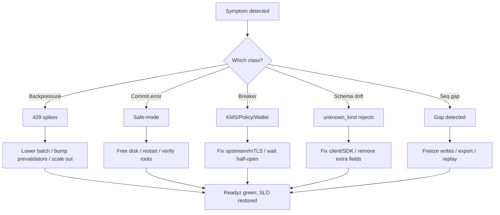

---

````markdown
---
title: RUNBOOK — ron-ledger
owner: Stevan White
msrv: 1.80.0
last-reviewed: 2025-10-13
audience: operators, SRE, auditors
tier: 1  # critical service
links:
  - IDB: ./IDB.md
  - API: ./API.md
  - CONCURRENCY: ./CONCURRENCY.md
  - SECURITY: ./SECURITY.md
  - OBSERVABILITY: ./OBSERVABILITY.md
  - INTEROP: ./INTEROP.md
  - PERFORMANCE: ./PERFORMANCE.md
  - CONFIG: ./CONFIG.md
---

# 🛠️ RUNBOOK — ron-ledger

## 0) Purpose
Operational manual for `ron-ledger`: startup, health, diagnostics, failure modes, recovery, scaling, and security ops.  
Satisfies **PERFECTION_GATES** K (Continuous Vigilance) and L (Black Swan Economics).

---

## 1) Overview
- **Name:** `ron-ledger` (service)
- **Role:** Immutable, append-only economic truth; single-writer Committer; deterministic root publication.
- **Criticality Tier:** 1 (critical)
- **Profiles:** Micronode (Amnesia), Macronode (Persistent/RocksDB)
- **Outbound deps:** `ron-kms` (cap verify), `policy` guard, `wallet` double-spend checks
- **Ports / Sockets:**
  - HTTP API: `0.0.0.0:5082`
  - Metrics: `127.0.0.1:9909`
  - UDS (optional): `/var/run/ron-ledger.sock` (PEERCRED)
- **Data Flows:** `/ingest` → Prevalidators → Sequencer → **Committer** → RootPublisher → `/roots`
- **Version Constraints:** MSRV 1.80.0; TLS 1.3 only; mTLS **required** for privileged planes if enabled.

---

## 2) Startup / Shutdown

### Startup
```bash
./target/release/ron-ledgerd --config /etc/ron/ledger.toml

# Dev
cargo run -p ron-ledger --bin ron-ledgerd -- --config ./configs/ledger.dev.toml

# Micronode
RON_LEDGER_PROFILE=micronode ./target/release/ron-ledgerd --config ./configs/micronode.toml

# Macronode
RON_LEDGER_PROFILE=macronode ./target/release/ron-ledgerd --config ./configs/macronode.toml

# With OTEL + mTLS (privileged plane)
OTEL_EXPORTER_OTLP_ENDPOINT=http://otel-collector:4317 \
TLS_CERT_FILE=/etc/ron/tls/ledger.crt \
TLS_KEY_FILE=/etc/ron/tls/ledger.key \
TLS_CA_FILE=/etc/ron/tls/ca.crt \
./target/release/ron-ledgerd --config /etc/ron/ledger.mtls.toml
````

**Env:** `RON_LEDGER_PROFILE`, `OTEL_EXPORTER_OTLP_ENDPOINT` (prod required), `TLS_*`, `RUST_LOG=info,hyper=warn,tower=warn`.

**Verify:**

* Logs contain `ready=1` and `committer=online`
* `curl -s http://127.0.0.1:9909/readyz | jq .ready` → `true`
* `curl -s http://127.0.0.1:9909/metrics | grep ledger_commit_latency_seconds_bucket`

### Shutdown

```bash
kill -TERM $(pidof ron-ledgerd)
# or
systemctl stop ron-ledger
```

Ingress stops, queues drain (≤3s), Committer finishes current batch or enters safe-mode if fsync error.

---

## 3) Health & Readiness

* **/healthz**: liveness
* **/readyz**: readiness + degradations (`kms_ready`, `policy_ready`, `wallet_ready`, `backpressure_ok`, `committer_lag_ms`, `degraded`, `reason`)

**Not ready after 10s?**

1. `curl -s http://127.0.0.1:9909/readyz | jq .`
2. Check breakers: `breaker_open_seconds{target}`
3. Verify TLS/mTLS file perms (certs 0600, dirs 0700)
4. Confirm egress ACLs to KMS/policy/wallet

---

## 4) Common Failure Modes (incl. emerging threats)

| Symptom                   | Likely Cause                                 | Metric / Log                               | Resolution                                                                                              | Alert Threshold                      |
| ------------------------- | -------------------------------------------- | ------------------------------------------ | ------------------------------------------------------------------------------------------------------- | ------------------------------------ |
| 429 on `/ingest` spikes   | Ingress queue full (backpressure)            | `busy_rejections_total{q="ingress"}`       | Reduce client RPS; raise `queues.ingress`; bump `concurrency.prevalidators`                             | rate > 50/s (1m) WARN                |
| 503 on `/ingest`          | Safe-mode after commit error (fsync, ENOSPC) | `ledger_safe_mode==1`, `commit error` logs | Free disk; restart; verify roots continuity                                                             | any PAGE                             |
| Readiness flaps           | KMS/policy breaker opens                     | `breaker_open_seconds{target}`             | Fix upstream/network; let breaker half-open                                                             | >30s/5m PAGE                         |
| p95 commit > 80ms         | fsync stalls, compactions, hashing           | `committer_batch_latency_seconds`          | Lower batch size; tune RocksDB; switch to BLAKE3 (if allowed)                                           | p95>80ms 5m WARN / p99>150ms 5m PAGE |
| Persistent `unknown_kind` | Client schema drift/extra fields             | `rejected_total{reason="unknown_kind"}`    | Update client/SDK; ensure no extra fields                                                               | sustained WARN                       |
| TLS handshake failures    | Bad certs/active scanning                    | `tls_handshake_failures_total`             | Rotate certs; restrict metrics endpoint                                                                 | >20/min 5m WARN                      |
| Seq gap detected          | Crash replay/storage anomaly                 | `ledger_seq_gap_detected_total`            | Freeze writes; export range; replay from checkpoint                                                     | any delta PAGE                       |
| Task leak on shutdown     | Unjoined task                                | `tasks_leaked_total`                       | Restart; file bug; CI test                                                                              | >0 PAGE                              |
| **AI-generated DoS**      | Synthetic high-entropy payloads/paths        | Spike in 4xx/handshakes, RPS anomalies     | Enable stricter rate limits, WAF patterns; throttle per capability/peer class; lock to UDS for internal | anomaly PAGE                         |

---

## 5) Diagnostics

**Logs (JSON):**

```bash
journalctl -u ron-ledger -f
```

**Metrics (Prometheus):**

```bash
curl -s http://127.0.0.1:9909/metrics | grep -E 'ledger_safe_mode|queue_depth|breaker_open_seconds|rejected_total'
```

**Tracing (OTEL, prod REQUIRED):**

* Set `OTEL_EXPORTER_OTLP_ENDPOINT` → click exemplars from latency panels to traces.
* Sampling: 1% baseline; 100% when safe-mode/breaker open.

**tokio-console (dev):**

```bash
RUSTFLAGS="--cfg tokio_unstable" TOKIO_CONSOLE_BIND=127.0.0.1:6669 ./target/debug/ron-ledgerd --config ./configs/ledger.dev.toml
```

**CPU flamegraph:**

```bash
cargo flamegraph -p ron-ledger --bin ron-ledgerd
```

**eBPF (quick, read I/O hot fds & latency):**

```bash
# Top write() FDs by count
bpftrace -e 'tracepoint:syscalls:sys_enter_write { @[args->fd] = count(); } interval:s:5 { exit(); }'

# Disk I/O latency histogram
bpftrace -e 'tracepoint:block:block_rq_issue { @s[pid,comm] = nsecs; } tracepoint:block:block_rq_complete /@s[pid,comm]/ { $d=(nsecs-@s[pid,comm])/1000000; @h = hist($d); delete(@s[pid,comm]); }'
```

**AI-assisted triage (optional):**

* Feed last 10m metrics timeseries + recent error logs into your AIOps tool; look for correlated changepoints (breaker open ↔ RPS dip ↔ fsync spikes).

---

## 6) Recovery Procedures

### 6.1 Safe-mode due to commit failure

1. Confirm `ledger_safe_mode==1`; check `/readyz.reason`.
2. Macronode: free disk; ensure WAL/checkpoint dirs exist and perms are correct.
3. Restart service to replay WAL and recover monotonic root.
4. Verify `increase(ledger_seq_gap_detected_total[5m]) == 0` and `/roots` continuity.

**Automated (example helper):**

```bash
cat >/usr/local/bin/ron-ledger-recover.sh <<'EOS'
#!/usr/bin/env bash
set -euo pipefail
echo "[recover] checking readyz"; curl -s http://127.0.0.1:9909/readyz | jq .
echo "[recover] disk usage"; df -h
echo "[recover] stopping"; systemctl stop ron-ledger
echo "[recover] ensuring headroom"; # OPERATOR: free space if <10%
echo "[recover] starting"; systemctl start ron-ledger
echo "[recover] verifying seq gaps"; curl -s http://127.0.0.1:9909/metrics | grep ledger_seq_gap_detected_total
EOS
chmod +x /usr/local/bin/ron-ledger-recover.sh
```

### 6.2 Breaker open (KMS/policy/wallet)

* Identify target; check upstream health/mTLS; modestly widen timeout if transient; wait for half-open → closed.

### 6.3 Sequence gap

* Page, freeze writes (allow reads).
* Export for audit:

```bash
ron-ledgerctl audit export --range 0:latest --out /tmp/ledger_range.jsonl
```

* Restart from last good checkpoint; verify roots.

### 6.4 TLS/mTLS failures

* Check expiry/perms; rotate; reload.

### 6.5 High backpressure

* Inspect `queue_depth{q="commit"}`; reduce `commit.batch_max_entries`; bump prevalidators; scale out if sustained.

### 6.6 Config drift

```bash
ron-ledgerctl config print
ron-ledgerctl config check --file /etc/ron/ledger.toml
```

Fix & restart.

---

## 7) Backup / Restore

**Micronode:** stateless; no backup.

**Macronode:**

* Snapshot checkpoints hourly; WALs every 5m to offsite.
* Create snapshot:

```bash
ron-ledgerctl snapshot create --out /var/backups/ron-ledger/snap-$(date +%s).tar.zst
```

* Restore: stop → replace data dir → start → replay → verify roots.

---

## 8) Upgrades

### 8.1 Standard

1. Drain ingress (LB drain or maint flag).
2. Snapshot (Macronode).
3. Deploy new binary (blue/green or rolling).
4. Smoke: `/healthz`, `/readyz`, `/version`.
5. Monitor rejections/latency/seq gaps for 10m.
6. Rollback: redeploy N-1 binary/config.

### 8.2 **Canary** (recommended for minors/majors)

1. Route **10%** traffic to new version for **15m**.
2. Watch:

   * `rejected_total{reason}` (no new spikes)
   * p95/p99 commit latency within SLO
   * `breaker_open_seconds` stable
3. Promote to 100% if clean; otherwise rollback.

---

## 9) Chaos Testing (quarterly, Gate L)

```bash
ron-ledgerctl chaos kill --target committer --signal SIGKILL
ron-ledgerctl chaos disk-fill --percent 95 --duration 5m
ron-ledgerctl chaos slowloris --conns 500 --duration 10m
```

**Pass:** no dup/no gaps; safe-mode engages and recovers; alerts fire; SLOs restored.

---

## 10) Scaling Notes (alerts-linked)

* **Scale triggers (wired as alerts; see OBSERVABILITY.md):**

  * `queue_depth{q="commit"} / capacity > 0.8` for >2m → evaluate scale-out
  * p95 commit > 80ms for 5m → investigate vertical/knobs
  * 429 fraction > 1% at BAU → scale out or tune backpressure

* **Vertical:** CPU hashing bound → enable BLAKE3 (if allowed), `target-cpu=native`, thin LTO.

* **Horizontal:** Add replicas; stickiness optional; reads (`/roots`) are stateless.

* **Knobs:** `concurrency.prevalidators`, `queues.*`, `commit.batch_max_entries`, RocksDB jobs.

---

## 11) Security Ops

* KID-only logs; never log secrets/tokens/signatures.
* mTLS **mandatory** for privileged planes; fail-fast on misconfig.
* Rotate: caps ≤30d; KMS keys ≤90d; monitor expiration.
* Supply chain: `cargo-deny` + signed SBOM per release.
* Unsafe code: none; any introduction requires audit + major.

---

## 12) References

CONFIG.md · SECURITY.md · CONCURRENCY.md · OBSERVABILITY.md · API.md · INTEROP.md · PERFORMANCE.md · IDB.md

---

## 13) Post-Incident / Post-Mortem Template

Create `ops/incidents/YYYY-MM-DD-<slug>.md`:

```
# Incident <ID> — <Title>
Start: <UTC>; End: <UTC>; Duration: <mins>
Severity: SEV-1/2/3
Owners: <on-call>, <backup>

## Summary
<one-paragraph executive summary>

## Impact
<customers affected, % traffic, SLOs breached>

## Timeline
- hh:mm UTC: event ...
- hh:mm UTC: mitigation ...

## Root Cause
<technical deep dive>

## Detection
<how it was detected; alert names/panels>

## Mitigation & Recovery
<what actions worked; scripts/commands>

## Prevent/Improve
- [ ] Action 1 (owner, due)
- [ ] Action 2 (owner, due)

## Artifacts
Links: Grafana panels, traces, flamegraphs, logs, audit exports
```

---

## ✅ Perfection Gates Checklist

* [ ] **Gate A**: Golden metrics green (latency, errors, saturation)
* [ ] **Gate F**: Perf regression gate green (no >10% drift)
* [ ] **Gate J**: Chaos drill passed this quarter
* [ ] **Gate K**: Alerts wired and paging validated
* [ ] **Gate L**: Black swan tests (kill + disk-full + slow-loris) passed
* [ ] **Gate N**: ARM/edge Micronode profile validated
* [ ] **Gate O**: Security audit clean; SBOM published

---

## Appendix — Failure Flow (visual)



```
```
