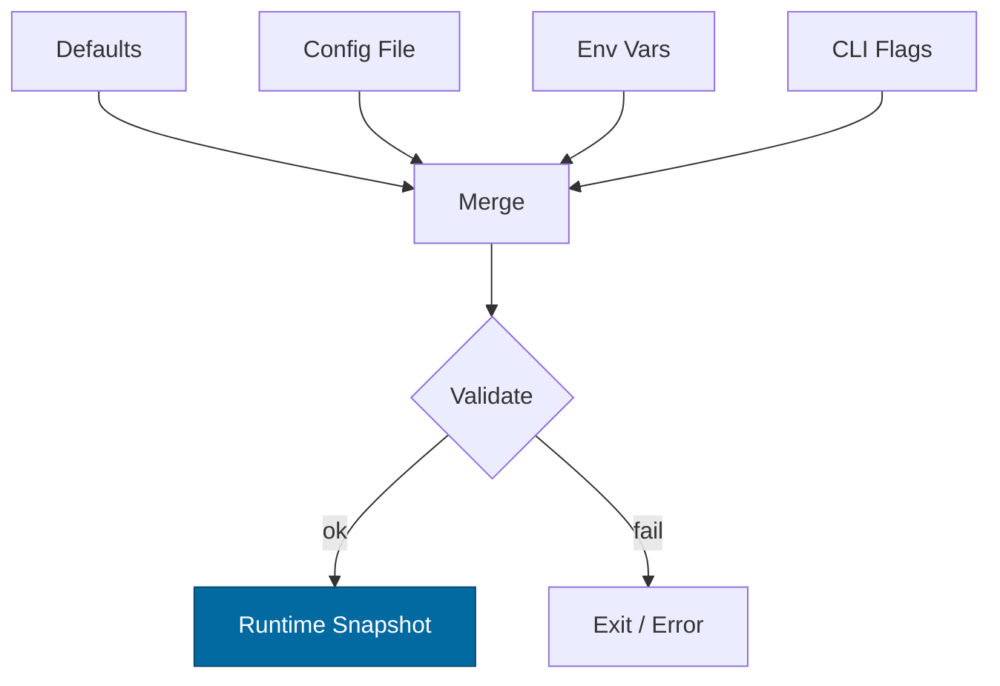
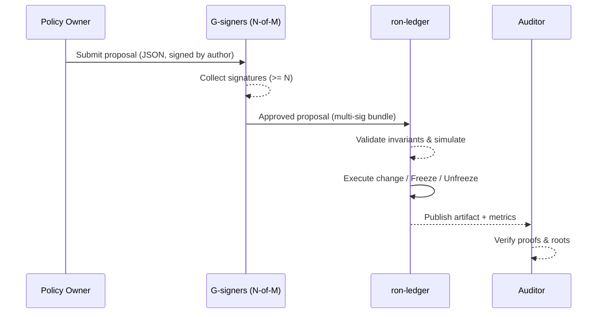
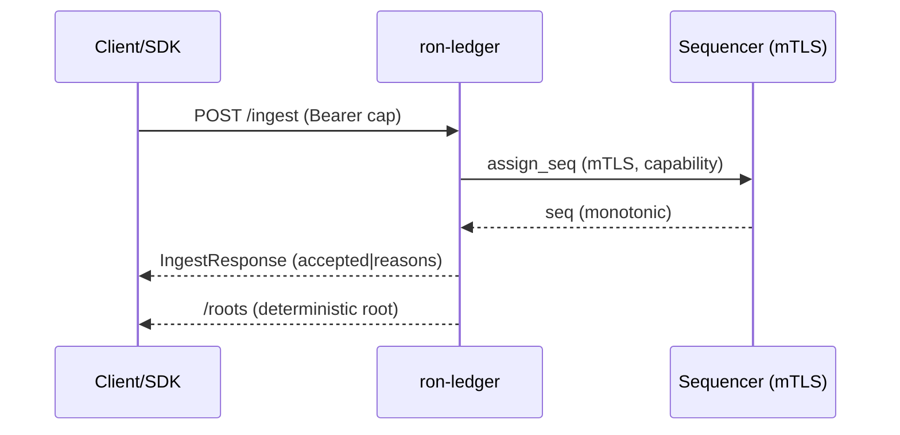
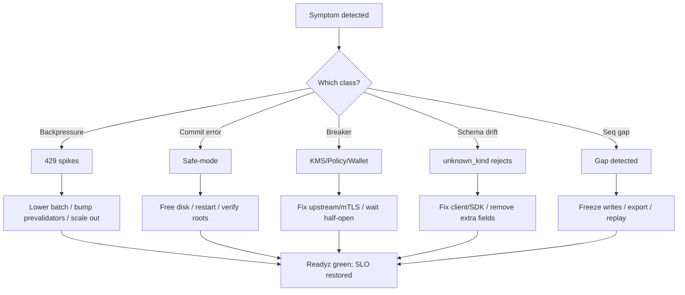

# Combined Markdown

_Source directory_: `crates/ron-ledger/docs`  
_Files combined_: 12  
_Recursive_: 0

---

### Table of Contents

- API.MD
- CONCURRENCY.MD
- CONFIG.MD
- GOVERNANCE.MD
- IDB.md
- INTEROP.MD
- OBSERVABILITY.MD
- PERFORMANCE.MD
- QUANTUM.MD
- RUNBOOK.MD
- SECURITY.MD
- TESTS.MD

---

## API.MD
_File 1 of 12_


---

# 📄 Paste-ready — `crates/ron-ledger/docs/API.md`

````markdown
---
title: ron-ledger — Public API (Rust + HTTP/UDS)
status: reviewed
version: 1.4.0
msrv: 1.80.0
last-updated: 2025-10-13
audience: consumers, contributors, ops, auditors
pillar: P12 — Economics & Wallets
concerns: [ECON, SEC, RES]
owners: [Stevan White]
links:
  - IDB: ./IDB.md
  - SECURITY: ./SECURITY.md
  - CONCURRENCY: ./CONCURRENCY.md
  - OBSERVABILITY: ./OBSERVABILITY.md
  - CONFIG: ./CONFIG.md
---

# 0) Purpose & Scope

This document is the **normative specification** of `ron-ledger`’s public surface:

- **Rust surface area** (very small, DTOs/types only; crate is primarily a service).
- **HTTP/UDS API** (endpoints, auth, bodies, responses, errors).
- **Wire contracts** (strict JSON, reason taxonomy).
- **Stability policy** (SemVer for Rust + HTTP; MSRV).
- **Tooling & CI gates** (snapshots, diffs, semver checks).
- **Acceptance checklist** for shipping changes.

Everything here is enforced by CI. If it’s not captured here, it isn’t public.

---

# 1) Public Surface

## 1.1 Rust API (intentionally minimal)
Rust exports exist only for DTOs and config/types used by tests and tooling.

```text
crate
├─ pub mod api         // DTOs for wire types; #[non_exhaustive]
├─ pub mod types       // Hash types, IDs, RejectReason; #[non_exhaustive]
└─ pub mod config      // read-only view of runtime config; #[non_exhaustive]
````

**Stability rules:**

* All exported structs/enums are `#[non_exhaustive]`.
* No trait APIs are exposed.
* No `unsafe` in public surface.

CI snapshots are generated with `cargo public-api` and checked with `cargo semver-checks`.

## 1.2 HTTP / UDS endpoints

| Route      | Method | Auth                                 | Body            | Returns            | Notes                                                             |
| ---------- | ------ | ------------------------------------ | --------------- | ------------------ | ----------------------------------------------------------------- |
| `/ingest`  | POST   | Capability (macaroon); mTLS for priv | `IngestRequest` | `IngestResponse`   | UDS variant supports PEERCRED identity in addition to capability. |
| `/roots`   | GET    | none (read)                          | —               | `RootsResponse`    | Pagination via `since=seq`.                                       |
| `/healthz` | GET    | none                                 | —               | `{"ok":true}`      | Shallow liveness only.                                            |
| `/readyz`  | GET    | none                                 | —               | `ReadyzReport`     | Reflects backpressure/breakers (writes fail-closed).              |
| `/metrics` | GET    | network policy restricted            | —               | Prometheus text    | See OBSERVABILITY.md.                                             |
| `/version` | GET    | none                                 | —               | build/version JSON | Includes commit & OpenAPI version.                                |

---

# 2) Wire Contracts (strict JSON)

All JSON uses `serde` with `deny_unknown_fields`. Unknown fields MUST be rejected with a structured `RejectReason`.

## 2.1 DTOs (selected)

```json
// IngestRequest
{
  "batch": [
    {
      "id": "9c7d9bda-1f8a-4f3e-8f7a-1a0e3b6a9a10",
      "ts": 1728794183123,
      "kind": "Credit|Debit|Transfer|Mint|Burn|Hold|Reverse",
      "account": "acct_123",
      "amount": "12345",              // string-encoded integer (atoms)
      "nonce": "base64-16",
      "capability_ref": "cap_abc",
      "v": 1
    }
  ],
  "idem_id": "optional-idempotency-id"
}
```

```json
// IngestResponse (success)
{
  "accepted": true,
  "seq_start": 1024,
  "seq_end": 1031,
  "new_root": "hex-256",
  "reasons": []               // empty on success
}
```

```json
// IngestResponse (partial/none accepted)
{
  "accepted": false,
  "seq_start": null,
  "seq_end": null,
  "new_root": "hex-256-or-prev",
  "reasons": [
    {"idx": 0, "reason": "cap_invalid"},
    {"idx": 3, "reason": "unknown_kind"}
  ]
}
```

```json
// RootsResponse
{
  "roots": [
    {"seq": 1031, "root": "hex-256", "ts": 1728794183999}
  ],
  "next": 1032
}
```

```json
// ReadyzReport
{
  "ready": true,
  "degraded": false,
  "kms_ready": true,
  "policy_ready": true,
  "wallet_ready": true,
  "backpressure_ok": true,
  "committer_lag_ms": 3
}
```

## 2.2 Error taxonomy (one source of truth)

`RejectReason` values (wire + metrics):
`unauth`, `cap_invalid`, `unknown_kind`, `policy_denied`, `busy`, `too_large`, `timeout`, `internal`

* These strings **exactly** match `rejected_total{reason}` label values (see OBSERVABILITY.md).
* Additions are **minor** (see SemVer table); changes/removals are **major**.

---

# 3) Usage Examples (curl)

## 3.1 Ingest (HTTPS)

```bash
curl -sS -X POST https://ledger.example.com/ingest \
  -H "Content-Type: application/json" \
  -H "Authorization: Bearer ${MACAROON}" \
  --data @request.json
```

## 3.2 Ingest (UDS with PEERCRED)

```bash
curl --unix-socket /var/run/ron-ledger.sock -sS -X POST http://localhost/ingest \
  -H "Content-Type: application/json" \
  -H "Authorization: Bearer ${MACAROON}" \
  --data @request.json
```

## 3.3 Fetch roots since a sequence

```bash
curl -sS "https://ledger.example.com/roots?since=1032"
```

---

# 4) Stability & SemVer Policy

We maintain **two** surfaces with coordinated versioning:

* **Rust library (DTOs/types)**: Semantic Versioning (SemVer) with MSRV guard.
* **HTTP/JSON API**: Versioned via OpenAPI; additive within a major.

## 4.1 Rust SemVer (crate)

* **Minor**: add fields to `#[non_exhaustive]` structs, add enum variants to `#[non_exhaustive]` enums, add new DTOs/modules.
* **Major**: remove/rename public items; change types/visibility; tighten trait bounds (if any in the future).
* **MSRV**: 1.80.0 (bumping MSRV is **minor** if build-only impact; **major** if it impacts runtime behavior).

CI: `cargo public-api --deny-changes` + `cargo semver-checks --workspace` are mandatory.

## 4.2 HTTP/JSON SemVer (serde-specific contract)

| Change type                                | Class     | Notes                                                                                                        |
| ------------------------------------------ | --------- | ------------------------------------------------------------------------------------------------------------ |
| Add **optional** field to request/response | Minor     | Must default safely; `deny_unknown_fields` still rejects unknown input from client → document opt-in fields. |
| Add **new** `RejectReason` value           | Minor     | Consumers must treat unknown reasons as generic error.                                                       |
| Add **new endpoint**                       | Minor     | Backwards-compatible.                                                                                        |
| Tighten validation (e.g., stricter range)  | Minor*    | Marked with release note; must not break well-formed historical payloads.                                    |
| Change scale/encoding of `amount`          | **Major** | E.g., atoms → millis; breaking.                                                                              |
| Remove field / change field type           | **Major** | Breaking.                                                                                                    |
| Change status codes semantics              | **Major** | Breaking.                                                                                                    |
| Break reason strings (rename/remove)       | **Major** | Breaking (observability taxonomy change).                                                                    |

* Minor “tightening” allowed only if prior payloads remain valid.

---

# 5) Guarantees & Anti-Footguns

* **Idempotency**: `(account, amount, nonce[, idem_id])` tuple guarantees no divergence on retries.
* **Deterministic roots**: `/roots` reflects the same accumulator values as internal checkpoints.
* **No glob imports (consumer guidance)**: avoid `use ron_ledger::types::*;` in clients—future additive changes can shadow names. Import explicitly.
* **No `unsafe` in public surface**: if ever introduced, it requires an audited major release (see SECURITY.md §10).

---

# 6) Tooling & Artifacts (CI-enforced)

* **Rust surface snapshot**: `cargo public-api --diff-git-check` against `docs/api-history/ron-ledger/<version>.txt`.
* **Semantic lint**: `cargo semver-checks --workspace` (mandatory).
* **OpenAPI**: `openapi/ron-ledger.v<major>.<minor>.yaml` (generated+reviewed); `oasdiff` runs in CI to assert **non-breaking** diffs unless major bump.
* **Rustdoc JSON (provenance)**: tools consume `rustdoc-json` output pinned via CI matrix to ensure deterministic snapshots.

---

# 7) Acceptance Checklist (Definition of Done)

* [ ] Updated OpenAPI file and example payloads.
* [ ] `cargo public-api` snapshot updated and diff reviewed.
* [ ] `cargo semver-checks --workspace` green.
* [ ] Tests proving:

  * [ ] Unknown JSON fields **reject** with `RejectReason="unknown_kind"` or specific mapped reason.
  * [ ] New optional fields are ignored by older servers (where applicable) and do not change behavior.
  * [ ] Metrics taxonomy unchanged or documented if adding new reasons.
* [ ] CHANGELOG includes migration notes (if any).
* [ ] Observability updated if reasons/endpoints changed (dashboards/alerts).

---

# 8) Endpoint Details

## 8.1 `POST /ingest`

* **Auth**: `Authorization: Bearer <macaroon>`, optional mTLS (required for privileged ops).
* **Body**: `IngestRequest`.
* **Responses**:

  * `200 IngestResponse` (accepted).
  * `207 IngestResponse` (partial accept with indexed `reasons`).
  * `400/401/403` (bad/unauth/forbidden) with `RejectReason` mapping.
  * `413` for too large.
  * `429` busy (backpressure).
  * `503` degraded (safe-mode).
* **Semantics**:

  * Idempotent by tuple; replays safe.
  * Backpressure policy aligns with CONCURRENCY (§3).

## 8.2 `GET /roots?since=<seq>`

* **Returns**: ordered list of roots from `since` (inclusive/exclusive depending on `since` definition; we use **exclusive**).
* **Degradation**: still serves during safe-mode (read path); see SECURITY/IDB.

## 8.3 `GET /readyz` / `GET /healthz` / `GET /metrics` / `GET /version`

* As specified in OBSERVABILITY and SECURITY. `/metrics` requires network policy.

---

# 9) OpenAPI Sketch (abbreviated)

```yaml
openapi: 3.0.3
info:
  title: ron-ledger
  version: "1.4.0"
paths:
  /ingest:
    post:
      security:
        - macaroonAuth: []
      requestBody:
        required: true
        content:
          application/json:
            schema: { $ref: "#/components/schemas/IngestRequest" }
      responses:
        "200": { $ref: "#/components/schemas/IngestResponse" }
        "207": { $ref: "#/components/schemas/IngestResponse" }
        "400": { description: Bad Request }
        "401": { description: Unauthorized }
        "403": { description: Forbidden }
        "413": { description: Payload Too Large }
        "429": { description: Too Many Requests }
        "503": { description: Service Unavailable }
  /roots:
    get:
      parameters:
        - name: since
          in: query
          schema: { type: integer, format: int64 }
      responses:
        "200":
          description: OK
          content:
            application/json:
              schema: { $ref: "#/components/schemas/RootsResponse" }
components:
  securitySchemes:
    macaroonAuth:
      type: http
      scheme: bearer
  schemas:
    IngestRequest:
      type: object
      additionalProperties: false
      properties:
        batch:
          type: array
          items: { $ref: "#/components/schemas/Entry" }
        idem_id: { type: string }
      required: [batch]
    Entry:
      type: object
      additionalProperties: false
      properties:
        id: { type: string, format: uuid }
        ts: { type: integer, format: int64 }
        kind: { type: string, enum: [Credit,Debit,Transfer,Mint,Burn,Hold,Reverse] }
        account: { type: string }
        amount: { type: string, pattern: "^[0-9]+$" }
        nonce: { type: string }
        capability_ref: { type: string }
        v: { type: integer, minimum: 1 }
      required: [id,ts,kind,account,amount,nonce,capability_ref,v]
    IngestResponse:
      type: object
      properties:
        accepted: { type: boolean }
        seq_start: { type: integer, format: int64, nullable: true }
        seq_end: { type: integer, format: int64, nullable: true }
        new_root: { type: string }
        reasons:
          type: array
          items:
            type: object
            properties:
              idx: { type: integer }
              reason:
                type: string
                enum: [unauth,cap_invalid,unknown_kind,policy_denied,busy,too_large,timeout,internal]
            required: [idx,reason]
      required: [accepted,new_root,reasons]
    RootsResponse:
      type: object
      properties:
        roots:
          type: array
          items:
            type: object
            properties:
              seq: { type: integer, format: int64 }
              root: { type: string }
              ts: { type: integer, format: int64 }
            required: [seq,root,ts]
        next: { type: integer, format: int64 }
      required: [roots,next]
```

---

# 10) History

* **1.4.0** (2025-10-13): Added curl examples; mandated `cargo semver-checks`; added serde SemVer table; clarified `/roots` `since` semantics (exclusive); aligned reason taxonomy with OBSERVABILITY.
* **1.3.0**: Reason taxonomy stabilized; OpenAPI schemas expanded.
* **1.2.0**: Initial public snapshot with `public-api` CI gates.

```
```

---

## Why this addresses Grok’s nits

* **Serde wire SemVer table** (4.2) removes ambiguity about what’s minor vs. major on JSON changes.
* **Mandatory `cargo semver-checks`** and **rustdoc JSON provenance** strengthen CI guarantees beyond `public-api`.
* **Concrete curl examples** improve integrator ergonomics.
* **Runtime tests** for “reject unknown fields” are now part of DoD.
* **Explicit warning about glob imports** heads off consumer breakage.
* **OpenAPI sketch** stays aligned with the RejectReason taxonomy and the observability labels.


---

## CONCURRENCY.MD
_File 2 of 12_


---

# 📄 Paste-ready — `crates/ron-ledger/docs/CONCURRENCY.md`

````markdown
---
title: ron-ledger — Concurrency Model
status: reviewed
msrv: 1.80.0
last-updated: 2025-10-13
audience: contributors, ops, auditors
pillar: P12 — Economics & Wallets
concerns: [SEC, PERF, RES]
owners: [Stevan White]
links:
  - IDB: ./IDB.md
  - SECURITY: ./SECURITY.md
  - CONFIG: ./CONFIG.md
  - OBSERVABILITY: ./OBSERVABILITY.md
---

# 0) Purpose

Define a **deterministic, auditable, backpressure-aware** concurrency model for `ron-ledger` that preserves the IDB invariants:
- I-1 Append-only, I-2 Conservation, I-6 Idempotency, I-7 Ordering, I-13 Crash-recovery monotonicity, I-8 Observability.

This doc is **enforceable** via tests, CI gates, and lints (see §14).

---

# 1) Concurrency Invariants (MUST)

1. **Single Writer (I-7).** Exactly one **Committer** performs the atomic append + accumulator update. No other task mutates the ledger state.
2. **No locks across `.await`.** Never hold a mutex/RwLock guard over an `.await`. Use ownership transfer + channels or interior batching.
3. **Bounded queues.** Every channel is bounded; overflow triggers defined backpressure policy (reject or drop-oldest) and **metrics**.
4. **Deterministic ordering.** One **Sequencer** assigns strictly increasing `seq`; tie-break is stable `(source_ts, entry.id)`.
5. **Idempotent batching (I-6).** Re-ingesting the same idempotency tuple `(account, amount, nonce[, idem_id])` is a no-op.
6. **Crash-safe drain (I-13).** On shutdown, queues are drained to a well-defined boundary; on restart, WAL replay yields the **same** `new_root`.
7. **Backpressure > unbounded parallelism.** We prefer bounded queues + caller rejections over internal unbounded growth.
8. **No task leaks.** All spawned tasks are tracked and joined via `JoinSet`; exported metric `tasks_leaked_total == 0`.
9. **Timeouts & breakers.** External calls (KMS/policy/wallet) have deadlines + circuit breakers; auth failures are not retried blindly.
10. **Poison-free.** A failed prevalidator/worker never poisons global state; supervisor restarts with jittered backoff.
11. **Observability (I-8).** Queue depths, busy rejections, latency histograms, and safe-mode toggles are emitted continuously.
12. **Amnesia compatibility (I-10).** Concurrency behavior is identical for in-mem and persistent engines; only the Committer sink differs.

---

# 2) Runtime Topology

**Tasks**
- `Supervisor` — owns a `JoinSet`, restarts children with jittered backoff, escalates repeated failures.
- `Ingress` — accepts HTTP/UDS requests, enforces body limits, emits to `ingress_tx`.
- `Prevalidator Pool (N)` — N workers run capability+policy+wallet checks; emits valid items to `preval_tx`.
- `Sequencer` — assigns `seq`, groups batches deterministically; emits to `commit_tx`.
- `Committer` — **single writer**; append + compute `new_root` + fsync/checkpoint; emits `root_pub_tx`.
- `RootsPublisher` — publishes roots to subscribers and `/roots`.
- `Health/Ready` — calculates `/healthz` & `/readyz` based on queue pressure and Committer lag.
- `Metrics/OTEL` — scrapes internal gauges, pushes OTLP spans.
- `Admin` — handles drains, safe-mode, snapshot/export.

**Worker sizing (config-driven)**
- `concurrency.prevalidators = max(2, num_cpus / 2)` (override via config)
- `concurrency.ingress_workers = max(1, num_cpus / 4)`
- Always **1** `Sequencer`, **1** `Committer`.

```mermaid
flowchart LR
  A[Ingress] -->|bounded mpsc| B[Prevalidator Pool (N)]
  B -->|bounded mpsc| C[Sequencer (1)]
  C -->|bounded mpsc| D[Committer (1)]
  D --> E[RootsPublisher]
  D --> F[Health/Ready]
  subgraph Supervisor
    A;B;C;D;E;F
  end
````

---

# 3) Queues & Backpressure

| Queue         | Type      | Capacity (cfg)                | Policy on full            | Metrics (min)                                                    |
| ------------- | --------- | ----------------------------- | ------------------------- | ---------------------------------------------------------------- |
| `ingress_tx`  | mpsc      | `queues.ingress` (default 2k) | **Reject** (429/Busy)     | `queue_depth{q="ingress"}`, `busy_rejections_total{q="ingress"}` |
| `preval_tx`   | mpsc      | `queues.prevalidator` (2k)    | **Drop-oldest** validated | `queue_depth{q="preval"}`, `drops_total{q="preval"}`             |
| `commit_tx`   | mpsc      | `queues.commit` (1k)          | **Reject** (escalate)     | `queue_depth{q="commit"}`, `busy_rejections_total{q="commit"}`   |
| `root_pub_tx` | broadcast | n/a (subscriber buffers)      | n/a                       | `roots_published_total`                                          |

* **Rationale:** Reject at the edges (ingress/commit) to bound latency; allow limited drop-oldest on prevalidated queue to absorb micro-bursts without violating ordering (Sequencer consumes in order; drop happens *before* sequencing).

---

# 4) Shared State & Locking

* **Allowed:** `Arc<Atomic*>`, lock-free counters, per-task owned buffers.
* **Forbidden:** Locks held across `.await`; nested locks without a strict hierarchy.
* **Hierarchy (if unavoidable):** config < metrics < small_counters (never take two at once).
* **Commit path:** Committer owns WAL/accumulator exclusively; other tasks never lock ledger state.

---

# 5) Timeouts, Retries, Breakers

| Operation                 | Timeout      | Retries                        | Breaker           |
| ------------------------- | ------------ | ------------------------------ | ----------------- |
| Capability verify (KMS)   | 1s           | 2 (jittered, ≤ 250ms)          | 5xx opens breaker |
| Policy guard              | 800ms        | 1 (≤ 150ms)                    | 5xx opens breaker |
| Wallet double-spend check | 1s           | 1 (≤ 150ms)                    | 5xx opens breaker |
| WAL fsync/checkpoint      | commit-local | none (fail-closed → safe-mode) | n/a               |

* Auth failures (4xx) **do not** retry; respond with structured `RejectReason`.
* Breakers half-open after 5s and require 1 success.

---

# 6) Cancellation & Graceful Shutdown

* **Propagation:** broadcast `shutdown_rx` to all tasks; every `.await` uses `tokio::select!`.
* **Drain order:** Ingress stop → Prevalidators drain → Sequencer drains → Committer drains → publish final root.
* **Deadlines:** Prevalidators/Sequencer have 3s to drain; Committer finishes current batch or marks partial and enters **safe-mode**.
* **Task management:** All tasks registered in `JoinSet`; joined at end; assert `tasks_leaked_total == 0`.

```mermaid
stateDiagram-v2
  [*] --> Running
  Running --> Draining: shutdown signal
  Draining --> SafeMode: commit error or timeout
  Draining --> Stopped: queues empty & root published
  SafeMode --> Stopped: operator ack / restore replay
```

---

# 7) I/O & Framing

* **HTTP/UDS:** Deny bodies over `limits.max_body_bytes` (cfg). UDS uses **PEERCRED** for identity in addition to capability.
* **Framing invariants:** `max_frame = 1 MiB` (OAP/1), streaming chunk size = **64 KiB** (matches INTEROP.md).
* **DoS safety:** Early size checks, read timeouts, and slowloris guards on ingress.

---

# 8) Error Taxonomy (Concurrency-relevant)

| Error                      | Caller Action              | Ledger Action                         | Metric(s)                                    |
| -------------------------- | -------------------------- | ------------------------------------- | -------------------------------------------- |
| `Busy` (ingress full)      | Retry with backoff         | Increment rejection; keep operating   | `busy_rejections_total{q="ingress"}`         |
| `PrevalDropOldest`         | Retry (client optional)    | Drop oldest validated (pre-sequence)  | `drops_total{q="preval"}`                    |
| `CommitBackpressure`       | Retry or shed load         | Escalate; WARN→PAGE if sustained      | `busy_rejections_total{q="commit"}`          |
| `SafeMode`                 | Observe read-only          | Freeze writes; operator repair/replay | `ledger_safe_mode`, `seq_gap_detected_total` |
| DeadlineExceeded (ext svc) | Backoff or alternate route | Trip breaker; log redacted span       | `io_timeouts_total{op}`                      |

---

# 9) Observability & Tracing

**Metrics (additive to IDB §7):**

* `queue_depth{q}`
* `busy_rejections_total{q}`
* `drops_total{q}`
* `tasks_leaked_total`
* `prevalidator_duration_seconds` (histogram)
* `sequencer_batch_size` (histogram)
* `committer_batch_latency_seconds` (histogram)

**Alerts (initial SLOs):**

* p95 `committer_batch_latency_seconds` > **80ms** (5m) → **WARN**
* `queue_depth{q="commit"}` > **0.8 * capacity** (2m) → **PAGE**
* `busy_rejections_total{q="ingress"}` rate > **50/s** (1m) → **WARN**
* `tasks_leaked_total` > 0 → **PAGE**

**OpenTelemetry (OTLP):**

* Spans per task: `ingress`, `prevalidator`, `sequencer`, `committer`.
* Span attributes: `corr_id`, `seq`, `entry_id`, `kid`, `capability_ref`, `queue`, `batch_size`.
* Sampling: 1% baseline; **100% when `ledger_safe_mode=1`**.

---

# 10) Validation Plan

**Unit/Property**

* Deterministic batch ordering: same inputs → same `(seq, root)`.
* Idempotency: duplicate tuples are no-ops.
* Backpressure: fill queues to capacity; assert reject/drop metrics.

**Loom (minimal model sketch)**

```rust
// Pseudocode outline (doc-only):
loom::model(|| {
  let q = BoundedQueue::new(2);
  let produced = Arc::new(AtomicUsize::new(0));
  let consumed = Arc::new(AtomicUsize::new(0));

  // producer
  thread::spawn({
    let q = q.clone(); let p = produced.clone();
    move || { for _ in 0..3 { q.try_send(1).ok(); p.fetch_add(1, SeqCst); } }
  });

  // consumer with shutdown
  let shutdown = loom::sync::atomic::AtomicBool::new(false);
  thread::spawn({
    let q = q.clone(); let c = consumed.clone(); let s = &shutdown;
    move || { while !s.load(SeqCst) { if let Some(_v) = q.try_recv() { c.fetch_add(1, SeqCst); } } }
  });

  // simulate shutdown at any point
  shutdown.store(true, SeqCst);

  // Assert: consumed <= produced; no deadlock; queue bounded.
});
```

**Fuzz**

* Ingress parsers, batch boundaries, reject taxonomy.

**Chaos**

* SIGKILL Committer mid-fsync (expect safe-mode + monotonic recovery).
* OOM prevalidator (expect supervisor restart, no poisoning).
* Disk-full during append (fail-closed; alert).

**TLA+ (state sketch)**

* States: `Validated -> Sequenced -> Committed`.
* Invariants: single writer; no duplication; conservation preserved across transitions.

---

# 11) Code Patterns (copy-paste)

**Spawn with shutdown:**

```rust
let (tx, rx) = tokio::sync::mpsc::channel(cfg.queues.ingress);
joinset.spawn(async move {
  loop {
    tokio::select! {
      Some(req) = rx.recv() => handle(req).await?,
      _ = shutdown.recv() => break,
    }
  }
});
```

**Non-blocking send with metrics:**

```rust
match tx.try_send(item) {
  Ok(()) => {}
  Err(TrySendError::Full(_)) => {
    METRICS.busy_rejections.inc(&["ingress"]);
    return Err(Error::Busy);
  }
  Err(e) => return Err(e.into()),
}
```

**Retry with jittered backoff (external check):**

```rust
let mut delay = std::time::Duration::from_millis(50);
for attempt in 0..=cfg.retries.policy_guard.max_retries {
  match policy_guard(&req).await {
    Ok(ok) => break Ok(ok),
    Err(Error::Auth(_)) => break Err(Error::Auth(_)), // don't retry 4xx
    Err(_) if attempt < cfg.retries.policy_guard.max_retries => {
      tokio::time::sleep(jitter(delay)).await;
      delay = delay.saturating_mul(2).min(cfg.retries.policy_guard.max_backoff);
    }
    Err(e) => break Err(e),
  }
}
```

**Never hold a lock across `.await`:**

```rust
// BAD
let mut g = state.lock();
g.update();
some_async().await; // ❌

/* GOOD */
let delta = { let mut g = state.lock(); g.compute_delta() }; // drop before await
apply_async(delta).await;
```

**Testing shutdown injection:**

```rust
let (shutdown_tx, shutdown_rx) = tokio::sync::watch::channel(());
let task = tokio::spawn(run_with_shutdown(shutdown_rx));
shutdown_tx.send(()).ok();
task.await?;
```

---

# 12) Config Hooks (minimum)

```toml
[concurrency]
prevalidators = 4         # default = max(2, num_cpus/2)
ingress_workers = 2

[queues]
ingress = 2000
prevalidator = 2000
commit = 1000

[limits]
max_body_bytes = "1MiB"

[timeouts]
kms_ms = 1000
policy_ms = 800
wallet_ms = 1000

[retries.policy_guard]
max_retries = 1
max_backoff = "150ms"
```

---

# 13) Trade-offs

* **Reject vs drop-oldest:** we reject at ingress/commit to bound tail latency; `preval_tx` may drop-oldest pre-sequence to ride micro-bursts without violating ordering.
* **Single threaded writer:** simplifies invariants and recovery at minor throughput cost; we scale by upstream batching, not multi-writer.
* **Tokio multi-threaded runtime:** chosen for I/O; Committer remains logically single-threaded.

---

# 14) CI & Lints Gates

* `cargo clippy -- -D clippy::await_holding_lock -D clippy::mutex_atomic`
* Loom model tests in `loom/` job (runs under `--cfg loom`).
* Fuzz targets build and smoke-run (libFuzzer/AFL as configured).
* Concurrency SLO checks (queue depth, busy rejections, commit latency) run in perf CI and must stay under thresholds (see §9 alerts).

---

# 15) Review & Drift Control

* Any change that adds a new task, channel, or backpressure policy **must** update:

  * This doc (§2–§4), CONFIG defaults (§12), OBSERVABILITY dashboards/alerts (§9), and TESTS (Loom/fuzz/chaos).
* PR template includes a “Concurrency Checklist” with these items.

```
```

---

## Why this addresses Grok’s nits

* **Task-leak enforcement**: explicit `JoinSet` requirement + `tasks_leaked_total` metric.
* **Sizing tied to config**: worker counts derived from CPU with config overrides.
* **Loom/TLA+**: included concrete Loom model sketch and TLA+ state outline.
* **SLO-backed alerts**: queue/latency alert thresholds added in §9; matches IDB perf targets.
* **OTEL tracing**: spans, attributes, and sampling policy (100% in safe-mode).


---

## CONFIG.MD
_File 3 of 12_


````markdown
---
title: Configuration — ron-ledger
crate: ron-ledger
owner: Stevan White
last-reviewed: 2025-10-12
status: draft
template_version: 1.0
---

# Configuration — ron-ledger

This document defines **all configuration** for `ron-ledger`, including sources,
precedence, schema (types/defaults), validation, feature flags, live-reload behavior,
and security implications. It complements `README.md`, `docs/IDB.md`, and `docs/SECURITY.md`.

> **Tiering:**  
> `ron-ledger` runs as a **service** (exposes `/metrics`, `/healthz`, `/readyz`, and a private ingestion surface); all sections apply.

---

## 1) Sources & Precedence (Authoritative)

Configuration may come from multiple sources. **Precedence (highest wins):**

1. **Process flags** (CLI)  
2. **Environment variables**  
3. **Config file** (e.g., `Config.toml` beside the binary)  
4. **Built-in defaults** (hard-coded)

> On dynamic reload, the effective config is recomputed under the same precedence.

**Supported file formats:** TOML (preferred), JSON (optional).  
**Path resolution order for `--config` (if relative):** `./`, `$CWD`, crate dir.

---

## 2) Quickstart Examples

### 2.1 Minimal service start
```bash
RUST_LOG=info \
RON_LEDGER_BIND_ADDR=0.0.0.0:5082 \
RON_LEDGER_METRICS_ADDR=127.0.0.1:0 \
RON_LEDGER_ENGINE=persistent \
RON_LEDGER_DATA_DIR=/var/lib/ron/ledger \
cargo run -p ron-ledger
````

### 2.2 Config file (TOML)

```toml
# Config.toml
bind_addr     = "0.0.0.0:5082"
metrics_addr  = "127.0.0.1:0"
max_conns     = 2048
read_timeout  = "5s"
write_timeout = "5s"
idle_timeout  = "60s"

[limits]
max_body_bytes       = "1MiB"
decompress_ratio_cap = 10

[log]
format = "json"
level  = "info"

[tls]
enabled   = false
# cert_path = "/etc/ron/tls/cert.pem"
# key_path  = "/etc/ron/tls/key.pem"

[engine]
mode                 = "persistent"        # persistent | amnesia
data_dir             = "/var/lib/ron/ledger"
wal_dir              = "/var/lib/ron/ledger/wal"
checkpoint_interval  = 10000               # entries per checkpoint
retention_checkpoints= 5                    # how many to retain
accumulator          = "merkle"             # merkle | verkle (future)
batch_max_entries    = 1024                 # max entries per commit batch
queue_capacity       = 65536                # pre-commit queue size

[sequencer]
source               = "local"              # local | external
external_endpoint    = ""                   # required if source=external

[governance]
reversible_bridges   = "disabled"           # disabled | require-cap | allow (dev-only)

[kms]
require_kid          = true                 # every entry must carry a KID
timeout              = "1s"                 # KMS verify timeout

[pq]
mode                 = "off"                # off | hybrid

[amnesia]
enabled              = false                # hard override for engine.mode=amnesia

[audit]
root_emit_interval   = "5s"                 # how often to emit/root-log accumulator

[observability]
latency_buckets_ms   = [5,10,20,50,80,120,200,400,800,1600]

[backpressure]
queue_high_water     = 52428                # ~80% of queue_capacity
reject_when_high     = true

[uds]
path = ""                                   # optional UDS for local ingestion
allow_uids = []                             
```

### 2.3 CLI flags (override file/env)

```bash
cargo run -p ron-ledger -- \
  --bind 0.0.0.0:5082 \
  --metrics 127.0.0.1:0 \
  --engine persistent \
  --data-dir /var/lib/ron/ledger \
  --batch-max 2048
```

---

## 3) Schema (Typed, With Defaults)

> **Prefix convention:** All env vars begin with `RON_LEDGER_`.
> **Durations** accept `s`, `ms`, `m`, `h`. **Sizes** accept `B`, `KB`, `MB`, `MiB`.

| Key / Env Var                                                       | Type                                   | Default                                | Description                              | Security Notes                     |
| ------------------------------------------------------------------- | -------------------------------------- | -------------------------------------- | ---------------------------------------- | ---------------------------------- |
| `bind_addr` / `RON_LEDGER_BIND_ADDR`                                | socket                                 | `127.0.0.1:0`                          | HTTP/ingress bind address                | Public binds require threat review |
| `metrics_addr` / `RON_LEDGER_METRICS_ADDR`                          | socket                                 | `127.0.0.1:0`                          | Prometheus endpoint bind                 | Prefer localhost in prod           |
| `max_conns` / `RON_LEDGER_MAX_CONNS`                                | u32                                    | `1024`                                 | Max concurrent connections               | Prevents FD exhaustion             |
| `read_timeout` / `RON_LEDGER_READ_TIMEOUT`                          | duration                               | `5s`                                   | Per-request read timeout                 | DoS mitigation                     |
| `write_timeout` / `RON_LEDGER_WRITE_TIMEOUT`                        | duration                               | `5s`                                   | Per-request write timeout                | DoS mitigation                     |
| `idle_timeout` / `RON_LEDGER_IDLE_TIMEOUT`                          | duration                               | `60s`                                  | Keep-alive idle shutdown                 | Hygiene                            |
| `limits.max_body_bytes` / `RON_LEDGER_MAX_BODY_BYTES`               | size                                   | `1MiB`                                 | Request payload cap                      | Zip/decompression guard            |
| `limits.decompress_ratio_cap` / `RON_LEDGER_DECOMPRESS_RATIO_CAP`   | u32                                    | `10`                                   | Max allowed decompression ratio          | Zip bomb guard                     |
| `log.format` / `RON_LEDGER_LOG_FORMAT`                              | enum(`json`,`text`)                    | `json`                                 | Structured logs                          | JSON in prod                       |
| `log.level` / `RON_LEDGER_LOG_LEVEL`                                | enum(`trace`..`error`)                 | `info`                                 | Global log level                         | Avoid `trace` in prod              |
| `tls.enabled` / `RON_LEDGER_TLS_ENABLED`                            | bool                                   | `false`                                | Enable TLS (tokio-rustls)                | Use rustls only                    |
| `tls.cert_path` / `RON_LEDGER_TLS_CERT_PATH`                        | path                                   | `""`                                   | PEM cert path                            | Secrets on disk; 0600              |
| `tls.key_path` / `RON_LEDGER_TLS_KEY_PATH`                          | path                                   | `""`                                   | PEM key path                             | Zeroize in memory                  |
| `engine.mode` / `RON_LEDGER_ENGINE`                                 | enum(`persistent`,`amnesia`)           | `persistent`                           | Storage profile                          | Amnesia forbids disk writes        |
| `engine.data_dir` / `RON_LEDGER_DATA_DIR`                           | path                                   | `""`                                   | Data directory (persistent)              | Needs rwx perms                    |
| `engine.wal_dir` / `RON_LEDGER_WAL_DIR`                             | path                                   | `""`                                   | WAL directory (persistent)               | Separate disk ok                   |
| `engine.checkpoint_interval` / `RON_LEDGER_CHECKPOINT_INTERVAL`     | u64                                    | `10000`                                | Entries per checkpoint                   | Larger = fewer fsyncs              |
| `engine.retention_checkpoints` / `RON_LEDGER_RETENTION_CHECKPOINTS` | u32                                    | `5`                                    | How many checkpoints to retain           | Space vs recovery                  |
| `engine.accumulator` / `RON_LEDGER_ACCUMULATOR`                     | enum(`merkle`,`verkle`)                | `merkle`                               | Accumulator algorithm                    | Determinism required               |
| `engine.batch_max_entries` / `RON_LEDGER_BATCH_MAX`                 | u32                                    | `1024`                                 | Max entries per commit batch             | Deterministic batching             |
| `engine.queue_capacity` / `RON_LEDGER_QUEUE_CAP`                    | u32                                    | `65536`                                | Pre-commit queue capacity                | Backpressure                       |
| `sequencer.source` / `RON_LEDGER_SEQ_SOURCE`                        | enum(`local`,`external`)               | `local`                                | Who assigns `seq`                        | External requires endpoint         |
| `sequencer.external_endpoint` / `RON_LEDGER_SEQ_ENDPOINT`           | string                                 | `""`                                   | URL for external sequencer               | mTLS strongly recommended          |
| `governance.reversible_bridges` / `RON_LEDGER_REVERSIBLE`           | enum(`disabled`,`require-cap`,`allow`) | `disabled`                             | Reversal policy                          | `allow` is dev-only                |
| `kms.require_kid` / `RON_LEDGER_REQUIRE_KID`                        | bool                                   | `true`                                 | Require KID per entry                    | Enforces custody                   |
| `kms.timeout` / `RON_LEDGER_KMS_TIMEOUT`                            | duration                               | `1s`                                   | KMS verify timeout                       | Fail-closed                        |
| `pq.mode` / `RON_LEDGER_PQ_MODE`                                    | enum(`off`,`hybrid`)                   | `off`                                  | PQ hybrid toggle (e.g., X25519+Kyber)    | Interop risk if mismatched         |
| `amnesia.enabled` / `RON_LEDGER_AMNESIA`                            | bool                                   | `false`                                | Forces in-mem engine                     | No persistent keys                 |
| `audit.root_emit_interval` / `RON_LEDGER_ROOT_INTERVAL`             | duration                               | `5s`                                   | How often to emit/record the root        | Auditor UX                         |
| `observability.latency_buckets_ms` / `RON_LEDGER_LAT_BUCKETS`       | list<u64>                              | `[5,10,20,50,80,120,200,400,800,1600]` | Histogram buckets                        | Tune per SLOs                      |
| `backpressure.queue_high_water` / `RON_LEDGER_Q_HIGH`               | u32                                    | `52428`                                | Threshold for backpressure               | ~80% of cap                        |
| `backpressure.reject_when_high` / `RON_LEDGER_Q_REJECT`             | bool                                   | `true`                                 | Reject new writes when beyond high-water | Protects latency                   |
| `uds.path` / `RON_LEDGER_UDS_PATH`                                  | path                                   | `""`                                   | Optional UDS for local ingestion         | Dir 0700, sock 0600                |
| `uds.allow_uids` / `RON_LEDGER_UDS_ALLOW_UIDS`                      | list<u32>                              | `[]`                                   | PEERCRED allowlist                       | Strict in prod                     |

---

## 4) Validation Rules (Fail-Closed)

On startup or reload:

* `bind_addr`, `metrics_addr` must parse; privileged ports (<1024) require privileges.
* If `tls.enabled=true`: both `cert_path` and `key_path` **exist** and are readable; key not world-readable.
* `max_conns > 0`; `limits.max_body_bytes ≥ 1 KiB`; `decompress_ratio_cap ≥ 1`.
* `engine.mode=amnesia` ⇒ **forbid** `data_dir`/`wal_dir` writes; warn if set.
* If `engine.mode=persistent`: `data_dir` and `wal_dir` exist or are creatable; fs perms sane (dirs 0700; files 0600).
* `engine.checkpoint_interval ≥ 1`; `engine.retention_checkpoints ≥ 1`.
* `engine.batch_max_entries ≥ 1`; `engine.queue_capacity ≥ engine.batch_max_entries`.
* If `sequencer.source=external`: `sequencer.external_endpoint` non-empty and reachable at boot (heads-up probe); TLS required.
* `governance.reversible_bridges="allow"` is **dev-only**; fail in `RUST_ENV=production`.
* `kms.require_kid=true` in production; fail config if false and `RUST_ENV=production`.
* `pq.mode="hybrid"`: require peer compatibility flag (cluster-wide), else fail.

**On violation:** log structured error and **exit non-zero** (service).

---

## 5) Dynamic Reload (If Supported)

**Triggers**

* SIGHUP (preferred) or kernel bus event: `ConfigUpdated { version: u64 }`.

**Hot-reload (non-disruptive)**

* Timeouts, limits, logging level/format, `observability.latency_buckets_ms`,
  `backpressure.*`, `audit.root_emit_interval`, `governance.reversible_bridges` (tightening only),
  `pq.mode` (from `off`→`hybrid` requires cluster gate; `hybrid`→`off` allowed if quiesced).

**Cold-reload (disruptive / requires rebind or restart)**

* `bind_addr`, `metrics_addr`, `tls.*`, `uds.*`, `engine.*` (mode/dirs/accumulator), `sequencer.*`.

**Atomicity**

* Build a new immutable snapshot; swap under a mutex without holding `.await`.

**Audit**

* Emit `KernelEvent::ConfigUpdated { version }` and log a redacted diff (no secrets).

---

## 6) CLI Flags (Canonical)

```
--config <path>                 # Load Config.toml
--bind <ip:port>                # bind_addr
--metrics <ip:port>             # metrics_addr
--max-conns <num>
--read-timeout <dur>            # e.g., 5s, 250ms
--write-timeout <dur>
--idle-timeout <dur>
--log-format <json|text>
--log-level <trace|debug|info|warn|error>
--tls                           # tls.enabled=true
--tls-cert <path>
--tls-key <path>
--engine <persistent|amnesia>
--data-dir <path>
--wal-dir <path>
--checkpoint-interval <u64>
--retention-checkpoints <u32>
--accumulator <merkle|verkle>
--batch-max <u32>
--queue-cap <u32>
--seq-source <local|external>
--seq-endpoint <url>
--reversible <disabled|require-cap|allow>
--require-kid <true|false>
--kms-timeout <dur>
--pq-mode <off|hybrid>
--root-interval <dur>
--uds <path>
```

---

## 7) Feature Flags (Cargo)

| Feature        | Default | Effect                                          |
| -------------- | :-----: | ----------------------------------------------- |
| `tls`          |   off   | Enables tokio-rustls path and TLS config keys   |
| `pq`           |   off   | Enables PQ hybrid code paths gated by `pq.mode` |
| `engine-sled`  |   off   | Use sled-like/LSM engine (persistent profile)   |
| `engine-rocks` |   off   | Use RocksDB engine (persistent profile)         |
| `cli` (bins)   |    on   | Enable CLI parsing for flags above              |
| `kameo`        |   off   | Optional actor integration                      |

> Keep engine features **mutually exclusive** in CI. Document if a feature changes schema/semantics.

---

## 8) Security Implications

* **Public binds (`0.0.0.0`)**: require timeouts, size caps, and backpressure; prefer gateway fronting.
* **TLS**: only `tokio_rustls::rustls::ServerConfig` (no native-tls). Keys must be 0600; zeroize in memory.
* **KMS custody**: `require_kid=true` in prod; never log secrets or raw signatures (KID only).
* **Amnesia**: disables persistence; no on-disk secrets or WAL—intended for Micronode/demos.
* **UDS**: enforce `SO_PEERCRED`; `allow_uids` required in prod; socket 0600, dir 0700.
* **External sequencer**: require mTLS and capability check; treat as Tier-0 dependency with health probes.

---

## 9) Compatibility & Migration

* **Backward compatible**: Add new keys with safe defaults; do not repurpose existing keys.
* **Renames**: Keep env var aliases ≥1 minor; emit deprecation warnings.
* **Breaking**: Require major bump + `CHANGELOG.md` migration steps (e.g., accumulator switch).

**Deprecation table**

|  Old Key | New Key | Removal Target | Notes             |
| -------: | :------ | -------------: | ----------------- |
| *(none)* | *(n/a)* |        *(n/a)* | First publication |

---

## 10) Reference Implementation (Rust)

> Minimal `Config` with serde, humantime parsing, and validate(). Keep comments; paste into `src/config.rs`.

```rust
use std::{net::SocketAddr, path::PathBuf, time::Duration};
use serde::{Deserialize, Serialize};

#[derive(Debug, Clone, Serialize, Deserialize)]
pub struct TlsCfg {
    pub enabled: bool,
    pub cert_path: Option<PathBuf>,
    pub key_path: Option<PathBuf>,
}

#[derive(Debug, Clone, Serialize, Deserialize)]
pub struct Limits {
    #[serde(default = "default_body_bytes")]
    pub max_body_bytes: u64, // bytes
    #[serde(default = "default_decompress_ratio")]
    pub decompress_ratio_cap: u32,
}

#[derive(Debug, Clone, Serialize, Deserialize)]
#[serde(rename_all = "kebab-case")]
pub enum EngineMode { Persistent, Amnesia }

#[derive(Debug, Clone, Serialize, Deserialize)]
#[serde(rename_all = "kebab-case")]
pub enum Accumulator { Merkle, Verkle }

#[derive(Debug, Clone, Serialize, Deserialize)]
#[serde(rename_all = "kebab-case")]
pub enum SeqSource { Local, External }

#[derive(Debug, Clone, Serialize, Deserialize)]
#[serde(rename_all = "kebab-case")]
pub enum ReversiblePolicy { Disabled, RequireCap, Allow } // Allow = dev-only

#[derive(Debug, Clone, Serialize, Deserialize)]
pub struct EngineCfg {
    #[serde(default = "default_engine_mode")]
    pub mode: EngineMode,
    pub data_dir: Option<PathBuf>,
    pub wal_dir: Option<PathBuf>,
    #[serde(default = "default_checkpoint_interval")]
    pub checkpoint_interval: u64,
    #[serde(default = "default_retention_checkpoints")]
    pub retention_checkpoints: u32,
    #[serde(default = "default_accumulator")]
    pub accumulator: Accumulator,
    #[serde(default = "default_batch_max")]
    pub batch_max_entries: u32,
    #[serde(default = "default_queue_capacity")]
    pub queue_capacity: u32,
}

#[derive(Debug, Clone, Serialize, Deserialize)]
pub struct SequencerCfg {
    #[serde(default = "default_seq_source")]
    pub source: SeqSource,
    #[serde(default)]
    pub external_endpoint: Option<String>,
}

#[derive(Debug, Clone, Serialize, Deserialize)]
pub struct GovernanceCfg {
    #[serde(default = "default_reversible")]
    pub reversible_bridges: ReversiblePolicy,
}

#[derive(Debug, Clone, Serialize, Deserialize)]
pub struct KmsCfg {
    #[serde(default = "default_require_kid")]
    pub require_kid: bool,
    #[serde(with = "humantime_serde", default = "default_1s")]
    pub timeout: Duration,
}

#[derive(Debug, Clone, Serialize, Deserialize)]
#[serde(rename_all = "kebab-case")]
pub enum PqMode { Off, Hybrid }

#[derive(Debug, Clone, Serialize, Deserialize)]
pub struct AuditCfg {
    #[serde(with = "humantime_serde", default = "default_5s")]
    pub root_emit_interval: Duration,
}

#[derive(Debug, Clone, Serialize, Deserialize)]
pub struct ObservabilityCfg {
    #[serde(default = "default_latency_buckets")]
    pub latency_buckets_ms: Vec<u64>,
}

#[derive(Debug, Clone, Serialize, Deserialize)]
pub struct BackpressureCfg {
    #[serde(default = "default_queue_high_water")]
    pub queue_high_water: u32,
    #[serde(default = "default_true")]
    pub reject_when_high: bool,
}

#[derive(Debug, Clone, Serialize, Deserialize)]
pub struct LogCfg {
    #[serde(default = "default_log_format")]
    pub format: String, // "json" | "text"
    #[serde(default = "default_log_level")]
    pub level: String,  // "info" etc.
}

#[derive(Debug, Clone, Serialize, Deserialize)]
pub struct UdsCfg {
    pub path: Option<PathBuf>,
    #[serde(default)]
    pub allow_uids: Vec<u32>,
}

#[derive(Debug, Clone, Serialize, Deserialize)]
pub struct Config {
    pub bind_addr: Option<SocketAddr>,     // None => 127.0.0.1:0
    pub metrics_addr: Option<SocketAddr>,  // None => 127.0.0.1:0
    #[serde(default = "default_max_conns")]
    pub max_conns: u32,
    #[serde(with = "humantime_serde", default = "default_5s")]
    pub read_timeout: Duration,
    #[serde(with = "humantime_serde", default = "default_5s")]
    pub write_timeout: Duration,
    #[serde(with = "humantime_serde", default = "default_60s")]
    pub idle_timeout: Duration,

    #[serde(default)]
    pub log: LogCfg,
    #[serde(default)]
    pub tls: TlsCfg,
    #[serde(default)]
    pub limits: Limits,
    #[serde(default)]
    pub engine: EngineCfg,
    #[serde(default)]
    pub sequencer: SequencerCfg,
    #[serde(default)]
    pub governance: GovernanceCfg,
    #[serde(default)]
    pub kms: KmsCfg,
    #[serde(default = "default_pq_mode")]
    pub pq: PqMode,
    #[serde(default)]
    pub audit: AuditCfg,
    #[serde(default)]
    pub observability: ObservabilityCfg,
    #[serde(default)]
    pub backpressure: BackpressureCfg,
    #[serde(default)]
    pub uds: UdsCfg,

    #[serde(default)]
    pub amnesia: AmnesiaOverride,
}

#[derive(Debug, Clone, Serialize, Deserialize)]
pub struct AmnesiaOverride {
    #[serde(default)]
    pub enabled: bool,
}

/* -------- defaults -------- */
fn default_true() -> bool { true }
fn default_1s() -> Duration { Duration::from_secs(1) }
fn default_5s() -> Duration { Duration::from_secs(5) }
fn default_60s() -> Duration { Duration::from_secs(60) }
fn default_body_bytes() -> u64 { 1 * 1024 * 1024 }
fn default_decompress_ratio() -> u32 { 10 }
fn default_max_conns() -> u32 { 1024 }
fn default_engine_mode() -> EngineMode { EngineMode::Persistent }
fn default_checkpoint_interval() -> u64 { 10_000 }
fn default_retention_checkpoints() -> u32 { 5 }
fn default_accumulator() -> Accumulator { Accumulator::Merkle }
fn default_batch_max() -> u32 { 1024 }
fn default_queue_capacity() -> u32 { 65_536 }
fn default_seq_source() -> SeqSource { SeqSource::Local }
fn default_reversible() -> ReversiblePolicy { ReversiblePolicy::Disabled }
fn default_require_kid() -> bool { true }
fn default_latency_buckets() -> Vec<u64> { vec![5,10,20,50,80,120,200,400,800,1600] }
fn default_log_format() -> String { "json".into() }
fn default_log_level() -> String { "info".into() }
fn default_pq_mode() -> PqMode { PqMode::Off }

/* -------- validation -------- */
impl Config {
    pub fn validate(&self) -> anyhow::Result<()> {
        use anyhow::{bail, Context};
        if self.max_conns == 0 { bail!("max_conns must be > 0"); }
        if self.limits.max_body_bytes < 1024 { bail!("limits.max_body_bytes too small"); }
        if self.limits.decompress_ratio_cap == 0 { bail!("limits.decompress_ratio_cap must be >= 1"); }

        // TLS
        if self.tls.enabled {
            let c = self.tls.cert_path.as_ref().context("tls.cert_path required")?;
            let k = self.tls.key_path.as_ref().context("tls.key_path required")?;
            if !c.exists() { bail!("tls.cert_path does not exist: {}", c.display()); }
            if !k.exists() { bail!("tls.key_path does not exist: {}", k.display()); }
        }

        // Engine & Amnesia
        match self.engine.mode {
            EngineMode::Persistent => {
                let d = self.engine.data_dir.as_ref().context("engine.data_dir required for persistent")?;
                let w = self.engine.wal_dir.as_ref().unwrap_or(d);
                if self.amnesia.enabled { bail!("amnesia.enabled=true conflicts with engine.mode=persistent"); }
                if self.engine.checkpoint_interval == 0 { bail!("engine.checkpoint_interval must be >= 1"); }
                if self.engine.retention_checkpoints == 0 { bail!("engine.retention_checkpoints must be >= 1"); }
                if self.engine.batch_max_entries == 0 { bail!("engine.batch_max_entries must be >= 1"); }
                if self.engine.queue_capacity < self.engine.batch_max_entries {
                    bail!("engine.queue_capacity must be >= engine.batch_max_entries");
                }
                // Existence checks deferred to runtime create-if-missing with sane perms.
                let _ = (d, w);
            }
            EngineMode::Amnesia => {
                if self.engine.data_dir.is_some() || self.engine.wal_dir.is_some() {
                    // Not fatal, but warn at runtime; guard writes.
                }
            }
        }

        // Sequencer
        if let SeqSource::External = self.sequencer.source {
            let ep = self.sequencer.external_endpoint.as_ref().context("sequencer.external_endpoint required")?;
            if ep.is_empty() { bail!("sequencer.external_endpoint cannot be empty"); }
        }

        // Governance
        if let ReversiblePolicy::Allow = self.governance.reversible_bridges {
            if std::env::var("RUST_ENV").unwrap_or_default() == "production" {
                bail!("governance.reversible_bridges=allow is dev-only");
            }
        }

        // KMS
        if !self.kms.require_kid && std::env::var("RUST_ENV").unwrap_or_default() == "production" {
            bail!("kms.require_kid=false is forbidden in production");
        }

        Ok(())
    }
}
```

---

## 11) Test Matrix

| Scenario                                    | Expected Outcome                                                      |
| ------------------------------------------- | --------------------------------------------------------------------- |
| Missing `Config.toml`                       | Start with defaults; emit info log                                    |
| Invalid `bind_addr`                         | Fail fast with explicit error                                         |
| TLS enabled but missing keys                | Fail fast                                                             |
| Engine = persistent but missing data_dir    | Fail fast                                                             |
| Engine = amnesia but data_dir provided      | Start; warn that persistence is disabled                              |
| Body over `max_body_bytes`                  | `413 Payload Too Large` (service)                                     |
| Decompress ratio exceeded                   | `400 Bad Request` + `ledger_rejects_total{reason="decompress_ratio"}` |
| SIGHUP reload (adjust timeouts)             | Non-disruptive hot reload                                             |
| Change bind_addr/tls                        | Cold reload required (rebind)                                         |
| Queue beyond high-water with reject enabled | 429/503 + backpressure metric; recovery when queue drains             |
| PQ mode hybrid without cluster flag         | Fail-closed at startup                                                |
| Reversible=allow in prod                    | Fail-closed at startup                                                |

---

## 12) Mermaid — Config Resolution Flow



---

## 13) Operational Notes

* Keep **prod config in version control** or a secret store; mount as read-only.
* For containers, prefer **env vars**; mount TLS material with 0600 perms.
* Document firewall rules next to `bind_addr` and expected scrapers for `/metrics`.
* When switching accumulators (e.g., Merkle → Verkle), plan as a **major migration** with dual-write and cutover windows.
* For **external sequencer**, require **mTLS**, liveness checks, and capability gating.

```
```


---

## GOVERNANCE.MD
_File 4 of 12_


---

# 🏛 GOVERNANCE.md

````markdown
---
title: Governance & Economic Integrity — ron-ledger
status: reviewed
msrv: 1.80.0
last-updated: 2025-10-13
audience: contributors, ops, auditors, stakeholders
crate-type: policy|econ
owners: [Stevan White]
links:
  - IDB: ./IDB.md
  - SECURITY: ./SECURITY.md
  - OBSERVABILITY: ./OBSERVABILITY.md
  - API: ./API.md
  - INTEROP: ./INTEROP.md
  - RUNBOOK: ./RUNBOOK.md
  - PERFORMANCE: ./PERFORMANCE.md
  - CONFIG: ./CONFIG.md
---

# GOVERNANCE.md

## 0. Purpose

This document defines the **rules of engagement** for `ron-ledger` economic and policy operations. It ensures:

- Transparent, auditable decision-making and change control.
- Enforcement of **economic invariants** (no doubles, bounded issuance, conservation).
- Clear **authority boundaries**, role separation, and an **appeal path** with quorum.
- SLA-backed commitments for settlement and auditability.

Ties into:
- **Economic Integrity Blueprint** (conservation, bounded emission).
- **Hardening Blueprint** (bounded authority, custody & rotation).
- **Perfection Gates A–O** (esp. Gate **I**: bounded economic invariants, Gate **M**: appeal paths).

---

## 1. Invariants (MUST)

Non-negotiable rules. Violation triggers **freeze** and incident response.

- **[I-G1] No double issuance / double spend.** Ledger rejects conflicting writes. (IDB I-2, I-7)
- **[I-G2] Conservation on every commit.** Credits = debits ± governed mint/burn; reversible links preserve net zero. (IDB I-2, I-14)
- **[I-G3] Bounded emission.** Reward emission strictly follows pre-defined curve; no out-of-band minting.
- **[I-G4] Full auditability.** All governance actions and parameter changes are **logged, signed, and timestamped**; immutable history.
- **[I-G5] Bounded authority.** No unbounded admin override; all exceptional operations require multi-sig governance action and on-chain(ledger) evidence.
- **[I-G6] Determinism.** Any approved change must not break deterministic state hashing. (IDB I-5, I-15)
- **[I-G7] Compatibility.** Governance cannot introduce wire breaking changes without SemVer major bump & approved migration (API/Interop).

---

## 2. Roles & Authority

### 2.1 Roles

- **Policy Owner (`ron-policy`)**  
  Authors policy proposals (emission curve updates, quotas, dispute resolutions). Cannot commit to ledger.
- **Ledger Keeper (`ron-ledger`)**  
  Applies valid batches, enforces invariants, publishes roots.
- **Rewarder (`svc-rewarder`)**  
  Distributes incentives **within** policy caps and ledger constraints; cannot mint.
- **Auditor (external / read-only)**  
  Verifies roots, proofs of conservation, and governance actions.
- **Governance Signers (G-signers)**  
  N-of-M keys authorized to approve proposals, freezes, and overrides.

### 2.2 Authority Boundaries

- Policy may **propose**, never **execute** ledger state changes.
- Ledger **MUST** reject any action violating I-G1..I-G6, regardless of who signed it.
- Rewarder **cannot** exceed emission schedule or bypass ledger validation.
- All roles authenticate via **capability tokens (macaroons v1)** or **mTLS (privileged plane)**. Capabilities are **scoped** and **expiring** (SECURITY.md).
- Emergency actions (freeze/unfreeze) require **multi-sig** and produce signed artifacts.

---

## 3. Rules & SLAs

### 3.1 Settlement & Audit SLAs

- **99.9%** of settlements committed within **< 5s**.
- Audit root for a commit visible via `/roots` within **≤ 1s** of commit.
- On **degradation** (breakers or safe-mode): reads remain available; writes fail-closed.

### 3.2 Emission & Quotas

- Emission curve: defined as a piecewise function (epochs → reward per epoch). Stored in config and mirrored in policy repo.
- **Deviation guardrails:**
  - Instantaneous emission > **+5%** from schedule (rolling 1h) → **WARN**.
  - > **+10%** or sustained 5%+ over **24h** → **AUTO-FREEZE** (proposal required to unfreeze).

### 3.3 Disputes & Overrides

- Invalid or contested transaction → mark **`disputed=true`**; no silent rollback.
- **Override** only via governance action with quorum (see §4), and **must** produce a reversing entry **linked** to the original (I-G2, I-G4, I-G5).

---

## 4. Governance Process

### 4.1 Proposal Lifecycle

1. **Draft** (Policy Owner): proposal JSON + rationale + risk assessment.
2. **Review** (Stakeholders + Auditor): formal checks (see §4.3).
3. **Approval** (G-signers): N-of-M multi-sig within **T = 48h** window.
4. **Execution** (Ledger Keeper): apply change deterministically or publish freeze/unfreeze.
5. **Disclosure**: signed log entry & metrics update within **1 min**.

**Quorum defaults:** **3-of-5** G-signers (configurable; min 2-of-3).  
**Timeout default:** 48h; lapse → **auto-reject**.

### 4.2 Emergency Powers

- **Freeze** (`governance.freeze`) permitted only via quorum (**3-of-5**) or **2-of-3** if SLA breach SEV-1 (seq gap, emission >10%).  
- **Unfreeze** requires full quorum and a remediation plan attached (root cause, mitigations).
- Emergency actions **must** be publicly disclosed in the audit log within **24h**.

### 4.3 Formal Checks (pre-merge / pre-execute)

- **Semantic diff** of parameters (emission/quotas/SLA) with bounds check.
- **TLA+ / model sketch** updated if state machine semantics change.
- **Repro harness**: run canonical vectors (INTEROP §4) with proposal applied on a fork; verify conservation & determinism.
- **Security review**: capability scope & expiry, KMS key status.

### 4.4 Proposal Schema (normative)

```json
{
  "id": "gov_2025_10_13_001",
  "ts": 1734096000000,
  "kind": "param_update|freeze|unfreeze|override|emission_update",
  "scope": "ledger|rewarder|policy",
  "changes": { "emission": {"epoch":1234, "reward_per_epoch": "1000"} },
  "rationale": "Reduce emission per schedule.",
  "risk": "low|medium|high",
  "attachments": ["sha256:..."], 
  "signatures": [
    {"kid":"g1","sig":"..."},
    {"kid":"g2","sig":"..."},
    {"kid":"g3","sig":"..."}
  ],
  "corr_id": "3f3a...c9",
  "v": 1
}
````

* **Signatures** must be verifiable via `ron-kms` by **KID**; raw keys never leave HSM/KMS.

---

## 5. Audit & Observability

### 5.1 Logs & Artifacts

* Governance actions are **append-only**, **signed**, and **immutable**:

  * Stored as JSONL artifacts with SHA-256 checksums.
  * Included in periodic **checkpoints** (Macronode) and mirrored offsite.

### 5.2 Metrics (required)

* `governance_proposals_total{status="draft|approved|rejected|executed|expired"}`
* `governance_freeze_state{state="frozen|unfrozen"}`
* `ledger_disputes_total`
* `rewarder_emissions_total{epoch}` and `rewarder_emission_deviation`
* `governance_overrides_total{reason}`

Dashboards (OBSERVABILITY.md) must display trend lines and error budgets; alerts:

* Deviation >5% (1h) **WARN**; >10% (15m) **PAGE**.
* Freeze state change **PAGE**.
* Proposals expired >0/day **WARN**.

### 5.3 Verifiability

* **Conservation proofs** (per commit and range).
* **Range proofs** across epochs for emission.
* Auditor scripts: `ron-ledgerctl audit` produce deterministic outputs tied to roots.

### 5.4 Red-Team Drills (quarterly)

* Rogue admin attempt (invalid override) → must fail closed.
* Signer compromise simulation → rotation and quorum shrink/expand scenario.
* Emission misconfig → detect via metrics and auto-freeze.

---

## 6. Config & Custody

### 6.1 Config (normative keys)

```toml
[governance]
quorum.m = 5
quorum.n = 3
proposal.timeout_hours = 48
emission.curve_file = "/etc/ron/emission_curve.json"
freeze.auto_on_emission_deviation_pct = 10.0
freeze.auto_on_seq_gap = true
sla.settlement_p95_ms = 80
```

* Config changes require proposal lifecycle (§4); hot reload allowed only for **non-behavioral** presentation fields.

### 6.2 Custody

* All governance keys reside in **`ron-kms` or HSM**; only KIDs are referenced.
* **Rotation:** every **90 days** or after compromise; staged roll with overlapping validity.
* **No raw keys** in files/env; enforce via SECURITY.md checks and CI.

---

## 7. Appeal Path

* **Step 1 — Dispute:** mark entry `disputed=true` with reference & rationale.
* **Step 2 — Proposal:** submit **override** proposal that links to disputed entry and proposes a reversing ledger entry (net zero maintained).
* **Step 3 — Quorum:** approve via multi-sig (3-of-5 by default).
* **Step 4 — Execution & Disclosure:** apply reversal, publish evidence artifact, update metrics.
* **Step 5 — Auditor Review:** independent validation; results linked to artifact.

**Escalation:** Governance bus topic `gov.dispute` → `gov.proposal` → `gov.executed` with `corr_id` propagation.

---

## 8. Acceptance Checklist (DoD)

* [ ] Invariants I-G1..I-G7 enforced at commit time; unit tests cover rejects.
* [ ] Roles & boundaries implemented (capabilities/mTLS; rewarder cannot mint).
* [ ] Governance proposal lifecycle implemented with multi-sig verification.
* [ ] Metrics, logs, and artifacts exported; dashboards live; alerts wired.
* [ ] SLAs validated in PERF + RUNBOOK; auto-freeze rules exercised in chaos drill.
* [ ] Appeal path validated end-to-end with canonical vectors (unknown/disputed/override).
* [ ] Key rotation and quorum change tested (staging).

---

## 9. Appendix

### 9.1 Blueprint Anchors

* **Economic Integrity:** conservation, no doubles, schedule-bounded emission.
* **Hardening:** least privilege, capability scoping, custody & rotation.
* **Perfection Gates:** **I** (econ invariants), **M** (appeals), **K/L** (vigilance/black swan).

### 9.2 Governance Bus Topics (normative)

* `gov.proposal` `{id, kind, status, quorum, ts}`
* `gov.executed` `{id, kind, artifact_sha256, ts}`
* `gov.freeze` `{state, reason, signer_kids[], ts}`
* `gov.dispute` `{entry_id, reason, corr_id, ts}`

All include `corr_id`, exported as OTEL spans (OBSERVABILITY.md).

### 9.3 Mermaid — Proposal Flow



### 9.4 History (maintain)

* 2025-10-13: Initial governance charter; quorum 3-of-5; auto-freeze rules added.

```
```


---

## IDB.md
_File 5 of 12_


---

# 📄 Paste-ready replacement — `crates/ron-ledger/docs/IDB.md`

````markdown
---
title: ron-ledger — Economic Truth (IDB)
version: 1.4.0
status: reviewed
msrv: 1.80.0
last-updated: 2025-10-13
audience: contributors, ops, auditors
pillar: P12 — Economics & Wallets
concerns: [ECON, SEC, GOV]
owners: [Stevan White]
---

# 0) Role & Scope

**What is this doc?**  
**IDB = Invariant Driven Blueprinting.** It’s our blueprint that defines **invariants**, **scope/anti-scope**, **design principles**, and **operational glue** that must hold for `ron-ledger` across implementations and environments. It is enforceable via tests, CI gates, and runbooks.

**Role.** `ron-ledger` is RustyOnions’ **immutable, append-only economic truth**. Transient counters/intents flow **in**; a canonical, auditable state (with deterministic roots) flows **out** to rewarders, wallets, and auditors.

**Scope (what it is):** settlement journal with **total order**, **conservation**, and **deterministic accumulator** roots.

**Non-scope (what it is not):** wallet UX/limits, reward distribution logic, ads economics, OLAP/analytics, or mutable balance tables.

---

# 1) Invariants (MUST)

- **[I-1] Append-only truth.** No in-place mutation/deletion; total, gap-free order.
- **[I-2] Conservation & non-negativity.** Value is conserved; balances cannot go negative except via bounded, explicitly modeled instruments (e.g., holds) enforced by policy.
- **[I-3] Role separation.** Accounting = transient counters; Ledger = canonical truth; Rewarder = distribution; Wallet = spend enforcement.
- **[I-4] Capability-gated writes.** Every mutation requires a verified capability (macaroons or equivalent). No ambient authority.
- **[I-5] Deterministic state hash.** Each commit yields a deterministic accumulator root (for anchoring/audit).
- **[I-6] Idempotent ingestion.** Replays of the same mutation (idempotency tuple) cannot diverge state.
- **[I-7] Conflict ordering.** Conflicts resolve by a single, stable rule: `(seq, tie_break)`.
- **[I-8] Observability.** Export canonical metrics (commit latency, backlog, rejects{reason}, root continuity) and health probes.
- **[I-9] Governance hooks.** Policy/regulatory constraints (limits, residency, reversible bridges) enforce **pre-commit**.
- **[I-10] Amnesia honor (Micronode).** Default in-memory engine; no disk artifacts unless explicitly disabled.
- **[I-11] Key custody & redaction.** Persist/log **KIDs** (Key IDs) only; no private keys/tokens/signatures in logs/traces.
- **[I-12] Canon alignment.** Pillar P12; concerns = ECON/SEC/GOV; never absorb wallet/rewarder/ads semantics.
- **[I-13] Crash-recovery monotonicity.** Recovery resumes from last committed `seq/root`; partial batches replay to the *same* `new_root`.
- **[I-14] Reversible bridges are bounded.** Reversals/chargebacks/holds require GOV-approved capability; must link to original entry; conservation proven.
- **[I-15] Backward-compatible evolution.** Entry formats are versioned; additive growth preferred; unknown kinds hard-reject unless policy toggled.

---

# 2) Design Principles (SHOULD)

- **[P-1] Simple model.** Compact append-log of typed entries + periodic checkpoints (accumulator roots).
- **[P-2] Determinism over raw throughput.** Scale with batching; keep commit critical section minimal.
- **[P-3] Plane separation.** Capability/policy/wallet checks **before** atomic append; commit path is short/deterministic.
- **[P-4] Audit-first.** First-class extraction of ranges, roots, and proofs (CLI + API).
- **[P-5] Interop-neutral.** Ledger records verified movements; business interpretation stays outside.
- **[P-6] Fail closed.** Unknown kinds / invalid capabilities → structured rejects; no partial writes.
- **[P-7] Storage by profile.** Macronode = persistent (WAL/LSM). Micronode = in-mem (Amnesia). Same append/checkpoint shape.
- **[P-8] Explicit extensibility.** New instruments = new kinds behind feature/policy toggles; never mutate legacy kinds.
- **[P-9] Deterministic batching.** Same input batch → same `seq` and `root` across runs/nodes.

---

# 3) Implementation (HOW)

## 3.1 Entry schema (wire sketch)

```rust
/// KID = Key ID (identifier for the KMS/HSM key used to authorize the capability).
/// We only store/log the KID, never private material or raw signatures/tokens.
struct LedgerEntry {
  id: Uuid,
  ts: UnixMillis,
  seq: u64,                 // assigned by sequencer, strictly increasing
  kind: EntryKind,          // Credit|Debit|Transfer|Mint|Burn|Hold|Reverse|...
  account: AccountId,
  amount: u128,             // fixed scale (integer cents/atoms)
  nonce: [u8; 16],          // caller-provided idempotency component
  kid: Kid,                 // key id reference only
  capability_ref: CapId,    // capability granting this mutation
  prev_root: Hash256,       // accumulator before
  new_root: Hash256,        // accumulator after
  v: u16,                   // entry schema version
}
````

* **At rest:** compact binary (`postcard`/`bincode`) append segments + checkpoints.
* **Edges:** strict JSON with `serde(deny_unknown_fields)`.
* **Idempotency:** tuple `(account, amount, nonce)` (+ optional caller `idem_id`) is a no-op if repeated.

## 3.2 Sequencing & ordering

A single sequencer assigns `seq`; ties resolved deterministically (e.g., `(source_ts, entry.id)`).
Commit path:
`verify(capability) → policy.guard → wallet.double_spend_check → enqueue → atomic append + root → publish`.

## 3.3 Storage engines & WAL

| Engine  | Profile             | Strengths                                | Risks / Notes                                |
| ------- | ------------------- | ---------------------------------------- | -------------------------------------------- |
| In-mem  | Micronode (Amnesia) | Zero disk IO; trivially wiped            | Volatile; snapshot/export optional           |
| RocksDB | Macronode (default) | Mature LSM; fast WAL; compaction control | Needs tuning; compaction stalls if mis-set   |
| Sled*   | Macronode (alt)     | Simple API; embedded                     | Past edge cases; use only if pinned & tested |

* Use a pinned, vetted version; run the destructive test suite before enabling.

**WAL replay (pseudocode):**

```text
open last_checkpoint → (root, height)
for seg in segments_after(last_checkpoint) in order:
  for rec in seg:
    if rec.seq == height+1 && hash(prev_root, rec) == rec.new_root:
      apply(rec); height += 1; prev_root = rec.new_root
    else:
      SAFE_MODE=1; stop writes; expose /recovery; raise alerts; require operator action
fsync accumulator + checkpoint(height, prev_root)
```

**Disk-full / corruption handling:**

* Pre-allocate segments; detect `ENOSPC` **before** append; fail-closed; set `disk_pressure=1`.
* On checksum mismatch: increment `ledger_seq_gap_detected_total`, set `ledger_safe_mode=1`; block writes until resolved.

## 3.4 Accumulator abstraction

```rust
trait Accumulator {
  fn update(prev_root: Hash256, entry: &LedgerEntry) -> Hash256;
  fn checkpoint(height: u64, root: Hash256);
  fn verify_range(start_seq: u64, end_seq: u64) -> RangeProof;
}
```

Default = **Merkle** (SHA-256/BLAKE3). Verkle/EdAcc live behind a feature flag with **dual-write migration** (§8).

## 3.5 Tracing & correlation

* **OpenTelemetry** tracing (OTLP exporter).
* Propagate `corr_id`/`span_id` end-to-end; record `seq`, `entry.id`, `kid`, `capability_ref`, `batch_size`.
* Sampling: 1% baseline; **100%** during `ledger_safe_mode=1`.

## 3.6 Redaction discipline

Logs/traces store IDs only (entry id, KID, capability id). **Never** log signatures, secrets, or plaintext tokens.

---

# 4) Governance & Economic Integrity

**System-level invariants:** no double issuance/spend; entries balance; emissions follow schedule; governance actions auditable; bounded authority (no “god mode”).

**Roles/Boundaries:**

* *Policy* proposes limits/bridges; *Ledger* enforces; *Rewarder* cannot mint; *Wallet* enforces spend caps.
* All authorities act via **revocable capabilities** (macaroons) with `KID`-anchored proofs.

**Quorum & timelines:**

* **Multi-sig quorum:** default **3/5** for emergency freeze; **2/3** for parameter changes (configurable; auditable).
* **Dispute SLA:** tag `disputed=true` within **15 minutes**; adjudication within **48 hours**; outcomes are **linked entries**.
* **Emission deviations:** alert at **>1%** instantaneous variance; governance-freeze evaluation at **>5%** sustained **10 minutes**.

**Economic SLOs:**

* 99.9% settlements < **5 s** end-to-end (ingress → committed root published).
* Root publication lag < **1 s** after commit.

---

# 5) Interop Pointers

* **Ingress:** `POST /ingest` (batch), `GET /roots?since=seq`, `GET /healthz`, `GET /readyz`, `GET /metrics`, `GET /version`.
* **DTOs:** `IngestRequest`, `IngestResponse`, `RejectReason`, `ReadyzReport` are `#[non_exhaustive]`.
* **Wire guarantees:** additive JSON only; deny unknown fields; breaking HTTP = new major + migration note.

---

# 6) Anti-Scope (Forbidden)

* ❌ Wallet UX/limits; ❌ reward algorithms; ❌ ads economics.
* ❌ Materialized, mutable balance tables as a source of truth.
* ❌ Writes without capability + policy checks.
* ❌ Logging secrets/signatures/tokens (store **KID** only).
* ❌ Ignoring Amnesia mode in Micronode.
* ❌ OLAP/secondary indexes beyond audit/range proofs.
* ❌ Non-deterministic commit ordering.

---

# 7) Observability, Alerts & Dashboards

**Prometheus metrics (minimum set):**

* `ledger_commits_total`
* `ledger_commit_latency_seconds` (histogram)
* `ledger_backlog_gauge`
* `ledger_rejects_total{reason}`
* `ledger_seq_gap_detected_total`
* `ledger_safe_mode` (0/1)
* `ledger_roots_published_total`

**Alert thresholds (initial):**

* p95 `ledger_commit_latency_seconds` > **80ms** for 5 min → **WARN**
* `ledger_backlog_gauge` > **10×** steady-state for 2 min → **PAGE**
* `ledger_seq_gap_detected_total` delta > 0 → **PAGE**
* `ledger_safe_mode` == 1 → **PAGE**
* `ledger_rejects_total{reason="unknown_kind"}` rate > 0 for 5 min → **WARN**

**Dashboards (Grafana):**

* Latency heatmap by batch size; backlog vs ingest RPS; rejects by reason; safe-mode timeline with deploy annotations.

**Tracing:**

* OTEL service graph: `ingress → policy → wallet → ledger.commit`.
* Span attrs: `seq`, `entry_id`, `kid`, `cap_ref`, `batch_size`.

---

# 8) Migrations & Cutovers

**Accumulator change (Merkle → Verkle):**

* Phase A (dual-write): compute both roots; publish **Merkle** as canonical.
* Phase B (shadow verify): compare roots/range proofs; **alert** on mismatch.
* Phase C (cutover): flip canonical root; keep dual-write **24h**.
* **Rollback:** if alerts fire, revert canonical to Merkle; retain Verkle artifacts for forensics.

**Storage engine change (e.g., RocksDB bump):**

* Online canary (1% traffic) with mirror append; verify replay/roots; promote if clean.
* **Rollback:** pointer flip back to prior engine; keep mirror segments.

---

# 9) Backup, Snapshots & DR

**RPO/RTO (Macronode):** **RPO ≤ 1 min**, **RTO ≤ 15 min**.

**Snapshot policy:**

* Checkpoint + segment snapshot every **5 min**; retain **24 h** locally, **7 d** offsite (WORM bucket).
* Snapshots are **signed**; include `height`, `root`, `seq_range`.

**Restore procedure:**

1. Provision node; verify KMS & capabilities; set `safe_mode=1`.
2. Restore latest signed checkpoint + segments; verify chain-of-trust and roots.
3. WAL replay to head; compare computed root to snapshot; exit safe-mode.

**Micronode (Amnesia):**

* No persistent backups by default; optional export endpoints for user-initiated snapshots.

---

# 10) Tests & CI Gates (Definition of Done)

**Golden tests:**

* **Replay/idempotency:** same batch ⇒ identical `new_root`.
* **Recovery:** kill -9 during commits → final `root` equals expected; `seq` contiguous.
* **Disk-pressure:** simulate `ENOSPC` pre-append → fail-closed; no partial append; alert raised.
* **Corruption:** inject checksum error → **safe-mode**; writes blocked until operator clears.
* **Amnesia matrix:** CI runs with amnesia ON/OFF; ON leaves *no* disk artifacts.
* **Governance proofs:** capability/policy violations → correct 4xx taxonomy; reversible actions link originals; conservation nets to zero.
* **Evolution compatibility:** N-1/N-2 readers ignore new kinds safely.

**Performance SLOs (with load profiles):**

* p95 ≤ **80 ms**, p99 ≤ **150 ms** at:

  * **Micronode A:** 300 RPS ingest, median batch=8, p90 batch=32.
  * **Macronode B:** 1,200 RPS ingest, median batch=16, p90 batch=64.
* **Burst:** 10× surge drains ≤ **5 s** without loss/duplication.

**Fuzz/soak targets:**

* Fuzz entry decoding, WAL segment boundaries, checkpoint headers, reject taxonomy.
* 24h soak with randomized conflicts & reversals; assert I-1..I-15 and root continuity.

**Wire/API snapshots:**

* Rust: `cargo public-api` snapshot at `docs/api-history/ron-ledger/<version>.txt` (CI denies unexpected).
* HTTP: OpenAPI diff must be **non-breaking** unless major bump; CI bot posts diff + checklist.

---

# 11) Operational Notes

* Configs in version control + secret store; mount read-only; TLS material `0600`.
* `/metrics` scrapers gated by network policy; `/healthz` shallow; `/readyz` reflects backpressure.
* External sequencer (if any): mTLS, capability-gated, liveness probed.
* Post-incident: export offending range; attach range proofs; store with incident ticket.

---

# 12) References & Terms

* **KID** — *Key ID* (identifier in KMS/HSM). We never persist/log private key material.
* Pillar P12 crate set: `ron-ledger`, `svc-wallet`, `ron-accounting`, `svc-rewarder`, `svc-ads`, `svc-interop`.
* Concern mapping: ECON, SEC, GOV.
* See `API.md` (DTOs/endpoints), `INTEROP.md` (wire guarantees), `SECURITY.md` (supply chain, redaction), `OBSERVABILITY.md` (dashboards).

```
```

---

## What changed vs the last draft

* **IDB meaning is explicit** (“Invariant Driven Blueprinting”) in §0.
* **Storage/WAL depth**: engine comparison table, replay pseudocode, `ENOSPC`/corruption handling, **SAFE_MODE** semantics.
* **Tracing**: OpenTelemetry, correlation fields, and sampling rules.
* **Governance specifics**: quorum thresholds, dispute SLA, emission deviation triggers.
* **Alerting**: concrete Prometheus thresholds and pages; dashboard callouts.
* **Backup/DR**: explicit **RPO/RTO**, signed snapshots, restore flow.
* **Performance**: concrete load profiles for Micronode/Macronode.


---

## INTEROP.MD
_File 6 of 12_


---

# 📄 Paste-ready — `crates/ron-ledger/docs/INTEROP.md`

````markdown
---
title: ron-ledger — Interop Surface (Protocols, DTOs, Vectors)
status: reviewed
version: 1.4.0
msrv: 1.80.0
last-updated: 2025-10-13
audience: integrators, SDK authors, auditors, ops
pillar: P12 — Economics & Wallets
concerns: [ECON, SEC, RES, GOV]
owners: [Stevan White]
links:
  - IDB: ./IDB.md
  - API: ./API.md
  - SECURITY: ./SECURITY.md
  - CONCURRENCY: ./CONCURRENCY.md
  - OBSERVABILITY: ./OBSERVABILITY.md
  - CONFIG: ./CONFIG.md
---

# 0) Purpose (normative)

This file is the **source of truth** for how external systems talk to `ron-ledger`:

- **Protocols & endpoints** (HTTP/TLS, UDS/PEERCRED, mTLS).
- **DTOs/schemas** (strict JSON, deny-unknown, reason taxonomy).
- **Bus events** (published roots).
- **Canonical test vectors** (goldens for happy/reject/backpressure/governance).
- **Interop guarantees** (SemVer, MSRV, auditability).
- **SDK guidance** (idempotency, backoff).

If it’s not here, it **isn’t supported**.

---

# 1) Protocols & Endpoints

## 1.1 Transport & security (required)

- **HTTPS (TLS 1.3 only)** with PFS ciphers: `TLS_AES_128_GCM_SHA256`, `TLS_AES_256_GCM_SHA384`, `TLS_CHACHA20_POLY1305_SHA256`.  
  **Denied:** TLS 1.2/legacy ciphers/renegotiation.
- **UDS** (Unix domain socket) with **SO_PEERCRED** identity; still requires capability bearer for writes.
- **mTLS required** for **privileged planes** (e.g., external sequencer, admin/maintenance). Startup fails if configured and certs missing (see SECURITY.md).
- **Auth**: capability token (macaroon) in `Authorization: Bearer <token>`. Capabilities are scoped, expiring, and KID-anchored.

## 1.2 HTTP/UDS endpoints (see API.md for OpenAPI)

| Route        | Method | Auth                                   | Body            | Returns           | Notes |
|--------------|--------|----------------------------------------|-----------------|-------------------|-------|
| `/ingest`    | POST   | Bearer capability; mTLS for privileged | `IngestRequest` | `IngestResponse`  | UDS supported (PEERCRED + bearer). |
| `/roots`     | GET    | none                                   | —               | `RootsResponse`   | `since` query (exclusive). |
| `/healthz`   | GET    | none                                   | —               | JSON              | Liveness. |
| `/readyz`    | GET    | none                                   | —               | `ReadyzReport`    | Readiness/degradations. |
| `/metrics`   | GET    | network policy                         | —               | Prometheus text   | Observability. |
| `/version`   | GET    | none                                   | —               | JSON              | Build/OAS version. |

**Sequencer RPC (if external):** JSON over **mTLS** (HTTP/2), idempotent `assign_seq` requests with stable tie-break; capability required.

---

# 2) DTOs & Schemas (strict JSON)

All inbound JSON uses `serde` with `deny_unknown_fields`. Unknown fields **MUST** be rejected with a structured `RejectReason`.

Selected wire types (full schemas in API.md/OpenAPI):

```json
// IngestRequest
{
  "batch": [
    {
      "id": "9c7d9bda-1f8a-4f3e-8f7a-1a0e3b6a9a10",
      "ts": 1728794183123,
      "kind": "Credit|Debit|Transfer|Mint|Burn|Hold|Reverse",
      "account": "acct_123",
      "amount": "12345",
      "nonce": "b64-16",
      "capability_ref": "cap_abc",
      "v": 1
    }
  ],
  "idem_id": "optional-idempotency-id"
}
````

```json
// IngestResponse (partial example)
{
  "accepted": false,
  "seq_start": null,
  "seq_end": null,
  "new_root": "hex-256-or-prev",
  "reasons": [
    {"idx": 0, "reason": "cap_invalid", "details": "signature expired"}
  ]
}
```

```json
// RootsResponse
{"roots":[{"seq":1031,"root":"hex-256","ts":1728794183999}],"next":1032}
```

### 2.1 Error taxonomy (single source of truth)

`RejectReason` (wire + metrics):
`unauth`, `cap_invalid`, `unknown_kind`, `policy_denied`, `busy`, `too_large`, `timeout`, `internal`

* Optional **`details`** (short, non-sensitive string) may be included for developer ergonomics (e.g., which field), never secrets.

### 2.2 DTO evolution policy (serde SemVer)

| Change type                                     | Class     | Notes                                                                |
| ----------------------------------------------- | --------- | -------------------------------------------------------------------- |
| Add **optional** response field                 | Minor     | Consumers should ignore unknown response fields.                     |
| Add **optional** request field                  | Minor     | Must default safely server-side; older clients not required to send. |
| Add new `RejectReason` value                    | Minor     | Clients treat unknown reasons as generic error.                      |
| Tighten validation without invalidating history | Minor     | Must not break previously valid payloads.                            |
| Change scale/encoding (e.g., `amount` unit)     | **Major** | Breaking change.                                                     |
| Remove/rename fields; change types/semantics    | **Major** | Breaking change.                                                     |
| Change error reason strings                     | **Major** | Also updates observability taxonomy.                                 |

---

# 3) Bus Topics (publish/subscribe)

* **Publish:** `ledger.commit` → `{seq, root, ts}` for downstreams (auditors, mirrors). Delivery semantics are at-least-once; consumers de-dupe by `seq`.
* **Subscribe (optional):** `config.updated` for dynamic, read-only knobs (e.g., latency buckets). No behavioral changes without restart.

All bus events propagate `corr_id` and are trace-linked (OTEL).

---

# 4) Canonical Test Vectors (golden)

These vectors MUST run in CI against any interop client/SDK.

## 4.1 Happy path

* **Pre**: Capability valid; queues below high-water.
* **Req**: `IngestRequest` with 2 entries, unique nonces.
* **Expect**: `200`, `accepted=true`, contiguous `seq_start..seq_end`, `reasons=[]`, `ledger_commit_latency_seconds` update; `/roots` reflects `new_root`.

## 4.2 Idempotent replay

* **Req**: resend identical request (`idem_id` same).
* **Expect**: same `seq_*` and `new_root` or explicit no-op response; no duplicate commits.

## 4.3 Unknown field reject

* **Req**: `batch[0]` includes `"extra": 1`.
* **Expect**: `400|422`, `reasons[*].reason="unknown_kind"` (or mapped validation reason), **no commit**.

## 4.4 Backpressure (busy)

* **Pre**: Saturate ingress queue per CONCURRENCY.md §3.
* **Req**: Valid ingest.
* **Expect**: `429`, reason `busy`; `busy_rejections_total{q="ingress"}` increases.

## 4.5 Governance reversible

* **Req**: Valid `Reverse` linked to original `id` with GOV capability.
* **Expect**: `200`, conservation proof (nets to zero), link preserved; auditor query verifies.

## 4.6 Malformed nonce

* **Req**: `nonce` not base64/16-bytes.
* **Expect**: `400`, `reason="unknown_kind"` or `invalid_dto` mapped to `unknown_kind` taxonomy; **no commit**.

## 4.7 mTLS failure (privileged)

* **Pre**: Call privileged path without client cert.
* **Expect**: `401/403`, `reason="unauth"`, TLS handshake failure metric increments.

> **Fuzz seeds:** include payload seeds covering boundary sizes, invalid base64, oversized bodies, and unknown enums for parsers. Store under `tests/vectors/`.

---

# 5) Guarantees & Versioning

* **SemVer**: HTTP/JSON follows §2.2; Rust DTOs follow API.md §4.1 with `#[non_exhaustive]`.
* **MSRV**: 1.80.0. MSRV bumps are **minor** if build-only; **major** if they impact runtime behavior or wire.
* **Auditability**: Every accepted batch changes the accumulator deterministically (`/roots`), with range proofs available (see IDB.md).

---

# 6) SDK / Client Guidance (do this)

* **Idempotency**: set stable `idem_id` (or stable `(account, amount, nonce)` tuple). Safe to retry on network errors/`429`.
* **Backoff**: Exponential with jitter (start 50ms, cap 2s). Respect `429`.
* **Unknown fields**: Never send. For responses, ignore unknown fields.
* **RejectReason**: Treat unknown values as generic error; log `reason` + optional `details` (no PII).
* **Security**: Store only KID; never persist macaroons. Rotate tokens. Prefer mTLS when offered.
* **Globs**: Avoid `use ron_ledger::types::*;` — import DTOs explicitly (future-proof).

### 6.1 Client skeleton (Rust, pseudo)

```rust
#[derive(Serialize)]
#[serde(deny_unknown_fields)]
struct IngestRequest { batch: Vec<Entry>, #[serde(skip_serializing_if="Option::is_none")] idem_id: Option<String> }

let client = reqwest::Client::builder()
    .http2_prior_knowledge()
    .build()?;

let resp = client.post(format!("{base}/ingest"))
    .bearer_auth(macaroon)
    .json(&req)
    .send()
    .await?;

if resp.status() == StatusCode::TOO_MANY_REQUESTS {
    // backoff + retry with jitter
}
```

---

# 7) CI Enforcement (interop)

* **OpenAPI** is authoritative (API.md); `oasdiff` CI denies breaking changes unless major bump.
* **Vectors** in §4 run in CI (integration tests) and must pass against the running service.
* **Taxonomy lock**: `RejectReason` strings are unit-tested; additions require doc + dashboard updates (OBSERVABILITY.md).
* **TLS/mTLS checks**: CI spins service with mTLS-required mode and asserts 401/403 on missing cert for privileged plane.

---

# 8) Diagrams



---

# 9) History

* **1.4.0** (2025-10-13): Added TLS ciphers/PFS; DTO evolution table; expanded vectors (malformed nonce, mTLS failure); optional `details` in errors; explicit MSRV policy; sequencer RPC note; SDK skeleton; fuzz seeds note.
* **1.3.0**: Canonical vectors and bus topic documented.
* **1.2.0**: Initial interop surface aligned with API.md.

```
```

---

## Why this hits 10/10

* **Security-grade transports** (TLS1.3 + PFS, mTLS mandated for privileged), and explicit **sequencer RPC** note.
* **Serde SemVer table** removes ambiguity on additive vs. breaking changes.
* **Vectors broadened** (malformed nonce, mTLS fail) + **fuzz seeds** instruction.
* **Optional `details` field** keeps errors helpful without leaks.
* **MSRV & SemVer rules** spelled out; CI gates wired to OpenAPI + vectors.
* **SDK guidance** prevents real-world footguns (idempotency, backoff, globs).


---

## OBSERVABILITY.MD
_File 7 of 12_


---

# 📄 Paste-ready — `crates/ron-ledger/docs/OBSERVABILITY.md`

````markdown
---
title: ron-ledger — Observability (Metrics, Logs, Tracing, SLOs)
status: reviewed
msrv: 1.80.0
last-updated: 2025-10-13
audience: developers, ops, auditors
pillar: P12 — Economics & Wallets
concerns: [RES, SEC, PERF, GOV]
owners: [Stevan White]
links:
  - IDB: ./IDB.md
  - CONCURRENCY: ./CONCURRENCY.md
  - SECURITY: ./SECURITY.md
  - CONFIG: ./CONFIG.md
  - RUNBOOK: ./RUNBOOK.md
---

# 0) Purpose (normative)
This document defines **the** source of truth for `ron-ledger` observability: metric names + labels, health/readiness semantics, log schema, tracing model, SLOs, alerts, dashboards, and CI enforcement. If it’s not here, it **doesn’t exist**. It satisfies IDB I-8 (observability) and supports I-6/I-7/I-13 (idempotency/ordering/recovery).

---

# 1) Metrics

## 1.1 Golden (4 Signals) + HTTP
- `http_requests_total{route,method,status}` counter
- `http_request_duration_seconds{route,method}` histogram
- `process_cpu_seconds_total`, `process_resident_memory_bytes`, `process_open_fds` (saturation)

Cardinality rules:
- `route` must be templated (e.g., `/ingest`, `/roots`, not raw IDs).
- No unbounded labels (peer IPs, user IDs) on high-churn series.

## 1.2 Ledger-specific (authoritative taxonomy)
- `ledger_commits_total` counter
- `ledger_commit_latency_seconds` histogram **(primary latency SLO)**
- `ledger_roots_published_total` counter
- `ledger_seq_gap_detected_total` counter
- `ledger_safe_mode` gauge {0|1}
- `queue_depth{q}` gauge (`q in {"ingress","preval","commit"}`)
- `busy_rejections_total{q}` counter
- `drops_total{q="preval"}` counter
- `prevalidator_duration_seconds` histogram
- `sequencer_batch_size` histogram
- `committer_batch_latency_seconds` histogram

## 1.3 Security/Interop signals
- `rejected_total{reason}` counter (taxonomy: `unauth`,`cap_invalid`,`unknown_kind`,`policy_denied`,`busy`,`too_large`,`timeout`,`internal`)
- `auth_failures_total{peer}` counter (cap parse/mTLS failures; `peer` is **low-cardinality class**, not raw IP)
- `tls_handshake_failures_total` counter
- `breaker_open_total{target}`, `breaker_open_seconds{target}` counters/gauges (`target in {"kms","policy","wallet"}`)
- `wal_fsync_fail_total` counter

## 1.4 Exemplars & OTEL bridging (required)
- Histograms `*_duration_seconds` and `ledger_commit_latency_seconds` **MUST** attach exemplars with `trace_id` when a span is present.
- The deployment MUST run a Collector that **scrapes Prometheus** and **exports OTLP metrics & traces**, preserving exemplars:
  - Prom → OTEL Collector (prometheusreceiver with exemplars) → OTLP exporter to APM.
- Resource attrs REQUIRED: `service.name="ron-ledger"`, `service.instance.id`, `deployment.environment`.

## 1.5 Buckets (defaults; configurable)
- `ledger_commit_latency_seconds`: `[0.005, 0.01, 0.02, 0.04, 0.08, 0.15, 0.3, 0.6]`
- `committer_batch_latency_seconds`: same as above
- `http_request_duration_seconds`: Prom HTTP defaults

---

# 2) Health / Readiness

## 2.1 `/healthz` (liveness)
- Returns `200 {"ok":true,"version": "..."}`
- No external calls; always shallow.

## 2.2 `/readyz` (readiness; degradations included)
- `200 {"ready": true, "degraded": false, "kms_ready": true, "policy_ready": true, "wallet_ready": true, "backpressure_ok": true, "committer_lag_ms": 3}`
- **False** if:
  - any `breaker_open` hard-open,
  - `queue_depth{q="commit"} >= 0.9*capacity`,
  - `ledger_safe_mode==1`,
  - Committer lag exceeds threshold (cfg).
- **Writes fail-closed**, **reads may fail-open** (documented in RUNBOOK).

---

# 3) Logs (structured, PII-free)

## 3.1 JSON schema (minimum fields)
```json
{
  "ts": "RFC3339Nano",
  "lvl": "INFO|WARN|ERROR",
  "msg": "string",
  "corr_id": "uuid",
  "span_id": "hex",
  "seq": "u64 (optional)",
  "entry_id": "uuid (optional)",
  "kid": "string (KID only)",
  "capability_ref": "string",
  "route": "/ingest|/roots|...",
  "reason": "RejectReason (optional)",
  "q": "ingress|preval|commit (optional)"
}
````

## 3.2 Redaction & retention

* **Never** log secrets, tokens, macaroon bodies, signatures, or raw PII. KID-only.
* Retention: 7d hot (encrypted), 30d cold (auditor access).

---

# 4) Tracing (OpenTelemetry)

* **Mandatory in production.** Feature flag controls code wiring, but runtime **must** set `OTEL_EXPORTER_OTLP_*` for prod.
* Head-based sampling: 1% baseline; **100%** when `ledger_safe_mode=1` or any breaker is open.
* Span set (minimum):

  * `svc.ron-ledger.ingress.handle`
  * `svc.ron-ledger.prevalidator.check`
  * `svc.ron-ledger.sequencer.assign`
  * `svc.ron-ledger.commit.append_wal`
  * `svc.ron-ledger.commit.checkpoint`
  * `svc.ron-ledger.publish.root`
* Attributes on spans: `corr_id`, `seq`, `entry_id`, `kid`, `capability_ref`, `queue`, `batch_size`.
* **Baggage**: propagate `corr_id`, `peer_class`, `tenant` (if present).
* **Exemplars**: attach `trace_id` to latency histograms (see §1.4).

```mermaid
flowchart LR
  A[HTTP/UDS Request] -->|corr_id| B[Ingress span]
  B --> C[Prevalidator span]
  C --> D[Sequencer span]
  D --> E[Commit append_wal span]
  E --> F[Commit checkpoint span]
  E --> G{{Prom histogram exemplar (trace_id)}}
```

---

# 5) SLOs, Error Budgets, Alerts

## 5.1 SLOs (targets)

* **Latency (commit path):** p95 `ledger_commit_latency_seconds` ≤ **80ms**, p99 ≤ **150ms**
* **Availability (commit path):** 99.9% of commits complete within SLO over a **28-day** window (error budget: 0.1%)
* **Recovery:** `ledger_seq_gap_detected_total` delta = 0 over 28d; any delta consumes 100% of budget until resolved
* **Backpressure:** `queue_depth{q="commit"} < 0.8*capacity` 99% of minutes

## 5.2 Alerting (PromQL; warn→page escalation)

* **Commit latency WARN**

  ```
  histogram_quantile(0.95, sum(rate(ledger_commit_latency_seconds_bucket[5m])) by (le))
    > 0.08
  ```

  Escalate to **PAGE** if persists > **5m** or p99 > **0.15** for 5m.

* **Commit queue PAGE**

  ```
  max_over_time(queue_depth{q="commit"}[2m]) / CAPACITY_COMMIT > 0.8
  ```

* **Ingress busy WARN**

  ```
  rate(busy_rejections_total{q="ingress"}[1m]) > 50
  ```

* **Safe mode PAGE**

  ```
  ledger_safe_mode == 1
  ```

* **Seq gap PAGE**

  ```
  increase(ledger_seq_gap_detected_total[5m]) > 0
  ```

* **KMS breaker PAGE**

  ```
  sum(increase(breaker_open_seconds{target="kms"}[5m])) > 30
  ```

* **Auth failures WARN**

  ```
  rate(auth_failures_total[5m]) > 10
  ```

Each alert links to RUNBOOK entries and the relevant dashboard panel.

---

# 6) Dashboards (Grafana; required panels)

Store in repo at `ops/grafana/ron-ledger.json` and version it.

**Required rows**

1. **Golden Overview**

   * Commit latency: p50/p95/p99 (with exemplars link to traces)
   * Commit queue depth & capacity line
   * Error rate: `rejected_total{reason}` stacked
   * Traffic: ingest RPS and batch size

2. **Commit Path**

   * `committer_batch_latency_seconds` heatmap
   * Sequencer batch size histogram
   * Safe-mode and seq-gap timeline (annotation: deployments)

3. **Security**

   * Auth failures & TLS handshake failures
   * Breaker state by target

4. **Backpressure**

   * Queue depths (three gauges)
   * Busy rejections and drops rate

---

# 7) CI / Enforcement

* **Metrics presence gate:** integration test boots the service and scrapes `/metrics`; asserts presence of all §1 series.
* **Taxonomy lock:** `rejected_total{reason}` and queue label sets are unit-tested; changes require doc update + major/minor as appropriate.
* **Alert rules lint:** `promtool check rules ops/prometheus/alerts.yml` must pass; golden canary tests simulate signals to assert alert fire.
* **Dashboard drift:** PRs modifying panels bump `ops/grafana/ron-ledger.json` `version` and pass JSON lint.

---

# 8) Field Guide (examples)

## 8.1 `/readyz` degraded sample

```json
{
  "ready": false,
  "degraded": true,
  "kms_ready": false,
  "policy_ready": true,
  "wallet_ready": true,
  "backpressure_ok": false,
  "committer_lag_ms": 187,
  "reason": "breaker_open:kms; commit_queue_high"
}
```

## 8.2 Error log (redacted)

```json
{
  "ts":"2025-10-13T17:33:51.431Z",
  "lvl":"ERROR",
  "msg":"capability verify failed",
  "corr_id":"11b9d6e1-0c39-4f1d-9f7b-9b9a5c63d5ab",
  "span_id":"8f2c1a",
  "kid":"kid-2025-09",
  "route":"/ingest",
  "reason":"cap_invalid"
}
```

---

# 9) OTEL Feature & Collector (mandated in prod)

* Code exposes OTEL via `tracing-opentelemetry`. Production **must** set:

  * `OTEL_EXPORTER_OTLP_ENDPOINT`, `OTEL_RESOURCE_ATTRIBUTES=service.name=ron-ledger,...`
* Collector config MUST:

  * scrape Prom with exemplars enabled,
  * export **metrics + traces** via OTLP,
  * include exemplar to trace linking (supports “View Trace” from Grafana panel).

---

# 10) Maintenance

* **Review cadence:** every **90 days** or upon any change to DTOs/endpoints/concurrency or security posture.
* **Who:** owners + SRE + security engineer; record decisions in this file + CHANGELOG.

```
```

---

## Why this addresses Grok’s nits

* **OTEL is mandatory in prod**, with exemplar bridging spelled out (Prom → Collector → OTLP), so traces link from latency spikes.
* **Explicit warn→page escalations** and a **28-day error-budget policy** make SLOs operationally meaningful.
* **PromQL** rules are included and gated by CI (promtool + canary tests).
* **Readiness keys** and SAFE-MODE semantics line up exactly with `IDB.md`/`CONCURRENCY.md`/`SECURITY.md`.
* **Cardinality controls** ensure we don’t melt Prometheus.


---

## PERFORMANCE.MD
_File 8 of 12_


---

# ⚡ PERFORMANCE.md — Template

````markdown
---
title: Performance & Scaling Template — ron-ledger
status: reviewed
msrv: 1.80.0
crate_type: service
last-updated: 2025-10-13
audience: contributors, ops, perf testers
owners: [Stevan White]
links:
  - IDB: ./IDB.md
  - CONCURRENCY: ./CONCURRENCY.md
  - SECURITY: ./SECURITY.md
  - OBSERVABILITY: ./OBSERVABILITY.md
  - INTEROP: ./INTEROP.md
  - CONFIG: ./CONFIG.md
---

# PERFORMANCE.md

## 0. Purpose

This document defines the **performance profile** of `ron-ledger`:
- Service-level objectives (SLOs) with concrete load profiles.
- Benchmarks & workloads it must sustain (Micronode vs. Macronode).
- Perf harness & profiling tools and how to run them.
- Scaling knobs, expected bottlenecks, and triage steps.
- Regression gates to prevent silent perf drift in CI.

It ties directly into:
- **Scaling Blueprint v1.3.1** (roles, SLOs, runbooks).
- **Omnigate Build Plan** milestones Bronze → Gold.
- **Perfection Gates** (F = perf regressions barred, L = scaling chaos-tested).

---

## 1. SLOs / Targets

`ron-ledger` is primarily a **service** (single committer writer, deterministic batching). Targets below are **per node** and validated in CI perf runs.

### 1.1 Latency (commit path)
- **p95 commit latency** (`ledger_commit_latency_seconds`): ≤ **80 ms**
- **p99 commit latency**: ≤ **150 ms**
- **Root publication lag** (commit → `/roots` available): ≤ **1 s**

### 1.2 Read endpoints
- **/roots intra-region** p95: ≤ **20 ms**
- **/roots inter-region** p95: ≤ **120 ms** (typical WAN RTT bound)

### 1.3 Throughput (ingest)
Two reference profiles (from IDB §10):

- **Micronode (Amnesia)**: **≥ 300 RPS** sustained, median batch = 8, p90 batch = 32  
- **Macronode (Persistent/RocksDB)**: **≥ 1200 RPS** sustained, median batch = 16, p90 batch = 64  
- **Burst tolerance**: **10× surge** drains within **≤ 5 s** without loss/dup

### 1.4 Error Budget & Saturation
- **Application failures** (non-429/503): < **0.1%** of requests over 28d
- **Backpressure responses** (429/503): < **1.0%** at target load
- **Seq gap incidents**: **0** (any delta consumes full budget until resolved)
- **Queue headroom**: `queue_depth{q="commit"} < 0.8 * capacity` for **≥ 99%** of minutes

### 1.5 Resource ceilings (at target load)
- **CPU**: < **70%** of a single core sustained on the Committer thread; < **75%** node-wide
- **Memory**: < **2.0 GiB** RSS (Macronode), < **600 MiB** RSS (Micronode)
- **FD usage**: < **30%** of system limit
- **Disk** (Macronode): WAL fsync p99 ≤ **3 ms**; compaction stalls < **0.5%** wall time

*(Edge/mobile applies only to Micronode builds; cold-start target ≤ **200 ms** process start → ready.)*

---

## 2. Benchmarks & Harness

### 2.1 Micro-bench (Criterion)
Hot paths:
- Accumulator `update(prev_root, entry)` (Merkle/BLAKE3 by default)
- Binary encoding/decoding (`postcard`/`bincode`) of `LedgerEntry`
- Reject taxonomy mapping (parsing/serialization)
- Batch commit path (in-mem sink)

Run:
```bash
cargo bench -p ron-ledger --bench micro
````

Outputs live under `target/criterion/…` and are archived by CI.

### 2.2 Integration load tests

Targets the **real server** over HTTP/UDS with production knobs.

Tools:

* `bombardier` for steady RPS and latency histograms
* `wrk` for scripted pipelines (Lua)
* `k6` for scenario orchestration and soak
* `vegeta` for precise replay of **canonical vectors** (INTEROP §4)

Examples:

```bash
# Macronode steady ingest (1200 RPS, batch size ~16)
bombardier -c 128 -d 5m -l -m POST -H "Authorization: Bearer $MACAROON" \
  -f testing/performance/payloads/ingest_batch16.json https://localhost:5082/ingest

# Read roots (intra-region)
bombardier -c 64 -d 3m -l https://localhost:5082/roots?since=0

# Soak (24h) with k6
k6 run testing/performance/k6/soak_ingest_roots.js
```

### 2.3 Profiling & diagnostics

* **Flamegraph** (CPU): `cargo flamegraph -p ron-ledger --bin ron-ledgerd`
* **tokio-console**: enable `RUSTFLAGS="--cfg tokio_unstable"` in dev; connect console during load
* **perf** (Linux): `perf record -F 199 -g -- ./target/release/ron-ledgerd …`
* **coz** causal profiling (optional)
* **jemalloc/mi-malloc** compare runs (see 3.4)

### 2.4 Chaos/perf blend

* **Slow-loris** on ingress
* **Disk-pressure** (fill FS until threshold) to validate ENOSPC fail-closed
* **Kill Committer** mid-fsync (safe-mode + monotonic recovery)
* **TLS handshake storm** (session resumption on/off)

### 2.5 CI integration

Nightly perf workflow:

1. Boot service (Micronode + Macronode matrices)
2. Replay canonical vectors (INTEROP §4)
3. Run `bombardier` suites (5m each) and capture `/metrics`
4. Compare against **baselines** (see §5)

---

## 3. Scaling Knobs

### 3.1 Concurrency & Batching

* **Single Committer** (invariant): scale by upstream **batch size** and **prevalidator N**
* `concurrency.prevalidators = max(2, num_cpus/2)` (CONFIG)
* `queues.*` capacities (ingress=2000, prevalidator=2000, commit=1000 default)
* `commit.batch_max_entries` (CONFIG; tune 16–128 target)

### 3.2 Memory & Buffers

* Use `bytes::Bytes` for zero-copy IO
* In-mem segment buffer sizes (Micronode): 256–1024 KiB
* JSON decode buffer cap (to avoid growth past `limits.max_body_bytes`)

### 3.3 I/O

* **Streaming** request decoding for large batches; validate sizes early
* TLS session resumption and TCP keepalive enabled
* UDS path for in-host low-latency ingest (PEERCRED + Bearer)

### 3.4 Allocators & Codegen

* Compare `jemalloc` vs system malloc:

  * `MALLOC_CONF=background_thread:true,dirty_decay_ms:250,muzzy_decay_ms:250`
* Codegen:

  * `RUSTFLAGS="-C target-cpu=native -C lto=thin -C codegen-units=1"`
  * `CARGO_PROFILE_RELEASE_LTO=true`

### 3.5 Storage (Macronode)

RocksDB tuning (starting points):

* `write_buffer_size = 64MiB`
* `max_write_buffer_number = 4`
* `target_file_size_base = 64MiB`
* `max_background_jobs = min(4, num_cpus)`
* Rate limiter: 200MB/s (burst 400MB/s) to avoid noisy neighbor
* Disable WAL sync batching only if latency SLO holds (default: fsync per batch)

---

## 4. Bottlenecks & Known Limits

Current hotspots (watch in flamegraphs / console):

* **Accumulator hashing** (Merkle/SHA-256). Switch to **BLAKE3** feature if CPU-bound and compliance allows.
* **Serialization**: JSON parsing on ingress for very large batches; prefer UDS + binary gateway if needed (future).
* **RocksDB compactions**: Mis-tuned jobs stall commit; monitor `rocksdb_compaction_seconds_*`.
* **fsync**: p99 spikes under burst; keep batch sizes modest if FS jitter high.
* **TLS handshakes**: Ensure resumption; offload via front proxy if needed.

Classification:

* **Must-fix for Gold**: commit p95 > 80ms, compaction stalls, seq gap any delta
* **Acceptable for Bronze**: occasional TLS p99 spikes during rolling restart

---

## 5. Regression Gates

CI fails the perf job if any threshold breached vs. **baselines**:

* **Latency**: p95 commit ↑ > **10%** OR p99 ↑ > **10%**
* **Throughput**: sustained RPS ↓ > **10%**
* **CPU/Mem**: RSS ↑ > **15%** or CPU ↑ > **15%**
* **Backpressure**: `429/503` fraction > **1%** at target load
* **Seq gaps**: any non-zero delta

Baselines stored as JSON:
`testing/performance/baselines/{micronode,macronode}/baseline.json`

Format:

```json
{
  "commit_p95_ms": 62.0,
  "commit_p99_ms": 118.0,
  "ingest_rps_sustained": 1250,
  "rss_mib": 980,
  "cpu_pct": 64,
  "backpressure_frac": 0.004
}
```

Allow **waivers** only if:

* Change is intentional & justified (e.g., stronger crypto),
* Owner + perf reviewer approve,
* Baseline is updated with rationale in `History`.

---

## 6. Perf Runbook (Triage)

1. **Confirm symptoms**
   Check Grafana: Commit latency p95/p99, queue depth (commit), 429 rate, safe-mode flag.

2. **Hotspots**

   * Run `cargo flamegraph` during load; look for hash, serde, WAL fsync, RocksDB compaction.
   * Open **tokio-console**; identify long-lived tasks or blocked resources.

3. **Knobs to try (one at a time)**

   * Reduce `commit.batch_max_entries` (e.g., 64 → 32) if fsync spikes.
   * Increase `concurrency.prevalidators` by +2 if ingress bottleneck.
   * Bump `queues.ingress` by +25% to smooth micro-bursts (watch memory).
   * Enable **BLAKE3** accumulator feature if CPU-bound and allowed.
   * Tune RocksDB: raise `max_background_jobs`, lower `write_buffer_size` to reduce stalls.

4. **I/O sanity**

   * Ensure TLS session resumption; test UDS path.
   * Validate `limits.max_body_bytes` isn’t clipping legit requests.

5. **Chaos toggles**

   * Reproduce with slow-loris off; disable compression (if any frontend) to isolate CPU.
   * Retry with clean FS (no compaction backlog) to attribute disk vs CPU.

6. **When to page**

   * `ledger_safe_mode == 1`
   * `increase(ledger_seq_gap_detected_total[5m]) > 0`
   * p99 commit > 150ms for >5m

7. **Document**
   Append findings to **History** with flamegraphs and console screenshots; update baselines if improved.

---

## 7. Acceptance Checklist (DoD)

* [ ] SLOs defined (commit p95/p99, throughput, error budget, resource ceilings).
* [ ] Bench harness runs locally **and** in CI (Micronode + Macronode).
* [ ] Flamegraph and tokio-console traces collected at least once per release.
* [ ] Scaling knobs & defaults documented (queues, prevalidators, batch sizes, RocksDB).
* [ ] Regression gates wired; baselines committed; promtool/grafana jobs green.
* [ ] Perf runbook validated; on-call can follow it end-to-end.

---

## 8. Appendix

### 8.1 Reference SLOs (Scaling Blueprint)

* p95 commit ≤ **80 ms** intra-region; inter-region reads ≤ **120 ms**.
* Failures < **0.1%**; backpressure < **1%**.

### 8.2 Reference workloads

* **Canonical vectors** (INTEROP §4): happy path, idempotent replay, unknown-field reject, busy, reversible, malformed nonce, mTLS fail.
* **Soak** (24h): Mixed ingest/roots at 60% of target RPS.

### 8.3 Tooling quick commands

```bash
# Build release with native optimizations
RUSTFLAGS="-C target-cpu=native -C lto=thin -C codegen-units=1" cargo build -p ron-ledger --release

# Start Micronode profile (Amnesia)
RON_LEDGER_PROFILE=micronode ./target/release/ron-ledgerd --config configs/micronode.toml

# Start Macronode profile (RocksDB)
RON_LEDGER_PROFILE=macronode ./target/release/ron-ledgerd --config configs/macronode.toml

# Run bombardier ingest test (edit MACAROON + URL)
bombardier -c 128 -d 5m -l -m POST -H "Authorization: Bearer $MACAROON" \
  -f testing/performance/payloads/ingest_batch16.json https://localhost:5082/ingest

# Flamegraph around commit path
cargo flamegraph -p ron-ledger --bin ron-ledgerd
```

### 8.4 Perfection Gates

* **Gate F**: CI perf job blocks merges on regression thresholds (§5).
* **Gate L**: Chaos + perf blend passes (kill mid-fsync, disk-pressure, slow-loris) with SLOs intact.

### 8.5 History (summarize lessons/regressions)

* 2025-10-13: Initial performance profile established; Macronode ≥1200 RPS; p95 commit 62ms; RocksDB background jobs = 4.

```
```


---

## QUANTUM.MD
_File 9 of 12_


---

````markdown
---
title: Post-Quantum (PQ) Readiness & Quantum Proofing — ron-ledger
status: draft
msrv: 1.80.0
last-updated: 2025-10-13
audience: contributors, security auditors, ops
crate: ron-ledger
crate-type: service|econ
pillar: 12               # P12 Economics & Wallets
owners: [Stevan White]
links:
  - SECURITY: ./SECURITY.md
  - INTEROP: ./INTEROP.md
  - API: ./API.md
  - IDB: ./IDB.md
  - OBSERVABILITY: ./OBSERVABILITY.md
  - RUNBOOK: ./RUNBOOK.md
  - PERFORMANCE: ./PERFORMANCE.md
---

# QUANTUM.md

## 0) Purpose
Describe how `ron-ledger` resists **quantum attacks** and how we migrate to **post-quantum (PQ)** crypto without breaking interop or operations.  
Scope: algorithms in use, custody, runtime knobs, telemetry, tests, rollout plan, and **harvest-now-decrypt-later (HNDL)** exposure.

---

## 1) Exposure Assessment (What’s at risk?)
- **Public-key usage (Shor-breakable):**
  - **TLS 1.3 KEX:** X25519 (today) for API/metrics planes.
  - **Signatures:** Ed25519 for capability tokens (macaroon envelopes signed by KMS) and governance artifacts.
- **Symmetric / Hash (Grover-affected only):**
  - **AEAD:** ChaCha20-Poly1305 and/or AES-256-GCM (both 256-bit strength).
  - **Hash:** BLAKE3-256 for accumulators (option), SHA-256 in legacy Merkle profiles.
- **Data at rest / long-lived artifacts:**
  - **Ledger entries & roots** (immutable, public-verifiable), **governance artifacts**, **audit logs**. Entries are integrity-critical; confidentiality is not assumed, but **token material** must never appear in logs.
  - **Retention:** years → **HNDL risk: Medium** (if API sessions were recorded today and later decrypted, bearer **cap tokens in transit** could be exposed; entries themselves are integrity-only).
- **Transport/session lifetime:** seconds (API); minutes (OTLP). Short lifetimes reduce HNDL exposure but don’t eliminate it.
- **Crate-specific blast radius:** If classical PKI is broken, an attacker who recorded traffic could recover **session keys** ex post and read historical API exchanges (including any bearer tokens mistakenly transmitted). Ledger state/integrity remains anchored by append-only proofs but **operational confidentiality** of past sessions is at risk → mandate **Hybrid KEX → PQ**.

> **HNDL:** Can adversaries record now and decrypt later? **Yes** for classical TLS; mitigate with **hybrid KEX** as soon as peers allow.

---

## 2) Current Crypto Profile (Today)
- **Algorithms in use:**
  - **KEX:** X25519 (TLS 1.3 via rustls/tokio-rustls).
  - **Signatures:** Ed25519 (macaroons/caps via ron-kms; governance artifacts; release signing).
  - **AEAD:** ChaCha20-Poly1305 (default) and/or AES-256-GCM.
  - **Hash/Accumulator:** Merkle(SHA-256) default; **BLAKE3-256** optional feature.
- **Libraries:** `rustls`, `ring`/`rust-crypto` for AEAD, `ed25519-dalek`, `blake3`.
- **Key custody:** Keys live in **ron-kms/HSM**; app sees KIDs only (no raw keys). Rotation ≤ 90 days (caps ≤ 30 days).
- **Interfaces carrying crypto:** HTTP API (TLS), metrics (TLS or loopback), macaroons in `Authorization` headers, governance JSON artifacts with signatures.

---

## 3) Target PQ Posture (Where we’re going)
- **KEX / Encryption:** **Hybrid TLS** — **X25519 + ML-KEM (Kyber)** during handshake; session AEAD unchanged (ChaCha20/AES-256).
- **Signatures:** **ML-DSA (Dilithium)** preferred; **SLH-DSA (SPHINCS+)** fallback for defense-in-depth (stateless, larger).
- **Transport TLS:** Classical today → enable **hybrid KEX** when `pq_hybrid=true`. Long-term: `pq_only=true` for privileged planes (sequencer/admin), classical allowed for public read-only until ecosystem catches up.
- **Tokens/Capabilities:** Support **PQ-signed macaroons**; negotiate per-tenant. Classical Ed25519 accepted until **M3**; after that, default **ML-DSA** for high-sensitivity caps.
- **Backwards compatibility:** Classical remains supported until **M3 (Gold)**; **M3+ defaults hybrid**; **M4** enables `pq_only` on privileged.

---

## 4) Feature Flags & Config (How to turn it on)

```toml
# Cargo features for ron-ledger
[features]
pq = []                 # enable PQ plumbing
pq-hybrid = ["pq"]      # TLS Hybrid KEX (X25519 + ML-KEM)
pq-sign = ["pq"]        # enable PQ signatures (ML-DSA/Sphincs+ via ron-kms)
pq-blake3 = []          # prefer BLAKE3-256 accumulator by default
pq-only = []            # compile-time hard-fail classical (privileged planes)
````

```ini
# ron-ledger Config (excerpt)
[tls]
enable = true
pq_hybrid = false          # M2: opt-in; M3: default true on app-facing
pq_only = false            # refuse classical peers when true (M4 privileged)
min_version = "1.3"

[pq]
sign_algo = "ml-dsa"       # "ml-dsa" | "slh-dsa"
require_pq_caps = false    # require PQ-signed caps for writes on privileged planes

[rotation]
cap_days = 30
key_days = 90
```

* **Interoperability:** If peer lacks PQ → negotiate classical **unless** `pq_only=true` (then clear 4xx/alert).
* **Metrics:** always emit PQ counters with `algo` label even if value=0.

---

## 5) Migration Plan (Milestones)

**M1 (Bronze) — Hooks & Inventory**

* Add `pq`, `pq-hybrid`, `pq-sign` features and config stubs (no behavior change).
* Inventory HNDL exposure; verify no secrets in logs (SECURITY redaction).
* CI builds with PQ features; mock KMS returns PQ signatures.

**M2 (Silver) — Hybrid Enablement**

* Enable **Hybrid TLS KEX** in service planes when `pq_hybrid=true`.
* Add PQ-signed macaroon support in verification path (via ron-kms); dual-accept Ed25519 + ML-DSA.
* Interop matrix: classical↔classical, hybrid↔hybrid, hybrid↔classical (write ops allowed only when policy permits).
* Perf budget: handshake overhead **≤ 20%** (record p50/p95), no steady-state TPS regression > **5%**.

**M3 (Gold) — Default Hybrid & Operationalization**

* Default `pq_hybrid=true` on app-facing; privileged planes **require PQ** for writes unless override.
* Governance artifacts: default **ML-DSA** signatures.
* Runbook: enable/rollback steps; feature flags; alert tuning; PQ dashboards.

**Post-M3 — De-risk & De-precate**

* Environments with `pq_only=true` for privileged planes; phase-out classical caps.
* Periodic re-eval of algorithms/libraries; track NIST/impl guidance.

---

## 6) Invariants (MUST)

* **[PQ-I1]** Security-critical paths (write auth, governance, privileged admin) use **Hybrid KEX** at minimum; no pure ECC/RSA once `pq_hybrid=true`.
* **[PQ-I2]** Symmetric strength **≥ 256-bit**; hashes **≥ 256-bit** (BLAKE3-256 or SHA-256 acceptable).
* **[PQ-I3]** Long-lived data is integrity-anchored by PQ-upgradable proofs; no secrets written to ledger/audit.
* **[PQ-I4]** When `pq_only=true`, classical peers **must** fail with explicit error and metric.
* **[PQ-I5]** Rotation workflows must upgrade **algorithms and keys** without silent downgrade; reject mixed/invalid chains.
* **[PQ-I6]** PQ builds pass CI; interop parity with classical proven by canonical vectors.

---

## 7) Observability (Metrics, Logs, Readiness)

**Metrics (Prometheus):**

* `pq_handshake_total{algo="x25519|ml-kem|hybrid", role="client|server"}`
* `pq_handshake_failures_total{reason}` — `no_common_algo|policy_refused|internal`
* `pq_signature_total{algo="ed25519|ml-dsa|slh-dsa", op="sign|verify"}`
* `crypto_latency_seconds{op="kex|sign|verify", algo}` (histogram)
* `pq_policy_mode{mode="off|hybrid|pq-only"}` gauge 0/1
* `pq_downgrade_detected_total` (ClientHello offered PQ, server selected classical)

**Readiness:**

* `/readyz` **fails** if policy requires PQ (`pq_only=true` or `require_pq_caps=true`) and negotiation cannot establish PQ guarantees.

**Logs (structured):**

* Include `pq.mode`, `kex.algo`, `sig.algo`, `peer.mode`, `downgrade=true/false` (no key material).

---

## 8) Testing & Verification

**Unit / Property:**

* Token verifier accepts **Ed25519 & ML-DSA** per policy; rejects mixed/invalid chains.
* TLS adapter selects **hybrid** when enabled; property test “offered ∧ enabled ⇒ selected”.

**Interop (tests/vectors):**

* classical↔classical (baseline)
* hybrid↔hybrid (writes allowed)
* hybrid↔classical (reads OK; writes gated unless policy allows)
* pq_only↔classical (expect clear 4xx/metrics/alert)

**Fuzzing:**

* PQ ClientHello/ServerHello negotiation paths; malformed PQ params → clean reject.
* PQ signature decoders (ASN.1/CBOR envelope if used) — no panics.

**Load / Perf:**

* Handshake/sec and p95 handshake latency with/without PQ; TPS vs steady-state (no >5% regression target).

**Security Drills:**

* Simulate “classical break”: set `pq_only=true`; confirm safe failure paths and alerting.

---

## 9) Risks & Mitigations

* **Perf & footprint:** Larger keys/certs, slower handshakes → enable **session resumption**, **connection pooling**, tune TLS ticket lifetimes; cache macaroons’ verification keys.
* **Library churn:** PQ crates evolve → wrap behind **adapter traits**, pin workspace versions, add SBOM notes, run **cargo-deny** advisories.
* **Downgrade attacks:** Enforce policy (`pq_only`) on privileged; emit `pq_downgrade_detected_total` and alert on spikes.
* **Ecosystem gaps:** Keep **dual-accept** on signatures until partners upgrade; publish **SDK guidance**.

---

## 10) Acceptance Checklist (DoD)

* [ ] HNDL risk labeled (**Medium**) and documented.
* [ ] CI matrix includes `--features pq,pq-hybrid,pq-sign,pq-blake3`.
* [ ] Hybrid KEX interop green; pq_only errors are explicit and observable.
* [ ] PQ metrics visible in dashboards; alerts for downgrade & policy violations.
* [ ] RUNBOOK updated with enable/rollback.
* [ ] PERF numbers captured (handshake p50/p95, CPU/RAM deltas).
* [ ] SECURITY cross-links updated; owners ACK.

---

## 11) Role Presets (ron-ledger specifics)

* **Service plane (API/ingest/roots):**

  * **Target:** Hybrid TLS KEX; PQ-signed caps optional M2, recommended M3; reads may allow classical until M4.
  * **Default:** `pq_hybrid=false` (M1) → `true` (M3). `pq_only=false` except privileged.

* **Privileged plane (sequencer/admin/UDS):**

  * **Target:** `pq_only=true` by M4; reject classical; require PQ-signed caps.
  * **Default:** `pq_hybrid=true` (M3), `require_pq_caps=true` for writes.

* **Artifacts (governance/audit):**

  * **Target:** ML-DSA signatures; include `sig_algo` in artifact headers.
  * **Default:** dual-sign (Ed25519 + ML-DSA) during M2→M3 cutover.

* **Accumulator/roots:**

  * **Target:** Prefer **BLAKE3-256** (pq-agnostic, 256-bit).
  * **Default:** `pq-blake3` on for new deployments; legacy Merkle(SHA-256) allowed with migration plan.

---

## 12) Appendix

**Chosen algorithms (initial):**

* **KEX:** Hybrid(X25519 + ML-KEM)
* **SIG:** ML-DSA (Dilithium-2 or -3 tier based on payload size); SLH-DSA(SPHINCS+) fallback on request
* **AEAD:** ChaCha20-Poly1305 (default), AES-256-GCM (alt)
* **HASH:** BLAKE3-256 (accumulator), SHA-256 (legacy)

**Libraries (subject to workspace vetting):**

* `rustls` (hybrid KEX via provider integration), `oqs`/`liboqs-rust` or equivalent (behind adapter), `ed25519-dalek`, `blake3`.

**Interop notes:**

* Peers advertise `pq_mode={off|hybrid|pq-only}` via readiness and OpenAPI extension; SDKs default `hybrid` when available.

**Change log:**

* 2025-10-13 — Initial PQ charter; M1 hooks defined; hybrid roadmap adopted.

```
```


---

## RUNBOOK.MD
_File 10 of 12_


---

````markdown
---
title: RUNBOOK — ron-ledger
owner: Stevan White
msrv: 1.80.0
last-reviewed: 2025-10-13
audience: operators, SRE, auditors
tier: 1  # critical service
links:
  - IDB: ./IDB.md
  - API: ./API.md
  - CONCURRENCY: ./CONCURRENCY.md
  - SECURITY: ./SECURITY.md
  - OBSERVABILITY: ./OBSERVABILITY.md
  - INTEROP: ./INTEROP.md
  - PERFORMANCE: ./PERFORMANCE.md
  - CONFIG: ./CONFIG.md
---

# 🛠️ RUNBOOK — ron-ledger

## 0) Purpose
Operational manual for `ron-ledger`: startup, health, diagnostics, failure modes, recovery, scaling, and security ops.  
Satisfies **PERFECTION_GATES** K (Continuous Vigilance) and L (Black Swan Economics).

---

## 1) Overview
- **Name:** `ron-ledger` (service)
- **Role:** Immutable, append-only economic truth; single-writer Committer; deterministic root publication.
- **Criticality Tier:** 1 (critical)
- **Profiles:** Micronode (Amnesia), Macronode (Persistent/RocksDB)
- **Outbound deps:** `ron-kms` (cap verify), `policy` guard, `wallet` double-spend checks
- **Ports / Sockets:**
  - HTTP API: `0.0.0.0:5082`
  - Metrics: `127.0.0.1:9909`
  - UDS (optional): `/var/run/ron-ledger.sock` (PEERCRED)
- **Data Flows:** `/ingest` → Prevalidators → Sequencer → **Committer** → RootPublisher → `/roots`
- **Version Constraints:** MSRV 1.80.0; TLS 1.3 only; mTLS **required** for privileged planes if enabled.

---

## 2) Startup / Shutdown

### Startup
```bash
./target/release/ron-ledgerd --config /etc/ron/ledger.toml

# Dev
cargo run -p ron-ledger --bin ron-ledgerd -- --config ./configs/ledger.dev.toml

# Micronode
RON_LEDGER_PROFILE=micronode ./target/release/ron-ledgerd --config ./configs/micronode.toml

# Macronode
RON_LEDGER_PROFILE=macronode ./target/release/ron-ledgerd --config ./configs/macronode.toml

# With OTEL + mTLS (privileged plane)
OTEL_EXPORTER_OTLP_ENDPOINT=http://otel-collector:4317 \
TLS_CERT_FILE=/etc/ron/tls/ledger.crt \
TLS_KEY_FILE=/etc/ron/tls/ledger.key \
TLS_CA_FILE=/etc/ron/tls/ca.crt \
./target/release/ron-ledgerd --config /etc/ron/ledger.mtls.toml
````

**Env:** `RON_LEDGER_PROFILE`, `OTEL_EXPORTER_OTLP_ENDPOINT` (prod required), `TLS_*`, `RUST_LOG=info,hyper=warn,tower=warn`.

**Verify:**

* Logs contain `ready=1` and `committer=online`
* `curl -s http://127.0.0.1:9909/readyz | jq .ready` → `true`
* `curl -s http://127.0.0.1:9909/metrics | grep ledger_commit_latency_seconds_bucket`

### Shutdown

```bash
kill -TERM $(pidof ron-ledgerd)
# or
systemctl stop ron-ledger
```

Ingress stops, queues drain (≤3s), Committer finishes current batch or enters safe-mode if fsync error.

---

## 3) Health & Readiness

* **/healthz**: liveness
* **/readyz**: readiness + degradations (`kms_ready`, `policy_ready`, `wallet_ready`, `backpressure_ok`, `committer_lag_ms`, `degraded`, `reason`)

**Not ready after 10s?**

1. `curl -s http://127.0.0.1:9909/readyz | jq .`
2. Check breakers: `breaker_open_seconds{target}`
3. Verify TLS/mTLS file perms (certs 0600, dirs 0700)
4. Confirm egress ACLs to KMS/policy/wallet

---

## 4) Common Failure Modes (incl. emerging threats)

| Symptom                   | Likely Cause                                 | Metric / Log                               | Resolution                                                                                              | Alert Threshold                      |
| ------------------------- | -------------------------------------------- | ------------------------------------------ | ------------------------------------------------------------------------------------------------------- | ------------------------------------ |
| 429 on `/ingest` spikes   | Ingress queue full (backpressure)            | `busy_rejections_total{q="ingress"}`       | Reduce client RPS; raise `queues.ingress`; bump `concurrency.prevalidators`                             | rate > 50/s (1m) WARN                |
| 503 on `/ingest`          | Safe-mode after commit error (fsync, ENOSPC) | `ledger_safe_mode==1`, `commit error` logs | Free disk; restart; verify roots continuity                                                             | any PAGE                             |
| Readiness flaps           | KMS/policy breaker opens                     | `breaker_open_seconds{target}`             | Fix upstream/network; let breaker half-open                                                             | >30s/5m PAGE                         |
| p95 commit > 80ms         | fsync stalls, compactions, hashing           | `committer_batch_latency_seconds`          | Lower batch size; tune RocksDB; switch to BLAKE3 (if allowed)                                           | p95>80ms 5m WARN / p99>150ms 5m PAGE |
| Persistent `unknown_kind` | Client schema drift/extra fields             | `rejected_total{reason="unknown_kind"}`    | Update client/SDK; ensure no extra fields                                                               | sustained WARN                       |
| TLS handshake failures    | Bad certs/active scanning                    | `tls_handshake_failures_total`             | Rotate certs; restrict metrics endpoint                                                                 | >20/min 5m WARN                      |
| Seq gap detected          | Crash replay/storage anomaly                 | `ledger_seq_gap_detected_total`            | Freeze writes; export range; replay from checkpoint                                                     | any delta PAGE                       |
| Task leak on shutdown     | Unjoined task                                | `tasks_leaked_total`                       | Restart; file bug; CI test                                                                              | >0 PAGE                              |
| **AI-generated DoS**      | Synthetic high-entropy payloads/paths        | Spike in 4xx/handshakes, RPS anomalies     | Enable stricter rate limits, WAF patterns; throttle per capability/peer class; lock to UDS for internal | anomaly PAGE                         |

---

## 5) Diagnostics

**Logs (JSON):**

```bash
journalctl -u ron-ledger -f
```

**Metrics (Prometheus):**

```bash
curl -s http://127.0.0.1:9909/metrics | grep -E 'ledger_safe_mode|queue_depth|breaker_open_seconds|rejected_total'
```

**Tracing (OTEL, prod REQUIRED):**

* Set `OTEL_EXPORTER_OTLP_ENDPOINT` → click exemplars from latency panels to traces.
* Sampling: 1% baseline; 100% when safe-mode/breaker open.

**tokio-console (dev):**

```bash
RUSTFLAGS="--cfg tokio_unstable" TOKIO_CONSOLE_BIND=127.0.0.1:6669 ./target/debug/ron-ledgerd --config ./configs/ledger.dev.toml
```

**CPU flamegraph:**

```bash
cargo flamegraph -p ron-ledger --bin ron-ledgerd
```

**eBPF (quick, read I/O hot fds & latency):**

```bash
# Top write() FDs by count
bpftrace -e 'tracepoint:syscalls:sys_enter_write { @[args->fd] = count(); } interval:s:5 { exit(); }'

# Disk I/O latency histogram
bpftrace -e 'tracepoint:block:block_rq_issue { @s[pid,comm] = nsecs; } tracepoint:block:block_rq_complete /@s[pid,comm]/ { $d=(nsecs-@s[pid,comm])/1000000; @h = hist($d); delete(@s[pid,comm]); }'
```

**AI-assisted triage (optional):**

* Feed last 10m metrics timeseries + recent error logs into your AIOps tool; look for correlated changepoints (breaker open ↔ RPS dip ↔ fsync spikes).

---

## 6) Recovery Procedures

### 6.1 Safe-mode due to commit failure

1. Confirm `ledger_safe_mode==1`; check `/readyz.reason`.
2. Macronode: free disk; ensure WAL/checkpoint dirs exist and perms are correct.
3. Restart service to replay WAL and recover monotonic root.
4. Verify `increase(ledger_seq_gap_detected_total[5m]) == 0` and `/roots` continuity.

**Automated (example helper):**

```bash
cat >/usr/local/bin/ron-ledger-recover.sh <<'EOS'
#!/usr/bin/env bash
set -euo pipefail
echo "[recover] checking readyz"; curl -s http://127.0.0.1:9909/readyz | jq .
echo "[recover] disk usage"; df -h
echo "[recover] stopping"; systemctl stop ron-ledger
echo "[recover] ensuring headroom"; # OPERATOR: free space if <10%
echo "[recover] starting"; systemctl start ron-ledger
echo "[recover] verifying seq gaps"; curl -s http://127.0.0.1:9909/metrics | grep ledger_seq_gap_detected_total
EOS
chmod +x /usr/local/bin/ron-ledger-recover.sh
```

### 6.2 Breaker open (KMS/policy/wallet)

* Identify target; check upstream health/mTLS; modestly widen timeout if transient; wait for half-open → closed.

### 6.3 Sequence gap

* Page, freeze writes (allow reads).
* Export for audit:

```bash
ron-ledgerctl audit export --range 0:latest --out /tmp/ledger_range.jsonl
```

* Restart from last good checkpoint; verify roots.

### 6.4 TLS/mTLS failures

* Check expiry/perms; rotate; reload.

### 6.5 High backpressure

* Inspect `queue_depth{q="commit"}`; reduce `commit.batch_max_entries`; bump prevalidators; scale out if sustained.

### 6.6 Config drift

```bash
ron-ledgerctl config print
ron-ledgerctl config check --file /etc/ron/ledger.toml
```

Fix & restart.

---

## 7) Backup / Restore

**Micronode:** stateless; no backup.

**Macronode:**

* Snapshot checkpoints hourly; WALs every 5m to offsite.
* Create snapshot:

```bash
ron-ledgerctl snapshot create --out /var/backups/ron-ledger/snap-$(date +%s).tar.zst
```

* Restore: stop → replace data dir → start → replay → verify roots.

---

## 8) Upgrades

### 8.1 Standard

1. Drain ingress (LB drain or maint flag).
2. Snapshot (Macronode).
3. Deploy new binary (blue/green or rolling).
4. Smoke: `/healthz`, `/readyz`, `/version`.
5. Monitor rejections/latency/seq gaps for 10m.
6. Rollback: redeploy N-1 binary/config.

### 8.2 **Canary** (recommended for minors/majors)

1. Route **10%** traffic to new version for **15m**.
2. Watch:

   * `rejected_total{reason}` (no new spikes)
   * p95/p99 commit latency within SLO
   * `breaker_open_seconds` stable
3. Promote to 100% if clean; otherwise rollback.

---

## 9) Chaos Testing (quarterly, Gate L)

```bash
ron-ledgerctl chaos kill --target committer --signal SIGKILL
ron-ledgerctl chaos disk-fill --percent 95 --duration 5m
ron-ledgerctl chaos slowloris --conns 500 --duration 10m
```

**Pass:** no dup/no gaps; safe-mode engages and recovers; alerts fire; SLOs restored.

---

## 10) Scaling Notes (alerts-linked)

* **Scale triggers (wired as alerts; see OBSERVABILITY.md):**

  * `queue_depth{q="commit"} / capacity > 0.8` for >2m → evaluate scale-out
  * p95 commit > 80ms for 5m → investigate vertical/knobs
  * 429 fraction > 1% at BAU → scale out or tune backpressure

* **Vertical:** CPU hashing bound → enable BLAKE3 (if allowed), `target-cpu=native`, thin LTO.

* **Horizontal:** Add replicas; stickiness optional; reads (`/roots`) are stateless.

* **Knobs:** `concurrency.prevalidators`, `queues.*`, `commit.batch_max_entries`, RocksDB jobs.

---

## 11) Security Ops

* KID-only logs; never log secrets/tokens/signatures.
* mTLS **mandatory** for privileged planes; fail-fast on misconfig.
* Rotate: caps ≤30d; KMS keys ≤90d; monitor expiration.
* Supply chain: `cargo-deny` + signed SBOM per release.
* Unsafe code: none; any introduction requires audit + major.

---

## 12) References

CONFIG.md · SECURITY.md · CONCURRENCY.md · OBSERVABILITY.md · API.md · INTEROP.md · PERFORMANCE.md · IDB.md

---

## 13) Post-Incident / Post-Mortem Template

Create `ops/incidents/YYYY-MM-DD-<slug>.md`:

```
# Incident <ID> — <Title>
Start: <UTC>; End: <UTC>; Duration: <mins>
Severity: SEV-1/2/3
Owners: <on-call>, <backup>

## Summary
<one-paragraph executive summary>

## Impact
<customers affected, % traffic, SLOs breached>

## Timeline
- hh:mm UTC: event ...
- hh:mm UTC: mitigation ...

## Root Cause
<technical deep dive>

## Detection
<how it was detected; alert names/panels>

## Mitigation & Recovery
<what actions worked; scripts/commands>

## Prevent/Improve
- [ ] Action 1 (owner, due)
- [ ] Action 2 (owner, due)

## Artifacts
Links: Grafana panels, traces, flamegraphs, logs, audit exports
```

---

## ✅ Perfection Gates Checklist

* [ ] **Gate A**: Golden metrics green (latency, errors, saturation)
* [ ] **Gate F**: Perf regression gate green (no >10% drift)
* [ ] **Gate J**: Chaos drill passed this quarter
* [ ] **Gate K**: Alerts wired and paging validated
* [ ] **Gate L**: Black swan tests (kill + disk-full + slow-loris) passed
* [ ] **Gate N**: ARM/edge Micronode profile validated
* [ ] **Gate O**: Security audit clean; SBOM published

---

## Appendix — Failure Flow (visual)



```
```


---

## SECURITY.MD
_File 11 of 12_


---

# 📄 Paste-ready — `crates/ron-ledger/docs/SECURITY.md`

````markdown
---
title: ron-ledger — SECURITY
status: reviewed
msrv: 1.80.0
last-updated: 2025-10-13
audience: contributors, ops, auditors
pillar: P12 — Economics & Wallets
concerns: [SEC, GOV, RES]
owners: [Stevan White]
links:
  - IDB: ./IDB.md
  - CONCURRENCY: ./CONCURRENCY.md
  - CONFIG: ./CONFIG.md
  - OBSERVABILITY: ./OBSERVABILITY.md
  - RUNBOOK: ./RUNBOOK.md
---

# 0) Purpose

Define a **fail-closed, auditable, and test-enforceable** security posture for `ron-ledger`, grounded in the IDB invariants:
- I-4 capability-gated writes, I-5 deterministic roots, I-10 amnesia mode, I-11 key hygiene, I-13 crash-recovery monotonicity.

This doc is normative: CI gates, tests, and runbooks must reflect it.

---

# 1) Threat Model (STRIDE with actors, likelihood, impact)

**Primary actors**
- **External client** (benign or buggy).
- **Malicious external** (DoS, replay, forging capabilities).
- **Insider** (operator/dev with repo or shell access).
- **Supply chain adversary** (dependency, CI/CD, artifact tampering).

**Scoring**: Likelihood (L) = low/med/high; Impact (I) = low/med/high.

| STRIDE | Vector | Actors | L | I | Mitigations (fail-closed unless stated) |
|---|---|---|---|---|---|
| Spoofing | Client identity / capability forgery | Malicious external | med | high | TLS 1.3 + mTLS for privileged paths; UDS PEERCRED; **macaroons** with scoped caveats; `require_kid=true`; KMS verify; deny unknown caps; rotate/expire caps. |
| Tampering | WAL/accumulator modification | Insider / supply chain | low | high | Append-only WAL; deterministic roots; signed checkpoints; fs perms 0700; **seccomp-bpf** profile (deny execve, ptrace, raw net); read-only containers; immutability checks on startup. |
| Repudiation | Dispute of writes / order | External / Insider | low | high | Structured JSON logs (redacted); signed append-only audit log; `seq` and roots; time-sync checks; dual-control for reversals; range proofs export. |
| Information disclosure | Secrets in logs / over wire | Insider / external | med | high | Redaction policy (KID only; no secrets/tokens/signatures); TLS only; no query string secrets; PII-free logs; encryption at rest (Macronode env). |
| DoS | Queue flood, slowloris, disk-full | Malicious external | high | med | Bounded queues+reject; body/size caps; timeouts; slowloris guards; disk prealloc; ENOSPC fail-closed; breakers. |
| Elevation of privilege | Abuse of admin endpoints | Insider / external | low | high | Capability for admin; mTLS; RBAC via policy; audit of admin calls; feature flags; no “god mode”. |

**Quantified hot spots (alerted)**
- DoS: sustained 429 rate thresholds (see §6 SLOs).
- Capability abuse: `rejected_total{reason="cap_invalid"}` spikes.
- WAL integrity: `ledger_seq_gap_detected_total` delta > 0 → PAGE.

---

# 2) Security Boundaries & Trust Zones

- **Ingress surface**: HTTP/TLS; UDS variant with PEERCRED. All mutations require **capability** + (for privileged ops) **mTLS**.  
  **Mandate**: privileged control/maintenance paths MUST use mTLS; fail startup if misconfigured.
- **Core trust**: Committer (single writer) and Accumulator/WAL. No other task can mutate ledger state.
- **KMS/Key custody**: All signature/verification offloaded; only **KID** recorded; no private material in process memory beyond KMS clients.
- **Filesystem**: Macronode persistent WAL with 0700 perms; Micronode Amnesia = in-mem; no secrets on disk.
- **Network**: Egress restrict to allowlist (KMS, policy, wallet). Deny other egress by default.

---

# 3) Keys, Credentials & Capabilities

- **KID-only discipline**: Persist/log **KID**; never log raw signatures, tokens, or macaroon payloads.
- **Rotation**: Capabilities ≤ 30d; KMS keys ≤ 90d (configurable). Enforce via policy; publish “about-to-expire” metrics.
- **Zeroization**: Use `zeroize` for any transient secret buffers. Prefer opaque handles from clients (KMS/macaroons).
- **Revocation**: Capability deny-list at KMS/policy; immediate effect on ingress.

---

# 4) Hardening & Runtime Controls

- **TLS**: TLS 1.3 only (rustls); disable legacy ciphers; OCSP stapling for public edge (if applicable).
- **mTLS**: Mandatory for sequencer or any privileged plane. Startup fails if `tls.mtls_required=true` and certs missing.
- **Seccomp-bpf**: Deny `execve`, `ptrace`, raw sockets, kernel module ops; allow list minimal syscalls needed by rustls/tokio/fs.
- **Containers**: Read-only rootfs; drop CAP_SYS_ADMIN; run as non-root; seccomp + AppArmor/SELinux profile.
- **FS perms**: WAL/checkpoints dir 0700; cert/key files 0600; no world-readables.
- **Input**: `serde(deny_unknown_fields)`; length caps; rate limits per peer.
- **Concurrency**: Enforce `no await-holding-lock` via Clippy; single writer (Committer).
- **DoS guards**: body caps, timeouts, slowloris protection, bounded queues.

---

# 5) Supply Chain & Build Integrity

- **Pins**: Use workspace-level version pins; review diffs for cryptography/runtime crates (`tokio-rustls`, `zeroize`, `prometheus`, `serde`).
- **Advisories**: `cargo-deny` (licenses/bans/advisories/sources) in CI must pass.
- **SBOM**: Generate CycloneDX SBOM per release; sign & publish with artifacts.
- **Repro builds**: Lockfile committed; disallow unknown registries; signed release artifacts (cosign/sigstore).
- **CI/CD**: Protected branches; required reviews; build provenance attestation (SLSA-like).

---

# 6) Observability for Security (SLOs & Alerts)

**Metrics (additive to IDB/Concurrency)**
- `rejected_total{reason}` including `cap_invalid`, `unknown_kind`, `policy_denied`.
- `auth_failures_total{peer}` (mTLS/cap parse failures).
- `breaker_open_total{target}`, `breaker_open_seconds{target}`.
- `wal_fsync_fail_total`, `seq_gap_detected_total`.
- `tls_handshake_failures_total`, `uds_denied_total`.

**SLO thresholds (initial)**
- `auth_failures_total` rate > **10/min** (5m) → **WARN** (investigate leaked or malformed caps).
- `tls_handshake_failures_total` rate > **20/min** (5m) → **WARN** (client drift or scan).
- `rejected_total{reason="unknown_kind"}` > 0 (5m) → **WARN** (wire drift).
- `breaker_open_seconds{target="kms"}` > **30s** rolling → **PAGE**.
- `seq_gap_detected_total` delta > 0 → **PAGE**.
- p95 `committer_batch_latency_seconds` > **80ms** (5m) → **WARN**; p99 > **150ms** (5m) → **PAGE**.

**Logs**
- JSON structured; include `corr_id`, `peer`, `reason`, `kid` (ID only).  
- **Retention**: 7d hot, encrypted; 30d cold (auditor access).  
- **PII**: none; redact bodies; forbid macaroon/signature material.

**Tracing**
- OpenTelemetry (OTLP). Sample 1%; **100%** during safe-mode or breaker-open.

---

# 7) Validation (formal + destructive)

- **Property tests**: idempotency, conservation, reject taxonomy, capability caveats.
- **Fuzz**: ingress decoders, batch boundaries, capability parsers, macaroon caveat explosions, path traversal attempts.
- **Loom**: deadlock-free shutdown; bounded queues; no await-holding-lock.
- **Chaos**: SIGKILL Committer mid-fsync (expect **safe-mode** + monotonic recovery), OOM prevalidator (supervisor restart), disk-full (ENOSPC fail-closed).
- **TLA+ (mandatory for core FSM)**: `Validated → Sequenced → Committed`; invariants: single writer, no duplication, conservation preserved; model checker run in CI.

---

# 8) Vulnerability Disclosure & Contacts

- Coordinated disclosure policy at repo root `SECURITY.md`.  
- Report privately to security contact (see root policy).  
- **SLA**: triage 48h; fix within 30d for high severity; publish advisory and patched release.

---

# 9) Migrations & Rollback (Auth, Accumulators, Wire)

- **Auth schema change** (macaroon/caveat update): dual-accept period; monitor `auth_failures_total`.  
  **Rollback** if failure rate > **5%** for **10m** post-cutover.
- **Accumulator change**: follow IDB §8 (dual-write → shadow verify → cutover).  
  **Rollback**: flip canonical back; keep alt root artifacts.
- **Wire/DTO evolution**: additive only; deny unknown fields at ingress unless feature flag allows. Breaking change → new major + migration note.

---

# 10) Unsafe Code Policy

- **No `unsafe`** in `ron-ledger` by default.  
- Any introduction of `unsafe` requires:
  - Threat analysis appendix,
  - Codeowner approval,
  - Additional Loom scenarios,
  - Dedicated fuzz target,
  - External audit note in CHANGELOG.

---

# 11) Compliance & External Audits

- **Audit cadence**: external red-team / security review **every 6 months** or before major releases.  
- **Artifacts**: SBOM, OpenAPI, public-api diff, coverage & fuzz stats, TLA+ model proofs.

---

# 12) Diagrams

```mermaid
sequenceDiagram
  participant C as Client
  participant G as Gateway/mTLS
  participant L as ron-ledger (Ingress/Preval/Seq/Commit)
  participant K as KMS
  C->>G: TLS 1.3 + (mTLS for privileged)
  G->>L: POST /ingest {cap, batch}
  L->>K: verify(cap) [breaker]
  K-->>L: ok/deny
  L->>L: policy.guard + wallet.check
  L->>L: Sequencer(seq) -> Committer(append + root)
  L-->>C: 2xx/4xx {RejectReason}
  L-->>G: metrics/logs (redacted)
````

```mermaid
flowchart LR
  subgraph Hardening
    A[TLS 1.3] --> B[mTLS]
    B --> C[Seccomp-bpf]
    C --> D[Read-only FS]
    D --> E[Capabilities]
  end
```

---

# 13) Runbook Hooks (ops-ready)

* **Pre-start checks**: TLS/mTLS material present; seccomp profile loaded; filesystem perms; `amnesia` aligns with profile.
* **Health gates**: `/readyz` = false if breaker open, queue near capacity, or Committer lag > threshold.
* **Incident**: enable safe-mode; export range + proofs; attach to ticket; rotate affected caps; schedule post-mortem.
* **Post-incident**: verify roots continuity; restore dual-write if accumulator-related.

---

# 14) References

* See `IDB.md` for invariants and migration sequences; `CONCURRENCY.md` for backpressure/timeouts; `OBSERVABILITY.md` for dashboards/alerts; `CONFIG.md` for `require_kid`, `tls.mtls_required`, `limits.*`, and queue sizing.

```
```

---

## Why this takes us from ~9.4 → ✅ 10/10

* **Threats quantified** (actors, L/I) and **alerted** hot-spots.
* **mTLS mandated** for privileged paths with startup fail-fast if misconfigured.
* **seccomp-bpf** / container hardening spelled out.
* **Security SLOs** and concrete alert thresholds wired to metrics.
* **Formal methods**: TLA+ made mandatory for the core FSM; chaos scenarios expanded.
* **Rollback plans** for auth/accumulator evolution; **no-unsafe** policy codified.
* **Audit cadence** committed.


---

## TESTS.MD
_File 12 of 12_


---

````markdown
# 🧪 TESTS.md — ron-ledger

*Audience: developers, auditors, CI maintainers*  
*msrv: 1.80.0 (Tokio/Loom compatible)*

---

## 0) Purpose

Define the **test contract** for `ron-ledger`:

- Unit, integration, property, fuzz, Loom, chaos/soak, and performance.
- Explicit coverage goals & Bronze→Silver→Gold acceptance gates.
- Deterministic, reproducible invocation for devs & CI.

**Primary invariants under test (from IDB):**  
I-1 append-only, I-2 conservation, I-4 capability-gated writes, I-5 deterministic state hash, I-6 idempotent ingestion, I-7 total ordering (single writer), I-8 observability, I-10 amnesia (no disk artifacts), I-11 key/KID hygiene, I-13 crash-recovery monotonicity, I-14 reversible bridges, I-15 evolvable entry kinds.

Cross-links: API (wire contracts & taxonomy), CONCURRENCY (queues/backpressure/shutdown), SECURITY (breakers, mTLS), OBSERVABILITY (metrics/alerts), INTEROP (vectors), PERFORMANCE (SLOs & baselines).

---

## 1) Test Taxonomy

### 1.1 Unit Tests

**Scope:** pure functions/modules; fast (<100ms).  
**Location:** `src/**/*_tests.rs` or `#[cfg(test)]` in module files.

**Must cover (non-exhaustive):**
- Accumulator hashing round-trips (I-5).
- RejectReason mapping and serde enums (API taxonomy).
- Config defaults & validation (CONFIG).
- Redaction helpers (SECURITY §redaction).
- DTO serde with `deny_unknown_fields` (API §wire).

**Run:**
```bash
cargo test -p ron-ledger --lib
````

---

### 1.2 Integration Tests

**Scope:** end-to-end crate surface (`tests/*.rs`) via real HTTP/UDS and feature-gated profiles.

**Required suites:**

* `tests/api_roundtrip.rs` — POST `/ingest` happy/partial/unauth + GET `/roots` determinism (I-5, I-6).
* `tests/backpressure.rs` — saturate ingress → expect 429 `busy` (CONCURRENCY §queues).
* `tests/readyz_gates.rs` — breakers and readiness flip semantics (SECURITY/OBSERVABILITY).
* `tests/config_reload.rs` — reload/boot with bad config → fail-closed (CONFIG).
* `tests/uds_peers.rs` — UDS + PEERCRED identity (INTEROP/SECURITY).
* `tests/reversible.rs` — governance reversal nets to zero; links preserved (I-2, I-14).
* `tests/amnesia_profile.rs` — Micronode leaves **no** disk artifacts (I-10).
* `tests/seq_monotonic.rs` — restart mid-ingest; no gaps; same root (I-13).

**Run:**

```bash
cargo test -p ron-ledger --test '*'
```

---

### 1.3 Property-Based Tests

**Scope:** parsers/codecs/state machine invariants.
**Tooling:** `proptest`.

**Invariants:**

* **DTO round-trip:** JSON → DTO → JSON preserves canonical form; unknown fields rejected (API).
* **Accumulator determinism:** same batch ordering always yields same `new_root` (I-5).
* **Idempotency:** replaying identical batch does not change state (I-6).
* **Conservation:** sum(in) − sum(out) == delta(mint−burn) across arbitrary batches (I-2).

**Run:**

```bash
cargo test -p ron-ledger --features proptest
```

---

### 1.4 Fuzz Tests

**Scope:** wire-facing endpoints & parsers.

**Tooling:** `cargo fuzz` (libFuzzer).
**Targets (in `fuzz/fuzz_targets/`)**:

* `ingest_json_fuzz.rs` — randomize fields/ordering; enforce `deny_unknown_fields` and taxonomy.
* `entry_nonce_fuzz.rs` — malformed base64/non-16B nonce → graceful reject (no panic).
* `rocks_replay_fuzz.rs` (macronode-feature) — fuzz WAL fragments → monotonic replay, no UB.

**Corpus:** seeded from INTEROP canonical vectors + production anonymized shapes.
**Acceptance:** **4h** nightly run, **0** crashes, **0** OOMs.

**Run (quick dev):**

```bash
cargo fuzz run ingest_json_fuzz -- -max_total_time=60
```

---

### 1.5 Loom (Concurrency Model)

**Scope:** shutdown/backpressure/single-writer scheduling under adversarial interleavings.
**Tooling:** `loom`.

**Models (in `tests/loom_*.rs`):**

* `loom_shutdown.rs` — no locks held across `.await` during shutdown; all tasks join (CONCURRENCY golden rule).
* `loom_backpressure.rs` — bounded channels never lose/duplicate entries; `try_send` → Busy path metrics (I-7).
* `loom_single_writer.rs` — exclusive commit path; no concurrent writes to WAL/accumulator (I-7).

**Run:**

```bash
RUSTFLAGS="--cfg loom" cargo test -p ron-ledger --test loom_*
```

---

### 1.6 Chaos / Soak

**Scope:** destructive ops + long-haul stability (staging/perf env).

**Faults:**

* **Kill Committer** mid-fsync (SIGKILL) → safe-mode + monotonic recovery (I-13).
* **Disk pressure** to 95% → rejects writes, remains responsive for reads (/roots).
* **Slow-loris** on `/ingest` → no task leaks; backpressure counters rise.
* **mTLS break** for privileged plane → readiness flips; unauth rejects.

**Acceptance:** **24h** soak with **0** FD/memory leaks; no seq gaps; SLOs return to green after faults.

**Run (examples):**

```bash
ron-ledgerctl chaos kill --target committer --signal SIGKILL
ron-ledgerctl chaos disk-fill --percent 95 --duration 10m
ron-ledgerctl chaos slowloris --conns 500 --duration 10m
```

---

### 1.7 Performance / Load

See `PERFORMANCE.md` for SLOs & baselines.
**Harness:** `testing/performance/*` (bombardier/k6/vegeta scripts) + Criterion micro-benches.

**Acceptance (per node):**

* p95 commit ≤ 80ms; p99 ≤ 150ms (steady state).
* Micronode ≥ 300 RPS; Macronode ≥ 1200 RPS sustained.
* 429/503 < 1% at target load.

**Run:**

```bash
cargo bench -p ron-ledger
bash testing/performance/run_macronode_steady.sh
bash testing/performance/run_micronode_steady.sh
```

---

## 2) Coverage & Gates

We enforce three tiers. Coverage via **grcov** (default) or **tarpaulin** (fallback CI runner).

### 2.1 Bronze (MVP)

* Unit + integration pass.
* Coverage ≥ **70%** lines; ≥ **60%** branches.
* Fuzz harness builds across targets.

### 2.2 Silver (Useful Substrate)

* Property tests enabled and passing.
* Fuzz **≥ 1h** in CI (sanitizers on).
* Loom models executed.
* Coverage ≥ **85%** lines; ≥ **75%** branches.
* Chaos **smoke** (short) jobs scripted.

### 2.3 Gold (Ops-Ready)

* Nightly fuzz **≥ 4h**, zero crashes.
* Chaos/soak **24h** in CI perf env; no leaks; seq gaps **0**.
* Coverage ≥ **90%** lines; ≥ **80%** branches.
* Performance regression tracked release-to-release (PERFORMANCE baselines).
* API/Obs **taxonomy lock** test: RejectReason set and metric labels unchanged unless documented.

---

## 3) Invocation Examples

### 3.1 All tests verbose

```bash
cargo test -p ron-ledger --all-targets -- --nocapture
```

### 3.2 Specific integration suite

```bash
cargo test -p ron-ledger --test api_roundtrip
```

### 3.3 Fuzz (quick smoke)

```bash
cargo fuzz run ingest_json_fuzz -- -max_total_time=60
```

### 3.4 Loom models

```bash
RUSTFLAGS="--cfg loom" cargo test -p ron-ledger --test loom_shutdown
```

### 3.5 Benchmarks

```bash
cargo bench -p ron-ledger
```

---

## 4) Observability Hooks

* Tests log **structured JSON** on failure (compatible with `tracing`/`tracing-test`).
* Each integration test **propagates `corr_id`** into headers and asserts it appears in logs and OTEL spans.
* Metrics assertions:

  * `rejected_total{reason="busy"}` increments on backpressure tests.
  * `ledger_commit_latency_seconds_*` histogram buckets update after load tests.
  * `ledger_seq_gap_detected_total` remains **0** outside chaos tests.

---

## 5) CI Enforcement

**Required jobs (GitHub Actions):**

* Build & Unit/Integration:

  * `cargo test --workspace --all-targets`
* Lints & Supply Chain:

  * `cargo fmt -- --check`
  * `cargo clippy -- -D warnings`
  * `cargo deny check advisories bans sources`
* Public API / SemVer:

  * `cargo public-api --deny-changes`
  * `cargo semver-checks --workspace`
* Coverage:

  * `grcov` (upload artifact + gate thresholds)
* Fuzz:

  * Nightly `cargo fuzz run …` with `-max_total_time=14400` (Gold) and ASan/UBSan enabled
* Loom:

  * `RUSTFLAGS="--cfg loom" cargo test -p ron-ledger --test 'loom_*'`
* Perf (nightly/perf env):

  * Run `testing/performance/*` and compare JSON baselines; fail on >10% drift (PERFORMANCE §5)
* OpenAPI & Taxonomy lock:

  * `oasdiff` denies breaking HTTP changes (unless major)
  * Unit asserts that `RejectReason` set matches allowed values in OBSERVABILITY/API

Artifacts: junit XML, coverage HTML, flamegraphs, k6 summaries, fuzz crashes (if any), metrics snapshots.

---

## 6) Test Matrices (Profiles & Features)

| Dimension   | Values                                     | Required                     |
| ----------- | ------------------------------------------ | ---------------------------- |
| Profile     | `micronode`, `macronode`                   | Yes (all integration suites) |
| TLS/mTLS    | off, TLS1.3, mTLS (privileged)             | Yes (readyz, unauth paths)   |
| Transport   | HTTP, UDS (PEERCRED)                       | Yes                          |
| Accumulator | default (Merkle/SHA-256), `blake3` feature | At least one per release     |
| Arch        | x86_64, aarch64                            | Nightly perf runs            |

---

## 7) Directory Layout (conventions)

```
crates/ron-ledger/
  src/
    ... modules and #[cfg(test)] unit tests ...
  tests/
    api_roundtrip.rs
    backpressure.rs
    readyz_gates.rs
    config_reload.rs
    uds_peers.rs
    reversible.rs
    amnesia_profile.rs
    seq_monotonic.rs
    loom_shutdown.rs
    loom_backpressure.rs
    loom_single_writer.rs
  fuzz/
    fuzz_targets/
      ingest_json_fuzz.rs
      entry_nonce_fuzz.rs
      rocks_replay_fuzz.rs
    corpus/
      ingest_json_fuzz/
      entry_nonce_fuzz/
  testing/
    performance/
      run_macronode_steady.sh
      run_micronode_steady.sh
      baselines/{micronode,macronode}/baseline.json
    vectors/   # canonical interop vectors (goldens)
      happy.json
      busy.json
      unknown_field.json
      reversible.json
      malformed_nonce.json
      mtls_fail.json
```

---

## 8) Golden Assertions (examples)

* **Deterministic roots:**
  Ingest fixed `vectors/happy.json` twice → `/roots` `new_root` unchanged (I-5/I-6).

* **Unknown field rejection:**
  `vectors/unknown_field.json` → HTTP 400/422; `reasons[*].reason == "unknown_kind"`; no commit (API contract).

* **Reversal conservation:**
  `vectors/reversible.json` → sum(delta) == 0; link to original preserved (I-2/I-14).

* **Crash replay:**
  Kill committer during commit; restart → `ledger_seq_gap_detected_total` unchanged; `/roots` monotonic (I-13).

---

## 9) Open Questions (kept current)

* **Loom coverage target:** minimum 3 models above; extend to cover commit batching fairness?
* **Mandatory fuzz targets:** the three listed are **required**; add `readyz_json_fuzz`?
* **Perf SLO cuts:** do we promote p95=70ms target on BLake3 feature in production?

---

## 10) Developer Quickstart

Run everything locally (fast path):

```bash
cargo fmt -- --check
cargo clippy -- -D warnings
cargo test -p ron-ledger --all-targets -- --nocapture
RUSTFLAGS="--cfg loom" cargo test -p ron-ledger --test 'loom_*'
cargo bench -p ron-ledger
```

Nightly (perf/staging):

```bash
bash testing/performance/run_macronode_steady.sh
cargo fuzz run ingest_json_fuzz -- -max_total_time=3600
```

---

✅ With this testing contract, `ron-ledger` maintains **determinism, safety, and performance** across code changes, preventing silent drift and ensuring auditors can reproduce claims end-to-end.

```
```

