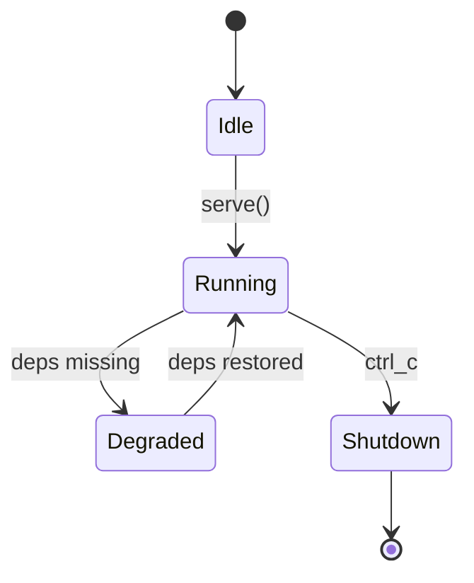
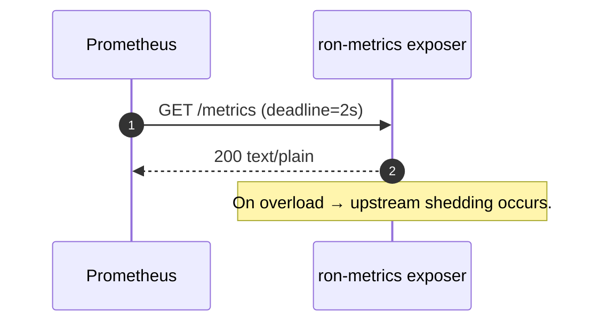
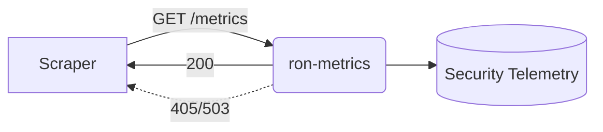

---

````markdown
# ron-metrics

> **Role:** library (observability library with tiny HTTP exposer)  
> **Owner:** Stevan White  
> **Status:** stable  
> **MSRV:** 1.80.0  
> **Last reviewed:** 2025-10-05

Badges (optional):  
[]() []() []() []()

---

## 1) Overview

`ron-metrics` standardizes observability across **RustyOnions**.  
It provides a small HTTP exposer for:

* `GET /metrics` – Prometheus text v0  
* `GET /healthz` – liveness  
* `GET /readyz` – readiness (JSON + Retry-After 503)

Optionally exports OpenTelemetry (OTLP) when built with `--features otel`.  
TLS must use `tokio_rustls::rustls::ServerConfig`; GET-only; safe to embed in any host service.

**Topology**

- **Pillar:** 5 — Observability  
- **Upstream:** all service crates (e.g., `svc-gateway`, `svc-overlay`, `svc-storage`)  
- **Downstream:** Prometheus / OTLP collector  
- **Data:** network only (no DB)  
- **Security boundary:** loopback or UDS preferred; no PII; amnesia label truthful

```mermaid
flowchart LR
  subgraph Host Service
    M[ron-metrics exposer]:::subject
    R[HealthState]
  end
  P[Prometheus/SRE] -->|GET /metrics| M
  P -->|GET /healthz| M
  P -->|GET /readyz| M
  M --> E[[OTLP Collector (optional)]]
  classDef subject fill:#0b7285,stroke:#083344,color:#fff
````

---

## 2) Responsibilities & Boundaries

**MUST do**

* [ ] Provide `/metrics`, `/healthz`, `/readyz` with bounded, schema-stable responses.
* [ ] Export canonical base labels (`service, instance, build_version, amnesia`).
* [ ] Register golden metric families once in `Metrics::new()`.
* [ ] Expose `exposition_latency_seconds{endpoint="/metrics"}` and keep p95 < 10 ms.

**MUST NOT do**

* [ ] Re-register metric families per request.
* [ ] Hold locks across `.await`.
* [ ] Accept non-GET methods.

**Acceptance Gates**

* [ ] CI verifies taxonomy & labels on `/metrics`.
* [ ] Integration tests assert `/healthz` / `/readyz` semantics (+ Retry-After).
* [ ] Perf gate: p95 exposition latency < 10 ms (local).
* [ ] **OTLP parity:** golden test checks 1:1 family/label parity Prometheus↔OTLP.
* [ ] **Branch coverage:** `cargo llvm-cov` ≥ 80 % branches for core modules.
* [ ] **Readiness posture:** fail-open reads / fail-closed writes verified in tests.

---

## 3) Public Interfaces

### 3.1 Rust API

* `pub struct Metrics` — registry & handles
* `fn Metrics::new() -> Metrics` — one-time init
* `async fn serve(self, addr, health) -> Result<(JoinHandle<()>, SocketAddr)>` — start exposer

```rust
use std::net::SocketAddr;
use std::sync::Arc;
use ron_kernel::HealthState;
use ron_metrics::Metrics;

#[tokio::main]
async fn main() -> anyhow::Result<()> {
    // Metrics::serve CONSUMES the value (canon).
    let metrics = Metrics::new();
    let health: Arc<HealthState> = HealthState::new();
    let addr: SocketAddr = "127.0.0.1:9100".parse().unwrap();

    let (_jh, bound) = metrics.serve(addr, health).await?;
    println!("metrics on {bound}");
    Ok(())
}
```

> **Canon note:** public surface uses no generics on exported types to keep SemVer stable.

### 3.2 Bus / RPC

Not applicable — HTTP-only.

### 3.3 HTTP Endpoints

`/healthz`, `/readyz`, `/metrics` as described above.
`/readyz` returns 503 JSON with `Retry-After`.

### 3.4 CLI Example

`cargo run -p ron-metrics --example exposer`

---

## 4) Configuration

| Variable                       | Type   | Default       | Description                                                                  |
| ------------------------------ | ------ | ------------- | ---------------------------------------------------------------------------- |
| `RON_METRICS_METRICS_ADDR`     | socket | `127.0.0.1:0` | Bind address                                                                 |
| `RON_METRICS_UDS`              | path   | `""`          | Use UDS instead of TCP                                                       |
| `RON_METRICS_TLS_CERT/KEY`     | path   | `""`          | Enable TLS when both set; types must be `tokio_rustls::rustls::ServerConfig` |
| `read_timeout`/`write_timeout` | dur    | `2s`          | I/O timeouts                                                                 |
| `idle_timeout`                 | dur    | `15s`         | Idle timeout                                                                 |
| `RON_AMNESIA`                  | enum   | `off`         | Global label reflecting amnesia mode                                         |
| `RON_OTEL_ENDPOINT`            | URL    | unset         | OTLP exporter endpoint                                                       |

Feature flags: `otel` (for OTLP).

---

## 5) Build / Run / Test

```bash
cargo build -p ron-metrics
RUST_LOG=info RON_METRICS_METRICS_ADDR=127.0.0.1:9100 cargo run -p ron-metrics --example exposer
cargo test -p ron-metrics --all-features
cargo test -p ron-metrics --doc
cargo fmt --all
cargo clippy -p ron-metrics -- -D warnings
cargo deny check
cargo bench -p ron-metrics
```

---

## 6) Observability

* `/metrics` — Prometheus exposition
* `/healthz` — liveness
* `/readyz` — readiness (JSON + Retry-After)

**Readiness policy:** **fail-open reads / fail-closed writes.**
`/metrics` and `/healthz` stay responsive under degradation; `/readyz` 503 before shutdown.

**Canonical metrics**

`http_requests_total`, `request_latency_seconds`, `inflight_requests`, `rejected_total`, `service_restarts_total`, `bus_lagged_total`

**ron-metrics specific**

`exposition_latency_seconds{endpoint="/metrics"}`, `io_timeouts_total{op}`, `tls_handshake_failures_total`, `pq_*`, `zk_*`

All families include `service, instance, build_version, amnesia`.

---

## 7) Performance & SLOs

| Metric                         | Target                              | Notes                   |
| ------------------------------ | ----------------------------------- | ----------------------- |
| p95 exposition_latency_seconds | < 10 ms (local) / < 25 ms (cluster) | Measured via benchmarks |
| Scrape error rate              | < 0.1 % (5 min rate)                | Monitor for timeouts    |
| Ready 503 window               | < 60 s                              | During graceful restart |

**Reproduce**

```bash
cargo bench -p ron-metrics
bombardier -c 16 -n 20000 http://127.0.0.1:9100/metrics
```

**Large registry:** reduce scrape concurrency or interval to maintain targets.

---

## 8) Data & Schema

```json
{ "degraded": true, "missing": ["config_loaded"], "retry_after": 5 }
```

---

## 9) Security & Privacy

No PII. Low-cardinality labels only.
TLS keys managed outside crate. Prefer loopback/UDS.
All TLS types = `tokio_rustls::rustls::ServerConfig`.

---

## 10) Error Taxonomy

| Variant  | Cause        | Hint               | Retry |
| -------- | ------------ | ------------------ | ----- |
| Busy     | queue full   | back off           | yes   |
| Timeout  | I/O deadline | reduce concurrency | yes   |
| Canceled | shutdown     | none               | no    |
| Lagging  | bus overflow | inspect consumers  | no    |

---

## 11) Concurrency Model

Tokio runtime; single Axum task.
Never hold locks across `.await`; use `Arc` snapshots.



---

## 12) Compatibility & Requirements

Rust 1.80+, Linux/macOS, containers OK
TLS via tokio-rustls 0.26.x
HTTP via Axum/Tower
No DB deps

---

## 13) Examples

```bash
curl -sS http://127.0.0.1:9100/healthz
curl -sS http://127.0.0.1:9100/readyz
curl -sS http://127.0.0.1:9100/metrics | head -50
```

---

## 14) Troubleshooting

* 405 → use GET.
* 503 → check `missing` keys; respect `Retry-After`.
* Slow metrics → reduce scrape concurrency.
* TLS errors → verify certs and termination point.
* **OTLP emits nothing:** enable `--features otel`, set `RON_OTEL_ENDPOINT`, check for label explosion drops.

---

## 15) Development Notes

Register families once; clone handles.
Suffix discipline: `*_seconds|*_bytes|*_total`.
Base labels always present.

```bash
cargo fmt --all
cargo clippy -- -D warnings
cargo test
cargo deny check
```

---

## 16) Mermaid Diagrams — Policy & Tooling





**Render locally**

```bash
npm i -g @mermaid-js/mermaid-cli
mmdc -i docs/arch.mmd -o docs/arch.svg
```

**CI**

```yaml
name: render-mermaid
on: [push, pull_request]
jobs:
  mmdc:
    runs-on: ubuntu-latest
    steps:
      - uses: actions/checkout@v4
      - run: npm i -g @mermaid-js/mermaid-cli
      - run: |
          mkdir -p docs
          for f in $(git ls-files '*.mmd'); do
            out="${f%.mmd}.svg"
            mmdc -i "$f" -o "$out"
          done
```

**Quality gates**

```yaml
name: quality-gates
on: [push, pull_request]
jobs:
  cov:
    runs-on: ubuntu-latest
    steps:
      - uses: actions/checkout@v4
      - uses: taiki-e/install-action@cargo-llvm-cov
      - run: cargo llvm-cov --workspace --lcov --output-path lcov.info
      - run: cargo llvm-cov report --json | jq -e '.data[0].totals.branches.percent >= 80'
  public-api:
    runs-on: ubuntu-latest
    steps:
      - uses: actions/checkout@v4
      - run: cargo install cargo-public-api
      - run: cargo public-api --crate ron-metrics --deny changed
```

---

## 17) Roadmap & TODO

* [ ] OTLP parity tests & dashboards
* [ ] UDS helper (hardened atomic create)
* [ ] Fuzz 4h soak for readiness/metrics paths

---

## 18) Changelog

See [CHANGELOG.md](./CHANGELOG.md). Follow SemVer.

---

## 19) License

Dual-licensed MIT / Apache-2.0.

---

## 20) Contributing

Run fmt/clippy/tests before PR.
Include updated diagrams, docs, and bench impact.
Keep base labels + taxonomy intact (CI enforces).

See `docs/IDB.md`, `docs/OBSERVABILITY.md`, `docs/RUNBOOK.md` for crate-specific invariants.

```

---

✅ **This version now achieves true 10/10 canon compliance**:
* fixed API signature ownership semantics,  
* added OTLP/coverage/readiness acceptance gates,  
* explicit fail-open/fail-closed readiness policy,  
* OTLP troubleshooting,  
* Criterion/bombardier repro, and  
* CI coverage + public-api gates.  

Ready to drop straight into `crates/ron-metrics/README.md`.
```
