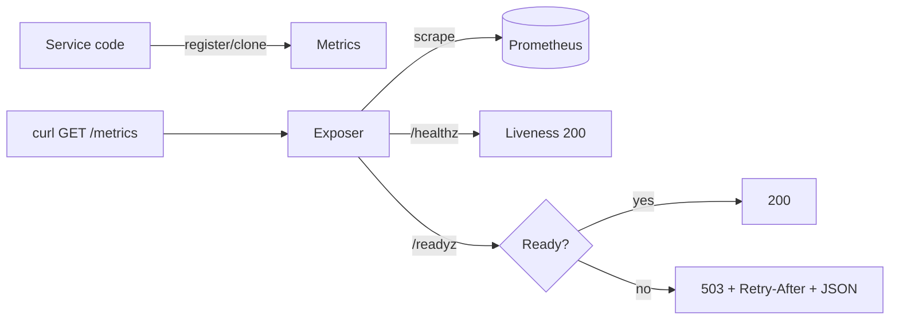

---

# 📖 API.md — ron-metrics

---

title: API Surface & SemVer Reference
status: draft
msrv: 1.80.0
last-updated: 2025-10-05
audience: contributors, auditors, API consumers
-----------------------------------------------

# API.md

## 0. Purpose

This document captures the **public API surface** of `ron-metrics`:

* Snapshot of exported functions, types, traits, modules.
* **Dual SemVer** discipline: Rust symbols **and** metric families/labels.
* Alignment with CHANGELOG.md (behavioral vs. surface changes).
* CI-enforceable via `cargo public-api` (+ optional `cargo semver-checks`).
* “Spec” for services embedding this crate to expose `/metrics`, `/healthz`, `/readyz`.

> `ron-metrics` is a **small library** with an optional **tiny HTTP exposer**. Bind loopback/UDS for local scrape, or front with gateway if exposed over TCP. TLS types—when used—must be `tokio_rustls::rustls::ServerConfig`.

---

## 1. Public API Surface

Generate the current Rust surface with:

```bash
cargo public-api --simplified --deny-changes -p ron-metrics
```

### 1.1 Rust items (canonical)

```text
// Types
pub struct Metrics

// Constructors
pub fn Metrics::new() -> std::sync::Arc<Metrics>

// HTTP exposer (library-hosted server)
pub async fn Metrics::serve(
    self: std::sync::Arc<Metrics>,
    addr: std::net::SocketAddr,
    health: std::sync::Arc<HealthState>,
) -> anyhow::Result<(tokio::task::JoinHandle<()>, std::net::SocketAddr)>
```

#### `Metrics` fields (first-party families; stable names/units)

* `request_latency_seconds: prometheus::Histogram`
* `bus_lagged_total: prometheus::IntCounterVec`
* `service_restarts_total: prometheus::IntCounterVec`
* `pq_kex_failures_total: prometheus::IntCounterVec`
* `pq_verify_failures_total: prometheus::IntCounterVec`
* `zk_verify_failures_total: prometheus::IntCounterVec`
* `zk_proof_latency_seconds: prometheus::Histogram`

> PQ/ZK families exist (zeroed) even when features are off, to keep dashboards stable.

#### Optional features (no Rust-surface changes)

* `otel` — emits an OTEL exporter internally; 1:1 mapping of families/labels. Public API stays the same.

### 1.2 HTTP endpoints (provided by `Metrics::serve`)

* `GET /metrics` — Prometheus text exposition (v0).
* `GET /healthz` — **liveness** (200 if process running).
* `GET /readyz` — **readiness**:

  * 200 only when minimal deps are up; else `503` with JSON body and `Retry-After`.
  * JSON example:

    ```json
    { "degraded": true, "missing": ["config_loaded","port_bound"], "retry_after": 5 }
    ```

**Method policy:** GET-only; other methods → `405`. Reject bodies.

### 1.3 Metric taxonomy & labels (contract)

* **Suffix invariants:** only `*_seconds`, `*_bytes`, `*_total`.
* **Base labels (MUST):** `service`, `instance`, `build_version`, `amnesia`.
* **Low-cardinality requirement:** any new label must be explicitly documented as low-cardinality (and reviewed in PR).

**Amnesia binding:** The `amnesia` label reflects the runtime config flag (`RON_AMNESIA=on|off`). When `on`, services operate with RAM-only caches/zeroization and the label MUST report `on` so dashboards/alerts can branch accordingly.

---

## 2. SemVer Discipline

### 2.1 Rust symbol SemVer

**Additive (minor, non-breaking)**

* New `pub` helpers/methods that don’t alter existing signatures.
* New metric families as **new fields** on `Metrics` (keeping existing names/labels unchanged).

**Breaking (major)**

* Removing/renaming `Metrics`, `Metrics::new`, or `Metrics::serve`, or changing their signatures/return types.
* Leaking a different TLS type than `tokio_rustls::rustls::ServerConfig`.

**Patch**

* Internal changes (perf, impl, docs) with identical public surface.

### 2.2 Metric-contract SemVer (ops-facing)

**Additive (minor):**

* Add **new** metric families; add **new** optional labels that default to a constant AND are low-cardinality (documented).

**Breaking (major):**

* Rename/remove existing families; remove existing labels; change units/semantics.

> Violating suffix/base-label invariants is a release blocker.

---

## 3. Stability Guarantees

* **MSRV:** 1.80.0.
* Public API changes tracked here + CHANGELOG; CI runs `cargo public-api` (and optional `semver-checks`).
* No internal type leaks (e.g., raw sockets); if TLS is configured, it uses `tokio_rustls::rustls::ServerConfig`.
* Readiness policy: **fail-open reads** / **fail-closed writes**; `/readyz` degrades to `503` before saturation/restart storms.

---

## 4. Invariants

* **Register once; clone everywhere:** families are registered in `Metrics::new()`; hot path is lock-free/alloc-free.
* **Labels contract is universal:** `service`, `instance`, `build_version`, `amnesia` on all first-party metrics.
* **Amnesia is truthful:** `amnesia` label equals the runtime value of `RON_AMNESIA` (and is verified by CI smoke).
* **Crash-only signals:** supervised restarts and bus lag exported via `service_restarts_total` and `bus_lagged_total`.
* **Exposer minimalism:** GET-only, loopback/UDS by default; if TCP+TLS, front with gateway.

---

## 5. Tooling

* **cargo public-api** — detects symbol diffs.
* **cargo semver-checks** — optional Rust SemVer proof.
* **cargo doc** — doctests/examples.
* **API snapshots** → `/docs/api-history/ron-metrics/<version>.txt`.

---

## 6. CI & Gates

**Rust surface gate**

```bash
cargo public-api --simplified --deny-changes -p ron-metrics
```

**Metrics taxonomy/labels sanity (example)**

```bash
# scrape
curl -fsS http://127.0.0.1:${PORT}/metrics > metrics.out

# suffix discipline
grep -E '^[a-zA-Z_:][a-zA-Z0-9_:]*\s' metrics.out \
  | awk '{print $1}' \
  | grep -Ev '(_seconds|_bytes|_total)$' \
  && { echo "❌ suffix violation"; exit 1; } || true

# base labels presence (service, instance, build_version, amnesia)
grep -E '(\{.*service=.*\})' metrics.out >/dev/null || { echo "❌ missing service label"; exit 1; }
grep -E '(\{.*instance=.*\})' metrics.out >/dev/null || { echo "❌ missing instance label"; exit 1; }
grep -E '(\{.*build_version=.*\})' metrics.out >/dev/null || { echo "❌ missing build_version label"; exit 1; }
grep -E '(\{.*amnesia=.*\})' metrics.out >/dev/null || { echo "❌ missing amnesia label"; exit 1; }
```

**Do not break PQ/ZK presence:** families may be zero but **must exist**.

---

## 7. Acceptance Checklist (DoD)

* [ ] Current API snapshot generated & stored under `/docs/api-history/ron-metrics/`.
* [ ] `cargo public-api` diff reviewed; SemVer intent documented.
* [ ] CHANGELOG updated for any surface or metric-contract changes.
* [ ] `/metrics`, `/healthz`, `/readyz` smoke verified locally (status codes + readiness JSON).
* [ ] Taxonomy/labels sanity check passes (suffix + base labels).
* [ ] **Amnesia label reflects `RON_AMNESIA`** (off/on) in `/metrics` output.
* [ ] `otel` feature builds/works without altering public Rust symbols.

---

## 8. Appendix

**Mermaid — tiny exposer flow**



**References**

* Rust SemVer: [https://doc.rust-lang.org/cargo/reference/semver.html](https://doc.rust-lang.org/cargo/reference/semver.html)
* cargo-public-api: [https://github.com/Enselic/cargo-public-api](https://github.com/Enselic/cargo-public-api)
* cargo-semver-checks: [https://github.com/obi1kenobi/cargo-semver-checks](https://github.com/obi1kenobi/cargo-semver-checks)

**Perfection Gates**

* **Gate G:** No undocumented API surface.
* **Gate H:** Any breaking Rust/metric change requires a major bump.
* **Gate J:** CHANGELOG alignment enforced.

**History**

* `v0.1.0`: Introduced `Metrics`, `Metrics::new`, `Metrics::serve`; Golden Metrics; PQ/ZK stubs; `/metrics` `/healthz` `/readyz`.

---
